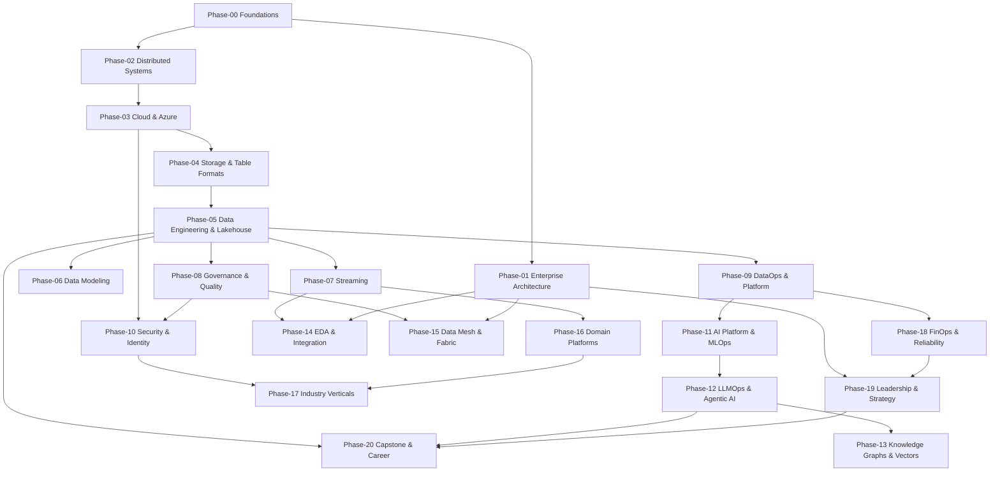

# Dependency Graph & Prerequisites

This graph shows the recommended learning order. Arrows mean "should be understood before".
Within a phase, chapters are ordered; cross-phase prerequisites are called out per chapter
inside each prompt file and summarized in the table below.

## Phase-level dependency graph

## Reading principles
- **Foundations first:** Phase-00 unlocks everything. Do not skip it.
- **Azure spine:** Phase-03 -> Phase-04 -> Phase-05 is the backbone for all data work.
- **AI track:** Phase-11 -> Phase-12 -> Phase-13 build on ML foundations and streaming/governance.
- **Leadership track:** Phase-01 and Phase-19 can be read in parallel with technical phases.
- **Capstones last:** Phase-20 integrates prior phases; attempt after the relevant tracks.

## Chapter-level prerequisites
| Chapter (prompt) | Prerequisites |
|------------------|---------------|
| Phase-00/01_Introduction_and_How_To_Use_This_Handbook | None. |
| Phase-00/02_Computer_Science_Fundamentals | Read [Introduction](01_Introduction.prompt.md) first. |
| Phase-00/03_Operating_Systems_for_Data_Engineers | Depends on Phase-00/[Computer Science Fundamentals](02_Computer_Science_Fundamentals.prompt.md). |
| Phase-00/04_Networking_Fundamentals | Depends on Phase-00/[Operating Systems](03_Operating_Systems.prompt.md). |
| Phase-00/05_Storage_Systems_Fundamentals | Depends on Phase-00/[Operating Systems](03_Operating_Systems.prompt.md). |
| Phase-00/06_Concurrency_and_Parallelism | Depends on Phase-00/[Operating Systems](03_Operating_Systems.prompt.md). |
| Phase-00/07_Data_Structures_and_Algorithms_for_Data_Engineering | Depends on Phase-00/[Computer Science Fundamentals](02_Computer_Science_Fundamentals.prompt.md). |
| Phase-00/08_Distributed_Systems_Primer | Depends on Phase-00/[Networking Fundamentals](04_Networking_Fundamentals.prompt.md) and [Concurrency and Parallelism](06_Concurrency_and_Parallelism.prompt.md). |
| Phase-01/01_Enterprise_Architecture_Foundations | Depends on Phase-00/[Distributed Systems Primer](../Phase-00/08_Distributed_Systems_Primer.prompt.md). |
| Phase-01/02_Architecture_Governance | Depends on Phase-01/[Enterprise Architecture Foundations](01_Enterprise_Architecture_Foundations.prompt.md). |
| Phase-01/03_Architecture_Decision_Records | Depends on Phase-01/[Architecture Governance](02_Architecture_Governance.prompt.md). |
| Phase-01/04_Solution_Architecture_Practice | Depends on Phase-01/[Enterprise Architecture Foundations](01_Enterprise_Architecture_Foundations.prompt.md). |
| Phase-01/05_Domain_Driven_Design | Depends on Phase-01/[Solution Architecture Practice](04_Solution_Architecture_Practice.prompt.md). |
| Phase-01/06_Business_Capability_Modeling | Depends on Phase-01/[Enterprise Architecture Foundations](01_Enterprise_Architecture_Foundations.prompt.md). |
| Phase-01/07_Technical_Strategy_and_Roadmaps | Depends on Phase-01/[Business Capability Modeling](06_Business_Capability_Modeling.prompt.md). |
| Phase-02/01_Consensus_and_Coordination | Depends on Phase-00/[Distributed Systems Primer](../Phase-00/08_Distributed_Systems_Primer.prompt.md). |
| Phase-02/02_Replication_and_Consistency | Depends on Phase-02/[Consensus and Coordination](01_Consensus_and_Coordination.prompt.md). |
| Phase-02/03_Partitioning_and_Sharding | Depends on Phase-02/[Replication and Consistency](02_Replication_and_Consistency.prompt.md). |
| Phase-02/04_CAP_and_PACELC | Depends on Phase-02/[Replication and Consistency](02_Replication_and_Consistency.prompt.md). |
| Phase-02/05_Distributed_Transactions | Depends on Phase-02/[CAP and PACELC](04_CAP_and_PACELC.prompt.md). |
| Phase-02/06_Time_Clocks_and_Ordering | Depends on Phase-02/[Distributed Transactions](05_Distributed_Transactions.prompt.md). |
| Phase-02/07_Fault_Tolerance_and_Resilience | Depends on Phase-02/[Consensus and Coordination](01_Consensus_and_Coordination.prompt.md). |
| Phase-02/08_Distributed_Systems_Case_Studies | Depends on all prior Phase-02 chapters. |
| Phase-03/01_Cloud_Architecture_Fundamentals | Depends on Phase-02/[Distributed Systems Case Studies](../Phase-02/08_Distributed_Systems_Case_Studies.prompt.md). |
| Phase-03/02_Azure_Core_Architecture | Depends on Phase-03/[Cloud Architecture Fundamentals](01_Cloud_Architecture_Fundamentals.prompt.md). |
| Phase-03/03_Azure_Landing_Zones | Depends on Phase-03/[Azure Core Architecture](02_Azure_Core_Architecture.prompt.md). |
| Phase-03/04_Azure_Networking | Depends on Phase-03/[Azure Landing Zones](03_Azure_Landing_Zones.prompt.md) and Phase-00/[Networking Fundamentals](../Phase-00/04_Networking_Fundamentals.prompt.md). |
| Phase-03/05_Azure_Compute_and_Containers | Depends on Phase-03/[Azure Core Architecture](02_Azure_Core_Architecture.prompt.md). |
| Phase-03/06_Azure_Storage_Services | Depends on Phase-00/[Storage Systems Fundamentals](../Phase-00/05_Storage_Systems_Fundamentals.prompt.md). |
| Phase-03/07_Azure_Well_Architected_Framework | Depends on Phase-03/[Azure Core Architecture](02_Azure_Core_Architecture.prompt.md). |
| Phase-03/08_Multi_Cloud_and_Hybrid_Architecture | Depends on Phase-03/[Azure Landing Zones](03_Azure_Landing_Zones.prompt.md). |
| Phase-04/01_File_Formats_Parquet_ORC_Avro | Depends on Phase-00/[Storage Systems Fundamentals](../Phase-00/05_Storage_Systems_Fundamentals.prompt.md). |
| Phase-04/02_Columnar_Storage_Internals | Depends on Phase-04/[File Formats](01_File_Formats.prompt.md). |
| Phase-04/03_Object_Storage_and_Data_Lakes | Depends on Phase-03/[Azure Storage Services](../Phase-03/06_Azure_Storage_Services.prompt.md). |
| Phase-04/04_Delta_Lake | Depends on Phase-04/[Object Storage and Data Lakes](03_Object_Storage_and_Data_Lakes.prompt.md). |
| Phase-04/05_Apache_Iceberg | Depends on Phase-04/[Delta Lake](04_Delta_Lake.prompt.md). |
| Phase-04/06_Apache_Hudi | Depends on Phase-04/[Delta Lake](04_Delta_Lake.prompt.md). |
| Phase-04/07_Table_Format_Comparison_and_Selection | Depends on Phase-04/[Delta Lake](04_Delta_Lake.prompt.md), [Apache Iceberg](05_Apache_Iceberg.prompt.md), and [Apache Hudi](06_Apache_Hudi.prompt.md). |
| Phase-04/08_Compression_and_Encoding_Strategies | Depends on Phase-04/[Columnar Storage Internals](02_Columnar_Storage_Internals.prompt.md). |
| Phase-05/01_Modern_Data_Stack_Overview | Depends on Phase-04/[Table Format Comparison](../Phase-04/07_Table_Format_Comparison.prompt.md). |
| Phase-05/02_Lakehouse_Architecture | Depends on Phase-05/[Modern Data Stack Overview](01_Modern_Data_Stack_Overview.prompt.md) and Phase-04/[Delta Lake](../Phase-04/04_Delta_Lake.prompt.md). |
| Phase-05/03_Medallion_Architecture | Depends on Phase-05/[Lakehouse Architecture](02_Lakehouse_Architecture.prompt.md). |
| Phase-05/04_Apache_Spark_Internals | Depends on Phase-00/[Concurrency and Parallelism](../Phase-00/06_Concurrency_and_Parallelism.prompt.md). |
| Phase-05/05_Databricks_Platform | Depends on Phase-05/[Apache Spark Internals](04_Apache_Spark_Internals.prompt.md). |
| Phase-05/06_Azure_Data_Factory_and_Synapse | Depends on Phase-05/[Medallion Architecture](03_Medallion_Architecture.prompt.md). |
| Phase-05/07_Microsoft_Fabric | Depends on Phase-05/[Lakehouse Architecture](02_Lakehouse_Architecture.prompt.md). |
| Phase-05/08_dbt_and_Analytics_Engineering | Depends on Phase-05/[Medallion Architecture](03_Medallion_Architecture.prompt.md). |
| Phase-05/09_Batch_Pipeline_Design | Depends on Phase-05/[Azure Data Factory and Synapse](06_Azure_Data_Factory_and_Synapse.prompt.md). |
| Phase-06/01_Dimensional_Modeling | Depends on Phase-05/[Batch Pipeline Design](../Phase-05/09_Batch_Pipeline_Design.prompt.md). |
| Phase-06/02_Data_Vault_2_0 | Depends on Phase-06/[Dimensional Modeling](01_Dimensional_Modeling.prompt.md). |
| Phase-06/03_Normalization_and_OLTP_Modeling | Depends on Phase-06/[Dimensional Modeling](01_Dimensional_Modeling.prompt.md). |
| Phase-06/04_OLAP_and_Cube_Modeling | Depends on Phase-06/[Dimensional Modeling](01_Dimensional_Modeling.prompt.md). |
| Phase-06/05_Slowly_Changing_Dimensions | Depends on Phase-06/[Dimensional Modeling](01_Dimensional_Modeling.prompt.md). |
| Phase-06/06_Semantic_Layer_and_Metrics | Depends on Phase-06/[OLAP and Cubes](04_OLAP_and_Cubes.prompt.md). |
| Phase-06/07_Data_Warehouse_Architecture | Depends on Phase-06/[Dimensional Modeling](01_Dimensional_Modeling.prompt.md) and Phase-06/[Data Vault](02_Data_Vault.prompt.md). |
| Phase-07/01_Streaming_Fundamentals | Depends on Phase-02/[Time, Clocks and Ordering](../Phase-02/06_Time_Clocks_and_Ordering.prompt.md). |
| Phase-07/02_Apache_Kafka | Depends on Phase-07/[Streaming Fundamentals](01_Streaming_Fundamentals.prompt.md) and Phase-02/[Replication and Consistency](../Phase-02/02_Replication_and_Consistency.prompt.md). |
| Phase-07/03_Azure_Event_Hubs_and_Stream_Analytics | Depends on Phase-07/[Apache Kafka](02_Apache_Kafka.prompt.md). |
| Phase-07/04_Apache_Flink | Depends on Phase-07/[Streaming Fundamentals](01_Streaming_Fundamentals.prompt.md). |
| Phase-07/05_Spark_Structured_Streaming | Depends on Phase-05/[Apache Spark Internals](../Phase-05/04_Apache_Spark_Internals.prompt.md) and Phase-07/[Streaming Fundamentals](01_Streaming_Fundamentals.prompt.md). |
| Phase-07/06_Change_Data_Capture | Depends on Phase-07/[Apache Kafka](02_Apache_Kafka.prompt.md). |
| Phase-07/07_Real_Time_Analytics_ClickHouse_and_Druid | Depends on Phase-07/[Streaming Fundamentals](01_Streaming_Fundamentals.prompt.md). |
| Phase-07/08_Streaming_Patterns_and_Delivery_Semantics | Depends on all prior Phase-07 chapters. |
| Phase-08/01_Data_Governance_Foundations | Depends on Phase-01/[Architecture Governance](../Phase-01/02_Architecture_Governance.prompt.md). |
| Phase-08/02_Data_Catalog_and_Lineage | Depends on Phase-08/[Data Governance Foundations](01_Data_Governance_Foundations.prompt.md). |
| Phase-08/03_Data_Quality_with_Great_Expectations | Depends on Phase-05/[Batch Pipeline Design](../Phase-05/09_Batch_Pipeline_Design.prompt.md). |
| Phase-08/04_Metadata_Management_OpenMetadata_and_Atlas | Depends on Phase-08/[Data Catalog and Lineage](02_Data_Catalog_and_Lineage.prompt.md). |
| Phase-08/05_Master_Data_Management | Depends on Phase-08/[Data Governance Foundations](01_Data_Governance_Foundations.prompt.md). |
| Phase-08/06_Microsoft_Purview | Depends on Phase-08/[Data Catalog and Lineage](02_Data_Catalog_and_Lineage.prompt.md). |
| Phase-08/07_Data_Contracts | Depends on Phase-08/[Data Quality](03_Data_Quality.prompt.md). |
| Phase-09/01_DataOps_Foundations | Depends on Phase-05/[Batch Pipeline Design](../Phase-05/09_Batch_Pipeline_Design.prompt.md). |
| Phase-09/02_Platform_Engineering | Depends on Phase-09/[DataOps Foundations](01_DataOps_Foundations.prompt.md). |
| Phase-09/03_DevOps_and_CI_CD | Depends on Phase-09/[DataOps Foundations](01_DataOps_Foundations.prompt.md). |
| Phase-09/04_Infrastructure_as_Code_with_Terraform | Depends on Phase-03/[Azure Landing Zones](../Phase-03/03_Azure_Landing_Zones.prompt.md). |
| Phase-09/05_Containers_with_Docker | Depends on Phase-00/[Operating Systems](../Phase-00/03_Operating_Systems.prompt.md). |
| Phase-09/06_Kubernetes | Depends on Phase-09/[Containers Docker](05_Containers_Docker.prompt.md). |
| Phase-09/07_Orchestration_with_Airflow | Depends on Phase-05/[Batch Pipeline Design](../Phase-05/09_Batch_Pipeline_Design.prompt.md). |
| Phase-09/08_GitOps_and_Environment_Management | Depends on Phase-09/[Infrastructure as Code](04_Infrastructure_as_Code.prompt.md) and [Kubernetes](06_Kubernetes.prompt.md). |
| Phase-10/01_Security_Foundations | Depends on Phase-00/[Networking Fundamentals](../Phase-00/04_Networking_Fundamentals.prompt.md). |
| Phase-10/02_Identity_and_Access_Management_with_Entra | Depends on Phase-10/[Security Foundations](01_Security_Foundations.prompt.md). |
| Phase-10/03_Data_Security_and_Encryption | Depends on Phase-10/[Identity and Access Management](02_Identity_and_Access_Management.prompt.md). |
| Phase-10/04_Network_Security_and_Zero_Trust | Depends on Phase-03/[Azure Networking](../Phase-03/04_Azure_Networking.prompt.md). |
| Phase-10/05_Secrets_and_Key_Management | Depends on Phase-10/[Data Security and Encryption](03_Data_Security_and_Encryption.prompt.md). |
| Phase-10/06_Compliance_and_Regulatory_Frameworks | Depends on Phase-08/[Data Governance Foundations](../Phase-08/01_Data_Governance_Foundations.prompt.md). |
| Phase-10/07_Data_Privacy_and_PII_Protection | Depends on Phase-10/[Compliance and Regulatory](06_Compliance_and_Regulatory.prompt.md). |
| Phase-11/01_Machine_Learning_Foundations | Depends on Phase-00/[Data Structures and Algorithms](../Phase-00/07_Data_Structures_and_Algorithms.prompt.md). |
| Phase-11/02_Feature_Stores_with_Feast | Depends on Phase-11/[Machine Learning Foundations](01_Machine_Learning_Foundations.prompt.md). |
| Phase-11/03_MLOps_and_MLflow | Depends on Phase-09/[DevOps and CICD](../Phase-09/03_DevOps_and_CICD.prompt.md) and Phase-11/[Machine Learning Foundations](01_Machine_Learning_Foundations.prompt.md). |
| Phase-11/04_Model_Serving_and_Ray | Depends on Phase-11/[MLOps and MLflow](03_MLOps_and_MLflow.prompt.md). |
| Phase-11/05_Azure_Machine_Learning | Depends on Phase-11/[MLOps and MLflow](03_MLOps_and_MLflow.prompt.md). |
| Phase-11/06_ML_Pipeline_Architecture | Depends on Phase-11/[Feature Stores](02_Feature_Stores.prompt.md) and [MLOps and MLflow](03_MLOps_and_MLflow.prompt.md). |
| Phase-11/07_Responsible_AI | Depends on Phase-11/[Azure Machine Learning](05_Azure_Machine_Learning.prompt.md). |
| Phase-12/01_Large_Language_Model_Foundations | Depends on Phase-11/[Machine Learning Foundations](../Phase-11/01_Machine_Learning_Foundations.prompt.md). |
| Phase-12/02_Prompt_Engineering | Depends on Phase-12/[LLM Foundations](01_LLM_Foundations.prompt.md). |
| Phase-12/03_Retrieval_Augmented_Generation | Depends on Phase-12/[Prompt Engineering](02_Prompt_Engineering.prompt.md). |
| Phase-12/04_LLMOps | Depends on Phase-12/[Retrieval Augmented Generation](03_Retrieval_Augmented_Generation.prompt.md) and Phase-11/[MLOps and MLflow](../Phase-11/03_MLOps_and_MLflow.prompt.md). |
| Phase-12/05_Agentic_AI_Architecture | Depends on Phase-12/[LLMOps](04_LLMOps.prompt.md). |
| Phase-12/06_Model_Context_Protocol_MCP_ | Depends on Phase-12/[Agentic AI Architecture](05_Agentic_AI_Architecture.prompt.md). |
| Phase-12/07_Azure_OpenAI_and_AI_Foundry | Depends on Phase-12/[LLMOps](04_LLMOps.prompt.md). |
| Phase-12/08_LangChain_and_LlamaIndex | Depends on Phase-12/[Retrieval Augmented Generation](03_Retrieval_Augmented_Generation.prompt.md). |
| Phase-12/09_Evaluation_and_Guardrails | Depends on Phase-12/[LLMOps](04_LLMOps.prompt.md). |
| Phase-13/01_Vector_Databases_Qdrant_and_Milvus | Depends on Phase-12/[Retrieval Augmented Generation](../Phase-12/03_Retrieval_Augmented_Generation.prompt.md). |
| Phase-13/02_Knowledge_Graphs_with_Neo4j | Depends on Phase-06/[Data Modeling](../Phase-06/01_Dimensional_Modeling.prompt.md). |
| Phase-13/03_Embeddings_and_Semantic_Search | Depends on Phase-13/[Vector Databases](01_Vector_Databases.prompt.md). |
| Phase-13/04_GraphRAG | Depends on Phase-13/[Knowledge Graphs](02_Knowledge_Graphs.prompt.md) and [Embeddings and Semantic Search](03_Embeddings_and_Semantic_Search.prompt.md). |
| Phase-13/05_Ontologies_and_Taxonomies | Depends on Phase-13/[Knowledge Graphs](02_Knowledge_Graphs.prompt.md). |
| Phase-14/01_Event_Driven_Architecture | Depends on Phase-07/[Apache Kafka](../Phase-07/02_Apache_Kafka.prompt.md). |
| Phase-14/02_Microservices_Architecture | Depends on Phase-01/[Domain Driven Design](../Phase-01/05_Domain_Driven_Design.prompt.md). |
| Phase-14/03_CQRS | Depends on Phase-14/[Microservices Architecture](02_Microservices_Architecture.prompt.md). |
| Phase-14/04_Event_Sourcing | Depends on Phase-14/[CQRS](03_CQRS.prompt.md). |
| Phase-14/05_API_Design_REST_GraphQL_gRPC | Depends on Phase-00/[Networking Fundamentals](../Phase-00/04_Networking_Fundamentals.prompt.md). |
| Phase-14/06_Enterprise_Integration_Patterns | Depends on Phase-14/[Event-Driven Architecture](01_Event_Driven_Architecture.prompt.md). |
| Phase-14/07_Message_Brokers_and_Queues | Depends on Phase-14/[Event-Driven Architecture](01_Event_Driven_Architecture.prompt.md). |
| Phase-15/01_Data_Mesh_Principles | Depends on Phase-01/[Domain Driven Design](../Phase-01/05_Domain_Driven_Design.prompt.md) and Phase-08/[Data Governance Foundations](../Phase-08/01_Data_Governance_Foundations.prompt.md). |
| Phase-15/02_Data_Products | Depends on Phase-15/[Data Mesh Principles](01_Data_Mesh_Principles.prompt.md). |
| Phase-15/03_Data_Fabric | Depends on Phase-08/[Metadata Management](../Phase-08/04_Metadata_Management.prompt.md). |
| Phase-15/04_Federated_Governance | Depends on Phase-15/[Data Mesh Principles](01_Data_Mesh_Principles.prompt.md). |
| Phase-15/05_Self_Serve_Data_Platform | Depends on Phase-09/[Platform Engineering](../Phase-09/02_Platform_Engineering.prompt.md) and Phase-15/[Data Products](02_Data_Products.prompt.md). |
| Phase-16/01_IoT_Data_Platforms | Depends on Phase-07/[Streaming Fundamentals](../Phase-07/01_Streaming_Fundamentals.prompt.md). |
| Phase-16/02_Industrial_IoT_IIoT_ | Depends on Phase-16/[IoT Data Platforms](01_IoT_Data_Platforms.prompt.md). |
| Phase-16/03_Robotics_and_ROS2 | Depends on Phase-14/[Event-Driven Architecture](../Phase-14/01_Event_Driven_Architecture.prompt.md). |
| Phase-16/04_Autonomous_Vehicles_Data | Depends on Phase-16/[Robotics and ROS2](03_Robotics_and_ROS2.prompt.md). |
| Phase-16/05_Space_Data_Platforms | Depends on Phase-16/[IoT Data Platforms](01_IoT_Data_Platforms.prompt.md). |
| Phase-16/06_Earth_Observation_and_Geospatial_Analytics | Depends on Phase-16/[Space Data Platforms](05_Space_Data_Platforms.prompt.md). |
| Phase-16/07_Digital_Twins | Depends on Phase-16/[Industrial IoT](02_Industrial_IoT.prompt.md). |
| Phase-17/01_Healthcare_Data_Platforms | Depends on Phase-10/[Compliance and Regulatory](../Phase-10/06_Compliance_and_Regulatory.prompt.md). |
| Phase-17/02_Financial_Data_Platforms | Depends on Phase-10/[Compliance and Regulatory](../Phase-10/06_Compliance_and_Regulatory.prompt.md). |
| Phase-17/03_Aviation_Data_Platforms | Depends on Phase-16/[IoT Data Platforms](../Phase-16/01_IoT_Data_Platforms.prompt.md). |
| Phase-17/04_Smart_Cities | Depends on Phase-16/[IoT Data Platforms](../Phase-16/01_IoT_Data_Platforms.prompt.md) and Phase-16/[Digital Twins](../Phase-16/07_Digital_Twins.prompt.md). |
| Phase-17/05_Retail_and_E_Commerce_Data | Depends on Phase-07/[Real-Time Analytics](../Phase-07/07_Real_Time_Analytics.prompt.md) and Phase-11/[ML Pipeline Architecture](../Phase-11/06_ML_Pipeline_Architecture.prompt.md). |
| Phase-18/01_FinOps_and_Cost_Optimization | Depends on Phase-03/[Well-Architected Framework](../Phase-03/07_Well_Architected_Framework.prompt.md). |
| Phase-18/02_Observability_with_OpenTelemetry | Depends on Phase-09/[DataOps Foundations](../Phase-09/01_DataOps_Foundations.prompt.md). |
| Phase-18/03_Monitoring_with_Prometheus_and_Grafana | Depends on Phase-18/[Observability OpenTelemetry](02_Observability_OpenTelemetry.prompt.md). |
| Phase-18/04_Reliability_and_SRE | Depends on Phase-02/[Fault Tolerance and Resilience](../Phase-02/07_Fault_Tolerance_and_Resilience.prompt.md). |
| Phase-18/05_Performance_Engineering | Depends on Phase-05/[Apache Spark Internals](../Phase-05/04_Apache_Spark_Internals.prompt.md). |
| Phase-19/01_Technical_Leadership | Depends on Phase-01/[Technical Strategy and Roadmaps](../Phase-01/07_Technical_Strategy_and_Roadmaps.prompt.md). |
| Phase-19/02_Architecture_Reviews | Depends on Phase-01/[Architecture Governance](../Phase-01/02_Architecture_Governance.prompt.md). |
| Phase-19/03_Stakeholder_Management | Depends on Phase-19/[Technical Leadership](01_Technical_Leadership.prompt.md). |
| Phase-19/04_Technical_Writing | Depends on Phase-01/[Architecture Decision Records](../Phase-01/03_Architecture_Decision_Records.prompt.md). |
| Phase-19/05_Hiring_and_Interviewing | Depends on Phase-19/[Technical Leadership](01_Technical_Leadership.prompt.md). |
| Phase-19/06_Mentoring_and_Team_Building | Depends on Phase-19/[Technical Leadership](01_Technical_Leadership.prompt.md). |
| Phase-19/07_Roadmap_and_Portfolio_Planning | Depends on Phase-01/[Technical Strategy and Roadmaps](../Phase-01/07_Technical_Strategy_and_Roadmaps.prompt.md). |
| Phase-19/08_CDO_and_CAIO_Playbook | Depends on Phase-19/[Roadmap and Portfolio Planning](07_Roadmap_and_Portfolio_Planning.prompt.md) and Phase-01/[Technical Strategy and Roadmaps](../Phase-01/07_Technical_Strategy_and_Roadmaps.prompt.md). |
| Phase-20/01_Capstone_Enterprise_Data_Platform | Depends on Phases 03-09 (Azure, lakehouse, streaming, governance, DataOps). |
| Phase-20/02_Capstone_Enterprise_AI_Platform | Depends on Phases 11-13 (MLOps, LLMOps, agents, vector/graph). |
| Phase-20/03_System_Design_Interview_Prep | Depends on Phase-02 through Phase-12. |
| Phase-20/04_Architecture_Interview_Prep | Depends on Phase-01 and Phase-19. |
| Phase-20/05_Staff_and_Principal_Promotion | Depends on Phase-19/[Technical Leadership](../Phase-19/01_Technical_Leadership.prompt.md). |
| Phase-20/06_Portfolio_and_Case_Studies | Depends on Phase-20/[Capstone Enterprise Data Platform](01_Capstone_Enterprise_Data_Platform.prompt.md) and [Capstone Enterprise AI Platform](02_Capstone_Enterprise_AI_Platform.prompt.md). |

[Back to README](README.md) - [Roadmap](ROADMAP.md)
