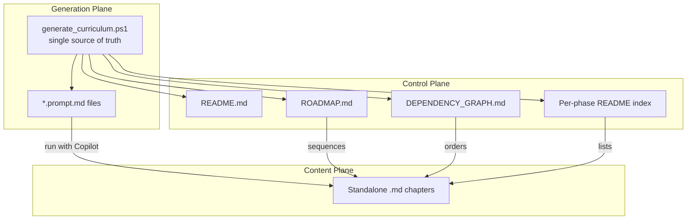
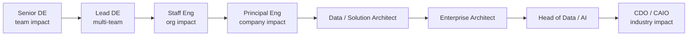
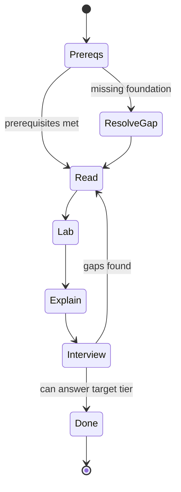
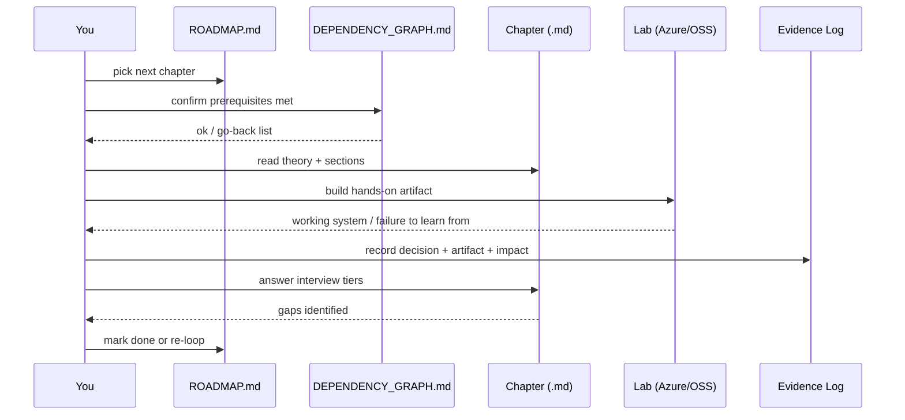

# Introduction and How To Use This Handbook

> Part of the **Enterprise Data & AI Architecture Handbook** · Phase-00 — Foundations & Prerequisites · Chapter 01.
> This is the orientation chapter. It has no prerequisites and should be read first.

---

## Executive Summary

This handbook is not a course. It is a **staff-to-executive engineering knowledge base** designed to move an experienced Azure Data Engineer along the ladder of **Senior → Lead → Staff → Principal → Data/Solution/Enterprise Architect → Head of Data/AI → Chief Data Officer (CDO) / Chief AI Officer (CAIO)**.

It is organized as **21 phases** (Phase-00 through Phase-20) plus a cross-cutting **Resources** library (Architecture, Case Studies, Labs, Interview, References). Every chapter is generated from a strict template with **50 mandatory sections**, an **Azure-primary implementation bias (~60% Azure, ~30% enterprise open source, ~10% AWS/GCP comparison-only)**, and hard requirements for real architectures, failure stories, trade-offs, Architecture Decision Records (ADRs), and diagrams.

The unit of learning is the **standalone chapter**. Each chapter is independently readable, links only to explicitly declared prerequisites, and ends in interview drills spanning **engineer → staff → architect → CTO** levels. The unit of *mastery* is the **capstone** (Phase-20), where prior phases integrate into a defensible enterprise data platform and enterprise AI platform.

This chapter explains the operating model of the handbook: the career ladder it targets, how phases/roadmap/dependency-graph fit together, how to work a single chapter, the one-year study cadence, and how to self-assess readiness for each role level. Treat it as the "onboarding doc" you would receive on day one of a top-tier data platform organization.

**Bottom line:** read in dependency order, do the labs, keep an evidence log of scope and impact, and use the self-assessment rubrics to decide when you are ready to operate — and be interviewed — at the next level.

---

## Learning Objectives

By the end of this chapter you will be able to:

1. **Describe the target career ladder** and the concrete change in *scope of impact* at each rung (team → org → company → industry).
2. **Navigate the handbook** using the three control documents: `README.md`, `ROADMAP.md`, and `DEPENDENCY_GRAPH.md`.
3. **Work a single chapter** end-to-end: theory → labs → case studies → interview drills, with an explicit definition of "done".
4. **Plan a one-year intensive cadence** (8–12 hours/week) with realistic pacing and checkpoints.
5. **Self-assess readiness** for each role level using an evidence-based rubric rather than self-perception.
6. **Explain the platform emphasis** (Azure-primary) and why AWS/GCP appear as comparison-only.
7. **Apply the handbook's governance model** (ADRs, trade-off analysis, "when NOT to use") to your own work.

---

## Business Motivation

Organizations do not promote engineers for knowing more facts; they promote for **increasing the blast radius of good decisions**. The gap between a Senior Data Engineer and a Principal/Architect is rarely raw coding skill — it is the ability to:

- Make **irreversible, high-cost decisions** under ambiguity and defend them in review.
- Reason across **storage, compute, networking, security, cost, and organizational** dimensions simultaneously.
- Convert **business capabilities into platforms** and platforms into measurable outcomes.

Enterprises invest in this because architecture mistakes are expensive and durable: a wrong table-format choice, a mis-sized landing zone, or an ungoverned data mesh can cost millions and years. A structured, high-signal knowledge base shortens the time-to-competence and reduces the variance of senior hiring and promotion decisions. That is the business case for a handbook that reads like an internal wiki at Microsoft, Netflix, Uber, or Databricks rather than a MOOC.

For **you**, the motivation is compensation and optionality: Staff/Principal and Architect/Head-of roles at organizations like Microsoft, Databricks, G42, Presight, Core42, NVIDIA, and Google are gated on demonstrable *architecture judgment*, not certifications alone.

---

## History and Evolution

The structure of this handbook reflects how the data profession itself evolved:

- **2004–2010 — Big Data era.** MapReduce (Google, 2004), Hadoop, and the "store everything" data lake. Roles were split into DBA, ETL developer, and BI developer.
- **2011–2015 — Streaming and the log.** LinkedIn open-sources Kafka (2011); "the log" becomes a unifying abstraction. Lambda architecture emerges.
- **2016–2019 — Cloud-native and the modern data stack.** Managed warehouses (Synapse, Snowflake, BigQuery), Spark-as-a-service (Databricks), dbt, and Airflow. "Data engineer" consolidates as a discipline.
- **2020–2022 — Lakehouse and governance.** Delta Lake, Apache Iceberg, and Hudi bring ACID to the lake; Unity Catalog, Purview, and data mesh formalize governance and ownership.
- **2023–2026 — AI platform and agentic systems.** LLMOps, RAG, vector databases, knowledge graphs, Model Context Protocol (MCP), and agentic architectures move data engineers into **AI platform engineering**.

The handbook's 21 phases mirror this arc, then extend into **leadership, FinOps, reliability, and executive operating models** — the skills that separate builders from leaders.

---

## Why This Technology Exists

The "technology" of this chapter is the **handbook operating model** itself. It exists to solve a specific failure mode: *ad-hoc, unstructured senior learning*.

Most experienced engineers learn by accretion — blog posts, tickets, and tribal knowledge. This produces **deep but jagged** competence: excellent at what they have touched, blind elsewhere. Architect and executive roles punish jaggedness because they require **breadth with defensible depth** across every quality attribute (performance, security, cost, reliability, governance).

This handbook exists to impose **structure, coverage, and rigor** on senior learning:

- A **fixed 50-section template** guarantees no dimension (e.g., cost, fault tolerance, governance) is silently skipped.
- A **dependency graph** prevents learning things out of order (you cannot reason about lakehouse before storage and distributed systems).
- **Mandatory interview tiers** force you to articulate knowledge at the level you are targeting.

---

## Problems It Solves

- **Coverage gaps:** the 50-section template forces breadth across storage/compute/network/security/cost/governance for every topic.
- **Ordering mistakes:** the dependency graph sequences foundational theory before applied platforms.
- **Shallow understanding:** requirements for internals, failure stories, and ADRs prevent "tutorial-depth" knowledge.
- **Career ambiguity:** explicit role rubrics translate learning into promotion evidence.
- **Vendor tunnel vision:** Azure-primary with AWS/GCP comparison teaches transferable concepts, not button-clicking.
- **Interview readiness:** four-tier questions rehearse the exact signal panels look for.

---

## Problems It Cannot Solve

Be honest about the limits:

- **It cannot substitute for real production scars.** Reading about a 3 a.m. Kafka rebalance storm is not the same as living one. The labs mitigate but do not replace this.
- **It cannot grant organizational scope.** Staff/Principal is conferred by *demonstrated impact* at your employer; a handbook prepares you but cannot promote you.
- **It cannot stay perfectly current.** The AI/agentic sections age fastest; treat cutting-edge chapters (Phase-12/13) as a *frame*, not gospel, and re-verify against primary docs.
- **It cannot teach soft skills passively.** Leadership (Phase-19) requires practicing influence, writing, and stakeholder management with real humans.
- **It cannot make decisions for you.** Decision matrices structure judgment; they do not remove the need for it.

---

## Core Concepts

- **Phase:** a themed sequence of chapters (e.g., Phase-05 Modern Data Engineering & Lakehouse). Phases are the coarse-grained learning units.
- **Chapter (prompt → `.md`):** the atomic learning unit. Each is generated from one `*.prompt.md` and is independently readable.
- **Prerequisite:** a declared upstream chapter that should be understood first. Encoded per-chapter and aggregated in `DEPENDENCY_GRAPH.md`.
- **50-section template:** the fixed structure enforcing dimensional coverage.
- **Platform ratio (60/30/10):** Azure-primary, enterprise OSS secondary, AWS/GCP comparison-only.
- **ADR (Architecture Decision Record):** a durable record of Context / Decision / Consequences / Alternatives.
- **Capstone:** an integrative project (Phase-20) proving synthesis across phases.
- **Evidence log:** your personal record of scope, decisions, and impact — the raw material for promotion.

---

## Internal Working

The handbook is a **generated artifact** driven by a single source of truth:

1. A generator (`generate_curriculum.ps1`) holds an ordered list of phases and chapters (title, output filename, description, prerequisites, focus areas, study time).
2. It renders each chapter as a `*.prompt.md` file using one shared template, then generates per-phase `README.md` indexes and the top-level `README.md`, `ROADMAP.md`, and `DEPENDENCY_GRAPH.md` from the **same** data — so indexes never drift from reality.
3. Each `*.prompt.md`, when executed with GitHub Copilot, produces exactly one standalone `.md` chapter (like this one).

This means the curriculum is **idempotent and regenerable**: change the source list, re-run, and the entire index/roadmap/graph stays consistent. This is itself a lesson — treat learning content the way you treat infrastructure: **as code, from a single source of truth**.

---

## Architecture

The handbook has three logical planes:

- **Content plane:** the generated `.md` chapters (the knowledge itself).
- **Control plane:** `README.md`, `ROADMAP.md`, `DEPENDENCY_GRAPH.md`, and per-phase indexes (navigation and sequencing).
- **Generation plane:** the prompt files and the generator (how content is produced and kept consistent).



---

## Components

| Component | Role | Where |
|-----------|------|-------|
| `README.md` | Overview, phase table, usage | Repository root |
| `ROADMAP.md` | 1-year checklist and pacing | Repository root |
| `DEPENDENCY_GRAPH.md` | Prerequisite ordering (Mermaid + table) | Repository root |
| Phase folders `Phase-00…20` | Themed prompt collections | `.github/prompts/` |
| `Resources/*` | Cross-cutting architecture, case studies, labs, interview, references | `.github/prompts/Resources/` |
| `*.prompt.md` | Instruction to generate one chapter | Each phase folder |
| Generated `.md` chapters | The handbook content | `Handbook/` output tree |
| `generate_curriculum.ps1` | Source of truth + generator | Repository root |

---

## Metadata

Each chapter carries metadata that makes it navigable and governable:

- **Prompt frontmatter:** `mode: agent` and a `description`.
- **Chapter header:** phase, chapter number, estimated study time, prerequisites.
- **Declared prerequisites:** the only permitted cross-links, keeping chapters self-contained.
- **Section contract:** the 50 mandatory sections act as a schema you can lint against.

Treat this metadata as you would a data catalog entry: it is what lets a reader (or an automated check) discover, order, and validate content. A simple governance check is "does every chapter contain all 50 `##` headings in order?" — a lineage/quality concept you will meet again in Phase-08.

---

## Storage

The handbook is plain **Markdown in Git**. This is deliberate:

- **Diff-able and reviewable:** every change is a pull request with history.
- **Portable:** renders anywhere (GitHub, VS Code, static site generators).
- **Docs-as-code:** the same discipline you will apply to ADRs and design docs in Phase-19.

There is no database, no binary format, and no lock-in. The "storage tier" is your version control system; the "durability guarantee" is your Git remote and its backups.

---

## Compute

The only "compute" is:

- **GitHub Copilot** (agent mode) executing a prompt file to render a chapter.
- **A local Markdown renderer** (VS Code preview) for reading.
- **Optional CI** (GitHub Actions / Azure DevOps) to lint structure and links.

No cluster is required to *read* the handbook. Compute enters when you do the **labs**, which provision real Azure and open-source resources (Databricks clusters, AKS, Event Hubs). Those costs are governed in each chapter's Cost Optimization section and in the Labs resource.

---

## Networking

Reading requires none. Executing labs requires:

- Outbound HTTPS to GitHub and Azure control planes.
- An Azure subscription with appropriate **RBAC** and, for realistic labs, **private endpoints** and a hub-spoke VNet (introduced in Phase-03 Azure Networking).

The handbook itself teaches you to treat networking as a first-class security boundary; the meta-lesson here is that even a "documentation project" has a threat model when it touches cloud provisioning.

---

## Security

- **Content security:** no secrets belong in chapters or labs. Use Azure Key Vault and environment references; never commit credentials.
- **Lab isolation:** run labs in a **sandbox subscription** with spending limits and auto-shutdown (see Resources → Labs → Lab Environment Setup).
- **Least privilege:** provision lab identities as scoped **managed identities** or short-lived service principals, not owner-level accounts.
- **Prompt-injection awareness:** when using Copilot/agents to generate or extend content, treat external tool output as untrusted input — a concept formalized in Phase-12 (Evaluation and Guardrails).

---

## Performance

"Performance" for a learning system is **time-to-competence** and **retention**. Levers:

- **Sequencing** (dependency order) reduces wasted effort re-learning prerequisites.
- **Active recall** via interview tiers beats passive reading for retention.
- **Spaced repetition:** revisit foundational chapters (Phase-00/02) periodically.
- **Chunking:** one chapter per sitting; do not batch-read a whole phase without labs.

A reasonable throughput target is **1–2 chapters/week** including labs, yielding the ~1-year completion in the roadmap.

---

## Scalability

The model scales along two axes:

- **Content scale:** because everything derives from one source-of-truth list, adding phases/chapters is O(1) effort per item and never breaks the indexes.
- **Learner scale:** the same handbook onboards one engineer or an entire org. Teams can assign phases, run cohort study groups, and use the interview tiers as internal leveling calibration.

The bottleneck is not content generation; it is **learner attention and lab time**. Scale that with cohorts, pairing, and manager-sponsored study time.

---

## Fault Tolerance

Failure modes and their mitigations:

- **You stall on a hard phase:** the dependency graph lets you branch to a parallel track (e.g., Leadership Phase-19) without blocking.
- **A chapter is outdated:** each chapter's References section points to primary sources for re-verification.
- **You skip a prerequisite and get lost:** the per-chapter prerequisite block is your recovery path — go back, then resume.
- **Regeneration breaks:** the generator is idempotent and re-runnable; the encoding lesson (UTF-8 BOM for PowerShell 5.1) is captured so re-runs succeed.

---

## Cost Optimization

- **Reading is free.** Keep it that way as long as possible; do not spin up clusters for chapters that only require reading.
- **Batch lab work** into focused sessions and **tear down** resources immediately (auto-shutdown, `terraform destroy`).
- **Prefer serverless/consumption tiers** for early labs (e.g., Synapse serverless SQL, Azure Functions, Databricks jobs on spot).
- **Set a monthly budget alert** on the sandbox subscription.
- **Track token spend** if you use Azure OpenAI in later phases; cache and route to smaller models where possible (Phase-12 LLMOps).

The recurring FinOps discipline (Phase-18) is: *make cost a visible, owned metric from day one.*

---

## Monitoring

Monitor **your own progress** as a first-class signal:

- A checklist in `ROADMAP.md` (chapters completed: reading + labs).
- A simple **evidence log** (decision made, artifact produced, impact).
- Periodic self-assessment scores against the role rubric (see Best Practices).

For the content itself, a CI check can "monitor" structural health: presence and ordering of the 50 sections, valid internal links, and Mermaid syntax.

---

## Observability

Beyond monitoring "is it done", observability asks "**why am I stuck?**":

- **Traceable prerequisites** let you trace a confusion back to a missing foundation.
- **Interview-tier failures** are diagnostic: if you can answer engineer-level but not architect-level questions, you have identified exactly where depth is missing.
- **Lab failures** surface real gaps (a broken pipeline teaches more than a passing one).

Keep a short "learning journal" of confusions and resolutions — the equivalent of distributed tracing for your own understanding.

---

## Governance

The handbook practices what it teaches:

- **Single source of truth** for structure (the generator).
- **ADRs** required in every chapter model the decision hygiene expected of architects.
- **Explicit prerequisites** are a lineage/contract mechanism.
- **Review discipline:** treat each capstone as an architecture review artifact.

For an organization adopting the handbook, add lightweight governance: a maintainer/owner per phase, a change process (PRs), and a periodic freshness review — mirroring the Architecture Governance chapter (Phase-01).

---

## Trade-offs

| Choice | Benefit | Cost / Tension |
|--------|---------|----------------|
| Fixed 50-section template | Guaranteed coverage, comparability | Some sections feel forced on meta/leadership topics |
| Azure-primary (60/30/10) | Depth, real implementation skill | Less hands-on breadth on AWS/GCP |
| Strict prerequisites | Sound ordering | Less freedom to jump to "fun" topics |
| Standalone chapters | Independent readability | Some cross-topic repetition |
| Generated from source of truth | Consistency, scale | Requires tooling discipline to change |

**When NOT to use this handbook as-is:** if you need shallow, just-in-time answers for a single task, a targeted doc search is faster. The handbook is optimized for **durable breadth and depth**, not quick lookups.

---

## Decision Matrix

Use this to decide your entry point and path:

| Your situation | Recommended path |
|----------------|------------------|
| Strong coder, weak on systems theory | Start Phase-00 → Phase-02 fully; do not skip. |
| Solid data engineer, targeting Staff | Skim Phase-00, focus Phase-02–09, then Phase-18–20. |
| Moving into AI platform work | Ensure Phase-05/07/08, then commit to Phase-11–13. |
| Targeting Architect/Enterprise Architect | Prioritize Phase-01, 03, 14–15, 19, and both capstones. |
| Targeting Head of Data/AI, CDO/CAIO | Phase-01, 08, 10, 18, 19 (esp. CDO/CAIO Playbook), capstones. |
| Limited time (< 6 months) | Follow the "targeting Staff" path; defer domain verticals (Phase-16/17). |

---

## Design Patterns

Patterns for *using* the handbook effectively:

- **Read → Build → Explain:** never mark a chapter done until you can teach it (Feynman) and have run its lab.
- **Prerequisite-first traversal:** resolve upstream chapters before diving in.
- **Evidence-as-you-go:** capture one artifact per chapter (a diagram, an ADR, a working pipeline).
- **Interview rehearsal loop:** answer the four interview tiers aloud; record weak spots.
- **Cohort study:** pair or group per phase for accountability and review practice.

---

## Anti-patterns

- **Tutorial tourism:** reading without building. Produces recognition, not recall.
- **Skipping foundations** because they feel basic — then failing architect-level reasoning later.
- **Cert-chasing:** collecting badges without demonstrable scope or artifacts.
- **Boiling the ocean:** trying to master all 21 phases at once instead of a targeted path.
- **Lab hoarding:** leaving cloud resources running (cost) or never doing labs at all (no scars).
- **Copy-paste architecture:** using a reference design without doing the trade-off analysis for *your* constraints.

---

## Common Mistakes

- Treating the 50-section template as *content to reproduce* rather than *dimensions to reason about*.
- Ignoring the "Problems It Cannot Solve" and "When NOT to use" sections — the most senior signal lives there.
- Studying breadth without ever writing an ADR or design doc (Phase-19 skills).
- Underestimating leadership/communication phases as "soft" and skippable.
- Not maintaining an evidence log, then struggling to build a promotion case.

---

## Best Practices

- **Follow the dependency graph;** branch to parallel tracks when blocked, never skip prerequisites silently.
- **One chapter per sitting; one artifact per chapter.**
- **Keep a promotion evidence log** mapping work to the next level's expectations.
- **Timebox labs and tear down resources.**
- **Re-verify fast-moving chapters** (AI/agentic) against primary sources.
- **Rehearse interview tiers aloud;** teach a peer to expose gaps.
- **Self-assess quarterly** against the rubric below, not by feel.

---

## Enterprise Recommendations

For an organization adopting this handbook as an internal capability program:

- Assign **phase owners** (senior/staff engineers) accountable for freshness and reviews.
- Run **cohorts** aligned to team roadmaps; fund protected study time.
- Use the **interview tiers as leveling calibration** in your own hiring loops.
- Integrate the **capstones into promotion packets** as portfolio artifacts.
- Track a small set of **program metrics**: chapters completed, capstones delivered, internal-mobility and promotion rates.
- Keep content **docs-as-code** with PR review and CI structural checks.

---

## Azure Implementation

Because Azure is the primary platform, orient yourself now to the services you will use repeatedly. A representative "learning environment" landing:

- **Identity & governance:** Microsoft Entra ID, Azure RBAC, Azure Policy, Management Groups, a dedicated **sandbox subscription** with a budget.
- **Storage backbone:** Azure Data Lake Storage (ADLS) Gen2 with hierarchical namespace.
- **Lakehouse compute:** Azure Databricks (Unity Catalog) and/or Microsoft Fabric (OneLake).
- **Orchestration & integration:** Azure Data Factory, Azure DevOps / GitHub Actions.
- **Streaming:** Azure Event Hubs (Kafka-compatible), Stream Analytics.
- **AI platform:** Azure Machine Learning, Azure OpenAI / AI Foundry, Azure AI Search.
- **Secrets & observability:** Azure Key Vault, Azure Monitor / Application Insights, Managed Grafana.

Bootstrap a sandbox with cost guardrails (illustrative CLI):

```bash
# Create a resource group for handbook labs
az group create --name rg-handbook-lab --location westeurope

# Enforce a monthly budget with an alert at 80% (via Cost Management)
az consumption budget create \
  --budget-name handbook-lab-budget \
  --amount 100 --time-grain Monthly \
  --category Cost \
  --resource-group rg-handbook-lab

# Create the lakehouse storage account (ADLS Gen2)
az storage account create \
  --name sthandbooklab001 \
  --resource-group rg-handbook-lab \
  --sku Standard_LRS --kind StorageV2 \
  --hierarchical-namespace true \
  --min-tls-version TLS1_2 \
  --allow-blob-public-access false
```

Provision repeatably with Bicep/Terraform (introduced in Phase-09). The principle: **every lab is reproducible and destroyable**.

---

## Open Source Implementation

Everything readable and much of the lab work can run on open source, which keeps early costs near zero and teaches transferable internals:

- **Local lakehouse:** MinIO (S3-compatible object store) + Apache Spark + Delta Lake, orchestrated by Apache Airflow, transformed with dbt-core.
- **Streaming:** Apache Kafka (or Redpanda) + Apache Flink.
- **Query & BI:** Trino / DuckDB + Apache Superset.
- **Observability:** Prometheus + Grafana + OpenTelemetry.
- **AI stack:** LangChain / LlamaIndex + Qdrant or Milvus + a local model server; MLflow for tracking.
- **Everything containerized** with Docker, optionally on a local Kubernetes (kind/k3d).

A minimal local lakehouse:

```yaml
# docker-compose.yml (illustrative local lakehouse core)
services:
  minio:
    image: minio/minio
    command: server /data --console-address ":9001"
    environment:
      MINIO_ROOT_USER: admin
      MINIO_ROOT_PASSWORD: change-me-in-.env   # never hardcode secrets in real use
    ports: ["9000:9000", "9001:9001"]
  spark:
    image: bitnami/spark:3.5
    environment:
      - SPARK_MODE=master
    ports: ["8080:8080", "7077:7077"]
```

> Note: the credentials above are placeholders for a throwaway local sandbox. In any shared or cloud context, source secrets from Key Vault or a `.env` excluded from Git.

---

## AWS Equivalent (comparison only)

You will not build full AWS stacks here, but you must be able to translate. High-frequency mappings used throughout the handbook:

| Azure (primary) | AWS equivalent | Notes |
|-----------------|----------------|-------|
| ADLS Gen2 | Amazon S3 | S3 lacks a true hierarchical namespace; ADLS Gen2 adds directory semantics. |
| Azure Databricks | Databricks on AWS / EMR | Databricks is cross-cloud; EMR is AWS-native Spark. |
| Microsoft Fabric / Synapse | Amazon Redshift + Glue + QuickSight | Fabric is a unified SaaS; AWS is composed of discrete services. |
| Event Hubs | Amazon Kinesis / MSK | MSK is managed Kafka; Kinesis is proprietary. |
| Azure OpenAI | Amazon Bedrock | Bedrock offers multiple model vendors; Azure OpenAI is OpenAI-centric. |
| Entra ID | AWS IAM / IAM Identity Center | Different identity models; concepts transfer. |

**Advantages of AWS:** breadth and maturity of services, largest ecosystem. **Disadvantages:** more assembly required; identity and analytics are more fragmented than Azure's integrated stack. **Migration/selection:** choose by existing enterprise agreement, data gravity, and team skills — not hype.

---

## GCP Equivalent (comparison only)

| Azure (primary) | GCP equivalent | Notes |
|-----------------|----------------|-------|
| ADLS Gen2 | Google Cloud Storage | Object store; similar economics. |
| Synapse / Fabric Warehouse | BigQuery | BigQuery's serverless separation of storage/compute is best-in-class. |
| Azure Databricks | Dataproc / Databricks on GCP | Dataproc is managed Spark/Hadoop. |
| Event Hubs | Pub/Sub | Global, serverless messaging. |
| Azure ML / OpenAI | Vertex AI / Gemini | Vertex is GCP's unified ML/AI platform. |
| Entra ID | Google Cloud IAM | Resource-hierarchy-centric model. |

**Advantages of GCP:** BigQuery and data/AI ergonomics, strong analytics DX. **Disadvantages:** smaller enterprise footprint and fewer regions than Azure in many geographies. **Selection:** favor GCP when BigQuery-centric analytics dominate and there is no Microsoft enterprise entanglement.

---

## Migration Considerations

For the handbook itself, "migration" means adapting it to your context:

- **Different primary cloud:** invert the ratio — keep concepts, swap Azure specifics for your platform, using the AWS/GCP mapping tables as anchors.
- **Team adoption:** migrate from individual to cohort learning; add phase owners and CI checks.
- **Content freshness:** schedule periodic re-generation and re-verification of fast-moving phases.

**ADR — Output location for generated chapters**

- **Context:** Prompts live in `.github/prompts/`. Generated chapters must not be confused with prompts, must be independently readable, and should be easy to publish.
- **Decision:** Write generated chapters to a parallel `Handbook/Phase-XX/` tree, mirroring the prompt structure, separate from `.github/prompts/`.
- **Consequences:** Clean separation of "instructions" vs "content"; simple to publish `Handbook/` as a docs site; prompts and outputs evolve independently.
- **Alternatives considered:** (a) co-locate outputs next to prompts — rejected (clutter, ambiguity); (b) single flat output folder — rejected (loses phase navigability).

---

## Mermaid Architecture Diagrams

**Career ladder and scope of impact:**



**Chapter workflow (state machine):**



---

## End-to-End Data Flow

How a single learning "record" flows through the system:



The pipeline mirrors a real data pipeline: **ingest (read) → transform (build) → validate (interview) → serve (evidence log)**, with feedback loops on failure — exactly the medallion mindset you will meet in Phase-05.

---

## Real-world Business Use Cases

- **Individual up-leveling:** an Azure Data Engineer targeting a Staff role at Microsoft or Databricks uses the Staff path and capstones as promotion evidence.
- **Team capability build:** a Head of Data at a scale-up runs Phase-05–10 as a cohort to standardize lakehouse and governance practice.
- **AI transformation:** an enterprise stands up an AI platform team using Phase-11–13 to align MLOps/LLMOps/agentic practices.
- **Hiring calibration:** a platform org adopts the four interview tiers to reduce leveling variance across panels.

---

## Industry Examples

- **Microsoft / Databricks:** internal wikis and "paved road" docs that read exactly like these chapters — opinionated, dimensional, with trade-offs and ADRs.
- **Netflix:** heavy investment in self-service data platforms and internal engineering docs; the handbook mirrors this "platform-as-product" ethos (see Resources → Case Studies → Netflix).
- **Uber / LinkedIn / Airbnb:** originators of Hudi, Kafka, and Minerva respectively — used as case studies to ground abstract concepts in real systems.
- **G42 / Presight / Core42 / NVIDIA:** sovereign-scale data and AI platforms where architecture judgment, governance, and cost discipline are decisive — the exact competencies this handbook targets.

---

## Case Studies

**Case study: the jagged senior.** A strong Spark engineer repeatedly failed Staff interviews. Root cause (diagnosed via interview tiers): deep on compute, blind on security, cost, and governance. Remediation: targeted read of Phase-08/10/18 plus a capstone with an explicit FinOps and security review. Outcome: promotion within two cycles. **Lesson:** breadth across quality attributes is the gate, not more Spark.

**Failure story: the skipped foundation.** A learner jumped straight to Lakehouse (Phase-05) and could not reason about small-file problems or consistency during a review. Tracing back through the dependency graph revealed missing Phase-00 (storage) and Phase-02 (consistency). **Lesson:** prerequisites are not bureaucracy; they are the difference between memorized and understood.

---

## Hands-on Labs

1. **Set up your control room (30 min):** clone the repository, open `README.md`, `ROADMAP.md`, and `DEPENDENCY_GRAPH.md`. Render the Mermaid graphs in VS Code preview.
2. **Provision a governed sandbox (60 min):** create `rg-handbook-lab`, a budget alert, and an ADLS Gen2 account using the Azure CLI above; verify no public access.
3. **Stand up a local lakehouse (60–90 min):** run the `docker-compose.yml` MinIO+Spark core; write a Delta table and read it back.
4. **Author your first ADR (30 min):** using the template in this chapter, record your decision about your learning path.

---

## Exercises

- Draw the dependency subgraph for **your** target role and identify your critical path.
- For any three chapters, list which of the 50 sections you could currently answer at **architect** level and which you cannot.
- Write a one-paragraph "definition of done" for a chapter, in your own words.
- Estimate the monthly cost of running the streaming lab (Phase-07) for 4 hours/week and propose two cost reductions.

---

## Mini Projects

- **Personalized roadmap:** produce a `MyRoadmap.md` selecting a path from the decision matrix, with weekly targets and checkpoints.
- **Evidence log system:** create a lightweight template (Markdown or a Notion/Loop page) mapping each completed chapter to an artifact and an impact statement.
- **Structural linter:** write a small script (PowerShell/Python) that verifies a chapter contains all 50 `##` sections in order and reports missing/misordered ones.

---

## Capstone Integration

This chapter feeds directly into **Phase-20**:

- The **evidence log** you start here becomes the portfolio for `Portfolio_and_Case_Studies.md`.
- Your **chosen path** (decision matrix) determines which capstone(s) you prioritize: `Capstone_Enterprise_Data_Platform.md`, `Capstone_Enterprise_AI_Platform.md`, or both.
- The **ADR discipline** introduced here is exercised at scale in the capstones and in `Architecture_Reviews.md` (Phase-19).

Keep every artifact; the capstones assume you have been accumulating them.

---

## Interview Questions

- What is the difference between a data lake and a lakehouse, in one sentence each?
- Name three quality attributes an architecture chapter must always address and why.
- Why does this handbook sequence storage and distributed systems before lakehouse?
- What is an ADR and what are its four parts?
- Give one reason to prefer Azure Databricks over Microsoft Fabric and one reason for the reverse.

---

## Staff Engineer Questions

- How would you design an internal learning/enablement program so its indexes never drift from its content? (Answer: single source of truth + generation; discuss idempotency.)
- Describe a time you identified a *jagged* competency in yourself or a teammate and how you closed it.
- How do you decide when a technical decision warrants an ADR versus a lightweight note?
- Propose metrics to evaluate whether a capability-uplift program is actually working.

---

## Architect Questions

- You are asked to adapt this Azure-primary curriculum for a GCP-first enterprise. What changes, what stays, and how do you avoid a full rewrite?
- Critique the "fixed 50-section template" as a governance mechanism. Where does it help and where does it become an anti-pattern?
- Design a lightweight governance model (owners, change process, freshness reviews) for a 200-chapter internal knowledge base.
- How would you integrate structural and link-validity checks into CI without slowing contributors?

---

## CTO Review Questions

- What is the business case for investing in a structured internal knowledge base versus letting engineers learn ad hoc? Quantify it.
- How does this program reduce hiring and promotion risk, and what metrics prove it?
- What are the top three risks of adopting this at org scale, and how are they mitigated (cost, freshness, adoption)?
- How does this capability connect to the company's data/AI strategy and its measurable outcomes?

---

## References

- Kleppmann, M. *Designing Data-Intensive Applications* (O'Reilly).
- The Open Group. *TOGAF Standard* (enterprise architecture framework).
- Microsoft. *Azure Well-Architected Framework* and *Cloud Adoption Framework* (learn.microsoft.com).
- Dehghani, Z. *Data Mesh: Delivering Data-Driven Value at Scale* (O'Reilly).
- Google. *MapReduce: Simplified Data Processing on Large Clusters* (2004).
- Handbook control docs: `README.md`, `ROADMAP.md`, `DEPENDENCY_GRAPH.md` (this repository).

---

## Further Reading

- Next chapter: **Phase-00 · [Computer Science Fundamentals](../../.github/prompts/Phase-00/02_Computer_Science_Fundamentals.prompt.md)** — the first foundational topic.
- Parallel track (safe to start anytime): **Phase-01 · Enterprise Architecture Foundations**.
- Staff+ engineering resources: Will Larson, *Staff Engineer*; Tanya Reilly, *The Staff Engineer's Path*.
- Google SRE books (sre.google) for the reliability mindset used in Phase-18.
- Martin Fowler's website (martinfowler.com) for patterns referenced across Phase-14.
