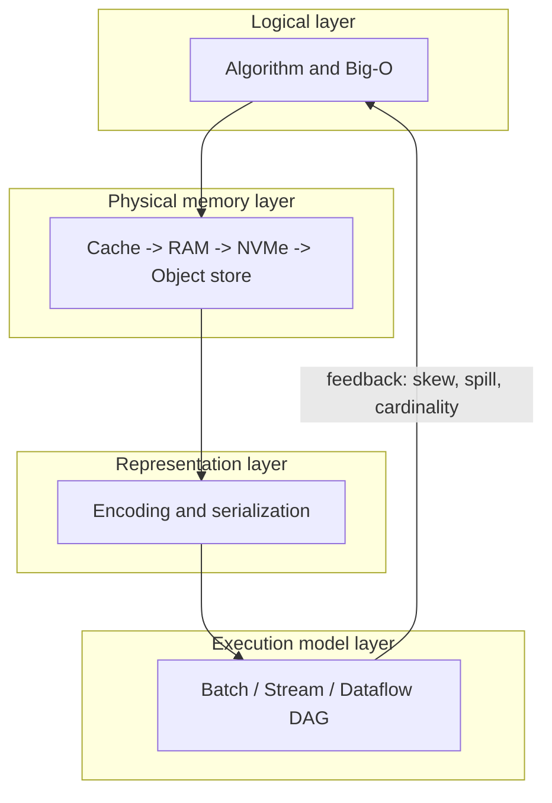
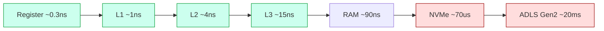
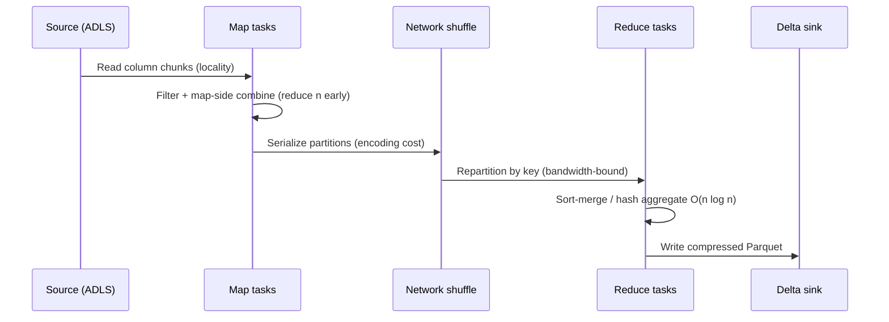

# Computer Science Fundamentals

> Part of the **Enterprise Data & AI Architecture Handbook** · Phase-00 — Foundations & Prerequisites · Chapter 02.
> Estimated study time: **60 min reading + ~4h labs**.
> **Prerequisite:** read [Introduction and How To Use This Handbook](01_Introduction.md) first.

---

## Executive Summary

Every expensive decision in a data or AI platform ultimately reduces to a small set of computer-science invariants: *how much work* an operation costs (time complexity), *how much memory* it touches and *where that memory lives* (the memory hierarchy), *how bytes are represented and moved* (encoding, endianness, serialization), *which computation model* the workload fits (batch, streaming, MapReduce, dataflow), and *how numbers lie* (floating-point precision). Architects who cannot reason about these primitives ship platforms that are correct in the demo and catastrophic at scale.

This chapter is the load-bearing floor beneath the rest of the handbook. When [Storage Systems Fundamentals](05_Storage_Systems_Fundamentals.prompt.md) explains why columnar formats crush analytics, the reason is *cache locality* and *complexity of scan-vs-seek*. When [Concurrency and Parallelism](06_Concurrency_and_Parallelism.prompt.md) explains Spark shuffle cost, the reason is the $O(n \log n)$ sort and the network serialization boundary. When a data-quality incident surfaces `0.1 + 0.2 != 0.3` in a financial reconciliation, the reason is IEEE-754. We connect each primitive directly to Azure cost, Databricks/Spark behavior, and enterprise failure stories.

The bias throughout is **Azure-primary (~60%)**, **enterprise open source (~30%)** — Spark, Delta Lake, Parquet/Arrow, Kafka, Flink — and **AWS/GCP as comparison only (~10%)**. The goal is not academic rigor for its own sake; it is *defensible judgment*. By the end you will be able to estimate the cost of a query before running it, explain why a UTF-8 misconfiguration corrupted a pipeline, choose a computation model from first principles, and defend those choices in a Staff/Principal review.

**Bottom line:** complexity, memory, encoding, computation models, and numerical precision are not "CS trivia" — they are the units in which cloud bills, SLAs, and data-quality incidents are denominated. Master them and the rest of the handbook becomes engineering rather than guesswork.

---

## Learning Objectives

By the end of this chapter you will be able to:

1. **Estimate the time and space complexity** of common data operations (join, sort, aggregation, dedup, window) and translate Big-O into concrete Azure/Databricks cost.
2. **Reason about the memory hierarchy** (register → L1/L2/L3 cache → RAM → SSD/NVMe → object storage) and exploit locality of reference to make code and queries faster without buying more hardware.
3. **Explain binary and text encodings** — two's complement, IEEE-754, UTF-8, endianness — and diagnose the corruption classes each one produces.
4. **Choose a serialization format** (JSON, Avro, Protobuf, Parquet, Arrow) from first principles based on schema evolution, size, and CPU cost.
5. **Select a computation model** (batch, micro-batch, streaming, MapReduce, dataflow) for a workload and justify it against latency, cost, and correctness constraints.
6. **Predict and mitigate floating-point error** in aggregations, and know when to reach for decimal/fixed-point types.
7. **Defend all of the above** in an architecture review with explicit trade-offs and "when NOT to use" guidance.

---

## Business Motivation

Executives do not fund "algorithms." They fund *predictable unit economics* and *incident-free SLAs*. Computer-science fundamentals are the mechanism by which both are achieved:

- **Cost predictability.** A query that is $O(n^2)$ instead of $O(n \log n)$ does not "run a bit slower" — at $n = 10^9$ rows it is the difference between a €50 Databricks job and a €50,000 one, or between finishing and never finishing. FinOps starts at Big-O, not at the billing dashboard.
- **Latency SLAs.** A fraud-detection platform promising sub-100 ms decisions cannot be built on a batch model, no matter how much compute you throw at it. The computation-model choice is a business commitment made at design time.
- **Correctness and trust.** A single floating-point drift in a financial close, or a UTF-8 mojibake in a customer's name, erodes trust that took years to build and can trigger regulatory findings. Encoding and numeric precision are *compliance* concerns.
- **Talent leverage.** Teams that reason from fundamentals ship fewer rewrites. The most expensive line item in most platforms is the *second* implementation after the first one failed to scale.

For an experienced Azure data engineer targeting Staff/Principal/Architect roles (see the career ladder in [Introduction](01_Introduction.md)), the ability to say *"this will cost X because it is $O(n \log n)$ with a shuffle across the 10 GbE fabric"* — before writing code — is precisely the judgment that gates promotion.

---

## History and Evolution

- **1936 — Computability.** Turing and Church define what is computable at all. This bounds Section 7 ("Problems It Cannot Solve"): some things are not slow, they are *impossible*.
- **1945 — The stored-program (von Neumann) architecture.** Code and data share memory. This gives us the memory hierarchy and the "von Neumann bottleneck" — the reason cache locality still dominates performance in 2026.
- **1965 — Landau/Bachmann Big-O enters CS via Knuth.** Asymptotic analysis becomes the lingua franca of algorithm cost.
- **1972 — C and two's complement mainstream.** Fixed-width integer arithmetic and its overflow semantics become the default across systems.
- **1985 — IEEE-754.** Floating-point is standardized, ending a chaos of incompatible float formats. Every data platform inherits its rounding behavior.
- **1993 — Unicode 1.1 / 2003 — UTF-8 (RFC 3629).** Ken Thompson and Rob Pike's UTF-8 becomes the universal text encoding, ending most (not all) mojibake.
- **2004 — MapReduce (Dean & Ghemawat, Google).** A computation *model* — map, shuffle, reduce — that makes embarrassingly parallel batch tractable on commodity clusters. Hadoop follows.
- **2011–2015 — The log and stream processing.** Kafka (LinkedIn) and later Flink/Spark Streaming make *dataflow* and *streaming* first-class models.
- **2013–2016 — Columnar + vectorization.** Parquet, ORC, and Apache Arrow exploit the memory hierarchy (SIMD, cache lines) to make analytics 10–100× faster than row stores.
- **2020–2026 — Lakehouse + AI.** Delta Lake/Iceberg bring ACID to object storage; Arrow becomes the in-memory lingua franca; GPU memory hierarchies (HBM) and mixed-precision (FP16/BF16/FP8) make numerical precision a first-order AI-platform concern.

The through-line: hardware changed, but the *fundamentals* — asymptotic cost, locality, encoding, model selection, and numeric precision — only became **more** decisive as data grew.

---

## Why This Technology Exists

"This technology" here is the body of **analytical primitives** used to predict system behavior *before building it*. It exists because empirical tuning does not scale to enterprise risk:

- You cannot A/B test a €2M data-platform architecture. You must reason about it on paper first.
- Hardware is fast but *unevenly* fast: a cache hit is ~1 ns, a main-memory access ~100 ns, an NVMe read ~100 µs, an object-storage GET ~10–50 ms. That five-orders-of-magnitude gap means *where* data lives dominates *how much* work you do. Complexity analysis and the memory-hierarchy model exist to make that gap legible.
- Bytes are ambiguous without agreed conventions. Encoding standards (two's complement, IEEE-754, UTF-8) exist so that a byte written by a Spark job in Azure West Europe means the same thing when read by a .NET service in East US.
- Distributed data is too big for one machine and too latency-sensitive for naive loops. Computation models (batch/stream/MapReduce/dataflow) exist to *structure* parallelism so it is correct and cost-bounded.

In short: these primitives exist to convert *"let's run it and see"* into *"we can prove this fits the SLA and the budget."*

---

## Problems It Solves

- **Cost estimation before spend.** Big-O + data volume + per-record cost ⇒ a defensible dollar figure for a job before it runs.
- **Bottleneck localization.** The memory hierarchy tells you whether you are CPU-, memory-, disk-, or network-bound, which determines *which* optimization actually helps.
- **Format selection.** Encoding/serialization analysis answers "Avro or Protobuf?", "Parquet row-group size?", "when does Arrow zero-copy pay off?".
- **Latency-model fit.** Computation models map SLA requirements (seconds vs. sub-second vs. hours) to architectures (batch vs. micro-batch vs. streaming).
- **Correctness guarantees.** Numeric-precision analysis prevents silent financial and ML errors; encoding analysis prevents data corruption.
- **Capacity planning.** Space complexity + working-set size ⇒ cluster/VM SKU selection (e.g., memory-optimized vs. compute-optimized Azure VMs).

---

## Problems It Cannot Solve

- **Undecidable problems.** No amount of compute solves the halting problem or perfectly detects all infinite loops in user-submitted SQL/UDFs. This bounds what a query optimizer can promise.
- **NP-hard optimization at scale, exactly.** Optimal join ordering, optimal data placement/partitioning, and optimal query plans are combinatorially explosive; engines use *heuristics*, not guarantees.
- **Removing intrinsic lower bounds.** Comparison sorting cannot beat $O(n \log n)$; you can only change constants or exploit structure (radix, distribution). Fundamentals tell you where the floor is so you stop trying to dig through it.
- **Fixing bad data models.** Complexity analysis makes a wrong schema *fast to fail*; it does not make a wrong schema correct. Modeling is a separate discipline.
- **Eliminating floating-point error.** You can bound and manage it (Kahan summation, decimal types) but cannot make binary floating-point exactly represent 0.1.
- **Predicting real-world constants.** Big-O hides cache effects, JIT, and I/O jitter. It ranks algorithms asymptotically; it does not replace benchmarking for the final 20%.

---

## Core Concepts

### 8.1 Asymptotic complexity (Big-O, Ω, Θ)

Big-O describes the growth rate of resource usage as input size $n → ∞$, ignoring constants and lower-order terms. It answers "how does cost scale?", not "how many milliseconds?".

| Class | Name | Data-engineering example |
|---|---|---|
| $O(1)$ | Constant | Hash-map lookup, dictionary-encoded column probe |
| $O(\log n)$ | Logarithmic | B-tree / Z-order index seek, binary search on sorted file |
| $O(n)$ | Linear | Full scan, single-pass aggregation, filter |
| $O(n \log n)$ | Linearithmic | Sort, sort-merge join, `ORDER BY`, window functions |
| $O(n \cdot m)$ | Product | Hash join (build $m$, probe $n$), broadcast join |
| $O(n^2)$ | Quadratic | Nested-loop join, naive dedup, cartesian product |
| $O(2^n)$ | Exponential | Exhaustive join-order enumeration, some graph problems |

**The one inequality that matters in practice:** at $n = 10^9$, $\log_2 n \approx 30$. So $O(n \log n)$ ≈ 30× the work of $O(n)$, but $O(n^2)$ ≈ *one billion* × the work of $O(n)$. This is why an accidental cross join is the single most common "my Databricks bill exploded" incident.

### 8.2 Space complexity and the working set

Space complexity is the *additional* memory an algorithm needs. In distributed systems the decisive quantity is the **working set** — the data that must be resident at once (e.g., the hash table of a hash join, the sort buffer, the state of a streaming aggregation). If the working set exceeds executor memory, the engine **spills to disk** (Spark) or OOM-kills the task. Capacity planning = sizing the working set against RAM.

### 8.3 The memory hierarchy and locality

CPUs are starved for data. Performance comes from keeping the working set in fast memory:

- **Temporal locality:** reuse recently accessed data (loop over the same rows).
- **Spatial locality:** access adjacent addresses (scan a column, not a row). This is *why columnar formats win*.

### 8.4 Encoding

Bytes are meaningless without a convention: **two's complement** for signed integers, **IEEE-754** for reals, **UTF-8** for text, plus **endianness** for multi-byte ordering.

### 8.5 Serialization

Turning in-memory objects into a byte stream (and back) for storage/transport. The axes are: schema-on-read vs. schema-on-write, size, CPU cost, schema evolution, and splittability.

### 8.6 Computation models

The *shape* of parallelism: **batch** (bounded input, high throughput), **streaming** (unbounded input, low latency), **MapReduce** (map → shuffle → reduce), and **dataflow** (a DAG of operators, the model underlying Spark, Flink, and Beam).

Each concept recurs throughout the handbook; here we establish the vocabulary.

---

## Internal Working

**How a query optimizer uses complexity.** A cost-based optimizer (CBO) — Spark Catalyst, Synapse, PostgreSQL — enumerates candidate plans and assigns each an estimated cost derived from cardinality estimates and per-operator complexity models. Example: for `A ⋈ B` it compares:

- **Broadcast hash join:** cost ≈ build hash table on the small side ($O(m)$) + probe ($O(n)$), *plus* broadcasting $m$ to every executor. Chosen when $m$ is small (Spark default threshold `spark.sql.autoBroadcastJoinThreshold = 10MB`).
- **Sort-merge join:** cost ≈ sort both sides ($O(n \log n + m \log m)$) + a linear merge, *plus* a shuffle to co-locate keys. Chosen for two large tables.
- **Shuffle hash join / nested loop:** fallbacks.

**How the memory hierarchy shows up at runtime.** A columnar scan of Parquet loads a *column chunk* into a contiguous Arrow buffer. The CPU then streams it through SIMD registers (AVX-512 processes 8× FP64 per instruction). Because the data is contiguous, the hardware prefetcher hides memory latency, and the CPU runs near peak. A row-oriented scan of the same predicate touches one field per 200-byte row, wasting ~95% of every 64-byte cache line — the same *algorithm*, 10–20× slower purely from locality.

**How encoding is enforced.** UTF-8 is self-synchronizing: the high bits of each byte declare whether it is ASCII (`0xxxxxxx`), a continuation (`10xxxxxx`), or a leader (`110/1110/11110`). A decoder validates this on read; a mismatch (e.g., reading Latin-1 bytes as UTF-8) throws or produces replacement characters `�` — the mechanism behind most mojibake incidents.

**How floating-point rounds.** IEEE-754 stores `sign · 1.mantissa · 2^exponent`. Operations round the infinitely precise result to the nearest representable value (round-half-to-even by default). Errors accumulate over long summations, which is why order of operations changes results in a distributed sum.

---

## Architecture

Think of the fundamentals as four layers that every data operation traverses:

1. **Logical layer** — the algorithm and its complexity (what work, in what order).
2. **Physical-memory layer** — where the working set lives across the hierarchy (cache/RAM/disk/object store).
3. **Representation layer** — how values are encoded and serialized on the wire and at rest.
4. **Execution-model layer** — batch vs. stream vs. dataflow DAG scheduling.

A performance problem is always a *mismatch* between these layers: an $O(n^2)$ algorithm (layer 1), a working set that spills (layer 2), an expensive JSON parse per record (layer 3), or a batch model forced to meet a streaming SLA (layer 4). Diagnosis = identify which layer the mismatch is in.

See the [Mermaid Architecture Diagrams](#mermaid-architecture-diagrams) section for the visual model.

---

## Components

| Component | Role | Concrete instantiation |
|---|---|---|
| **Cost model** | Predicts resource use | Big-O + cardinality estimates in Spark Catalyst CBO |
| **Memory hierarchy** | Determines data-access latency | L1/L2/L3, RAM, Azure Premium SSD v2, ADLS Gen2 |
| **Encoding codecs** | Map values ↔ bytes | UTF-8 codec, IEEE-754 FPU, two's-complement ALU |
| **Serialization framework** | Objects ↔ byte streams | Avro, Protobuf, Parquet, Arrow, Kryo |
| **Execution engine** | Realizes a computation model | Spark (dataflow), Flink (streaming), Hadoop (MapReduce) |
| **Scheduler** | Places work near data | YARN/Kubernetes, Spark DAG scheduler, data-locality hints |
| **Spill manager** | Handles working-set overflow | Spark `ExternalSorter`, shuffle spill to local NVMe |

---

## Metadata

Fundamentals are only actionable when the engine has good **metadata**:

- **Statistics** — row counts, NDV (number of distinct values), min/max, null fraction, histograms. These drive cardinality estimation; bad stats produce bad plans (e.g., a broadcast that OOMs because the "small" side was under-estimated). In Databricks, `ANALYZE TABLE ... COMPUTE STATISTICS` and Delta's auto-collected stats feed the CBO.
- **Schema + type metadata** — encoding decisions (int32 vs. int64, decimal(38,18) vs. double) are recorded in the table schema and Parquet footer.
- **Encoding metadata in the file footer** — Parquet stores per-column-chunk encoding (dictionary, RLE, delta), compression codec, and min/max for predicate pushdown.
- **Partition metadata** — determines data locality and pruning; a mis-partitioned table defeats locality and forces full scans.

Metadata quality is a first-order performance lever: the same query on the same data can be 100× faster with accurate statistics.

---

## Storage

Storage is where the memory hierarchy meets economics. Latency and cost per layer (order-of-magnitude, 2026):

| Layer | Latency | Bandwidth | Relative cost | Azure example |
|---|---|---|---|---|
| L1 cache | ~1 ns | ~TB/s | — | On-die |
| RAM (DDR5) | ~80–100 ns | ~50 GB/s | High | VM memory |
| Local NVMe | ~50–100 µs | ~3–7 GB/s | Medium | `Lsv3` local SSD, Premium SSD v2 |
| Object storage | ~10–50 ms first byte | scalable/parallel | Low | ADLS Gen2 (Blob) |
| Archive | seconds–hours | — | Lowest | Azure Archive tier |

**Design implication:** the lakehouse pattern deliberately keeps *cold* data cheap in ADLS Gen2 (locality sacrificed for cost) and pulls the *hot working set* into executor RAM/Arrow buffers (locality recovered for speed). Delta/Parquet column chunks, row-group sizing (128–256 MB), and Z-ordering are all techniques to *maximize spatial locality per object-storage GET*, minimizing the number of high-latency round-trips. See [Storage Systems Fundamentals](05_Storage_Systems_Fundamentals.prompt.md) for the deep dive.

---

## Compute

Compute cost is the product of complexity and per-operation cost across the hierarchy:

$$\text{cost} \approx \underbrace{f(n)}_{\text{Big-O}} \times \underbrace{c_{\text{op}}}_{\text{ns/op, depends on locality}} \times \underbrace{\text{price/core-second}}_{\text{cloud SKU}}$$

- **CPU-bound** work (parsing JSON, decompression, hashing) benefits from *vectorization* (SIMD) and better encodings (columnar + Arrow). Choose **compute-optimized** Azure VMs (Fsv2, or Databricks `Fsv2`-backed clusters).
- **Memory-bound** work (large hash joins, wide aggregations) benefits from bigger RAM to avoid spill. Choose **memory-optimized** SKUs (Esv5, or Databricks memory-optimized).
- **Shuffle-bound** work (wide dependencies) is dominated by network + serialization; reduce data *before* the shuffle (predicate/aggregate pushdown, `reduceByKey` over `groupByKey`).
- **GPU** work (AI) has its own hierarchy — HBM3 vs. registers — and mixed precision (BF16/FP8) trades numerical precision for throughput.

The architect's job is to match the *dominant term* to the *right SKU*, not to buy the biggest machine.

---

## Networking

The network is the slowest, most expensive tier of the distributed memory hierarchy and the place where serialization cost concentrates:

- **Shuffle** moves serialized records between executors. Its cost = (bytes after serialization) / (effective bandwidth). This is why *compact encodings* (Parquet, Kryo, columnar batches) and *pushdown* directly reduce network cost.
- **Serialization boundary.** Every cross-node hop pays CPU to serialize + deserialize. Zero-copy formats (Arrow Flight) exist specifically to remove this tax; Spark's Tungsten keeps data in off-heap binary to avoid Java object overhead.
- **Endianness matters on the wire.** Network byte order is big-endian by convention; most CPUs (x86, ARM) are little-endian. Serialization frameworks normalize this so a Spark executor and a .NET consumer agree on integer values.
- **Data egress cost.** In Azure, cross-region and internet egress is billed. Keeping compute co-located with ADLS Gen2 in the same region is both a *locality* and a *FinOps* decision.

See [Networking Fundamentals](04_Networking_Fundamentals.prompt.md) for the full treatment.

---

## Security

Fundamentals intersect security in concrete ways:

- **Encoding-driven injection.** Inconsistent encoding/normalization (Unicode homoglyphs, over-long UTF-8) is a classic path to filter bypass and injection. Normalize to NFC and validate UTF-8 at trust boundaries.
- **Integer overflow.** Two's-complement wraparound has caused real vulnerabilities (allocation-size miscalculations). Validate ranges; use checked arithmetic at boundaries.
- **Timing side channels.** Complexity-dependent runtimes (e.g., naive string compare, hash-table collision floods causing $O(n)$ lookups) leak information or enable algorithmic-complexity DoS. Use constant-time comparisons for secrets and randomized/collision-resistant hashing.
- **Serialization deserialization attacks.** Deserializing untrusted data (Java native serialization, pickle) is a remote-code-execution class. Prefer schema'd, data-only formats (Avro/Protobuf/Parquet); never deserialize untrusted pickle. This is an OWASP A08 (Software and Data Integrity) concern.
- **Encryption cost.** Crypto is CPU-bound; account for it in compute sizing (AES-NI hardware acceleration matters).

---

## Performance

Performance engineering from fundamentals, in priority order:

1. **Fix the algorithm first (Big-O).** No hardware buys back an $O(n^2)$ join. Eliminate cross joins, add join keys, push filters down.
2. **Reduce data early.** Predicate/projection pushdown, partition pruning, and pre-aggregation shrink $n$ before expensive operators.
3. **Exploit locality.** Columnar formats, appropriate row-group sizes, Z-order/clustering, and cache-friendly access patterns.
4. **Vectorize.** Enable Spark's vectorized Parquet reader and Photon (Databricks) / whole-stage codegen; process batches, not rows.
5. **Avoid the shuffle, or shrink it.** Broadcast small dimensions, use `reduceByKey`, salt skewed keys.
6. **Right-size memory to avoid spill.** Match executor memory to the working set.
7. **Benchmark the last mile.** Big-O ranks; measurement decides constants.

**Worked example.** Deduplicating 1B events by key:
- Naive self-join `WHERE a.id = b.id AND a.ts < b.ts`: $O(n^2)$ → intractable.
- `ROW_NUMBER() OVER (PARTITION BY id ORDER BY ts)` then filter: $O(n \log n)$ dominated by the sort within partitions → runs in minutes on a modest cluster.

Same result, ~9 orders of magnitude difference in work at $n=10^9$.

---

## Scalability

- **Vertical (scale-up):** bigger VM keeps the working set in RAM (avoids spill), improves locality, no shuffle. Bounded by the largest SKU and by Amdahl's law (the serial fraction caps speedup).
- **Horizontal (scale-out):** more executors process partitions in parallel. Governed by Gustafson's law (bigger problems scale better) but taxed by *shuffle* and *coordination*. An $O(n \log n)$ sort parallelizes well; an inherently sequential dependency does not.
- **The scalability ceiling is usually the shuffle**, not the CPU. Data skew (one key with 90% of rows) collapses parallelism to a single hot executor — the most common real-world scaling failure.
- **Streaming scalability** is governed by *per-key state size* and partition count (Kafka partitions, Flink key groups), not total volume.

Rule: an architecture scales only as well as its *worst* super-linear term and its *most skewed* key.

---

## Fault Tolerance

Fundamentals shape recovery design:

- **Deterministic recomputation.** Spark RDD/DataFrame lineage re-derives lost partitions by replaying the dataflow DAG — cheaper than replicating all intermediate state, but only correct if operations are deterministic (beware non-deterministic UDFs and `monotonically_increasing_id`).
- **Checkpointing vs. lineage.** Long lineages (iterative ML) are checkpointed to truncate recovery cost — a space/time trade-off.
- **Idempotency and encoding.** Exactly-once requires stable serialization and deterministic keys; floating-point non-associativity can make "the same" recomputation produce a *different* sum, breaking naive equality checks in reconciliation.
- **Streaming state recovery.** Flink/Structured Streaming snapshot operator state to durable storage (ADLS Gen2) so an unbounded computation can resume without reprocessing history.

---

## Cost Optimization (FinOps)

Cost optimization *is* applied complexity + locality:

- **Attack the exponent, then the constant.** One algorithmic fix (removing an accidental cross join, adding partition pruning) typically saves more than weeks of SKU tuning.
- **Compression and encoding = direct storage + egress savings.** Zstandard-compressed Parquet vs. raw JSON is often 10–20× smaller: less storage, less network, faster scans. Dictionary/RLE encoding on low-cardinality columns is nearly free.
- **Spill is a tax.** Jobs that spill to disk pay in both time and (autoscaled) compute. Sizing memory to the working set often lowers total cost despite a pricier SKU.
- **Right tier for temperature.** Hot → Premium SSD/RAM; warm → ADLS Hot; cold → Cool/Archive. Locality economics again.
- **Vectorized engines (Photon)** improve price/performance for CPU-bound analytics; benchmark $/query, not just runtime.

A single ADR that changes a job from $O(n^2)$ to $O(n \log n)$ can be the largest line-item saving in a platform.

---

## Monitoring

Monitor the *quantities the fundamentals predict*:

- **Spark UI / Databricks:** shuffle read/write bytes, spill (memory & disk), task skew (max vs. median task time), GC time, input/output rows per stage.
- **Cardinality drift:** compare estimated vs. actual rows per operator (Databricks adaptive query execution surfaces this) — the leading indicator of a bad plan.
- **CPU vs. memory vs. IO utilization** per executor to identify the dominant term.
- **Serialization/deserialization time** as a fraction of task time (catches expensive JSON/Kryo paths).
- **Encoding errors:** count of replacement characters / decode failures at ingestion.

If shuffle-spill or task-skew is climbing, the cost curve is bending the wrong way — act before the bill does.

---

## Observability

Beyond metrics, make the fundamentals *explainable*:

- **Query plans as first-class artifacts.** `EXPLAIN FORMATTED` / the Spark SQL plan visualizer show join strategy, exchange (shuffle) nodes, and pushdown. Review plans in code review for hot paths.
- **Distributed tracing** (OpenTelemetry) across ingestion → transform → serve to attribute latency to the model layer (parse vs. shuffle vs. IO).
- **Structured logs with cardinalities** so an incident can be reconstructed ("stage 12 processed 4B rows, expected 40M — stats stale").
- **Lineage** (Unity Catalog / OpenLineage) to trace an encoding or precision defect back to its source.

Observability turns "it's slow" into "operator X is memory-bound because the join spilled 40 GB" — an actionable, fundamentals-grounded statement.

---

## Governance

- **Type and precision standards.** Mandate `decimal(p,s)` (not `double`) for currency; standardize timestamp encoding (UTC, epoch-micros) and text (UTF-8, NFC). Enforce via table constraints and CI schema checks (Great Expectations / Delta constraints).
- **Serialization contracts.** Governed schema registries (Avro/Protobuf) with compatibility rules (backward/forward) prevent breaking downstream consumers — a data-contract concern.
- **Cost governance.** Require a complexity/cost estimate in the design template for any job over a data-volume threshold (ties to the ADR practice from [Introduction](01_Introduction.md)).
- **Data-quality gates.** Encoding validation and numeric-tolerance checks as pipeline quality gates, versioned and audited.

Governance operationalizes the fundamentals so correctness and cost are *enforced*, not hoped for.

---

## Trade-offs

| Decision | Option A | Option B | Trade-off |
|---|---|---|---|
| Numeric type | `double` (fast, compact) | `decimal` (exact, slower/larger) | Speed vs. financial correctness |
| Serialization | JSON (human, flexible) | Protobuf/Parquet (compact, typed) | Debuggability vs. size/CPU |
| Join strategy | Broadcast (no shuffle) | Sort-merge (scales) | Small-side memory vs. shuffle cost |
| Model | Batch (cheap, high latency) | Streaming (low latency, complex) | Cost/simplicity vs. freshness |
| Compression | High (Zstd-19) | Low/none (LZ4/uncompressed) | CPU vs. storage/network |
| Precision (AI) | FP32 (accurate) | BF16/FP8 (fast, cheap) | Model quality vs. throughput/cost |
| Locality | Denormalize (fast reads) | Normalize (less storage) | Read speed vs. write cost/consistency |

There is no universally correct choice — only the choice defensible under a stated SLA, budget, and correctness requirement.

---

## Decision Matrix

**Choosing a serialization format:**

| Requirement | JSON | Avro | Protobuf | Parquet | Arrow |
|---|---|---|---|---|---|
| Human-readable | ✅ | ❌ | ❌ | ❌ | ❌ |
| Compact on wire | ❌ | ✅ | ✅✅ | ✅ (at rest) | ✅ (in mem) |
| Schema evolution | ⚠️ (implicit) | ✅✅ | ✅ | ✅ | ✅ |
| Columnar / analytics | ❌ | ❌ | ❌ | ✅✅ | ✅✅ |
| Streaming/RPC | ⚠️ | ✅ | ✅✅ | ❌ | ⚠️ (Flight) |
| Zero-copy in-memory | ❌ | ❌ | ❌ | ❌ | ✅✅ |

**Choosing a computation model:**

| Constraint | Batch | Micro-batch | Streaming | MapReduce |
|---|---|---|---|---|
| Latency SLA hours/daily | ✅✅ | ✅ | ⚠️ (overkill) | ✅ |
| Latency SLA seconds | ❌ | ✅ | ✅✅ | ❌ |
| Latency SLA sub-100 ms | ❌ | ❌ | ✅✅ | ❌ |
| Simplicity/cost | ✅✅ | ✅ | ❌ | ⚠️ (legacy) |
| Unbounded input | ❌ | ✅ | ✅✅ | ❌ |
| Massive one-off reprocessing | ✅ | ⚠️ | ⚠️ | ✅ |

---

## Design Patterns

- **Predicate/projection pushdown** — move filtering to the storage/format layer (Parquet), shrinking $n$ before compute.
- **Broadcast small dimensions** — avoid shuffles for star-schema joins.
- **Pre-aggregation / combiners** — reduce before shuffle (`reduceByKey`, map-side combine, `MERGE` on pre-deduped deltas).
- **Columnar + vectorized execution** — exploit spatial locality and SIMD.
- **Bucketing/Z-order/clustering** — engineer locality so co-accessed data is co-located.
- **Kappa / Lambda** — dataflow patterns for reconciling streaming and batch (see computation models).
- **Zero-copy interchange (Arrow)** — eliminate serialization at process boundaries (Spark ↔ pandas ↔ GPU).
- **Kahan / pairwise summation** — bound floating-point error in large aggregations.
- **Fixed-point / integer-cents** — represent money as integers to sidestep IEEE-754 entirely.

---

## Anti-patterns

- **Accidental cross join** — missing/incorrect join key → $O(n^2)$ → runaway cost. The #1 Databricks bill-explosion cause.
- **`groupByKey` before reduce** — shuffles all values instead of combining early.
- **Row-oriented formats for analytics** — destroys locality; CSV/JSON scans where Parquet belongs.
- **`double` for money** — silent precision loss in financial data.
- **`SELECT *` into a shuffle** — carries unused columns across the network.
- **Deserializing untrusted pickle/Java** — RCE risk.
- **Ignoring skew** — one hot key serializes the whole job onto one executor.
- **Premature micro-optimization** — tuning constants while an $O(n^2)$ term dominates.
- **Assuming float associativity** — `(a+b)+c == a+(b+c)` fails; breaks reconciliation and test equality.

---

## Common Mistakes

1. Sizing clusters by data volume instead of *working-set* size → spill or waste.
2. Trusting stale statistics → catastrophic plans (broadcast OOM).
3. Reading Latin-1/Windows-1252 bytes as UTF-8 (or vice versa) → mojibake in names/addresses.
4. Comparing floats with `==` in tests and data-quality checks.
5. Choosing streaming for a workload whose SLA is "next morning" → needless complexity and cost.
6. Forgetting endianness at a non-normalizing binary boundary.
7. Using `int32` for monotonically growing IDs → silent overflow past 2.1B.
8. Over-compressing (Zstd-19) CPU-bound pipelines → CPU becomes the bottleneck.

---

## Best Practices

- **Estimate before you run.** Write the Big-O and expected row counts in the PR/ADR.
- **Standardize encodings** (UTF-8/NFC text, UTC epoch-micros time, decimal money) org-wide.
- **Prefer typed, columnar, compressed formats** (Delta/Parquet) for analytics; schema'd row formats (Avro/Protobuf) for streams.
- **Keep statistics fresh**; enable adaptive query execution.
- **Reduce data early**; push down predicates and projections.
- **Design for locality**; partition and cluster on real query predicates.
- **Bound numeric error**; use decimal/fixed-point for money, Kahan/pairwise for large float sums.
- **Never deserialize untrusted binary formats.**
- **Benchmark the final 20%**; Big-O ranks, measurement decides.

---

## Enterprise Recommendations

For an Azure-primary enterprise data/AI platform:

1. **Adopt Delta Lake on ADLS Gen2** as the default storage — columnar Parquet + ACID + statistics gives you locality, pushdown, and good plans by default.
2. **Enable Photon** (Databricks) for CPU-bound analytics; vectorization is the cheapest 2–4× you will get.
3. **Mandate a data-contract + schema-registry** (Avro/Protobuf) for all inter-service streams to control serialization evolution.
4. **Encode standards in platform templates** (types, timestamps, text normalization) so teams inherit correctness.
5. **Require cost/complexity estimates** in design reviews above a data-volume threshold; store them as ADRs (see [Introduction](01_Introduction.md)).
6. **Instrument shuffle/spill/skew** dashboards centrally; treat rising super-linear cost as an incident class.
7. **Use decimal for financial data by policy**, with CI enforcement.

---

## Azure Implementation

Concrete Azure realizations of each fundamental:

**Storage & locality — ADLS Gen2 + Delta.**
```sql
-- Databricks: create a Delta table with statistics and locality engineered in
CREATE TABLE sales.events (
  event_id     BIGINT,          -- int64: avoid int32 overflow past 2.1B
  customer_id  BIGINT,
  amount       DECIMAL(18,2),   -- exact money, NOT double
  event_ts     TIMESTAMP,       -- stored UTC
  country      STRING           -- UTF-8
) USING DELTA
PARTITIONED BY (event_date DATE);

-- Cluster for locality on real predicates (Databricks Z-order / liquid clustering)
OPTIMIZE sales.events ZORDER BY (customer_id);

-- Keep the optimizer honest
ANALYZE TABLE sales.events COMPUTE STATISTICS FOR ALL COLUMNS;
```

**Compute — right SKU for the dominant term.**
- CPU-bound (parse/decompress): Databricks `Fsv2` (compute-optimized) + Photon.
- Memory-bound (large joins): `Esv5` (memory-optimized) to avoid spill.
- Local shuffle IO: `Lsv3` with fast local NVMe.

**Efficient dedup ($O(n \log n)$, not $O(n^2)$).**
```python
from pyspark.sql import Window
from pyspark.sql import functions as F

w = Window.partitionBy("event_id").orderBy(F.col("event_ts").desc())
deduped = (df.withColumn("rn", F.row_number().over(w))
             .filter(F.col("rn") == 1)
             .drop("rn"))
```

**Streaming model — Structured Streaming on Azure Event Hubs (Kafka API).**
```python
stream = (spark.readStream.format("kafka")
          .option("kafka.bootstrap.servers", EVENT_HUBS_ENDPOINT)
          .option("subscribe", "events")
          .load())
(stream.selectExpr("CAST(value AS STRING)")   # explicit UTF-8 decode
       .writeStream.format("delta")
       .option("checkpointLocation", "abfss://chk@acct.dfs.core.windows.net/events")
       .trigger(processingTime="10 seconds")   # micro-batch model
       .toTable("sales.events_stream"))
```

**Bicep — memory-optimized VM for a spill-sensitive job (illustrative).**
```bicep
resource vm 'Microsoft.Compute/virtualMachines@2023-09-01' = {
  name: 'edw-mem-node'
  location: resourceGroup().location
  properties: {
    hardwareProfile: { vmSize: 'Standard_E16s_v5' } // memory-optimized
  }
}
```

**Related Azure services:** Synapse Analytics (dedicated/serverless SQL, columnstore), Azure Data Explorer (time-series, encoding-aware), Azure Event Hubs (log/dataflow), Azure Cosmos DB (choose consistency + partition key with locality/complexity in mind).

---

## Open Source Implementation

The ~30% enterprise open-source stack that realizes these fundamentals:

- **Apache Spark** — dataflow execution model, Catalyst CBO, Tungsten binary/off-heap memory, whole-stage codegen (vectorization).
- **Delta Lake / Apache Iceberg / Hudi** — ACID + statistics + data skipping on Parquet.
- **Apache Parquet / ORC** — columnar encoding (dictionary, RLE, delta), predicate pushdown.
- **Apache Arrow (+ Flight)** — zero-copy columnar in-memory interchange; removes the serialization tax between Spark, pandas, DuckDB, and GPUs.
- **Apache Kafka** — the log; foundation of streaming/dataflow.
- **Apache Flink** — true streaming with managed state and event-time semantics.
- **DuckDB / ClickHouse** — vectorized columnar engines that exploit cache locality aggressively.

**DuckDB example — locality + vectorization on a laptop.**
```sql
-- Reads only the 'amount' column chunks, vectorized, from Parquet
SELECT country, SUM(amount)
FROM read_parquet('events/*.parquet')
WHERE event_date >= DATE '2026-01-01'   -- predicate pushdown + partition pruning
GROUP BY country;
```

**Arrow zero-copy handoff.**
```python
import pyarrow as pa
# Arrow buffer shared with pandas/NumPy without serialization/copy
table = spark_df.toArrow()          # zero-copy where supported
pdf = table.to_pandas(zero_copy_only=True)
```

---

## AWS Equivalent (comparison only)

| Azure | AWS equivalent | Notes |
|---|---|---|
| ADLS Gen2 | Amazon S3 | Same object-storage locality economics; S3 Select ≈ pushdown. |
| Databricks on Azure | Databricks on AWS / EMR / Glue | Same Spark fundamentals; EMR self-managed, Glue serverless. |
| Synapse dedicated SQL | Amazon Redshift | Columnar MPP; both exploit columnstore locality. |
| Event Hubs | Amazon Kinesis / MSK | Log/dataflow model; MSK is managed Kafka. |
| Azure Data Explorer | Amazon Timestream | Time-series, encoding-aware. |

**Advantages of AWS:** deepest service breadth, S3 maturity. **Disadvantages:** more assembly required; Glue/EMR ergonomics vary. **Migration strategy:** because the *fundamentals* (Parquet, Spark, Arrow) are portable, migrations are mostly IAM, networking, and orchestration re-wiring — the compute model and encodings carry over unchanged. **Selection criteria:** choose by existing enterprise cloud commitment and data-gravity, not by algorithmic capability (identical).

---

## GCP Equivalent (comparison only)

| Azure | GCP equivalent | Notes |
|---|---|---|
| ADLS Gen2 | Google Cloud Storage | Same locality/cost model. |
| Synapse / Databricks | BigQuery / Dataproc | BigQuery is serverless columnar MPP (Capacitor format, Dremel model). |
| Event Hubs | Pub/Sub | Streaming/dataflow ingestion. |
| Stream Analytics | Dataflow (Apache Beam) | Beam is the canonical *unified batch+stream dataflow model*. |

**Advantages of GCP:** BigQuery's serverless columnar engine and Beam's unified model are best-in-class expressions of these fundamentals. **Disadvantages:** smaller enterprise footprint in some regions; egress/pricing model differs. **Migration strategy:** Beam/Dataflow makes the batch↔stream model explicit, easing model-preserving migrations. **Selection criteria:** favor GCP where serverless analytics and unified dataflow are decisive; otherwise cloud commitment dominates.

---

## Migration Considerations

- **Encodings are portable but must be verified.** Re-validate UTF-8/normalization and endianness at every new boundary; a re-platform is when latent encoding bugs surface.
- **Numeric types can silently degrade.** Confirm `decimal` precision/scale survive the target engine (BigQuery `NUMERIC`, Redshift `DECIMAL`), and that no path down-casts to float.
- **Formats travel; statistics do not.** Parquet/Delta files move cheaply, but you must *recompute statistics* on the target so the new optimizer produces good plans.
- **Model equivalence, not code equivalence.** A Spark job and a BigQuery query express the same dataflow but tune differently; re-benchmark constants.
- **Serialization contracts** (Avro/Protobuf schemas) are the most portable asset — lead with them.

---

## Mermaid Architecture Diagrams

**Diagram 1 — The four-layer fundamentals stack (architecture).**


**Diagram 2 — Memory hierarchy latency (architecture / state view).**


**Diagram 3 — MapReduce/dataflow shuffle (sequence).**


---

## End-to-End Data Flow

Trace a single financial event through every fundamental:

1. **Ingest.** A payment event arrives as JSON over Kafka/Event Hubs. Bytes are **UTF-8 decoded** (representation layer); the `amount` is parsed into **`decimal(18,2)`**, *not* double (numeric precision).
2. **Land.** Written to a Delta bronze table on **ADLS Gen2** as **compressed Parquet** — columnar encoding buys locality and 10× size reduction (storage/network).
3. **Transform.** A Spark job filters by date (**partition pruning + predicate pushdown** shrinks $n$), joins to a small dimension via **broadcast** (no shuffle), and aggregates. The optimizer picks the plan using **fresh statistics** (metadata).
4. **Deduplicate.** `ROW_NUMBER()` window ($O(n \log n)$) instead of a self-join ($O(n^2)$) — the computation-model/complexity choice that keeps cost linearithmic.
5. **Aggregate exactly.** Sums use `decimal`; if floats were unavoidable, **pairwise/Kahan summation** bounds error (numeric precision).
6. **Serve.** Results exposed via a governed schema (Avro/Protobuf **data contract**) to downstream services, normalized to network byte order (endianness handled by the framework).
7. **Observe.** Shuffle/spill/skew and cardinality-estimate accuracy are monitored; a rising super-linear term is treated as an incident.

Every arrow in this flow is a decision governed by the fundamentals in this chapter.

---

## Real-world Business Use Cases

- **Financial close & reconciliation.** Decimal precision + deterministic aggregation prevent penny-drift that fails audits.
- **Real-time fraud detection.** Streaming model + bounded per-key state deliver sub-100 ms decisions batch cannot.
- **Customer 360.** Encoding normalization (UTF-8/NFC) so names/addresses across sources deduplicate correctly.
- **IoT telemetry at scale.** Columnar locality + compression make petabyte time-series affordable to scan.
- **ML feature pipelines.** Arrow zero-copy and mixed precision (BF16/FP8) cut training cost while managing accuracy.
- **Cost governance.** Complexity review gate that catches the accidental cross join before it hits production billing.

---

## Industry Examples

- **Google — MapReduce (2004).** The paper that turned a *computation model* into an industry, making batch over commodity clusters routine.
- **LinkedIn — Kafka.** "The log" as the unifying dataflow abstraction; Jay Kreps' writing made streaming a first-class model.
- **Databricks — Photon & Tungsten.** Vectorized, cache- and SIMD-aware execution; a direct commercialization of memory-hierarchy fundamentals.
- **Meta/Uber — Presto/Trino & columnar formats.** Interactive analytics built on Parquet/ORC locality and pushdown.
- **Netflix — Iceberg.** Table format engineering for statistics, partitioning, and locality at exabyte scale.
- **NVIDIA — RAPIDS/Arrow + FP8.** GPU memory hierarchy and mixed precision as the new performance frontier for AI.

---

## Case Studies

**Case 1 — The $50k accidental cross join.** A team added a new "enrichment" table but omitted the join predicate. In dev (1,000 rows) it was instant; in prod (200M × 5M) it became a 10^15-row cartesian explosion, autoscaling a Databricks cluster for hours before OOM. *Lesson:* review the *plan* (an `Exchange`/`CartesianProduct` node is a red flag), and gate high-volume jobs on a complexity estimate. Prevention cost: one line of ADR discipline.

**Case 2 — Mojibake in a customer master.** A CSV ingested as Latin-1 while the source emitted UTF-8; accented names became `é`/`�`. Deduplication against the golden record failed, creating duplicate customers and a GDPR data-quality finding. *Lesson:* declare and validate encoding at every boundary; normalize to NFC. The bug was invisible in ASCII-only test data.

**Case 3 — Floating-point drift in reconciliation.** A nightly sum of transaction amounts used `double`; distributed re-ordering of additions produced a few cents of drift between two runs, failing an exact-equality reconciliation check and paging on-call. *Lesson:* use `decimal` for money, or a tolerance/Kahan approach when floats are unavoidable; never assume float associativity.

**Case 4 — Spill-driven cost blowout.** A wide join sized for CPU (compute-optimized VMs) but starved of RAM spilled 200 GB to disk on every run, tripling runtime and cost. Moving to memory-optimized SKUs (fitting the working set) cut cost 60%. *Lesson:* size by working set, not data volume.

---

## Hands-on Labs

> Target ~4 hours. Use a Databricks Community/trial workspace or local Spark + DuckDB. Save outputs as evidence (see the evidence-log practice in [Introduction](01_Introduction.md)).

**Lab A — Complexity you can feel (45 min).**
1. Generate 10M rows. Deduplicate two ways: (a) self-join on key with inequality; (b) `ROW_NUMBER()` window. Compare runtimes and `EXPLAIN` plans. Record the crossover where (a) becomes intractable.

**Lab B — Locality & format (45 min).**
2. Write the same dataset as CSV, JSON, and Parquet (Zstd). Run `SELECT country, SUM(amount) ... WHERE date >= ...`. Compare file sizes, bytes scanned, and runtime. Explain the difference via spatial locality and pushdown.

**Lab C — Encoding forensics (30 min).**
3. Write a file with accented characters as UTF-8; read it as Latin-1 and observe mojibake. Then round-trip correctly. Inspect the raw bytes of a multi-byte character and identify the UTF-8 leader/continuation pattern.

**Lab D — Floating-point (30 min).**
4. Compute `0.1 + 0.2` and a 1M-element float sum in two orders. Show non-associativity. Re-run with `decimal` and with Kahan summation; quantify the error.

**Lab E — Model choice (60 min).**
5. Implement the same aggregation as (a) a batch job and (b) a 10-second micro-batch Structured Streaming job over the same data replayed through Kafka/Event Hubs. Compare latency, cost, and complexity. Justify which you'd choose for a "next-morning" vs. "sub-second" SLA.

---

## Exercises

1. At $n = 10^9$, compute the approximate ratio of work between $O(n)$, $O(n \log n)$, and $O(n^2)$.
2. A hash join builds on a 3 GB side; your executors have 8 GB. Will it broadcast? What breaks if statistics under-estimate the side as 8 MB?
3. Given a 200-byte row and a 64-byte cache line, what fraction of each line is wasted scanning one 4-byte column row-wise? How does columnar fix it?
4. Encode the integer 300 in little- vs. big-endian (2 bytes). Which byte comes first on the wire?
5. Why does `SELECT SUM(amount)` sometimes differ between two runs on the same data? Give two fixes.
6. Choose a serialization format for: (a) a public REST API, (b) a high-throughput internal stream, (c) an analytics table. Justify each.
7. Identify the dominant term (CPU/mem/net/IO) for: JSON parsing, a wide `groupBy`, a broadcast join, and Zstd decompression.

---

## Mini Projects

- **MP1 — Cost estimator.** Build a small notebook that, given row counts and an operation type, prints estimated Big-O work and a rough Databricks $ estimate; validate against 3 real jobs.
- **MP2 — Encoding linter.** A pre-commit/CI check that scans sample data for non-UTF-8 bytes and non-NFC text, failing the build with a report.
- **MP3 — Format benchmark harness.** Parameterized script comparing CSV/JSON/Avro/Parquet/Arrow on size, write time, scan time, and pushdown effectiveness for your own dataset.
- **MP4 — Precision guard.** A Great Expectations suite that asserts money columns are `decimal` and reconciliation sums match within tolerance.

---

## Capstone Integration

These fundamentals are load-bearing for the Phase-20 capstone (see [Introduction](01_Introduction.md)):

- **Storage & lakehouse design** rests on locality and columnar encoding ([Storage Systems Fundamentals](05_Storage_Systems_Fundamentals.prompt.md)).
- **Distributed processing** rests on complexity, shuffle, and computation models ([Concurrency and Parallelism](06_Concurrency_and_Parallelism.prompt.md), [Distributed Systems Primer](08_Distributed_Systems_Primer.prompt.md)).
- **Data structures for engineering** operationalize the complexity classes here ([Data Structures and Algorithms for Data Engineering](07_Data_Structures_and_Algorithms_for_Data_Engineering.prompt.md)).
- **OS-level behavior** (paging, page cache, scheduling) is the memory hierarchy in practice ([Operating Systems for Data Engineers](03_Operating_Systems_for_Data_Engineers.prompt.md)).

In the capstone you will defend a platform whose cost, latency, and correctness properties trace directly back to the primitives in this chapter.

---

## Interview Questions

**Engineer level**
1. Explain Big-O and give the complexity of sort, hash join, and nested-loop join.
2. Why is Parquet faster than CSV for analytics?
3. What is UTF-8 and how does it differ from ASCII?
4. Why can `0.1 + 0.2 != 0.3`?
5. Batch vs. streaming — one concrete decision criterion.

**Staff Engineer Questions**
6. Walk through how a cost-based optimizer chooses between broadcast and sort-merge join, including where it can go wrong.
7. A job spills 200 GB and costs 3×. Diagnose from first principles and propose fixes.
8. Design a dedup for 1B events per hour with an exactly-once guarantee. Address complexity, skew, and determinism.
9. When would you accept `double` over `decimal`, and how would you bound the error?

**Architect Questions**
10. Design the encoding, serialization, and numeric-type standards for a multi-region Azure data platform. Defend each choice.
11. Choose the computation model(s) for a platform serving both sub-second fraud scoring and daily finance reporting. Justify the split and reconciliation (Lambda/Kappa).
12. How do you govern complexity/cost at design time across 50 teams? What gates and artifacts?

**CTO Review Questions**
13. In business terms, why does an algorithmic choice belong in a board-level cost conversation? Quantify with an example.
14. What is our exposure if numeric precision or encoding is mishandled in regulated data, and how do we bound that risk?
15. How portable is our platform across clouds, and what specifically (fundamentals vs. proprietary services) determines lock-in?

---

## Staff Engineer Questions

(Consolidated for interview prep — see items 6–9 above, plus:)
- Derive why comparison sort cannot beat $O(n \log n)$ and when radix/bucket sort legitimately does better.
- Explain data skew's effect on parallel speedup and three concrete mitigations (salting, AQE skew join, two-phase aggregation).
- Contrast lineage-based recovery vs. checkpointing in terms of space/time trade-offs and determinism requirements.

---

## Architect Questions

(See items 10–12 above, plus:)
- Produce an ADR for standardizing on Delta + Parquet + Arrow across the enterprise, including alternatives (Iceberg, Hudi) and consequences.
- Define the data-contract governance model (schema registry, compatibility rules) that controls serialization evolution across domains.

---

## CTO Review Questions

(See items 13–15 above, plus:)
- Present the FinOps case that one architectural review board pays for itself by preventing a single $50k+ complexity incident per quarter.
- Assess regulatory/audit risk from numeric precision and encoding, and the controls that bound it.

---

### Architecture Decision Record (ADR-0002): Standardize on Delta Lake + Parquet + Arrow

- **Context.** Teams use a mix of CSV/JSON/ORC/Parquet with inconsistent numeric and text encodings, causing unpredictable cost, mojibake incidents, and precision drift. We need a default storage/interchange stack that encodes the fundamentals (locality, typed encoding, statistics) by construction.
- **Decision.** Adopt **Delta Lake on ADLS Gen2** (Parquet + ACID + statistics) as the default at-rest format, **Apache Arrow** as the in-memory/interchange format, **Avro/Protobuf** with a schema registry for streams, **UTF-8/NFC** for text, and **`decimal`** for monetary values. Enforce via platform templates and CI checks.
- **Consequences.** *Positive:* good plans by default (fresh stats), 10× smaller storage/network, portable across clouds, fewer encoding/precision incidents. *Negative:* migration effort from legacy formats; `decimal` is slower/larger than `double`; schema-registry adds process. *Neutral:* teams must learn pushdown/partitioning to fully benefit.
- **Alternatives considered.** *Iceberg* (excellent, chosen against only for tighter Azure/Databricks integration today), *Hudi* (strong for upserts, more operational overhead), *raw Parquet without a table format* (loses ACID/stats), *keep status quo* (rejected: unbounded cost/quality risk).

---

## References

- Cormen, Leiserson, Rivest, Stein — *Introduction to Algorithms* (CLRS).
- Dean & Ghemawat — *MapReduce: Simplified Data Processing on Large Clusters* (Google, 2004).
- IEEE 754-2019 — *Standard for Floating-Point Arithmetic*.
- The Unicode Standard; RFC 3629 — *UTF-8*.
- Kleppmann — *Designing Data-Intensive Applications*.
- Apache Spark, Delta Lake, Apache Arrow, Apache Parquet official documentation.
- Microsoft Learn — Azure Databricks, ADLS Gen2, Synapse Analytics, Event Hubs.

## Further Reading

- Ulrich Drepper — *What Every Programmer Should Know About Memory*.
- David Goldberg — *What Every Computer Scientist Should Know About Floating-Point Arithmetic*.
- Jay Kreps — *The Log: What every software engineer should know about real-time data's unifying abstraction*.
- Abadi et al. — *The Design and Implementation of Modern Column-Oriented Database Systems*.
- Apache Beam — *Streaming 101/102* (Tyler Akidau).
- Handbook cross-references: [Introduction](01_Introduction.md), [Operating Systems for Data Engineers](03_Operating_Systems_for_Data_Engineers.prompt.md), [Networking Fundamentals](04_Networking_Fundamentals.prompt.md), [Storage Systems Fundamentals](05_Storage_Systems_Fundamentals.prompt.md), [Concurrency and Parallelism](06_Concurrency_and_Parallelism.prompt.md), [Data Structures and Algorithms for Data Engineering](07_Data_Structures_and_Algorithms_for_Data_Engineering.prompt.md), [Distributed Systems Primer](08_Distributed_Systems_Primer.prompt.md).
