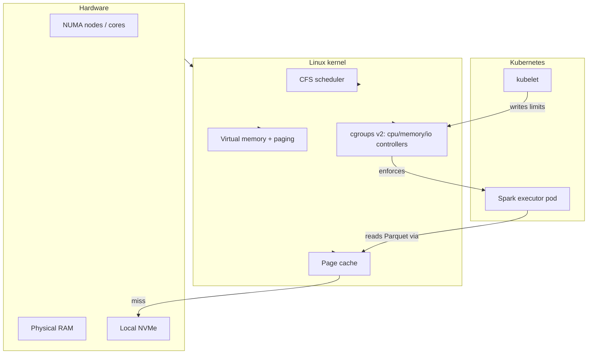
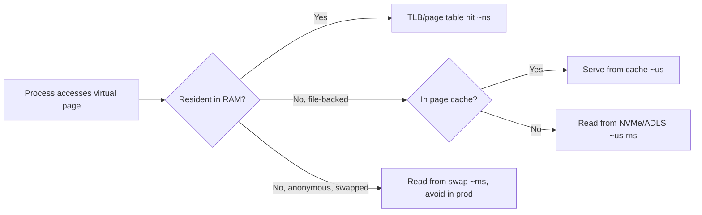
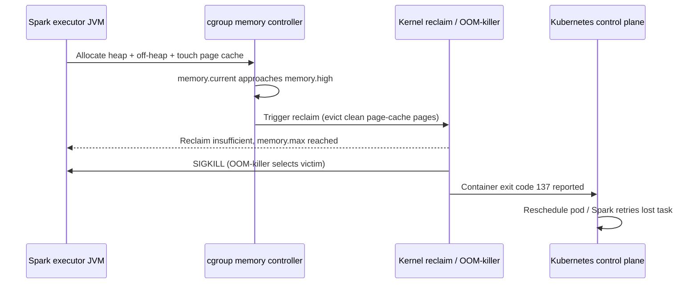

# Operating Systems for Data Engineers

> Part of the **Enterprise Data & AI Architecture Handbook** · Phase-00 — Foundations & Prerequisites · Chapter 03.
> Estimated study time: **60 min reading + ~4h labs**.
> **Prerequisite:** read [Computer Science Fundamentals](02_Computer_Science_Fundamentals.md) first.

---

## Executive Summary

Every Spark executor, Kafka broker, and Delta writer is, underneath, a Linux process fighting for the same four resources: **CPU time**, **memory pages**, **file descriptors**, and **I/O bandwidth**. The operating system arbitrates that fight through schedulers, virtual memory, the page cache, and the filesystem — and its decisions show up in your platform as GC pauses, executor OOM-kills, "noisy neighbor" throughput collapses, and mysterious throughput cliffs that no amount of Spark-config tuning fixes. [Computer Science Fundamentals](02_Computer_Science_Fundamentals.md) established *what* the memory hierarchy and complexity cost; this chapter explains *the mechanism* — processes, threads, paging, page cache, filesystems, cgroups, and NUMA — that the OS uses to enforce it.

This is the chapter where "my job is slow" becomes "container memory limit is below JVM heap + off-heap + page cache demand, and the kernel OOM-killer is reaping the executor" — a diagnosis you can act on. We cover process/thread models and CPU scheduling (why over-provisioning cores causes context-switch storms), virtual memory and paging (why `mmap`-heavy workloads thrash under memory pressure), the page cache (why the *first* read of a Parquet file is slow and the second is free — until cgroup limits reclaim it), buffered vs. direct I/O (why databases bypass the page cache and Spark usually should not), and Linux control mechanisms — cgroups, ulimits, NUMA — that are the actual enforcement layer behind Kubernetes resource requests/limits and Databricks cluster sizing.

The bias remains **Azure-primary (~60%)** — AKS, Databricks (Linux VMs under the hood), Azure Monitor for OS metrics — **~30% enterprise open source** (Linux/cgroups, Kubernetes, Kafka, Spark) and **~10% AWS/GCP comparison-only**. By the end you will read a `dmesg` OOM-kill log, a Spark GC/executor-lost stack trace, or a Kafka broker's I/O wait spike and know exactly which OS subsystem to blame — and how to fix it in the platform's IaC, not just the application config.

**Bottom line:** the OS is not "infrastructure trivia" — it is the runtime that turns your cluster-sizing decisions into either headroom or cascading failure. Architects who can reason about scheduling, paging, and the page cache prevent entire classes of "worked in staging, died in prod" incidents.

---

## Learning Objectives

By the end of this chapter you will be able to:

1. **Explain the process/thread model** and CPU scheduling well enough to diagnose context-switch storms and CPU-throttling in containerized Spark/Kafka clusters.
2. **Reason about virtual memory and paging** to explain OOM-kills, swap thrashing, and why JVM heap sizing must leave room for off-heap and the page cache.
3. **Exploit the page cache deliberately** for read-heavy analytics workloads, and know when `O_DIRECT`/direct I/O is the right override.
4. **Distinguish block vs. object storage I/O paths** and their latency/throughput implications for Spark shuffle and ADLS Gen2 access.
5. **Use Linux tooling** (cgroups v2, ulimits, `numactl`, `vmstat`, `iostat`) to diagnose and bound resource contention in multi-tenant clusters.
6. **Connect NUMA topology** to memory-bound Spark/Kafka performance on large VM SKUs.
7. **Translate OS-level findings into Azure/AKS/Databricks configuration** (resource requests/limits, VM SKU choice, huge pages, I/O scheduler) and defend those choices in review.

---

## Business Motivation

Cloud bills are, in large part, a bill for **OS resource contention** you did not design away:

- **Over-provisioned cores with under-provisioned scheduling awareness** cause context-switch storms that inflate CPU-seconds billed without inflating useful work.
- **Noisy-neighbor incidents** on shared Kubernetes nodes — one pod's memory pressure evicting another's page cache — cause SLA breaches that are invisible in application-level dashboards and only visible in `dmesg`/cgroup metrics.
- **Right VM SKU selection** (memory-optimized vs. compute-optimized vs. storage-optimized, NUMA-aware sizing) is an OS-level decision with a direct dollar sign attached; get it wrong and you pay for capacity you cannot use due to paging or cross-NUMA-node latency.
- **Reliability.** An OOM-killed executor mid-shuffle is not a "bug" — it's the kernel enforcing a cgroup limit you set too low. Understanding this converts a 2 a.m. page into a one-line Terraform/Helm fix instead of a multi-day investigation.

For an architect, OS fluency is the difference between "let's throw a bigger VM at it" (expensive, often wrong) and "the page cache is being evicted by cgroup memory pressure, raise the limit or reduce heap" (precise, cheap, defensible in a cost review).

---

## History and Evolution

- **1960s–70s — Multiprogramming and time-sharing.** CTSS/Multics/Unix introduce process isolation and preemptive scheduling — the origin of "fair" CPU sharing that Kubernetes CFS quotas still implement.
- **1979 — Virtual memory in Unix (BSD).** Demand paging decouples a process's address space from physical RAM, enabling overcommit — and, later, the OOM-killer as its dark twin.
- **1990s — The Linux page cache matures.** Free RAM is used to cache file data transparently; "free -m shows no free memory" becomes a famous non-issue precisely because of this design.
- **2000s — NUMA becomes mainstream** as multi-socket servers proliferate; the kernel's NUMA-aware scheduler and `numactl` emerge to avoid cross-socket memory latency penalties.
- **2007 — cgroups land in the Linux kernel** (Google's contribution), enabling resource isolation — CPU shares, memory limits, I/O weights — that underlies every container platform today.
- **2013 — Docker popularizes cgroups + namespaces** as "containers," making OS resource isolation a first-class deployment primitive.
- **2014–2018 — Kubernetes formalizes requests/limits** directly on top of cgroups, turning YAML into kernel enforcement.
- **2016 — cgroups v2 unified hierarchy** simplifies and strengthens memory/IO accounting (`memory.max`, `memory.high` PSI-aware throttling), now default on modern AKS node images.
- **2020–2026 — Cloud-native data platforms (Databricks, AKS-hosted Spark/Kafka/Flink) inherit all of this** transparently — meaning platform engineers who don't understand cgroups/paging/NUMA are debugging blind.

---

## Why This Technology Exists

The OS exists to solve a resource-multiplexing problem: many processes/threads want the CPU, RAM, disk, and network simultaneously, and hardware guarantees none of the safety or fairness needed for that to work. Specifically:

- **CPU scheduling** exists because there are more runnable threads than cores; the kernel must time-slice fairly (or with priority) without processes cooperating voluntarily.
- **Virtual memory** exists so every process can believe it owns a full, contiguous address space, enabling isolation (one process cannot read another's memory) and overcommit (more virtual memory promised than physical RAM installed).
- **The page cache** exists because RAM is the fastest *shared* resource for filesystem data — caching pages transparently means repeated reads avoid the ~20ms ADLS/disk penalty established in [Computer Science Fundamentals](02_Computer_Science_Fundamentals.md#storage).
- **Filesystems** exist to give byte-addressable, hierarchical structure to what a block device only offers as raw sectors.
- **cgroups/namespaces** exist because time-sharing alone is not enough in multi-tenant clusters — you need *hard, auditable* resource boundaries between workloads that don't trust each other.

Without these mechanisms, every Spark executor would need to manage physical memory addresses and disk sectors directly — impossible to build a reliable distributed data platform on top of.

---

## Problems It Solves

- **Fair(ish) CPU sharing** among many more threads than cores, via the Completely Fair Scheduler (CFS) and its cgroup-aware CPU quotas.
- **Memory isolation and overcommit** via virtual memory and paging, letting many JVMs/processes coexist on one host without addressing collisions.
- **Free performance via caching** — the page cache turns repeated reads of hot Parquet files into RAM-speed operations without any application code change.
- **Resource-limit enforcement** in multi-tenant clusters (AKS, Databricks shared clusters) via cgroups — the mechanism behind Kubernetes `requests`/`limits`.
- **Fault isolation** — one process crashing (segfault) does not corrupt another's address space, thanks to virtual memory protection.
- **NUMA-aware placement** to avoid cross-socket memory latency penalties on large multi-socket VMs.

---

## Problems It Cannot Solve

- **It cannot make an application memory-safe.** The OS isolates *processes*; a single JVM's own heap fragmentation or a Python process's reference cycles are the application's problem.
- **It cannot prevent OOM entirely, only govern it.** If aggregate demand exceeds physical RAM, *something* gets killed or swapped; the kernel's OOM-killer heuristics are not always what you'd choose (hence `oom_score_adj` tuning).
- **It cannot make slow storage fast.** The page cache accelerates *repeated* reads; a genuinely large, cold, one-pass scan against ADLS Gen2 still pays object-storage latency once per byte.
- **It cannot fix bad application-level parallelism.** Scheduling 200 threads fairly does not help if 195 of them are blocked on a single lock (see [Concurrency and Parallelism](06_Concurrency_and_Parallelism.md)).
- **It cannot guarantee determinism under contention.** cgroup CPU throttling and NUMA placement are best-effort; tail latency (p99) under a noisy neighbor is fundamentally harder to bound than throughput.
- **It cannot replace capacity planning.** cgroups and schedulers arbitrate what exists; they don't conjure more CPU/RAM than the VM SKU provides.

---

## Core Concepts

### 8.1 Processes, threads, and context switching

A **process** owns an address space, file descriptors, and at least one **thread** of execution; threads within a process share memory but have independent stacks and scheduling state. A **context switch** — the kernel saving one thread's registers/state and loading another's — costs roughly 1–10 µs directly, plus indirect cost from cold caches/TLB afterward (recall the memory-hierarchy latencies in [Computer Science Fundamentals](02_Computer_Science_Fundamentals.md#84-encoding)). Spark executors run many task threads per JVM; over-subscribing cores (more runnable threads than vCPUs) causes excessive context switching that shows up as high `%sys` CPU with falling task throughput.

### 8.2 CPU scheduling

Linux's **Completely Fair Scheduler (CFS)** allocates CPU time proportionally to "weight" (niceness) and, under cgroups v2, to `cpu.weight`/`cpu.max` quotas. A container given `cpu.max = 200000 100000` (2 cores per 100ms period) gets **throttled** — paused, not slowed — once it exceeds its quota within the period, producing sawtooth latency even when the *node* has idle capacity. This is the single most common invisible cause of "my pod is slow but `top` shows low CPU%" in Kubernetes/AKS.

### 8.3 Virtual memory and paging

Every process sees a virtual address space mapped to physical frames via **page tables**; the **TLB** caches recent translations (a TLB miss costs tens of cycles). **Demand paging** means pages are only backed by physical RAM when first touched. Under memory pressure, the kernel **reclaims** clean page-cache pages first (cheap), then may **swap** anonymous (heap) pages to disk (expensive, and often disabled entirely on Kubernetes nodes — `swapoff`). **Huge pages** (2MB/1GB instead of 4KB) reduce TLB misses for large, contiguous memory workloads (some JVM/Databricks configurations enable transparent huge pages for large heaps).

### 8.4 The page cache

Linux keeps recently read/written file pages in RAM indefinitely (until reclaimed), so `free -m` showing "low free memory" is normal and healthy — that memory is **reclaimable cache**, not a leak. This is why a second read of the same Parquet file is dramatically faster than the first: no ADLS/disk round-trip, just a page-cache hit. In cgroups v2, page-cache pages charged to a container's `memory.max` **can be reclaimed under pressure without OOM-killing the container** — but if reclaim can't keep up, `memory.max` triggers OOM-kill anyway.

### 8.5 Buffered vs. direct I/O

**Buffered I/O** (the default) goes through the page cache — good for repeated reads, bad for one-pass huge scans that pollute the cache and evict hotter data. **Direct I/O** (`O_DIRECT`) bypasses the page cache, going straight to the block device — databases (SQL Server, PostgreSQL) often use it because *they* manage their own buffer pool better than a generic OS cache would for their access pattern. Spark generally prefers buffered I/O plus its own off-heap/Tungsten memory management layered on top.

### 8.6 Filesystems: block vs. object I/O

A **block device** (local NVMe, Azure Premium SSD) exposes fixed-size sectors with POSIX semantics (seek, random write-in-place, `fsync`). **Object storage** (ADLS Gen2/Blob, S3) exposes whole-object PUT/GET with eventual/strong consistency but **no in-place mutation** — every "write" replaces or appends an object. This is precisely why Delta Lake/Parquet write immutable files and rely on a transaction log rather than in-place updates: the storage layer's I/O model dictates the table format's design (cross-reference [Storage Systems Fundamentals](05_Storage_Systems_Fundamentals.md)).

### 8.7 cgroups, ulimits, and NUMA

**cgroups v2** enforce CPU, memory, and I/O limits per container — the kernel mechanism behind every Kubernetes `resources.limits`. **ulimits** (`RLIMIT_NOFILE`, `RLIMIT_NPROC`) bound per-process file descriptors and thread counts — a common Kafka/Spark "too many open files" root cause. **NUMA** (Non-Uniform Memory Access) means on multi-socket VMs, memory attached to a *different* socket than the running CPU costs 1.5–2× the latency; `numactl --interleave` or pinning mitigates this on large memory-optimized Azure VMs.

---

## Internal Working

**How the CFS scheduler decides who runs.** Every runnable thread has a virtual runtime (`vruntime`) that increases as it consumes CPU; CFS always picks the thread with the smallest `vruntime` from a red-black tree, approximating fair sharing. Under cgroups v2 `cpu.weight`, a container's threads compete first *within* the cgroup, then the cgroup competes with siblings — a two-level fairness scheme. `cpu.max` adds a hard quota on top: once a cgroup exhausts its quota for the current 100ms period, its threads are simply not scheduled again until the next period — visible as periodic latency spikes correlated with `container_cpu_cfs_throttled_seconds_total` in Prometheus/Azure Monitor.

**How a page fault resolves.** On first access to a virtual page, the CPU raises a page fault; the kernel's fault handler checks if the page is (a) not yet backed (allocate a fresh zero-filled frame), (b) backed by a file (page cache — read from ADLS/disk if not resident), or (c) swapped out (read from swap, if enabled). Each of these has a wildly different latency, again per the memory hierarchy.

**How the OOM-killer decides.** When a cgroup hits `memory.max` and reclaim cannot free enough, the kernel selects a victim process by a badness score derived from RSS and `oom_score_adj`, then sends `SIGKILL`. For Spark, this typically kills the executor JVM, which Spark's driver observes as `ExecutorLostFailure`, triggering task retries on a different executor — visible as red "lost executor" bars in the Spark UI.

**How the page cache and Spark's off-heap interact.** A container's `memory.max` covers **both** the JVM heap **and** the page cache pages it has touched **and** off-heap (Tungsten/Netty) memory. If you size the container limit to the JVM `-Xmx` alone, the page cache and off-heap usage push total RSS over the cgroup limit — a classic **OOM despite "plenty of free heap"** incident.

---

## Architecture

The relevant OS architecture, top to bottom, as it applies to a Spark-on-Kubernetes or Databricks node:

1. **Hardware** — CPU cores, NUMA nodes, RAM, local NVMe, NIC.
2. **Kernel** — CFS scheduler, virtual memory manager, page cache, filesystem (ext4/xfs), network stack.
3. **cgroups v2 hierarchy** — per-pod/container CPU/memory/IO accounting and limits, enforced by the kernel on behalf of the container runtime (containerd).
4. **Container runtime + Kubernetes kubelet** — translates pod `resources.requests/limits` into cgroup parameters.
5. **JVM / Python process (Spark executor, Kafka broker)** — requests heap/off-heap memory and threads from the OS within its cgroup's bounds.
6. **Application scheduling layer** — Spark's own task scheduler, layered *on top of* OS thread scheduling — see [Concurrency and Parallelism](06_Concurrency_and_Parallelism.md).

A performance incident is almost always a mismatch **between layers 3 and 5**: the application (layer 5) assumes it owns the resources it requested, while the kernel (layer 3) enforces a harder, differently-accounted limit.

---

## Components

| Component | Role | Concrete instantiation |
|---|---|---|
| **CFS scheduler** | Time-slices CPU fairly | Linux kernel, cgroup `cpu.weight`/`cpu.max` |
| **Virtual memory manager** | Address translation, paging, protection | Page tables, TLB, kernel `mm` subsystem |
| **Page cache** | Caches file data in free RAM | Kernel page cache, backs Parquet/Delta reads |
| **OOM-killer** | Reaps processes under memory pressure | cgroup `memory.max`, `oom_score_adj` |
| **Filesystem driver** | Translates file ops to block/object I/O | ext4/xfs (block), ADLS Gen2 driver (object) |
| **cgroup controllers** | Enforce CPU/memory/IO limits per container | `cpu`, `memory`, `io` controllers (cgroups v2) |
| **NUMA balancer** | Places memory near the CPU using it | Kernel `numa_balancing`, `numactl` |
| **I/O scheduler** | Orders/merges block I/O requests | `mq-deadline`, `none` (for NVMe) |

---

## Metadata

OS-level "metadata" that drives decisions:

- **`/proc` and `/sys` filesystems** — live process, memory, and cgroup state (`/proc/meminfo`, `/sys/fs/cgroup/.../memory.current`).
- **cgroup accounting counters** — `memory.current`, `memory.max`, `memory.stat` (cache vs. anon breakdown), `cpu.stat` (`nr_throttled`, `throttled_usec`).
- **NUMA topology metadata** — `numactl --hardware` reports nodes, CPU-to-node mapping, and per-node memory, essential for sizing memory-optimized VMs correctly.
- **Filesystem metadata** — inode tables, extents (block); ADLS Gen2 hierarchical namespace metadata (directories as first-class objects, unlike flat blob storage) — cross-reference [Storage Systems Fundamentals](05_Storage_Systems_Fundamentals.md).
- **Scheduler statistics** — `vmstat`, `mpstat` expose run-queue length and context-switch rate, the leading indicators of CPU oversubscription.

Good OS observability *is* good metadata collection: without `cpu.stat`/`memory.stat` scraped into Azure Monitor/Prometheus, throttling and page-cache eviction are invisible.

---

## Storage

Extending [Computer Science Fundamentals — Storage](02_Computer_Science_Fundamentals.md#storage), the OS mediates every tier:

| Layer | OS mechanism | Azure realization |
|---|---|---|
| RAM cache | Page cache (buffered I/O) | VM memory backing Databricks/AKS node |
| Local block | ext4/xfs on local NVMe | `Lsv3` local SSD, Premium SSD v2 |
| Network block | iSCSI-like remote block semantics | Azure Managed Disks (remote-attached) |
| Object | HTTP PUT/GET, no in-place mutation | ADLS Gen2 (Blob + hierarchical namespace) |

**Key OS-level distinction:** local/managed disks support `fsync`, random writes, and POSIX file locking; ADLS Gen2 does not — it is accessed through an HDFS-compatible driver (`abfss://`) that *emulates* filesystem semantics over an object API. This emulation gap is why Delta Lake needs its own transaction log for atomic multi-file commits — the underlying object store gives you no cross-object transaction primitive.

---

## Compute

OS-level compute considerations for sizing:

- **vCPU oversubscription.** Spark `--executor-cores` should not exceed the cgroup's effective CPU quota; requesting more task-parallelism than quota-backed cores causes throttling, not more throughput.
- **NUMA-aware sizing.** On Azure `Esv5`/`Ev5`-class VMs with multiple NUMA nodes, pin Spark executors (via `numactl` or Kubernetes topology manager) so a JVM's heap lives on one NUMA node it primarily runs on — cross-node access can add 50–100% memory latency.
- **Huge pages for large JVM heaps.** Large-heap executors (>32GB) benefit from transparent huge pages, reducing TLB miss rate for heap scans (GC marking).
- **Thread pool sizing vs. core count.** Rule of thumb: (thread pool size) ≈ (available cores) × (target CPU utilization), not an arbitrarily large number "to be safe" — oversized pools *reduce* throughput via context-switch overhead.

---

## Networking

- **The network stack is itself OS-managed** — socket buffers, TCP congestion control, and NIC interrupt handling (IRQ affinity) all affect Kafka/shuffle throughput.
- **`SO_RCVBUF`/`SO_SNDBUF` sizing** interacts with the page cache indirectly: network receive buffers are kernel memory, competing with page cache under memory pressure.
- **NUMA-aware NIC affinity.** On large VMs, binding network-heavy processes (Kafka brokers) to CPUs on the NUMA node closest to the NIC reduces cross-node interrupt handling latency.
- Full treatment in [Networking Fundamentals](04_Networking_Fundamentals.md); this chapter's contribution is *where the OS sits* in that path (kernel socket buffers → NIC driver → hardware).

---

## Security

- **Namespace isolation** (PID, mount, network, user namespaces) is the OS mechanism containers use for tenant isolation — but namespaces are not a hard security boundary against kernel exploits (hence Kata Containers/gVisor for stronger isolation in regulated multi-tenant scenarios).
- **cgroup limits as a DoS mitigation.** Without CPU/memory limits, one noisy container can starve co-located workloads — an availability, not just performance, concern (OWASP-adjacent: unbounded resource consumption).
- **`ulimit`/`RLIMIT_NOFILE`** prevents file-descriptor exhaustion attacks/bugs from one process taking down a shared host.
- **Swap and sensitive data.** If swap is enabled, sensitive in-memory data (secrets, decrypted payloads) can be written to disk in plaintext unless swap encryption is configured — a reason Kubernetes nodes typically run with swap disabled.
- **Kernel patching cadence.** AKS-managed node images apply kernel security patches on a maintenance schedule; unmanaged/self-hosted Linux nodes are the customer's responsibility (shared responsibility model).

---

## Performance

OS-driven performance levers, in priority order:

1. **Right-size cgroup CPU quota to actual thread count** — eliminate throttling before anything else; check `container_cpu_cfs_throttled_seconds_total`.
2. **Leave headroom above JVM `-Xmx` for off-heap + page cache** inside the container memory limit — typical Spark guidance: container limit ≈ 1.1–1.2× (heap + off-heap), not heap alone.
3. **Prefer buffered I/O for analytical scans**; let the page cache do its job — avoid forcing `O_DIRECT` unless you have a database-like buffer manager.
4. **Pin for NUMA locality on large VMs** to avoid cross-socket memory penalties.
5. **Watch context-switch rate (`vmstat cs` column) and run-queue length** as the leading indicators of CPU oversubscription.
6. **Use huge pages for very large heaps** to cut TLB miss overhead.
7. **Avoid swap in latency-sensitive services**; disable it on Kubernetes nodes, size memory instead.

**Worked example.** A Kafka broker pod requested `cpu: "4"`, limit `cpu: "4"`, but the JVM was configured with `-XX:ParallelGCThreads=16` and default I/O thread pools sized off `Runtime.availableProcessors()` (which reported the **node's** 32 cores, not the cgroup's 4-core quota, on an older cgroups v1 kernel). The result: massive over-threading, constant CFS throttling, and p99 produce-latency 10× higher than expected. Fix: pin JVM ergonomics to the cgroup-visible CPU count (fixed by default in modern JDKs with cgroup v2 awareness) and align thread-pool sizes to actual quota.

---

## Scalability

- **Vertical scaling hits NUMA and page-cache limits before it hits raw RAM limits.** A single JVM heap spanning multiple NUMA nodes suffers latency penalties that don't show up until you scale past one socket's worth of memory.
- **Horizontal scaling multiplies OS-level overhead linearly** (each new pod/node re-pays context-switch and page-fault costs), but avoids the cross-NUMA penalty entirely — often why "more, smaller executors" beats "fewer, giant executors" on multi-socket hardware.
- **cgroup CPU throttling caps effective scalability** regardless of node capacity — a workload can be "scaled out" on paper (more replicas) while every replica is individually throttled, producing no net throughput gain.
- **Page-cache scalability is per-node, not per-cluster** — cache warmth does not travel with data across nodes, which is why Spark's data-locality scheduling (preferring tasks run where data/cache already resides) matters.

---

## Fault Tolerance

- **OOM-kill is a fault-tolerance mechanism, not just a failure** — the kernel sacrifices one process to keep the node alive; Spark/Kubernetes are designed to retry the lost task/pod elsewhere. Understanding this reframes "executor lost" alerts from "something is broken" to "the safety valve worked, but check *why* it engaged."
- **`fsync` and durability.** A write is only durable once `fsync`'d past the page cache to the physical device (or acknowledged by ADLS Gen2's replication); Kafka's `acks=all` and `flush.messages` settings interact directly with this OS-level durability boundary.
- **Node/VM eviction.** Azure Spot VMs and AKS node draining rely on OS-level graceful shutdown signals (`SIGTERM` then `SIGKILL` after a grace period) — applications must handle `SIGTERM` to checkpoint state before the harder kill.
- **cgroup memory pressure vs. hard OOM.** cgroups v2 `memory.high` provides a *soft* throttle-and-reclaim signal before the *hard* `memory.max` kill — configuring both gives workloads a chance to shed load gracefully.

---

## Cost Optimization (FinOps)

- **Eliminate CPU throttling before buying more cores.** A throttled 4-core container often just needs its thread pools right-sized, not an 8-core upgrade.
- **Exploit the page cache instead of paying for a bigger warm cache elsewhere** (e.g., a Redis layer) when the access pattern is read-heavy and node-local re-reads are common.
- **NUMA-aware placement avoids paying for a bigger VM SKU** whose extra capacity is unusable due to cross-node latency.
- **Right memory headroom avoids the "OOM → retry → re-read from ADLS → re-processing cost" cycle**, which is often more expensive than the RAM you were trying to save.
- **Spot/low-priority VMs** for OS-fault-tolerant, checkpointed batch workloads reduce compute cost 60–90%, relying on graceful `SIGTERM` handling described above.

**Worked FinOps example — headroom cost vs. OOM-retry cost (illustrative rates; verify current figures in the Azure Pricing Calculator).** A streaming job runs on a `Standard_E16s_v5` node pool at roughly $1.30/VM-hour pay-as-you-go. Raising the per-executor memory limit by 20% (to stop OOM-kills) requires two extra nodes across a 10-node pool: 2 × $1.30 ≈ $2.60/hour ≈ **~$1,900/month**. Compare that to the cost of *not* fixing it: 50 OOM-kills/day, each forcing a ~200GB shuffle partition to be re-read from ADLS Gen2 (~$0.02/GB read/transaction cost) and reprocessed on a 16-vCPU node for ~10 minutes (~$0.22 compute) — roughly $0.40–$0.50 per incident, or **~$700–$750/month** in direct reprocessing spend alone, before counting SLA breach cost or on-call time. In this shape, the extra headroom pays for itself if it eliminates more than roughly half the daily OOM-kills — a one-line justification an architect can defend in a cost review instead of "let's add a bigger VM."

---

## Monitoring

Monitor the OS signals that predict incidents before they page you:

- **CPU:** `container_cpu_cfs_throttled_seconds_total`, run-queue length (`vmstat r`), context switches/sec (`vmstat cs`).
- **Memory:** cgroup `memory.current` vs. `memory.max`, page-cache vs. anon breakdown (`memory.stat`), swap usage (should be ~0 on Kubernetes nodes), OOM-kill events (`dmesg`, kubelet events).
- **I/O:** `iostat -x` for device utilization/await time, page-fault rate (`sar -B`).
- **NUMA:** `numastat` for cross-node memory access counts.

In Azure, surface these via **Azure Monitor Container Insights** (AKS) and **Databricks cluster metrics** (Ganglia/Spark UI plus node-level VM metrics), alerting on throttling ratio and OOM-kill counts as leading indicators, not just CPU%/memory% averages which hide throttling entirely.

---

## Observability

- **Correlate application symptoms to kernel events.** A Spark "Executor Lost" event should be cross-referenced against the node's `dmesg` OOM-kill log and cgroup memory stats at that timestamp — Azure Monitor Log Analytics can join AKS node syslogs with pod events for this.
- **Flame graphs and `perf`** attribute CPU time to kernel vs. user space, revealing whether time is spent in application code, GC, or syscalls (e.g., excessive `fsync` calls).
- **eBPF-based tooling** (e.g., `bpftrace`, or managed equivalents) gives low-overhead, production-safe visibility into scheduling latency and page faults without the overhead of full `strace`.
- **Structured incident timelines** should explicitly record: was this CPU-throttled, memory-reclaimed, OOM-killed, or NUMA-cross-node? — that classification determines the fix.

---

## Operational Response Playbook

These are the two highest-frequency OS-level incidents on a Spark/Kafka-on-AKS or Databricks estate, each expressed as **signal → detection query → remediation**.

### Playbook 1: Executor/pod OOM-killed

| Step | Action |
|---|---|
| **Signal** | Spark UI shows a red "Executor Lost" event with `ExecutorLostFailure`; `kubectl get pods` shows `OOMKilled` with `Exit Code: 137`; `dmesg`/kubelet events show `oom-kill` or `OOMKilling`. |
| **Detection query (KQL, Azure Monitor Log Analytics)** | `KubePodInventory \| where PodStatus == "Failed" \| join kind=inner (KubeEvents \| where Reason == "OOMKilling") on ContainerID \| project TimeGenerated, PodName, Namespace, Reason, Message` (same query as in the Azure Implementation section above). |
| **Detection command (kubectl)** | `kubectl describe pod <pod> \| grep -A5 "Last State"` — confirm `Reason: OOMKilled`. |
| **Immediate remediation** | Do **not** just add more replicas. Compare `memory.max` against `memory.stat` (anon vs. cache split) at the kill timestamp; if off-heap/cache pushed RSS over the limit, raise the container memory limit to heap × 1.2–1.5, or lower `-Xmx` to restore headroom. |
| **Root-cause check** | Was `memory.high` configured below `memory.max`? If not, the container had no soft-reclaim warning before the hard kill — configure both. |
| **Follow-up** | Add the worked FinOps comparison above (headroom cost vs. reprocessing cost) to the incident follow-up before deciding the "right" limit. |

### Playbook 2: CPU throttling with misleadingly low CPU%

| Step | Action |
|---|---|
| **Signal** | Sawtooth task latency in the Spark UI or an API's p99 despite `top`/node CPU% appearing low; the node has idle capacity but the pod does not use it. |
| **Detection query (KQL)** | `InsightsMetrics \| where Name == "cpuUsageNanoCores" or Name == "cpuThrottledNanoSeconds" \| where Tags has "<pod-name>" \| summarize ThrottledRatio = sum(todouble(Val)) by bin(TimeGenerated, 5m)` — or, on raw Prometheus/Container Insights, chart `container_cpu_cfs_throttled_seconds_total / container_cpu_cfs_periods_total`. |
| **Detection command** | `cat /sys/fs/cgroup/cpu.stat` inside the pod (cgroups v2) — check `nr_throttled` and `throttled_usec` growing over time. |
| **Immediate remediation** | Right-size thread pools (JVM GC threads, Spark task threads, I/O pools) to the cgroup-visible CPU quota, not `Runtime.availableProcessors()` against the node's full core count. |
| **Root-cause check** | Confirm the JDK/runtime is cgroup-v2 aware; older or misconfigured runtimes report the *node's* core count instead of the *cgroup's* quota, causing over-threading. |
| **Follow-up** | Add throttling ratio as a first-class SLI in Azure Monitor, alerting on the ratio itself — not on raw CPU% — since throttled pods often show low average CPU%. |

---

## Governance

- **Standardize container resource requests/limits** as a *reviewed* platform default (not per-team guesswork), informed by profiled JVM heap + off-heap + page-cache headroom.
- **Mandate swap-disabled, `memory.high` + `memory.max` configured** node pools as a platform baseline for latency-sensitive workloads.
- **Require NUMA topology awareness** in the VM-SKU selection guidance for any memory-optimized workload above a size threshold.
- **Audit kernel/node-image patch cadence** as part of the platform's security governance (ties to [Introduction](01_Introduction.md)'s ADR practice) — unpatched kernels are a compliance finding waiting to happen.
- **Capacity-planning ADRs** should cite OS-level headroom math (heap + off-heap + cache vs. cgroup limit), not just "peak CPU% observed."

---

## Trade-offs

| Decision | Option A | Option B | Trade-off |
|---|---|---|---|
| I/O mode | Buffered (page cache) | Direct (`O_DIRECT`) | Free caching vs. app-managed buffer control |
| CPU allocation | Fewer, larger executors | More, smaller executors | NUMA locality vs. per-node overhead multiplication |
| Memory headroom | Tight (max density) | Generous (safety margin) | Cost/density vs. OOM-kill risk |
| Swap | Enabled | Disabled | Overcommit resilience vs. unpredictable latency |
| Huge pages | Enabled | Default (4KB) | Lower TLB miss vs. memory fragmentation risk |
| Node sharing | Multi-tenant shared cluster | Dedicated node pools | Cost efficiency vs. noisy-neighbor isolation |

---

## Decision Matrix

**Choosing container memory limit strategy:**

| Workload | Tight limit (=heap) | Limit = heap × 1.2 | Limit = heap × 1.5+ |
|---|---|---|---|
| Latency-sensitive stream (Kafka) | ❌ (OOM risk) | ✅✅ | ⚠️ (waste) |
| Batch Spark ETL (spill-tolerant) | ⚠️ | ✅ | ✅✅ (headroom for shuffle spill) |
| Interactive notebook | ⚠️ | ✅✅ | ⚠️ |

**Choosing I/O mode:**

| Access pattern | Buffered I/O | Direct I/O |
|---|---|---|
| Repeated reads of hot data | ✅✅ | ❌ (no cache benefit) |
| One-pass huge sequential scan | ⚠️ (cache pollution) | ✅ (if app has own buffer mgmt) |
| Custom buffer-pool DB engine | ❌ | ✅✅ |
| Spark/Delta analytics | ✅✅ (default) | ❌ (rarely justified) |

---

## Design Patterns

- **Right-size cgroup limits from profiled heap + off-heap + cache**, not guesswork — a repeatable sizing formula as a platform template.
- **NUMA pinning for large, memory-bound executors** on multi-socket SKUs.
- **Soft-then-hard memory thresholds** (`memory.high` before `memory.max`) to allow graceful degradation.
- **Data-locality-aware scheduling** to exploit warm page caches (Spark's preferred-locality task placement).
- **Graceful `SIGTERM` handling** for Spot VM eviction / node draining, checkpointing state before hard kill.
- **Dedicated node pools for noisy or latency-sensitive workloads** to avoid cgroup-level contention with batch jobs.

---

## Anti-patterns

- **Sizing JVM `-Xmx` equal to the container memory limit** — leaves no room for off-heap/page cache, guarantees eventual OOM-kill.
- **Ignoring CPU throttling metrics** and scaling up cores/nodes when the real fix is thread-pool right-sizing.
- **Enabling swap "for safety" on latency-sensitive nodes** — trades hard failure (OOM) for silent, unpredictable latency (swap thrashing), which is usually worse.
- **Treating `free -m` "low free memory" as a problem** — most of it is reclaimable page cache; alerting on this metric alone causes false-positive pages.
- **Ignoring NUMA topology on large memory-optimized VMs** — leaves 30-50% performance on the table silently.
- **Running JVMs with pre-cgroup-v2-aware Java versions** in containers, causing `Runtime.availableProcessors()` mis-detection and over-threading.

---

## Common Mistakes

1. Alerting on raw memory usage % instead of cgroup pressure/reclaim/OOM-kill events.
2. Confusing "container was OOM-killed" with "there was a memory leak" — often it's just under-provisioned headroom.
3. Assuming more vCPU requests always increase throughput, ignoring CFS quota throttling.
4. Not distinguishing anonymous (heap) memory from page-cache memory when diagnosing "high memory" pods.
5. Forgetting that `O_DIRECT` requires the *application* to manage caching — using it without a buffer pool actively hurts performance.
6. Sizing VMs by vCPU/RAM ratio alone, ignoring NUMA node count and per-node memory bandwidth.
7. Leaving swap enabled by default on Kubernetes worker nodes.

---

## Best Practices

- **Profile real heap + off-heap + cache usage** before setting container limits; leave 15-25% headroom.
- **Configure `memory.high` below `memory.max`** for graceful reclaim before hard kill.
- **Disable swap** on Kubernetes/AKS nodes for predictable latency; rely on cgroup memory limits + retries instead.
- **Right-size thread pools to cgroup-visible CPU quota**, verified with modern (cgroup-v2-aware) JVMs.
- **Pin NUMA-sensitive workloads** on multi-socket VM SKUs.
- **Monitor throttling, OOM-kill counts, and swap usage** as first-class SLIs, not just CPU/memory averages.
- **Prefer dedicated node pools** for workloads with strict latency SLAs to avoid multi-tenant cgroup contention.

---

## Enterprise Recommendations

1. **Standardize AKS/Databricks node pool templates** with swap disabled, cgroups v2, and pre-computed memory-headroom ratios per workload class (streaming vs. batch vs. interactive).
2. **Bake NUMA-awareness into VM SKU selection guidance** for memory-optimized workloads above a documented size threshold.
3. **Instrument cgroup throttling/OOM metrics centrally** in Azure Monitor, with alerting thresholds distinct from raw CPU/memory percentage.
4. **Mandate `SIGTERM` handling and checkpointing** for any workload targeted at Spot/low-priority VM pools.
5. **Require a one-paragraph OS-headroom justification** in capacity-planning ADRs for any new large-memory workload.
6. **Provide a platform "sizing calculator"** translating profiled JVM/Python memory usage into recommended cgroup limits, reducing per-team guesswork.

---

## Azure Implementation

**AKS node pool with swap disabled and cgroup v2 (illustrative Bicep/CLI).**
```bash
# Create an AKS node pool on a memory-optimized SKU, cgroups v2 is default on
# modern Azure Linux / Ubuntu 22.04+ node images.
az aks nodepool add \
  --resource-group rg-data-platform \
  --cluster-name aks-data-platform \
  --name mem-optimized \
  --node-vm-size Standard_E16s_v5 \
  --node-count 3 \
  --node-osdisk-type Ephemeral \
  --labels workload=spark-streaming
```

**Kubernetes pod resource requests/limits sized with OS headroom in mind.**
```yaml
apiVersion: v1
kind: Pod
metadata:
  name: spark-executor
spec:
  containers:
    - name: executor
      image: myregistry.azurecr.io/spark:3.5
      resources:
        requests:
          cpu: "4"
          memory: "12Gi"     # heap (8Gi) + off-heap/cache headroom (~4Gi)
        limits:
          cpu: "4"
          memory: "12Gi"
      env:
        - name: JAVA_TOOL_OPTIONS
          value: "-Xmx8g -XX:+UseContainerSupport"  # cgroup-aware JVM ergonomics
```

**Databricks cluster policy enforcing memory-optimized SKU + local NVMe for shuffle-heavy jobs.**
```json
{
  "node_type_id": {"type": "fixed", "value": "Standard_E16ds_v5"},
  "spark_conf.spark.executor.memory": {"type": "fixed", "value": "24g"},
  "spark_conf.spark.executor.memoryOverhead": {"type": "fixed", "value": "6g"}
}
```

**Diagnosing throttling/OOM via Azure Monitor Log Analytics (KQL).**
```kusto
KubePodInventory
| where PodStatus == "Failed"
| join kind=inner (KubeEvents | where Reason == "OOMKilling") on ContainerID
| project TimeGenerated, PodName, Namespace, Reason, Message
```

---

## Open Source Implementation

- **Linux kernel** — CFS scheduler, virtual memory manager, page cache, cgroups v2 controllers: the foundation everything else sits on.
- **Kubernetes** — translates `resources.requests/limits` into cgroup parameters via the kubelet and container runtime (containerd/CRI-O).
- **Prometheus + Grafana** — scrape `cadvisor`/`node-exporter` metrics (`container_cpu_cfs_throttled_seconds_total`, `node_memory_*`, `node_vmstat_*`) for OS-level dashboards.
- **Apache Spark** — its executor memory model (heap, execution memory, storage memory, off-heap, overhead) directly maps onto cgroup memory accounting; `spark.executor.memoryOverhead` exists *because of* this OS-level reality.
- **Apache Kafka** — relies heavily on the page cache (deliberately keeps a small JVM heap and lets the OS cache log segments) — one of the most-cited examples of designing an application *around* OS behavior rather than against it.

**Linux diagnostic commands.**
```bash
# CPU throttling / run-queue pressure
vmstat 1 5

# Per-cgroup memory breakdown (cache vs anon)
cat /sys/fs/cgroup/memory.stat

# NUMA topology and cross-node access counts
numactl --hardware
numastat

# I/O device utilization and await time
iostat -x 1 5

# Pin a process to NUMA node 0
numactl --cpunodebind=0 --membind=0 spark-submit ...
```

**Kafka broker JVM sized deliberately small to favor page cache.**
```properties
# server.properties + KAFKA_HEAP_OPTS
# Small heap (6-8GB) even on a 64GB host: the rest is left for the OS page
# cache, which backs Kafka's log-segment reads/writes.
KAFKA_HEAP_OPTS="-Xmx6g -Xms6g"
```

---

## AWS Equivalent (comparison only)

| Azure | AWS equivalent | Notes |
|---|---|---|
| AKS node pools | Amazon EKS managed node groups | Same underlying Linux/cgroups/kubelet mechanics. |
| Azure VM SKUs (Esv5, Lsv3) | EC2 instance families (R-series, I-series) | NUMA topology and local-NVMe considerations transfer directly. |
| Azure Monitor Container Insights | Amazon CloudWatch Container Insights | Same cgroup/cAdvisor metric sources underneath. |
| Databricks on Azure | Databricks on AWS / EMR | Identical OS-level behavior (Linux VMs); differs in managed tooling. |

**Advantages of AWS:** broader instance-family selection for NUMA/memory-bandwidth-sensitive workloads (e.g., high-memory-bandwidth EC2 types). **Disadvantages:** more manual node-pool/AMI patching discipline required outside EKS-optimized AMIs. **Migration strategy:** OS-level tuning (cgroup limits, swap-off, NUMA pinning) is portable almost verbatim; only VM SKU names and managed-monitoring integration change. **Selection criteria:** choose by existing cloud commitment; the OS mechanics are identical Linux underneath both.

---

## GCP Equivalent (comparison only)

| Azure | GCP equivalent | Notes |
|---|---|---|
| AKS | Google Kubernetes Engine (GKE) | GKE Autopilot abstracts node-level cgroup tuning further than AKS/EKS. |
| Azure VM SKUs | GCE machine families (N2, M-series) | M-series targets memory-bound/NUMA-sensitive workloads similarly to Azure `Esv5`. |
| Azure Monitor | Google Cloud Operations (Cloud Monitoring) | Same cAdvisor/node-exporter metric lineage. |

**Advantages of GCP:** GKE Autopilot removes node-level OS tuning entirely (trade-off: less control). **Disadvantages:** less direct access to cgroup/NUMA tuning under Autopilot when you *do* need it. **Migration strategy:** for workloads requiring explicit NUMA/cgroup control, prefer GKE Standard (not Autopilot) to retain the same tuning surface as AKS/EKS. **Selection criteria:** choose Autopilot-style abstraction only when the workload is not memory-bandwidth or latency-sensitive enough to need manual OS tuning.

---

## Migration Considerations

- **cgroup version parity.** Verify the target platform's node images default to cgroups v2 (as AKS/EKS/GKE modern images do); mixed v1/v2 clusters have inconsistent memory-accounting semantics that can silently change OOM behavior.
- **NUMA topology differs by VM/instance family across clouds** — re-validate pinning strategy; a workload tuned for a 2-NUMA-node Azure `Esv5` may land on a differently-shaped AWS/GCP instance.
- **Swap defaults** may differ across managed Kubernetes offerings — explicitly verify swap-off is enforced on the target.
- **JVM ergonomics.** Confirm the target JDK version is cgroup-v2-aware (`Runtime.availableProcessors()` correctness); older JDKs on a new platform can silently regress.
- **I/O scheduler and local disk type** (ephemeral NVMe vs. network-attached) changes shuffle-spill performance; re-benchmark, don't assume parity.

---

## Mermaid Architecture Diagrams

**Diagram 1 — OS layers under a Spark executor pod (architecture).**


**Diagram 2 — Page fault resolution paths (state view).**


**Diagram 3 — cgroup memory pressure to OOM-kill (sequence).**


---

## End-to-End Data Flow

Trace a Spark ETL job through the OS stack:

1. **Submit.** `spark-submit` requests executors; Kubernetes schedules pods onto AKS nodes based on `resources.requests` (CPU/memory) — matched against node capacity and NUMA-aware bin-packing where configured.
2. **Launch.** The kubelet configures cgroup v2 limits (`cpu.max`, `memory.max`, `memory.high`) for each executor container; the JVM starts, detects its cgroup-visible CPU count, and sizes GC threads/thread pools accordingly.
3. **Read.** The executor reads Parquet files from ADLS Gen2 via `abfss://`. First read: page fault → cache miss → object-storage GET (~20ms). Subsequent re-reads of the same blocks (e.g., speculative re-execution): page cache hit (~µs) — assuming the container hasn't been evicted from that node.
4. **Compute.** Tasks run as threads within the executor JVM; CFS time-slices them against the cgroup's CPU quota. If task count exceeds quota-backed cores, CFS throttling introduces latency.
5. **Shuffle.** Intermediate data spills to local NVMe (buffered I/O, page-cache-backed) if it doesn't fit in execution memory; the OS's block I/O scheduler and page cache jointly determine shuffle-spill latency.
6. **Memory pressure.** If heap + off-heap + touched page-cache pages approach `memory.max`, the kernel first reclaims cache pages, then — if still over — OOM-kills the executor; Spark's driver detects `ExecutorLostFailure` and retries the task on another executor.
7. **Complete & release.** On completion, the pod terminates; cgroup accounting is torn down; page-cache pages from that node may remain warm for the *next* job's benefit (data-locality scheduling exploits this).

Every stage of this flow is governed by an OS mechanism described in this chapter.

---

## Real-world Business Use Cases

- **Multi-tenant Databricks/AKS clusters.** cgroup isolation prevents one team's runaway job from starving another's SLA-bound pipeline.
- **Streaming fraud detection (Kafka + Flink).** Deliberately small JVM heaps + large page cache deliver the low-latency log reads the SLA demands.
- **Financial batch close (Spark on AKS Spot VMs).** Graceful `SIGTERM` handling and checkpointing let cost-optimized preemptible compute complete reliably despite OS-level eviction.
- **Large in-memory feature stores.** NUMA-aware pinning on memory-optimized VMs avoids silent 30-50% latency penalties for real-time feature serving.
- **Regulated workloads.** Swap-disabled, encrypted-at-rest node pools prevent sensitive in-memory data from leaking to disk via swap.

---

## Industry Examples

- **LinkedIn/Kafka.** The canonical example of designing an application to *lean on* the OS page cache rather than reimplement caching — small JVM heap by design.
- **Google — cgroups origin.** Google contributed cgroups to the Linux kernel to solve exactly the multi-tenant resource-isolation problem Borg (and later Kubernetes) needed.
- **Netflix — NUMA-aware tuning** for large in-memory services, published performance-engineering write-ups on cross-socket memory latency.
- **Databricks — Photon and off-heap memory management** deliberately minimize JVM GC pauses by moving data off-heap, reducing pressure on both the GC and the OS memory accounting.

---

## Case Studies

**Case 1 — The "phantom" OOM-kill.** A Spark streaming job on AKS had `-Xmx` set equal to the pod's memory limit. Under normal load it ran fine; under a burst that grew off-heap (Netty buffers for larger microbatches), the container was OOM-killed every few hours, always misdiagnosed as "a memory leak in the app." Root cause: no headroom for off-heap/cache. *Lesson:* size container limits at 1.2-1.5× heap, not 1.0×.

**Case 2 — Kafka broker throughput cliff after a "right-sizing."** A well-intentioned cost-optimization increased Kafka broker JVM heap from 6GB to 24GB on a 32GB host "to give it more memory," which starved the page cache the broker relied on for log-segment reads, causing a throughput cliff and increased disk I/O. *Lesson:* for page-cache-dependent systems, more heap can be *worse*.

**Case 3 — Cross-NUMA feature-store latency.** A real-time feature-serving service on a 2-socket, 4-NUMA-node Azure `Esv5` VM showed inconsistent p99 latency that no code change fixed. `numastat` revealed ~40% of memory accesses were cross-node. Pinning the process with `numactl --membind` to match its CPU affinity cut p99 latency by ~35%. *Lesson:* NUMA topology matters on large VMs and is invisible without the right tooling.

**Case 4 — CPU throttling masquerading as "Spark tuning needed."** A team spent two weeks tuning `spark.sql.shuffle.partitions` and executor counts to fix slow ETL, when `container_cpu_cfs_throttled_seconds_total` (never previously monitored) showed 60% of wall-clock time was throttling wait. Root cause: `--executor-cores 8` on pods with a `cpu.max` limit of 4 cores. *Lesson:* verify cgroup-visible resources before application-level tuning.

---

## Hands-on Labs

> Target ~4 hours. Use a local Linux VM/WSL2 or an AKS dev cluster.

**Lab A — Watch the page cache work (30 min).**
1. Drop caches (`echo 3 > /proc/sys/vm/drop_caches`, requires root), time a cold read of a large Parquet file, then time a warm re-read. Quantify the speedup and explain via [Computer Science Fundamentals](02_Computer_Science_Fundamentals.md#storage).

**Lab B — Reproduce CPU throttling (45 min).**
2. Run a CPU-bound container with `cpu.max` set below its thread count (e.g., 8 busy-loop threads, `cpu.max = "200000 100000"`). Observe `cpu.stat`'s `nr_throttled`/`throttled_usec` climbing while `top` shows <100% CPU.

**Lab C — Trigger and diagnose an OOM-kill (45 min).**
3. Set a container `memory.max` below its JVM `-Xmx` + expected off-heap. Run a memory-growing workload; observe the `dmesg`/kubelet OOM event and correlate the timestamp with `memory.stat`.

**Lab D — NUMA visibility (30 min).**
4. On a multi-socket machine (or simulate with `numactl --hardware` on any NUMA-capable host), run `numastat` before/after pinning a memory-intensive process with `numactl --membind`. Compare cross-node access counts.

**Lab E — cgroup memory breakdown (30 min).**
5. Inspect `/sys/fs/cgroup/.../memory.stat` for a running Spark executor pod; classify current usage into anonymous (heap) vs. file-backed (cache) and explain what would happen if `memory.max` were lowered by 30%.

**Lab F — AKS throttling dashboard (60 min).**
6. Deploy a sample workload to an AKS dev cluster; wire up Container Insights / Prometheus to graph `container_cpu_cfs_throttled_seconds_total` and cgroup memory pressure; intentionally under-provision to reproduce Case Study 4.

---

## Exercises

1. A pod requests `cpu: "2"` but its JVM spawns 16 worker threads. Explain the likely symptom and the fix.
2. Why does `free -m` showing 200MB "free" on a 64GB host not indicate a memory problem?
3. Given a cgroup `memory.max = 10Gi` and a JVM `-Xmx8g`, estimate safe headroom for off-heap + cache, and justify the number.
4. Explain why Kafka intentionally uses a small JVM heap relative to host memory.
5. A memory-bound service on a 4-NUMA-node VM shows inconsistent latency. What two tools would you use first, and what would you look for?
6. Contrast buffered vs. direct I/O for (a) a Spark analytics scan and (b) a custom key-value store with its own buffer pool.
7. Why is swap typically disabled on Kubernetes worker nodes, and what's the trade-off?

---

## Mini Projects

- **MP1 — cgroup sizing calculator.** Given profiled heap/off-heap/cache metrics, compute a recommended container memory limit and headroom ratio; validate against 3 real Spark jobs.
- **MP2 — Throttling dashboard.** Build a Grafana dashboard panel combining `container_cpu_cfs_throttled_seconds_total` with pod CPU requests/limits to visually flag throttled-but-"idle-looking" containers.
- **MP3 — NUMA benchmark harness.** Script that runs a memory-bound workload pinned vs. unpinned across NUMA nodes and reports latency deltas.
- **MP4 — OOM forensics tool.** A script that, given a pod name and timestamp, joins kubelet OOM events with cgroup `memory.stat` history to produce a root-cause summary.

---

## Capstone Integration

These OS fundamentals directly support the Phase-20 capstone (see [Introduction](01_Introduction.md)):

- **Cluster sizing and cost models** rest on cgroup/NUMA/page-cache reasoning developed here.
- **Reliability/SRE practices** ([Reliability and SRE](../Phase-18/04_Reliability_and_SRE.md)) depend on correctly interpreting OOM-kills and throttling as first-class incident signals.
- **Distributed processing performance** ([Concurrency and Parallelism](06_Concurrency_and_Parallelism.md), [Distributed Systems Primer](08_Distributed_Systems_Primer.md)) builds on the OS scheduling and memory model here.
- **Storage system design** ([Storage Systems Fundamentals](05_Storage_Systems_Fundamentals.md)) depends on the block-vs-object I/O distinction established here.

In the capstone you will justify cluster/node-pool sizing with OS-level headroom math, not just observed averages.

---

## Interview Questions

**Engineer level**
1. What is a context switch and what does it cost?
   **A:** A context switch is the kernel saving one process/thread's CPU register state and loading another's, incurring direct cost (the save/restore itself) plus indirect cost (cold CPU caches and TLB after the switch), which is why over-subscribing cores causes throughput to fall even though "CPU usage" looks fine.
2. Explain the difference between anonymous and page-cache memory.
   **A:** Anonymous memory is process-private data with no backing file (heap, stack) that must go to swap if reclaimed; page-cache memory is a cached copy of file contents already backed by disk/object storage, so it can be dropped and re-read cheaply under memory pressure without data loss.
3. Why does `free -m` "low free memory" often not indicate a problem?
   **A:** Linux deliberately uses "free" RAM to cache recently accessed file pages because unused RAM provides no value; that cache is reclaimable on demand, so low "free" with high "available" is healthy, not a leak.
4. What happens on a page fault?
   **A:** The CPU traps to the kernel because the accessed virtual address isn't mapped to a physical page; the kernel either loads the page from disk/swap (major fault, slow) or simply maps an already-resident page for the first touch (minor fault, fast), then resumes the instruction.
5. What is the OOM-killer and when does it trigger?
   **A:** The OOM-killer is the kernel's last-resort mechanism that terminates a process (or, in a cgroup, the whole container) when memory demand exceeds what can be reclaimed or swapped, selecting a victim by a scoring heuristic (`oom_score`) — in containers it fires when `memory.max` is exceeded and reclaim can't keep up.

**Staff Engineer Questions**
6. Walk through diagnosing a Spark job with "Executor Lost" errors using OS-level tooling.
   **A:** Correlate the executor's loss timestamp with `dmesg`/kubelet OOM events and the pod's `memory.stat` history; if the executor's heap plus off-heap plus page-cache demand exceeded the container's `memory.max`, the kernel — not Spark — killed it, so the fix is raising the memory limit or lowering `-Xmx` to leave headroom.
7. Explain how cgroup CPU quotas cause throttling distinct from CPU starvation, and how to detect it.
   **A:** Throttling is the kernel pausing a container once it exhausts its `cpu.max` quota within a 100ms period, even if the node has idle cores available — it's a self-imposed limit, not contention; detect it via `cpu.stat`'s `nr_throttled`/`throttled_usec` climbing while node-level CPU utilization stays low.
8. Design container resource limits for a JVM workload, accounting for heap, off-heap, and page cache.
   **A:** Set `memory.max` to at least 1.2-1.5x the JVM heap to leave room for off-heap (direct buffers, metaspace, native libraries) and reclaimable page-cache pressure, and set `memory.high` below `memory.max` so the kernel throttles/reclaims gracefully before a hard OOM-kill.
9. When would you choose direct I/O over buffered I/O, and why is it rarely right for Spark?
   **A:** Direct I/O is right when the application manages its own cache more effectively than the OS (databases with a tuned buffer pool); it's rarely right for Spark because Spark relies on the OS page cache for cheap repeated reads of the same Parquet blocks across stages/jobs, and bypassing it would force redundant remote reads.

**Architect Questions**
10. Design a multi-tenant AKS node-pool strategy that prevents noisy-neighbor incidents across teams, addressing CPU, memory, and I/O isolation.
    **A:** Use dedicated node pools per workload class (not just namespaces) with hard resource `requests=limits` for guaranteed QoS on latency-sensitive pods, taints/tolerations to prevent scheduling unrelated workloads onto sensitive pools, and per-pool I/O throttling or dedicated disks for I/O-heavy tenants.
11. How would you decide between fewer/larger vs. more/smaller executors on multi-socket VM SKUs, considering NUMA?
    **A:** Prefer executor sizes that fit within a single NUMA node's memory to avoid cross-node access latency; fewer/larger executors that straddle NUMA nodes suffer inconsistent memory latency, while many small executors sized per-NUMA-node give predictable performance at the cost of more scheduling overhead.
12. Define the platform-wide memory-headroom policy for containerized JVM/Python workloads and how you'd enforce it.
    **A:** Mandate a documented headroom formula (e.g., limit ≥ 1.2× heap for latency-sensitive, 1.5× for batch/spill-tolerant), enforce it via a Kubernetes admission webhook or Databricks cluster policy that rejects pod specs below the formula, and require exceptions to go through an architecture review.

**CTO Review Questions**
13. What is our exposure to noisy-neighbor SLA breaches in shared clusters, and what governance prevents it?
    **A:** Shared clusters without hard resource isolation risk one team's burst degrading another's SLA invisibly (it shows up in application dashboards, not infrastructure ones); governance is dedicated node pools with QoS-guaranteed limits for anything with an external SLA, enforced by policy, not convention.
14. Quantify the cost impact of unaddressed CPU throttling across the platform's compute footprint.
    **A:** Throttled-but-"idle-looking" containers waste money twice — the throttled workload runs slower (extending billed cluster time) while cores sit idle at the node level; a fleet-wide throttling audit typically finds double-digit-percentage cost recovery opportunities without buying new capacity.
15. What is our node/kernel patching cadence, and what risk does that create for regulated workloads?
    **A:** An unpatched kernel exposes known CVEs in cgroup/namespace isolation, which is a direct multi-tenant security and compliance risk; the mitigation is an enforced, auditable node-image patching cadence tied to AKS's managed node image releases, not ad hoc manual patching.

---

## Staff Engineer Questions

(Consolidated for interview prep — see items 6-9 above, plus:)
- Explain the relationship between `memory.high` and `memory.max` in cgroups v2 and how you'd configure both for a graceful-degradation strategy.
  **A:** `memory.high` is a soft throttling threshold that triggers proactive reclaim and slows the cgroup down before memory is exhausted, while `memory.max` is the hard ceiling that triggers OOM-kill; setting `memory.high` at roughly 85% of `memory.max` gives the kernel room to reclaim gracefully instead of jumping straight to a kill.
- Describe how you would detect and resolve a NUMA cross-node latency issue on a production service with no code access.
  **A:** Use `numastat` to check for high cross-node memory access counts and `numactl --hardware` to understand node topology, then resolve it operationally by pinning the process with `numactl --membind`/`--cpunodebind` or by adjusting the container's CPU/memory manager policy to enforce NUMA-local scheduling — no application code change required.
- Contrast lineage-based task retry (Spark) with OS-level process restart semantics after an OOM-kill.
  **A:** Spark's lineage-based retry re-executes only the lost partition's task from its recorded DAG, a fine-grained, in-job recovery; an OS-level OOM-kill terminates the entire executor process, requiring the Spark driver to notice the executor loss, reschedule its tasks elsewhere, and potentially re-fetch shuffle data the dead executor was serving — a coarser, more expensive recovery path.

---

## Architect Questions

(See items 10-12 above, plus:)
- Produce an ADR for standardizing container memory-headroom ratios across the enterprise platform, including alternatives (fixed ratio vs. per-workload profiling) and consequences.
  **A:** See ADR-0003 below — it standardizes a formula-driven headroom ratio (1.2x/1.5x by workload class) over per-workload manual profiling, trading a small amount of "wasted" density for eliminating the phantom-OOM incident class platform-wide.
- Define the NUMA-aware VM SKU selection policy for memory-bound AI/ML serving workloads.
  **A:** Require memory-bound serving workloads to be sized to fit within a single NUMA node's memory and core count on the chosen VM SKU, documented per SKU family, so the scheduler can guarantee NUMA-local placement rather than leaving it to chance.

---

## CTO Review Questions

(See items 13-15 above, plus:)
- Present the FinOps case that eliminating CPU throttling platform-wide is cheaper than the next VM-size upgrade cycle.
  **A:** A throttling audit that right-sizes `cpu.max` quotas to actual thread concurrency typically recovers a meaningful percentage of wasted wall-clock time at zero incremental infrastructure cost, whereas the "just buy bigger VMs" fix increases the recurring bill indefinitely without addressing the root cause.
- Assess the business risk of swap-enabled nodes handling regulated data, and the controls that bound it.
  **A:** Swap can write sensitive in-memory data to disk unencrypted-at-rest if disk encryption isn't independently enforced, and swapped pages introduce unpredictable latency for regulated, latency-sensitive workloads; the control is disabling swap on Kubernetes worker nodes handling regulated data and enforcing disk encryption platform-wide regardless.

---

### Architecture Decision Record (ADR-0003): Standardize Container Memory Headroom Ratio

- **Context.** Repeated "phantom OOM-kill" incidents across teams traced back to container memory limits set equal to JVM `-Xmx`, leaving no room for off-heap allocations or page-cache pages counted against the cgroup. Each incident cost hours of misdiagnosis before the true cause (headroom, not a leak) was found.
- **Decision.** Standardize a platform-wide container memory limit formula: **limit ≥ 1.2 × (JVM heap + estimated off-heap)** for latency-sensitive services, and **limit ≥ 1.5 ×** for spill-tolerant batch Spark jobs. Configure `memory.high` at ~85% of `memory.max` to enable graceful reclaim before hard OOM. Enforce via a Kubernetes admission policy / Databricks cluster policy.
- **Consequences.** *Positive:* eliminates the phantom-OOM incident class; faster, formula-driven capacity planning; consistent behavior across teams. *Negative:* slightly lower workload density per node (some "wasted" headroom); requires teams to profile off-heap usage rather than guess. *Neutral:* requires updating existing cluster/node-pool templates and re-educating teams away from "limit = heap" habits.
- **Alternatives considered.** *Per-workload manual profiling only* (rejected: inconsistent, slow, tribal knowledge); *no limit / best-effort QoS* (rejected: unacceptable for multi-tenant isolation and cost predictability); *fixed flat headroom (e.g., +4GB) regardless of workload size* (rejected: doesn't scale proportionally to large-heap services).

---

## References

- Love, Robert — *Linux Kernel Development*.
- Bovet & Cesati — *Understanding the Linux Kernel*.
- cgroups v2 documentation — Linux kernel `Documentation/admin-guide/cgroup-v2.rst`.
- Kleppmann — *Designing Data-Intensive Applications* (OS/storage interaction chapters).
- Apache Kafka documentation — *Operating Kafka: OS page cache and JVM heap sizing guidance*.
- Apache Spark documentation — *Executor memory management, `memoryOverhead`*.
- Microsoft Learn — Azure Kubernetes Service (AKS) node pools, Azure Monitor Container Insights, Databricks cluster policies.

## Further Reading

- Gregg, Brendan — *Systems Performance: Enterprise and the Cloud*.
- Ulrich Drepper — *What Every Programmer Should Know About Memory* (NUMA and cache sections).
- Kubernetes documentation — *Resource Management for Pods and Containers*, *Node-pressure Eviction*.
- Netflix Tech Blog — performance-engineering posts on NUMA and JVM tuning at scale.
- Handbook cross-references: [Computer Science Fundamentals](02_Computer_Science_Fundamentals.md), [Networking Fundamentals](04_Networking_Fundamentals.md), [Storage Systems Fundamentals](05_Storage_Systems_Fundamentals.md), [Concurrency and Parallelism](06_Concurrency_and_Parallelism.md), [Distributed Systems Primer](08_Distributed_Systems_Primer.md).
