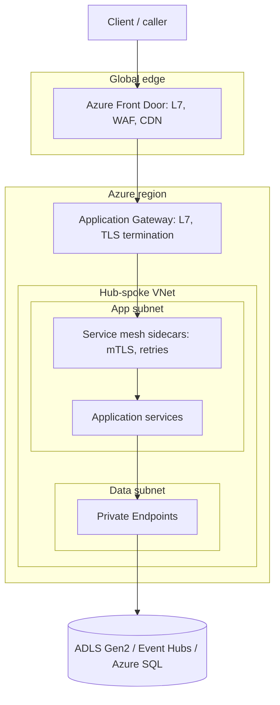
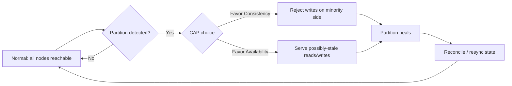

# Networking Fundamentals

> Part of the **Enterprise Data & AI Architecture Handbook** · Phase-00 — Foundations & Prerequisites · Chapter 04.
> Estimated study time: **60 min reading + ~4h labs**.
> **Prerequisite:** read [Operating Systems for Data Engineers](03_Operating_Systems.md) first.

---

## Executive Summary

Every Spark shuffle, every Kafka produce/consume, every ADLS Gen2 `GET`, and every model-inference call from an agent runtime is, underneath, bytes serialized onto a socket, chopped into packets, routed across switches and load balancers, and reassembled on the other side — with a TLS handshake and a DNS lookup usually happening first. [Operating Systems for Data Engineers](03_Operating_Systems.md) established that the kernel's socket buffers and NIC driver are just another OS-managed resource fighting for CPU and memory; this chapter explains *what happens on the wire* between two OS kernels — TCP/IP fundamentals, DNS, HTTP/1.1 → HTTP/2 → HTTP/3, TLS/mTLS, L4/L7 load balancing, service discovery, and the network partitions that are the root cause of an entire class of distributed-systems failure modes.

This is the chapter where "the API is slow" becomes "TLS renegotiation plus a cold DNS lookup plus three hops through an under-provisioned Application Gateway are adding 180ms before your handler even runs" — a diagnosis you can act on. We cover the OSI/TCP-IP layering model and why MTU/fragmentation quietly caps your shuffle throughput; the latency-vs-bandwidth distinction that explains why a 10x bandwidth upgrade doesn't fix a chatty RPC protocol; DNS resolution and why it is a surprisingly common source of p99 tail latency; HTTP/1.1 head-of-line blocking vs. HTTP/2 multiplexing vs. HTTP/3's QUIC transport (and why gRPC rides on HTTP/2); the TLS 1.2/1.3 handshake and mutual TLS (mTLS) as the mechanism behind zero-trust service-to-service security; and L4 vs. L7 load balancing, reverse proxies, and service discovery as the control plane that makes "the service" a stable address over a fleet of ephemeral pods.

The bias remains **Azure-primary (~60%)** — VNets, NSGs, Azure Load Balancer, Application Gateway, Front Door, Private Link, Azure DNS — **~30% enterprise open source** (Envoy, Nginx, Istio/Linkerd, CoreDNS, gRPC, Kubernetes Ingress) and **~10% AWS/GCP comparison-only**. By the end you will read a packet-capture summary, a TLS handshake failure log, or a "connection reset" incident and know exactly which layer of the stack to blame — and how to fix it in the platform's network design, not just retry harder in application code.

**Bottom line:** the network is not "someone else's problem" solved by the platform team — it is the shared, partition-prone medium that turns your distributed architecture's consistency and availability guarantees from theory into measurable SLOs. Architects who reason precisely about latency, DNS, TLS, and partitions design systems that degrade gracefully instead of failing mysteriously.

---

## Learning Objectives

By the end of this chapter you will be able to:

1. **Explain the OSI/TCP-IP layering model** and use it to localize a networking fault to the correct layer (physical/link, network, transport, application).
2. **Distinguish latency from bandwidth** and reason about bandwidth-delay product, MTU, and fragmentation effects on Spark shuffle and Kafka throughput.
3. **Trace a DNS resolution** end to end and diagnose DNS as a hidden source of connection latency and outage risk.
4. **Compare HTTP/1.1, HTTP/2, and HTTP/3/QUIC** and explain why gRPC's performance characteristics depend on the transport beneath it.
5. **Walk through a TLS 1.3 handshake and mTLS exchange**, and articulate the security and performance trade-offs of each.
6. **Differentiate L4 vs. L7 load balancing** and choose correctly between Azure Load Balancer, Application Gateway, and Front Door for a given workload.
7. **Reason about network partitions** as a first-class distributed-systems failure mode and connect it to CAP-theorem trade-offs made elsewhere in the handbook.
8. **Translate networking findings into Azure network architecture** (VNet topology, NSGs, Private Link, service mesh) and defend those choices in a design review.

---

## Business Motivation

Networking decisions show up directly as latency SLA risk, security posture, and cloud spend:

- **Cross-region/cross-AZ egress traffic** is billed per GB and is frequently the largest *hidden* line item in a multi-region data platform's Azure bill — a topology decision, not a runtime one.
- **DNS and TLS handshake overhead**, unaddressed, silently eats into a service's latency budget before a single byte of business logic executes — invisible in application APM unless network spans are explicitly instrumented.
- **Mis-scoped Network Security Groups (NSGs) or missing Private Link** endpoints are both a security exposure (public data-plane endpoints) and a compliance finding (data exfiltration risk) in regulated industries.
- **Load balancer choice (L4 vs. L7) drives both cost and capability** — an L7 Application Gateway doing TLS termination and WAF inspection is not a drop-in replacement for a cheap L4 Load Balancer, and vice versa.
- **Reliability.** A network partition between two availability zones is not a hypothetical for architecture diagrams — it is a Tuesday-afternoon incident, and how a system degrades (fail-closed, stale-read, split-brain) during it is a design decision made *before* the incident, not during it.

For an architect, networking fluency converts "the network is flaky" into "our retry policy lacks jitter and is causing a thundering herd against a partially recovered backend" — precise, actionable, and defensible in a postmortem.

---

## History and Evolution

- **1969 — ARPANET** demonstrates packet switching as viable, the conceptual ancestor of every network in this chapter.
- **1974 — TCP/IP (Cerf & Kahn)** formalizes host-to-host reliable delivery over unreliable, heterogeneous networks — still the transport beneath nearly everything in this handbook.
- **1983 — DNS (Mockapetris)** replaces the flat `HOSTS.TXT` file with a hierarchical, delegated, cacheable name-resolution system, enabling the internet to scale past thousands of hosts.
- **1991-1996 — The World Wide Web and HTTP/0.9→1.0** introduce a simple, stateless request/response protocol on top of TCP.
- **1997 — HTTP/1.1** adds persistent connections and pipelining (rarely used) but retains strict head-of-line (HOL) blocking per connection.
- **1999 — TLS 1.0** (successor to SSL 3.0) standardizes encrypted transport; a long lineage of handshake and cipher-suite hardening follows.
- **2009 — SPDY (Google)** prototypes multiplexed streams over a single TCP connection, directly inspiring HTTP/2.
- **2015 — HTTP/2** standardizes multiplexing, header compression (HPACK), and server push — but HOL blocking moves from the application layer to the TCP layer (a single lost packet blocks all multiplexed streams).
- **2015 — gRPC (Google, open-sourced)** builds RPC semantics, code generation, and streaming on top of HTTP/2, becoming the default east-west RPC protocol for cloud-native/microservice and AI-serving architectures.
- **2018 — TLS 1.3** simplifies and hardens the handshake (1-RTT, optional 0-RTT), removes legacy insecure ciphers, and shortens the cryptographic negotiation materially.
- **2020-2022 — HTTP/3 and QUIC** move the transport itself to UDP, eliminating TCP-level HOL blocking and enabling faster connection migration (e.g., Wi-Fi → cellular handoff) — now supported by Azure Front Door and most modern CDNs.
- **2016-onward — Service mesh (Istio, Linkerd, Azure Service Mesh add-ons)** pushes mTLS, retries, and observability into a sidecar proxy layer, decoupling network policy from application code.
- **2020-2026 — Zero-trust architectures** make mTLS and identity-based network policy (not IP-based perimeter security) the default assumption for enterprise service-to-service traffic, directly relevant to [Security, Identity & Compliance](../Phase-10/README.md) later in the handbook.

---

## Why This Technology Exists

Networking exists to solve the problem of getting bytes reliably (or acceptably-unreliably) between two independent machines that do not share memory, a clock, or a failure domain:

- **Layering (OSI/TCP-IP)** exists so that innovation at one layer (e.g., moving from copper to fiber, or TCP to QUIC) doesn't require rewriting every layer above it — a direct analog to the abstraction layering established in [Computer Science Fundamentals](02_Computer_Science_Fundamentals.md).
- **TCP** exists because raw IP packet delivery is unordered, can duplicate, and can drop — applications need a reliable, ordered, congestion-aware abstraction on top.
- **DNS** exists because IP addresses are not human- or configuration-stable, but names should be; DNS decouples "where a service lives" from "what a service is called."
- **TLS** exists because the network is, by default, a shared and hostile medium — anyone on the path can read or tamper with plaintext traffic without it.
- **Load balancers and service discovery** exist because a "service" in a cloud-native platform is not one machine but an ever-changing fleet of ephemeral instances; clients need a stable rendezvous point.
- **Network partition handling** exists because distributed systems must define behavior when the network — not any single machine — fails; ignoring this is what the CAP theorem formalizes as impossible to ignore.

Without these mechanisms, every distributed data pipeline would need to hand-roll retry, encryption, addressing, and routing logic per application — an unmaintainable, insecure, non-portable outcome.

---

## Problems It Solves

- **Reliable byte delivery over unreliable links** — TCP's sequencing, acknowledgment, and retransmission.
- **Human- and automation-friendly addressing** — DNS's hierarchical, cacheable name resolution decoupling identity from IP.
- **Confidentiality, integrity, and (with mTLS) mutual authentication** — TLS/mTLS protecting data in transit and establishing service identity.
- **Efficient multiplexed request/response at scale** — HTTP/2's stream multiplexing and header compression; HTTP/3's elimination of transport-level HOL blocking.
- **Stable service addressing over ephemeral compute** — load balancers and service discovery (Kubernetes Services, Azure Private Link, Consul/Eureka-style registries).
- **Graceful degradation under partial failure** — timeouts, retries with backoff/jitter, circuit breakers, and health-probe-driven traffic shifting.

---

## Problems It Cannot Solve

- **It cannot make a partitioned network "not partitioned."** No amount of retry logic changes the fact that, for some duration, two nodes cannot communicate — the *application* must choose availability or consistency during that window (see the CAP-theorem discussion in [Distributed Systems Primer](08_Distributed_Systems_Primer.md)).
- **It cannot guarantee bounded latency.** TCP guarantees eventual, ordered delivery — not a deadline; real-time/low-latency requirements need application-level timeout and fallback design.
- **It cannot fix a badly chosen protocol.** A chatty, many-round-trip RPC design is slow on the fastest network; networking optimizes *transport*, not *conversation design*.
- **It cannot secure an application that trusts its inputs blindly.** TLS/mTLS secures the pipe; it does nothing for injection attacks, broken authorization, or insecure deserialization at the endpoints (OWASP Top 10 concerns remain the application's responsibility).
- **It cannot make DNS instantaneous or infallible.** DNS is itself a distributed system with its own caching, propagation delay, and outage risk (see the 2021 large-scale DNS/CDN outages referenced later).
- **It cannot replace capacity planning.** A load balancer distributes load; it does not create capacity that isn't provisioned behind it.

---

## Core Concepts

### 8.1 OSI/TCP-IP model, packets, and frames

The **OSI 7-layer model** (Physical, Data Link, Network, Transport, Session, Presentation, Application) is a teaching/reference model; the **TCP/IP 4-layer model** (Link, Internet, Transport, Application) is what production systems actually implement. Data is encapsulated at each layer: application bytes become TCP **segments**, segments become IP **packets**, packets become Ethernet **frames**, frames become electrical/optical signals. Each layer adds a header (and sometimes a trailer) — overhead that matters at high message rates (e.g., many small Kafka messages).

### 8.2 MTU, fragmentation, and latency vs. bandwidth

The **Maximum Transmission Unit (MTU)** — typically 1500 bytes on Ethernet, up to 9000 bytes ("jumbo frames") on tuned data-center networks — caps how much payload a single frame carries. A packet larger than the path's MTU is either fragmented (extra overhead, extra failure surface) or dropped with an ICMP "fragmentation needed" message if the "don't fragment" bit is set (**Path MTU Discovery**), which itself can fail silently if ICMP is filtered by a firewall — a classic hard-to-diagnose "TLS handshake hangs on large certificates" bug. Separately, **latency** (time for one bit to arrive) and **bandwidth** (bits/sec capacity) are independent dimensions: a trans-continental link can have huge bandwidth and still 80ms+ of latency because of the speed of light, and no bandwidth upgrade reduces that floor — only reducing round trips (fewer RPCs, HTTP/2 multiplexing, connection reuse) or moving compute closer to data (edge/CDN, regional replicas) helps.

### 8.3 Bandwidth-delay product and throughput ceilings

**Bandwidth-delay product (BDP)** = bandwidth × round-trip time, i.e., how many bytes can be "in flight" before an acknowledgment must arrive. TCP's congestion window must grow to match the BDP or throughput plateaus far below the link's rated bandwidth regardless of how fast the pipe is — the reason a single TCP stream across a high-bandwidth, high-latency (satellite, cross-continent) link often underperforms bandwidth tests, and why parallelizing connections (or using QUIC's per-stream flow control) recovers throughput.

### 8.4 DNS resolution

A DNS lookup walks a **hierarchy**: stub resolver (client) → recursive resolver (often the cloud provider's or a corporate resolver) → root servers → TLD servers (`.com`) → authoritative nameserver for the domain, each response cacheable per its **TTL**. Azure services layer **Azure DNS** (authoritative, public/private zones) and **Azure Private DNS** (name resolution scoped to a VNet, critical for Private Link endpoints). A cold DNS lookup can add tens to low-hundreds of milliseconds; a misconfigured low TTL causes excessive lookups, while a too-high TTL delays failover after a DNS-based traffic shift (e.g., Traffic Manager/Front Door).

### 8.5 HTTP/1.1 vs. HTTP/2 vs. HTTP/3, and gRPC transport

**HTTP/1.1**: one request in flight per TCP connection (pipelining exists but is effectively unused) — clients open multiple parallel connections to compensate, at the cost of TCP handshake/slow-start overhead per connection. **HTTP/2**: multiplexes many streams over one TCP connection with binary framing and HPACK header compression — but a single lost TCP segment blocks *all* multiplexed streams (TCP-level head-of-line blocking) because TCP itself is one ordered byte stream. **HTTP/3**: runs over **QUIC** (built on UDP), giving each stream independent loss recovery — a lost packet on one stream no longer blocks the others — plus faster (0-RTT/1-RTT) connection establishment and connection migration across network changes. **gRPC** is built on HTTP/2 framing (protobuf-serialized messages over HTTP/2 streams), which is why gRPC gets multiplexing and header compression "for free" but inherits HTTP/2's TCP-level HOL-blocking exposure — a relevant trade-off when choosing gRPC vs. REST for high-fan-out, lossy-network microservice calls.

### 8.6 TLS handshake, certificates, and mTLS

**TLS 1.3** (the current baseline) negotiates a shared session key in **1 round trip** (down from 2 in TLS 1.2), optionally **0-RTT** for resumed sessions (with replay-risk caveats), using ephemeral Diffie-Hellman for forward secrecy. A **certificate** binds a public key to an identity (domain name via CN/SAN), signed by a Certificate Authority the client trusts; the client validates the chain up to a trusted root. **Mutual TLS (mTLS)** additionally requires the *client* to present a certificate, letting the server cryptographically authenticate the caller — the mechanism underneath zero-trust service mesh security (Istio/Linkerd's automatic mTLS, Azure Service Mesh add-ons) where network-perimeter trust is replaced by per-connection identity verification.

### 8.7 Load balancing (L4/L7), proxies, and service discovery

**L4 (transport-layer) load balancing** distributes TCP/UDP connections based on IP/port 5-tuple without inspecting payload — fast, protocol-agnostic (Azure Load Balancer). **L7 (application-layer) load balancing** terminates and inspects HTTP(S), enabling path/host-based routing, TLS termination, WAF inspection, and session affinity (Azure Application Gateway, Azure Front Door as a global L7 edge). A **reverse proxy** (Nginx, Envoy) sits in front of application instances, often combining L7 routing with TLS termination and observability. **Service discovery** is the mechanism by which a client finds the current, healthy set of backend instances — DNS-based (Kubernetes Service DNS), API-based (Consul, Eureka), or control-plane-pushed (Envoy's xDS API in a service mesh) — replacing static IP configuration with a dynamically updated registry.

### 8.8 Network partitions and distributed failure

A **network partition** is any period where a subset of nodes cannot communicate with another subset, despite both subsets being individually healthy — caused by switch failures, misconfigured routes, cross-region link outages, or even asymmetric partial partitions (A can reach B, but B cannot reach A). Partitions are the "P" in **CAP theorem**: during a partition, a system must choose to sacrifice **C**onsistency (serve possibly-stale data to stay available) or **A**vailability (refuse requests to stay consistent) — there is no third option. This directly motivates quorum-based consensus (Raft/Paxos, covered in [Distributed Systems Primer](08_Distributed_Systems_Primer.md)) and is why "the network is reliable" is the first, and most damaging, of the classic Fallacies of Distributed Computing.

---

## Internal Working

**How a TCP connection establishes and adapts.** The three-way handshake (`SYN` → `SYN-ACK` → `ACK`) establishes initial sequence numbers; **slow start** then grows the congestion window exponentially until loss is detected (classic Reno/Cubic) or, increasingly, until measured latency increases (BBR), at which point the algorithm backs off — meaning a brand-new TCP connection is *always* slower than a warm one, a major reason connection pooling and keep-alive matter for RPC-heavy microservice and data-plane traffic.

**How a browser/service resolves and connects end to end.** (1) DNS resolution (walk the hierarchy or hit cache), (2) TCP handshake to the resolved IP, (3) TLS handshake (certificate validation, key exchange), (4) HTTP request/response over the now-encrypted, now-multiplexed (if HTTP/2+) connection. Each step is a potential latency and failure point, and APM tools that only measure "time to first byte" from the application layer miss the first three entirely.

**How an L7 load balancer routes a request.** The proxy terminates the client TLS connection, inspects the `Host`/path/headers, consults its (often dynamically updated) backend pool and health-check state, opens or reuses a connection to a chosen healthy backend (potentially re-encrypting via a second TLS handshake for end-to-end encryption), and streams the response back — meaning an L7 hop typically adds one extra TLS termination and one extra connection hop of latency versus L4 passthrough, in exchange for routing intelligence and inspection.

**How mTLS establishes trust in a service mesh.** A sidecar proxy (Envoy in Istio) intercepts outbound traffic transparently via iptables/eBPF redirection, negotiates mTLS with the destination sidecar using certificates issued and rotated by the mesh's certificate authority (short-lived, automatically renewed — no manual cert management), and only then forwards to the local application over plaintext loopback — meaning the application code never handles TLS at all, and identity-based authorization (not IP allow-lists) becomes the enforcement point.

**How a network partition surfaces to an application.** Neither TCP nor the OS tells an application "the network is partitioned" — it tells the application "this `read()`/`write()` timed out" or, eventually, "connection reset." The application (or its RPC framework's retry/circuit-breaker logic) must interpret ambiguous timeout signals and decide whether to retry (risking duplicate side effects), fail fast, or fall back — this ambiguity is precisely why idempotency keys and exactly-once semantics recur throughout the handbook's data-pipeline design chapters.

---

## Architecture

The relevant network architecture, as it applies to an Azure-hosted, multi-service data/AI platform:

1. **Edge / global layer** — Azure Front Door (global L7, anycast, WAF, CDN caching) or Traffic Manager (DNS-based global routing) as the internet-facing entry point.
2. **Regional ingress** — Application Gateway (regional L7, WAF, TLS termination) or a public Azure Load Balancer (L4) fronting a regional service.
3. **Virtual network (VNet) segmentation** — subnets per tier (ingress, application, data), NSGs enforcing allow-lists between subnets, Private Endpoints replacing public service endpoints for PaaS (ADLS Gen2, Key Vault, Azure SQL).
4. **Internal service mesh / east-west traffic** — sidecar proxies (Envoy/Istio-based add-ons, or Kubernetes-native ingress + internal LB) handling service-to-service mTLS, retries, and telemetry.
5. **DNS layer** — Azure Private DNS zones resolving internal service and Private Link names within the VNet; Azure DNS for public zones.
6. **Data-plane egress to PaaS/storage** — Private Link endpoints for ADLS Gen2/Kafka(Event Hubs)/SQL, keeping traffic on the Microsoft backbone rather than the public internet.

A network incident is almost always localized by asking **at which of these six layers** the symptom first appears — a WAF block (layer 1-2), an NSG deny (layer 3), a sidecar mTLS failure (layer 4), a stale DNS cache (layer 5), or a Private Link misconfiguration (layer 6).

---

## Components

| Component | Role | Concrete instantiation |
|---|---|---|
| **DNS resolver** | Name → IP resolution, caching | Azure DNS, Azure Private DNS, CoreDNS (Kubernetes) |
| **TLS terminator** | Encrypts/decrypts, validates certificates | Application Gateway, Front Door, Envoy, Nginx |
| **L4 load balancer** | Distributes connections by IP/port | Azure Load Balancer |
| **L7 load balancer / reverse proxy** | Routes/inspects HTTP(S) traffic | Application Gateway, Front Door, Nginx Ingress, Envoy |
| **Service mesh sidecar** | mTLS, retries, telemetry per pod | Envoy (via Istio/Linkerd/mesh add-ons) |
| **Service discovery registry** | Tracks healthy backend instances | Kubernetes Service/Endpoints, Consul, Envoy xDS |
| **NSG / firewall** | Enforces allow/deny traffic rules | Azure NSG, Azure Firewall |
| **Private Link endpoint** | Private, non-internet access to PaaS | Azure Private Link (ADLS, SQL, Event Hubs) |
| **CDN / edge cache** | Caches responses close to users | Azure Front Door CDN, Azure CDN |

---

## Metadata

Network-level "metadata" that drives routing, security, and diagnosis:

- **DNS records** — A/AAAA, CNAME, SRV (service discovery), TXT (domain verification, SPF/DKIM), and TTLs governing propagation/failover speed.
- **Certificates** — subject/SAN, issuer chain, validity window, revocation status (OCSP/CRL) — expiring certificates are a leading cause of self-inflicted outages.
- **Routing/NSG rule metadata** — source/destination CIDR, port, protocol, priority — the effective security posture is the *evaluated* rule set, not any single rule.
- **Connection metadata** — TLS SNI (which hostname was requested, enabling multi-tenant TLS termination), HTTP headers (`Host`, `X-Forwarded-For`, trace headers).
- **Service discovery registry metadata** — health-check state, weights/zones for traffic splitting, last-updated timestamp (staleness risk during rapid scaling events).

Good network observability is good metadata correlation: a "connection reset" without SNI, NSG flow logs, and DNS resolution timestamps at the same instant is nearly undiagnosable.

---

## Storage

Networking's relevance to storage is primarily as the **access path**, not the persistence mechanism (see [Storage Systems Fundamentals](05_Storage_Systems_Fundamentals.md) for the storage layer itself):

- **ADLS Gen2 access is always over HTTPS (`abfss://`)** — every read/write pays a TLS-protected HTTP round trip; Private Link removes the public-internet hop but not the HTTP/TLS overhead itself.
- **Private Link vs. Service Endpoint** — Private Link assigns the PaaS service a private IP *inside* your VNet (true network isolation); Service Endpoints keep traffic on the Azure backbone but the PaaS resource retains a public IP with access restricted by policy — a materially different security and DNS story.
- **Regional storage placement vs. compute placement** — co-locating compute and storage in the same Azure region avoids cross-region latency and egress cost that would otherwise dominate large-scan (Spark/Delta) workloads.

---

## Compute

- **Sidecar proxy CPU/memory overhead.** A service mesh's per-pod Envoy sidecar adds measurable CPU and ~1-3ms latency per hop — a real cost/benefit trade-off against the mTLS/observability/retry benefits it provides, and one the [Operating Systems](03_Operating_Systems.md) cgroup-sizing guidance must account for when budgeting pod resource requests.
- **East-west traffic dominates in data platforms.** Spark shuffle, Kafka replication, and microservice RPC (north-south being comparatively rare) mean internal network topology (same-AZ vs. cross-AZ placement) directly drives shuffle/replication latency and cross-AZ egress cost.
- **Connection pooling reduces compute-adjacent overhead.** Reusing TCP/TLS connections (HTTP keep-alive, gRPC channel reuse) avoids repeated handshake CPU cost on both client and server, mattering most at high request-rate, low-payload-size RPC patterns (feature-store lookups, model-serving calls).

---

## Networking

*(Deeper data-plane specifics, building on Core Concepts §8.1-8.3.)*

- **Jumbo frames (9000-byte MTU)** on dedicated data-plane networks (e.g., HPC/Databricks inter-node) reduce per-frame header overhead for large sequential transfers like shuffle, at the cost of requiring consistent MTU configuration end-to-end (a mismatched MTU anywhere on the path silently degrades to fragmentation or blackholes).
- **Bandwidth-delay product tuning** (`net.ipv4.tcp_rmem`/`tcp_wmem` socket buffer sizing — an OS-level lever from [Operating Systems](03_Operating_Systems.md#networking)) must scale with cross-region link latency or a single TCP stream cannot fill available bandwidth.
- **Anycast** (used by Azure Front Door, Azure DNS) routes a client to the *topologically nearest* healthy edge location sharing the same IP, cutting latency without client-side configuration.
- **ExpressRoute / private peering** replaces public-internet transit with a dedicated, more predictable-latency circuit for hybrid (on-prem ↔ Azure) enterprise connectivity — relevant for regulated on-prem-to-cloud data pipelines.

---

## Security

- **TLS everywhere, mTLS for service-to-service** — encrypt data in transit by default; treat any unencrypted internal traffic as a governance exception requiring explicit sign-off.
- **Zero-trust network posture** — authenticate and authorize *every* connection (identity via mTLS certificate or workload identity), not just traffic crossing a perimeter firewall; internal "trusted network" assumptions are an OWASP-adjacent broken-access-control risk.
- **NSGs and Private Link as defense in depth** — NSGs restrict east-west lateral movement; Private Link removes public-internet reachability to PaaS data planes entirely, closing the most common cloud data-exfiltration path (public storage endpoint + leaked credential).
- **DNS security** — DNSSEC where supported, and awareness that DNS itself can be spoofed/poisoned or abused for exfiltration (DNS tunneling) — a reason egress DNS should be monitored, not assumed benign.
- **Certificate lifecycle management** — automate issuance/rotation (Key Vault-issued certs, service-mesh-managed short-lived certs) to eliminate the "expired cert caused an outage" incident class.
- **WAF (Web Application Firewall)** at the L7 edge (Application Gateway/Front Door WAF) mitigates common web attack patterns (SQLi, XSS payloads) before they reach application code — complementary to, not a replacement for, secure coding practices.

---

## Performance

Network-driven performance levers, in priority order:

1. **Reduce round trips before increasing bandwidth** — HTTP/2 multiplexing, gRPC streaming, and batching RPC calls reduce the latency floor that bandwidth cannot fix.
2. **Reuse connections** — keep-alive/connection pooling avoids repeated TCP+TLS handshake cost on hot paths.
3. **Cache DNS appropriately** — balance TTL against failover speed; avoid both DNS-lookup-per-request anti-patterns and stale-cache-blocks-failover anti-patterns.
4. **Terminate TLS as close to the client as sensible**, then use a lighter-weight internal trust mechanism (mesh mTLS with session resumption) for east-west hops.
5. **Right-size MTU/jumbo frames** for dedicated high-throughput data-plane networks (Spark shuffle, Kafka replication).
6. **Prefer QUIC/HTTP-3 at the edge** where client network conditions are lossy/variable (mobile, cross-region), since it removes TCP-level HOL blocking.
7. **Co-locate compute and data** in the same region/availability zone to shrink both latency and egress cost simultaneously.

**Worked example.** A model-serving API showed p99 latency of ~350ms despite a ~15ms application handler time. Distributed tracing (with network spans, not just app spans) revealed: ~40ms cold DNS lookup (TTL had been set to 10s, causing frequent re-resolution under a CDN-fronted DNS-based traffic-manager setup), ~90ms TLS full handshake (no session resumption configured on the client SDK), and ~120ms queued behind a single congested HTTP/1.1 connection due to a client library that didn't support HTTP/2 multiplexing. Fixes: raise DNS TTL with a documented failover-time trade-off, enable TLS session resumption, and upgrade the client to an HTTP/2-capable gRPC stack — cutting p99 to ~60ms with zero application code changes.

---

## Scalability

- **L7 load balancers and API gateways scale request-routing capacity independently of backend capacity** — but a mis-tuned connection-pool or backend-count limit on the LB itself becomes the new bottleneck at scale, so LB SKU/tier selection is itself a capacity-planning decision.
- **DNS-based global load balancing (Traffic Manager/Front Door) scales across regions** without client changes, but failover speed is bounded by DNS TTL and client-side caching behavior — "instant" global failover is a myth without additional health-check-driven mechanisms.
- **Service mesh sidecars scale linearly with pod count**, meaning mesh control-plane (Istio's `istiod`) capacity and sidecar resource overhead must be included in cluster capacity planning, not treated as free.
- **Anycast + CDN edge caching scale read-heavy, cacheable traffic near-infinitely** without proportional backend scaling — the highest-leverage scalability lever for public-facing, cacheable APIs/content.

---

## Fault Tolerance

- **Timeouts are a fault-tolerance primitive, not an afterthought** — every network call needs an explicit, deliberately chosen timeout; the default of "wait forever" turns a transient network blip into a cascading resource-exhaustion failure upstream.
- **Retries need backoff and jitter.** Naive immediate retries during a partial outage create a **thundering herd** that prevents the backend from ever recovering; exponential backoff with jitter (and a retry budget) is the standard mitigation.
- **Circuit breakers** stop calling a consistently failing dependency for a cool-down period, converting cascading failure into fast, cheap local failure — a pattern implemented at the mesh (Envoy outlier detection) or client-library layer (Polly, resilience4j).
- **Health probes and outlier detection** remove unhealthy backend instances from the load-balancing pool automatically, converting individual node failure into (mostly) invisible capacity reduction rather than client-visible errors.
- **Network partitions demand an explicit CAP choice**, made in advance (see [Distributed Systems Primer](08_Distributed_Systems_Primer.md)) — "what does this service do when it can't reach its primary datastore" must have a designed answer, not an accidental one.

---

## Cost Optimization (FinOps)

- **Cross-region and cross-AZ egress is billed and often avoidable** — co-locating chatty services in the same region/zone, or using Private Link (which still avoids public-internet egress pricing where applicable) directly reduces cost.
- **CDN/edge caching offloads origin traffic**, reducing both egress cost and origin compute scaling needs for cacheable content.
- **NAT Gateway vs. Load Balancer outbound rules vs. Private Link** have different cost profiles for egress-heavy workloads; architecture reviews should model expected egress volume, not just security posture.
- **Right-size Application Gateway/Front Door SKU/tier** to actual request volume — over-provisioned WAF/LB tiers are a common, easily audited FinOps finding.
- **DNS query volume is usually immaterial cost-wise**, but excessive re-resolution from misconfigured low TTLs can add latency-driven compute cost (more open connections, more retries) elsewhere in the stack.

---

## Monitoring

Monitor the network signals that predict incidents before they page you:

- **Latency percentiles per hop** (DNS resolution time, TLS handshake time, TTFB, total request time) — not just end-to-end application latency.
- **Connection-level errors** — TCP retransmits/resets, TLS handshake failures (cert expiry, cipher mismatch), NSG deny-flow counts.
- **Load balancer/gateway metrics** — backend health-probe status, 5xx rate by backend pool, connection count vs. configured limits.
- **DNS metrics** — query latency, NXDOMAIN rate, cache hit ratio.
- **Service mesh telemetry** — per-hop success rate, retry counts, circuit-breaker trip events (Envoy stats surfaced via Prometheus).

In Azure, surface these via **Azure Monitor / Network Watcher** (NSG flow logs, connection troubleshoot), **Application Gateway/Front Door diagnostic logs**, and **Container Insights** for AKS-hosted service mesh metrics — alerting on hop-level latency and error-rate percentiles, not just aggregate uptime.

---

## Observability

- **Distributed tracing must include network spans** (DNS, TCP connect, TLS handshake, each proxy hop) — an APM trace that starts at "application handler entry" hides the majority of tail-latency root causes shown in the Performance worked example above.
- **Correlate NSG flow logs with application-level errors** by timestamp and 5-tuple to distinguish "the app rejected the request" from "the network never delivered it."
- **Service mesh sidecars emit per-hop success/latency telemetry automatically** (Envoy access logs, OpenTelemetry) — a major observability upgrade over instrumenting every service individually.
- **Structured incident timelines should classify**: DNS-related, TLS/certificate-related, LB/routing-related, NSG/firewall-related, or true backend/application failure — that classification determines the fix and the team that owns it.

---

## Governance

- **Standardize VNet topology and NSG baseline rules** as reviewed platform defaults (hub-spoke, mandatory deny-by-default with explicit allow-lists), not per-team ad hoc configuration.
- **Mandate Private Link for all PaaS data-plane access** in regulated environments — public endpoints for storage/database services should be a tracked, time-boxed exception, not a default.
- **Centralize certificate issuance and rotation policy** (Key Vault-backed, automated renewal) with alerting on upcoming expiry well before outage risk.
- **Require documented timeout/retry/circuit-breaker policy** per service as part of the platform's reliability governance (ties to [Reliability and SRE](../Phase-18/04_Reliability_and_SRE.md)).
- **Audit DNS TTL and failover configuration** for public-facing global endpoints as part of disaster-recovery readiness reviews.

---

## Trade-offs

| Decision | Option A | Option B | Trade-off |
|---|---|---|---|
| Load balancing layer | L4 (Load Balancer) | L7 (Application Gateway/Front Door) | Raw throughput/simplicity vs. routing intelligence + inspection |
| Transport | TCP/HTTP-2 | QUIC/HTTP-3 | Ecosystem maturity vs. no TCP-level HOL blocking |
| Service trust model | Perimeter/NSG only | mTLS zero-trust (service mesh) | Lower overhead vs. per-connection cryptographic identity |
| PaaS connectivity | Service Endpoint | Private Link | Simplicity/cost vs. true network isolation |
| DNS TTL | Low (fast failover) | High (fewer lookups, slower failover) | Failover speed vs. lookup/latency overhead |
| Retry strategy | Aggressive immediate retry | Backoff + jitter + budget | Faster individual recovery vs. avoiding thundering herd |

---

## Decision Matrix

**Choosing a load balancer tier:**

| Requirement | L4 (Load Balancer) | L7 (App Gateway) | Global L7 (Front Door) |
|---|---|---|---|
| Simple TCP/UDP passthrough, lowest latency | ✅✅ | ⚠️ (unnecessary overhead) | ❌ |
| Path/host-based routing, WAF | ❌ | ✅✅ | ✅ (edge-level) |
| Global multi-region failover + CDN | ❌ | ⚠️ (regional only) | ✅✅ |

**Choosing PaaS connectivity:**

| Requirement | Public endpoint + firewall rules | Service Endpoint | Private Link |
|---|---|---|---|
| Dev/test, low sensitivity | ✅ | ✅ | ⚠️ (overkill) |
| Regulated production data | ❌ | ⚠️ | ✅✅ |
| Cross-VNet/on-prem private access | ❌ | ❌ | ✅✅ |

---

## Design Patterns

- **Sidecar proxy / service mesh** for transparent mTLS, retries, and telemetry without per-service code changes.
- **API gateway** as a single, governed L7 entry point for authentication, rate limiting, and routing to internal services.
- **Circuit breaker + bulkhead** to contain a failing dependency's blast radius.
- **Retry with exponential backoff and jitter**, bounded by a retry budget, for transient network errors.
- **DNS-based blue/green or canary traffic shifting** via weighted routing at the global load-balancing layer.
- **Private Link + hub-spoke VNet topology** as the default enterprise network isolation pattern.

---

## Anti-patterns

- **Unbounded retries without backoff/jitter** — turns a transient blip into a self-inflicted denial-of-service against a recovering backend.
- **No explicit timeouts** — a single hung downstream call can exhaust an upstream thread/connection pool, cascading failure across unrelated services.
- **Public endpoints for data-plane PaaS services "temporarily"** that become permanent — the most common cloud data-exfiltration root cause.
- **Treating "the network is reliable" as an implicit assumption** in application design — one of the classic Fallacies of Distributed Computing, and reliably wrong at scale.
- **Overly low DNS TTLs "to be safe"** — inflates lookup volume and latency without meaningfully improving real-world failover speed if health checks are the actual failover trigger.
- **Running a full service mesh for a handful of services** where the sidecar overhead and operational complexity exceed the mTLS/observability benefit.

---

## Common Mistakes

1. Diagnosing "slow API" purely from application-layer APM, missing DNS/TLS/proxy-hop latency entirely.
2. Confusing Service Endpoints with Private Link and assuming both provide equivalent network isolation.
3. Setting client timeouts longer than the server's own timeout, guaranteeing wasted client-side waiting on requests the server has already abandoned.
4. Ignoring TLS certificate expiry monitoring until an outage occurs.
5. Assuming HTTP/2's multiplexing eliminates all head-of-line blocking (it eliminates it at the *application* layer, not the TCP layer).
6. Load-testing only the "happy path" and never validating retry/circuit-breaker behavior under partial backend failure.
7. Leaving default/overly permissive NSG rules from a proof-of-concept in place after promotion to production.

---

## Best Practices

- **Instrument network spans** (DNS, TCP connect, TLS handshake) in distributed traces, not just application handler time.
- **Default to deny-by-default NSGs** with explicit, reviewed allow rules; treat public data-plane endpoints as an exception requiring sign-off.
- **Automate certificate issuance and rotation**; alert well ahead of expiry.
- **Set explicit timeouts and retry-with-backoff-and-jitter** on every network call, with a bounded retry budget.
- **Prefer Private Link for all production PaaS data-plane connectivity** in regulated environments.
- **Choose L4 vs. L7 load balancing deliberately** based on routing/inspection needs, not by default habit.
- **Validate MTU consistency end-to-end** for dedicated high-throughput data-plane networks before blaming application code for shuffle/replication slowness.

---

## Enterprise Recommendations

1. **Standardize a hub-spoke VNet reference architecture** with mandatory Private Link for PaaS and deny-by-default NSGs as the platform baseline.
2. **Mandate distributed tracing with network-span instrumentation** as a platform requirement for any service with a latency SLA.
3. **Centralize certificate lifecycle management** via Key Vault and automated rotation, with expiry alerting integrated into the platform's on-call tooling.
4. **Adopt a service mesh selectively** — for regulated, high-fan-out, zero-trust-critical service tiers — rather than platform-wide by default, weighing sidecar overhead against benefit.
5. **Require a documented timeout/retry/circuit-breaker policy** per service as a release-readiness gate.
6. **Run periodic DNS/TLS/failover game-days** to validate real-world failover speed against configured TTLs and health-check intervals, not assumed values.

---

## Azure Implementation

**VNet with hub-spoke topology, NSG baseline, and Private Link endpoint (illustrative Bicep).**
```bicep
resource vnet 'Microsoft.Network/virtualNetworks@2023-09-01' = {
  name: 'vnet-data-platform'
  location: location
  properties: {
    addressSpace: { addressPrefixes: ['10.0.0.0/16'] }
    subnets: [
      { name: 'snet-app', properties: { addressPrefix: '10.0.1.0/24', networkSecurityGroup: { id: nsgApp.id } } }
      { name: 'snet-data', properties: { addressPrefix: '10.0.2.0/24', networkSecurityGroup: { id: nsgData.id } } }
    ]
  }
}

resource nsgApp 'Microsoft.Network/networkSecurityGroups@2023-09-01' = {
  name: 'nsg-app'
  location: location
  properties: {
    securityRules: [
      {
        name: 'deny-all-inbound'
        properties: {
          priority: 4096
          direction: 'Inbound'
          access: 'Deny'
          protocol: '*'
          sourceAddressPrefix: '*'
          destinationAddressPrefix: '*'
          sourcePortRange: '*'
          destinationPortRange: '*'
        }
      }
    ]
  }
}

resource adlsPrivateEndpoint 'Microsoft.Network/privateEndpoints@2023-09-01' = {
  name: 'pe-adls-gen2'
  location: location
  properties: {
    subnet: { id: '${vnet.id}/subnets/snet-data' }
    privateLinkServiceConnections: [
      {
        name: 'pe-adls-connection'
        properties: {
          privateLinkServiceId: storageAccount.id
          groupIds: ['dfs']
        }
      }
    ]
  }
}
```

**Application Gateway with WAF and TLS termination (illustrative CLI).**
```bash
az network application-gateway create \
  --name agw-data-platform \
  --resource-group rg-data-platform \
  --sku WAF_v2 \
  --capacity 2 \
  --vnet-name vnet-data-platform \
  --subnet snet-agw \
  --http-settings-protocol Https \
  --frontend-port 443 \
  --cert-file appgw-cert.pfx
```

**Diagnosing NSG denies and connection failures via Azure Monitor (KQL).**
```kusto
AzureNetworkAnalytics_CL
| where SubType_s == "FlowLog" and FlowStatus_s == "D"  // Denied flows
| summarize DeniedCount = count() by SrcIP_s, DestIP_s, DestPort_d
| order by DeniedCount desc
```

---

## Open Source Implementation

- **Envoy** — the de facto L7 proxy/data-plane for service mesh (Istio) and standalone ingress; provides mTLS, retries, outlier detection, and rich telemetry out of the box.
- **Nginx / Nginx Ingress Controller** — widely used reverse proxy and Kubernetes ingress implementation for L7 routing and TLS termination.
- **Istio / Linkerd** — service mesh control planes automating mTLS certificate issuance/rotation, traffic policy, and mesh-wide observability across Envoy (or Linkerd's own lightweight proxy) sidecars.
- **CoreDNS** — the default Kubernetes cluster DNS server, handling internal service discovery via DNS.
- **gRPC** — HTTP/2-based RPC framework with generated client/server stubs, streaming support, and built-in deadline propagation.
- **HAProxy** — high-performance L4/L7 load balancer commonly used in self-managed data-center and hybrid topologies.

---

## AWS Equivalent (comparison only)

| Azure | AWS equivalent | Notes |
|---|---|---|
| Azure Load Balancer (L4) | AWS Network Load Balancer (NLB) | Both are flow-based, protocol-agnostic L4 balancers. |
| Application Gateway (L7 + WAF) | AWS Application Load Balancer (ALB) + AWS WAF | Similar path/host routing and WAF integration model. |
| Azure Front Door | AWS CloudFront + Global Accelerator | Split across two AWS services vs. one Azure service. |
| Azure Private Link | AWS PrivateLink | Near-identical concept: private, non-internet access to a managed service. |
| Azure DNS / Private DNS | AWS Route 53 / Route 53 Private Hosted Zones | Equivalent public/private DNS split. |

**Advantages of AWS:** Global Accelerator's anycast IP-based routing is a distinct, sometimes lower-latency alternative to CloudFront for non-cacheable TCP/UDP traffic. **Disadvantages:** the CDN + accelerator split requires composing two services where Azure Front Door offers one. **Migration strategy:** NSG concepts map closely to AWS Security Groups (stateful) but Azure NSGs' explicit priority-ordered rules differ from AWS's implicit-deny-all model — re-validate rule semantics, don't copy verbatim. **Selection criteria:** choose by existing cloud commitment and whether a single unified edge service (Front Door) or more composable primitives (CloudFront + Global Accelerator + WAF) fits the team's operating model.

---

## GCP Equivalent (comparison only)

| Azure | GCP equivalent | Notes |
|---|---|---|
| Azure Load Balancer | Google Cloud Load Balancing (regional/global, L4) | GCP's global L4/L7 LB is a single anycast frontend by default, differing architecturally from Azure's regional-first model. |
| Application Gateway | Google Cloud External HTTP(S) Load Balancer | Similar L7 routing/WAF (Cloud Armor) capability. |
| Azure Front Door | Google Cloud CDN + Cloud Armor | Comparable edge caching + WAF combination. |
| Azure Private Link | GCP Private Service Connect | Equivalent private, non-internet PaaS connectivity model. |
| Azure DNS | Google Cloud DNS | Equivalent public/private zone model. |

**Advantages of GCP:** global-by-default load balancing (a single anycast IP serving all regions) simplifies some global-routing designs compared to Azure's regional-plus-Front-Door composition. **Disadvantages:** this global-first model requires re-architecting network topology assumptions built around Azure's regional VNet-first design. **Migration strategy:** re-validate whether workloads assumed regional isolation (VNet-scoped) or global reachability, since GCP's networking defaults differ structurally, not just in naming. **Selection criteria:** choose GCP's model when a single global anycast entry point materially simplifies the target architecture; otherwise, treat as comparison-only per this handbook's Azure-primary stance.

---

## Migration Considerations

- **NSG vs. Security Group semantics differ** (explicit priority-ordered allow/deny vs. implicit-deny stateful rules) — re-validate, don't copy-paste rule sets across clouds.
- **Private Link/PrivateLink/Private Service Connect are conceptually equivalent but provisioned and DNS-integrated differently** — re-test private DNS resolution end-to-end after migration.
- **Global vs. regional load-balancing defaults differ** (GCP global-first vs. Azure regional-plus-Front-Door) — re-architect traffic-management assumptions, not just re-point DNS.
- **Certificate management tooling differs** (Key Vault vs. AWS Certificate Manager vs. GCP Certificate Manager) — re-validate rotation automation after migration; don't assume feature parity.
- **Service mesh control-plane portability is generally high** (Istio/Envoy run identically on AKS/EKS/GKE) — the mesh layer is one of the more cloud-portable pieces of the network stack.

---

## Mermaid Architecture Diagrams

**Diagram 1 — Layered network architecture for a data/AI platform (architecture).**


**Diagram 2 — TLS 1.3 handshake with mTLS (sequence).**
```mermaid
sequenceDiagram
  participant C as Client (sidecar/service)
  participant S as Server (sidecar/service)
  C->>S: ClientHello (supported ciphers, key share)
  S->>C: ServerHello + key share + Certificate + CertificateVerify
  S->>C: CertificateRequest (mTLS: request client cert)
  C->>S: Client Certificate + CertificateVerify
  C->>S: Finished (encrypted)
  S->>C: Finished (encrypted)
  Note over C,S: 1-RTT established; both identities cryptographically verified
  C->>S: Encrypted application data
```

**Diagram 3 — Network partition and CAP-driven failover (state view).**


---

## End-to-End Data Flow

Trace a client request through the full network stack to a data platform API:

1. **DNS resolution.** Client resolves the API's hostname; if fronted by Azure Front Door, an anycast IP routes the client to the nearest edge point of presence.
2. **Edge TLS termination and WAF inspection.** Front Door terminates TLS, applies WAF rules, and (if cacheable) may serve directly from edge cache.
3. **Regional routing.** Front Door forwards to the regional Application Gateway, which re-encrypts (or passes through) to the backend pool based on path/host rules.
4. **Service mesh ingress.** The request hits a sidecar proxy, which enforces mTLS, applies retry/timeout policy, and forwards to the local application container over loopback.
5. **Application processing and downstream call.** The service processes the request and calls a downstream dependency (e.g., a feature store or database) — another DNS lookup (often cached/Private-DNS-resolved), another mTLS handshake within the mesh.
6. **Private Link egress to PaaS.** A data read/write to ADLS Gen2/Azure SQL routes through a Private Endpoint, staying on the Microsoft backbone rather than the public internet.
7. **Response path.** The response retraces the path; the mesh sidecar and Application Gateway/Front Door record telemetry (latency, status code) at each hop for observability.

Every stage of this flow is governed by a mechanism described in this chapter, and a latency or error budget must account for all seven hops, not just step 5.

---

## Real-world Business Use Cases

- **Global model-serving APIs.** Azure Front Door + regional Application Gateways route users to the nearest healthy region, cutting inference latency for globally distributed users.
- **Regulated financial data pipelines.** Private Link-only connectivity to ADLS Gen2/Azure SQL satisfies data-residency and no-public-egress compliance requirements.
- **Multi-tenant SaaS data platforms.** L7 host-based routing at the Application Gateway/Front Door layer serves many tenants' subdomains from a shared backend fleet.
- **Real-time fraud-detection streaming.** Low-latency, mTLS-secured east-west traffic between Kafka/Event Hubs consumers and scoring services, tuned for minimal per-hop overhead.
- **Hybrid on-prem-to-cloud ETL.** ExpressRoute private peering provides predictable-latency connectivity for on-prem source systems feeding cloud data pipelines.

---

## Industry Examples

- **Google — QUIC/HTTP-3 origin.** Google developed QUIC to solve exactly the TCP-level HOL-blocking problem observed at YouTube/Search scale, later standardized as HTTP/3.
- **Netflix — Zuul/Envoy-based edge gateways** at massive scale, pioneering circuit-breaker and adaptive retry patterns now standard in resilience libraries.
- **Cloudflare/major CDNs — 2021 large-scale outages** repeatedly traced to configuration or software bugs in the edge/DNS layer, illustrating that even hyperscale edge networks are not immune to partition-like, cascading network failures.
- **LinkedIn — gRPC and service mesh adoption** at scale to standardize east-west RPC observability and mTLS across thousands of internal services.

---

## Case Studies

**Case 1 — The DNS TTL that delayed failover for 45 minutes.** A global API used a low-cost DNS-only failover (no health-probe-driven anycast) with a 1-hour TTL "for cost reasons." When the primary region degraded, cached resolvers across the internet continued routing to the unhealthy region for up to the full TTL, extending user-visible impact well past the actual infrastructure recovery time. *Lesson:* DNS TTL is a direct, measurable input to your actual (not advertised) RTO.

**Case 2 — The mesh mTLS rollout that broke a legacy service.** A team enabled mesh-wide strict mTLS without auditing all callers; a legacy batch job that connected via raw IP (bypassing the mesh's mTLS-aware sidecar injection) began failing with connection resets, mysteriously, days after rollout when a delayed restart picked up the new policy. *Lesson:* strict security-mode rollouts need an explicit inventory of all callers, including infrequently-triggered legacy paths.

**Case 3 — Thundering herd from naive retries.** A downstream service had a brief capacity dip; upstream clients' immediate, non-jittered retries multiplied the effective request rate 4x during the dip, preventing the service from ever recovering until callers were manually throttled. *Lesson:* retry logic without backoff and jitter is itself a denial-of-service vector against your own systems.

**Case 4 — MTU mismatch silently halving shuffle throughput.** A Spark-on-AKS cluster was tuned for jumbo frames on its data-plane NICs, but a subset of nodes (added later via a different node pool template) defaulted to standard 1500-byte MTU. Traffic between mismatched nodes silently fragmented, and aggregate shuffle throughput was roughly half of benchmark expectations for weeks before a targeted packet capture revealed the inconsistency. *Lesson:* MTU consistency must be validated across *all* nodes in a data-plane network, not assumed from the original template.

---

## Hands-on Labs

> Target ~4 hours. Use a local machine, WSL2, or an Azure sandbox subscription.

**Lab A — Watch a DNS resolution and TLS handshake happen (30 min).**
1. Use `dig`/`nslookup` and `openssl s_client -connect host:443 -tls1_3` to manually trace DNS resolution time and TLS handshake round trips against a real endpoint; identify each RTT.

**Lab B — Reproduce TCP-level HOL blocking under HTTP/2 (45 min).**
2. Simulate 1-2% packet loss (`tc netem loss 2%` on Linux) against an HTTP/2 server serving many small resources; compare load time to an HTTP/1.1 fallback with multiple connections, and explain the result.

**Lab C — Build and test an mTLS connection (60 min).**
3. Generate a local CA and client/server certificates with `openssl`; configure a simple server to require client certificates; verify a connection succeeds with a valid client cert and fails without one.

**Lab D — Deploy an Azure Application Gateway with WAF and path-based routing (60 min).**
4. Provision an Application Gateway (via the Bicep snippet above or the portal) routing `/api/*` and `/static/*` to two different backend pools; verify routing and inspect WAF logs for a simulated attack payload.

**Lab E — Reproduce a retry thundering herd (30 min).**
5. Write a small client that retries immediately (no backoff) against a rate-limited mock server under load; compare total successful requests and server error rate against a version with exponential backoff + jitter.

**Lab F — NSG flow log analysis (30 min).**
6. Enable NSG flow logs on a test VNet, generate both allowed and denied traffic, and query Azure Monitor to identify the denied flows and their source/destination.

---

## Exercises

1. Explain why a 10x bandwidth increase might not improve the latency of a chatty RPC-heavy microservice call chain.
2. A client's DNS TTL is set to 24 hours for a service using DNS-based failover. What is the practical maximum failover time, and how would you reduce it?
3. Contrast how HTTP/2 and HTTP/3 handle head-of-line blocking, and explain the mechanism difference.
4. Design a timeout and retry policy (with numbers) for a service calling a downstream dependency with a documented p99 of 200ms.
5. Explain why a service mesh's automatic mTLS might break a legacy caller, and how you would find all affected callers before rollout.
6. Given a partition between two regions, describe the CAP trade-off your system must make and what "designed answer" it should have in advance.
7. Why does jumbo-frame MTU tuning require end-to-end consistency, and what failure mode results from a partial rollout?

---

## Mini Projects

- **MP1 — Network-aware trace dashboard.** Instrument a sample service's calls with DNS/TCP/TLS-level trace spans (via OpenTelemetry) and build a dashboard breaking down p50/p99 latency by hop.
- **MP2 — Resilience test harness.** Build a harness that injects latency/packet loss/connection resets against a test service and validates timeout, retry-with-jitter, and circuit-breaker behavior automatically.
- **MP3 — Certificate expiry auditor.** Script that scans a list of endpoints, reports certificate expiry dates, and flags any within a configurable threshold.
- **MP4 — mTLS mini service mesh.** Stand up two services with sidecar-style mTLS (hand-rolled with `openssl`-issued certs or a minimal Envoy config) and verify traffic is rejected without a valid client certificate.

---

## Capstone Integration

These networking fundamentals directly support the Phase-20 capstone (see [Introduction](01_Introduction.md)):

- **Global architecture and DR design** rest on the DNS/load-balancing/failover reasoning developed here.
- **Distributed systems consistency trade-offs** ([Distributed Systems Primer](08_Distributed_Systems_Primer.md)) depend on correctly modeling network partitions as a first-class failure mode, not an edge case.
- **Security and zero-trust design** ([Security, Identity & Compliance](../Phase-10/README.md)) builds on the TLS/mTLS and Private Link foundations established here.
- **Storage access patterns** ([Storage Systems Fundamentals](05_Storage_Systems_Fundamentals.md)) depend on understanding the HTTP/TLS access path to object storage established here.

In the capstone you will justify network topology, load-balancer tier selection, and failover configuration with explicit latency/RTO math, not just a diagram.

---

## Interview Questions

**Engineer level**
1. What is the difference between latency and bandwidth?
   **A:** Latency is the time for a single bit/packet to travel from sender to receiver (a delay), while bandwidth is the volume of data that can be transferred per unit time (a rate) — a link can have high bandwidth and still feel slow for small requests if latency is high, and vice versa.
2. Explain the steps of a TLS 1.3 handshake.
   **A:** The client sends a ClientHello with its supported key-share parameters, the server responds with its certificate, key share, and a Finished message in a single round trip, and both sides derive symmetric session keys from the exchanged Diffie-Hellman shares — TLS 1.3 collapses this to one round trip (versus two in TLS 1.2) before encrypted application data can flow.
3. What is DNS TTL and how does it affect failover?
   **A:** TTL is how long a resolver caches a DNS record before re-querying; a long TTL means clients keep using a failed endpoint's IP for longer after a DNS-based failover switches the record, so low TTLs (with the trade-off of more query load) are needed for DNS-based failover to be fast.
4. What is the difference between L4 and L7 load balancing?
   **A:** L4 balances based on IP/port (transport layer) without inspecting application content, making it fast and protocol-agnostic; L7 inspects HTTP headers/paths/cookies to make routing decisions, enabling content-based routing and session affinity at the cost of more processing overhead.
5. Why does a lost packet in HTTP/2 block multiple streams?
   **A:** HTTP/2 multiplexes multiple logical streams over a single TCP connection, so a lost TCP segment blocks the entire connection's reassembly at the transport layer — a problem HTTP/3 (over QUIC) solves by multiplexing streams independently at the transport layer itself, so one stream's loss doesn't block others.

**Staff Engineer Questions**
6. Walk through diagnosing a service with high p99 latency but low average latency, using network-level tracing.
   **A:** A low average with a high p99 means a small fraction of requests hit an outlier path — trace per-hop timing (DNS resolution, TCP/TLS handshake, proxy queue time) to find which hop's tail is fat; common causes are connection-pool exhaustion causing occasional new-connection handshake cost, or a specific backend instance under load.
7. Explain how mTLS is established and rotated in a service mesh without application code changes.
   **A:** A sidecar proxy (e.g., Envoy) intercepts all inbound/outbound traffic transparently via iptables redirection, performing the mTLS handshake and certificate rotation itself using certificates issued by the mesh's control plane — the application only ever talks plaintext to its local sidecar.
8. Design a retry and circuit-breaker policy for a service chain with three sequential downstream dependencies.
   **A:** Cap total retry budget per request (not per hop) to avoid retry amplification across the chain, apply exponential backoff with jitter, and open a circuit breaker per downstream dependency independently so one failing service doesn't exhaust retries meant for healthy ones.
9. When would you choose QUIC/HTTP-3 over HTTP/2 for a given workload, and why?
   **A:** Choose QUIC/HTTP-3 for high-latency or lossy networks (mobile clients, geographically distant users) because its per-stream independent loss recovery avoids head-of-line blocking that plagues HTTP/2 over TCP under packet loss.

**Architect Questions**
10. Design a global, multi-region network architecture for a latency-sensitive, regulated data platform, addressing edge routing, TLS, and private connectivity.
    **A:** Use anycast-based edge routing (Azure Front Door) to route users to the nearest healthy region, terminate TLS at the edge with automated certificate rotation, and connect regional platform components exclusively via Private Link/ExpressRoute rather than public endpoints to keep regulated data off the public internet.
11. How would you decide between a service mesh and a simpler API-gateway-only architecture for a mid-sized microservice estate?
    **A:** Choose a service mesh when east-west (service-to-service) traffic volume and security requirements (mTLS everywhere, per-hop observability) justify the sidecar overhead; an API-gateway-only architecture suffices when most complexity is north-south (external-to-service) and internal service count/traffic is modest enough that per-service manual resilience code isn't yet a maintenance burden.
12. Define the platform-wide policy for PaaS connectivity (public endpoint vs. Service Endpoint vs. Private Link) and its exceptions process.
    **A:** Default to Private Link for all PaaS connectivity to keep traffic on the Microsoft backbone and off public IP space; Service Endpoints are legacy-only for already-deployed resources pending migration, and any exception (a public endpoint) requires a documented, time-boxed architecture-review approval.

**CTO Review Questions**
13. What is our actual (measured, not advertised) RTO for regional failover, and what network configuration determines it?
    **A:** The real RTO is bounded by DNS TTL plus health-probe detection interval plus propagation delay — measure it with an actual failover drill, not the vendor's advertised number, since a long TTL alone can silently double or triple the real-world recovery time.
14. Quantify our cross-region/cross-AZ egress cost exposure and the architectural levers to reduce it.
    **A:** Cross-region/cross-AZ egress is billed per GB and compounds with chatty service-to-service traffic; the levers are co-locating tightly-coupled services within a zone, using zone-aware routing, and caching/replicating read-heavy data locally rather than round-tripping every request cross-region.
15. What is our certificate-expiry and TLS-configuration governance, and what residual risk remains?
    **A:** Governance should mean automated certificate issuance/rotation (Key Vault-integrated) with alerting well before expiry, not manual tracking; residual risk remains for any service still using manually managed certificates or legacy TLS versions not yet migrated to the automated pipeline.

---

## Staff Engineer Questions

(Consolidated for interview prep — see items 6-9 above, plus:)
- Explain the bandwidth-delay product and how it explains poor throughput on a high-bandwidth, high-latency link despite no packet loss.
  **A:** Bandwidth-delay product is bandwidth × round-trip-time, representing how much data can be "in flight" before an ACK returns; if the TCP window is smaller than this product, throughput is capped well below the link's actual bandwidth regardless of packet loss, because the sender stalls waiting for ACKs.
- Describe how you would detect and resolve an MTU mismatch causing silent fragmentation in a production data-plane network.
  **A:** Detect it via packet captures showing unexpected fragmentation or via `ping` with the don't-fragment flag at increasing sizes to find the breaking point; resolve it by aligning MTU settings consistently across all hops (VNet, VPN gateway, on-prem) or enabling MSS clamping so TCP negotiates a safe segment size automatically.
- Contrast DNS-based failover with health-probe-driven anycast failover in terms of real-world RTO.
  **A:** DNS-based failover's RTO is bounded below by TTL plus client-side caching behavior (often minutes in practice); anycast with health probes reroutes at the network layer within seconds because unhealthy endpoints are withdrawn from routing advertisements directly, without waiting for client-side cache expiry.

---

## Architect Questions

(See items 10-12 above, plus:)
- Produce an ADR for adopting a service mesh mTLS-by-default policy across the platform, including alternatives and consequences.
  **A:** See ADR-0004 below — it adopts mesh-provided mTLS over per-service manual implementation or NSG-only perimeter trust, accepting sidecar resource overhead in exchange for consistent zero-trust posture and per-hop observability.
- Define the enterprise's zero-trust network policy for service-to-service authentication and authorization.
  **A:** Require every service-to-service call to be mutually authenticated (mTLS) and explicitly authorized (mesh-level policy, not implicit network-perimeter trust), treating the internal network as untrusted by default rather than granting blanket access based on network location.

---

## CTO Review Questions

(See items 13-15 above, plus:)
- Present the business case for investing in network-span observability (DNS/TLS/proxy-hop tracing) versus continuing with application-only APM.
  **A:** Application-only APM is blind to DNS resolution delay, TLS handshake cost, and proxy queueing, which is often exactly where p99 tail latency lives; network-span observability turns "it's slow somewhere" incidents into a specific-hop root cause in minutes instead of days.
- Assess the business risk of a major DNS/CDN provider outage on our customer-facing SLAs, and the mitigations in place.
  **A:** A single-provider DNS/CDN outage can take down every customer-facing endpoint simultaneously regardless of how resilient the backend architecture is; the mitigation is a secondary DNS provider or documented manual failover runbook, tested periodically, not assumed.

---

### Architecture Decision Record (ADR-0004): Adopt Service Mesh mTLS for Internal East-West Traffic

- **Context.** Internal service-to-service traffic across the AKS-hosted data platform relied on network-perimeter trust (NSGs) only; a security review flagged this as inconsistent with the enterprise's zero-trust direction, and lack of standardized retries/observability caused repeated ad hoc, inconsistent client-side resilience implementations across teams.
- **Decision.** Adopt a service mesh (Envoy-based) providing automatic mTLS, standardized retry/timeout/circuit-breaker policy, and per-hop telemetry for all internal service-to-service traffic within the AKS cluster, rolled out incrementally by namespace with permissive-then-strict mTLS mode migration.
- **Consequences.** *Positive:* consistent zero-trust posture, standardized resilience behavior, rich per-hop observability without per-service instrumentation effort. *Negative:* added sidecar CPU/memory overhead per pod (factored into cluster capacity planning per [Operating Systems](03_Operating_Systems.md#compute)); added operational complexity (mesh control-plane upgrades, certificate rotation monitoring). *Neutral:* legacy callers bypassing the mesh (raw IP connections) must be inventoried and migrated before strict-mode enforcement, as observed in Case Study 2.
- **Alternatives considered.** *NSG-only perimeter trust* (rejected: inconsistent with zero-trust direction, no service identity verification); *per-service manual mTLS implementation* (rejected: inconsistent, high maintenance burden, error-prone certificate handling); *API-gateway-only architecture without mesh* (rejected: does not address east-west/internal traffic, only north-south ingress).

---

## References

- Kurose & Ross — *Computer Networking: A Top-Down Approach*.
- Peterson & Davie — *Computer Networks: A Systems Approach*.
- RFC 793/9293 — Transmission Control Protocol.
- RFC 8446 — The Transport Layer Security (TLS) Protocol Version 1.3.
- RFC 9000/9114 — QUIC Transport Protocol / HTTP/3.
- Kleppmann — *Designing Data-Intensive Applications* (network reliability and partition chapters).
- gRPC documentation — *Core concepts, transport, and deadlines*.
- Microsoft Learn — Azure Virtual Network, Application Gateway, Azure Front Door, Azure Private Link, Azure DNS documentation.

## Further Reading

- Deutsch, Peter — *The Eight Fallacies of Distributed Computing*.
- Gregg, Brendan — *Systems Performance* (networking chapters).
- Istio / Envoy documentation — *mTLS, traffic management, and observability*.
- Cloudflare / major CDN engineering blogs — post-incident write-ups on DNS/edge outages.
- Handbook cross-references: [Operating Systems for Data Engineers](03_Operating_Systems.md), [Storage Systems Fundamentals](05_Storage_Systems_Fundamentals.md), [Concurrency and Parallelism](06_Concurrency_and_Parallelism.md), [Distributed Systems Primer](08_Distributed_Systems_Primer.md), [Security, Identity & Compliance](../Phase-10/README.md).
