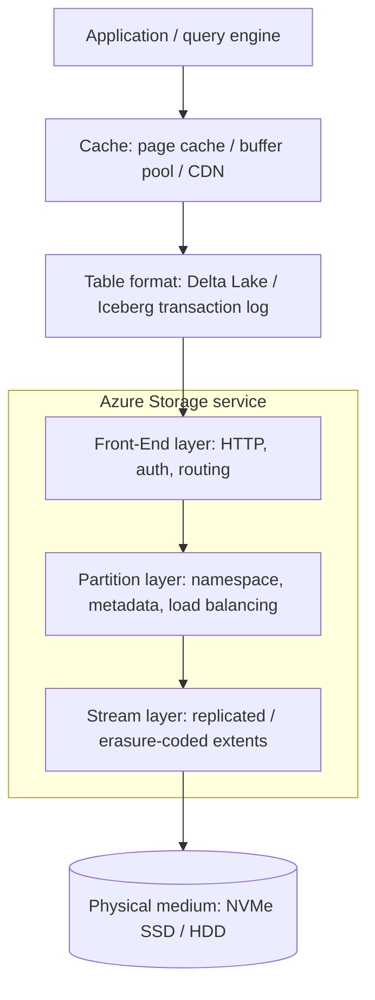
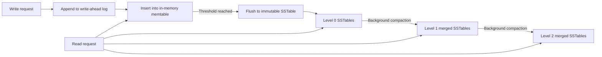
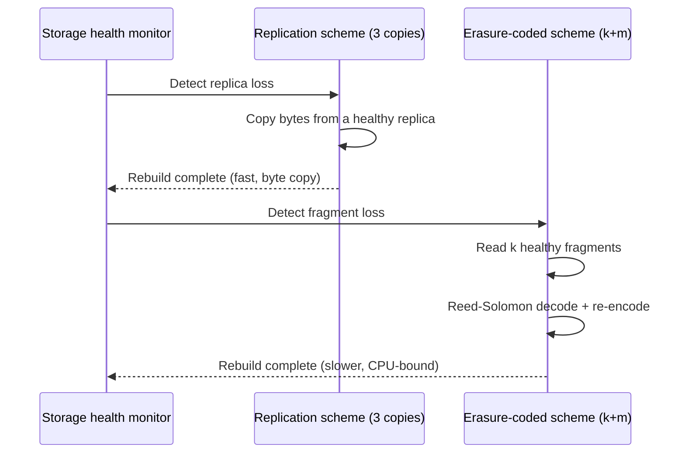

# Storage Systems Fundamentals

> Part of the **Enterprise Data & AI Architecture Handbook** · Phase-00 — Foundations & Prerequisites · Chapter 05.
> Estimated study time: **60 min reading + ~4h labs**.
> **Prerequisite:** read [Operating Systems for Data Engineers](03_Operating_Systems.md) and [Networking Fundamentals](04_Networking_Fundamentals.md) first.

---

## Executive Summary

Every Delta table `MERGE`, every Kafka segment fsync, every feature-store point lookup, and every model checkpoint write eventually resolves to a physical write on a spinning platter or a NAND flash cell — and the latency, durability, and consistency guarantees your data platform advertises to the business are, underneath, a direct consequence of decisions made at this layer: how the medium is addressed (HDD vs. SSD vs. NVMe), how bytes are organized for access (block vs. file vs. object), how copies are kept durable (replication vs. erasure coding), how writes are made crash-safe and searchable (write-ahead logs, B-trees, LSM-trees), and where caching sits between the CPU and the medium. [Operating Systems for Data Engineers](03_Operating_Systems.md) established that the kernel mediates every I/O through the page cache and a block-device abstraction; [Networking Fundamentals](04_Networking_Fundamentals.md) established that object storage is reached over HTTPS, not a local bus. This chapter is the layer beneath both: what actually happens to your bytes once the kernel hands them to a device, and why that determines the durability, latency, and cost trade-offs every storage SKU decision in the handbook (ADLS Gen2 tier, Delta Lake file layout, Cosmos DB consistency level) ultimately rests on.

This is the chapter where "the write is slow" becomes "you are doing 4KB random writes against an HDD-backed volume with no write-ahead log batching, forcing a seek per write" — a diagnosis you can act on. We cover HDD mechanical geometry and why seek time dominates random I/O; SSD/NAND internals (pages, blocks, garbage collection, write amplification) and why sustained random-write throughput degrades under an unmanaged workload; the block/file/object storage taxonomy and why object storage's flat namespace and HTTP API trade POSIX semantics for near-infinite horizontal scale; durability engineering via replication (3x copies, quorum) and erasure coding (Reed-Solomon, the actual math behind "11 nines" of durability); the write-ahead log as the universal crash-recovery primitive; B-trees vs. LSM-trees as the two dominant on-disk indexing strategies and the RUM (Read-Write-Space) conjecture that explains why neither dominates the other; and how caching tiers (page cache, buffer pool, CDN, hot/cool/archive tiering) trade cost against latency at every layer.

The bias remains **Azure-primary (~60%)** — Azure Managed Disks (Premium SSD v2, Ultra Disk), Azure Files, Azure NetApp Files, Azure Blob Storage/ADLS Gen2 tiers and redundancy options (LRS/ZRS/GRS/RA-GZRS) — **~30% enterprise open source** (Delta Lake, Apache Iceberg, Apache Hudi, MinIO, RocksDB, Kafka log segments, PostgreSQL) and **~10% AWS/GCP comparison-only**. By the end you will read a storage-tier SKU sheet, a Delta Lake `OPTIMIZE`/compaction log, or a "write latency spiked at 2am" incident and know precisely which layer — medium, indexing structure, replication scheme, or cache — to interrogate first.

**Bottom line:** storage is not "a place bytes go" — it is a stack of engineering trade-offs (mechanical vs. flash, block vs. object, replication vs. erasure coding, B-tree vs. LSM-tree, write-through vs. write-back) each optimized for a different point on the cost/latency/durability/consistency surface. Architects who can name the trade-off being made at each layer design storage systems that meet their actual SLA and cost budget instead of inheriting a default that happens to be wrong for the workload.

---

## Learning Objectives

By the end of this chapter you will be able to:

1. **Explain HDD, SSD, and NVMe internals** (seek/rotational latency, NAND pages/blocks, garbage collection, write amplification) and use them to predict IOPS/throughput behavior for a given access pattern.
2. **Distinguish block, file, and object storage models** and choose correctly among Azure Managed Disks, Azure Files, and ADLS Gen2/Blob Storage for a given workload.
3. **Quantify durability** using replication (LRS/ZRS/GRS) and erasure-coding schemes, and explain what "11 nines of durability" actually means mathematically.
4. **Explain the write-ahead log (WAL)** as the universal crash-recovery mechanism and trace how it underlies database, Kafka, and Delta Lake durability guarantees.
5. **Compare B-trees and LSM-trees** on read/write/space amplification (the RUM conjecture) and select the correct structure for a given read/write ratio.
6. **Reason about consistency and caching** across storage tiers (page cache, buffer pool, hot/cool/archive tiers, CDN) and their latency/cost/staleness trade-offs.
7. **Translate these fundamentals into an Azure storage architecture** (disk SKU, redundancy option, access tier) and defend the choice with quantified durability, latency, and cost numbers in a design review.
8. **Connect storage fundamentals to Delta Lake/Iceberg/Hudi table-format design**, previewed here and developed fully in later handbook phases.

---

## Business Motivation

Storage decisions show up directly as SLA risk, durability risk, and cloud spend — often as the single largest line item in a data platform's Azure bill:

- **Storage tier and redundancy choice is a direct cost lever.** Archive-tier blob storage can be **20-50x cheaper per GB** than Premium SSD, but retrieval latency moves from milliseconds to hours — a wrong default here either overspends by 10x or breaks an SLA silently.
- **Durability is not free and not uniform.** LRS (3 copies, one datacenter) is materially cheaper than GRS (6 copies, two regions) but accepts regional-disaster data loss risk that a regulator or a board may not consider acceptable for financial or health records.
- **Random I/O patterns on the wrong medium are a silent throughput killer.** A workload that does small random writes against HDD-backed storage can be an order of magnitude slower — and more expensive per useful IOP — than the same workload on NVMe, independent of how much compute is thrown at it.
- **Write amplification on flash media is a hidden cost and lifespan risk.** Poorly batched small writes shorten SSD lifespan and degrade sustained throughput — an operational cost invisible until a device starts throttling or failing early.
- **Indexing-structure choice (B-tree vs. LSM-tree) is a direct latency/cost trade-off** for any custom-built or embedded data store (RocksDB-backed state stores, time-series engines) — get it backwards and you pay in either read latency or compaction CPU/IO cost at scale.

For an architect, storage fluency converts "storage is slow" into "we're forcing 4KB random reads against Cool-tier blob storage for a hot-path lookup workload — the fix is a caching tier or a tier/SKU change, not more compute." That reasoning is precise, quantifiable, and defensible in a cost or reliability review.

---

## History and Evolution

- **1956 — IBM 305 RAMAC**, the first commercial hard disk drive, introduces random-access magnetic storage (50 platters, 5MB total) — the mechanical-seek paradigm that persists in HDDs today.
- **1970 — Codd's relational model** implicitly assumes an efficient on-disk indexed access structure, driving early B-tree adoption in database engines.
- **1972 — B-trees (Bayer & McCreight)** formalize a balanced, self-organizing on-disk tree structure that remains the dominant index structure in relational databases (PostgreSQL, SQL Server, MySQL/InnoDB) to this day.
- **1988 — "A Case for RAID" (Patterson, Gibson, Katz)** formalizes redundant arrays of inexpensive disks, establishing striping, mirroring, and parity as the vocabulary of durable multi-disk storage.
- **1991 — NAND flash memory (Toshiba)** becomes commercially viable, beginning the decades-long HDD→SSD transition driven by falling $/GB and the elimination of mechanical seek latency.
- **1996 — Log-Structured Merge-trees (O'Neil et al.)** formalize the append-only, memtable + sorted-run + background-compaction structure now underlying Cassandra, HBase, RocksDB, LevelDB, and (conceptually) Kafka's own append-only log.
- **2003 — Google File System (GFS) paper** establishes chunk-based, replicated, commodity-hardware distributed file storage as the template for every large-scale object storage system that follows, including HDFS.
- **2006 — Amazon S3 launches**, popularizing the object-storage model (flat namespace, HTTP REST API, eventual-then-strong consistency) as an alternative to POSIX file systems for internet-scale unstructured data.
- **2007 — NAND SSDs reach enterprise adoption**, and the SATA/AHCI interface (designed for spinning disks with one command queue) becomes the throughput bottleneck for flash.
- **2011 — Windows Azure Storage (SOSP paper)** publishes the production architecture (Front-End, Partition, and Stream layers) behind Azure Blob/Table/Queue storage — a canonical reference architecture referenced throughout this chapter.
- **2011 — NVMe specification** is introduced specifically to remove the SATA/AHCI single-queue bottleneck, exposing up to 64K queues of 64K commands each directly over PCIe.
- **2016-onward — Erasure coding at scale** (Reed-Solomon-based, e.g., Azure Storage's Local Reconstruction Codes) supersedes pure triple-replication for cold/archival data, cutting storage overhead from 200% to ~25-50% at equivalent durability.
- **2019 — Delta Lake, followed by Apache Iceberg and Apache Hudi**, layer ACID transactions, schema evolution, and time travel on top of plain object storage — directly building on the durability and consistency guarantees this chapter establishes.
- **2020-2026 — NVMe over Fabrics, Azure Ultra Disk/Premium SSD v2, and disaggregated storage architectures** push flash performance across the network with sub-millisecond latency, blurring the line between "local" and "remote" storage for latency-sensitive workloads.

---

## Why This Technology Exists

Storage systems exist to solve the fundamental problem that memory (fast, byte-addressable, volatile) and durable media (slower, block/object-addressed, persistent) have irreconcilably different cost/performance/persistence profiles, and every workload needs some point on that spectrum:

- **Block storage** exists because operating systems and databases need a low-level, fixed-size-addressable abstraction over physical media that they can build their own file systems and indexing structures on top of — direct continuation of the block-device abstraction from [Operating Systems](03_Operating_Systems.md#storage).
- **File storage** exists because applications need a hierarchical, POSIX-semantic namespace (directories, permissions, locking) shared across multiple compute nodes without each one managing raw blocks.
- **Object storage** exists because the file-system POSIX model (strong metadata consistency, hierarchical locks, small default object counts) does not scale horizontally to billions of unstructured objects across commodity hardware — a flat namespace, HTTP API, and relaxed (but now often strong) consistency model does.
- **Replication and erasure coding** exist because a single disk, server, or even datacenter *will* fail — durability must be engineered, not assumed, and the CAP-theorem-adjacent question of "how many independent failures can we survive" must have a designed, quantified answer.
- **Write-ahead logs** exist because in-place updates to complex on-disk structures (B-tree pages) cannot be made atomic against a mid-write crash without first recording intent durably and sequentially — turning a random-write durability problem into a cheap sequential-write one.
- **LSM-trees** exist because B-trees' random-write, in-place update pattern is fundamentally I/O-inefficient on both HDDs (seeks) and flash (write amplification) for write-heavy workloads — LSM-trees trade read amplification for dramatically better write throughput by never updating in place.
- **Caching tiers** exist because the fastest, most durable, and cheapest storage points are three different, mutually exclusive physical media — caching lets a system approximate "fast AND cheap" for the subset of data that is hot.

Without these mechanisms, every application would need to hand-roll durability, crash recovery, and cost/performance tiering — an unmaintainable, fragile, and financially unsustainable outcome at enterprise scale.

---

## Problems It Solves

- **Durable persistence across power loss and crashes** — write-ahead logging and fsync/`O_DIRECT` semantics guaranteeing data survives an unexpected restart.
- **Surviving hardware failure without data loss** — replication and erasure coding engineering a quantified probability of durability across independent failure domains.
- **Efficient random vs. sequential access trade-offs** — B-trees for balanced random read/write; LSM-trees for write-heavy, append-friendly workloads; sequential-log structures for streaming (Kafka).
- **Scaling unstructured data storage to exabytes** — object storage's flat namespace and horizontal partitioning removing the metadata-server bottleneck that limits traditional file systems at extreme scale.
- **Cost/performance tiering** — hot/cool/archive tiers and caching layers letting an organization pay premium prices only for genuinely latency-sensitive bytes.
- **Consistent, predictable access semantics for concurrent readers/writers** — file-locking semantics (NFS/SMB), optimistic concurrency (ETags in object storage), and transaction logs (Delta Lake) providing the correctness guarantees applications build on.

---

## Problems It Cannot Solve

- **It cannot make slow media fast.** No file system or caching layer changes the physical seek time of an HDD or the erase-before-write constraint of NAND flash — it can only amortize or hide that cost for some access patterns, not eliminate it.
- **It cannot guarantee zero data loss for free.** Every durability guarantee (replication factor, erasure-coding scheme) is a cost/probability trade-off, not an absolute; "durable" always means "durable to a stated, finite probability of correlated failure," not "impossible to lose."
- **It cannot substitute for application-level idempotency.** A write-ahead log guarantees the storage engine's *own* internal state is crash-consistent; it says nothing about whether the *application* correctly handles a retried or partially-applied logical operation (see [Networking Fundamentals](04_Networking_Fundamentals.md#fault-tolerance) on ambiguous-timeout retries).
- **It cannot make an inherently random-access workload sequential**, or vice versa — choosing the wrong indexing structure (B-tree for a write-heavy append workload, LSM-tree for a read-heavy point-lookup workload) leaves performance on the table regardless of hardware.
- **It cannot eliminate the CAP trade-off for distributed, replicated storage** — a partitioned, replicated store must still choose consistency or availability during a partition; storage engineering provides the mechanisms, not an escape from the theorem.
- **It cannot fix a bad data model.** Object storage handles unstructured blobs superbly; it does not turn a million small objects, addressed randomly, into a low-latency point-lookup system without an additional indexing layer (a lesson [Delta Lake / Lakehouse](../Phase-02/README.md) chapters build on directly).

---

## Core Concepts

### 5.1 HDD internals: seek time, rotational latency, and IOPS

A **hard disk drive (HDD)** stores data on spinning magnetic platters read by a mechanical actuator arm. Every random-access read/write pays two mechanical costs: **seek time** (moving the arm to the correct track, ~2-9ms) and **rotational latency** (waiting for the platter to spin the correct sector under the head, averaging half a rotation — ~4.2ms at 7200 RPM). These costs are *independent of data size* for small transfers, which is why HDD random IOPS are capped in the low hundreds (typically 75-180 IOPS for a 7200 RPM drive) regardless of how fast the interface (SATA/SAS) is, while **sequential** throughput (100-250 MB/s) is comparatively excellent because it pays the seek/rotation cost once and streams afterward. This single asymmetry — sequential is cheap, random is expensive — is the reason every storage engine discussed later in this chapter (WAL, LSM-tree) is designed to convert random writes into sequential ones.

### 5.2 SSD/NAND internals: pages, blocks, garbage collection, and write amplification

**NAND flash** stores bits in **cells** grouped into **pages** (typically 4-16KB, the minimum read/write unit) grouped further into **blocks** (typically 128-256 pages). Critically, **a page can be written only after its containing block is erased**, and **erase operates only at block granularity** — you cannot overwrite a single page in place. The SSD's **Flash Translation Layer (FTL)** handles this by always writing to a fresh page and marking the old page stale, then periodically running **garbage collection**: copying live pages out of a partially-stale block, erasing the whole block, and returning it to the free pool. This copying is invisible to the OS but consumes real internal I/O bandwidth — the ratio of physical bytes written (including GC copies) to logical bytes the application requested is **write amplification (WA)**, and a WA of 3-5x under a poorly-suited random-write workload is common, directly degrading sustained throughput and shortening device lifespan (each cell tolerates a finite number of program/erase cycles). **Over-provisioning** (reserving extra unadvertised flash for GC headroom) and **TRIM/UNMAP** (telling the SSD which logical blocks are no longer in use, so GC can skip copying dead data) are the primary levers for controlling WA — and are precisely why a filesystem/OS's TRIM support (established in [Operating Systems](03_Operating_Systems.md#storage)) matters materially for SSD-backed volumes.

### 5.3 NVMe vs. SATA/AHCI: why the interface matters as much as the medium

**SATA/AHCI**, designed for spinning disks, exposes a **single command queue of 32 commands** — adequate for HDD's low IOPS ceiling but a severe bottleneck for flash, which can natively service tens of thousands of IOPS. **NVMe** (Non-Volatile Memory Express) is a protocol designed specifically for flash, communicating directly over the PCIe bus and exposing **up to 64K queues of up to 64K commands each**, enabling massive parallelism, lower per-command CPU overhead, and materially lower tail latency. This is why migrating identical flash media from a SATA to an NVMe interface can itself yield a large IOPS and latency improvement — the medium was never the sole bottleneck; the command-queue depth and protocol overhead were.

### 5.4 Queue depth and the IOPS/latency curve

**Queue depth (QD)** — the number of outstanding I/O requests a device is allowed to process concurrently — trades latency for throughput. At QD=1, every request completes before the next starts, minimizing per-request latency but underutilizing a device capable of internal parallelism (especially NVMe SSDs with many parallel NAND dies). Increasing QD raises achievable IOPS/throughput up to a device-specific saturation point, beyond which queueing delay increases latency without further throughput gain — the classic **utilization/latency knee** familiar from queueing theory, and the reason storage benchmarks always report IOPS *at a stated queue depth*, not as a single number.

### 5.5 Block, file, and object storage models

- **Block storage** exposes raw, fixed-size addressable blocks (like a virtual disk) with no inherent structure; the attaching OS formats a file system on top (NTFS/ext4/XFS). Single-attach (or limited multi-attach) semantics; lowest-level, highest-performance, most "roll your own" abstraction. *Azure: Managed Disks.*
- **File storage** exposes a hierarchical namespace with POSIX or SMB semantics (directories, file locking, permissions), natively shareable across multiple compute nodes over the network (NFS/SMB protocols). *Azure: Azure Files, Azure NetApp Files.*
- **Object storage** exposes a flat namespace (container/bucket + key) accessed over HTTP(S) REST, with rich metadata per object, no native file locking, and horizontal scalability to billions of objects and exabytes — the model unstructured/data-lake and AI training-data storage is built on. *Azure: Blob Storage / ADLS Gen2 (which adds a hierarchical namespace on top of the flat object model).*

The trade-off across all three: block storage gives you full control and the lowest latency at the cost of managing everything yourself and limited attach scalability; file storage gives you shared POSIX semantics at the cost of a namespace/metadata bottleneck at extreme scale; object storage gives you near-unlimited horizontal scale and durability at the cost of POSIX semantics (no in-place byte-range overwrite, no native locking, historically weaker consistency).

### 5.6 Durability engineering: replication and erasure coding

**Replication** stores N full copies of data across independent failure domains (disks, racks, datacenters, regions); it is simple and fast to read/rebuild from but carries **N x storage overhead** (e.g., 3x for triple replication). **Erasure coding** (commonly **Reed-Solomon**) splits data into *k* data fragments and computes *m* additional parity fragments, such that any *k* of the *k+m* total fragments reconstruct the original — tolerating up to *m* simultaneous fragment losses at a storage overhead of only *(k+m)/k* (e.g., a 12-data/4-parity scheme is 16/12 ≈ 1.33x overhead, versus 3x for triple replication) at *equivalent or better* fault tolerance, at the cost of higher CPU cost to encode/decode and higher latency to reconstruct a lost fragment. This is precisely why Azure Storage uses **Local Reconstruction Codes (LRC, an erasure-coding variant)** for cool/archive-tier data (cost-optimized, rebuild latency tolerable) while hot-tier/premium data typically favors replication (rebuild latency matters more than the extra overhead).

### 5.7 Quantifying durability: what "11 nines" means

Azure Blob Storage advertises **99.999999999% (11 nines) annual durability** for redundant storage options. This is not a marketing number — it is derived from the annualized failure rate (AFR) of the underlying disks, the replication/erasure-coding scheme's fault tolerance, and the **mean time to repair (MTTR)** (how fast a lost replica/fragment is rebuilt before a second correlated failure could cause actual data loss). The engineering lever that matters most in practice is **MTTR**, not raw replica count — a scheme with 3 copies and fast automated rebuild can out-durability a scheme with 4 copies and slow manual rebuild, because durability is fundamentally a race between failure rate and repair speed.

### 5.8 Write-ahead logs (WAL)

A **write-ahead log** requires that any modification to a page/structure be first appended, sequentially and durably (fsync'd), to an append-only log *before* the corresponding in-place page update is applied (or even if the page update is deferred entirely). On crash, recovery replays the log from the last checkpoint to reconstruct any lost in-memory state — converting an expensive, hard-to-make-atomic random write (updating a B-tree page in place) into a cheap, easy-to-make-atomic sequential append. This single pattern underlies PostgreSQL's WAL, SQL Server's transaction log, Kafka's log segments (the log *is* the primary store, not just a recovery aid), and Delta Lake's `_delta_log` JSON commit log (see §5.10).

### 5.9 B-trees vs. LSM-trees, and the RUM conjecture

A **B-tree** is a balanced, self-organizing tree of fixed-size pages, updated **in place**: a write locates the correct leaf page (via root-to-leaf traversal) and modifies it directly, splitting/merging pages as needed to stay balanced. This gives **excellent read and range-scan performance** (a bounded number of page reads, typically 3-4 for billions of rows) but **poor write performance under high write volume**, because in-place random page writes are exactly the expensive access pattern described in §5.1/§5.2 (HDD seeks, or SSD write amplification from small in-place page rewrites). *Used by: PostgreSQL, SQL Server, MySQL/InnoDB.*

An **LSM-tree (Log-Structured Merge-tree)** never updates in place. Writes go first to an in-memory **memtable** (itself typically backed by a WAL for crash safety), which, once full, is flushed as an immutable, sorted **SSTable (Sorted String Table)** file to disk — a purely sequential write. Reads must check the memtable and potentially *multiple* SSTables (newest first) for the most recent value, and a background **compaction** process periodically merges and reorganizes SSTables to bound the number a read must check and reclaim space from overwritten/deleted keys. This gives **excellent, purely sequential write throughput** at the cost of **read amplification** (checking multiple SSTables) and **compaction I/O overhead** (a genuine background cost, analogous to but distinct from SSD garbage collection). *Used by: Cassandra, HBase, RocksDB, LevelDB, and — conceptually — the append-only, compaction-free (until log compaction/retention kicks in) design of Kafka's own log segments.*

The **RUM conjecture** (Read, Update, Memory) formalizes that no single indexing structure can simultaneously minimize read amplification, write (update) amplification, and space (memory) amplification — improving any two comes at the expense of the third. B-trees optimize for read amplification at the cost of write amplification; LSM-trees optimize for write amplification at the cost of read amplification (mitigated with Bloom filters, discussed below) and periodic space overhead until compaction runs. Choosing between them is choosing which two of the three your workload can least afford to sacrifice.

### 5.10 Bloom filters, and Delta Lake/Iceberg as WAL-and-LSM-adjacent designs

LSM-tree engines mitigate read amplification with **Bloom filters** — compact, probabilistic per-SSTable structures that can definitively say "this key is *not* in this SSTable" (no false negatives, tunable false-positive rate), letting a read skip SSTables that provably cannot contain the key without an actual disk read. This same append-only-plus-compaction philosophy reappears at the *table* level in **Delta Lake / Apache Iceberg / Apache Hudi**: writes append new Parquet files and an append-only JSON/Avro commit log (Delta's `_delta_log`, Iceberg's manifest lists — both WAL-like sequential, atomic commit records) rather than mutating existing files in place, and a background `OPTIMIZE`/compaction process (directly analogous to LSM compaction) merges small files to bound read amplification — a design lineage worth recognizing when these table formats are covered in depth later in the handbook.

### 5.11 Consistency and caching across storage tiers

Every storage tier from CPU cache to archive blob storage trades latency against cost and staleness risk: the OS **page cache** (established in [Operating Systems](03_Operating_Systems.md#storage)) caches recently-used blocks in RAM; a database's **buffer pool** does the same for indexed pages; a CDN/edge cache holds hot object-storage content near users; and blob **access tiers** (hot/cool/archive) trade retrieval latency for storage cost at rest. **Write-back** caching (acknowledge the write once it's in cache, flush to durable media asynchronously) is fast but risks data loss on a cache-node crash before flush; **write-through** caching (flush to durable media before acknowledging) is slower but crash-safe — the same latency/durability trade-off recurring at every layer of the stack.

---

## Internal Working

**How a single random write reaches a B-tree-backed database on flash.** The database engine appends the change to its WAL and fsyncs it (durable, sequential — cheap). It then locates the correct B-tree leaf page (likely already cached in the buffer pool for a hot page; a cache miss triggers a device read), modifies the page in memory, and marks it dirty; the actual in-place page write to the SSD happens later, asynchronously, at checkpoint time — at which point the SSD's FTL writes it to a fresh physical page and, eventually, garbage-collects the stale copy. The application only waits on the WAL fsync, not the full page write — the entire reason WAL exists.

**How an LSM-tree-backed store (RocksDB) handles the same write.** The write is appended to RocksDB's own WAL (fsync'd) and inserted into the in-memory memtable (a sorted structure, e.g., a skip list) — no disk seek at all beyond the sequential WAL append. When the memtable reaches its size threshold, it is flushed as a new immutable SSTable file (a purely sequential write). A background thread periodically compacts SSTables across "levels" (RocksDB's leveled compaction), merging and discarding overwritten/deleted keys, bounding both space and future read amplification.

**How a read against Azure Blob Storage/ADLS Gen2 resolves internally.** A client request hits the **Front-End layer** (stateless, HTTP request routing, authentication), which consults the **Partition Layer** (maps the object's key to the partition server responsible for its metadata and manages the object namespace, load-balancing hot partitions across servers), which in turn reads the actual data from the **Stream Layer** (an internal, replicated, append-only distributed file system storing data as large "extents" — itself an LSM/WAL-adjacent design, replicating each extent synchronously across three fault domains before acknowledging a write). This three-layer separation (documented in the 2011 SOSP "Windows Azure Storage" paper) is *why* Azure Storage can independently scale request-routing, metadata, and raw capacity — a direct real-world instance of the architectural pattern in §5.5-§5.7.

**How erasure-coded (cool/archive) rebuild works after a fragment loss.** When a storage node/disk holding one fragment of an erasure-coded object fails, the system reads *any k* of the remaining *k+m* fragments (from other, healthy nodes), performs the Reed-Solomon decode/re-encode computation, and writes the reconstructed fragment to a new healthy location — a CPU- and network-bound background repair, materially slower than replacing a lost replica in a pure-replication scheme (which just copies bytes), which is why erasure coding suits cooler, less rebuild-time-sensitive tiers.

---

## Architecture

The relevant storage architecture, layered from physical medium to application, for an Azure-hosted data/AI platform:

1. **Physical medium layer** — HDD (mechanical), SATA/NVMe SSD (NAND flash), each with the seek/rotational or page/block/GC characteristics from Core Concepts.
2. **Device/controller firmware layer** — the FTL (SSD) or disk controller managing wear leveling, bad-block remapping, and command queuing (SATA/AHCI vs. NVMe).
3. **Block device / volume layer** — Azure Managed Disks (Premium SSD v2, Ultra Disk, Standard HDD) presenting a virtual block device to the attached VM, itself replicated for durability underneath.
4. **File system / OS layer** — NTFS/ext4/XFS on top of the block device, providing the POSIX file abstraction covered in [Operating Systems](03_Operating_Systems.md#storage).
5. **Distributed storage service layer** — Azure Storage's Front-End / Partition / Stream three-tier architecture (for Blob/ADLS Gen2/Files/Queues), or a self-managed distributed file system (HDFS, MinIO) for open-source-first architectures.
6. **Table-format / transaction layer** — Delta Lake/Iceberg/Hudi's commit log and file-layout conventions on top of raw object storage, providing ACID semantics the underlying object store does not natively guarantee.
7. **Caching layer(s)** — OS page cache, database buffer pool, and (for internet/CDN-facing content) Azure Front Door/CDN edge caching, each shrinking effective latency for hot data at the cost of staleness/consistency risk.

An incident is almost always localized by asking **at which of these seven layers** the symptom first appears — a slow VM disk (layer 3 SKU/IOPS limit), a fragmented file system (layer 4), a hot partition in the storage service (layer 5), a table with too many small files (layer 6), or a stale cache (layer 7).

---

## Components

| Component | Role | Concrete instantiation |
|---|---|---|
| **Physical medium** | Persists bits | HDD platters, NAND flash cells |
| **Device controller / FTL** | Wear leveling, bad-block mapping, GC | SSD firmware, RAID controller |
| **Block device** | Fixed-size addressable virtual disk | Azure Managed Disk (Premium SSD v2, Ultra Disk) |
| **File system** | Hierarchical namespace, POSIX semantics | NTFS, ext4, XFS |
| **Network file protocol** | Shared file access across nodes | NFS, SMB (Azure Files, Azure NetApp Files) |
| **Object storage front-end** | HTTP(S) API, auth, request routing | Azure Storage Front-End layer |
| **Metadata/partition layer** | Object-to-location mapping, load balancing | Azure Storage Partition Layer |
| **Replicated data layer** | Durable, replicated/erasure-coded byte storage | Azure Storage Stream Layer, HDFS DataNodes, MinIO |
| **Table transaction log** | ACID commit log over object storage | Delta Lake `_delta_log`, Iceberg manifests |
| **Cache** | Latency reduction for hot data | OS page cache, DB buffer pool, Azure CDN/Front Door |

---

## Metadata

Storage-level "metadata" that drives placement, durability, and cost:

- **Object metadata** — content type, custom key-value tags, access tier, ETag (optimistic concurrency token), last-modified timestamp, blob lease state.
- **Replication/placement metadata** — which fault domains/regions hold which replica or erasure-coded fragment; consulted during reads for locality and during failure for rebuild routing.
- **File system metadata** — inodes (Unix) / MFT records (NTFS): permissions, timestamps, block pointers — itself a major source of small-file-count scalability limits at extreme scale.
- **Table-format metadata** — Delta Lake's transaction log entries (add/remove file actions, schema, partition values) and Iceberg's manifest lists/manifest files — the authoritative record of "what files, as of what version, constitute this table."
- **Cache metadata** — cache-line/page validity, dirty bits (write-back caches), TTL/expiry (CDN, hot/cool tier lifecycle policies).

Good storage observability starts with metadata: partition/shard hot-spotting, small-file proliferation, and cache-hit-ratio degradation are all *metadata-observable* before they become user-visible latency incidents.

---

## Storage

*(This chapter's own subject as the "storage-of-storage" layer — see Core Concepts §5.5-§5.10 for the full treatment of block/file/object models, replication/erasure coding, and WAL/B-tree/LSM-tree structures, which are this chapter's primary content rather than a subsection.)*

- **Choosing block vs. file vs. object is a workload decision, not a default.** A database engine wants a low-latency block device it fully controls; a shared analytics workspace wants a POSIX file share; a data lake wants object storage's horizontal scale and immutability-friendly semantics.
- **Tiering is a lifecycle decision, not a one-time choice.** Azure Blob lifecycle management policies automate hot→cool→archive transitions based on last-access time, converting a manual cost-optimization task into a governed, ongoing policy.

---

## Compute

- **Compaction and garbage collection consume real compute.** LSM-tree background compaction and SSD garbage collection are both legitimate CPU/IO consumers that must be budgeted for, not treated as free background housekeeping — a compaction storm on an undersized node is a well-known self-inflicted latency spike.
- **Erasure-coding encode/decode is CPU-bound.** Rebuilding a lost fragment or encoding new erasure-coded writes costs real CPU cycles, a reason cost-optimized/cold-tier erasure coding is a poor fit for latency-sensitive hot-path workloads.
- **Storage-adjacent compute should be co-located.** As established in [Networking Fundamentals](04_Networking_Fundamentals.md#compute), placing compute and its primary storage in the same region/zone avoids both cross-AZ latency and egress cost for high-throughput scan/shuffle workloads.

---

## Networking

*(Object storage's access path is inherently network-mediated — see [Networking Fundamentals](04_Networking_Fundamentals.md) for the full transport/TLS/Private Link treatment; the storage-specific implications:)*

- **ADLS Gen2/Blob access is always an HTTPS request**, meaning every read/write pays the TLS and HTTP round-trip cost described in the prior chapter — batch/range requests and connection reuse matter as much for storage throughput as disk-side IOPS.
- **Private Link vs. public endpoint** materially changes both the security posture and the network path length for storage access — a repeat of the [Networking Fundamentals](04_Networking_Fundamentals.md#security) recommendation, specifically critical for regulated data-lake workloads.
- **Cross-region replication (GRS/RA-GZRS) traffic is real network egress**, billed and latency-bound by inter-region distance — a storage redundancy choice with a direct networking cost consequence.

---

## Security

- **Encryption at rest by default** — Azure Storage Service Encryption (SSE) encrypts all data at rest with Microsoft-managed keys by default, with customer-managed keys (Key Vault-backed) available for regulated workloads requiring key control/rotation ownership.
- **Encryption in transit** — enforce HTTPS-only access (`supportsHttpsTrafficOnly`) and, where required, TLS 1.2+ minimum — a direct application of [Networking Fundamentals](04_Networking_Fundamentals.md#security) at the storage layer.
- **Access control layering** — Azure RBAC for management-plane operations, Shared Access Signatures (SAS, time-boxed and scope-limited) or Azure AD (Microsoft Entra ID) for data-plane access — avoid long-lived account keys in application code as a matter of default hygiene, not an edge-case hardening step.
- **Immutable storage / WORM policies** for regulated data (time-based retention, legal hold) preventing deletion or modification even by privileged accounts — required for many financial/healthcare compliance regimes.
- **Soft delete and versioning** as a data-loss/ransomware mitigation layer, distinct from durability engineering — protects against *logical* deletion/corruption, not physical media failure.
- **Least-privilege network exposure** — Private Endpoints and storage firewall rules restricting data-plane reachability, closing the public-endpoint-plus-leaked-key exfiltration path flagged in the prior chapter.

---

## Performance

Storage-driven performance levers, in priority order:

1. **Match the indexing/access structure to the workload's read/write ratio** — LSM-tree for write-heavy/append workloads, B-tree for read-heavy/range-scan workloads (RUM conjecture, §5.9).
2. **Convert random I/O to sequential wherever possible** — batch small writes, use a WAL, prefer append-only file layouts (Delta/Parquet) over row-by-row mutation.
3. **Choose the right medium/SKU for the access pattern** — Premium SSD v2/Ultra Disk for latency-sensitive random I/O; Standard HDD or archive tier only for genuinely cold, sequential-scan-tolerant data.
4. **Right-size queue depth** to the device's parallelism (§5.4) — under-driving an NVMe SSD (QD=1) leaves most of its IOPS capacity unused.
5. **Bound small-file counts** in object-storage-backed tables — millions of small files inflate both read amplification (many GET requests) and metadata/listing latency; compaction (`OPTIMIZE`) is not optional at scale.
6. **Cache aggressively but correctly** — size buffer pools/page caches to the actual hot working set, and choose write-back vs. write-through deliberately based on acceptable data-loss-on-crash risk.

**Worked example.** A time-series ingestion service showed write throughput plateauing at ~2,000 rows/sec despite ample compute headroom. Investigation showed the service was doing individual `UPDATE`s against a B-tree-indexed table for out-of-order late-arriving events, each triggering a random page read-modify-write. Switching the ingestion path to an append-only, LSM-tree-backed store (RocksDB-based) for the hot ingest path, with periodic compaction into the final B-tree-indexed analytical table, raised sustained throughput to ~40,000 rows/sec — the RUM conjecture in practice: trading read amplification (a two-stage read path) for a 20x write-throughput gain that matched the actual workload shape.

---

## Scalability

- **Object storage scales horizontally by partitioning the namespace** (Azure Storage's Partition Layer, §Internal Working) across many partition servers, each independently load-balanced — the reason object storage, not file storage, is the default for exabyte-scale data lakes.
- **File storage's shared-metadata model scales less horizontally** — Azure Files/NFS-style shares have practical IOPS and namespace-size ceilings that push extreme-scale unstructured workloads toward object storage instead.
- **LSM-tree compaction scales with data volume, not request volume** — a rapidly growing LSM-backed store must provision compaction I/O/CPU headroom proportional to *write* volume, a frequently under-planned capacity dimension.
- **Erasure coding's storage-overhead advantage compounds at scale** — the percentage savings versus triple replication (§5.6) matters far more in absolute dollars at petabyte/exabyte scale than at gigabyte scale, which is why hyperscalers adopt it primarily for their largest (cold/archive) tiers first.

---

## Fault Tolerance

- **Replication factor and erasure-coding scheme are the primary fault-tolerance levers**, each surviving a quantified number of simultaneous failures (§5.6-§5.7) — the number chosen must match the platform's actual failure-domain independence (same rack vs. same datacenter vs. same region).
- **Write-ahead logs make crash recovery deterministic** — a storage engine that crashes mid-write recovers to a well-defined, consistent state by replaying the log, rather than leaving structures in an undefined, possibly-corrupt state.
- **Checksums and scrubbing detect silent data corruption (bit rot)**, which replication/erasure coding alone do not prevent — a replica of corrupted data is still corrupted; periodic background scrubbing with checksum verification is required to actually catch and repair it.
- **MTTR (mean time to repair), not just replica count, determines real-world durability** (§5.7) — fast automated rebuild after a failure is the single highest-leverage fault-tolerance investment.
- **Soft delete/versioning provide logical fault tolerance** against accidental deletion or ransomware-style corruption, a distinct failure mode from physical media loss and requiring its own explicit policy.

---

## Cost Optimization (FinOps)

- **Access-tier lifecycle policies are the single largest storage FinOps lever** — automating hot→cool→archive transitions based on measured last-access patterns routinely cuts storage cost by 50-80% for data lakes with a realistic access-frequency long tail.
- **Erasure coding vs. replication is a direct, quantifiable cost trade-off** (§5.6) — moving eligible cold data from LRS/GRS replication to erasure-coded storage can cut redundancy overhead from 200%+ to ~25-50% at comparable durability.
- **Redundancy option (LRS vs. ZRS vs. GRS/RA-GZRS) should match actual disaster-recovery requirements**, not be over-provisioned by default — GRS's cross-region replication cost (storage and egress) is only justified if a regional-disaster RTO/RPO genuinely requires it.
- **Small-file proliferation is a hidden cost multiplier** — beyond the performance cost (§Performance), per-request transaction costs on object storage accumulate meaningfully at high object counts; compaction is a cost optimization, not just a performance one.
- **Right-size disk SKU/IOPS provisioning** (e.g., Premium SSD v2's independently configurable IOPS/throughput vs. a fixed-tier Premium SSD) to actual measured workload requirements rather than a conservative, over-provisioned default.

---

## Monitoring

Monitor the storage signals that predict incidents and cost overruns before they page you:

- **IOPS/throughput utilization vs. provisioned limits** per disk/storage account — approaching a provisioned ceiling is a predictable, alertable event, not a surprise.
- **Latency percentiles per operation type** (GET/PUT/list, read/write) — object storage list operations are frequently far slower than GET/PUT and are a common unmonitored latency source.
- **Cache hit ratio** at every caching layer (buffer pool, CDN) — a declining hit ratio predicts a coming latency regression before user-facing symptoms appear.
- **Small-file count / average file size trends** for object-storage-backed tables — a leading indicator of both read-amplification and cost degradation.
- **Replication lag and rebuild/repair queue depth** — a growing rebuild backlog after a failure event is a durability-risk signal requiring active attention, not passive monitoring.

In Azure, surface these via **Azure Monitor Storage metrics** (transactions, latency, availability by API), **Azure Storage Insights**, and **Log Analytics** queries against diagnostic logs — alerting on approaching IOPS/throughput ceilings and degrading cache-hit ratios, not just aggregate availability.

---

## Observability

- **Correlate storage-layer latency with the application trace** — a slow API call should be traceable to "this specific blob GET took 400ms," not left as an undifferentiated "downstream call was slow."
- **Instrument compaction/GC events explicitly** (LSM compaction duration, SSD GC-driven latency spikes if device telemetry is available) — these are legitimate, recurring latency sources that deserve first-class observability, not dismissal as noise.
- **Track access-tier distribution and transition events** over time to validate lifecycle policies are behaving as configured, not silently mis-tiering hot data to archive.
- **Structured incident timelines should classify**: medium/IOPS-ceiling-related, replication/durability-related, cache-related, or table-small-file-related — that classification determines the fix and the owning team.

---

## Governance

- **Standardize redundancy option and access-tier policy by data classification** (e.g., regulated financial data defaults to GRS + immutable WORM policy; transient/derived data defaults to LRS + short lifecycle) as reviewed platform defaults.
- **Mandate encryption-at-rest-with-customer-managed-keys and Private Endpoint access** for regulated data classes, tracked as an auditable exception process for any deviation.
- **Require documented RPO/RTO per data class**, driving the redundancy-option decision explicitly rather than inheriting whatever the provisioning template happened to default to.
- **Audit small-file counts and lifecycle policy effectiveness** on a recurring cadence as part of platform cost governance, not only performance governance.
- **Centralize immutable/WORM retention policy definitions** for regulated data as reviewed, versioned platform artifacts (Bicep/Terraform), not manually configured per-workload exceptions.

---

## Trade-offs

| Decision | Option A | Option B | Trade-off |
|---|---|---|---|
| Medium | HDD | SSD/NVMe | Lower $/GB, poor random IOPS vs. higher $/GB, excellent random IOPS/latency |
| Durability scheme | Replication (3x) | Erasure coding (e.g., 12+4) | Fast rebuild, high overhead vs. slow rebuild, low overhead |
| Storage model | Block | Object | Full control, low latency, limited attach vs. massive horizontal scale, HTTP-mediated |
| Index structure | B-tree | LSM-tree | Read-optimized, in-place writes vs. write-optimized, read/compaction amplification |
| Cache write policy | Write-through | Write-back | Crash-safe, slower acknowledgment vs. fast acknowledgment, crash data-loss risk |
| Redundancy scope | LRS (single datacenter) | GRS/RA-GZRS (cross-region) | Lower cost, regional-disaster exposure vs. higher cost, regional-disaster protection |

---

## Decision Matrix

**Choosing an Azure storage model:**

| Requirement | Managed Disk (block) | Azure Files (file) | Blob/ADLS Gen2 (object) |
|---|---|---|---|
| Database/VM system disk, lowest latency | ✅✅ | ❌ | ❌ |
| Shared POSIX/SMB access across VMs | ⚠️ (needs clustering) | ✅✅ | ⚠️ (no native locking) |
| Exabyte-scale unstructured/data-lake storage | ❌ | ⚠️ (scale ceiling) | ✅✅ |

**Choosing a durability/redundancy option:**

| Requirement | LRS | ZRS | GRS / RA-GZRS |
|---|---|---|---|
| Lowest cost, datacenter-failure tolerance only | ✅✅ | ⚠️ | ❌ |
| Zone-level failure tolerance, single region | ❌ | ✅✅ | ⚠️ (overkill) |
| Regional disaster recovery requirement | ❌ | ❌ | ✅✅ |

---

## Design Patterns

- **Write-ahead log + checkpoint** for crash-safe, sequential-write-optimized durability in any custom storage engine.
- **LSM-tree with tiered/leveled compaction** for write-heavy, append-friendly workloads (time series, event stores, embedded state stores).
- **Hot/cool/archive lifecycle tiering** automated by policy, driven by measured access recency rather than manual classification.
- **Erasure coding for cold/archival tiers, replication for hot/latency-sensitive tiers** as the default durability-scheme split.
- **Read-through/write-behind caching** in front of object storage for latency-sensitive point-lookup workloads that object storage alone cannot serve efficiently.
- **Compaction-driven table maintenance** (Delta Lake `OPTIMIZE`/Iceberg compaction) as a scheduled, governed background job, not an ad hoc manual intervention.

---

## Anti-patterns

- **Small, frequent random writes against HDD-backed or under-provisioned SSD storage** without WAL-style batching — a predictable throughput ceiling hit early and often.
- **Using a single B-tree-indexed table for a high-volume, append-heavy ingestion workload** instead of an LSM-tree-friendly staging path — the RUM-conjecture mismatch from the Performance worked example.
- **Millions of small files in a data-lake table** with no compaction policy — degrades both read latency and cost simultaneously.
- **Defaulting every workload to GRS "to be safe"** without a documented RPO/RTO requirement — inflates cost without a matched business justification.
- **Treating replication as sufficient protection against corruption** — replication protects against *loss*, not silent bit rot; checksums/scrubbing are a separate, required mechanism.
- **Long-lived storage account keys embedded in application code** instead of SAS tokens or Azure AD-based data-plane access — a direct OWASP-adjacent credential-exposure risk.

---

## Common Mistakes

1. Assuming SSD/NVMe eliminates all random-I/O performance concerns rather than merely raising the ceiling (write amplification and GC still apply).
2. Choosing B-tree-backed storage for a write-heavy, rarely-read workload (or vice versa) without checking the actual read/write ratio against the RUM conjecture.
3. Confusing "replicated" with "corruption-proof" — omitting checksums/scrubbing as a separate required control.
4. Ignoring small-file accumulation in object-storage-backed tables until query latency or listing cost becomes visibly painful.
5. Provisioning disk IOPS/throughput SKUs based on peak marketing numbers rather than the workload's actual measured queue depth and access pattern.
6. Setting overly aggressive archive-tier lifecycle policies that inadvertently archive data still needed for near-real-time access, causing surprise retrieval latency.
7. Treating durability percentage ("11 nines") as a fixed constant rather than understanding it depends on MTTR, which platform operations directly influence.

---

## Best Practices

- **Match indexing structure and storage model to the actual read/write ratio and access pattern**, validated with real workload measurements, not defaults.
- **Convert random writes to sequential wherever possible** via WAL-style batching, append-only file layouts, and LSM-tree-backed ingestion paths for write-heavy data.
- **Automate hot/cool/archive lifecycle policies** based on measured access recency, reviewed periodically against actual retrieval patterns.
- **Choose replication vs. erasure coding deliberately** by rebuild-latency sensitivity, not by historical default.
- **Run periodic checksummed scrubbing** independent of replication/erasure-coding durability guarantees.
- **Bound and monitor small-file counts** in object-storage-backed tables with scheduled compaction.
- **Default to SAS tokens or Azure AD data-plane auth**, Private Endpoints, and customer-managed encryption keys for regulated data classes.

---

## Enterprise Recommendations

1. **Publish a storage-tier and redundancy-option decision framework** (mapping data classification to disk SKU, redundancy option, and access tier) as a platform-wide reviewed default.
2. **Mandate compaction/`OPTIMIZE` scheduling** as a release-readiness requirement for any object-storage-backed table with append-heavy writes.
3. **Require documented RPO/RTO per data class** driving redundancy-option selection, reviewed alongside disaster-recovery planning.
4. **Adopt erasure coding for cold/archival tiers platform-wide** where the durability/rebuild-latency trade-off is acceptable, quantifying the cost savings explicitly.
5. **Centralize encryption-key and Private Endpoint policy** for regulated storage accounts as versioned infrastructure-as-code, not manual portal configuration.
6. **Run periodic storage-tier and small-file audits** as a recurring FinOps and performance governance cadence, not a one-time optimization project.

---

## Azure Implementation

**Storage account with hierarchical namespace, redundancy, lifecycle policy, and Private Endpoint (illustrative Bicep).**
```bicep
resource storageAccount 'Microsoft.Storage/storageAccounts@2023-01-01' = {
  name: 'stdataplatform'
  location: location
  sku: { name: 'Standard_RAGZRS' }
  kind: 'StorageV2'
  properties: {
    isHnsEnabled: true                      // ADLS Gen2 hierarchical namespace
    supportsHttpsTrafficOnly: true
    minimumTlsVersion: 'TLS1_2'
    publicNetworkAccess: 'Disabled'
    encryption: {
      keySource: 'Microsoft.Keyvault'
      keyvaultproperties: { keyvaulturi: keyVaultUri, keyname: keyName }
    }
  }
}

resource lifecyclePolicy 'Microsoft.Storage/storageAccounts/managementPolicies@2023-01-01' = {
  parent: storageAccount
  name: 'default'
  properties: {
    policy: {
      rules: [
        {
          name: 'tier-and-expire'
          type: 'Lifecycle'
          definition: {
            actions: {
              baseBlob: {
                tierToCool: { daysAfterModificationGreaterThan: 30 }
                tierToArchive: { daysAfterModificationGreaterThan: 90 }
                delete: { daysAfterModificationGreaterThan: 2555 }
              }
            }
            filters: { blobTypes: ['blockBlob'] }
          }
        }
      ]
    }
  }
}
```

**Managed Disk with independently configurable IOPS/throughput (illustrative CLI, Premium SSD v2).**
```bash
az disk create \
  --resource-group rg-data-platform \
  --name disk-db-datafiles \
  --sku PremiumV2_LRS \
  --size-gb 512 \
  --disk-iops-read-write 10000 \
  --disk-mbps-read-write 400
```

**Diagnosing IOPS-ceiling throttling and cache-hit ratio via Azure Monitor (KQL).**
```kusto
StorageBlobLogs
| where OperationName in ("GetBlob", "PutBlob")
| summarize AvgLatencyMs = avg(DurationMs), P99LatencyMs = percentile(DurationMs, 99) by bin(TimeGenerated, 5m), OperationName
| order by TimeGenerated desc
```

---

## Open Source Implementation

- **Delta Lake / Apache Iceberg / Apache Hudi** — ACID transaction logs and file-layout conventions over plain object storage, directly building on the WAL/LSM-adjacent design principles in §5.10.
- **RocksDB / LevelDB** — embeddable LSM-tree storage engines underlying Kafka Streams state stores, CockroachDB, and many custom stateful services.
- **PostgreSQL** — canonical B-tree-plus-WAL relational storage engine, a reference implementation of §5.8-§5.9's mechanisms.
- **MinIO** — S3-API-compatible, self-hosted object storage for on-prem/hybrid or portable open-source-first data-lake architectures.
- **Apache Kafka** — append-only log-segment storage as the primary store (not merely a recovery log), with time- and size-based retention/compaction analogous to LSM-tree housekeeping.
- **HDFS** — chunk-based, replicated distributed file system, the open-source architectural sibling of Azure Storage's Stream Layer.

---

## AWS Equivalent (comparison only)

| Azure | AWS equivalent | Notes |
|---|---|---|
| Azure Managed Disks (Premium SSD v2/Ultra Disk) | Amazon EBS (io2 Block Express/gp3) | Both offer independently configurable IOPS/throughput on modern SKUs. |
| Azure Files / Azure NetApp Files | Amazon EFS / FSx for NetApp ONTAP | Comparable managed NFS/SMB file-share models. |
| Azure Blob Storage / ADLS Gen2 | Amazon S3 | Near-identical object model; ADLS Gen2's hierarchical namespace has no exact 1:1 S3 equivalent (S3 emulates hierarchy via key prefixes). |
| Blob lifecycle management (hot/cool/archive) | S3 Lifecycle + S3 Glacier tiers | Conceptually equivalent tiering, differing retrieval-latency tiers and pricing structure. |
| Azure Storage LRC erasure coding | S3's internal erasure-coding-based durability | Both use erasure coding internally; neither exposes the scheme as a customer-configurable choice. |

**Advantages of AWS:** S3's maturity and ecosystem breadth (broadest third-party tool/service integration) is a genuine operational advantage for heavily multi-vendor architectures. **Disadvantages:** ADLS Gen2's native hierarchical namespace (atomic directory rename, POSIX-like ACLs) has no exact S3 equivalent, requiring re-architecture of directory-rename-dependent pipeline logic when migrating from Azure to S3. **Migration strategy:** re-validate any code relying on atomic directory operations or POSIX ACLs; re-test small-file/listing performance characteristics, which differ subtly between the two services' partitioning strategies. **Selection criteria:** choose by existing cloud commitment and whether ADLS Gen2's hierarchical namespace materially simplifies the target data-lake directory/rename semantics.

---

## GCP Equivalent (comparison only)

| Azure | GCP equivalent | Notes |
|---|---|---|
| Azure Managed Disks | Google Persistent Disk (SSD/Extreme) | Comparable block-storage SKU tiers. |
| Azure Files | Google Filestore | Comparable managed NFS file-share model. |
| Azure Blob Storage / ADLS Gen2 | Google Cloud Storage (GCS) | Comparable object model; GCS's single-class-with-autoclass model differs from Azure's manual/policy-driven tiering. |
| Blob lifecycle management | GCS Object Lifecycle Management / Autoclass | GCS Autoclass automates tier transitions without an explicit rules policy — a materially different operating model. |

**Advantages of GCP:** GCS Autoclass's automatic, rule-free tiering reduces the lifecycle-policy authoring/maintenance burden compared to Azure's explicit rule-based policies. **Disadvantages:** less granular manual control over tiering thresholds than Azure's explicit day-count rules, which can matter for workloads with unusual, non-default access patterns. **Migration strategy:** re-validate expected storage cost under Autoclass's automatic behavior versus Azure's explicit policy before assuming cost parity. **Selection criteria:** choose GCS Autoclass when operational simplicity outweighs the need for precise, manually-tuned tiering thresholds; otherwise treat as comparison-only per this handbook's Azure-primary stance.

---

## Migration Considerations

- **ADLS Gen2's hierarchical namespace (atomic rename, POSIX ACLs) has no exact equivalent in S3 or GCS** — audit and re-test any pipeline logic depending on atomic directory rename before migrating off Azure.
- **Redundancy-option naming and semantics differ across clouds** (LRS/ZRS/GRS vs. AWS's region/AZ replication model vs. GCS's multi-region classes) — re-validate actual fault-domain independence, not just naming similarity.
- **Lifecycle/tiering policy models differ structurally** (explicit rule-based vs. GCS Autoclass's automatic model) — re-model expected cost and retrieval-latency behavior rather than assuming a like-for-like policy translation.
- **Small-file and listing-performance characteristics differ subtly by provider's internal partitioning scheme** — re-benchmark rather than assuming Azure-observed thresholds transfer directly.
- **Encryption-key management integration differs** (Key Vault vs. AWS KMS vs. Google Cloud KMS) — re-validate customer-managed-key rotation automation post-migration.

---

## Mermaid Architecture Diagrams

**Diagram 1 — Layered storage architecture, physical medium to application (architecture).**


**Diagram 2 — LSM-tree write and compaction path (flowchart).**


**Diagram 3 — Replication vs. erasure-coding rebuild after fragment loss (sequence).**


---

## End-to-End Data Flow

Trace a write from an application through the full storage stack to durable, replicated media:

1. **Application write call.** The application (or table-format writer, e.g., a Delta Lake `MERGE`) issues a write — either a block-device write, a file-share write, or an object-storage `PUT`.
2. **WAL/commit-log append (if applicable).** A database or table format first appends the intent to its write-ahead log or transaction log (`_delta_log`), fsync'd for durability, before or alongside the actual data write.
3. **Network transport.** For object/file storage, the request travels over HTTPS/SMB/NFS per [Networking Fundamentals](04_Networking_Fundamentals.md#end-to-end-data-flow) — TLS handshake (if not already warm), request routing to the storage service's front end.
4. **Front-end and partition routing.** Azure Storage's Front-End layer authenticates and routes the request; the Partition Layer resolves the target partition server for the object's key range.
5. **Durable write to the stream/replication layer.** The Stream Layer (or the block device's underlying replicated volume) writes the data synchronously to multiple fault domains (replication) or computes and distributes erasure-coded fragments, acknowledging only once the durability guarantee is met.
6. **Physical medium write.** Each replica/fragment lands on physical media — subject to the FTL's page/block/GC behavior (SSD) or seek/rotation (HDD) described in Core Concepts.
7. **Acknowledgment and cache update.** The write is acknowledged back up the stack; a write-through cache updates only after this acknowledgment, while a write-back cache would have acknowledged earlier, accepting the crash-window risk discussed in §5.11.

Every stage of this flow determines the actual latency and durability the application observes — a "durable write" claim is only as strong as the weakest stage in this chain.

---

## Real-world Business Use Cases

- **Regulated financial transaction logs.** GRS/RA-GZRS-backed, immutable (WORM) Blob Storage satisfying multi-year retention and regional-disaster durability compliance requirements.
- **Data lake for AI/ML training data.** ADLS Gen2 with lifecycle-tiered storage (hot for active training sets, archive for historical/compliance retention) balancing training-pipeline latency against multi-petabyte storage cost.
- **High-frequency time-series ingestion.** LSM-tree-backed ingestion path (RocksDB/Kafka) absorbing high write rates, compacted periodically into analytical, B-tree-indexed serving tables.
- **Global content delivery.** Azure Blob Storage plus Azure Front Door/CDN edge caching, serving read-heavy static/media content near users while keeping a single durable origin copy.
- **Database systems of record.** Premium SSD v2/Ultra Disk-backed managed disks for OLTP database data files, sized explicitly for measured IOPS/throughput requirements rather than default SKU assumptions.

---

## Industry Examples

- **Microsoft — Windows Azure Storage (SOSP 2011).** The Front-End/Partition/Stream three-layer architecture referenced throughout this chapter, published as one of the most-cited real-world distributed storage system designs.
- **Google — Google File System (2003) and its successor Colossus.** Established chunk-based, replicated, commodity-hardware distributed storage as the template later adopted by HDFS and, architecturally, by every major cloud object store.
- **Facebook/Meta — RocksDB.** Built and open-sourced as an embeddable LSM-tree engine, now powering Kafka Streams state stores, CockroachDB, and TiKV — a direct real-world validation of the LSM-tree design in §5.9.
- **Amazon — the 2017 S3 outage.** A mistyped command during routine debugging removed capacity from S3's index subsystem in the US-EAST-1 region beyond a safe threshold, requiring a full metadata-subsystem restart and causing hours of elevated error rates across a large swath of the internet — a canonical lesson in operational safeguards around storage metadata systems, referenced here as an industry case rather than an AWS implementation guide.

---

## Case Studies

**Case 1 — The B-tree table that couldn't keep up with IoT ingestion.** A telemetry pipeline wrote directly into a B-tree-indexed relational table at high volume; random-page writes from concurrent, unordered device timestamps caused index fragmentation and a steadily worsening write-latency curve over weeks. *Lesson:* migrating the hot ingest path to an LSM-tree-backed staging store, with periodic compaction into the relational table, matched the storage structure to the actual write pattern and restored throughput.

**Case 2 — The archive-tier policy that broke a compliance SLA.** A lifecycle policy auto-archived files after 90 days of no access, but a compliance process needed same-day retrieval for audits on records up to 7 years old. Archive-tier rehydration (hours, not milliseconds) silently broke the audit SLA until the policy was revised to keep audit-relevant data in cool tier instead. *Lesson:* lifecycle policies must be validated against *all* downstream access-latency requirements, not just typical-case access patterns.

**Case 3 — Small-file storm degrading a data lake.** A streaming job wrote one small Parquet file per micro-batch with no compaction job configured, accumulating millions of small files over months; query planning time and listing latency grew until analytical queries that once took seconds took minutes. *Lesson:* compaction (`OPTIMIZE`) must be a scheduled, monitored job from day one for any append-heavy table, not a reactive fix.

**Case 4 — Corruption that replication didn't catch.** A firmware bug caused silent bit-flip corruption on a subset of disks; because the corrupted data was faithfully replicated to all copies before the bug was discovered, all replicas were equally corrupted. *Lesson:* replication protects against loss, not corruption — checksummed background scrubbing is a distinct, necessary control, not a redundant one.

---

## Hands-on Labs

> Target ~4 hours. Use a local machine, WSL2, or an Azure sandbox subscription.

**Lab A — Measure random vs. sequential I/O on your own disk (30 min).**
1. Use `fio` (or a simple custom benchmark) to measure IOPS/throughput for 4KB random writes vs. large sequential writes on a local SSD; compare the numbers against the mechanical HDD figures in §5.1.

**Lab B — Build a minimal WAL-backed key-value store (60 min).**
2. Implement a small key-value store that appends every write to a log file (fsync'd) before updating an in-memory hash map; kill the process mid-write and verify recovery replays the log correctly.

**Lab C — Compare B-tree and LSM-tree behavior with RocksDB and SQLite (60 min).**
3. Load the same write-heavy synthetic dataset into SQLite (B-tree) and RocksDB (LSM-tree); measure write throughput and read latency for both, and explain the difference using the RUM conjecture.

**Lab D — Configure Azure Blob lifecycle management and observe tiering (45 min).**
4. Create a storage account, upload test blobs, configure a lifecycle policy with short (test-friendly) day thresholds, and verify blobs transition tiers as expected via the portal or CLI.

**Lab E — Reproduce read amplification from small files (45 min).**
5. Write a dataset as one large Parquet file versus a thousand tiny Parquet files with equivalent total data; measure and compare query/list latency, then run compaction and re-measure.

**Lab F — Quantify erasure coding vs. replication overhead (30 min).**
6. Given disk-count and durability-target parameters, calculate storage overhead and simultaneous-failure tolerance for a 3x replication scheme versus a 12+4 erasure-coding scheme, and present both to justify a tier assignment.

---

## Exercises

1. Explain why sequential throughput on an HDD can be excellent while random IOPS remain poor, using seek time and rotational latency.
2. A workload does 90% point reads and 10% writes against a growing dataset. Would you choose a B-tree or LSM-tree backing store, and why?
3. Calculate the storage overhead of a 10-data/4-parity erasure-coding scheme versus 3x replication, and state which simultaneous-failure count each tolerates.
4. Explain why a write-ahead log allows an in-place B-tree page update to be crash-safe without itself being written durably before acknowledgment.
5. A storage account's lifecycle policy archives data after 60 days of no access, but a downstream compliance job needs same-day retrieval on data up to 5 years old. Identify the flaw and propose a fix.
6. Why does replication alone fail to protect against silent bit-rot corruption, and what additional mechanism is required?
7. Explain why NVMe substantially outperforms SATA/AHCI for flash media even when the underlying NAND is identical.

---

## Mini Projects

- **MP1 — Storage benchmark harness.** Build a small tool that runs configurable read/write/queue-depth benchmarks against local block storage and reports IOPS/throughput/latency curves.
- **MP2 — Mini LSM-tree.** Implement a minimal LSM-tree (memtable, SSTable flush, simple leveled compaction) supporting put/get/delete, and measure its write throughput versus a naive in-place-update file store.
- **MP3 — Lifecycle policy cost simulator.** Given an access-frequency distribution, simulate storage cost under different hot/cool/archive lifecycle thresholds and recommend an optimal policy.
- **MP4 — Small-file compaction job.** Write a job that detects small-file proliferation in a directory/table and merges files above a configurable size/count threshold, then measure the before/after query-listing latency improvement.

---

## Capstone Integration

These storage fundamentals directly support the Phase-20 capstone (see [Introduction](01_Introduction.md)):

- **Data-lake and lakehouse architecture decisions** (table format, file layout, compaction strategy) rest directly on the WAL/LSM-tree/B-tree reasoning developed here.
- **Disaster recovery and RPO/RTO design** ([Distributed Systems Primer](08_Distributed_Systems_Primer.prompt.md)) depend on correctly quantifying replication/erasure-coding durability and rebuild time, not assuming a marketing "11 nines" figure applies uniformly.
- **Cost/FinOps modeling** for the capstone's storage bill rests on the tiering, redundancy-option, and small-file-compaction levers established here.
- **Networking cost and latency modeling** ([Networking Fundamentals](04_Networking_Fundamentals.md)) compounds directly with storage's own cross-region replication and access-path costs.

In the capstone you will justify disk SKU, redundancy option, access tier, and table-compaction policy with explicit IOPS, durability, and cost math, not just a diagram.

---

## Interview Questions

**Engineer level**
1. What causes an HDD's random IOPS to be so much lower than its sequential throughput?
2. Explain what write amplification is and why it matters for SSD lifespan and performance.
3. What is the difference between block, file, and object storage?
4. Why does a write-ahead log allow crash-safe recovery without writing every change in place immediately?
5. What is the difference between a B-tree and an LSM-tree, in one sentence each?

**Staff Engineer Questions**
6. Walk through diagnosing a database write-throughput plateau using queue depth, medium type, and indexing structure.
7. Explain the RUM conjecture and use it to justify a storage-engine choice for a given workload's read/write ratio.
8. Design a hot/cool/archive lifecycle policy for a dataset with a known access-frequency long tail, and justify the day thresholds chosen.
9. When would you choose erasure coding over replication for a given tier, and what operational trade-off are you accepting?

**Architect Questions**
10. Design a storage architecture (disk SKU, redundancy option, access tier, table format) for a regulated financial data platform with a defined RPO/RTO.
11. How would you decide between Azure Files and ADLS Gen2 for a shared analytics workspace supporting both legacy POSIX tooling and modern data-lake pipelines?
12. Define the platform-wide policy for encryption, Private Endpoint use, and immutability for regulated data classes, and its exceptions process.

**CTO Review Questions**
13. What is our actual, quantified durability and rebuild time (not the advertised "11 nines") for our most critical data classes?
14. Quantify our storage cost exposure from small-file proliferation and mis-tiered lifecycle policies, and the plan to remediate.
15. What is our data-corruption detection (checksumming/scrubbing) posture, independent of our replication/erasure-coding durability guarantees?

---

## Staff Engineer Questions

(Consolidated for interview prep — see items 6-9 above, plus:)
- Explain how Azure Storage's Front-End/Partition/Stream layering allows independent scaling of request routing, metadata, and raw capacity.
- Describe how you would detect and resolve small-file-driven read amplification in a production data-lake table before it becomes a user-visible incident.
- Contrast MTTR-driven durability engineering with simple replica-count reasoning, and explain which matters more in practice.

---

## Architect Questions

(See items 10-12 above, plus:)
- Produce an ADR for adopting erasure coding over triple replication for a platform's cold/archival storage tier, including alternatives and consequences.
- Define the enterprise's data-classification-to-storage-policy mapping (redundancy option, access tier, encryption, immutability) as a governed reference architecture.

---

## CTO Review Questions

(See items 13-15 above, plus:)
- Present the business case for investing in automated lifecycle-tiering and compaction tooling versus continuing with ad hoc, manually managed storage policy.
- Assess the business risk of a major cloud storage provider's metadata-subsystem outage (per the 2017 S3 case study) on our platform's availability, and the mitigations in place.

---

### Architecture Decision Record (ADR-0005): Adopt Erasure Coding for Cold/Archival Data Tiers

- **Context.** The platform's cold/archival data (regulatory retention, historical training datasets) was uniformly stored using GRS triple-replication-equivalent redundancy, incurring storage overhead disproportionate to the tier's actual rebuild-latency sensitivity, and a FinOps review flagged this as the largest addressable storage cost line item.
- **Decision.** Adopt erasure-coded storage (Azure Storage's Local Reconstruction Codes) for all data classified as cold/archival with a documented rebuild-latency tolerance of hours, while retaining replication for hot/latency-sensitive tiers, rolled out incrementally starting with the lowest-risk historical training-data corpus.
- **Consequences.** *Positive:* storage overhead for eligible cold data drops from ~200%+ (replication) to ~25-50% (erasure coding) at comparable or better durability, a quantified, material FinOps win. *Negative:* rebuild time after a fragment loss is materially slower (CPU-bound Reed-Solomon decode versus a byte copy) and unsuitable for latency-sensitive tiers; added encode/decode CPU cost on write and rebuild. *Neutral:* requires updated monitoring to track rebuild-queue depth specifically for erasure-coded tiers, distinct from replication-tier monitoring.
- **Alternatives considered.** *Uniform triple replication* (rejected: disproportionate cost for tiers with high rebuild-latency tolerance); *cheaper single-region LRS without any redundancy upgrade* (rejected: fails documented RPO/RTO for regulated retention data); *third-party cold-storage export outside Azure* (rejected: reintroduces cross-provider egress cost and governance complexity disproportionate to the savings).

---

## References

- O'Neil, O'Neil, Cheng, Gawlick — *The Log-Structured Merge-Tree (LSM-Tree)* (1996).
- Bayer & McCreight — *Organization and Maintenance of Large Ordered Indexes* (1972, the original B-tree paper).
- Patterson, Gibson, Katz — *A Case for Redundant Arrays of Inexpensive Disks (RAID)* (1988).
- Ghemawat, Gobioff, Leung — *The Google File System* (2003).
- Calder et al. — *Windows Azure Storage: A Highly Available Cloud Storage Service with Strong Consistency* (SOSP 2011).
- Kleppmann — *Designing Data-Intensive Applications* (storage engine and replication chapters).
- Microsoft Learn — Azure Storage redundancy, Managed Disks, Blob lifecycle management, and Azure Storage architecture documentation.

## Further Reading

- Gregg, Brendan — *Systems Performance* (file systems and disk I/O chapters).
- Athanassoulis et al. — *Designing Access Methods: The RUM Conjecture* (2016).
- RocksDB documentation — *Compaction styles and tuning*.
- Delta Lake / Apache Iceberg documentation — *Transaction log and file-layout internals*.
- Amazon — *Summary of the Amazon S3 Service Disruption in the Northern Virginia (US-EAST-1) Region* (2017 post-incident report).
- Handbook cross-references: [Operating Systems for Data Engineers](03_Operating_Systems.md), [Networking Fundamentals](04_Networking_Fundamentals.md), [Concurrency and Parallelism](06_Concurrency_and_Parallelism.prompt.md), [Distributed Systems Primer](08_Distributed_Systems_Primer.prompt.md).
