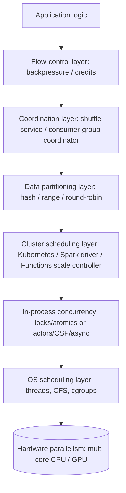
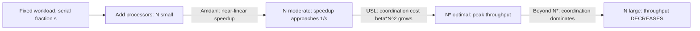
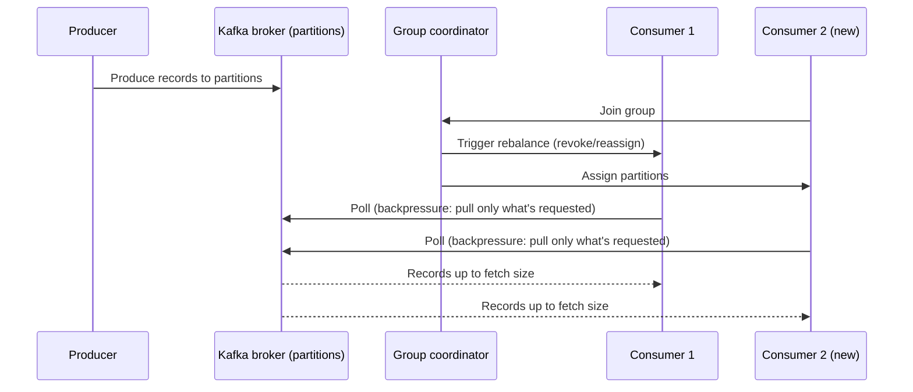

# Concurrency and Parallelism

> Part of the **Enterprise Data & AI Architecture Handbook** · Phase-00 — Foundations & Prerequisites · Chapter 06.
> Estimated study time: **60 min reading + ~4h labs**.
> **Prerequisite:** read [Operating Systems for Data Engineers](03_Operating_Systems.md) first.

---

## Executive Summary

Every Spark stage boundary, every Kafka consumer-group rebalance, every `async`/`await` call, every distributed lock in Cosmos DB, and every "why is my pod pegged at 100% CPU but throughput is flat" incident is, underneath, a concurrency or parallelism problem — and the two are not the same problem. [Operating Systems for Data Engineers](03_Operating_Systems.md#core-concepts) established that the kernel interleaves threads on a fixed number of cores via context switching and CFS scheduling; this chapter is about what happens *above* that layer: how applications and distributed systems structure work to run correctly and efficiently when multiple things happen at once — whether that means one core juggling many logically-simultaneous tasks (**concurrency**) or many cores/machines genuinely executing work at the same instant (**parallelism**).

This is the chapter where "just add more cores/executors" becomes "we're bound by lock contention on a shared counter, and Amdahl's Law says adding a ninth executor buys us 4% more throughput, not 12.5%" — a diagnosis with a number attached. We cover the concurrency/parallelism distinction and the two laws that quantify scaling limits (Amdahl's Law for fixed-workload speedup, the Universal Scalability Law for the point where adding capacity actively *hurts* throughput); locks, deadlocks, atomics, and lock-free structures as the mechanisms (and hazards) of shared-memory coordination; the Actor model and CSP (Communicating Sequential Processes) as message-passing alternatives that sidestep shared-memory hazards entirely; async I/O and event loops as the dominant concurrency model for I/O-bound services; and data parallelism, partitioning, shuffle, and backpressure as the mechanisms that make distributed data processing (Spark, Kafka, Flink) both scale and stay stable under load.

The bias remains **Azure-primary (~60%)** — Azure Durable Functions (orchestrator/actor patterns), Azure Service Bus (sessions, locks, dead-lettering), Azure Event Hubs partitioning, Azure Cosmos DB partitioning and the change feed, Azure Databricks/Spark task and shuffle parallelism, AKS/Kubernetes scheduling, and Orleans virtual actors — **~30% enterprise open source** (Apache Spark, Kafka, Flink, Akka, Go goroutines/channels, Python `asyncio`, Node.js's event loop, Ray, RocksDB's internal concurrency control) and **~10% AWS/GCP comparison-only**. By the end you will read a Spark DAG with `Exchange` (shuffle) nodes, a Kafka consumer-group rebalance log, or a "CPU is at 100% but throughput dropped" incident and know precisely whether the bottleneck is lock contention, coordination overhead, an unpartitioned hot key, or missing backpressure.

**Bottom line:** concurrency and parallelism are not "make it faster by using more threads/machines" — they are a discipline of correctness (avoiding races, deadlocks, and lost updates) layered under a discipline of quantified scaling (Amdahl/USL tell you the *ceiling* before you build past it). Architects who can name which serialization point, coordination cost, or unpartitioned hot spot is limiting a system design systems that scale to the point the business actually needs, and stop paying for capacity that Amdahl's Law already told them would not help.

---

## Learning Objectives

By the end of this chapter you will be able to:

1. **Distinguish concurrency from parallelism precisely** and identify which one a given system design problem actually requires.
2. **Apply Amdahl's Law and the Universal Scalability Law** to predict the speedup ceiling of a given workload and diagnose why adding more cores/executors/nodes stopped helping (or started hurting).
3. **Explain locks, critical sections, and the four Coffman conditions for deadlock**, and design lock-acquisition orderings that provably avoid deadlock.
4. **Explain atomics, memory ordering, and lock-free/wait-free data structures**, and know when they are worth the complexity over a plain lock.
5. **Contrast the Actor model and CSP** as message-passing concurrency models, and map each onto a concrete platform (Orleans/Akka for actors; Go channels for CSP).
6. **Explain async I/O and event loops** (Node.js, Python `asyncio`, .NET's `async`/`await`) and why they outperform thread-per-connection models for I/O-bound workloads.
7. **Reason about data parallelism, partitioning strategy, and shuffle cost** in Spark/Kafka/Flink, and choose a partitioning key that avoids data skew.
8. **Design backpressure and flow control** into a streaming pipeline so that a slow consumer degrades gracefully instead of causing unbounded memory growth or cascading failure.
9. **Translate these fundamentals into an Azure architecture** (Durable Functions orchestration, Service Bus sessions, Event Hubs partitioning, Databricks cluster sizing) and defend the design in a staff/principal-level review.

---

## Business Motivation

Concurrency and parallelism decisions show up directly as latency SLAs, infrastructure spend, and — when done incorrectly — data corruption incidents that are exceptionally hard to reproduce and debug:

- **Race conditions and lost updates cause silent, non-deterministic data corruption** — a double-charged payment or a dropped inventory decrement from an unsynchronized concurrent update is often discovered weeks later via a reconciliation mismatch, not an alert.
- **Amdahl's Law and the Universal Scalability Law are direct infrastructure-spend levers.** Scaling a Spark cluster or a microservice fleet past the point where a serialization bottleneck or coordination overhead dominates means paying for compute that mathematically cannot improve throughput — a quantifiable, avoidable cost.
- **Deadlocks and lock contention are availability incidents, not just performance ones.** A distributed lock held too long, or acquired in inconsistent order across services, can freeze a critical transaction path entirely — an outage, not a slowdown.
- **Data skew from a poorly chosen partition key silently degrades a "scaled" system.** A Spark job with 200 partitions but 90% of the data in one partition runs no faster than a single-threaded job for that stage — capacity was purchased that the workload cannot use.
- **Missing backpressure turns a temporary slowdown into a cascading outage.** A downstream consumer falling behind, without flow control, causes unbounded producer-side memory growth and eventually an OOM-killed pod that takes the whole pipeline down.

For an architect, concurrency/parallelism fluency converts "just scale it out" into "we're at 85% of theoretical Amdahl speedup at 12 executors, and the remaining serial fraction is a single unpartitioned aggregation stage — fixing that, not adding executors, is the actual lever." That reasoning is precise, quantifiable, and defensible in a cost or reliability review.

---

## History and Evolution

- **1965 — Gordon Moore** observes transistor density doubling roughly every two years (**Moore's Law**), setting expectations that single-core performance would keep rising — expectations that broke down around 2004-2005 as clock-speed scaling hit power/heat limits, forcing the industry toward multi-core parallelism instead.
- **1965 — Edsger Dijkstra** formalizes the **mutual exclusion problem** and semaphores, the foundational primitive for coordinating concurrent access to shared state.
- **1971 — E.G. Coffman et al.** formalize the **four necessary conditions for deadlock**, still the standard framework for deadlock analysis and prevention today.
- **1978 — C.A.R. Hoare** publishes **Communicating Sequential Processes (CSP)**, a formal model of concurrency based on independent processes synchronizing via message-passing channels rather than shared memory.
- **1973-1986 — Carl Hewitt's Actor model** (with later formalization by Agha) proposes actors — isolated units of state and behavior that communicate only via asynchronous messages — as a concurrency model that eliminates shared-memory races by construction. **Erlang** (Ericsson, 1986) becomes the first major production language built directly on actor-style, share-nothing concurrency for telecom-grade fault tolerance.
- **1967 — Gene Amdahl** publishes **Amdahl's Law**, quantifying the speedup ceiling imposed by a workload's serial fraction — still the single most important napkin-math tool for parallel scaling decisions.
- **1988 — John Gustafson** proposes **Gustafson's Law**, reframing scaling in terms of growing problem size with available parallelism rather than a fixed workload — the counterpoint to Amdahl's pessimism for embarrassingly parallel, data-scaling workloads.
- **1990s — Neil Gunther's Universal Scalability Law (USL)** extends Amdahl's Law with a second term for inter-node **coherency/coordination cost**, explaining the empirically observed phenomenon where throughput *decreases* past a certain concurrency level, not merely plateaus.
- **2003-2004 — the "multicore turn.**" CPU vendors shift from clock-speed scaling to core-count scaling as the primary performance lever, permanently changing software design defaults toward explicit concurrency.
- **2004 — Google's MapReduce paper** popularizes data-parallel, partition-and-shuffle batch processing as the template for distributed data processing at scale — directly inherited by Hadoop, then Spark.
- **2009 — Node.js** popularizes the single-threaded, non-blocking **event loop** model for I/O-bound concurrency at scale, built on Chrome's V8 engine and libuv.
- **2009 — Akka** (Scala/JVM) brings the Actor model to mainstream enterprise backend development, later joined by **Microsoft Orleans (2011, open-sourced 2015)**'s "virtual actor" model, which removes explicit actor lifecycle management from the programmer.
- **2009 — the Go programming language** builds CSP-style goroutines and channels directly into the language, making message-passing concurrency a first-class, low-ceremony primitive for backend services.
- **2012-2014 — Apache Spark's RDD/DAG model** generalizes MapReduce's partition-and-shuffle model with in-memory computation and a richer operator set, becoming the dominant enterprise big-data parallel-processing engine.
- **2013 — Reactive Streams / the Reactive Manifesto** formalizes **backpressure** as a first-class concern for asynchronous stream processing, adopted by Akka Streams, Project Reactor, RxJava, and later Flink's credit-based flow control.
- **2019-2026 — Rust's ownership model and `async`/`await`**, C#'s `async`/`await` maturing into the .NET default, and Python's `asyncio` all push compile-time or language-level safety and ergonomics around concurrency into mainstream enterprise languages, reducing (but not eliminating) the historical error-proneness of concurrent code.

---

## Why This Technology Exists

Concurrency and parallelism mechanisms exist because a fixed amount of hardware must serve a workload larger than any single sequential execution could handle in an acceptable time, and doing so correctly requires deliberate coordination:

- **Concurrency (interleaving) exists** because a single core must serve many logically-independent tasks (network requests, I/O waits) without wasting CPU cycles blocked waiting on slow devices — a direct continuation of the process/thread scheduling covered in [Operating Systems](03_Operating_Systems.md#core-concepts).
- **Parallelism (simultaneous execution) exists** because the multicore turn (2004-onward) made "more cores," not "faster cores," the primary hardware scaling lever — software must explicitly partition work to use that hardware.
- **Locks and atomics exist** because multiple threads/processes mutating shared state without coordination produce races, lost updates, and non-deterministic corruption — correctness requires an explicit mutual-exclusion or ordering guarantee.
- **The Actor model and CSP exist** because lock-based shared-memory coordination is notoriously error-prone (deadlocks, forgotten locks, lock-ordering bugs) at scale — message-passing between isolated units of state sidesteps the shared-memory hazard class entirely, at the cost of message-passing overhead and different reasoning discipline.
- **Async I/O and event loops exist** because thread-per-connection models exhaust memory and context-switching capacity long before they exhaust network or database capacity for I/O-bound workloads — a single thread multiplexing many in-flight I/O operations uses orders of magnitude less memory and scheduling overhead.
- **Data partitioning and shuffle exist** because a dataset larger than any single machine's memory or compute capacity must be divided across machines, and any computation requiring data currently on a *different* machine (a join, a `groupBy`) must physically move it — the shuffle is the unavoidable cost of that requirement.
- **Backpressure exists** because in any pipeline where producers and consumers run at different, load-dependent rates, an unbounded producer without a signal to slow down will eventually exhaust downstream memory or overwhelm a consumer — flow control makes the mismatch a bounded, visible condition instead of an uncontrolled failure.

Without these mechanisms, every multi-core, multi-machine, or I/O-bound system would either corrupt shared state, waste most of its hardware capacity, or fail catastrophically the first time a downstream component slowed down.

---

## Problems It Solves

- **Serving many logically-simultaneous tasks on limited hardware** — event loops and thread pools multiplexing thousands of in-flight I/O operations onto a handful of OS threads.
- **Using multi-core/multi-machine hardware for a single large computation** — data-parallel partitioning splitting a dataset across executors/nodes so real wall-clock speedup is achievable.
- **Coordinating safe access to shared mutable state** — locks, atomics, and lock-free structures preventing races and lost updates when concurrent access is unavoidable.
- **Building fault-isolated, race-free concurrent systems** — the Actor model's share-nothing isolation containing a single actor's failure or bug from corrupting unrelated state.
- **Predicting and quantifying the limits of horizontal/vertical scaling** — Amdahl's Law and the USL turning "will more capacity help?" into a testable, numeric prediction instead of a guess.
- **Preventing cascading failure from rate mismatches** — backpressure/flow control converting an unbounded, uncontrolled overload into a bounded, observable, and recoverable condition.

---

## Problems It Cannot Solve

- **It cannot make an inherently serial algorithm parallel.** Amdahl's Law is not a limitation of tooling — a workload with a genuinely sequential dependency chain (e.g., a strict linear state-machine transition) has a hard speedup ceiling no amount of engineering effort raises.
- **It cannot eliminate the CAP-theorem trade-off for distributed coordination.** Distributed locks, consensus, and coordinated state (developed fully in [Distributed Systems Primer](08_Distributed_Systems_Primer.md)) still face the same consistency/availability trade-off during a network partition that any distributed system faces.
- **It cannot substitute for correct partitioning.** No amount of parallel infrastructure fixes a workload partitioned on a low-cardinality or skewed key — the mechanism moves data correctly; choosing *which* key to partition on remains an application-level design decision.
- **It cannot make message-passing free of the reasoning it removes.** The Actor model and CSP trade shared-memory race hazards for message-ordering, mailbox-overflow, and actor-lifecycle reasoning — different bugs, not zero bugs.
- **It cannot guarantee liveness just because deadlock is avoided.** A system can be deadlock-free yet still suffer **livelock** (threads perpetually yielding to each other without progress) or **starvation** (a thread perpetually losing a scheduling/priority race) — distinct failure modes requiring their own analysis.
- **It cannot make backpressure free of a decision about what to do when it triggers.** Flow control tells you a consumer is falling behind; it does not decide for you whether to buffer, drop, block the producer, or shed load — that remains a business-driven design choice.

---

## Core Concepts

### 6.1 Concurrency vs. parallelism

**Concurrency** is a property of program *structure*: multiple tasks are logically in progress over the same time period, with their execution interleaved — possibly on a single core, via context switching (established in [Operating Systems](03_Operating_Systems.md#81-processes-threads-and-context-switching)). **Parallelism** is a property of program *execution*: multiple tasks genuinely run at the same physical instant, requiring multiple cores/machines. A single-core web server handling 10,000 concurrent connections via an event loop is concurrent but not parallel; a single-threaded matrix multiply run on one core is neither. A Spark job with 200 executor cores computing 200 partitions simultaneously is both concurrent (many tasks logically in flight) and parallel (many genuinely executing at once). The distinction matters because the *fix* for a concurrency problem (better interleaving, fewer blocking calls) is different from the fix for a parallelism problem (more cores, better partitioning) — misdiagnosing one as the other wastes engineering effort.

### 6.2 Amdahl's Law

**Amdahl's Law** quantifies the maximum speedup of a *fixed-size* workload from adding parallel processing units, given a serial (non-parallelizable) fraction $s$ of the total work:

$$
\text{Speedup}(N) = \frac{1}{s + \frac{1-s}{N}}
$$

where $N$ is the number of parallel processors. As $N \to \infty$, speedup approaches a hard ceiling of $\frac{1}{s}$ — a workload that is 10% serial ($s = 0.1$) can *never* exceed 10x speedup, no matter how many cores are added. This is why a Spark stage with a single unpartitioned final aggregation (a serial bottleneck) shows diminishing, then negligible, returns from adding executors — the serial fraction, not the parallel fraction, dominates at high $N$. Amdahl's Law assumes a **fixed problem size**; it is the correct tool for "will more hardware make this specific job finish faster," not for "can we process more total data with more hardware" (see Gustafson's Law, §6.2 note below).

**Gustafson's Law**, by contrast, holds parallel work-per-processor fixed and lets the *total problem size* grow with $N$ — reframing many "embarrassingly parallel" data-scale workloads (e.g., scoring more records with more executors) as scaling favorably even though Amdahl's Law, applied to a *fixed* dataset, would predict a ceiling.

### 6.3 The Universal Scalability Law (USL)

Amdahl's Law explains a *plateau*; it does not explain the commonly observed real-world phenomenon where throughput actively **decreases** past some concurrency level. Neil Gunther's **Universal Scalability Law** adds a second term, $\beta$ (coherency/coordination cost — the cost of keeping concurrent workers' state mutually consistent, e.g., cache coherency traffic, distributed lock contention, or consensus round-trips), to Amdahl's serial fraction $\alpha$:

$$
\text{Speedup}(N) = \frac{N}{1 + \alpha(N-1) + \beta N(N-1)}
$$

When $\beta = 0$, USL reduces exactly to Amdahl's Law. When $\beta > 0$, the coordination cost grows *quadratically* with concurrency, producing a peak throughput at some optimal $N^*$, beyond which adding more workers actively reduces throughput — the mathematical explanation for "we added more database connections/threads and throughput got *worse*," a symptom of lock contention or coordination overhead outpacing the parallel work gained.

### 6.4 Locks, mutexes, and critical sections

A **critical section** is a region of code accessing shared mutable state that must not be executed by more than one thread concurrently. A **lock** (mutex) enforces this by blocking any thread attempting to enter the critical section while another holds it. Lock granularity is a direct performance/correctness trade-off: a **coarse-grained lock** (one lock for an entire data structure) is simple and safe but serializes all access, becoming the very serial fraction Amdahl's Law penalizes; **fine-grained locking** (per-row, per-partition) increases achievable parallelism but multiplies the surface area for lock-ordering bugs and deadlock. **Reader-writer locks** allow unlimited concurrent readers but exclusive writers — a common fit for read-heavy shared state (e.g., a cached configuration object).

### 6.5 Deadlocks and the Coffman conditions

A **deadlock** is a cycle of threads each holding a resource the next thread in the cycle needs, with none able to proceed. **Coffman et al. (1971)** identify four conditions **all** of which must hold for deadlock to occur: (1) **mutual exclusion** — resources cannot be shared; (2) **hold and wait** — a thread holds one resource while waiting for another; (3) **no preemption** — a resource cannot be forcibly taken from a thread; (4) **circular wait** — a cycle of threads each waiting on the next. Breaking *any single condition* prevents deadlock — in practice, the most common and lowest-cost fix is eliminating **circular wait** by enforcing a **global lock-acquisition ordering** (e.g., "always acquire locks in ascending account-ID order" for a funds-transfer operation), a technique directly applicable to distributed locks (Azure Service Bus sessions, Cosmos DB optimistic concurrency) as much as in-process mutexes.

### 6.6 Atomics and memory ordering

An **atomic operation** (compare-and-swap/CAS, fetch-and-add) executes indivisibly with respect to other threads — no other thread can observe a partially-completed state. Modern CPUs provide these as hardware instructions, letting software implement counters, flags, and simple state transitions without a full lock (avoiding both its overhead and its deadlock risk). **Memory ordering** governs what guarantees other threads have about the *visibility and ordering* of a thread's writes: **sequential consistency** (the strongest, most intuitive, and most expensive guarantee — all threads see all operations in one global order) versus **relaxed/acquire-release ordering** (weaker, cheaper guarantees requiring explicit memory barriers/fences at synchronization points) used by lock-free algorithms and high-performance runtimes (the JVM Memory Model, C++'s `std::atomic` ordering modes, .NET's `Volatile`/`Interlocked`). Getting memory ordering wrong produces bugs that are non-deterministic, hardware-dependent, and among the hardest classes of bugs to reproduce — a strong argument for defaulting to well-tested concurrent primitives over hand-rolled lock-free code.

### 6.7 Lock-free and wait-free data structures

A **lock-free** data structure guarantees that *some* thread makes progress in a bounded number of steps, even if others are paused or starved (no thread can block the whole structure indefinitely) — typically implemented via CAS retry loops. A **wait-free** data structure gives the stronger guarantee that *every* thread makes progress in a bounded number of steps regardless of other threads' behavior — materially harder to design and rarer in practice. Lock-free structures (lock-free queues, RocksDB's skip-list memtable, many high-performance concurrent hash maps) trade implementation complexity and subtle correctness risk for freedom from lock-related pauses (priority inversion, deadlock) under high contention — a worthwhile trade only in genuinely hot-path, high-contention code, not a default replacement for ordinary locking.

### 6.8 The Actor model

An **actor** is an isolated unit of state and behavior that communicates *exclusively* via asynchronous messages delivered to its mailbox, processed one at a time — no actor ever directly reads or writes another actor's memory, eliminating shared-memory races by construction. Actors can create other actors, send messages, and decide how to handle the next message — a uniform, composable concurrency primitive. **Microsoft Orleans**'s "virtual actor" model additionally removes explicit lifecycle management: actors ("grains") are activated on demand and deactivated transparently, letting application code address a grain by logical identity without managing where or whether it currently exists in memory. **Akka** (JVM/Scala) and **Erlang/Elixir's BEAM** processes are the other major production actor implementations, the latter underpinning famously fault-tolerant, high-uptime telecom and messaging systems via "let it crash" supervision trees.

### 6.9 CSP and channels

**Communicating Sequential Processes (CSP)**, Hoare's formalization, models concurrency as independent, sequential processes that synchronize and exchange data exclusively through explicit **channels** — conceptually similar to actors' message-passing but with the channel, not the recipient's identity, as the primary abstraction, and (in its classic form) **synchronous/rendezvous** semantics (a send blocks until a matching receive occurs). **Go's goroutines and channels** are the most widely adopted production implementation: goroutines are cheap (kilobytes of stack, not megabytes like OS threads), and idiomatic Go code favors "share memory by communicating" (pass data via a channel) over "communicate by sharing memory" (a mutex-protected shared variable) — a direct, language-level nudge away from lock-based hazards for typical backend service code.

### 6.10 Async I/O and event loops

An **event loop** is a single (or small, fixed-count) thread that repeatedly checks a queue of completed I/O events (via OS primitives like `epoll`/`io_uring` on Linux, IOCP on Windows) and dispatches the corresponding callback/continuation — never blocking on I/O itself. This lets one thread multiplex thousands of concurrent, mostly-idle-waiting-on-I/O connections with a fraction of the memory (no per-connection thread stack) and none of the context-switching overhead a thread-per-connection model would incur. **Node.js** popularized this model for JavaScript backends; **Python's `asyncio`** and **.NET's `async`/`await`** (built on the Task Parallel Library) bring the same model, with language-level syntax sugar, to their respective ecosystems. The critical operational hazard: a single **CPU-bound, synchronous call on the event-loop thread blocks every other concurrent request** — the single most common Node.js/`asyncio` production incident, requiring CPU-bound work to be offloaded to a worker thread/process pool instead.

### 6.11 Data parallelism, partitioning strategies

**Data parallelism** applies the *same* computation independently to different partitions ("shards") of a dataset, in parallel, across cores/executors — the dominant model for Spark, Flink, and Kafka consumer groups. The **partitioning strategy** — how records are assigned to partitions — is the single highest-leverage design decision: **hash partitioning** (partition = `hash(key) % N`) distributes evenly for high-cardinality keys but sends all records for a single key to one partition (a hazard for low-cardinality or skewed keys — "hot partition"/"data skew"); **range partitioning** preserves sort order across partitions (useful for range queries and sort-merge joins) but is vulnerable to skew if the key's value distribution is uneven; **round-robin partitioning** guarantees even distribution but destroys any meaningful data locality for joins/aggregations grouped by key. Kafka topic partition count and Spark `shuffle.partitions` are both direct, tunable instances of this same underlying decision.

### 6.12 Shuffle

A **shuffle** is the physical redistribution of data across partitions/nodes required whenever a computation (`groupBy`, `join`, `repartition`) needs records that share a key but currently reside on different partitions/machines — the single most expensive operation class in distributed data processing, involving disk spill, network transfer, and (in Spark) a full stage boundary. Spark's shuffle writes partitioned, sorted intermediate files to local disk (or, in cloud-native configurations, shuffle-service-backed storage) which downstream tasks then fetch over the network — a cost directly proportional to data volume *and* the degree of key skew (a skewed key forces one reducer to process disproportionately more shuffled data than its peers, becoming the straggler that determines the whole stage's completion time). Minimizing shuffle volume (broadcast joins for small tables, pre-aggregation before a wide shuffle, partitioning upstream data to match downstream join keys) is consistently the highest-leverage Spark performance lever.

### 6.13 Backpressure and flow control

**Backpressure** is a signal, propagated from a slower downstream consumer back to an upstream producer, that the producer must slow down (or the system must otherwise shed/buffer load) rather than overwhelm the consumer or exhaust intermediate buffers. **Reactive Streams** (the JVM specification behind Akka Streams, Project Reactor, RxJava) formalizes this as an explicit `request(n)` pull-based protocol: a subscriber requests a bounded number of items, and a publisher must never emit more than requested — making the flow-control contract part of the API rather than an afterthought. **Kafka** provides backpressure implicitly via consumer-driven pull (a consumer only receives as much as it polls for) and explicit consumer lag as an observable signal; **Flink** uses **credit-based flow control** between task managers, where a receiving task grants a bounded "credit" of buffer slots to a sender, throttling upstream production precisely when downstream capacity is exhausted. Without backpressure, a producer faced with a slow consumer either buffers unboundedly (eventual OOM) or drops data silently — neither an acceptable default for most enterprise pipelines.

---

## Internal Working

**How a lock actually blocks a thread.** A thread attempting to acquire an already-held mutex is typically first "spun" briefly (a busy-wait, cheap if the lock is expected to be released quickly) and then, if still unavailable, **parked** by the OS scheduler — removed from the run queue and placed on a wait queue associated with the lock, consuming no CPU while blocked. When the holding thread releases the lock, the kernel wakes exactly one (or all, depending on implementation) waiting thread, which re-enters the run queue for scheduling — the same context-switch mechanism from [Operating Systems](03_Operating_Systems.md#81-processes-threads-and-context-switching), triggered here by lock contention rather than a scheduling quantum expiring.

**How a Spark shuffle executes end-to-end.** During a wide-dependency stage (e.g., `groupByKey`), each map task partitions its output records by the target partitioning function (hash of the grouping key, by default) and writes sorted, partitioned shuffle files to local disk. The Spark driver's **shuffle map output tracker** records which executor holds which partition's shuffle data. Reduce-side tasks then each fetch, over the network, only the shuffle blocks belonging to their assigned partition from every map task's output — an all-to-all network transfer pattern whose volume is exactly the shuffled data size, and whose *tail latency* is determined by the single slowest (most skewed) partition, not the average.

**How Orleans activates a virtual actor (grain) on demand.** When a message is sent to a grain identified only by its logical key (e.g., `deviceId`), the Orleans runtime checks whether an in-memory activation already exists on any silo (server) in the cluster; if not, it transparently activates one on an available silo, delivers the message, and (after a period of inactivity) deactivates it — application code never explicitly manages "is this actor currently running, and where," in contrast to Akka's more explicit actor-reference lifecycle model.

**How Kafka consumer-group rebalancing coordinates parallel consumption.** Each partition of a topic is assigned to exactly one consumer within a consumer group at a time; a **group coordinator** broker tracks group membership and triggers a **rebalance** (reassigning partitions across the live consumer set) whenever a consumer joins, leaves, or is deemed dead (missed heartbeat). During a rebalance (in eager rebalancing protocols), all consumers in the group briefly stop processing while partition ownership is reassigned — a real, measurable pause directly proportional to consumer-group churn, mitigated in modern Kafka by **cooperative sticky rebalancing**, which reassigns only the specific partitions that must move rather than revoking all partitions from all consumers.

---

## Architecture

The relevant concurrency/parallelism architecture, layered from hardware to distributed system, for an Azure-hosted data/AI platform:

1. **Hardware parallelism layer** — multi-core CPUs, SIMD/vector units, and (for AI workloads) GPU/TPU massive data-parallel execution — the physical substrate all higher layers schedule work onto.
2. **OS scheduling layer** — threads, the CFS scheduler, and cgroup CPU quotas (established in [Operating Systems](03_Operating_Systems.md#82-cpu-scheduling)) determining which runnable thread executes on which core at any instant.
3. **In-process concurrency layer** — locks/atomics/lock-free structures for shared-memory coordination, or actors/CSP/async-await for message-passing/event-driven coordination within a single process.
4. **Cluster scheduling layer** — Kubernetes/AKS pod scheduling, Spark's driver-executor task assignment, or Azure Functions' scale controller deciding how many parallel instances of a workload run and where.
5. **Data partitioning layer** — the hash/range/round-robin partitioning strategy determining how a dataset is divided across parallel workers (Spark partitions, Kafka topic partitions, Cosmos DB physical partitions).
6. **Coordination/shuffle layer** — the shuffle service (Spark), consumer-group coordinator (Kafka), or distributed lock/session mechanism (Service Bus sessions, Cosmos DB optimistic concurrency) synchronizing otherwise-independent parallel workers.
7. **Flow-control layer** — backpressure signals (Reactive Streams `request(n)`, Kafka consumer lag, Flink credit-based flow control) governing the rate mismatch between producers and consumers across the whole pipeline.

An incident is almost always localized by asking **at which of these seven layers** the symptom first appears — CPU throttling (layer 2), a lock-contention hot path (layer 3), an under-provisioned scale rule (layer 4), a skewed partition key (layer 5), a rebalance storm (layer 6), or unbounded producer memory growth (layer 7).

---

## Components

| Component | Role | Concrete instantiation |
|---|---|---|
| **Thread / task** | Unit of schedulable execution | OS thread, Spark task, goroutine |
| **Lock / mutex** | Shared-memory mutual exclusion | `synchronized`, `pthread_mutex`, `SemaphoreSlim` |
| **Atomic primitive** | Indivisible read-modify-write | CAS, `Interlocked.Increment`, `AtomicInteger` |
| **Actor / grain** | Isolated state + mailbox | Orleans grain, Akka actor, Erlang process |
| **Channel** | Synchronous/buffered message conduit | Go channel, `System.Threading.Channels` |
| **Event loop** | Single-thread I/O multiplexer | Node.js libuv loop, Python `asyncio` loop |
| **Partitioner** | Assigns records to parallel workers | Spark `Partitioner`, Kafka partitioner |
| **Shuffle service** | Redistributes data across partitions | Spark shuffle service, Flink network stack |
| **Coordinator** | Tracks group membership / assignment | Kafka group coordinator, Kubernetes scheduler |
| **Flow-control signal** | Communicates consumer capacity upstream | Reactive Streams `request(n)`, Flink credits, Kafka lag |

---

## Metadata

Concurrency/parallelism "metadata" that drives correctness and scheduling decisions:

- **Lock state metadata** — which thread currently holds a lock, the wait queue, and (for debugging) lock-acquisition order history used in deadlock post-mortems.
- **Partition assignment metadata** — Kafka's consumer-group partition assignment table, Spark's shuffle map output locations, Cosmos DB's partition key ranges — the authoritative record of "which worker owns which slice of data right now."
- **Actor placement metadata** — Orleans' directory service mapping a grain's logical identity to its currently-activated silo, transparently updated as grains activate/deactivate/migrate.
- **Backpressure/credit metadata** — Flink's per-channel credit counters, Reactive Streams' outstanding `request(n)` counts — the live state of how much more a producer is currently permitted to send.
- **Scheduler metadata** — Kubernetes pod scheduling decisions, cgroup CPU quota/period configuration, Spark's task-to-executor assignment — determining physical placement of parallel work.

Good concurrency observability starts with this metadata: lock-wait time percentiles, partition-assignment skew, and backpressure/credit exhaustion are all metadata-observable before they become user-visible latency or availability incidents.

---

## Storage

- **Concurrency-safe storage engines are the norm, not a given.** Databases provide MVCC (multi-version concurrency control) or lock-based isolation precisely so application code does not need to hand-roll synchronization for concurrent reads/writes to the same rows — a direct link to the WAL/B-tree/LSM-tree mechanisms in [Storage Systems Fundamentals](05_Storage_Systems_Fundamentals.md#59-b-trees-vs-lsm-trees-and-the-rum-conjecture).
- **Shuffle spill-to-disk is a storage-layer concern with a concurrency trigger.** Spark spills shuffle data to local disk when it exceeds available memory — a storage I/O cost directly caused by the degree of parallel task concurrency and partition sizing chosen upstream.
- **Optimistic concurrency control (OCC) at the storage layer avoids locking entirely for low-contention workloads** — Cosmos DB's ETag-based optimistic concurrency and Delta Lake's optimistic transaction protocol both retry on conflict rather than acquiring a lock, trading occasional retry cost for eliminating lock-contention hazards under typically-low write concurrency.

---

## Compute

- **Parallel speedup is fundamentally a compute-allocation decision** — Amdahl's Law and the USL (§6.2-§6.3) directly determine the point past which additional vCPUs/executors stop paying for themselves.
- **CPU-bound work on an event-loop thread is a compute-scheduling anti-pattern** (§6.10) — it starves every other concurrent request on that thread, a distinctly different failure mode from simply "not enough CPU."
- **Container CPU quota throttling (cgroups, established in [Operating Systems](03_Operating_Systems.md#82-cpu-scheduling)) directly caps achievable parallelism** regardless of how many threads/goroutines an application spawns — a common, invisible root cause of "why isn't adding threads helping" in AKS.

---

## Networking

- **Shuffle and actor message-passing are frequently network-bound, not CPU-bound**, at scale — a Spark shuffle's all-to-all fetch pattern and cross-silo Orleans grain calls both pay real network round-trip and bandwidth cost, subject to the same latency/throughput fundamentals in [Networking Fundamentals](04_Networking_Fundamentals.md#core-concepts).
- **Consumer-group rebalancing and distributed-lock renewal are latency-sensitive control-plane traffic** — a network partition or elevated latency between Kafka consumers and the group coordinator (or between Service Bus clients and the broker) can itself trigger spurious rebalances/lock loss, a cross-cutting failure mode worth explicitly monitoring.
- **Co-locating parallel compute with its partitioned data** (Spark executors near their data locality preference, Orleans silos near their grain's likely callers) minimizes the cross-network shuffle/message cost that dominates at scale — a direct application of the co-location principle from [Networking Fundamentals](04_Networking_Fundamentals.md#compute).

---

## Security

- **Race conditions are a security vulnerability class, not only a correctness one** — Time-of-check-to-time-of-use (TOCTOU) races (checking a permission, then acting on stale state before the action executes) are a recognized OWASP-adjacent vulnerability pattern in concurrent authorization code.
- **Shared mutable state accessed without synchronization can leak data across logical boundaries** — a multi-tenant service reusing a pooled buffer or connection without properly resetting/isolating per-request state risks cross-tenant data exposure under concurrent load.
- **Distributed lock/session tokens (Service Bus session locks, Cosmos DB ETags) must be scoped and time-bounded** — an indefinitely-held lock is both an availability risk (deadlock-adjacent) and, if leaked, a potential denial-of-service vector against other legitimate holders.
- **Actor/message-passing systems must still authenticate and authorize messages** — isolation between actors prevents accidental shared-state corruption but says nothing about whether a message sender is authorized to invoke a given actor method; this remains an explicit access-control responsibility.

---

## Performance

Concurrency/parallelism-driven performance levers, in priority order:

1. **Quantify the serial fraction and coordination cost before scaling out** — apply Amdahl's Law and the USL (§6.2-§6.3) to a measured baseline before purchasing additional executors/nodes that mathematically cannot help.
2. **Choose a partitioning key that avoids skew** — the single highest-leverage lever for Spark/Kafka throughput; a high-cardinality, evenly-distributed key prevents the "one slow partition determines the whole stage" straggler problem.
3. **Minimize shuffle volume** — broadcast small tables instead of shuffling them, pre-aggregate before a wide shuffle, and align upstream partitioning with downstream join/groupBy keys.
4. **Prefer message-passing (actors/CSP) or lock-free structures only where lock contention is measured, not assumed** — the added complexity of lock-free code or actor-lifecycle reasoning is justified by profiling data, not defaulted to.
5. **Move CPU-bound work off event-loop threads** — dedicated worker threads/processes for CPU-bound work keep the event loop responsive for I/O-bound concurrency.
6. **Right-size backpressure buffers** — buffers sized too small cause unnecessary throttling; sized too large delay the backpressure signal until memory pressure is already severe.

**Worked example.** A Spark ETL job processing customer transactions plateaued at ~15 minutes regardless of executor count increases from 20 to 60. Investigation via the Spark UI showed one reduce task in the final `groupBy` stage taking 14 of the 15 minutes while all others finished in under a minute — a single retailer ID responsible for 40% of all transactions was causing severe partition skew. Salting the skewed key (appending a random suffix to spread the hot key across multiple partitions, then re-aggregating) reduced the job to under 3 minutes at the *original* 20-executor count — a direct instance of the USL/Amdahl lesson: the bottleneck was a serialization point (one straggler partition), not insufficient parallel capacity.

---

## Scalability

- **Amdahl's Law sets the ceiling; the USL explains the eventual decline.** Any capacity-planning exercise should fit measured throughput at increasing concurrency levels against both curves to find the actual optimal operating point, not assume "more is always better."
- **Partition count should scale with data volume, not be fixed by convention.** A fixed `spark.sql.shuffle.partitions = 200` default becomes either wastefully fine-grained (many tiny tasks, high scheduling overhead) or coarse and skew-prone as data volume grows by orders of magnitude — it should be reviewed against actual data size.
- **Actor systems (Orleans, Akka Cluster) scale by adding silos/nodes and letting the runtime rebalance grain/actor placement** — a materially different scaling model from thread-pool tuning, requiring monitoring of placement/rebalancing behavior rather than just per-node CPU.
- **Backpressure-aware pipelines degrade gracefully under load spikes**; pipelines without it degrade catastrophically (OOM, cascading restarts) — a scalability property that only manifests during the load spike a naive load test may not simulate realistically.

---

## Fault Tolerance

- **The Actor model's isolation contains failure to a single actor** — a crashed actor (Erlang/Elixir's "let it crash" philosophy, supervised restart) does not corrupt another actor's state, a materially stronger fault-isolation property than a shared-memory thread crashing mid-critical-section.
- **Deadlock is an availability failure mode requiring active prevention**, not passive tolerance — lock-ordering discipline (§6.5) and lock-acquisition timeouts (fail and retry rather than wait indefinitely) are the standard mitigations.
- **Consumer-group/partition-assignment coordinators are a single coordination point whose failure must be tolerated** — Kafka's group coordinator failover and Kubernetes' scheduler high-availability design both matter directly for parallel-processing pipeline availability.
- **Backpressure is itself a fault-tolerance mechanism** — by making a rate mismatch an observable, bounded condition (buffered/throttled) rather than an unbounded one (OOM), it converts a likely cascading failure into a contained, recoverable degradation.

---

## Cost Optimization (FinOps)

- **Amdahl's Law and the USL directly bound wasteful over-provisioning** — validating the actual serial fraction and coordination cost before scaling out prevents paying for executors/nodes that provably cannot improve throughput.
- **Fixing data skew is frequently cheaper than adding capacity** — the worked example in §Performance achieved a 5x wall-clock improvement with *zero* additional executors, purely from a partitioning-key fix — a materially better FinOps outcome than scaling compute to compensate for skew.
- **Event-loop/async concurrency reduces per-connection memory and thread overhead** compared to thread-per-connection models, directly lowering the compute SKU required to serve a given concurrent-connection count.
- **Right-sized backpressure buffers avoid both wasted memory** (over-sized buffers) **and unnecessary compute scaling to compensate for avoidable throttling** (under-sized buffers causing premature, excessive backpressure).
- **Serverless (Azure Functions) concurrency/scale-out settings should be tuned to actual measured throughput needs**, not left at conservative defaults that either under-scale (SLA risk) or over-scale (direct cost waste) relative to real traffic patterns.

**Worked FinOps example — skew fix vs. brute-force scale-out (illustrative rates; verify current figures in the Azure Pricing Calculator).** Take the retailer-ID skew job from the Performance worked example: 60 executors (`Standard_E8ds_v5`, ≈$0.55/VM-hour + ≈$0.40/DBU-hour ≈ $0.95/executor-hour, illustrative) running 15 minutes costs ≈ 60 × $0.95 × 0.25h ≈ **$14.25 per run**. After salting the skewed key, the *same job* completes in under 3 minutes at the *original* 20-executor count: 20 × $0.95 × 0.05h ≈ **$0.95 per run** — a >90% cost reduction with zero additional capacity purchased. At 100 runs/day, that is roughly $1,425/day → $95/day, or **≈$40,000/month saved** purely from fixing partition skew instead of scaling out to compensate for it. This is the direct, quantifiable form of the Amdahl/USL lesson: capacity purchased past a serialization bottleneck is capacity Amdahl's Law already predicted would not help.

---

## Monitoring

Monitor the concurrency/parallelism signals that predict incidents and cost overruns before they page you:

- **Lock-wait time and contention percentiles** per critical section/shared resource — rising lock-wait time predicts an approaching throughput plateau or USL-style throughput decline.
- **Partition skew metrics** — max/min or p99/median task duration ratio within a stage (Spark), or per-partition lag variance (Kafka) — the direct signal for a skewed partitioning key.
- **Consumer-group rebalance frequency and duration** (Kafka) — frequent rebalances indicate consumer instability (crash-looping pods, aggressive autoscaling) directly degrading throughput via repeated coordination pauses.
- **Backpressure/credit exhaustion events** — Flink's backpressure metrics, Reactive Streams' pending-request depletion — a leading indicator of an approaching downstream bottleneck.
- **Actor mailbox depth / message queue length** — a growing mailbox backlog on a specific actor/grain identifies a hot, potentially under-partitioned logical entity.

In Azure, surface these via **Azure Monitor** (Databricks Spark UI metrics exported via diagnostic settings, Event Hubs/Service Bus consumer lag and throttling metrics, Application Insights dependency/duration tracking for lock-wait and async-await latency) and **Log Analytics** queries correlating rebalance/throttling events with throughput drops.

---

## Observability

- **Correlate stage/task duration skew with the actual partitioning key**, not just aggregate job duration — a Spark job's total duration hides the single-straggler-task root cause unless the per-task distribution is examined.
- **Instrument lock-acquisition wait time explicitly** in hot-path code, not just end-to-end request latency — distinguishing "waiting on a lock" from "doing real work" is essential to diagnosing a USL-style throughput decline.
- **Trace actor/message-passing call chains** (Orleans' built-in dashboard, Akka's tracing integrations) to distinguish genuine processing time from mailbox queueing delay.
- **Structured incident timelines should classify**: serial-bottleneck/Amdahl-limited, coordination-overhead/USL-limited, skew-related, deadlock/lock-contention-related, or backpressure/flow-control-related — that classification determines the fix and the owning team.

---

## Operational Response Playbook

The highest-frequency concurrency/parallelism incident on an Azure data platform is data skew masquerading as "not enough capacity." Expressed as **signal → detection query → remediation**:

### Playbook 1: Spark stage straggler / data skew

| Step | Action |
|---|---|
| **Signal** | A job's wall-clock time plateaus or worsens despite adding executors; the Spark UI shows one or a few tasks in a stage running dramatically longer than the median task in the same stage. |
| **Detection query (Spark UI)** | Stages tab → sort tasks by duration descending; check the **task duration distribution** (max vs. median), not just total stage time. A max/median ratio above ~3-5x is a strong skew signal. |
| **Detection query (KQL, if Spark metrics are exported to Log Analytics)** | `SparkListenerTaskEnd_CL \| summarize MaxDuration = max(Duration_d), MedianDuration = percentile(Duration_d, 50) by StageId_d \| where MaxDuration > 3 * MedianDuration` |
| **Immediate remediation** | Identify the skewed key (Spark UI → task input size per partition, or `df.groupBy(key).count().orderBy(desc("count"))` on a sample); salt the key (append a random suffix, aggregate in two phases) or apply Spark's built-in adaptive query execution (AQE) skew-join handling. |
| **Root-cause check** | Confirm the partitioning key's cardinality and distribution against the join/groupBy pattern — a low-cardinality or naturally hot business key (retailer ID, country code, status flag) is the near-universal root cause. |
| **Follow-up** | Do **not** close the incident by adding executors; re-run at the *original* executor count after the fix and confirm the wall-clock improvement, per the worked example above. |

### Playbook 2: Consumer-group rebalance storm (Kafka)

| Step | Action |
|---|---|
| **Signal** | Consumer lag spikes and throughput drops in short, repeated bursts; consumers appear to "pause" periodically. |
| **Detection query (KQL)** | Correlate `ConsumerGroupRebalance` events (Event Hubs for Kafka diagnostic logs, or Kafka's own `__consumer_offsets`/JMX rebalance metrics exported to Azure Monitor) against lag/throughput dips in the same window. |
| **Immediate remediation** | Check for crash-looping or aggressively autoscaling consumer pods causing repeated join/leave events; stabilize pod lifecycle (readiness gates, longer session timeout) before tuning partition count. |
| **Root-cause check** | Confirm the rebalance protocol in use — eager rebalancing pauses the whole group on every membership change; cooperative sticky rebalancing reassigns only the moved partitions. |
| **Follow-up** | Move to cooperative sticky rebalancing where supported, and alert on rebalance frequency directly, not just on lag. |

---

## Governance

- **Mandate lock-ordering conventions and code-review checks for any new shared-mutable-state code** — a documented, enforced lock-acquisition ordering (§6.5) as a reviewed platform standard, not a per-team judgment call.
- **Require partition-key design review for new Kafka topics / Spark pipelines / Cosmos DB containers** — skew risk assessed at design time, not discovered in production.
- **Standardize on a small set of approved concurrency primitives per language/runtime** (e.g., .NET's `async`/`await` + `Channel<T>`, not hand-rolled thread pools) to reduce the surface area of subtle concurrency bugs across teams.
- **Track and periodically review actor/grain and partition count growth** against cluster capacity as part of platform capacity governance.
- **Document and review backpressure/flow-control policy per pipeline** (buffer, block, or shed load under overload) as an explicit, approved design decision, not an implicit default.

---

## Trade-offs

| Decision | Option A | Option B | Trade-off |
|---|---|---|---|
| Coordination model | Shared memory + locks | Message-passing (actors/CSP) | Familiar, but deadlock/race risk vs. race-free by construction, but message-ordering/mailbox reasoning |
| Lock granularity | Coarse-grained | Fine-grained | Simple, safe, low parallelism vs. complex, higher parallelism, more deadlock surface |
| Synchronization primitive | Lock (mutex) | Lock-free (CAS-based) | Simple, correctness-proven vs. complex, avoids lock pauses under contention |
| Partitioning strategy | Hash | Range | Even distribution, no order vs. preserves order, skew-prone |
| Concurrency model (I/O-bound) | Thread-per-connection | Event loop / async | Simple mental model, high memory/context-switch cost vs. efficient, requires non-blocking discipline |
| Backpressure response | Buffer | Block producer / shed load | Absorbs bursts, risks unbounded memory vs. bounded memory, risks producer stall or data loss |

---

## Decision Matrix

**Choosing a concurrency model for a new service:**

| Requirement | Thread-per-request | Event loop / async-await | Actor model |
|---|---|---|---|
| High connection count, I/O-bound (APIs, gateways) | ⚠️ (memory/context-switch cost) | ✅✅ | ⚠️ (overkill for simple request/response) |
| Complex, stateful, per-entity concurrent logic (IoT device twins, game sessions) | ⚠️ | ⚠️ (state management is manual) | ✅✅ |
| CPU-bound batch computation | ❌ | ❌ (blocks the event loop) | ⚠️ (not the natural fit) |

**Choosing a Spark/Kafka partitioning strategy:**

| Requirement | Hash partitioning | Range partitioning | Round-robin |
|---|---|---|---|
| High-cardinality join/groupBy key, even distribution needed | ✅✅ | ⚠️ (skew-prone) | ❌ (destroys locality) |
| Range queries / sorted output needed | ❌ | ✅✅ | ❌ |
| Low-cardinality or unknown key, pure load-spreading only | ⚠️ | ❌ | ✅✅ |

---

## Design Patterns

- **Actor-per-entity** — one actor/grain per logical entity (device, user session, order) for naturally isolated, race-free per-entity concurrency (Orleans grains, Akka Cluster Sharding).
- **Fork-join / scatter-gather** — split a computation into independent parallel subtasks, then merge results, the structural basis of Spark stages and .NET's `Parallel.ForEach`/`Task.WhenAll`.
- **Producer-consumer with bounded queue** — a fixed-capacity queue between producer and consumer as the simplest, most explicit backpressure mechanism.
- **Optimistic concurrency control (OCC)** — retry-on-conflict instead of locking, favoring low-contention workloads (Cosmos DB ETags, Delta Lake's optimistic transaction protocol).
- **Sharding/partitioning by a high-cardinality, business-neutral key** (e.g., a hashed surrogate key rather than a naturally skewed business key) to avoid hot partitions by design.
- **Circuit breaker combined with backpressure** — shedding load explicitly once a downstream dependency's flow-control signal indicates sustained overload, rather than continuing to queue indefinitely.

---

## Anti-patterns

- **A single global lock protecting an entire large data structure** on a hot path — the coarse-grained-locking anti-pattern that directly becomes the serial fraction Amdahl's Law penalizes.
- **Acquiring multiple locks in inconsistent order across code paths** — the direct cause of most production deadlocks (violating the circular-wait-avoidance discipline in §6.5).
- **Partitioning by a low-cardinality or naturally skewed business key** (e.g., country code, status flag) for a high-throughput Spark/Kafka pipeline — a near-guaranteed hot-partition/straggler problem.
- **Blocking, synchronous, CPU-bound calls on an event-loop thread** — starves every other concurrent request sharing that thread, a Node.js/`asyncio` production classic.
- **Unbounded in-memory queues/buffers with no backpressure signal** between a fast producer and a slower consumer — a deferred OOM incident, not an avoided one.
- **Scaling out (more executors/nodes/threads) as the default response to a throughput plateau** without first checking whether Amdahl's Law or the USL indicates the bottleneck is serial/coordination-bound, not capacity-bound.

---

## Common Mistakes

1. Treating "concurrent" and "parallel" as synonyms, leading to applying the wrong fix (more cores when the real issue is blocking I/O, or async restructuring when the real issue is insufficient cores).
2. Assuming adding more executors/threads always increases throughput, without checking the USL for a coordination-cost-driven decline.
3. Choosing a partition key by convenience (e.g., the first column in the schema) rather than by cardinality and skew analysis.
4. Reaching for a hand-rolled lock-free data structure before profiling confirms lock contention is actually the bottleneck.
5. Building a distributed lock or session mechanism without a bounded lease/timeout, risking indefinite holds after a client crash.
6. Ignoring consumer lag/rebalance frequency until a downstream SLA is already breached, rather than alerting on the leading indicator.
7. Assuming the Actor model eliminates all concurrency bugs, when it merely trades shared-memory race bugs for message-ordering and mailbox-overflow bugs.

---

## Best Practices

- **Diagnose before scaling** — fit Amdahl's Law/USL curves (or at minimum, examine per-task duration distribution) before adding compute capacity in response to a throughput plateau.
- **Choose partition keys deliberately** based on cardinality and expected distribution, reviewed at design time for every new Kafka topic, Spark job, and Cosmos DB container.
- **Prefer well-tested, higher-level concurrency primitives** (language-provided `async`/`await`, actor frameworks, established concurrent collections) over hand-rolled locking or lock-free code, reserving the latter for profiler-confirmed hot paths.
- **Enforce a consistent lock-acquisition ordering** wherever multiple locks must be held simultaneously, as a reviewed, documented convention.
- **Design explicit backpressure/flow-control behavior** (buffer, block, or shed) for every producer-consumer boundary in a pipeline, rather than leaving it as an accidental default.
- **Bound every distributed lock/lease with a timeout** and design the corresponding recovery path for a lock lost mid-operation.

---

## Enterprise Recommendations

1. **Publish a partitioning-key design checklist** (cardinality, skew analysis, expected growth) as a mandatory review gate for new Kafka topics, Spark pipelines, and Cosmos DB containers.
2. **Standardize concurrency primitives per language/runtime** across engineering teams (e.g., .NET's `async`/`await` + `Channel<T>`; Python's `asyncio` + `anyio`) to reduce fragmented, inconsistent concurrency approaches.
3. **Require Amdahl's Law/USL-informed capacity justification** before approving a compute-scaling request in response to a throughput regression, as part of platform cost governance.
4. **Adopt actor-based architectures (Orleans/Akka) for genuinely per-entity stateful concurrency workloads** (device twins, session state) where the isolation and scaling model materially simplifies the design over ad hoc locking.
5. **Mandate bounded timeouts on all distributed locks/leases** platform-wide, with an automated audit for unbounded lock usage.
6. **Require explicit backpressure/flow-control design documentation** for every new streaming pipeline as part of architecture review sign-off.

---

## Azure Implementation

**Durable Functions fan-out/fan-in (parallel task orchestration, illustrative C#).**
```csharp
[Function(nameof(ProcessBatchOrchestrator))]
public static async Task<List<string>> ProcessBatchOrchestrator(
    [OrchestrationTrigger] TaskOrchestrationContext context)
{
    var items = context.GetInput<List<string>>();

    // Fan-out: schedule one activity per item, running in parallel
    var tasks = items.Select(item => context.CallActivityAsync<string>("ProcessItem", item));
    var results = await Task.WhenAll(tasks);   // Fan-in: wait for all to complete

    return results.ToList();
}
```

**Azure Service Bus session-based ordered, exclusive processing (illustrative C#).**
```csharp
await using var processor = client.CreateSessionProcessor(
    queueName: "orders",
    options: new ServiceBusSessionProcessorOptions { MaxConcurrentSessions = 20 });

processor.ProcessMessageAsync += async args =>
{
    // Messages within the same SessionId are delivered in order,
    // and exclusively to one processor instance at a time — avoids
    // the lock-ordering hazards of manual distributed locking.
    await HandleOrderEventAsync(args.Message);
    await args.CompleteMessageAsync(args.Message);
};

await processor.StartProcessingAsync();
```

**Diagnosing partition skew in an Azure Databricks Spark job (illustrative Spark SQL / KQL).**
```sql
-- Spark: identify skewed partitions from the shuffle stage
SELECT retailer_id, COUNT(*) AS record_count
FROM transactions
GROUP BY retailer_id
ORDER BY record_count DESC
LIMIT 10;
```
```kusto
// Azure Monitor: Event Hubs consumer lag as a backpressure leading indicator
AzureDiagnostics
| where Category == "EventHubVNetConnectionEvent" or Category == "ArchiveLogs"
| summarize MaxLagSeconds = max(todouble(lagInSeconds_d)) by bin(TimeGenerated, 5m), PartitionId_s
| order by TimeGenerated desc
```

---

## Open Source Implementation

- **Apache Spark** — RDD/DataFrame partitioning, the DAG scheduler, and shuffle service as the reference implementation of data-parallel processing with explicit shuffle boundaries (§6.11-§6.12).
- **Apache Kafka** — topic partitioning and consumer-group coordination as the reference implementation of partitioned, parallel stream consumption with pull-based implicit backpressure.
- **Apache Flink** — credit-based flow control and true streaming (rather than micro-batch) execution as the reference implementation of explicit, low-latency backpressure (§6.13).
- **Akka / Akka Cluster Sharding** — JVM production actor-model implementation, including cluster-wide entity sharding for the actor-per-entity pattern at scale.
- **Go (goroutines and channels)** — the most widely adopted production CSP implementation, with "share memory by communicating" as an idiomatic default.
- **Ray** — a Python-native distributed execution framework popular for data-parallel ML training/inference workloads, providing actor and task-parallel primitives in one runtime.

---

## AWS Equivalent (comparison only)

| Azure | AWS equivalent | Notes |
|---|---|---|
| Durable Functions (orchestration, fan-out/fan-in) | AWS Step Functions + Lambda | Both provide durable orchestration; Durable Functions embeds orchestration logic in code, Step Functions uses a JSON/YAML state-machine definition. |
| Service Bus sessions (ordered, exclusive processing) | Amazon SQS FIFO queues with message group IDs | Conceptually equivalent ordered-partition semantics; SQS FIFO has a lower default throughput ceiling per message group than Service Bus sessions. |
| Event Hubs partitions | Amazon Kinesis Data Streams shards | Directly comparable partitioned, ordered stream-ingestion models. |
| Azure Databricks (Spark parallelism/shuffle) | Amazon EMR / AWS Glue (Spark) | Same underlying Spark engine; differs in cluster management and native cloud-storage integration. |

**Advantages of AWS:** Kinesis's shard-splitting/merging API allows finer-grained, per-shard elastic repartitioning than Event Hubs' Basic/Standard tier partition model. **Disadvantages:** Step Functions' JSON-based state-machine definitions are less expressive for complex conditional fan-out logic than Durable Functions' native code-based orchestration. **Migration strategy:** re-validate ordering guarantees explicitly — SQS FIFO's per-message-group throughput ceiling may require re-partitioning strategy changes when migrating from Service Bus sessions. **Selection criteria:** choose by existing cloud commitment and whether code-based (Durable Functions) or declarative (Step Functions) orchestration authoring better fits team skillsets.

---

## GCP Equivalent (comparison only)

| Azure | GCP equivalent | Notes |
|---|---|---|
| Durable Functions | Cloud Workflows + Cloud Functions/Cloud Run | Comparable durable-orchestration capability; Cloud Workflows uses a YAML-based definition language. |
| Event Hubs / Kafka on AKS | Google Cloud Pub/Sub (with ordering keys) / Dataflow | Pub/Sub's ordering-key model is a looser analogue of Kafka partitioning; Dataflow (based on the Apache Beam model) is GCP's primary parallel-streaming engine. |
| Azure Databricks (Spark) | Dataproc (managed Spark) / Dataflow (Beam-native) | Dataproc is a closer like-for-like Spark equivalent; Dataflow's Beam model differs architecturally in its unified batch/streaming programming model. |

**Advantages of GCP:** Dataflow's Beam-based unified batch/streaming model and automatic, fine-grained autoscaling (including per-key work rebalancing) reduces some manual partition-tuning burden compared to Spark's more manually-tuned shuffle-partition configuration. **Disadvantages:** the Beam programming model has a steeper learning curve than Spark's more widely known DataFrame API, and Pub/Sub's ordering-key model provides weaker per-partition throughput guarantees than Kafka/Event Hubs' partition model. **Migration strategy:** re-validate exactly-once/ordering semantics under Beam's windowing and triggering model, which differs materially from Spark's micro-batch or Kafka's offset-based semantics. **Selection criteria:** choose Dataflow when a genuinely unified batch/streaming programming model is valued over Spark ecosystem familiarity; otherwise treat as comparison-only per this handbook's Azure-primary stance.

---

## Migration Considerations

- **Ordering and exclusivity semantics differ subtly across providers' partitioned-queue offerings** (Service Bus sessions vs. SQS FIFO message groups vs. Pub/Sub ordering keys) — re-validate throughput ceilings and exclusivity guarantees rather than assuming a like-for-like mapping.
- **Orchestration authoring models differ structurally** (Durable Functions' code-based orchestration vs. Step Functions'/Cloud Workflows' declarative state machines) — re-architect orchestration logic rather than attempting a direct syntactic translation.
- **Spark shuffle-tuning parameters and cluster-management models differ** between Azure Databricks, EMR/Glue, and Dataproc — re-benchmark shuffle partition counts and executor sizing per platform rather than assuming Azure-tuned values transfer directly.
- **Beam's unified batch/streaming model (Dataflow) requires re-architecting pipelines** built on Spark's or Kafka's more explicit micro-batch/offset model — not a drop-in migration.
- **Actor-framework migrations (Orleans to Akka or vice versa) require re-implementing lifecycle and placement logic**, since Orleans' transparent virtual-actor activation and Akka's more explicit actor-reference model are not semantically identical.

---

## Mermaid Architecture Diagrams

**Diagram 1 — Layered concurrency/parallelism architecture, hardware to flow control (architecture).**


**Diagram 2 — Amdahl's Law / USL throughput curve intuition (flowchart).**


**Diagram 3 — Kafka consumer-group rebalance and backpressure signal path (sequence).**


---

## End-to-End Data Flow

Trace a record from ingestion through partitioned, parallel processing to a backpressure-aware sink:

1. **Ingestion and partitioning.** A producer publishes a record to Event Hubs/Kafka; the partition key (chosen per §6.11's cardinality/skew guidance) determines which partition it lands in.
2. **Parallel consumption.** Multiple consumer instances within a consumer group each own a disjoint subset of partitions, processing records from their assigned partitions concurrently and independently — no coordination needed *within* a partition's ordered stream.
3. **In-process concurrency.** Within a single consumer instance, an event loop or thread pool (per §6.10) multiplexes I/O-bound downstream calls (database writes, API calls) without blocking on each one sequentially.
4. **Shared-state coordination (if needed).** If multiple concurrent tasks must update shared aggregate state (a running count, a cache), a lock, atomic, or optimistic-concurrency-controlled storage write (§6.4, §6.6) ensures correctness.
5. **Downstream shuffle (if a wide transformation is needed).** A Spark job consuming the same data for a `groupBy`/join re-partitions by a different key, triggering a shuffle (§6.12) — a distinct redistribution step from the original ingestion partitioning.
6. **Backpressure propagation.** If the sink (a database, an API, a downstream topic) slows down, its flow-control signal (bounded connection pool, Reactive Streams `request(n)`, or simply blocking writes) propagates back through the consumer, naturally slowing its poll rate and, transitively, the rate at which it drains its assigned partitions.
7. **Observable lag.** The gap between produced and consumed offsets (consumer lag) becomes the visible, monitorable signal of this entire chain's health — rising lag indicates backpressure is actively engaged somewhere downstream.

---

## Real-world Business Use Cases

- **High-throughput payment processing.** Partitioned, ordered processing (Event Hubs/Kafka partitioned by account ID, Service Bus sessions) ensuring per-account transaction ordering while achieving cross-account parallelism.
- **IoT device state management.** Orleans virtual actors (one grain per device) providing naturally isolated, race-free per-device state at a scale of millions of devices without hand-rolled per-device locking.
- **Large-scale ETL/aggregation.** Spark jobs partitioned and tuned to avoid skew, processing terabyte-scale daily aggregations within a fixed nightly batch window.
- **Real-time fraud detection.** Flink/Kafka Streams pipelines with credit-based backpressure ensuring a burst of transaction volume degrades gracefully (increased latency, bounded buffering) rather than dropping events or crashing.
- **Multi-tenant SaaS request handling.** Async/event-loop-based API services (Node.js, ASP.NET Core with `async`/`await`) serving high concurrent-connection counts per compute unit, directly reducing per-tenant infrastructure cost.

---

## Industry Examples

- **Ericsson/WhatsApp — Erlang/Elixir and the BEAM VM.** WhatsApp's famously small engineering team served hundreds of millions of concurrent connections per server cluster using Erlang's lightweight, isolated, supervised actor-model processes — a real-world validation of the Actor model's efficiency and fault-isolation properties at extreme scale.
- **LinkedIn/Confluent — Apache Kafka's partition and consumer-group model.** Originally built at LinkedIn to solve exactly the partitioned, parallel, ordered-per-key stream-processing problem this chapter covers, now the de facto industry-standard streaming platform.
- **Microsoft Research — Orleans, born from the Xbox Live/Halo team's need for massively concurrent, per-player game-session state**, later generalized into the open-sourced virtual-actor framework now used broadly across Azure services.
- **Google — the MapReduce and later Dataflow/Beam papers**, establishing the partition-shuffle-reduce data-parallel model that Spark, Flink, and virtually every modern distributed data-processing engine builds on architecturally.

---

## Case Studies

**Case 1 — The Spark job that "needed more executors" but actually needed a partition-key fix.** As detailed in §Performance, a nightly ETL job's plateaued runtime was diagnosed via per-task duration distribution as single-key skew, not insufficient parallel capacity; salting the key delivered a 5x improvement at the *original* executor count. *Lesson:* always examine the task-duration distribution, not just aggregate job duration, before concluding more capacity is the fix.

**Case 2 — The distributed lock that outlived its holder.** A service acquired a Cosmos DB-based distributed lock for a batch operation but crashed before releasing it; because the lock had no expiry, every subsequent attempt to run the batch job blocked indefinitely until an on-call engineer manually cleared the lock record. *Lesson:* every distributed lock/lease must have a bounded timeout, with an explicit recovery path for a lock lost mid-operation.

**Case 3 — The event-loop-blocking regex.** A Node.js API service experienced periodic multi-second latency spikes across *all* concurrent requests; profiling traced it to a synchronous, CPU-intensive regular expression validation running directly on the event-loop thread for a small fraction of requests, blocking every other in-flight request during that time. *Lesson:* any CPU-bound work in an event-loop-based service must be offloaded to a worker thread/process, however rare it seems.

**Case 4 — The Kafka consumer-group rebalance storm.** An aggressive Kubernetes Horizontal Pod Autoscaler policy repeatedly scaled a Kafka consumer deployment up and down in response to noisy CPU metrics, triggering a rebalance on every scaling event; the resulting rebalance pauses (all consumers stopping processing during eager rebalancing) caused consumer lag to grow faster than the extra pods could ever drain. *Lesson:* consumer-group scaling policy must account for rebalance cost, and cooperative sticky rebalancing (or simply less aggressive autoscaling thresholds) is often the actual fix.

---

## Hands-on Labs

> Target ~4 hours. Use a local machine, WSL2, or an Azure sandbox subscription.

**Lab A — Measure Amdahl's Law empirically (45 min).**
1. Write a small program with a tunable serial fraction (e.g., a serial setup step plus a parallelizable loop); measure actual speedup at 1, 2, 4, 8 threads and compare against Amdahl's Law's predicted curve.

**Lab B — Reproduce and fix a deadlock (45 min).**
2. Write two threads that acquire two locks in opposite order, reproduce the deadlock, then fix it by enforcing a consistent global lock-acquisition ordering (§6.5).

**Lab C — Build a minimal actor with Orleans or Akka (60 min).**
3. Implement a simple grain/actor representing a device's state (e.g., a counter with increment/reset messages), run concurrent messages against it, and verify no synchronization code is needed for correctness.

**Lab D — Reproduce and fix Spark partition skew (60 min).**
4. Generate a synthetic dataset with one heavily skewed key, run a `groupBy` aggregation, observe the skewed task in the Spark UI, then apply key-salting and measure the improvement.

**Lab E — Build a bounded producer-consumer with backpressure (45 min).**
5. Implement a producer and a slower consumer connected by a bounded queue (blocking on full); measure and compare memory behavior against an unbounded queue under a sustained rate mismatch.

**Lab F — Configure Kafka consumer-group rebalancing behavior (45 min).**
6. Run a local Kafka cluster, produce to a multi-partition topic, add/remove consumers from a consumer group, and observe eager vs. cooperative-sticky rebalancing behavior and its pause duration.

---

## Exercises

1. Explain, with an example, why an I/O-bound service can be highly concurrent without being parallel at all.
2. A workload is measured at 95% parallelizable. Using Amdahl's Law, calculate the maximum possible speedup as the number of processors approaches infinity.
3. Explain why the Universal Scalability Law predicts a throughput *decline*, not just a plateau, and name a real-world coordination cost that produces this effect.
4. List the four Coffman conditions for deadlock and explain which one is most commonly targeted for prevention, and why.
5. Explain why partitioning a high-throughput Kafka topic by a country-code field is likely to cause data skew, and propose a better key.
6. Explain the difference between the Actor model and CSP in terms of what is addressed by a sender: an actor's identity, or a channel.
7. A pipeline's producer runs faster than its consumer with no backpressure mechanism. Describe the likely failure mode and two possible fixes.

---

## Mini Projects

- **MP1 — Amdahl/USL fitting tool.** Build a tool that takes measured throughput at increasing concurrency levels and fits both Amdahl's Law and the USL curve, reporting the estimated serial fraction and coordination-cost coefficient.
- **MP2 — Lock-free counter benchmark.** Implement a shared counter using a plain lock, an atomic CAS loop, and a naive unsynchronized (incorrect) version; benchmark throughput and correctness under high contention.
- **MP3 — Mini actor runtime.** Build a minimal actor framework (mailbox, message dispatch, one-at-a-time processing per actor) in a language of your choice, and implement a simple bank-account simulation on top of it.
- **MP4 — Backpressure-aware pipeline simulator.** Simulate a producer-consumer pipeline with configurable rates and a chosen flow-control strategy (buffer/block/drop), plotting memory usage and latency under a sustained rate mismatch.

---

## Capstone Integration

These concurrency/parallelism fundamentals directly support the Phase-20 capstone (see [Introduction](01_Introduction.md)):

- **Distributed system design decisions** ([Distributed Systems Primer](08_Distributed_Systems_Primer.md)) build directly on this chapter's coordination, partitioning, and backpressure vocabulary — consensus and replication are, at their core, concurrency problems at a distributed scale.
- **Data engineering pipeline design** (partition strategy, shuffle minimization, consumer-group scaling) rests on the §6.11-§6.13 reasoning developed here.
- **Cost/FinOps modeling** for the capstone's compute bill depends on correctly applying Amdahl's Law/USL to avoid purchasing capacity that cannot improve throughput.
- **Algorithmic complexity reasoning** ([Data Structures and Algorithms](07_Data_Structures_and_Algorithms.md)) compounds directly with this chapter's parallel-speedup ceilings when analyzing a distributed algorithm's real-world scaling behavior.

In the capstone you will justify partitioning strategy, concurrency model choice, and scale-out limits with explicit Amdahl/USL math and measured skew/backpressure data, not just a diagram.

---

## Interview Questions

**Engineer level**
1. What is the difference between concurrency and parallelism?
   **A:** Concurrency is structuring a program as multiple independent tasks that *can* make progress out of order (possibly on a single core via interleaving), while parallelism is actually executing multiple tasks *simultaneously* on multiple cores — concurrency is a design property, parallelism is a runtime/hardware property.
2. Explain Amdahl's Law in one or two sentences and what it tells you about adding more cores.
   **A:** Amdahl's Law says speedup from parallelization is capped by the fraction of the workload that must run serially — even with infinite cores, total time can never drop below the serial portion's duration, so beyond a point, adding cores yields diminishing and eventually negligible returns.
3. What are the four Coffman conditions for deadlock?
   **A:** Mutual exclusion (a resource held exclusively), hold-and-wait (holding one resource while waiting for another), no preemption (resources can't be forcibly taken away), and circular wait (a cycle of processes each waiting on the next) — all four must hold simultaneously for deadlock to occur.
4. What is the difference between a lock-free and a wait-free data structure?
   **A:** Lock-free guarantees that *some* thread makes progress system-wide even if individual threads may be starved by contention; wait-free guarantees that *every* thread completes its operation in a bounded number of steps regardless of what other threads do — wait-free is strictly stronger and harder to implement.
5. Why does an event loop outperform a thread-per-connection model for I/O-bound workloads?
   **A:** Thread-per-connection pays a context-switch and memory-stack cost per connection that scales linearly with concurrent connections; an event loop handles many connections on a single thread by reacting to I/O readiness events, avoiding per-connection OS thread overhead entirely — a large win when connections are mostly idle waiting on I/O.

**Staff Engineer Questions**
6. Walk through diagnosing a Spark job whose runtime plateaus despite adding more executors, using the Spark UI's task-duration distribution.
   **A:** Look at the task-duration distribution within the slowest stage — if a small number of tasks take dramatically longer than the median, that's a straggler/skew problem, not a capacity problem, and adding executors won't help since the bottleneck is one overloaded partition, not overall parallelism.
7. Explain the Universal Scalability Law and how it differs from Amdahl's Law in predicting real-world scaling behavior.
   **A:** USL extends Amdahl's Law with a second term for inter-node coordination/coherency cost that *grows* with concurrency, so USL predicts that throughput doesn't just plateau (as Amdahl's Law suggests) but can actually *decrease* past an optimal concurrency point — a pattern Amdahl's Law alone cannot explain.
8. Design a partitioning strategy for a high-throughput Kafka topic given a known key-cardinality and skew profile.
   **A:** Choose partition count based on target parallelism and expected per-partition throughput ceiling, use a high-cardinality partition key to spread load evenly, and if a small number of keys are known hot, consider salting those specific keys to spread them across multiple partitions rather than over-provisioning partition count for the whole topic.
9. When would you choose the Actor model over traditional lock-based shared-memory concurrency for a new service, and what are you trading away?
   **A:** Choose actors for per-entity stateful workloads (per-device, per-user state) where the framework's single-threaded-per-actor execution guarantee eliminates explicit locking; you trade away direct in-process shared-memory speed and take on a new distributed-systems component (the actor runtime/cluster) to operate.

**Architect Questions**
10. Design a backpressure/flow-control strategy for a multi-stage streaming pipeline (ingestion → enrichment → sink) with a downstream dependency that can degrade in throughput.
    **A:** Propagate backpressure signals upstream (via bounded queues/credit-based flow control) so ingestion slows to match the enrichment stage's actual processing rate rather than buffering unboundedly, and add a circuit breaker at the sink so a degraded downstream dependency sheds load gracefully instead of causing an unbounded memory blowup upstream.
11. How would you decide between Durable Functions and a Kubernetes-based custom orchestrator for a complex, long-running, fan-out/fan-in business workflow?
    **A:** Choose Durable Functions when the workflow's steps map naturally to serverless functions and built-in checkpointing/replay semantics cover the durability requirement without custom infrastructure; choose a Kubernetes-based orchestrator when you need finer control over resource allocation per step or the workflow integrates tightly with existing cluster-native tooling.
12. Define the platform-wide standard for distributed lock/lease usage (timeout policy, recovery path) across engineering teams.
    **A:** Mandate a bounded lease TTL with automatic renewal (not indefinite locks), fencing tokens to prevent a delayed/zombie holder from acting after its lease expired, and a documented recovery path (what happens to in-flight work if the lease holder crashes) reviewed per use case rather than assumed safe by default.

**CTO Review Questions**
13. What is our current understanding of the scaling ceiling (Amdahl/USL) for our most compute-intensive data pipeline, and is our infrastructure spend aligned with it?
    **A:** If the pipeline's serial fraction or coordination overhead caps useful speedup well below current executor counts, additional compute spend beyond that ceiling is pure waste; this should be measured empirically (a scaling curve, not an assumption) before approving further capacity spend.
14. What is our incident history for deadlocks, lock contention, or partition skew, and what governance change would have prevented the most costly of them?
    **A:** Most such incidents trace back to an unreviewed lock-acquisition-order change or an unexamined partition-key choice; the governance fix is requiring an explicit concurrency-design review (lock ordering, partition-key cardinality) for any change touching shared state or partitioned data, not just a general code review.
15. How resilient is our platform to a downstream dependency slowdown — do our pipelines degrade gracefully via backpressure, or fail catastrophically?
    **A:** The honest answer requires a chaos-style test (deliberately slowing a downstream dependency) rather than an assumption; platforms without explicit backpressure/circuit-breaker design typically fail catastrophically (unbounded queue growth, cascading OOM) the first time it's tested for real.

---

## Staff Engineer Questions

(Consolidated for interview prep — see items 6-9 above, plus:)
- Explain how Orleans' virtual-actor activation model differs from Akka's explicit actor-reference model, and the operational trade-offs of each.
  **A:** Orleans transparently activates/deactivates grains on demand and the runtime manages their location, so callers never manage lifecycle explicitly; Akka requires explicit actor creation and reference management by the developer, giving finer control at the cost of more manual lifecycle code — Orleans trades control for operational simplicity.
- Describe how you would detect and resolve Kafka consumer-group rebalance storms caused by aggressive autoscaling before they cause an SLA breach.
  **A:** Detect via a spike in rebalance frequency/duration metrics correlated with autoscaler scale events; resolve by using cooperative/incremental rebalancing (rather than the older stop-the-world protocol), setting a more conservative autoscaler cooldown, and increasing session/heartbeat timeouts to tolerate brief scaling-induced pauses.
- Contrast optimistic concurrency control with lock-based coordination, and explain when each is the better default.
  **A:** Optimistic concurrency (check-and-set/version comparison at commit time) is better under low contention since it avoids lock overhead entirely and only pays a cost on the rare conflict; lock-based coordination is better under high contention where optimistic retries would frequently fail and waste work, since a lock avoids the wasted-retry cost by serializing access upfront.

---

## Architect Questions

(See items 10-12 above, plus:)
- Produce an ADR for adopting an actor-based architecture (Orleans) over a traditional stateless-service-plus-database design for a high-concurrency, per-entity stateful workload.
  **A:** See ADR-0006 below — it adopts Orleans virtual actors specifically because per-row optimistic concurrency and manual sharding both reduced but did not eliminate contention under the highest-throughput entities, while actors eliminate it by construction via single-threaded-per-grain execution.
- Define the enterprise's reference architecture mapping workload shape (I/O-bound, CPU-bound, per-entity stateful, data-parallel batch) to the recommended concurrency model.
  **A:** Map I/O-bound services to an event-loop/async model, CPU-bound services to a bounded worker-pool sized to core count, per-entity stateful workloads to the actor model, and data-parallel batch workloads to a partitioned data-parallel engine (Spark) — publish this mapping so teams don't reinvent the concurrency-model decision per project.

---

## CTO Review Questions

(See items 13-15 above, plus:)
- Present the business case for investing in partition-key redesign and skew remediation versus continuing to scale out compute to compensate for it.
  **A:** Scaling compute to compensate for skew adds recurring cost indefinitely and never actually fixes the underlying imbalance, whereas a one-time partition-key redesign (as shown in the chapter's worked example, salting a skewed key) can deliver a multi-times speedup at the *same* compute footprint — a materially better return than perpetual over-provisioning.
- Assess the business risk of an unbounded-backpressure incident (per the Node.js/Kafka case studies) recurring in a customer-facing pipeline, and the mitigations in place.
  **A:** An unbounded queue in front of a slow downstream dependency can silently consume all available memory until the service crashes, turning a minor downstream slowdown into a full outage; the mitigation is bounded queues with explicit backpressure/shed-load policy tested under simulated downstream degradation, not just assumed to exist.

---

### Architecture Decision Record (ADR-0006): Adopt Orleans Virtual Actors for IoT Device State Management

- **Context.** A platform ingesting telemetry from several million IoT devices needed per-device state (last-known configuration, connection status, pending commands) managed with strict per-device consistency, but the existing design — a shared relational table with row-level locking accessed by a stateless service fleet — was showing rising lock-contention latency and occasional deadlocks under concurrent update bursts from the same device.
- **Decision.** Adopt Microsoft Orleans virtual actors (one grain per device, keyed by device ID) to hold per-device state in memory with the runtime's built-in single-threaded-per-grain execution guarantee, eliminating the need for explicit locking, deployed on Azure Kubernetes Service (AKS) as the Orleans cluster's hosting environment.
- **Consequences.** *Positive:* per-device state updates are now race-free by construction (Orleans guarantees one message processed at a time per grain), lock-contention incidents were eliminated, and the transparent activation/deactivation model removed the need to hand-manage which service instance "owns" a given device at any time. *Negative:* introduces a new distributed-systems component (the Orleans cluster and its membership/placement directory) requiring its own operational expertise and monitoring; grain state persistence to durable storage on deactivation adds a new failure mode (a crash between state mutation and persistence) requiring careful idempotency design. *Neutral:* required re-architecting the device-state access pattern from "query a shared table" to "send a message to a grain," a genuine API and mental-model shift for the engineering team.
- **Alternatives considered.** *Fine-grained per-row optimistic concurrency control on the existing relational table* (rejected: reduced but did not eliminate contention under the highest-throughput devices, and added retry-storm risk under sustained conflict); *sharding the relational table by device-ID hash across multiple database instances* (rejected: reduces contention but does not eliminate per-shard lock contention, and adds significant operational complexity for a partial improvement); *Akka Cluster Sharding* (rejected: comparable capability, but Orleans' .NET-native integration matched the platform's existing C#/.NET service stack more directly, avoiding a JVM-ecosystem dependency).

---

## References

- Amdahl, Gene — *Validity of the Single Processor Approach to Achieving Large Scale Computing Capabilities* (1967).
- Gustafson, John — *Reevaluating Amdahl's Law* (1988).
- Gunther, Neil — *Guerrilla Capacity Planning* (the Universal Scalability Law).
- Coffman, Elphick, Shoshani — *System Deadlocks* (1971).
- Hoare, C.A.R. — *Communicating Sequential Processes* (1978).
- Hewitt, Bishop, Steiger — *A Universal Modular Actor Formalism for Artificial Intelligence* (1973).
- Dean & Ghemawat — *MapReduce: Simplified Data Processing on Large Clusters* (2004).
- Kleppmann — *Designing Data-Intensive Applications* (partitioning, replication, and consistency chapters).
- Microsoft Learn — Orleans documentation, Durable Functions orchestration patterns, Azure Service Bus sessions, Event Hubs partitioning.

## Further Reading

- Herlihy & Shavit — *The Art of Multiprocessor Programming* (locks, lock-free structures, memory models).
- The Reactive Manifesto and the Reactive Streams specification — backpressure as a first-class API contract.
- Armstrong, Joe — *Programming Erlang: Software for a Concurrent World* (the "let it crash" actor-model philosophy).
- Databricks documentation — *Spark performance tuning: partitioning, shuffle, and skew handling*.
- Apache Kafka documentation — *Consumer group protocol and cooperative sticky rebalancing*.
- Handbook cross-references: [Operating Systems for Data Engineers](03_Operating_Systems.md), [Storage Systems Fundamentals](05_Storage_Systems_Fundamentals.md), [Data Structures and Algorithms for Data Engineering](07_Data_Structures_and_Algorithms.md), [Distributed Systems Primer](08_Distributed_Systems_Primer.md).
