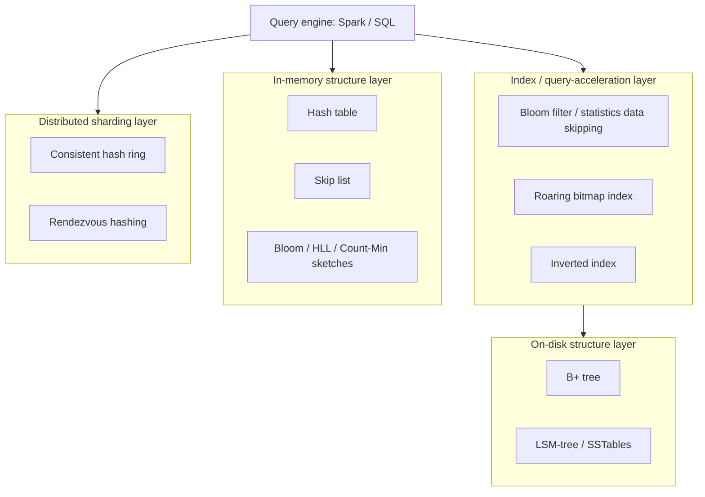
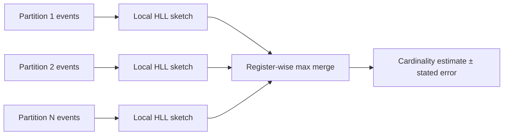
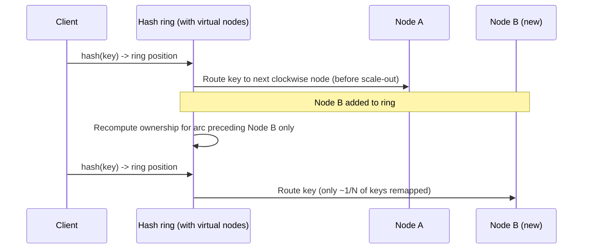

# Data Structures and Algorithms for Data Engineering

> Part of the **Enterprise Data & AI Architecture Handbook** · Phase-00 — Foundations & Prerequisites · Chapter 07.
> Estimated study time: **60 min reading + ~5h labs**.
> **Prerequisite:** read [Computer Science Fundamentals](02_Computer_Science_Fundamentals.md) first. Builds on [Storage Systems Fundamentals](05_Storage_Systems_Fundamentals.md)'s B-tree/LSM-tree treatment and previews [Distributed Systems Primer](08_Distributed_Systems_Primer.md)'s partitioning chapter.

---

## Executive Summary

Every "how does this actually work under the hood" question in data engineering bottoms out in a small set of probabilistic and disk-oriented data structures that most engineers use daily but few can explain: a Delta Lake `OPTIMIZE ZORDER` query prunes files using **Bloom filters** and **min/max statistics**; a `COUNT(DISTINCT user_id)` over a trillion-row table resolves in seconds using **HyperLogLog**, not a literal distinct count; a Kafka Streams state store persists gigabytes of keyed state using **skip lists** and **LSM-trees**; a Redis cache shards a billion keys across a fleet with **consistent hashing** so that adding a node reshuffles a tiny fraction of keys instead of nearly all of them; and a search index (Elasticsearch, or Delta Lake's own data-skipping index) answers "which files contain this term" using an **inverted index**. [Computer Science Fundamentals](02_Computer_Science_Fundamentals.md) established asymptotic complexity and the memory hierarchy as the units of cost; this chapter is where those units become concrete, load-bearing structures: hash tables and sorting as the universal building blocks, external merge sort as the mechanism that lets a shuffle or `ORDER BY` outgrow RAM without failing, probabilistic sketches (Bloom filter, HyperLogLog, Count-Min sketch) as the mechanism that trades a small, bounded error for orders-of-magnitude less memory, B+ trees and LSM-trees (introduced structurally in [Storage Systems Fundamentals](05_Storage_Systems_Fundamentals.md#59-b-trees-vs-lsm-trees-and-the-rum-conjecture)) revisited here with their exact on-disk layout and query-time behavior, skip lists as the concurrency-friendly alternative to balanced trees, roaring bitmaps and tries/inverted indexes as the workhorses of columnar filtering and full-text search, and consistent/rendezvous hashing as the two dominant answers to "how do I shard N keys across M nodes without a full reshuffle every time M changes."

This is the chapter where "why is `COUNT(DISTINCT)` on a huge table suddenly fast" becomes "because the engine is running HyperLogLog with a documented ~2% standard error, not a literal distinct scan" — a fact that changes what you can promise a stakeholder about that number's precision. We cover hash tables (collision resolution, load factor, amortized cost, and why a bad hash function silently degrades every downstream data structure that depends on one); comparison-based sorting and why external merge sort is the single mechanism underlying Spark shuffle spill, sort-merge join, and any `ORDER BY` over data larger than memory; the three canonical probabilistic sketches (Bloom filter, HyperLogLog, Count-Min sketch) and the specific error/memory trade-off each one makes; B+ trees and LSM-trees at the level of exact page/SSTable layout, not just the trade-off summary from the prior chapter; skip lists as RocksDB's and Redis's default in-memory ordered structure; roaring bitmaps as the compressed bitmap index behind Druid, Pinot, and ClickHouse's fast filtering; tries and inverted indexes as the structures behind autocomplete, IP routing, and full-text search; and consistent hashing/rendezvous hashing as the two competing answers to distributed sharding with minimal data movement on membership change.

The bias remains **Azure-primary (~60%)** — Azure Cosmos DB's consistent-hashing-based partitioning, Azure Cache for Redis, Azure Synapse/Databricks' use of these structures internally, Azure Data Explorer/Kusto's use of inverted indexes and bitmaps — **~30% enterprise open source** (Delta Lake data-skipping, RocksDB, Apache Druid/Pinot/ClickHouse, Elasticsearch/Lucene, Redis, Kafka Streams) and **~10% AWS/GCP comparison-only**. By the end you will read a Delta Lake file-skipping statistics report, a `HLL_SKETCH` column in a BI dashboard, a Cosmos DB partition-key design doc, or a RocksDB compaction log and know exactly which structure and which trade-off is in play.

**Bottom line:** hash tables and sorting are the universal primitives; external merge sort is how they scale past memory; probabilistic sketches trade a small, quantified error for enormous memory savings; B+ trees, LSM-trees, and skip lists are the three dominant ways to keep data ordered on disk or in memory under different read/write ratios; roaring bitmaps, tries, and inverted indexes are the specialized structures behind fast filtering and search; and consistent/rendezvous hashing are how you shard data across a fleet without a full reshuffle every time the fleet changes size. Architects who can name which structure is doing the work in a given system can predict its memory footprint, its error bounds, and its failure modes before they become an incident.

---

## Learning Objectives

By the end of this chapter you will be able to:

1. **Explain hash table internals** (hash functions, collision resolution, load factor, amortized `O(1)`) and diagnose performance degradation from poor hash distribution or resizing storms.
2. **Reason about sorting complexity and external merge sort**, and connect it directly to Spark shuffle spill, sort-merge join, and `ORDER BY` behavior over data larger than memory.
3. **Select the correct probabilistic sketch** (Bloom filter, HyperLogLog, Count-Min sketch) for a given approximate-query problem and state its quantified error bound and memory footprint.
4. **Distinguish B+ trees, LSM-trees, and skip lists** at the level of on-disk/in-memory layout and choose correctly for a given read/write/concurrency profile.
5. **Explain roaring bitmaps, tries, and inverted indexes** and connect each to a concrete production system (Druid/Pinot/ClickHouse, IP routing/autocomplete, Elasticsearch/Lucene).
6. **Compare consistent hashing and rendezvous hashing** for distributed sharding and select correctly based on operational complexity and rebalancing requirements.
7. **Translate each structure into an Azure-hosted implementation** (Cosmos DB partitioning, Azure Cache for Redis, Delta Lake data-skipping, Azure Data Explorer indexes) and defend the choice with quantified memory/latency/error trade-offs in a design review.
8. **Connect these structures to distributed systems design**, previewed here and developed fully in [Distributed Systems Primer](08_Distributed_Systems_Primer.md).

---

## Business Motivation

These structures are not academic trivia — they are the mechanism by which specific, expensive business problems become tractable at all:

- **Approximate answers unlock queries that exact answers cannot afford.** An exact `COUNT(DISTINCT)` over a trillion-row clickstream table can require a full shuffle costing tens of thousands of compute-dollars; a HyperLogLog sketch answers the same question, at a stated ~2% error, using kilobytes of memory and no shuffle — the difference between a dashboard that loads and one that times out.
- **Data-skipping via Bloom filters and min/max statistics is a direct cloud-cost lever.** Every file a query engine can skip without reading is compute and I/O it never pays for; Delta Lake/Parquet statistics and Bloom filter indexes are the mechanism, and a poorly-chosen Z-order/partition key that defeats them is a silent, recurring cost overrun.
- **Sharding strategy determines rebalancing cost at scale.** A naive modulo-based shard assignment remaps nearly all keys when a node is added or removed, causing a cache-stampede or full data-reshuffle event; consistent hashing bounds that remapping to `~1/N` of the keys — the difference between a routine scale-out and a customer-facing outage.
- **The wrong indexing structure for the workload is a recurring, expensive incident pattern.** A write-heavy ingestion path forced through a B+ tree, or a read-heavy point-lookup workload forced through an LSM-tree without adequate Bloom filters, both produce a predictable, avoidable throughput ceiling.
- **Full-text and prefix search at enterprise scale requires purpose-built structures.** A naive `LIKE '%term%'` scan over billions of rows is not a viable substitute for an inverted index or a trie-based prefix structure — the difference between sub-second search and a query that never returns.

For an architect, fluency here converts "the dashboard is slow" or "the cache reshuffled everything after we added a node" into a precise diagnosis — which structure is missing, misconfigured, or mismatched to the access pattern — and a fix that is cheap relative to rebuilding the system empirically.

---

## History and Evolution

- **1953 — Hashing (Hans Peter Luhn, IBM)** introduces the idea of computing a fixed-size digest from a key to enable near-constant-time lookup, the foundation of every hash table since.
- **1960s — B-trees precursors and balanced trees** emerge alongside early database research; **1972 — B-trees (Bayer & McCreight)** formalizes the structure still dominant in relational indexes today (see [Storage Systems Fundamentals](05_Storage_Systems_Fundamentals.md#59-b-trees-vs-lsm-trees-and-the-rum-conjecture)).
- **1970 — Tries** are formalized (the term coined by Edward Fredkin, from "retrieval"), building on earlier prefix-matching research, becoming the standard structure for IP routing tables and autocomplete.
- **1970 — Bloom filters (Burton Howard Bloom)** introduce a space-efficient probabilistic structure for approximate set membership, initially motivated by hyphenation dictionaries and spell-checkers.
- **1975 — Inverted indexes** become the standard structure underlying information-retrieval systems, later formalized in the SMART system and, decades on, Lucene/Elasticsearch/Solr.
- **1989 — Skip lists (William Pugh)** are published as a simpler, probabilistically-balanced alternative to balanced binary trees, avoiding complex rebalancing logic while retaining `O(log n)` expected performance.
- **1996 — Log-Structured Merge-trees (O'Neil et al.)** formalize the append-only, compaction-based structure now underlying Cassandra, HBase, RocksDB, and LevelDB (see [Storage Systems Fundamentals](05_Storage_Systems_Fundamentals.md#59-b-trees-vs-lsm-trees-and-the-rum-conjecture)).
- **1997 — Consistent hashing (Karger et al., MIT, for Akamai's CDN)** solves the "adding a cache node remaps everything" problem, becoming foundational to Amazon Dynamo (2007), Cassandra, and every major distributed hash-based partitioning scheme since.
- **2003 — HyperLogLog's lineage begins with Flajolet-Martin (1985)**, refined into **LogLog (2003)** and **HyperLogLog (Flajolet et al., 2007)**, giving cardinality estimation within ~2% error using a few kilobytes regardless of the true cardinality.
- **2003 — Count-Min Sketch (Cormode & Muthukrishnan)** generalizes Bloom-filter-style probabilistic counting to frequency estimation, enabling heavy-hitter detection over unbounded streams in sub-linear memory.
- **2005 — Rendezvous (Highest Random Weight, HRW) hashing (Thaler & Ravishankar, originally 1996, popularized later)** offers a stateless alternative to consistent hashing requiring no explicit ring/virtual-node bookkeeping.
- **2016 — Roaring bitmaps (Chambi, Lemire, Kaser, Godin)** formalize a compressed bitmap representation that adapts between dense (raw bitmap) and sparse (array/run-length) encodings per chunk, now the default bitmap index in Apache Druid, Apache Pinot, ClickHouse, Lucene, and Elasticsearch.
- **2019-onward — Approximate query processing goes mainstream in cloud data warehouses**: Azure Synapse, Databricks Photon, BigQuery, and Redshift all ship native HyperLogLog-family functions, and Delta Lake/Iceberg adopt Bloom filter indexes for file-level data skipping as a first-class feature.

---

## Why This Technology Exists

Every structure in this chapter exists because exact, naive approaches hit a wall — in memory, in time, or in coordination cost — at real-world scale:

- **Hash tables** exist because linear search through a list of records is unacceptable at scale; a well-distributed hash function converts "find this key" from `O(n)` to amortized `O(1)`, the single highest-leverage data-structure decision in most systems.
- **External merge sort** exists because sorting (and the joins/aggregations/window functions built on it) must work correctly even when the dataset exceeds available RAM — a fundamental requirement for any distributed engine (Spark, SQL Server, PostgreSQL) that cannot assume the input fits in memory.
- **Bloom filters, HyperLogLog, and Count-Min sketch** exist because some questions (set membership, cardinality, frequency) do not require an exact answer to be useful, and the exact answer is often prohibitively expensive in memory or compute — these sketches trade a small, mathematically bounded error for asymptotically smaller memory footprints (often 100-1000x smaller).
- **B+ trees, LSM-trees, and skip lists** exist because "keep data sorted and quickly searchable" has fundamentally different optimal implementations depending on whether the medium is disk (B+ tree, LSM-tree) or memory (skip list), and whether the workload is read-heavy or write-heavy (RUM conjecture, [Storage Systems Fundamentals](05_Storage_Systems_Fundamentals.md#59-b-trees-vs-lsm-trees-and-the-rum-conjecture)).
- **Roaring bitmaps** exist because plain bitmap indexes are either wastefully large (dense encoding of sparse data) or slow (naive compressed encodings requiring full decompression to query) — a hybrid, chunk-adaptive encoding solves both simultaneously.
- **Tries and inverted indexes** exist because prefix matching and full-text search are fundamentally different access patterns from exact-key lookup, each requiring a purpose-built structure to be fast at scale.
- **Consistent hashing and rendezvous hashing** exist because naive modulo-based sharding (`hash(key) % N`) remaps nearly all keys whenever `N` changes — both structures solve the same problem (minimal remapping on membership change) via different mechanisms (a hash ring with virtual nodes, versus a stateless highest-weight computation).

Without these structures, every "find," "count," "sort," "search," or "shard" operation would either not scale, silently return wrong answers under memory pressure, or become an operational hazard every time infrastructure changed size.

---

## Problems It Solves

- **Near-constant-time lookup, insert, and delete** — hash tables converting linear search into amortized `O(1)` for the majority of key-value access patterns in data engineering.
- **Correct, bounded-memory sorting over arbitrarily large datasets** — external merge sort enabling joins, aggregations, and `ORDER BY` to scale past available RAM without correctness compromise.
- **Approximate answers at a small, quantified fraction of the exact cost** — Bloom filters (membership), HyperLogLog (cardinality), and Count-Min sketch (frequency) each replacing an expensive or infeasible exact computation with a cheap, bounded-error one.
- **Efficient, ordered on-disk and in-memory access under different read/write ratios** — B+ trees, LSM-trees, and skip lists each optimized for a different point on the RUM conjecture's trade-off surface.
- **Fast prefix, range, and set-membership filtering over columnar data** — roaring bitmaps enabling sub-millisecond filtering over billions of rows in OLAP engines.
- **Fast prefix and full-text search at scale** — tries (autocomplete, IP routing) and inverted indexes (Elasticsearch/Lucene-style search) replacing infeasible linear scans.
- **Distributed sharding with minimal data movement on scale events** — consistent hashing and rendezvous hashing bounding the fraction of keys remapped when nodes are added or removed.

---

## Problems It Cannot Solve

- **Probabilistic sketches cannot give an exact answer.** A Bloom filter can produce false positives (never false negatives); HyperLogLog and Count-Min sketch have a stated, non-zero standard error — none of these are substitutes for an exact computation where regulatory or financial correctness requires one (e.g., a billing reconciliation cannot use HyperLogLog for a customer-facing invoice count).
- **A hash table cannot provide ordered iteration** without an auxiliary structure — if range queries or sorted iteration are required, a tree or skip-list-based structure is necessary regardless of how well-tuned the hash function is.
- **External merge sort cannot make an inherently expensive shuffle cheap** — it makes an out-of-memory sort *correct and boundedly slower*, not free; the I/O and network cost of a large shuffle remains real and must be budgeted for.
- **Consistent hashing does not eliminate hotspotting** — a single overloaded key (a "hot key") remains hot regardless of how evenly the hash ring distributes *key ranges*; hot-key mitigation requires a separate mechanism (request-level load balancing, key splitting, or caching).
- **A trie or inverted index cannot substitute for relevance ranking or semantic search** — they solve exact-prefix and exact-term matching efficiently; fuzzy, typo-tolerant, or semantic (embedding-based) search requires additional machinery (edit-distance structures, vector indexes — covered later in the handbook's AI-platform phases).
- **Roaring bitmaps do not help with high-cardinality columns** — the compression advantage depends on the column having a bounded, indexable set of distinct values; a unique-ID column gains little from bitmap indexing and is better served by a hash or B+ tree index.

---

## Core Concepts

### 7.1 Hash tables: hash functions, collision resolution, and load factor

A **hash table** maps a key to a bucket index via a **hash function**, giving expected `O(1)` insert/lookup/delete. Two collision-resolution strategies dominate: **separate chaining** (each bucket holds a linked list/small array of entries that hash to it) and **open addressing** (a colliding key probes subsequent slots — linear, quadratic, or double hashing — until an empty one is found). The **load factor** (`entries / buckets`) governs performance: as it approaches 1 (chaining) or the table's design ceiling (open addressing, typically resized well before 1.0), collision chains lengthen and performance degrades toward `O(n)` in the worst case, which is why hash tables **resize** (typically doubling capacity and rehashing all entries) once a load-factor threshold is crossed — an `O(n)` operation that is *amortized* across many inserts to remain `O(1)` on average, but which causes a visible latency spike on the triggering insert (a well-known "resize storm" symptom in latency-sensitive services). A **poor hash function** (one that clusters keys into few buckets) silently degrades every one of these guarantees and is a common root cause of a hash-based structure "mysteriously" becoming slow under a specific, skewed key distribution — this is precisely why cryptographically-mixed hash functions (MurmurHash, xxHash, FNV) are preferred over naive ones for production key-value stores, partitioners, and the sketches in §7.4-§7.6.

### 7.2 Sorting: comparison-based complexity and why it matters for data engineering

Comparison-based sorting is bounded below at $O(n \log n)$ (information-theoretic lower bound: distinguishing $n!$ orderings requires $\log_2(n!) = \Theta(n \log n)$ comparisons). **Quicksort** ($O(n \log n)$ average, $O(n^2)$ worst case, in-place, cache-friendly) and **merge sort** ($O(n \log n)$ worst case, stable, but requires $O(n)$ auxiliary space) are the two canonical algorithms; **Timsort** (Python's and Java's default) is a hybrid that exploits already-sorted runs common in real-world data. Sorting is not academic here: every **sort-merge join**, every `GROUP BY` implemented via sort-based aggregation, and every `ORDER BY` in Spark, SQL Server, or PostgreSQL is, at its core, one of these algorithms applied at scale — and understanding the $O(n \log n)$ cost is exactly what lets an engineer estimate query cost before running it, per [Computer Science Fundamentals](02_Computer_Science_Fundamentals.md#learning-objectives).

### 7.3 External merge sort: sorting past memory

When the dataset to sort exceeds available RAM, **external merge sort** solves it in two phases: (1) **run generation** — read chunks that fit in memory, sort each in place (in-memory quicksort/Timsort), and write each sorted chunk ("run") to disk; (2) **k-way merge** — open all (or a memory-bounded subset of) sorted runs simultaneously and repeatedly extract the smallest head element across them (typically via a min-heap), writing a single fully sorted output stream. This converts an operation that *cannot* fit in memory into one that costs $O(n \log_k n)$ I/O passes, where $k$ is the merge fan-in bounded by available memory — the exact mechanism behind **Spark's shuffle spill-to-disk** (a Spark stage that exceeds executor memory during a sort-based shuffle write spills sorted runs to local disk and merges them), **PostgreSQL's `work_mem`-bounded external sort** (visible in `EXPLAIN ANALYZE` as `Sort Method: external merge`), and **SQL Server's tempdb-based sort spill**. An engineer who sees "sort spilled N GB to disk" in a query plan is looking at external merge sort in action — the fix is either more memory per task/partition or fewer, larger partitions, not a different algorithm.

### 7.4 Bloom filters: probabilistic set membership

A **Bloom filter** is a bit array of size $m$ with $k$ independent hash functions. To insert a key, compute its $k$ hash values (mod $m$) and set those $k$ bits; to test membership, compute the same $k$ hashes and check if all $k$ bits are set — if any is 0, the key is **definitely not present** (no false negatives); if all are 1, the key is **probably present** (a tunable false-positive rate, since unrelated keys can coincidentally set the same bits). The false-positive rate is a function of $m$, $k$, and the number of inserted elements $n$, and can be tuned to an arbitrarily small (but never zero) value by increasing $m$. This structure underlies **LSM-tree read-path optimization** ([Storage Systems Fundamentals §5.10](05_Storage_Systems_Fundamentals.md#510-bloom-filters-and-delta-lakeiceberg-as-wal-and-lsm-adjacent-designs)) — a per-SSTable Bloom filter lets a read definitively skip SSTables that cannot contain the key — and **Delta Lake / Apache Iceberg Bloom filter indexes**, which let a query engine skip entire Parquet files that provably do not contain a queried value, a direct compute- and I/O-cost reduction.

### 7.5 HyperLogLog: cardinality estimation in near-constant memory

**HyperLogLog (HLL)** estimates the number of *distinct* elements in a multiset using a few kilobytes of memory regardless of whether the true cardinality is a thousand or a trillion — an asymptotic improvement over an exact distinct count, which requires memory proportional to the cardinality itself (a hash set holding every distinct value). The mechanism: hash each element, use the first few bits to select one of $m$ "registers," and track the position of the leftmost 1-bit (equivalently, the count of leading zeros) in the remaining hash bits within each register; since the probability of seeing $k$ leading zeros is $2^{-k}$, the *maximum* leading-zero count observed across many elements hashing to a register is a statistical estimator of $\log_2(\text{cardinality})$. Averaging (harmonic mean, with bias correction) across all $m$ registers produces a cardinality estimate with a standard error of approximately $1.04/\sqrt{m}$ — e.g., $m = 16{,}384$ registers (a few KB) yields roughly 0.8% standard error. Critically, HLL sketches are **mergeable**: unioning two sketches (register-wise max) gives the exact sketch for the union of the two underlying sets, letting a system pre-aggregate cardinality sketches per partition/day and merge them later for an overall estimate without re-scanning raw data — the mechanism behind `APPROX_COUNT_DISTINCT` in Azure Synapse, Databricks, BigQuery, and Redshift.

### 7.6 Count-Min Sketch: frequency estimation and heavy hitters

A **Count-Min Sketch** estimates the frequency of any given key in a stream using sub-linear memory: a 2D array of counters with $d$ rows, each associated with an independent hash function mapping keys to one of $w$ columns. On each occurrence of a key, increment the corresponding counter in every row; to estimate a key's frequency, take the **minimum** across its $d$ row counters (the minimum, not the average, because it is the counter least corrupted by hash collisions with other keys — collisions can only *increase* a counter, never decrease it, so the minimum is the tightest overestimate). This gives a frequency estimate that is always $\geq$ the true count, with the amount of over-counting bounded by $w$ and $d$ (tunable to a target error/confidence level) — the standard mechanism behind **heavy-hitter detection** (finding the most frequent items in an unbounded stream, e.g., top-N products viewed, top-N IPs by traffic) in streaming systems (Kafka Streams, Flink) where storing an exact per-key counter for every distinct key seen is infeasible.

### 7.7 B+ trees revisited: the exact on-disk structure behind relational indexes

Building on the B-tree/LSM-tree trade-off summary in [Storage Systems Fundamentals §5.9](05_Storage_Systems_Fundamentals.md#59-b-trees-vs-lsm-trees-and-the-rum-conjecture), the **B+ tree** is the specific B-tree variant used by nearly every relational database index (PostgreSQL, SQL Server, MySQL/InnoDB): all actual key-value data lives only in **leaf nodes**, which are additionally **linked together in a doubly-linked list** in key order; **internal nodes** hold only routing keys used to navigate from root to the correct leaf, with no associated data. This design gives two guarantees a plain B-tree does not: (1) **every search costs exactly the same number of page reads** (root-to-leaf depth, typically 3-4 for billions of rows, since only leaves hold data — internal nodes are shallow and heavily cached); and (2) **range scans are a single leaf-to-leaf traversal** along the linked list, avoiding any repeated root-to-leaf navigation per row — the reason `WHERE date BETWEEN x AND y` on a B+-tree-indexed column is efficient while the same predicate against an unindexed column requires a full scan.

### 7.8 LSM-trees revisited: SSTable layout and compaction strategy trade-offs

Extending [Storage Systems Fundamentals §5.9-§5.10](05_Storage_Systems_Fundamentals.md#59-b-trees-vs-lsm-trees-and-the-rum-conjecture): an **SSTable (Sorted String Table)** is an immutable, disk-resident file of key-value pairs sorted by key, typically paired with a sparse in-file index (offsets for every Nth key) and a per-file **Bloom filter** (§7.4) so a read can skip the file entirely without a disk seek. **Compaction strategy** is the primary LSM-tree tuning lever: **size-tiered compaction** (Cassandra's default) merges SSTables of similar size, favoring write throughput at the cost of higher space amplification and read amplification (more SSTables to check per read); **leveled compaction** (RocksDB's default, LevelDB) organizes SSTables into levels of exponentially increasing size with a stronger per-level non-overlapping-key-range invariant, favoring read performance and bounded space amplification at the cost of higher write amplification (each key is rewritten across more compaction passes). Choosing between them is a direct, tunable instance of the RUM conjecture: size-tiered for write-heavy/ingest-path workloads, leveled for read-heavy/serving-path workloads built on the same underlying LSM-tree engine.

### 7.9 Skip lists: the concurrency-friendly ordered structure

A **skip list** is a probabilistically-balanced, ordered linked structure: the bottom layer is an ordinary sorted linked list, and each element is independently promoted to additional "express lane" layers with fixed probability $p$ (typically $1/2$ or $1/4$), so that searching starts at the top (sparsest) layer and drops down a layer each time the next node's key would overshoot the target — giving expected $O(\log n)$ search/insert/delete without the complex rotation/rebalancing logic a balanced binary tree (AVL, red-black) requires. Skip lists are the default in-memory ordered structure for **Redis's sorted sets (ZSET)** and **RocksDB's default memtable implementation** precisely because their simpler, lock-friendlier structure (no global rebalancing on insert) makes them easier to implement correctly under concurrent access than a rotating balanced tree — a direct connection to [Concurrency and Parallelism](06_Concurrency_and_Parallelism.md)'s treatment of lock contention.

### 7.10 Roaring bitmaps: compressed, adaptive bitmap indexes

A **bitmap index** represents, for a given column value, a bit per row indicating presence — extremely fast for boolean set operations (AND/OR/NOT via bitwise ops) but naively wasteful for sparse data (a bit for every row, even absent values) or high-cardinality columns (one bitmap per distinct value). **Roaring bitmaps** solve this by partitioning the 32-bit integer space into 65,536-value "chunks," and encoding each chunk with whichever of three representations is smallest: a raw bitmap (dense chunks), a sorted array of values (sparse chunks), or a run-length encoding (chunks with long runs of consecutive values) — switching representations automatically per chunk based on density. This adaptive encoding keeps both **size** (often smaller than compressed alternatives like WAH/Concise) and **query speed** (set operations on array/run-encoded chunks avoid decompressing to a full bitmap) favorable simultaneously, which is why **Apache Druid, Apache Pinot, ClickHouse, Lucene, and Elasticsearch** all use roaring bitmaps as their default bitmap-index representation for fast multi-predicate filtering over low-to-medium-cardinality columns.

### 7.11 Tries: prefix trees for autocomplete and routing

A **trie** (prefix tree) stores strings by sharing common prefixes as shared root-to-node paths, so that all strings sharing a prefix branch from the same node — giving $O(k)$ lookup/insert for a string of length $k$, independent of how many other strings are stored, and making **prefix queries** ("all keys starting with 'data'") a single subtree traversal rather than a scan. A **compressed trie (radix tree/Patricia trie)** collapses single-child chains into a single edge labeled with the shared substring, reducing memory overhead — the structure used by **IP routing tables** (longest-prefix match over CIDR blocks) and **autocomplete/typeahead** systems, and internally by many key-value stores' in-memory indexes.

### 7.12 Inverted indexes: the structure behind full-text search

An **inverted index** maps each distinct term to a **postings list** — the set (or ordered list, often with position/frequency metadata) of documents/rows containing that term — inverting the natural "document → terms" direction into "term → documents." A query for multiple terms (`"data" AND "engineering"`) intersects the postings lists for each term, which is efficient because postings lists are typically stored sorted and often compressed (delta-encoded document IDs, since gaps between sorted IDs are small) enabling fast merge-based intersection. This is the structure underlying **Lucene (and therefore Elasticsearch and Solr)**, and conceptually the same idea underlies **Delta Lake / Parquet's column statistics and data-skipping indexes** (a coarser-grained "which files contain a range including this value" postings-like structure) and Azure Data Explorer/Kusto's term index for fast log/text search.

### 7.13 Consistent hashing: minimal-remapping distributed sharding

**Consistent hashing** places both nodes and keys on a conceptual hash ring (typically `[0, 2^32)` or similar): each key is assigned to the first node encountered walking clockwise from the key's hash position. Adding or removing a node only affects the keys between it and its immediate predecessor on the ring — bounding remapping to approximately `1/N` of all keys (versus nearly 100% for naive `hash(key) % N` sharding, since changing `N` changes almost every key's modulo result). In practice, each physical node is represented by many **virtual nodes** scattered around the ring to smooth out load distribution (without virtual nodes, ring gaps can be highly uneven, overloading nodes that happen to own large arcs). This is the sharding mechanism behind **Amazon Dynamo, Apache Cassandra, and Azure Cosmos DB's physical partition placement** (Cosmos DB additionally uses a **logical partition** abstraction on top, per its own partition-key design model) and most distributed cache fleets (Memcached client-side sharding, many Redis Cluster deployments).

### 7.14 Rendezvous (Highest Random Weight) hashing: the stateless alternative

**Rendezvous hashing (HRW)** solves the same problem as consistent hashing without a ring: for a given key, compute a weight `hash(key, node)` for every candidate node, and assign the key to the node with the **highest weight**. Adding or removing a node changes only the keys whose highest-weight node was the affected node — the same `~1/N` remapping bound as consistent hashing — but requires **no persisted ring state or virtual-node bookkeeping**, only the current node list, making it simpler to implement correctly and trivially consistent across independently-computing clients. The trade-off is computational: a naive HRW lookup is $O(N)$ per key (must compute a weight against every node), versus consistent hashing's $O(\log N)$ ring lookup — acceptable for moderate fleet sizes and preferred in systems (some CDN request-routing layers, some load balancers) that value operational simplicity and statelessness over lookup complexity at very large `N`.

---

## Internal Working

**How a Delta Lake query skips files using Bloom filters and statistics.** At write time, Delta Lake (optionally) computes per-column min/max statistics and, if configured, a Bloom filter index per data file. At query time, the query planner evaluates the `WHERE` predicate against each file's statistics/Bloom filter *before* reading any Parquet data: if the predicate's value falls outside a file's min/max range, or the Bloom filter definitively reports absence, the file is skipped entirely — no I/O, no compute — directly reducing scan cost proportional to how selectively the filter can eliminate files.

**How Spark's sort-merge join uses external merge sort.** Both join sides are partitioned by join key (a shuffle) and, within each partition, sorted using external merge sort if the partition exceeds executor memory (spilling sorted runs to local disk and k-way merging them, §7.3). Once both sides are sorted by key, the join proceeds as a single linear merge pass — the same "sortedness enables a cheap merge" principle underlying both external merge sort's own merge phase and the join itself.

**How Cosmos DB routes a request using (a variant of) consistent hashing.** A document's partition key is hashed to determine its **logical partition**, and logical partitions are distributed across **physical partitions** using a range-based or hash-based scheme that Cosmos DB rebalances automatically as physical partitions split under load growth — conceptually the same "minimal remapping on topology change" goal as §7.13, managed transparently by the service rather than requiring application-level ring management.

**How a HyperLogLog-backed `APPROX_COUNT_DISTINCT` resolves in a distributed query engine.** Each worker/partition computes (or receives pre-aggregated) a local HLL sketch over its rows; the coordinator merges all partition-level sketches via register-wise maximum (a cheap, associative, commutative operation) and computes the final cardinality estimate from the merged sketch — avoiding both a full shuffle of raw distinct values and a proportional-to-cardinality memory footprint, regardless of how many partitions or how large the underlying dataset.

---

## Architecture

The relevant layering, from raw key/value operations to distributed system-level guarantees:

1. **Primitive layer** — hash functions, comparison operators, and the memory-hierarchy assumptions from [Computer Science Fundamentals](02_Computer_Science_Fundamentals.md) underlying every structure above.
2. **In-memory structure layer** — hash tables, skip lists, and in-memory sketches (Bloom filter, HLL, Count-Min) operating within a single process's memory.
3. **On-disk structure layer** — B+ trees and LSM-tree SSTables persisting ordered data durably, per [Storage Systems Fundamentals](05_Storage_Systems_Fundamentals.md#architecture).
4. **Index/query-acceleration layer** — roaring bitmap indexes, inverted indexes, and Bloom-filter/statistics-based data skipping, sitting above raw storage to accelerate specific query shapes (filter, prefix, full-text).
5. **Distributed sharding layer** — consistent hashing or rendezvous hashing assigning keys/partitions to nodes, determining data locality and rebalancing behavior at fleet-topology-change time.
6. **Query-engine layer** — Spark/SQL engines composing all of the above (external merge sort for shuffles/joins, sketches for approximate aggregates, indexes for predicate pushdown) into an end-to-end query plan.

An incident is almost always localized by asking **which layer** exhibits the symptom — a slow point lookup (layer 2/3 structure mismatch), a full-table scan that should have been prunable (layer 4 index absence/misconfiguration), a rebalancing storm after a scale event (layer 5 sharding scheme), or a spilling, slow join (layer 6 sort/shuffle sizing).

---

## Components

| Component | Role | Concrete instantiation |
|---|---|---|
| **Hash table** | Near-`O(1)` key-value lookup | In-memory maps, hash-partitioned joins/aggregations |
| **Sort/external merge sort** | Ordered output over arbitrary-size input | Spark shuffle sort, `ORDER BY`, sort-merge join |
| **Bloom filter** | Probabilistic set-membership test | LSM-tree SSTable filters, Delta Lake/Parquet Bloom filter indexes |
| **HyperLogLog sketch** | Approximate cardinality estimation | `APPROX_COUNT_DISTINCT` (Synapse, Databricks, BigQuery, Redshift) |
| **Count-Min sketch** | Approximate frequency / heavy-hitter estimation | Streaming heavy-hitter detection (Kafka Streams, Flink) |
| **B+ tree** | Ordered, disk-resident index, range-scan friendly | Relational database indexes (PostgreSQL, SQL Server, InnoDB) |
| **LSM-tree / SSTable** | Write-optimized, disk-resident ordered store | RocksDB, Cassandra, HBase, LevelDB |
| **Skip list** | Concurrency-friendly ordered in-memory structure | Redis sorted sets, RocksDB memtable |
| **Roaring bitmap** | Compressed, adaptive bitmap index | Druid, Pinot, ClickHouse, Lucene/Elasticsearch filtering |
| **Trie / radix tree** | Prefix-based lookup | Autocomplete, IP routing tables |
| **Inverted index** | Term-to-document postings mapping | Elasticsearch/Lucene/Solr, log/text search |
| **Consistent hash ring** | Distributed key-to-node assignment, minimal remap | Cassandra, Dynamo-style stores, Cosmos DB partitioning |
| **Rendezvous (HRW) hashing** | Stateless key-to-node assignment | CDN/load-balancer request routing, cache client sharding |

---

## Metadata

- **Sketch parameters** — Bloom filter bit-array size $m$ and hash count $k$; HyperLogLog register count $m$; Count-Min sketch width $w$ and depth $d$ — all directly determine the accuracy/memory trade-off and must be recorded alongside the sketch itself for reproducibility and auditability of approximate results.
- **Index statistics** — B+ tree/LSM-tree index cardinality, depth, and fragmentation; Delta Lake/Parquet per-file min/max column statistics and Bloom filter presence flags, consulted by the query planner before any data read.
- **Compaction metadata** — LSM-tree level/SSTable manifest (RocksDB's `MANIFEST` file, analogous to Delta Lake's `_delta_log`) recording which SSTables exist at which level, essential for both correctness (which files are live) and compaction scheduling.
- **Partition/ring metadata** — consistent-hashing ring assignments (physical/virtual node mappings) or Cosmos DB's logical-to-physical partition mapping, consulted on every request routing decision and updated on every scale event.
- **Sketch mergeability metadata** — versioning/algorithm-identifier metadata for HLL/Count-Min sketches, since merging sketches computed with different parameters (register count, hash seed) is invalid and a common source of silent approximate-query errors.

---

## Storage

- **Sketches are designed to be tiny and often persisted alongside the data they summarize** — a per-partition HLL sketch or Bloom filter is frequently stored as file-level or table-level metadata (Delta Lake statistics, a materialized sketch column) rather than recomputed per query.
- **B+ tree and LSM-tree storage layout was covered structurally in [Storage Systems Fundamentals](05_Storage_Systems_Fundamentals.md#storage)** — this chapter's contribution is the exact page/SSTable internal layout (§7.7-§7.8) that determines query-time behavior, not a repeat of the medium-level trade-off.
- **Roaring bitmap and inverted-index storage is typically co-located with the columnar/document data they index** (Parquet-adjacent index files, Lucene segment files) so that index and data are read together and remain consistent under compaction/merge operations.

---

## Compute

- **Sketch construction and merging is cheap, streaming-friendly compute** — Bloom filter inserts, HLL register updates, and Count-Min increments are all $O(1)$ per element and embarrassingly parallel/associative, making them ideal for distributed pre-aggregation (compute a sketch per partition, merge centrally).
- **External merge sort's compute cost is dominated by comparison operations and I/O for spilled runs** — CPU-bound for in-memory runs, I/O-bound once spilling begins, a distinction that determines whether more CPU or more memory/faster disks fixes a slow sort.
- **LSM-tree compaction is a genuine, schedulable compute cost** (per [Storage Systems Fundamentals](05_Storage_Systems_Fundamentals.md#compute)) whose intensity is directly shaped by the compaction strategy chosen in §7.8.
- **Consistent-hashing ring lookups are $O(\log N)$ compute per request**; rendezvous hashing is $O(N)$ — a real, if usually small, per-request compute trade-off at very large fleet sizes.

---

## Networking

- **Sketch merging across distributed workers is a network-cheap operation** — sketches are small by design, so shipping partition-level Bloom filter/HLL/Count-Min sketches to a coordinator for merging costs far less network bandwidth than shipping raw data, a direct contrast to a full shuffle.
- **External merge sort's shuffle phase is the network-heavy step**, not the sort itself — per [Networking Fundamentals](04_Networking_Fundamentals.md#performance), shuffle network cost (all-to-all data movement across the cluster fabric) typically dominates the sort/merge CPU cost in a distributed join.
- **Consistent-hashing ring changes trigger network-visible data movement** (keys migrating to their new owning node) proportional to the `~1/N` remapping bound — a predictable, quantifiable network cost of any scale-out/scale-in event, worth explicitly monitoring during planned capacity changes.

---

## Security

- **Hash function choice has security implications distinct from performance** — a non-cryptographic hash used for a hash table exposed to untrusted, attacker-controlled keys is vulnerable to **algorithmic complexity attacks** (an attacker crafts keys that all collide, degrading `O(1)` operations to `O(n)`, a denial-of-service vector); production hash tables exposed to external input should use a keyed/seeded hash (e.g., SipHash) specifically to prevent this.
- **Bloom filter false positives are not a security control** — a Bloom filter reporting "possibly present" must never be treated as an authorization or access-control decision on its own; it is a performance optimization (skip unnecessary work), and the underlying exact check must still gate any security-sensitive decision.
- **Sketches computed over sensitive data can leak information** — an HLL or Count-Min sketch is a lossy summary, but combined with auxiliary knowledge (a differencing attack across two sketches differing by one record) can, in principle, reveal membership information; sketches over regulated data should be reviewed under the same governance lens as the raw data they summarize.
- **Consistent-hashing ring/partition metadata should not be treated as a security boundary** — knowing which node owns which key range is an operational fact, not an access-control mechanism; access control must be enforced independently at the data-access layer.

---

## Performance

Structure-selection levers, in priority order:

1. **Match the index/storage structure to the read/write ratio** (RUM conjecture, §7.7-§7.8) — B+ tree for read-heavy/range-scan, LSM-tree (with the correct compaction strategy) for write-heavy/ingest workloads.
2. **Replace exact aggregates with sketches where the business tolerates a bounded error** — HyperLogLog for distinct counts, Count-Min sketch for frequency/heavy-hitters, trading a documented ~1-2% error for orders-of-magnitude less memory and no shuffle.
3. **Enable data-skipping structures (Bloom filters, column statistics) on high-selectivity filter columns** to avoid reading files/partitions that cannot match the query predicate.
4. **Size sort/shuffle memory to minimize external merge sort spill** — spilling is correct but materially slower than an in-memory sort; monitor spill volume as a first-class performance signal.
5. **Use roaring bitmaps for low-to-medium-cardinality filter columns** in OLAP engines, and avoid bitmap indexing on high-cardinality (near-unique) columns where it offers little benefit.
6. **Choose consistent hashing (bounded rebalancing) over naive modulo sharding** for any fleet expected to scale in/out, to avoid near-total cache/data invalidation on membership change.

**Worked example.** An analytics dashboard's "unique visitors today" tile took over a minute to render because it executed an exact `COUNT(DISTINCT visitor_id)` over a multi-billion-row event table, requiring a full shuffle to deduplicate visitor IDs across partitions. Switching the metric to a HyperLogLog-based `APPROX_COUNT_DISTINCT`, with per-hour pre-aggregated sketches merged at query time, reduced render time to under a second at a documented ~1% error — an acceptable trade-off explicitly signed off by the dashboard's business owner, illustrating that the performance win required a business decision (accept approximation), not just an engineering one.

---

## Scalability

- **Sketches scale independently of true cardinality/frequency** — an HLL sketch's memory footprint is fixed by its register count regardless of whether the underlying set has a million or a trillion elements, making it uniquely suited to ever-growing datasets where exact structures would grow unboundedly.
- **Consistent hashing's `~1/N` rebalancing bound is what makes horizontal scale-out operationally viable** — without it, every node addition to a large fleet would trigger a near-total data reshuffle, an operation whose cost grows with total data size, not just the increment being added.
- **LSM-tree compaction cost scales with write volume, not read volume** (per [Storage Systems Fundamentals](05_Storage_Systems_Fundamentals.md#scalability)) — a rapidly scaling write-heavy system must provision compaction headroom proportional to ingest rate, a frequently under-planned dimension.
- **External merge sort's I/O cost scales as $O(n \log_k n)$ passes**, where $k$ (merge fan-in) is bounded by available memory — more memory per task directly reduces the number of merge passes required at a given data volume, a concrete, quantifiable scale-out lever.

---

## Fault Tolerance

- **Sketches are naturally resilient to partial data loss in a specific, quantifiable way** — losing one partition's HLL sketch loses that partition's contribution to the estimate but does not corrupt the merged result's validity for the remaining partitions, unlike an exact distinct-count computation which would simply be incomplete/wrong without a clear error signal.
- **LSM-tree SSTable immutability provides a natural crash-recovery boundary** — an SSTable, once written, is never modified in place, so a crash mid-compaction can safely discard the incomplete output and retry from the still-valid input SSTables, a direct extension of the WAL-based crash recovery in [Storage Systems Fundamentals §5.8](05_Storage_Systems_Fundamentals.md#58-write-ahead-logs-wal).
- **Consistent-hashing ring metadata must itself be replicated/durable** — losing ring state (which node owns which key range) without a durable source of truth is a availability-impacting failure mode distinct from losing the underlying data itself; production systems replicate ring/partition metadata via a consensus store, not ad hoc state.
- **Bloom filters fail safe, never unsafe** — a corrupted or lost Bloom filter at worst causes unnecessary reads (false positives, or falling back to "check everything"), never a missed true positive, provided the underlying exact-check fallback path remains intact.

---

## Cost Optimization (FinOps)

- **Approximate aggregates are a direct, often overlooked compute-cost lever** — replacing exact `COUNT(DISTINCT)`/heavy-hitter queries with sketch-based equivalents can cut the compute cost of a recurring dashboard query by orders of magnitude, with the "cost" being a quantified, business-approved error margin rather than a vague risk.
- **Data-skipping via Bloom filters/statistics directly reduces billed compute and I/O** — every file skipped is scan cost never incurred; under-configured statistics/Bloom filters on a large, frequently-queried table are a recurring, compounding cost leak.
- **Compaction strategy (§7.8) trades compute cost for read cost** — size-tiered compaction's lower write-amplification compute cost versus leveled compaction's higher compute cost but better bounded read amplification is a direct, quantifiable FinOps trade-off for any self-managed LSM-tree-backed service.
- **Right-sized sort/shuffle memory reduces both latency and cost** — a job spilling heavily to disk is paying for both the original compute *and* the additional I/O of the spill; provisioning adequate shuffle-partition memory is often cheaper than the recurring spill cost it eliminates.

---

## Monitoring

- **Hash table load factor and resize frequency** — a rapidly resizing hash table (or a service reporting frequent GC pauses correlated with hash-map growth) predicts a coming latency regression before user-facing symptoms appear.
- **Sort/shuffle spill volume and spill frequency** — a Spark job's "bytes spilled to disk" metric is a direct, actionable signal distinct from total job duration.
- **Bloom filter false-positive rate in production** — a false-positive rate materially higher than designed indicates either under-provisioned filter size or a workload shift (more distinct keys than originally sized for).
- **File-skip ratio for Bloom filter/statistics-based data skipping** — a declining skip ratio on a frequently-queried table is a leading indicator of a coming query-latency and cost regression, often caused by a changed write pattern defeating clustering/Z-ordering.
- **Consistent-hashing ring rebalancing volume after a scale event** — should track close to the theoretical `~1/N` bound; a much larger observed remapping indicates a ring/virtual-node misconfiguration.

In Azure, surface these via **Azure Monitor / Log Analytics** for Cosmos DB partition metrics (RU consumption per physical partition, a direct hot-partition/hashing-skew signal), **Databricks/Spark UI** for shuffle spill and sort metrics, and **Delta Lake `DESCRIBE DETAIL` / `OPTIMIZE` history** for file-skip and compaction effectiveness.

---

## Observability

- **Correlate query latency with the specific structure/index involved** — a slow query should be traceable to "this predicate could not use the Bloom filter index because the column lacks statistics," not left as an undifferentiated "the query was slow."
- **Expose sketch parameters and error bounds in dashboard metadata**, not just the point estimate — a business consumer of an `APPROX_COUNT_DISTINCT` figure should be able to see the ~1-2% error band, not mistake it for an exact count.
- **Track compaction/rebalancing events as first-class timeline entries**, distinct from ordinary request latency, since both are legitimate, recurring, and diagnosable background costs (per [Storage Systems Fundamentals](05_Storage_Systems_Fundamentals.md#observability)).
- **Classify incidents explicitly**: hash-skew/hot-key, sort-spill, index-absence (missed data skip), sketch-misconfiguration, or rebalancing-storm — the classification determines both the fix and the owning team.

---

## Governance

- **Mandate documented error bounds for any approximate-aggregate metric surfaced to business stakeholders** — a HyperLogLog-based KPI must carry its stated standard error in any dashboard or report, reviewed and approved as an acceptable trade-off, not silently substituted for an exact figure.
- **Require Bloom filter/statistics configuration review for any large, frequently-queried table** as part of table-design sign-off, treating data-skipping effectiveness as a governed, auditable property, not an afterthought.
- **Standardize partition-key/sharding-scheme design review** (consistent hashing vs. alternatives) for any new distributed store, given the material operational cost of retrofitting a sharding scheme after data volume grows.
- **Audit compaction-strategy choice against actual workload read/write ratio** on a recurring cadence, since workload shape frequently drifts from the assumptions made at initial design time.

---

## Trade-offs

| Decision | Option A | Option B | Trade-off |
|---|---|---|---|
| Distinct count | Exact `COUNT(DISTINCT)` | HyperLogLog | Exact, expensive/shuffle-heavy vs. ~1-2% error, near-constant memory, mergeable |
| Set membership | Exact hash-set lookup | Bloom filter | Exact, memory proportional to set size vs. tunable false-positive rate, far smaller memory |
| Ordered index | B+ tree | LSM-tree | Read/range-scan optimized, in-place writes vs. write-optimized, read/compaction amplification |
| In-memory ordered structure | Balanced tree (AVL/red-black) | Skip list | Guaranteed worst-case balance, complex rebalancing vs. probabilistic balance, simpler/lock-friendlier |
| Distributed sharding | Naive modulo hashing | Consistent hashing | Simple, near-total remap on topology change vs. more complex, `~1/N` bounded remap |
| Sharding mechanism | Consistent hashing (ring) | Rendezvous hashing (HRW) | $O(\log N)$ lookup, ring/virtual-node state vs. $O(N)$ lookup, fully stateless |
| Compaction strategy | Size-tiered | Leveled | Lower write amplification, higher space/read amplification vs. higher write amplification, bounded read/space amplification |

---

## Decision Matrix

**Choosing an approximate-aggregate structure:**

| Requirement | Bloom filter | HyperLogLog | Count-Min sketch |
|---|---|---|---|
| "Is this key possibly present?" | ✅✅ | ❌ | ❌ |
| "How many distinct values?" | ❌ | ✅✅ | ❌ |
| "What is this key's approximate frequency / is it a heavy hitter?" | ❌ | ❌ | ✅✅ |

**Choosing a distributed sharding mechanism:**

| Requirement | Naive modulo | Consistent hashing | Rendezvous hashing |
|---|---|---|---|
| Fixed, never-changing node count | ✅✅ | ⚠️ (overkill) | ⚠️ (overkill) |
| Frequent elastic scale-out/scale-in | ❌ | ✅✅ | ✅✅ |
| Zero persisted ring/membership state desired | ❌ | ❌ | ✅✅ |

---

## Design Patterns

- **Pre-aggregated, mergeable sketches per partition/time-window** (HLL, Count-Min) merged centrally at query time, avoiding both raw-data shuffles and unbounded exact-structure memory growth.
- **Bloom-filter-gated read path** in any LSM-tree-backed or file-skipping-capable store — check the cheap probabilistic structure first, only pay the expensive exact I/O cost on a possible hit.
- **Virtual nodes on a consistent-hash ring** to smooth load distribution, a standard refinement rather than an optional extra for any production hash-ring deployment.
- **Leveled compaction for serving-tier LSM stores, size-tiered for ingest-tier LSM stores** within the same architecture, matching each tier's actual read/write ratio.
- **Sparse in-file index plus Bloom filter per SSTable/Parquet file**, layering a cheap coarse filter (statistics/Bloom) in front of a more expensive exact structure (B+ tree page lookup, full file read).

---

## Anti-patterns

- **Using a non-keyed/non-seeded hash function on a hash table exposed to untrusted external input** — an algorithmic-complexity-attack vector (§Security) masquerading as a harmless performance default.
- **Presenting an approximate sketch-based figure as an exact count** to business stakeholders without disclosing the error bound — an integrity and governance failure, not just a technical nuance.
- **Naive modulo sharding on a store expected to scale elastically** — a predictable, expensive-to-fix-later rebalancing storm baked in at design time.
- **Forcing a write-heavy ingestion workload through a B+-tree-indexed table** instead of an LSM-tree-friendly staging path — the RUM-conjecture mismatch already flagged in [Storage Systems Fundamentals](05_Storage_Systems_Fundamentals.md#anti-patterns), repeated here because it remains one of the single most common structural mistakes in data-platform design.
- **Bitmap-indexing a high-cardinality (near-unique) column** — wastes storage and offers negligible query benefit versus a hash or B+ tree index.
- **Ignoring sort/shuffle spill metrics** until a job's runtime becomes unacceptable, rather than treating spill volume as a proactive, monitored signal.

---

## Common Mistakes

1. Assuming a hash table's `O(1)` guarantee is unconditional rather than amortized and dependent on hash-function quality and load factor.
2. Treating a Bloom filter's "possibly present" result as authoritative rather than as a trigger for a cheaper subsequent exact check.
3. Merging HyperLogLog or Count-Min sketches computed with different parameters (register count, hash seed, width/depth) and silently producing an invalid combined estimate.
4. Choosing size-tiered or leveled compaction by framework default rather than by measured read/write ratio.
5. Under-provisioning sort/shuffle memory and only noticing the resulting spill cost once overall job latency becomes visibly painful.
6. Sharding a distributed store with naive modulo hashing "because it was simple to implement," deferring the rebalancing-storm cost to the first scale event.
7. Bitmap-indexing every column indiscriminately in an OLAP engine without checking cardinality, inflating storage with little query benefit.

---

## Best Practices

- **Choose the indexing/storage structure by measured read/write ratio and access pattern**, using the RUM conjecture explicitly as the decision framework.
- **Default to sketches (HLL, Count-Min) for large-scale approximate aggregates**, with the error bound documented and explicitly approved by the metric's business owner.
- **Enable and monitor Bloom filter/statistics-based data skipping** on large, frequently-filtered tables as a standard, reviewed configuration, not an opt-in afterthought.
- **Use consistent hashing (with virtual nodes) or rendezvous hashing for any distributed store expected to scale elastically**, chosen deliberately rather than defaulting to naive modulo sharding.
- **Use keyed/seeded hash functions for any hash table exposed to untrusted input.**
- **Monitor sort/shuffle spill volume and hash-table resize frequency** as first-class performance signals, not secondary diagnostics.

---

## Enterprise Recommendations

1. **Publish a structure-selection decision framework** (RUM conjecture-based) as a platform-wide reviewed reference for choosing indexing structures on new data stores.
2. **Mandate documented error bounds on any approximate-aggregate business metric**, reviewed and signed off by the metric's business owner, as a governance requirement.
3. **Require Bloom filter/statistics configuration as part of table-design review** for any large, frequently-queried table.
4. **Adopt consistent or rendezvous hashing as the platform default for any new distributed sharding design**, with naive modulo sharding requiring an explicit, documented exception.
5. **Centralize sketch-parameter standards** (HLL register count, Count-Min width/depth) across the platform to guarantee mergeability of sketches computed by independent teams/pipelines.
6. **Run periodic audits of compaction-strategy and index-effectiveness metrics** as a recurring performance and cost-governance cadence.

---

## Azure Implementation

**Cosmos DB partition-key design driving consistent-hashing-based physical partitioning (illustrative).**
```json
{
  "partitionKey": {
    "paths": ["/tenantId"],
    "kind": "Hash",
    "version": 2
  }
}
```
A well-chosen, high-cardinality partition key (e.g., `tenantId` combined with a synthetic suffix for very large tenants) lets Cosmos DB's hash-based physical-partition placement distribute load evenly and rebalance with bounded data movement as physical partitions split under growth — directly analogous to §7.13's ring-based remapping bound, managed transparently by the service.

**Databricks/Spark: replacing an exact distinct count with HyperLogLog-based approximation (PySpark).**
```python
from pyspark.sql import functions as F

exact_df = events_df.select(F.countDistinct("visitor_id").alias("exact_distinct"))

approx_df = events_df.select(
    F.approx_count_distinct("visitor_id", rsd=0.01).alias("approx_distinct_1pct_error")
)
```

**Delta Lake: enabling Bloom filter indexes for file-level data skipping (illustrative Databricks SQL).**
```sql
CREATE BLOOMFILTER INDEX
ON TABLE events
FOR COLUMNS(visitor_id OPTIONS (fpp = 0.01, numItems = 500000000));

-- Verify skip effectiveness
DESCRIBE DETAIL events;
```

**Azure Cache for Redis: sorted set (skip-list-backed) for a leaderboard use case (illustrative CLI).**
```bash
redis-cli ZADD leaderboard 1500 "player_42"
redis-cli ZREVRANGE leaderboard 0 9 WITHSCORES   # top-10 via skip-list traversal
```

---

## Open Source Implementation

- **RocksDB / LevelDB** — LSM-tree engines with skip-list memtables, Bloom-filter-gated reads, and configurable leveled/size-tiered compaction (§7.8-§7.9), embeddable in Kafka Streams, CockroachDB, and TiKV.
- **Apache Druid / Apache Pinot / ClickHouse** — OLAP engines using roaring bitmap indexes (§7.10) as the default mechanism for fast multi-predicate filtering over low/medium-cardinality dimensions.
- **Elasticsearch / Apache Lucene / Solr** — inverted-index-based (§7.12) full-text search, with Lucene internally also using structures analogous to skip lists (skip-list-encoded postings) to accelerate postings-list intersection.
- **Redis** — sorted sets backed by skip lists (§7.9); HyperLogLog data type natively supported (`PFADD`/`PFCOUNT`/`PFMERGE`) for approximate distinct counting.
- **Apache Cassandra / Amazon Dynamo-lineage stores** — consistent-hashing-based partitioning (§7.13) with virtual nodes as the canonical open-source reference implementation.
- **Delta Lake / Apache Iceberg** — Bloom filter indexes and column statistics for file-level data skipping (§7.4, §7.12), and LSM-adjacent append-plus-compaction table design (per [Storage Systems Fundamentals §5.10](05_Storage_Systems_Fundamentals.md#510-bloom-filters-and-delta-lakeiceberg-as-wal-and-lsm-adjacent-designs)).

---

## AWS Equivalent (comparison only)

| Azure | AWS equivalent | Notes |
|---|---|---|
| Cosmos DB hash-based partitioning | DynamoDB partition-key hashing | Both use a hash-based scheme to distribute items across physical partitions; DynamoDB's partition-splitting model differs in operational transparency from Cosmos DB's. |
| Azure Cache for Redis | Amazon ElastiCache for Redis | Functionally near-identical Redis engine; skip-list-backed sorted sets and HyperLogLog behave identically since both run the same open-source Redis engine. |
| Databricks `approx_count_distinct` on Azure | Redshift `APPROXIMATE COUNT(DISTINCT ...)` / Athena (Presto) `approx_distinct` | All are HyperLogLog-family implementations with comparable error/memory trade-offs, differing in exact tunable parameters exposed. |
| Delta Lake Bloom filter indexes | Redshift zone maps / sort keys (different mechanism) | Redshift's zone maps are min/max-statistics-based, not Bloom-filter-based — a materially different (coarser) data-skipping mechanism, worth validating explicitly rather than assuming parity. |

**Advantages of AWS:** DynamoDB's mature global-tables and auto-scaling ecosystem is a genuine operational advantage for teams already standardized on AWS-native tooling. **Disadvantages:** Redshift's zone-map-based pruning is coarser-grained than a Bloom-filter index and can under-perform on high-cardinality equality predicates that a true Bloom filter would skip more aggressively. **Migration strategy:** re-validate expected query pruning effectiveness empirically rather than assuming Redshift zone maps replicate Delta Lake Bloom filter behavior. **Selection criteria:** choose by existing cloud commitment; the underlying data-structure theory (this chapter) transfers unchanged regardless of provider.

---

## GCP Equivalent (comparison only)

| Azure | GCP equivalent | Notes |
|---|---|---|
| Cosmos DB hash-based partitioning | Bigtable row-key range sharding / Spanner hash-based sharding | Bigtable is range-based (requires careful row-key design to avoid hotspotting); Spanner offers hash-based options closer to Cosmos DB's model. |
| Azure Cache for Redis | Google Cloud Memorystore for Redis | Same underlying open-source Redis engine; behavior parity for skip-list/HLL-based operations. |
| Databricks `approx_count_distinct` | BigQuery `APPROX_COUNT_DISTINCT` (HyperLogLog-based, with explicit `HLL_COUNT.*` sketch functions) | BigQuery uniquely exposes explicit sketch construction/merge functions (`HLL_COUNT.INIT/MERGE`), a more transparent mergeable-sketch API than most competitors. |
| Delta Lake Bloom filter indexes | BigQuery clustering (min/max-based pruning, not Bloom-filter-based) | Similar caveat to Redshift — validate pruning granularity rather than assuming equivalence. |

**Advantages of GCP:** BigQuery's explicit `HLL_COUNT.INIT/MERGE` sketch API gives applications direct control over sketch storage and merging, arguably a more transparent mergeable-sketch primitive than competitors' implicit `APPROX_COUNT_DISTINCT`. **Disadvantages:** Bigtable's range-based (not hash-based) sharding requires deliberate row-key design to avoid hotspotting, a materially different operational burden than Cosmos DB's hash-based default. **Migration strategy:** re-validate row-key/partition-key design assumptions rather than assuming a like-for-like hash-based sharding translation. **Selection criteria:** choose GCP when BigQuery's explicit sketch API materially simplifies application-level sketch management; otherwise treat as comparison-only per this handbook's Azure-primary stance.

---

## Migration Considerations

- **Approximate-aggregate function signatures and tunable parameters differ across platforms** (`approx_count_distinct(rsd=...)` vs. BigQuery's explicit `HLL_COUNT.*` API vs. Redshift's `APPROXIMATE COUNT`) — re-validate the exact error bound achieved, not just functional parity of the SQL syntax.
- **Data-skipping mechanisms differ in kind, not just configuration** (Bloom-filter-based vs. zone-map/clustering-based) — re-benchmark actual pruning effectiveness after migration rather than assuming equivalent query performance.
- **Partition/sharding models differ structurally** (hash-based vs. range-based) across Cosmos DB, DynamoDB, Bigtable, and Spanner — re-validate partition-key design for hotspotting risk specific to the target platform's model.
- **Sketch persistence formats are generally not portable across engines** — a Redis HLL sketch, a BigQuery `HLL_COUNT` sketch, and a Spark `approx_count_distinct` internal sketch use different, incompatible binary formats; migrating a sketch-based metric requires recomputation, not a byte-level transfer.

---

## Mermaid Architecture Diagrams

**Diagram 1 — Layered structure architecture, primitive to distributed sharding (architecture).**


**Diagram 2 — HyperLogLog sketch construction, merge, and estimation (flowchart).**


**Diagram 3 — Consistent hashing: key/node placement and rebalancing on node addition (sequence).**


---

## End-to-End Data Flow

Trace an approximate analytics query from ingestion to a sketch-based dashboard figure:

1. **Ingestion.** Raw events land in a Delta Lake table, partitioned/clustered by a high-selectivity column (e.g., event date, tenant ID).
2. **Write-time index construction.** Delta Lake computes per-file min/max column statistics and, if configured, Bloom filter indexes (§7.4) on write.
3. **Pre-aggregation.** A scheduled job computes per-partition HyperLogLog sketches (§7.5) for the distinct-count dimensions the dashboard needs, persisting the small sketches as a materialized summary table.
4. **Query time — data skipping.** A dashboard query's `WHERE` predicate is evaluated against file statistics/Bloom filters first; non-matching files are skipped without a read (§Internal Working).
5. **Query time — sketch merge.** Rather than re-scanning raw events, the query merges the relevant pre-aggregated HLL sketches (register-wise max, §7.5) to produce the cardinality estimate.
6. **Result rendering.** The dashboard renders the approximate figure alongside its documented error bound, per the governance requirement in §Governance — a business-visible artifact of the entire structure-selection chain above.

Every stage of this flow is a direct instantiation of a structure covered in this chapter — the "why is this dashboard fast and accurate-enough" answer is fully traceable end to end.

---

## Real-world Business Use Cases

- **Real-time unique-visitor / active-user dashboards.** HyperLogLog-based approximate distinct counts rendering in sub-second time over multi-billion-row event tables.
- **Fraud/anomaly heavy-hitter detection.** Count-Min sketches identifying the highest-frequency IPs/accounts in a streaming pipeline without per-key exact counters.
- **Multi-tenant SaaS data platforms.** Cosmos DB or Cassandra consistent-hashing-based partitioning by tenant ID, isolating tenant load and bounding rebalancing cost as the tenant base grows.
- **Log/observability search platforms.** Elasticsearch/Lucene inverted indexes powering full-text log search across petabyte-scale retention windows.
- **Interactive OLAP dashboards.** Druid/Pinot/ClickHouse roaring-bitmap-indexed filtering enabling sub-second multi-dimensional slice-and-dice over billions of rows.

---

## Industry Examples

- **Google — HyperLogLog's lineage (Flajolet-Martin, LogLog, HyperLogLog).** Google's own large-scale ad-analytics and search-log infrastructure motivated much of the cardinality-estimation research this chapter covers.
- **Akamai / MIT — Consistent hashing (1997).** Originally developed to solve web-cache load distribution for Akamai's CDN, later adopted by Amazon Dynamo (2007) and virtually every distributed hash-based data store since.
- **Facebook/Meta — RocksDB.** The reference LSM-tree implementation (§7.8-§7.9) underlying Kafka Streams state stores, CockroachDB, and TiKV, open-sourced and battle-tested at Meta's internal scale.
- **Twitter/X — Approximate distinct-count use at scale.** Widely documented use of HyperLogLog (and its precursor sketches) for real-time engagement/analytics dashboards where exact counts are infeasible at their event volume.
- **Netflix — Roaring bitmaps and Druid-family OLAP at scale.** Widely referenced production use of bitmap-indexed OLAP engines for interactive, high-cardinality analytics dashboards over massive event volumes.

---

## Case Studies

**Case 1 — The dashboard that couldn't render.** An analytics team's "unique users" tile ran an exact `COUNT(DISTINCT)` that required a full shuffle over a rapidly growing event table; render time grew from seconds to over a minute as data volume increased. *Lesson:* switching to a HyperLogLog-based approximation with pre-aggregated, mergeable sketches restored sub-second rendering at a documented, business-approved ~1% error.

**Case 2 — The cache stampede after a routine scale-out.** A distributed cache fleet used naive `hash(key) % N` sharding; adding a single node to handle increased load remapped nearly all keys simultaneously, causing a cache-miss stampede against the backing database that briefly took the service down. *Lesson:* migrating to consistent hashing with virtual nodes bounded subsequent scale-out remapping to the expected `~1/N` fraction, eliminating the stampede pattern entirely.

**Case 3 — The Bloom filter that silently stopped helping.** A large table's Bloom filter index was sized (registers/bits) for the expected number of distinct keys at initial rollout; two years of organic growth pushed the true key count well past that budget, silently degrading the false-positive rate and the resulting file-skip ratio, with query cost creeping up gradually and unnoticed until a routine cost review flagged it. *Lesson:* sketch/index parameters require periodic re-validation against actual, current data volume, not a one-time initial sizing.

**Case 4 — The algorithmic-complexity denial-of-service near-miss.** An internal service accepted user-supplied keys into a hash table using a simple, non-seeded hash function; a security review flagged that a crafted set of colliding keys could degrade the table's `O(1)` operations to `O(n)`, a latent denial-of-service vector. *Lesson:* any hash table exposed, even indirectly, to externally-influenced key values must use a keyed/seeded hash function as a default hygiene practice, not a reactive fix after a red-team finding.

---

## Hands-on Labs

> Target ~5 hours. Use a local machine, WSL2, Databricks Community Edition, or an Azure sandbox subscription.

**Lab A — Build and break a hash table (45 min).**
1. Implement a simple hash table with separate chaining; measure lookup latency at increasing load factors, then repeat with a deliberately poor hash function (e.g., always returning bucket 0) and observe the degradation to `O(n)`.

**Lab B — Implement external merge sort (60 min).**
2. Sort a file far larger than a deliberately small in-memory buffer: generate sorted runs, spill to disk, and k-way merge using a min-heap; verify correctness against an in-memory baseline sort on smaller inputs.

**Lab C — Build a Bloom filter and measure its false-positive rate (45 min).**
3. Implement a Bloom filter with configurable $m$ and $k$; insert a known set of keys, test membership for both inserted and non-inserted keys, and empirically measure the observed false-positive rate against the theoretical prediction.

**Lab D — Approximate vs. exact distinct counts (30 min).**
4. In Databricks/Spark, compute `countDistinct` and `approx_count_distinct(rsd=0.01)` over a large synthetic dataset; compare runtime, and quantify the actual observed error against the configured target.

**Lab E — Consistent hashing simulation (60 min).**
5. Implement a hash ring with and without virtual nodes; simulate adding/removing nodes and measure the fraction of keys remapped in each configuration, comparing against naive modulo sharding.

**Lab F — Roaring bitmap filtering benchmark (45 min).**
6. Using a roaring-bitmap library, build bitmap indexes over a low-cardinality column and a high-cardinality (near-unique) column; compare index size and filter-query latency between the two to observe when bitmap indexing helps versus wastes resources.

**Lab G — Configure and verify Delta Lake Bloom filter indexes (45 min).**
7. Create a Delta table, enable a Bloom filter index on a high-selectivity column, run filtered queries before and after, and inspect the query plan/`DESCRIBE DETAIL` output to confirm file-skipping effectiveness.

---

## Exercises

1. Explain why a hash table's `O(1)` lookup guarantee is described as "amortized" rather than "worst-case," and describe a scenario where a single operation costs $O(n)$.
2. A dataset is 10x larger than available sort memory. Describe, step by step, how external merge sort produces a correct fully-sorted output.
3. Given a target false-positive rate and expected element count, explain how you would size a Bloom filter's bit array and hash-function count.
4. Explain why HyperLogLog sketches are mergeable via register-wise maximum, and why this property matters for distributed pre-aggregation.
5. A distributed cache uses naive `hash(key) % N` sharding. Explain precisely why adding one node to an 8-node fleet remaps most keys, and how consistent hashing changes that outcome.
6. Contrast leveled and size-tiered LSM-tree compaction strategies in terms of write amplification, read amplification, and space amplification.
7. Explain why bitmap indexing a near-unique (high-cardinality) column is an anti-pattern, using the roaring bitmap encoding scheme as justification.

---

## Mini Projects

- **MP1 — Mini approximate-query engine.** Build a small tool that ingests a stream of events and maintains live HyperLogLog (distinct count) and Count-Min sketch (top-N heavy hitters) summaries, exposing both via a simple API.
- **MP2 — Consistent-hashing-based cache router.** Implement a client-side cache router using consistent hashing with virtual nodes over a configurable set of backend cache nodes; simulate node addition/removal and report the observed remapping fraction.
- **MP3 — LSM-tree-lite key-value store.** Extend the mini-LSM-tree from [Storage Systems Fundamentals](05_Storage_Systems_Fundamentals.md#mini-projects) with a per-SSTable Bloom filter and a configurable compaction strategy (size-tiered vs. leveled); measure read/write throughput under both.
- **MP4 — Inverted-index mini search engine.** Build a small inverted-index-based search tool over a text corpus supporting single-term and multi-term (AND) queries via postings-list intersection, and measure query latency versus a naive linear scan baseline.

---

## Capstone Integration

These structures directly support the Phase-20 capstone (see [Introduction](01_Introduction.md)):

- **Query performance and cost modeling** for the capstone's data platform rests on correct use of data-skipping (Bloom filters/statistics), approximate aggregates, and index selection developed here.
- **Distributed store sharding design** ([Distributed Systems Primer](08_Distributed_Systems_Primer.md)) depends directly on the consistent-hashing/rendezvous-hashing reasoning in §7.13-§7.14.
- **Table-format and storage-engine choices** (Delta Lake/Iceberg compaction, RocksDB-backed state stores) rest on the B+ tree/LSM-tree/skip-list trade-offs developed here and in [Storage Systems Fundamentals](05_Storage_Systems_Fundamentals.md).
- **Search/observability platform design** for the capstone (log search, full-text lookup) rests on the inverted-index and trie reasoning in §7.11-§7.12.

In the capstone you will justify index/structure selection, approximate-aggregate error bounds, and sharding-scheme design with explicit complexity, memory, and error math, not just a diagram.

---

## Interview Questions

**Engineer level**
1. Explain the difference between separate chaining and open addressing for hash-table collision resolution.
   **A:** Separate chaining stores colliding entries in a linked list (or small array) at each bucket, so lookup cost grows with chain length under collisions; open addressing probes for the next free slot within the table itself according to a probing sequence, avoiding extra pointer chasing but requiring careful handling of deletions and load-factor limits.
2. Why is external merge sort necessary, and how does it work at a high level?
   **A:** External merge sort is necessary when the dataset doesn't fit in memory; it works by sorting memory-sized chunks individually, writing each sorted chunk to disk, and then repeatedly merging the sorted chunks (a k-way merge) using only a small in-memory buffer per chunk, never requiring the whole dataset in RAM at once.
3. What does a Bloom filter guarantee, and what does it not guarantee?
   **A:** A Bloom filter guarantees no false negatives (if it says "not present," the item is definitely absent) but allows false positives (it may say "present" for an item that isn't) at a rate tunable by its size and hash-function count — it never guarantees exact membership.
4. What is the difference between a B+ tree and a plain B-tree?
   **A:** In a B+ tree, all actual data lives only in leaf nodes with internal nodes storing just navigation keys, and leaves are linked for fast sequential range scans; a plain B-tree stores data in internal nodes too, which makes range scans less efficient since they can't just walk a leaf-level linked list.
5. Explain, in one sentence, what problem consistent hashing solves that naive modulo hashing does not.
   **A:** Consistent hashing ensures that adding or removing a node only remaps a small fraction (roughly 1/N) of keys, whereas naive `hash(key) % N` remaps nearly all keys whenever N changes, causing a full cache/data reshuffle on every scale event.

**Staff Engineer Questions**
6. Walk through diagnosing a slow, spilling Spark sort/shuffle using spill-volume metrics and memory sizing.
   **A:** Check the Spark UI's spill (memory) and spill (disk) metrics per stage — non-zero spill means the sort/shuffle's working set exceeded the executor's allotted memory fraction, so the fix is either increasing `spark.sql.shuffle.partitions` to shrink per-task working sets or increasing executor memory if the per-partition data volume genuinely requires it.
7. Explain how you would choose between size-tiered and leveled LSM-tree compaction for a given workload's read/write ratio.
   **A:** Size-tiered compaction minimizes write amplification (good for write-heavy workloads) but allows more overlapping files, increasing read amplification; leveled compaction bounds the number of files a read must check (better for read-heavy/latency-sensitive workloads) at the cost of higher write amplification from more frequent compaction.
8. Design an approximate-aggregate pipeline (pre-aggregated, mergeable sketches) for a real-time "unique users" metric at billions-of-events scale.
   **A:** Compute a HyperLogLog sketch per ingestion partition/time-window at write time, store the sketches (not raw events) as the queryable artifact, and merge sketches across partitions/windows at query time — since HLL sketches are mergeable, this avoids ever re-scanning raw events for a rollup query.
9. Compare consistent hashing and rendezvous hashing, and justify which you would choose for a given operational-complexity constraint.
   **A:** Consistent hashing requires maintaining a hash ring (or virtual-node structure) that must be kept in sync across clients; rendezvous hashing needs no shared state — each client independently computes the highest-scoring node for a key from just the node list — so choose rendezvous hashing when minimizing coordination/operational complexity matters more than the ring's slightly better cache-locality properties.

**Architect Questions**
10. Design a sharding strategy (partition key, hashing scheme, rebalancing plan) for a multi-tenant distributed store expected to grow 10x over two years.
    **A:** Choose a high-cardinality partition key (tenant ID plus a sub-key to avoid single-tenant hot shards), use consistent hashing with virtual nodes so future node additions only remap a small key fraction, and plan rebalancing as an online, incremental background process rather than a big-bang migration.
11. Define a platform-wide policy for when approximate aggregates are acceptable versus when exact computation is mandatory, and how error bounds are governed and disclosed.
    **A:** Approximate aggregates (HLL, sketches) are acceptable for dashboards and operational metrics with a documented, business-approved error bound (e.g., ≤2%) disclosed in the UI; exact computation is mandatory for any financial or regulatory-reporting figure, and the boundary between the two must be an explicit, reviewed policy, not left to individual dashboard authors.
12. Design the indexing strategy (Bloom filters, statistics, bitmap indexes, compaction strategy) for a large, mixed read/write analytical table, and justify each choice.
    **A:** Use Bloom filters on high-cardinality join/lookup columns to skip files that can't match, column-level min/max statistics for range-predicate pruning, bitmap indexes on low-cardinality filter columns, and a leveled compaction strategy to bound the number of files a query must touch given the workload's mixed read/write ratio.

**CTO Review Questions**
13. What is our exposure to hash-based algorithmic-complexity denial-of-service vectors across externally-facing services, and what is the remediation posture?
    **A:** Services using naive hash tables with a predictable hash function are vulnerable to an attacker crafting inputs that all collide, degrading lookups to $O(n)$; the remediation is using hash functions with a random per-process seed (as most modern language runtimes now do by default) and verifying this is actually enabled on externally-facing services, not assumed.
14. Where are we using approximate aggregates in customer-facing or financial reporting, and is the error bound properly disclosed and approved?
    **A:** This requires an actual audit of dashboard and reporting definitions — any approximate metric found feeding a financial or regulatory report without an explicit, approved error-bound disclosure is a compliance gap that needs immediate remediation, not just documentation after the fact.
15. What would a full sharding-scheme migration (naive to consistent hashing, or vice versa) cost in engineering time and operational risk, and is it currently on the roadmap where needed?
    **A:** A naive-to-consistent-hashing migration typically requires a dual-write/backfill period to avoid a big-bang cutover, costing real engineering time proportional to data volume and downstream consumer count; the CTO-level question is whether this cost has been estimated and prioritized against the ongoing cost of *not* migrating (full reshuffle pain on every scale event).

---

## Staff Engineer Questions

(Consolidated for interview prep — see items 6-9 above, plus:)
- Explain how you would detect and resolve a hash-skew (hot-key) problem that consistent hashing alone does not solve.
  **A:** Consistent hashing balances *key space*, not *key popularity* — detect hot keys via per-shard request-rate monitoring showing one shard disproportionately loaded despite even key-space distribution, and resolve by explicitly salting or replicating that specific hot key across multiple shards rather than expecting the hashing scheme to fix it.
- Describe how you would validate that a Bloom filter index's false-positive rate has not silently degraded as a table's key cardinality has grown.
  **A:** Track the filter's configured bits-per-key and expected-cardinality assumption against the table's actual, current cardinality — since a Bloom filter's false-positive rate rises sharply once actual entries exceed its sizing assumption, alert when growth crosses a threshold requiring the filter to be resized/rebuilt.
- Contrast the memory/error trade-off of HyperLogLog versus a naive exact-count structure at a stated cardinality and error target.
  **A:** HyperLogLog uses a fixed, small memory footprint (a few KB) regardless of cardinality to achieve a bounded standard error (commonly ~1-2%), while an exact-count structure (a hash set) grows memory linearly with cardinality — at billions of distinct values, HLL's memory advantage is measured in orders of magnitude in exchange for a small, well-characterized error.

---

## Architect Questions

(See items 10-12 above, plus:)
- Produce an ADR for adopting HyperLogLog-based approximate distinct counts over exact counts for a platform's primary analytics dashboards.
  **A:** See ADR-0006 below — it adopts HLL sketches specifically because exact `COUNT(DISTINCT)` latency had grown unsustainably with data volume, while explicitly retaining exact computation for financial/regulatory metrics where the approximation would be inappropriate.
- Define the enterprise's data-structure/index-selection reference architecture (B+ tree vs. LSM-tree vs. bitmap vs. inverted index) mapped to workload archetypes, as a governed reference.
  **A:** Publish a matrix mapping read-heavy/range-scan workloads to B+ trees, write-heavy ingestion to LSM-trees, low-cardinality categorical filtering to bitmap indexes, and full-text/search workloads to inverted indexes, so teams choose based on a governed reference rather than defaulting to whatever their database happens to use internally.

---

## CTO Review Questions

(See items 13-15 above, plus:)
- Present the business case for investing in approximate-query infrastructure (sketch pipelines) versus continuing to run increasingly expensive exact aggregate queries as data volume grows.
  **A:** Exact `COUNT(DISTINCT)` cost grows with data volume indefinitely, while a sketch pipeline's query-time cost stays roughly flat regardless of underlying data growth — the investment pays back the moment dashboard query cost/latency growth outpaces the one-time engineering cost of building the sketch pipeline.
- Assess the business risk of an under-governed approximate metric being mistaken for an exact figure in a regulatory or financial context, and the controls in place to prevent it.
  **A:** An approximate metric silently feeding a regulatory report is a genuine compliance exposure; the control is a mandatory metric-classification tag (exact vs. approximate with disclosed error bound) enforced in the metrics catalog, with automated checks blocking approximate metrics from regulatory-tagged reports.

---

### Architecture Decision Record (ADR-0006): Adopt HyperLogLog-Based Approximate Distinct Counts for Primary Analytics Dashboards

- **Context.** The platform's core "unique users" and "unique sessions" dashboard metrics were computed via exact `COUNT(DISTINCT)` queries over a multi-billion-row, rapidly growing event table; query latency had grown from seconds to over a minute, and continued growth threatened to make the dashboards unusable within the current compute budget.
- **Decision.** Adopt HyperLogLog-based pre-aggregated, mergeable sketches (computed per ingestion partition and merged at query time) for all "unique X" dashboard metrics with a documented, business-approved standard error of ≤2%, while retaining exact `COUNT(DISTINCT)` computation for any financial or regulatory-reporting metric where exact correctness is mandatory.
- **Consequences.** *Positive:* dashboard render latency dropped from over a minute to sub-second, with a fixed, bounded memory footprint independent of future data growth, and no full-table shuffle required at query time. *Negative:* the metric is no longer exact, requiring an explicit error-band disclosure in the dashboard UI and a governance review to ensure the approximation is never mistaken for or substituted into a financial/regulatory context. *Neutral:* requires standardizing sketch parameters (register count) platform-wide to guarantee mergeability across independently computed partition-level sketches.
- **Alternatives considered.** *Continue with exact `COUNT(DISTINCT)` and scale compute to compensate* (rejected: cost grows roughly linearly with data volume, an unsustainable long-term trend for a dashboard-tier query). *Pre-materialize exact daily/hourly distinct counts and sum them* (rejected: summing exact counts across time windows double-counts users active in multiple windows, producing an incorrect, non-mergeable result — a common naive mistake HLL specifically avoids). *Sample the event table and extrapolate* (rejected: sampling error is harder to bound rigorously than HyperLogLog's well-characterized standard error, and samples are not mergeable across arbitrary dimension combinations).

---

## References

- Bloom, Burton H. — *Space/Time Trade-offs in Hash Coding with Allowable Errors* (1970).
- Flajolet, Fusy, Gandouet, Meunier — *HyperLogLog: The Analysis of a Near-Optimal Cardinality Estimation Algorithm* (2007).
- Cormode, Muthukrishnan — *An Improved Data Stream Summary: The Count-Min Sketch and its Applications* (2003).
- Bayer, McCreight — *Organization and Maintenance of Large Ordered Indexes* (1972, the original B-tree paper).
- O'Neil, O'Neil, Cheng, Gawlick — *The Log-Structured Merge-Tree (LSM-Tree)* (1996).
- Pugh, William — *Skip Lists: A Probabilistic Alternative to Balanced Trees* (1989).
- Chambi, Lemire, Kaser, Godin — *Better Bitmap Performance with Roaring Bitmaps* (2016).
- Karger et al. — *Consistent Hashing and Random Trees* (1997).
- Thaler, Ravishankar — *Using Name-Based Mappings to Increase Hit Rates* (Rendezvous / Highest Random Weight hashing, 1998).
- Kleppmann — *Designing Data-Intensive Applications* (indexing, partitioning, and approximate-computation chapters).
- Microsoft Learn — Azure Cosmos DB partitioning, Azure Cache for Redis, and Databricks/Delta Lake approximate-aggregate and Bloom filter index documentation.

## Further Reading

- Cormode, Garofalakis, Haas, Jermaine — *Synopses for Massive Data: Samples, Histograms, Wavelets, Sketches* (survey).
- Athanassoulis et al. — *Designing Access Methods: The RUM Conjecture* (2016), cross-referenced from [Storage Systems Fundamentals](05_Storage_Systems_Fundamentals.md#59-b-trees-vs-lsm-trees-and-the-rum-conjecture).
- RocksDB documentation — *Compaction styles and tuning*, *Memtable implementations (skip list, hash-based)*.
- Lucene documentation — *Postings list encoding and index structure internals*.
- Google — *BigQuery HLL_COUNT functions documentation* (comparison-only reference for explicit sketch API design).
- Handbook cross-references: [Computer Science Fundamentals](02_Computer_Science_Fundamentals.md), [Storage Systems Fundamentals](05_Storage_Systems_Fundamentals.md), [Concurrency and Parallelism](06_Concurrency_and_Parallelism.md), [Distributed Systems Primer](08_Distributed_Systems_Primer.md).
