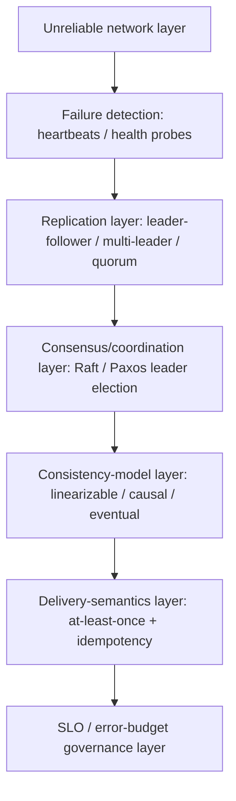
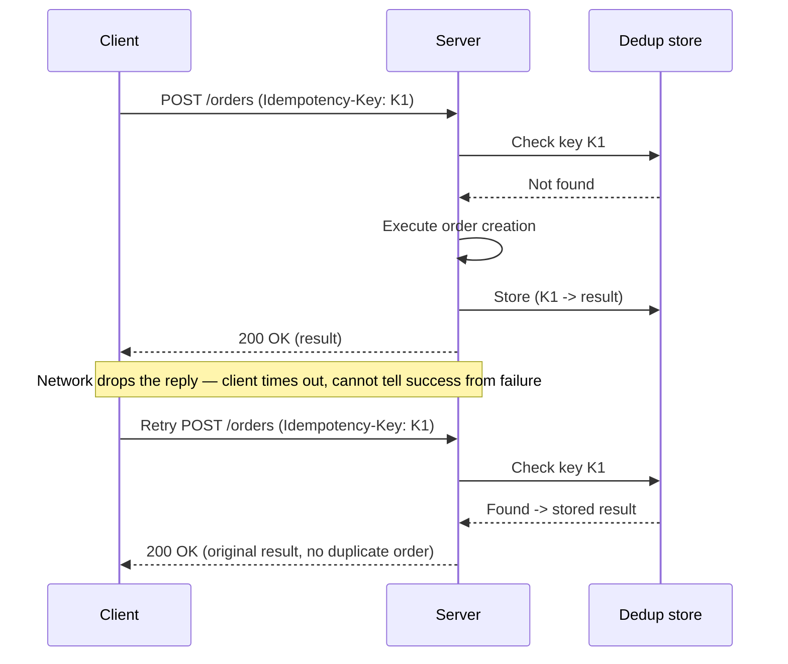
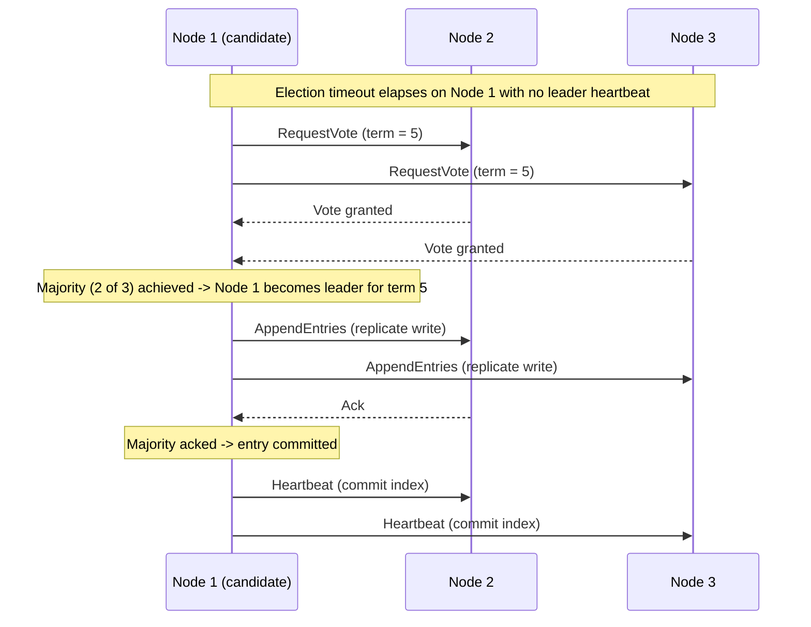

# Distributed Systems Primer

> Part of the **Enterprise Data & AI Architecture Handbook** · Phase-00 — Foundations & Prerequisites · Chapter 08.
> Estimated study time: **60 min reading + ~5h labs**.
> **Prerequisites:** read [Networking Fundamentals](04_Networking_Fundamentals.md) and [Concurrency and Parallelism](06_Concurrency_and_Parallelism.md) first.

---

## Executive Summary

Every retry storm that doubles database load, every "the payment succeeded but the order shows failed" support ticket, every Cosmos DB consistency-level dropdown, every Kafka `acks=all` configuration, and every incident retro that ends in "the network partitioned and both sides kept accepting writes" is a distributed-systems problem — and distributed systems are hard for one structural reason: **partial failure**. [Networking Fundamentals](04_Networking_Fundamentals.md#core-concepts) established that a network can drop, delay, reorder, or duplicate packets, and that TCP hides some — not all — of that from application code. [Concurrency and Parallelism](06_Concurrency_and_Parallelism.md#core-concepts) established how to coordinate multiple threads on one machine, where messages either arrive or the process crashed entirely. Distributed systems combine the worst of both: many independent machines, coordinating over an unreliable network, where a message going unanswered gives **no way to tell** whether the remote process crashed, is merely slow, or replied and the reply itself was lost. This single ambiguity — **you cannot distinguish "it's dead" from "it's slow" from "the network ate the reply"** — is the seed from which nearly every distributed-systems mechanism in this chapter grows: timeouts, retries, idempotency keys, quorums, consensus, and the CAP theorem's availability/consistency trade-off during a partition.

This chapter builds the vocabulary and mental models for reasoning about distributed data platforms precisely: why systems distribute at all (scale beyond one machine, availability beyond one failure domain, geo-locality beyond one region); the three failure models that bound what any protocol can tolerate (crash, omission, Byzantine); the latency/throughput/tail-latency vocabulary that makes "it's slow" a measurable, percentile-based statement instead of an anecdote; SLIs/SLOs/error budgets as the mechanism that turns reliability into an engineering trade-off instead of an unbounded aspiration; idempotency and the at-least/at-most/exactly-once delivery spectrum as the practical toolkit for surviving retries safely; and an introduction to consistency models and consensus (Paxos/Raft, leader election, quorum replication) as the machinery that lets multiple machines agree on a single truth despite the partial-failure problem above.

The bias remains **Azure-primary (~60%)** — Azure Cosmos DB's five consistency levels and multi-region replication, Azure Service Bus/Event Hubs delivery guarantees and idempotent consumer patterns, Azure SQL/Cosmos DB change feed and the Saga pattern via Durable Functions, Azure Load Balancer/Front Door health-probe-driven failure detection, and Azure's Availability Zone/region-pair architecture — **~30% enterprise open source** (Kafka's ISR/quorum replication and exactly-once semantics, etcd/ZooKeeper/Raft-based coordination, Cassandra's tunable quorum consistency, CockroachDB/Spanner-style distributed SQL, gRPC retry policies) and **~10% AWS/GCP comparison-only**. By the end you will read a Cosmos DB consistency-level choice, a Kafka `acks`/ISR configuration, or a "duplicate order created" incident and know precisely which failure model, delivery semantic, or consistency guarantee is actually in play — and which one is missing.

**Bottom line:** distributed systems do not eliminate failure — they make an explicit, engineered choice about *which* failures are tolerated, *how* they are detected, and *what* the system does (block for consistency, or stay available and reconcile later) when detection is ambiguous. Architects who can name the failure model, the delivery semantic, and the consistency guarantee a design actually provides — rather than assuming a stronger one than what is engineered — build systems whose behavior under failure is predicted at design time, not discovered during an incident.

---

## Learning Objectives

By the end of this chapter you will be able to:

1. **Explain why systems distribute** (scale, availability, geo-locality) and identify which of the three motivations is actually driving a given architecture decision.
2. **Distinguish crash, omission, and Byzantine failure models** and identify which model a given protocol (TCP retransmission, Raft, a blockchain consensus algorithm) is designed to tolerate.
3. **Reason precisely about latency, throughput, and tail latency** using percentiles (p50/p95/p99/p99.9) rather than averages, and explain tail-latency amplification in fan-out architectures.
4. **Define SLIs, SLOs, SLAs, and error budgets** and use an error budget to make a concrete release/reliability trade-off decision.
5. **Apply idempotency keys and design idempotent operations** so that retries — inevitable in any distributed system — are safe by construction rather than a source of duplicate side effects.
6. **Distinguish at-most-once, at-least-once, and exactly-once delivery semantics**, explain why true exactly-once delivery is impossible across an unreliable network, and how exactly-once *processing* is achieved instead (idempotency + at-least-once).
7. **Explain the CAP theorem and PACELC precisely** (what is actually being traded, and only during a partition) and map Cosmos DB's five consistency levels onto this trade-off space.
8. **Explain consensus at an introductory level** (Paxos/Raft, leader election, quorum reads/writes) and why it is the mechanism that lets a distributed system have a single, agreed-upon source of truth despite partial failure.
9. **Translate these fundamentals into an Azure architecture** (Cosmos DB consistency-level selection, Service Bus idempotent consumers, multi-region failover) and defend the design in a staff/principal-level review.

---

## Business Motivation

Distributed-systems fundamentals are not academic — they directly determine incident frequency, data-correctness risk, and infrastructure spend:

- **Duplicate side effects from unsafe retries are a direct financial and trust cost.** A payment API retried without an idempotency key after a timeout (where the first attempt actually succeeded) can double-charge a customer — a defect traceable directly to a missing distributed-systems safeguard, not a coding typo.
- **Choosing a stronger consistency level than the workload needs is a direct, quantifiable latency and cost tax.** Cosmos DB's Strong consistency requires cross-region synchronous replication, materially raising write latency and reducing availability during a regional outage, compared to Session or Bounded Staleness — a choice that should be deliberate, not a default.
- **Undetected partial failure causes silent data divergence.** Two replicas that both believe they are the leader during a network partition ("split brain") can accept conflicting writes independently — a data-corruption incident that surfaces only during reconciliation, often days later.
- **SLOs and error budgets convert "how reliable should this be" from an unbounded aspiration into a funded engineering decision.** Without an explicit SLO, teams either over-invest in reliability the business does not need or under-invest and discover the gap during a customer-facing outage.
- **Tail latency, not average latency, determines customer-perceived performance in fan-out architectures.** A single slow dependency in a 20-service fan-out can dominate p99 latency for the entire request even though its own average latency looks fine — a business-visible slowdown invisible in an average-latency dashboard.

For an architect, distributed-systems fluency converts "make it more reliable" into "our current consistency level requires a cross-region round-trip on every write, costing us 40ms of p50 latency and $X/month in cross-region bandwidth, for a workload that our error budget shows only needs Session consistency" — a precise, defensible, and often cost-reducing engineering trade-off.

---

## History and Evolution

- **1978 — Leslie Lamport** publishes *Time, Clocks, and the Ordering of Events in a Distributed System*, introducing **logical clocks** and the "happens-before" relation — the foundational tool for reasoning about event ordering without synchronized physical clocks.
- **1985 — Fischer, Lynch, and Paterson (FLP)** prove the **FLP impossibility result**: in an asynchronous system with even one faulty process, no deterministic consensus protocol can guarantee both safety and termination — the theoretical ceiling every practical consensus algorithm (Paxos, Raft) must engineer around (typically via timeouts and randomization, trading guaranteed termination for practical liveness).
- **1988 — Leslie Lamport** develops **Paxos**, formally published in 1998 (*The Part-Time Parliament*) — the seminal, notoriously difficult-to-understand consensus algorithm underpinning most production distributed-coordination systems for the next two decades.
- **1998-2002 — Eric Brewer** proposes the **CAP theorem** (formally proven by Gilbert and Lynch in 2002): a distributed system can provide at most two of Consistency, Availability, and Partition tolerance simultaneously — reframed correctly over the following decade as "partition tolerance is not optional on a real network; the actual choice is Consistency vs. Availability *during* a partition."
- **2006 — Google's Bigtable and Amazon's Dynamo papers** popularize two divergent replication philosophies: Bigtable's strongly consistent, single-master model versus Dynamo's eventually consistent, leaderless, quorum-based, highly-available model — directly shaping Cassandra (Dynamo-derived) and HBase (Bigtable-derived).
- **2007 — Amazon's Dynamo paper** formalizes **quorum replication** ($W + R > N$), **vector clocks** for causality tracking, and **hinted handoff** for temporary node unavailability — mechanisms still directly present in Cassandra, Cosmos DB, and Riak.
- **2012 — Google's Spanner paper** introduces **TrueTime** (a globally synchronized clock with bounded uncertainty via GPS/atomic clocks) enabling globally consistent, externally consistent transactions at scale — proving strong consistency and geo-distribution are not mutually exclusive, at the cost of specialized infrastructure.
- **2013-2014 — Diego Ongaro and John Ousterhout** publish **Raft** (*In Search of an Understandable Consensus Algorithm*), explicitly designed as an easier-to-understand, equivalent-power alternative to Paxos — rapidly becoming the default consensus algorithm for new systems (etcd, Consul, CockroachDB, Kafka's KRaft mode).
- **2014-2015 — Cosmos DB's precursor (Azure DocumentDB) and later Cosmos DB itself** introduce **five tunable consistency levels** (Strong, Bounded Staleness, Session, Consistent Prefix, Eventual) as a first-class, per-workload product decision rather than a single fixed guarantee — a direct commercial embodiment of the CAP/PACELC trade-off space.
- **2017-2020 — service meshes (Istio, Linkerd)** and **the Saga pattern's mainstream enterprise adoption** address distributed-transaction and retry/timeout concerns (circuit breaking, retry policy, idempotency-aware routing) as reusable infrastructure rather than per-service hand-rolled code.
- **2021-2026 — Kafka's KRaft mode** removes the ZooKeeper dependency in favor of Kafka's own Raft-based metadata quorum, and **distributed SQL platforms** (CockroachDB, Google Spanner, Azure Cosmos DB for PostgreSQL) continue mainstreaming globally-distributed strong consistency as an increasingly accessible default rather than a specialized, Google-scale-only capability.

---

## Why This Technology Exists

Distributed-systems mechanisms exist because a single machine has hard, physical limits, and because coordinating multiple machines over an unreliable network introduces a specific new failure class that must be engineered around, not assumed away:

- **Distribution across machines exists** because a single machine has a ceiling on compute, memory, storage, and — critically — availability (it *is* a single point of failure); scaling beyond that ceiling, or surviving the failure of any one machine, requires more than one.
- **Distribution across geographies exists** because network latency is bounded by the speed of light ([Networking Fundamentals](04_Networking_Fundamentals.md#core-concepts)) — no amount of engineering makes a round-trip from Singapore to a single US-based server fast, so serving global users with low latency requires serving them from *near* them.
- **Failure models (crash, omission, Byzantine) exist** because different environments warrant fundamentally different trust and cost trade-offs: a trusted internal data center can assume nodes fail by crashing (cheap to tolerate), while a public blockchain with untrusted, potentially malicious participants must tolerate nodes that lie (expensive to tolerate) — using the wrong model wastes engineering effort or, worse, leaves an actual threat unaddressed.
- **Timeouts, retries, and idempotency exist** because the fundamental ambiguity of partial failure — "did that request fail, or is it just slow?" — cannot be resolved with certainty over an unreliable network; the practical answer is to retry (accepting the request might already have succeeded) and make that retry *safe* via idempotency, rather than trying to eliminate the ambiguity itself.
- **Consistency models and consensus exist** because multiple replicas holding a copy of the same data must have an agreed rule for what "the current value" means when they temporarily disagree (during replication lag or a partition) — without an explicit, named consistency model, "the current value" is undefined and different clients can observe different, contradictory truths.
- **SLIs/SLOs/error budgets exist** because "make it reliable" is not an engineering requirement until it is a number — a target with a measurable indicator turns reliability into a resource that can be spent, budgeted, and traded off against feature velocity, exactly like compute or headcount.

Without these mechanisms, any system spanning more than one machine would either silently corrupt data during a partition, fail entirely the moment any single node had a problem, or provide no predictable answer to "how reliable is this, actually."

---

## Problems It Solves

- **Surviving the failure of any single machine** — replication and failover ensuring a hardware failure, VM reboot, or AZ outage does not translate into a customer-visible outage.
- **Serving a global user base with acceptable latency** — geo-distributed replicas and Azure Front Door/Traffic Manager routing requests to the nearest healthy region, keeping round-trip latency close to the physical light-speed floor rather than a single distant region's floor.
- **Scaling beyond a single machine's compute/storage ceiling** — sharding/partitioning distributing data and load across many machines that collectively exceed what any one machine could hold or process.
- **Making retries safe despite an ambiguous "did it succeed?" signal** — idempotency keys ensuring a retried request has the *same effect* as the original, whether or not the original actually succeeded.
- **Providing a single, agreed value despite replicas temporarily disagreeing** — consensus algorithms (Paxos/Raft) and quorum reads/writes giving a precise, provable answer to "what is the current, agreed state" even while individual replicas' local copies briefly diverge.
- **Turning "how reliable is it" into a measurable, fundable engineering target** — SLOs and error budgets converting an open-ended aspiration into a concrete number that governs release pace and reliability investment.

---

## Problems It Cannot Solve

- **It cannot beat the speed of light.** No replication or consensus protocol makes a genuinely synchronous cross-continent round-trip fast — geo-distribution reduces latency for *local* reads by serving from a nearby replica; it does not eliminate the physics for any operation that must coordinate globally and synchronously.
- **It cannot make the CAP theorem's trade-off go away.** During an actual network partition, a system must choose to either refuse some requests (favoring consistency) or risk serving stale/conflicting data (favoring availability) — no engineering effort produces a third option *during* the partition itself; the choice can only be made explicit and appropriate to the workload.
- **It cannot resolve the FLP impossibility result in the general case.** No deterministic, guaranteed-terminating consensus protocol exists for a fully asynchronous system with even one faulty node — practical systems (Raft, Paxos) sidestep this with timeouts and randomized election delays, trading a theoretical liveness guarantee for a practically-almost-always-terminating one.
- **It cannot make exactly-once *delivery* possible across an unreliable network.** The receiver can never distinguish a genuine retry from a first attempt without some retained state (an idempotency key/dedup table) — "exactly-once" in production systems is always exactly-once *processing*, engineered from at-least-once delivery plus idempotency, not a network-level guarantee.
- **It cannot substitute for correct application-level idempotency design.** Message brokers, retries, and consensus protocols provide the *plumbing* for safe retries; they do not automatically make a specific business operation (e.g., "increment inventory by 1") idempotent — that remains an application-level design responsibility (e.g., redesigning as "set inventory to N" or checking an idempotency key).
- **It cannot make a Byzantine-fault-tolerant protocol free.** BFT consensus (tolerating lying/malicious nodes) requires materially more messages, replicas, and latency than crash-fault-tolerant consensus (Raft/Paxos) — using it where a trusted-internal-network crash-fault model would suffice is a real, avoidable cost.

---

## Core Concepts

### 8.1 Why distribute: scale, availability, geo-locality

Three genuinely distinct motivations drive distribution, and conflating them leads to the wrong architecture: **scale** (a single machine cannot hold the data or serve the request volume — solved by partitioning/sharding load and data across many machines); **availability** (a single machine is a single point of failure — solved by replication, so a copy of the data/service survives any one machine's failure); and **geo-locality** (physical distance to the user dominates latency — solved by placing replicas near users, e.g., Azure paired regions and Front Door's anycast routing). A system needing only availability (e.g., a low-traffic but business-critical internal service) does not need sharding; a system needing only scale within one region does not need multi-region geo-replication. Naming which of the three is actually the driver prevents over-engineering (unneeded geo-replication cost) or under-engineering (sharding for scale while leaving a single-region single point of failure).

### 8.2 Failure models: crash, omission, Byzantine

A **failure model** defines the set of ways a component is assumed to fail, and every protocol's guarantees are only valid under its assumed model. **Crash (fail-stop) failure** — a node simply stops responding and never sends incorrect information; the simplest, cheapest-to-tolerate model, sufficient for most enterprise internal systems (Raft, Paxos, most database replication assume this). **Omission failure** — a node (or the network) may drop messages (a request or a reply) without the node itself crashing — the model that directly motivates timeouts and retries, since a dropped reply is indistinguishable from a crashed sender without further information. **Byzantine failure** — a node may behave *arbitrarily*, including sending false or contradictory information to different peers (maliciously or due to corruption) — the strongest, most expensive model to tolerate, requiring $3f+1$ replicas to tolerate $f$ Byzantine nodes (versus $2f+1$ for crash faults) and materially more message rounds (PBFT and blockchain consensus algorithms target this model). Enterprise data platforms overwhelmingly assume crash/omission failure within a trusted network boundary (Azure's internal replication, Kafka's ISR) and reserve Byzantine-fault-tolerant protocols for genuinely adversarial, multi-party-trust contexts (permissioned blockchain, cross-organization settlement) — applying BFT where crash-fault tolerance suffices is a common, costly over-engineering mistake.

### 8.3 Partial failure and the fallacies of distributed computing

**Partial failure** — the defining characteristic of distributed systems — is the condition where some components of a system have failed while others continue operating normally, and the observer often cannot immediately tell which is which. This is qualitatively different from a single-machine crash (an all-or-nothing event) and is the root cause of split-brain, duplicate processing, and lost-update bugs. L. Peter Deutsch's **Fallacies of Distributed Computing** (the network is reliable; latency is zero; bandwidth is infinite; the network is secure; topology doesn't change; there is one administrator; transport cost is zero; the network is homogeneous) catalog the false assumptions engineers new to distributed systems tend to bake into designs — each fallacy, taken as true, leads directly to a design that breaks in production the first time the corresponding assumption is violated (a network blip, a topology change during a region failover, a bandwidth-constrained cross-region link).

### 8.4 Time, clocks, and ordering

Physical clocks on different machines are never perfectly synchronized (clock drift, NTP correction jitter) — using wall-clock timestamps to order events across machines is a common, subtly incorrect pattern (`if (eventA.timestamp < eventB.timestamp)` can be wrong if the two machines' clocks disagree by more than the events' actual time gap). **Lamport logical clocks** provide a simple counter-based "happens-before" partial order — sufficient to detect causality (did A definitely happen before B) but not to order genuinely concurrent, causally-unrelated events. **Vector clocks** extend this to detect *concurrent* (causally unrelated) updates precisely — used by Dynamo-style systems (Cassandra, Riak, and Cosmos DB's conflict-resolution machinery) to detect when two replicas received genuinely conflicting concurrent writes requiring explicit conflict resolution, versus one write that causally followed and superseded the other. Google Spanner's **TrueTime** sidesteps the ordering problem differently — using GPS/atomic-clock-synchronized physical clocks with a bounded, known uncertainty interval, then waiting out that uncertainty before committing, trading a small, bounded latency cost for genuinely global, externally-consistent transaction ordering.

### 8.5 Latency, throughput, tail latency

**Latency** is the time for a single operation to complete; **throughput** is the rate of operations completed per unit time — the two are related but distinct, and a system can have high throughput with high latency (a batch pipeline) or low latency with low throughput (a lightly-loaded API). Latency must be reported as **percentiles** (p50/median, p95, p99, p99.9), never a single average — an average hides the shape of the distribution, and it is specifically the tail (p99+) that determines customer experience in high-fan-out systems. **Tail-latency amplification**: if a single user request fans out to 20 backend calls, and each call has a 1% chance of taking 1 second (its p99), the *request's* probability of hitting at least one slow call is $1 - 0.99^{20} \approx 18\%$ — the fan-out request's *effective* p18 looks like each dependency's p99, a direct, quantifiable reason why tail latency, not average latency, dominates in microservice/fan-out architectures. This directly extends the latency ladder established in [Networking Fundamentals](04_Networking_Fundamentals.md#core-concepts) (same-datacenter vs. cross-region round-trip costs) up into application-level, multi-call request behavior.

### 8.6 SLIs, SLOs, SLAs, and error budgets

An **SLI** (Service Level Indicator) is a directly measured metric (e.g., "proportion of requests completing under 300ms," "proportion of requests returning 2xx"). An **SLO** (Service Level Objective) is an internal target for that SLI over a window (e.g., "99.9% of requests under 300ms over 30 days"). An **SLA** (Service Level Agreement) is an SLO with a contractual, usually financial, consequence for missing it (e.g., Azure's published service SLAs with service-credit remedies). The **error budget** is the complement of the SLO (100% - SLO = the allowed failure rate, e.g., 0.1% for a 99.9% SLO) — a concrete, spendable resource: if the error budget is not exhausted, the team can ship riskier changes faster; if it is exhausted, release velocity should slow in favor of reliability work, an explicit, pre-agreed trade-off rather than an ad hoc argument during an incident retro. This is the mechanism that converts "be more reliable" from an unbounded aspiration into a governed, numeric trade-off against feature velocity.

### 8.7 Idempotency

An operation is **idempotent** if performing it multiple times has the *same effect* as performing it once — `PUT /users/123 {name: "Alice"}` is naturally idempotent (repeating it leaves the same end state); `POST /orders` (create a new order) is naturally *not* idempotent (repeating it creates duplicate orders). Because retries are unavoidable in any system with omission failures (§8.3, §8.9), non-idempotent operations must be made idempotent explicitly — the standard mechanism is an **idempotency key**: the client generates a unique key per logical operation (e.g., a UUID), the server persists a record of keys it has already processed and their result, and a retried request with the same key returns the *original* result without re-executing the operation's side effects. Azure Service Bus, Stripe's payments API, and most enterprise payment/order-creation APIs implement exactly this pattern — idempotency is the single most cost-effective safeguard against the duplicate-side-effect class of distributed-systems bugs.

### 8.8 Retries, backoff, and jitter

A **retry** re-attempts a failed (or ambiguously-failed, per §8.3) operation. A **naive fixed-interval retry** across many clients synchronizes into a **retry storm** — all clients retrying at the same instant, amplifying load on an already-struggling dependency and potentially causing a full outage from a partial one (a well-documented cascading-failure pattern). **Exponential backoff** (doubling the wait interval on each successive retry, typically capped at a maximum) reduces the *rate* of retry pressure over time; **jitter** (adding randomization to the backoff interval) desynchronizes many clients' retries from each other, preventing the thundering-herd effect that pure exponential backoff alone does not solve. Combined with a **circuit breaker** (stop attempting a call entirely, failing fast, once a dependency's failure rate crosses a threshold, then periodically probe for recovery), this triad — exponential backoff, jitter, circuit breaking — is the standard resilience pattern implemented by Polly (.NET), resilience4j (JVM), and Azure SDKs' built-in retry policies.

### 8.9 Delivery semantics: at-most-once, at-least-once, exactly-once

**At-most-once delivery** sends a message/request once and does not retry on failure — simple, but silently loses messages on any transient failure (acceptable only for genuinely disposable data, e.g., best-effort metrics). **At-least-once delivery** retries until acknowledged — guarantees no message is lost, but guarantees duplicates are possible (a retry after an unacknowledged-but-actually-successful send) — the default, and generally correct, choice for enterprise messaging (Kafka's default producer/consumer semantics, Azure Service Bus's default `PeekLock` mode). **Exactly-once delivery**, in the strict network-level sense, is **impossible** in an asynchronous system with omission failures — the FLP-adjacent argument: the sender can never know with certainty whether an unacknowledged message was received, so it must either risk losing it (at-most-once) or risk duplicating it (at-least-once); there is no third network-level option. What production systems call **"exactly-once processing"** (Kafka's transactional producer/idempotent producer + consumer offset commit as one atomic unit, Azure Service Bus sessions with duplicate detection) is always **at-least-once delivery plus idempotent processing** (§8.7) — the illusion of exactly-once is achieved at the application/processing layer, never at the network layer, and understanding this distinction prevents the common mistake of assuming a broker's "exactly-once" feature makes non-idempotent downstream side effects safe by itself.

### 8.10 Consistency models

A **consistency model** is a contract about what values reads are allowed to return relative to prior writes, across possibly-replicated copies of the same data. **Linearizability (strong consistency)** — the strongest, most intuitive model: every operation appears to take effect instantaneously at some point between its start and end, and all clients see the same global order of operations, as if there were only a single copy of the data — expensive (requires synchronous cross-replica coordination) but simplest to reason about. **Sequential consistency** — all clients see operations in *some* single consistent global order, but that order need not respect real-time ordering across clients (a slightly weaker, cheaper guarantee than linearizability). **Causal consistency** — operations that are causally related (one happened-before another, per §8.4) are seen in that order by all clients, but causally unrelated (concurrent) operations may be seen in different orders by different clients — enough to prevent nonsensical anomalies (seeing a reply before the comment it replies to) while allowing more replication flexibility than linearizability. **Eventual consistency** — the weakest common guarantee: if writes stop, all replicas *eventually* converge to the same value, with no bound on how long "eventually" takes and no ordering guarantee in the meantime — cheap and highly available, appropriate for workloads tolerant of stale reads (a product catalog, a social media "like" count). Cosmos DB's five consistency levels (Strong, Bounded Staleness, Session, Consistent Prefix, Eventual) are, precisely, five named, selectable points along this same spectrum, each with an explicit latency/availability/staleness trade-off documented per level.

### 8.11 The CAP theorem and PACELC

The **CAP theorem** (Brewer, 2000; proven by Gilbert & Lynch, 2002) states a distributed data system can provide at most two of: **Consistency** (every read receives the most recent write or an error), **Availability** (every request receives a non-error response, without guarantee it is the most recent write), and **Partition tolerance** (the system continues operating despite arbitrary network message loss between nodes). The commonly-misunderstood correction: on any real network, partitions *will* happen — partition tolerance is not optional, so the actual, only-during-a-partition choice is **Consistency vs. Availability**: when a network partition splits replicas, a CP system refuses requests it cannot guarantee are consistent (favoring correctness over uptime), while an AP system continues serving requests from both sides of the partition (favoring uptime over guaranteed-fresh data, resolving divergence after the partition heals). **PACELC** (Abadi, 2010) extends this with the observation that the trade-off is not confined to partitions: **P**artition — choose **A** or **C**; **E**lse (no partition) — choose **L**atency or **C**onsistency, since even without a partition, strong consistency requires synchronous cross-replica coordination that adds latency compared to an eventually-consistent design. PACELC is the more complete lens for everyday (non-partitioned) system design decisions, since most operational time is spent *without* an active partition, and the latency/consistency trade-off is live every single request.

### 8.12 Replication strategies

**Single-leader (leader-follower) replication** — one designated leader accepts all writes and propagates them to followers, which serve reads (optionally stale) — simple, avoids write conflicts by construction, but the leader is a single point of write availability, and failover requires leader election (§8.13). **Multi-leader replication** — multiple nodes (often one per data center/region) each accept writes independently and replicate to each other asynchronously — improves write availability and geo-locality (writes accepted locally in each region) at the cost of needing explicit **conflict resolution** for concurrent writes to the same record (last-write-wins, vector-clock-based merge, or application-defined merge logic). **Leaderless (quorum) replication** (Dynamo-style, Cassandra, Cosmos DB's underlying replica-set model) — any replica can accept a write; a write is considered successful once acknowledged by $W$ of $N$ replicas, and a read queries $R$ replicas and reconciles; choosing $W + R > N$ guarantees every read overlaps with the most recent write's replica set (**quorum overlap**), providing strong-consistency-like guarantees without a single leader, at the cost of read-side reconciliation logic and, if $W + R \leq N$, an explicit trade toward availability/latency over guaranteed-fresh reads.

### 8.13 Consensus, leader election, and quorum

**Consensus** is the problem of getting a set of distributed nodes to agree on a single value (or a single, ordered sequence of values) despite some nodes failing or messages being delayed/lost — the mechanism underlying leader election, distributed locks, and strongly-consistent replicated logs. **Paxos** (Lamport) solves this via a two-phase (prepare/promise, then accept/accepted) majority-quorum protocol — provably correct but notoriously difficult to implement and reason about correctly in its full multi-round ("Multi-Paxos") production form. **Raft** (Ongaro & Ousterhout) achieves equivalent guarantees with a design explicitly optimized for understandability: a single elected **leader** (chosen via randomized-timeout election among followers, preventing split votes) handles all writes, replicates a log to followers, and a write is committed once acknowledged by a **majority quorum** — the same majority-quorum principle underlying Paxos, packaged with an explicit, easier-to-reason-about leader role. Both require a majority ($\lceil (N+1)/2 \rceil$ of $N$ nodes) to be reachable to make progress — the direct reason production consensus clusters use odd node counts (3 or 5, not 2 or 4): a 3-node cluster tolerates 1 failure with a functioning majority of 2; a 5-node cluster tolerates 2 failures with a majority of 3, materially better fault tolerance per additional node than an even count provides. etcd, Consul, ZooKeeper (Paxos-derived ZAB), and Kafka's KRaft metadata quorum are all production Raft/Paxos-family implementations underpinning distributed coordination and configuration in enterprise platforms.

### 8.14 Distributed transactions and partitioning

A transaction spanning multiple independently-failable services or data stores cannot use a single-machine ACID transaction; two patterns address this. **Two-Phase Commit (2PC)** — a coordinator asks all participants to "prepare" (vote to commit or abort), and only if all vote to commit does it issue a "commit" to all — provides atomicity across services but blocks all participants if the coordinator fails between phases (a genuine availability hazard, and why 2PC is rare in modern loosely-coupled architectures). The **Saga pattern** — a sequence of local transactions, each with a defined **compensating action** to undo it, executed either via **choreography** (each service reacts to the previous step's event) or **orchestration** (a central coordinator, e.g., Azure Durable Functions, explicitly sequences steps and triggers compensations on failure) — trades strict atomicity for availability and loose coupling, accepting a window of temporary inconsistency (mitigated by making intermediate states visible/acceptable, or invisible via careful UX design) in exchange for not blocking on a distributed 2PC coordinator. **Partitioning/sharding** (splitting a dataset across many nodes by a partition key, directly extending the partitioning vocabulary from [Concurrency and Parallelism](06_Concurrency_and_Parallelism.md#611-data-parallelism-partitioning-strategies)) is what makes horizontal scale possible at all — and cross-partition transactions/queries are precisely the case where 2PC or Saga-style coordination becomes necessary, since no single-node ACID transaction can span partitions.

---

## Internal Working

**How a client detects a "failed" request when it cannot tell dead from slow.** A client issues a request and starts a timeout timer. If no response arrives before the timeout, the client has no way to distinguish: (a) the request never arrived (network drop), (b) the request arrived, was processed, but the *reply* was dropped, or (c) the server is simply slow and will still reply. This is precisely the ambiguity in §8.3; the client's only correct response is to retry an *idempotent* operation (§8.7) — retrying a non-idempotent one risks duplicating the side effect of case (b).

**How Raft elects a leader and commits an entry.** Each node starts as a follower with a randomized **election timeout**; if no heartbeat arrives from a leader before the timeout expires, the node becomes a candidate, increments its term, and requests votes from peers. A candidate receiving votes from a **majority** becomes leader for that term and begins sending periodic heartbeats (suppressing further elections). A client write is appended to the leader's log and replicated to followers; once a **majority** of nodes have persisted the entry, the leader considers it **committed** and applies it to its state machine, then informs followers to do the same on their next heartbeat — the majority-quorum requirement is precisely what guarantees a committed entry survives the failure of any minority of nodes.

**How Cosmos DB's Session consistency actually works.** Session consistency guarantees a single client session always sees its *own* writes (read-your-writes) and monotonically advancing reads, by having the client SDK track a **session token** (a logical sequence number per partition) with every write and present it on subsequent reads — the server ensures any replica serving that read has caught up to at least that token before responding, guaranteeing the session-level guarantee without requiring the strongest, cross-session Strong consistency's full synchronous quorum on every operation.

**How an idempotency-key-based API prevents duplicate order creation.** The client generates a UUID before the first attempt and includes it as an `Idempotency-Key` header on every retry of the same logical request. The server, on receiving a request with a given key for the first time, executes the operation and stores `(key -> result)` durably, atomically with the operation itself (same database transaction). A retried request with the same key is detected before re-executing the business logic, and the *originally stored result* is returned directly — the operation's side effect (order creation) happens at most once, regardless of how many times the client retries after an ambiguous timeout.

---

## Architecture

The relevant distributed-systems architecture, layered from the network up to application-level guarantees, for an Azure-hosted data/AI platform:

1. **Network layer** — the unreliable transport ([Networking Fundamentals](04_Networking_Fundamentals.md#core-concepts)) that can drop, delay, reorder, or duplicate packets — the physical source of every ambiguity this chapter addresses.
2. **Failure detection layer** — heartbeats, health probes (Azure Load Balancer/Front Door), and timeout-based liveness checks that convert "no response yet" into an actionable (if imperfect) "probably failed" signal.
3. **Replication layer** — leader-follower, multi-leader, or leaderless/quorum replication (§8.12) determining how many copies of data exist and how writes propagate between them.
4. **Consensus/coordination layer** — Raft/Paxos-based leader election and quorum commit (§8.13) providing a single agreed value/log despite node failures — etcd, ZooKeeper, Kafka KRaft, Cosmos DB's internal replica-set coordination.
5. **Consistency-model layer** — the explicit guarantee (linearizable, causal, eventual, or a named Cosmos DB level) that the replication/consensus layers below are engineered to provide to application code.
6. **Delivery-semantics layer** — at-least-once messaging plus application-level idempotency (§8.7, §8.9) providing safe retries end-to-end across the whole request path.
7. **SLO/error-budget layer** — the measured, governing contract (§8.6) that determines how much of the failure this whole stack still exhibits is acceptable, and what response (slow down releases, invest in reliability) is triggered when it is not.

An incident is almost always localized by asking **at which of these seven layers** the symptom first appears — a genuine network partition (layer 1), a false-positive failure detection triggering an unneeded failover (layer 2), replication lag causing stale reads (layer 3), a leader-election storm (layer 4), an application reading with a weaker consistency level than it assumed (layer 5), a duplicate side effect from a non-idempotent retry (layer 6), or an SLO breach that should have triggered a reliability-focused sprint before it did (layer 7).

---

## Components

| Component | Role | Concrete instantiation |
|---|---|---|
| **Heartbeat / health probe** | Liveness signal between nodes | Azure Load Balancer health probes, Raft leader heartbeats |
| **Leader** | Single node coordinating writes/log order | Raft leader, Kafka partition leader, Cosmos DB partition leaseholder |
| **Quorum** | Minimum acknowledging replica set for a decision | Raft majority, Dynamo-style $W$/$R$ quorum |
| **Replication log** | Ordered, durable record of state changes | Raft log, Kafka partition log, Cosmos DB change feed |
| **Idempotency key / dedup store** | Prevents duplicate side effects on retry | `Idempotency-Key` header + server-side result cache, Service Bus duplicate detection |
| **Circuit breaker** | Fails fast once a dependency is unhealthy | Polly `CircuitBreakerPolicy`, resilience4j `CircuitBreaker` |
| **Vector clock / session token** | Tracks causality / read-your-writes state | Dynamo/Cassandra vector clocks, Cosmos DB session tokens |
| **Coordinator / orchestrator** | Sequences a multi-step distributed transaction | Durable Functions orchestrator (Saga), 2PC transaction coordinator |
| **SLO / error budget tracker** | Measures and governs acceptable failure rate | Azure Monitor availability/latency SLIs, an error-budget burn-rate alert |

---

## Metadata

Distributed-systems "metadata" that drives correctness and coordination decisions:

- **Replica-set and leader metadata** — which node is currently the leader/leaseholder for a given partition (Cosmos DB partition leaseholders, Kafka partition leader, Raft's current term and leader ID) — the authoritative answer to "who do I send this write to right now."
- **Consistency-token metadata** — Cosmos DB session tokens, vector clocks, Lamport timestamps — the state needed to reason about causality and staleness without relying on unsynchronized wall-clock time.
- **Idempotency-key metadata** — the durable `(key -> result)` store, with a retention/expiry policy (keys are not kept forever) balancing duplicate-prevention guarantees against unbounded storage growth.
- **SLO/error-budget metadata** — the rolling-window SLI measurements and remaining error budget, the live number that should gate release velocity per §8.6.
- **Partition-map metadata** — which partition key ranges live on which physical nodes (Cosmos DB's partition key range map, Kafka's partition-to-broker assignment) — required by any client/router to send a request to the correct node.

Good distributed-systems observability starts with this metadata: leader-election frequency, quorum-acknowledgment latency, and error-budget burn rate are all metadata-observable well before they become a user-visible outage.

---

## Storage

- **Replicated storage is the physical substrate every consistency model and consensus algorithm coordinates.** The B-tree/LSM-tree/WAL storage engines from [Storage Systems Fundamentals](05_Storage_Systems_Fundamentals.md#core-concepts) exist per-replica; replication and consensus are the layer *above* storage that keeps multiple such engines' contents agreeing.
- **The replication log is itself a storage structure** — Raft's log and Kafka's partition log are both append-only, durable, sequentially-written structures directly analogous to a write-ahead log, just replicated across machines rather than local to one.
- **Idempotency-key stores require their own retention policy** — an unbounded dedup table is a storage-growth liability; enterprise implementations expire keys after a bounded window (e.g., 24 hours) sized to comfortably exceed the maximum plausible client retry duration.

---

## Compute

- **Consensus and quorum operations consume compute and I/O for coordination, not business logic** — every Raft commit's majority-acknowledgment round-trip, and every Cosmos DB Strong-consistency write's cross-region quorum, is compute/network overhead purely in service of the consistency guarantee chosen, directly trading off against the raw compute available for application logic.
- **Idempotency-key lookups add a read-before-write compute cost to every request** — a small, bounded, and generally worthwhile cost compared to the cost of a duplicate side effect, but a real, measurable addition to request-handling compute.
- **Saga orchestration (Durable Functions) consumes compute to track long-running, multi-step transaction state** — materially different resource profile from a single-node ACID transaction's brief lock-hold duration.

---

## Networking

- **Every consistency and consensus guarantee in this chapter is ultimately bounded by the network fundamentals in [Networking Fundamentals](04_Networking_Fundamentals.md#core-concepts)** — quorum round-trip latency is bounded below by the physical round-trip time between replicas, and cross-region strong consistency inherits the cross-region latency floor directly.
- **Network partitions are not a hypothetical edge case — they are a certainty at sufficient scale and time horizon**, per the CAP theorem's premise (§8.11); designing as though "the network is reliable" (Deutsch's first fallacy, §8.3) is the single most common root cause of split-brain incidents.
- **Health-probe-driven failure detection (Azure Load Balancer, Front Door) must be tuned against false positives** — an overly aggressive probe interval/threshold can misclassify a transient network blip as a node failure, triggering an unnecessary and potentially disruptive failover.

---

## Security

- **Idempotency keys must be scoped per-client/per-principal, not globally**, or one client could replay another's idempotency key to read (or worse, trigger side effects tied to) another client's original request result — a real authorization boundary, not just a correctness mechanism.
- **Byzantine-fault-tolerant consensus is a security control, not just a reliability one**, in genuinely multi-party, zero-trust contexts (permissioned blockchain, cross-organization settlement) — using crash-fault-tolerant consensus (Raft) in a context with an actual adversarial-participant threat model is a real, exploitable security gap, not merely a reliability choice.
- **Retry logic must not leak information through timing or error-message differences** — a distributed authentication/authorization check's retry and circuit-breaker behavior should not allow an attacker to distinguish "invalid credentials" from "service temporarily down" in ways that aid an enumeration attack.
- **Multi-region replication must respect data-residency and sovereignty requirements** — Cosmos DB's geo-replication and Azure region-pair choices must be reviewed against regulatory constraints (GDPR, data-residency mandates) before enabling, since replication silently creates additional physical copies of regulated data.

---

## Performance

Distributed-systems-driven performance levers, in priority order:

1. **Choose the weakest consistency level the workload can correctly tolerate** — every step from Eventual toward Strong consistency (§8.10) adds real, measurable latency via additional required round-trips/quorum coordination; defaulting to Strong "to be safe" is a direct, avoidable latency (and cost) tax.
2. **Design for tail latency, not average latency, in fan-out architectures** — apply the tail-latency-amplification math (§8.5) to any request fanning out to multiple dependencies, and set per-dependency timeouts/hedged-request strategies accordingly.
3. **Use exponential backoff with jitter, never fixed-interval retries**, to avoid retry-storm amplification of an already-degraded dependency (§8.8).
4. **Co-locate consensus-cluster members within a low-latency network boundary** — Raft/Paxos quorum latency is bounded by the slowest majority member's round-trip; spreading a consensus cluster across high-latency links directly and unavoidably slows every commit.
5. **Minimize idempotency-key lookup overhead** with an appropriately-indexed, TTL-bounded store — a full-table-scan dedup check is a self-inflicted performance regression.
6. **Right-size read replica count and staleness bound** against actual read-latency requirements, rather than defaulting to the maximum available replica count "for safety."

**Worked example.** An order-processing API, on a transient network blip causing widespread request timeouts, saw client-side retry logic (fixed 1-second interval, no jitter, all clients synchronized to the same retry schedule) amplify a 30-second partial network degradation into a 6-minute full outage, as retry load repeatedly re-saturated the already-recovering service on each synchronized retry wave. Switching to exponential backoff with full jitter eliminated the synchronized retry waves; a subsequent, similar network blip degraded gracefully with no customer-visible outage.

---

## Scalability

- **Sharding/partitioning (§8.14) is the primary scale lever**, but every cross-shard operation (a cross-partition query, a distributed transaction) reintroduces coordination cost — a system's *effective* scalability is bounded by how rarely its access patterns require cross-shard coordination, not merely by shard count.
- **Consensus clusters do not scale by adding more voting members** — a 3-node Raft cluster commits at the latency of its 2nd-fastest node; a 7-node cluster commits at the latency of its 4th-fastest node (a *stricter* requirement) — additional members increase fault tolerance, not throughput, and typically *reduce* commit latency headroom; read scalability is instead achieved via non-voting read replicas.
- **Multi-region active-active (multi-leader) architectures scale write availability geographically** at the cost of needing an explicit, tested conflict-resolution strategy (§8.12) — a design that "hasn't needed conflict resolution yet" has an untested assumption waiting to fail at higher write concurrency or genuine multi-region write traffic.
- **Error budgets (§8.6) should scale governance, not just infrastructure** — as a platform scales to more teams/services, an explicit, per-service SLO and error budget prevents reliability-vs-velocity trade-offs from becoming ad hoc arguments at scale.

---

## Fault Tolerance

- **Quorum-based replication and consensus are the core fault-tolerance mechanisms of this chapter** — a majority-based commit (§8.13) tolerates the failure of any minority of nodes without data loss or unavailability, the mathematical basis for choosing odd cluster sizes.
- **Idempotency is what makes retry-based fault tolerance safe** — without it, retrying after an ambiguous failure (§8.3) trades an availability problem for a correctness one (duplicate side effects); idempotency lets the system retry freely and safely.
- **Circuit breakers convert a slowly-failing dependency into a fast, contained failure** rather than a resource-exhausting cascade — threads/connections blocked waiting on a hung dependency are a common secondary cause of an otherwise-contained partial outage becoming a full one.
- **Split-brain (two nodes both believing they are the leader) is the most severe failure mode consensus protocols are specifically designed to prevent** — Raft's term-based leader election and majority-quorum commit make split-brain writes provably impossible as long as a majority of nodes correctly enforce the protocol; a hand-rolled "leader election" without a proper quorum guarantee (e.g., naive leader lease with a fixed timeout and no majority check) remains vulnerable to it.

---

## Cost Optimization (FinOps)

- **Consistency-level choice is a direct, quantifiable Azure cost lever** — Cosmos DB's Strong consistency requires synchronous cross-region replication and materially higher RU consumption per write than Session or Eventual; validating actual workload requirements against the weakest sufficient level (§8.10) is a genuine, often substantial cost optimization, not just a latency one.
- **Over-provisioned replica counts are a direct, avoidable cost** — more replicas than the required fault-tolerance level (§8.13) demands increase both storage/compute cost and (for synchronous replication) write latency without a corresponding reliability benefit.
- **Retry storms are a hidden cost multiplier** — the worked example in §Performance shows unbounded, synchronized retries amplifying both incident duration and the compute cost of serving repeated, redundant retried load; backoff-with-jitter is a cost control as much as a reliability one.
- **Cross-region replication bandwidth is a metered, often underestimated cost line item** — multi-region geo-replication (Cosmos DB, storage account geo-redundancy) should be sized against actual availability/latency requirements (§8.1) rather than enabled by default "for safety."

---

## Monitoring

Monitor the distributed-systems signals that predict incidents and SLO breaches before they page you:

- **Leader-election frequency and duration** (Raft/Paxos-based clusters, Kafka partition leader changes) — rising frequency indicates network instability or resource pressure on cluster members, both leading indicators of an approaching availability incident.
- **Replication lag** (seconds/records behind) per replica — the direct, quantifiable measure of how stale an eventually/session-consistent read might currently be.
- **Quorum/commit latency percentiles** — rising p99 commit latency on a consensus cluster predicts an approaching throughput or availability degradation before it becomes user-visible.
- **Retry rate and circuit-breaker open/close events** per dependency — a leading indicator of a downstream dependency degrading, often before its own health metrics show a clear problem.
- **SLO burn rate** (the rate at which the error budget is being consumed relative to the measurement window) — a burn-rate alert (e.g., "at this rate, the monthly error budget will be exhausted in 6 hours") is a materially better early-warning signal than a simple threshold alert on the raw SLI.

In Azure, surface these via **Azure Monitor** (Cosmos DB's built-in replication-lag and consistency metrics, Service Bus dead-letter and retry metrics, Application Insights availability tests and dependency tracking) and **Log Analytics** burn-rate queries correlating SLI degradation with specific dependency or region-level incidents.

---

## Observability

- **Distributed tracing (correlation IDs propagated across every hop) is the foundational observability primitive for distributed systems** — without a shared trace ID, reconstructing a single logical request's path across a fan-out of services (needed to diagnose tail-latency amplification, §8.5) is effectively impossible after the fact.
- **Idempotency-key hit rate is a directly observable signal of retry behavior** — a rising rate of idempotency-key *reuse* (i.e., detected retries) is a leading indicator of an upstream dependency or network path degrading, visible before the underlying cause's own metrics show it clearly.
- **Consensus-cluster observability must include per-node view of "who do I think the leader is"** — a transient disagreement (two nodes reporting different current leaders) is a direct, debuggable signal of a recent or ongoing partition/election event, and should be a first-class dashboard, not buried in raw logs.
- **SLO dashboards should show burn rate, not just current SLI value** — a burn-rate view answers "should we act now," while a raw SLI value alone does not indicate urgency relative to the remaining budget and measurement window.

---

## Governance

- **Mandate an explicit, documented consistency-level choice (with rationale) for every new data store/table**, reviewed at design time — "we used the default" should never be an acceptable answer to "why is this Eventual/Strong."
- **Require idempotency-key design for every new state-mutating API**, as a standard architecture review checklist item, not a per-team judgment call discovered after a duplicate-charge incident.
- **Define and publish SLOs and error budgets per service as an owned, platform-governed artifact**, with an agreed, pre-approved policy for what happens when a budget is exhausted (e.g., a release freeze pending reliability work).
- **Standardize retry/backoff/circuit-breaker policy libraries** (Polly, resilience4j configuration templates) platform-wide, rather than allowing each team to hand-roll retry logic with inconsistent (and sometimes storm-inducing) behavior.
- **Require a documented data-residency and replication-topology review** for any multi-region replication configuration, given the direct sovereignty and compliance implications of physically copying data across geographic/legal boundaries.

---

## Trade-offs

| Decision | Option A | Option B | Trade-off |
|---|---|---|---|
| Consistency model | Strong / linearizable | Eventual | Simple reasoning, higher latency/cost vs. lower latency/cost, requires reasoning about staleness |
| Replication topology | Single-leader | Leaderless/quorum | Simple conflict-free writes, single write bottleneck vs. write-available everywhere, requires conflict resolution |
| Failure model assumed | Crash-fault-tolerant | Byzantine-fault-tolerant | Cheaper, fewer replicas/rounds vs. tolerates malicious nodes, materially more expensive |
| Distributed transaction | Two-Phase Commit | Saga (compensating actions) | Strict atomicity, blocks on coordinator failure vs. available/loosely coupled, temporary inconsistency window |
| Retry strategy | Fixed-interval retry | Exponential backoff + jitter | Simple, risks retry storms vs. slightly more complex, storm-resistant |
| Delivery guarantee | At-most-once | At-least-once + idempotency | Simple, can silently lose data vs. no data loss, requires idempotent design |

---

## Decision Matrix

**Choosing a Cosmos DB / distributed-store consistency level:**

| Requirement | Strong | Session | Eventual |
|---|---|---|---|
| Financial ledger / inventory count requiring guaranteed-fresh reads | ✅✅ | ⚠️ (usually insufficient) | ❌ |
| Single-user session state (shopping cart, own-write visibility) | ⚠️ (unnecessarily costly) | ✅✅ | ⚠️ |
| Product catalog / social "like" count tolerant of brief staleness | ❌ (unnecessarily costly) | ⚠️ | ✅✅ |

**Choosing a distributed-transaction pattern:**

| Requirement | Two-Phase Commit | Saga (orchestrated) |
|---|---|---|
| Small number of tightly-coupled, always-co-located participants, strict atomicity required | ✅✅ | ⚠️ |
| Loosely-coupled microservices across team/service boundaries, availability prioritized | ❌ (coordinator becomes a bottleneck/SPOF) | ✅✅ |
| Long-running, multi-step business process (order → payment → shipment) | ❌ | ✅✅ |

---

## Design Patterns

- **Idempotency key** — client-supplied unique key + server-side dedup store, making retries of non-idempotent operations safe (§8.7).
- **Saga (orchestrated or choreographed)** — a sequence of local transactions with compensating actions, for distributed transactions that must remain available and loosely coupled (§8.14).
- **Circuit breaker** — fail fast once a dependency's failure rate crosses a threshold, with periodic probing for recovery, preventing cascading failure.
- **Quorum read/write** — read/write to a majority (or a tunable $W$/$R$) of replicas, guaranteeing overlap between the most recent write and any subsequent read (§8.12).
- **Leader election via consensus** — Raft/Paxos-based leader selection ensuring at most one node acts as leader at any term, preventing split-brain writes.
- **Bulkhead isolation** — partitioning resource pools (connections, threads) per dependency, so one failing dependency cannot exhaust resources needed by calls to healthy dependencies.
- **Hedged requests** — issuing a duplicate request to a second replica after a short delay if the first has not yet responded, directly mitigating tail-latency amplification (§8.5) at the cost of some extra load.

---

## Anti-patterns

- **Assuming a network call either succeeds or throws a clear "it failed" exception** — ignoring the ambiguous "no response yet" case (§8.3) and therefore never designing for safe retries.
- **Retrying a non-idempotent operation without an idempotency key** — the direct cause of duplicate-order/duplicate-charge incidents.
- **Fixed-interval retries with no jitter across many clients** — the direct cause of retry-storm cascading failures (§8.8).
- **Defaulting every data store to the strongest available consistency level "to be safe"** — an unexamined, often unnecessary latency and cost tax (§8.10, §Cost Optimization).
- **Hand-rolling a "leader election" with a simple timeout-based lease and no majority-quorum check** — vulnerable to split-brain under partition, lacking the provable guarantee a proper consensus protocol provides.
- **Using Two-Phase Commit across loosely-coupled, independently-deployed microservices** — creates a blocking dependency and a single coordinator failure mode across services that should otherwise fail independently.
- **Treating a message broker's "exactly-once" feature as sufficient without also making downstream side effects idempotent** — exactly-once processing requires both layers (§8.9); relying on only the broker's guarantee is a common, incomplete implementation.

---

## Common Mistakes

1. Confusing "the request timed out" with "the request failed," and building retry logic that assumes the operation never took effect.
2. Choosing a consistency level based on what "sounds safest" rather than the workload's actual read-your-writes/staleness-tolerance requirements.
3. Reporting average latency instead of percentiles, masking the tail-latency behavior that actually determines customer experience in fan-out architectures.
4. Setting an SLO without an accompanying error budget policy, so the target has no actual governance consequence when missed.
5. Assuming "exactly-once" delivery is a network-level guarantee rather than an application-level idempotency design responsibility.
6. Using an even number of nodes in a consensus cluster, providing worse fault-tolerance-per-node than an odd-numbered cluster.
7. Enabling multi-region active-active replication without a tested conflict-resolution strategy, discovering the gap only when concurrent conflicting writes actually occur.

---

## Best Practices

- **Design every state-mutating API to be idempotent, or add an explicit idempotency key**, as a default architectural requirement, not an afterthought added after an incident.
- **Choose the weakest consistency level the workload can correctly tolerate**, documented with explicit rationale at design time (§8.10).
- **Use exponential backoff with jitter and circuit breakers for every network-dependent call**, standardized via a shared resilience-policy library.
- **Define an SLO and error budget for every customer-facing service**, with a pre-agreed governance response for budget exhaustion.
- **Report and alert on latency percentiles (p95/p99), never averages alone**, especially for fan-out request paths.
- **Use an odd number of nodes for any consensus-based cluster**, sized against the actual fault-tolerance requirement, not an arbitrary default.
- **Test conflict-resolution and failover behavior explicitly**, via chaos-engineering-style partition/failure injection, rather than assuming untested failover code paths work correctly.

---

## Enterprise Recommendations

1. **Publish a consistency-level decision framework** (mapping workload characteristics to Cosmos DB/data-store consistency levels) as a mandatory architecture-review artifact for every new data store.
2. **Standardize a shared resilience library** (retry/backoff/jitter/circuit-breaker policies) across all services, eliminating inconsistent, hand-rolled retry logic as a platform-wide risk.
3. **Require idempotency-key design review** for every new state-mutating API endpoint as part of API design sign-off.
4. **Mandate SLOs and error budgets, with an explicit governance policy**, for every production service, reviewed quarterly against actual measured burn rate.
5. **Adopt the Saga pattern (via Durable Functions orchestration) as the default for cross-service business transactions**, reserving Two-Phase Commit for narrow, tightly-coupled, co-located exceptions only.
6. **Run regular chaos-engineering exercises** (simulated network partitions, node failures, region failover drills) validating that consensus, failover, and conflict-resolution code paths behave as designed under actual failure conditions, not just in theory.

---

## Azure Implementation

**Cosmos DB consistency-level selection (illustrative Bicep).**
```bicep
resource cosmosAccount 'Microsoft.DocumentDB/databaseAccounts@2024-05-15' = {
  name: 'contoso-orders-cosmos'
  location: resourceGroup().location
  properties: {
    consistencyPolicy: {
      defaultConsistencyLevel: 'Session'   // read-your-writes for the owning session,
                                            // materially cheaper than Strong cross-region quorum writes
      maxStalenessPrefix: 100000
      maxIntervalInSeconds: 300
    }
    locations: [
      { locationName: 'East US', failoverPriority: 0, isZoneRedundant: true }
      { locationName: 'West Europe', failoverPriority: 1, isZoneRedundant: true }
    ]
    enableAutomaticFailover: true
  }
}
```

**Idempotent order-creation API with a dedup store (illustrative C#).**
```csharp
[HttpPost("orders")]
public async Task<IActionResult> CreateOrder(
    [FromHeader(Name = "Idempotency-Key")] string idempotencyKey,
    [FromBody] CreateOrderRequest request)
{
    // Check for a prior result under the same key BEFORE executing business logic.
    var existing = await _idempotencyStore.TryGetResultAsync(idempotencyKey);
    if (existing is not null)
    {
        return Ok(existing);   // Safe replay: same result, no duplicate side effect.
    }

    var order = await _orderService.CreateOrderAsync(request);

    // Persist the key -> result atomically with the order creation (same transaction).
    await _idempotencyStore.SaveResultAsync(idempotencyKey, order, ttl: TimeSpan.FromHours(24));

    return Ok(order);
}
```

**Durable Functions Saga orchestration with compensation (illustrative C#).**
```csharp
[Function(nameof(OrderSagaOrchestrator))]
public static async Task RunOrderSaga(
    [OrchestrationTrigger] TaskOrchestrationContext context)
{
    var order = context.GetInput<Order>();
    try
    {
        await context.CallActivityAsync("ReserveInventory", order);
        await context.CallActivityAsync("ChargePayment", order);
        await context.CallActivityAsync("ScheduleShipment", order);
    }
    catch (TaskFailedException)
    {
        // Compensating actions, executed in reverse — availability over strict atomicity.
        await context.CallActivityAsync("RefundPayment", order);
        await context.CallActivityAsync("ReleaseInventory", order);
    }
}
```

**Retry policy with exponential backoff and jitter (illustrative Polly / .NET).**
```csharp
var retryPolicy = new ResiliencePipelineBuilder()
    .AddRetry(new RetryStrategyOptions
    {
        MaxRetryAttempts = 5,
        BackoffType = DelayBackoffType.Exponential,
        UseJitter = true,                       // desynchronizes concurrent clients' retries
        Delay = TimeSpan.FromMilliseconds(200)
    })
    .AddCircuitBreaker(new CircuitBreakerStrategyOptions
    {
        FailureRatio = 0.5,
        MinimumThroughput = 20,
        BreakDuration = TimeSpan.FromSeconds(30)
    })
    .Build();
```

---

## Open Source Implementation

- **etcd / HashiCorp Consul** — production Raft implementations providing distributed configuration, service discovery, and leader election used broadly across Kubernetes (etcd is Kubernetes' own cluster-state store) and enterprise service-mesh infrastructure.
- **Apache ZooKeeper** — a Paxos-family (ZAB protocol) coordination service historically underpinning Kafka's cluster metadata and leader election (now superseded in modern Kafka by KRaft, Kafka's own Raft-based metadata quorum).
- **Apache Cassandra** — a Dynamo-derived, leaderless, tunable-quorum ($W$/$R$/$N$) database directly implementing §8.10-§8.12's consistency and replication vocabulary as first-class, per-query configuration.
- **CockroachDB** — a Raft-based distributed SQL database providing serializable, strongly-consistent transactions across a horizontally-sharded, geo-distributed cluster, a direct open-source analogue to Spanner's design goals.
- **Polly (.NET) / resilience4j (JVM)** — the reference retry/backoff/circuit-breaker resilience libraries directly implementing §8.8's patterns as reusable, tested components.

---

## AWS Equivalent (comparison only)

| Azure | AWS equivalent | Notes |
|---|---|---|
| Cosmos DB tunable consistency levels | DynamoDB (eventually/strongly consistent reads toggle) | Cosmos DB's five-level spectrum is materially more granular than DynamoDB's binary eventual/strong read choice. |
| Durable Functions Saga orchestration | AWS Step Functions (Saga pattern via state machine) | Comparable orchestrated-Saga capability; Step Functions uses a declarative JSON/YAML state machine rather than Durable Functions' code-based orchestration. |
| Azure Service Bus duplicate detection | Amazon SQS FIFO deduplication (content-based or explicit dedup ID) | Directly comparable idempotent-delivery mechanism at the messaging-infrastructure layer. |
| Azure region pairs + Cosmos DB multi-region | AWS Regions + DynamoDB Global Tables | Comparable multi-region active-active replication; conflict-resolution semantics (last-writer-wins by default in both) should be validated per workload regardless of provider. |

**Advantages of AWS:** DynamoDB Global Tables' conflict resolution and cross-region replication latency are well-documented and battle-tested at very large scale. **Disadvantages:** DynamoDB's consistency model is coarser (a binary toggle) than Cosmos DB's five explicit levels, offering less granular control over the latency/consistency trade-off per query. **Migration strategy:** re-validate the specific consistency guarantee required per access pattern — a direct migration from Cosmos DB's Session consistency to DynamoDB's eventually-consistent reads can silently weaken a read-your-writes guarantee the application implicitly depended on. **Selection criteria:** choose by existing cloud commitment and whether fine-grained, per-container consistency tuning (Cosmos DB) or DynamoDB's broader AWS-ecosystem integration better fits the platform's needs.

---

## GCP Equivalent (comparison only)

| Azure | GCP equivalent | Notes |
|---|---|---|
| Cosmos DB (globally distributed, tunable consistency) | Google Cloud Spanner (globally distributed, strongly consistent via TrueTime) | Spanner defaults to strong, externally-consistent transactions globally; Cosmos DB instead makes the consistency level an explicit, tunable per-workload choice. |
| Durable Functions orchestration | Cloud Workflows + Cloud Functions/Cloud Run | Comparable durable-orchestration capability; Cloud Workflows uses a YAML-based declarative definition. |
| Azure Service Bus / Event Hubs idempotent consumers | Google Cloud Pub/Sub (exactly-once delivery feature + ordering keys) | Pub/Sub's exactly-once delivery feature still requires idempotent downstream processing per §8.9's reasoning; it reduces, but does not eliminate, the need for application-level idempotency design. |

**Advantages of GCP:** Spanner's TrueTime-based design provides genuinely strong, externally-consistent global transactions without requiring the application to reason about weaker consistency levels — a materially simpler mental model for teams that need strong global consistency by default. **Disadvantages:** that same default strong-consistency design has no equivalent to Cosmos DB's ability to cheaply trade down to Eventual/Session consistency for workloads that do not need it, potentially over-paying in latency for undemanding workloads. **Migration strategy:** re-validate whether the target workload actually requires Spanner's default strong-consistency model, or whether it was over-provisioned in the source system and could adopt a cheaper, weaker consistency level as part of the migration. **Selection criteria:** choose Spanner when globally-consistent transactions are a hard product requirement; otherwise treat as comparison-only per this handbook's Azure-primary stance.

---

## Migration Considerations

- **Consistency-level semantics do not map one-to-one across providers** — Cosmos DB's five named levels, DynamoDB's binary toggle, and Spanner's default-strong model require an explicit, workload-by-workload re-validation of the actual guarantee needed, not an assumed equivalent mapping.
- **Idempotency and deduplication mechanisms differ in retention window and scope** (Service Bus duplicate detection window vs. SQS FIFO's 5-minute dedup interval vs. Pub/Sub's exactly-once feature) — re-validate that the target provider's retention window comfortably exceeds the maximum plausible client retry duration.
- **Orchestration/Saga authoring models differ structurally** between Durable Functions' code-based orchestration and Step Functions'/Cloud Workflows' declarative state machines — re-architect rather than directly translate.
- **Consensus/coordination infrastructure (etcd/ZooKeeper/KRaft) migrations require careful, staged membership changes** — abruptly replacing a coordination cluster risks a majority-quorum loss mid-migration, a genuine availability risk requiring a tested runbook, not an in-place swap.
- **Multi-region conflict-resolution behavior must be re-tested, not assumed**, when migrating multi-leader/active-active replication between providers, since default conflict-resolution strategies (last-writer-wins, vector-clock merge) differ in subtle, correctness-relevant ways.

---

## Mermaid Architecture Diagrams

**Diagram 1 — Layered distributed-systems architecture, network to error budget (architecture).**


**Diagram 2 — Ambiguous partial failure and the idempotent-retry resolution path (sequence).**


**Diagram 3 — Raft leader election and majority-quorum commit (state/sequence).**


---

## End-to-End Data Flow

Trace a single write from a client through replication, consensus, and eventual downstream consumption:

1. **Client sends a write with an idempotency key.** The client generates a unique key (§8.7) before the first attempt, guarding against duplicate side effects from any subsequent retry.
2. **The write reaches the current leader/leaseholder.** A router or SDK (Cosmos DB's partition-key routing, Kafka's partition leader lookup) directs the write to the node currently responsible for that partition's writes.
3. **The leader replicates and awaits quorum acknowledgment.** Per the chosen consistency level (§8.10) and replication topology (§8.12), the write is propagated to followers/replicas, and the leader waits for the required quorum (majority for Raft-based consensus, $W$ replicas for Dynamo-style quorum) before considering it committed.
4. **The client receives an acknowledgment — or does not.** If the reply is lost (an omission failure, §8.2), the client times out with no way to know whether the write actually committed, and retries using the *same* idempotency key.
5. **Followers/replicas eventually catch up.** Depending on consistency level, a read from a lagging replica may return a stale value (Eventual) or be guaranteed to wait for catch-up (Session's token check, Strong's synchronous quorum read).
6. **Downstream consumers process the change at-least-once.** A change-feed consumer (Cosmos DB change feed, a Kafka consumer) processes the committed write, itself subject to at-least-once delivery (§8.9) and therefore required to be idempotent in its own downstream side effects.
7. **SLO/error-budget tracking observes the whole path's latency and success rate**, the aggregate signal that governs whether this end-to-end flow's actual reliability matches its designed target (§8.6).

---

## Real-world Business Use Cases

- **Global e-commerce checkout.** Idempotency keys on payment/order-creation APIs preventing double-charges during client-side retry after a network blip, combined with Saga-orchestrated compensation (refund + inventory release) if a later step fails.
- **Multi-region SaaS platform availability.** Cosmos DB multi-region replication with Session consistency, and Azure Front Door health-probe-driven regional failover, keeping the platform available through a full regional outage with an acceptable, bounded staleness window.
- **IoT telemetry ingestion at scale.** Kafka/Event Hubs partitioned ingestion with at-least-once consumer semantics and idempotent downstream aggregation, tolerating individual broker/consumer failures without data loss.
- **Financial ledger consistency.** Strong or Bounded Staleness consistency (deliberately, not by default) for account-balance data where a stale or inconsistent read is a direct regulatory and correctness risk, accepted at the cost of higher write latency.
- **Distributed configuration/service discovery.** etcd/Consul-backed Raft consensus providing a single, agreed source of truth for service endpoints and feature flags across an entire Kubernetes/microservices fleet.

---

## Industry Examples

- **Amazon's Dynamo (2007) and its direct influence on Cassandra, Riak, and Cosmos DB** — the original production validation of leaderless, quorum-based, tunable-consistency replication at Amazon's retail scale, explicitly motivated by shopping-cart availability during network partitions taking priority over strict consistency.
- **Google Spanner's TrueTime** — proof that globally-distributed, externally-consistent strong transactions are achievable given specialized infrastructure (GPS/atomic clocks), directly informing Cosmos DB's and CockroachDB's later distributed-consistency designs.
- **Netflix's Chaos Monkey and broader Chaos Engineering practice** — deliberately injecting node/network failures in production to validate that failover, quorum, and circuit-breaker behavior actually work as designed, rather than trusting untested failure-handling code paths.
- **Stripe's idempotency-key API design** — a widely cited, directly-copied industry reference implementation of §8.7's idempotent-retry pattern for payment APIs.

---

## Case Studies

**Case 1 — The double-charged payment from an un-keyed retry.** A checkout service's client SDK retried a payment API call after a 30-second timeout with no idempotency key; the original request had actually succeeded server-side, and the retry created a second, duplicate charge. *Lesson:* every state-mutating, retryable API must have an idempotency key from day one, not added reactively after the first duplicate-charge incident.

**Case 2 — The retry storm that turned a blip into an outage.** As detailed in §Performance, fixed-interval, non-jittered client retries synchronized into repeated load spikes on an already-degrading service, extending a 30-second network blip into a 6-minute outage. *Lesson:* exponential backoff with jitter is not optional polish — it is the difference between a contained degradation and a cascading one.

**Case 3 — The split-brain from a hand-rolled leader lease.** A team implemented "leader election" as a simple database row with a timestamp and a fixed lease duration, without a majority-quorum check; during a network partition, both sides of the split independently renewed what they each believed was an uncontested lease, and both began accepting writes — a genuine split-brain data-corruption incident. *Lesson:* leader election requires a real, majority-quorum-based consensus protocol (Raft/Paxos or a managed equivalent); a timestamp-based lease without quorum is not a substitute.

**Case 4 — The Cosmos DB consistency-level cost surprise.** A team defaulted a new container to Strong consistency "to be safe," only to find write latency and RU consumption materially higher than a comparable Session-consistency container serving an equivalent workload with no actual read-your-writes requirement beyond a single user's own session. *Lesson:* consistency level should be a deliberate, documented, workload-driven choice (§8.10), not a default.

---

## Hands-on Labs

> Target ~5 hours. Use a local machine, an Azure sandbox subscription, or a local etcd/Raft playground.

**Lab A — Reproduce an ambiguous partial failure (45 min).**
1. Build a simple client-server pair; inject artificial network delay/drop on the *reply* path only, and observe that the client cannot distinguish a lost reply from a lost request or a slow server.

**Lab B — Build and test an idempotent API (60 min).**
2. Implement a non-idempotent "create order" endpoint, reproduce a duplicate-creation bug via a simulated retry, then add an idempotency-key + dedup store and verify the retry no longer duplicates.

**Lab C — Observe Raft leader election with etcd (60 min).**
3. Stand up a local 3-node etcd cluster, kill the current leader process, and observe the remaining nodes elect a new leader; then kill a second node and observe the cluster lose availability (no majority remains).

**Lab D — Configure and compare Cosmos DB consistency levels (60 min).**
4. Provision a Cosmos DB account (or emulator) with Session consistency, then Strong; write from one client and read from another, measuring observed latency and staleness behavior under each.

**Lab E — Reproduce a retry storm and fix it with backoff + jitter (45 min).**
5. Simulate many clients retrying a failing dependency on a fixed interval, observe the synchronized load spikes, then switch to exponential backoff with jitter and compare the load profile.

**Lab F — Implement a Saga with compensation (60 min).**
6. Build a three-step Durable Functions (or equivalent) orchestration with a deliberate failure injected at step 3, and implement compensating actions for steps 1-2, verifying the system reaches a consistent end state despite the failure.

---

## Exercises

1. Explain, using the "dead vs. slow" ambiguity, why a client cannot safely retry a non-idempotent operation without additional application-level state.
2. A distributed key-value store uses $N=5$ replicas with $W=3$, $R=2$. Does this configuration guarantee quorum overlap between the latest write and any subsequent read? Show the arithmetic.
3. Explain the difference between the CAP theorem's partition-time trade-off and PACELC's else-branch (non-partition) trade-off, with a concrete example of each.
4. A fan-out request calls 10 downstream services, each with a p99 latency-only-1%-of-the-time slow response. Estimate the probability the overall request experiences at least one slow call.
5. Explain why an even-numbered consensus cluster (e.g., 4 nodes) provides worse practical fault tolerance per node than an odd-numbered one (e.g., 3 or 5 nodes).
6. Describe a concrete business scenario where Eventual consistency is the *correct* choice, and one where it would be a correctness bug.
7. Explain why "exactly-once delivery" is impossible at the network level, and what combination of mechanisms production systems actually use to achieve "exactly-once processing."

---

## Mini Projects

- **MP1 — Idempotency-key middleware.** Build a reusable HTTP middleware (any language/framework) implementing the idempotency-key pattern (§8.7) generically for any POST endpoint, including TTL-based key expiry.
- **MP2 — Minimal Raft simulator.** Implement a simplified Raft leader-election and log-replication simulator (in-memory, simulated network delay/loss) demonstrating majority-quorum commit and leader failover.
- **MP3 — Consistency-level latency/staleness benchmark.** Build a benchmark harness against Cosmos DB (or a local multi-node database) measuring write latency and observed read staleness across at least two different consistency levels under identical load.
- **MP4 — Saga orchestrator with chaos injection.** Build a multi-step Saga orchestration with configurable random failure injection at each step, verifying compensating actions always restore a consistent end state across many randomized failure-injection runs.

---

## Capstone Integration

These distributed-systems fundamentals directly support the Phase-20 capstone (see [Introduction](01_Introduction.md)):

- **Data platform architecture decisions** (replication topology, consistency-level selection, multi-region design) rest directly on this chapter's CAP/PACELC, consensus, and replication vocabulary.
- **Pipeline reliability design** (idempotent consumers, retry/backoff policy, Saga-based cross-service workflows) applies §8.7-§8.9 and §8.14 directly to the capstone's ingestion and processing pipelines.
- **SLO/error-budget definition** for the capstone's own service(s) requires the precise SLI/SLO/error-budget vocabulary from §8.6, converting "make it reliable" into a specific, measurable, and defensible target.
- **Concurrency fundamentals** ([Concurrency and Parallelism](06_Concurrency_and_Parallelism.md#core-concepts)) compound directly with this chapter's consensus and quorum mechanisms — both are, at their core, coordination-under-uncertainty problems at different scales.

In the capstone you will justify consistency-level and replication-topology choices with explicit CAP/PACELC reasoning and measured latency/staleness trade-offs, not just a diagram.

---

## Interview Questions

**Engineer level**
1. What is the fundamental ambiguity that makes distributed systems harder than single-machine concurrent systems?
2. Name the three failure models (crash, omission, Byzantine) and give an example system that assumes each.
3. What is the difference between at-least-once and exactly-once delivery, and why is true exactly-once delivery impossible over an unreliable network?
4. What is an idempotency key, and what specific problem does it solve?
5. Why should latency be reported as percentiles rather than an average?

**Staff Engineer Questions**
6. Explain the CAP theorem precisely, including the common misunderstanding about partition tolerance being "optional."
7. Walk through how Raft achieves consensus, including why a majority quorum is required and why odd node counts are preferred.
8. Design an idempotent, retry-safe API for a payment-processing endpoint, including the dedup-store schema and TTL policy.
9. Explain PACELC and give a concrete example of the "else" (non-partition) latency/consistency trade-off in a system you have worked on.

**Architect Questions**
10. Design a multi-region active-active architecture for a global e-commerce platform, including consistency-level choice, conflict-resolution strategy, and failover behavior.
11. Choose between Two-Phase Commit and a Saga pattern for a cross-service order-fulfillment workflow, and justify the choice explicitly against the trade-offs in §Trade-offs.
12. Define an enterprise-wide SLO/error-budget governance policy, including what triggers a release freeze and who owns the decision.

**CTO Review Questions**
13. What consistency-level choices are currently in place across our most critical data stores, and are they deliberate, documented decisions or unexamined defaults?
14. What is our incident history involving duplicate side effects, split-brain, or retry storms, and what governance change would have prevented the most costly of them?
15. Are our SLOs and error budgets actually governing release velocity and reliability investment decisions, or are they numbers on a dashboard nobody acts on?

---

## Staff Engineer Questions

(Consolidated for interview prep — see items 6-9 above, plus:)
- Explain vector clocks and describe a concrete scenario where they detect a genuine write conflict that a simple last-write-wins timestamp comparison would silently and incorrectly resolve.
- Describe how you would diagnose whether a production latency regression is caused by a genuine capacity limit versus a consensus-cluster quorum-latency ceiling.
- Contrast choreography-based and orchestration-based Sagas, and explain the observability trade-offs of each at scale.

---

## Architect Questions

(See items 10-12 above, plus:)
- Produce an ADR for choosing Cosmos DB's Session consistency over Strong consistency for a multi-region order-management system.
- Define the enterprise's reference architecture mapping workload shape (financial ledger, session state, catalog data, telemetry) to the recommended consistency level and replication topology.

---

## CTO Review Questions

(See items 13-15 above, plus:)
- Present the business case for investing in chaos-engineering-style failover/partition testing versus continuing to rely on untested failover code paths.
- Assess the business risk of a split-brain or duplicate-side-effect incident (per the case studies) recurring in a customer-facing financial workflow, and the mitigations currently in place.

---

### Architecture Decision Record (ADR-0008): Adopt Cosmos DB Session Consistency for the Order Management Service

- **Context.** A multi-region order-management service, originally provisioned with Cosmos DB's Strong consistency "to be safe," was measured to have materially higher write latency (cross-region synchronous quorum on every write) and RU consumption than the workload's actual requirements — the service only needed each user's own session to reliably see its own writes (read-your-writes), not a global, cross-session, real-time-ordered view of every write.
- **Decision.** Migrate the order-management container from Strong to Session consistency, relying on the Cosmos DB SDK's automatic session-token propagation to guarantee read-your-writes and monotonic-read behavior within a user's session, while accepting that a *different* user's concurrent write may not be immediately visible to this user (an acceptable trade-off for this workload, per its actual business requirements).
- **Consequences.** *Positive:* measured p50 write latency dropped materially, and RU consumption per write decreased, directly reducing both latency and cost; the change required no application-code changes since the Cosmos DB SDK manages session tokens transparently. *Negative:* a small number of downstream consumers that were (incorrectly) relying on Strong consistency's global write-order guarantee for a cross-user leaderboard feature required a separate, explicit design fix (a dedicated Bounded-Staleness read path for that specific feature) — an example of the general risk that weakening consistency without an explicit audit of *all* dependent read paths can surface a previously-hidden implicit assumption. *Neutral:* the team documented an explicit consistency-level decision record (this ADR) as the new standard practice for any future consistency-level change, closing the "unexamined default" gap identified in Case 4.
- **Alternatives considered.** *Keep Strong consistency* (rejected: the measured latency/cost tax was not justified by the workload's actual read-your-writes-only requirement); *Eventual consistency* (rejected: would not have guaranteed read-your-writes for a user immediately after placing their own order, a genuine, customer-visible correctness requirement); *Bounded Staleness* (considered as a middle ground, ultimately not chosen as the container-wide default because it adds cross-region replication-lag-bound complexity the workload's actual requirements did not need, though adopted narrowly for the one cross-user leaderboard read path identified above).

---

## References

- Lamport, Leslie — *Time, Clocks, and the Ordering of Events in a Distributed System* (1978).
- Fischer, Lynch, Paterson — *Impossibility of Distributed Consensus with One Faulty Process* (1985, the FLP result).
- Lamport, Leslie — *The Part-Time Parliament* (Paxos, 1998).
- Ongaro, Diego & Ousterhout, John — *In Search of an Understandable Consensus Algorithm* (Raft, 2014).
- Gilbert, Seth & Lynch, Nancy — *Brewer's Conjecture and the Feasibility of Consistent, Available, Partition-Tolerant Web Services* (the CAP proof, 2002).
- Abadi, Daniel — *Consistency Tradeoffs in Modern Distributed Database System Design* (PACELC, 2012).
- DeCandia et al. (Amazon) — *Dynamo: Amazon's Highly Available Key-value Store* (2007).
- Corbett et al. (Google) — *Spanner: Google's Globally-Distributed Database* (2012).
- Kleppmann, Martin — *Designing Data-Intensive Applications* (replication, partitioning, consensus, and transactions chapters).
- Microsoft Learn — Cosmos DB consistency levels documentation, Durable Functions Saga pattern, Azure Service Bus duplicate detection.

## Further Reading

- Deutsch, L. Peter — *The Fallacies of Distributed Computing*.
- Brewer, Eric — *CAP Twelve Years Later: How the "Rules" Have Changed*.
- The Raft consensus algorithm's visualization site (`raft.github.io`) for an interactive walkthrough of leader election and log replication.
- Stripe Engineering blog — *Designing Robust and Predictable APIs with Idempotency* (the reference idempotency-key implementation).
- Netflix Technology Blog — Chaos Engineering practice and the Principles of Chaos Engineering.
- Handbook cross-references: [Networking Fundamentals](04_Networking_Fundamentals.md), [Concurrency and Parallelism](06_Concurrency_and_Parallelism.md), [Storage Systems Fundamentals](05_Storage_Systems_Fundamentals.md), [Introduction](01_Introduction.md).
