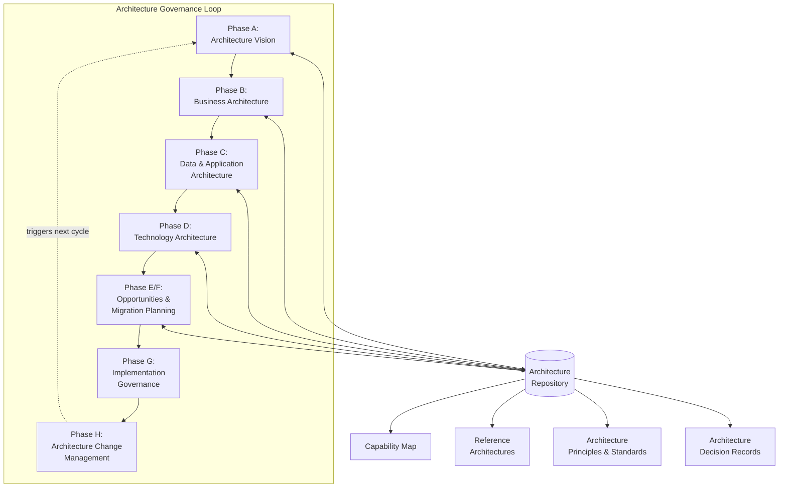
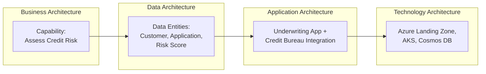
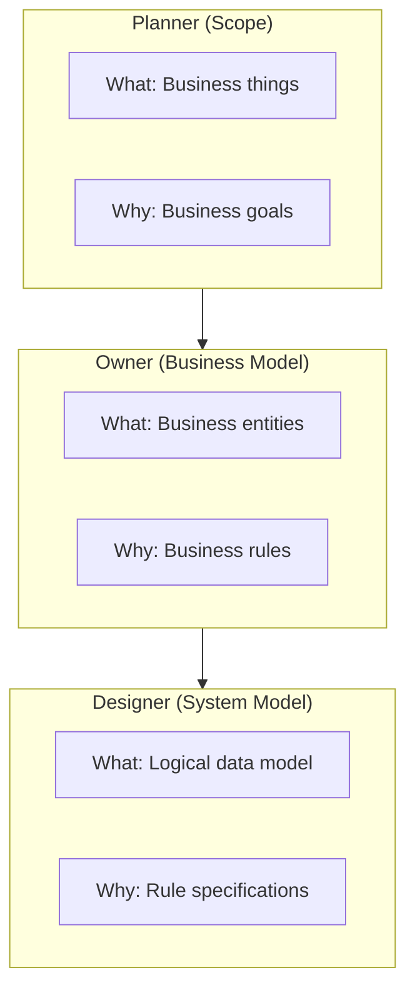
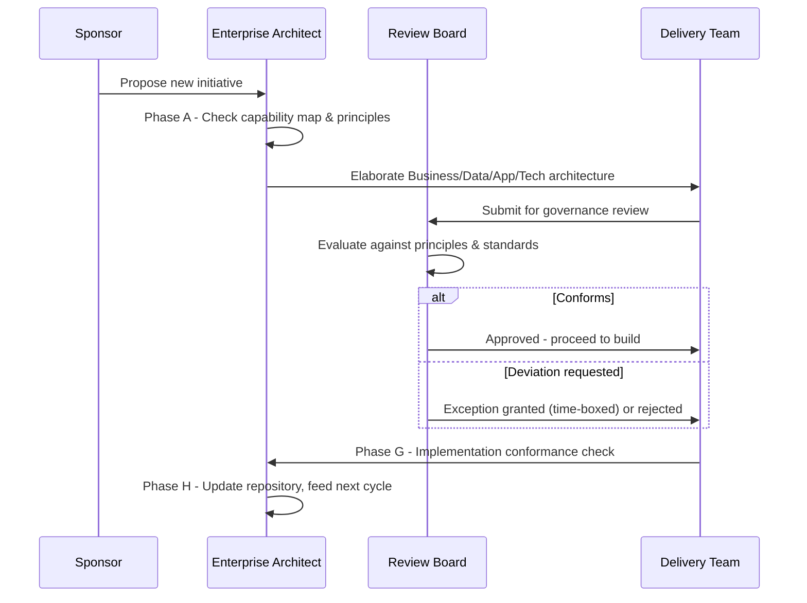

# Enterprise Architecture Foundations

> Part of the **Enterprise Data & AI Architecture Handbook** · Phase-01 — Enterprise Architecture Foundations · Chapter 01.
> Estimated study time: **60 min reading + ~3h labs**.
> **Prerequisites:** read [Distributed Systems Primer](../Phase-00/08_Distributed_Systems_Primer.md) first.

---

## Executive Summary

Every organization with more than one system already has an enterprise architecture — the only question is whether anyone has written it down, whether it was designed on purpose, and whether the person making a €5M platform decision can see it. [Distributed Systems Primer](../Phase-00/08_Distributed_Systems_Primer.md#core-concepts) built the vocabulary for reasoning precisely about one system's failure modes, consistency guarantees, and trade-offs. Enterprise architecture (EA) is the discipline that scales that same rigor from *one system* to *every system the business depends on* — the business capabilities they serve, the data they share, the applications that implement them, and the technology they run on — so that a hundred teams making independent, locally-reasonable decisions still add up to a coherent, governable, cost-effective whole instead of an unmanageable pile of point-to-point integrations and duplicated capabilities.

This chapter builds the frameworks and mental models an architect uses to reason about systems-of-systems: **TOGAF's Architecture Development Method (ADM)** as the iterative, repeatable process for producing and maintaining architecture; the **Zachman Framework** as a classification taxonomy that guarantees no perspective (why/what/how/who/where/when) or stakeholder (planner through worker) is silently omitted; the **four architecture domains** (business, data, application, technology) as the layered decomposition that lets a data/AI architect trace a business capability down to the Azure resource group that implements it; **reference architectures and capability maps** as reusable, pre-vetted patterns that convert "how should we build this" from a first-principles debate into a starting point; and **architecture principles and standards** as the durable, board-approved rules that make thousands of downstream decisions consistent without requiring a central architect to review every one of them.

The bias remains **Azure-primary (~60%)** — Azure Cloud Adoption Framework's own EA methodology, Azure Landing Zones as a concrete instantiation of technology architecture principles, Microsoft Purview for capturing the data architecture domain, and Azure DevOps/GitHub for architecture-as-code artifact management — **~30% enterprise open source and vendor-neutral standards** (TOGAF itself, ArchiMate as the modeling notation, the Zachman Framework, structurizr/C4 model tooling, Backstage for capability/service catalogs) and **~10% AWS/GCP comparison-only** (AWS Well-Architected Framework and Google Cloud Architecture Framework as parallel, less prescriptive alternatives to TOGAF's full ADM).

**Bottom line:** enterprise architecture is not a diagram-drawing exercise or a compliance gate — it is the discipline that makes a large organization's technology decisions *legible*: traceable from a business capability to the data it needs, the application that implements it, and the infrastructure that runs it, governed by explicit principles so that thousands of local decisions converge on a coherent whole rather than diverging into an unmanageable, unauditable sprawl. An architect who cannot place a proposed system within this structure — which capability it serves, which domain it belongs to, which principles constrain it, and which stakeholder view justifies it — cannot defend that system in a governance review, and cannot predict how it will interact with the dozens of other systems the enterprise already runs.

---

## Learning Objectives

By the end of this chapter you will be able to:

1. **Explain what enterprise architecture is and is not**, and distinguish it from solution architecture, software architecture, and IT strategy.
2. **Walk through TOGAF's Architecture Development Method (ADM)** phase by phase (Preliminary through Requirements Management) and identify which phase a given architecture activity belongs to.
3. **Apply the Zachman Framework's 6×6 matrix** to classify an architecture artifact by both interrogative (What/How/Where/Who/When/Why) and perspective (Planner/Owner/Designer/Builder/Subcontractor/Enterprise).
4. **Decompose an enterprise into the four TOGAF architecture domains** (Business, Data, Application, Technology — BDAT) and trace a single business capability through all four.
5. **Read and produce a capability map and a reference architecture**, and explain why reusing a vetted reference architecture reduces both delivery risk and review overhead.
6. **Write enforceable architecture principles** (not aspirational statements) with a rationale and implications, and apply them to evaluate a real design proposal.
7. **Locate the data/AI architect role within a typical EA operating model** — which artifacts they own, which they consume, and which governance boards they answer to.
8. **Translate EA frameworks into an Azure-concrete operating model** using the Cloud Adoption Framework and Azure Landing Zones, and defend that mapping in a staff/principal-level architecture review.

---

## Business Motivation

Enterprise architecture exists to prevent specific, expensive, recurring failure patterns — not as an academic exercise:

- **Uncoordinated capability duplication is a direct, quantifiable cost.** Without a capability map, three business units independently build three "customer 360" data marts with three different customer-matching logics — a discoverable, avoidable cost that surfaces only during a merger, an audit, or a failed cross-sell campaign.
- **Undocumented dependencies turn routine changes into incidents.** A schema change in an upstream system that no one knew fed a downstream regulatory report is an EA-traceability failure, not a coding defect — the application and data architecture layers were never connected in a way anyone could query.
- **Inconsistent technology choices multiply operational cost.** Ten teams choosing ten different message brokers, each with its own operational runbook, on-call training, and vendor contract, is a direct, avoidable OpEx cost that architecture principles and reference architectures exist specifically to prevent.
- **M&A and divestiture speed is gated by architecture legibility.** An organization that can produce an accurate capability map and application portfolio in a week integrates or carves out a business unit far faster — and far more cheaply — than one that must reverse-engineer its own systems first.
- **Regulatory and audit response time depends on traceability.** "Which systems touch PII, and which capability do they serve?" is an EA query, not a firefighting exercise — organizations without a maintained data architecture domain answer this by tasking a team to manually inventory systems under audit deadline pressure.

For a data/AI architect, EA fluency converts "we should build a lakehouse" into "the *Customer Analytics* and *Regulatory Reporting* capabilities in our capability map both require a governed, reusable *Curated Customer* data domain; the current state has this duplicated three times across business units at an estimated $2M/year in redundant compute and reconciliation effort; the reference architecture in our EA repository already specifies the target Azure pattern — this is an alignment and migration decision, not a greenfield build" — a precise, capability-anchored, board-defensible argument instead of a technology preference.

---

## History and Evolution

- **1987 — John Zachman** publishes *A Framework for Information Systems Architecture* in the IBM Systems Journal, proposing that information systems, like buildings or aircraft, benefit from multiple, distinct representations for different stakeholders (owner's blueprint vs. builder's construction drawing) — the origin of what became the **Zachman Framework**, a classification taxonomy rather than a process.
- **1990s — The Open Group** begins consolidating enterprise architecture practice, publishing the first version of **TOGAF (The Open Group Architecture Framework)** in 1995, itself derived from the US Department of Defense's TAFIM (Technical Architecture Framework for Information Management) — establishing TOGAF's early technology-architecture-heavy DNA.
- **2002 — TOGAF 8** introduces the **Architecture Development Method (ADM)** in its now-recognizable iterative-cycle form, elevating TOGAF from a technical reference model to a full architecture *process*, and formalizes the four architecture domains (Business, Data, Application, Technology — BDAT).
- **2009 — ArchiMate 1.0** is released by The Open Group as a dedicated, standardized **modeling notation** for enterprise architecture (distinct from BPMN for process or UML for software design) — giving TOGAF's BDAT domains a formal, tool-interoperable visual language.
- **2011 — TOGAF 9.1** becomes the most widely adopted version for a decade, formalizing the **Architecture Content Framework**, **Architecture Repository**, and **Architecture Governance** as first-class concepts alongside the ADM process itself.
- **2015-2018 — Capability-based planning and Business Architecture** (championed by the Business Architecture Guild's **BIZBOK**) gain prominence as a reaction to EA being perceived as too IT-centric — pushing capability maps and value streams into mainstream EA practice as the business-facing entry point into the ADM.
- **2018 — TOGAF 9.2** is a maintenance release clarifying content and structure; work begins on a more modular, digital-era successor.
- **2022 — TOGAF 10** is released, restructuring the standard into the **TOGAF Fundamental Content** (ADM, guidance, techniques) plus a series of modular, purchasable/downloadable guides, explicitly acknowledging **agile delivery, digital transformation, and cloud-native operating models** as first-class concerns rather than afterthoughts bolted onto a waterfall-era process.
- **2018-2024 — Cloud provider architecture frameworks mainstream** as parallel, more prescriptive alternatives for cloud-specific decisions: the **AWS Well-Architected Framework** (2015, expanded through this period), the **Azure Cloud Adoption Framework** and **Azure Well-Architected Framework**, and the **Google Cloud Architecture Framework** — each narrower than TOGAF (cloud-only) but far more concrete and directly actionable, now commonly used *alongside* TOGAF rather than instead of it, with TOGAF governing the enterprise-wide BDAT decomposition and the cloud framework governing execution within the Technology Architecture domain.
- **2020-2026 — EA practice increasingly absorbs data and AI governance** as first-class architecture domains (data mesh's domain-oriented ownership, AI/ML model governance, responsible-AI review boards) — reflecting that data and AI platforms are no longer a technology-architecture afterthought but a distinct governance concern spanning all four BDAT domains, directly motivating this handbook's treatment of the data/AI architect as an EA discipline in its own right.

---

## Why This Technology Exists

Enterprise architecture exists because organizations that grow past a handful of systems hit specific, structural coordination failures that no individual team, however skilled, can resolve locally:

- **A common vocabulary and classification exist** because "architecture" means something different to a CFO (what capabilities does this fund), an application owner (what does this system do), and a database engineer (what schema does this use) — without a shared framework (Zachman's rows and columns, TOGAF's BDAT domains), these stakeholders talk past each other, and no single artifact can be checked for completeness.
- **A repeatable method (the ADM) exists** because ad hoc, one-off architecture efforts produce artifacts that are inconsistent, incomparable across projects, and quickly stale — a defined, iterative process forces every architecture effort (however small) to at least consider stakeholders, current state, target state, gaps, and a migration plan, rather than jumping straight to a technology choice.
- **Explicit architecture domains (BDAT) exist** because a technology decision made without reference to the business capability it serves, or the data it must produce, routinely optimizes the wrong thing (a beautifully engineered system that serves a capability the business no longer needs) — the four-domain decomposition forces traceability from business intent down to infrastructure.
- **Reference architectures and capability maps exist** because reinventing "how do we build a customer-facing API" or "what capabilities does an insurance underwriting business unit need" from first principles, project after project, is a directly measurable waste of expert time and a source of inconsistent, unreviewed risk.
- **Written, enforceable architecture principles exist** because a governance board cannot review every one of the thousands of decisions engineers make daily — principles are the mechanism that lets local decisions self-align to enterprise intent without requiring central approval for each one.
- **Architecture governance exists** because principles and reference architectures without an enforcement mechanism (design authority review, exception process, architecture compliance review) decay into ignored documents within a year.

Without these mechanisms, an enterprise's technology estate does not stay simple by default — it accretes complexity, duplication, and undocumented dependency until a merger, an outage, or a regulatory audit forces an expensive, reactive discovery effort.

---

## Problems It Solves

- **Traceability from business capability to infrastructure** — the BDAT domain chain lets an architect answer "which systems, in which data centers/regions, implement the *Claims Processing* capability" precisely, not by memory or spelunking.
- **Coordinated technology investment** — a capability map with maturity/pain-point scoring turns "where should we invest next" from opinion into a prioritized, defensible portfolio decision.
- **Consistent, reviewable decision-making at scale** — architecture principles and reference architectures let hundreds of teams make consistent choices without a central bottleneck reviewing every decision.
- **Stakeholder-appropriate communication** — the Zachman Framework's perspective rows ensure a CFO-facing business capability view and an engineer-facing technology view of the *same* underlying architecture both exist and stay reconciled.
- **Faster, lower-risk change** — a current-state/target-state/gap analysis (the ADM's core mechanic) converts "we need to modernize" from a vague mandate into a scoped, sequenced migration roadmap with identified dependencies.
- **Portfolio rationalization** — an accurate application and data architecture inventory is the precondition for retiring duplicate systems, consolidating vendor contracts, and reducing run-cost without breaking a capability no one remembered depended on the system being retired.

---

## Problems It Cannot Solve

- **It cannot substitute for domain expertise.** Knowing that a "Payments" capability exists in a capability map does not tell you how to design a resilient, PCI-DSS-compliant payment processing system — EA frames *where* a decision fits; it does not replace the specialist (security architect, solution architect) who makes it.
- **It cannot make an organization move fast by itself.** A rigorous ADM cycle applied bureaucratically, with a governance board reviewing every minor decision, actively slows delivery — EA effectiveness depends on right-sizing governance to risk, not applying maximum ceremony everywhere.
- **It cannot fix a broken engineering culture.** Excellent architecture principles, ignored in practice because there is no enforcement or because delivery pressure routinely overrides them, produce no value — EA requires genuine organizational sponsorship and a credible governance/exception process, not just documentation.
- **It cannot predict technology change.** A target-state architecture defined for a 3-5 year horizon will be partially wrong by the time it is reached (new cloud services, new AI capabilities) — EA practice must build in periodic re-baselining (the ADM is explicitly a cycle, not a one-time exercise), not treat the target state as fixed.
- **It cannot replace agile, iterative delivery.** TOGAF's ADM is often mis-applied as a big-upfront-design waterfall gate — the modern, correct application is iterative and lightweight for well-understood domains, reserving heavyweight ADM rigor for genuinely novel, high-risk, cross-cutting decisions.
- **It cannot resolve organizational politics.** A capability map that reveals three business units duplicating a capability identifies the problem precisely — it does not, by itself, have the authority to consolidate budgets or teams; that requires executive sponsorship EA can inform but not command.

---

## Core Concepts

### 1.1 What enterprise architecture is (and is not)

**Enterprise architecture** is the discipline of describing an organization's business capabilities, data, applications, and technology, and their relationships, at a level of abstraction that lets leadership and architects make coordinated investment and design decisions across the whole enterprise — as distinct from **solution architecture** (designing one system to meet one set of requirements) and **software architecture** (structuring one codebase's components and their interactions). EA is *not* a set of diagrams for their own sake, not an IT-only concern (it explicitly includes business architecture), and not a one-time deliverable — it is a continuously maintained model plus a governance process. A useful test: solution architecture asks "how do we build this system correctly," while EA asks "should we build this system, does it duplicate an existing capability, which domain principles constrain it, and how does it fit into the target-state roadmap."

### 1.2 TOGAF and the Architecture Development Method (ADM)

**TOGAF** is the most widely adopted vendor-neutral EA framework, and its core is the **ADM** — an iterative cycle of phases: **Preliminary** (establish the architecture capability and principles), **Phase A — Architecture Vision** (scope, stakeholders, high-level vision, and approval to proceed), **Phase B — Business Architecture** (capabilities, value streams, organization), **Phase C — Information Systems Architectures** (split into **Data Architecture** and **Application Architecture**), **Phase D — Technology Architecture** (infrastructure, platforms), **Phase E — Opportunities and Solutions** (identify work packages and transition architectures), **Phase F — Migration Planning** (sequence and prioritize), **Phase G — Implementation Governance** (ensure delivery conforms to the architecture), **Phase H — Architecture Change Management** (monitor for change triggers, feed back into a new cycle), all wrapped by continuous **Requirements Management** at the center. Each phase produces defined artifacts (e.g., Phase B produces a business capability map and value streams; Phase D produces a technology target-state diagram) that feed the next phase and populate the **Architecture Repository** for reuse. The critical, often-missed point: the ADM is a **cycle**, not a linear waterfall — Phase H explicitly routes back to Phase A when a significant change trigger (an acquisition, a new regulation, a major technology shift) warrants a fresh iteration.

### 1.3 The Zachman Framework: a classification, not a process

Where TOGAF's ADM is a *process*, the **Zachman Framework** is a **classification taxonomy** — a 6×6 matrix crossing six interrogatives (**What** — data, **How** — function/process, **Where** — network/location, **Who** — people/roles, **When** — time/events, **Why** — motivation) against six stakeholder perspectives (**Executive/Planner**'s contextual scope, **Business Management/Owner**'s conceptual model, **Architect/Designer**'s logical model, **Engineer/Builder**'s physical model, **Technician/Subcontractor**'s out-of-context detailed representation, and the **Enterprise**'s functioning system). Each of the 36 cells represents a distinct, valid artifact — a Planner's "What" (a list of things important to the business) is a different, equally legitimate artifact from a Builder's "What" (a physical data model) describing the *same* underlying concept at a different level of abstraction for a different audience. Zachman's primary value is **completeness checking**: it lets an architect ask "do we have an artifact for every cell that matters to this initiative," surfacing gaps (e.g., a fully designed data model with no corresponding "Why" — motivation/business rule — documentation) that a process-only framework like the ADM does not explicitly force.

### 1.4 The four architecture domains: Business, Data, Application, Technology (BDAT)

TOGAF decomposes an enterprise into four layered domains, and tracing a single capability through all four is the core discipline a data/AI architect must master: **Business Architecture** — the capabilities, value streams, organization structure, and business processes (e.g., the capability "Assess Credit Risk"); **Data Architecture** — the logical and physical data assets and data management resources that support the business architecture (e.g., the "Customer," "Credit Application," and "Risk Score" data entities, their systems of record, and their governance); **Application Architecture** — the individual systems, their interfaces, and their relationships to core business processes (e.g., the underwriting application, the credit bureau integration service); **Technology Architecture** — the logical software/hardware capabilities (compute, storage, network, middleware) needed to support the deployment of business, data, and application services (e.g., the Azure Landing Zone, the AKS cluster, the Cosmos DB account). A well-formed EA repository lets an architect start from any layer and trace both up (this Cosmos DB account exists to serve the Application X, which implements Capability Y) and down (Capability Y is currently implemented by Application X, running on Cosmos DB in region Z) — this bidirectional traceability is EA's single most operationally useful property, and its absence is the most common real-world EA maturity gap.

### 1.5 Capability maps and value streams

A **business capability** is a stable "what the business does" statement, deliberately independent of *how* it is currently implemented or *which* org unit currently owns it (e.g., "Manage Customer Relationships" is a capability; "Salesforce CRM" is an application that currently implements part of it). A **capability map** is a hierarchical decomposition of an enterprise's capabilities (typically 2-3 levels deep) that stays stable for years even as the applications implementing each capability change — making it the most durable artifact in an EA repository and the natural anchor for portfolio and investment decisions ("which applications implement the *Regulatory Reporting* capability, and what is our total spend against it"). A **value stream** complements the capability map with an end-to-end, customer-outcome-oriented sequence of activities (e.g., "Quote to Cash," "Order to Delivery") that cuts across multiple capabilities and often multiple org units — value streams are the artifact that reveals cross-capability handoff friction a capability map alone does not show.

### 1.6 Reference architectures and architecture patterns

A **reference architecture** is a vetted, reusable architecture template for a recurring problem class (e.g., "batch lakehouse ingestion," "event-driven microservices on Azure"), pre-populated with the technology choices, integration patterns, and non-functional guardrails (security, scaling, DR) an organization has already decided are its default. Reference architectures exist at multiple levels of abstraction — an industry reference model (e.g., BIAN for banking, ACORD for insurance) provides a starting capability/data model for an entire sector; an internal enterprise reference architecture instantiates that further with the organization's actual approved Azure services and standards. Using a reference architecture converts a project's architecture review from "defend every design decision from first principles" to "confirm you followed the reference architecture, and justify any deviation" — a materially faster and more consistent governance interaction.

### 1.7 Architecture principles: rules, not aspirations

An **architecture principle**, correctly written, has three parts: a **statement** (a clear, testable rule — "Data is a shared enterprise asset, not owned by a single application"), a **rationale** (why this matters), and **implications** (what this requires in practice, including cost/effort trade-offs — "Applications must publish data through governed, discoverable interfaces rather than granting direct database access to consumers"). A principle that cannot be used to say "no" to a specific real proposal is not a principle — it is a slogan. TOGAF's illustrative principles set (e.g., "Maximize Benefit to the Enterprise," "Technology Independence," "Data is an Asset," "Data is Shared," "Common Use Applications") is a starting template, not a finished list — a real enterprise's principles must be specific enough to adjudicate an actual design review (e.g., "All new analytical workloads default to the enterprise lakehouse; a dedicated data mart requires an approved exception with a documented business justification").

---

## Internal Working

Mechanically, an EA practice operates as a repository-plus-governance loop, not a single document:

1. **Architecture Repository** — a structured store (in practice: a wiki, ArchiMate models in a modeling tool, or a service like Azure DevOps Wiki / Backstage backed by a Git repo) holding the capability map, reference architectures, principles, standards, and past architecture decisions, versioned so historical context (why did we choose this in 2022) is retrievable.
2. **Architecture Vision intake** — a new significant initiative triggers an ADM Phase A: stakeholders and scope are identified, and the initiative is checked against the existing capability map (does this duplicate an existing capability) and principles (does this violate a standing rule) before detailed design begins.
3. **Domain architecture elaboration** — Business, Data, Application, and Technology architects (or a single architect wearing multiple hats in a smaller organization) elaborate the relevant domain artifacts for the initiative, referencing (not re-deriving) existing reference architectures where one applies.
4. **Gap analysis and roadmap** — the initiative's target state is diffed against the current state to produce a gap list, which is sequenced into a migration roadmap (Phase E/F) — this is where dependencies on other in-flight initiatives are surfaced.
5. **Governance checkpoint** — a design authority or architecture review board evaluates the proposal against principles and standards, approving, requesting changes, or granting a documented, time-boxed exception.
6. **Implementation governance** — as the initiative is built, periodic conformance checks (Phase G) confirm the delivered system matches the approved architecture, catching drift before it becomes technical debt baked into production.
7. **Feedback and re-baseline** — completed initiatives update the repository (new reference architecture instance, updated capability map ownership, retired application removed from the portfolio), closing the loop for the next cycle.

---

## Architecture



This loop is deliberately cyclical: implementation governance and change management feed observations (drift, new regulatory triggers, technology shifts) back into a fresh architecture vision phase, rather than treating the target state as permanent.

---

## Components

- **Architecture Repository** — the versioned store of capability maps, reference architectures, principles, standards, and ADRs; in Azure-centric practice, typically Git-backed (Azure DevOps Repos/Wiki or GitHub) with ArchiMate/diagram-as-code artifacts alongside markdown.
- **Capability Map** — the stable, technology-independent hierarchy of what the business does, used as the anchor for portfolio and investment decisions.
- **Value Streams** — end-to-end, cross-capability activity sequences oriented around a stakeholder outcome, complementing the capability map's static view with a flow view.
- **Reference Architectures** — pre-vetted, reusable templates for recurring problem classes, instantiated per-project rather than re-derived.
- **Architecture Principles** — durable, testable rules with rationale and implications, used to adjudicate design proposals without requiring case-by-case central review.
- **Architecture Standards** — specific, mandated technology choices and configurations that implement the principles (e.g., "all PaaS databases must enable customer-managed keys").
- **Architecture Decision Records (ADRs)** — point-in-time records of a specific significant decision, its context, alternatives considered, and consequences (detailed in the next chapter, [Architecture Decision Records](../Phase-01/03_Architecture_Decision_Records.prompt.md)).
- **Architecture Review / Design Authority Board** — the governance body that reviews significant proposals against principles and standards, and grants or denies exceptions.
- **Domain Architects** — Business, Data, Application, Technology (and increasingly AI/ML) architects who own and elaborate their respective BDAT domain artifacts.
- **Enterprise Architect** — the role accountable for the coherence of the whole model across domains, chairing or feeding the review board, and maintaining the repository.

---

## Metadata

EA artifacts are themselves metadata about the enterprise, and their usefulness depends on being queryable, not just readable:

- **Capability-to-application mapping** — which applications implement which capability (many-to-many; most capabilities are partially implemented by several applications, a key finding surfaced by mapping).
- **Application-to-data mapping** — which applications are the system of record vs. system of reference for which data entities.
- **Application-to-technology mapping** — which Azure resources/regions/subscriptions host which application, essential for cost allocation, DR planning, and blast-radius analysis.
- **Principle-to-standard traceability** — which concrete standards implement which principle, so a principle's intent can be audited even as specific standards evolve.
- **Ownership metadata** — capability owner, application owner, data steward, and technology owner per artifact — without this, governance has no one to contact when a gap or conflict is found.
- **Lifecycle/status metadata** — current, target, or retiring status per application/capability, essential for portfolio rationalization decisions.

In Azure-centric practice, this metadata increasingly lives partly in **Microsoft Purview** (data assets, lineage, sensitivity classification) and partly in a dedicated EA tool or a Backstage-style service catalog, with the capability map and principles typically remaining in a wiki/ArchiMate model — the practical integration challenge is keeping these sources reconciled rather than silently diverging.

---

## Storage

EA artifacts require durable, versioned, access-controlled storage distinct from ad hoc slide decks:

- **Model files** (ArchiMate `.archimate`/Open Exchange XML, or diagram-as-code sources such as Structurizr DSL/Mermaid/PlantUML) stored in Git for versioning and diffability.
- **Markdown/wiki content** (principles, standards, capability descriptions) in Azure DevOps Wiki or a GitHub Pages/MkDocs site generated from the same repo, so documentation and models version together.
- **ADRs** as individual markdown files in the same repository as the code they govern (a well-established, low-friction pattern covered in depth in the next chapter).
- **Metadata catalog** (Microsoft Purview) for the data architecture domain specifically — sensitivity labels, lineage, glossary terms — queryable via API rather than only human-readable documents.

---

## Compute

EA practice itself has modest direct compute needs — the compute-relevant decisions are those the Technology Architecture domain makes on behalf of the rest of the enterprise:

- Modeling and documentation tooling (ArchiMate tools, wiki/static-site generators) runs on ordinary developer workstations or lightweight CI (Azure DevOps Pipelines/GitHub Actions building a docs site from source).
- The Technology Architecture domain is where enterprise-wide compute standards are set (e.g., "batch data processing defaults to Azure Databricks; ephemeral inference workloads default to Azure Container Apps") — these standards feed the reference architectures used across the Application Architecture domain.

---

## Networking

The Technology Architecture domain owns enterprise-wide networking topology decisions that every downstream application inherits:

- **Hub-and-spoke or Virtual WAN topology** standards (detailed in [Azure Networking](../Phase-03/04_Azure_Networking.prompt.md)) are set once at the EA/Landing Zone level, not re-decided per project.
- **Connectivity patterns to reference architectures** — e.g., a "batch lakehouse ingestion" reference architecture specifies whether source systems connect via private endpoint, VPN, or ExpressRoute, so each project instantiating the pattern inherits a pre-approved, pre-reviewed network design.
- **Segmentation principles** (e.g., "production and non-production workloads reside in separate subscriptions with no direct peering") are architecture principles enforced through Azure Policy at the landing zone level, not left to individual application teams.

---

## Security

EA is where enterprise-wide security principles are established and then inherited, not re-litigated, by every project:

- **Principles such as "Zero Trust by default," "Least privilege access," and "Data is classified before it is stored"** are written once at the EA principle level and made concrete through Technology Architecture standards (Azure AD Conditional Access baselines, Microsoft Purview sensitivity labels, mandatory Azure Policy initiatives).
- **Reference architectures embed security by construction** — e.g., a reference lakehouse architecture that mandates private endpoints, customer-managed keys, and Microsoft Entra ID-only authentication means every project instantiating it inherits these controls without a bespoke security review from scratch.
- **The architecture review board is a security gate**, not only a design-quality gate — proposals that bypass a mandated control (e.g., a public-endpoint storage account) are principle violations requiring an explicit, time-boxed, risk-accepted exception, not silent approval.

---

## Performance

EA's contribution to performance is indirect but significant — it shapes which performance trade-offs get made deliberately versus by accident:

- Reference architectures typically encode a validated, tested performance profile (e.g., "this event-streaming reference architecture handles up to N events/sec on the specified Event Hubs throughput-unit tier") — instantiating the pattern skips a from-scratch performance validation for the common case.
- Capability maps with maturity/pain-point scoring surface systemically underperforming capabilities (e.g., "Order Fulfillment" scored red for latency across three business units) as an investment priority, rather than each unit independently fighting the same symptom.
- Architecture principles can explicitly encode performance-related non-functional defaults (e.g., "customer-facing APIs target p99 < 300ms"), giving solution architects a concrete target inherited from EA rather than invented per project.

---

## Scalability

- The Technology Architecture domain sets enterprise-wide scalability defaults (e.g., "stateless services scale horizontally via AKS HPA; do not provision for peak by default — provision for p95 and autoscale for peak") that reference architectures then encode.
- Capability maps inform which capabilities warrant investment in a scalable, reusable platform versus a simpler, single-team solution — a low-volume internal capability does not need the same scalability investment as a customer-facing capability, and the capability map's usage/criticality metadata is what makes that distinction visible enterprise-wide.

---

## Fault Tolerance

- EA principles typically mandate a minimum resilience posture per criticality tier (e.g., "Tier-1 customer-facing capabilities require multi-region active-passive at minimum") — tying [Distributed Systems Primer](../Phase-00/08_Distributed_Systems_Primer.md#core-concepts)'s failure-model and consistency concepts to a business-criticality classification owned by the Business Architecture domain.
- Reference architectures embed the tested failover/DR pattern for their class of workload (e.g., a reference architecture for a Tier-1 API specifies Azure Front Door + multi-region App Service with a documented RTO/RPO), so individual projects inherit a validated fault-tolerance design instead of reinventing one under delivery pressure.

---

## Cost Optimization

- The capability map, cross-referenced with application and technology architecture, is the primary tool for finding **duplicate capability spend** — the single highest-leverage EA-driven cost optimization, because eliminating a genuinely duplicated system removes both licensing and operational cost, not just infrastructure spend.
- Architecture standards that mandate shared, multi-tenant platforms for common-use capabilities (e.g., "use the enterprise Databricks workspace; do not provision a dedicated cluster per team") directly reduce underutilized, per-team infrastructure — a common enterprise FinOps finding.
- A well-maintained application portfolio (Technology + Application Architecture domains) is the precondition for a defensible application rationalization program — you cannot retire what you cannot enumerate.

---

## Monitoring

EA's own health should be monitored, not assumed:

- **Repository staleness** — percentage of capability map entries, reference architectures, and principles not reviewed/updated within a defined cadence (e.g., 12 months) is a leading indicator of a decaying EA practice.
- **Governance throughput and exception rate** — a rising rate of approved principle exceptions, or a growing review-board backlog, signals either overly rigid principles (needing revision) or insufficient governance capacity.
- **Architecture conformance rate** — the percentage of delivered initiatives that passed Phase G implementation governance without material rework is a direct measure of whether upstream architecture guidance is actually actionable.

---

## Observability

- **Portfolio dashboards** (application count by capability, technology standard adoption rate, principle exception count over time) give EA leadership the same kind of aggregate, trend-based visibility that [Distributed Systems Primer](../Phase-00/08_Distributed_Systems_Primer.md#core-concepts)'s SLIs/SLOs give a single service — turning "is our EA practice working" into a measurable, trackable statement rather than an impression.
- **Traceability queries** should be a first-class capability of the repository (e.g., "list every application touching PII data that lacks a current data classification" as an actual runnable query against Purview + the application inventory) — an EA repository that can only be browsed, not queried, has materially less operational value during an audit or incident.

---

## Governance

Architecture governance is the enforcement mechanism without which principles and reference architectures decay into ignored documents:

- **Design Authority / Architecture Review Board** — reviews significant proposals (new platform, new capability, cross-domain change) against principles and standards; a lightweight, fast-tracked review for low-risk/well-understood patterns and a fuller review for genuinely novel, high-risk proposals — right-sizing this is essential to avoid EA becoming a delivery bottleneck.
- **Exception process** — a documented, time-boxed mechanism for approving a deviation from a principle or standard with an explicit risk acceptance and remediation plan, rather than either silently blocking delivery or silently ignoring the principle.
- **Conformance checkpoints** embedded in the delivery lifecycle (a lightweight architecture checklist at each major delivery gate) rather than a single, late, all-or-nothing review that arrives too late to influence the design cheaply.
- **RACI clarity** — who owns the capability map (typically a Business Architecture function or COO office), who owns technology standards (enterprise architecture / platform engineering), and who has final escalation authority when domains conflict (typically a CIO/CTO-chaired architecture board) must be explicit, or governance decisions have no clear final authority.

---

## Trade-offs

| Dimension | Heavyweight, Full-ADM Governance | Lightweight, Principle-Driven Governance |
|---|---|---|
| Speed of delivery | Slower — every initiative passes full review | Faster — most initiatives self-conform to published principles/patterns |
| Consistency | Very high — centrally enforced | Good but variable — depends on principle clarity and team discipline |
| Suitable for | Regulated, high-risk, cross-cutting platform decisions | Well-understood, lower-risk, team-level decisions |
| Governance cost | High — requires a staffed review board and process | Lower — requires investment in good self-service reference material instead |
| Risk of drift | Low if enforced consistently | Higher if principles are unclear or unenforced |

The mature answer is not "pick one" — it is tiering governance by risk and novelty: reserve full ADM rigor and board review for genuinely significant, cross-cutting, or high-risk decisions, and let well-understood, low-risk patterns self-conform against published reference architectures and principles with only a lightweight conformance check.

---

## Decision Matrix

| Situation | Recommended Approach |
|---|---|
| New capability with no existing reference architecture, cross-cutting impact | Full ADM cycle: Phase A vision through Phase D technology architecture, board-reviewed |
| New project instantiating an existing, approved reference architecture | Lightweight conformance check against the reference architecture; no full ADM cycle needed |
| Proposed deviation from a mandated standard | Formal, time-boxed exception request with documented risk acceptance |
| Ambiguous capability ownership discovered during an initiative | Escalate to Business Architecture / capability map owner before proceeding, not resolved ad hoc by the project team |
| Post-merger system rationalization | Full capability-map-driven portfolio analysis (Phase B/C artifacts) before any consolidation decision |
| Small, single-team, non-customer-facing internal tool | Principles-only self-service; EA review only if it touches shared data or a Tier-1 capability |

---

## Design Patterns

- **Capability-first scoping** — always start a new initiative by locating it on the existing capability map before any technology discussion, surfacing duplication early.
- **Reference-architecture-by-default** — solution architects instantiate an approved reference architecture and document *deltas*, rather than designing from a blank page; deltas are what governance review actually focuses on.
- **Principle-as-code where possible** — encode enforceable principles as Azure Policy definitions/initiatives so conformance is continuously and automatically checked, not only reviewed at a point-in-time gate.
- **Federated domain ownership, centralized coherence** — individual domain architects (data, application, technology) own their domain's artifacts day-to-day; a smaller central enterprise architecture function ensures cross-domain coherence and chairs governance, avoiding both an unaccountable free-for-all and an unscalable central bottleneck.
- **Living repository, not a point-in-time deliverable** — the ADM's Phase H explicitly treats architecture as continuously revisited; repository content should be updated as part of routine delivery work, not only during a dedicated "EA refresh" project.

---

## Anti-patterns

- **"Architecture as a PowerPoint deck"** — a beautifully produced target-state diagram with no living repository, no governance process, and no update cadence — decays into an ignored artifact within a year.
- **EA as a bureaucratic gate with no service mindset** — a review board that only says "no" and provides no reusable reference architectures or self-service guidance drives teams to route around governance entirely.
- **One-size-fits-all governance rigor** — applying the same full ADM ceremony to a low-risk internal tool as to a Tier-1 cross-cutting platform decision wastes governance capacity and breeds resentment that undermines legitimate high-risk reviews.
- **Capability map as an org chart** — conflating "capability" (what the business does) with "team/department" (who currently does it) produces a map that must be redrawn every reorganization instead of remaining stable — capabilities should be defined independent of current organizational structure.
- **Principles with no implications** — a principle stated as an aspiration ("we value data quality") with no testable rule or concrete implication cannot be used to say "no" to a specific design and provides no governance value.
- **Ivory-tower EA disconnected from delivery** — an enterprise architecture function that produces artifacts without engaging with active delivery teams' real constraints produces target states that are technically elegant and practically unimplementable.

---

## Common Mistakes

- Treating TOGAF's ADM as a mandatory, linear waterfall rather than an iterative, right-sized cycle — leading teams to either skip it entirely (seeing it as pure overhead) or apply it with excessive, delivery-blocking ceremony.
- Confusing the Zachman Framework (a classification taxonomy) with a process like the ADM — attempting to "execute" Zachman as a sequence of phases, which it is not designed to be.
- Writing architecture principles that are unfalsifiable slogans ("be secure," "be agile") instead of testable rules with concrete implications.
- Building a capability map that mirrors the current org chart instead of the business's stable, technology-independent function — requiring a rebuild after every reorganization.
- Letting the data architecture domain lag behind application architecture — documenting every application's interfaces meticulously while leaving data lineage, ownership, and classification undocumented, a gap that surfaces expensively during an audit or an AI governance review.
- No feedback loop from Phase G (implementation governance) back to the repository — architecture artifacts become stale because delivered reality is never reconciled with the documented target state.

---

## Best Practices

- Right-size governance ceremony to risk and novelty — full ADM rigor for genuinely significant, cross-cutting decisions; lightweight conformance checks against existing reference architectures for everything else.
- Keep the capability map at 2-3 levels of decomposition, stable and technology-independent, reviewed on a fixed cadence (e.g., annually) rather than continuously churned.
- Write every principle with a statement, rationale, and concrete implications, and pilot each principle against at least one real, recent design decision before ratifying it.
- Encode enforceable technology standards as policy-as-code (Azure Policy) wherever feasible, so conformance is continuous rather than only checked at review gates.
- Maintain bidirectional traceability (capability → application → data → technology, and back) as a queryable model, not just a set of static diagrams.
- Treat the EA repository as living documentation updated as part of routine delivery work — assign repository update ownership explicitly within each initiative's definition of done.
- Involve delivery teams in reference architecture creation and revision — reference architectures produced without practitioner input are frequently unimplementable or ignored.

---

## Enterprise Recommendations

- Establish a **lightweight, federated EA operating model**: a small central enterprise architecture function owning the capability map, principles, and cross-domain coherence, with domain architects (data, application, technology, and increasingly AI/ML) embedded closer to delivery.
- Adopt **TOGAF's ADM as the overarching process** but pair it explicitly with the **Azure Cloud Adoption Framework** and **Azure Well-Architected Framework** for the Technology Architecture domain's concrete, cloud-specific execution — TOGAF governs enterprise-wide coherence; the cloud frameworks govern Azure-specific implementation detail.
- Stand up an **Architecture Repository in Git** (ArchiMate models or diagram-as-code, plus markdown principles/standards/ADRs) from day one, even before a large-scale EA program is fully staffed — a small, high-quality, living repository outperforms a large, stale one.
- Mandate a **data/AI architecture domain lead** explicitly within the EA operating model given the growing regulatory and governance weight of data and AI systems — do not leave this as an implicit subset of Application or Technology Architecture.
- Tier governance explicitly by **business criticality and blast radius**, and publish the tiering criteria so teams can self-assess which governance path applies before engaging the review board.

---

## Azure Implementation

- **Microsoft Cloud Adoption Framework (CAF)** provides an Azure-concrete instantiation of much of TOGAF's Technology Architecture domain guidance — strategy, plan, ready (Landing Zones), adopt, govern, manage — and is the natural bridge between enterprise-level TOGAF principles and Azure-specific execution.
- **Azure Landing Zones** are the concrete, deployable artifact of an enterprise's Technology Architecture principles (management group hierarchy, policy assignment, network topology, identity baseline) — deployed via Bicep/Terraform from the enterprise-scale Landing Zone reference implementation.
- **Azure Policy and Azure Policy Initiatives** encode architecture standards as continuously enforced, auditable rules (e.g., "deny public network access on storage accounts") rather than only reviewed at a point-in-time gate.
- **Microsoft Purview** implements the Data Architecture domain's discoverability and governance needs — a business glossary, data map/lineage, and sensitivity classification that can be cross-referenced with the capability map (which capability does this data asset serve).
- **Azure DevOps Wiki / Repos or GitHub** hosts the Architecture Repository — capability maps (as markdown or embedded diagrams), reference architectures (as diagram-as-code plus IaC templates), principles, standards, and ADRs, all versioned together.
- **Azure Well-Architected Framework** reviews (via the Azure Well-Architected Review tool) provide a structured, Azure-native checklist for the Technology Architecture domain's non-functional conformance (reliability, security, cost, operational excellence, performance) at the solution level, complementing enterprise-level TOGAF principles.
- **Example CLI snippet** — querying the Azure Resource Graph to reconcile the Technology Architecture domain's "what is actually deployed" against the EA repository's "what should be deployed":

```bash
az graph query -q "
  Resources
  | where type =~ 'microsoft.storage/storageaccounts'
  | project name, resourceGroup, subscriptionId, tags['capability']
  | order by name asc
"
```

This query pattern — tagging Azure resources with a `capability` tag mapped to the enterprise capability map — is a practical, low-effort way to make the Technology↔Business Architecture traceability queryable rather than only documented in a diagram.

---

## Open Source Implementation

- **ArchiMate** (via the open-source **Archi** modeling tool) is the de facto standard notation for TOGAF's BDAT domains, producing interoperable Open Exchange Format models that can be version-controlled and diffed.
- **Structurizr DSL / the C4 model** offers a lighter-weight, developer-friendly, diagram-as-code alternative to full ArchiMate for Application and Technology Architecture views, integrating naturally into a Git-based Architecture Repository and CI-rendered documentation site.
- **Backstage** (CNCF, originated at Spotify) implements a software/service catalog that overlaps meaningfully with the Application Architecture domain — service ownership, dependency graphs, and a "golden path" template system that operationalizes reference architectures as scaffoldable templates.
- **Mermaid and PlantUML**, embedded directly in markdown, are commonly used for lightweight architecture and data-flow diagrams within a Git-based repository, trading some formal rigor (versus full ArchiMate) for much lower authoring friction and better developer adoption.
- **OpenMetadata / Apache Atlas** provide open-source alternatives to Microsoft Purview for the Data Architecture domain's catalog, lineage, and classification needs in a non-Azure or hybrid estate.

---

## AWS Equivalent (comparison only)

AWS does not publish a full TOGAF-equivalent enterprise architecture methodology; its closest analog is the **AWS Well-Architected Framework**, which is narrower in scope (a cloud solution/workload-level review across six pillars: operational excellence, security, reliability, performance efficiency, cost optimization, and sustainability) rather than a full BDAT enterprise decomposition. AWS's **Prescriptive Guidance** and **Landing Zone Accelerator** provide Technology Architecture-equivalent reference implementations comparable to Azure Landing Zones. **Advantages**: highly concrete, workload-focused, and easy to apply incrementally without enterprise-wide buy-in. **Disadvantages**: no native equivalent to capability mapping, value streams, or the Business/Data Architecture domains — an organization using AWS Well-Architected alone must source business and data architecture practice from TOGAF or BIZBOK separately. **Migration strategy**: retain TOGAF (or another vendor-neutral EA framework) for the Business and Data Architecture domains and enterprise-wide governance; use the AWS Well-Architected Framework specifically for Technology Architecture-domain workload reviews on AWS-hosted systems. **Selection criteria**: choose AWS Well-Architected as a *complement* within an existing TOGAF practice for AWS-hosted workloads, not as a replacement for enterprise-wide EA governance.

---

## GCP Equivalent (comparison only)

Google Cloud's equivalent is the **Google Cloud Architecture Framework**, structured similarly to AWS's around pillars (system design, operational excellence, security/privacy/compliance, reliability, cost optimization, performance optimization) plus a distinct AI and ML pillar reflecting Google's platform emphasis. Like AWS's framework, it is workload/solution-level rather than a full enterprise BDAT methodology. **Advantages**: the explicit, first-class AI/ML pillar is more mature and detailed than AWS's or Azure's equivalent guidance, useful reference material for the Data/AI architecture domain specifically. **Disadvantages**: same gap as AWS — no capability mapping or business/data architecture methodology; assumes GCP as the target platform, requiring adaptation for hybrid/multi-cloud estates. **Migration strategy**: as with AWS, use the Google Cloud Architecture Framework as Technology Architecture-domain guidance for GCP-hosted workloads specifically (notably useful for AI/ML platform decisions), nested within a TOGAF-governed enterprise practice. **Selection criteria**: most valuable when an enterprise's AI/ML platform investment is significantly GCP-based (e.g., Vertex AI), where its AI-pillar depth exceeds Azure's or AWS's equivalent guidance at time of writing.

---

## Migration Considerations

- **From no EA practice to a first capability map**: start narrow — map only the top 2 levels of capabilities for the business units already experiencing visible duplication or cost pain, rather than attempting an exhaustive enterprise-wide map on day one; expand iteratively.
- **From a stale, PowerPoint-based EA practice to a living repository**: migrate principles and reference architectures into Git incrementally, prioritizing the artifacts actively referenced in current governance reviews, rather than a big-bang migration of a large stale archive (much of which no longer reflects reality and is not worth preserving as-is).
- **From heavyweight, full-ADM-for-everything governance to tiered governance**: publish explicit tiering criteria (criticality, blast radius, novelty) and pilot the lightweight path on a small number of low-risk initiatives before wide rollout, to build organizational trust that lighter governance is not simply "no governance."
- **From siloed domain architecture to bidirectional BDAT traceability**: prioritize connecting Application Architecture (what systems exist) to Business Architecture (what capability they serve) first — this single link typically yields the fastest, most visible EA value (finding duplication, orphaned systems, unclear ownership) before investing in full Data or Technology Architecture domain maturity.
- **Cross-framework migration** (e.g., adopting TOGAF where only cloud-provider frameworks like AWS/Azure Well-Architected existed before): position TOGAF as the enterprise-wide, cross-cloud coherence layer sitting above the existing cloud-specific frameworks, not a replacement — this reduces adoption friction because existing workload-level reviews remain valid and useful.

---

## Mermaid Architecture Diagrams

**BDAT domain traceability:**



**Zachman Framework 6x6 matrix (excerpt):**



**ADM governance sequence:**



---

## End-to-End Data Flow

A single business capability's data flow, traced through the four BDAT domains, illustrates why this decomposition matters practically:

1. **Business Architecture** defines the "Assess Credit Risk" capability and its value stream ("Loan Origination"), owned by the Retail Banking business unit.
2. **Data Architecture** specifies the `Customer`, `CreditApplication`, and `RiskScore` entities this capability requires, their systems of record, and their Purview-registered sensitivity classification (PII for `Customer`).
3. **Application Architecture** identifies the Underwriting Application as the primary implementer, integrating with an external Credit Bureau API and an internal ML-based risk-scoring service.
4. **Technology Architecture** specifies that the Underwriting Application runs on AKS within the designated Landing Zone subscription, the ML risk-scoring service runs on Azure Machine Learning managed endpoints, and `Customer`/`CreditApplication` data is persisted in Azure SQL Database with private endpoint connectivity and customer-managed keys.
5. Governance (Phase G) confirms the delivered system matches this chain — e.g., that the ML risk-scoring service's data access was reviewed against the "Data is Shared, Governed Access Only" principle before granting it read access to `Customer` data.
6. Any subsequent change (e.g., replacing the Credit Bureau integration vendor) triggers a scoped, targeted architecture change (Phase H) affecting only the Application Architecture layer — because the domains are cleanly separated, this change does not require re-deriving the Business or Data Architecture.

---

## Real-world Business Use Cases

- **Post-acquisition integration**: a bank acquiring a smaller regional competitor uses its capability map to identify that both entities have a "Manage Customer Onboarding" capability implemented by different applications — informing a rapid, capability-anchored decision on which system to retain and which to sunset, rather than an ad hoc, technology-preference-driven debate.
- **Regulatory data lineage audit**: a financial services firm under a regulator's data lineage inquiry uses its Data Architecture domain's Purview-registered lineage, cross-referenced with the capability map, to answer "which systems process this regulated data field, and which business capability relies on it" within days rather than weeks of manual investigation.
- **Cloud migration prioritization**: an enterprise migrating from on-premises to Azure uses its capability map's maturity/pain-point scoring to prioritize which capabilities migrate first — targeting capabilities with both high business value and high current-state technical debt, rather than migrating in an arbitrary or purely technical-convenience order.
- **AI governance rollout**: an enterprise introducing a responsible-AI review process extends its existing architecture review board's remit and its Data Architecture domain's classification scheme to cover model training data provenance and model risk tiering, reusing an established governance mechanism rather than standing up an entirely parallel process.

---

## Industry Examples

- **Financial services** commonly adopt **BIAN (Banking Industry Architecture Network)** as an industry reference model layered under TOGAF's Business Architecture domain, giving a pre-built, sector-standard capability taxonomy rather than deriving one from scratch.
- **Insurance** organizations frequently use **ACORD**'s data and process models similarly within the Data and Business Architecture domains.
- **Large technology and e-commerce companies** (Netflix, Spotify) often favor a lighter-weight, engineering-driven analog to formal TOGAF — service catalogs (Backstage's origin at Spotify), golden-path templates, and architecture decision records — achieving similar traceability and consistency goals with less ceremony, appropriate to their highly autonomous, engineering-led operating models.
- **Government and highly regulated public-sector bodies** tend toward the most formal, full-ADM application of TOGAF, given statutory audit and interoperability requirements across many independently-run agencies.

---

## Case Studies

**Case Study 1 — Duplicate Customer Data Domains.** A multinational retailer's three regional business units each independently built a "customer 360" analytics capability over five years, each with its own customer-matching and deduplication logic, at a combined infrastructure and engineering cost estimated at $6M/year. A newly established enterprise architecture function's first capability-mapping exercise surfaced this duplication within weeks — the map showed all three systems mapped to the same "Understand Customer" capability. The resulting consolidation onto a single, governed Azure-based customer data platform (justified via a formal business case referencing the capability map finding) reduced ongoing cost by an estimated 40% within 18 months and, as a secondary benefit, resolved a longstanding data-quality complaint from the marketing organization about inconsistent customer segments across regions.

**Case Study 2 — Architecture Principle Preventing a Costly Mistake.** A team proposing a new customer-facing loyalty feature planned to grant their new microservice direct read/write access to the core `Customer` database owned by another team, to avoid the perceived overhead of an API integration. The architecture review board rejected this under the standing principle "Data is Shared Through Governed Interfaces, Not Direct Database Access," citing the specific implication that direct access bypasses the customer data platform's PII masking and audit logging. The team was redirected to the existing Customer Data API reference architecture, adding roughly two weeks to the delivery timeline — but avoiding an undocumented, ungoverned direct-access pattern that, based on the organization's prior incident history, would likely have surfaced as a compliance finding within the following year's audit.

---

## Hands-on Labs

1. **Build a two-level capability map** for a fictitious mid-sized retail company (or your own organization, genericized) covering at least three top-level capability groups (e.g., "Sell," "Fulfill," "Support") each decomposed into 3-5 second-level capabilities. Store it as a markdown table in a Git repository.
2. **Produce a Zachman-style artifact inventory** for one capability from your map: write one artifact for each of at least 4 of the 6 rows (Planner, Owner, Designer, Builder) at the "What" and "Why" columns, illustrating how the same concept is represented differently per stakeholder.
3. **Write three enforceable architecture principles** (statement, rationale, implications) for a data platform context, and apply each to evaluate a real or hypothetical design proposal — write a one-paragraph verdict per principle.
4. **Draft a reference architecture** (as a Mermaid diagram plus a short markdown description) for "batch lakehouse ingestion on Azure," specifying the mandated services (e.g., ADLS Gen2, Azure Data Factory or Databricks, Unity Catalog/Purview) and at least two non-negotiable standards (e.g., private endpoints, customer-managed keys).
5. **Trace one capability through all four BDAT domains** for a system you know well (work or personal project), producing one artifact per domain, and identify any domain where the trace breaks down (e.g., no documented data architecture) as a concrete maturity gap.
6. **Query Azure Resource Graph** (using the CLI snippet in the Azure Implementation section as a starting point) against a subscription you have access to (or a sandbox), tagging at least 3 resources with a `capability` tag and confirming the query correctly reconciles technology to capability.

---

## Exercises

1. Explain, in your own words, the difference between the Zachman Framework and TOGAF's ADM, and why an organization might use both simultaneously rather than choosing one.
2. A colleague says "our architecture principles are all documented; we just don't follow them." Diagnose at least three possible root causes and the governance mechanism that addresses each.
3. Given a capability map showing "Process Customer Refunds" implemented by four different applications across three business units, outline the analysis you would perform before recommending consolidation, and identify what could justify keeping more than one implementation.
4. Critique this architecture principle: "We will use best-of-breed technology for every project." Rewrite it as a testable principle with a rationale and implications, or explain why it should be discarded rather than fixed.
5. Describe how you would right-size ADM governance ceremony differently for: (a) adopting a new enterprise-wide identity provider, (b) a single team's internal batch job reusing an approved reference architecture, (c) a first-of-its-kind generative AI customer service integration.

---

## Mini Projects

- **Mini EA Repository**: set up a Git repository with a folder structure for capability map, reference architectures (as diagram-as-code), principles, standards, and ADRs; populate it for a real or fictitious small organization; add a CI pipeline (Azure DevOps Pipelines or GitHub Actions) that renders the diagrams to a static documentation site on every push.
- **Governance Simulation**: role-play an architecture review board session (solo or with peers) evaluating three competing proposals against a written principles set, documenting the review outcome (approved / rejected / exception granted) and the specific principle each verdict cites.
- **Capability Heat-map**: build a capability map with a maturity/pain-point score (1-5) per second-level capability, visualized as a simple color-coded table or chart, and write a one-page investment recommendation for the two lowest-scoring capabilities.

---

## Capstone Integration

This chapter's capability map, BDAT domain decomposition, and architecture principles are the scaffolding the rest of Phase-01 builds on directly: [Architecture Governance](../Phase-01/02_Architecture_Governance.prompt.md) formalizes the review board and exception process introduced here; [Architecture Decision Records](../Phase-01/03_Architecture_Decision_Records.prompt.md) formalizes the point-in-time decision artifact only sketched here; [Domain Driven Design](../Phase-01/05_Domain_Driven_Design.prompt.md) provides the technique for decomposing a single Business Architecture capability into well-bounded software contexts; and [Business Capability Modeling](../Phase-01/06_Business_Capability_Modeling.prompt.md) returns to deepen the capability map technique introduced here. In the handbook's final capstone (Phase-20), the capability map and BDAT traceability chain built across this phase become the anchor artifact used to justify and structure the end-to-end reference platform delivered as the capstone project.

---

## Interview Questions

1. What is the difference between enterprise architecture, solution architecture, and software architecture?
2. Walk through TOGAF's ADM phases in order and name the primary artifact each phase produces.
3. What problem does the Zachman Framework solve that a process framework like the ADM does not?
4. What are the four TOGAF architecture domains, and give an example artifact for each.
5. What makes a business capability different from a business process or an application?

---

## Staff Engineer Questions

1. How would you decide whether a proposed new microservice needs a full architecture review board pass versus a lightweight, self-service conformance check?
2. A team wants to bypass the approved data-access pattern for a legitimate short-term deadline reason. How do you structure a defensible exception, and what must it include to avoid becoming permanent, unreviewed technical debt?
3. How do you keep a capability map from becoming a stale artifact within a fast-moving organization?

---

## Architect Questions

1. Design an EA operating model (roles, governance cadence, repository structure) appropriate for a 3,000-person organization with five largely autonomous business units. Justify your governance tiering.
2. Given a capability map showing duplicated capability implementations across two business units after a merger, outline the analysis and stakeholder engagement plan you would run before recommending consolidation.
3. How would you adapt TOGAF's ADM for an organization practicing continuous, agile delivery without reintroducing waterfall-style delays?

---

## CTO Review Questions

1. How do you know our current architecture principles are actually preventing costly mistakes rather than being ignored? What evidence would convince you either way?
2. If we doubled our M&A activity next year, what would our current EA maturity level cost us in integration speed, and what is the highest-leverage investment to close that gap?
3. How does our data/AI governance model connect to our broader enterprise architecture practice, and where is that connection currently weakest?

---

## References

- The Open Group. *TOGAF Version 10 — The Open Group Architecture Framework.* https://www.opengroup.org/togaf
- Zachman, J. A. (1987). *A Framework for Information Systems Architecture.* IBM Systems Journal, 26(3).
- The Open Group. *ArchiMate 3.2 Specification.* https://www.opengroup.org/archimate-forum
- Microsoft. *Cloud Adoption Framework for Azure.* https://learn.microsoft.com/azure/cloud-adoption-framework/
- Microsoft. *Azure Landing Zones — Enterprise-Scale Architecture.* https://learn.microsoft.com/azure/cloud-adoption-framework/ready/enterprise-scale/
- Microsoft. *Azure Well-Architected Framework.* https://learn.microsoft.com/azure/well-architected/
- AWS. *AWS Well-Architected Framework.* https://aws.amazon.com/architecture/well-architected/
- Google Cloud. *Google Cloud Architecture Framework.* https://cloud.google.com/architecture/framework
- Business Architecture Guild. *A Guide to the Business Architecture Body of Knowledge (BIZBOK Guide).*
- BIAN. *Banking Industry Architecture Network Reference Model.* https://bian.org

---

## Further Reading

- Ross, J. W., Weill, P., & Robertson, D. C. (2006). *Enterprise Architecture as Strategy.* Harvard Business Review Press.
- Bernus, P., Nemes, L., & Schmidt, G. (Eds.). (2003). *Handbook on Enterprise Architecture.* Springer.
- Perks, C., & Beveridge, T. (2003). *Guide to Enterprise IT Architecture.* Springer.
- Lankhorst, M. (2017). *Enterprise Architecture at Work: Modelling, Communication and Analysis* (4th ed.). Springer. (The ArchiMate reference text.)
- Brown, S. (2018). *Software Architecture for Developers* — the C4 model's origin, a useful lighter-weight complement to full ArchiMate for the Application Architecture domain.
- Next chapter: [Architecture Governance](../Phase-01/02_Architecture_Governance.prompt.md) — formalizing the review board, exception process, and compliance mechanisms introduced in this chapter.
