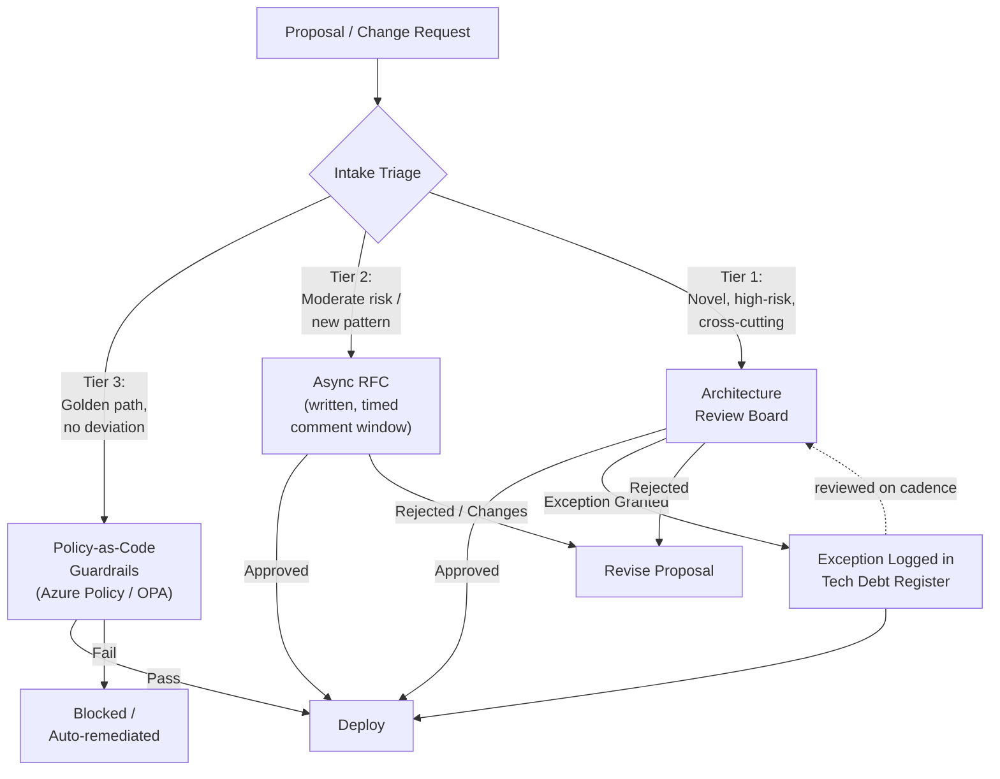
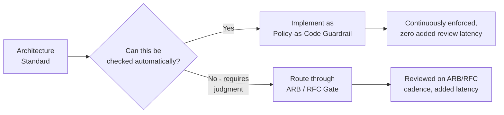
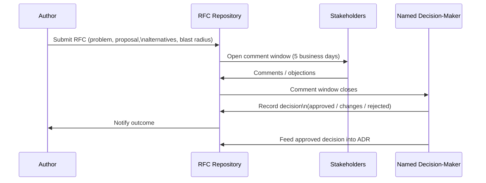
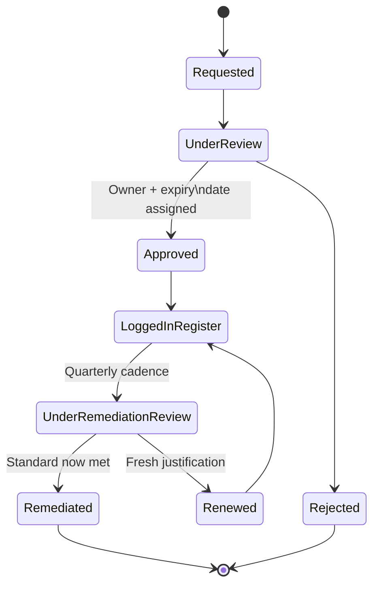

# Architecture Governance

> Part of the **Enterprise Data & AI Architecture Handbook** · Phase-01 — Enterprise Architecture Foundations · Chapter 02.
> Estimated study time: **45 min reading + ~3h labs**.
> **Prerequisites:** read [Enterprise Architecture Foundations](01_Enterprise_Architecture_Foundations.md) first.

---

## Executive Summary

[Enterprise Architecture Foundations](01_Enterprise_Architecture_Foundations.md#core-concepts) established that architecture principles are only as good as the mechanism that enforces them — a principle nobody checks decays into an ignored slogan within a year. **Architecture governance** is that enforcement mechanism, and getting it wrong is one of the most common ways a technically sound EA practice fails in practice: too heavyweight, and it becomes a delivery bottleneck teams route around; too weak, and principles, standards, and reference architectures never actually constrain what gets built. This chapter builds the concrete, operational machinery of governance — Architecture Review Boards (ARBs) and lightweight RFC processes as the human decision-making layer; tech radars, golden paths, and paved roads as the mechanism that makes the *right* choice the *easy* choice; standards, documented exceptions, and technical debt registers as the artifacts that keep deviations visible instead of silently accumulating; and the critical distinction between **guardrails** (automated, preventive, always-on) and **gates** (manual, point-in-time, reviewer-dependent) — with policy-as-code as the modern mechanism for converting the former from aspiration into enforced reality.

The governing insight of this chapter: governance is not fundamentally a review meeting — it is a **system of defaults**. An organization where the paved road (the golden path, the pre-approved reference architecture, the policy-as-code guardrail) is easier to follow than to circumvent achieves far higher, more consistent conformance than one relying on a review board to catch every deviation after the fact. Review boards and RFCs remain essential for genuinely novel, high-risk, or cross-cutting decisions — but the bulk of day-to-day architectural consistency should come from the paved road being the path of least resistance, not from manual gatekeeping.

The bias remains **Azure-primary (~60%)** — Azure Policy and Azure Policy Initiatives as the concrete guardrail-as-code mechanism, Azure DevOps/GitHub for RFC and ADR workflows, Azure Landing Zones as a paved-road reference implementation, and Microsoft's own engineering playbooks for tech-radar-style technology curation — **~30% enterprise open source** (Backstage software templates as golden paths, Open Policy Agent/Conformity/Cloud Custodian for policy-as-code, ThoughtWorks' Tech Radar format itself, GitHub's RFC/ADR conventions) and **~10% AWS/GCP comparison-only** (AWS Control Tower/Service Catalog and GCP Organization Policy Service as parallel guardrail mechanisms).

**Bottom line:** architecture governance succeeds when compliance is the path of least resistance (guardrails, golden paths, policy-as-code) and fails when it depends entirely on manual review catching problems after design decisions are already made. An architect who can distinguish which of their organization's controls are guardrails versus gates — and who knows precisely which decisions still warrant a human ARB versus which should be self-service against a paved road — runs a governance practice that scales with delivery volume instead of becoming its bottleneck.

---

## Learning Objectives

By the end of this chapter you will be able to:

1. **Design a right-sized Architecture Review Board (ARB)** — charter, membership, cadence, and a tiered intake process that reserves full review for genuinely high-risk decisions.
2. **Run a lightweight RFC process** for technical proposals that need broad input and asynchronous review without requiring a live meeting for every decision.
3. **Build and maintain a Tech Radar** to curate adopted, trial, assess, and hold technology choices, and explain how it differs from a rigid, single-approved-list model.
4. **Design golden paths / paved roads** (reference implementations plus scaffolding tooling) that make the compliant choice the path of least resistance.
5. **Distinguish guardrails from gates** precisely, and explain why an organization should maximize the former and minimize reliance on the latter.
6. **Implement policy-as-code guardrails** using Azure Policy (and Open Policy Agent for portable/multi-cloud contexts) to make standards continuously enforced rather than only reviewed.
7. **Run a documented exception process** and a technical debt register that keeps known deviations visible, owned, and time-boxed rather than silently accumulating.
8. **Measure architecture governance health** using concrete, trackable indicators (conformance rate, exception aging, review throughput) rather than relying on impression.

---

## Business Motivation

Architecture governance exists to prevent two opposite, equally expensive failure modes — ungoverned sprawl and governance-induced delivery paralysis:

- **Ungoverned technology sprawl is a direct, compounding cost.** Without any curation mechanism (a tech radar, standards), engineering teams independently adopt a wide spread of overlapping databases, message brokers, and frameworks — each adding its own on-call burden, security patching surface, and vendor contract, a cost that compounds every year it goes unaddressed.
- **Heavyweight, gate-everywhere governance is an equally direct cost — in lost delivery velocity.** An ARB that reviews every pull request-level decision becomes the organization's single slowest queue, and teams predictably learn to route around it (shadow IT, undocumented exceptions) rather than wait, which produces *worse* governance outcomes than a lighter, better-targeted process would.
- **Manual-only enforcement (gates) does not scale with delivery volume.** An organization shipping hundreds of changes a week cannot review each one; without automated guardrails (policy-as-code), governance coverage inevitably drops to whatever a human review board can physically get through, leaving most changes unchecked by default.
- **Silent, undocumented exceptions are a hidden risk accumulator.** A team that quietly bypasses a security standard under a deadline, with no exception record, leaves that gap invisible to the next audit, the next incident responder, and the next engineer who assumes the standard was actually followed.
- **Slow, unclear decision processes measurably delay time-to-market.** An RFC or ARB process with no defined SLA for a decision (approve/reject/request-changes) is a direct tax on delivery speed, felt project after project, that a defined process with committed turnaround times removes.

For a data/AI architect, governance fluency converts "we need better architecture compliance" into "our current ARB reviews 100% of changes and has a six-week backlog; moving to a tiered model — policy-as-code guardrails for the 80% of well-understood, low-risk changes, and full ARB review reserved for the 20% that are novel or cross-cutting — cuts review latency by an estimated 70% while *increasing* actual guardrail coverage, because automated checks run on every change instead of a sampled few" — a precise, throughput-and-risk-based argument rather than a vague call for "more governance."

---

## History and Evolution

- **1990s-2000s — Traditional IT governance** in large enterprises centers on a centralized Architecture Review Board with mandatory sign-off gates at each SDLC phase (waterfall-era), a model that worked adequately at the delivery cadence of the time but became a recognized bottleneck as release cycles shortened.
- **2001 — The Agile Manifesto** and the subsequent agile/DevOps movement expose the mismatch between phase-gate governance and iterative, frequent delivery, driving the industry search for governance mechanisms compatible with continuous delivery.
- **2013 — Netflix popularizes "paved road" / "golden path" thinking** — providing a well-supported, pre-integrated default platform path (deployment, observability, service framework) that is easier to adopt than to deviate from, shifting governance from "review every decision" to "make the good decision the easy decision."
- **2015 — ThoughtWorks formalizes the Tech Radar** as a structured, quadrant-based (Techniques, Tools, Platforms, Languages & Frameworks) technology curation format with four rings (Adopt, Trial, Assess, Hold), publishing their own radar publicly and open-sourcing the visualization tooling — rapidly adopted by enterprises as a lighter-weight alternative to a rigid single-approved-technology list.
- **2016-2018 — "Policy as code"** emerges as a named discipline, with **Open Policy Agent (OPA)** (launched by Styra, later a CNCF graduated project) providing a general-purpose, declarative policy engine usable across Kubernetes admission control, CI/CD pipelines, and cloud infrastructure — converting governance standards from documents into continuously evaluated code.
- **2018-2020 — Cloud-native guardrail services mature**: **Azure Policy** (generally available 2018) and equivalent AWS (Config Rules, later Control Tower guardrails) and GCP (Organization Policy Service) offerings let cloud-native standards be enforced automatically at resource-creation time rather than reviewed after deployment.
- **2019-2020 — Spotify's internal "Backstage" platform**, open-sourced in 2020 and donated to the CNCF, formalizes **software templates** ("golden paths") as a first-class, self-service scaffolding mechanism — an engineer creating a new service picks a template that already embeds the organization's approved patterns, rather than starting from a blank repository and being reviewed into compliance afterward.
- **2020-2022 — "You build it, you run it" and platform engineering** further shift governance left: platform teams increasingly build internal developer platforms (IDPs) whose defaults *are* the governance, rather than separate teams checking compliance after the fact — governance becomes an attribute of the platform, not a separate review step.
- **2022-2026 — AI/ML and LLM governance** extends the same guardrails-vs-gates thinking to model risk tiering, prompt/data-handling standards, and responsible-AI review — the same ARB/RFC/policy-as-code machinery covered in this chapter is increasingly the operational backbone for AI governance too, rather than a wholly separate process invented from scratch.

---

## Why This Technology Exists

Architecture governance mechanisms exist because principles and standards, by themselves, provide no guarantee of being followed, and because different kinds of decisions warrant fundamentally different governance intensity:

- **Review boards and RFCs exist** because some decisions are genuinely novel, high-risk, or cross-cutting enough that no automated check can evaluate them — a human panel with diverse expertise (security, data, platform, business) is the only mechanism capable of weighing trade-offs that have not been pre-decided.
- **Tech radars exist** because a rigid, binary "approved list" cannot represent the reality that some technologies are safe to bet the business on (Adopt), some are promising but unproven at scale (Trial), some deserve evaluation but not production use yet (Assess), and some are actively discouraged (Hold) — a single flat list collapses this nuance and either blocks legitimate experimentation or approves things prematurely.
- **Golden paths / paved roads exist** because engineers overwhelmingly follow the path of least resistance — if the compliant option requires more effort than the non-compliant one, adoption of the compliant option will be low regardless of how many principles say otherwise; making compliance the *easy* choice is a far more reliable lever than review.
- **Policy-as-code guardrails exist** because manual review cannot scale to the volume of changes a modern delivery organization makes, and because automated checks run consistently on every change, not just the sampled subset a human reviewer has time to examine.
- **Documented exception processes and technical debt registers exist** because deviations from standards are sometimes genuinely justified (a real deadline, a real constraint) — the goal is not to eliminate all deviation, but to make every deviation visible, owned, time-boxed, and reversible, rather than silent and permanent.
- **Architecture health metrics exist** because "is our governance working" is otherwise an impression, not a fact — without conformance rate, exception aging, and review throughput data, an organization cannot tell whether its governance process is succeeding, decaying, or actively harming delivery.

Without these mechanisms, governance either fails silently (principles ignored under delivery pressure, with no visibility) or fails loudly (a review bottleneck teams learn to route around) — both outcomes leave the enterprise's actual technology estate diverging, unmeasured, from its intended architecture.

---

## Problems It Solves

- **Scaling governance coverage beyond human review bandwidth** — policy-as-code guardrails check every change automatically, not just the ones a review board has time to examine.
- **Converting "which technology should I use" from a slow, case-by-case question into a fast, self-service lookup** — a maintained tech radar and golden path answer this in minutes rather than requiring a review request and a wait.
- **Making deviations visible instead of silent** — an exception process and debt register turn "we quietly skipped that control" into a tracked, owned, time-boxed, auditable record.
- **Focusing scarce expert review time on genuinely hard decisions** — a tiered intake process routes well-understood, low-risk changes around the ARB entirely, preserving the board's bandwidth for decisions that actually need it.
- **Providing an evidence trail for audits and incident retros** — RFCs, ADRs, exception records, and policy-as-code definitions collectively answer "why does this exist, who approved it, and under what conditions" precisely.
- **Turning governance health into a measurable, improvable metric** — conformance rate, review latency, and exception aging convert "governance feels slow / feels ignored" into concrete numbers a leadership team can act on.

---

## Problems It Cannot Solve

- **It cannot substitute for genuine engineering judgment on novel problems.** A tech radar and golden path handle well-understood, recurring decisions; a genuinely new problem (a first-of-its-kind generative AI integration, a novel data residency requirement) still requires expert judgment no automated guardrail encodes yet.
- **It cannot fix a broken engineering culture by itself.** A policy-as-code guardrail can block a non-compliant resource from being created — it cannot make an organization *want* to build things well; culture and incentives (what gets rewarded, what gets forgiven under deadline pressure) still dominate actual outcomes.
- **It cannot eliminate the need for human review entirely.** Even the most mature paved-road organizations retain a lightweight ARB or equivalent for genuinely cross-cutting or high-risk decisions — full automation of *all* governance is neither achievable nor desirable, since some trade-offs require judgment.
- **It cannot prevent well-intentioned but poorly designed guardrails from becoming a new bottleneck.** An overly strict, poorly tested Azure Policy definition that blocks legitimate resource configurations is just as capable of frustrating delivery teams as an overly slow manual gate — automation does not automatically imply good governance.
- **It cannot make a technical debt register useful without organizational follow-through.** A register of tracked exceptions that no one ever revisits or remediates is functionally identical to no register at all — the artifact requires a genuine remediation cadence, not just a place to log entries.
- **It cannot resolve genuine organizational disagreement about priorities.** A governance process can surface that two teams disagree about which standard should apply — it cannot itself decide the underlying business priority trade-off; that still requires an accountable decision-maker.

---

## Core Concepts

### 2.1 Architecture Review Boards (ARBs): charter, membership, and tiered intake

An **ARB** is the human governance body accountable for reviewing significant architecture proposals against an organization's principles and standards ([Enterprise Architecture Foundations](01_Enterprise_Architecture_Foundations.md#core-concepts)). A well-run ARB has an explicit **charter** (what decisions it does and does not review), a **cross-functional membership** (typically representatives from security, data, platform/infrastructure, and a rotating domain architect relevant to the proposal), a **fixed cadence** (weekly or biweekly, with an expedited path for time-sensitive decisions), and — critically — a **tiered intake process**: most organizations bucket proposals into at least three tiers (e.g., **Tier 1**: novel, cross-cutting, or high-blast-radius — full ARB review required; **Tier 2**: moderate risk or a deviation from an existing pattern — lightweight async review, e.g., a written RFC with a defined comment period and no live meeting; **Tier 3**: instantiating an existing golden path/reference architecture with no deviation — self-service, no ARB engagement required, subject only to automated policy-as-code checks). The single most common ARB failure mode is skipping this tiering and reviewing everything at Tier-1 intensity, which both overloads the board and trains teams to avoid engaging with it.

### 2.2 The RFC process: async, written, decision-forcing

A **Request for Comments (RFC)** process — popularized by IETF standards work and widely adopted internally by tech companies (Google, Uber, Stripe engineering blogs document their own variants) — is a written-proposal-plus-structured-comment-period mechanism that solves a real ARB limitation: not every decision needs, or can efficiently use, a synchronous meeting. A good internal RFC template forces the author to state the **problem**, the **proposed solution**, **alternatives considered and why rejected**, and **the blast radius / what teams are affected** — then opens a fixed comment window (e.g., 5 business days) during which any stakeholder can raise an objection, followed by an explicit **decision recorded in writing** (approved, approved-with-changes, rejected) by a named decision-maker, not merely "comments trailed off." The RFC's core value is that it is **asynchronous and written**, scaling far better than scheduling a meeting with every relevant stakeholder, while still producing an auditable decision record — often becoming the direct input to an ADR (covered in the next chapter) once approved.

### 2.3 Tech Radar: Adopt, Trial, Assess, Hold

A **Tech Radar** (ThoughtWorks format) organizes technology choices into four **quadrants** (Techniques, Tools, Platforms, Languages & Frameworks) and four **rings**: **Adopt** — proven, safe to use as a default for new work; **Trial** — worth pursuing on a real project with manageable risk, not yet a default; **Assess** — worth understanding and prototyping, not yet for production; **Hold** — proceed with caution, or actively phase out (not necessarily "banned," but a signal that new adoption should be questioned). The radar is explicitly **living and quarterly-refreshed**, not a static approved-list — a technology can move rings as evidence accumulates (a Trial technology graduating to Adopt after a successful production pilot, or an Adopt technology moving to Hold after a vendor deprecation announcement). Its governance value is that it gives engineers a **fast, self-service, nuanced answer** to "can I use X" without needing an ARB conversation for the common case, while still surfacing organizational intent (Hold items should prompt a conversation, not a silent adoption).

### 2.4 Golden paths and paved roads

A **golden path** (or **paved road**) is a curated, pre-integrated, well-supported default way of accomplishing a common task (standing up a new service, provisioning a new data pipeline) — packaged as scaffolding (e.g., a Backstage software template, an Azure Developer CLI (`azd`) template, a cookiecutter/Terraform module) that already embeds the organization's approved patterns: the right base image, the right CI/CD pipeline, the right observability instrumentation, the right identity and network configuration. The governing principle (from Netflix's and Spotify's platform engineering practice) is that **the paved road must be easier than going off-road** — if provisioning a new service via the golden path takes 10 minutes and going around it takes 2 hours, adoption of the golden path will be near-universal without needing to mandate it; if the reverse is true, mandating it will be ignored or resented. Golden paths are explicitly **not mandatory walls** — teams with a genuine reason to deviate can, but doing so should trigger visibility (an exception record) rather than being silently equivalent to the paved road.

### 2.5 Standards, exceptions, and the technical debt register

A **standard** is a specific, mandated implementation of a principle (e.g., "all Azure Storage accounts must have public network access disabled" implementing the principle "Data is protected by default"). Standards will occasionally have a legitimate reason to be violated (a genuine technical constraint, a time-boxed migration state) — the **exception process** is the mechanism that makes this visible: a written request stating the standard being deviated from, the business/technical justification, the compensating control (if any), the owner, and an **explicit expiry or review date** — never an open-ended, permanent exception. Approved exceptions are logged in a **technical debt register**, a living inventory of known deviations, each with an owner and a remediation plan, reviewed on a defined cadence (e.g., quarterly) so that "temporary" exceptions do not silently become permanent, unowned risk.

### 2.6 Guardrails vs. gates

This is the single most important operational distinction in this chapter. A **gate** is a manual, point-in-time checkpoint that a change must pass through, typically requiring a human reviewer's approval, and typically synchronous with delivery (blocking progress until reviewed) — an ARB approval, a manual security sign-off, a change advisory board meeting. A **guardrail** is an automated, continuously enforced constraint that prevents or automatically corrects a non-compliant state, without requiring a human in the loop for the common case — an Azure Policy `deny` effect blocking creation of a public-endpoint storage account, a CI pipeline step that fails a build lacking required tags, an OPA admission-control policy rejecting a Kubernetes manifest without resource limits. Gates do not scale with delivery volume and introduce latency and queueing; guardrails scale linearly with automation investment and introduce (ideally) near-zero added latency once built. The mature governance model **minimizes gates and maximizes guardrails**, reserving gates specifically for decisions that genuinely require human judgment (novel trade-offs, business risk acceptance) rather than for checks that could be codified.

### 2.7 Policy as code

**Policy as code** is the practice of expressing governance standards as machine-evaluated, version-controlled code rather than as prose reviewed manually. On Azure, this is primarily **Azure Policy** (built-in and custom policy definitions, grouped into initiatives, assigned at management group/subscription/resource group scope, with effects including `deny`, `audit`, `deployIfNotExists`, and `modify`); in portable/multi-cloud or Kubernetes-native contexts, **Open Policy Agent (OPA)** with its Rego policy language serves the same role, evaluated at admission control, CI/CD, or API gateway layers. Policy as code converts a standard from something a reviewer must remember to check into something that is checked identically, every time, without depending on reviewer diligence or availability — and because it is code, it is versioned, testable, and subject to the same change-review discipline as application code.

---

## Internal Working

Mechanically, a mature governance practice operates as three layers working together, not a single review step:

1. **Prevention layer (guardrails)** — policy-as-code definitions (Azure Policy initiatives, OPA policies in CI) run automatically on every relevant change, blocking or flagging non-compliant configurations before they reach production, with zero incremental review latency once deployed.
2. **Enablement layer (golden paths)** — a software template/scaffolding catalog (Backstage, `azd` templates) gives engineers a compliant-by-default starting point, so the *majority* of new work never needs to actively think about most standards — they are inherited automatically.
3. **Judgment layer (ARB/RFC)** — reserved for the minority of proposals that are novel, high-risk, cross-cutting, or explicitly requesting a deviation from the paved road/standards — routed through a tiered intake so only genuinely Tier-1 decisions consume the full board's time.

A request flows through intake triage first: does it instantiate an existing golden path with no deviation (Tier 3 — self-service, guardrails only)? Does it deviate moderately or introduce a new but low-risk pattern (Tier 2 — async RFC)? Or is it novel/high-blast-radius (Tier 1 — full ARB)? This triage step — not the review meeting itself — is what determines whether governance scales.

---

## Architecture



The critical design property: only a minority of proposals (Tier 1 and part of Tier 2) touch a human reviewer at all — the majority flow through Tier 3's automated guardrails with no added latency.

---

## Components

- **Architecture Review Board (ARB)** — the cross-functional human decision body for Tier-1 proposals, with an explicit charter, membership, and cadence.
- **RFC template and repository** — a standard written-proposal format and a versioned store (typically the same Git repo as the Architecture Repository) for Tier-2 async decisions.
- **Tech Radar** — the living, quarterly-refreshed Adopt/Trial/Assess/Hold technology curation artifact.
- **Golden path catalog** — the scaffolding/template library (Backstage software templates, `azd` templates, Terraform modules) that makes compliant defaults the easy choice.
- **Policy-as-code engine** — Azure Policy (and/or OPA) definitions and initiatives implementing standards as automated guardrails.
- **Exception register** — the log of approved, time-boxed deviations from standards, each with owner, justification, and expiry.
- **Technical debt register** — the broader, longer-lived inventory of known architectural debt (including expired/lingering exceptions), reviewed on a defined remediation cadence.
- **Governance metrics dashboard** — conformance rate, review throughput/latency, and exception aging, tracked over time.

---

## Metadata

- **Proposal metadata** — tier classification, submitting team, affected systems/capabilities, decision (approved/rejected/exception), decision date, and decision-maker — essential for both auditability and governance-health measurement.
- **Tech Radar entry metadata** — ring (Adopt/Trial/Assess/Hold), quadrant, date of last review, and rationale for the current ring placement.
- **Exception metadata** — standard being deviated from, justification, compensating control, owner, and mandatory expiry/review date — an exception record without an expiry date is a governance process defect, not a valid exception.
- **Policy definition metadata** — which principle/standard a given Azure Policy or OPA rule implements, so a principle's enforcement can be traced to concrete, testable code (mirroring the principle-to-standard traceability from [Enterprise Architecture Foundations](01_Enterprise_Architecture_Foundations.md#metadata)).

---

## Storage

- **RFCs and ADRs** as markdown files in the same Git-based Architecture Repository introduced in the prior chapter, versioned alongside the principles and reference architectures they elaborate.
- **Tech Radar** as either a maintained markdown/JSON dataset rendered via the open-source ThoughtWorks Tech Radar visualization (a static, shareable HTML radar), or embedded in a Backstage instance's TechDocs.
- **Policy-as-code definitions** stored as Bicep/JSON (Azure Policy) or Rego (OPA) files in a dedicated Git repository, deployed via CI/CD pipelines (Azure DevOps Pipelines/GitHub Actions) with the same review discipline as application code — including automated policy testing before deployment.
- **Exception and technical debt registers** as either a structured backlog (Azure Boards/GitHub Issues with a dedicated label and required fields) or a lightweight database/table queryable for reporting.

---

## Compute

Governance tooling itself has modest compute needs, concentrated in the automation layer:

- Policy evaluation (Azure Policy) runs as a managed, serverless Azure control-plane capability with no dedicated compute to provision.
- OPA policy evaluation, where used (e.g., Kubernetes admission control, CI pipeline steps), runs as a lightweight sidecar/service (e.g., OPA as a Gatekeeper webhook in AKS) with minimal resource footprint.
- Tech Radar rendering and Backstage's software catalog/template engine run as ordinary lightweight web services, typically on Azure App Service or AKS alongside other internal developer platform components.

---

## Networking

- Azure Policy evaluation occurs at the Azure Resource Manager control-plane layer and requires no direct network exposure from governed workloads.
- OPA/Gatekeeper admission control in AKS intercepts the Kubernetes API server's admission webhook path, requiring the webhook endpoint to be reachable from the cluster's control plane — a standard, well-documented AKS add-on network pattern.
- Golden path scaffolding tools (Backstage) typically require outbound connectivity to the source control system (Azure DevOps/GitHub) and the CI/CD system to provision new repositories and pipelines on template instantiation.

---

## Security

- Policy-as-code guardrails are themselves a primary **security control mechanism** — e.g., an Azure Policy initiative denying creation of storage accounts without private endpoints directly enforces the security principles established in [Enterprise Architecture Foundations](01_Enterprise_Architecture_Foundations.md#security).
- The exception process is a **security-relevant control** in its own right — every approved exception to a security standard should be visible to the security team, not just the architecture function, and security-relevant exceptions should have a shorter default expiry and mandatory security sign-off.
- Access to modify policy-as-code definitions and golden path templates must itself be tightly controlled (e.g., a protected branch requiring security/platform team approval) — since these artifacts are the enforcement mechanism, weak change control over them undermines every standard they implement.
- ARB and RFC decision records provide the audit trail a security or compliance review needs to demonstrate that architectural risk was considered and explicitly accepted (or rejected), not overlooked.

---

## Performance

- Guardrails should be designed for **near-zero added latency** in the common (compliant) path — an Azure Policy `deny` effect evaluated at deployment time adds negligible delay compared to a manual review queue measured in days.
- ARB and RFC processes should have **explicit SLAs** (e.g., "Tier-1 ARB decisions within 5 business days of submission; Tier-2 RFC comment windows close after 5 business days") — an unmeasured, unbounded review process is a direct, often underappreciated tax on delivery performance.
- Governance throughput (proposals reviewed per week, average time-to-decision) should be tracked as a first-class metric, the same way service latency is tracked — a growing backlog is the leading indicator that either intake triage needs recalibration or the paved road needs to cover more common cases.

---

## Scalability

- The core scalability lever is **shifting volume from gates to guardrails** — every category of decision successfully codified as a policy-as-code rule or absorbed into a golden path is one fewer recurring item competing for ARB bandwidth, and this shift is what lets governance scale with delivery volume rather than requiring an ever-larger review board.
- Tiered intake itself is a scalability mechanism — explicitly routing the (typically large) volume of low-risk, pattern-matching proposals away from the ARB preserves the board's limited capacity for the (typically small) volume of genuinely novel decisions.

---

## Fault Tolerance

- A single point of failure in governance (e.g., one architect who is the only person who can approve exceptions) is itself a governance design flaw — ARB membership and RFC decision-maker roles should have documented backup/delegate authority.
- Policy-as-code guardrails should **fail safe but not fail silent** — a misconfigured or overly aggressive policy that blocks legitimate deployments needs a fast, well-understood escalation/override path (e.g., a documented emergency exception process with post-hoc review), or teams will pressure for the guardrail to be disabled entirely rather than fixed.

---

## Cost Optimization

- A well-curated Tech Radar directly reduces cost by discouraging redundant technology adoption (the same duplicate-capability cost pattern noted in [Enterprise Architecture Foundations](01_Enterprise_Architecture_Foundations.md#business-motivation), applied at the technology-choice level rather than the capability level).
- Policy-as-code guardrails can directly enforce FinOps standards (e.g., an Azure Policy `deployIfNotExists` rule auto-applying a cost-center tag, or a policy denying premium-SKU resources outside an approved list) — converting cost governance from a monthly finance review into a continuously enforced default.
- Reducing ARB review overhead (via tiering and guardrails) is itself a cost optimization — architect and senior-engineer review time is expensive, and every proposal correctly routed to self-service Tier 3 is time returned to higher-value work.

---

## Monitoring

- **Governance-specific dashboards** should track: ARB/RFC review latency (submission to decision), proposal volume by tier, guardrail policy violation counts (compliant vs. denied vs. audited-only), and exception register size and age distribution.
- **Policy-as-code drift detection** — Azure Policy's compliance state reporting (and equivalent OPA/Gatekeeper audit logs) should be monitored continuously, not just checked at audit time, so a spike in non-compliant resources is caught within the normal operational monitoring cadence, not discovered months later.

---

## Observability

- Governance observability should answer, on demand: which teams have the most open exceptions; which standards are exception-requested most often (a signal the standard itself may need revisiting, not just that teams are non-compliant); and what fraction of new work goes through the golden path versus a bespoke, ARB-reviewed path.
- Correlating exception register data with incident postmortems (does an exception correlate with a subsequent incident) is a high-value, underused observability practice that directly demonstrates — or disproves — the risk-reduction value of the governance process itself.

---

## Governance

(Governance-of-governance: how the mechanisms described in this chapter are themselves kept healthy.)

- **ARB charter review** — the board's own scope, membership, and tiering criteria should be revisited on a fixed cadence (e.g., annually) to confirm they still match actual risk patterns, not left static indefinitely.
- **Tech Radar refresh cadence** — quarterly review, with entries requiring an explicit justification to remain unchanged for more than a defined number of cycles (preventing the radar itself from going stale).
- **Exception register remediation reviews** — a standing, calendared review (e.g., quarterly) of all open exceptions, explicitly closing, renewing (with fresh justification), or escalating each one — an exception process without this cadence degrades into a one-way list that only grows.
- **Policy-as-code change control** — modifications to Azure Policy definitions/initiatives or OPA policies go through the same RFC/ARB tiering as any other significant architecture change, since these artifacts directly constrain what the entire organization can build.

---

## Trade-offs

| Dimension | Gate-Heavy (Manual ARB for Everything) | Guardrail-Heavy (Policy-as-Code + Golden Paths) |
|---|---|---|
| Coverage | Limited by reviewer bandwidth — often a sampled subset | Applies to 100% of relevant changes automatically |
| Speed | Slow — queueing, scheduling, human availability | Near-instant for the compliant path |
| Handles novelty | Well — human judgment adapts to new situations | Poorly — cannot evaluate what has not been encoded |
| Upfront investment | Low — a review board can start meeting immediately | High — requires building templates and policy code first |
| Long-term scalability | Poor — does not scale with delivery volume | Good — scales roughly linearly with automation investment |

The mature model uses both, deliberately: guardrails and golden paths for the high-volume, well-understood majority of decisions, and a lean ARB/RFC process reserved for the low-volume, genuinely novel minority.

---

## Decision Matrix

| Situation | Recommended Mechanism |
|---|---|
| New service, well-understood pattern, no deviation from standards | Golden path self-service (Tier 3) — guardrails only |
| New pattern, moderate risk, needs broad team input but not a meeting | Async RFC (Tier 2) |
| Novel, cross-cutting, high blast radius, or first-of-its-kind | Full ARB review (Tier 1) |
| Team needs a temporary deviation from a mandated standard | Documented, time-boxed exception + tech debt register entry |
| A standard is frequently exception-requested | Revisit and likely revise the standard itself, not just approve more exceptions |
| Governance backlog growing faster than it clears | Re-triage: shift more categories to guardrails/golden paths, not add reviewers indefinitely |

---

## Design Patterns

- **Tiered intake by risk and novelty** — the single highest-leverage governance design decision; every mature practice in this chapter's References implements some form of this.
- **Guardrail-first, gate-as-fallback** — attempt to encode a standard as policy-as-code first; reserve human gates only for what genuinely cannot be automated (subjective trade-off judgment).
- **Golden path with escape hatch** — the paved road is the easy default, but a documented, visible exception path exists for genuine edge cases, rather than a hard, inescapable wall that drives teams to shadow IT.
- **RFC-to-ADR pipeline** — an approved RFC's decision becomes the direct source material for a formal ADR (next chapter), avoiding duplicate documentation effort.
- **Policy as code with a staged rollout** — new policy-as-code guardrails deploy first in `audit` (report-only) mode, then graduate to `deny` after a burn-in period confirms no unexpected false positives — preventing a new guardrail from becoming an unplanned outage.

---

## Anti-patterns

- **The ARB as a universal bottleneck** — reviewing every change, regardless of risk, at full Tier-1 intensity, guaranteeing an ever-growing backlog and driving teams to avoid engaging with governance at all.
- **"Approved list" tech governance with no nuance** — a flat, binary technology approved-list (versus a tiered radar) either blocks legitimate exploration (Assess-worthy technologies) or, if made too permissive to avoid that, fails to actually curate anything.
- **Golden paths that are harder than going around them** — a scaffolding template that takes longer to use correctly than hand-rolling a new service guarantees low adoption regardless of governance intent.
- **Guardrails deployed straight to enforcement without a burn-in/audit period** — a new Azure Policy `deny` rule pushed straight to production without first observing its effect in `audit` mode risks blocking legitimate, previously-compliant deployments unexpectedly.
- **Exceptions with no expiry** — an "approved exception" with no review date is, in practice, a permanent, silent standard change that never went through proper governance.
- **A technical debt register no one revisits** — logging exceptions and debt items without a calendared remediation review makes the register a write-only artifact with no actual risk-reduction value.

---

## Common Mistakes

- Conflating "we have a review board" with "we have governance" — a board that meets regularly but has no tiering, no SLA, and no golden-path alternative is not scalable governance, just a recurring meeting.
- Writing policy-as-code guardrails that are too broad or untested, causing false-positive denials that erode developer trust in the entire guardrail system.
- Treating the Tech Radar as a one-time exercise instead of a living, quarterly-refreshed artifact — a stale radar loses credibility and stops being consulted.
- Measuring governance success by "number of ARB meetings held" rather than by conformance rate, review latency, and exception aging — activity metrics instead of outcome metrics.
- Building golden paths without ongoing platform-team investment to keep them current — an outdated golden path (referencing deprecated services or old patterns) actively drives teams away from it.
- No clear owner for the exception register's remediation cadence — without an accountable owner, quarterly reviews quietly stop happening.

---

## Best Practices

- Publish explicit, risk-based tiering criteria so teams can self-assess which governance path applies *before* submitting a proposal, reducing back-and-forth and misrouted submissions.
- Set and track explicit SLAs for ARB and RFC decisions, and report on adherence as a governance health metric.
- Invest in golden paths proportional to how frequently a pattern recurs — the highest-volume, most-repeated architecture decisions (standing up a new microservice, a new data pipeline) deserve the most polished paved road.
- Deploy new policy-as-code guardrails in audit/report-only mode first, review the compliance report for false positives, then graduate to enforcing (`deny`) mode.
- Require every exception to have an owner and an expiry date at creation time — no exception without both fields should be approvable.
- Review the Tech Radar and the technical debt register on fixed, calendared cadences, and treat both as living artifacts owned by a named individual or team.
- Feed ARB/RFC decisions directly into ADRs (next chapter) to avoid duplicated documentation and preserve institutional memory of *why* a decision was made.

---

## Enterprise Recommendations

- Establish **explicit, published tiering criteria** for governance intake as the very first step of standing up (or fixing) an ARB — this single change typically has the largest impact on both delivery speed and actual guardrail coverage.
- Invest early in **golden path tooling** (Backstage or an equivalent internal developer platform, `azd` templates) proportional to your highest-volume recurring architecture decisions, since this is what converts governance from "checked after the fact" to "correct by default."
- Adopt **Azure Policy initiatives, staged through audit-then-deny**, as the default mechanism for enforcing Technology Architecture domain standards, reserving OPA for Kubernetes-native or genuinely multi-cloud/portable policy needs.
- Mandate that **every approved exception carries an owner and expiry**, and calendar a recurring (e.g., quarterly) technical debt register review at the same governance forum that reviews the Tech Radar.
- Track and regularly report **governance health metrics** (conformance rate, review latency, exception aging) to the same leadership audience that reviews delivery velocity metrics — governance health and delivery velocity should be reviewed together, not in separate, disconnected forums.

---

## Azure Implementation

- **Azure Policy** is the primary guardrail mechanism: built-in and custom policy definitions grouped into **initiatives**, assigned at management group, subscription, or resource group scope, with effects `Deny`, `Audit`, `AuditIfNotExists`, `DeployIfNotExists`, and `Modify`. Example — denying storage accounts without private endpoint-only access, staged first in `Audit` mode:

```json
{
  "properties": {
    "displayName": "Deny public network access on Storage Accounts",
    "mode": "Indexed",
    "policyRule": {
      "if": {
        "allOf": [
          { "field": "type", "equals": "Microsoft.Storage/storageAccounts" },
          { "field": "Microsoft.Storage/storageAccounts/publicNetworkAccess", "notEquals": "Disabled" }
        ]
      },
      "then": { "effect": "[parameters('effect')]" }
    },
    "parameters": {
      "effect": { "type": "String", "defaultValue": "Audit", "allowedValues": ["Audit", "Deny"] }
    }
  }
}
```

- **Azure DevOps / GitHub** hosts the RFC and ADR repository, with a required PR template enforcing the RFC's problem/alternatives/blast-radius structure, and branch protection requiring a named approver for Tier-1/Tier-2 decisions.
- **Azure Developer CLI (`azd`) templates** and **Backstage software templates** (deployable on Azure via AKS or App Service) implement golden paths — a developer runs `azd init --template <approved-template>` to scaffold a new service with the org's approved CI/CD, observability, and network configuration already wired in.
- **Azure Policy compliance dashboard** (Azure Portal or Resource Graph queries) provides the continuous conformance-rate metric referenced throughout this chapter's Monitoring and Governance sections — e.g.:

```bash
az policy state summarize \
  --management-group "contoso-landing-zones" \
  --query "policyAssignments[].results.resourceDetails"
```

- **Microsoft Entra ID Privileged Identity Management (PIM)** can gate who is authorized to approve exceptions or modify policy-as-code definitions, ensuring the governance mechanism's own change control is itself access-controlled and audited.

---

## Open Source Implementation

- **Open Policy Agent (OPA)**, with its Rego policy language, is the leading open-source, portable policy-as-code engine — commonly deployed as **Gatekeeper** for Kubernetes admission control (rejecting non-compliant manifests at the AKS API server) or embedded directly in CI/CD pipelines to check infrastructure-as-code plans before apply.
- **Backstage** (CNCF) provides the reference open-source implementation of a golden-path software template catalog plus a service/software catalog that doubles as an Application Architecture domain inventory (connecting back to [Enterprise Architecture Foundations](01_Enterprise_Architecture_Foundations.md#components)).
- **ThoughtWorks' Tech Radar** format and open-sourced visualization tooling remain the de facto standard for building and publishing an internal tech radar, usable independent of any specific cloud platform.
- **Conftest**, built on OPA/Rego, is commonly used to test infrastructure-as-code (Terraform/Bicep-generated ARM templates) against policy-as-code rules directly in CI, before a cloud-native guardrail like Azure Policy would even see the deployed resource.
- **GitHub/GitLab issue trackers with structured templates** are a common lightweight substitute for a dedicated exception/technical-debt-register tool, using required fields (owner, expiry, justification) enforced via issue templates and label automation.

---

## AWS Equivalent (comparison only)

AWS's guardrail equivalent is **AWS Control Tower** (organization-wide guardrails, implemented via **Service Control Policies** in AWS Organizations) combined with **AWS Config Rules** for continuous compliance evaluation, and **AWS Service Catalog** for golden-path-style, pre-approved, self-service provisioning of standardized resource bundles. **Advantages**: deeply integrated with AWS Organizations' multi-account structure, mature and widely documented. **Disadvantages**: Service Control Policies are coarser-grained (allow/deny at the API-action level) than Azure Policy's field-level conditional evaluation, and AWS Config Rules' remediation actions are generally less flexible than Azure Policy's `DeployIfNotExists`/`Modify` effects. **Migration strategy**: map Azure Policy initiatives to an equivalent set of AWS Config Rules plus Service Control Policies, and map `azd`/Backstage golden path templates to AWS Service Catalog portfolios. **Selection criteria**: organizations already standardized on AWS Organizations' multi-account model will find Control Tower's guardrail bundling faster to stand up initially; Azure Policy offers finer-grained, more flexible conditional logic for complex custom standards.

---

## GCP Equivalent (comparison only)

GCP's equivalent is the **Organization Policy Service** (constraint-based guardrails at the folder/project/resource level) combined with **Security Command Center** for continuous compliance and posture monitoring, and **Google Cloud's deployment manager / Terraform-based blueprints** for golden-path-style curated deployments. **Advantages**: Organization Policy constraints integrate tightly with GCP's resource hierarchy and are straightforward to reason about for common constraints (e.g., restricting resource locations, disabling external IPs). **Disadvantages**: fewer built-in constraint types than Azure Policy's extensive built-in definition library, and less mature `DeployIfNotExists`-style auto-remediation compared to Azure Policy. **Migration strategy**: map Azure Policy initiatives to GCP Organization Policy constraints plus custom Security Command Center findings, and use Google's officially published Terraform blueprints as the golden-path equivalent. **Selection criteria**: teams with a strong existing Terraform-based platform engineering practice will find GCP's blueprint model a natural fit; teams needing rich, field-level conditional policy logic will find Azure Policy or OPA more expressive.

---

## Migration Considerations

- **From a single, all-Tier-1 ARB to tiered governance**: publish tiering criteria and pilot on a small, willing team first, measuring both review latency reduction and any conformance regression before rolling out organization-wide.
- **From no policy-as-code to Azure Policy guardrails**: start with `Audit` mode on your highest-value, best-understood standards (e.g., mandatory tagging, private endpoints), review the compliance report for a full cycle to catch false positives, then graduate to `Deny` — never start a new guardrail directly in enforcement mode.
- **From no golden path to a Backstage/`azd`-based paved road**: prioritize the single most frequently repeated architecture decision (typically "stand up a new service" or "stand up a new data pipeline") for the first template, since this yields the fastest, most visible adoption win.
- **From an undocumented, ad hoc exception culture to a formal exception register**: run an amnesty period — invite teams to retroactively document existing, previously-undocumented deviations without penalty, to get an honest initial register rather than one that under-represents actual risk because teams fear reporting.
- **From OPA/Rego to Azure Policy (or vice versa) during a cloud consolidation**: expect a translation effort, not a direct mapping — Rego's general-purpose policy language and Azure Policy's declarative JSON schema differ enough that policies are typically rewritten, not mechanically converted, and should be re-validated in audit mode after migration.

---

## Mermaid Architecture Diagrams

**Guardrails vs. gates decision flow:**



**RFC lifecycle sequence:**



**Exception lifecycle state diagram:**



---

## End-to-End Data Flow

Tracing a single proposal from submission to enforced outcome illustrates how the layers interact:

1. A data engineering team submits a proposal to provision a new Cosmos DB account for a customer-facing feature via the intake form, which asks structured triage questions (deviation from golden path? cross-cutting impact? data classification?).
2. Triage logic (a simple decision tree, sometimes itself encoded as a lightweight workflow) determines this is **Tier 3** — it instantiates the existing "customer-facing NoSQL data store" golden path template with no deviations.
3. The team runs the `azd`/Backstage template, which scaffolds the Cosmos DB account, its network configuration (private endpoint), and its CI/CD pipeline pre-wired with the organization's standard tagging and monitoring.
4. On deployment, **Azure Policy** guardrails automatically evaluate the resulting resource against the assigned initiative — confirming private endpoint-only access, required tags, and customer-managed key configuration — with `Deny` effects blocking any drift from the template's compliant defaults.
5. No ARB or RFC touches this proposal at all — governance coverage is complete (100% of the resource's compliance-relevant properties were checked) without consuming any human review time.
6. Three months later, the same team proposes a genuinely novel pattern — using Cosmos DB's analytical store with a new cross-region replication topology not covered by any existing golden path. Triage routes this to **Tier 1**, and it goes through full ARB review, producing an RFC, an ARB decision, and (since it becomes the second instance of this pattern) a candidate for a *new* golden path template if a third team requests something similar.

---

## Real-world Business Use Cases

- **A financial services firm reducing ARB backlog**: an ARB reviewing 100% of change proposals at Tier-1 intensity carried a six-week backlog; introducing tiered intake and codifying its 15 most common standards as Azure Policy guardrails reduced Tier-1 volume by roughly 75%, cutting the backlog to under a week within two quarters.
- **A retail company's golden path adoption**: a Backstage-based software template for "new customer-facing microservice" reduced average time-to-first-deploy from three weeks (manual setup, ARB review, security sign-off) to under a day, with security and observability standards inherited automatically from the template rather than checked after the fact.
- **A healthcare provider's exception amnesty**: an initial technical debt register audit assumed near-zero existing deviations; a no-penalty amnesty period surfaced over 200 previously undocumented exceptions (mostly expired TLS certificate policy waivers and legacy network rules), giving the security team an honest baseline to prioritize remediation instead of a false sense of compliance.

---

## Industry Examples

- **Netflix** popularized the paved-road philosophy explicitly — publishing that the platform team's job is to make the golden path so good that going around it is rarely worth the effort, rather than relying on a central review team to catch deviations.
- **Spotify** (Backstage's origin) formalized golden paths as first-class, self-service software templates, directly influencing the broader industry's shift toward platform-engineering-as-governance.
- **ThoughtWorks** (via its Technology Radar, published publicly twice yearly) remains the reference example of the Adopt/Trial/Assess/Hold model applied at industry scale, and many enterprises' internal radars are directly modeled on this public format.
- **Google** and **Uber** engineering blogs document internal RFC (Google calls related processes "design docs" with structured review) and ADR-adjacent practices that heavily influence the async, written-proposal pattern described in this chapter.

---

## Case Studies

**Case Study 1 — A Guardrail Rollout That Broke Production Deployments.** A platform team deployed a new Azure Policy `Deny` rule mandating customer-managed keys on all new Cosmos DB accounts, without first running it in `Audit` mode. The policy correctly reflected the intended standard but had an unanticipated interaction with an existing CI/CD pipeline template used by twelve teams, which provisioned Cosmos DB before the customer-managed key was available, causing every affected pipeline to fail simultaneously. The incident retro's key finding, now a standing best practice referenced in this chapter's Best Practices section, was simple: **no new guardrail goes to `Deny` without a burn-in period in `Audit` mode first**, regardless of how confident the policy author is.

**Case Study 2 — Golden Path Adoption Stalling Due to Poor Ergonomics.** A data platform team built a technically excellent golden path template for standing up new Databricks-based ingestion pipelines, fully compliant with all security and tagging standards — but requiring 45 minutes of manual parameter configuration to instantiate. Adoption remained under 20% after six months; most teams continued hand-rolling pipelines. A UX-focused revision reducing setup to under 5 minutes (sane defaults, minimal required inputs) raised adoption to over 80% within one quarter, with no change to the underlying compliance guarantees — the lesson generalized into this chapter's "paved road must be easier than going around it" principle.

---

## Hands-on Labs

1. **Draft a tiered intake questionnaire** (5-8 yes/no or short-answer questions) that routes a hypothetical proposal to Tier 1, 2, or 3, and test it against three example proposals of varying risk.
2. **Write an RFC** using the problem/proposal/alternatives/blast-radius template for a real or hypothetical architecture change, and simulate a 5-day comment period by soliciting feedback from at least two peers.
3. **Author an Azure Policy definition** (JSON) that audits (not denies) a real standard of your choosing (e.g., mandatory resource tags), deploy it to a sandbox subscription, and review the resulting compliance report.
4. **Build a minimal Tech Radar** (4 quadrants x 4 rings, at least 8 entries) for your own technology stack or a hypothetical one, including a one-sentence rationale per entry.
5. **Design an exception request template** with mandatory owner and expiry fields, and process three example requests through it, logging the outcomes in a simple technical debt register (a spreadsheet or issue tracker is sufficient).
6. **Stage an Azure Policy guardrail from Audit to Deny**: deploy a policy in `Audit` mode, review its compliance report over a simulated period, then change its effect parameter to `Deny` and confirm it blocks a non-compliant test resource.

---

## Exercises

1. A colleague argues "we don't need an ARB if we have good policy-as-code guardrails." Explain what category of decisions still requires a human review board, and why guardrails cannot fully replace it.
2. Given an ARB with a six-week review backlog, propose a concrete triage scheme that would reduce Tier-1 volume, and estimate (qualitatively) the expected impact.
3. Critique this exception record: "Team X is exempted from the data classification standard for the Foo service." Identify what fields are missing and why each is necessary.
4. Explain why a Tech Radar uses four rings instead of a simple two-state (approved/not approved) model, using a concrete technology example for each ring.
5. Design a burn-in process for rolling out a new, potentially disruptive Azure Policy guardrail across an organization with 50 subscriptions, minimizing risk of a Case-Study-1-style incident.

---

## Mini Projects

- **Governance Health Dashboard**: build a simple dashboard (spreadsheet, Power BI, or a small script against mock data) tracking ARB review latency, guardrail compliance rate, and exception register age distribution over a simulated 6-month period.
- **End-to-End Golden Path**: build a minimal, real, working scaffolding template (a Backstage software template, a cookiecutter template, or even a well-documented Terraform module) for one recurring pattern in your own work, and measure setup time before and after.
- **Policy-as-Code Test Suite**: write a small set of Conftest/OPA or Azure Policy test cases (compliant and non-compliant example resources) that validate a policy definition behaves as intended before deployment.

---

## Capstone Integration

This chapter's tiered ARB/RFC process, policy-as-code guardrails, and exception/debt register directly operationalize the enterprise-wide principles and reference architectures established in [Enterprise Architecture Foundations](01_Enterprise_Architecture_Foundations.md#core-concepts) — governance is how those principles actually constrain what gets built. The next chapter, [Architecture Decision Records](03_Architecture_Decision_Records.prompt.md), formalizes the point-in-time decision artifact this chapter's RFC and ARB processes feed directly into. Later phases' platform engineering and DataOps chapters (Phase-09) build directly on this chapter's golden-path and guardrail concepts, applied specifically to data pipeline and MLOps scaffolding. In the handbook's capstone (Phase-20), the governance model designed here — tiered intake, guardrail coverage, and a live exception register — is the operating model used to justify and govern the capstone reference platform's own architecture decisions.

---

## Interview Questions

1. What is the difference between a guardrail and a gate, and give one example of each.
2. What are the four rings of a Tech Radar, and what does it mean for a technology to be in "Hold"?
3. Why does an architecture exception need an expiry date?
4. What is the purpose of an RFC process, and how does it differ from an ARB meeting?
5. What is a "golden path," and why must it be easier to use than the alternative?

---

## Staff Engineer Questions

1. Your team's golden path template has fallen out of date (references a deprecated Azure service). How do you prioritize fixing it against other platform work, and what signals would tell you it's urgent?
2. How would you design a tiering questionnaire that reliably routes proposals to the correct governance tier without requiring an architect to manually triage every submission?
3. A new Azure Policy guardrail is generating a high rate of false-positive denials. Walk through how you would diagnose and safely roll it back or fix it without disabling the underlying standard.

---

## Architect Questions

1. Design a full governance operating model (ARB charter, RFC template, tiering criteria, golden path catalog, policy-as-code strategy, exception process) for an organization with 40 engineering teams and no existing formal governance. Justify each component's scope.
2. How would you measure whether your organization's shift from gate-heavy to guardrail-heavy governance actually improved outcomes, not just delivery speed? What metrics would you distrust and why?
3. A newly acquired business unit has its own, incompatible governance process (different ARB, different standards). Design an integration approach that avoids both a disruptive big-bang replacement and a permanent parallel-process problem.

---

## CTO Review Questions

1. What percentage of our architectural changes are covered by automated guardrails versus manual review, and is that ratio trending in the right direction?
2. How many open architecture exceptions do we currently carry, how old is the oldest one, and what is the plan to close it?
3. If our delivery volume doubled next year, would our current governance model scale, or would it become the bottleneck? What is the single highest-leverage investment to prevent that?

---

## References

- The Open Group. *TOGAF Version 10 — Architecture Governance.* https://www.opengroup.org/togaf
- ThoughtWorks. *Technology Radar.* https://www.thoughtworks.com/radar
- CNCF. *Backstage — An Open Platform for Building Developer Portals.* https://backstage.io
- Open Policy Agent. *OPA Documentation.* https://www.openpolicyagent.org/docs
- Microsoft. *Azure Policy Documentation.* https://learn.microsoft.com/azure/governance/policy/
- Microsoft. *Cloud Adoption Framework — Govern Methodology.* https://learn.microsoft.com/azure/cloud-adoption-framework/govern/
- AWS. *AWS Control Tower and Service Control Policies.* https://aws.amazon.com/controltower/
- Google Cloud. *Organization Policy Service.* https://cloud.google.com/resource-manager/docs/organization-policy/overview
- IETF. *RFC 2026 — The Internet Standards Process* (the origin of the RFC format convention). https://www.ietf.org/rfc/rfc2026.txt

---

## Further Reading

- Kim, G., Humble, J., Debois, P., & Willis, J. (2016). *The DevOps Handbook.* IT Revolution Press.
- Skelton, M., & Pais, M. (2019). *Team Topologies.* IT Revolution Press. (Platform-as-a-product and golden-path thinking.)
- Humble, J., & Farley, D. (2010). *Continuous Delivery.* Addison-Wesley. (Guardrail-style automated quality gates in the deployment pipeline.)
- Cunningham, W. (1992). *The WyCash Portfolio Management System* — the original "technical debt" metaphor.
- Next chapter: [Architecture Decision Records](03_Architecture_Decision_Records.prompt.md) — formalizing the point-in-time decision artifact this chapter's ARB and RFC processes produce.
