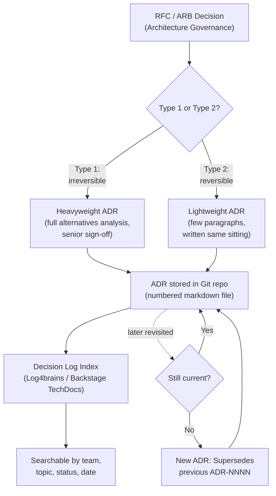
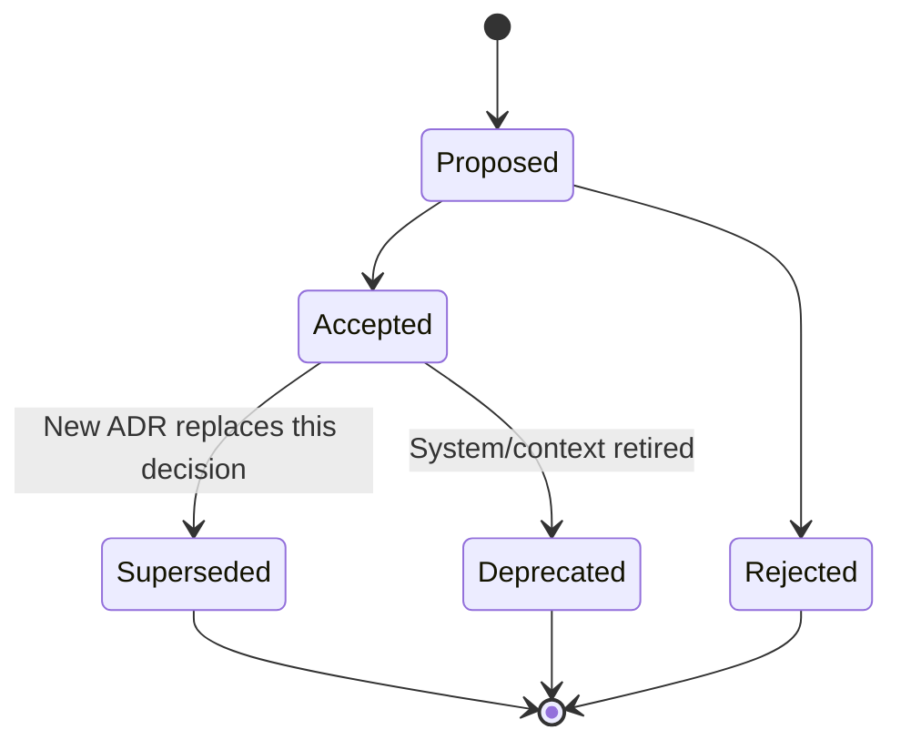
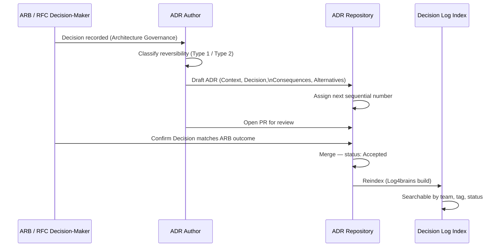
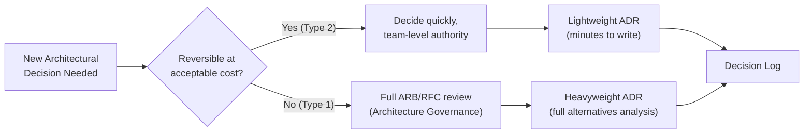

# Architecture Decision Records

> Part of the **Enterprise Data & AI Architecture Handbook** · Phase-01 — Enterprise Architecture Foundations · Chapter 03.
> Estimated study time: **45 min reading + ~3h labs**.
> **Prerequisites:** read [Architecture Governance](02_Architecture_Governance.md) first.

---

## Executive Summary

[Architecture Governance](02_Architecture_Governance.md#core-concepts) established *how* a decision gets made — tiered intake, an ARB for genuinely novel or high-risk proposals, an async RFC process for the rest, and guardrails handling everything routine. This chapter covers what happens **after** the decision is made: how it is captured, durably, in a form that a future engineer — six months, three years, or a full team-turnover later — can find, trust, and understand without having to reconstruct the reasoning from memory, a stale Slack thread, or an oral-history conversation with whoever happens to still be at the company. An **Architecture Decision Record (ADR)** is a short, immutable, version-controlled document recording a single significant architectural decision: its **context** (the forces at play), the **decision** itself, its **consequences** (both intended and accepted trade-offs), and the **alternatives** that were considered and rejected, and why. The format was popularized by Michael Nygard in 2011 specifically to solve a problem every long-lived codebase eventually hits: the code shows *what* was built, but nothing durable records *why* — and "why" is precisely the information that goes stale fastest in human memory and is the most expensive to reconstruct after the fact.

This chapter builds the operational discipline around that simple idea: the canonical ADR anatomy and its most widely adopted template (**MADR** — Markdown Any Decision Records); the distinction between **lightweight** ADRs (a few paragraphs, written in minutes, for most decisions) and **heavyweight** ones (extended alternatives analysis, stakeholder sign-off, for the rare decision that genuinely warrants it); the **decision log** as the aggregated, searchable index across every ADR a system or organization has accumulated; and the single most important classification lens for deciding *how much* rigor a decision deserves — Amazon's **Type 1 (irreversible, "one-way door") versus Type 2 (reversible, "two-way door")** distinction, which directly determines whether a decision warrants the full ARB/RFC/ADR machinery from the prior chapter or a quick, lightweight record that unblocks the team in minutes.

The bias remains **Azure-primary (~60%)** — ADRs stored as markdown in Azure Repos/GitHub alongside the RFCs that feed them (direct continuity from [Architecture Governance](02_Architecture_Governance.md#storage)), rendered and indexed via Backstage TechDocs or a static site, and referenced from Azure Boards work items for full traceability — **~30% enterprise open source** (the MADR template itself, Nat Pryce's `adr-tools` CLI, Log4brains for a searchable static ADR knowledge base with lifecycle visualization, and adr-viewer) and **~10% AWS/GCP comparison-only** (AWS Prescriptive Guidance's own published ADR pattern and Google Cloud's architecture decision documentation guidance, which converge on the same underlying practice rather than offering a materially different tool).

**Bottom line:** an ADR is cheap to write and expensive to skip. The discipline this chapter builds — writing a short, honest record at decision time, classifying it by reversibility to calibrate how much rigor it deserves, and maintaining a searchable decision log rather than a graveyard of abandoned wiki pages — is one of the highest leverage-per-minute-invested practices in this entire handbook, because its payoff compounds every time someone *doesn't* have to re-litigate, or accidentally repeat, a decision the organization already made and already learned from.

---

## Learning Objectives

By the end of this chapter you will be able to:

1. **Write a complete ADR** using the MADR template — Context, Decision, Consequences, and Alternatives Considered — for a real architectural decision.
2. **Classify a decision as Type 1 (irreversible) or Type 2 (reversible)** and calibrate how much analysis, review, and ceremony the decision warrants accordingly.
3. **Distinguish lightweight from heavyweight ADRs** and decide, for a given decision, which is appropriate.
4. **Maintain a decision log** — an indexed, searchable aggregation of ADRs — that scales to hundreds of decisions without becoming unnavigable.
5. **Operate the full status lifecycle** of an ADR (proposed, accepted, rejected, deprecated, superseded) and correctly link superseding decisions to what they replace.
6. **Integrate ADR authorship into the RFC/ARB pipeline** from [Architecture Governance](02_Architecture_Governance.md#core-concepts), so a decision is captured once, not documented twice.
7. **Select and operate ADR tooling** (`adr-tools`, Log4brains, Backstage TechDocs) appropriate to team size and existing repository conventions.
8. **Recognize and avoid the common anti-patterns** that turn ADRs into an ignored, stale artifact rather than a living decision log.

---

## Business Motivation

Architecture Decision Records exist because undocumented architectural rationale is a recurring, expensive, and entirely avoidable cost:

- **Re-litigating settled decisions wastes senior engineering time repeatedly.** Without a durable record, "why don't we just use X instead" resurfaces every time a new engineer joins or a team forgets — each recurrence costs a meeting, a debate, and often the same conclusion reached the first time, at the cost of hours that a two-paragraph ADR would have prevented entirely.
- **Losing the "why" is the single most common cause of accidental regression.** An engineer who does not know *why* a system avoids a seemingly obvious simplification (because it was tried and rejected for a documented reason) will confidently reintroduce the exact problem the original decision avoided.
- **Onboarding cost scales directly with undocumented tribal knowledge.** A new senior hire who can read a chronological decision log understands a system's architecture — and its scars — in days; without one, that same understanding is acquired slowly, informally, and unevenly across a team, entirely dependent on who happens to still be around to explain it.
- **Audits, incident retros, and compliance reviews all need an answer to "why was this built this way" that does not depend on institutional memory.** A missing or stale decision trail is a direct audit finding in regulated environments, and a direct time cost in any postmortem that needs to establish whether a given risk was previously considered and accepted, or simply never evaluated.
- **Not every decision deserves the same rigor, and treating them uniformly wastes effort in both directions.** Applying full ARB-level ceremony to a trivially reversible choice (which library version to pin) wastes review bandwidth; treating a genuinely irreversible choice (a primary data store, a multi-region topology) as casually as a reversible one risks an expensive, hard-to-undo mistake.

For a data/AI architect, ADR fluency converts "we should document decisions better" into a precise, actionable practice: "our decision log currently captures zero Type-1 decisions from the last data platform migration; going forward, every RFC that reaches an ARB decision (from [Architecture Governance](02_Architecture_Governance.md#core-concepts)) produces an ADR as its direct output, at effectively zero incremental documentation cost, because the RFC's problem/alternatives/decision structure already contains everything the ADR needs."

---

## History and Evolution

- **2011 — Michael Nygard publishes "Documenting Architecture Decisions"** on his blog, introducing the now-canonical lightweight ADR structure (Title, Status, Context, Decision, Consequences) as a direct reaction against both "no documentation at all" and heavyweight, rarely-read architecture documents — the format's genius is its brevity: short enough to actually get written and read.
- **2017 — The MADR (Markdown Any Decision Records) template** is published, extending Nygard's original format with an explicit **Alternatives Considered** section, structured metadata (deciders, date, tags), and a formal **status lifecycle** (proposed / accepted / rejected / deprecated / superseded) — becoming the most widely adopted community template as ADR practice spread beyond its original niche.
- **2017-2018 — Nat Pryce's `adr-tools`** provides the first widely adopted CLI for creating, numbering, and superseding ADRs directly from the command line, cementing the convention of ADRs as sequentially numbered markdown files living directly in the source repository rather than in a separate wiki.
- **2018 — Jeff Bezos' "Type 1 vs Type 2 decisions"** framing (from his 1997 and later shareholder letters, "one-way doors" versus "two-way doors") becomes widely adopted across the industry as the standard lens for calibrating how much analysis, review, and reversibility-preserving caution a decision warrants — directly informing how much ceremony an ADR (and the ARB/RFC process behind it) should apply.
- **2020-2021 — Log4brains** is released, providing a searchable, static-site-generated ADR knowledge base with lifecycle visualization (which ADRs supersede which), explicit adoption of the MADR template, and a CLI (`log4brains new`, `log4brains build`) that makes maintaining a large, navigable decision log practical at scale.
- **2021-2023 — ADRs become a standard recommendation inside cloud provider prescriptive guidance**: AWS Prescriptive Guidance publishes its own ADR process documentation, and Google Cloud's architecture framework references decision-record practice — both converging on the same Nygard/MADR lineage rather than inventing a materially different format, underscoring that the practice has become industry-standard rather than any single vendor's convention.
- **2022-2026 — ADRs extend into AI/ML and data platform governance**, recording model selection rationale, data residency trade-offs, and agentic system design choices using the same format — the practice generalizes cleanly because its core value (durable rationale, not just durable code) is domain-independent.

---

## Why This Technology Exists

ADRs exist because architecture documentation, historically, failed in one of two predictable ways, and because decisions of different reversibility genuinely warrant different treatment:

- **Comprehensive architecture documents exist because "big design up front" documentation was the traditional alternative** — but such documents are expensive to produce, quickly go stale as the system evolves, and rarely record the *reasoning* behind a choice, only the resulting design — leaving the "why" undocumented even when the "what" is thoroughly diagrammed.
- **Tribal knowledge exists because, absent any lightweight alternative, teams default to "ask someone who was there"** — which works until that person leaves, changes teams, or simply forgets, at which point the rationale is permanently lost, not merely hard to find.
- **The lightweight ADR format exists specifically to be cheap enough to actually get written.** Nygard's original insight was that a documentation practice only works if it is lighter-weight than the alternative of not documenting at all — a one-page ADR written in the same sitting as the decision costs the author minutes, while a comprehensive architecture document costs days and is often deferred indefinitely.
- **The Type 1/Type 2 classification exists because uniform rigor is itself a cost.** Applying the same review depth to every decision either over-invests in trivially reversible choices or under-invests in genuinely hard-to-reverse ones — an explicit reversibility lens lets the organization calibrate effort to actual risk.
- **A decision log (the aggregation of ADRs) exists because individual documents, however good, are not discoverable at scale without an index** — a searchable, chronologically and topically organized log is what turns "we have some ADRs somewhere" into "here is the complete, navigable history of why this system looks the way it does."

Without ADRs, an organization's actual decision history exists only in code archaeology (reading old commits and hoping the commit message explains the *why*, not just the *what*), scattered chat history, and the memory of whoever is still around — none of which is durable, searchable, or reliable at organizational scale.

---

## Problems It Solves

- **Preventing re-litigation of settled decisions** — a linked, dated ADR answers "why don't we just do X" in the time it takes to read two paragraphs, rather than a re-run debate.
- **Preserving rationale independent of personnel turnover** — the "why" survives the departure of whoever made the original decision, unlike tribal knowledge.
- **Giving new team members a fast, structured way to absorb architectural history** — reading the decision log chronologically is a far faster onboarding path than a scattered oral history.
- **Providing an auditable trail for compliance, security, and incident review** — "was this risk previously considered and explicitly accepted, or never evaluated" becomes a lookup, not an investigation.
- **Calibrating review rigor to actual decision risk** — the Type 1/Type 2 lens prevents both wasted ceremony on trivial reversible choices and under-scrutiny of genuinely hard-to-reverse ones.
- **Converting the [Architecture Governance](02_Architecture_Governance.md#core-concepts) RFC/ARB process's output into a durable artifact** — an approved RFC's decision becomes an ADR directly, capturing the decision once rather than documenting it twice.

---

## Problems It Cannot Solve

- **It cannot make a bad decision good.** An ADR records and justifies a decision; it does not, by itself, improve the quality of the underlying reasoning — a well-written ADR for a poorly reasoned decision is still a poorly reasoned decision, just a well-documented one.
- **It cannot substitute for the review process that produces good decisions.** An ADR is the *output* of the RFC/ARB process from the prior chapter, not a replacement for it — writing an ADR for a decision that was never actually reviewed just documents an unreviewed choice more formally.
- **It cannot prevent staleness if never revisited.** An ADR describes the reasoning *at the time it was written*; if the underlying context changes and no one supersedes it, readers may trust outdated rationale as if it were still current — the status lifecycle (superseded) exists precisely to mitigate this, but only if teams actually use it.
- **It cannot force anyone to read it.** A perfectly written ADR that no one consults before repeating the mistake it documents provides zero value — discoverability (a maintained, indexed decision log) is as important as the writing itself.
- **It cannot capture decisions that were never explicit.** Many architectural choices are made implicitly, through accumulated small commits with no single decision point — ADRs work best for genuinely deliberated, identifiable decisions, not for emergent structure that arose without a discrete choice.
- **It cannot resolve disagreement about a decision after the fact.** An ADR records what was decided and why; if stakeholders still disagree after reading it, that is a governance/consensus problem the record itself cannot adjudicate — only the decision-maker (from the ARB/RFC process) can.

---

## Core Concepts

### 3.1 ADR anatomy: Context, Decision, Consequences, Alternatives

The canonical ADR, per Nygard's original format and its MADR extension, has four substantive sections. **Context** states the forces at play — the problem, the constraints, the business or technical pressures — *without* yet stating a preference, so a future reader understands the situation as it genuinely was, not retroactively rationalized. **Decision** is a single, clear, declarative statement of what was decided (not a list of options — the decision, stated as a fact: "We will use X"). **Consequences** honestly states what follows from the decision — the good, the bad, and the accepted trade-offs — because every real architectural decision has costs, and pretending otherwise undermines the record's credibility to future readers. **Alternatives Considered** (the MADR addition to Nygard's original four-part structure) lists the other options that were evaluated and why each was rejected, which is often the single most valuable section for a future reader wondering "did we think about Y" — the honest answer, on the record, prevents that question from ever needing to be re-asked.

**Worked example ADR (MADR format):**

```markdown
# ADR-0012: Use Event Sourcing for the Order Aggregate, Not CRUD

## Status
Accepted (2026-03-14)

## Context
The Order aggregate in the fulfillment platform must support: (a) a full,
legally required audit trail of every state change for dispute resolution,
(b) replaying historical order state as of any past timestamp for customer
support tooling, and (c) an increasing number of downstream consumers (billing,
analytics, fraud detection) that each want a different projection of order
history. The current CRUD-based Order table already required three ad hoc
"history" tables bolted on to approximate audit trail and point-in-time replay,
each maintained inconsistently by different features.

## Decision
We will model the Order aggregate using event sourcing: every state change is
appended as an immutable domain event to an event store (Azure Cosmos DB,
partitioned by order ID), and current state and all read-model projections
(billing view, analytics view, fraud-detection view) are derived by replaying
or folding events, not stored as the source of truth.

## Consequences
- **Positive:** Full audit trail and point-in-time replay are now free
  properties of the model, not bolted-on tables requiring separate
  maintenance; new downstream consumers can build new projections without
  schema changes to the aggregate itself.
- **Positive:** Event history directly satisfies the compliance audit
  requirement referenced in [Architecture Governance](02_Architecture_Governance.md#security)
  without a separate audit-logging subsystem.
- **Negative:** The team must learn and operate an unfamiliar pattern (event
  sourcing, eventual consistency between the event store and read models) —
  budgeted as two weeks of team training and a spike, tracked as a known
  short-term velocity cost.
- **Negative:** Ad hoc queries against "current state" are no longer a simple
  SQL `SELECT`; they require a maintained read-model projection, adding
  operational surface area (projection rebuild tooling, projection lag
  monitoring).
- **Accepted trade-off:** We accept eventual consistency between the event
  store and read-model projections (typically sub-second lag) as compatible
  with the fulfillment platform's actual consistency requirements, confirmed
  with the billing and fraud teams during RFC review.

## Alternatives Considered
- **CRUD with a separate audit log table** (status quo, extended): rejected —
  the three existing ad hoc history tables already demonstrate this pattern's
  maintenance cost scales poorly with each new consumer's needs, and it does
  not solve point-in-time replay directly.
- **CDC (change data capture) off the CRUD table into an event-like stream**:
  rejected for this aggregate specifically — CDC captures *what changed*, not
  *why*, losing the domain intent that made the audit trail actually useful
  for dispute resolution; viable for other, simpler aggregates in this
  platform where intent is unimportant.
- **A dedicated audit-logging framework bolted onto CRUD**: rejected — solves
  audit trail but not point-in-time replay or per-consumer projections,
  addressing only one of the three driving requirements.

## Metadata
- Deciders: Data Platform ARB (per [Architecture Governance](02_Architecture_Governance.md#core-concepts) Tier-1 review)
- Reversibility: Type 1 (irreversible) — migrating an established aggregate
  away from event sourcing later would require a full data migration and
  read-model rebuild.
- Supersedes: none
- Tags: order-fulfillment, event-sourcing, data-modeling
```

### 3.2 Lightweight vs. heavyweight decision records

Not every decision warrants the full worked example above. A **lightweight ADR** is a few short paragraphs — Context, Decision, Consequences, perhaps a one-line Alternatives note — written in the same sitting as the decision, appropriate for the large majority of day-to-day architectural choices (which library to standardize on for a specific narrow purpose, a naming/tagging convention, an internal API contract detail). A **heavyweight ADR** — extended alternatives analysis with explicit evaluation criteria, a broader stakeholder review, sometimes an accompanying proof-of-concept — is reserved for decisions with wide blast radius or genuine irreversibility (a primary data store choice, a multi-region topology, a foundational security model). The failure mode in both directions is real: forcing heavyweight ceremony on every decision guarantees ADRs stop getting written at all (too slow); treating every decision as lightweight risks under-scrutinizing the rare choice that actually deserves deep analysis.

### 3.3 Decision logs and traceability

A **decision log** is the aggregated, indexed, chronologically and topically searchable collection of every ADR a system or organization has produced — the difference between "we have some ADR files somewhere in the repo" and "we have a navigable history of every significant architectural choice, why it was made, and what it superseded." Traceability matters in two directions: **forward**, from a principle or standard ([Architecture Governance](02_Architecture_Governance.md#core-concepts)) to the concrete ADRs that implement it, and **backward**, from a piece of running code or configuration to the ADR that explains why it exists. Tooling (Log4brains, a Backstage TechDocs plugin, or even a well-maintained `README` index) is what keeps a decision log navigable once it passes roughly 20-30 entries — beyond that scale, an unindexed flat list of files stops being genuinely discoverable.

### 3.4 Reversible (Type 2) vs. irreversible (Type 1) decisions

Amazon's **Type 1 / Type 2 decision** framing — "one-way doors" versus "two-way doors" — is the single most useful lens for calibrating how much rigor an architectural decision, and its accompanying ADR, deserves. A **Type 1 (irreversible) decision** is expensive or impossible to walk back once made — choosing a primary data store for a system of record, committing to a multi-region active-active topology, selecting a foundational identity provider — and warrants the full weight of the [Architecture Governance](02_Architecture_Governance.md#core-concepts) Tier-1 ARB process, a heavyweight ADR with thorough alternatives analysis, and explicit senior sign-off. A **Type 2 (reversible) decision** can be undone at acceptable cost if it turns out wrong — a specific library version, an internal service's initial API shape before external consumers exist, a caching strategy — and should be made quickly, by the people closest to the work, with a lightweight ADR and minimal ceremony; escalating every Type 2 decision to full ARB review is precisely the anti-pattern [Architecture Governance](02_Architecture_Governance.md#anti-patterns) already warns against (the ARB as a universal bottleneck). Correctly classifying a decision's reversibility *before* deciding how much process to apply is the calibration mechanism that prevents both under- and over-governance.

### 3.5 Templates and tooling: MADR, Log4brains

**MADR (Markdown Any Decision Records)** is the de facto standard template, extending Nygard's original Context/Decision/Consequences structure with Alternatives Considered and structured metadata (status, date, deciders, tags) — the template used throughout this chapter's worked example. **`adr-tools`** (Nat Pryce) is the lightweight CLI convention for creating (`adr new`), linking, and superseding (`adr new -s`) sequentially numbered ADR files directly in a git repository, requiring no additional infrastructure beyond the repository itself. **Log4brains** builds on the same file convention to add a searchable, static-site-generated knowledge base with explicit lifecycle visualization (which ADRs supersede which, rendered as a navigable graph) — the natural next step once a decision log grows large enough that a flat file listing stops being sufficiently discoverable.

---

## Internal Working

Mechanically, an ADR's lifecycle runs through an explicit status machine, not a single write-once event:

1. **Proposed** — drafted during or immediately after an RFC/ARB decision ([Architecture Governance](02_Architecture_Governance.md#core-concepts)), using the RFC's own problem/alternatives content as the ADR's direct source material rather than re-deriving it.
2. **Accepted** (or **Rejected**) — the ARB or RFC decision-maker's outcome is recorded verbatim as the ADR's status, with the decision date and named decider(s).
3. **Superseded** — when a later decision changes course, the new ADR explicitly states what it supersedes, and the old ADR's status is updated to "Superseded by ADR-NNNN" rather than deleted — the historical record of *why the original decision was made* remains valuable even after it is no longer current practice.
4. **Deprecated** — used when a decision is no longer relevant (the system it applied to was retired) without being actively replaced by a new decision.

Numbering is sequential and immutable (`ADR-0001`, `ADR-0012`, …) so a reference to a specific ADR number never ambiguously points to more than one document, and file naming conventions (`0012-use-event-sourcing-for-order-aggregate.md`) keep the log sortable and greppable directly in a file listing, without requiring the indexing tool to be running.

---

## Architecture



The critical design property: an ADR's *rigor* is set once, at classification time, based on reversibility — not renegotiated per-decision by whoever happens to be writing it that day.

---

## Components

- **ADR template** (MADR) — the standard Context/Decision/Consequences/Alternatives structure used for every record, ensuring consistency across authors and teams.
- **ADR repository** — the same Git-based Architecture Repository introduced in [Architecture Governance](02_Architecture_Governance.md#storage), storing ADRs as sequentially numbered markdown files alongside the RFCs that produced them.
- **Decision log index** — the aggregated, searchable view across all ADRs (Log4brains site, Backstage TechDocs page, or a maintained index `README`).
- **Status lifecycle** — the proposed/accepted/rejected/deprecated/superseded state machine every ADR moves through.
- **Reversibility classifier** — the Type 1/Type 2 lens applied at decision time to calibrate ADR rigor and, upstream, ARB/RFC tier ([Architecture Governance](02_Architecture_Governance.md#core-concepts)).
- **Superseding chain** — the explicit forward/backward links between an ADR and whatever it replaces or is replaced by, preserving full decision history rather than overwriting it.

---

## Metadata

- **ADR metadata** — number (immutable, sequential), status, decision date, deciders, tags/topic, reversibility classification (Type 1/Type 2), and supersedes/superseded-by links — the structured fields MADR adds beyond Nygard's original four sections.
- **Traceability metadata** — a link back to the originating RFC ([Architecture Governance](02_Architecture_Governance.md#metadata)) and, where applicable, forward links to the specific standards or golden-path templates the decision informed.
- **Decision log metadata** — total ADR count, count by status (a healthy log has most ADRs "Accepted," with "Superseded" growing naturally over time — a large "Proposed" backlog signals a stalled decision process).

---

## Storage

- ADRs are stored as **markdown files directly in the same Git repository** as the code they describe (or a dedicated architecture-docs repository for cross-cutting decisions), continuing the versioned, auditable storage convention from [Architecture Governance](02_Architecture_Governance.md#storage) rather than a separate wiki that drifts out of sync with the code.
- File naming follows a sortable, greppable convention: `docs/adr/0012-use-event-sourcing-for-order-aggregate.md`, keeping the log navigable directly from a file listing even without tooling running.
- **Log4brains** or a **Backstage TechDocs** plugin renders the same markdown files into a searchable static site, without requiring the source-of-truth format to change — the rendering layer is additive, not a migration of the underlying storage.
- ADRs should **never** live only in a wiki (Confluence, SharePoint) disconnected from the code repository — the further the decision record is from the code it governs, the more likely it drifts out of sync or is simply never found by the engineer who needed it.

---

## Compute

ADR tooling has negligible compute requirements:

- `adr-tools` is a lightweight shell CLI with no runtime service.
- Log4brains' `build` step statically generates a site (typically deployable to Azure Static Web Apps or any static host) with no ongoing compute cost beyond periodic regeneration on ADR changes.
- Backstage TechDocs rendering runs as part of the existing Backstage instance already described in [Architecture Governance](02_Architecture_Governance.md#compute), adding no new infrastructure.

---

## Networking

- No special networking requirements beyond standard access to the Git repository and, if published, the static decision-log site.
- If the decision log is published externally (e.g., an open-source project's public ADRs), standard static-site hosting (Azure Static Web Apps, GitHub Pages) applies with no additional network configuration.

---

## Security

- ADRs occasionally reference sensitive architectural details (specific security control internals, vendor contract terms); apply the same repository access controls as any sensitive architecture documentation, and avoid recording actual secrets, credentials, or exploitable configuration detail directly in an ADR's text.
- Because ADRs are an audit-relevant artifact ([Architecture Governance](02_Architecture_Governance.md#security)), the repository's edit history (Git log) itself is part of the evidence trail — protect against history rewriting (protected branches, no force-push) the same way production code branches are protected.
- Access to mark an ADR "Accepted" should mirror the same decision-maker authority as the ARB/RFC process it comes from — an ADR's recorded status should never be editable by someone other than the actual decision-maker or their delegate.

---

## Performance

- Writing a lightweight ADR should take **minutes, not hours** — if authoring a routine ADR consistently takes longer, the template or process has drifted toward unnecessary heavyweight ceremony for decisions that do not warrant it.
- A decision log's **search/lookup performance** (can a reader find the relevant ADR for a given topic in under a minute) is the practical metric that matters — an ADR that exists but cannot be found in reasonable time delivers close to zero of its intended value.

---

## Scalability

- As a decision log grows past roughly 20-30 entries, a flat file listing stops being sufficiently navigable — this is the practical threshold at which investing in an indexed, searchable tool (Log4brains, Backstage TechDocs) starts paying for itself.
- Tagging/categorizing ADRs by domain or bounded context (data platform, identity, networking) lets a decision log scale to hundreds of entries across a large organization without any single list becoming unmanageable — readers filter to their relevant domain rather than scanning everything.
- Sequential numbering across an entire organization (versus per-team numbering) trades a small amount of merge friction (coordinating the next number across concurrent authors) for a single, globally unambiguous reference scheme — most large organizations accept this trade-off and use tooling (`adr-tools`, CI checks) to catch numbering collisions automatically.

---

## Fault Tolerance

- Because ADRs are stored in Git, the same distributed version control fault tolerance (every clone is a full backup) applies automatically — there is no single point of failure for the decision log's durability, unlike a wiki hosted on a single service with its own availability profile.
- A decision that is later found to be wrong is **not deleted** — it is superseded, explicitly, by a new ADR that states what changed and why, preserving the full historical record (including past mistakes) rather than erasing it, which is itself valuable for future decision-makers facing a similar choice.

---

## Cost Optimization

- ADRs are one of the **cheapest-to-produce, highest-leverage** artifacts in this handbook — a lightweight ADR costs minutes to write and can save hours of re-litigated debate or a repeated, previously-rejected mistake every time it prevents one.
- Correctly classifying decisions as Type 2 (reversible) and writing only a lightweight record for them directly prevents the wasted cost of over-applying heavyweight process to decisions that do not need it.
- A well-maintained decision log reduces onboarding cost measurably — new senior hires who can read a chronological ADR history ramp up on *why* a system looks the way it does far faster than through informal, inconsistent oral history.

---

## Monitoring

- Track the decision log's health directly: total ADR count, ratio of Accepted to Proposed (a large stuck-in-Proposed backlog signals a stalled decision process, echoing the RFC/ARB latency metrics from [Architecture Governance](02_Architecture_Governance.md#monitoring)), and how many ADRs have gone more than a defined period without being revisited despite known context changes.
- Monitor for **ADRs never linked from anywhere** — a decision record with zero inbound references from code comments, READMEs, or other ADRs is a signal it may never actually be discovered by the engineers who need it.

---

## Observability

- A healthy decision log should let a reader answer, on demand: what was decided about topic X, when, by whom, what alternatives were rejected and why, and whether the decision is still current or has been superseded.
- Cross-referencing ADRs with incident postmortems (did an incident stem from a decision whose accepted trade-offs are now more costly than expected) is a high-value practice directly parallel to the exception-register/incident correlation described in [Architecture Governance](02_Architecture_Governance.md#observability).

---

## Governance

- ADR authorship is the **direct output** of the RFC/ARB process from [Architecture Governance](02_Architecture_Governance.md#core-concepts) — a Tier-1 ARB decision or an approved Tier-2 RFC should produce an ADR as part of closing out the decision, not as separate, optional follow-up work that frequently never happens.
- **Ownership of the decision log itself** (who ensures ADRs actually get written, who periodically reviews for staleness) should be an explicit responsibility, typically held by the same function that owns the ARB charter — an unowned decision log degrades the same way an unowned technical debt register does ([Architecture Governance](02_Architecture_Governance.md#anti-patterns)).
- A periodic (e.g., annual) **decision log review** — checking whether older Type-1 ADRs' accepted trade-offs still hold, and superseding those that no longer do — keeps the log a trustworthy current reference rather than an archive of possibly-outdated reasoning.

---

## Trade-offs

| Dimension | Lightweight ADR | Heavyweight ADR |
|---|---|---|
| Time to author | Minutes | Hours to days (thorough alternatives analysis, stakeholder input) |
| Appropriate for | Type 2 (reversible) decisions, narrow blast radius | Type 1 (irreversible) decisions, wide blast radius |
| Review requirement | Author's own team, informal | Full ARB / senior sign-off |
| Risk of under-scrutiny | Low (decision is cheap to reverse if wrong) | High if skipped — mistakes are expensive to undo |
| Risk of wasted effort | Low | High if applied to a decision that didn't need it |

The mature model matches rigor to reversibility deliberately, rather than applying one fixed ADR process uniformly to every decision regardless of stakes.

---

## Decision Matrix

| Situation | Recommended Approach |
|---|---|
| Choosing a specific library version or internal API detail | Lightweight ADR, written same-day, no ARB involvement |
| Selecting a primary data store or system-of-record technology | Heavyweight ADR, full alternatives analysis, Tier-1 ARB per [Architecture Governance](02_Architecture_Governance.md#decision-matrix) |
| An approved RFC needs a durable record | Convert the RFC directly into an ADR — do not re-derive content from scratch |
| A previous decision's context has materially changed | Write a new ADR explicitly superseding the old one; never silently edit the original |
| Decision log has grown past ~30 entries and is hard to navigate | Invest in Log4brains or Backstage TechDocs indexing |
| Team is unsure whether a decision is Type 1 or Type 2 | Default to treating it as Type 1 until proven otherwise — the cost of over-caution is far lower than an unrecoverable Type-1 mistake treated casually |

---

## Design Patterns

- **RFC-to-ADR pipeline** — an approved RFC's problem/alternatives/decision content becomes the ADR's direct source material, avoiding duplicate documentation effort (the same pattern named in [Architecture Governance](02_Architecture_Governance.md#design-patterns)).
- **Supersession chains, never silent edits** — a changed decision always produces a *new*, explicitly linked ADR rather than modifying history, preserving the full reasoning trail including past decisions that turned out wrong.
- **Reversibility-first triage** — classify Type 1 vs. Type 2 *before* deciding how much ADR ceremony and ARB/RFC tier to apply, rather than defaulting to one fixed process for every decision.
- **ADR-as-PR** — propose an ADR as a pull request against the decision log repository, using the PR's own comment thread as the lightweight review/comment mechanism for Type-2 decisions that don't need a full RFC.

---

## Anti-patterns

- **Writing ADRs retroactively, long after the decision, with reconstructed (and often flattering) rationale** — the record's value depends on capturing the actual reasoning and genuinely considered alternatives at decision time, not a post-hoc justification.
- **Never updating status** — an ADR left "Proposed" indefinitely, or "Accepted" long after it was actually superseded in practice, actively misleads future readers who trust its currency.
- **Treating every decision as Type 1** — over-applying heavyweight ceremony to routine, reversible decisions is the direct ADR-authorship analog of [Architecture Governance](02_Architecture_Governance.md#anti-patterns)'s "ARB as universal bottleneck."
- **Storing ADRs in a wiki disconnected from the code repository** — the further the record lives from what it describes, the more likely it goes stale, unlinked, or simply unfound.
- **No numbering or indexing scheme** — a folder of inconsistently named decision documents with no sequential reference scheme becomes unusable well before it becomes large.
- **Deleting superseded ADRs instead of marking them superseded** — erasing the historical record removes exactly the "we tried this before and here's why it didn't work" information that has the highest value for preventing repeated mistakes.

---

## Common Mistakes

- Confusing an ADR with a general design document — an ADR records *one specific decision*, not an entire system's architecture; a system typically accumulates dozens of ADRs over its life, not one giant document.
- Omitting the Alternatives Considered section — often the single most useful part of the record for a skeptical future reader, and the section most frequently skipped under time pressure.
- Writing the Context section as if it already assumes the eventual Decision — undermining the record's value for a future reader trying to understand the actual forces at play, not just the chosen outcome.
- Letting ADR authorship become optional follow-up work after an RFC/ARB decision, rather than a required, near-zero-marginal-cost step of closing out the decision.
- No one owning periodic review of older ADRs for staleness, so genuinely outdated rationale is silently trusted as current.

---

## Best Practices

- Write the ADR **in the same sitting** as the decision (or as the direct final step of RFC/ARB closure) — delay is the single biggest predictor that an ADR never gets written at all.
- Classify reversibility (Type 1/Type 2) explicitly, and calibrate ADR weight and ARB/RFC tier accordingly, rather than applying uniform ceremony.
- Always include Alternatives Considered, even briefly — it is frequently the most valuable section to a skeptical future reader.
- Never edit an accepted ADR's substance after the fact; supersede it with a new, explicitly linked one instead.
- Number ADRs sequentially and immutably, and adopt a consistent, sortable file naming convention from day one.
- Invest in an indexed, searchable decision log (Log4brains, Backstage TechDocs) once the flat-file approach stops being navigable — typically past 20-30 entries.
- Review older Type-1 ADRs on a periodic cadence to confirm their accepted trade-offs still hold, superseding those that no longer do.

---

## Enterprise Recommendations

- Mandate that **every Tier-1 ARB decision and every approved Tier-2 RFC** ([Architecture Governance](02_Architecture_Governance.md#core-concepts)) produces an ADR as a required, not optional, closing step — building this into the same governance workflow rather than a separate follow-up task.
- Adopt **MADR** as the organization-wide template and **`adr-tools`** or **Log4brains** as the standard tooling, so every team's decision records are structurally consistent and mutually navigable.
- Publish and train on the **Type 1/Type 2 reversibility classification** as a shared vocabulary across the engineering organization — it is the single fastest way to calibrate how much process a given decision deserves, upstream of both ADR weight and ARB/RFC tiering.
- Assign explicit ownership for the **decision log's health** (completeness, staleness review) to the same function accountable for the ARB charter.
- Once past roughly 20-30 accumulated ADRs, invest in **Log4brains or Backstage TechDocs** indexing rather than continuing with an unindexed flat file list.

---

## Azure Implementation

- **Azure Repos or GitHub** hosts the ADR markdown files directly alongside the RFCs and code they describe, continuing the same repository convention as [Architecture Governance](02_Architecture_Governance.md#azure-implementation), with branch protection and required PR review for changes to Accepted ADRs' status.
- **Azure Boards** work items link directly to the relevant ADR (via URL) for full traceability from a specific engineering task back to the architectural decision that shaped it — closing the loop from [Architecture Governance](02_Architecture_Governance.md#metadata)'s proposal metadata through to implementation.
- **Backstage TechDocs** (deployable on Azure via AKS or App Service, continuing the golden-path platform from [Architecture Governance](02_Architecture_Governance.md#open-source-implementation)) renders the same markdown ADRs into a searchable, indexed knowledge base alongside the software catalog — a single pane of glass for both "what services exist" and "why were they built this way."
- **Azure Static Web Apps** is a low-cost, zero-maintenance hosting target for a Log4brains-generated static decision-log site, with CI/CD (GitHub Actions or Azure Pipelines) rebuilding the site automatically on every merged ADR change:

```yaml
# .github/workflows/adr-site.yml (excerpt)
on:
  push:
    paths: ['docs/adr/**']
jobs:
  build-and-deploy:
    steps:
      - uses: actions/checkout@v4
      - run: npx log4brains build
      - uses: Azure/static-web-apps-deploy@v1
        with:
          app_location: ".log4brains/out"
```

- **Azure DevOps PR templates** for the ADR repository can require the author to explicitly state the reversibility classification (Type 1/Type 2) before a PR adding a new ADR can be merged, enforcing the calibration discipline structurally rather than relying on the author remembering.

---

## Open Source Implementation

- **MADR (Markdown Any Decision Records)** is the reference template used throughout this chapter — a maintained, versioned markdown template with explicit status lifecycle and Alternatives Considered section.
- **`adr-tools`** (Nat Pryce) is the canonical lightweight CLI for creating, numbering, and superseding ADRs directly from the command line, requiring no additional service or infrastructure.
- **Log4brains** provides a searchable static site generator purpose-built for ADRs, with explicit lifecycle graph visualization (which ADRs supersede which) and a `log4brains new` command that scaffolds a correctly numbered MADR-format file.
- **adr-viewer** is a lighter-weight alternative to Log4brains for teams wanting a simple rendered index without the full static-site build pipeline.
- **Git** itself is the underlying durability and audit-trail mechanism for every ADR tool above — none of these tools introduce a new source of truth; they all render or index the same markdown files stored in the repository.

---

## AWS Equivalent (comparison only)

AWS does not offer a distinct ADR *product* — the practice itself is platform-agnostic — but **AWS Prescriptive Guidance** publishes its own documented ADR process and template, converging on essentially the same Nygard/MADR structure (context, decision, status, consequences) rather than a materially different format. **Advantages**: AWS's published guidance gives teams already standardized on AWS documentation conventions a directly compatible reference to adopt without translation. **Disadvantages**: no AWS-native tooling equivalent to Log4brains' lifecycle visualization; teams typically still adopt the same open-source tooling (`adr-tools`, Log4brains) regardless of cloud provider. **Migration strategy**: none required beyond ensuring existing ADRs' markdown format is tool-agnostic (which MADR already is). **Selection criteria**: this is a genuinely provider-agnostic practice — the choice of cloud platform has essentially no bearing on which ADR template or tooling to adopt.

---

## GCP Equivalent (comparison only)

Google Cloud's architecture framework similarly references decision-record practice as part of its recommended documentation discipline, again converging on the same underlying Nygard/MADR lineage rather than a GCP-specific format or tool. **Advantages**: consistent with GCP's broader architecture framework documentation. **Disadvantages**: like AWS, no distinct native tooling — teams use the same open-source ecosystem (`adr-tools`, Log4brains, MADR) regardless of underlying cloud provider. **Migration strategy**: none required; ADRs are inherently provider-agnostic artifacts. **Selection criteria**: as with AWS, cloud provider choice does not materially influence ADR template or tooling selection — this is one of the few practices in this handbook where the ~10% comparison sections converge on "there is no meaningful platform-specific difference," which is itself a useful, defensible architectural observation.

---

## Migration Considerations

- **From no ADRs to a maintained decision log**: do not attempt to backfill every historical decision retroactively with full rigor — prioritize documenting the handful of genuinely load-bearing Type-1 decisions still in living memory first, and start writing new ADRs going forward for everything new, accepting that some historical rationale is permanently lost.
- **From wiki-based decision docs to git-based ADRs**: migrate content verbatim first (preserving whatever rationale exists, however imperfect), then progressively reformat into the MADR structure — do not let "reformat perfectly" block "get it out of the wiki and into version control," since the wiki is the more urgent liability.
- **From an unindexed flat file list to Log4brains/Backstage TechDocs**: this is purely additive — existing markdown files need no restructuring beyond conforming to MADR's expected front-matter/section headers, and the migration can be validated incrementally, tool-testing against a subset of ADRs before converting the full log.
- **From ad hoc "someone remembers why" to explicit reversibility classification**: retrofit the Type 1/Type 2 tag onto existing ADRs opportunistically (e.g., whenever an existing ADR is next referenced or superseded) rather than as a dedicated, disruptive one-time project.

---

## Mermaid Architecture Diagrams

**ADR status lifecycle:**



**RFC-to-ADR authorship sequence:**



**Type 1 vs. Type 2 decision routing:**



---

## End-to-End Data Flow

Tracing a single decision from initial proposal to durable, discoverable record illustrates how the chapter's pieces interact:

1. A team proposes replacing a relational Order table with an event-sourced model, submitting an RFC per the [Architecture Governance](02_Architecture_Governance.md#internal-working) tiered intake process; triage correctly routes it to **Tier 1** given the wide blast radius and difficulty of reversal.
2. The team classifies the decision as **Type 1 (irreversible)**, confirming the Tier-1 routing was correct and setting the expectation that the eventual ADR will be heavyweight, with full alternatives analysis.
3. The ARB reviews the RFC (problem, proposed solution, alternatives considered, blast radius) and records an explicit decision: accepted, with two named conditions (a training spike, a projection-lag monitoring requirement).
4. The RFC's own content becomes the direct source material for **ADR-0012**, requiring only reformatting into the MADR structure, not re-derivation — the Context, Alternatives, and Decision sections are lifted nearly verbatim from the already-approved RFC.
5. The ADR is merged into the repository, sequentially numbered, and immediately picked up by the Log4brains build pipeline, appearing in the searchable decision log within minutes.
6. Eighteen months later, a new engineer investigating "why don't we just query the Order table directly" finds ADR-0012 in under a minute via the decision log's search, reads the Alternatives Considered section, and does not re-open a debate the organization already resolved.
7. Two years later, evolving requirements make a different data store genuinely preferable; the team writes **ADR-0031**, explicitly stating "Supersedes ADR-0012," and ADR-0012's status is updated to "Superseded by ADR-0031" — its original reasoning remains readable, now clearly marked as historical rather than current.

---

## Real-world Business Use Cases

- **A fintech platform preventing a repeated compliance gap**: an ADR documenting why a specific encryption-at-rest approach was chosen (and a simpler alternative explicitly rejected for a documented regulatory reason) prevented a new engineering lead, eighteen months later, from reintroducing the simpler approach during a "modernization" initiative — the ADR was found during design review, not after a compliance audit flagged the regression.
- **A retail company's onboarding acceleration**: a newly hired staff engineer, given the full chronological ADR log for a legacy platform migration, reported understanding the system's major architectural scars and their rationale within three days — previously a multi-week process dependent on scheduling time with the (mostly departed) original team.
- **A healthcare SaaS avoiding a costly Type-1 mistake**: explicitly classifying a proposed multi-tenant data isolation strategy as Type 1 (irreversible without a full customer data migration) triggered full ARB review and a heavyweight ADR, surfacing a data residency conflict with a target enterprise customer's contract *before* implementation began, rather than after.

---

## Industry Examples

- **Michael Nygard's original 2011 blog post** remains the most widely cited primary source for the lightweight ADR format, and is still the first reference most engineering teams encounter when adopting the practice.
- **ThoughtWorks** documents ADR adoption extensively across its Technology Radar and internal engineering practice guidance, treating it as a standard, expected discipline rather than a specialized technique.
- **Spotify** and other platform-engineering-forward organizations integrate ADRs directly into their Backstage-based internal developer platforms, making the decision log a first-class, discoverable artifact alongside the software catalog itself.
- **AWS Prescriptive Guidance** publishes its own ADR process documentation for customers building on AWS, converging on the same Context/Decision/Consequences structure this chapter uses.

---

## Case Studies

**Case Study 1 — The ADR That Prevented a Repeated, Expensive Mistake.** A data platform team had, two years earlier, evaluated and explicitly rejected a shared-database integration pattern between two services, due to a documented coupling and independent-deployability concern, recorded in a two-paragraph lightweight ADR. A new team, unaware of this history, proposed the same shared-database pattern during a cost-reduction initiative eighteen months later. During design review, a team member searched the decision log, found the original ADR in under a minute, and the proposal was revised before implementation — avoiding a re-run of a coupling problem the organization had already paid to learn about once. The lesson, now referenced in this chapter's Best Practices, is that the ADR's value was realized entirely through **discoverability** — the record existed, but its payoff depended on someone actually finding it before repeating the mistake, not merely on it having been written.

**Case Study 2 — Misclassifying a Type 1 Decision as Type 2.** A team selected an initial multi-region data replication topology for a new system of record, treating it informally as a "we can always change this later" (Type 2) decision and skipping ARB review. Eighteen months and several million records later, the team discovered that reversing the replication topology required a multi-week, customer-visible migration with real downtime risk — the decision had in fact been Type 1 (effectively irreversible once data volume grew) and had been under-scrutinized accordingly. The retrospective's key finding, now incorporated into this chapter's Decision Matrix ("default to treating an ambiguous decision as Type 1 until proven otherwise"), was that the team's informal reversibility judgment at decision time had been wrong, and a more conservative default classification would have triggered the ARB review that likely would have caught the issue before implementation.

---

## Hands-on Labs

1. **Write a full MADR-format ADR** for a real or hypothetical architectural decision from your own work, including all four sections (Context, Decision, Consequences, Alternatives Considered) plus metadata (status, deciders, reversibility classification).
2. **Classify five real past decisions** from your own project as Type 1 or Type 2, and identify at least one that was treated with the wrong level of rigor in retrospect.
3. **Install `adr-tools`**, initialize an ADR directory in a sandbox repository, create three sequentially numbered ADRs, and supersede one of them with a fourth, confirming the superseding link renders correctly.
4. **Stand up Log4brains** against a small set of sample ADRs, build the static site locally, and confirm the lifecycle graph correctly shows a superseding relationship.
5. **Convert an approved RFC** (real or from the previous chapter's lab) directly into an ADR, reusing its content rather than rewriting from scratch, and measure how much genuinely new writing was required.
6. **Audit a real (or your organization's) decision log** for staleness — identify at least one ADR whose accepted trade-offs may no longer hold, and draft the superseding ADR it would need.

---

## Exercises

1. A colleague argues "we don't need Alternatives Considered, the Decision section already says what we're doing." Explain what value the Alternatives section provides that the Decision section alone cannot.
2. Given a decision to change a public API's URL scheme after external partners have already integrated, explain why this may be closer to Type 1 than it initially appears, despite "just changing a URL" sounding trivially reversible.
3. Critique this ADR excerpt: "Status: Accepted. Decision: We will use microservices." Identify what is missing that makes this record nearly useless to a future reader.
4. Design a lightweight review process for Type-2 ADRs that avoids full ARB involvement while still catching a misclassified decision before it causes harm.
5. Explain, using a concrete example, why an ADR should never be edited in place after acceptance, and what should happen instead when the decision changes.

---

## Mini Projects

- **Decision Log for a Real Project**: retroactively document the 5-10 most significant architectural decisions in a project you currently work on, using the MADR template, and publish it via Log4brains or a simple indexed README.
- **RFC-to-ADR Automation**: build a small script or template that extracts an approved RFC's problem/alternatives/decision sections directly into a scaffolded MADR-format ADR file, reducing the marginal authorship cost to formatting only.
- **Reversibility Audit**: review an existing (real or sample) decision log and re-classify every ADR as Type 1 or Type 2 retroactively, identifying any that were originally treated with mismatched rigor.

---

## Capstone Integration

The ADR discipline built in this chapter is the durable memory layer for every governance decision made using the ARB/RFC process from [Architecture Governance](02_Architecture_Governance.md#core-concepts) — every Tier-1 and Tier-2 decision throughout the rest of this handbook's phases should produce a corresponding ADR, and later phases (particularly the platform, data modeling, and MLOps chapters) will reference back to specific ADRs rather than re-explaining settled rationale. In the handbook's capstone (Phase-20), the reference platform's own architecture is expected to carry a complete, navigable decision log — built incrementally, chapter by chapter, using exactly the lightweight/heavyweight and Type 1/Type 2 calibration this chapter establishes — serving as the auditable evidence trail for every significant design choice the capstone platform makes.

---

## Interview Questions

1. What are the four core sections of an ADR, and what does each one capture?
2. What is the difference between a Type 1 and a Type 2 decision, and why does the distinction matter?
3. What should happen to an ADR when the decision it records is later reversed — edit it, delete it, or something else?
4. Why is the Alternatives Considered section often described as the most valuable part of an ADR?
5. Where should ADRs be stored, and why is a disconnected wiki generally discouraged?

---

## Staff Engineer Questions

1. Your team's decision log has 40 ADRs, all marked "Accepted," and no one is sure which are still current. How would you run a staleness review without making it a multi-week project?
2. A junior engineer wants to write a full heavyweight ADR, with extended alternatives analysis, for choosing a logging library version. How would you coach them on right-sizing the decision record to the decision's actual reversibility?
3. How would you design a lightweight enforcement mechanism (CI check, PR template) that ensures every merged Tier-1 ARB decision actually produces a corresponding ADR, rather than relying on teams remembering?

---

## Architect Questions

1. Design the end-to-end pipeline connecting the RFC/ARB process from [Architecture Governance](02_Architecture_Governance.md#core-concepts) to ADR authorship, such that the marginal cost of producing an ADR from an already-approved RFC is minimized. What tooling or template changes would you make?
2. An organization is merging two business units, each with its own independent, incompatible decision log (different templates, different numbering, no cross-references). Design an integration approach that preserves both units' historical decision context without forcing a disruptive one-time renumbering.
3. How would you measure whether an organization's ADR practice is actually preventing repeated mistakes and re-litigated decisions, versus merely producing documents no one reads? What leading and lagging indicators would you track?

---

## CTO Review Questions

1. Do we have a durable, searchable record of why our most significant (Type 1) architectural decisions were made, and can a new senior hire find it without asking a person?
2. How many of our past architectural mistakes were repeated because the original decision and its rejected alternatives were never durably recorded?
3. If our two most senior architects left tomorrow, how much of our system's architectural rationale would leave with them, versus being captured in a decision log anyone could read?

---

## References

- Nygard, M. (2011). *Documenting Architecture Decisions.* https://cognitect.com/blog/2011/11/15/documenting-architecture-decisions
- MADR. *Markdown Any Decision Records.* https://adr.github.io/madr/
- Pryce, N. *adr-tools.* https://github.com/npryce/adr-tools
- Log4brains. *Log4brains Documentation.* https://github.com/thomvaill/log4brains
- AWS. *AWS Prescriptive Guidance — Architecture Decision Records.* https://docs.aws.amazon.com/prescriptive-guidance/latest/architecture-decision-records/
- Amazon. *Jeff Bezos' Shareholder Letters — Type 1 and Type 2 Decisions* (1997, 2016). https://www.aboutamazon.com/news/company-news/2016-letter-to-shareholders
- CNCF. *Backstage TechDocs.* https://backstage.io/docs/features/techdocs/techdocs-overview
- Microsoft. *Azure Static Web Apps Documentation.* https://learn.microsoft.com/azure/static-web-apps/

---

## Further Reading

- Nygard, M. (2011). *Documenting Architecture Decisions* (the foundational blog post; see References).
- Kua, P. (2020). Various writings on ADRs and evolutionary architecture, ThoughtWorks. https://www.thoughtworks.com
- Ford, N., Parsons, R., & Kua, P. (2017). *Building Evolutionary Architectures.* O'Reilly Media. (Fitness functions and decision-making under uncertainty, complementary to ADR practice.)
- Bezos, J. Shareholder letters on decision-making speed and reversibility (see References).
- Next chapter: [Solution Architecture Practice](04_Solution_Architecture_Practice.prompt.md) — applying governed, recorded architectural decisions to the day-to-day practice of designing individual solutions.
