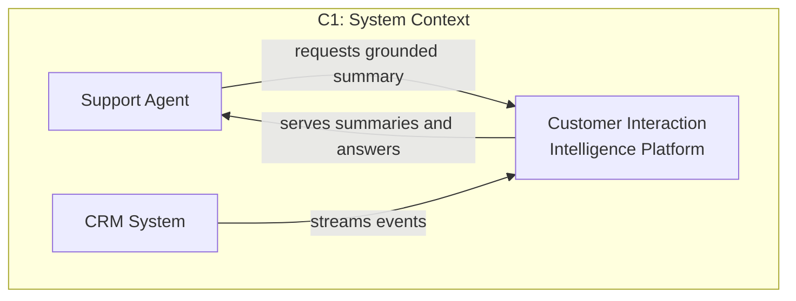
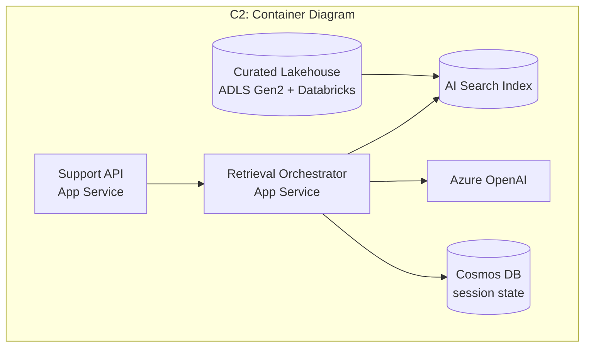
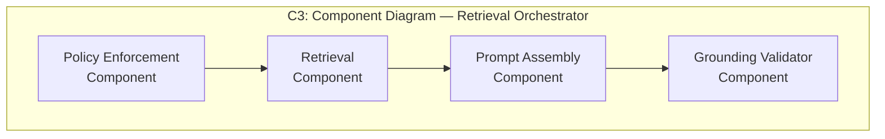
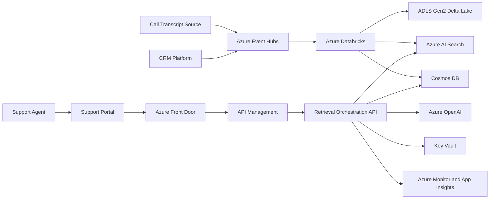
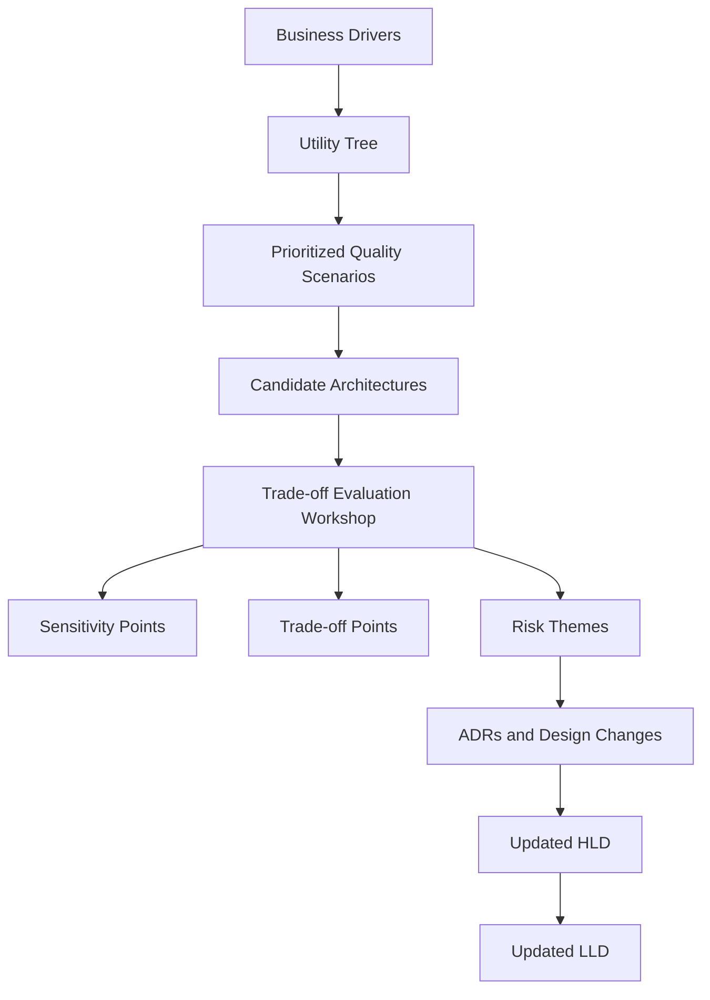
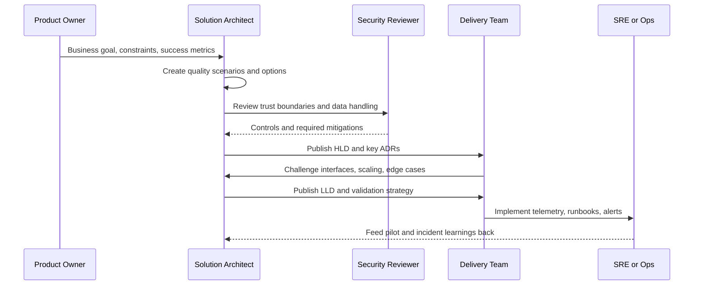

# Solution Architecture Practice

> Part of the **Enterprise Data & AI Architecture Handbook** · Phase-01 - Enterprise Architecture Foundations · Chapter 04.
> Estimated study time: **60 min reading + ~4h labs**.
> **Prerequisites:** read [Enterprise Architecture Foundations](01_Enterprise_Architecture_Foundations.md) first.

---

## Executive Summary

[Enterprise Architecture Foundations](01_Enterprise_Architecture_Foundations.md#core-concepts) established the enterprise-level frame: capabilities, domains, principles, standards, and reference architectures. **Solution architecture practice** is the discipline that turns that enterprise intent into a design for one concrete initiative under real delivery constraints: limited budget, fixed deadlines, compliance obligations, uneven team maturity, legacy dependencies, and quality targets that are usually in tension with one another. The job is not to draw a pleasant diagram. The job is to produce a design that is traceable from business outcome to runtime behavior, explicit about constraints, honest about trade-offs, and concrete enough that delivery teams can implement it without inventing the critical details themselves.

A mature solution architect starts with **requirements, constraints, and quality attributes**, not services. Functional requirements explain what the system must do; constraints explain what it is not free to change; quality attributes define how well it must behave under measurable conditions. The architecture work then moves through a repeatable decision flow: identify stakeholders and concerns, capture non-functional requirements as measurable scenarios, generate viable options, run an **ATAM-style trade-off analysis**, express the system using clear **views and viewpoints** such as the **C4 model**, and publish both a high-level design and a low-level design that can survive contact with real implementation.

This chapter uses a recurring workload as a running example: a **Customer Interaction Intelligence Platform** that ingests CRM events and call transcripts, curates customer context in a lakehouse, powers a support-assistant experience, and exposes governed APIs for downstream teams. The platform bias remains **Azure-primary (~60%)**: Azure Front Door, API Management, App Service or AKS, Event Hubs, Azure Databricks, ADLS Gen2, Cosmos DB, Azure AI Search, Azure OpenAI, Managed Identity, Key Vault, Private Link, Azure Monitor, and Bicep/Terraform for reproducible delivery. The supporting **~30% open-source layer** includes Terraform, GitHub Actions, Backstage, Structurizr, C4 PlantUML, OpenTelemetry, Prometheus, Grafana, PostgreSQL, and Kubernetes. **AWS and GCP remain comparison-only (~10%)**, used to sharpen selection criteria rather than to duplicate full implementations.

**Bottom line:** solution architecture is a decision-making practice, not a drawing practice. If the design does not state the business goal, quality budgets, constraints, assumptions, alternatives rejected, and the exact artifacts the engineering team needs next, it is incomplete no matter how polished the diagram looks. The most reliable architects are the ones who make the trade-offs visible early, keep non-functional requirements measurable, and leave behind HLD and LLD artifacts that reduce ambiguity instead of merely redistributing it.

---

## Learning Objectives

By the end of this chapter you will be able to:

1. **Separate requirements, constraints, and assumptions** and show how each one changes the solution design.
2. **Treat non-functional requirements as first-class design inputs** by turning vague goals into measurable quality attribute scenarios.
3. **Run an ATAM-style trade-off analysis** and identify utility, sensitivity points, trade-off points, risks, and risk themes.
4. **Use views and viewpoints correctly**, including the C4 model, to communicate the right level of detail to different stakeholders.
5. **Produce a defensible HLD** that is concrete enough for review but not overloaded with implementation trivia.
6. **Produce an implementation-ready LLD** that removes ambiguity around interfaces, scaling, security, and operational behavior.
7. **Write AI-specific quality-attribute scenarios** for inference latency, feature/context freshness, and cost per prediction.
8. **Define and enforce architecture fitness functions in CI**, and choose between strangler-pattern and big-bang migration strategies.
9. **Map architectural decisions onto Azure services and deployment choices** without turning service selection into the architecture itself.
10. **Recognize the anti-patterns that make architecture documents unreadable or operationally useless** and replace them with high-signal artifacts.

---

## Business Motivation

Solution architecture exists because the cost of ambiguous design is paid later, in a more expensive form:

- **Requirements that are not translated into architecture become delivery churn.** Teams build plausible interpretations, integration mismatches appear late, and the program pays in rework rather than analysis.
- **Vague non-functional requirements create hidden risk.** Saying a platform must be scalable, secure, or resilient is not useful; measurable targets are what drive topology, service choice, testing, and budget.
- **A missing design boundary turns every team into a system integrator.** When ownership, interfaces, and failure modes are underspecified, implementation teams spend cycles negotiating architecture in code reviews and incidents instead of in the design phase.
- **Trade-offs made implicitly are usually revisited during outages.** If availability, latency, and cost were never explicitly balanced, the system still made those choices, just accidentally.
- **Senior review capacity is limited.** A clear HLD and LLD let architecture, security, operations, and product stakeholders review the same proposal without re-deriving it from slides and oral history.
- **Good solution architecture shortens time-to-value.** The fastest teams are not those that skip design; they are the ones that right-size it and eliminate ambiguity before expensive implementation begins.

For a data and AI architect, this turns a statement like `build a customer support copilot` into a disciplined architecture problem: define response-time targets, data freshness needs, grounding sources, data residency constraints, failure behavior, human-review boundaries, and cost ceilings before choosing Azure OpenAI, AI Search, Databricks, or AKS.

---

## History and Evolution

- **2000 - IEEE Std 1471-2000**, later superseded by **ISO/IEC/IEEE 42010**, formalized the concept of architecture descriptions, views, viewpoints, stakeholders, and concerns, giving architecture communication a rigorous vocabulary beyond ad hoc diagramming.
- **1995 - Kruchten's 4+1 view model** made it normal to describe software systems through multiple complementary views rather than a single master diagram.
- **Late 1990s - ATAM and quality attribute scenario thinking** emerged from the Software Engineering Institute, making architectural trade-off analysis a structured activity instead of intuition plus seniority.
- **2000s - UML and RUP popularized HLD and LLD artifacts**, though often with too much ceremony and too many diagrams disconnected from runtime realities.
- **2010s - Cloud and microservices changed the shape of solution architecture**, making deployment topology, IAM boundaries, observability, elasticity, and cost first-class design concerns.
- **2011 onward - docs-as-code practices** brought architecture documents back into the same version-controlled workflow as source code and infrastructure code.
- **2018 onward - the C4 model** gained wide adoption because it expressed context, containers, components, and code-level detail in a way teams could actually maintain.
- **2020 onward - platform engineering** changed the architect's job from designing every stack from scratch to adapting reference architectures and paved roads responsibly.
- **2023-2026 - AI workloads** forced solution architecture to add prompt safety, retrieval quality, model latency, token cost, evaluation harnesses, and human oversight to the list of non-functional and governance concerns.

The direction of travel is clear: modern solution architecture is lighter than old document-heavy processes, but more rigorous about measurable operational behavior.

---

## Why This Technology Exists

Solution architecture practice exists because real projects need a disciplined bridge between enterprise intent and implementation detail:

- **Business goals need translation into technical structure.** A capability or product goal does not automatically imply service boundaries, data flows, storage models, or operational controls.
- **Stakeholders have different concerns that cannot be satisfied by one diagram.** Executives need cost and risk visibility; engineers need interfaces and scaling rules; operators need failure modes and observability paths.
- **Most important design choices are trade-offs, not absolutes.** Lower latency may increase cost; stricter isolation may reduce delivery speed; stronger consistency may lower throughput.
- **Cloud platforms create an illusion of easy choice.** Many services appear to solve the same problem, but their fit depends on quality attributes, team capability, governance, and integration needs.
- **Implementation teams need usable artifacts, not abstract principles alone.** Reference architectures from [Enterprise Architecture Foundations](01_Enterprise_Architecture_Foundations.md#core-concepts) reduce the option space, but solution architecture still must adapt them to a specific workload.
- **Architecture debt compounds quickly when design assumptions are left implicit.** Solution architecture makes assumptions visible early, while they are still cheap to challenge.

---

## Problems It Solves

- **Creates a shared design baseline** across product, engineering, security, operations, and data teams.
- **Turns non-functional requirements into architecture constraints** that affect topology, service selection, and test strategy.
- **Prevents teams from over-designing or under-designing** by matching architecture depth to risk, complexity, and reversibility.
- **Exposes critical trade-offs before implementation**, when alternatives are still practical.
- **Makes integration boundaries explicit**, reducing duplicated interpretation work across teams.
- **Provides a handoff from strategy to delivery** that remains traceable through code, infrastructure, and operations.

---

## Problems It Cannot Solve

- **It cannot fix unclear business ownership.** If nobody can decide which outcome matters most, the architecture cannot optimize correctly.
- **It cannot compensate for missing delivery capability.** A sound design still fails if the team cannot operate the chosen platform or maintain the required controls.
- **It cannot predict every future change.** Architecture should be robust and adaptable, not clairvoyant.
- **It cannot eliminate the need for engineering judgment during delivery.** HLD and LLD reduce ambiguity; they do not replace competent implementation decisions.
- **It cannot make a poor operating model safe.** If incident response, testing, change management, or access control are weak, the architecture document will not save the system.
- **It cannot substitute for governance.** Architecture must still pass review, produce ADRs for significant choices, and conform to principles and standards.

---

## Core Concepts

### 4.1 Requirements, constraints, and assumptions

A solution architect should separate three categories immediately. **Requirements** describe what the system must achieve: for the running example, a support agent must retrieve a current customer summary, grounded on approved sources, in less than 2.5 seconds at p95. **Constraints** are immovable or expensive-to-change conditions: customer data must remain in EU regions, the team must use the enterprise identity platform, and deployment must fit the approved Azure landing zone and tagging standards inherited from [Enterprise Architecture Foundations](01_Enterprise_Architecture_Foundations.md#core-concepts). **Assumptions** are working beliefs that may later be validated or overturned: call volume is expected to peak at 8,000 concurrent sessions; the first release can tolerate 5-minute data freshness for most insights; model-generated recommendations are advisory, not autonomous.

Confusing these categories is one of the fastest ways to design the wrong thing. Teams often encode assumptions as hard architecture, or treat constraints as negotiable preferences. A mature HLD keeps all three visible and labeled.

### 4.2 Quality attributes and non-functional requirements as first-class citizens

Non-functional requirements should be written as **quality attribute scenarios**, not slogans. A useful scenario includes source, stimulus, environment, artifact, response, and response measure. Examples for the running workload:

- **Performance:** When 2,000 support agents submit concurrent summary requests during peak business hours, the API must return a grounded answer within 2.5 seconds at p95 and 4 seconds at p99.
- **Availability:** During a single-zone failure in the primary region, the customer summary API must continue serving without data loss for committed customer profile updates.
- **Security:** When an unauthorized service attempts to read PII-bearing transcript summaries, access must be denied through managed identity and network controls, and the event must be logged centrally within 60 seconds.
- **Modifiability:** A new downstream enrichment model must be deployable in two sprints without changing producer contracts or reprocessing the full historical lake.
- **Cost:** Monthly run cost for the first production release must stay below the agreed operating envelope, with model inference cost visible per channel and business unit.

These scenarios force the design to become testable. If a requirement cannot be validated, it is not ready to govern the architecture.

### 4.3 Trade-off analysis using an ATAM-style approach

ATAM is valuable because it makes architectural review concrete. The sequence is straightforward: identify business drivers, build a utility tree, prioritize scenarios, evaluate candidate architectures, and identify **sensitivity points** and **trade-off points**. In the running example, a sensitivity point might be the decision to keep synchronous grounding calls within the user request path; a small increase in retrieval latency could materially change user experience. A trade-off point might be choosing AKS for maximal control versus App Service for simpler operations; the former improves extensibility and runtime customization but raises operational burden and cost.

The most important output is not a score. It is a set of explicit risks and risk themes: for example, the design may be robust on availability but fragile on token-cost growth if prompt size is uncontrolled and retrieval chunks are unbounded.

### 4.4 Views, viewpoints, and the C4 model

A **viewpoint** defines how to construct a view for a particular stakeholder concern; a **view** is the resulting artifact. ISO 42010 gives the language, while the **C4 model** gives a pragmatic structure many teams can actually maintain:

- **Context:** who uses the system and which external systems it depends on.
- **Container:** deployable/runtime building blocks such as web apps, APIs, batch pipelines, databases, and search indexes.
- **Component:** internal responsibilities inside a container, such as retrieval orchestration, policy enforcement, or feature materialization.
- **Code:** selective detail where implementation complexity or risk justifies it.

C4 is not the only valid structure, but it has a useful property: it scales from executive briefing to delivery handoff without pretending one diagram can serve every audience.

**Worked example — Customer Interaction Intelligence Platform.** The three C4 levels most teams maintain in practice, applied to the running example:







The **Code** level (the fourth C) is used selectively here, for example a sequence diagram of the grounding-validator's retry and citation-check logic, only where implementation risk justifies the extra detail rather than as a blanket requirement for every component.

### 4.5 Producing HLD and LLD artifacts

A strong **HLD** should answer: what problem is being solved, for whom, under which constraints, with which target quality attributes, and at what system boundary. It typically contains the business context, scope boundaries, major integrations, context and container diagrams, a deployment view, NFR budgets, major risks, and the key ADRs that shape the design. It should not drown the reader in individual API fields or thread-pool settings.

A strong **LLD** answers: how exactly will this be built and operated. It should contain interface contracts, schema definitions, sequence diagrams, component decomposition, retry and idempotency rules, cache behavior, scaling thresholds, network rules, secrets handling, failure scenarios, telemetry schema, alert definitions, and test approach. If the HLD tells reviewers whether the design is sound, the LLD tells implementers whether it is unambiguous.

### 4.6 AI-specific quality-attribute scenarios

Generic performance, availability, and security scenarios are not sufficient for AI and analytics workloads. Add a distinct scenario category for AI-specific quality attributes, written with the same source/stimulus/environment/artifact/response/response-measure discipline as section 4.2:

- **Inference latency:** When a support agent requests a grounded answer during peak load, the Azure OpenAI completion call plus retrieval must return within a 1.8-second sub-budget of the overall 2.5-second p95 API target, measured separately from retrieval and network latency so a regression in model latency is attributable rather than hidden inside the total.
- **Feature/context freshness:** When a customer's CRM record changes, the curated feature or context used for grounding must reflect that change within 5 minutes at p95, measured from CDC event timestamp to searchable index update, so stale-context answers can be diagnosed as a freshness-budget breach rather than a model-quality problem.
- **Cost per prediction:** When the platform serves grounded answers in production, the fully loaded cost per answer (model tokens, retrieval compute, and index serving cost) must stay below an agreed ceiling per interaction, tracked per channel and business unit, so cost growth from prompt-size creep or retrieval over-fetching is visible before it becomes a budget incident rather than after.

These scenarios matter architecturally because they decompose an AI system's user-visible latency and cost into budgeted sub-components (retrieval, inference, grounding validation) the same way a traditional system decomposes p95 latency into database, network, and application-tier budgets.

### 4.7 Fitness functions and evolutionary architecture

An **architecture fitness function** is any automated, repeatable check that verifies an architectural characteristic holds, run the same way a unit test verifies functional correctness. The idea, popularized by *Building Evolutionary Architectures* (Ford, Parsons, Kua), turns architectural intent that would otherwise live only in an ADR or a diagram into something CI can enforce on every change.

Practical fitness functions for the running example:

- **Dependency-direction fitness function:** a static-analysis rule (e.g. ArchUnit-style or a custom lint) that fails the build if the Retrieval component imports directly from the Prompt Assembly component's internals instead of its published interface, protecting the component boundaries drawn in the C3 diagram above.
- **Latency fitness function:** a CI-triggered synthetic load test that fails the pipeline if p95 retrieval latency regresses beyond the 1.8-second AI-inference-latency budget defined in section 4.6, run against every release candidate before production promotion.
- **Data-residency fitness function:** a policy-as-code check (Azure Policy or OPA/Conftest against Bicep/Terraform plans) that fails deployment if any storage or compute resource is provisioned outside the approved EU regions constraint from section 4.1.
- **Cost fitness function:** a scheduled job that queries actual cost-per-prediction telemetry and fails a dashboard/alert threshold (not the build itself, since this is a runtime rather than build-time characteristic) if the section 4.6 cost ceiling is breached for more than one day.

Fitness functions are what make an architecture **evolutionary** rather than merely diagrammed: instead of relying on periodic architecture review to catch drift, the system continuously verifies its own characteristics and fails fast when a change violates one, the same discipline [Architecture Decision Records](03_Architecture_Decision_Records.md) applies to decisions rather than to running characteristics.

**Migration strategy — incremental versus big-bang.** The **strangler pattern** is the default evolutionary-migration approach: place a facade (here, API Management) in front of the legacy or existing capability, route an increasing share of traffic to the new implementation behind that stable facade, and decommission the old path only once the new one has proven itself under real production load. Apply strangler-style migration when the legacy system must stay operational throughout the change, when risk tolerance for a single cutover is low, or when the replacement is large enough that a big-bang rewrite would take longer than the business can wait for value. Reserve a **big-bang migration** for cases where the legacy system is small, low-risk, already fully replaced in a non-production environment, or where running two implementations in parallel is not feasible (for example, a schema change with no safe dual-write path). For the running example, a strangler migration would mean routing new AI-summary traffic through API Management to the new Retrieval Orchestrator while legacy CRM-only lookups continue serving from the old system until the lakehouse-backed summaries are validated at full production volume.

### 4.8 Example ADR inside solution architecture

The following is a representative ADR for a solution-level decision:

```markdown
# ADR-0041: Use API Management plus App Service for synchronous support APIs

## Context
The support-assistant workload needs a governed external API boundary,
centralized policy enforcement, low operational overhead, and p95 latency
below 2.5 seconds. The initial release expects moderate traffic growth and
requires OAuth2, request throttling, and private backend connectivity.

## Decision
Expose synchronous APIs through Azure API Management and host the primary
retrieval-orchestration service on Azure App Service Premium v3 rather than
AKS for the first production release.

## Consequences
- Positive: lower day-2 operational burden than AKS, faster team ramp-up,
  built-in deployment slots, simpler patching model, and clear API policy
  enforcement at the edge.
- Positive: App Service scaling characteristics are sufficient for the
  expected request volume and the workload remains stateless.
- Negative: less control over sidecars, service mesh patterns, and certain
  custom networking/runtime behaviors than AKS would allow.
- Accepted trade-off: if request volume, custom protocol needs, or runtime
  extensibility outgrow App Service, the API layer can remain stable while
  the backend migrates to AKS behind the same API Management boundary.

## Alternatives Considered
- AKS plus NGINX ingress: rejected for first release because the operational
  tax was too high for the current team maturity and traffic profile.
- Azure Functions: rejected for the main synchronous API because cold-start
  and execution-shape risks complicated the latency budget.
- Direct App Service exposure without API Management: rejected because policy,
  throttling, and consumer governance would be weaker.
```

This is the right level of brevity: enough to preserve rationale, not so much that nobody writes it.

---

## Internal Working

A practical solution architecture workflow usually follows this sequence:

1. **Intake and framing:** define business outcome, in-scope and out-of-scope capabilities, sponsors, and success criteria.
2. **Current-state discovery:** identify existing systems, data sources, standards, reference architectures, and constraints.
3. **Requirement decomposition:** separate functional requirements, constraints, assumptions, and quality attribute scenarios.
4. **Option generation:** produce two or three genuinely distinct viable architectures, not superficial variants of the same design.
5. **ATAM-style evaluation:** prioritize scenarios, identify sensitivity points, trade-off points, and top risks.
6. **HLD publication:** create the stakeholder-ready architecture package with major decisions, diagrams, NFR budgets, and governance actions.
7. **LLD elaboration:** add interfaces, schema, operational runbooks, scaling rules, error handling, and deployment specifics.
8. **Implementation governance:** validate delivery against the design, record deviations explicitly, and update the artifacts if reality changes.
9. **Post-launch feedback:** feed incident learnings, cost data, and operational behavior back into the architecture baseline.

The discipline matters because architecture drift starts the moment delivery begins. The documents are only useful if they stay attached to implementation and operations.

---

## Architecture

The running architecture for the Customer Interaction Intelligence Platform is organized in five layers:

1. **Experience layer:** support-agent web client and internal admin tooling.
2. **Edge and integration layer:** Azure Front Door for global entry, Azure API Management for policy, quota, and versioning, and event ingestion through Event Hubs.
3. **Application layer:** synchronous retrieval-orchestration service, asynchronous enrichment services, policy and redaction service, and workflow coordination.
4. **Data and intelligence layer:** ADLS Gen2 and Delta Lake on Azure Databricks for historical and streaming curation, Cosmos DB for low-latency serving, Azure AI Search for retrieval, and Azure OpenAI for grounded generation.
5. **Platform layer:** Entra ID, Managed Identity, Key Vault, Private Link, Azure Monitor, Log Analytics, Defender for Cloud, and Bicep/Terraform modules running inside the approved landing zone.

This architecture is intentionally hybrid between transactional, analytical, and AI-serving concerns. The important practice lesson is that the HLD should show these layers and their trust boundaries, while the LLD must define what each runtime path is allowed to do, how it fails, and which quality budgets it must respect.

---

## Components

A mature solution-architecture package usually contains these components:

- **Business outcome statement** with measurable success criteria.
- **Stakeholder map** listing decision-makers, implementers, operators, and reviewers.
- **Requirement catalog** with functional requirements, constraints, assumptions, and exclusions.
- **Quality attribute utility tree** with prioritized scenarios and response measures.
- **Architecture views** including context, container, deployment, data flow, and component-level diagrams where needed.
- **Decision log and ADR set** for significant choices and rejected alternatives.
- **Security and trust-boundary summary** covering identity, secrets, network isolation, and data classification.
- **Cost model** with expected steady-state and peak-state behavior.
- **Delivery plan** showing phases, dependencies, and architecture risks.
- **Validation strategy** covering load, failover, security, data-quality, and operational-readiness tests.

For the running Azure workload, runtime components additionally include Front Door, API Management, App Service or AKS, Event Hubs, Databricks, ADLS Gen2, Cosmos DB, AI Search, Azure OpenAI, Key Vault, Private DNS, and Azure Monitor.

---

## Metadata

Solution architecture artifacts need metadata because design without traceability becomes orphaned quickly. Useful fields include:

- Solution owner and accountable executive.
- Version, status, and review date.
- Business capability served.
- Data classification and regulatory scope.
- Target SLOs, RTO, RPO, and freshness targets.
- Expected peak volumes and growth assumptions.
- Environment model and region strategy.
- Linked ADRs, threat model, and delivery epic IDs.
- Approved exceptions and expiry dates.

For the running example, the HLD should carry explicit fields such as `region = westeurope`, `data_residency = EU only`, `p95_api_latency = 2.5s`, and `transcript_retention = 365 days`.

---

## Storage

Storage decisions should be derived from access patterns, durability needs, consistency requirements, and retention rules rather than service familiarity. For the Azure reference workload:

- **Raw and curated analytical storage:** ADLS Gen2 with Delta Lake on Azure Databricks for append-heavy event and transcript processing, schema evolution, and replay.
- **Low-latency serving data:** Cosmos DB when globally distributed document access, autoscale throughput, and millisecond reads matter more than relational joins.
- **Relational control data:** Azure Database for PostgreSQL Flexible Server or Azure SQL Database for workflow state, config, and transactional metadata that benefits from relational constraints.
- **Search and retrieval index:** Azure AI Search when semantic retrieval and filtered grounding are required.
- **Archival retention:** Cool/archive tiers in ADLS with lifecycle management.

The HLD should explain why each store exists. The LLD should specify partition keys, retention policies, backup settings, encryption choices, and expected access patterns.

---

## Compute

Compute selection is where many architectures become technology-first. The right question is not `which compute service do we prefer`; it is `what execution shapes exist in this workload`.

For the running solution:

- **Synchronous stateless APIs:** App Service Premium v3 is often sufficient for predictable HTTP workloads with moderate scale and strong team preference for lower operational overhead.
- **Container-heavy or custom-runtime services:** AKS is justified when sidecars, service mesh, custom scheduling, or mixed long-running services materially matter.
- **Bursty event-driven glue:** Azure Functions or Container Apps can fit narrow, stateless event handlers if latency and runtime limits are acceptable.
- **Large-scale batch and stream transforms:** Azure Databricks is the natural fit for Delta pipelines, stateful streaming, and notebook-to-production workflows.
- **Model inference orchestration:** choose between App Service, AKS, or managed endpoints based on concurrency, control, and GPU needs.

The architecture practice lesson is that compute should be chosen per execution path, not as a single platform identity for the whole solution.

---

## Networking

Networking is not an implementation afterthought. It is a design concern that shapes security, latency, operability, and blast radius.

For an Azure-first design, the HLD should show:

- Hub-spoke or vWAN-connected landing-zone topology.
- Public entry through Front Door and API Management, with private backend connectivity.
- Private Endpoints for storage, databases, search, and secrets.
- DNS resolution strategy for private services.
- Egress control points for calling Azure OpenAI or approved third-party APIs.
- Cross-region traffic behavior and failover routing.

The LLD should then specify subnets, NSGs, route tables, service endpoints versus Private Link, WAF policy scopes, and certificate ownership. If these details are absent, the design is not operationally complete.

---

## Security

Security should be visible in the mainline architecture, not confined to a late review appendix. For the running workload:

- Use **Entra ID** for human and workload identity.
- Prefer **Managed Identity** over stored credentials.
- Use **Key Vault** with private access and rotation policies for secrets and keys.
- Apply **data classification** to transcripts, customer profiles, and generated outputs.
- Enforce **least privilege RBAC** separately for operational, engineering, and data-science personas.
- Keep **PII-bearing paths private** with Private Link and deny public data-plane access where possible.
- Log **access decisions and sensitive operations** centrally for auditability.
- Add **prompt and grounding safety controls** for AI paths: content filtering, prompt-template governance, allowed source indexes, and redaction before model calls.

A secure architecture is not the most locked-down diagram; it is the one where controls align to the actual trust boundaries and data movement paths.

---

## Performance

Performance architecture requires budgets, not adjectives. The HLD should set an end-to-end latency budget and allocate it by hop. A representative budget for the running solution might be:

- Front Door and APIM overhead: 150 ms.
- Retrieval-orchestration service: 300 ms.
- Search and grounding retrieval: 700 ms.
- Model inference and answer assembly: 1,000 ms.
- Safety checks and serialization: 250 ms.

That leaves limited slack before the 2.5 second p95 target is breached. This forces concrete design choices: bounded prompt size, precomputed customer summaries, warm compute, cached metadata, and avoiding unnecessary synchronous dependencies in the request path.

---

## Scalability

Scalability should be designed per bottleneck rather than assumed globally. In the running architecture, scale behavior differs by subsystem:

- App Service or AKS scales on concurrent HTTP load.
- Event Hubs scales on throughput units or partitions.
- Databricks scales by cluster policy, job concurrency, and structured-streaming state behavior.
- Cosmos DB scales by partitioning quality and RU allocation.
- Azure AI Search scales by replicas and partitions.
- Azure OpenAI scaling depends on deployment quota and token consumption patterns.

A scalable architecture defines where horizontal scaling works, where partitioning is required, where backpressure exists, and which paths degrade first under surge.

---

## Fault Tolerance

Fault tolerance is the architecture of acceptable failure. For the running workload:

- Use zone-redundant services where supported for the synchronous serving path.
- Keep asynchronous ingestion replayable through Event Hubs retention and Delta bronze data.
- Make enrichment services idempotent.
- Separate user-facing APIs from long-running enrichment so partial failure does not take down all capabilities.
- Define circuit breakers and fallback responses when grounding or model calls exceed latency budgets.
- Decide explicitly which failures cause a degraded answer, which cause a retry, and which must fail closed.

The HLD should define regional strategy and failure domains; the LLD should define timeouts, retries, poison-message handling, replay procedures, and restore steps.

---

## Cost Optimization

Cost should be modeled as an architectural property from day one. Common high-cost areas in this kind of solution are model inference, idle compute, search replicas, and poor storage lifecycle discipline.

Useful design practices include:

- Keep synchronous prompts small and bounded.
- Precompute expensive enrichments asynchronously where user experience allows.
- Match service tiers to actual concurrency and SLOs rather than prestige.
- Use autoscale deliberately and test whether it reacts fast enough for the workload shape.
- Put retention and tiering policies on raw transcript data early.
- Surface unit economics such as cost per 1,000 support interactions or cost per generated summary.

An architecture that cannot explain its likely cost profile is incomplete.

---

## Monitoring

Monitoring should answer whether the workload is healthy right now. For Azure, that typically means:

- Azure Monitor metrics and alerts for Front Door, APIM, App Service or AKS, Event Hubs, Databricks, Cosmos DB, AI Search, and OpenAI quota behavior.
- Application Insights for request rates, dependency latency, failures, and availability tests.
- Log Analytics workspaces with standardized retention and tables for security and operational events.
- Data-pipeline checks for freshness, late-arriving events, and failed jobs.
- Cost alerts tied to service tags and business unit tags.

Good monitoring is tiered: service health, workload SLOs, business outcome signals, and cost anomalies.

---

## Observability

Observability answers why the system behaved the way it did. For modern solution architecture this means:

- Standardized correlation IDs across edge, API, orchestration, data pipelines, and model calls.
- OpenTelemetry traces for synchronous request paths.
- Structured logs with stable field names and redaction rules.
- Business-event telemetry such as `summary_generated`, `grounding_source_missing`, or `fallback_answer_returned`.
- Clear ownership of telemetry schemas so downstream analytics and SRE workflows remain stable.

The design should show where traces start and end, where context propagation can break, and which telemetry is legally sensitive.

---

## Governance

Solution architecture sits inside a governance loop even when the delivery team is moving quickly. The architecture package should state:

- Which enterprise principles from [Enterprise Architecture Foundations](01_Enterprise_Architecture_Foundations.md#core-concepts) are being instantiated.
- Which reference architecture is being followed, adapted, or intentionally deviated from.
- Which decisions require ADRs.
- Which security, privacy, and operational reviews are mandatory.
- Which exceptions have been approved and when they expire.
- Which readiness gates must be passed before production.

Governance should not be a late surprise. If a design needs private networking, model-risk review, or data-protection sign-off, that needs to be visible in the HLD.

---

## Trade-offs

| Decision area | Option A | Option B | Main trade-off |
|---|---|---|---|
| API hosting | App Service Premium v3 | AKS | Lower ops burden versus higher runtime control |
| Event transport | Event Hubs | Service Bus | High-throughput event streaming versus richer queue semantics |
| Serving store | Cosmos DB | PostgreSQL | Global low-latency document access versus relational flexibility |
| Search layer | Azure AI Search | PostgreSQL plus pgvector | Managed semantic retrieval versus lower platform sprawl |
| Transform engine | Databricks | Functions plus SQL | Large-scale stream and batch power versus simpler platform surface |
| Network exposure | Front Door plus APIM | APIM only | Better global edge and WAF posture versus lower component count |
| DR posture | Active-passive regional failover | Active-active | Lower cost and simpler correctness versus lower failover impact |

The architect's job is not to eliminate trade-offs. It is to make them visible and intentional.

---

## Decision Matrix

| Situation | Recommended architectural choice |
|---|---|
| Latency-sensitive HTTP API with standard protocols and moderate scale | Start with App Service Premium v3 behind API Management |
| Need for sidecars, service mesh, or custom networking/runtime control | Use AKS |
| High-volume immutable event ingestion and replay | Use Event Hubs plus Delta bronze landing |
| Search-driven grounding with filters, ranking, and semantic retrieval | Use Azure AI Search |
| Strong relational rules and moderate transactional workload | Use Azure SQL Database or PostgreSQL Flexible Server |
| Large-scale batch and stream curation with Delta semantics | Use Azure Databricks |
| Strict private connectivity and audit requirements | Use Private Link, Managed Identity, and deny public data-plane access |
| Unclear reversibility or high blast radius choice | Write an ADR and escalate the review depth |

---

## Design Patterns

- **Quality attribute scenario pattern:** define measurable scenarios before choosing services.
- **C4 plus deployment-view pattern:** pair logical structure with runtime placement and trust boundaries.
- **Edge/API/core decomposition:** separate policy enforcement from business orchestration and data processing.
- **Asynchronous precomputation pattern:** move expensive enrichment out of user-facing request paths when freshness allows.
- **Bulkhead pattern:** isolate synchronous user experience from asynchronous enrichment and analytics workloads.
- **Strangler pattern:** use when replacing a legacy subsystem incrementally rather than through big-bang migration.
- **Docs-as-code architecture pack:** keep HLD, LLD, ADRs, diagrams, and IaC in the same repository and review workflow.

---

## Anti-patterns

- **Technology-first architecture:** choosing AKS, Databricks, or any other platform before stating the quality attributes that justify it.
- **Single-diagram architecture:** trying to satisfy executives, engineers, SREs, and auditors with one picture.
- **Vague NFRs:** words such as scalable, secure, and reliable with no measure attached.
- **Reference-architecture cargo culting:** copying the enterprise pattern without checking whether the workload actually has the same risk profile.
- **Operational blind spots:** no defined fallback behavior, timeout policy, or telemetry ownership.
- **HLD/LLD drift:** documents and implementation diverge, but nobody updates either or records the deviation.

---

## Common Mistakes

- Treating assumptions as facts and hard-coding them into the design.
- Skipping alternatives analysis because the team already likes one stack.
- Writing an HLD that is really just a service inventory.
- Writing an LLD that is really just a code walkthrough.
- Ignoring data classification until after schema and storage choices are locked in.
- Forgetting to budget latency across dependencies and then discovering the SLA is impossible.
- Designing for theoretical internet scale when the real first-year traffic profile is moderate.
- Failing to define what degraded mode should look like during dependency failure.

---

## Best Practices

- Start with business outcome, constraints, and measurable quality attributes.
- Force at least two viable design options through a structured trade-off review.
- Keep diagrams tied to stakeholder concerns and label trust boundaries clearly.
- Publish HLD and LLD as versioned, reviewable artifacts in source control.
- Use ADRs for decisions that materially shape topology, operations, or cost.
- Put runbooks, alert rules, and test strategy into the LLD rather than treating them as later operations work.
- Revisit architecture after pilot and after first production incidents; reality is valuable input.
- Prefer the simplest design that meets the quality targets with acceptable headroom.

---

## Enterprise Recommendations

- Standardize an architecture pack template containing HLD, LLD, ADRs, diagram source, threat summary, and NFR matrix.
- Require quality attribute scenarios in every architecture review, not just functional requirements.
- Train teams on ATAM-style workshops so trade-off analysis becomes repeatable rather than personality-driven.
- Adopt a default C4-based viewpoint set for context and container diagrams, but allow extra views where stakeholder concerns justify them.
- Make architecture docs part of the same pull-request workflow as code and IaC.
- Track implementation deviations explicitly and decide whether the documents or the code should change.
- Review cost, resilience, and observability choices as first-class architecture topics, not post-design concerns.

---

## Azure Implementation

A practical Azure-first implementation pattern for solution architecture looks like this:

- Keep the architecture pack in the same repository as Bicep/Terraform, pipeline definitions, ADRs, and diagram source.
- Use Azure Front Door Standard or Premium plus API Management as the controlled edge.
- Use App Service Premium v3 for the first synchronous API release unless a clear control-plane reason justifies AKS.
- Use Event Hubs Standard or Dedicated based on throughput profile, with Capture or downstream landing into ADLS Gen2.
- Use Azure Databricks with cluster policies and Unity Catalog for curated data and streaming transforms.
- Use Cosmos DB autoscale for low-latency serving and Azure AI Search for retrieval.
- Use Key Vault, Managed Identity, Private Link, and Azure Policy as non-negotiable platform controls.
- Use Azure Monitor, Application Insights, Managed Prometheus, and Managed Grafana for the operational surface.

A minimal Bicep excerpt that makes quality posture visible in IaC is often more valuable than a slide:

```bicep
param env string
param location string = resourceGroup().location
param apiPlanSku string = 'P1v3'

resource plan 'Microsoft.Web/serverfarms@2023-12-01' = {
  name: 'plan-${env}-ciip-api'
  location: location
  sku: {
    name: apiPlanSku
    tier: 'PremiumV3'
    capacity: 2
  }
  properties: {
    zoneRedundant: true
  }
  tags: {
    workload: 'customer-interaction-intelligence'
    qualityTier: 'gold'
    rto: 'PT30M'
    rpo: 'PT15M'
    dataClass: 'confidential'
  }
}
```

A useful repository layout is equally concrete:

```text
/architecture
  /hld
  /lld
  /adr
  /diagrams
  /runbooks
  /threat-model
/iac
  /bicep
  /terraform
/platform-tests
```

The implementation detail worth defending is not the folder structure itself. It is that architecture, infrastructure, and operational intent live in one reviewable workflow.

---

## Open Source Implementation

The open-source complement to this practice is strong and mature:

- **Structurizr** or **C4 PlantUML** for versionable architecture diagrams.
- **Terraform** for infrastructure reproducibility across Azure and comparison environments.
- **GitHub Actions** or Jenkins for docs-as-code validation.
- **Backstage** for discoverable architecture and service metadata.
- **OpenTelemetry**, **Prometheus**, and **Grafana** for standardized observability.
- **Kubernetes** when workload shape truly demands control beyond managed PaaS options.
- **PostgreSQL** and **pgvector** as open alternatives where managed search or document stores are unnecessary.

A minimal documentation validation workflow can be simple:

```yaml
name: architecture-checks
on:
  pull_request:
    paths:
      - 'architecture/**'
      - 'iac/**'
jobs:
  validate:
    runs-on: ubuntu-latest
    steps:
      - uses: actions/checkout@v4
      - run: terraform fmt -check -recursive
      - run: npx @mermaid-js/mermaid-cli -i architecture/diagrams -o /tmp/diagrams
      - run: npx markdown-link-check architecture/hld/index.md
```

The practice benefit is consistency: diagrams render, links resolve, and infrastructure formatting is checked in the same pull request that changes the design.

---

## AWS Equivalent (comparison only)

AWS supports the same practice, but the service mapping shifts: Azure Front Door and API Management map broadly to CloudFront and API Gateway; App Service or AKS map to Elastic Beanstalk, ECS, EKS, or App Runner depending on control needs; Event Hubs maps to Kinesis; ADLS Gen2 and Databricks map to S3 plus EMR or Databricks on AWS; Cosmos DB maps to DynamoDB or DocumentDB depending on access pattern; Azure AI Search maps to OpenSearch Service; Azure OpenAI maps to Bedrock or model endpoints on SageMaker. The main trade-off is not capability absence but operational ergonomics and existing enterprise standards. Azure tends to be stronger where Entra ID, landing zones, and Microsoft estate integration are already foundational.

---

## GCP Equivalent (comparison only)

On GCP, the broad equivalents are Cloud Load Balancing plus Apigee or API Gateway, Cloud Run or GKE for serving, Pub/Sub for event transport, BigQuery and Dataproc for analytics, AlloyDB or Cloud SQL for relational state, Vertex AI Search or custom vector solutions for retrieval, and Vertex AI for model serving. GCP often offers elegant serverless and analytics ergonomics, while Azure can be a better organizational fit when identity, office productivity, enterprise governance, and Microsoft-first security tooling are already the enterprise norm. The selection criterion is still the same: choose the platform whose operational model and governance fit the organization's constraints, not just the one whose service catalog looks familiar.

---

## Migration Considerations

Teams moving toward mature solution architecture usually face one of four transitions:

- **From slideware to docs-as-code:** migrate architecture artifacts into version control first; refine structure second.
- **From monolith-first design language to cloud-native design language:** add deployment topology, IAM boundaries, observability, and cost as core architecture sections.
- **From vague NFRs to measurable quality budgets:** retrofit utility trees and quality attribute scenarios onto in-flight designs and use them to prioritize remediation.
- **From project-centric to product-centric architecture:** keep the architecture pack alive after first release so it evolves with the product rather than freezing as a pre-build artifact.

Do not attempt a perfect process rollout. Start with a standard template, enforce a small number of mandatory sections, and improve from observed failure patterns.

---

## Mermaid Architecture Diagrams

**Context and container view for the running solution:**



**ATAM-style evaluation flow:**



**HLD to LLD to delivery sequence:**



---

## End-to-End Data Flow

For the running Azure workload, the end-to-end path looks like this:

1. CRM events and transcript artifacts land in Event Hubs through approved ingestion adapters.
2. Azure Databricks structured-streaming jobs persist raw data into ADLS Gen2 bronze tables.
3. Curation pipelines standardize, redact, classify, and enrich data into silver and gold Delta tables.
4. Materialized customer summary views are pushed into Cosmos DB for low-latency serving.
5. Searchable grounding content is indexed into Azure AI Search with metadata filters for channel, region, and sensitivity.
6. A support agent calls the synchronous API through Front Door and API Management.
7. The retrieval-orchestration service fetches current customer state from Cosmos DB, grounding passages from AI Search, and composes a bounded prompt for Azure OpenAI.
8. The generated answer is checked for policy compliance, returned to the client, and logged with trace context and business events.
9. Operational telemetry flows to Application Insights, Log Analytics, Prometheus, and Grafana; cost and quality dashboards track token consumption, latency, and fallback rates.
10. If a downstream dependency is degraded, the API returns a bounded fallback such as last-known summary or a reduced response mode rather than timing out blindly.

This is what a solution architecture should make obvious: not only where the data goes, but which parts of the path are synchronous, which are replayable, and where degradation is acceptable.

---

## Real-world Business Use Cases

- **Retail customer support acceleration:** unify CRM, order history, returns, and transcript analysis to reduce average handling time while keeping customer data governed.
- **Banking fraud triage:** combine streaming transaction signals, case data, and analyst workflows to produce low-latency investigative summaries under strict audit requirements.
- **Manufacturing service operations:** merge telemetry, maintenance history, technician notes, and manuals to support assisted troubleshooting and spare-parts decisions.

Each of these is less about one specific service and more about disciplined handling of quality attributes, security boundaries, and implementation artifacts.

---

## Industry Examples

- **Microsoft's Azure Architecture Center and Well-Architected guidance** are effectively curated viewpoint libraries for common Azure workloads.
- **Google's production-readiness review culture** demonstrates that architecture quality is inseparable from operability, failure testing, and launch discipline.
- **Amazon's one-way door versus two-way door decision framing** is highly relevant to solution architecture because it calibrates review depth and reversibility assumptions.
- **Databricks reference architectures** show how a good platform pattern shortens option space while still requiring workload-specific decisions on freshness, isolation, and serving paths.

---

## Case Studies

**Case Study 1 - Good functional design, failed latency budget.** A support-assistant program produced clean feature lists and convincing diagrams but never allocated a latency budget across dependencies. By the time integrated testing started, synchronous retrieval, policy checks, and model inference together could not meet the promised p95 response target. The fix was architectural, not tuning-only: precompute summaries, shrink prompt size, cache policy metadata, and remove one synchronous dependency from the request path. The lesson is simple: latency must be budgeted during design, not discovered in performance testing.

**Case Study 2 - AKS chosen for prestige, not need.** A team selected AKS for an internal API workload with moderate traffic, no sidecars, and limited platform experience. The result was a long delivery runway, higher security and patching burden, and recurring operational toil. A review later showed App Service plus API Management would have met all requirements with materially lower cost and risk. The failure was not technical incompetence; it was architecture driven by platform aspiration instead of quality attributes.

**Case Study 3 - HLD and LLD drift caused a production incident.** The HLD specified private connectivity for all data-plane services, but the implementation introduced one public endpoint during a delivery crunch. The exception was never documented. During a later policy rollout, access was blocked unexpectedly and a user-facing outage followed. The core problem was governance drift: architecture artifacts were not kept aligned with reality and no ADR or exception record captured the change.

---

## Hands-on Labs

1. **Write a utility tree** for a real workload, with at least five measurable quality scenarios and explicit priority.
2. **Produce a C4 context and container diagram** for the workload and identify one stakeholder who would still need a different view.
3. **Create an HLD skeleton** containing scope, constraints, NFR matrix, context diagram, container diagram, deployment view, cost estimate, and ADR list.
4. **Create an LLD excerpt** containing one API contract, one sequence diagram, retry rules, and alert definitions for a critical path.
5. **Run a lightweight ATAM workshop** with two alternative architectures and record sensitivity points, trade-off points, and top risks.
6. **Implement one architecture decision as code** by adding a Bicep or Terraform module with tags or policies that reflect an NFR or compliance control.

---

## Exercises

1. A product manager asks for a system that is fast, cheap, globally distributed, and strongly consistent. How would you turn that request into quality scenarios and expose the real trade-offs?
2. Why is `use Kubernetes` not an architecture decision of sufficient quality on its own?
3. Explain the difference between a view and a viewpoint, and give one example of each for an operations stakeholder.
4. A team claims its HLD is complete because it has a context diagram and service list. What questions would you ask to reveal whether the design is actually review-ready?
5. When should a solution architect stop adding flexibility and accept a more constrained design?

---

## Mini Projects

- **Architecture Pack Build-out:** take an existing system and create a minimal but complete architecture pack in source control: HLD, LLD excerpt, ADRs, diagrams, and a validation workflow.
- **Trade-off Review Simulator:** compare App Service, AKS, and Container Apps for one real workload using measurable scenarios and publish the decision matrix.
- **Observability-by-Design Exercise:** add trace propagation, structured events, and SLO dashboards to a sample service and update the LLD so operations behavior is part of the design, not an afterthought.

---

## Capstone Integration

This chapter is the operating method for nearly every later chapter in the handbook. Domain-driven design, business capability modeling, data-platform design, streaming, MLOps, and agentic systems all require the same discipline: clear requirements, explicit constraints, measurable quality attributes, viewpoint-driven communication, and reviewable HLD/LLD artifacts. In the capstone, the reference platform should not merely exist as running infrastructure; it should carry a full architecture pack showing why each major decision was made, how quality budgets were allocated, and how the design maps back to enterprise capabilities and principles from [Enterprise Architecture Foundations](01_Enterprise_Architecture_Foundations.md#core-concepts).

---

## Interview Questions

1. What is the difference between a functional requirement, a constraint, and an assumption?
   **A:** A functional requirement is what the system must do (behavior); a constraint is an externally imposed boundary the design must respect (budget, regulatory, existing technology); an assumption is a belief taken as true without verification (e.g., "peak load will not exceed 10x average") that should be explicitly stated because if it's wrong, the design may fail silently.
2. Why should non-functional requirements be written as measurable scenarios rather than adjectives?
   **A:** "The system should be fast" is untestable and unenforceable; "95% of checkout requests complete within 300ms under 500 concurrent users" is a scenario that can be tested, tracked, and used to reject a design that doesn't meet it — adjectives invite disagreement later, scenarios prevent it.
3. What does ATAM help a team discover that a normal design review often misses?
   **A:** ATAM (Architecture Tradeoff Analysis Method) systematically surfaces where quality attributes conflict (e.g., security versus latency) and where a single architectural decision has sensitivity points affecting multiple attributes at once — a normal design review often reviews attributes independently and misses these cross-cutting tension points.
4. When is an HLD sufficient, and when do you need an LLD before build approval?
   **A:** An HLD (component boundaries, major data flows, key technology choices) is sufficient for low-risk, well-understood work; an LLD (detailed interface contracts, schema definitions, sequence diagrams) is needed before build approval when multiple teams must integrate against the design or when the design involves a novel or high-risk pattern where ambiguity would cause costly rework.
5. How does the C4 model help prevent architecture diagrams from becoming generic slideware?
   **A:** C4 forces a specific, named zoom level (Context, Container, Component, Code) for every diagram rather than one ambiguous "architecture diagram" trying to serve every audience at once, which keeps each diagram concrete, accurate, and maintainable instead of a vague box-and-arrow abstraction that goes stale immediately.

---

## Staff Engineer Questions

1. Your team insists on AKS for every new service. How would you challenge that default using quality attributes, team maturity, and operational cost rather than opinion?
   **A:** Ask what specific quality attribute AKS uniquely satisfies for this workload (need for custom scheduling, specific networking control) versus a simpler option (Container Apps, Functions); if the team can't articulate a concrete requirement AKS meets that a simpler platform doesn't, the default is habit, not a justified architectural decision, and the operational overhead cost should be made explicit.
2. A critical API meets functional requirements but repeatedly misses p95 latency during peak traffic. What architectural evidence would you gather before proposing a redesign?
   **A:** Gather distributed traces showing where time is actually spent under peak load (database query time, downstream dependency latency, queueing delay), not just the aggregate p95 number, since the redesign should target the actual bottleneck rather than a generic "make it faster" rewrite.
3. How would you design a docs-as-code workflow that keeps HLD, LLD, ADRs, and IaC aligned without turning pull requests into bureaucracy?
   **A:** Store all four artifact types in the same repository as the code, require doc updates only in the same PR as the design/code change they describe (not a separate ceremony), and use CI to flag (not block) PRs that touch architecture-relevant files without a corresponding doc update.

---

## Architect Questions

1. Design the viewpoint set, artifact pack, and review flow for a multi-team program delivering a regulated AI-assisted customer service platform across two regions.
   **A:** Use C4 Context and Container views for cross-team alignment, an LLD with explicit data-residency and consent-flow sequence diagrams for the regulated AI components, ADRs for consistency-level and model-hosting-region decisions, and a review flow with a regional compliance sign-off gate in addition to the standard ARB pass.
2. A solution depends on a strong enterprise reference architecture, but one product team has valid reasons to deviate. How do you separate justified adaptation from architecture drift?
   **A:** Require the deviation to be documented as an ADR with an explicit comparison against the reference architecture's stated rationale — if the deviation addresses a genuinely different constraint the reference architecture didn't anticipate, it's justified adaptation; if it's unexplained or convenience-driven, it's drift and should be remediated.
3. How would you evaluate whether an architecture team is improving delivery outcomes versus merely producing more documents?
   **A:** Track outcome metrics (reduced rework rate, reduced production incidents traceable to design gaps, faster cross-team integration) alongside document output, since document volume alone can increase while actual decision quality and delivery speed stay flat or worsen.

---

## CTO Review Questions

1. Do our major delivery initiatives have measurable quality budgets and explicit trade-offs, or only diagrams and optimistic assumptions?
   **A:** This is testable by sampling a few active initiatives and asking for their measurable NFR scenarios and documented trade-off decisions — if the answer is a diagram and a verbal assurance, the initiative lacks the rigor needed to catch quality-attribute failures before production.
2. Can we trace our most important runtime risks back to architecture decisions that were reviewed and recorded before implementation?
   **A:** If a production incident's root cause traces to an architectural choice with no corresponding ADR or review record, that's a governance gap, not just an engineering mistake — the fix is ensuring the decision-recording discipline actually covers the risk areas that matter, not just the easy ones.
3. If a senior architect left tomorrow, would the HLD, LLD, and ADR set be enough for another team to operate and evolve the system safely?
   **A:** This is directly testable by having a different team attempt exactly that exercise on a real system; if they can't safely operate or extend it from the documented artifacts alone, the documentation practice has a real gap regardless of how much was produced.

---

## References

- Bass, L., Clements, P., & Kazman, R. *Software Architecture in Practice.* Addison-Wesley.
- Clements, P., Kazman, R., & Klein, M. *Evaluating Software Architectures: Methods and Case Studies.* Addison-Wesley.
- ISO/IEC/IEEE 42010. *Systems and software engineering - Architecture description.*
- Brown, S. *The C4 Model for visualising software architecture.* https://c4model.com
- Microsoft. *Azure Architecture Center.* https://learn.microsoft.com/azure/architecture/
- Microsoft. *Azure Well-Architected Framework.* https://learn.microsoft.com/azure/well-architected/
- Microsoft. *Azure Landing Zones.* https://learn.microsoft.com/azure/cloud-adoption-framework/ready/landing-zone/
- The Open Group. *TOGAF Standard, 10th Edition.* https://www.opengroup.org/togaf
- SEI, Carnegie Mellon. *Architecture Tradeoff Analysis Method.* https://www.sei.cmu.edu
- Structurizr. *Structurizr DSL and tooling.* https://structurizr.com
- arc42. *Template for architecture documentation.* https://arc42.org

---

## Further Reading

- Ford, N., Parsons, R., & Kua, P. *Building Evolutionary Architectures.* O'Reilly.
- Beyer, B., Jones, C., Petoff, J., & Murphy, N. *Site Reliability Engineering.* O'Reilly.
- Skelton, M., & Pais, M. *Team Topologies.* IT Revolution.
- Kleppmann, M. *Designing Data-Intensive Applications.* O'Reilly.
- Richards, M., & Ford, N. *Fundamentals of Software Architecture.* O'Reilly.
- Thoughtworks Technology Radar for architecture tooling and practices. https://www.thoughtworks.com/radar
