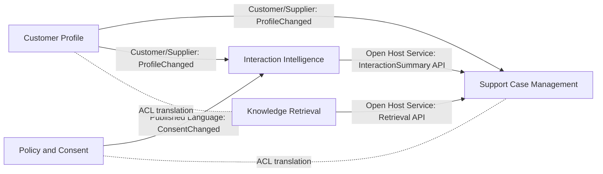
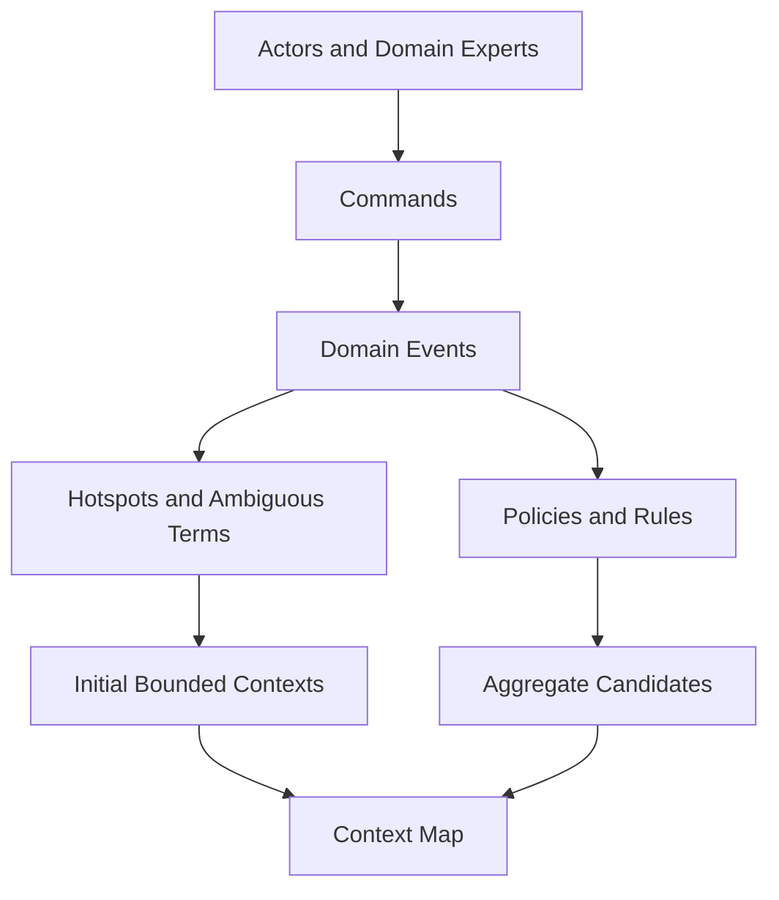
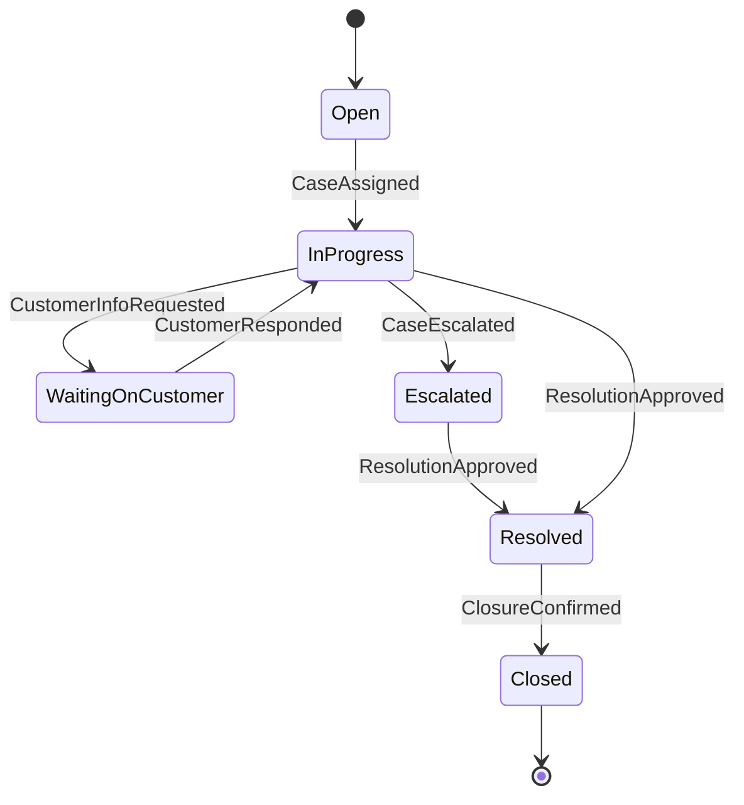

# Domain Driven Design

> Part of the **Enterprise Data & AI Architecture Handbook** · Phase-01 - Enterprise Architecture Foundations · Chapter 05.
> Estimated study time: **60 min reading + ~4h labs**.
> **Prerequisites:** read [Solution Architecture Practice](04_Solution_Architecture_Practice.md) first.

---

## Executive Summary

[Solution Architecture Practice](04_Solution_Architecture_Practice.md#core-concepts) established how to turn requirements, constraints, and quality attributes into a defensible solution design. **Domain-Driven Design (DDD)** adds the missing semantic discipline: it ensures the system's boundaries, language, ownership model, and integration patterns match the business reality rather than the org chart, database schema, or accidental history of a platform. In practice, DDD is the difference between a design that merely runs and a design that can keep evolving without semantic drift, duplicated logic, and integration chaos.

This chapter covers both halves of DDD. **Strategic design** decides where the boundaries are: bounded contexts, context maps, and the relationships between teams and models. **Tactical design** decides how logic lives inside those boundaries: entities, value objects, aggregates, domain services, repositories, and domain events. The strategic half matters first. Most failing DDD implementations do not fail because teams forgot what a value object is; they fail because they never agreed on which context owns the meaning of `Customer`, `Order`, `Case`, `Risk`, or `Conversation` in the first place.

For enterprise data and AI architecture, DDD is especially useful because data platforms are where semantic ambiguity becomes operationally expensive. A shared lakehouse table called `customer_360` often hides five incompatible definitions of customer state. A central platform API called `recommendation` may conflate marketing advice, support suggestions, and pricing logic that belong to different business contexts. DDD provides the vocabulary and methods to split these apart cleanly, then reconnect them through explicit contracts instead of shared assumptions.

The platform bias remains **Azure-primary (~60%)**: Azure API Management for open-host-service boundaries, Azure Event Hubs and Service Bus for context-to-context integration, Azure Databricks and ADLS Gen2 for domain-aligned data products, Cosmos DB and Azure SQL Database for context-owned persistence, Azure AI Search and Azure OpenAI for domain-specific retrieval and generation, Microsoft Purview and Unity Catalog for glossary, ownership, and metadata, and Entra ID plus Managed Identity for context-level security boundaries. The **~30% open-source layer** centers on Kafka, Spark, Delta Lake, PostgreSQL, Kubernetes, OpenMetadata, Grafana, Prometheus, Terraform, and GitHub Actions. **AWS and GCP remain comparison-only (~10%)**, useful for service mapping and migration thinking, not for duplicating full implementations.

**Bottom line:** DDD is not a naming convention, a microservices recipe, or a class-design style. It is a method for aligning software and data boundaries with business meaning, then keeping that alignment intact as systems, teams, and platforms grow. When applied well, it becomes the semantic backbone of event-driven architectures, modular monoliths, and Data Mesh domains alike. When applied poorly, it produces an elaborate vocabulary layered on top of the same shared-database coupling it was supposed to eliminate.

---

## Learning Objectives

By the end of this chapter you will be able to:

1. **Differentiate strategic DDD from tactical DDD** and explain why strategic boundary decisions dominate long-term outcomes.
2. **Identify and define bounded contexts** and describe their relationships using a context map.
3. **Model aggregates, entities, and value objects** in a way that protects invariants instead of merely mirroring tables.
4. **Use ubiquitous language and event storming** to expose hidden semantic conflicts and integration risks.
5. **Connect DDD to event-driven integration** through domain events, anti-corruption layers, and published contracts.
6. **Apply DDD as the semantic backbone of Data Mesh domains** and domain-owned data products.
7. **Map DDD boundaries onto Azure services and enterprise governance controls** without confusing infrastructure with domain design.
8. **Recognize when DDD is the right tool, when it is overkill, and which anti-patterns signal misuse.**

---

## Business Motivation

Domain-Driven Design exists because semantic ambiguity becomes a direct cost in large systems:

- **Shared words with different meanings create hidden integration bugs.** `Customer`, `Account`, `Order`, `Case`, and `Conversation` often mean different things to support, billing, marketing, and risk teams, yet many platforms force one shared schema to represent all of them.
- **Centralized "canonical" models often look efficient but create bottlenecks.** Every team waits on one central model to evolve, and each new consumer adds another incompatible requirement to the same artifact.
- **Shared databases create false simplicity.** They reduce short-term friction by bypassing contracts, but they make ownership, testing, release independence, and auditability materially worse.
- **Enterprise data platforms amplify semantic mistakes.** Once an ambiguous model lands in a lakehouse, search index, feature store, or downstream dashboard, the cost of correcting it multiplies across consumers.
- **AI workloads magnify language drift.** Retrieval, prompting, entity resolution, and evaluation quality all degrade when the underlying domain concepts are fuzzy or inconsistently named.
- **DDD reduces decision noise.** Teams stop arguing about whether they need one global `Customer` object and start deciding which bounded context owns which meaning, contract, and lifecycle.

For a data and AI architect, DDD converts a statement like `build a customer 360 platform` into a set of precise questions: Which context owns legal identity? Which context owns support interaction history? Which context owns marketing consent? Which contexts are sources of truth, which only project read models, and which require anti-corruption layers because the upstream language is not trustworthy enough to expose directly?

---

## History and Evolution

- **2003 - Eric Evans publishes _Domain-Driven Design_**, formalizing the central ideas of ubiquitous language, bounded context, aggregates, and close collaboration with domain experts.
- **Mid-2000s - Martin Fowler and other practitioners popularize strategic design patterns**, especially bounded contexts, context maps, and anti-corruption layers, making DDD easier to apply outside Evans' original examples.
- **Late 2000s to early 2010s - CQRS and event sourcing** gain traction in systems with complex business workflows, often in combination with DDD tactical modeling.
- **2011 onward - Vaughn Vernon refines tactical and strategic guidance**, especially around aggregate design, consistency boundaries, and distributed domain modeling.
- **2013 onward - Event storming**, popularized by Alberto Brandolini, becomes a practical workshop format for discovering domains, commands, events, policies, and hotspots quickly.
- **2015 onward - microservices adoption** drives renewed interest in DDD because service decomposition without domain boundaries repeatedly produces brittle, chatty, and poorly owned systems.
- **2019 onward - Data Mesh** reframes data ownership around business domains, reusing DDD's semantic boundary logic for data products and federated governance.
- **2023-2026 - AI platform design** adds new reasons to care about domain boundaries: retrieval quality, prompt governance, entity semantics, and domain-specific evaluation all improve when contexts and ubiquitous language are explicit.

The pattern across these evolutions is consistent: every time systems become more distributed, DDD becomes more valuable because semantic mistakes no longer stay local.

---

## Why This Technology Exists

DDD exists because enterprise systems fail at the seams between business meaning and technical implementation:

- **Complex business logic needs a language that the business and engineering can share.** Without that, architecture devolves into translation loss between subject matter experts, analysts, engineers, and data consumers.
- **Large systems need principled boundaries.** Boundaries based on tables, teams, or UI screens are rarely stable enough to support long-term evolution.
- **Distributed systems need explicit ownership.** In event-driven and service-based platforms, every concept cannot be globally shared without turning every change into a negotiation.
- **Data platforms need semantic isolation as much as storage isolation.** Separate files or tables do not solve semantic coupling if every consumer still depends on one overloaded enterprise meaning.
- **Enterprise AI systems need domain-specific grounding.** Search indexes, prompts, and evaluations perform better when the source model is explicit about context ownership and terminology.
- **Architecture decisions need a business anchor.** DDD provides that anchor by forcing the design back to domain behavior, invariants, and language before technology selection dominates the conversation.

DDD is therefore best understood as semantic architecture: it shapes the meaning boundaries that technical architecture must respect.

---

## Problems It Solves

- **Makes meaning explicit** through ubiquitous language, glossary discipline, and context ownership.
- **Creates clean ownership boundaries** so teams can evolve models independently without one shared schema becoming a negotiation hub.
- **Improves integration quality** by replacing database reach-through with explicit APIs, events, and anti-corruption layers.
- **Protects business invariants** by centering tactical models on aggregates and consistency boundaries rather than CRUD tables.
- **Supports domain-oriented data products** by aligning data ownership to bounded contexts instead of central platform convenience.
- **Reduces downstream AI and analytics confusion** because search, features, reports, and models can be traced back to a clearly owned domain meaning.

---

## Problems It Cannot Solve

- **It cannot replace domain expertise.** If the organization cannot provide real domain experts, the language and boundaries will still be guessed.
- **It cannot make every system deserve deep tactical modeling.** Simple CRUD workloads with minimal business rules often do not justify full DDD ceremony.
- **It cannot eliminate organizational politics.** If two executives both claim ownership of a concept, a context map alone will not resolve the conflict.
- **It cannot remove the need for platform discipline.** Weak deployment practices, observability, or security controls will still break a well-modeled domain.
- **It cannot prevent over-modeling.** Teams can still produce elegant aggregates for logic that should have remained a simple transaction script.
- **It cannot make integration free.** Bounded contexts reduce semantic coupling, but they increase the need for thoughtful contracts, translation, and governance.

---

## Core Concepts

### 5.1 Strategic versus tactical DDD

**Strategic DDD** decides where the model changes meaning. It defines subdomains, bounded contexts, ownership boundaries, team relationships, and integration styles. This is where the high-value decisions live because changing a boundary later is expensive: it affects APIs, event contracts, storage, dashboards, AI indexes, reporting semantics, and team operating models.

**Tactical DDD** works inside a chosen boundary. It models entities, value objects, aggregates, repositories, domain services, commands, and domain events. Tactical design matters, but it only helps once the context boundary is credible. A beautifully designed aggregate inside the wrong bounded context is still a bad architecture.

For enterprise data platforms, strategic DDD often matters more than tactical class design. The expensive failures are usually semantic and organizational: one data product serving incompatible meanings, one shared lakehouse table pretending to be a universal truth, or one API exposing an overloaded concept to every downstream team.

### 5.2 Bounded contexts and context mapping

A **bounded context** is the boundary inside which a term has a precise, consistent meaning and a model is internally coherent. Outside that boundary, translation may be necessary. In the running example, `Customer Profile`, `Support Case Management`, `Interaction Intelligence`, `Knowledge Retrieval`, and `Policy and Consent` are separate bounded contexts because each has different behavior, lifecycle, and ownership, even if they all use words like `customer`, `case`, or `interaction`.

A **context map** documents how these contexts interact. Common relationship patterns include:

- **Customer/Supplier:** one context depends on another's contract and needs predictable change management.
- **Conformist:** a downstream team accepts the upstream model largely as-is because translation cost is too high.
- **Anti-Corruption Layer (ACL):** a context translates and protects itself from an upstream model it does not trust semantically.
- **Open Host Service (OHS):** a context publishes a stable interface others can consume.
- **Published Language:** a shared contract format for integration events or APIs.
- **Shared Kernel:** a narrowly shared subset of the model, used rarely and only when change coordination is realistic.

These patterns are architectural commitments, not just diagram labels. They influence release cadence, API versioning, event schema governance, test strategy, and blast radius.

### 5.3 Ubiquitous language and event storming

**Ubiquitous language** means the same terms are used consistently in business conversation, architecture documents, APIs, event schemas, data products, dashboards, and code. It does not mean all teams use the same terms globally; it means each bounded context has an internally precise language and that translations between contexts are explicit.

**Event storming** is one of the fastest ways to discover that language. A workshop typically identifies domain events first, then commands, policies, actors, external systems, aggregates, hot spots, and unclear terms. In a support-assistant domain, events such as `CallTranscriptCaptured`, `ConsentRevoked`, `CaseEscalated`, `SummaryGenerated`, and `RecommendationAccepted` reveal both workflow and semantic fracture lines. If multiple stakeholders argue about what exactly `customer`, `interaction`, or `resolution` means, the workshop has already surfaced the design risk that the architecture must address.

### 5.4 Aggregates, entities, and value objects

Inside a bounded context, **entities** are objects with stable identity over time, **value objects** are defined entirely by their attributes, and **aggregates** are consistency boundaries that protect invariants. An aggregate is not a table group or an object graph convenience; it is the smallest boundary inside which the system must enforce transactional consistency.

Example tactical model for `Support Case Management`:

```csharp
public sealed record CustomerId(string Value);
public sealed record EscalationLevel(int Value);

public sealed class SupportCase
{
    public Guid CaseId { get; }
    public CustomerId CustomerId { get; }
    public EscalationLevel EscalationLevel { get; private set; }
    public string Status { get; private set; }

    public void Escalate(string reason)
    {
        if (Status == "Closed")
            throw new InvalidOperationException("Closed cases cannot be escalated.");

        EscalationLevel = new EscalationLevel(EscalationLevel.Value + 1);
        Status = "Escalated";
        // Domain event: CaseEscalated
    }
}
```

The point is not the syntax. The point is that `SupportCase` enforces a business invariant inside its own context. It should not also model marketing consent, billing liability, or identity proofing rules, because those belong elsewhere.

### 5.5 DDD as the backbone of Data Mesh domains

Data Mesh needs domain boundaries, domain ownership, and explicit product contracts. DDD gives it the missing semantic discipline. A **Data Mesh domain** is usually most credible when it is grounded in a bounded context or a closely related set of contexts, not when it is organized by generic platform categories like `gold tables`, `analytics`, or `ML features`.

In the running example, `Interaction Intelligence` can own transcript enrichment data products, `Customer Profile` can own mastered profile projections, and `Policy and Consent` can own the authoritative consent product. Downstream consumers may join these products, but they should not flatten them into a new shared truth without naming a new owning context or analytical product explicitly.

DDD does not mean every data product is identical to a microservice boundary. It means the **meaning**, ownership, and change authority of the data product should be domain-explicit. That is the semantic backbone Data Mesh needs if federated governance is to be more than a storage layout.

### 5.6 Example ADR for a domain boundary decision

```markdown
# ADR-0054: Split Customer 360 into Profile, Support Interaction, and Consent contexts

## Context
The existing lakehouse publishes a single `customer_360` gold table used by
support, marketing, and compliance teams. The table mixes legal identity,
interaction summaries, sentiment scores, and marketing consent flags, each
owned by different teams and governed by different change cadences. Multiple
teams are blocked on schema changes, and downstream AI retrieval quality is
degrading because the same `status` and `customer_segment` fields have
context-dependent meanings.

## Decision
We will replace the single shared model with three bounded contexts and owned
data products: `Customer Profile`, `Support Interaction Intelligence`, and
`Policy and Consent`. Downstream consumers will integrate through explicit APIs,
events, or analytical joins with documented semantics rather than a single
shared canonical table.

## Consequences
- Positive: ownership, glossary, and change authority become explicit.
- Positive: AI retrieval quality improves because indexes are built from
  context-specific source models with clearer semantics.
- Negative: some downstream consumers must now translate between contexts.
- Negative: the central platform team loses the convenience of one shared
  table and must invest in metadata, lineage, and contract governance.
- Accepted trade-off: short-term integration cost is preferable to continued
  semantic drift and change bottlenecks in the shared model.

## Alternatives Considered
- Extend the existing `customer_360` table: rejected because it preserves the
  same ownership ambiguity and schema-coupling problem.
- Create a stricter enterprise canonical model: rejected because it centralizes
  negotiation rather than clarifying context ownership.
- Keep one physical table but namespace fields semantically: rejected because
  storage layout would still encourage consumers to treat it as one source of
  truth.
```

This is a strategic DDD decision: it shapes ownership, semantics, and platform evolution more than any individual class design ever will.

---

## Internal Working

A practical DDD workflow usually runs through six stages:

1. **Discovery:** identify the business outcome, major actors, policies, and unresolved terms.
2. **Event storming:** map domain events, commands, external systems, and hotspots to reveal workflow and semantic conflict.
3. **Subdomain slicing:** separate core, supporting, and generic subdomains, then define initial bounded contexts.
4. **Context mapping:** document upstream/downstream relationships, translation needs, and integration patterns.
5. **Tactical modeling:** define aggregates, value objects, invariants, commands, domain events, and repositories inside each context.
6. **Operationalization:** map each context to deployable units, owned stores, event schemas, metadata, dashboards, and review processes.

In a modern data platform, this loop is not a one-time workshop. It is revisited when new consumers, regulations, AI use cases, or team boundaries expose that the existing language no longer matches reality. DDD succeeds when the context map evolves deliberately instead of being rewritten accidentally by ad hoc integrations.

---

## Architecture

The running architecture decomposes the Customer Interaction Intelligence Platform into five bounded contexts:

1. **Customer Profile** owns identity, mastered profile projections, channel preferences, and customer-facing segmentation used for support operations.
2. **Policy and Consent** owns legal consent state, retention rules, redaction policy, and compliance-related decisions.
3. **Support Case Management** owns the lifecycle of support cases, escalation rules, SLA clocks, and assignment state.
4. **Interaction Intelligence** owns transcript ingestion, enrichment, summarization, sentiment extraction, and issue-topic classification.
5. **Knowledge Retrieval** owns document ingestion, grounding corpus quality, ranking policy, and retrieval APIs for support assistants.

These contexts are connected by explicit APIs and events, not by a shared database or a universal `customer_360` entity. `Customer Profile` publishes profile changes. `Policy and Consent` publishes consent changes and retention policies. `Interaction Intelligence` consumes those policies through an ACL so transcript processing uses compliant retention and redaction rules. `Support Case Management` consumes summaries and classifications as downstream read models rather than embedding transcript-processing logic directly.

This is the core architecture move: separating meaning boundaries first, then letting runtime components and data products follow from those boundaries rather than the other way around.

---

## Components

The DDD operating model usually includes these components:

- **Domain experts** who can define terms, policies, exceptions, and process edge cases.
- **Ubiquitous language glossary** with context-specific definitions and forbidden ambiguous terms.
- **Bounded context catalog** listing owners, source-of-truth responsibilities, APIs, events, and data products.
- **Context map** documenting relationships such as ACL, Customer/Supplier, OHS, and Conformist.
- **Tactical model artifacts** for aggregates, value objects, domain services, commands, and domain events.
- **Integration contracts** for APIs, event schemas, published language, and versioning rules.
- **Metadata layer** in Purview, Unity Catalog, or OpenMetadata that maps domain ownership to data assets.
- **Review and governance workflow** that requires ADRs for material boundary changes.

On Azure, the concrete platform components often include API Management, Event Hubs, Service Bus, Databricks, ADLS Gen2, Cosmos DB, Azure SQL, AI Search, Entra ID groups, Managed Identities, and Purview assets aligned to those contexts.

---

## Metadata

DDD without metadata discipline becomes oral tradition. Useful metadata fields for each bounded context and data product include:

- Context name and owner.
- Business capability served.
- Authoritative terms and glossary links.
- Source-of-truth status and allowed downstream uses.
- Event schemas, API versions, and compatibility policy.
- Data classification and retention rules.
- SLOs or freshness guarantees for domain events and data products.
- Linked ADRs, exception records, and review cadence.

In Azure-first implementations, Purview glossary terms and asset ownership, Unity Catalog tags, and repository metadata should align. If the glossary says `Consent` belongs to `Policy and Consent` but the AI search index is maintained ad hoc by another team, the metadata layer is already warning that the model and the platform have drifted apart.

---

## Storage

DDD strongly prefers **context-owned storage**. The principle is not that every context must use a different engine, but that each context owns its write model and semantic lifecycle.

For the running workload:

- `Customer Profile` may use Cosmos DB or Azure SQL Database for authoritative profile state and low-latency projections.
- `Policy and Consent` may use Azure SQL Database for transactional integrity and auditable state changes.
- `Interaction Intelligence` may land raw and curated artifacts in ADLS Gen2 with Delta Lake on Databricks because event-scale ingestion, replay, and enrichment history matter.
- `Knowledge Retrieval` may own AI Search indexes and supporting blob or Delta-backed corpus staging.
- `Support Case Management` may own relational state in Azure SQL or PostgreSQL because workflow, SLA timing, and case history benefit from relational constraints.

The anti-pattern is one shared schema or lakehouse zone where every context writes and every downstream team reads directly. That is not data democratization; it is semantic coupling with better marketing.

---

## Compute

DDD does not dictate compute choices, but it changes how compute should be partitioned:

- Context-owned APIs often map well to App Service, Container Apps, or AKS depending on runtime control needs.
- Event-driven context reactions map well to Azure Functions, Container Apps jobs, or Service Bus / Event Hubs consumers.
- Analytical or enrichment-heavy contexts often justify Databricks jobs or Delta Live Tables.
- Retrieval-oriented contexts may use App Service or AKS for orchestration and managed search plus model endpoints for inference.

The important rule is that compute boundaries should respect context ownership. If one giant service cluster hosts all domain behavior with unrestricted internal calls, the physical topology is undermining the semantic architecture.

---

## Networking

Bounded contexts are semantic boundaries first, not network boundaries first, but network design can either reinforce or erode them.

Good Azure practice includes:

- API boundaries exposed through API Management rather than private database reach-through.
- Private Endpoints and DNS isolation for context-owned data stores.
- Distinct subnets, NSGs, and egress policies where trust levels differ materially.
- Explicit ingress and egress paths for domain events, search indexing, and AI calls.
- Network rules that prevent one context from bypassing contracts and reading another's private store directly.

If the platform makes it easier to query another context's store than to consume its published contract, the platform is fighting the architecture.

---

## Security

Security design improves when domain boundaries are explicit:

- **Identity:** grant Managed Identities and Entra groups per context, not one shared workload identity for an entire platform.
- **Authorization:** align RBAC and data-plane permissions to context ownership and least privilege.
- **Data classification:** keep consent, transcript, profile, and operational data classifications explicit by context.
- **Auditability:** log who changed an authoritative aggregate or policy and who consumed sensitive events.
- **AI safety:** only allow retrieval and prompting against indexes and corpora the owning context has approved.
- **Segregation of duties:** domain owners should not be able to silently rewrite another context's meaning by editing its store.

[Solution Architecture Practice](04_Solution_Architecture_Practice.md#security) already established that trust boundaries must be first-class design elements. DDD sharpens that guidance by making the trust boundary semantic as well as technical.

---

## Performance

DDD affects performance mainly through boundary choices and consistency strategy:

- Small, invariant-focused aggregates reduce lock contention and transaction scope.
- Context boundaries force teams to decide which reads can be eventually consistent and which writes require strong consistency.
- Domain events enable precomputed projections and read models that reduce synchronous join costs.
- Context-specific indexes often outperform one global search structure because ranking, filtering, and freshness targets differ.

The main performance risk is over-chatty integration. If a request path crosses too many contexts synchronously, the architecture has likely placed workflow orchestration in the wrong place or failed to create the right projections.

---

## Scalability

Well-chosen bounded contexts scale independently because their storage, compute, event streams, and hot paths are no longer fused. In the running platform:

- `Interaction Intelligence` may need high-throughput Event Hubs partitions and Databricks autoscaling.
- `Knowledge Retrieval` may need more AI Search replicas and search-index rebuild capacity.
- `Support Case Management` may scale mostly on transactional API load.
- `Policy and Consent` may scale modestly in volume but require stricter correctness and audit guarantees.

DDD does not create scalability automatically, but it creates a structure where independent scaling is architecturally possible.

---

## Fault Tolerance

DDD helps fault tolerance by reducing blast radius:

- A failing enrichment pipeline in `Interaction Intelligence` should not stop `Policy and Consent` from enforcing retention decisions.
- A search-index degradation in `Knowledge Retrieval` should produce a degraded support-assistant mode, not corrupt customer profile state.
- Outbox or transaction-log publishing patterns reduce the risk of lost domain events.
- Idempotent event handlers make replay and recovery practical.
- Compensation logic belongs where cross-context workflows cannot be made strongly consistent cheaply.

Fault-tolerant DDD systems accept that cross-context coordination is distributed and design for recovery instead of pretending one global transaction still exists.

---

## Cost Optimization

DDD can improve cost discipline, but only if teams avoid turning every noun into a platform estate:

- Domain-aligned ownership makes it easier to show cost per context or data product.
- Independent scaling prevents one heavy workload from forcing every other capability onto the same premium tier.
- Context-specific retention rules avoid keeping every dataset at the highest freshness or hottest tier.
- Precise semantics improve AI prompt and retrieval efficiency because indexes and prompts become narrower.

The cost downside is platform sprawl. Too many tiny contexts, each with its own dedicated runtime, database, and dashboard, can inflate run cost and team overhead. Good strategic DDD finds the natural business boundaries, not the maximum possible number of deployables.

---

## Monitoring

Monitoring for DDD-aligned platforms should be per context as well as end-to-end:

- API latency and error budgets per open-host-service boundary.
- Event lag, dead-letter counts, and schema validation failures per event stream.
- Data freshness and job-failure metrics per domain data product.
- Search index staleness and retrieval miss rates per retrieval context.
- Cost and throughput trends tagged by context owner and business capability.

If all metrics are only available at platform level, the architecture may already be too centralized to expose which domain is unhealthy.

---

## Observability

Observability should preserve domain meaning, not just technical traces:

- Emit business events such as `ConsentRevoked`, `CaseEscalated`, `SummaryGenerated`, and `KnowledgeArticleRanked` with stable semantic fields.
- Propagate correlation IDs across context boundaries without erasing original event identity.
- Capture semantic translation failures in anti-corruption layers explicitly; these are domain-health signals, not just parsing errors.
- Build dashboards that combine technical metrics with domain KPIs such as summary freshness, consent violation attempts blocked, or case-escalation turnaround.

The strongest sign of mature observability is that operators can tell whether a failure is semantic, contractual, or infrastructural within minutes.

---

## Governance

DDD requires active governance because context boundaries decay under delivery pressure:

- Major boundary changes should require ADRs and architecture review.
- Event and API schema versioning rules must be explicit.
- Shared-kernel usage should be rare, justified, and time-bounded.
- Context ownership should be visible in repository, runtime, metadata, and on-call ownership.
- Data Mesh federated governance should validate domain product contracts without centralizing all semantic decisions.
- Review cadences should revisit whether a Conformist relationship has become too costly and needs an ACL or domain split.

[Solution Architecture Practice](04_Solution_Architecture_Practice.md#governance) framed governance as the mechanism that keeps architecture attached to reality. For DDD, the key reality to govern is semantic drift: the slow erosion of context ownership through shortcuts, shared tables, and ambiguous terms.

---

## Trade-offs

| Dimension | DDD-heavy approach | Simpler CRUD or transaction-script approach | Main trade-off |
|---|---|---|---|
| Semantic clarity | High | Often low | Better meaning boundaries versus more upfront discovery work |
| Team autonomy | High when contexts are real | Lower under shared models | Independent evolution versus contract management overhead |
| Integration effort | Higher initially | Lower initially | Explicit translation versus hidden coupling |
| Change safety | Better for complex domains | Acceptable for simple domains | Stronger invariants versus additional modeling effort |
| Platform cost | Can be higher if over-sliced | Often lower initially | Better isolation versus more components to run |
| Suitability | Complex, long-lived, multi-team systems | Simple, low-rule, low-change systems | Right-sizing is essential |

DDD is most justified where semantic complexity and organizational scale are high enough that uncontrolled coupling will cost more than the modeling discipline.

---

## Decision Matrix

| Situation | Recommended approach |
|---|---|
| One team, simple CRUD workflow, limited business rules | Use light domain language and basic modularity; full DDD may be unnecessary |
| Multi-team platform with conflicting meanings of core terms | Start with strategic DDD, context mapping, and event storming |
| Shared data product serving many consumers with semantic disputes | Split ownership by bounded context and publish explicit contracts |
| Legacy upstream model cannot be trusted semantically | Use an anti-corruption layer |
| Strong invariants inside a transactional workflow | Model aggregates and protect consistency boundaries |
| Cross-context reporting or AI retrieval need a composite view | Build explicit projections or analytical products rather than shared write models |
| Unsure whether two teams share the same meaning of a term | Assume they do not until event storming or modeling proves otherwise |

---

## Design Patterns

- **Bounded context decomposition** around stable business meaning rather than technical tiers.
- **Customer/Supplier relationship** where upstream teams publish reliable contracts and downstream teams can plan change safely.
- **Anti-Corruption Layer** to isolate a clean domain model from legacy or overloaded upstream semantics.
- **Open Host Service plus Published Language** for reusable APIs and event contracts.
- **Aggregate root pattern** to enforce invariants and keep transactions purposeful.
- **Outbox pattern** for reliable domain-event publication after state changes.
- **CQRS read models** where multiple consumers need optimized views without mutating the source model.
- **Domain data product pattern** where a bounded context publishes owned analytical outputs for federated consumption.

---

## Anti-patterns

- **Enterprise canonical model everywhere:** one supposedly universal model that nobody can change safely and everybody interprets differently.
- **Shared database as integration strategy:** teams reading each other's tables because it is faster than defining a contract.
- **Microservices by org chart:** deploying many services without first proving real domain boundaries.
- **Aggregate as object graph dump:** loading large graph trees into one transaction because the ORM made it convenient.
- **Event storming theater:** running workshops with sticky notes but never turning discoveries into ownership, contracts, or code changes.
- **Data Mesh without domain meaning:** renaming datasets as data products while keeping the same central semantics and platform ownership.

---

## Common Mistakes

- Confusing subdomains with bounded contexts.
- Assuming every bounded context must become its own microservice on day one.
- Reusing one term globally without checking whether its meaning actually changes by context.
- Designing aggregates around tables instead of invariants.
- Publishing internal persistence events instead of meaningful domain events.
- Making the anti-corruption layer a thin mapper with no semantic protection.
- Treating the data lake or lakehouse as a neutral shared truth instead of a place where semantic ownership still matters.
- Overusing Shared Kernel because teams want convenience over autonomy.

---

## Best Practices

- Start with strategic DDD before tactical modeling.
- Use event storming early to surface ambiguous terms, policies, and hotspots.
- Keep a living context map and publish it alongside architecture docs.
- Make context ownership visible in runtime, metadata, and delivery workflows.
- Design aggregates around invariants and transactional consistency, not ORM convenience.
- Prefer APIs, events, and projections over direct storage access.
- Use anti-corruption layers aggressively around legacy and external systems.
- Tie data products and AI indexes back to explicit bounded contexts and glossary terms.

---

## Enterprise Recommendations

- Establish a **domain catalog** that lists bounded contexts, owners, core terms, APIs, events, and data products.
- Standardize **event storming workshops** for initiatives that touch multiple teams or overloaded business concepts.
- Require **ADRs for material boundary and ownership changes** so semantic decisions are reviewable and durable.
- Align **Purview, Unity Catalog, or OpenMetadata assets** with bounded context ownership rather than generic platform folders.
- Publish a small set of **approved integration patterns**: OHS, ACL, Customer/Supplier, outbox, and CQRS projection.
- Measure and review **semantic drift signals** such as shared-schema access, ambiguous glossary terms, and repeated translation bugs.

---

## Azure Implementation

An Azure-first DDD implementation should make context ownership physically visible without over-encoding infrastructure as the domain model.

- Use **Azure API Management** for stable open-host-service boundaries. For internal enterprise platforms with private backends and multi-region governance, **APIM Premium** is often justified; for smaller internal estates, **Standard v2** can be sufficient if the networking model is simpler.
- Use **Azure Event Hubs Standard or Dedicated** for high-throughput domain-event streams, with separate hubs or namespaces where isolation, quota, or compliance boundaries differ. Use **Schema Registry** to version Avro or JSON event contracts explicitly.
- Use **Azure Service Bus Premium** when command-style integration, ordered processing, or dead-letter workflows matter more than raw event streaming throughput.
- Use **Azure Databricks Premium or Enterprise** with **Unity Catalog** to map domain data products to catalogs, schemas, and governed access controls.
- Use **ADLS Gen2** containers and directory structures aligned to domain products rather than one undifferentiated bronze-silver-gold namespace owned centrally with no domain tags.
- Use **Cosmos DB** or **Azure SQL Database** per context based on access pattern and consistency needs, not as one shared persistence plane.
- Use **Microsoft Purview** to manage glossary terms, lineage, owners, and policy visibility for context-owned data products and search indexes.
- Use **Entra ID groups**, **Managed Identity**, **Private Link**, and **Azure Policy** to enforce ownership and access boundaries operationally.

A minimal Bicep example that makes context ownership visible in IaC:

```bicep
param contextName string
param environment string
param location string = resourceGroup().location

resource eventHubNs 'Microsoft.EventHub/namespaces@2024-01-01' = {
  name: 'eh-${environment}-${contextName}'
  location: location
  sku: {
    name: 'Standard'
    tier: 'Standard'
    capacity: 2
  }
  tags: {
    boundedContext: contextName
    ownerType: 'domain-team'
    contractType: 'domain-events'
    dataClass: 'confidential'
  }
}
```

Example Azure CLI pattern for context-scoped ownership tags:

```bash
az tag create --resource-id /subscriptions/<sub>/resourceGroups/rg-prod-support-case/providers/Microsoft.Sql/servers/sql-prod-support-case/databases/db-support-case \
  --tags boundedContext=SupportCaseManagement owner=team-support-case semanticRole=authoritative-store
```

The key implementation principle is simple: if the Azure estate cannot tell you which bounded context owns a resource, the platform is not reinforcing the domain model strongly enough.

---

## Open Source Implementation

The open-source implementation stack for DDD-heavy platforms is mature and practical:

- **Kafka** for durable published language and domain-event distribution.
- **Spark and Delta Lake** for context-owned analytical projections and replayable event processing.
- **PostgreSQL** for transactional bounded contexts with strong relational constraints.
- **Kubernetes** for teams that need runtime control, sidecars, or policy enforcement per context.
- **OpenMetadata** for glossary, ownership, lineage, and data-product metadata aligned to domains.
- **Prometheus and Grafana** for per-context observability and SLO dashboards.
- **Terraform** and **GitHub Actions** for docs-as-code plus infrastructure-as-code workflows.

Example repository layout that keeps DDD artifacts and platform assets together:

```text
/domains
  /customer-profile
    /adr
    /api
    /events
    /model
    /infra
  /interaction-intelligence
  /policy-consent
/context-map
/glossary
/data-products
```

Example event contract snippet:

```json
{
  "eventName": "ConsentRevoked",
  "boundedContext": "PolicyAndConsent",
  "occurredAt": "2026-07-08T09:00:00Z",
  "customerId": "C12345",
  "channel": "Email",
  "effectiveFrom": "2026-07-08T09:00:00Z"
}
```

The open-source story is not meaningfully weaker than the Azure one. The main difference is how much integrated governance and enterprise identity scaffolding the platform gives you versus how much you must assemble yourself.

---

## AWS Equivalent (comparison only)

The DDD practice itself is provider-agnostic, but Azure services map cleanly to AWS equivalents:

| Azure anchor | AWS equivalent | Main advantage | Main disadvantage | Migration note | Selection criteria |
|---|---|---|---|---|---|
| API Management | API Gateway plus optionally App Mesh or CloudFront | Mature edge and service integration options | Policy and enterprise API governance often need more composition | Translate OHS boundaries and auth policies carefully | Prefer when AWS is already the primary platform and teams are fluent in IAM and Gateway patterns |
| Event Hubs / Service Bus | Kinesis / SNS / SQS / EventBridge | Rich event and queue service portfolio | Semantic contract governance spans multiple services | Revisit ordering, fan-out, and schema-governance assumptions | Choose based on whether the workload is stream-heavy or command-heavy |
| Databricks / ADLS Gen2 | Databricks on AWS / EMR / S3 | Strong analytics ecosystem | Governance and metadata consistency require careful assembly | Preserve domain-product layout and ownership tags during migration | Best when the organization already operates S3 and analytics tooling at scale |
| Cosmos DB / Azure SQL | DynamoDB / Aurora | Strong managed scale options | Model translation can be non-trivial, especially around consistency and access patterns | Re-model aggregates and partition keys explicitly | Use when AWS-native ops and service familiarity dominate |
| Purview | Glue Catalog plus Lake Formation and lineage tooling | Deep AWS data-lake integration | Glossary and semantic governance may need extra tooling | Map domain glossary and lineage policies, not just tables | Best when AWS data governance tooling is already established |

The main strategic point: moving clouds does not remove the need for bounded contexts. It only changes which managed services carry the contracts.

---

## GCP Equivalent (comparison only)

GCP also supports the same DDD and domain-oriented patterns with different service ergonomics:

| Azure anchor | GCP equivalent | Main advantage | Main disadvantage | Migration note | Selection criteria |
|---|---|---|---|---|---|
| API Management | Apigee / API Gateway | Strong API product and governance story | Cost and platform complexity can be high for smaller estates | Preserve versioning and policy semantics across gateways | Prefer when API product management is a first-class concern |
| Event Hubs / Service Bus | Pub/Sub | Excellent managed messaging and fan-out simplicity | Command-style workflow semantics may need extra design | Revalidate ordering and replay assumptions | Strong fit when event distribution is broad and serverless-friendly |
| Databricks / ADLS Gen2 | Dataproc / BigQuery / Databricks on GCP / Cloud Storage | Powerful analytics and serverless data options | Domain ownership can blur if everything collapses into one warehouse | Re-map domain products and ownership boundaries carefully | Best when BigQuery-centric analytics is the enterprise default |
| Cosmos DB / Azure SQL | Firestore / Cloud SQL / AlloyDB | Strong managed database options | Model fit varies sharply by context and workload | Re-evaluate aggregate consistency and query patterns explicitly | Choose by access shape, not by one provider-wide default |
| Purview | Dataplex plus Data Catalog lineage ecosystem | Integrated governance for analytics estates | Glossary and operational ownership still require discipline | Preserve semantic metadata fields during migration | Strong fit when GCP analytics governance is already mature |

As with AWS, the cloud comparison matters less than whether the target platform can preserve explicit domain ownership, contracts, and glossary discipline.

---

## Migration Considerations

Moving toward DDD in an existing enterprise platform is usually a staged migration, not a rewrite:

- **From shared monolith to modular monolith:** define bounded contexts and internal module contracts before forcing service decomposition.
- **From shared lakehouse tables to domain data products:** identify authoritative sources, split semantics, and publish transitional projections for downstream consumers.
- **From direct database integration to contracts:** introduce APIs, events, or ACLs incrementally around the most painful coupling points.
- **From overloaded enterprise terms to context-specific language:** start with glossary repair and event storming, because infrastructure changes without language changes only rename the problem.
- **From centralized AI search indexes to domain-grounded indexes:** rebuild retrieval corpora by bounded context so search quality and safety controls become domain-specific.

The migration hazard is trying to standardize the perfect end-state model too early. DDD migration works best when the organization removes the worst semantic bottlenecks first, then iteratively strengthens context ownership.

---

## Mermaid Architecture Diagrams

**Context map for the running platform:**



**Event storming discovery flow:**



**Aggregate lifecycle for a support case:**



---

## End-to-End Data Flow

An end-to-end domain-aligned flow for the support-assistant platform looks like this:

1. `Policy and Consent` receives a consent change through its authoritative API and commits the change to its own store.
2. The context publishes `ConsentChanged` as a domain event through Event Hubs or Service Bus.
3. `Interaction Intelligence` consumes the event through an ACL, translating legal-policy language into transcript-processing rules and retention decisions.
4. New call transcripts are ingested into the `Interaction Intelligence` pipeline on Databricks and stored in ADLS Gen2 Delta tables owned by that context.
5. Enrichment outputs such as issue classification and summary candidates are published as context-owned products and events.
6. `Support Case Management` consumes those summaries through an API or projection, not by reading the transcript store directly.
7. `Knowledge Retrieval` maintains a domain-specific grounding index in AI Search and exposes a retrieval API with filters aligned to support use cases.
8. The support-assistant application orchestrates profile, consent-safe summary, and retrieval calls to produce a grounded answer for the agent.
9. Telemetry records both technical traces and domain events such as `SummaryGenerated` and `ConsentPolicyApplied` for observability.
10. Downstream analytics may join multiple domain products, but the authoritative meaning of each field remains anchored to its owning bounded context.

---

## Real-world Business Use Cases

- **Retail support platforms:** separate customer identity, order fulfillment, returns, loyalty, and contact-center interaction domains so support tooling does not inherit every downstream team's semantics.
- **Banking and fraud operations:** keep account servicing, risk scoring, dispute management, and consent or privacy contexts distinct even when they all reference the same customer.
- **Healthcare engagement platforms:** split patient identity, encounter history, billing, clinical recommendation, and consent domains to preserve compliance and semantic safety.
- **Industrial service operations:** separate asset telemetry, maintenance planning, work-order execution, and warranty domains so AI copilots retrieve the right source meaning under operational pressure.

---

## Industry Examples

- **Amazon's long-standing service ownership model** is frequently cited because its internal interfaces are aligned to business capabilities rather than one shared enterprise schema, even when not explicitly branded as textbook DDD.
- **Microsoft's eShopOnContainers sample** is a widely used public example of bounded contexts, domain events, and tactical DDD patterns in a cloud-native application.
- **Public Data Mesh writing from firms such as Zalando and Intuit** reflects the same core idea: domain-aligned ownership, explicit product contracts, and federated governance work best when semantic boundaries are real.
- **Thoughtworks' public DDD and event storming guidance** remains influential because it shows DDD applied pragmatically rather than ceremonially, especially in modernization and microservice decomposition work.

---

## Case Studies

**Case Study 1 - The fake canonical customer model.** A global retailer built a central `customer_master` table intended to satisfy support, marketing, loyalty, fraud, and compliance teams. Within two years, simple field names such as `status`, `segment`, and `active` each had multiple undocumented meanings. AI retrieval quality degraded because the support-assistant index mixed consent state, loyalty segmentation, and case posture into one corpus. The remediation was not a better naming standard; it was splitting the model into bounded contexts with explicit translations and product ownership.

**Case Study 2 - Microservices without contexts.** A financial services platform decomposed a monolith into dozens of services based on UI screens and team structure, not domain boundaries. Services called each other synchronously, shared database tables, and emitted low-value persistence events that leaked internals. Incident reviews showed that every significant change still required multi-team coordination. A later event-storming and context-mapping effort merged some services, introduced anti-corruption layers for legacy concepts, and re-established actual domain ownership before the architecture stabilized.

**Case Study 3 - Data Mesh without DDD.** A company renamed lakehouse folders as `domains` and assigned owners, but the semantics of key entities still came from a central analytics team. The result was organizational decentralization without semantic decentralization: different teams could operate their own pipelines, but none could change meaning without central approval. Only after the company defined bounded contexts, glossary terms, and domain data-product contracts did the Data Mesh operating model start working as intended.

---

## Hands-on Labs

1. **Run a 90-minute event-storming session** for a real or hypothetical workflow and capture at least 15 domain events, 10 commands, 5 policies, and 3 hotspots.
2. **Draw a context map** for the same workflow and label each relationship as Customer/Supplier, Conformist, ACL, OHS, Shared Kernel, or Published Language.
3. **Model one aggregate** with at least three invariants and explain why its transaction boundary is neither smaller nor larger.
4. **Split a shared data product** into two bounded-context-owned products and define the translation contract between them.
5. **Tag cloud resources or data assets by bounded context** in a sandbox using Azure tags, Purview metadata, or OpenMetadata labels.
6. **Write an ADR** documenting a boundary decision and the alternatives rejected.

---

## Exercises

1. Why is `Customer` almost always a dangerous word to treat as globally consistent across an enterprise?
2. Give an example where a Shared Kernel is justified and one where it is an attractive but harmful shortcut.
3. Explain why an anti-corruption layer is more than a field-mapping utility.
4. A team wants to create one universal support-assistant search index for all customer-related data. Which DDD questions should be answered before approving that design?
5. When should a bounded context remain an internal module or modular-monolith boundary instead of becoming its own deployable service?

---

## Mini Projects

- **Domain Catalog Starter Kit:** create a repository that stores glossary terms, context maps, ADRs, and owned data-product definitions for three bounded contexts in one business area.
- **Context-to-Platform Traceability:** take one context and map it fully to APIs, events, stores, dashboards, Purview assets, and IaC tags.
- **Data Mesh Boundary Audit:** review an existing analytics estate and identify where named domains are not actually bounded contexts because ownership, semantics, or contracts are still centralized.

---

## Capstone Integration

In the handbook capstone, DDD should provide the semantic skeleton for the platform described in [Solution Architecture Practice](04_Solution_Architecture_Practice.md#architecture). The capstone should not present one generic platform with one generic `customer` model. It should show bounded contexts, owned data products, anti-corruption layers around legacy systems, and explicit trade-offs between synchronous orchestration and event-driven propagation. Without that semantic layer, the capstone may still deploy, but it will not be a credible enterprise architecture.

---

## Interview Questions

1. What is the difference between a subdomain and a bounded context?
2. Why is a ubiquitous language local to a bounded context rather than necessarily global across the enterprise?
3. What makes an aggregate boundary correct or incorrect?
4. When is a Conformist relationship acceptable, and what are its risks?
5. How does DDD strengthen Data Mesh rather than competing with it?

---

## Staff Engineer Questions

1. Your team owns a context that keeps receiving requests to expose its private tables because downstream consumers want faster integration. How would you evaluate and respond without hiding behind dogma?
2. A context map shows five synchronous calls in the user request path. Which of those relationships would you challenge first, and what architectural alternatives would you consider?
3. How would you detect that a supposedly bounded context has become semantically overloaded before incidents make it obvious?

---

## Architect Questions

1. Design a context map for an enterprise support platform spanning CRM, billing, customer identity, policy and consent, transcript intelligence, and AI retrieval. Which relationships would you mark as ACL, Customer/Supplier, or OHS, and why?
2. How would you govern domain data products so federated ownership remains real without re-centralizing all semantic decisions into a platform board?
3. When modernizing a legacy monolith, how would you decide whether the first move should be event storming, modularization, ACL introduction, or storage isolation?

---

## CTO Review Questions

1. Which of our most important business concepts still have no explicit owner or bounded context, and what risk does that create?
2. How much of our current platform complexity comes from real business complexity versus semantic ambiguity we have allowed to accumulate?
3. If we are funding a Data Mesh or AI platform strategy, do our domain boundaries and glossary ownership actually support it, or are we scaling semantic confusion? 

---

## References

- Evans, E. _Domain-Driven Design: Tackling Complexity in the Heart of Software._ Addison-Wesley.
- Vernon, V. _Implementing Domain-Driven Design._ Addison-Wesley.
- Vernon, V. _Domain-Driven Design Distilled._ Addison-Wesley.
- Brandolini, A. _Introducing EventStorming._ Leanpub.
- Fowler, M. _Patterns of Enterprise Application Architecture_ and bounded-context essays. https://martinfowler.com
- Microsoft. Azure Architecture Center. https://learn.microsoft.com/azure/architecture/
- Microsoft. Azure API Management documentation. https://learn.microsoft.com/azure/api-management/
- Microsoft. Azure Event Hubs documentation. https://learn.microsoft.com/azure/event-hubs/
- Microsoft. Azure Databricks and Unity Catalog documentation. https://learn.microsoft.com/azure/databricks/
- Microsoft. Microsoft Purview documentation. https://learn.microsoft.com/purview/
- Dehghani, Z. _Data Mesh: Delivering Data-Driven Value at Scale._ O'Reilly.
- Thoughtworks Technology Radar and DDD writings. https://www.thoughtworks.com

---

## Further Reading

- Young, G. Writings on CQRS and event sourcing.
- Brown, S. Architecture views and model communication practices.
- Kleppmann, M. _Designing Data-Intensive Applications._ O'Reilly.
- Pais, M., and Skelton, M. _Team Topologies._ IT Revolution.
- OpenMetadata project documentation for domain metadata practices. https://open-metadata.org/
- Databricks guidance on domain-oriented data products and Unity Catalog governance. https://www.databricks.com