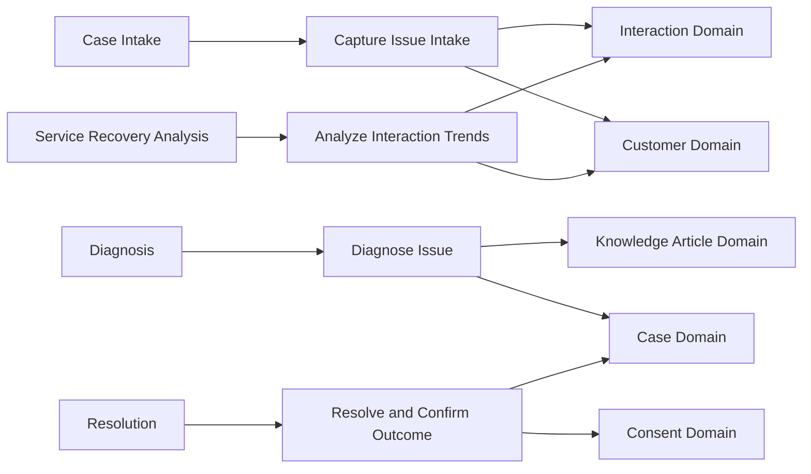
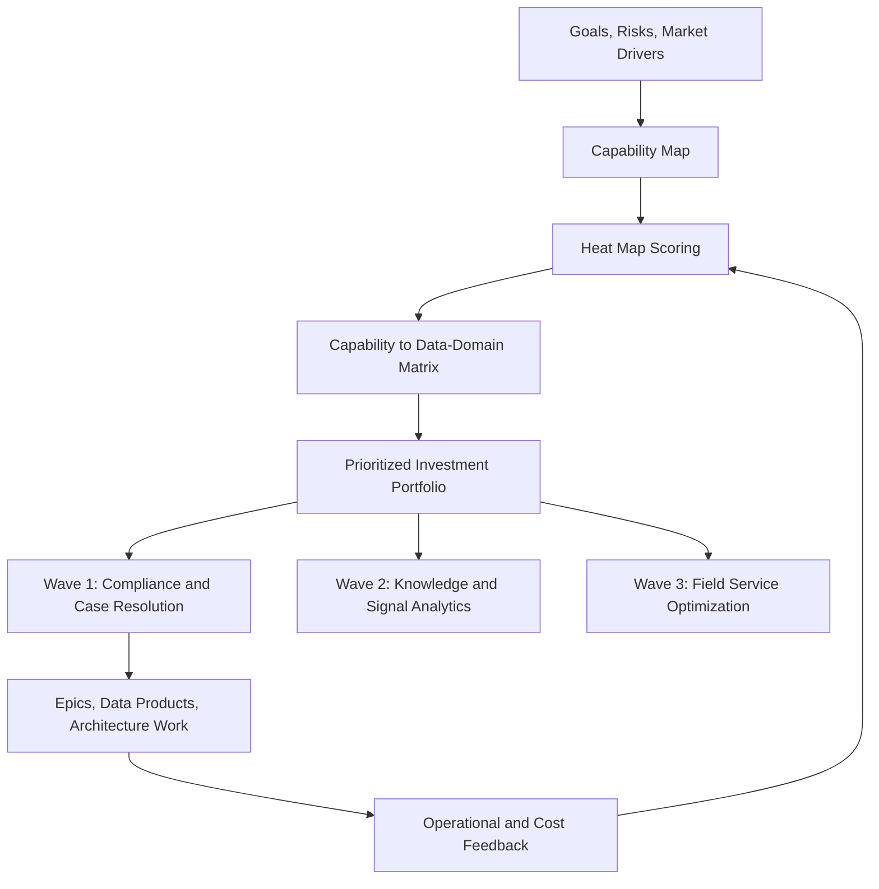

# Business Capability Modeling

> Part of the **Enterprise Data & AI Architecture Handbook** · Phase-01 - Enterprise Architecture Foundations · Chapter 06.
> Estimated study time: **45 min reading + ~3h labs**.
> **Prerequisites:** read [Enterprise Architecture Foundations](01_Enterprise_Architecture_Foundations.md) first.

---

## Executive Summary

[Enterprise Architecture Foundations](01_Enterprise_Architecture_Foundations.md#core-concepts) established that enterprise architecture becomes operationally useful when it can trace business intent down to data, applications, and technology. **Business capability modeling** is the artifact and operating discipline that makes that traceability stable enough to drive investment, rationalization, governance, and roadmap decisions at enterprise scale. A capability model does not ask how a process is executed today or which team currently performs it. It asks what the business must be able to do, at a level stable enough to survive reorganizations, application replacement, outsourcing, mergers, and platform modernization.

The practical power of capability modeling comes from what it can be joined with. A plain list of capabilities is only mildly useful. A capability map linked to **heat maps**, **value streams**, **data domains**, **application portfolios**, **risk posture**, **unit cost**, and **investment roadmaps** becomes a control plane for decision-making. It lets architects and executives say: `Customer Service` is strategically critical, currently high pain, blocked by fragmented interaction data, dependent on two redundant applications, and should therefore be funded ahead of a lower-value automation initiative even if the latter is easier to deliver. That is a materially stronger argument than `the platform team prefers to modernize support next`.

This chapter uses a running example of a global service enterprise modernizing customer operations, field service, and commercial analytics. The capability model centers on top-level capabilities such as `Manage Customer Relationships`, `Resolve Customer Issues`, `Operate Field Service`, `Manage Knowledge`, `Ensure Policy and Consent Compliance`, and `Analyze Customer Signals`. These are linked to data domains such as `Customer`, `Asset`, `Contract`, `Interaction`, `Consent`, `Knowledge Article`, and `Case`. That linkage is where business capability modeling becomes especially relevant for data and AI architecture: it tells the enterprise which data products are strategically important, where ownership should sit, and which modernization programs actually move business outcomes rather than just platform metrics.

The platform bias remains **Azure-primary (~60%)**: Microsoft Purview for glossary, ownership, and lineage; Azure DevOps Boards and Wiki or GitHub repositories for versioned capability artifacts; Azure SQL Database for the capability registry; Azure Databricks and Unity Catalog for domain-aligned data products; Power BI for capability heat maps and executive dashboards; Entra ID and Azure RBAC for stewardship controls; and Bicep or Terraform tagging to connect cloud assets back to capability identifiers. The **~30% open-source layer** includes OpenMetadata, Neo4j, PostgreSQL, Backstage, Grafana, Terraform, GitHub Actions, Spark, and Delta Lake. **AWS and GCP remain comparison-only (~10%)**, useful for mapping services and governance patterns, not for duplicating full implementations.

**Bottom line:** business capability modeling is not a prettier org chart and not a one-time workshop deliverable. It is the stable business decomposition that lets the enterprise align strategy, funding, domain ownership, data products, and technology change. When done well, it reduces duplicated investment, clarifies ownership, and turns portfolio prioritization into a traceable architectural practice. When done poorly, it becomes a decorative diagram disconnected from both money and delivery.

---

## Learning Objectives

By the end of this chapter you will be able to:

1. **Explain what a business capability is and is not**, and distinguish capability maps from processes, org charts, and application inventories.
2. **Design a capability map and heat map** that supports prioritization rather than only documentation.
3. **Use value streams and business motivation models** to anchor capabilities in strategy and measurable outcomes.
4. **Link capabilities to data domains and products** so data and AI investments have a business rationale and clear ownership.
5. **Use capability scoring to drive investment and portfolio decisions** rather than relying on local team preference or anecdotal urgency.
6. **Build capability-based roadmaps** that sequence change in a way leadership can defend and delivery teams can execute.
7. **Implement a concrete Azure-based capability repository and governance workflow** using Purview, Azure DevOps, Azure SQL, Power BI, and resource tagging.
8. **Recognize the anti-patterns that make capability models misleading or politically fragile** and know when the practice is not worth heavyweight application.

---

## Business Motivation

Business capability modeling exists because large organizations routinely make expensive decisions with the wrong anchor:

- **Application-centric planning hides duplicated business outcomes.** Three systems may each claim to serve customer service, but only a capability model shows whether they support the same business ability or genuinely different needs.
- **Org-chart-centric planning is unstable.** Reorganizations should not force the enterprise to redraw its architecture from first principles, but they do when capabilities are mistaken for departments.
- **Data-platform priorities become disconnected from business value without a capability anchor.** A curated `customer_interaction_gold` table matters only if it advances capabilities such as case resolution, service quality, or upsell effectiveness.
- **Mergers and divestitures expose architecture legibility gaps immediately.** Enterprises that can map capabilities to systems, data domains, and costs can integrate or separate a business unit faster and with lower risk.
- **Portfolio decisions need a stable comparison frame.** A capability heat map lets leadership compare very different initiatives on the same basis: business criticality, pain, risk, maturity, and strategic urgency.
- **AI and analytics investments need clearer business justification than `better insights`.** A capability model forces the program to state which business ability is improved, who owns it, and how success will be measured.

For data and AI leaders, capability modeling turns `we need a customer data platform` into a more defensible statement: `Resolve Customer Issues`, `Manage Customer Relationships`, and `Analyze Customer Signals` are all high-value capabilities with duplicated data pipelines and weak consent traceability; the investment should therefore prioritize shared domain-aligned data products and consent-aware retrieval because that directly improves capability performance, not just technical elegance.

---

## History and Evolution

- **1980s-1990s - early enterprise architecture frameworks** established that organizations need stable abstractions above applications and infrastructure, even if they did not yet operationalize capability mapping well.
- **1987 - Zachman's framework** reinforced the idea that different stakeholder views are necessary, laying groundwork for capability views as a distinct business-facing representation.
- **1990s-2000s - capability-based planning in government and defense** showed that strategic investment decisions benefit from stable capability decompositions rather than project lists alone.
- **2000s - TOGAF and business architecture practices** made business architecture a first-class layer, with capabilities and value streams becoming core artifacts rather than optional supplements.
- **2010s - the Business Architecture Guild and BIZBOK** popularized capability maps, heat mapping, and value-stream linkage as practical tools for portfolio management.
- **2015-2020 - cloud modernization and platform engineering** increased the need to link technology investments back to stable business abilities rather than platform enthusiasm.
- **2019 onward - Data Mesh and product operating models** made capability-to-domain ownership more important because federated data products need a business anchor to avoid devolving into renamed technical silos.
- **2023-2026 - AI platform spending pressure** pushed capability-based prioritization further into the mainstream because leaders increasingly demand clear evidence that model, data, and platform investments improve specific business abilities.

The consistent pattern is that capability modeling becomes more valuable as the enterprise becomes more distributed, more data-intensive, and more constrained by investment trade-offs.

---

## Why This Technology Exists

Business capability modeling exists because enterprises need a stable abstraction for planning and governance that is neither too technical nor too volatile:

- **Processes change more often than capabilities.** A business may redesign how it resolves customer issues, but it still needs the ability to resolve customer issues.
- **Applications come and go.** A capability model survives ERP replacement, CRM migration, and data-platform modernization because it describes business ability, not implementation.
- **Departments are political and fluid.** A capability model remains useful even when reporting lines or shared-service arrangements change.
- **Strategy needs a translation layer.** Goals and objectives are too abstract for delivery teams; applications and resources are too detailed for executives. Capabilities sit in the middle and make the connection practical.
- **Data domains need business meaning.** Data-product ownership is more credible when it maps to business capabilities and value streams rather than to storage layers or platform subteams.
- **Investment prioritization needs comparability.** Capabilities provide the common unit against which pain, maturity, risk, cost, and strategic value can be scored.

Capability modeling is therefore the business-facing control surface that makes enterprise architecture and data strategy actionable.

---

## Problems It Solves

- **Exposes duplicated investment** by showing where multiple applications or teams support the same capability.
- **Anchors data and AI initiatives in business value** by linking domains and products to explicit business abilities.
- **Improves executive prioritization** through heat maps, maturity scoring, and portfolio comparison.
- **Provides a stable roadmap frame** across reorganizations and platform changes.
- **Clarifies ownership** by separating who performs a process from who is accountable for a business ability and its enabling data.
- **Supports M&A, rationalization, and divestiture** by making the business-to-system-to-data relationship queryable.

---

## Problems It Cannot Solve

- **It cannot replace domain expertise.** A capability model still needs people who understand the business deeply enough to define meaningful boundaries.
- **It cannot settle political disputes by itself.** If two leaders both want ownership of a capability, the model provides structure, not executive authority.
- **It cannot design solutions.** Knowing a capability is weak does not determine the correct architecture or implementation pattern.
- **It cannot make scoring objective by magic.** Heat maps and maturity scores still contain judgment and must be governed openly.
- **It cannot rescue a poor operating model.** If budgeting, delivery governance, or data stewardship are weak, the capability model will expose the problem but not solve it alone.
- **It cannot justify excessive detail.** A tiny startup or a narrowly scoped product team often does not need a multi-level enterprise capability taxonomy.

---

## Core Concepts

### 6.1 What a business capability is and is not

A **business capability** is a stable statement of what the enterprise must be able to do in order to execute its strategy. It is not a process step, an application name, a team name, or a job title. `Resolve Customer Issues` is a capability. `Run Zendesk workflow` is not. `Customer Care Team` is not. `Submit refund request` is usually a process step, not a standalone capability.

The practical test is stability. If the statement would become invalid after a reorg or application replacement, it is probably not a capability. Capabilities should describe enduring business ability, not current implementation.

### 6.2 Capability maps and heat maps

A **capability map** is the hierarchical structure of capabilities, usually modeled at two or three levels:

- **L1:** broad enterprise capabilities such as `Manage Customer Relationships` or `Operate Field Service`.
- **L2:** more actionable subdivisions such as `Resolve Customer Issues`, `Manage Service Knowledge`, or `Plan Technician Dispatch`.
- **L3:** optional lower-level detail where more precise planning is necessary.

A **heat map** overlays scores such as business criticality, pain, maturity, risk exposure, regulatory pressure, data quality, or cost inefficiency. The point is not decoration. The point is to force prioritization. If every capability is colored red, the heat map is politically safe and operationally useless.

### 6.3 Value streams and business motivation models

Capabilities explain what the enterprise must do. **Value streams** explain how value flows from trigger to outcome. `Prospect to Customer`, `Case Intake to Resolution`, `Order to Cash`, and `Issue Detection to Service Recovery` are value streams that cut across capabilities.

The **Business Motivation Model (BMM)** adds a strategic bridge by decomposing:

- **Ends:** vision, goals, objectives.
- **Means:** strategies, tactics, directives.
- **Assessment:** drivers, risks, external pressures.

Capability modeling becomes much more defensible when an objective such as `Reduce case resolution time by 20 percent` can be traced to value-stream stages and then to capabilities such as `Resolve Customer Issues`, `Manage Knowledge`, and `Analyze Customer Signals`.

### 6.4 Linking capabilities to data domains

For modern data and AI architecture, the highest-value extension of capability modeling is linking each significant capability to the data domains and products it depends on. In the running example:

- `Manage Customer Relationships` depends on `Customer`, `Contract`, and `Consent` domains.
- `Resolve Customer Issues` depends on `Case`, `Interaction`, `Knowledge Article`, and `Customer` domains.
- `Analyze Customer Signals` depends on `Interaction`, `Customer`, `Product`, and `Channel` domains.
- `Operate Field Service` depends on `Asset`, `Work Order`, `Technician`, and `Inventory` domains.

This matters because it shifts data-platform planning from generic asset curation to domain-relevant investment. The enterprise can now ask not only `which tables are poor quality` but `which weak data domains are blocking critical capabilities`.

### 6.5 Investment and portfolio prioritization

Capability-based planning works best when each capability is scored across a small, explicit set of dimensions. A common weighting model includes:

- Business criticality.
- Current pain or performance gap.
- Strategic urgency.
- Regulatory exposure.
- Data quality or data availability risk.
- Cost inefficiency.
- Delivery readiness.

This creates a ranked portfolio that is comparable across initiatives. A workflow automation proposal and a lakehouse governance proposal can be evaluated against the same capability impact model rather than against whichever team argued more forcefully.

### 6.6 Capability-based roadmapping

Capability-based roadmaps sequence change by business outcome rather than by technology stack. Instead of saying `Q3 is for CRM modernization and Q4 is for data ingestion refactoring`, the roadmap says `Wave 1: stabilize Resolve Customer Issues and Ensure Policy and Consent Compliance; Wave 2: improve Analyze Customer Signals and Manage Knowledge; Wave 3: optimize commercial analytics and field-service planning`.

This helps leadership understand the roadmap and helps architects keep technical work subordinate to business value.

### 6.7 Example ADR for capability governance

```markdown
# ADR-0068: Use L2 business capabilities as the primary portfolio planning anchor

## Context
The enterprise currently funds initiatives through application-centric and
team-centric proposals. This has led to duplicated investment in customer
service tooling, fragmented data quality work, and weak comparability between
AI, integration, and workflow modernization requests.

## Decision
We will use L2 business capabilities as the primary anchor for portfolio
prioritization. Every investment proposal, data product, and major architecture
initiative must link to at least one capability ID and quantify expected impact
on that capability's heat-map dimensions.

## Consequences
- Positive: funding discussions can compare unlike initiatives on a common
  business basis.
- Positive: application and data rationalization become easier because assets
  can be traced back to business abilities.
- Negative: teams must maintain capability links and metadata as part of
  intake and governance.
- Accepted trade-off: the added metadata discipline is preferable to continuing
  portfolio decisions driven by local tool ownership and anecdotal urgency.

## Alternatives Considered
- Continue application-centric planning: rejected because it hides duplicated
  business outcomes across systems.
- Use org-unit ownership as the main planning frame: rejected because reorgs
  and shared-service models make it unstable.
- Use value streams only: rejected because value streams are essential but do
  not provide the same stable decomposition for all portfolio decisions.
```

This is a strategic architecture decision, not just a planning preference, because it changes how money, metadata, and accountability flow through the enterprise.

---

## Internal Working

A credible capability-modeling practice typically runs through this operating cycle:

1. **Frame the scope:** enterprise-wide, business unit, or transformation program.
2. **Build the initial capability hierarchy:** normally L1 and L2 first, with L3 only where it adds planning value.
3. **Define value streams and strategic objectives:** so the capability model is tied to real outcomes and not a static taxonomy.
4. **Assign owners and stewards:** each capability needs accountable business and architecture owners.
5. **Score the capabilities:** using a small, explicit scoring model for pain, maturity, criticality, risk, and strategic urgency.
6. **Link to data domains, applications, and costs:** so the model becomes actionable.
7. **Review and prioritize:** portfolio forums and architecture governance use the heat map and links to decide investment waves.
8. **Refresh on a cadence:** capabilities stay stable, but scores, dependencies, and investments change continuously.

The important operational point is that the model should be easy to update and easy to challenge. If revising a capability score requires weeks of manual slide work, the repository and workflow are wrong.

---

## Architecture

The architecture of a capability-modeling practice is a layered control plane linking strategy to delivery:

1. **Strategy layer:** goals, objectives, market or regulatory drivers, and business motivation.
2. **Capability layer:** L1-L3 capability hierarchy, capability ownership, and heat-map scoring.
3. **Value-stream layer:** stages that connect customer or business outcomes to the capabilities used to realize them.
4. **Domain and asset layer:** data domains, data products, applications, integrations, and cloud resources linked back to capabilities.
5. **Investment layer:** epics, initiatives, budgets, risks, and roadmap waves associated with specific capability improvements.
6. **Feedback layer:** operational metrics, costs, incident patterns, and data-quality signals used to refresh capability scores.

This layered structure is what turns the capability model into a live enterprise artifact rather than an isolated business-architecture diagram.

---

## Components

The core components of a mature business capability modeling practice are:

- **Capability catalog** with IDs, names, hierarchy, owners, descriptions, and criticality.
- **Heat-map model** with defined scoring dimensions and refresh cadence.
- **Value-stream map** connecting stages and outcomes to capabilities.
- **Business motivation model** linking strategy and objectives to capability improvement goals.
- **Data-domain matrix** mapping capabilities to owned domains and products.
- **Application and resource linkage** showing which systems and cloud assets support each capability.
- **Portfolio register** linking initiatives, epics, budgets, and benefits to capabilities.
- **Governance workflow** for score changes, ownership changes, and investment proposals.

For Azure-first implementations, these components typically manifest as a mix of repository content, structured registry tables, Purview assets, Azure Boards work items, Power BI dashboards, and tagged cloud resources.

---

## Metadata

Capability models need disciplined metadata or they quickly become ambiguous. Useful fields include:

- Capability ID and parent capability ID.
- Capability level and short definition.
- Business owner and architecture steward.
- Value-stream stages supported.
- Strategic objective alignment.
- Heat-map scores and scoring date.
- Data domains and data products linked.
- Applications and cloud resources linked.
- Operating cost and investment history.
- Review cadence, last review, and linked ADRs.

For data and AI programs, two extra fields are often decisive: `domain_owner` and `ai_use_case_dependency`. Without them, AI and data work quickly drifts back into platform-centric prioritization.

---

## Storage

The capability model itself is light on storage volume but heavy on relationship quality. A practical storage design often includes:

- **Versioned documents** in Git for narrative definitions, maps, and ADRs.
- **Relational registry tables** in Azure SQL Database or PostgreSQL for structured capability metadata and heat-map history.
- **Business glossary and lineage** in Purview or OpenMetadata for data-domain linkage.
- **Analytical snapshots** in a warehouse or lakehouse for reporting capability scores over time.

The anti-pattern is a single slide deck or spreadsheet passed around by email. It may be quick to start with, but it cannot support durable traceability or concurrent stewardship at scale.

---

## Compute

Capability modeling is not compute-heavy, but its supporting workflows often need modest processing:

- Nightly or on-demand synchronization between capability registry tables, Purview assets, Azure Boards, and reporting datasets.
- Scoring aggregation and prioritization calculations.
- Dashboard refresh and portfolio trend analysis.
- Optional graph analytics for traversing capability-to-domain-to-application dependencies.

On Azure, this usually fits easily within Azure Functions, Logic Apps, Azure SQL compute, Databricks jobs, or Power BI refresh capacity. The emphasis should stay on reliability and traceability, not on building an over-engineered platform for what is fundamentally a metadata-driven practice.

---

## Networking

Networking matters only insofar as the capability repository and linked governance services are enterprise assets:

- Internal-only access is usually appropriate for capability dashboards, portfolio data, and architecture repositories.
- Private endpoints or restricted access may be required for Purview, Azure SQL, and supporting APIs.
- Integration between Azure Boards, registry APIs, and metadata services should be explicit and auditable.
- Cross-region access patterns matter if capability ownership is distributed globally and dashboards must remain available during regional disruption.

The main principle is that business architecture artifacts often contain sensitive strategy, cost, and regulatory information, so `it is only metadata` is not a valid reason for weak network posture.

---

## Security

Capability models often carry information that is strategically and politically sensitive. Security design should account for:

- **Role-based editing rights** for business owners, architects, portfolio managers, and data stewards.
- **Read restrictions** where roadmap, cost, or M&A-sensitive information is included.
- **Auditability** for score changes, ownership changes, and roadmap decisions.
- **Separation of duties** so no single team can quietly inflate scores for its own investment requests.
- **Data-domain linkage controls** so regulated domains are visible without exposing sensitive payload data.

In Azure, Entra ID groups, Azure RBAC, Purview roles, and repository branch protections are the baseline controls. Weak change control here turns heat maps into lobbying instruments rather than governance artifacts.

---

## Performance

The critical performance property of a capability-modeling platform is decision latency, not CPU latency. Stakeholders should be able to answer questions such as `which high-pain capabilities depend on weak interaction data quality` or `which investments improve both consent compliance and customer service` within seconds, not through a two-week manual analysis.

That implies:

- Interactive dashboards should refresh or query quickly enough for portfolio meetings.
- Capability-to-asset linkage should be indexed and searchable.
- Scoring history and roadmap data should be retrievable without manual joins across disconnected spreadsheets.

If the model is accurate but too slow to interrogate, it will be bypassed under executive time pressure.

---

## Scalability

Capability models need to scale in three dimensions:

- **Organizational scale:** multiple business units, regions, or subsidiaries.
- **Asset scale:** hundreds of applications, data products, integrations, and cloud resources.
- **Change scale:** many initiatives updating scores, ownership, and linkages continuously.

Scalability is mostly a governance and repository problem. A capability hierarchy should stay intentionally stable even as the number of linked assets grows. The model should not become more granular just because the platform estate got larger.

---

## Fault Tolerance

The capability model is a governance asset, so failures are mostly about availability and integrity:

- Keep registry data versioned and backed up.
- Treat heat-map changes and roadmap approvals as auditable transactions.
- Ensure dashboards degrade gracefully if one source such as Purview or Boards is temporarily unavailable.
- Preserve historical scoring snapshots so accidental overwrites do not erase decision history.

The failure mode to avoid is silent corruption: the model still exists, but scores, links, or ownership fields are stale enough that decisions are made on false assumptions.

---

## Cost Optimization

Business capability modeling should reduce cost more than it adds it. Cost optimization practices include:

- Use existing managed services where possible instead of building a custom capability portal too early.
- Keep the scoring model small and focused; maintaining 20 dimensions usually costs more than it yields.
- Link capability views to application and cloud spend so duplicated cost becomes visible.
- Use the model to rationalize redundant tooling, overlapping data pipelines, and low-value initiatives.

The strongest cost signal is often not platform cost at all, but duplicated business investment revealed by capability overlap.

---

## Monitoring

Capability modeling should be monitored like any other enterprise control artifact. Useful signals include:

- Percentage of capabilities reviewed on schedule.
- Percentage of major initiatives linked to capability IDs.
- Number of applications or data products not linked to any capability.
- Heat-map score staleness.
- Number of linked assets with unknown owner.
- Number of roadmap items with no measurable capability impact.

These metrics show whether the model is becoming more actionable or quietly decaying into shelfware.

---

## Observability

Observability goes beyond monitoring by showing why the model changed or why a priority moved. High-value observability patterns include:

- Change history for each capability score and owner.
- Traces from capability change to backlog creation, resource tagging, and dashboard refresh.
- Correlation between operational metrics and capability score changes.
- Visibility into which data-quality or incident trends are driving heat-map deterioration.

If a capability suddenly shifts from green to red, leadership should be able to see whether the cause was regulatory change, customer dissatisfaction, outage frequency, data-domain failure, or simple scoring recalibration.

---

## Governance

Governance is what keeps capability modeling from becoming a slide artifact. A credible model should have:

- Named business and architecture owners for each capability.
- A documented scoring model and approval process.
- A cadence for capability review, normally quarterly or aligned to portfolio cycles.
- Mandatory capability linkage for major epics, data products, and transformation proposals.
- Architecture review for material changes to the capability hierarchy itself.
- Explicit integration with budget, risk, and data-governance forums.

[Enterprise Architecture Foundations](01_Enterprise_Architecture_Foundations.md#core-concepts) established principles, domains, and the architecture repository as durable governance mechanisms. Capability modeling is one of the most operationally useful ways to make that business-architecture layer enforceable.

---

## Trade-offs

| Dimension | Capability-driven approach | Application- or org-driven approach | Main trade-off |
|---|---|---|---|
| Stability | High | Often low | Better long-term comparability versus more upfront modeling work |
| Executive readability | Strong | Mixed | Clear business language versus possible pressure to oversimplify |
| Data-platform alignment | Strong | Weak to moderate | Better domain linkage versus additional metadata discipline |
| Initial effort | Moderate | Low | Upfront modeling cost versus ongoing duplication and ambiguity |
| Precision | High if right-sized | Low or unstable | Better prioritization versus risk of over-modeling |
| Political comfort | Often lower | Often higher | More honest ownership exposure versus less friction in the short term |

The core trade-off is simple: capability modeling asks the organization to invest a bit more effort early so it can make materially better portfolio decisions later.

---

## Decision Matrix

| Situation | Recommended approach |
|---|---|
| Enterprise-wide transformation or M&A integration | Use capability modeling as a primary planning frame |
| Data and AI program with multiple business sponsors | Link all domain products and use cases to capabilities |
| Small single-product team with one business outcome | Use a lightweight capability view; full enterprise hierarchy may be unnecessary |
| Large application rationalization program | Start from capability mapping, not tool inventories alone |
| Weak executive alignment on investment priorities | Use capability heat maps and value-stream linkage to create comparability |
| Need to show how platform work affects business value | Map each platform initiative to capability outcomes and metrics |
| Capability list is exploding into excessive detail | Stop decomposition and test whether the extra layer changes decisions |

---

## Design Patterns

- **L1-L2 capability decomposition** that stays stable and readable.
- **Capability heat map** using a small, explicit scoring model.
- **Value-stream overlay** to connect outcomes and process stages to capabilities.
- **Capability-to-data-domain matrix** for data and AI prioritization.
- **Capability-based roadmap waves** grouped by business improvement themes.
- **Capability ID tagging** on epics, datasets, APIs, and cloud resources.
- **Feedback loop pattern** where operational and data-quality metrics update heat-map scores over time.

---

## Anti-patterns

- **Org chart in disguise:** naming departments or team charters and calling them capabilities.
- **Application map masquerading as capability model:** using system names where business abilities should be.
- **One giant flat list:** no hierarchy, no prioritization, no usable structure.
- **Heat map without action:** colorful scores that never affect funding or roadmaps.
- **Capability explosion:** decomposing until the model is too detailed to govern.
- **Capability model detached from data domains:** business planning and data planning continue in parallel universes.
- **Annual-only refresh:** by the time the map is revisited, the decisions it should have informed are already made.

---

## Common Mistakes

- Treating capabilities as processes.
- Letting every stakeholder invent new scoring dimensions.
- Starting with L3 or L4 decomposition before L1 and L2 are stable.
- Ignoring value streams, which makes the model too static and disconnected from customer outcomes.
- Failing to assign real owners.
- Keeping data products, applications, and cloud assets unlinked.
- Using a single spreadsheet with no versioning or audit trail.
- Allowing capability scores to change without justification or review.

---

## Best Practices

- Keep the initial hierarchy small and decision-oriented.
- Define capability names in business language, not tool language.
- Use a documented scoring rubric and review it publicly.
- Link each significant capability to its supporting value streams and data domains.
- Require every major initiative to state which capabilities it improves and how success will be measured.
- Store the model in versioned, queryable systems rather than presentation decks.
- Refresh scores regularly but change the hierarchy sparingly.
- Track actual operational feedback and cost against the capabilities the model says are strategic.

---

## Enterprise Recommendations

- Establish a **capability registry** as a first-class architecture repository artifact.
- Standardize a small set of **heat-map dimensions** that finance, architecture, data, and product leaders all accept.
- Make **capability ID linkage mandatory** in portfolio intake, architecture review, and data-product governance.
- Use **Purview or equivalent metadata tooling** to connect capabilities to domains, glossary terms, and lineage.
- Publish a **capability-to-value-stream-to-data-domain view** for every major transformation program.
- Review the model on the same cadence as portfolio planning so it remains decision-relevant.

---

## Azure Implementation

An Azure-first implementation of business capability modeling should treat the model as both a repository and a decision workflow.

- Use **Azure DevOps Wiki** or a Git repository to store narrative definitions, capability maps, ADRs, and roadmap notes.
- Use **Azure SQL Database** as the structured capability registry for IDs, hierarchy, owners, scores, and linked assets.
- Use **Microsoft Purview** to connect capabilities to glossary terms, data domains, lineage, and governed data products.
- Use **Azure Databricks with Unity Catalog** to tag domain-owned tables, views, and volumes with capability and domain identifiers.
- Use **Power BI** to publish heat maps, trend views, and portfolio dashboards for executives and architecture boards.
- Use **Azure DevOps Boards** custom fields or tags so epics and features cannot be created without capability linkage.
- Use **Azure Functions** or **Logic Apps** to synchronize changes between Boards, the capability registry, Purview, and reporting datasets.
- Use **Bicep or Terraform tags** to push capability IDs down into cloud resources for traceability.

Example Azure SQL registry schema:

```sql
CREATE TABLE business_capability (
    capability_id        VARCHAR(20)  PRIMARY KEY,
    capability_name      NVARCHAR(200) NOT NULL,
    parent_capability_id VARCHAR(20)  NULL,
    capability_level     TINYINT      NOT NULL,
    business_owner       NVARCHAR(200) NOT NULL,
    architecture_owner   NVARCHAR(200) NOT NULL,
    business_criticality TINYINT      NOT NULL CHECK (business_criticality BETWEEN 1 AND 5),
    strategic_urgency    TINYINT      NOT NULL CHECK (strategic_urgency BETWEEN 1 AND 5),
    last_reviewed_utc    DATETIME2    NOT NULL
);

CREATE TABLE capability_heat_score (
    capability_id        VARCHAR(20)   NOT NULL,
    score_date_utc       DATETIME2     NOT NULL,
    pain_score           TINYINT       NOT NULL CHECK (pain_score BETWEEN 1 AND 5),
    maturity_score       TINYINT       NOT NULL CHECK (maturity_score BETWEEN 1 AND 5),
    regulatory_score     TINYINT       NOT NULL CHECK (regulatory_score BETWEEN 1 AND 5),
    data_risk_score      TINYINT       NOT NULL CHECK (data_risk_score BETWEEN 1 AND 5),
    notes                NVARCHAR(1000) NULL,
    CONSTRAINT PK_capability_heat_score PRIMARY KEY (capability_id, score_date_utc),
    CONSTRAINT FK_capability_heat_score_capability
        FOREIGN KEY (capability_id) REFERENCES business_capability(capability_id)
);
```

Example prioritization query:

```sql
SELECT
    bc.capability_id,
    bc.capability_name,
    (0.30 * bc.business_criticality) +
    (0.25 * h.pain_score) +
    (0.20 * bc.strategic_urgency) +
    (0.15 * h.regulatory_score) +
    (0.10 * h.data_risk_score) AS priority_score
FROM business_capability bc
JOIN capability_heat_score h
  ON h.capability_id = bc.capability_id
WHERE h.score_date_utc = (
    SELECT MAX(h2.score_date_utc)
    FROM capability_heat_score h2
    WHERE h2.capability_id = bc.capability_id
)
ORDER BY priority_score DESC;
```

Example Bicep tagging pattern:

```bicep
param capabilityId string
param capabilityName string
param dataDomain string

resource storage 'Microsoft.Storage/storageAccounts@2023-05-01' = {
  name: 'stcustintprod01'
  location: resourceGroup().location
  sku: {
    name: 'Standard_LRS'
  }
  kind: 'StorageV2'
  tags: {
    capabilityId: capabilityId
    capabilityName: capabilityName
    dataDomain: dataDomain
    businessOwner: 'customer-operations'
  }
}
```

Example Azure CLI tagging for an existing resource:

```bash
az resource tag \
  --ids /subscriptions/<sub>/resourceGroups/rg-prod-customer-data/providers/Microsoft.Storage/storageAccounts/stcustintprod01 \
  --tags capabilityId=BC-2.3 capabilityName="Resolve Customer Issues" dataDomain=Interaction
```

The architectural point is not the exact tool chain. It is that strategy, portfolio, metadata, and cloud assets share the same capability identifiers and stewardship model.

---

## Open Source Implementation

An open-source implementation can achieve the same operating model with different assembly choices:

- **PostgreSQL** for the capability registry and scoring history.
- **OpenMetadata** for glossary, lineage, ownership, and domain linkage.
- **Backstage** as an internal portal for capability pages and linked systems.
- **Neo4j** for graph traversal across capabilities, value streams, domains, applications, and initiatives.
- **Grafana** or Superset for heat maps and score trend reporting.
- **Terraform** and **GitHub Actions** for metadata and infrastructure automation.

Example Neo4j Cypher query to expose unsupported critical capabilities:

```cypher
MATCH (c:Capability)-[:SUPPORTED_BY]->(a:Application)
WHERE c.businessCriticality >= 4
WITH c, count(a) AS appCount
WHERE appCount = 0
RETURN c.capabilityId, c.name, c.businessCriticality
ORDER BY c.businessCriticality DESC;
```

Example repository layout:

```text
/capabilities
  /catalog
  /heatmaps
  /value-streams
  /roadmaps
  /adr
/domains
/applications
/portfolio
/automation
```

The open-source route offers flexibility and portability, but it requires more discipline to keep glossary, portfolio, and cloud-traceability semantics aligned.

---

## AWS Equivalent (comparison only)

Capability modeling is provider-agnostic, but the Azure service anchors map broadly to AWS equivalents:

| Azure anchor | AWS equivalent | Main advantage | Main disadvantage | Migration note | Selection criteria |
|---|---|---|---|---|---|
| Microsoft Purview | AWS Glue Data Catalog plus Lake Formation and lineage tooling | Deep AWS data-lake integration | Business glossary and broader architecture metadata often need more assembly | Preserve capability IDs and ownership semantics, not just catalog entries | Good fit when AWS data governance is already mature |
| Azure SQL Database | Aurora or RDS PostgreSQL | Strong managed relational registry options | Traceability still requires more surrounding tooling | Recreate scoring history and registry constraints carefully | Choose when AWS is the default governance platform |
| Azure DevOps Boards/Wiki | Jira/Confluence or native backlog tools with custom metadata | Flexible intake and workflow configuration | No single AWS-native equivalent for full architecture and backlog integration | Keep capability linkage mandatory during transition | Best where enterprise PM tooling already exists |
| Power BI | QuickSight | Integrated dashboard publishing | Often narrower enterprise semantics and modeling workflow depending on estate | Rebuild heat maps and trend dashboards with the same scoring model | Strong fit when QuickSight is already standard |
| Databricks with Unity Catalog | Databricks on AWS or S3 plus Glue/Lake Formation | Strong analytics scale | Ownership and business-domain linkage require consistent metadata discipline | Preserve capability and domain tagging patterns | Choose based on existing lakehouse operating model |

The key observation is that cloud choice changes the implementation surface, not the capability-modeling logic.

---

## GCP Equivalent (comparison only)

GCP supports the same pattern with different governance and analytics services:

| Azure anchor | GCP equivalent | Main advantage | Main disadvantage | Migration note | Selection criteria |
|---|---|---|---|---|---|
| Microsoft Purview | Dataplex plus Data Catalog lineage ecosystem | Strong analytics-governance integration | Broader enterprise business metadata still needs discipline and customization | Preserve glossary and capability relationships explicitly | Best when GCP analytics governance is already strategic |
| Azure SQL Database | Cloud SQL or AlloyDB | Strong managed registry back ends | Portfolio and metadata integration remain custom | Port scoring, history, and ownership controls carefully | Choose by enterprise database standard |
| Azure DevOps Boards/Wiki | Jira/Confluence or Google Workspace-backed documentation patterns | Flexible collaboration stack | No single end-to-end native equivalent | Enforce capability linkage at workflow level | Good where engineering workflow is already GCP-adjacent |
| Power BI | Looker | Strong semantic modeling and enterprise BI | Heat-map visualization may require more deliberate modeling work | Keep the scoring semantics stable during migration | Best when Looker is already the reporting standard |
| Databricks with Unity Catalog | Dataproc / BigQuery / Databricks on GCP | Powerful analytics platform options | Domain ownership can blur if everything collapses into one warehouse view | Preserve domain and capability tags, not just dataset names | Choose based on current analytics and governance footprint |

As with AWS, the cloud comparison is secondary. The primary design decision is whether the enterprise can preserve capability, domain, and investment traceability after migration.

---

## Migration Considerations

Capability modeling often begins in an environment that already has application inventories, portfolios, and data catalogs but no stable business anchor. Common migration paths include:

- **From application portfolio only:** derive an initial L1-L2 capability map before rationalizing tools.
- **From process maps only:** lift stable business abilities out of process detail and stop trying to use BPMN as the whole planning model.
- **From spreadsheet heat maps:** move to a versioned registry with clear scoring history and ownership.
- **From central data catalog only:** add business capability linkage so data domains and products have a visible business reason to exist.
- **From project-centric roadmaps:** reframe initiatives as capability improvement waves and preserve project IDs as linked metadata rather than the primary view.

The migration risk is trying to perfect the taxonomy before using it. It is usually better to create a good-enough L1-L2 map, start linking investments and data domains, then refine based on actual portfolio decisions.

---

## Mermaid Architecture Diagrams

**Capability map and heat overlay:**

```mermaid
flowchart TB
    A[Manage Customer Relationships]
    B[Resolve Customer Issues]
    C[Operate Field Service]
    D[Manage Knowledge]
    E[Ensure Policy and Consent Compliance]
    F[Analyze Customer Signals]

    A --> A1[Maintain Customer Profile]
    A --> A2[Manage Customer Contracts]

    B --> B1[Capture Issue Intake]
    B --> B2[Diagnose Issue]
    B --> B3[Resolve and Confirm Outcome]

    C --> C1[Plan Dispatch]
    C --> C2[Manage Work Orders]

    D --> D1[Curate Knowledge Articles]
    D --> D2[Publish Support Guidance]

    E --> E1[Manage Consent State]
    E --> E2[Apply Retention Rules]

    F --> F1[Analyze Interaction Trends]
    F --> F2[Measure Service Quality]
```



**Value stream to capability to data-domain linkage:**



**Capability-driven roadmap flow:**



---

## End-to-End Data Flow

In a mature capability-modeling practice, information flows like this:

1. Executive objectives and risk drivers are entered into the strategy and portfolio layer.
2. Capability owners review the capability hierarchy and update heat-map scores based on pain, maturity, strategic urgency, regulatory pressure, and data risk.
3. Data stewards link each affected capability to the relevant domains and products in Purview or the equivalent metadata catalog.
4. Application and cloud-resource owners ensure their systems, datasets, APIs, and storage assets carry the correct capability identifiers.
5. Azure Functions or scheduled jobs synchronize the registry, Purview, Azure Boards, and reporting datasets.
6. Power BI dashboards refresh the capability heat map and priority rankings.
7. Architecture and investment forums review the ranked capabilities and approve roadmap waves.
8. New initiatives and epics are created with mandatory capability IDs and target benefit statements.
9. Delivery telemetry, cost data, incidents, and data-quality trends are fed back into the capability scoring model.
10. The next portfolio cycle uses that feedback to adjust priorities without redrawing the business architecture from scratch.

This end-to-end flow is the difference between capability modeling as a document and capability modeling as an operating system for enterprise change.

---

## Real-world Business Use Cases

- **Post-merger rationalization:** compare acquired and existing systems by the capabilities they support, then consolidate duplicate tools and data pipelines.
- **Customer-service modernization:** prioritize knowledge, case, consent, and interaction-data work based on direct impact to service-resolution capabilities.
- **Regulatory transformation:** identify which capabilities depend on consent, retention, audit, or risk-reporting domains and fund them in the right order.
- **Industrial field-service optimization:** map dispatch, work-order, asset, technician, and maintenance-data domains to service capabilities before funding IoT and AI programs.
- **Enterprise AI portfolio governance:** decide which copilots, retrieval systems, or forecasting models deserve funding based on capability impact rather than general enthusiasm.

---

## Industry Examples

- **Banks and insurers** often use capability maps as the primary frame for target-state architecture because products, applications, and regulations change faster than the core business abilities they must sustain.
- **Telecommunications firms** use capability heat maps to rationalize overlapping customer-service and billing platforms after years of acquisition-driven sprawl.
- **Large retailers** increasingly use capability-to-data-domain mapping to prioritize personalization, fulfillment, and service-data products rather than funding generic data-lake work.
- **Public-sector and defense organizations** have long used capability-based planning because investment decisions must be compared across unlike initiatives under constrained budgets.

---

## Case Studies

**Case Study 1 - The application portfolio trap.** A multinational service company believed it had eight strategically unique support systems. A capability map showed that five of them largely overlapped in the same L2 customer-service capabilities. The rationalization program removed two systems entirely and re-scoped a third into a domain-specific niche. The primary value did not come from better technical analysis alone; it came from using capabilities as the comparison frame instead of application ownership politics.

**Case Study 2 - The heat map that changed nothing.** Another enterprise produced an attractive capability heat map, but no portfolio intake or roadmap process required capability IDs. Within six months, the map was already stale and every major initiative was still justified in local technical language. The lesson was harsh but useful: a capability model without workflow enforcement is a presentation artifact, not a governance asset.

**Case Study 3 - Data program rescued by domain linkage.** A customer analytics initiative was struggling because the data platform team prioritized ingestion completeness, while business leaders cared about case-resolution speed and consent-safe outreach. Linking the capabilities to `Interaction`, `Case`, `Customer`, and `Consent` domains exposed that consent traceability and case-state quality, not generic ingestion scale, were the real blockers. The roadmap changed, and so did delivery outcomes.

---

## Hands-on Labs

1. **Build an L1-L2 capability map** for a business area you know, keeping the initial list under 25 L2 capabilities.
2. **Create a heat map** using five scoring dimensions and justify each score with evidence.
3. **Map one value stream** to the capability model and identify which stages are most painful.
4. **Link five capabilities to data domains** and identify where domain ownership is unclear or duplicated.
5. **Create a SQL or spreadsheet registry** and calculate a weighted priority score for at least 10 capabilities.
6. **Tag a sample cloud resource set** with capability IDs using Azure CLI, Bicep, or Terraform.

---

## Exercises

1. Why is `Customer Service Team` not a business capability, even if the team performs the work associated with several capabilities?
2. What is the difference between a value stream and a capability, and why do you need both?
3. Under what conditions does a heat map become misleading rather than useful?
4. How would you decide whether to decompose a capability to L3?
5. Why does linking capabilities to data domains improve AI-investment prioritization?

---

## Mini Projects

- **Capability Registry Starter:** build a small registry with capability hierarchy, scores, owners, and data-domain links, then publish a heat-map dashboard.
- **Portfolio Traceability Demo:** take an existing set of epics or backlog items and retroactively link them to capabilities to see where spend is clustering.
- **Capability-to-Domain Audit:** analyze a data platform and identify which data products have no clear capability anchor and which critical capabilities have no governed data support.

---

## Capstone Integration

In the handbook capstone, business capability modeling should be the planning layer above the platform and domain work. The capstone should not merely show a technically sound Azure and data architecture. It should show which enterprise capabilities are being improved, which value streams are accelerated, which data domains are being strengthened, and why those priorities were chosen. Without that business anchor, the capstone risks becoming a technically credible but strategically under-justified platform.

The direct connection back to [Enterprise Architecture Foundations](01_Enterprise_Architecture_Foundations.md#core-concepts) is intentional: capability modeling is one of the clearest ways to turn the business architecture domain into a live operating artifact rather than a theoretical layer.

---

## Interview Questions

1. What is a business capability, and how is it different from a process or an application?
2. Why are capability maps more stable than org charts or application inventories?
3. What information should a heat map contain to be useful for prioritization?
4. How do value streams and capabilities complement each other?
5. Why is linking capabilities to data domains important for modern data and AI architecture?

---

## Staff Engineer Questions

1. Your platform team has several modernization proposals but no clear way to compare them with customer-service or compliance initiatives. How would you introduce capability-based scoring without turning it into bureaucracy?
2. A heat map says a capability is red, but operational metrics are stable. What questions would you ask before recommending investment?
3. How would you detect whether a supposedly strategic data product has no meaningful capability anchor and should therefore be deprioritized or re-scoped?

---

## Architect Questions

1. Design a capability model for a service organization spanning customer support, field operations, consent and policy, commercial analytics, and knowledge management. Which L2 capabilities would you choose first, and why?
2. How would you connect capability modeling to Data Mesh ownership so that domain data products reflect business value rather than platform structure?
3. When a business unit insists on planning by application ownership instead of capability impact, how would you challenge that approach in a review forum?

---

## CTO Review Questions

1. Can we explain our top five transformation investments in terms of the business capabilities they improve, not just the systems they touch?
2. Which critical capabilities currently depend on weak or poorly owned data domains, and what is the business risk of leaving them that way?
3. If we had to cut or redirect 20 percent of portfolio spend next quarter, would our capability model be strong enough to guide those trade-offs credibly?

---

## References

- The Open Group. TOGAF Standard, 10th Edition. https://www.opengroup.org/togaf
- Business Architecture Guild. BIZBOK Guide. https://www.businessarchitectureguild.org
- OMG. Business Motivation Model specification. https://www.omg.org/spec/BMM/
- Microsoft. Azure Architecture Center. https://learn.microsoft.com/azure/architecture/
- Microsoft. Microsoft Purview documentation. https://learn.microsoft.com/purview/
- Microsoft. Azure SQL Database documentation. https://learn.microsoft.com/azure/azure-sql/
- Microsoft. Azure DevOps documentation. https://learn.microsoft.com/azure/devops/
- Microsoft. Power BI documentation. https://learn.microsoft.com/power-bi/
- Microsoft. Azure Databricks documentation. https://learn.microsoft.com/azure/databricks/
- OpenMetadata documentation. https://open-metadata.org/
- Neo4j documentation. https://neo4j.com/docs/
- Gartner and public business-architecture research on capability-based planning.

---

## Further Reading

- Dehghani, Z. Data Mesh. O'Reilly.
- Vernon, V. Domain-Driven Design Distilled. Addison-Wesley.
- Ford, N., Parsons, R., and Kua, P. Building Evolutionary Architectures. O'Reilly.
- Ross, J., Weill, P., and Robertson, D. Enterprise Architecture as Strategy. Harvard Business Review Press.
- Skelton, M., and Pais, M. Team Topologies. IT Revolution.
- Public capability-modeling and business-architecture examples from large enterprises and transformation consultancies.