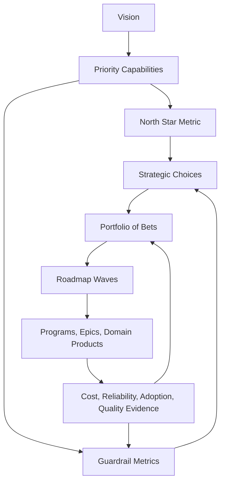
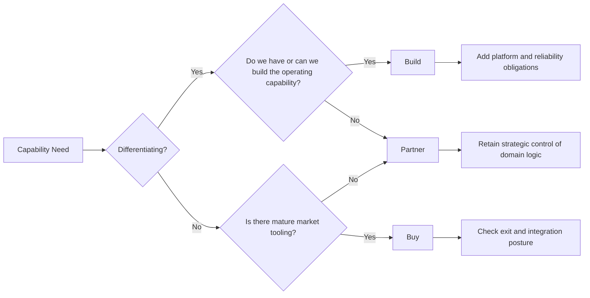
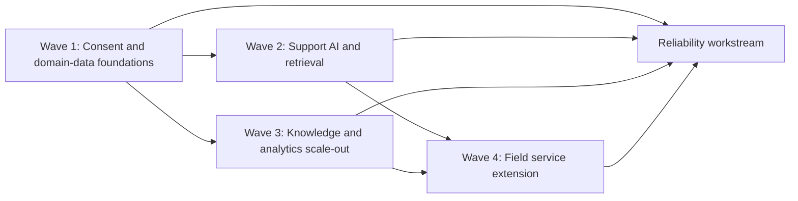

# Technical Strategy and Roadmaps

> Part of the **Enterprise Data & AI Architecture Handbook** - Phase-01 - Enterprise Architecture Foundations - Chapter 07.
> Estimated study time: **60 min reading + ~3h labs**.
> **Prerequisites:** read [Business Capability Modeling](06_Business_Capability_Modeling.md) first.

---

## Executive Summary

[Business Capability Modeling](06_Business_Capability_Modeling.md#core-concepts) established that the enterprise needs a stable business frame for prioritization: capabilities, heat maps, value streams, and domain linkages. **Technical strategy and roadmaps** turn that frame into a multi-year sequence of choices, investments, constraints, and measurable outcomes. A strategy is not a list of projects, not a backlog, and not a slogan such as `be AI first`. It is a coherent set of choices about where to invest, what not to do, which capabilities matter most, what metrics define success, and how to sequence the work so that dependencies are respected rather than discovered late in delivery.

This chapter uses a running example of a global service enterprise modernizing customer operations, consent-aware data products, knowledge retrieval, field-service workflows, and AI-assisted support. The strategy is anchored on a business outcome: improve service quality and operating efficiency without weakening compliance or reliability. That immediately forces architecture-level choices: which capabilities get funded first, which data domains become platform priorities, which parts are commodity and should be bought, which parts are differentiating and should be built, which gaps justify a partner ecosystem, and which North Star metrics and guardrail metrics will tell the enterprise whether the strategy is working.

The key distinction is between **vision**, **strategy**, and **roadmap**. Vision states the destination. Strategy states the major choices and the logic behind them. The roadmap turns those choices into a time-sequenced portfolio of bets, dependencies, milestones, and decision checkpoints. Mature strategy work explicitly balances innovation with reliability, platform standardization with domain autonomy, and short-term business pressure with long-term architectural coherence. Weak strategy work instead funds disconnected initiatives, produces overfull roadmaps, and confuses activity for progress.

The platform bias remains **Azure-primary (~60%)**: Azure DevOps Boards for initiative structure, GitHub or Azure Repos for strategy artifacts and ADRs, Azure SQL Database for the roadmap registry, Power BI for North Star and guardrail dashboards, Microsoft Purview and Unity Catalog for domain-product traceability, Azure Databricks for platform-enablement work, Azure Policy and Cost Management for governance and FinOps, Azure OpenAI and Azure AI Search for AI platform strategy choices, and Bicep or Terraform tagging to connect runtime assets back to strategic themes and roadmap waves. The **~30% open-source layer** includes Terraform, GitHub Actions, OpenMetadata, PostgreSQL, Neo4j, Grafana, Prometheus, Spark, Delta Lake, Backstage, and Kubernetes where they materially affect build-vs-buy or sequencing choices. **AWS and GCP remain comparison-only (~10%)**, useful for mapping equivalent managed services and migration constraints rather than duplicating the entire strategy.

**Bottom line:** technical strategy is the discipline of choosing where architecture effort should go before the organization spends the money. A roadmap is only credible if it is anchored in capabilities, constrained by real dependencies, governed by measurable outcomes, and explicit about which bets are exploratory, which are foundational, and which are reliability work that must happen even when nobody finds it exciting.

---

## Learning Objectives

By the end of this chapter you will be able to:

1. **Differentiate vision, strategy, and roadmap** and explain why confusing them leads to poor planning.
2. **Define North Star metrics and guardrail metrics** that make a technical strategy measurable.
3. **Evaluate build vs buy vs partner choices** using business differentiation, risk, and operating-model criteria.
4. **Sequence a multi-year roadmap** around dependencies, capability gaps, and portfolio bets rather than project enthusiasm.
5. **Communicate a strategy to executives** in business terms without losing technical rigor.
6. **Balance innovation and reliability** in funding and roadmap design.
7. **Implement a strategy repository and reporting workflow on Azure** with traceability from capability to initiative to runtime asset.
8. **Recognize the anti-patterns that turn roadmaps into fiction** and know how to correct them.

---

## Business Motivation

Technical strategy exists because large organizations otherwise spend heavily without making coherent progress:

- **Disconnected initiatives create architecture drift.** Teams modernize pieces of the estate without a shared target, so platform complexity grows faster than business value.
- **Roadmaps become capacity plans rather than strategic choices.** Everything important is placed on the same timeline, dependencies are hidden, and the organization confuses commitment with prioritization.
- **Data and AI funding is especially vulnerable to hype.** Without a strategy anchored in capabilities and outcomes, enterprises buy tools, launch pilots, and scale platforms that do not improve the most important business abilities.
- **Executives need a translation layer.** They do not need a list of services; they need to know which capabilities improve, what risks are retired, when business results appear, and what trade-offs the strategy is making.
- **Reliability work is easy to starve.** Innovation initiatives are visible and exciting; resilience, observability, migration, and control-plane investments are often invisible until they are skipped and outages force them back onto the roadmap at higher cost.
- **Build vs buy mistakes compound.** Buying what should be strategic can trap the enterprise in vendor-shaped limits; building what is commodity can absorb years of effort with little differentiation.

For data and AI architects, the motivation is acute: a strategy should tell the organization whether its next three years should prioritize governed domain data products, AI-assisted service workflows, field-service optimization, platform consolidation, or experimentation capacity, and why that sequence is more valuable than the plausible alternatives.

---

## History and Evolution

- **1960s-1980s - portfolio planning and strategic management disciplines** introduced formal ways to sequence investment under constraints, though mostly at business rather than technical resolution.
- **1990s - enterprise architecture and capability-based planning** brought a more explicit connection between strategy, capabilities, and technology programs.
- **1992 onward - Balanced Scorecard and related strategy-map thinking** made metric-linked strategy more common, especially for executive communication.
- **2000s - product and platform operating models** pushed strategy closer to ongoing delivery rather than annual master plans.
- **2010s - cloud adoption and platform engineering** forced technical strategies to include service-selection posture, landing-zone standards, migration waves, and operating-model maturity.
- **Late 2010s - FinOps, SRE, and reliability engineering** corrected an earlier bias toward feature roadmaps by making operational excellence and unit economics explicit strategic concerns.
- **2019 onward - Data Mesh and domain-aligned data ownership** required strategy documents to say not just `build a platform` but which business domains and products the platform serves first.
- **2023-2026 - generative AI and agentic systems** increased the need for disciplined technical strategy because model costs, safety risks, retrieval quality, legal exposure, and uncertain ROI make sequencing and bet-sizing much harder than in conventional platform work.

The net effect is that modern technical strategy is more continuous, more metric-driven, and more tightly connected to architecture and operating models than older multi-year technology plans.

---

## Why This Technology Exists

Technical strategy and roadmaps exist because architecture and execution need an intermediate decision layer between ambition and implementation:

- **Vision alone is too vague.** `Become a data-driven enterprise` or `win with AI` does not tell teams which capabilities to improve first or which trade-offs to accept.
- **Backlogs are too granular.** They are useful for delivery, not for determining which major bets deserve funding and sequencing.
- **Enterprise constraints are real.** Budget, skills, vendor commitments, regulatory deadlines, platform debt, and migration risk all shape what can be done when.
- **Many architectural choices are path-dependent.** You cannot credibly scale governed AI products before identity, data ownership, retrieval quality, and observability foundations exist.
- **Technology investment needs an explicit economic model.** Build vs buy vs partner is not a procurement afterthought; it is a first-order strategic choice.
- **Executive sponsorship depends on clarity.** Leaders fund coherent narratives with metrics, not collections of loosely related technical improvements.

Technical strategy therefore exists to answer a small set of hard questions clearly: what matters most, what gets deferred, what enables what, and how the organization will know whether the chosen path is working.

---

## Problems It Solves

- **Aligns architecture work to business outcomes** instead of platform preferences.
- **Creates a coherent sequence of bets** that respects dependencies and organizational readiness.
- **Makes build vs buy vs partner choices explicit** and reviewable.
- **Provides a measurable narrative for executives and delivery leaders** through North Star and guardrail metrics.
- **Protects reliability and governance work from being crowded out** by more visible innovation projects.
- **Connects capabilities, domains, programs, and runtime assets** into one strategy-to-delivery chain.

---

## Problems It Cannot Solve

- **It cannot replace leadership courage.** A good strategy still requires saying no to plausible initiatives.
- **It cannot make uncertain bets certain.** Exploratory work remains exploratory even when well-structured.
- **It cannot fix broken execution capability by itself.** A sound roadmap still fails if delivery, operations, or ownership are weak.
- **It cannot eliminate politics.** Budget and ownership disputes still need executive resolution.
- **It cannot make metrics perfectly clean.** North Star metrics and guardrails are still proxies for reality and require interpretation.
- **It cannot justify infinite detail.** A roadmap that is too precise too early becomes fiction rather than strategy.

---

## Core Concepts

### 7.1 Vision, strategy, and roadmap

These three terms are often conflated and should not be.

- **Vision** is the destination or future state. Example: `Deliver fast, compliant, AI-assisted service operations powered by reusable domain data products.`
- **Strategy** is the coherent set of choices that explains how the enterprise will move toward that destination. Example: `Prioritize customer-operations and consent domains first, standardize retrieval and data governance before broad AI rollout, buy commodity workflow tooling, build differentiating orchestration and domain products.`
- **Roadmap** is the time-sequenced expression of that strategy. Example: `Wave 1 builds data and consent foundations; Wave 2 operationalizes support AI and knowledge retrieval; Wave 3 extends the model to field service and commercial analytics.`

When a document contains only milestones and no choices, it is not a strategy. When it contains only aspirations and no sequence, it is not a roadmap.

### 7.2 North Star metrics and guardrails

A **North Star metric** captures the primary outcome the strategy is trying to improve. It should be business-relevant and hard to game. For the running example, one credible North Star metric is:

- `Percent of customer issues resolved within target SLA with compliant AI-assisted recommendations.`

This should be paired with **guardrail metrics** that prevent local optimization from damaging the system elsewhere:

- p95 support-assistant response time.
- Hallucination or unsafe-response rate from audited samples.
- Data-product freshness and quality SLA compliance.
- P1 or P2 service incidents per quarter.
- Cost per assisted interaction.
- Percentage of strategic capabilities supported by governed domain products.

The strategy is failing if the North Star rises only because the guardrails are being violated.

### 7.3 Build vs buy vs partner

This choice should be made with more structure than `our engineers prefer to build` or `procurement likes vendors`.

- **Build** when the capability is differentiating, tightly coupled to proprietary workflows or domain intelligence, or likely to evolve faster than a vendor can support.
- **Buy** when the capability is commodity, operationally well-understood, and unlikely to differentiate the enterprise. Examples often include workflow tooling, observability basics, or mature API management.
- **Partner** when the enterprise needs external expertise, content, data, or market access without surrendering the core differentiating layer. Examples include systems integrators for migration waves, domain-data providers, or specialist AI safety evaluation partners.

For data and AI platforms, many good strategies deliberately mix all three: buy platform primitives, build domain-specific products and orchestration, and partner where specialized external capability accelerates adoption without giving away strategic control.

### 7.4 Sequencing, dependencies, and portfolio bets

A roadmap is a dependency graph disguised as a timeline. Strategies fail when they pretend initiatives are independent when they are not. In the running example, enterprise AI rollout depends on:

- domain-owned customer, case, interaction, and consent data products;
- governed retrieval corpora and search quality;
- identity, audit, and policy enforcement;
- observability and feedback loops;
- platform operations maturity.

Roadmaps become much more realistic when initiatives are classified as:

- **Foundational bets:** enable later work but do not create immediate visible business delight.
- **Differentiating bets:** create business advantage if the foundations are in place.
- **Exploratory bets:** time-boxed experiments with explicit kill or scale criteria.
- **Reliability bets:** reduce risk, improve control, or retire technical debt.

### 7.5 Communicating strategy to executives

Executive communication should answer five questions quickly:

1. Which business capabilities improve first?
2. Why these and not the other plausible options?
3. What outcomes and metrics define success?
4. What are the main risks and dependencies?
5. What does the enterprise stop doing or defer as a result?

Executives generally do not need service-by-service architecture detail. They do need a defensible narrative connecting capability priorities, cost profile, risk posture, and roadmap waves.

### 7.6 Balancing innovation and reliability

Mature technical strategy treats reliability, governance, migration, and platform controls as first-class roadmap items rather than work that should somehow happen in the margins. A practical portfolio split might look like:

- 50-60% on core capability and revenue-impacting improvements.
- 20-30% on reliability, observability, security, and debt retirement.
- 10-20% on exploratory innovation bets with explicit exit criteria.

The exact ratio depends on estate maturity. The principle does not: innovation without reliability compounds risk, while reliability without new capability eventually starves growth.

### 7.7 Example ADR for a strategy choice

```markdown
# ADR-0073: Build domain orchestration and retrieval, buy commodity workflow platform

## Context
The enterprise is modernizing customer support and field service with AI-assisted
experiences, domain data products, and governed workflows. Leadership needs a
three-year strategy that improves service quality without creating an unsupported
custom platform everywhere. The market offers mature workflow and ticketing
products, but the organization's differentiating logic lives in domain retrieval,
consent-aware orchestration, and customer-operations intelligence.

## Decision
We will buy commodity workflow and case-management foundations where they meet
control requirements, build domain-specific retrieval and orchestration layers on
Azure, and partner selectively for migration acceleration and domain-specific
evaluation expertise.

## Consequences
- Positive: engineering effort stays focused on differentiating logic.
- Positive: time-to-value improves because commodity workflow features are not
  rebuilt from scratch.
- Negative: the architecture must manage vendor boundaries and escape-hatch risk.
- Negative: some integration and operating-model complexity shifts to API and
  event orchestration layers.
- Accepted trade-off: moderate integration complexity is preferable to building a
  full custom workflow platform that offers little strategic differentiation.

## Alternatives Considered
- Build the full workflow and AI platform internally: rejected because cost and
  delivery risk were too high for non-differentiating capabilities.
- Buy an end-to-end vendor suite with limited domain customization: rejected
  because it constrained domain data ownership and retrieval quality too tightly.
- Partner for all major delivery components: rejected because it would outsource
  too much of the strategic control plane and domain knowledge.
```

This is a strategy decision because it shapes funding, vendor posture, platform architecture, and delivery sequencing for multiple years.

---

## Internal Working

A sound technical-strategy practice usually runs through this loop:

1. **Anchor on capabilities and outcomes:** start with high-priority capabilities and gaps from [Business Capability Modeling](06_Business_Capability_Modeling.md#core-concepts).
2. **Define the target narrative:** vision, North Star metric, guardrails, and major business outcomes.
3. **Identify strategic options:** different ways to achieve the outcome, including build vs buy vs partner postures.
4. **Map dependencies and constraints:** skills, platforms, data domains, controls, vendor lock-in, and migration prerequisites.
5. **Classify bets:** foundational, differentiating, exploratory, and reliability.
6. **Sequence into roadmap waves:** what must happen first, what can run in parallel, and what should be deferred.
7. **Attach metrics and review gates:** how each wave will be measured and what would change the plan.
8. **Refresh continuously:** quarterly or per planning cycle, using delivery, cost, incident, and market feedback.

The strategy should stay stable enough to guide investment, but flexible enough to react to evidence. A strategy that cannot change is brittle. A strategy that changes every month is not a strategy.

---

## Architecture

The architecture of a strategy-and-roadmap system is a layered decision model:

1. **Business outcome layer:** goals, market drivers, compliance obligations, and capability priorities.
2. **Strategic choice layer:** target posture, build/buy/partner decisions, platform standards, and risk appetite.
3. **Portfolio layer:** bets, programs, initiative classes, and funding envelopes.
4. **Roadmap layer:** dependency-aware waves, milestones, decision gates, and retirement plans.
5. **Delivery layer:** epics, platform components, data products, and enabling controls.
6. **Feedback layer:** North Star, guardrail metrics, cost, incidents, adoption, and technical debt signals.

In the running Azure example, this architecture links `Resolve Customer Issues` and `Ensure Policy and Consent Compliance` to roadmap waves that sequence domain data products, retrieval quality, AI-assisted workflows, field-service extension, and capability-level dashboards. The strategy is only credible if the architecture makes those relationships explicit and reviewable.

---

## Components

The core components of a technical strategy and roadmap practice are:

- **Vision statement** and target narrative.
- **North Star metric** plus a small set of guardrail metrics.
- **Capability impact model** linked to the business capability registry.
- **Strategic option set** including build vs buy vs partner analysis.
- **Portfolio of bets** categorized by role and risk.
- **Roadmap waves** with dependencies, gates, and milestones.
- **Decision log and ADR set** for major posture choices.
- **Strategy repository and dashboards** connecting plans to runtime evidence.

For Azure-first implementations, these components typically live across Git or Azure Repos, Azure SQL, Purview, Azure Boards, Power BI, and resource metadata tags.

---

## Metadata

Technical strategy artifacts need more structure than slide notes. Useful metadata fields include:

- Strategy theme ID.
- Linked capability IDs.
- North Star metric and target date.
- Guardrail metrics and thresholds.
- Bet type: foundational, differentiating, exploratory, reliability.
- Build/buy/partner posture.
- Target domains and platform assets.
- Wave number and dependency class.
- Owner, sponsor, and review cadence.
- Kill, pivot, or scale criteria for exploratory bets.

If these fields are missing, roadmap discussions quickly revert to memory, persuasion, and spreadsheet archaeology.

---

## Storage

The strategy system stores mostly metadata and narrative, but its relationships matter more than its volume. A practical design often includes:

- Versioned markdown or docs-as-code artifacts in Git.
- A relational registry in Azure SQL Database or PostgreSQL for strategies, waves, metrics, and dependencies.
- Strategy snapshots and trend history in a lakehouse or warehouse for reporting.
- Purview or OpenMetadata linkage to data domains and governed products.

The storage principle is simple: strategy documents should be versioned, queryable, and linkable to operational systems. A quarterly PowerPoint is not enough.

---

## Compute

Strategy and roadmap operations are lightweight compared with production workloads, but they still benefit from automation:

- Scheduled jobs to refresh dashboards from Azure Boards, Purview, cost data, and incident systems.
- Metric calculations for North Star and guardrails.
- Dependency graph calculations and roadmap health summaries.
- Optional scoring or graph traversal for capability impact analysis.

On Azure, this usually fits comfortably in Azure Functions, Logic Apps, Azure SQL queries, Databricks jobs, or Power BI semantic model refreshes.

---

## Networking

The networking requirements are modest but not trivial:

- Internal access for strategy repositories, dashboards, and registry APIs.
- Secure integration paths between Boards, Purview, cost APIs, and metric pipelines.
- Optional private networking for Azure SQL, Purview, or internal portfolio dashboards.
- Region-aware access if executive dashboards and planning workflows are globally distributed.

Because strategy artifacts often include vendor posture, budget, compliance, and transformation timing, they should be treated as sensitive enterprise information rather than generic collaboration content.

---

## Security

Strategy and roadmap data is often politically and commercially sensitive. Security controls should include:

- Role-based edit permissions for executives, architects, product leaders, finance, and portfolio managers.
- Audit trails for score changes, roadmap moves, budget changes, and strategic posture decisions.
- Separation of duties so delivery teams cannot unilaterally inflate the importance of their own initiatives.
- Controlled access to vendor evaluations, cost projections, and M&A-related strategy branches.
- Explicit protection of strategy-linked domain metadata where regulated capabilities are involved.

Entra ID groups, RBAC, repository branch protections, and controlled Power BI workspace access are the practical Azure baselines.

---

## Performance

The performance requirement for technical strategy is decision speed with enough fidelity, not raw system throughput. Leaders should be able to answer questions like:

- Which roadmap wave improves the highest-priority capabilities first?
- Which dependencies block the AI rollout?
- What reliability work is at risk of being starved?
- Which exploratory bets should be killed because they are failing the guardrails?

If those answers require weeks of manual synthesis, the strategy platform is underperforming even if the underlying dashboards render quickly.

---

## Scalability

Roadmap practices need to scale across:

- Multiple business units and geographies.
- Hundreds of initiatives and epics.
- Many linked data products, domains, applications, and cloud assets.
- Frequent changes in delivery reality without losing the strategic frame.

Scalability comes from stable metadata, a limited taxonomy of bet types and dependencies, and deliberate refusal to over-detail far-future roadmap quarters.

---

## Fault Tolerance

The failure modes in strategy systems are mostly informational rather than computational:

- Missing or stale dependencies can invalidate a roadmap.
- Lost history can erase the reason why a bet was funded or killed.
- Metric breaks can make a strategy look healthier or weaker than it really is.
- Unavailable dashboards during planning cycles force people back to unofficial spreadsheets and oral reporting.

To avoid this, keep strategy registries backed up, preserve historical snapshots, and ensure that degraded reporting still surfaces the minimum critical picture needed for governance.

---

## Cost Optimization

Technical strategy should improve unit economics, not become another administrative layer. Cost practices include:

- Use existing Azure services for workflow, registry, and reporting before building a custom strategy platform.
- Tie every major strategic bet to expected cost, value, or risk-reduction logic.
- Make reliability and decommissioning work visible on the roadmap so cloud-spend reduction is not left to chance.
- Track cost per business outcome, not just total platform cost. For example: cost per assisted interaction, cost per governed domain product, or cost per field-service optimization wave.

The most important cost insight is often what the strategy decides not to build.

---

## Monitoring

Strategy execution should be monitored through a small set of health signals:

- Percentage of strategic initiatives linked to capabilities and metrics.
- Percentage of roadmap milestones delivered on time.
- Reliability work completion versus planned allocation.
- North Star trajectory and guardrail breaches.
- Build/buy/partner decision reversals and why they happened.
- Percentage of exploratory bets reaching a clear kill, pivot, or scale decision.

These metrics tell the organization whether the roadmap is being executed as intended or slowly mutating into an ungoverned backlog.

---

## Observability

Observability should explain why the strategy is drifting or succeeding:

- Show which capability signals are pushing a bet upward or downward in priority.
- Correlate guardrail breaches with specific roadmap waves or platform decisions.
- Trace how a change in Purview domain quality, operational incidents, or cost anomalies affects the roadmap.
- Expose hidden dependency failure patterns, such as a domain data product repeatedly delaying multiple downstream waves.

Strong observability turns planning from narrative defense into evidence-based adjustment.

---

## Governance

Governance is what keeps strategy from becoming a one-off planning exercise. A mature model includes:

- Quarterly strategy review tied to capability heat maps and operational evidence.
- Required ADRs for major strategic posture decisions.
- Mandatory capability IDs and metric links for funded initiatives.
- Executive review of exploratory bets with explicit continuation criteria.
- Formal treatment of reliability and compliance work as roadmap categories, not leftovers.
- Clear ownership for roadmap changes, dependency resolution, and benefit tracking.

[Business Capability Modeling](06_Business_Capability_Modeling.md#governance) established that capability governance is only useful when it affects real decisions. Technical strategy is one of the primary mechanisms by which that happens.

---

## Trade-offs

| Dimension | Strategy-heavy, dependency-aware roadmap | Project-list roadmap | Main trade-off |
|---|---|---|---|
| Clarity of choices | High | Low | Better prioritization versus more upfront synthesis work |
| Executive usefulness | Strong | Weak to moderate | Better business narrative versus less room for everyone to claim priority |
| Adaptability | High if reviewed regularly | Often chaotic | Managed change versus unmanaged churn |
| Detail | Focused on what matters | Either too shallow or too detailed | Decision quality versus illusion of precision |
| Innovation balance | Explicit | Usually accidental | Better risk management versus harder conversations about deferral |
| Reliability treatment | Visible | Often marginalized | Better operational posture versus less flashy narrative |

The main trade-off is discipline. A real strategy forces the organization to choose, which is exactly why many organizations avoid it.

---

## Decision Matrix

| Situation | Recommended strategic posture |
|---|---|
| Commodity operational capability with mature market tooling | Buy, then integrate cleanly |
| Differentiating domain logic tied to proprietary workflows or data | Build |
| Capability needs external data, expertise, or migration capacity but strategic control should remain internal | Partner |
| Major AI rollout with weak governed data foundations | Sequence foundations first, delay broad rollout |
| High operational incident rate in a strategic platform | Increase reliability allocation before expanding scope |
| Unclear ROI for a promising technology | Time-box as an exploratory bet with kill criteria |
| Multiple waves depend on one critical domain data product | Treat that product as a foundational bet and fund it accordingly |

---

## Design Patterns

- **Vision -> strategy -> roadmap cascade** with explicit links between each layer.
- **North Star plus guardrails** instead of single-metric optimization.
- **Three-horizon or wave-based sequencing** for multi-year execution.
- **Portfolio of bets** classified by role and uncertainty.
- **Build/buy/partner lens** applied per capability area, not as a one-time procurement exercise.
- **Capability-linked roadmap** where every major initiative traces to business value.
- **Reliability reservation pattern** that protects risk-reduction work from feature-only planning.

---

## Anti-patterns

- **Roadmap as wish list:** every good idea scheduled, nothing truly prioritized.
- **Strategy as slogan:** aspirational language with no hard choices.
- **Build everything ourselves:** engineering pride overriding economic logic.
- **Buy everything important:** outsourcing strategic differentiation to the vendor roadmap.
- **Innovation theater:** pilots and PoCs with no kill criteria and no path to scale.
- **Reliability as invisible tax:** observability, migration, security, and resilience never explicitly funded.
- **Quarter-by-quarter fiction:** highly precise dates two years out that nobody actually believes.

---

## Common Mistakes

- Confusing roadmap milestones with strategy.
- Using too many top-level metrics and no clear North Star.
- Failing to state what will not be done.
- Ignoring data and governance dependencies for AI initiatives.
- Treating all bets as equally reversible.
- Letting vendor demos drive architecture posture.
- Building a roadmap around organizational optimism instead of delivery capacity.
- Updating the slide deck but not the underlying metadata, ownership, or dashboards.

---

## Best Practices

- Anchor strategy in a small number of critical capabilities and measurable outcomes.
- Keep the North Star metric business-visible and the guardrails technically meaningful.
- Make build/buy/partner choices explicit and revisit them when assumptions change.
- Sequence roadmap waves around enabling constraints, not presentation symmetry.
- Reserve explicit capacity for reliability, compliance, and debt retirement.
- Make exploratory bets earn continuation through evidence.
- Keep far-future roadmap detail intentionally coarse.
- Tie strategy artifacts to operational and financial data so the roadmap can be challenged with evidence.

---

## Enterprise Recommendations

- Establish a **strategy registry** linked to the capability model, portfolio intake, and domain metadata.
- Standardize one **North Star metric template** and a small mandatory set of guardrail dimensions for data and AI initiatives.
- Require every material initiative to declare whether it is foundational, differentiating, exploratory, or reliability work.
- Create a formal **build/buy/partner review** for major platform and AI decisions.
- Make **roadmap dependency review** a standing architecture and portfolio governance practice.
- Publish an executive narrative that explains not only what is funded, but what is deferred and why.

---

## Azure Implementation

An Azure-first technical-strategy implementation should connect planning artifacts, governed metadata, and runtime evidence without inventing an unnecessary custom platform.

- Use **Azure DevOps Boards** or **GitHub Projects** for initiatives, epics, and roadmap waves, with mandatory custom fields for capability ID, bet type, target North Star contribution, and roadmap wave.
- Use **Azure Repos** or **GitHub** for strategy markdown, ADRs, decision logs, and diagrams.
- Use **Azure SQL Database** as the source-of-truth registry for strategy themes, bets, dependencies, and metrics.
- Use **Power BI** as the executive and architecture-board reporting surface for roadmap status, guardrail breaches, and strategy outcome trends.
- Use **Microsoft Purview** and **Unity Catalog** to link strategic bets to domain data products, governance status, and ownership.
- Use **Azure Cost Management**, **Azure Monitor**, and **Defender for Cloud** data as direct evidence feeds for guardrail metrics and reliability work.
- Use **Azure Policy** and **Bicep/Terraform tags** so strategic themes and roadmap waves can be traced into actual resources.

Example strategy registry schema:

```sql
CREATE TABLE strategy_theme (
    strategy_theme_id     VARCHAR(20) PRIMARY KEY,
    strategy_theme_name   NVARCHAR(200) NOT NULL,
    north_star_metric     NVARCHAR(200) NOT NULL,
    target_date_utc       DATE NOT NULL,
    executive_owner       NVARCHAR(200) NOT NULL,
    review_cadence        NVARCHAR(50) NOT NULL
);

CREATE TABLE roadmap_bet (
    roadmap_bet_id        VARCHAR(20) PRIMARY KEY,
    strategy_theme_id     VARCHAR(20) NOT NULL,
    bet_name              NVARCHAR(200) NOT NULL,
    bet_type              NVARCHAR(30) NOT NULL,
    posture               NVARCHAR(20) NOT NULL,
    roadmap_wave          TINYINT NOT NULL,
    capability_id         VARCHAR(20) NOT NULL,
    dependency_summary    NVARCHAR(1000) NULL,
    success_metric        NVARCHAR(200) NOT NULL,
    kill_or_scale_rule    NVARCHAR(500) NULL,
    CONSTRAINT FK_roadmap_bet_strategy
        FOREIGN KEY (strategy_theme_id) REFERENCES strategy_theme(strategy_theme_id)
);
```

Example prioritization query for current-wave bets:

```sql
SELECT
    rb.roadmap_bet_id,
    rb.bet_name,
    rb.bet_type,
    rb.posture,
    rb.roadmap_wave,
    st.strategy_theme_name,
    rb.success_metric
FROM roadmap_bet rb
JOIN strategy_theme st
  ON st.strategy_theme_id = rb.strategy_theme_id
WHERE rb.roadmap_wave = 1
ORDER BY rb.bet_type, rb.posture, rb.bet_name;
```

Example Bicep tags pushing roadmap metadata into runtime assets:

```bicep
param strategyThemeId string
param roadmapWave string
param capabilityId string

resource aiSearch 'Microsoft.Search/searchServices@2023-11-01' = {
  name: 'srch-prod-support-ai'
  location: resourceGroup().location
  sku: {
    name: 'standard'
  }
  properties: {
    hostingMode: 'default'
  }
  tags: {
    strategyThemeId: strategyThemeId
    roadmapWave: roadmapWave
    capabilityId: capabilityId
    betType: 'differentiating'
  }
}
```

Example Azure CLI update for an existing resource:

```bash
az resource tag \
  --ids /subscriptions/<sub>/resourceGroups/rg-prod-support-ai/providers/Microsoft.Search/searchServices/srch-prod-support-ai \
  --tags strategyThemeId=TS-01 roadmapWave=2 capabilityId=BC-2.3 betType=differentiating
```

Example Azure DevOps or GitHub validation policy can be simple: no initiative merges into an active roadmap wave without a capability ID, a bet type, and at least one target metric. The exact workflow tool matters less than making the metadata non-optional.

---

## Open Source Implementation

The open-source equivalent stack is strong enough for the same operating model:

- **PostgreSQL** for the strategy and dependency registry.
- **OpenMetadata** for domain-product, glossary, and ownership linkage.
- **Backstage** as an internal strategy and capability portal.
- **Neo4j** for dependency and impact-graph traversal across capabilities, bets, domains, and systems.
- **Grafana** and **Prometheus** for guardrail and reliability dashboards.
- **Terraform** and **GitHub Actions** for metadata automation and enforcement.

Example Cypher query to find reliability work missing from active waves:

```cypher
MATCH (b:Bet {roadmapWave: 1})
WHERE b.betType <> 'reliability'
WITH count(b) AS activeNonReliability
MATCH (r:Bet {roadmapWave: 1, betType: 'reliability'})
RETURN activeNonReliability, count(r) AS activeReliability;
```

Example repository layout:

```text
/strategy
  /themes
  /roadmaps
  /adr
  /metrics
/capabilities
/domains
/portfolio
/automation
```

This route gives flexibility and portability, but it requires more assembly discipline to keep portfolio, metadata, cost, and runtime signals coherent.

---

## AWS Equivalent (comparison only)

The strategy discipline is cloud-agnostic, but Azure anchors map broadly to AWS equivalents:

| Azure anchor | AWS equivalent | Main advantage | Main disadvantage | Migration note | Selection criteria |
|---|---|---|---|---|---|
| Azure DevOps Boards / GitHub | Jira, GitHub, or AWS-adjacent workflow tooling | Flexible workflow options | No single AWS-native equivalent for strategy plus architecture governance | Preserve mandatory metadata and approval logic | Best where enterprise workflow tooling is already standardized |
| Azure SQL Database | Aurora or RDS PostgreSQL | Strong managed registry options | Broader traceability still depends on surrounding tooling | Migrate schema and history before dashboards | Choose by enterprise database standard |
| Power BI | QuickSight | Managed reporting with AWS ecosystem integration | Semantic-modeling flexibility may vary by estate | Recreate North Star and guardrail views with the same logic | Strong fit when QuickSight is already the analytics standard |
| Purview / Unity Catalog | Glue Catalog, Lake Formation, Databricks on AWS | Deep data-lake integration | Strategy-to-domain linkage can be more fragmented | Preserve domain IDs and ownership metadata | Good when AWS data governance already exists |
| Azure Policy / Cost Management | AWS Config, Organizations, Budgets, Cost Explorer | Strong native control and cost tooling | Equivalent policy-to-strategy linkage may require more stitching | Rebuild the evidence feeds for guardrails carefully | Best where AWS is already the control plane |

The main strategy logic does not change. What changes is the surrounding governance ergonomics.

---

## GCP Equivalent (comparison only)

GCP also supports the same model with different service choices:

| Azure anchor | GCP equivalent | Main advantage | Main disadvantage | Migration note | Selection criteria |
|---|---|---|---|---|---|
| Azure DevOps Boards / GitHub | Jira, GitHub, Google Workspace-backed workflows | Flexible collaboration posture | No single native end-to-end strategy stack | Preserve approval and metadata rules | Best where the workflow ecosystem is already settled |
| Azure SQL Database | Cloud SQL or AlloyDB | Strong managed registry options | Governance integration remains custom | Port dependency and wave history carefully | Choose by enterprise data standard |
| Power BI | Looker | Strong semantic modeling and executive reporting | Some organizations need more setup for portfolio-style dashboards | Rebuild metrics and guardrails with identical definitions | Strong fit where Looker is the decision layer |
| Purview / Unity Catalog | Dataplex and Data Catalog ecosystem | Good analytics-governance integration | Strategy metadata and business ownership often need more customization | Preserve business IDs and domain ownership semantics | Best when GCP analytics is already strategic |
| Azure Policy / Cost Management | Organization Policy, Cloud Billing, SCC | Good control-plane coverage | Evidence aggregation can be more distributed | Re-map reliability and cost guardrails explicitly | Choose based on existing GCP control maturity |

Again, the cloud choice changes implementation texture, not the underlying strategy discipline.

---

## Migration Considerations

Most organizations do not start with a clean strategy system. Common migrations include:

- **From project-list planning to capability-linked strategy:** attach existing initiatives to capabilities and force prioritization through impact scoring.
- **From annual static roadmap to rolling quarterly review:** keep the multi-year direction but reduce the fiction of fixed far-future commitments.
- **From platform-centric planning to business-outcome planning:** restate major bets in terms of capability improvement and measurable effects.
- **From PoC-heavy AI exploration to governed portfolio bets:** give experiments kill criteria, owner accountability, and sequencing rules.
- **From hidden debt and reliability work to explicit roadmap categories:** reserve capacity and dashboard space for work that keeps the platform survivable.

The migration risk is over-formalizing too early. Start by making the major choices, dependencies, and metrics explicit. Add more structure only where it improves decisions.

---

## Mermaid Architecture Diagrams

**Strategy cascade from capability to roadmap:**



**Build vs buy vs partner decision flow:**



**Wave sequencing and dependency map:**



---

## End-to-End Data Flow

In a working strategy-and-roadmap system, information flows through the enterprise like this:

1. Capability priorities and heat-map updates arrive from the capability model.
2. Strategy owners define or refresh the North Star metric, guardrails, and major bets for the next planning horizon.
3. Architecture and product leaders evaluate build/buy/partner options for each strategic theme.
4. Domain owners and platform teams map prerequisites, data-product readiness, governance gaps, and delivery dependencies.
5. Strategy metadata is written into the registry and linked to Azure Boards epics, Purview domains, and cost centers.
6. Roadmap waves are approved with explicit funding, reliability allocation, and review gates.
7. Delivery teams implement platform work, domain data products, workflow changes, and AI experiences.
8. Runtime signals from Azure Monitor, Cost Management, incidents, data quality, and adoption dashboards flow back into Power BI and the strategy registry.
9. Quarterly reviews compare North Star progress and guardrail breaches against the original roadmap assumptions.
10. Bets are scaled, killed, delayed, or re-sequenced based on evidence rather than roadmap inertia.

---

## Real-world Business Use Cases

- **Customer-service modernization:** sequence data-product, knowledge, AI, and workflow investments so service quality improves without breaking compliance.
- **Field-service optimization:** prioritize asset, work-order, and technician-data improvements before advanced scheduling or AI recommendations.
- **Regulated data-platform consolidation:** decide which governance, lineage, and retention work must come before broader self-service analytics.
- **Enterprise AI portfolio management:** separate foundational retrieval and safety work from exploratory agentic bets and commodity tooling.
- **Post-acquisition platform integration:** choose which systems to retain, replace, or integrate based on capability impact and roadmap dependencies.

---

## Industry Examples

- **Amazon's one-way door versus two-way door decision style** has influenced strategy sequencing by making reversibility and bet-sizing explicit.
- **Microsoft's public cloud and platform guidance** repeatedly shows the pattern of landing zones first, workload acceleration second, and broad platform scale-out only after governance primitives exist.
- **Databricks customer guidance** often reflects the same strategic shape: get domain data products, governance, and platform reliability right before scaling AI and advanced analytics broadly.
- **Thoughtworks and similar consultancies** frequently use capability-linked roadmaps and option analysis to stop enterprises from funding modernization as a tool-by-tool shopping exercise.

---

## Case Studies

**Case Study 1 - AI before data ownership.** A large service enterprise funded an ambitious support-assistant rollout before fixing consent, interaction, and knowledge-domain ownership. The first pilot generated fast demos but weak production outcomes: low trust, inconsistent grounding, and repeated compliance escalations. The strategy was wrong, not just the implementation. A revised roadmap moved domain data products, consent controls, and retrieval quality into Wave 1 and delayed broad agent rollout until the guardrails were credible.

**Case Study 2 - Buying the differentiator.** Another company bought a vendor suite that bundled workflow, retrieval, and recommendation logic. Initial delivery was fast, but the enterprise later discovered it could not adapt domain-specific orchestration and evaluation to its own operating model without expensive customization. The strategy had treated differentiating domain logic as commodity. The correction required reintroducing a build posture for the orchestration layer while retaining bought workflow primitives underneath.

**Case Study 3 - Reliability work removed from the roadmap.** A product-led organization kept postponing observability, identity cleanup, and domain-event controls because each quarter's roadmap favored visible customer features. By the time the second wave of AI-enabled workflows launched, production incidents and runaway cost eroded executive confidence. The recovery strategy explicitly reserved reliability capacity and attached guardrail metrics to every wave, restoring credibility.

---

## Hands-on Labs

1. **Write a one-page strategy statement** for a data or AI program with a clear vision, three to five strategic choices, one North Star metric, and five guardrail metrics.
2. **Create a build/buy/partner matrix** for three capability areas and justify each posture.
3. **Design a three-wave roadmap** with at least six initiatives, explicit dependencies, and one reliability workstream.
4. **Create a strategy registry schema** in SQL or a structured spreadsheet with bet types, wave numbers, and linked capabilities.
5. **Tag sample cloud resources** with strategy theme, roadmap wave, and capability identifiers using Azure CLI or Bicep.
6. **Run a quarterly review simulation** where one exploratory bet is killed, one reliability program is pulled forward, and one differentiating bet is re-sequenced.

---

## Exercises

1. Why is a roadmap with dates but no explicit strategic choices not actually a technical strategy?
2. Give an example of a credible North Star metric and two guardrails for an enterprise AI support program.
3. Under what conditions should a capability be built rather than bought, even if a vendor product exists?
4. How would you explain to an executive why a low-visibility reliability initiative belongs in Wave 1 rather than `after launch`?
5. What evidence should cause an exploratory bet to be killed rather than scaled?

---

## Mini Projects

- **Strategy Registry Starter:** build a small registry for one strategy theme, three bets, dependencies, and metrics, then publish a simple dashboard.
- **Roadmap Stress Test:** take an existing project roadmap and reframe it as foundational, differentiating, exploratory, and reliability bets with explicit capability links.
- **Build/Buy/Partner Review Pack:** create an executive-ready decision pack for one major platform choice, including options, cost logic, exit risk, and roadmap implications.

---

## Capstone Integration

In the handbook capstone, technical strategy and roadmap design should explain why the platform exists in the order it does. The capstone should not simply present a final Azure and data architecture. It should show the chosen waves, the dependencies that shaped them, the capabilities they improve, the bets that were intentionally deferred, and the metrics that prove whether the strategy is working.

The direct link back to [Business Capability Modeling](06_Business_Capability_Modeling.md#core-concepts) is essential: without capability priorities and data-domain linkages, the roadmap becomes a technology program in search of a business rationale.

---

## Interview Questions

1. What is the difference between vision, strategy, and roadmap?
2. What makes a North Star metric useful, and why are guardrails necessary?
3. How do you decide whether to build, buy, or partner for a technical capability?
4. Why should reliability work appear explicitly in a strategy roadmap?
5. How do capability priorities improve roadmap quality for data and AI initiatives?

---

## Staff Engineer Questions

1. Your leadership wants to launch AI copilots quickly, but the governed retrieval layer and consent domain are weak. How would you argue for a different sequence without sounding like you are simply slowing the team down?
2. A roadmap contains ten major initiatives in the same two quarters and claims all are high priority. How would you expose whether the plan is unrealistic or just poorly expressed?
3. How would you detect that your organization is buying too much of its differentiating logic from vendors or, conversely, building too much commodity infrastructure internally?

---

## Architect Questions

1. Design a three-year technical strategy for customer operations, domain data products, retrieval, and AI-assisted workflows. Which themes would you fund first, and why?
2. How would you connect capability heat maps, domain ownership, and roadmap waves so architecture governance can challenge the plan with evidence?
3. When a strategic roadmap is under pressure from both executive urgency and platform fragility, how do you decide what to defer without losing the long-term architecture?

---

## CTO Review Questions

1. Can we explain our next two years of technology spend as a small number of coherent bets tied to capability outcomes, or only as a list of projects?
2. Which strategic themes currently depend on weak data ownership, weak observability, or weak vendor posture, and what is the cost of ignoring those dependencies?
3. If market conditions forced us to cut or redirect 20 percent of current roadmap spend, do we know which bets to kill first and why?

---

## References

- Rumelt, R. *Good Strategy/Bad Strategy.* Crown Business.
- Lafley, A. G., and Martin, R. *Playing to Win.* Harvard Business Review Press.
- Kaplan, R., and Norton, D. *The Balanced Scorecard.* Harvard Business Review Press.
- The Open Group. TOGAF Standard, 10th Edition. https://www.opengroup.org/togaf
- Microsoft. Azure Architecture Center. https://learn.microsoft.com/azure/architecture/
- Microsoft. Azure DevOps documentation. https://learn.microsoft.com/azure/devops/
- Microsoft. Microsoft Purview documentation. https://learn.microsoft.com/purview/
- Microsoft. Azure Cost Management documentation. https://learn.microsoft.com/azure/cost-management-billing/
- Microsoft. Azure Policy documentation. https://learn.microsoft.com/azure/governance/policy/
- Microsoft. Azure Databricks documentation. https://learn.microsoft.com/azure/databricks/
- OpenMetadata documentation. https://open-metadata.org/
- Thoughtworks Technology Radar and strategy writings. https://www.thoughtworks.com

---

## Further Reading

- Kim, G., Humble, J., Debois, P., and Willis, J. *The DevOps Handbook.* IT Revolution.
- Beyer, B., Jones, C., Petoff, J., and Murphy, N. *Site Reliability Engineering.* O'Reilly.
- Dehghani, Z. *Data Mesh.* O'Reilly.
- Ford, N., Parsons, R., and Kua, P. *Building Evolutionary Architectures.* O'Reilly.
- Skelton, M., and Pais, M. *Team Topologies.* IT Revolution.
- Public FinOps Foundation materials and enterprise portfolio-governance practices.