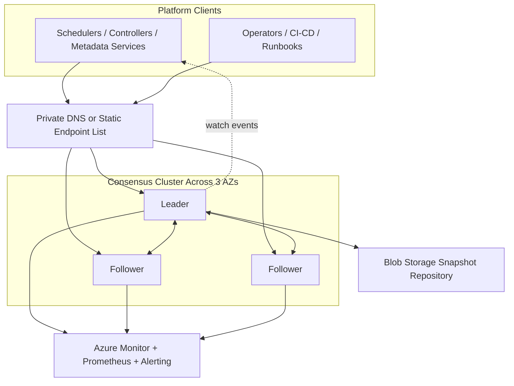
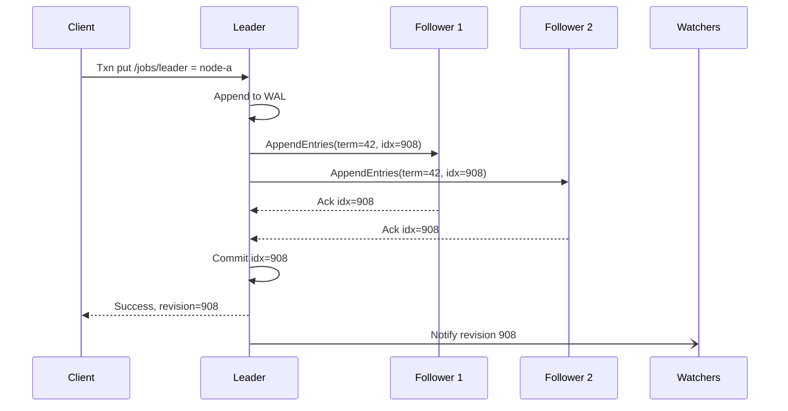
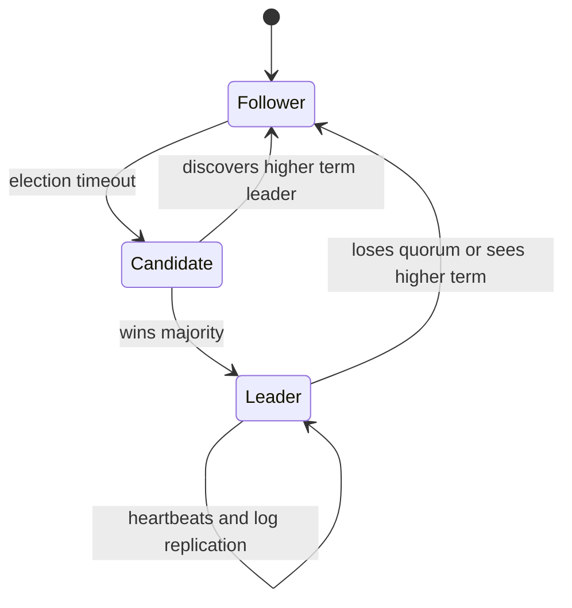
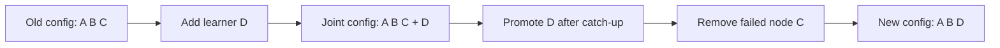

# Consensus and Coordination

> Part of the **Enterprise Data & AI Architecture Handbook** · Phase-02 — Distributed Systems Deep Dive · Chapter 01.
> Estimated study time: **75 min reading + ~5h labs**.
> **Prerequisites:** read [Distributed Systems Primer](../Phase-00/08_Distributed_Systems_Primer.md) first.

---

## Executive Summary

Consensus is the control-plane primitive that lets a distributed system make one durable, globally ordered decision at a time despite crashes, restarts, and network ambiguity. If multiple nodes must agree on who the leader is, which configuration version is current, whether a lock is held, or what the next committed metadata change should be, they need more than replication alone. They need a protocol that guarantees that two healthy-looking sides of a partition cannot both successfully commit conflicting truths.

The governing constraint is the FLP impossibility result, introduced in [Distributed Systems Primer](../Phase-00/08_Distributed_Systems_Primer.md#history-and-evolution): in a fully asynchronous system with even one faulty process, no deterministic consensus algorithm can guarantee termination in all cases. Practical systems therefore optimize for safety first, assume partial synchrony in practice, and use timeouts, randomized elections, and failure detectors to achieve liveness most of the time without violating correctness.

Paxos, Multi-Paxos, Raft, and ZAB solve the same class of problem with different trade-offs. Paxos is the foundational proof-oriented algorithm family. Multi-Paxos amortizes leader election and makes repeated log replication practical. Raft reorganizes the same guarantees around a more understandable leader-driven model. ZAB, the protocol behind ZooKeeper, specializes in primary-led atomic broadcast and session-based coordination. etcd, ZooKeeper, and Consul package these algorithms into operational coordination systems with leases, watches, compare-and-swap, ACLs, and membership management.

For enterprise data and AI platforms, the main design point is not "which consensus paper is most elegant" but "where should consensus exist, and where should it not." Use consensus for control-plane metadata, leadership, failover, schema/config rollout state, and small coordination records. Do not use it for bulk telemetry, large documents, vector payloads, or high-throughput business data. Azure-first design usually means: prefer native Azure primitives such as Blob leases, Service Bus sessions, or Durable Functions when the coordination need is narrow; deploy etcd or Consul on dedicated Azure infrastructure only when the workload truly requires linearizable writes, watch streams, and explicit quorum semantics.

**Bottom line:** consensus is a Tier-0 dependency. When it is correct, the rest of the platform can safely coordinate failover and change. When it is slow, overloaded, or misconfigured, the whole control plane becomes fragile. An architect should be able to explain quorum math, failure tolerance, leader election behavior, configuration change safety, and why a given workload does or does not deserve a consensus-backed control plane.

---

## Learning Objectives

By the end of this chapter you will be able to:

1. Define the consensus problem in terms of agreement, validity, integrity, and termination.
2. Explain the FLP impossibility result precisely enough to distinguish theoretical limits from practical system design.
3. Compare Paxos, Multi-Paxos, Raft, and ZAB in terms of protocol structure, operator ergonomics, and failure behavior.
4. Design leader election, lease ownership, and fencing-token patterns without split-brain risk.
5. Choose between etcd, ZooKeeper, Consul, Azure Service Fabric, and lighter Azure coordination primitives for a concrete enterprise use case.
6. Reason about quorum size, odd-member cluster design, and joint-consensus configuration changes.
7. Build and operate a production-grade coordination service on Azure with the right storage, security, monitoring, and DR posture.
8. Explain how Azure Service Fabric's replica-set quorum model compares to Raft, and when it is the right Azure-native alternative to Kubernetes-plus-database patterns.
9. Defend when not to use consensus and what lower-cost alternative should be selected instead.

---

## Business Motivation

- Every modern data platform has a control plane, whether acknowledged or accidental. Schedulers, metadata catalogs, service registries, feature flags, data contract state, failover leadership, and model rollout approvals all need a single authoritative sequence of decisions.
- The cost of getting control-plane correctness wrong is disproportionate. A duplicate ETL leader can double-run a pipeline, a split-brain metadata store can corrupt a transaction log, and a stale service registry can route traffic into a dead partition.
- Consensus avoids the most expensive class of distributed incident: two actors both believing they are allowed to mutate shared state. The direct business consequences are duplicate billing, missing orders, stale AI model rollout state, or unsafe infrastructure changes.
- Regulated environments care about coordination records as much as data records. Auditors ask who promoted a model, who changed retention policy, which node owned a lock, and what the authoritative state was at the time of an incident.
- Coordination workloads are small in bytes but huge in blast radius. Saving money by placing them on weak locking schemes, slow disks, or shared noisy infrastructure usually looks efficient until the first failover or deployment incident.
- For Azure-centric enterprises, standardizing the coordination pattern reduces complexity: simple exclusive access uses cheap native services, while strong metadata consensus gets a hardened, reusable reference architecture.

---

## History and Evolution

- **1985 — FLP impossibility.** Fischer, Lynch, and Paterson prove that deterministic consensus cannot guarantee termination in a fully asynchronous system with even one crash fault.
- **1988/1998 — Paxos.** Leslie Lamport develops Paxos and later publishes *The Part-Time Parliament*, establishing the core quorum-intersection model used by most serious coordination systems.
- **Early 2000s — Chubby.** Google operationalizes Paxos in Chubby, a lock and naming service that becomes a canonical example of consensus as a control-plane utility rather than a general-purpose database.
- **2007-2010 — ZooKeeper and ZAB.** Apache ZooKeeper turns consensus-backed coordination into a mainstream open-source platform, especially for Hadoop, HBase, and early Kafka.
- **2013-2014 — Raft, etcd, and Consul.** Raft makes the protocol easier to reason about; etcd becomes the canonical Kubernetes metadata store; Consul combines Raft-backed state with service discovery and gossip.
- **2014-2020 — Cloud-native control planes.** Kubernetes, service meshes, and operator patterns normalize the idea that every platform has a quorum-backed metadata layer, even if application developers never see the algorithm directly.
- **2021-2026 — KRaft and ecosystem simplification.** Kafka removes its ZooKeeper dependency through KRaft, validating the broader industry direction: fewer specialized side systems, more explicit use of Raft-style metadata quorums.

---

## Why This Technology Exists

- Replication alone is insufficient. Multiple replicas can all hold data, but without consensus they cannot safely agree which update is authoritative after failures or network partitions.
- A control plane needs a total order of decisions. "Node A became leader," "config version 42 is active," and "tenant X lock is released" must be durable and globally sequenced.
- Failure detection is ambiguous, as established in [Distributed Systems Primer](../Phase-00/08_Distributed_Systems_Primer.md#core-concepts). A timeout never proves whether a peer crashed, slowed down, or was partitioned away. Consensus exists to remain safe under that ambiguity.
- Coordination primitives such as leases, locks, watchers, and membership changes need stronger guarantees than most data-plane storage APIs provide.
- Operators need a safe way to replace nodes, rotate certs, recover from disk failure, and roll configuration without creating a split-brain event.
- Application teams need a standard utility for "exactly one active owner at a time" that does not collapse under retries, process pauses, or zonal failure.

---

## Problems It Solves

- Safe leader election for schedulers, controllers, transaction coordinators, and failover managers.
- Durable log replication for small, critical metadata and control-plane updates.
- Strong compare-and-swap semantics for configuration, locks, checkpoints, and feature promotion state.
- Membership management and service discovery with authoritative ownership and revision tracking.
- Watch and notification streams so clients can react to state changes without polling every dependency.
- Split-brain prevention through quorum intersection and term or epoch monotonicity.
- Safe cluster reconfiguration when adding, removing, or replacing members.

---

## Problems It Cannot Solve

- It cannot guarantee liveness under every asynchronous failure scenario because FLP still applies. Practical systems can stall rather than violate safety.
- It cannot tolerate Byzantine faults unless the protocol and replica count are specifically designed for that threat model. Paxos, Raft, ZAB, etcd, ZooKeeper, and Consul are crash-fault-tolerant, not Byzantine-fault-tolerant.
- It cannot turn a metadata store into a scalable data plane. Consensus clusters are intentionally small and write-latency-sensitive.
- It cannot fix application semantics when clients ignore fencing tokens, idempotency, or stale-read constraints.
- It cannot make cross-continent synchronous writes cheap. A geographically stretched quorum pays the network round-trip and tail-latency tax on every commit.
- It cannot replace workflow design. If the business operation itself needs compensation or saga orchestration, consensus only coordinates state; it does not invent the business rollback semantics.

---

## Core Concepts

### 8.1 The consensus problem

Consensus asks a set of nodes to agree on a single value, or more practically a sequence of log entries, despite crashes and message delay. Production systems usually frame the properties as:

- **Agreement:** two non-faulty nodes never decide conflicting values for the same slot.
- **Validity:** a chosen value came from a legitimate proposal.
- **Integrity:** a node does not decide the same slot twice.
- **Termination:** if failures eventually stop and communication becomes timely enough, the protocol should eventually choose a value.

Modern systems rarely run one-shot consensus once. They run repeated consensus over a replicated log, then apply the committed log entries to a deterministic state machine.

### 8.2 Safety, liveness, and FLP impossibility

Consensus design is a constant negotiation between **safety** and **liveness**:

- **Safety** means the system never commits two conflicting truths.
- **Liveness** means the system eventually makes progress.

FLP says no deterministic protocol can guarantee both in a fully asynchronous model with one faulty process. Practical protocols therefore assume partial synchrony and use failure detectors built from timeouts. When timings are bad, the correct behavior is usually to stop making progress rather than commit conflicting state. This is why a quorum-backed service may appear unavailable during a partition even though a subset of nodes is still up.

### 8.3 Quorums and quorum intersection

The core math is quorum intersection. In a cluster of $2f + 1$ members, any majority quorum of $f + 1$ intersects any other majority quorum in at least one node. That shared node prevents two different values from being simultaneously committed for the same log position. Operationally:

- 3 members tolerate 1 failure.
- 5 members tolerate 2 failures.
- 4 members still tolerate only 1 failure, but pay more coordination cost than 3.

This is why odd-sized clusters are standard. The goal is not symmetry. The goal is maximizing tolerated failures per unit of latency and cost.

### 8.4 Paxos and Multi-Paxos

Classic Paxos separates roles into proposers, acceptors, and learners. It uses two conceptual phases:

1. **Prepare/Promise:** a proposer asks acceptors to promise not to accept proposals lower than a given proposal number.
2. **Accept/Accepted:** once the proposer has enough promises, it asks acceptors to accept a value.

Paxos is correct and foundational, but operationally awkward if every log slot requires a fresh prepare phase. **Multi-Paxos** addresses that by establishing a stable leader, so most entries can go straight to the accept phase until leadership changes. Many production systems that say "Paxos" actually mean a Multi-Paxos-style replicated log.

### 8.5 Raft

Raft keeps the same safety class as Multi-Paxos but organizes the system around stronger leadership and clearer rules:

- Nodes are in one of three states: follower, candidate, leader.
- Elections use randomized timeouts to reduce split votes.
- Only the leader accepts client writes.
- Leaders replicate log entries through `AppendEntries` RPCs.
- A log entry is committed after replication to a majority and, in standard Raft, once the leader knows it belongs to the current term's committed prefix.

Raft's operational advantage is that state transitions, log matching, and reconfiguration are easier for engineers to explain and debug.

### 8.6 ZAB

ZAB, the ZooKeeper Atomic Broadcast protocol, is not just "Raft in Java." It is a primary-led atomic broadcast protocol built for ZooKeeper's session and watch model. Important concepts include:

- **Epoch:** leadership generation identifier.
- **ZXID:** globally ordered transaction identifier.
- **Discovery, synchronization, broadcast:** phases that ensure the new leader establishes an authoritative history before accepting new writes.

ZAB is optimized for the pattern ZooKeeper cares about: a single ordered stream of metadata updates, ephemeral session nodes, and watches. If a platform dependency already assumes ZooKeeper semantics, ZAB remains relevant even though most new designs prefer Raft-based systems.

### 8.7 Leader election, leases, and fencing tokens

Leadership without fencing is incomplete. A paused leader may resume after losing quorum and still try to write. The fix is a **fencing token**: every successful leadership acquisition returns a monotonically increasing token, and downstream systems reject commands with older tokens. Good practice therefore combines:

- quorum-backed leadership or lease acquisition,
- short lease TTLs with active renewals,
- monotonically increasing revision, term, or epoch numbers,
- downstream validation of that monotonic token.

### 8.8 Coordination-service primitives

Consensus services package a small set of high-value primitives:

- linearizable key-value writes,
- compare-and-swap transactions,
- ephemeral ownership via session or lease,
- watch streams for change notification,
- hierarchical or prefix-based namespaces,
- access control over critical keys,
- snapshot and restore for DR.

The cluster is not valuable because it stores bytes. It is valuable because these primitives are correct under failure.

### 8.9 Configuration changes

Replacing members is itself a consensus problem. The unsafe pattern is to remove old nodes and add new nodes too quickly, allowing two disjoint sets to each believe they can form authority. Safe systems use one of these approaches:

- **joint consensus:** old and new configurations overlap and both must acknowledge the transition,
- **learners/observers:** add a non-voting replica first, let it catch up, then promote it,
- **one-member-at-a-time changes:** keep quorum intersection intact at every step.

Operational rule: never treat coordination cluster membership like an autoscaling group.

### 8.10 Service comparison

| Service | Algorithm | Best at | Watch/Lease Model | Common Risks | Best Fit |
|---|---|---|---|---|---|
| etcd | Raft | linearizable metadata for cloud-native control planes | strong watches, leases, revisions | slow WAL disk, oversized values, leader overload | Kubernetes-style controllers, platform metadata |
| ZooKeeper | ZAB | mature coordination for JVM ecosystems | one-shot watches, ephemeral znodes, sessions | JVM tuning, watch storms, legacy operational model | HBase, older Kafka/Hadoop dependencies |
| Consul | Raft for catalog state plus gossip for membership | service discovery, health checks, mesh-adjacent coordination | blocking queries, sessions, KV | WAN federation complexity, overuse as general DB | service networking and discovery |
| Chubby-style lock service | Paxos family | coarse-grained locks and naming | session leases | limited feature surface, specialized operation | high-value control-plane locking |

### 8.11 Azure Service Fabric

Azure Service Fabric is Microsoft's native distributed-systems platform and coordination engine, predating and running alongside AKS as a first-party option for building stateful, coordinated services on Azure. It matters in this chapter because it packages its own consensus and coordination layer rather than depending on etcd, ZooKeeper, or Consul the way most Kubernetes-based platforms do.

- **Reliable Services and Reliable Actors** are Service Fabric's core programming models. A Reliable Service can be stateless or stateful; a stateful service replicates its state directly across replicas using Service Fabric's own replication protocol rather than externalizing state to a separate database. Reliable Actors layer the virtual-actor pattern on top of Reliable Services for single-threaded, addressable, stateful units of computation.
- **Quorum semantics:** Service Fabric's stateful replication uses a **primary/secondary replica-set model with quorum-based write acknowledgement**, conceptually similar to Raft's leader/follower/majority-commit structure, but implemented as a purpose-built protocol (not Raft, Paxos, or ZAB) tuned for the actor and reliable-collections programming model. A write to a stateful service's reliable collection is acknowledged once a quorum of secondary replicas has persisted it, and the primary is elected/re-elected through the cluster's own failover-manager and lease mechanisms rather than a Raft leader-election RPC exchange.
- **Cluster-level coordination:** the Service Fabric cluster itself (the "system services" — Naming Service, Failover Manager, Cluster Manager, Image Store Service) relies on its own internal replication for cluster metadata, functionally playing the same role etcd plays for Kubernetes. This is architecturally distinct from etcd/ZooKeeper/Consul, which are external, general-purpose coordination stores that many different systems (Kubernetes, Kafka's legacy mode, HashiCorp tooling) build on top of.
- **Positioning versus etcd/Consul/ZooKeeper:** choose Service Fabric when the workload itself needs strongly consistent, replicated *application* state (stateful microservices, actor-based systems) co-located with compute, and the platform is already Azure-centric. Choose etcd, ZooKeeper, or Consul when the need is a separate, general-purpose coordination/metadata store underneath a different orchestration layer (most commonly Kubernetes/AKS). In an AKS-centric estate, Service Fabric is usually not the coordination layer at all; etcd fills that role for the cluster, and application-level coordination would use a separate library or service. Service Fabric is the right comparison point specifically when evaluating an Azure-native alternative to building stateful services on top of Kubernetes plus a database.

---

## Internal Working

In a practical Raft-based system such as etcd, the write path looks like this:

1. Followers wait for heartbeats. If a follower times out without hearing from a leader, it increments its term and becomes a candidate.
2. The candidate requests votes. A majority elects one leader for that term.
3. The leader receives a client write, appends it to its WAL, and persists locally.
4. The leader sends `AppendEntries` to followers with the new log record and the previous log index and term.
5. Followers validate log continuity, append the entry, fsync, and acknowledge.
6. Once the leader receives acknowledgements from a majority, the entry becomes committed.
7. The leader applies the committed entry to the state machine, increments the global revision, and returns success to the client.
8. Watchers receive the new revision and update caches or controllers.

Linearizable reads use either a quorum-backed read path or a `ReadIndex`-style check to ensure the leader is still authoritative. Follower reads are cheaper but potentially stale.

Multi-Paxos behaves similarly once a leader is stable, but the implementation vocabulary is different: ballots, accepted values, and learner notification. ZAB adds explicit recovery phases so a newly elected ZooKeeper leader proves it has the latest authoritative history before broadcasting new transactions.

The storage engine matters as much as the protocol. Coordination systems write many tiny, synchronous records. A fast CPU with a slow, bursty disk is still a slow consensus node because commit latency is dominated by the local fsync plus network round-trip to a majority. This is why teams regularly misdiagnose coordination incidents as "network flakiness" when the real root cause is storage jitter triggering election churn.

---

## Architecture



Architecturally, the coordination tier should be treated as a separate control-plane platform service:

- dedicated nodes,
- dedicated disks,
- private networking,
- explicit backup and restore,
- no co-location with bursty data-plane workloads.

---

## Components

- **Client SDKs:** maintain endpoint lists, retries, backoff, CAS semantics, and watch handling.
- **Leader:** serializes writes, owns commit progression, and usually serves linearizable reads.
- **Followers:** replicate the log, vote in elections, and can serve stale or redirected reads depending on the product.
- **WAL and snapshot subsystem:** persist the replicated log and compact old state safely.
- **Lease/session manager:** tracks ephemeral ownership and session expiry.
- **Membership manager:** handles node identities, promotions, removals, and cluster configuration revisions.
- **Watch subsystem:** streams changes to clients in revision order.
- **Authentication and authorization layer:** client certs, tokens, ACLs, or RBAC.
- **Operations plane:** backup, restore, compaction, defragmentation, observability, and incident tooling.

---

## Metadata

Consensus systems are metadata-first systems. Typical metadata fields include:

- **term / epoch / ballot:** the monotonic leadership generation identifier.
- **log index / zxid / revision:** the global sequence number for committed state.
- **commit index / applied index:** what is durable versus what is already visible to clients.
- **member IDs and roles:** voting member, learner, observer, server, or client-only role.
- **lease IDs or session IDs:** ownership handles for ephemeral records.
- **ACL or RBAC policy records:** who may read or mutate a namespace.
- **service health records:** in Consul and similar systems, the authoritative discovery catalog.

The architectural discipline is to keep metadata small, deterministic, and high value. Store references to large artifacts, not the artifacts themselves. Put the blob, model package, or schema bundle in Blob Storage, ADLS, or an artifact registry; store only the version pointer and coordination state in the quorum system.

---

## Storage

Consensus writes are small but unforgiving:

- WAL latency directly affects commit latency.
- Snapshot and compaction policy directly affect recovery time and database bloat.
- Disk stalls directly trigger elections if heartbeats are delayed behind fsync pauses.

Key storage realities:

- etcd is intentionally small. Its default backend quota is commonly 2 GiB, and teams should think in megabytes-to-low-gigabytes, not tens of terabytes.
- ZooKeeper znodes are intended for metadata, not payload storage; large znodes degrade memory and watch behavior.
- Consul KV values are small coordination records, not document-store entries.

Azure storage guidance for production quorum nodes:

- put WAL and data on a dedicated `Premium SSD v2` or `P30`-class managed disk,
- avoid ephemeral data disks for quorum state,
- separate OS disk noise from data disk latency,
- snapshot frequently to Blob Storage,
- test restore time, not just backup success.

---

## Compute

Consensus clusters are usually CPU-light until they are suddenly not. The leader pays for:

- serializing and validating every write,
- TLS encryption and decryption,
- maintaining watch fan-out,
- snapshot creation,
- compaction and defragmentation overhead.

Follower nodes mostly pay for append, fsync, apply, and vote handling, but under watch-heavy read patterns they can still become busy. Practical sizing guidance for Azure-hosted clusters:

- start with `Standard_D4ds_v5` for moderate control-plane loads,
- move to `Standard_D8ds_v5` when watch fan-out, TLS, or multi-tenant namespaces become significant,
- reserve headroom for failover because the post-failover leader absorbs all writes immediately,
- do not autoscale voting members based on CPU.

---

## Networking

Consensus is latency-sensitive east-west traffic:

- A write commit usually costs one local fsync plus one round-trip to a majority.
- Heartbeats must be frequent enough to detect failure quickly, but not so aggressive that transient jitter causes false elections.
- Cross-zone traffic is acceptable and often desirable for availability; cross-continent majority traffic is expensive and slow.

Network design guidance:

- keep voting members within one Azure region and spread them across three Availability Zones,
- use private IPs only and restrict ports aggressively,
- maintain stable node identities through static private DNS names or explicit endpoint lists,
- monitor peer RTT and retransmission, not just application latency,
- understand system ports: etcd typically uses 2379/2380, ZooKeeper 2181/2888/3888, Consul 8300/8301/8500 and related LAN/WAN ports.

WAN federation for service discovery can be valid for Consul, but cross-region quorum writes for a hot control plane are usually the wrong choice unless the workload absolutely requires synchronous global authority and is willing to pay the latency cost.

---

## Security

Security for coordination systems is non-negotiable because they control everything else:

- enforce mTLS for peer-to-peer and client-to-server traffic,
- use separate peer and client certificate scopes where supported,
- store certificates and rotation material in Azure Key Vault,
- access Key Vault through managed identity rather than local secrets,
- lock down namespaces with RBAC or ACLs,
- keep the service on private networks only,
- audit every privileged mutation, especially leader election overrides, member changes, and policy updates.

Common failure mode: teams secure the business data plane thoroughly but leave their metadata quorum on a flat internal network with broad admin access. That is backwards. If an attacker can rewrite the service registry, leader key, or deployment flag, they can indirectly control the entire platform.

---

## Performance

Consensus performance is best understood as a control-plane SLO problem, not a benchmark vanity metric problem.

- Throughput scales poorly with cluster size because every write must still reach a majority. More members generally increase fault tolerance only when moving from 3 to 5; beyond that they mostly add latency and operational burden.
- Thousands of small writes per second are realistic for well-tuned etcd or Consul clusters. Millions are not the target. If the design needs data-plane throughput, the wrong storage abstraction was chosen.
- Watch fan-out can dominate CPU and network cost. A few hot prefixes with thousands of subscribers often hurt more than the raw write rate.
- Linearizable reads are safer and more expensive than stale follower reads. Teams should reserve strong reads for correctness-critical paths.

Performance tuning levers:

- batch related metadata updates into one transaction where the API supports it,
- keep values small,
- use prefix watches plus local caches rather than repeated polling,
- compact and defragment regularly,
- keep disk p99 fsync latency low and stable,
- offload large payloads to blob or object storage.

---

## Scalability

Consensus clusters do not scale like partitioned databases. The normal scale pattern is:

- keep each voting group small, usually 3 or 5 nodes,
- shard by control-plane domain if necessary,
- separate dev, test, and prod clusters,
- use observers or learners when the product supports them,
- place read-mostly consumers behind caches fed by watches.

If one cluster is becoming a shared dependency for every namespace, every tenant, every pipeline, and every AI model rollout, the correct response is usually to split responsibility, not to build a 9-member global quorum.

---

## Fault Tolerance

Fault tolerance is the reason the complexity exists:

- 3 voting members tolerate 1 failure.
- 5 voting members tolerate 2 failures.
- 2 members are a trap: you still need both for progress if one fails during a partition-sensitive operation.

Practical fault-tolerance rules:

- distribute members across Availability Zones,
- replace one failed member at a time,
- never restore a node from an old snapshot and let it rejoin blindly,
- verify quorum-loss recovery runbooks before the first incident,
- ship snapshots to a secondary region, but prefer region-local active quorums over stretched multi-region majority groups.

The real failure mode is often not total node death but degraded I/O or long GC pauses that cause repeated leader churn. That looks like intermittent unavailability to clients and is one of the clearest signals that the cluster is under-provisioned or mis-hosted.

---

## Cost Optimization

The cheapest safe design is not always the smallest cluster. It is the lightest coordination mechanism that still meets the requirement.

- Use **Azure Blob leases** or **Service Bus sessions** for single-owner patterns that do not need a general-purpose replicated log.
- Use **Durable Functions** for workflow checkpointing and orchestrator state instead of inventing a new quorum-backed workflow store.
- Use a 3-node cluster by default; justify 5-node clusters with real availability or maintenance requirements.
- Right-size disks for latency consistency, not only capacity. Cheap, bursty storage often costs more in incidents than it saves in monthly spend.
- Store snapshots in Blob Storage with lifecycle management into cool or archive tiers.
- Avoid overusing watchers, over-retaining history, or storing large values that force unnecessary CPU, I/O, and memory overhead.

FinOps principle: consensus is expensive when misused, but very cost-effective when reserved for the small set of records whose correctness matters more than their byte count.

---

## Monitoring

You should alert on health indicators that predict quorum instability before the cluster is unavailable.

High-signal metrics include:

- `leader_changes_seen_total` or equivalent election count over time,
- WAL fsync p95 and p99 latency,
- proposal or apply backlog,
- peer round-trip time and retransmission rate,
- database size versus configured quota,
- watch delivery lag,
- snapshot age and last successful restore drill,
- client error rate by operation type,
- percentage of requests redirected because a client hit the wrong node.

System-specific focus:

- **etcd:** `etcd_server_has_leader`, `etcd_server_leader_changes_seen_total`, `etcd_disk_wal_fsync_duration_seconds`, `etcd_server_proposals_pending`, `etcd_mvcc_db_total_size_in_bytes`.
- **ZooKeeper:** outstanding requests, average latency, synced followers, watch count, znode count.
- **Consul:** raft apply queue depth, RPC latency, autopilot health, blocking-query saturation, gossip health.

On Azure, route node metrics to Azure Monitor, scrape application metrics with Prometheus where appropriate, and page on sustained election churn, not just total downtime.

---

## Observability

Monitoring tells you that the quorum is in trouble. Observability tells you why.

- Log every leadership change with term, reason, and affected peer set.
- Correlate client operations with returned revision or index so you can reconstruct stale-read or lost-watch complaints.
- Emit audit events for lock acquisition, lease expiration, membership change, and permission updates.
- Run synthetic transactions: acquire a lease, write a key, confirm watch delivery, and measure end-to-end latency.
- Preserve enough history around compaction, defragmentation, snapshot, and restore to explain throughput dips.
- Use chaos drills to validate that your traces and logs still explain behavior during leader failover or zonal impairment.

The most useful dashboard is usually a unified view of term changes, p99 WAL fsync, peer RTT, pending proposals, watch lag, and top client namespaces. That combination reveals whether the bottleneck is disk, network, hot prefixes, or operator action.

---

## Governance

Treat coordination services as a governed platform capability:

- assign a named owner team and on-call rotation,
- define SLOs for write latency, read latency, and availability,
- require ADRs for new coordination clusters or new multi-tenant namespaces,
- standardize key naming, prefix ownership, and tenancy boundaries,
- require restore drills and certificate-rotation drills,
- enforce change windows and peer-reviewed runbooks for membership changes,
- separate admin access from application access,
- document when teams may use simple Azure leases instead of a full consensus platform.

Governance failure is common when every team creates its own tiny coordination store with different certificates, no restore test, no alerting, and no idea who owns it. Standardization is a material risk reduction, not bureaucracy.

---

## Trade-offs

Consensus design is a stack of explicit trade-offs:

- **Safety vs. liveness:** safe systems will stop progressing rather than risk conflicting commits.
- **Stronger consistency vs. lower latency:** linearizable reads and writes cost more than stale reads or eventual propagation.
- **Operational simplicity vs. feature breadth:** etcd is intentionally narrow; Consul adds discovery and networking features; ZooKeeper is mature but brings a heavier operational model.
- **Single-leader simplicity vs. leader bottleneck:** one leader makes reasoning easier but centralizes write load.
- **Local quorum speed vs. geo-distributed authority:** region-local majorities are fast; stretched majorities are slow and fragile.
- **Generality vs. discipline:** the more teams use a coordination store as a generic database, the more they damage its original purpose.

Algorithm trade-off summary:

| Algorithm | Main Strength | Main Cost |
|---|---|---|
| Paxos / Multi-Paxos | foundational correctness and broad theory lineage | harder to explain and implement cleanly |
| Raft | operator and engineer understandability | strong-leader bottleneck remains |
| ZAB | ZooKeeper session and watch semantics | narrower ecosystem and older operational assumptions |

---

## Decision Matrix

| Requirement | Recommended Choice | Why | Why Not the Others |
|---|---|---|---|
| Kubernetes-style control-plane metadata with strong watches | etcd | linearizable KV, revision model, strong cloud-native ecosystem | Consul is discovery-first; ZooKeeper is heavier and less idiomatic for new cloud-native control planes |
| Service discovery, health checks, and service mesh integration | Consul | combines Raft-backed catalog with discovery and health model | etcd lacks the richer service-networking surface; ZooKeeper is not discovery-centric |
| Existing HBase or legacy Kafka/Hadoop dependency | ZooKeeper | ecosystem compatibility matters more than fashion | replacing it adds migration risk unless the dependent platform is also changing |
| One scheduled leader or singleton job | Blob lease or Service Bus session on Azure | much cheaper and simpler than a full quorum cluster | full consensus cluster is operational overkill |
| Global active-active metadata writes | usually redesign; otherwise narrow the scope drastically | consensus across continents is expensive and brittle | stretched quorums often fail cost and latency goals |

**ADR Example — Standardize Platform Metadata Coordination on etcd**

- **Context:** The enterprise lakehouse platform needs an authoritative store for pipeline leadership, deployment flags, schema rollout state, and controller checkpoints. Write p95 must stay under 50 ms inside one Azure region. The platform already uses Kubernetes operators and watch-based caches.
- **Decision:** Deploy a 3-member etcd cluster on dedicated Azure VMs across three Availability Zones. Store only metadata and lease state in etcd. Store all large artifacts in Blob Storage or ADLS. Use cross-region snapshot shipping for DR rather than a stretched multi-region quorum.
- **Consequences:** Strong watch semantics and linearizable writes are preserved. Operational burden increases because the platform team owns disk health, backup, and restore. The design is region-local for writes, so global active-active coordination is explicitly out of scope.
- **Alternatives Considered:** Consul for richer discovery, ZooKeeper for maturity, Azure SQL advisory locks for simplicity, Redis locks for speed. Rejected because etcd best fits watch-heavy controller workflows and fencing-token discipline.

---

## Design Patterns

- **Leader-elected controller:** only the elected leader reconciles desired versus actual state; followers remain hot standbys.
- **Lease plus fencing token:** a worker acquires a lease and receives a monotonic token; downstream systems reject lower tokens.
- **Watch-backed cache:** clients watch a prefix and maintain a local cache to avoid expensive linearizable reads on every request.
- **Pointer indirection:** store only a version pointer in the quorum system and the large artifact in Blob Storage or ADLS.
- **Learner-first replacement:** add a non-voting learner, let it catch up, then promote and remove the failed voter.
- **Controller reconciliation loop:** persist intent in the coordination store, then repeatedly converge the environment toward that intent.

---

## Anti-patterns

- Using a consensus store as a document database or event stream.
- Building a 2-node cluster because "we only need high availability for a small service."
- Relying on a lock without fencing tokens.
- Running the coordination cluster on the same unstable worker pool whose state it governs.
- Stretching a majority quorum across continents for low-latency workloads.
- Replacing multiple members at once during maintenance.
- Exposing the client port publicly or to broad flat-network access.
- Letting every team invent its own coordination stack and certificate model.

---

## Common Mistakes

- Underestimating the effect of slow disks and noisy neighbors on election stability.
- Forgetting to compact and defragment until the backend fills and watch performance degrades.
- Using even-member clusters and believing they improve resilience.
- Mixing strong writes with stale reads without documenting the correctness boundary.
- Storing blobs, model payloads, or large JSON documents directly in the coordination store.
- Ignoring watch backpressure and letting clients fall irrecoverably behind compaction.
- Failing to rehearse quorum-loss recovery from snapshots.

---

## Best Practices

- Keep voting groups to 3 or 5 members.
- Use dedicated compute and low-latency managed disks.
- Prefer one region-local active quorum plus cross-region DR snapshots.
- Keep values small and make large state external.
- Use leases and monotonic fencing tokens for exclusive ownership.
- Monitor WAL fsync, peer RTT, leader churn, watch lag, and backend size continuously.
- Drill backup, restore, member replacement, and certificate rotation quarterly.
- Use native Azure primitives for simple coordination instead of defaulting to a full quorum service.

---

## Enterprise Recommendations

1. Publish a standard decision policy: Blob lease or Service Bus session for narrow singleton ownership, etcd for cloud-native control-plane metadata, Consul for service discovery, ZooKeeper only when a product dependency requires it.
2. Operate coordination clusters as a shared Tier-0 platform with centralized SRE ownership and audited runbooks.
3. Mandate 3-AZ deployment, private networking, Key Vault-backed certificate rotation, and tested DR snapshots for all production quorums.
4. For multi-team platforms, isolate namespaces by product or environment and budget watch load explicitly; do not let one giant shared prefix become everyone's bottleneck.
5. Require downstream systems that honor leader ownership to validate fencing tokens, not just lease existence.
6. Keep the service boring. Consensus clusters should be standard, repeatable, and minimally customized.

---

## Azure Implementation

### 31.1 Pick the lightest Azure primitive that meets the need

| Need | Azure-first choice | When to step up |
|---|---|---|
| Single active scheduler or cron owner | Blob lease | move to etcd only if multiple keys, watches, or transactional metadata are required |
| Ordered message ownership | Service Bus sessions or duplicate detection | move to consensus service only if ownership must coordinate multiple resources |
| Durable orchestration state | Durable Functions | move to etcd or Consul only if you need general-purpose external coordination APIs |
| Control-plane metadata with linearizable writes and watch streams | etcd on dedicated Azure infrastructure | this is the main strong-consensus use case |
| Service discovery and health catalog | Consul on AKS or VMs | choose etcd instead if discovery is not the primary requirement |

### 31.2 Production reference architecture on Azure

For a production-grade etcd cluster:

- deploy **3 dedicated Linux VMs**, one per Availability Zone, in a single Azure region;
- start with `Standard_D4ds_v5`; move to `Standard_D8ds_v5` for heavier watch fan-out or multi-tenant control planes;
- attach a dedicated `Premium SSD v2` or `P30` disk mounted to `/var/lib/etcd`;
- use a private subnet with NSGs that only allow peer and client traffic from trusted subnets;
- publish static private DNS names such as `etcd-1.platform.internal`, `etcd-2.platform.internal`, `etcd-3.platform.internal`;
- store certs and rotation material in **Azure Key Vault** and fetch through managed identity;
- ship snapshots to **Azure Blob Storage** in a separate storage account with lifecycle rules;
- send node logs to **Azure Monitor** and scrape service metrics with Prometheus where applicable.

Do **not** place business-critical coordination for a platform on the same AKS worker nodes whose lifecycle is controlled by that coordination plane unless you have a separate bootstrap and break-glass path.

### 31.3 Example Azure CLI bootstrap

```bash
az group create -n rg-platform-consensus -l westeurope
az network vnet create -g rg-platform-consensus -n vnet-platform --address-prefixes 10.20.0.0/16 --subnet-name snet-consensus --subnet-prefixes 10.20.10.0/24

for i in 1 2 3; do
  az vm create \
    -g rg-platform-consensus \
    -n etcd-$i \
    --image Ubuntu2204 \
    --size Standard_D4ds_v5 \
    --zone $i \
    --vnet-name vnet-platform \
    --subnet snet-consensus \
    --public-ip-address "" \
    --authentication-type ssh \
    --generate-ssh-keys
done
```

### 31.4 Example etcd node configuration

```ini
ETCD_NAME=etcd-1
ETCD_DATA_DIR=/var/lib/etcd
ETCD_LISTEN_PEER_URLS=https://10.20.10.4:2380
ETCD_LISTEN_CLIENT_URLS=https://10.20.10.4:2379,https://127.0.0.1:2379
ETCD_INITIAL_ADVERTISE_PEER_URLS=https://10.20.10.4:2380
ETCD_ADVERTISE_CLIENT_URLS=https://10.20.10.4:2379
ETCD_INITIAL_CLUSTER=etcd-1=https://10.20.10.4:2380,etcd-2=https://10.20.10.5:2380,etcd-3=https://10.20.10.6:2380
ETCD_INITIAL_CLUSTER_STATE=new
ETCD_INITIAL_CLUSTER_TOKEN=platform-consensus-prod
ETCD_CLIENT_CERT_AUTH=true
ETCD_PEER_CLIENT_CERT_AUTH=true
```

### 31.5 Snapshot, restore, and Blob backup

```bash
export ETCDCTL_API=3
etcdctl --endpoints=https://10.20.10.4:2379,https://10.20.10.5:2379,https://10.20.10.6:2379 \
  --cacert=/etc/etcd/pki/ca.crt --cert=/etc/etcd/pki/client.crt --key=/etc/etcd/pki/client.key \
  snapshot save /var/backups/etcd-$(date +%F-%H%M).db

az storage blob upload \
  --account-name stplatformconsensus \
  --container-name snapshots \
  --name etcd/etcd-$(date +%F-%H%M).db \
  --file /var/backups/etcd-$(date +%F-%H%M).db
```

Restore into a **new** data directory and rebuild membership deliberately. Never drop an old snapshot on top of a running member and hope it rejoins correctly.

### 31.6 Azure-specific recommendations

- Use **Blob leases** for simple singleton work before reaching for etcd.
- Use **Private DNS** and explicit endpoint lists instead of public load balancers.
- Alert through **Azure Monitor** on leader churn, WAL latency, and snapshot age.
- Keep quorum nodes out of autoscaling groups and out of spot or low-priority compute pools.
- For regulated workloads, place snapshots in a separate subscription or storage account boundary with immutable retention policy where required.

---

## Open Source Implementation

For local development and team training, a three-node etcd lab is the fastest way to make the protocol behavior tangible.

```yaml
services:
  etcd1:
    image: quay.io/coreos/etcd:v3.5.14
    command: >
      /usr/local/bin/etcd --name etcd1
      --data-dir /etcd-data
      --listen-client-urls http://0.0.0.0:2379
      --advertise-client-urls http://etcd1:2379
      --listen-peer-urls http://0.0.0.0:2380
      --initial-advertise-peer-urls http://etcd1:2380
      --initial-cluster etcd1=http://etcd1:2380,etcd2=http://etcd2:2380,etcd3=http://etcd3:2380
      --initial-cluster-state new
      --initial-cluster-token local-lab
  etcd2:
    image: quay.io/coreos/etcd:v3.5.14
    command: >
      /usr/local/bin/etcd --name etcd2
      --data-dir /etcd-data
      --listen-client-urls http://0.0.0.0:2379
      --advertise-client-urls http://etcd2:2379
      --listen-peer-urls http://0.0.0.0:2380
      --initial-advertise-peer-urls http://etcd2:2380
      --initial-cluster etcd1=http://etcd1:2380,etcd2=http://etcd2:2380,etcd3=http://etcd3:2380
      --initial-cluster-state new
      --initial-cluster-token local-lab
  etcd3:
    image: quay.io/coreos/etcd:v3.5.14
    command: >
      /usr/local/bin/etcd --name etcd3
      --data-dir /etcd-data
      --listen-client-urls http://0.0.0.0:2379
      --advertise-client-urls http://etcd3:2379
      --listen-peer-urls http://0.0.0.0:2380
      --initial-advertise-peer-urls http://etcd3:2380
      --initial-cluster etcd1=http://etcd1:2380,etcd2=http://etcd2:2380,etcd3=http://etcd3:2380
      --initial-cluster-state new
      --initial-cluster-token local-lab
```

Validate the cluster:

```bash
etcdctl --endpoints=http://localhost:2379 endpoint status -w table
etcdctl --endpoints=http://localhost:2379 put /platform/leader node-a
etcdctl --endpoints=http://localhost:2379 get /platform/leader
```

Open-source selection guidance:

- **etcd:** best for linearizable metadata and watch-heavy controller patterns.
- **ZooKeeper:** best when a platform dependency already assumes ephemeral znodes and ZAB semantics.
- **Consul:** best when service discovery, health checks, and mesh integration matter more than general-purpose transactional metadata.

Do not make the open-source choice based on what one team already knows. Make it based on semantics, platform fit, and the operational model you are actually prepared to run well.

---

## AWS Equivalent (comparison only)

AWS does not offer a direct first-party managed equivalent to a general-purpose etcd or ZooKeeper control-plane service. The common patterns are:

| Azure pattern | AWS equivalent | Advantages | Disadvantages | Selection and migration note |
|---|---|---|---|---|
| Blob lease for singleton ownership | DynamoDB conditional write or lease table | cheap, durable, fully managed | narrower semantics than a full watchable metadata log | good migration target for simple leader locks |
| etcd on dedicated Azure VMs | self-managed etcd or Consul on EC2 or EKS | similar semantics and tooling | same operational burden, no managed escape hatch | keep client abstraction thin so endpoints and auth can change cleanly |
| Consul on AKS or VMs | Consul on EKS or EC2 | strong service networking ecosystem | WAN federation and ops burden remain | use when discovery and mesh are primary |
| ZooKeeper on Azure VMs | ZooKeeper on EC2, or KRaft if Kafka-only | compatible with JVM ecosystems | legacy operational profile | if Kafka is the only reason ZooKeeper exists, prefer KRaft migration |

Selection criteria are the same: use DynamoDB-style conditional writes for narrow ownership; use self-managed quorum software only when the workload truly needs general coordination primitives.

---

## GCP Equivalent (comparison only)

GCP also lacks a single native "managed coordination cluster" product, but it offers strong alternatives for specific scopes:

| Azure pattern | GCP equivalent | Advantages | Disadvantages | Selection and migration note |
|---|---|---|---|---|
| Blob lease for singleton ownership | Firestore or Spanner transactional lease row, or Cloud Storage generation preconditions for coarse cases | strong managed primitives, good regional durability | not a direct watchable coordination service | valid when the ownership scope is narrow |
| etcd on Azure VMs | self-managed etcd or Consul on Compute Engine or GKE | same semantics, mature Kubernetes adjacency | same self-management burden | attractive if the broader platform is already GKE-centric |
| Consul on AKS or VMs | Consul on GKE or Compute Engine | good for discovery and mesh patterns | still self-managed | choose when service networking is the main driver |
| ZooKeeper on Azure VMs | ZooKeeper on Compute Engine, or KRaft for Kafka-only | compatible legacy path | higher operational overhead | migrate off ZooKeeper when product dependencies allow |

GCP's strongest managed differentiator is often Spanner for tightly scoped coordination state, but that is a different abstraction from a general-purpose watch-based coordination service.

---

## Migration Considerations

Migration is usually about semantics, not only data copy.

1. **Inventory what the current system really does.** Is it only leader election, or also watch streams, service registry, sessions, and CAS transactions?
2. **Map semantic differences.** ZooKeeper ephemeral znodes become leases; one-shot watches become streaming watches; hierarchical paths may become prefix-based keys.
3. **Externalize large payloads first.** This reduces migration pressure and future-proofs the new system.
4. **Dual-run clients carefully.** For control-plane state, dual-write is often possible only for a narrow transition window; avoid indefinite split authority.
5. **Migrate membership safely.** Replace one node at a time, or add learners and promote them only after full catch-up.
6. **Practice rollback.** Restore and client failback must be designed before the cutover, not after.
7. **Avoid WAN-majority surprises.** A migration that also adds cross-region synchronous writes changes both semantics and latency; treat that as a separate architecture decision.

For Kafka-specific migrations, the cleanest path is often ZooKeeper to KRaft rather than ZooKeeper to a generic third-party coordination service. For application-specific locks or config tables, the cleanest path is often to a simpler Azure-native lease or conditional-write primitive, not to etcd.

---

## Mermaid Architecture Diagrams

### Raft write commit sequence



### Raft state transitions



### Joint-consensus configuration change



---

## End-to-End Data Flow

Consider a data-platform scheduler that must ensure only one controller assigns work at a time:

1. The scheduler instances start with the cluster endpoint list and client certificates.
2. Each instance tries to acquire `/platform/scheduler/leader` through a lease-backed transactional write.
3. The elected leader receives a new lease ID and a monotonic revision that becomes the fencing token.
4. The leader writes task-assignment metadata under the same revision space.
5. Followers and workers watch the `/platform/scheduler/` prefix and update their local caches.
6. Downstream services accept task-ownership actions only if the fencing token is newer than any previously seen token.
7. If the leader crashes or loses quorum, its lease expires.
8. A new election occurs, a new lease and higher token are issued, and old in-flight owners are fenced out.
9. Controllers continue with the latest committed metadata; no two leaders can safely issue conflicting assignments at the same time.

This is the control-plane pattern behind Kubernetes controllers, job schedulers, metadata coordinators, and safe deployment orchestration.

---

## Real-world Business Use Cases

- **Pipeline scheduler leadership:** ensure only one orchestration controller triggers and recovers scheduled jobs.
- **Metadata transaction coordination:** manage schema rollout state, table promotion flags, or lakehouse transaction checkpoints.
- **Service discovery and failover:** keep an authoritative catalog of healthy control-plane services.
- **Feature and model rollout governance:** gate promotion of AI models, prompts, or retrieval pipelines with durable approval state.
- **Lease-backed exclusive processing:** one worker owns a partition rebalance, maintenance job, or compaction process at a time.
- **Distributed configuration management:** broadcast versioned configuration to agents and controllers with watch-based updates.

---

## Industry Examples

- **Banking:** payment control planes use quorum-backed leadership for settlement windows, fraud-rule rollout, and failover of authorization services.
- **Healthcare:** care coordination and scheduling systems use strong leader election to avoid duplicate appointment or dosage workflows.
- **Manufacturing:** plant telemetry control services coordinate firmware rollout, historian failover, and maintenance locks.
- **Retail and e-commerce:** inventory reservation coordinators and promotion engines protect against duplicate or stale ownership during traffic spikes.
- **Energy and utilities:** distributed monitoring platforms coordinate outage event ownership and control-room system failover across sites.

---

## Case Studies

### Google Chubby

Chubby demonstrated that a consensus-backed lock service could become a shared internal utility for naming, coarse-grained locking, and master election. The architectural lesson was not "store everything in Chubby." It was the opposite: keep the service small, critical, and boring, then let higher-level systems build on it.

### Kubernetes and etcd

Kubernetes makes etcd's value obvious: API objects, leader election leases, and controller state all depend on an ordered, strongly consistent metadata store. Public incident patterns repeatedly show the same lesson: slow disks, overloaded API-server watch streams, or quorum mismanagement manifest as control-plane instability long before data-plane pods disappear.

### Kafka's move to KRaft

Kafka's shift away from ZooKeeper to its own Raft-based metadata quorum validated an industry-wide simplification trend. Operators wanted fewer side systems and tighter metadata semantics inside the platform itself. The main lesson is that coordination should fit the product's control plane closely; generic external coordination is not always the end state.

---

## Hands-on Labs

### Lab 1: Build a 3-node etcd quorum on Azure VMs

Goal: provision three dedicated VMs across Availability Zones, configure TLS, and verify quorum status.

Validation commands:

```bash
etcdctl endpoint health -w table
etcdctl member list -w table
etcdctl put /lab/hello world
etcdctl get /lab/hello
```

Expected outcome: one leader, two followers, successful write and read, and a clear mapping between revision growth and client operations.

### Lab 2: Simulate leader loss and measure failover

Goal: stop the leader process, observe election time, and confirm watchers continue after the new leader commits.

Suggested steps:

1. Record current leader and term.
2. Start a long-running watch on a test prefix.
3. Stop the leader service.
4. Measure time to new leader election.
5. Write a new key and confirm the watch resumes with the new revision stream.

Expected outcome: short write interruption, leadership transition, and no conflicting committed state.

### Lab 3: Snapshot, restore, and replace a failed member

Goal: create a snapshot, remove a failed node, add a replacement, and restore only when necessary.

Suggested commands:

```bash
etcdctl snapshot save /var/backups/lab.db
etcdctl member list -w table
etcdctl member remove <failed-member-id>
etcdctl member add etcd-4 --peer-urls=https://10.20.10.7:2380
```

Expected outcome: operators understand the difference between normal member replacement and last-resort snapshot recovery.

### Lab 4: Compare with a lighter Azure primitive

Goal: implement the same singleton-owner pattern once with Blob leases and once with etcd leases, then compare complexity, latency, and operational burden.

Expected outcome: teams internalize when a full quorum service is justified and when it is over-engineering.

---

## Exercises

1. Explain why a 4-node cluster does not improve failure tolerance over a 3-node cluster.
2. Design a fencing-token scheme for a leader-elected Spark ingestion controller.
3. Compare etcd watches with ZooKeeper one-shot watches and describe how that changes client design.
4. Decide whether a model rollout approval service should use Blob leases, Service Bus sessions, or etcd, and justify the choice.
5. Draw the failure modes of a stretched two-region 3-node quorum with one node in Region A and two in Region B.
6. Write an ADR for migrating a legacy lock table in Azure SQL to a consensus-backed metadata service.
7. Describe how compaction can break an uninformed watch client and how to recover safely.
8. Explain why a consensus store should keep large payloads out of the replicated log.

---

## Mini Projects

1. Build a lease-backed scheduler that elects one active controller, emits fencing tokens, and writes audit history to Blob Storage.
2. Build a configuration distribution service that stores only version pointers in etcd and publishes artifact references from ADLS to a fleet of workers via watches.
3. Build a service registry with Consul, health checks, and failover runbooks, then compare its operator experience with an etcd-only implementation.

---

## Capstone Integration

In an enterprise data and AI platform capstone, consensus belongs in the control plane, not the data plane. A strong integration pattern is:

- etcd or Consul for control-plane metadata and leadership,
- Blob Storage or ADLS for large artifacts,
- Azure Service Bus or Event Hubs for asynchronous work distribution,
- controllers or orchestrators that reconcile desired platform state using watch streams,
- fenced downstream operations so stale leaders cannot mutate lakehouse or model-serving state.

This lets later platform components inherit a safe coordination substrate without forcing bulk data or model payloads through a quorum log.

---

## Interview Questions

1. What does FLP actually prove, and what does it not prove?
   **A:** FLP (Fischer-Lynch-Paterson) proves that in a fully asynchronous system with even one faulty process, no deterministic consensus algorithm can guarantee both safety and termination in all cases; it does not prove consensus is impossible in practice — real systems escape it via partial synchrony assumptions (timeouts) that trade a small chance of delayed termination for practical liveness.
2. Why are odd-sized quorum groups standard?
   **A:** An odd size (e.g., 5) gives the same fault tolerance as the next even size (6) with one fewer node, since majority quorum size is $\lfloor n/2 \rfloor + 1$ either way — an even-sized cluster wastes a node's cost without buying additional fault tolerance.
3. What is the difference between agreement and termination?
   **A:** Agreement means all correct processes that decide, decide the same value; termination means every correct process eventually decides — a protocol can satisfy agreement forever without terminating (never actually deciding), which is exactly the property FLP shows can't be guaranteed deterministically in a fully async model.
4. How does Raft leader election avoid endless split votes in practice?
   **A:** Raft randomizes each node's election timeout within a range, so nodes are unlikely to time out and start elections simultaneously; if a split vote does occur, the randomized backoff before the next election attempt makes a repeat split increasingly unlikely on subsequent rounds.
5. What problem does a fencing token solve that a lease alone does not?
   **A:** A lease alone can't prevent a "zombie" holder (one that paused past its lease expiry, e.g., due to a GC pause) from resuming and writing after a new holder has taken over; a monotonically increasing fencing token, checked by the resource being written to, lets the resource reject writes from a stale, superseded holder even if that holder believes it still holds the lease.
6. When would you choose Blob leases over etcd on Azure?
   **A:** Choose Blob leases for a single, simple mutual-exclusion need (one leader for one resource) where standing up and operating a quorum cluster is disproportionate overhead; choose etcd when you need rich coordination primitives (watches, distributed configuration, service discovery) across many resources.
7. Why is slow disk latency often more damaging than CPU saturation in a consensus cluster?
   **A:** Consensus protocols (Raft) require durably persisting log entries to disk before acknowledging them, so slow disk fsync latency directly inflates the critical path of every write and can trigger spurious leader-election timeouts, whereas CPU saturation degrades throughput more gracefully without necessarily breaking the leader's heartbeat cadence.
8. What is the difference between a linearizable read and a stale follower read?
   **A:** A linearizable read reflects the most recent committed write as of the read's real-time start (typically served by or confirmed with the leader); a stale follower read may return an older value if the follower hasn't yet replicated the latest committed entry, trading correctness guarantees for lower latency and leader offload.
9. Why should large payloads stay out of etcd or ZooKeeper?
   **A:** These systems are designed and tuned for small, frequently-read metadata with tight consensus-latency budgets; large payloads bloat the replicated log, slow down compaction/snapshotting, and can starve the cluster's ability to serve its actual coordination workload — large data belongs in blob/object storage with only a reference stored in the coordination service.
10. What is the operational purpose of compaction and defragmentation?
    **A:** Compaction removes old, superseded revisions of keys from the log/history to bound storage growth, while defragmentation reclaims the disk space compaction freed at the storage-engine level — without both running regularly, an etcd/ZooKeeper cluster's disk usage grows unbounded even though the logical dataset stays small.

---

## Staff Engineer Questions

1. How would you detect and mitigate watch fan-out becoming the dominant load in a shared etcd cluster?
   **A:** Detect it via per-connection watch-count and event-broadcast-rate metrics showing disproportionate load from a small number of heavy watchers; mitigate by consolidating redundant watches, batching notifications, or moving high-fan-out consumers to a pub/sub layer fed by a single watcher rather than each consumer watching etcd directly.
2. Describe a safe node-replacement runbook that preserves quorum and minimizes client disruption.
   **A:** Add the replacement node to the cluster's membership first (so quorum size briefly grows), wait for it to catch up via snapshot/log replay, then remove the old node — never remove a node before its replacement is fully caught up, since a mistimed removal can drop the cluster below quorum during the transition.
3. How would you design a multi-tenant namespace strategy so one product team's watch pattern does not starve others?
   **A:** Partition the keyspace by tenant prefix with per-tenant rate limits on watch creation and event volume, and monitor per-namespace load so one team's inefficient watch pattern is visibly attributable and throttled rather than silently degrading the shared cluster for everyone.
4. What signals would tell you that a service using consensus should be refactored toward a lighter coordination primitive?
   **A:** Low actual write/change frequency relative to the operational cost of running quorum infrastructure, a workload that only ever needs simple mutual exclusion (not rich coordination), or persistent latency complaints traceable to consensus round-trip cost for a use case that doesn't need linearizability are all signals to move to a simpler primitive like a managed lease.
5. How would you prove to a skeptical review board that your leader-election pattern is fenced correctly end to end?
   **A:** Demonstrate a test that deliberately pauses the current leader past its lease TTL, allows a new leader to be elected, then resumes the paused "zombie" leader and shows its write is rejected by the resource because its fencing token is stale — this end-to-end proof is far more convincing than a code-review-only argument.
6. Under what conditions would you accept stale reads to offload the leader, and how would you document the correctness boundary?
   **A:** Accept stale reads only for use cases explicitly tolerant of some staleness (a dashboard, a non-authoritative cache), never for a read that gates a write decision requiring the latest state; document the boundary as an explicit, reviewed exception listing exactly which read paths are stale-tolerant and why.

---

## Architect Questions

1. Where should the boundary sit between a shared platform coordination service and product-local coordination responsibility?
   **A:** The shared platform service should own genuinely cross-cutting coordination primitives (service discovery, shared configuration) offered as a governed, rate-limited multi-tenant utility, while product-local, high-frequency, or workload-specific coordination (e.g., a single service's internal leader election) should run its own lightweight instance to avoid becoming a noisy neighbor on the shared cluster.
2. What governance controls are mandatory before multiple teams share one consensus cluster?
   **A:** Per-tenant rate limits and keyspace quotas, mandatory review of any new watch pattern above a defined fan-out threshold, and a documented capacity/ownership model — without these, one team's inefficient usage pattern can silently degrade every other tenant sharing the cluster.
3. How would you design cross-region DR for coordination without creating a stretched-latency write path?
   **A:** Run an independent quorum cluster per region for region-local coordination, and reserve cross-region synchronous consensus only for the narrow set of truly global decisions that require it — a single global consensus cluster stretched across regions forces every write to pay cross-region round-trip latency even for decisions that were actually region-local.
4. Which workloads in a lakehouse and AI platform deserve strong consensus, and which should use managed Azure leases or workflow primitives instead?
   **A:** Cluster/control-plane leader election (e.g., a custom job scheduler) deserves real consensus; simple single-writer coordination (ensuring only one pipeline run processes a given partition at a time) is usually well served by a Blob lease or Durable Functions orchestration primitive without standing up a dedicated quorum service.
5. How would you evaluate etcd versus Consul for a platform that needs both service discovery and control-plane metadata?
   **A:** etcd is a strong, simple, and widely Kubernetes-integrated choice when the primary need is a consistent key-value store for control-plane metadata; Consul adds richer built-in service-discovery and health-checking features natively, so if service discovery beyond what Kubernetes already provides is the primary driver, Consul may reduce the need for additional tooling.
6. What ADRs and runbooks must exist before approving production use of a self-managed coordination cluster?
   **A:** An ADR justifying self-managed over a managed alternative (with the operational cost accepted explicitly), a node-replacement runbook, a quorum-loss recovery runbook, and a documented backup/restore and disaster-recovery procedure — approving production use without these leaves the team improvising during an actual incident.

---

## CTO Review Questions

1. Which business processes fail unsafely if the coordination layer is wrong, and what is the quantified blast radius?
   **A:** Any process relying on exactly-one-writer semantics (a single active pipeline run, a single leader processing a shard) fails unsafely — likely duplicate processing or conflicting writes — if coordination is wrong; the blast radius should be quantified per critical workload, not assumed uniformly low.
2. Why is a dedicated coordination platform worth paying for instead of using ad hoc database locks everywhere?
   **A:** Ad hoc database-row locks lack the fencing, watch, and failure-detection semantics a real coordination service provides, so teams end up reinventing (poorly) the hard parts of distributed leader election per service; a shared, well-operated coordination platform amortizes that expertise and operational cost across the organization.
3. What is the recovery objective if quorum is lost, and how often has that recovery path been tested?
   **A:** The recovery objective should be an explicit, documented RTO for restoring quorum from backup/snapshot, and it should be tested via periodic drills — an untested quorum-loss recovery path is, in practice, an unverified assumption that may fail exactly when it's needed most.
4. Where is the cost crossover point between simple managed Azure primitives and a full quorum service?
   **A:** For low-frequency, simple mutual-exclusion needs, a Blob lease is essentially free and operationally trivial; the crossover to justify a dedicated quorum cluster's operational cost comes when the platform needs rich coordination primitives (watches, hierarchical config, service discovery) across many services simultaneously.
5. Which compliance and audit requirements depend on authoritative coordination records?
   **A:** Any regulated workflow requiring proof of exactly-one-authoritative-processor (e.g., a financial batch job that must not run twice) depends on the coordination layer's correctness as part of its audit trail — auditors should be able to verify from coordination records that no split-brain double-processing occurred.
6. What is the platform standard so teams do not proliferate fragile, inconsistent control-plane solutions?
   **A:** Publish one approved, supported coordination pattern per common use case (leader election, distributed lock, service discovery) with reference implementations, so teams default to the golden path instead of each independently inventing a bespoke, under-tested coordination mechanism.

---

## References

- Fischer, Lynch, Paterson — *Impossibility of Distributed Consensus with One Faulty Process* (1985).
- Lamport, Leslie — *The Part-Time Parliament* (Paxos, 1998).
- Lamport, Leslie — *Paxos Made Simple* (2001).
- Burrows, Mike — *The Chubby Lock Service for Loosely-Coupled Distributed Systems* (2006).
- Hunt, Konar, Junqueira, Reed — *ZooKeeper: Wait-free Coordination for Internet-scale Systems* (2010).
- Ongaro, Diego and Ousterhout, John — *In Search of an Understandable Consensus Algorithm* (Raft, 2014).
- Ongaro, Diego — *Consensus: Bridging Theory and Practice* (doctoral dissertation).
- Kleppmann, Martin — *Designing Data-Intensive Applications*.
- etcd official documentation — operations, maintenance, and disaster recovery guidance.
- HashiCorp Consul documentation — Raft, gossip, and service discovery architecture.

## Further Reading

- Re-read [Distributed Systems Primer](../Phase-00/08_Distributed_Systems_Primer.md), especially the sections on partial failure, consistency, and consensus vocabulary.
- Junqueira and Reed — deeper ZooKeeper internals and watch semantics.
- Kafka KRaft design notes for a modern migration away from ZooKeeper-centered metadata.
- Public Kubernetes postmortems that attribute control-plane incidents to etcd I/O latency or quorum management mistakes.
- Azure architecture guidance on Blob leases, Service Bus sessions, Key Vault, and zone-resilient VM placement for control-plane services.