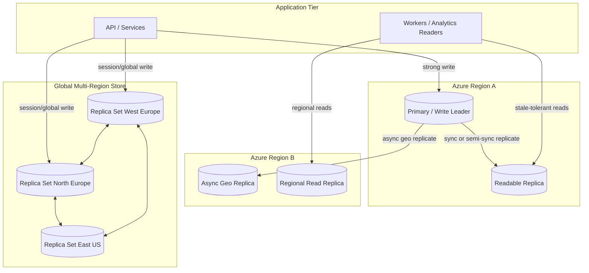
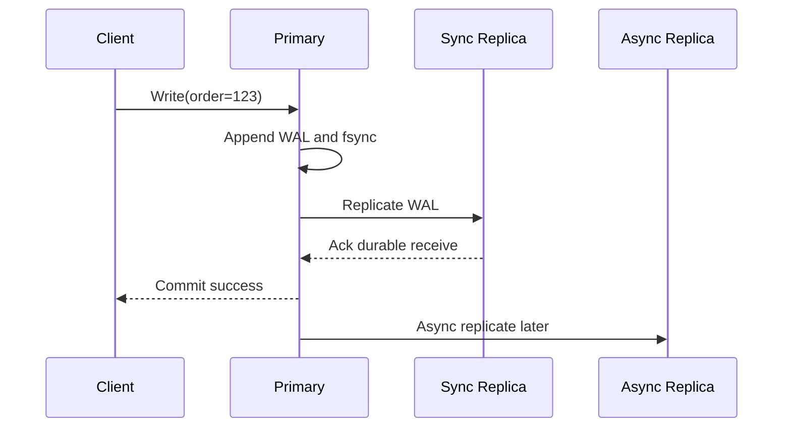
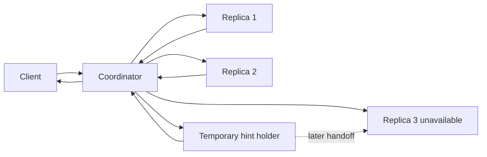
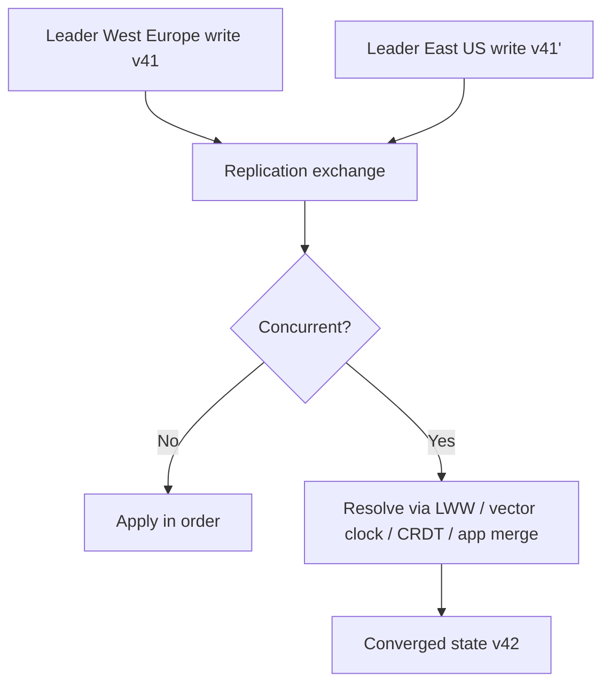

# Replication and Consistency

> Part of the **Enterprise Data & AI Architecture Handbook** · Phase-02 — Distributed Systems Deep Dive · Chapter 02.
> Estimated study time: **75 min reading + ~5h labs**.
> **Prerequisites:** read [Consensus and Coordination](01_Consensus_and_Coordination.md) first.

---

## Executive Summary

Replication and consistency answer the operational question that every distributed system eventually faces: **how many copies of the data exist, which copies may accept writes, and what exactly is a client allowed to observe after a failure, failover, or cross-region round-trip?** If [Consensus and Coordination](01_Consensus_and_Coordination.md#core-concepts) is the chapter about making one control-plane decision safely, this chapter is about making many data-plane reads and writes survivable, scalable, and economically sensible once more than one copy of the data exists.

The three canonical replication families are **leader-follower**, **multi-leader**, and **leaderless**. Leader-follower keeps one authoritative writer and one or more replicas, making reasoning about correctness relatively straightforward but creating a write bottleneck and failover boundary. Multi-leader permits writes in more than one region or site, improving locality and availability for disconnected or globally distributed workloads at the cost of inevitable write conflicts. Leaderless systems spread responsibility across peers and rely on read/write quorums, hinted handoff, read repair, and anti-entropy to converge, trading simple operational intuition for availability under replica failure and partitioned operation.

Consistency is not a marketing adjective. It is a formal contract. **Linearizable** systems make operations appear to happen atomically in real-time order. **Sequentially consistent** systems preserve per-client program order but not necessarily wall-clock order. **Causally consistent** systems preserve cause-and-effect relationships while allowing independent concurrent writes to appear in different orders. **Eventually consistent** systems promise only convergence if writes stop. Most production systems sit between these textbook definitions and the user's workload reality through concrete product choices: Azure Cosmos DB's strong, bounded staleness, session, consistent prefix, and eventual modes; Azure SQL Database failover groups and readable secondaries; Azure Database for PostgreSQL Flexible Server high availability and read replicas; Cassandra's `QUORUM` or `LOCAL_QUORUM`; Kafka's in-sync replica set and `acks=all`.

The engineering trap is that teams often choose a replication topology first and only later discover that their implicit consistency assumptions were stronger than the system they built. An asynchronous geo-replica does not provide zero-RPO failover. A read replica does not guarantee read-your-writes. A multi-write global database does not eliminate application-level conflict semantics. A leaderless quorum rule such as $R + W > N$ does not magically make stale or divergent replicas disappear when sloppy quorums and hinted handoff are in play.

The Azure-first posture in this chapter is deliberate. Most enterprise data and AI platforms on Azure should default to one of four patterns: **single-writer Azure SQL or PostgreSQL with synchronous in-region high availability**, **asynchronous geo-replication for disaster recovery**, **Cosmos DB with session consistency for globally distributed low-latency reads and writes**, or **leaderless/open-source systems only when the application can explicitly reason about quorums, reconciliation, and conflict resolution**. Architects who cannot state the exact durability and visibility contract of a write are not designing replicated systems; they are gambling with failure modes.

**Bottom line:** replication is cheap to add diagrammatically and expensive to get wrong operationally. The correct design is the one whose consistency contract matches the business invariant, whose failure semantics are explicit, whose lag is observable, whose failover process is rehearsed, and whose cost profile is justified by the value of the data being replicated.

---

## Learning Objectives

By the end of this chapter you will be able to:

1. Distinguish leader-follower, multi-leader, and leaderless replication and choose the right topology for a stated workload.
2. Explain the operational difference between synchronous, semi-synchronous, and asynchronous replication in terms of commit latency, durability, and failover risk.
3. Define linearizable, sequential, causal, and eventual consistency precisely and map them to real cloud products.
4. Use quorum math critically, including where $R + W > N$ helps and where it is insufficient.
5. Explain hinted handoff, read repair, anti-entropy, and how leaderless systems recover from missed writes.
6. Design a conflict-resolution policy using version vectors, last-writer-wins, application merge logic, or CRDTs.
7. Select Azure replication patterns for transactional systems, globally distributed applications, and analytical read scaling.
8. Defend when not to use multi-write or leaderless replication even if it appears more available on paper.

---

## Business Motivation

- Replication is how enterprises buy down outage risk. A single copy of business data is a single point of failure, whether the platform is an OLTP system, feature store, metadata catalog, or SaaS tenant database.
- Consistency is how enterprises avoid subtle correctness failures. A customer seeing an old balance, an ML model reading stale feature values, or an operator failing over to a lagging replica are not infrastructure inconveniences; they are business incidents.
- Geo-distributed businesses need locality. Users in Europe, North America, and Asia will not all tolerate a single-region write path with consistent sub-second response times.
- Read scale matters. Reporting dashboards, serving APIs, vector retrieval metadata, and partner integrations often require many more reads than writes. Replicas let architects offload those reads without sharding immediately.
- DR planning is fundamentally a replication question. RPO and RTO targets are not credible until replication lag, snapshot cadence, and failover sequencing are defined.
- Replication cost is real. Every extra replica adds compute, storage, network egress, operational complexity, and potentially doubled read RU cost in services such as Cosmos DB strong or bounded staleness modes.
- Governance increasingly depends on replica behavior. Data residency, data sovereignty, and auditability are affected by where replicas exist and how conflicts are resolved.

---

## History and Evolution

- **1970s-1980s — primary-copy databases and log shipping.** Early HA database designs establish the pattern of one authoritative writer and warm or cold standbys fed from a write-ahead log.
- **1980s-1990s — state machine replication and consensus theory.** The correctness vocabulary around leader election, epochs, and safe failover emerges from the same body of work discussed in [Consensus and Coordination](01_Consensus_and_Coordination.md#history-and-evolution).
- **1995 — Bayou.** Bayou popularizes optimistic, weakly connected, multi-master replication for mobile and disconnected environments, making conflict resolution a first-class application concern.
- **2000s — MySQL/PostgreSQL streaming replication and enterprise log shipping.** Leader-follower database replication becomes mainstream for web-scale applications, especially in read-heavy architectures.
- **2006 — Bigtable.** Google demonstrates a strongly consistent single-writer per tablet model with managed replication and recovery, shaping HBase and other leader-based data systems.
- **2007 — Dynamo.** Amazon's Dynamo paper popularizes leaderless replication, sloppy quorums, hinted handoff, Merkle-tree anti-entropy, and vector clocks for always-on key-value workloads.
- **2008-2012 — Cassandra, Riak, and eventually consistent NoSQL adoption.** Leaderless and tunable-consistency models become widely available to application teams, often faster than their ability to reason about them.
- **2012 — Spanner.** Google raises the bar for globally replicated strong consistency by coupling replication with externally consistent transactions and tightly controlled time uncertainty.
- **2014-2017 — Azure SQL active geo-replication, Cosmos DB, and cloud-managed durability.** Replication becomes a product capability rather than a self-managed middleware layer, but the underlying trade-offs remain.
- **2017-2026 — configurable consistency and multi-region writes become mainstream.** Cosmos DB, DynamoDB global tables, Spanner, CockroachDB, and globally distributed caches push consistency choice closer to architects and application teams rather than hiding it behind fixed platform defaults.

---

## Why This Technology Exists

- A single machine fails, and businesses generally want their data to survive that failure.
- A single machine cannot provide both low-latency access to global users and strong local durability everywhere at once.
- Reads often outnumber writes by an order of magnitude, and replicas are the simplest first lever for horizontal read scaling.
- Planned maintenance, patching, and region failover require one copy to keep serving while another is replaced or promoted.
- Different workloads need different visibility guarantees. Some can tolerate staleness; others cannot.
- Collaboration, offline-capable clients, and multi-region writes create legitimate use cases where concurrent updates must be merged rather than blocked.
- Control-plane and failover orchestration frequently depend on safe leadership from [Consensus and Coordination](01_Consensus_and_Coordination.md#design-patterns), but the actual business data path still needs its own replication and read-consistency semantics.

---

## Problems It Solves

- High availability through redundant copies of critical data.
- Disaster recovery through asynchronous or snapshot-based remote copies.
- Read scaling through local or remote replicas.
- Geographic locality for users, services, and regulators.
- Faster maintenance and failover by promoting a warm secondary rather than restoring from backup.
- Controlled trade-offs between latency, durability, and staleness.
- Offline and disconnected-write scenarios through multi-leader or conflict-tolerant designs.
- Eventual convergence for large-scale distributed state through anti-entropy and conflict-free data types.

---

## Problems It Cannot Solve

- Replication cannot remove the speed-of-light cost of cross-region synchronous writes.
- Replication cannot infer the correct business merge behavior for conflicting writes. That remains an application responsibility.
- Replication cannot guarantee zero data loss if the chosen replication mode is asynchronous and failover happens before the lagging replica catches up.
- Replication cannot make a weakly designed access pattern safe. Reading from any convenient replica is not equivalent to reading from a linearizable source.
- Leaderless quorums cannot replace business invariants that require global uniqueness, serializability, or exact ordering.
- CRDTs cannot model every domain safely; many financial, legal, and inventory constraints still require coordination and stronger isolation.
- Extra replicas cannot compensate for an untested failover procedure, poor observability, or undocumented consistency assumptions.

---

## Core Concepts

### 8.1 Replication goals: availability, locality, scale, and recovery

Replication exists for four distinct reasons, and architects should name which one is actually driving the design:

- **Availability:** survive node, zone, or regional failure.
- **Locality:** serve users from a nearby region.
- **Scale:** offload reads or distribute writes.
- **Recovery:** keep a remote copy that can be promoted after disaster.

These goals are not interchangeable. A read replica that improves scale may still be a poor DR target if lag is large. A geo-replica that satisfies recovery may still be too stale for low-latency reads after write.

### 8.2 Leader-follower replication

Leader-follower, also called primary-secondary or primary-replica, routes all writes through a single leader. The leader appends the change to its WAL or logical log, applies it locally, then ships the change to followers. Advantages:

- simple conflict model because there is only one active writer,
- straightforward ordering per leader,
- natural fit for transactional systems,
- simple read scale-out when followers can serve read-only traffic.

Costs:

- the leader is a write bottleneck,
- failover requires leader promotion discipline,
- asynchronous followers can be stale,
- synchronous followers increase commit latency.

Azure SQL Database, Azure SQL Managed Instance, PostgreSQL streaming replication, MySQL asynchronous replicas, and many Kafka partition leaders all follow this pattern.

### 8.3 Multi-leader replication

Multi-leader allows more than one replica to accept writes. Each leader replicates its writes to the others. It is attractive when:

- users write in multiple geographies,
- disconnected or edge sites need to accept updates locally,
- collaboration workloads can tolerate merge logic,
- write availability during inter-region link problems matters more than strict global ordering.

The cost is unavoidable conflicts. Two leaders can accept writes to the same record concurrently. That means the system needs:

- conflict detection,
- version metadata,
- deterministic or application-driven merge rules,
- observability into divergent states.

Multi-leader is often over-selected by teams who want lower-latency writes in every region but have not defined what happens when the same customer or order is edited in two places simultaneously.

### 8.4 Leaderless replication

Leaderless systems distribute writes across multiple peers rather than funneling them through a single authoritative leader. A coordinator sends a write to $N$ replicas and may accept success once $W$ acknowledgements arrive. Reads query $R$ replicas and reconcile versions. The famous heuristic is $R + W > N$, which ensures read and write quorums intersect if all assumptions hold.

Key benefits:

- no single write leader for the data item,
- high availability when some replicas are unreachable,
- tunable read/write durability and latency.

Key costs:

- harder reasoning under failure,
- stale or divergent replicas require repair,
- clients and operators must understand quorum semantics,
- ordering is weaker and conflict resolution more common.

Canonical mechanisms include **sloppy quorums**, **hinted handoff**, **read repair**, and **anti-entropy using Merkle trees**. Dynamo and Cassandra are the canonical examples.

### 8.5 Synchronous, semi-synchronous, and asynchronous replication

The replication acknowledgement rule is one of the most important design decisions in the system:

- **Synchronous replication:** the write is not acknowledged until the leader also knows one or more replicas have durably received it. Best durability, highest latency.
- **Semi-synchronous replication:** the leader waits for some replica acknowledgement, but not necessarily application of the change to a fully queryable state. Useful middle ground for in-region HA.
- **Asynchronous replication:** the leader acknowledges the write before followers confirm receipt. Lowest latency, but non-zero data-loss window during failover.

Durability and visibility are separate. A replica may have received a log record durably but not yet applied it for reads. Good documentation distinguishes **received**, **flushed**, **replayed**, and **visible** states.

### 8.6 Consistency models

**Linearizable consistency** means each operation appears to take effect atomically at some instant between invocation and response, while respecting real-time order. If write A completes before read B starts, read B must observe A or something later.

**Sequential consistency** preserves each client's program order but does not require real-time ordering across clients. Two writes by different clients may be observed in a total order that differs from wall-clock completion order.

**Causal consistency** preserves cause-and-effect relationships. If B depends on A, everyone must observe A before B. Concurrent unrelated writes may be observed in different orders by different replicas.

**Eventual consistency** promises only that if no new writes arrive, replicas eventually converge. It says nothing about monotonic reads, read-your-writes, or ordering during the convergence window.

Cloud systems often expose pragmatic productized models between these formal extremes. Azure Cosmos DB offers:

- **Strong:** linearizability for reads and writes within the product's supported topology constraints.
- **Bounded staleness:** reads lag by at most K versions or T time.
- **Session:** read-your-writes and monotonic guarantees within a client session token.
- **Consistent prefix:** ordered prefixes without gaps, but possibly stale.
- **Eventual:** no ordering or recency guarantee beyond eventual convergence.

The mistake is to treat "session" or "bounded staleness" as vague comfort labels. They are specific contracts that must be matched to the workload.

### 8.7 Quorums, sloppy quorums, and hinted handoff

In a leaderless store with replication factor $N$, a write might require $W$ acknowledgements and a read might ask $R$ replicas. If $R + W > N$, then every successful read and write quorum must intersect in at least one replica, which improves the chance of returning fresh data.

But that guarantee is not absolute in real systems because of three complications:

- **sloppy quorums:** a write may be temporarily stored on a substitute replica when the preferred replica is down,
- **hinted handoff:** the substitute later hands the data to the intended replica,
- **incomplete repairs:** a read may contact replicas that intersect mathematically but still have divergent versions or lagging repairs.

Therefore quorum math helps, but it is not a license to stop thinking about repair, timing, and topology.

### 8.8 Read repair and anti-entropy

Leaderless systems heal through two main patterns:

- **Read repair:** when a read sees multiple versions, the coordinator returns the winning value and writes repaired state back to stale replicas.
- **Anti-entropy:** background comparison of replica state, often via Merkle trees or hash ranges, to identify and reconcile divergence even when the affected data is rarely read.

Read repair improves convergence for hot keys. Anti-entropy is what protects cold keys from staying incorrect forever.

### 8.9 Conflict resolution strategies

When two writes conflict, the system needs an explicit strategy:

- **Last-writer-wins (LWW):** simple, cheap, dangerous if clocks skew or updates are not commutative.
- **Version vectors or vector clocks:** preserve causality and detect concurrency rather than hiding it.
- **Application merge logic:** domain-specific reconciliation such as field-level merge or compensation workflow.
- **CRDTs:** conflict-free replicated data types that guarantee deterministic convergence for supported operations.

LWW is a practical tool for low-value, overwrite-style records. It is a poor choice for inventories, balances, or any field where a lost update is financially or legally significant.

### 8.10 CRDTs

CRDTs encode merge behavior into the data type itself so replicas can converge without coordination when updates are concurrent. Useful families include:

- **G-Counter:** grow-only counter using per-replica components.
- **PN-Counter:** increment/decrement counter built from two grow-only counters.
- **OR-Set:** observed-remove set that distinguishes add/remove causality.
- **LWW-Register:** register that resolves via timestamp or ordered version metadata.

Simple G-Counter example:

```python
from collections import defaultdict

class GCounter:
    def __init__(self):
        self.state = defaultdict(int)

    def increment(self, replica_id: str, amount: int = 1):
        self.state[replica_id] += amount

    def merge(self, other: "GCounter"):
        for replica_id, value in other.state.items():
            self.state[replica_id] = max(self.state[replica_id], value)

    def value(self) -> int:
        return sum(self.state.values())
```

CRDTs are powerful for collaborative, eventually consistent domains, but they do not remove the need for coordination where global uniqueness, foreign-key-style constraints, or bounded inventory matter.

### 8.11 Replication lag, RPO, and visibility windows

Every asynchronous replica creates a **visibility window** where a committed write on the leader is absent from one or more secondaries. That window is measured through lag indicators such as LSN difference, replay delay, or per-region replication latency. The business meaning is direct:

- the lag window approximates the **RPO** risk during forced promotion,
- the lag window explains stale reads,
- the lag window defines how safe it is to offload reads.

An architect should be able to answer, in seconds or versions, how stale a promoted replica could be under normal and degraded conditions.

---

## Internal Working

The internal write path depends on the replication family.

**Leader-follower path:**

1. Client sends a write to the leader.
2. The leader appends the change to a WAL or logical change stream.
3. The leader persists locally.
4. The leader ships the change to followers.
5. Depending on sync mode, the leader waits for zero, one, or several follower acknowledgements.
6. The leader acknowledges success to the client.
7. Followers later replay the log and expose the change to readers.

**Multi-leader path:**

1. Client writes to the nearest active leader.
2. That leader commits locally and returns success.
3. The leader asynchronously sends the update to peer leaders.
4. Remote leaders apply or queue the update.
5. If a concurrent remote write already exists, version metadata and merge logic resolve the conflict.

**Leaderless path:**

1. Client sends a write to any coordinator.
2. The coordinator forwards the write to the preferred replica set.
3. The coordinator waits for $W$ acknowledgements.
4. If a preferred replica is unavailable, a substitute may store a hint.
5. Reads later consult $R$ replicas, reconcile versions, and optionally trigger repairs.

Azure examples make these mechanics concrete:

- **Azure SQL Database / Managed Instance:** single writable primary, readable secondaries, synchronous in-region HA under the hood, asynchronous geo-replication through failover groups.
- **Azure Database for PostgreSQL Flexible Server:** WAL-based leader-follower replication, optional zone-redundant HA, asynchronous read replicas, lag visible through `pg_stat_replication` and replay metrics.
- **Azure Cosmos DB:** replicated partitions across regions with configurable consistency; session tokens and consistency level govern what a client is allowed to see after a write.

The hardest part of operating replication is not the happy path. It is the edge conditions: promotion of a lagging follower, replay saturation after a network outage, conflict storms during multi-write recovery, and false assumptions in application code about what a "successful write" really means.

---

## Architecture



This diagram deliberately mixes two patterns because most enterprise platforms do. Transactional systems often stay single-writer with DR replicas, while globally distributed, latency-sensitive metadata or user-profile workloads move toward multi-region replicated key-value or document stores.

---

## Components

- **Write leader or coordinator:** authoritative writer in leader-based systems, or request router in leaderless systems.
- **Followers / secondaries / replicas:** receive changes and expose them for failover or reads.
- **WAL / oplog / change stream:** ordered mutation log used for shipping changes.
- **Replica apply engine:** replays received changes into the local storage engine.
- **Consistency policy layer:** enforces linearizable, session, or weaker read contracts.
- **Conflict detector and resolver:** handles concurrent writes using versions, clocks, or merge logic.
- **Repair subsystem:** hinted handoff, read repair, anti-entropy, snapshot catch-up, or re-seed process.
- **Read router:** decides whether a request may safely hit a follower or must go to the primary.
- **Failover controller:** promotes replicas, often backed by safe leadership mechanisms from [Consensus and Coordination](01_Consensus_and_Coordination.md#enterprise-recommendations).
- **Client-side session context:** session token, LSN checkpoint, or causal metadata needed for read-your-writes semantics.

---

## Metadata

Replication correctness depends on the metadata that tells the system how fresh each copy is:

- **LSN / WAL position:** byte or record position in a transaction log.
- **GTID / transaction ID / commit sequence number:** globally or leader-scoped identifiers for applied writes.
- **Epoch / term / timeline ID:** failover generation indicator that prevents stale leaders from reappearing.
- **Session token:** client-scoped freshness token, central to Cosmos DB session consistency.
- **Vector clock / version vector:** causal metadata that distinguishes concurrent updates from ordered ones.
- **ETag / rowversion / update timestamp:** optimistic-concurrency and merge metadata at the object level.
- **Replica role and health state:** leader, follower, observer, readable secondary, pending catch-up, or failed.

Azure-specific examples:

- **Cosmos DB** exposes `_etag` and session-token semantics through SDKs.
- **PostgreSQL** exposes `sent_lsn`, `write_lsn`, `flush_lsn`, `replay_lsn`, and lag fields.
- **SQL Server / Azure SQL** expose log send queue, redo queue, and DMVs that indicate geo-replication state.

If metadata is not observable, failover decisions become guesswork.

---

## Storage

Replication is built on storage primitives:

- write-ahead logging so changes can be replayed safely,
- snapshots or checkpoints so new replicas do not replay from the beginning of time,
- compaction or vacuum so long-lived replicated state does not become operationally toxic,
- durable local commit semantics so acknowledged data survives process restart.

Practical storage implications:

- slow storage inflates commit latency in synchronous systems,
- saturated storage inflates replication lag in asynchronous systems,
- large transactions amplify catch-up cost on replicas,
- replica re-seeding can be I/O heavy enough to degrade production nodes if not rate-limited.

Azure guidance:

- use premium managed disks or platform-managed storage tiers appropriate to the service SLA,
- separate analytics extracts from production primaries when replay or vacuum pressure would interfere with OLTP,
- treat storage throughput consistency, not only capacity, as a core replication design parameter.

---

## Compute

Replication consumes compute even when application write volume appears modest:

- leaders encode, persist, and ship every mutation,
- followers decode and replay every mutation,
- conflict resolution and anti-entropy jobs consume CPU,
- read replicas often attract analytics or ad hoc traffic that can starve replay threads.

Common compute failure pattern: a team creates a read replica to offload reporting, then the heavy report workload causes replay lag, which invalidates the freshness assumptions that justified the replica in the first place.

Azure-specific compute guidance:

- size Azure SQL or PostgreSQL replicas for both query load and replay load,
- reserve headroom on Cosmos DB for write amplification from multi-region replication and conflict resolution,
- avoid co-locating bulky batch jobs on the same nodes that must maintain low replication lag.

---

## Networking

Replication is a network tax converted into correctness or latency trade-offs:

- synchronous in-region replication adds one or more network round-trips to commit latency,
- asynchronous geo-replication converts network latency into lag instead of write delay,
- multi-leader topologies amplify east-west traffic because every writer becomes a source,
- leaderless repair traffic can dominate bandwidth after outages.

Design rules:

- keep synchronous acknowledgement inside a low-latency region or metro boundary unless the business explicitly pays for global strong writes,
- use private networking and explicit routes for replica traffic,
- monitor retransmission and packet loss alongside application latency,
- budget cross-region egress charges when adding replicas, especially for high-churn datasets.

Network partitions create the defining replication questions: which side may keep writing, which clients may keep reading, and how is divergence repaired later.

---

## Security

Replication duplicates data, so it duplicates security obligations:

- encrypt replication traffic in transit,
- ensure replicas use the same or stricter at-rest encryption posture,
- rotate replication credentials through managed identity or centralized secret management,
- control who may fail over, force promote, or create new replicas,
- audit conflict-resolution overrides and manual repair operations,
- understand whether replica regions change data-sovereignty or residency exposure.

Replica access is a common blind spot. Teams often grant broad read access to secondaries because they are "just replicas," then discover those replicas carry the same PII and regulatory burden as the primary.

---

## Performance

Performance must be reasoned per topology.

**Leader-follower:**

- writes are efficient until the leader saturates,
- synchronous replicas add predictable latency,
- reads can scale out if staleness is acceptable.

**Multi-leader:**

- local writes are fast,
- cross-leader replication traffic rises with write volume,
- conflict rate becomes a performance and correctness tax.

**Leaderless:**

- availability is high when some replicas fail,
- write and read latency depend on chosen quorum sizes,
- repair work and version reconciliation add tail latency.

Azure-specific performance note: in Cosmos DB, strong and bounded staleness consistency typically consume more RUs for reads than session or eventual. That means stronger consistency is a direct cost and performance choice, not only a correctness choice.

---

## Scalability

Replication and partitioning solve different scaling problems. Replication copies data for availability and read locality. Partitioning splits data for write and storage scale. Most large systems need both.

- leader-follower scales reads well but not writes to one shard,
- multi-leader scales writes geographically but not without conflict-management cost,
- leaderless systems spread write responsibility but complicate semantics,
- partitioned replicated systems multiply the problem: each partition has its own leaders, followers, or replica set.

Azure implication: a Cosmos DB container or distributed PostgreSQL table scales because of partitioning; the consistency choice then determines what each partition's replicas guarantee.

---

## Fault Tolerance

Fault tolerance is the practical output of the replication design:

- **leader-follower with synchronous local HA:** strong protection against single-node failure, limited by region scope.
- **async geo DR replica:** good recovery posture, non-zero RPO.
- **multi-leader:** higher write availability during regional isolation, but divergence risk.
- **leaderless:** better tolerance of individual replica outages, but harder reconciliation.

Questions every design must answer:

- what is the exact RPO if the primary region dies now,
- who is allowed to promote a lagging replica,
- how are writes fenced during failover,
- how is divergence detected after a partition heals,
- what workload semantics break if reads come from stale followers.

Failover safety often depends on coordination discipline from [Consensus and Coordination](01_Consensus_and_Coordination.md#trade-offs). Replication keeps copies alive; safe promotion decides which copy is allowed to become authoritative.

---

## Cost Optimization

The cheapest safe replication topology is the one that matches the workload and no more.

- Use synchronous in-region HA for systems where local durability matters more than cross-region write locality.
- Use asynchronous geo-replication for DR unless the business explicitly needs globally strong writes.
- Use read replicas only when you have a real read-offload need and a documented freshness tolerance.
- Prefer session consistency over strong consistency in globally distributed user-centric workloads when read-your-writes is sufficient.
- Keep replica counts modest. Extra replicas create storage, compute, network, and operational cost without automatically improving business value.
- Store conflict metadata only where needed; oversized version payloads and indiscriminate audit duplication raise cost quickly.

FinOps principle: the platform should not pay globally synchronized-write prices for workloads whose users only need local read-your-writes and eventual global propagation.

---

## Monitoring

Replication monitoring should focus on freshness, durability risk, and failover readiness rather than only node uptime.

High-value metrics include:

- commit latency by consistency mode,
- replication lag in time and log distance,
- log send queue or redo queue depth,
- leader/follower role changes,
- conflict count and conflict resolution latency,
- read repair volume,
- hinted handoff backlog,
- stale-read rate or follower-read staleness distribution,
- forced failover exposure window.

Platform-specific examples:

- **Azure SQL / SQL Managed Instance:** track failover group health, geo-replication DMVs such as log send and redo progress, and readable-secondary latency.
- **Azure Database for PostgreSQL Flexible Server:** `pg_stat_replication`, `replay_lag`, `write_lag`, `flush_lag`, and replica query saturation.
- **Azure Cosmos DB:** regional replication latency, conflict metrics for multi-write accounts, consistency mode, RU consumption, and regional failover status.
- **Cassandra / leaderless stores:** pending hints, repair backlog, read-repair count, tombstone pressure, and replica-down duration.

---

## Observability

Observability is what allows engineers to explain a stale read after the fact.

- attach LSN, revision, or session-token context to logs where possible,
- record whether a read was served from primary, local follower, or remote replica,
- trace failover events with pre-promotion lag,
- log conflict-resolution outcomes and discarded versions,
- expose client-visible staleness budgets in dashboards, not just backend queue depth,
- run synthetic read-your-writes probes continuously for services promising session or stronger guarantees.

Useful incident question: when the user reported stale data, which replica served the read, what was its lag, and what consistency contract had the caller actually requested?

---

## Governance

Replication choices need explicit governance because application teams routinely overestimate the guarantees they are getting.

- require an ADR for every production data store that names replication topology, consistency model, RPO, RTO, and conflict policy,
- standardize which workloads may use async follower reads,
- define an approval bar for multi-region multi-write,
- require failover drills and documented rollback paths,
- ensure data-residency reviews include replica locations, not just primaries,
- version and review conflict-resolution code like any other business-critical logic,
- separate the right to read from replicas from the right to promote them.

Governance is not paperwork here. It is how the enterprise prevents invisible semantic drift between what developers think the database guarantees and what it actually guarantees.

---

## Trade-offs

Every replication design pays in one or more of these currencies:

- **latency** for stronger acknowledgement rules,
- **availability** when a system refuses writes to avoid inconsistency,
- **operational simplicity** when multiple writers or repairs are introduced,
- **cost** from extra regions, replicas, and cross-region traffic,
- **application complexity** when conflict resolution moves up the stack.

Topology trade-offs:

| Topology | Main Strength | Main Cost |
|---|---|---|
| Leader-follower | simple write semantics, easy DR story | leader bottleneck, replica lag, promotion complexity |
| Multi-leader | local writes in multiple sites | conflict detection and merge burden |
| Leaderless | availability under replica failure, tunable quorums | harder semantics, repair complexity, stale reads |

Consistency trade-offs:

| Consistency | Main Strength | Main Cost |
|---|---|---|
| Linearizable | strongest user-facing correctness | highest latency and lowest failure tolerance during partitions |
| Sequential | simpler reasoning than eventual, weaker than real-time order | rarely exposed directly by products |
| Causal | good balance for user-centric workflows | requires metadata propagation |
| Eventual | high availability and locality | weak guarantees, application merge burden |

---

## Decision Matrix

| Requirement | Recommended Pattern | Why | When Not to Use |
|---|---|---|---|
| Financial ledger or order system | single-writer Azure SQL / PostgreSQL with synchronous local HA and async DR | strongest operational simplicity and auditability | not for globally disconnected writes |
| Global user profile or catalog with read-your-writes need | Cosmos DB with session consistency and optional multi-region writes | low-latency regional access with useful client guarantees | not when strict global serial order is required |
| Collaborative or edge-synced state with mergeable operations | multi-leader plus CRDT or application merge policy | tolerates concurrent local updates | not for non-mergeable invariants |
| Always-on key-value with per-request latency and replica loss tolerance | leaderless quorum store | writes can continue despite some replica failure | not for exact ordering or strict uniqueness |
| Heavy reporting offload from OLTP | readable secondaries or read replicas | cheap read scale without repartitioning | not if reports require primary-fresh reads |

**ADR Example — Orders Platform Replication Topology**

- **Context:** The enterprise order platform serves Europe and North America, requires zero lost committed orders within a region, allows up to 60 seconds RPO for regional disaster, and cannot tolerate concurrent writes to the same order in multiple regions.
- **Decision:** Use Azure SQL Database Business Critical in West Europe as the only writable primary with zone-redundant HA. Add a failover group to North Europe for asynchronous DR and readable secondary traffic limited to stale-tolerant reporting. Do not enable multi-write patterns.
- **Consequences:** Order writes remain simple and auditable. DR is strong but not zero-RPO. Reporting can offload from the primary but must tolerate lag. Regional local-write latency outside Europe is higher than a multi-write design.
- **Alternatives Considered:** Cosmos DB multi-write with custom conflict resolution, PostgreSQL multi-primary extensions, and a leaderless NoSQL store. Rejected because order invariants are non-mergeable and audit requirements favor one authoritative write path.

---

## Design Patterns

- **Read-your-writes via session token:** return the session token from a write and supply it on subsequent reads.
- **Primary for writes, replicas for stale-tolerant reads:** keep OLTP correctness on the leader and redirect analytics or dashboards to followers.
- **Active-passive regional DR:** one write region, one or more asynchronous remote promotion targets.
- **Outbox plus replicated event log:** commit business data and outbound events atomically in the primary, then replicate downstream.
- **Conflict-aware multi-write:** include version vectors, business merge rules, and explicit conflict queues for human review.
- **CRDT-backed collaboration:** use commutative data types for counters, sets, or presence state rather than lock-heavy coordination.
- **Follower warm-up before cutover:** prevent promotion of an under-replayed replica.

---

## Anti-patterns

- Turning on multi-write because a vendor demo made it look modern, without defining conflict semantics.
- Serving all reads from replicas while pretending the system is still strongly consistent.
- Using last-writer-wins on inventory, balances, or legal state.
- Believing an async DR replica provides zero-RPO because it is "live."
- Applying leaderless quorum rules without understanding sloppy quorums, repairs, or replica placement.
- Letting reporting queries saturate replay threads on a replica that is also the failover target.
- Assuming read replicas reduce cost when they actually multiply compute and storage without replacing anything.

---

## Common Mistakes

- Confusing durability with visibility. A change may be durable on a replica but not yet queryable.
- Failing over without checking lag and replay state.
- Ignoring client session context in applications that depend on read-your-writes.
- Choosing strong consistency globally for workloads that only need local monotonic behavior.
- Not versioning conflict resolution code or not testing it with concurrent-update scenarios.
- Underestimating repair traffic after extended replica outages.
- Treating read-your-writes, monotonic reads, and causal ordering as if they were the same guarantee.

---

## Best Practices

- Match replication topology to business invariants before matching it to fashionable architecture diagrams.
- Make the consistency contract explicit in code, documentation, and ADRs.
- Keep one authoritative writer unless there is a strong, well-argued reason not to.
- Propagate session or causal metadata through client paths that need fresh reads.
- Measure and alert on lag, not just replica health.
- Rehearse forced failover and planned failover separately.
- Keep conflict resolution deterministic, observable, and testable.
- Prefer CRDTs only for state that is naturally mergeable.

---

## Enterprise Recommendations

1. Standardize on three default patterns: single-writer transactional databases, session-consistent globally distributed document/key-value stores, and asynchronous geo-DR replicas.
2. Require explicit architectural approval for multi-leader and leaderless systems because their operational semantics are harder than their vendor descriptions imply.
3. Publish a consistency policy catalog so teams know when to choose strong, session, bounded staleness, or eventual.
4. Make replica lag a first-class SLI with business thresholds, not just a database-admin concern.
5. Keep failover authority and promotion runbooks under centralized platform or SRE control.
6. Prefer application-level simplification over database cleverness for critical transactional systems.

---

## Azure Implementation

### 31.1 Service selection by workload

| Workload | Azure-first pattern | Replication posture | Consistency posture |
|---|---|---|---|
| Core transactional orders, billing, or ledger | Azure SQL Database or SQL Managed Instance | synchronous local HA, async failover group for DR | primary reads for critical operations, replicas only for stale-tolerant reads |
| SaaS relational application with read offload | Azure Database for PostgreSQL Flexible Server | zone-redundant HA plus async read replicas | primary for writes, replica reads with explicit freshness policy |
| Global profile, catalog, device metadata, or user session state | Azure Cosmos DB | multi-region replicas, optional multi-write | session by default, bounded staleness or strong only where justified |
| Cache or ephemeral coordination-adjacent state | Azure Cache for Redis Enterprise | active geo patterns only for cache semantics, not system of record | eventual/merge-aware semantics only |

### 31.2 Azure SQL Database and SQL Managed Instance

For high-value OLTP workloads, the default enterprise design is usually:

- **Business Critical** tier or equivalent availability configuration,
- **zone redundancy** in the primary region,
- **failover group** to a secondary region for DR,
- **read scale-out** only for queries that tolerate lag,
- application logic that treats the primary as the authoritative read source for post-write correctness.

Azure CLI example for a failover group:

```bash
az sql failover-group create \
  --name fg-orders-prod \
  --resource-group rg-data-prod \
  --server sql-we-prod \
  --partner-server sql-ne-prod \
  --add-db ordersdb \
  --failover-policy Automatic \
  --grace-period 1
```

Design notes:

- failover groups are asynchronous across regions, so they are a DR design, not a zero-RPO design,
- readable secondaries are useful for reporting and API reads that tolerate lag,
- forced failover without full catch-up may lose recent committed data,
- do not move correctness-critical reads to secondaries unless the business explicitly accepts staleness.

### 31.3 Azure Database for PostgreSQL Flexible Server

PostgreSQL Flexible Server fits well for SaaS and platform metadata workloads that want open-source semantics on a managed platform.

Provision example:

```bash
az postgres flexible-server create \
  --resource-group rg-app-prod \
  --name pg-orders-we \
  --location westeurope \
  --tier GeneralPurpose \
  --sku-name Standard_D4ds_v5 \
  --storage-size 256 \
  --high-availability ZoneRedundant

az postgres flexible-server replica create \
  --resource-group rg-app-prod \
  --name pg-orders-ne \
  --source-server pg-orders-we \
  --location northeurope
```

Replica health query:

```sql
SELECT
    application_name,
    state,
    sync_state,
    write_lag,
    flush_lag,
    replay_lag
FROM pg_stat_replication;
```

Guidance:

- use the primary for strict post-write reads,
- cap replica-reporting workloads so replay stays healthy,
- document whether reads from replicas are allowed by API route or user journey,
- remember that a promoted async replica reflects a non-zero RPO window.

### 31.4 Azure Cosmos DB

Cosmos DB is the primary Azure answer for globally distributed low-latency data with explicit consistency choices. Good defaults:

- **Session consistency** for user-centric apps that need read-your-writes without paying global strong-read cost,
- **Bounded staleness** when the business can define a specific lag envelope,
- **Strong** only when the workload truly needs linearizable semantics and can tolerate higher latency and read RU cost,
- **Multi-region writes** only when conflict rules are explicit and tested.

Account creation example:

```bash
az cosmosdb create \
  --name cos-global-app-prod \
  --resource-group rg-data-prod \
  --kind GlobalDocumentDB \
  --default-consistency-level Session \
  --enable-multiple-write-locations true \
  --locations regionName=westeurope failoverPriority=0 isZoneRedundant=True \
  --locations regionName=northeurope failoverPriority=1 isZoneRedundant=True \
  --locations regionName=eastus failoverPriority=2 isZoneRedundant=True
```

Container design considerations:

- keep items versioned with `_etag` or an explicit domain version field,
- use conflict resolution only where lost updates are acceptable or mergeable,
- propagate session tokens through API tiers that promise fresh reads,
- remember strong and bounded staleness reads generally cost more RU than session or eventual.

### 31.5 Conflict handling on Azure

For multi-write workloads on Cosmos DB, choose one of these consciously:

- **Last Writer Wins** for low-value overwrite semantics such as ephemeral preferences,
- **custom merge logic** when fields or operations must be reconciled deterministically,
- **CRDT-like application design** where updates are modeled as mergeable deltas rather than destructive overwrites.

If the business cannot explain the merge rule in plain language, do not enable multi-write.

### 31.6 Azure platform recommendations

- Prefer one write region for transactional systems unless proven otherwise.
- Prefer session consistency for global API workloads before reaching for strong.
- Use replica reads only for routes whose freshness tolerance is written down.
- Monitor replica lag, Cosmos conflict counts, and failover-group health centrally.
- Keep cross-region DR and global active-write as separate architecture choices, not one combined checkbox.

---

## Open Source Implementation

### 32.1 PostgreSQL synchronous and asynchronous replication

PostgreSQL remains one of the clearest open-source leader-follower examples.

Primary settings:

```conf
wal_level = replica
max_wal_senders = 10
max_replication_slots = 10
synchronous_commit = remote_write
synchronous_standby_names = 'FIRST 1 (pg2, pg3)'
```

Interpretation:

- `remote_write` waits until at least one synchronous standby confirms WAL receipt,
- a fully asynchronous setup removes `synchronous_standby_names`, lowering latency but increasing failover exposure,
- the right choice depends on whether the workload values local durability or lowest possible write latency.

### 32.2 Kafka log replication as a consistency discipline

Kafka is not a row-store database, but it is one of the most important replicated logs in enterprise data platforms. Basic durability posture:

```properties
replication.factor=3
min.insync.replicas=2
acks=all
unclean.leader.election.enable=false
```

This means:

- producers wait for all in-sync replicas required by the broker policy,
- leader failover does not sacrifice acknowledged records through unclean election,
- write durability rises while availability under severe failure decreases.

### 32.3 Leaderless quorum example with Cassandra-style semantics

```sql
CONSISTENCY QUORUM;
INSERT INTO customer_profile (customer_id, version, email) VALUES ('c-123', 41, 'new@example.com');

CONSISTENCY QUORUM;
SELECT customer_id, version, email FROM customer_profile WHERE customer_id = 'c-123';
```

This is only meaningful if the team also understands:

- replication factor,
- local versus global quorums,
- hinted handoff behavior,
- repair cadence,
- tombstone pressure and read-repair overhead.

### 32.4 CRDT-oriented application design

For collaborative counters, likes, or presence state, model updates as mergeable operations instead of destructive row overwrites. A PN-Counter or OR-Set often removes the need for centralized conflict arbitration entirely. That is usually easier to operate than a multi-leader overwrite model pretending that concurrent edits will never happen.

---

## AWS Equivalent (comparison only)

| Azure service/pattern | AWS equivalent | Advantages | Disadvantages | Selection and migration note |
|---|---|---|---|---|
| Azure SQL failover groups | Amazon Aurora Global Database or RDS cross-region replicas | mature managed relational replication options | async cross-region still means non-zero RPO; topology semantics differ by engine | validate reader-lag behavior and promotion semantics before migration |
| PostgreSQL Flexible Server read replicas | Amazon RDS for PostgreSQL read replicas or Aurora PostgreSQL replicas | familiar Postgres semantics | parameter behavior and failover tooling differ | keep application read-routing rules engine-agnostic |
| Cosmos DB with configurable consistency | DynamoDB global tables plus DynamoDB conditional writes | strong regional managed service and global scale | global tables are multi-write with eventual conflict model, not a drop-in Cosmos consistency match | session-token-dependent client logic needs redesign |
| Cosmos DB strong/bounded staleness use cases | Aurora or purpose-built strong systems, depending workload | can fit transactional patterns | semantics often differ materially from Cosmos guarantees | map consistency contract, not brand names |

---

## GCP Equivalent (comparison only)

| Azure service/pattern | GCP equivalent | Advantages | Disadvantages | Selection and migration note |
|---|---|---|---|---|
| Azure SQL failover groups | Cloud SQL cross-region replicas, or Spanner for stronger global behavior | managed operations, Spanner offers strong global semantics | Cloud SQL replicas remain async; Spanner is a different cost and data-model choice | do not treat Spanner as a like-for-like Azure SQL substitute |
| PostgreSQL Flexible Server read replicas | Cloud SQL for PostgreSQL replicas | familiar operational posture | cross-region failover and lag semantics still require explicit design | keep replica-read assumptions documented |
| Cosmos DB session/bounded staleness | Firestore or Spanner depending access pattern | managed global distribution options | guarantees differ substantially from Cosmos session model | re-evaluate client token/freshness behavior during migration |
| Global multi-write document metadata | Firestore multi-region or custom app-level merge on GCP | high availability and simple client APIs | merge semantics and latency profile differ | migrate only after replaying concurrent-update scenarios |

---

## Migration Considerations

Replication migrations fail when teams move data but not semantics.

1. **Inventory the actual contract.** Is the app relying on read-your-writes, monotonic reads, primary-only reads, follower reads, or implicit eventual convergence?
2. **Measure real lag before migration.** Many teams discover after cutover that existing replicas were fresher than the target platform, or vice versa.
3. **Preserve version metadata.** If conflict resolution depends on ETags, vector clocks, or update versions, migration must carry that information.
4. **Test promotion behavior.** Cutover rehearsal should include planned and forced failover, not only data copy.
5. **Separate topology migration from consistency migration.** Do not change both replication family and application semantics in one unbounded move unless you have to.
6. **Shadow-read where possible.** Compare stale-tolerant read paths against the new replica topology before user traffic depends on them.
7. **Revisit merge logic.** Moving from leader-follower to multi-write or leaderless systems is often a business-logic rewrite disguised as infrastructure modernization.

---

## Mermaid Architecture Diagrams

### Leader-follower write acknowledgement paths



### Leaderless quorum with hinted handoff



### Multi-leader conflict resolution



---

## End-to-End Data Flow

Consider a global product-catalog service using Azure Cosmos DB with session consistency and optional multi-region writes:

1. A user in West Europe updates product metadata through the catalog API.
2. The API writes to the nearest Cosmos DB region and receives a session token.
3. The API returns success plus the session context to downstream services or client state.
4. A follow-up read by the same user includes that session token and is guaranteed to observe the update.
5. Replication ships the change to other regions asynchronously according to the account topology.
6. A user in North America may observe the update later unless that path also carries a session token or uses a stronger consistency level.
7. If a concurrent write occurs in another write region, Cosmos DB applies the configured conflict policy.
8. Downstream search indexing and cache refresh services consume the updated version and propagate it further.
9. Monitoring tracks regional replication latency, conflict count, and RU impact.

This flow is often the right compromise for globally distributed user-facing data: strong local user experience without paying universal strong-consistency cost for every reader worldwide.

---

## Real-world Business Use Cases

- Primary-replica transactional databases for order processing, billing, and regulated records.
- Geo-distributed customer profile or catalog services that need low-latency regional reads.
- SaaS tenant databases with read replicas for analytics and partner exports.
- Edge or retail-store systems that need local writes during intermittent WAN connectivity.
- Collaborative editing, device state, or session-presence systems that can use mergeable CRDT-style operations.
- Event-stream platforms that require durable replicated logs for downstream processing.

---

## Industry Examples

- **Finance:** single-writer replicated ledgers with tightly controlled readable secondaries and explicit RPO acceptance for DR.
- **Retail:** globally distributed product catalog and pricing systems where session consistency is often sufficient, but order state remains single-writer.
- **Telecommunications:** device and subscriber metadata replicated across regions with causal or session-like guarantees.
- **Gaming:** leaderless or multi-region profile/state systems for latency-sensitive user experience, usually with selective strong consistency only for purchases.
- **Healthcare:** primary-secondary clinical systems where stale reads on operational replicas are tightly constrained by policy.

---

## Case Studies

### Amazon Dynamo and the leaderless model

Dynamo showed that some high-availability shopping-cart-style workloads value write acceptance during partial failure more than strict immediate consistency. The design's use of sloppy quorums, hinted handoff, and vector clocks became the canonical reference for leaderless thinking. The lesson is not that leaderless is better. The lesson is that it fits only workloads that can tolerate reconciliation complexity.

### GitHub's public MySQL replication incident lessons

Public postmortems from large MySQL deployments, including GitHub's 2018 incident, illustrate a recurring truth: asynchronous replication keeps write latency low but leaves a real failover exposure window. During major network or topology events, replica lag and promotion complexity become the determining factors in recovery time and data safety. The lesson is to treat async failover as a DR trade-off, not a free HA upgrade.

### Azure Cosmos DB global distribution

Cosmos DB mainstreamed the idea that a cloud database can expose configurable consistency as a first-class product choice. The important lesson for architects is not the menu of five levels; it is that the application must deliberately choose the weakest model that still satisfies user expectations and business invariants.

---

## Hands-on Labs

### Lab 1: PostgreSQL primary-replica latency and durability

Goal: compare synchronous and asynchronous replication.

Steps:

1. Build a three-node PostgreSQL lab with one primary and two replicas.
2. Run a write benchmark with `synchronous_commit=remote_write`.
3. Repeat with asynchronous configuration.
4. Measure commit latency, replica lag, and failover exposure.

Expected outcome: observe the direct trade-off between lower write latency and larger promotion risk.

### Lab 2: Cosmos DB consistency evaluation

Goal: compare session, bounded staleness, and strong consistency behavior.

Steps:

1. Provision a multi-region Cosmos DB account.
2. Write an item and immediately read it back with and without session-token propagation.
3. Measure latency and RU cost under different consistency levels.
4. Induce regional read routing changes and observe visible behavior.

Expected outcome: understand exactly what session consistency buys and what it does not.

### Lab 3: Leaderless quorum behavior

Goal: explore quorum reads, hinted handoff, and read repair.

Steps:

1. Stand up a local Cassandra-style cluster.
2. Write with `QUORUM`, take one replica down, and continue writing.
3. Bring the replica back and observe hint delivery or repair.
4. Read with different consistency levels and compare returned versions.

Expected outcome: see why $R + W > N$ is necessary but not sufficient for intuitive freshness.

### Lab 4: CRDT merge exercise

Goal: implement a PN-Counter or OR-Set and simulate concurrent region-local updates.

Expected outcome: prove deterministic convergence without global coordination for supported operations.

---

## Exercises

1. Explain why a readable secondary is not automatically safe for post-write reads.
2. Compare linearizable and sequential consistency using a two-client example.
3. Design an RPO-aware failover runbook for an asynchronous Azure SQL failover group.
4. Decide whether a global shopping cart should use multi-leader, leaderless, or single-writer replication and justify the conflict model.
5. Show a scenario where $R + W > N$ still produces stale data because of sloppy quorums or unrepaired divergence.
6. Explain when session consistency is enough and when bounded staleness or strong consistency is required.
7. Describe a workload that fits CRDTs and one that absolutely does not.
8. Write an ADR choosing between Azure PostgreSQL read replicas and Cosmos DB session consistency for a SaaS user-profile service.

---

## Mini Projects

1. Build a follower-read routing proxy that sends requests to a primary or replica based on an explicit freshness header.
2. Build a globally distributed catalog service on Cosmos DB that propagates session tokens end to end and surfaces conflict metrics.
3. Build a collaborative counter or presence service using CRDT semantics and compare its operational model with a centralized lock-based design.

---

## Capstone Integration

In a mature data and AI platform, replication choices typically land as follows:

- transactional control and billing records stay single-writer with explicit DR replicas,
- global metadata and user-facing low-latency state may use Cosmos DB with session consistency,
- event logs use replicated durable streams,
- analytical offload uses readable secondaries or replicated lakes, not the primary OLTP path,
- failover control is coordinated safely using the mechanisms from [Consensus and Coordination](01_Consensus_and_Coordination.md#executive-summary).

The capstone-level insight is that one enterprise platform will often contain multiple consistency models simultaneously. The design quality depends on whether each model is deliberate, documented, and isolated to the workloads that actually need it.

---

## Interview Questions

1. What is the difference between synchronous and asynchronous replication in business terms?
2. Why does read scaling with replicas create a correctness question rather than only a capacity benefit?
3. Define linearizable, sequential, causal, and eventual consistency.
4. What does `R + W > N` guarantee, and what does it not guarantee?
5. What is hinted handoff?
6. Why is last-writer-wins dangerous for some domains?
7. What does a session token accomplish in Cosmos DB?
8. Why is a multi-write database not automatically better for global applications?
9. What is read repair, and why is it insufficient by itself?
10. When would you choose a CRDT over a transaction?

---

## Staff Engineer Questions

1. How would you prove that a proposed follower-read optimization does not violate user-visible freshness requirements?
2. What lag, queue-depth, and replay metrics would you treat as paging signals for a DR target?
3. How would you stage a migration from single-writer to multi-region writes without discovering conflict behavior in production?
4. Describe a test plan that validates session-consistency assumptions through multiple API hops and caches.
5. When does the operational burden of leaderless repair exceed the availability benefit?
6. How would you bound the blast radius of a bad conflict-resolution deployment?

---

## Architect Questions

1. Which data domains in the enterprise can tolerate eventual convergence, and which require stronger guarantees?
2. How do you standardize replica-read policies so application teams do not invent their own unsafe shortcuts?
3. What is the decision framework for choosing Azure SQL, PostgreSQL, or Cosmos DB for a globally distributed service?
4. How should data residency and sovereignty requirements alter replica placement and promotion rights?
5. What evidence would you require before approving multi-region multi-write for a regulated workload?
6. How do you combine partitioning and replication without obscuring the consistency contract per partition?

---

## CTO Review Questions

1. Where is the enterprise paying for strong consistency that the business does not actually need?
2. Which critical systems still have unquantified replica lag or ambiguous RPO under failover?
3. What is the organizational policy for multi-write databases, and who approves exceptions?
4. Which incidents would become materially less severe if the replication contract were clearer to product teams?
5. What cost is attached to extra replicas, extra regions, and stronger consistency modes today?
6. Which data products depend on stale-tolerant reads, and are those tolerances documented and tested?

---

## References

- Gray, Jim et al. — classic database logging and recovery literature.
- Terry et al. — *Managing Update Conflicts in Bayou*.
- DeCandia et al. — *Dynamo: Amazon's Highly Available Key-value Store*.
- Corbett et al. — *Spanner: Google's Globally-Distributed Database*.
- Hunt, et al. and related replicated-state-machine literature for coordination context.
- Kleppmann, Martin — *Designing Data-Intensive Applications*.
- PostgreSQL documentation on streaming replication and synchronous commit.
- Microsoft documentation for Azure SQL failover groups, PostgreSQL Flexible Server, and Cosmos DB consistency levels.
- Apache Cassandra documentation on consistency levels, repair, and hinted handoff.

## Further Reading

- Re-read [Consensus and Coordination](01_Consensus_and_Coordination.md) before designing failover authority or safe promotion logic for replicas.
- Study Jepsen analyses of replicated data systems to understand how semantics fail under stress, not only how they are marketed.
- Review public cloud postmortems involving replica lag, forced failover, or multi-region conflict storms.
- Compare Cosmos DB session consistency with Dynamo-style eventual semantics using concrete request traces, not only glossary definitions.