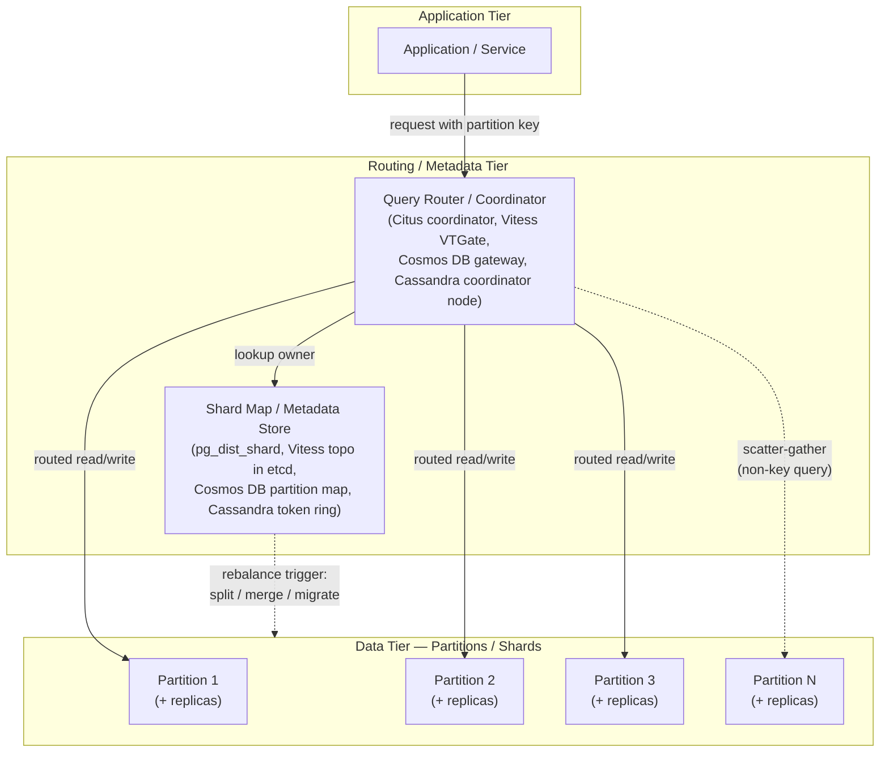
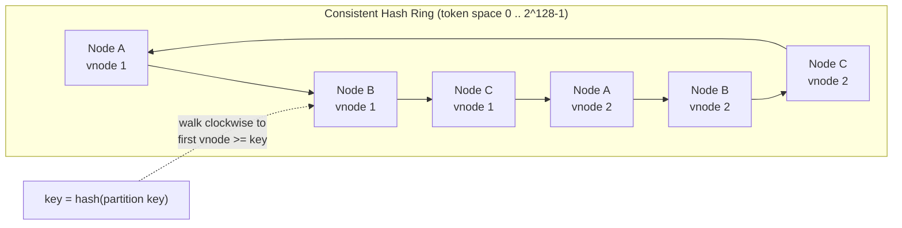
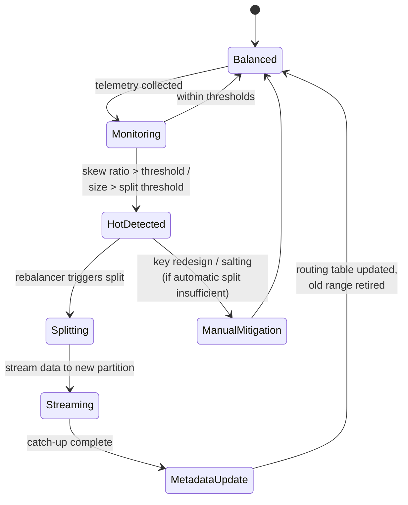
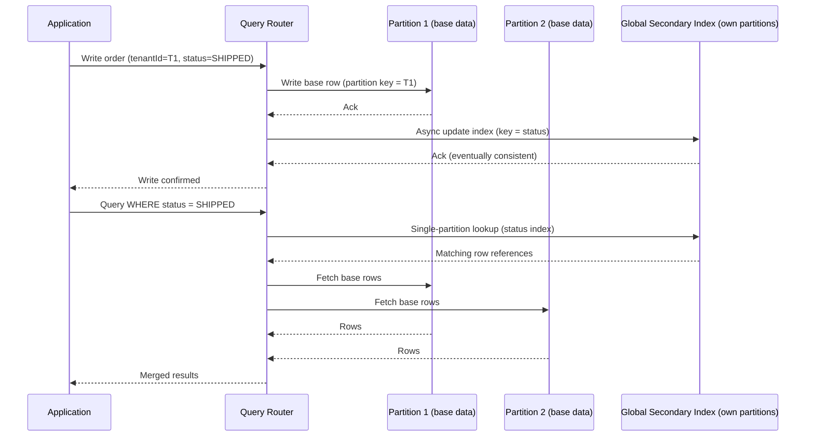

# Partitioning and Sharding

> Part of the **Enterprise Data & AI Architecture Handbook** · Phase-02 — Distributed Systems Deep Dive · Chapter 03.
> Estimated study time: **60 min reading + ~4h labs**.
> **Prerequisites:** read [Replication and Consistency](02_Replication_and_Consistency.md) first.

---

## Executive Summary

[Replication and Consistency](02_Replication_and_Consistency.md#core-concepts) answered "how many copies of the data exist, and what do they agree on." Partitioning and sharding answer the orthogonal question: "which subset of the data does any given node hold at all?" A single machine — however replicated — has a storage and throughput ceiling. Partitioning splits a dataset into disjoint pieces (partitions, shards) distributed across many machines so that storage, write throughput, and read throughput all scale roughly linearly with the number of machines, instead of being capped by the biggest box money can buy. Every horizontally scaled data system a data/AI architect will touch — Azure Cosmos DB, Azure Synapse dedicated SQL pools, Citus/Postgres Hyperscale, Apache Cassandra, Vitess-sharded MySQL, Kafka, Elasticsearch, DynamoDB, Cloud Spanner — is a partitioning scheme wearing a different API.

This chapter builds the mental model architects need to choose and defend a partitioning strategy: **range, hash, and directory-based partitioning** as the three fundamental families, each with a distinct trade-off between query flexibility and load distribution; **consistent hashing and virtual nodes** as the mechanism that makes hash partitioning survive cluster resizes without reshuffling the entire dataset; **rebalancing and resharding** as the operational discipline of moving data between partitions as load and cluster size change, live, without an outage; **hot partitions and skew** as the single most common, most expensive, and most avoidable failure mode in production partitioned systems; and **secondary indexes across partitions** as the mechanism (and the cost) of supporting queries that do not filter by the partition key.

The bias remains **Azure-primary (~60%)** — Azure Cosmos DB's logical/physical partition model and partition key design guidance, Azure Synapse Analytics dedicated SQL pool distribution strategies (hash/round-robin/replicate), Azure Database for PostgreSQL - Hyperscale (Citus) distributed tables, Elastic Database Tools shard map management for Azure SQL Database, and Azure Table Storage partition keys — **~30% enterprise open source** (Vitess, Citus, Apache Cassandra, MongoDB, Kafka, Elasticsearch/OpenSearch, ClickHouse) and **~10% AWS/GCP comparison-only** (DynamoDB and Aurora Limitless Database vs. Cloud Spanner and Bigtable).

**Bottom line:** partitioning is the mechanism that makes "infinite" scale possible, but the partition key is the single highest-leverage design decision in the entire system — a poorly chosen key produces hot partitions that throttle throughput no amount of replica count or compute tier can fix, while a well-chosen key that does not match the real query pattern produces expensive, scatter-gather cross-partition queries that quietly erode the scalability the partitioning was meant to deliver. An architect who cannot explain the access pattern that justified a partition key choice, the rebalancing story for that scheme, and the skew-mitigation plan for the top 1% of keys cannot defend that design in a Staff/Principal review.

---

## Learning Objectives

By the end of this chapter you will be able to:

1. **Distinguish range, hash, and directory partitioning** and choose correctly given a stated query and write access pattern.
2. **Explain consistent hashing and virtual nodes** precisely enough to predict how many keys move when a node joins or leaves a cluster.
3. **Design a rebalancing/resharding strategy** (live migration, dual-write, backfill, cutover) for a system that cannot tolerate a maintenance window.
4. **Diagnose and mitigate a hot partition** using real telemetry (RU consumption, shard CPU, request-unit throttling) and at least three distinct mitigation techniques.
5. **Reason about secondary indexes across partitions** — local vs. global index trade-offs, and when a scatter-gather query is acceptable vs. disqualifying.
6. **Select and defend a partition key** for Azure Cosmos DB, Synapse dedicated SQL pools, or Citus given a concrete multi-tenant or IoT workload.
7. **Write an ADR for a partitioning decision** covering context, decision, consequences, and rejected alternatives.
8. **Compare Azure's partitioning primitives to AWS DynamoDB/Aurora Limitless and GCP Spanner/Bigtable** and justify a migration or multi-cloud posture.

---

## Business Motivation

- **Storage and throughput ceilings are real and expensive to hit blind.** A single Azure SQL Database Hyperscale instance or a single Cosmos DB physical partition has hard capacity and throughput limits; discovering this in production, during a Black Friday traffic spike, is a self-inflicted incident — partitioning strategy must be designed before the limit is reached, not after.
- **Hot partitions are the #1 cause of "we added capacity but latency didn't improve."** Provisioning more RUs, more vCores, or more nodes does nothing if 80% of traffic lands on one partition key value (a single large tenant, a single trending product, a monotonically increasing order ID) — this is a design defect, not a capacity problem, and it is the single most common and most expensive partitioning mistake seen in enterprise post-incident reviews.
- **Resharding downtime is a business-visible cost.** An e-commerce platform that must take a maintenance window to reshard its order database during peak season is choosing between lost revenue and lost customer trust — a live-rebalancing-capable architecture (Cosmos DB, Citus, Vitess, Cassandra) converts a business risk into a routine, invisible operation.
- **Multi-tenant SaaS unit economics depend on partitioning strategy.** Tenant-per-shard vs. shared-shard-with-tenant-key directly determines noisy-neighbor blast radius, per-tenant cost attribution accuracy, and the ability to offer data-residency guarantees (EU tenant data must stay in EU) — a partitioning decision made at MVP stage that ignores this becomes a multi-quarter, revenue-blocking re-architecture later.
- **Data residency and sovereignty regulations are enforced at the partition boundary.** GDPR, and similar regimes, frequently require that a customer's data physically reside in a specific region — geo-partitioning (partitioning by region/country as a first-class dimension) is how this is implemented in practice, not a policy document.
- **Cross-partition (scatter-gather) query cost is a direct, metered cloud bill line item.** In Cosmos DB, a cross-partition query fans out to every physical partition and consumes RUs on each; a data model that forces every common query to be cross-partition is a quantifiable, recurring cost, not just a latency concern.

---

## History and Evolution

- **Early 2000s — Manual, application-level sharding.** Large web properties (eBay, Flickr, early Facebook) outgrow a single MySQL instance and hand-roll application-level sharding: a hash or modulo function in application code routes rows to one of N MySQL instances, with no framework support for rebalancing — moving to N+1 shards means a painful, custom, often-downtime-requiring migration.
- **2007 — Amazon's Dynamo paper** formalizes **consistent hashing** for a distributed key-value store, explicitly to solve the "adding/removing a node reshuffles everything" problem of naive modulo hashing — this single paper is the direct intellectual ancestor of Cassandra, Riak, DynamoDB, and the partitioning layer of Cosmos DB.
- **2008-2010 — Apache Cassandra** (born at Facebook, open-sourced 2008) and **MongoDB** (2009) bring consistent hashing (Cassandra) and range/hash sharding with a config-server-based directory (MongoDB) to mainstream NoSQL, each making partitioning a first-class, framework-managed concern rather than application code.
- **2011-2012 — Vitess** is built at YouTube to shard MySQL horizontally without changing application SQL, introducing VSchema-driven routing and online resharding (`MoveTables`/`Reshard` workflows) for the relational world — proving horizontal sharding did not require abandoning SQL.
- **2012 — Cassandra 1.2 introduces virtual nodes (vnodes)**, replacing "one large token range per physical node" with "many small token ranges per physical node," directly solving uneven rebalancing load and hot-spot-on-join problems inherent in early consistent hashing implementations.
- **2012-2017 — Google's Spanner paper (2012) and Cloud Spanner GA (2017)** demonstrate range-based sharding with automatic, transparent splitting and rebalancing at global scale with strong consistency, raising the bar for what "managed sharding" should look like.
- **2014-2017 — Azure Cosmos DB (originally DocumentDB, GA 2017 as Cosmos DB)** introduces the **logical/physical partition** model: developers declare a logical partition key; the service transparently manages physical partition placement, splits, and rebalancing — hiding resharding mechanics behind a managed abstraction.
- **2016 — Citus** (later acquired by Microsoft, 2019) brings distributed-table sharding to vanilla PostgreSQL via an extension, enabling hash-distributed, reference, and local tables within a single logical Postgres database — this becomes **Azure Database for PostgreSQL - Hyperscale (Citus)**.
- **2018-2020 — Cassandra, Elasticsearch, and Kafka all converge on "many small partitions per node"** as the default operational pattern, treating partition count as a scaling and rebalancing lever independent of physical node count.
- **2023 — AWS Aurora Limitless Database (preview)** brings automatic, transparent horizontal sharding to Aurora PostgreSQL, explicitly chasing the same "SQL semantics, sharded scale" goal Citus and Spanner had already delivered — evidence the pattern has become table stakes for cloud-native OLTP.
- **2020-2026 — Partitioning becomes an AI/agentic-workload concern too**: vector databases (Qdrant, Milvus) and feature stores (Feast) apply the same hash/range partitioning principles to embedding and feature data at scale, and RU/DTU-aware partition key design is now a standard review item in Azure Well-Architected data workloads.

---

## Why This Technology Exists

- **A single machine has a hard ceiling** — CPU, memory, disk IOPS, and network bandwidth are all finite on one box; partitioning exists because the only way past that ceiling is to spread data (and the work of serving it) across many boxes.
- **Vertical scaling has diminishing, then negative, returns.** Beyond a point, bigger VMs cost disproportionately more per unit of throughput, and every vertical-scaling operation still requires downtime or careful online resize — partitioning converts "buy a bigger box" into "add another box," a strategy with a much longer runway and (with the right scheme) no downtime.
- **Consistent hashing exists specifically because naive hashing (`hash(key) % N`) breaks on resize.** Changing N in a modulo scheme reassigns the overwhelming majority of keys to different nodes simultaneously — consistent hashing bounds the fraction of keys that move when a node joins/leaves to roughly `1/N`, making elastic scaling operationally survivable.
- **Virtual nodes exist because a single token range per physical node produces uneven rebalancing.** When one physical node with one large contiguous range leaves, its *entire* range must move to exactly one neighbor, creating a hot spot during rebalancing; many small vnodes per physical node spread that same data movement across many neighbors simultaneously.
- **Directory-based partitioning exists because some access patterns cannot be expressed as a pure function of the key** — e.g., a specific tenant must be pinned to a specific region for compliance, or a shard needs manual, business-driven placement decisions a hash or range function cannot encode.
- **Rebalancing/resharding tooling exists because data and traffic are never static** — a scheme that was well-balanced at launch will skew as tenants grow unevenly, as new regions launch, or as a product goes viral; without live rebalancing, every such change is a scheduled-downtime event.

---

## Problems It Solves

- **Horizontal scalability of storage and throughput** — total capacity becomes `(per-node capacity) x (node count)` instead of a fixed ceiling.
- **Fault isolation and blast-radius reduction** — a failure or hot-spot on one partition/shard does not (with a well-designed scheme) take down the whole dataset, only the affected key range/tenant.
- **Parallelism for both writes and analytical scans** — many partitions can be written to and scanned concurrently, which is the foundation of both OLTP throughput and MPP analytical query engines (Synapse dedicated pools, ClickHouse, BigQuery/Spanner).
- **Geo-locality and data residency** — geo-partitioning places a tenant's or region's data physically close to its users and inside required regulatory boundaries.
- **Multi-tenant isolation and noisy-neighbor containment** — tenant-aligned partitioning lets one tenant's spike in load be contained (and billed/throttled) without degrading others.
- **Elastic capacity management** — well-designed partitioning (consistent hashing + vnodes, Cosmos DB physical partition splits) allows adding capacity incrementally, live, in response to growth.

---

## Problems It Cannot Solve

- **It cannot fix a bad data model.** Partitioning distributes whatever schema and access pattern you give it; if the access pattern requires joining across what are now separate shards for every request, partitioning has converted a local join into a slow, expensive network operation — the fix is data modeling (denormalization, pre-joining, choosing a partition key aligned to the dominant query), not more partitions.
- **It cannot make cross-partition transactions free.** Distributed transactions across shards require the mechanisms from [Distributed Transactions](../Phase-02/05_Distributed_Transactions.md) (2PC, sagas) — partitioning is what *creates* the need for these, not what solves it.
- **It cannot eliminate hot keys by itself.** If the real world has one key that is genuinely 1000x hotter than any other (a celebrity account, a flash-sale SKU), no partitioning scheme routes that key to more than one partition without additional techniques (key salting, write sharding, caching) — partitioning is necessary but not sufficient for skew.
- **It cannot substitute for capacity planning.** A correctly partitioned system still needs the right number of partitions and the right throughput provisioned per partition (RUs, vCores, broker capacity) — partitioning enables scaling, it does not automatically provide it without correct sizing.
- **It cannot make every query fast.** Queries that do not filter on the partition key become scatter-gather by construction; partitioning trades some query flexibility for scale, and no partitioning scheme restores full relational flexibility for free.
- **It cannot replace good replication/consistency design.** Partitioning says *where* data lives; it says nothing about *how many copies* exist or *what they agree on* — that is [Replication and Consistency](02_Replication_and_Consistency.md)'s job, and a partitioned-but-unreplicated shard is a single point of failure per partition.

---

## Core Concepts

### 3.1 Range partitioning

Data is split by contiguous ranges of the partition/shard key (e.g., customer IDs 1-999,999 on shard A, 1,000,000-1,999,999 on shard B). **Strength:** range queries and ordered scans (e.g., "all orders between March and April") stay within one or a few adjacent partitions — no scatter-gather. **Weakness:** monotonically increasing keys (auto-increment IDs, timestamps) concentrate all *new* writes on the single "current" range/partition — the classic **hot tail** problem seen in naive time-series or auto-increment-keyed tables. Cloud Spanner and Cloud Bigtable use range partitioning with automatic, transparent splitting specifically to make this safe at scale (see [GCP Equivalent](#gcp-equivalent-comparison-only)).

### 3.2 Hash partitioning

A hash function is applied to the partition key, and the hash value (often via consistent hashing, §3.3) determines placement. **Strength:** uniform key distribution across partitions if the hash function and key cardinality are good — this is the default, safest choice for OLTP write-heavy workloads and is Cosmos DB's, Citus's, and Cassandra's default posture. **Weakness:** range queries and ordered scans become cross-partition scatter-gather by construction, because hashing intentionally destroys key ordering.

### 3.3 Directory-based partitioning

An explicit lookup table (a "directory" or "shard map") maps each key (or key range/tenant) to a specific physical partition, maintained by a metadata service. **Strength:** maximum placement flexibility — supports manual rebalancing, compliance-driven pinning (tenant X must live in EU shard), and heterogeneous shard sizing. **Weakness:** the directory itself is a critical, must-be-highly-available, must-be-fast-to-look-up piece of infrastructure (Vitess's topology service in etcd/Consul/ZooKeeper, Elastic Database Tools' shard map manager database) — it becomes a new single point of failure/bottleneck if not itself replicated and cached aggressively.

| Dimension | Range | Hash | Directory |
|---|---|---|---|
| Range/ordered query locality | Excellent | Poor (scatter-gather) | Depends on mapping |
| Write distribution uniformity | Poor for monotonic keys | Excellent | Depends on policy |
| Rebalancing mechanism | Automatic split of hot ranges | Consistent hashing + vnode migration | Explicit directory update + data move |
| Placement flexibility (compliance, tenant pinning) | Low | Low | High |
| Operational complexity | Low-Medium | Low | Medium-High (extra metadata tier) |
| Representative systems | Spanner, Bigtable, HBase | Cosmos DB, Cassandra, Citus, DynamoDB | Vitess, Elastic Database Tools, MongoDB config servers |

### 3.4 Consistent hashing and virtual nodes

**Consistent hashing** places both nodes and keys on a conceptual ring (a fixed hash space, e.g., 0 to 2^128-1); a key belongs to the first node found walking clockwise from the key's hash position. When a node is added or removed, only the keys between it and its counter-clockwise neighbor move — bounding data movement to roughly `1/N` of the keyspace instead of a full reshuffle. **Virtual nodes (vnodes)** improve on the basic scheme by giving each physical node many (e.g., 128-256) small, non-contiguous token ranges on the ring instead of one large range. This (a) spreads rebalancing load across many peers simultaneously when a node joins/leaves, instead of overloading one neighbor, and (b) allows heterogeneous hardware to hold proportional load by assigning more vnodes to more powerful nodes. Cassandra, ScyllaDB, and Amazon DynamoDB's internal partitioning all use this pattern; Cosmos DB's physical partition management achieves an equivalent effect through managed, automatic range splits rather than an exposed ring.

### 3.5 Rebalancing and resharding strategies

- **Split/merge (range-based):** a partition that grows past a size or throughput threshold is split in two at a chosen boundary; two under-utilized adjacent partitions can be merged. This is how Cosmos DB, Spanner, Bigtable, and HBase rebalance — transparent to the application.
- **Consistent-hash migration (hash-based with vnodes):** when a node joins, it claims a subset of vnodes/token ranges from existing nodes and streams that data from replicas; Cassandra's `nodetool` bootstrap and Kafka's partition reassignment tooling follow this pattern.
- **Directory update + background copy (directory-based):** the metadata service is updated to point a key/tenant/shard at a new physical location, data is copied/streamed in the background, and the directory is atomically flipped once the copy is caught up — Vitess's `MoveTables`/`Reshard` workflows and Elastic Database Tools' split-merge service both work this way.
- **Dual-write / shadow migration (application-level, cross-technology):** for the highest-risk migrations (changing partitioning *scheme*, not just partition count, or migrating between database engines), the application writes to both old and new schemes, backfills historical data, verifies parity, then cuts reads over — slower and more work, but framework-agnostic and reversible at every step.

### 3.6 Hot partitions and skew mitigation

A **hot partition** receives disproportionate read/write traffic relative to its peers, throttling throughput system-wide even though aggregate provisioned capacity is sufficient. Root causes: low-cardinality partition keys (a status enum), monotonically increasing keys (auto-increment IDs, timestamps as the leading key component), and genuinely skewed real-world popularity (one large tenant, one viral product). Mitigations, in order of preference: (1) **choose a higher-cardinality composite key** (e.g., `tenantId_customerId` instead of `tenantId`); (2) **salt the key** by appending a random or hashed suffix and fanning writes across N sub-keys, merging on read; (3) **cache aggressively** in front of the hot partition (Azure Cache for Redis, CDN) to absorb read skew; (4) **isolate known-large keys onto dedicated partitions/shards** (a "whale tenant gets its own shard" policy); (5) **rate-limit or shed load** at the application tier as a last resort.

### 3.7 Secondary indexes across partitions

A query that filters on a field *other than* the partition key cannot be routed to a single partition, forcing a choice: a **local (partitioned) secondary index** stores index entries co-located with their base row's partition — cheap to maintain on write, but querying it still requires scatter-gather across all partitions (Cassandra's default secondary index behavior). A **global secondary index** stores index entries in their own separately partitioned structure, keyed by the indexed field — fast, single-partition lookups by the indexed field, at the cost of additional write amplification and (usually) eventual consistency between base table and index (DynamoDB Global Secondary Indexes, Cosmos DB's automatic indexing subsystem which is itself globally maintained per logical partition). The architect's decision: which query patterns are common enough to deserve a global index's write-cost and consistency-lag tax, versus which are rare enough to tolerate scatter-gather.

---

## Internal Working

**Cosmos DB:** a container declares a **partition key path** (e.g., `/tenantId`); each distinct partition key value forms a **logical partition**, capped at 20 GiB. The service transparently maps many logical partitions onto a smaller number of **physical partitions** (each with its own replica set for the configured consistency level), and automatically **splits** a physical partition when it approaches its storage or throughput (RU) ceiling — moving roughly half the logical partitions' data to a new physical partition, updating internal routing metadata, with no application-visible downtime.

**Citus (Postgres Hyperscale):** `create_distributed_table('orders', 'tenant_id')` hash-distributes rows across a configurable number of **shards** (Postgres tables under the hood) placed on worker nodes; a coordinator node holds distribution metadata (`pg_dist_shard`) and rewrites incoming SQL into per-shard queries, pushing filters down when the query includes the distribution column and doing a scatter-gather + merge otherwise.

**Cassandra:** the partition key is hashed (Murmur3 by default) to a token; the token ring (with vnodes) determines which node(s) own that token range as primary and which own it as replicas (per replication factor); a coordinator node (any node receiving the request) routes to the correct replica set and applies the configured consistency level ([Replication and Consistency](02_Replication_and_Consistency.md#core-concepts)) before responding.

**Kafka:** a topic is divided into partitions; a producer's partitioner (default: hash of the message key, or round-robin if no key) selects a target partition; each partition is an append-only, strictly ordered log with its own leader broker, giving per-partition ordering guarantees but no cross-partition ordering — this is why partition key choice for a Kafka topic is itself an architectural decision, not an implementation detail.

---

## Architecture



---

## Components

- **Partition/shard key** — the field(s) whose value determines placement; the single most consequential schema decision in the system.
- **Query router / coordinator** — the tier that accepts client requests, consults metadata, and routes to the correct partition(s) (Vitess VTGate, Citus coordinator, Cosmos DB gateway service, any Cassandra node acting as coordinator).
- **Shard map / metadata store** — the source of truth for key-to-partition ownership; must itself be highly available and low-latency (etcd/ZooKeeper/Consul for Vitess, a dedicated catalog database for Elastic Database Tools, internal metadata service for Cosmos DB).
- **Physical partition/shard** — the actual storage and compute unit holding a subset of data, typically itself replicated per [Replication and Consistency](02_Replication_and_Consistency.md).
- **Rebalancer/splitter** — the background process that detects imbalance (size or throughput threshold) and performs split/merge/migrate operations.
- **Secondary index maintainer** — the subsystem that keeps local or global secondary indexes consistent with base-partition writes.
- **Monitoring/telemetry agent** — collects per-partition metrics (RU consumption, CPU, request latency, key distribution) that feed hot-partition detection.

---

## Metadata

Every partitioning scheme needs an authoritative record of "who owns what," and the metadata tier's own availability and consistency model matters as much as the data tier's:

- **Cosmos DB** maintains an internal partition map (not directly exposed) tracking logical-to-physical partition assignment; the SDK caches routing information and refreshes on a 410/"partition gone" response.
- **Citus** stores distribution metadata in coordinator-side catalog tables (`pg_dist_shard`, `pg_dist_shard_placement`, `pg_dist_node`) — the coordinator itself should be made highly available (e.g., via Postgres streaming replication) since it is a control-plane single point of failure if not.
- **Vitess** stores its topology (keyspace/shard map, tablet health) in an external, strongly consistent store — etcd (or ZooKeeper/Consul) — explicitly chosen for its own consensus guarantees ([Consensus and Coordination](01_Consensus_and_Coordination.md)).
- **Cassandra** distributes ring/token metadata via gossip among all nodes — there is no separate metadata service, trading a moving part for eventual convergence delay after topology changes.
- **Elastic Database Tools (Azure SQL)** stores shard maps in a dedicated **Shard Map Manager** database, queried by the client-side `Microsoft.Azure.SqlDatabase.ElasticScale` library.

---

## Storage

- Each physical partition/shard is typically an independent storage unit (its own B-tree/LSM-tree files, its own Postgres table/tablespace, its own Cassandra SSTables) — this isolation is what makes per-partition backup, compaction, and independent scaling possible.
- Storage limits per logical unit matter for design: Cosmos DB logical partitions cap at 20 GiB (forcing composite/higher-cardinality keys for large tenants); Citus shard count is typically fixed at table creation and should be over-provisioned relative to *expected future* worker node count (rule of thumb: shard count = 2-4x the largest anticipated worker count) since shard *count* itself is not trivially changed later, unlike shard *placement*.
- LSM-tree-based stores (Cassandra, ScyllaDB, RocksDB-backed engines) amplify the cost of resharding via compaction — data streamed into a new node must still be compacted, and rebalancing storms can transiently increase disk I/O and space amplification.

---

## Compute

- Query compute is either **pushed down** to a single partition (partition-key-filtered query — cheapest, fastest) or **scattered** across all partitions and merged at the coordinator (non-key-filtered query, aggregation, `ORDER BY` without key alignment — most expensive).
- MPP analytical engines (Synapse dedicated SQL pools, ClickHouse `Distributed` tables) are built explicitly around parallel per-shard compute plus a merge/exchange step — the same primitive as OLTP scatter-gather, but designed for it rather than incurring it as a penalty.
- Cross-shard joins are the most expensive compute pattern in a sharded system: a join between two hash-distributed tables on the *distribution key* can be pushed down and executed locally per shard (Citus co-location); a join on any other key requires shuffling data between shards — architecturally, this is why **co-locating related tables on the same distribution key** (e.g., distributing both `orders` and `order_items` by `tenant_id`) is a first-order design decision, not an optimization afterthought.

---

## Networking

- Cross-partition scatter-gather queries multiply network fan-out — a query hitting 100 partitions issues (at least) 100 network round trips before merging, directly impacting tail latency (p99) even if average latency looks fine.
- Geo-partitioning (placing a partition's primary/replicas in the region closest to its users) reduces cross-region network latency for the common case but complicates cross-partition queries that must now cross regions — a direct extension of the [Replication and Consistency](02_Replication_and_Consistency.md#networking) trade-offs to the partitioning layer.
- Rebalancing/resharding operations themselves consume significant east-west (inter-node) bandwidth as data streams between old and new owners — production rebalancing should be rate-limited and scheduled to avoid contending with foreground traffic, a setting exposed in Cassandra (`stream_throughput_outbound_megabits_per_sec`) and comparable knobs elsewhere.

---

## Security

- Partition/shard boundaries are a natural, low-overhead enforcement point for **tenant isolation**: a tenant-per-shard or tenant-per-partition-key design lets network policy, encryption keys, and access control be scoped per shard rather than requiring row-level security everywhere.
- **Encryption at rest** should be verified per physical partition/shard, not assumed — in managed services (Cosmos DB, Azure SQL, Synapse) this is handled transparently with platform-managed or customer-managed keys (Azure Key Vault); in self-managed OSS (Cassandra, Citus on IaaS) it must be explicitly configured per node/shard.
- **Data residency enforcement** is implemented via directory-based or geo-aware partitioning: a compliance rule ("EU customer data must not leave the EU") becomes a shard-placement policy enforced by the metadata/directory tier, and must be *audited* (can you prove, from metadata, which physical region holds a given tenant's data right now) not just configured once.
- Secondary index leakage: a **global secondary index** duplicates data into a new structure — access control and encryption policy must be applied consistently to the index, not only the base table, or the index becomes an unaudited side channel to sensitive fields.

---

## Performance

- Throughput scales with partition count *only if* the key is well-distributed — the first performance question for any partitioned system is "what does the distribution of writes/reads across partition key values actually look like in production," not "how many partitions do we have."
- In Cosmos DB, **RU (request unit) consumption is provisioned and can be tracked per physical partition**; a 429 (throttled) response concentrated on a narrow set of logical partition key values is the definitive symptom of a hot partition, and the fix is a key redesign, not more provisioned RU/s (which simply raises everyone's ceiling, including the hot partition's, proportionally, without fixing the imbalance).
- Composite/synthetic partition keys (e.g., `deviceId_dayBucket` for IoT telemetry) are the standard technique to raise cardinality above what a natural business key alone provides, spreading a single logical entity's data (and its write load) across many physical partitions over time.
- Read-heavy hot partitions are far cheaper to mitigate (caching layer in front) than write-heavy hot partitions (which require key redesign or write-sharding/salting), so performance triage should first classify whether the hot spot is read or write dominated.

---

## Scalability

- Well-designed hash partitioning with consistent hashing/vnodes provides genuinely near-linear scalability: doubling node/partition count roughly doubles both storage and aggregate throughput capacity, provided the key distribution stays uniform.
- Range partitioning with automatic splitting (Spanner, Bigtable, Cosmos DB) achieves similar linear scalability for well-distributed keys while additionally preserving range-query locality — the more operationally desirable profile when the workload allows it.
- Scalability is bounded in practice by: (a) key skew (the hottest partition sets the effective throughput ceiling regardless of total capacity), (b) coordinator/router capacity in directory-based and Citus-style architectures (the coordinator itself can become a bottleneck at extreme scale, mitigated by coordinator read replicas or multiple coordinators), and (c) cross-shard operation frequency (a workload with frequent cross-shard joins/transactions scales sub-linearly no matter how well the key is chosen).
- Elastic scale-out (adding partitions/nodes live) is a distinguishing capability, not a given: Cosmos DB, Cassandra, Citus, and Vitess all support it; a shard count fixed at table-creation time in some Citus configurations, or a naive modulo-hash scheme, does not — this must be verified per technology before assuming "sharded" implies "elastically scalable."

---

## Fault Tolerance

- Partitioning **reduces blast radius**: with N partitions, a single partition/shard failure affects roughly `1/N` of the keyspace rather than the whole dataset, assuming the application can degrade gracefully for the affected key range (return errors/cached data for that slice, keep serving the rest).
- Partitioning **without replication is not fault tolerant** — each shard/partition remains a single point of failure for its slice of data unless combined with the replication strategies in [Replication and Consistency](02_Replication_and_Consistency.md); every production system in this chapter (Cosmos DB, Cassandra, Citus, Vitess) pairs partitioning with per-partition replica sets by default.
- Rebalancing operations themselves are a fault-tolerance risk window: a node failing mid-migration must be handled by the rebalancer resuming/retrying safely (idempotent streaming, checksummed transfers) rather than corrupting or losing the in-flight shard — this is a key maturity differentiator between hand-rolled application-level sharding (fragile) and mature frameworks (Vitess, Citus, Cosmos DB) that have hardened this path over years of production use.
- Coordinator/router/metadata-tier fault tolerance matters independently of data-tier fault tolerance: if the shard map/topology service (etcd for Vitess, the coordinator node for Citus) is unavailable, routing fails even though the data shards themselves are healthy — the control plane needs its own HA design.

---

## Cost Optimization

- **Right-size partition/shard count to actual data volume and growth projection**, not a round number — over-partitioning (many small, mostly-idle partitions) wastes provisioned minimums (Cosmos DB's per-physical-partition RU minimums, Citus's per-shard overhead); under-partitioning forces disruptive future resharding.
- **Avoid unnecessary cross-partition (scatter-gather) queries in hot code paths** — each is metered (RUs in Cosmos DB, compute-seconds in Synapse) proportional to partitions touched; a partition-key-aligned query is both faster and cheaper.
- **Use serverless/autoscale provisioning tiers** (Cosmos DB autoscale RU/s, Azure SQL Hyperscale serverless) for spiky or unpredictable per-partition workloads instead of statically over-provisioning peak capacity on every partition.
- **Consolidate small tenants onto shared shards; isolate large tenants onto dedicated shards** — a tiered multi-tenancy model (pool small tenants, dedicate large ones) avoids paying dedicated-shard overhead for tenants too small to need it while protecting large tenants (and their neighbors) from noisy-neighbor cost/performance interference.
- **Monitor and reclaim orphaned/cold shards** after tenant churn or data-retention expiry — a shard sized for a since-departed large tenant is a silent, recurring cost.

---

## Monitoring

Key signals to instrument, per partition/shard, not just in aggregate:

- Request/RU/DTU consumption and throttling (429s) **by partition key or physical partition ID**.
- Storage size and growth rate per logical/physical partition (approaching the 20 GiB Cosmos DB logical-partition ceiling is a leading indicator, not just an alert-after-the-fact condition).
- Key-distribution histograms (top-N hottest keys by request volume) reviewed on a recurring cadence, not only during incidents.
- Rebalancing/split/merge event frequency and duration — frequent, large rebalances are a symptom of an undersized or poorly chosen key, not just routine operations.
- Cross-partition (scatter-gather) query rate and fan-out width, as both a cost and a latency signal.

Azure-native tooling: Cosmos DB's **Insights/Metrics** (normalized RU consumption per physical partition, "hot partition" built-in alerts), Azure Monitor workbooks for Synapse dedicated pool DWU utilization by distribution, and Azure Database for PostgreSQL - Hyperscale (Citus) `citus_shards`/`citus_stat_statements` views.

---

## Observability

- **Correlate a request's partition key with its trace** — attach the partition/shard key (or a hash/redacted form, per governance policy) as a span attribute in OpenTelemetry traces so a slow request can be immediately tied to a specific hot partition rather than requiring separate log correlation.
- **Dashboard key distribution, not just latency/error rate** — a Grafana/Azure Monitor Workbook panel showing request volume by partition key decile turns "why is p99 bad" into "partition key X is 40x hotter than median" in one glance.
- **Alert on skew ratios, not just absolute thresholds** — "hottest partition receives >10x the median partition's traffic" is a more actionable, scale-independent alert than a fixed RU/CPU threshold.
- **Track rebalancing operations as first-class observable events** (start/end/duration/data volume moved) so a performance regression during a migration window is immediately explainable rather than mysterious.

---

## Governance

- **Partition key choice should be a reviewed, documented architecture decision** (see the ADR in [Enterprise Recommendations](#enterprise-recommendations)), not an implicit consequence of whatever field happened to be the primary key.
- **Data residency and sovereignty policies must map to an explicit, auditable shard-placement rule**, with a mechanism to prove compliance (a query against the metadata/directory tier answering "which region holds tenant X's data" on demand for audit).
- **Retention and right-to-erasure (GDPR "right to be forgotten") requirements are simpler when partitioned by tenant/customer** — deleting a customer's data becomes "drop this partition/shard's rows for this key," a bounded, auditable operation, versus scanning an entire undifferentiated table.
- **Change management for resharding operations** should go through the same governance review as any capacity/availability-risk change — a resharding migration is operationally similar in risk profile to a database version upgrade and should be treated as such in a change advisory board process.

---

## Trade-offs

- **Query flexibility vs. write/scale uniformity** — hash partitioning gives uniform write distribution at the cost of losing range-query locality; range partitioning gives range-query locality at the risk of hot-tail writes on monotonic keys.
- **Placement flexibility vs. operational simplicity** — directory-based partitioning gives maximum control (compliance pinning, manual load balancing) at the cost of an additional, must-be-highly-available metadata tier.
- **Global secondary indexes' query speed vs. write amplification and consistency lag** — a global index turns a scatter-gather query into a single-partition lookup, but every write must now also (usually asynchronously) update the index, and readers may briefly see stale index results.
- **Partition count granularity vs. rebalancing overhead** — many small partitions rebalance more smoothly (small units to move) but carry more per-partition fixed overhead (metadata, minimum provisioned throughput); few large partitions have less overhead but rebalance in larger, riskier chunks.
- **Co-location for join performance vs. flexibility of independent scaling** — co-locating related tables on the same distribution key (fast local joins) ties their shard placement together, reducing the ability to scale or rebalance them independently.

---

## Decision Matrix

| Criterion | Range | Hash | Directory |
|---|---|---|---|
| Best for range/ordered scans | ✅ Best | ❌ Poor | ⚠️ Depends |
| Best for uniform write throughput | ⚠️ Risk of hot tail | ✅ Best (with consistent hashing) | ⚠️ Depends on policy |
| Compliance/residency pinning | ⚠️ Limited | ❌ Not directly | ✅ Best |
| Operational simplicity | ✅ High (managed auto-split) | ✅ High | ⚠️ Medium (extra tier) |
| Representative Azure service | N/A (managed internally by Synapse/Cosmos) | Cosmos DB, Citus (hash-distributed) | Elastic Database Tools |
| Representative OSS | HBase, ScyllaDB (range mode) | Cassandra, Citus, Kafka | Vitess, MongoDB (config servers) |
| Representative AWS/GCP | Spanner, Bigtable | DynamoDB | — |

**Selection guidance:** default to **hash** for OLTP write-heavy, point-lookup-dominated workloads (the common case: orders, sessions, events keyed by ID/tenant); choose **range** when ordered scans/time-range queries dominate *and* the platform provides automatic split-based rebalancing (Spanner, Bigtable, Cosmos DB's internal management); reach for **directory-based** only when compliance-driven placement or highly heterogeneous shard sizing is a hard requirement the other two cannot satisfy.

---

## Design Patterns

- **Tenant-per-shard (single-tenant shards):** each large tenant gets a dedicated physical shard/partition — maximum isolation and predictable per-tenant cost/performance, standard for enterprise-tier multi-tenant SaaS.
- **Shared shard with tenant key (pooled multi-tenancy):** many small tenants share a physical shard, distinguished by a `tenantId` partition/distribution key — efficient for high tenant counts with small per-tenant data volume.
- **Geo-sharding:** partition key includes (or the directory maps on) a region/country dimension, placing data physically near its users and inside required regulatory boundaries.
- **Composite/synthetic partition key:** concatenate a natural key with a bucketing dimension (e.g., `deviceId_yyyyMMdd`) to raise cardinality and spread a single logical entity's load over time — the standard IoT/telemetry pattern in Cosmos DB.
- **Write sharding / key salting:** append a random or hashed suffix (e.g., `orderId_{0-9}`) to fan a hot key's writes across N sub-partitions, merging results at read time — used when a single business key is unavoidably hot (e.g., a global counter).
- **Co-located distribution (Citus "co-location"):** distribute related tables (`orders`, `order_items`) on the same distribution column so joins between them execute as local, single-shard operations instead of a distributed shuffle.

---

## Anti-patterns

- **Monotonically increasing key as the leading partition key** (auto-increment ID, `createdAt` timestamp) — concentrates all new writes on one "current" partition; the textbook hot-tail failure.
- **Low-cardinality partition key** (a status enum, a boolean flag, a country code with three dominant values) — guarantees severe skew regardless of total data volume.
- **Choosing the partition key to match the primary key instead of the dominant query pattern** — convenient at schema-design time, expensive the first time a common query turns out to require scatter-gather.
- **Treating a global secondary index as free** — adding one "just in case" without accounting for its write-amplification and consistency-lag cost on every write to the base table.
- **Resharding without a rollback plan** — starting a live migration with no tested path to abort/reverse if the new scheme underperforms in production.
- **Ignoring the coordinator/directory tier's own scalability and availability** — sizing data shards carefully while leaving Citus's coordinator or Vitess's topology store as an unmonitored, unreplicated bottleneck.

---

## Common Mistakes

- Sizing partition/shard *count* for launch-day traffic only, with no plan (or platform capability) to add more later.
- Discovering hot partitions only via a customer-facing latency incident rather than proactive key-distribution monitoring.
- Assuming a managed service's "automatic" partitioning (Cosmos DB) removes the need to *design* a good partition key — the platform manages physical placement, but a bad logical key still produces a hot logical partition capped at 20 GiB and throttled RUs.
- Running cross-shard joins in a hot request path because the data model was ported unchanged from a single-node relational schema without redesigning for co-location.
- Forgetting that rebalancing consumes real network/disk bandwidth and scheduling a large resharding operation during peak traffic.
- Treating tenant-per-shard as "solved" without a policy for what happens when a pooled-shard tenant outgrows its shard (no promotion path to a dedicated shard).

---

## Best Practices

- Choose the partition key from the **dominant, highest-volume query pattern**, not the entity's natural primary key, unless they coincide.
- Favor **composite/high-cardinality keys** over natural business keys alone, especially for time-series/IoT/event data.
- **Co-locate related tables** on the same distribution key when the platform supports it (Citus), to keep common joins local.
- **Monitor key-distribution skew continuously**, not just aggregate throughput/latency, and set skew-ratio alerts.
- **Plan the resharding story before launch**, even if it is not needed on day one — verify the chosen platform/framework supports live rebalancing and that the team has practiced (in a lower environment) an actual reshard.
- **Separate the "large outlier" case from the general design** — give known-large tenants/keys dedicated shards or salted write paths rather than distorting the default scheme to accommodate them.
- **Cap logical partition growth proactively** (Cosmos DB: monitor approach to 20 GiB) and add a bucketing dimension before hitting the ceiling, not after.

---

## Enterprise Recommendations

- Mandate a written, reviewed **partition key ADR** for every new sharded/partitioned data store in the enterprise architecture repository, cross-referenced from the relevant data architecture domain artifact (see [Enterprise Architecture Foundations](../Phase-01/01_Enterprise_Architecture_Foundations.md#core-concepts)).
- Standardize on **Azure Cosmos DB for multi-tenant, globally distributed, schema-flexible workloads**; **Azure Database for PostgreSQL - Hyperscale (Citus) for relational workloads needing horizontal scale with SQL semantics and joins**; **Synapse dedicated SQL pools for large-scale analytical/MPP workloads** — as the default enterprise decision tree, deviating only with an ADR.
- Require **hot-partition detection and skew-ratio alerting** as a standard, non-optional observability requirement for any sharded production data store, wired into the same incident-management process as other SLO burn alerts.
- Require a documented, tested **resharding/rebalancing runbook** (including rollback) before a sharded system goes to production, not authored reactively during the first real rebalancing event.

### ADR Example: Partition Key Strategy for a Multi-Tenant SaaS Order Platform

- **Context:** A multi-tenant order-management SaaS platform on Azure Cosmos DB needs a partition key for the `Orders` container. Tenants range from small (hundreds of orders/month) to enterprise (tens of millions/month). The dominant query pattern is "fetch orders for tenant X within a date range," with occasional cross-tenant analytics handled by a separate Synapse pipeline.
- **Decision:** Use a **composite/synthetic partition key** `tenantId_yyyyMM` (tenant ID concatenated with a monthly bucket) rather than `tenantId` alone or `orderId`.
- **Consequences:** Enterprise tenants' data is automatically spread across multiple logical (and eventually physical) partitions as months accumulate, avoiding the 20 GiB logical-partition ceiling and avoiding a single hot logical partition for large tenants; the dominant "orders for tenant X, recent date range" query remains within one or a small, predictable number of logical partitions (current month plus a few prior); cross-tenant, cross-month analytics is deliberately routed to the Synapse-based analytical store rather than run as an expensive cross-partition query against the OLTP container.
- **Alternatives considered and rejected:** (1) **`tenantId` alone** — rejected because large enterprise tenants would eventually exceed the 20 GiB logical partition limit and would monopolize a single physical partition's RU allocation, creating a hot partition as they grew. (2) **`orderId`** — rejected because it optimizes for a query pattern ("fetch one order by ID") that is far less frequent than "fetch a tenant's recent orders," forcing the dominant query to become an expensive cross-partition scan. (3) **Directory-based per-tenant shard assignment via Elastic Database Tools** — rejected as unnecessary operational complexity given Cosmos DB's native logical/physical partition management already meets the compliance and scale requirements without a separate metadata tier.

---

## Azure Implementation

**Cosmos DB — partition key selection and container creation (Azure CLI):**

```bash
az cosmosdb sql container create \
  --account-name contoso-orders-cosmos \
  --database-name OrdersDb \
  --name Orders \
  --resource-group rg-orders-prod \
  --partition-key-path "/tenantId_yyyyMM" \
  --throughput 4000
```

**Synapse dedicated SQL pool — hash-distributed table (DDL):**

```sql
CREATE TABLE dbo.FactOrders
(
    OrderId      BIGINT       NOT NULL,
    TenantId     INT          NOT NULL,
    OrderDate    DATE         NOT NULL,
    Amount       DECIMAL(18,2) NOT NULL
)
WITH
(
    DISTRIBUTION = HASH(TenantId),   -- co-locates a tenant's rows on one distribution
    CLUSTERED COLUMNSTORE INDEX
);
```

**Azure Database for PostgreSQL - Hyperscale (Citus) — distributed and co-located tables:**

```sql
SELECT create_distributed_table('orders', 'tenant_id');
SELECT create_distributed_table('order_items', 'tenant_id');
-- order_items co-locates with orders on tenant_id, so joins between them execute
-- as local, single-shard operations instead of a distributed shuffle.
```

**Elastic Database Tools (Azure SQL Database) — shard map bootstrap (C#):**

```csharp
var shardMapManager = ShardMapManagerFactory.GetSqlShardMapManager(
    shardMapManagerConnectionString,
    ShardMapManagerLoadPolicy.Lazy);

RangeShardMap<int> shardMap = shardMapManager.GetRangeShardMap<int>("TenantShardMap");
shardMap.CreateShard(new ShardLocation(shardServer, "OrdersShard_01"));
shardMap.CreateRangeMapping(new RangeMappingCreationInfo<int>(
    new Range<int>(0, 100_000), shard));
```

**Azure Table Storage — partition key design:** use a partition key that groups entities queried together (e.g., `deviceId`) and a row key that provides intra-partition ordering (e.g., inverted timestamp for "most recent first" queries within a device's data), keeping the common query single-partition.

---

## Open Source Implementation

**Vitess — VSchema hash sharding (`vschema.json`):**

```json
{
  "sharded": true,
  "vindexes": { "tenant_hash": { "type": "hash" } },
  "tables": {
    "orders": { "column_vindexes": [{ "column": "tenant_id", "name": "tenant_hash" }] }
  }
}
```

**Apache Cassandra — table with partition key and vnode configuration (`cassandra.yaml` excerpt + CQL):**

```yaml
num_tokens: 256   # virtual nodes per physical node
```

```sql
CREATE TABLE orders (
    tenant_id  int,
    order_date date,
    order_id   uuid,
    amount     decimal,
    PRIMARY KEY ((tenant_id), order_date, order_id)
);
-- (tenant_id) is the partition key; order_date/order_id form the clustering
-- (intra-partition ordering) columns.
```

**MongoDB — hashed shard key:**

```javascript
sh.shardCollection("orders.orders", { tenantId: "hashed" })
```

**Kafka — keyed partitioning (producer, Java):**

```java
producer.send(new ProducerRecord<>("orders", tenantId, orderPayload));
// records with the same key (tenantId) always land on the same partition,
// preserving per-tenant ordering.
```

**ClickHouse — `Distributed` table engine across shards:**

```sql
CREATE TABLE orders_distributed AS orders_local
ENGINE = Distributed(cluster_orders, default, orders_local, cityHash64(tenant_id));
```

---

## AWS Equivalent (comparison only)

- **DynamoDB** partitions by a **hash (partition) key** plus an optional **sort (range) key**, using consistent hashing internally with **adaptive capacity** to redistribute throughput toward hot partitions automatically. *Advantage:* mature, fully managed, strong single-digit-ms performance at scale. *Disadvantage:* item-collection size limits per partition key and a more constrained query model (no ad hoc secondary-attribute filtering without a Global Secondary Index) compared to Cosmos DB's SQL-like query API. *Migration:* moving from DynamoDB to Cosmos DB requires re-mapping single-table-design access patterns onto Cosmos DB's partition key/container model; the reverse requires flattening Cosmos DB's richer query flexibility into DynamoDB's key-and-index-only access model.
- **Aurora Limitless Database** (2023+) brings transparent, automatic horizontal sharding to Aurora PostgreSQL, similar in spirit to Citus. *Advantage:* deep integration with the existing Aurora/RDS operational ecosystem. *Disadvantage:* newer, less battle-tested than Citus (available since 2016) or Vitess (since 2011) at extreme scale. *Selection criteria:* choose Azure Database for PostgreSQL - Hyperscale (Citus) when already Azure-committed and needing proven co-location/join support; consider Aurora Limitless only inside an existing, deep AWS/Aurora estate.

---

## GCP Equivalent (comparison only)

- **Cloud Spanner** uses range partitioning with fully automatic, transparent **splitting** based on load and size, plus **interleaved tables** as a first-class co-location mechanism (a child table's rows are physically stored adjacent to their parent row) — a more automatic analog to Citus's manual co-location declaration. *Advantage:* globally distributed strong consistency (TrueTime) with zero-touch rebalancing. *Disadvantage:* proprietary query dialect nuances and cost profile that make lift-and-shift from a standard PostgreSQL/MySQL estate non-trivial.
- **Cloud Bigtable** uses row-key range partitioning with a strong operational warning, mirrored in this chapter's guidance: row-key design (avoiding monotonic keys, avoiding hot row-key prefixes) is *the* primary performance lever, directly analogous to Cosmos DB/Cassandra partition-key design. *Advantage:* extreme write throughput for wide-column, time-series-like workloads. *Disadvantage:* no secondary indexes at all (application must design row keys to support all required access patterns), a stricter constraint than any Azure equivalent. *Migration:* Bigtable to Cosmos DB (Cassandra API or Core API) migrations require re-deriving an equivalent row-key/partition-key design, since Bigtable's single-row-key model maps onto Cosmos DB's partition-key-plus-document model.

---

## Migration Considerations

- **Changing partition count within the same platform** (e.g., Citus shard count, Cassandra vnode rebalancing) is typically a live, framework-supported operation — verify and rehearse it, but it does not usually require an application-level migration pattern.
- **Changing the partition key itself** (e.g., from `orderId` to `tenantId_yyyyMM`) requires a full data migration: create the new container/table with the new key, **dual-write** to both old and new during a transition window, **backfill** historical data into the new scheme, verify parity (row counts, checksums, spot-check queries), then **cut reads over** and decommission the old scheme — never a single atomic in-place operation.
- **Cross-platform migrations** (DynamoDB to Cosmos DB, Bigtable to Cosmos DB, self-managed Cassandra to Cosmos DB Cassandra API) additionally require re-validating that the source system's access patterns and consistency assumptions still hold under the target's partitioning model — a lift-and-shift that ignores this reliably produces a new hot-partition incident in the target system within the first few weeks of production traffic.
- **Rehearse resharding in a lower environment with production-shaped (not just production-sized) data** — skew characteristics, not just row counts, are what make rebalancing risky, and synthetic uniformly-distributed test data will not surface a hot-partition problem that a real key distribution would.

---

## Mermaid Architecture Diagrams

**1. Consistent hashing ring with virtual nodes:**



**2. Partition split/rebalance state diagram:**



**3. Secondary index maintenance (local vs. global):**



---

## End-to-End Data Flow

1. **Client request** carries (explicitly or implicitly derivable) a partition key value — e.g., an order-service API call scoped to `tenantId`.
2. **Router/coordinator** (Cosmos DB gateway, Citus coordinator, Vitess VTGate, Cassandra coordinator node) consults the **shard map/metadata tier** to resolve the owning physical partition(s).
3. **If the request is partition-key-aligned**, it is routed to exactly one physical partition (and its replica set, per the read/write consistency level from [Replication and Consistency](02_Replication_and_Consistency.md)) — the fast, cheap path.
4. **If the request is not partition-key-aligned** (a secondary-attribute filter, an aggregation), the router **fans out** to every physical partition (or to a global secondary index if one exists for that attribute), collects partial results, and **merges** them before returning to the client.
5. **In the background**, the rebalancer continuously monitors per-partition size/throughput; when a threshold is crossed, it **splits, merges, or migrates** partitions, updating the shard map/metadata tier atomically so in-flight and future requests are routed correctly with no application-visible downtime.
6. **Telemetry** (RU consumption, latency, key-distribution histograms) from every step feeds monitoring/observability dashboards and hot-partition alerting, closing the loop back into partition key design review.

---

## Real-world Business Use Cases

- **Multi-tenant SaaS platforms** (HR systems, CRM, order management) partition by `tenantId` (often composited with a time bucket) to isolate tenants, attribute cost accurately, and support per-tenant compliance/residency requirements.
- **E-commerce product catalogs** partition by `productId` or `categoryId`, with a global secondary index on attributes like SKU or brand to support cross-catalog search without scanning every partition.
- **IoT/telemetry platforms** partition by `deviceId` composited with a time bucket, so both "recent readings for device X" (single-partition) and long-term storage growth (bucketed, bounded partition size) are handled correctly.
- **Financial transaction systems** partition by `accountId`, aligning the dominant "transactions for account X" query with a single partition while relying on distributed transaction patterns ([Distributed Transactions](../Phase-02/05_Distributed_Transactions.md)) for the rarer cross-account transfer.
- **Streaming event pipelines** (Kafka/Event Hubs) partition by an entity key (`userId`, `deviceId`) to preserve per-entity ordering while parallelizing overall throughput across partitions.

---

## Industry Examples

- **Uber's original "Schemaless" datastore** built an application-level, MySQL-backed sharded key-value layer explicitly to survive the operational pain of ad hoc, un-tooled sharding at earlier scale — a widely cited example of why framework-supported sharding (Vitess, Citus) is now preferred over hand-rolled schemes.
- **Instagram's early Postgres sharding** used a custom, time-embedding ID scheme (shard ID + timestamp + sequence encoded into a 64-bit ID) to achieve roughly sortable, shard-aware primary keys without a central ID-generation bottleneck — a well-known instance of composite/synthetic key design under real production constraints.
- **Discord's move to Cassandra/ScyllaDB**, keyed by `channel_id`, for message storage is a widely referenced case study in hot-partition mitigation (extremely active channels required additional bucketing beyond the naive channel-based key).
- **Pinterest's sharded MySQL fleet** (via a Vitess-like, application-managed sharding layer historically) illustrates directory-based, explicitly-managed shard placement at very large scale predating Vitess's own maturity.

---

## Case Studies

**Case Study 1 — Hot partition from a monotonic order ID (composite lesson from multiple real incidents):** An order-management system partitioned Cosmos DB by `orderId` (an auto-incrementing-like, roughly time-ordered GUID generation scheme), assuming uniform hash distribution. In practice, the SDK's default indexing plus a downstream batch job that queried "orders created in the last hour" for reconciliation caused a burst of near-simultaneous writes and reads to land on a narrow, recently-created key range mapped to a small number of physical partitions, throttling unrelated tenant traffic during nightly reconciliation windows. **Root cause:** the partition key was chosen to match the primary key/document identity, not the actual dominant access pattern (tenant-scoped queries) or the batch job's time-windowed scan. **Fix:** re-partitioned on `tenantId_yyyyMM`, moved the reconciliation job to query the analytical (Synapse) copy of the data instead of the OLTP container directly. **Lesson:** a partition key that looks uniformly distributed in isolation can still create a hot **physical** partition when combined with a specific query pattern (a narrow time-window scan) that concentrates access — key design must be validated against actual query patterns, not just key-value entropy.

**Case Study 2 — Resharding a Citus cluster without downtime:** A financial-services analytics platform needed to double its Citus worker node count ahead of a regulatory-reporting deadline that would triple query volume. The team used Citus's `rebalance_table_shards()` function to move shard placements to new worker nodes live, with `citus.shard_replication_factor` ensuring data safety during the move, and validated the plan first in a staging cluster seeded from a production snapshot with realistic tenant-size skew (not uniform synthetic data). **Lesson:** rehearsing a rebalance against production-shaped skew (a few very large tenants, many small ones) surfaced a co-location constraint violation (one large tenant's `orders` and `order_items` shards briefly moved out of sync) that uniform test data would have missed — validating the coordinator's co-location invariants after rebalancing became a mandatory step in the runbook.

---

## Hands-on Labs

1. **Cosmos DB partition key comparison lab:** provision two containers with the same sample order dataset — one partitioned by `orderId`, one by `tenantId_yyyyMM`. Run an identical mixed read/write workload (a tool like the Cosmos DB Data Migration/Load tool or a small custom script) against both, and compare RU consumption distribution and 429 (throttling) rates using Azure Monitor metrics.
2. **Citus co-location lab:** stand up an Azure Database for PostgreSQL - Hyperscale (Citus) cluster, distribute `orders` and `order_items` on `tenant_id`, run `EXPLAIN` on a join query to confirm it executes as a local join, then repeat with `order_items` distributed on a different column and observe the resulting distributed shuffle in the query plan.
3. **Consistent hashing simulation lab:** implement a small consistent-hashing ring in Python (or use an existing library), simulate adding/removing nodes with and without virtual nodes, and measure/plot the fraction of keys that move in each scenario to directly observe the `1/N` bound and vnode load-spreading effect.
4. **Hot-partition detection and mitigation lab:** seed a Cosmos DB container with a deliberately skewed key distribution (one key receiving 50% of writes), observe throttling via Azure Monitor, then apply key salting (fan writes across `key_0`..`key_9`) and re-measure the throttling rate.

---

## Exercises

1. Given a workload description ("mobile app storing user session state, dominant query is `GET session by sessionId`, secondary need is `list all active sessions for a given deviceId`"), propose a partition key and justify the trade-off for the secondary query.
2. Explain, with a worked example, why a modulo-hash scheme (`hash(key) % N`) is unsafe for elastic scaling, and quantify (for N=4 to N=5) the fraction of keys that would move under modulo hashing vs. consistent hashing.
3. A Cosmos DB container's logical partition for one enterprise tenant is approaching the 20 GiB limit. Propose two different remediation strategies and the trade-offs of each.
4. Design a zero-downtime migration plan to change a production table's distribution key in Citus from `order_id` to `tenant_id`, listing every step and its rollback point.

---

## Mini Projects

1. **Build a minimal directory-based shard router**: implement a small service (any language) that maintains a shard map (tenant -> physical database connection string) in a small metadata store, routes reads/writes accordingly, and supports moving a tenant to a new shard live with a dual-write transition window.
2. **Instrument key-distribution observability**: extend an existing sample application (or one from an earlier chapter's lab) to emit an OpenTelemetry span attribute for its partition key on every request, and build a Grafana/Azure Monitor Workbook panel showing request volume by partition key decile.

---

## Capstone Integration

This chapter's partition-key design discipline, rebalancing runbook, and hot-partition observability pattern should be carried forward into the handbook's capstone architecture: the capstone's data platform must include an explicit, ADR-documented partitioning strategy for its primary OLTP store, a validated resharding/rebalancing plan, and dashboards distinguishing per-partition key skew — directly reusing the templates and mitigation techniques established here, and feeding forward into the analytical/MPP distribution design covered when the capstone reaches its Synapse/lakehouse components.

---

## Interview Questions

1. What is the difference between range, hash, and directory-based partitioning?
   **A:** Range partitioning assigns contiguous key ranges to partitions (good for range scans, vulnerable to hotspots on monotonic keys); hash partitioning distributes keys evenly via a hash function (good load distribution, poor range-scan locality); directory-based partitioning uses an explicit lookup table mapping keys to partitions, giving full placement flexibility at the cost of an extra lookup hop and a potential directory bottleneck.
2. Why does a naive `hash(key) % N` scheme break when nodes are added or removed?
   **A:** Changing N changes the result of `key % N` for nearly every key, forcing almost the entire dataset to be remapped and physically moved on every scale event — consistent hashing exists specifically to avoid this by only remapping a small fraction of keys when N changes.
3. What is a hot partition, and what are three ways to mitigate one?
   **A:** A hot partition is one receiving disproportionately more traffic or data than its peers, becoming a bottleneck regardless of overall cluster capacity; mitigations are salting the key (spreading a hot logical key across synthetic sub-keys), choosing a higher-cardinality partition key upfront, and using a composite/synthetic key that combines a coarse business key with a randomizing suffix.
4. What is the difference between a logical partition and a physical partition in Cosmos DB?
   **A:** A logical partition is all items sharing the same partition-key value, a unit the service guarantees to co-locate and manages transactionally; a physical partition is the actual underlying storage/compute unit Cosmos DB transparently maps many logical partitions onto and rebalances as data grows — application developers design against logical partitions, and Cosmos DB manages the physical mapping automatically.
5. When would you choose a global secondary index over a local one, and what does it cost you?
   **A:** Choose a global secondary index when queries frequently filter on an attribute other than the primary partition key and need efficient lookup without a full cross-partition scan; the cost is additional storage, write amplification (every write must also update the index), and typically eventual (not immediate) consistency between the base table and the index.
6. Give an example of a composite/synthetic partition key and explain why it is needed.
   **A:** A key like `{tenantId}_{hash(userId) % 10}` combines a natural business key (tenant) with a synthetic suffix to spread a single large tenant's data across multiple partitions — needed when a natural key alone (just tenantId) would create a hot partition for any large tenant.

## Staff Engineer Questions

1. Walk through exactly what happens, step by step, when a node joins a Cassandra cluster using vnodes — what moves, and what does not?
   **A:** The new node is assigned a set of small virtual token ranges scattered across the ring (not one large contiguous range), and only the data corresponding to those specific vnode ranges streams from the nodes that previously owned them to the new node; data belonging to token ranges not reassigned to the new node never moves, which is why vnodes distribute the rebalancing load across many existing nodes instead of overloading one or two neighbors.
2. How would you detect a hot partition in production before it causes a customer-visible incident, using telemetry alone?
   **A:** Monitor per-partition request rate and per-partition latency/throttling metrics (Cosmos DB exposes per-physical-partition RU consumption); a partition consistently near its throughput ceiling while sibling partitions sit idle is the leading indicator, visible well before customers experience throttled requests.
3. Design a zero-downtime resharding plan for a system that cannot dual-write due to strict transactional consistency requirements.
   **A:** Use a change-data-capture stream from the old shard scheme to incrementally backfill the new scheme while the old scheme remains authoritative, then perform a brief, coordinated cutover (a short read-only window) that switches the write path to the new scheme only once CDC backfill lag reaches zero — this avoids dual-write consistency risk by keeping a single source of truth throughout.
4. How do you decide the right number of shards/partitions to provision for a new distributed table in Citus, given an expected future worker-node count?
   **A:** Provision a shard count that's a multiple of the maximum expected future worker-node count (Citus recommends significantly more shards than current workers, e.g., 2-4x the eventual worker count) so future worker additions can be rebalanced by moving whole shards without ever needing to re-shard the table itself.

## Architect Questions

1. For a new multi-tenant SaaS platform expecting both small and enterprise-scale tenants, propose a full partitioning strategy (key design, isolation model, resharding plan) and justify it in an ADR format.
   **A:** Use a composite key of `{tenantId}_{subKey}` so small tenants share physical partitions cheaply while large tenants' sub-key spreads their data across multiple partitions automatically; isolate large "noisy" tenants onto dedicated partitions once their volume crosses a defined threshold, and plan resharding as an online, tenant-by-tenant migration rather than a global cutover, since tenants can be moved independently without a big-bang event.
2. Compare Azure Cosmos DB, Citus, and Vitess as candidate platforms for a new horizontally-scaled OLTP workload, and produce a decision matrix with at least five criteria.
   **A:** Compare on: consistency-model flexibility (Cosmos DB offers five explicit levels; Citus/Vitess follow their underlying Postgres/MySQL semantics), relational/join support (Citus and Vitess retain more SQL join capability within a co-located shard than Cosmos DB's partition-scoped model), operational model (Cosmos DB is fully managed; Citus and Vitess require more operational ownership), ecosystem fit (Vitess for MySQL-based estates, Citus for Postgres-based estates, Cosmos DB for multi-region NoSQL-first needs), and global distribution maturity (Cosmos DB has the most mature built-in multi-region support).
3. How does your partitioning strategy change if the business requires EU data residency for a subset of tenants, and how would you audit compliance?
   **A:** Pin those tenants' partition key ranges to region-scoped physical partitions hosted only in EU regions (using region-aware partition placement rather than a global hash), and audit compliance by querying the partition-to-region mapping directly and reconciling it against the tenant residency requirement list on a scheduled basis, not just at initial provisioning.
4. Where does co-location (Citus-style) belong in your schema design process, and how do you prevent it from silently coupling two tables' scaling characteristics?
   **A:** Co-locate only tables that are genuinely always queried together by the same distribution key (e.g., orders and order_items by customer_id), and document the co-location decision explicitly in the schema design review so a future schema change to one table's distribution column doesn't silently break the assumed co-location of the other.

## CTO Review Questions

1. What is our exposure if our largest tenant grows 10x in the next 18 months — does our partitioning strategy scale, and what would break first?
   **A:** If the partition key is a plain tenant ID with no sub-key sharding, a 10x single-tenant growth will hit a hot-partition throughput ceiling first — this should be stress-tested against the largest tenant's realistic growth trajectory now, not discovered reactively when the tenant actually grows.
2. What would a full resharding of our primary transactional store cost us in engineering time, risk, and downtime, and when did we last rehearse it?
   **A:** This should be a known, estimated number from an actual rehearsal (even a partial one on a staging environment), not a theoretical estimate — an unrehearsed resharding plan carries hidden risk that typically surfaces as extended downtime exactly when the business can least afford it (during a growth spike).
3. Can we prove, on demand, which physical region holds a given customer's data, for a regulator or auditor?
   **A:** This requires the partition-to-region mapping to be queryable and auditable directly, not inferred from application code or tribal knowledge — if the answer requires engineering investigation rather than a direct query, that's a compliance gap.
4. What is our single largest source of cross-partition query cost today, and what is the plan to reduce it?
   **A:** Cross-partition (fan-out) queries are typically the single largest hidden cost driver in a partitioned system since they multiply request-unit or I/O cost across every partition touched; identifying and either adding a targeted index or redesigning the partition key for the worst offender is usually the highest-leverage cost-reduction lever available.

---

## References

- Amazon DynamoDB paper: DeCandia et al., "Dynamo: Amazon's Highly Available Key-value Store," SOSP 2007.
- Google Cloud Spanner paper: Corbett et al., "Spanner: Google's Globally-Distributed Database," OSDI 2012.
- Microsoft Learn — [Partitioning and horizontal scaling in Azure Cosmos DB](https://learn.microsoft.com/azure/cosmos-db/partitioning-overview).
- Microsoft Learn — [Azure Synapse Analytics dedicated SQL pool distributed tables design guidance](https://learn.microsoft.com/azure/synapse-analytics/sql-data-warehouse/sql-data-warehouse-tables-distribute).
- Microsoft Learn — [Scaling out with Azure Database for PostgreSQL - Hyperscale (Citus)](https://learn.microsoft.com/azure/postgresql/hyperscale/).
- Microsoft Learn — [Elastic Database Tools for Azure SQL Database](https://learn.microsoft.com/azure/azure-sql/database/elastic-scale-introduction).
- Vitess documentation — [Sharding](https://vitess.io/docs/reference/features/sharding/).
- Apache Cassandra documentation — [Data distribution and replication](https://cassandra.apache.org/doc/latest/cassandra/architecture/dynamo.html).

---

## Further Reading

- Kleppmann, Martin. *Designing Data-Intensive Applications*, Chapter 6: "Partitioning."
- Citus Data engineering blog — case studies on distributed PostgreSQL rebalancing and co-location.
- Google Cloud Bigtable documentation — [Designing your schema (row-key design)](https://cloud.google.com/bigtable/docs/schema-design).
- AWS documentation — [DynamoDB partitions and adaptive capacity](https://docs.aws.amazon.com/amazondynamodb/latest/developerguide/HowItWorks.Partitions.html).
- Next chapter: [CAP and PACELC](04_CAP_and_PACELC.md) — how partitioning interacts with the fundamental availability/consistency trade-off during network partitions.
