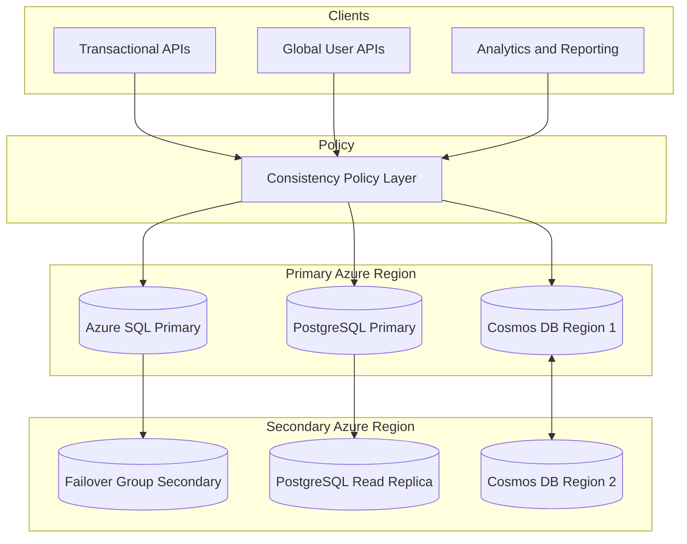
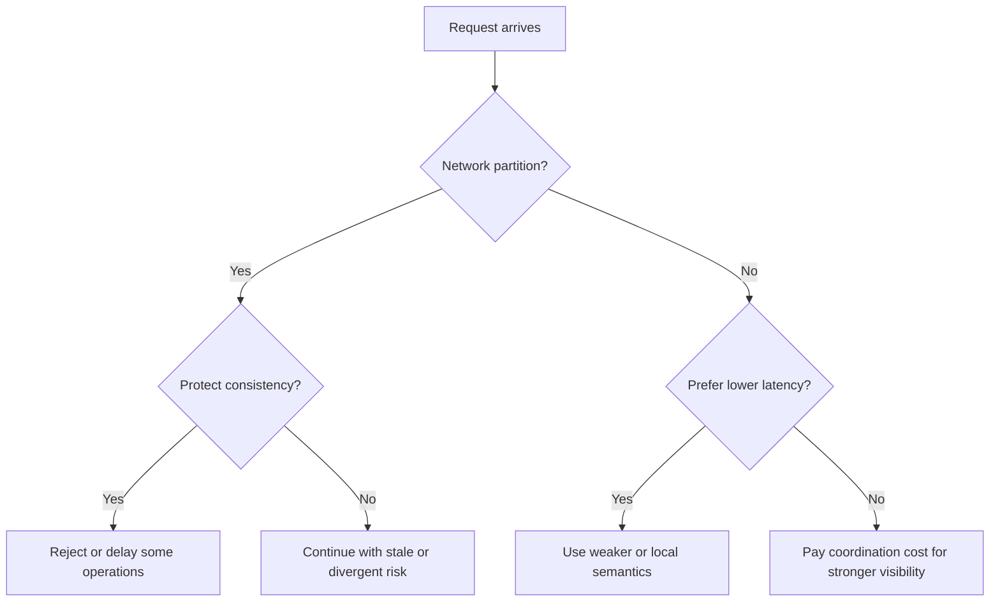
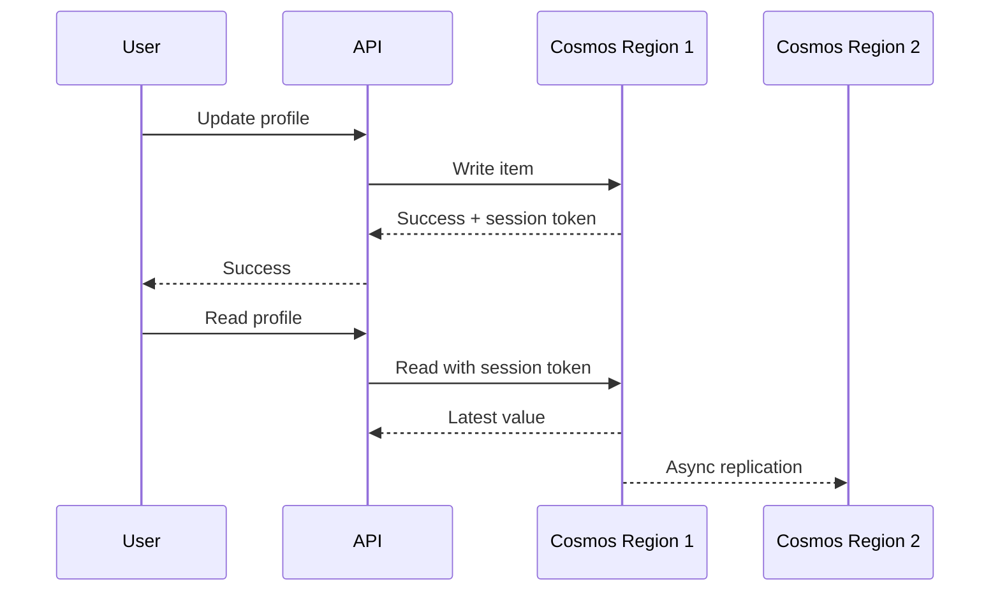
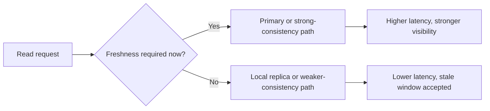

# CAP and PACELC

> Part of the **Enterprise Data & AI Architecture Handbook** · Phase-02 — Distributed Systems Deep Dive · Chapter 04.
> Estimated study time: **45 min reading + ~2h labs**.
> **Prerequisites:** read [Replication and Consistency](02_Replication_and_Consistency.md) first.

---

## Executive Summary

CAP and PACELC are not database personality tests. They are reasoning tools for answering two hard questions about distributed systems: what happens **during a network partition**, and what happens **the rest of the time**. CAP says that when a partition occurs, a system that must tolerate that partition cannot simultaneously guarantee both strong consistency and full availability for the same operation. PACELC extends that reasoning beyond failure: **if there is a Partition, choose Availability or Consistency; Else, choose Latency or Consistency**.

This chapter builds directly on [Replication and Consistency](02_Replication_and_Consistency.md#core-concepts). That chapter established the mechanics of leader-follower, multi-leader, and leaderless replication, plus the formal consistency models clients observe. CAP and PACELC are the architectural lens that helps decide which of those mechanisms is acceptable for a given business invariant. A payment authorization service, a global customer-preferences service, a lakehouse metadata catalog, and an IoT device shadow store can all use replication, but they should not all make the same CAP or PACELC trade-offs.

The most important correction this chapter makes is conceptual: **CAP does not classify a whole database as CA, CP, or AP in any useful production sense.** Partition tolerance is not optional on a real network. What matters is how a specific operation behaves under partition, which replicas are allowed to serve reads or writes, what staleness is tolerated, and what latency budget the business is willing to pay when the network is healthy. That is why Azure Cosmos DB can look CP-like under strong consistency and more AP-like under session or eventual consistency, while Azure SQL Database with a single writable primary behaves differently again. The deployment mode, region layout, and requested consistency level matter more than the vendor label.

The practical Azure-first takeaway is straightforward. Most enterprise transactional systems should prefer a single authoritative write region with explicit durability and DR posture. Most globally distributed user-facing systems should start with session-level guarantees before paying the cost of strong global reads. Most teams should avoid multi-write or leaderless designs unless they can explain conflict resolution and stale-read semantics in plain language to an incident review board. PACELC is the discipline that prevents engineers from buying global consistency they do not need, or availability they cannot safely use.

**Bottom line:** CAP is about correctness under failure. PACELC is about user experience and cost even when nothing is broken. Architects who cannot distinguish those two conversations tend to either overpay for globally strong systems or under-engineer correctness until an outage teaches the lesson the hard way.

---

## Learning Objectives

By the end of this chapter you will be able to:

1. Explain CAP precisely, including what counts as a partition and what availability and consistency mean in the theorem.
2. Explain PACELC and use it to reason about healthy-state latency versus consistency trade-offs.
3. Distinguish formal consistency models from marketing claims and from CAP shorthand.
4. Map Azure SQL, Azure Database for PostgreSQL, Azure Cosmos DB, Cassandra, Kafka, and Spanner-style systems onto CAP and PACELC correctly.
5. Evaluate tunable consistency settings without confusing configuration flexibility with free correctness.
6. Identify common CAP misconceptions in vendor material, architecture reviews, and incident narratives.
7. Choose an Azure-first design pattern whose partition behavior, latency profile, and cost align with the workload.
8. Defend when not to use multi-region strong consistency, multi-write, or leaderless quorums.

---

## Business Motivation

- CAP and PACELC prevent expensive category errors. Teams regularly buy a globally distributed database to solve a latency problem, then discover they also bought weaker conflict semantics than the business can tolerate.
- Most post-incident confusion around stale reads, failed failovers, or divergent replicas is really a missing trade-off discussion. The system did something that was predictable from its design, but the design assumptions were never made explicit.
- Latency is a business feature. A 40 to 120 ms penalty on every cross-region write or strong read compounds into real user drop-off, lower throughput, and higher cloud bills.
- Availability is not always good if it returns an unsafe answer. Allowing writes during a partition can protect revenue in one workload and corrupt revenue in another.
- Enterprise data and AI platforms increasingly mix workloads. Metadata catalogs, feature stores, billing tables, telemetry lakes, and user preference stores often live side by side, but their CAP and PACELC choices should differ.
- Clear CAP and PACELC reasoning improves vendor evaluation. It is much harder to be misled by phrases such as globally distributed and strongly consistent when the architecture team can ask exactly which operations remain available during partition and what latency cost is paid when the network is healthy.

---

## History and Evolution

- **2000 — Eric Brewer** presents the idea later popularized as the CAP theorem, framing the unavoidable tension between consistency, availability, and partition tolerance in distributed web systems.
- **2002 — Gilbert and Lynch** formalize CAP, removing the ambiguity of the original conference framing and grounding the theorem in a precise distributed-systems model.
- **2000s — NoSQL adoption** makes CAP a mainstream design conversation, but also popularizes oversimplified CA, CP, and AP badges that often obscure more than they clarify.
- **2007 — Dynamo** demonstrates that some workloads prefer availability during partition and are willing to repair or reconcile later.
- **2010 to 2012 — Daniel Abadi** introduces PACELC, correcting the industry habit of thinking about CAP only during failure and ignoring the everyday latency cost of stronger consistency.
- **2012 — Spanner** shows that strong global consistency is possible at scale, but not free. The cost is infrastructure sophistication and added coordination latency.
- **2014 to 2020 — cloud-managed databases** such as Azure SQL and Azure Cosmos DB expose concrete consistency and failover modes directly to architects, moving CAP and PACELC from theory into routine platform configuration.
- **2020 to 2026 — multi-region SaaS and AI platforms** make PACELC newly important. Teams increasingly optimize for worldwide latency in healthy conditions while still needing explicit safety rules during failure.

---

## Why This Technology Exists

- Distributed systems need a vocabulary for explaining why a service became unavailable or stale under network failure.
- Architects need a way to compare designs that look similar in diagrams but behave very differently when links fail or cross-region latency spikes.
- Cloud platforms expose knobs such as session consistency, bounded staleness, synchronous replication, multi-region writes, and read replicas. CAP and PACELC explain what those knobs are really buying.
- Product teams need to separate business invariants that require stronger coordination from convenience state that can converge later.
- FinOps and performance tuning need the else side of PACELC. Many systems pay high latency and RU or compute cost every day for consistency they only rarely need.
- Incident reviews need sharper language. Saying the database was eventually consistent is much less useful than saying the design favored local write availability under partition and accepted stale remote reads for up to N seconds.

---

## Problems It Solves

- Clarifies which guarantees are mutually incompatible during a real partition.
- Exposes the hidden healthy-state latency cost of stronger consistency.
- Helps pick between single-writer, multi-write, and leaderless topologies introduced in [Replication and Consistency](02_Replication_and_Consistency.md#core-concepts).
- Provides a framework for evaluating tunable consistency and replica-read strategies.
- Prevents common architecture-review mistakes such as labeling a whole service CA because it behaves that way when the network is healthy.
- Improves database and service selection by forcing the team to tie invariants to explicit failure behavior.
- Makes post-incident reasoning sharper by connecting observed behavior to intended design trade-offs.

---

## Problems It Cannot Solve

- CAP and PACELC do not decide business requirements for you. They only expose the consequences of those requirements.
- They do not replace formal transaction, isolation, or concurrency-control analysis.
- They do not classify every system with a single permanent badge. The same product can behave differently by operation type, region topology, and configuration.
- They do not remove the need for application-level conflict resolution when a design allows concurrent writes.
- They do not by themselves quantify cost. You still need latency budgets, RU or vCore measurements, and cross-region traffic forecasts.
- They do not prove a system is correct. A service can claim a CP posture and still fail operationally because of poor failover tooling, stale leader fencing, or unsafe replica promotion.

---

## Core Concepts

### 8.1 What CAP actually says

CAP is about the behavior of a distributed system **when a network partition happens**. In that state:

- **Consistency** means every read sees the most recent successful write, or an error if that cannot be guaranteed. In practice, this is closest to linearizable behavior for the operation in question.
- **Availability** means every request to a non-failing node receives a non-error response in finite time.
- **Partition tolerance** means the system continues operating despite messages being lost or delayed between parts of the system.

Because real networks can partition, P is not optional. The real question is whether a given operation will preserve strong consistency and reject or block some requests, or remain available and risk stale or divergent answers.

### 8.2 What CAP does not say

CAP does **not** say:

- that a database is permanently AP or CP as a brand identity,
- that you can simply pick two of C, A, and P in production,
- that eventual consistency is always faster,
- that strong consistency is impossible at scale,
- that ACID and CAP are the same discussion,
- that a system without visible partitions is CA in any meaningful distributed sense.

The practical correction is simple: use CAP to analyze an operation under partition, not to summarize a product brochure.

### 8.3 Defining partition in operational terms

A partition is any network condition that prevents required replicas or coordinators from communicating within the protocol's timing and correctness assumptions. Examples:

- a cross-region link outage,
- a zonal network failure,
- a firewall or route misconfiguration,
- packet loss or latency inflation severe enough to trigger leader loss or quorum failure.

From the system's point of view, a very slow network can be indistinguishable from a broken one. That is why healthy-state latency and failure-state correctness are linked.

### 8.4 Availability versus safe failure

Availability in CAP is often misunderstood as goodness. For some workloads, refusing a write is the safe and correct response. Examples:

- order capture may choose to queue and retry rather than accept possibly duplicate writes from both sides of a partition,
- feature flags for non-critical UI personalization may stay available with stale reads,
- a metadata catalog may reject writes during quorum loss rather than fork the control plane.

Safe unavailability is often better than unsafe success.

### 8.5 PACELC

PACELC extends CAP with an everyday question:

- **If there is a Partition, choose Availability or Consistency.**
- **Else, choose Latency or Consistency.**

This matters because many systems pay their biggest price when nothing is wrong. A globally strong write that always waits for multi-region acknowledgement may be perfectly correct and disastrously slow. A session-consistent design may deliver the same user experience for most requests at much lower latency and cost.

### 8.6 Healthy-state latency is architectural, not incidental

The else side of PACELC is where many Azure decisions live:

- Azure SQL synchronous local HA adds commit latency but buys stronger durability.
- Azure Cosmos DB strong or bounded staleness generally costs more latency and RU than session or eventual.
- PostgreSQL synchronous commit improves safety but raises p95 and p99 write latency.
- Cassandra `QUORUM` reads and writes often cost more than `LOCAL_ONE`, but with better freshness odds.

These are not tuning details. They are architectural commitments.

### 8.7 Tunable consistency in practice

Tunable consistency means the caller or deployment can choose different read or write semantics, but that flexibility is not free correctness. The system still lives somewhere on the CAP and PACELC spectrum per operation.

Examples:

- **Azure Cosmos DB:** `Strong`, `BoundedStaleness`, `Session`, `ConsistentPrefix`, `Eventual`.
- **Cassandra:** `ALL`, `QUORUM`, `LOCAL_QUORUM`, `ONE`, `LOCAL_ONE`.
- **MongoDB-like ecosystems:** read concern and write concern variants.
- **Kafka:** `acks=all` with `min.insync.replicas` trades write availability for stronger acknowledgement semantics.

Tunable consistency helps when workloads differ, but it also increases cognitive load. Teams must know which routes are allowed to trade freshness for latency.

### 8.8 Mapping real systems correctly

The right mapping pattern is not database to label. It is **deployment plus operation to behavior**.

Examples:

- A single-write-region Azure SQL Database with async failover group behaves like a design that strongly prefers consistency for authoritative writes and accepts remote lag for DR and reporting.
- Azure Cosmos DB with strong consistency and one write region leans toward consistency over availability under some partition scenarios and consistency over latency in normal operation.
- Azure Cosmos DB with multi-region writes and session consistency is willing to favor locality and availability more aggressively, but only because the application accepts weaker global visibility.
- Cassandra with `LOCAL_QUORUM` in each region can preserve local availability during inter-region issues, while accepting that global convergence is deferred.
- Kafka with `acks=all` and unclean leader election disabled sacrifices some write availability to avoid acknowledging records that might later disappear.

### 8.9 Common CAP misconceptions

Misconception table:

| Misconception | Correction |
|---|---|
| CAP means pick any two | Real systems must tolerate partitions, so the real choice is consistency or availability during partition |
| A product is either AP or CP forever | Behavior depends on deployment, operation, and consistency mode |
| Eventual consistency means broken | It can be the right choice for low-value or mergeable state |
| Strong consistency always means unusably slow | It depends on topology, scope, and latency budget |
| Multi-region writes are always superior | They are only superior if the business can handle conflicts and weaker global visibility |

### 8.10 Practical decision rule

Use this sequence:

1. Name the invariant.
2. State what the user must never observe.
3. State what can be stale, and for how long.
4. State what must remain writable during a partition.
5. State the p95 or p99 latency budget when the network is healthy.
6. Pick the weakest consistency model that still satisfies steps 1 through 4.

This is the shortest path from abstract theorem to production-safe design.

### 8.11 Azure Cosmos DB consistency-level mapping

Section 8.7 named Cosmos DB's five consistency levels. The table below makes the CAP behavior under partition, the PACELC "else" (healthy-state latency) cost, and the RU/pricing impact explicit for each, because architects repeatedly under-specify this mapping and then discover the cost only in production RU bills or an incident retrospective.

| Consistency level | Behavior under partition (CAP) | Healthy-state latency cost (PACELC else) | RU / pricing impact |
|---|---|---|---|
| **Strong** | Writes and reads block or fail rather than serve possibly-stale data; a region cut off from a synchronous quorum cannot serve strong reads/writes; multi-region writes are not available with Strong | Highest read latency of the five levels; every read may require cross-replica (and for some topologies cross-region) confirmation | Highest RU cost per read; write RU unaffected relative to other levels, but achievable throughput under load is the lowest because of confirmation overhead |
| **Bounded Staleness** | Reads may lag writes by a configured number of versions or a time interval; the system still bounds the staleness even during degraded conditions, favoring a defined consistency envelope over unconstrained availability | Lower latency than Strong because reads do not need full quorum confirmation, only confirmation within the staleness bound | RU cost is lower than Strong but higher than Session; suitable when the business needs a hard staleness SLA rather than true linearizability |
| **Session** (default) | The writing client's own session sees monotonic, read-your-write consistency; other sessions may observe staleness; favors availability and locality over global freshness during a partition | Lowest latency among the levels that still give meaningful guarantees to the writer; most production Cosmos workloads default here | Lowest RU cost among the non-eventual levels; the practical default for most OLTP-style application workloads |
| **Consistent Prefix** | Reads never see out-of-order writes (no gaps or reordering), but may lag behind the latest write by an unbounded amount during a partition; favors availability strongly while still giving an ordering guarantee | Low latency, similar to Session or lower, since no cross-replica confirmation is required beyond local ordering | Low RU cost; useful for event/feed-style reads where order matters more than recency |
| **Eventual** | No ordering or recency guarantee at all; any replica can answer immediately regardless of partition state, maximizing availability | Lowest possible latency; reads are served from the nearest replica with no coordination cost | Lowest RU cost of the five; appropriate only when the application can tolerate out-of-order or stale reads (e.g. view counters, non-critical caches) |

The architectural rule that follows directly from this table: **do not default to Strong "to be safe."** Strong is the only level that disables multi-region writes and carries the highest RU and latency cost; most enterprise OLTP workloads are correctly served by Session, with Bounded Staleness reserved for the specific case where a bounded (not unlimited) staleness SLA is a genuine business requirement.

---

## Internal Working

CAP and PACELC become real when a request arrives and the system decides whether it has enough authority to answer safely.

**Single-writer transactional system:**

1. A client sends a write to the authoritative primary.
2. The primary checks local commit rules and, if needed, synchronous replica acknowledgement.
3. If the required replicas or quorum are unreachable because of a partition, the system blocks or rejects the write rather than risking a split-brain success.
4. If the network is healthy, the system pays the latency of the chosen acknowledgement path every time.

**Multi-region configurable-consistency document store:**

1. A client writes in its local region.
2. The account's consistency mode determines whether the system must wait for wider acknowledgement or can return success sooner.
3. Session or eventual modes permit lower-latency local success and later replication.
4. Stronger modes enforce stricter visibility and may reject or delay some operations during inter-region problems.

**Leaderless quorum system:**

1. A coordinator sends the write to multiple replicas.
2. The write returns after `W` acknowledgements, according to the chosen consistency level.
3. Reads consult `R` replicas and reconcile versions.
4. During partition, the system may remain locally available if enough replicas can still satisfy the configured quorum, but freshness and global agreement depend on the topology and repair state.

The control variable in each case is the same: what does the system require before it is willing to say success. CAP explains the failure-state consequences of that rule. PACELC explains the steady-state latency consequences.

---

## Architecture



This architecture highlights a critical enterprise truth: one platform often contains several CAP and PACELC postures at once. Transactional writes, follower reads, and globally distributed user profiles should not all be forced into one consistency choice.

---

## Components

- **Write authority:** the primary, leader, or quorum rule that decides whether a write may commit.
- **Replica topology:** region placement, zone spread, replica count, and peer relationships.
- **Consistency policy layer:** caller-side or service-side choice of strong, session, bounded staleness, quorum, or stale-read mode.
- **Session context:** token, version, LSN, or causal metadata needed for read-your-writes behavior.
- **Repair path:** replay, read repair, anti-entropy, or conflict resolution that drives convergence.
- **Failover controller:** promotion logic, fencing rules, and region priority.
- **Latency budget and SLO policy:** the business constraint that decides whether PACELC should lean toward L or C.
- **Observability pipeline:** lag, quorum state, conflict counts, and stale-read diagnostics.

---

## Metadata

CAP and PACELC decisions are enforced through metadata more often than teams realize.

- **LSN or WAL position** indicates how current a replica is.
- **Epoch, term, or timeline ID** prevents stale leaders or replicas from becoming authoritative after failover.
- **Session token** lets a client ask for read-your-writes semantics in systems such as Cosmos DB.
- **Version vector or clock** helps detect concurrency and conflict instead of hiding it.
- **Consistency level** is effectively request metadata that changes system behavior.
- **Failover priority and replica health state** determine which region may be promoted and how much lag risk the enterprise is willing to accept.

Without this metadata, CAP and PACELC are theory. With it, they become enforceable runtime decisions.

---

## Storage

Storage is where healthy-state consistency choices become physical cost:

- synchronous acknowledgement waits on durable storage work at more than one place,
- asynchronous replication reduces immediate write latency but increases replay and promotion risk,
- snapshots and checkpoints define how quickly replicas can be reseeded after prolonged partition or corruption,
- compaction, vacuum, and large-transaction replay can stretch the lag window and change the effective CAP behavior seen by readers.

Storage media quality matters. A design intended to be CP under partition can degrade into repeated unavailability if disk jitter causes leadership churn or replica lag severe enough that safe promotion becomes impossible.

---

## Compute

Compute is part of PACELC because consistency logic consumes CPU:

- quorum coordination,
- session-token validation,
- conflict detection and merge,
- replay threads on replicas,
- version reconciliation on reads,
- anti-entropy and repair jobs.

Under load, compute starvation can mimic a partition. Requests time out, replicas fall behind, and the system starts making more conservative choices. That is why capacity planning and consistency design cannot be separated cleanly.

---

## Networking

Networking is the physical substrate behind both CAP and PACELC.

- CAP becomes relevant only because the network can partition.
- PACELC becomes expensive because the network has non-zero latency even when it is healthy.
- Cross-zone synchronous acknowledgement is usually acceptable for high-value workloads.
- Cross-continent strong acknowledgement is a strategic decision, not a harmless default.

Network design guidance:

- keep strong synchronous write paths as geographically tight as the business allows,
- use separate read policies for local and remote consumers,
- monitor RTT, loss, and retransmission as consistency signals, not just infrastructure metrics,
- budget cross-region egress in any design that replicates hot datasets globally.

---

## Security

Consistency choices can create security and compliance side effects:

- stale replicas can serve outdated authorization or entitlement state,
- extra regions create more jurisdictions that now hold sensitive data,
- conflict-resolution logic may accidentally preserve or resurrect values that should have been deleted,
- failover privileges become high-risk administrative actions because they can promote stale state.

Security posture should therefore include:

- strong control over who can change consistency modes,
- audit trails for forced failover and conflict overrides,
- review of replica placement against residency obligations,
- encryption and identity parity between primaries and replicas.

---

## Performance

PACELC is fundamentally a performance discussion with correctness consequences.

- Stronger consistency generally adds write or read latency because more coordination happens before success.
- Weaker consistency often reduces latency by allowing local answers or fewer acknowledgements.
- Read replicas lower primary load but can raise user-visible staleness.
- Multi-region strong modes often improve correctness at the exact cost users complain about first: p95 and p99 response time.

Azure-specific performance pattern:

- Azure SQL primary-only reads give the freshest answers but concentrate load.
- PostgreSQL replicas improve read scale but introduce a lag envelope.
- Cosmos DB session consistency frequently gives the best user-perceived balance for geographically distributed applications.
- Cosmos DB strong or bounded staleness should be reserved for data whose visibility contract truly requires it.

---

## Scalability

CAP is not a scale theorem, but PACELC absolutely affects scaling choices.

- Adding more regions expands reach and availability options but usually raises coordination cost.
- Strong global guarantees scale operational complexity faster than they scale business value for many workloads.
- Partitioning can scale data size and write throughput, but each partition still has its own consistency and partition behavior.
- Systems that lean toward local availability and eventual convergence may scale writes more comfortably, but at the cost of application merge burden.

The practical discipline is to scale the strongest guarantees only over the smallest scope that truly needs them.

---

## Fault Tolerance

Fault tolerance is where CAP stops being abstract. Under partition or replica loss:

- a consistency-first design may reject writes or reads to avoid unsafe divergence,
- an availability-first design may continue serving and reconcile later,
- a tunable system may behave differently by route, tenant, or operation class.

The architect must be explicit about:

- which errors are acceptable during partition,
- which stale answers are acceptable during partition,
- how long a lagging replica may remain a valid read source,
- what RPO is accepted if a stale secondary is force-promoted,
- how clients discover and react to degraded consistency modes.

This section is where [Replication and Consistency](02_Replication_and_Consistency.md#fault-tolerance) becomes operationally concrete. CAP tells you whether the system should stop or continue. Replication tells you what copies exist when that choice is made.

---

## Cost Optimization

The else side of PACELC is where many wasted cloud dollars live.

- Global strong consistency often increases latency, RU consumption, and sometimes region count or replica cost with no user-visible benefit.
- Read replicas that are rarely used or cannot safely serve meaningful traffic are pure spend.
- Multi-region writes create operational and merge complexity that only pays off for specific locality or availability goals.
- Cross-region synchronous acknowledgement can create large cost for small incremental correctness if the workload only needs session semantics.

Cost optimization rules:

- start from the weakest acceptable consistency contract,
- reserve strong global modes for high-value invariants,
- keep DR replicas asynchronous unless business RPO requires more,
- measure stale-read tolerance before buying stronger modes permanently.

---

## Monitoring

Monitoring should reveal both CAP-state risk and PACELC-state cost.

High-signal metrics:

- replica lag in time and log distance,
- request latency by consistency level,
- quorum or failover state changes,
- strong versus session versus eventual request mix,
- conflict count and conflict-resolution latency,
- forced failover frequency and data-loss exposure window,
- cross-region RTT and retransmission,
- stale-read incidents or freshness-SLI breaches.

Azure examples:

- **Azure SQL:** failover-group health, log send queue, redo backlog, read-replica latency.
- **PostgreSQL Flexible Server:** `write_lag`, `flush_lag`, `replay_lag`, replica query saturation.
- **Cosmos DB:** regional replication latency, conflict metrics, request charge by consistency, failover state.

---

## Observability

Observability is how you explain a stale read with evidence instead of opinion.

- log which region answered the request,
- record the consistency level requested,
- attach session-token or version context where applicable,
- trace whether the read came from a primary, local replica, or remote replica,
- log any fallback from strong to weaker modes, if such degradation is allowed,
- run synthetic probes that verify read-your-writes and freshness-SLIs end to end.

The highest-value trace enrichment is usually simple: region, replica role, consistency mode, and version metadata.

---

## Governance

CAP and PACELC should be governed explicitly because teams otherwise drift toward unsafe defaults.

- require ADRs for production data stores that name partition behavior and healthy-state latency posture,
- publish which classes of workload may use eventual, session, bounded-staleness, or strong semantics,
- require approval for multi-region multi-write in regulated or revenue-critical systems,
- define who may change failover mode, consistency level, or replica-read policy,
- validate that data-residency reviews include all replicas and failover targets,
- ensure incident reviews include whether observed behavior matched the declared CAP and PACELC posture.

Governance is especially important in large enterprises because different product teams will otherwise use the same database service in mutually incompatible ways.

---

## Trade-offs

Every CAP and PACELC decision trades one or more of the following:

- correctness under partition,
- request latency in healthy conditions,
- user experience during regional impairment,
- write locality,
- operational complexity,
- cloud cost.

Trade-off matrix:

| Choice | Benefit | Cost |
|---|---|---|
| Stronger consistency | fresher and more predictable reads | more coordination latency, lower failure-time availability |
| Weaker consistency | lower latency and more locality | stale or divergent observations |
| Single writer | simple invariants and auditing | cross-region write latency for distant users |
| Multi-write | local write latency and broader write availability | conflict resolution and harder incident analysis |
| Follower reads | read scale and offload | freshness envelope and routing complexity |

The most common mistake is paying the cost of the left column while only needing the benefit of a weaker option.

---

## Decision Matrix

| Requirement | Recommended Posture | CAP View | PACELC View | Why |
|---|---|---|---|---|
| Financial ledger, settlement, or order booking | single writer, strong authoritative reads, async DR only | prefer consistency during partition | prefer consistency over latency for writes in the authoritative region | invariants are not mergeable |
| Global user preferences or profile metadata | session consistency, optional multi-region reads and writes | accept weaker global visibility to stay available locally | prefer latency over stronger global consistency | users mostly need their own latest view |
| Low-value personalization cache | eventual or consistent-prefix style reads | availability is usually more valuable than strict recency | prefer latency | stale data is acceptable |
| Geo-distributed collaboration state with commutative updates | multi-write plus CRDT or merge logic | availability can be favored because convergence is defined | prefer latency and locality | operations are mergeable |
| Analytics read offload from OLTP | replica reads with explicit freshness contract | primary remains authoritative | prefer latency for non-critical reads | read scale matters more than exact recency |

**ADR Example — Global Customer Profile Service**

- **Context:** A global SaaS product serves users from West Europe, East US, and Southeast Asia. Users expect immediate read-your-writes for their own profile changes, but the business accepts that another region may observe the change seconds later. Cross-region p95 latency must stay below 120 ms.
- **Decision:** Use Azure Cosmos DB with session consistency and multi-region replication. Propagate session tokens end to end through the API tier. Do not enable strong consistency globally.
- **Consequences:** Users get local read-your-writes with lower latency and lower RU cost than strong consistency. Remote readers may temporarily observe stale data. Conflict rules must remain simple and deterministic.
- **Alternatives Considered:** Global strong consistency, single-write-region Azure SQL with remote reads, and a leaderless open-source store. Rejected because they either overspend latency budget or increase operational and merge complexity beyond what the workload needs.

---

## Design Patterns

- **Single authoritative writer with replica-read allowlist:** only explicitly stale-tolerant routes may hit replicas.
- **Session-token propagation:** preserve user-centric freshness without buying global strong reads.
- **Bounded-staleness reporting:** define and monitor the maximum acceptable lag for analytical or dashboard reads.
- **Local-write global-converge pattern:** use multi-region writes only for mergeable or low-value state.
- **Consistency by route class:** payment, entitlement, and provisioning APIs use stronger modes than personalization APIs.
- **Conflict-safe data modeling:** represent updates as commutative operations where possible.
- **Fail closed for critical writes:** if safe consistency cannot be proven during partition, reject instead of guess.

---

## Anti-patterns

- Calling a distributed database CA because partitions are rare in your environment.
- Enabling multi-region writes without a documented merge rule.
- Serving all reads from replicas and hoping user complaints stay low.
- Using last-writer-wins for business state that cannot safely lose updates.
- Treating consistency level as an infra-only decision rather than a product behavior decision.
- Paying for globally strong semantics for telemetry, personalization, or cache-like data that does not need them.
- Assuming a vendor's managed failover automatically matches your RPO and correctness needs.

---

## Common Mistakes

- Confusing CAP consistency with ACID consistency.
- Ignoring the else side of PACELC and focusing only on failure-time behavior.
- Treating a whole database product as AP or CP without specifying operation and deployment mode.
- Forgetting that network latency spikes can behave like temporary partitions.
- Not tracing which consistency mode a request actually used.
- Assuming session consistency is global consistency.
- Assuming strong consistency is required because stale reads once caused an incident, without identifying whether session or bounded staleness would have solved it more cheaply.

---

## Best Practices

- Tie every consistency choice to a named business invariant.
- Use CAP to reason about partition behavior and PACELC to reason about normal-state latency.
- Keep authoritative writes region-local unless the business explicitly requires broader synchronous scope.
- Choose the weakest semantics that still satisfy correctness.
- Make replica-read policies explicit per route or workload class.
- Measure latency and staleness continuously rather than assuming the design still behaves as intended.
- Document conflict resolution as application logic, not incidental implementation detail.
- Rehearse failover so the declared CAP posture matches real operator behavior.

---

## Enterprise Recommendations

1. Standardize on three enterprise defaults: strong single-writer transactional systems, session-consistent global user-state systems, and explicitly stale-tolerant replica-read systems.
2. Require architectural review for any proposal that introduces multi-write, leaderless quorum semantics, or strong global consistency across continents.
3. Publish an internal CAP and PACELC decision guide with approved examples for Azure SQL, PostgreSQL, Cosmos DB, Kafka, and Cassandra-like systems.
4. Make freshness and latency SLOs part of product contracts, not only platform dashboards.
5. Keep cost review attached to consistency review. Stronger semantics should always have an explicit business sponsor.
6. Teach teams to say what happens during partition and what happens the rest of the time. If they cannot answer both, the design is not ready.

---

## Azure Implementation

### 31.1 Azure service mapping

The correct Azure mapping is workload first, then service and mode.

| Azure pattern | Typical CAP posture under partition | Typical PACELC healthy-state posture | Best fit |
|---|---|---|---|
| Azure SQL Database Business Critical primary with async failover group | prefer consistency for authoritative writes, accept remote unavailability or stale DR copy | consistency for primary writes, latency for remote reporting through async replica | orders, billing, regulated OLTP |
| Azure Database for PostgreSQL Flexible Server with zone HA and async replica | prefer consistency on the primary, async lag on readers and DR | consistency for primary commit, latency for follower reads | SaaS OLTP, metadata services |
| Cosmos DB strong consistency, single write region | stronger consistency, lower availability for some partition scenarios | consistency over latency | high-value globally read data with strict freshness needs |
| Cosmos DB session consistency, multi-region replication | more local availability and locality | latency over stronger global consistency | user profiles, preferences, device state |
| Cosmos DB eventual or consistent prefix | local availability and low latency favored strongly | latency over consistency | caches, feeds, low-risk state |

The point is not to stamp the product with one label. The point is to state how the configured deployment behaves.

### 31.2 Azure SQL Database and SQL Managed Instance

For transactional workloads, the dominant Azure posture is single-writer with explicit DR.

Recommended baseline:

- `BusinessCritical` or equivalent high-availability tier,
- zone redundancy in the primary region,
- failover group to a secondary region for DR,
- primary-only reads for correctness-sensitive operations,
- readable secondaries only for stale-tolerant workloads.

Azure CLI example:

```bash
az sql failover-group create --name fg-core-orders --resource-group rg-data-prod --server sql-we-prod --partner-server sql-ne-prod --add-db ordersdb --failover-policy Automatic --grace-period 1
```

Interpretation:

- during a cross-region problem, the primary remains authoritative unless failover is invoked,
- the secondary is a DR and reporting asset, not a magical zero-RPO twin,
- this design is consistency-oriented for core writes and latency-oriented only where replica reads are explicitly allowed.

### 31.3 Azure Database for PostgreSQL Flexible Server

PostgreSQL Flexible Server fits many platform and SaaS workloads that want open relational behavior with managed HA.

Provisioning example:

```bash
az postgres flexible-server create --resource-group rg-platform-prod --name pg-core-we --location westeurope --tier GeneralPurpose --sku-name Standard_D4ds_v5 --storage-size 256 --high-availability ZoneRedundant

az postgres flexible-server replica create --resource-group rg-platform-prod --name pg-core-ne --source-server pg-core-we --location northeurope
```

Operational reading:

- the primary is the authority for strong post-write reads,
- the replica is for read scale or DR, with explicit lag risk,
- PACELC shows up as lower-latency follower reads versus stronger primary freshness.

Freshness query:

```sql
SELECT application_name, sync_state, write_lag, flush_lag, replay_lag
FROM pg_stat_replication;
```

### 31.4 Azure Cosmos DB

Cosmos DB is where CAP and PACELC become most visible to application teams because the consistency mode is explicit.

Provisioning example for a session-consistent global service:

```bash
az cosmosdb create --name cos-userstate-prod --resource-group rg-data-prod --kind GlobalDocumentDB --default-consistency-level Session --enable-multiple-write-locations true --locations regionName=westeurope failoverPriority=0 isZoneRedundant=True --locations regionName=northeurope failoverPriority=1 isZoneRedundant=True --locations regionName=eastus failoverPriority=2 isZoneRedundant=True
```

Provisioning example for a strong-consistency single-write-region workload:

```bash
az cosmosdb create --name cos-reference-prod --resource-group rg-data-prod --kind GlobalDocumentDB --default-consistency-level Strong --enable-multiple-write-locations false --locations regionName=westeurope failoverPriority=0 isZoneRedundant=True --locations regionName=northeurope failoverPriority=1 isZoneRedundant=True
```

Bicep example:

```bicep
resource cosmos 'Microsoft.DocumentDB/databaseAccounts@2024-05-15' = {
  name: 'cos-userstate-prod'
  location: 'westeurope'
  kind: 'GlobalDocumentDB'
  properties: {
    enableMultipleWriteLocations: true
    locations: [
      {
        locationName: 'westeurope'
        failoverPriority: 0
        isZoneRedundant: true
      }
      {
        locationName: 'northeurope'
        failoverPriority: 1
        isZoneRedundant: true
      }
    ]
    consistencyPolicy: {
      defaultConsistencyLevel: 'Session'
    }
  }
}
```

Azure-specific guidance:

- start with `Session` for globally distributed user-facing workloads,
- choose `Strong` only when the business explicitly needs linearizable cross-region visibility,
- use `BoundedStaleness` when the workload can define a concrete lag budget,
- propagate session tokens end to end or the user will not actually get read-your-writes,
- remember that stronger consistency usually means higher RU and latency cost.

### 31.5 CAP and PACELC review checklist for Azure

Before approving an Azure data service design, ask:

1. Which region is authoritative for critical writes?
2. What happens if that region is isolated from the others?
3. Which APIs may read from stale replicas?
4. What is the worst-case stale window in seconds or versions?
5. What is the p95 write latency cost of the chosen consistency mode?
6. What extra RU, vCore, or cross-region egress cost does the design incur?

---

## Open Source Implementation

### 32.1 PostgreSQL

PostgreSQL illustrates PACELC well because the trade-off is explicit in configuration.

Example:

```conf
synchronous_commit = remote_write
```

This leans toward consistency and durability at the cost of higher write latency. Removing synchronous standby requirements leans toward lower latency and better short-term availability at the cost of larger promotion risk.

### 32.2 Cassandra

Cassandra shows that tunable consistency is operationally powerful but cognitively expensive.

Examples:

```sql
CONSISTENCY LOCAL_QUORUM;
SELECT * FROM customer_profile WHERE customer_id = 'c-123';

CONSISTENCY LOCAL_ONE;
SELECT * FROM customer_profile WHERE customer_id = 'c-123';
```

`LOCAL_QUORUM` leans toward fresher reads within the region. `LOCAL_ONE` leans strongly toward latency and availability. Neither setting changes the need for repair, version handling, and clear business tolerance for staleness.

### 32.3 Kafka

Kafka is a useful CAP and PACELC example because broker settings directly express the trade-off.

```properties
acks=all
min.insync.replicas=2
unclean.leader.election.enable=false
```

This configuration prefers acknowledged-write safety over maximal availability. Producers may receive errors when the ISR is too small, but acknowledged records are less likely to disappear after failover.

### 32.4 etcd and ZooKeeper-style systems

Control-plane systems such as etcd and ZooKeeper are intentionally consistency-first. They are the wrong place to optimize for latency or availability if doing so would risk split-brain metadata. Their lesson is useful even for data-plane systems: some domains should prefer safe unavailability over unsafe success.

---

## AWS Equivalent (comparison only)

| Azure pattern | AWS equivalent | Advantages | Disadvantages | Selection and migration note |
|---|---|---|---|---|
| Azure SQL failover group | Aurora Global Database or RDS cross-region replicas | mature managed relational replication | async cross-region still implies non-zero RPO and replica lag | map failover behavior and reader freshness explicitly |
| PostgreSQL Flexible Server plus replica | RDS for PostgreSQL or Aurora PostgreSQL | familiar relational posture | different failover and read-routing semantics | keep application freshness assumptions outside engine-specific code |
| Cosmos DB session or strong consistency | DynamoDB global tables or a stronger transactional service depending workload | low-ops global distribution | global tables favor eventual convergence and different conflict semantics | session-token-based designs need explicit redesign |
| Cosmos DB bounded staleness use cases | DynamoDB plus app-level controls | flexible and scalable | bounded-staleness semantics are not a direct one-to-one mapping | migrate by contract, not by feature-name similarity |

---

## GCP Equivalent (comparison only)

| Azure pattern | GCP equivalent | Advantages | Disadvantages | Selection and migration note |
|---|---|---|---|---|
| Azure SQL failover group | Cloud SQL replicas or Spanner depending strength needs | Cloud SQL is simple, Spanner offers strong global semantics | Cloud SQL remains async; Spanner is a very different cost and data model decision | decide whether the migration is relational DR or global strong consistency |
| PostgreSQL Flexible Server plus replica | Cloud SQL for PostgreSQL | familiar operational model | still requires explicit lag and read-policy handling | maintain clear route-level freshness rules |
| Cosmos DB session consistency | Firestore multi-region or Spanner depending access pattern | globally distributed managed services | semantics differ substantially from Cosmos session behavior | test client-visible freshness assumptions before cutover |
| Cosmos DB strong consistency | Spanner | strong global reads and writes possible | latency and cost profile are materially different | validate that the workload truly needs globally strong semantics |

---

## Migration Considerations

CAP and PACELC migrations fail when teams move data without moving assumptions.

1. Inventory the current contract. Which APIs rely on primary-only reads, session tokens, or stale-tolerant replicas?
2. Measure real p95 latency and stale windows before changing modes.
3. Preserve version and session metadata if the application depends on it.
4. Test degraded modes. The migration is not real until forced failover and partition-style drills are rehearsed.
5. Separate topology migration from semantic migration. Moving from one write region to multi-write is a business-logic change, not only an infra change.
6. Shadow-read and compare freshness where possible.
7. Review conflict resolution as code, not configuration.

Migration principle: change the weakest possible part of the stack first. If session consistency solves the user problem, do not jump directly to global strong consistency or leaderless rewrite complexity.

---

## Mermaid Architecture Diagrams

### CAP decision path



### Session-consistency read-your-writes flow



### Strong versus replica-read choice



---

## End-to-End Data Flow

Consider an enterprise platform with two data domains:

1. The order service writes to Azure SQL in West Europe as the only authoritative writer.
2. The customer-profile service writes to Cosmos DB using session consistency in the nearest region.
3. An order submission API always reads back from the primary before confirming status to the user.
4. A profile update API returns the Cosmos session token and passes it through downstream API hops.
5. Reporting dashboards read from SQL read replicas and accept lag.
6. Global profile reads in another region may be briefly stale unless they carry the user's session context.
7. During a cross-region partition, order writes may remain limited to the primary authority while some secondary reads or DR promotion paths are constrained.
8. During the same event, profile updates can often continue locally because the chosen consistency mode accepts later convergence rather than global immediate visibility.
9. Monitoring correlates lag, latency, and consistency mode so operators know whether the observed behavior matches the intended CAP and PACELC posture.

This is the enterprise norm: multiple consistency strategies coexisting, each attached to a specific invariant and latency budget.

---

## Real-world Business Use Cases

- Regulated financial transaction systems that must prefer correctness over partition-time availability.
- Global customer preferences, personalization, and session-like state where local freshness for the acting user matters more than immediate remote visibility.
- Analytics dashboards that can trade freshness for lower load on the OLTP primary.
- Collaborative or edge-synced systems where writes must continue locally and later merge.
- Platform metadata catalogs or control-plane stores that must reject unsafe writes during quorum loss.

---

## Industry Examples

- **Banking:** card authorization and ledger updates usually prefer consistency and controlled failover over locally available divergent writes.
- **Retail:** product-catalog browsing and personalization often favor latency and availability more than order-state mutation does.
- **Telecommunications:** device-shadow or subscriber preference systems frequently use session-like or bounded-staleness behavior for regional responsiveness.
- **Gaming:** player presence and cosmetic state may be AP-leaning, while purchase entitlements remain consistency-first.
- **Industrial IoT:** telemetry ingestion can be availability-first, but command and control metadata is typically consistency-first.

---

## Case Studies

### Dynamo and shopping-cart availability

Amazon Dynamo became the canonical demonstration that some workloads should remain writable during partial failure, even if that means later reconciliation. The lesson is not that AP is superior. The lesson is that shopping-cart-like state can often survive merge logic better than payment or inventory systems can.

### GitHub's public MySQL replication lessons

Public writeups around GitHub's 2018 incident and broader MySQL asynchronous replication operations illustrate a recurring enterprise truth: async replicas are operationally valuable, but they do not erase lag. In CAP and PACELC terms, the design buys lower steady-state latency and practical DR flexibility at the cost of a real promotion-time data-loss window.

### Cosmos DB configurable consistency in global applications

Cosmos DB operationalizes PACELC as an application-facing choice. Enterprises that select `Session` for user-facing regional APIs often achieve the right balance of latency, cost, and user experience. Teams that default to `Strong` without proving the invariant frequently discover they paid higher latency and RU for no meaningful product benefit.

---

## Hands-on Labs

### Lab 1: Cosmos DB consistency comparison

Goal: compare `Strong`, `BoundedStaleness`, and `Session` for latency, cost, and visible freshness.

Steps:

1. Provision one multi-region Cosmos DB account with `Session` and one with `Strong`.
2. Write and immediately read items from different regions.
3. Repeat with and without session-token propagation.
4. Measure request latency and RU.

Expected outcome: understand what the else side of PACELC costs in Azure.

### Lab 2: PostgreSQL primary versus replica reads

Goal: observe how follower reads trade latency and freshness.

Steps:

1. Create one primary and one read replica.
2. Perform writes on the primary and immediate reads from both primary and replica.
3. Measure `replay_lag` under normal load and under heavy reporting load.
4. Document which API classes could safely use the replica.

Expected outcome: turn an abstract stale-read conversation into an explicit route policy.

### Lab 3: Cassandra consistency-level drill

Goal: compare `LOCAL_ONE`, `LOCAL_QUORUM`, and `ALL` under node or link impairment.

Steps:

1. Stand up a small multi-node cluster.
2. Write and read the same key at different consistency levels.
3. Simulate node loss or delayed network links.
4. Observe which requests continue and which become stale or fail.

Expected outcome: understand why tunable consistency is power plus responsibility.

### Lab 4: CAP misconception review

Goal: take three vendor architecture diagrams and rewrite them using correct CAP and PACELC language.

Expected outcome: improve architecture-review rigor by removing hand-wavy labels.

---

## Exercises

1. Explain why calling a distributed database CA is usually not useful.
2. Give one workload where safe unavailability is better than stale availability.
3. Map Azure SQL failover groups to CAP and PACELC using exact write and read behavior.
4. Compare `Session` and `Strong` consistency in Cosmos DB for a user-profile service.
5. Show a case where eventual consistency is the correct choice.
6. Describe a workload where PACELC matters much more than CAP day to day.
7. Explain why a partition can look like a latency problem before it looks like an outage.
8. Write an ADR choosing between replica reads and primary-only reads for a dashboard tied to financial data.

---

## Mini Projects

1. Build a consistency-policy gateway that routes requests to a primary, replica, or Cosmos consistency mode based on a freshness header.
2. Build a CAP and PACELC review worksheet for new platform services, including invariants, partition behavior, and latency budget.
3. Build a synthetic probe suite that verifies read-your-writes, stale-window SLOs, and failover safety across Azure SQL, PostgreSQL, and Cosmos DB.

---

## Capstone Integration

At capstone level, CAP and PACELC are how you keep a multi-service platform coherent:

- billing and entitlement state stays consistency-first,
- metadata catalogs and deployment control paths fail safe rather than fork state,
- user preferences and similar low-risk global state often use session-like semantics,
- analytics and reporting explicitly consume stale-tolerant replicas,
- all of it sits on top of the replication strategies described in [Replication and Consistency](02_Replication_and_Consistency.md#azure-implementation).

The platform quality bar is not uniform strong consistency everywhere. It is deliberate, workload-specific trade-offs that are visible to both engineers and operators.

---

## Interview Questions

1. What does CAP actually say, and what does it not say?
   **A:** CAP says a distributed system can provide at most two of Consistency, Availability, and Partition tolerance simultaneously during an actual network partition; it does not say a whole database must be permanently classified as CP or AP — real systems make this trade-off per operation, per configuration, and only while a partition is actually occurring.
2. Why is partition tolerance not really optional in a distributed system?
   **A:** Any system spanning more than one machine over a real network will eventually experience message loss or delay indistinguishable from a partition, so a system that "chooses not to tolerate partitions" simply fails or behaves undefined when one occurs — P isn't a design choice, it's a fact of operating over a network, leaving only the C-vs-A choice to actually make.
3. What is the difference between CAP and PACELC?
   **A:** CAP only describes behavior during a partition (Consistency vs. Availability); PACELC extends this by noting that even absent a partition ("Else"), a system must still choose between Latency and Consistency, since strong consistency requires synchronous cross-replica coordination — PACELC is the more complete lens because most operational time is spent without an active partition.
4. Why is availability not always the right answer during partition?
   **A:** For workloads with a hard business invariant that must never be violated (an account balance, an inventory count), serving a request that might violate that invariant is worse than refusing it — availability-first only makes sense when the business would rather risk stale/conflicting data than refuse service.
5. How would you explain session consistency to a product manager?
   **A:** You'll always see your own actions reflected immediately (if you post a comment, you'll see it when you refresh), but you might briefly not see someone else's very recent action — it's a middle ground between "everyone sees everything instantly" (expensive) and "no guarantees at all" (cheap but confusing).
6. Why is it incorrect to stamp a whole product AP or CP without context?
   **A:** Behavior varies by operation, configuration, and even by API call within the same product — e.g., Cosmos DB can look CP-like under Strong consistency and AP-like under Eventual, so a single label hides the actual, operation-level trade-off that matters for a specific decision.
7. What is the healthy-state trade-off in PACELC for a synchronous replica design?
   **A:** A synchronous replication design pays a latency cost on every write (waiting for replica acknowledgment) even when the network is perfectly healthy and no partition is occurring, in exchange for stronger consistency guarantees — that's the "Else, Latency vs. Consistency" branch PACELC captures that CAP alone misses.
8. When is eventual consistency the right business choice?
   **A:** When the cost of occasionally showing slightly stale data is low relative to the value of low latency and high availability — social feeds, product catalogs, and non-critical dashboards are typical cases where eventual consistency is the right, deliberate choice rather than a compromise.
9. How do replica reads relate to PACELC?
   **A:** Serving a read from a nearby replica trades consistency (the replica may lag the primary) for lower latency — this is a direct, everyday instance of PACELC's "Else" branch, made explicitly every time an application chooses a replica-read path over a primary-read path.
10. Why do strong global semantics usually cost more latency and money?
    **A:** Strong consistency across regions requires synchronous cross-region coordination (extra round trips) and often more request-unit or compute cost to achieve; weaker consistency avoids that cross-region synchronization, which is why it's cheaper and faster but offers a weaker guarantee.

---

## Staff Engineer Questions

1. How would you prove that a proposed replica-read path is safe for a given API route?
   **A:** Identify whether the route's business logic depends on reading the absolute latest write (e.g., a balance check before a debit) versus tolerating some staleness (a product listing), and if staleness is tolerable, validate the actual measured replication lag stays within the documented, business-approved bound under realistic load.
2. How would you instrument a service so operators can distinguish stale-read incidents from application bugs?
   **A:** Emit the replication lag or consistency-level metadata alongside every read in logs/traces, so an incident investigation can immediately check whether a "wrong data" report correlates with an actual lag spike (a consistency issue) versus occurring with zero measured lag (an application logic bug).
3. What rollout strategy would you use to change a service from primary-only reads to session-consistent regional reads?
   **A:** Roll out behind a feature flag to a small percentage of low-risk traffic first, with dashboards comparing observed staleness against the documented bound, and expand gradually only once the session-token propagation and staleness behavior are verified in production under real traffic patterns.
4. Under what conditions would you approve multi-region writes for a customer-facing workload?
   **A:** Only when the team has a documented, tested conflict-resolution strategy and a measured real-world conflict rate from a shadow-write period showing the resolution strategy behaves acceptably — approving it on the promise of lower latency alone, without validated conflict handling, is how split-brain data-corruption incidents happen.
5. How would you keep route-level consistency choices from becoming unmaintainable across dozens of microservices?
   **A:** Publish a small, governed catalog of approved consistency patterns (primary-only, session-consistent, explicitly-stale-tolerant) as reusable platform library defaults, so route-level choices are selections from a governed menu rather than ad hoc, undocumented decisions made independently by each team.
6. What test plan would you use to validate that a claimed CP posture really fences unsafe failover behavior?
   **A:** Simulate an actual network partition in a test environment and verify the system refuses or queues writes it can't safely guarantee, rather than silently accepting them from both sides of the partition — a CP claim untested under a real simulated partition is unverified.

---

## Architect Questions

1. Which enterprise workloads should standardize on session consistency versus strong consistency on Azure?
   **A:** Standardize session consistency for user-facing, per-user state (profiles, carts, preferences) where read-your-writes matters but global ordering doesn't; reserve strong consistency for the narrow set of workloads with a hard cross-user invariant (inventory, financial ledgers) where the latency/cost premium is explicitly justified.
2. How should the architecture review board evaluate a proposal for global multi-write state?
   **A:** Require the proposal to include a documented conflict-resolution strategy, a measured or estimated conflict rate, and an explicit statement of what business invariant (if any) could be violated by a conflict — approve only when these are addressed, not simply because multi-write reduces latency.
3. What policy should govern stale-tolerant replica reads across product teams?
   **A:** A policy requiring any stale-tolerant read path to document its accepted staleness bound and business justification in a discoverable, reviewed location (not buried in code comments), so the organization has visibility into where staleness is deliberately accepted platform-wide.
4. How do data residency and sovereignty obligations constrain replica placement and acceptable failover behavior?
   **A:** Regulated data's writable replica and any replica eligible for promotion during failover must stay within approved jurisdictions, which can rule out certain low-latency multi-region topologies entirely regardless of their consistency/PACELC benefits — residency constraints take precedence over pure performance optimization.
5. Where should CAP and PACELC decisions live: in platform defaults, in application code, or both?
   **A:** Platform defaults should encode the safe, common-case choice (e.g., session consistency as the default Cosmos DB setting), while application code should be able to explicitly and visibly override the default only with a documented justification — leaving the decision entirely to unreviewed application code invites inconsistent, ad hoc choices across teams.
6. How do you keep PACELC cost trade-offs visible in portfolio-level cloud governance?
   **A:** Require FinOps reporting to break out the cost delta attributable to consistency-level choice (e.g., RU premium for Strong vs. Session consistency) as its own line item, so portfolio-level reviews can see and question the cost of consistency choices rather than it being buried in aggregate database spend.

---

## CTO Review Questions

1. Which systems are currently paying for stronger consistency than the business actually needs?
   **A:** This requires an audit correlating each system's configured consistency level against its actual business requirement — systems defaulted to Strong consistency "to be safe" without a genuine cross-user invariant requirement are paying an ongoing, avoidable latency and cost tax.
2. Which revenue-critical systems still lack an explicit partition-time behavior policy?
   **A:** Any revenue-critical system without a documented answer to "what happens during a network partition" is running on an unexamined default, which is a risk that should be surfaced and closed before it's discovered during an actual partition event.
3. What is the enterprise standard for multi-region writes and who can approve exceptions?
   **A:** There should be a default-off, architecture-review-gated policy for multi-region writes given the conflict-resolution complexity involved, with a named approver (architecture review board) for exceptions — without this, multi-write adoption happens ad hoc and its aggregate risk is invisible to leadership.
4. How much cloud spend is attributable to stronger consistency modes, extra replicas, and cross-region coordination?
   **A:** This should be a quantified, tracked FinOps figure, not an estimate — without it, leadership can't evaluate whether the business value of stronger consistency actually justifies its ongoing cost premium.
5. Which user journeys rely on stale-tolerant data today, and is that tolerance documented?
   **A:** This requires an inventory of stale-tolerant read paths against their documented staleness bounds — an undocumented tolerance is a hidden risk that can silently worsen (lag growing beyond what was ever validated) without anyone noticing until a user complaint surfaces it.
6. If a major inter-region partition happened now, which platforms would fail safe and which would continue with reconciliation risk?
   **A:** This is only answerable with an actual partition-simulation exercise per critical platform — without testing, the honest answer is "unknown," which is itself the risk that needs to be closed via a chaos-engineering-style validation program.

---

## References

- Brewer, Eric — original CAP framing and later commentary.
- Gilbert, Seth and Lynch, Nancy — formal proof and definition of CAP trade-offs.
- Abadi, Daniel — PACELC and consistency trade-off analysis.
- DeCandia et al. — *Dynamo: Amazon's Highly Available Key-value Store*.
- Corbett et al. — *Spanner: Google's Globally-Distributed Database*.
- Kleppmann, Martin — *Designing Data-Intensive Applications*.
- Microsoft documentation for Azure SQL failover groups, Azure Database for PostgreSQL Flexible Server, and Azure Cosmos DB consistency levels.
- Apache Cassandra and Kafka documentation on consistency, replication, and durability settings.

## Further Reading

- Re-read [Replication and Consistency](02_Replication_and_Consistency.md), especially the sections on consistency models, quorum behavior, and Azure implementation choices.
- Study Jepsen-style analyses of distributed databases to see how stated semantics behave under real failure.
- Review public postmortems involving replica lag, forced failover, and global conflict storms with CAP and PACELC vocabulary in mind.
- Compare strong, bounded-staleness, session, and eventual user experience using concrete traces rather than vendor summaries.