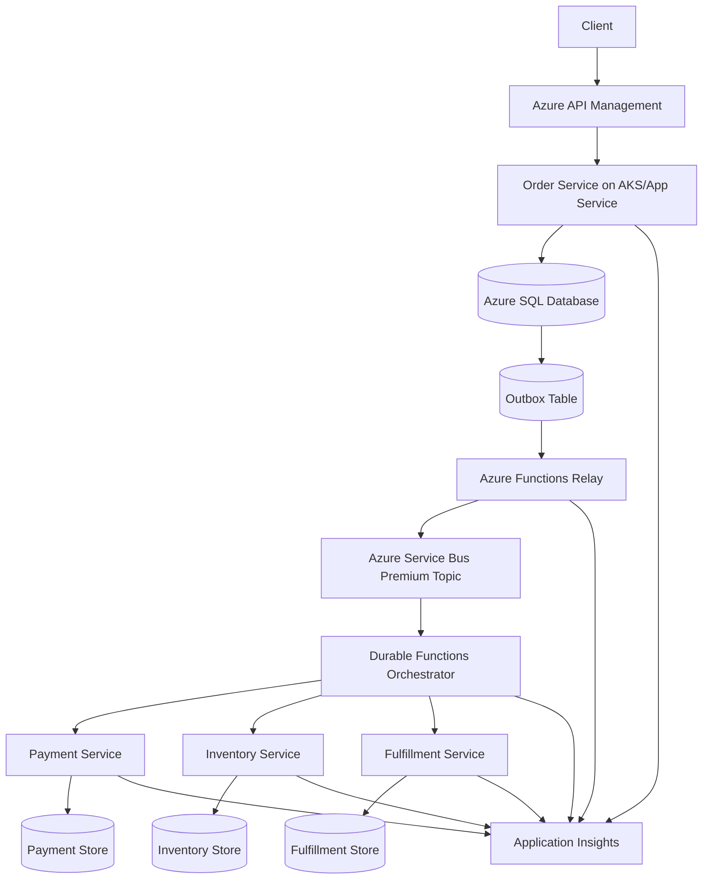
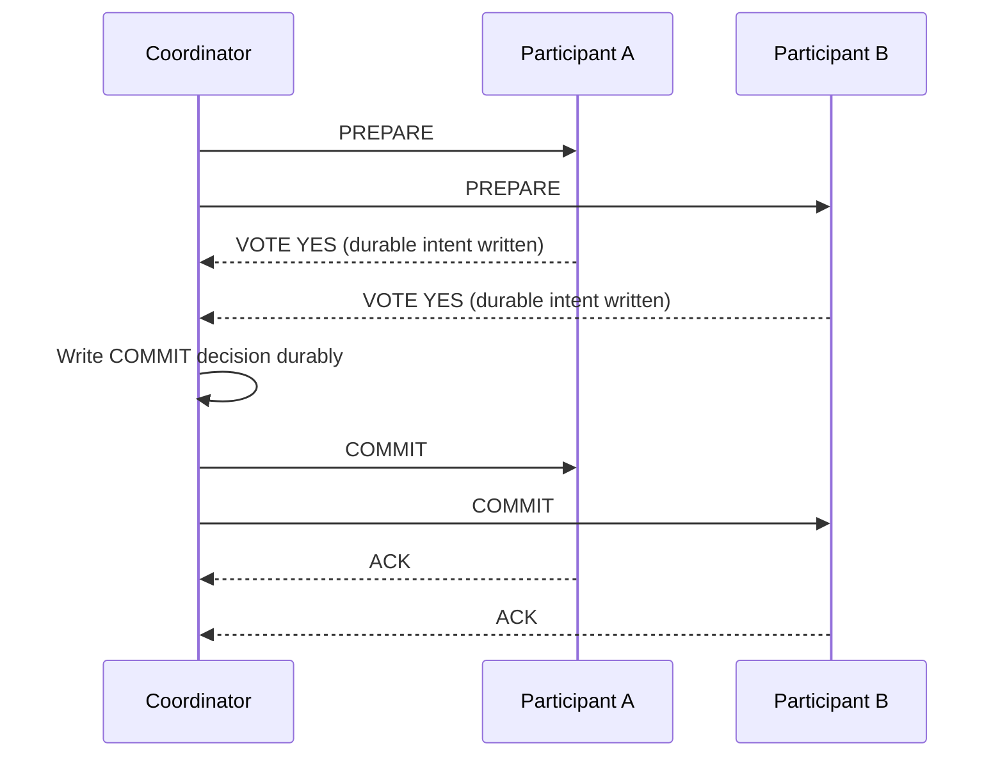
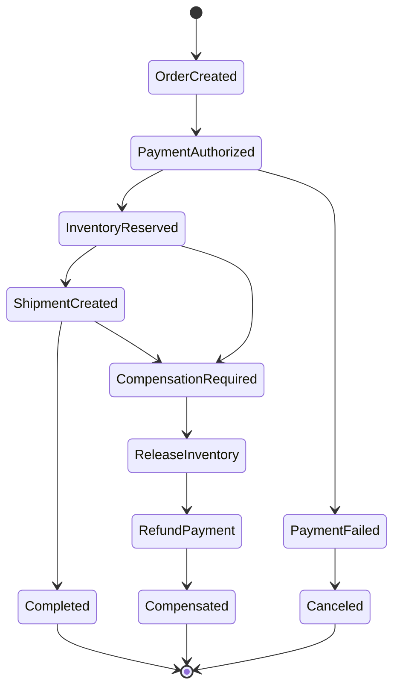

# Distributed Transactions

> Part of the **Enterprise Data & AI Architecture Handbook** · Phase-02 — Distributed Systems Deep Dive · Chapter 05.
> Estimated study time: **75 min reading + ~5h labs**.
> **Prerequisites:** read [Consensus and Coordination](01_Consensus_and_Coordination.md), [Replication and Consistency](02_Replication_and_Consistency.md), [Partitioning and Sharding](03_Partitioning_and_Sharding.md), and [CAP and PACELC](04_CAP_and_PACELC.md) first.

---

## Executive Summary

Distributed transactions exist because real businesses need invariants that span more than one component: charge the card exactly once, allocate inventory only when payment is authorized, publish an order event only after the source of truth is durable, and keep audit trails correct even when nodes crash or networks stall. Inside a single database engine, ACID transactions make that manageable. Across services, regions, brokers, caches, and analytics pipelines, the coordination problem becomes much harder because you must reason about partial failure, retry, duplicate delivery, lock duration, and the availability trade-offs described in [CAP and PACELC](04_CAP_and_PACELC.md).

The most important architectural lesson is that "distributed transaction" is not synonymous with "use two-phase commit everywhere." In modern cloud systems, the default production pattern is usually **local ACID transaction + transactional outbox + idempotent consumers + saga-based coordination**. That approach narrows strict atomicity to the smallest trustworthy boundary, then makes cross-service work reliable through durable messaging, compensation, and replay-safe handlers. This is the Azure-first baseline because it aligns with Azure SQL Database, Azure Database for PostgreSQL, Azure Service Bus, Durable Functions, AKS, and Azure Monitor without forcing global locks across independent failure domains.

Two-phase commit remains valid, but only in a constrained design space: a small number of trusted participants, tight operational control, modest latency budgets, and business requirements that cannot tolerate eventual convergence. Three-phase commit is mostly instructional in enterprise cloud work; its timing assumptions are fragile on real networks, so most production teams avoid it. Systems such as Google Spanner show a different path: use tightly engineered clocks, consensus, and commit-wait to achieve external consistency at planetary scale. That is powerful, but expensive in platform sophistication and usually unnecessary for everyday line-of-business workloads.

For enterprise data and AI platforms, the right answer is almost always selective rigor rather than universal rigor. Keep ledgers, inventory reservations, entitlement changes, and model-governance state inside strong local transaction boundaries. Propagate downstream updates through outbox events. Use idempotency keys on every externally visible command. Model long-running business workflows as sagas. Treat dual writes as a defect, not a shortcut. If a design review cannot explain what happens after a timeout, duplicate message, or region failover, the design is not ready for production.

---

## Learning Objectives

By the end of this chapter you will be able to:

1. Distinguish local ACID guarantees from distributed coordination guarantees.
2. Explain why ACID versus BASE is a scope question, not a vendor slogan.
3. Describe the full message flow and failure modes of two-phase commit and three-phase commit.
4. Choose between saga orchestration and choreography for a multi-service workflow.
5. Implement the outbox pattern and idempotency keys in an Azure-first architecture.
6. Explain why external consistency systems such as Spanner need commit timestamps and bounded uncertainty.
7. Identify when not to use distributed transactions and when to redesign aggregate boundaries instead.
8. Build production-grade monitoring, observability, and governance around transaction-critical paths.

---

## Business Motivation

- Revenue depends on correctness. Double-charging, overselling, duplicate entitlements, and orphaned shipments are not technical defects alone; they become customer refunds, regulatory issues, and brand damage.
- Enterprise workflows are inherently distributed. Order capture, payment authorization, fraud scoring, inventory reservation, shipment booking, invoice creation, and customer notification rarely live inside one executable process or one database.
- AI and data platforms increasingly participate in operational workflows. Feature publication, model approval, access-control changes, data-product registration, and billing metadata updates must be coordinated with transactional systems even though they often run on separate platforms.
- Cloud platforms encourage service decomposition. That improves team autonomy, but it also removes the implicit atomicity monoliths used to get from one shared database transaction.
- Audit and compliance teams expect deterministic explanations for every state transition. "The queue retried" is not enough. Teams need explicit transaction IDs, compensation histories, and proof that duplicate side effects are prevented.
- Cost matters. Overusing strong global coordination can crush throughput, inflate storage and compute requirements, and increase p95 latency for every request. Underusing it creates expensive incidents. Distributed transaction architecture is a cost-quality optimization problem, not just a correctness problem.

---

## History and Evolution

- **Mainframe era:** Transaction monitors such as CICS and IMS made atomic business operations a first-class capability inside tightly controlled environments.
- **1980s to 1990s:** X/Open DTP and XA standardized how transaction managers coordinate multiple resource managers. Two-phase commit became the canonical enterprise pattern for cross-database or database-plus-message-broker atomicity.
- **1987:** Garcia-Molina and Salem formalized sagas for long-lived transactions, recognizing that many business processes cannot hold locks for minutes or hours.
- **Early web scale:** Internet latency and independent service ownership exposed the fragility of global locks and the operational burden of XA across heterogeneous stacks.
- **NoSQL and microservices era:** Teams moved toward BASE-style convergence, event-driven architectures, and application-level compensation because availability and scale often mattered more than immediate cross-service atomicity.
- **Streaming and CDC era:** Transactional outbox, change-data-capture, Kafka-based eventing, and idempotent consumer patterns became the dominant way to bridge OLTP systems and downstream processors.
- **Externally consistent cloud databases:** Systems such as Spanner combined consensus, tightly bounded clock uncertainty, and commit-wait to provide global serialization without classic XA between application services.
- **Modern enterprise platform practice:** The prevailing pattern is selective strictness: strong local transactions where invariants truly require them, durable asynchronous coordination everywhere else.

---

## Why This Technology Exists

Distributed transactions exist because business invariants cross technical boundaries:

- one request can require updates to multiple aggregates,
- one aggregate can trigger externally visible side effects,
- one side effect can fail after another has already succeeded,
- one retry can accidentally repeat a financially relevant operation,
- one region outage can leave half of a workflow visible and the other half missing.

Without a transaction strategy, teams end up with hidden coupling and inconsistent recovery rules. A service writes a database row, then fails before publishing an event. Another service retries a payment because it cannot prove whether the first attempt succeeded. A data pipeline ingests an order update twice because the source emits at-least-once events. Distributed transaction patterns exist to make those outcomes deterministic and recoverable.

The deeper reason is that systems need a contract for **when a state change becomes authoritative**. In local databases, the storage engine answers that. In distributed systems, architecture must answer it: after a prepare vote, after a commit log append, after an outbox row is durable, after a message is acknowledged, or after bounded clock uncertainty expires. That boundary is the real technology choice.

---

## Problems It Solves

- Preserves multi-step business invariants across services and resources.
- Prevents lost events caused by database-and-broker dual writes.
- Makes duplicate delivery survivable through idempotent command handling.
- Provides a recovery path after coordinator crash, worker restart, or message replay.
- Supports auditable business workflows with explicit success, failure, and compensation histories.
- Lets architects trade strict atomicity, latency, and availability consciously instead of accidentally.
- Enables safe integration between operational systems and downstream data or AI platform components.

---

## Problems It Cannot Solve

- It cannot turn an ill-defined business process into a correct system. If the business does not know the compensation rule, no protocol can invent one.
- It cannot remove network latency, clock uncertainty, or region failure. It can only define how the system behaves when they occur.
- It cannot make independent third-party APIs truly atomic with your database. External providers usually force you into idempotent retries, reconciliation, and ledger-style accounting.
- It cannot guarantee human-in-the-loop steps inside a short lock window. Approval workflows, manual reviews, and shipment handoffs require sagas or explicit state machines.
- It cannot rescue poor aggregate boundaries. If every user action touches ten services synchronously, the architecture is likely wrong before any transaction pattern is chosen.
- It cannot provide free exactly-once behavior. Exactly-once is usually an end-to-end design property built from idempotency, deduplication, and deterministic replay, not a broker checkbox.

---

## Core Concepts

### ACID versus BASE

ACID is a guarantee about a **transaction scope**. Atomicity, consistency, isolation, and durability are strongest when the scope is one storage engine with one log and one concurrency-control model. BASE is a looser integration style: basically available, soft state, eventual consistency. Modern enterprise systems usually mix both: ACID inside a service boundary, BASE across service boundaries.

The architecture mistake is to compare ACID and BASE as if they are mutually exclusive database categories. The useful question is: **where is the strong boundary, and what happens outside it?** Azure SQL Database, Azure Database for PostgreSQL, and even Azure Cosmos DB within a single logical partition can offer strong local transactional semantics. The cross-service path then uses Service Bus, Event Hubs, webhooks, or workers that are naturally at-least-once and therefore BASE-like unless the application layers idempotency and compensation on top.

### Atomicity Scope

Atomicity is cheap within one write-ahead log and expensive across multiple logs. Every time a workflow crosses a process, database, broker, or region, the coordination cost rises. The safest design is to minimize how often that happens and to align aggregate boundaries with the strongest available transactional scope, as discussed in [Partitioning and Sharding](03_Partitioning_and_Sharding.md).

### Coordinator and Participants

In classic distributed transactions, a coordinator drives the protocol and participants vote or execute. In modern saga-based systems, the "coordinator" may be a workflow engine, a state machine, or an event-driven collection of services. The underlying requirement is the same: somebody must know whether the workflow is pending, committed, canceled, or compensating.

### Two-Phase Commit

Two-phase commit (2PC) has two logical rounds:

1. **Prepare/Vote:** each participant persists enough intent to guarantee it can later commit, then returns yes or no.
2. **Commit/Abort:** the coordinator decides and instructs all participants to finish.

2PC gives strong atomicity across participants, but it is blocking. If participants vote yes and the coordinator disappears before the decision is known, they may hold locks or remain in an uncertain state until recovery completes.

### Three-Phase Commit

Three-phase commit (3PC) adds a pre-commit state so that participants can make safer progress under certain timeout assumptions. It reduces some blocking behavior in theory, but it relies on timing and failure-detection assumptions that are weak on unpredictable cloud networks. That is why most enterprise platforms teach 3PC for understanding, not for standard production adoption.

### Sagas

A saga decomposes one business transaction into a sequence of local transactions. Each local step commits independently. If a later step fails, previously committed steps are reversed through **compensating transactions** rather than rolled back by one global lock.

- **Orchestration:** a central workflow engine tells each service what to do next.
- **Choreography:** services react to events and decide locally which event to emit next.

Orchestration is easier to reason about, audit, and pause. Choreography reduces central control but can drift into opaque event spaghetti if the domain is not mature.

### Transactional Outbox

The transactional outbox pattern solves the classic dual-write problem. The service updates its business table and appends an outbox row in the same local database transaction. A relay process later publishes that row to a broker. This means event publication is not atomic with the broker, but it is atomic with the source of truth, which is what matters most.

### Idempotency Keys

Idempotency keys make retries safe. The client or upstream service sends a unique operation key such as `tenant_id + request_id`. The receiving service stores the key under a unique constraint and returns the same logical outcome if the request is repeated. This is mandatory for payment APIs, order submission, provisioning operations, and message consumers processing at-least-once delivery.

### External Consistency

External consistency means transactions appear to commit in the same order that clients observe them in real time. Spanner-style systems approximate this by assigning commit timestamps backed by tightly bounded clock uncertainty, then waiting out uncertainty before making results externally visible. The result is stronger than simple serializability for globally distributed clients, but the price is infrastructure complexity and commit latency.

---

## Internal Working

### How 2PC Works in Practice

In a production 2PC flow, each participant does not merely say "yes"; it writes durable intent. A participant receiving `PREPARE` validates constraints, reserves resources, writes a prepare record to its log, and holds the relevant locks. Only then can it vote yes. The coordinator collects all votes, writes the global decision durably, and sends `COMMIT` or `ABORT`.

The hard part is failure handling:

- If any participant votes no, everyone must abort.
- If a participant times out before prepare completes, the coordinator usually aborts.
- If the coordinator crashes after participants voted yes but before they learn the decision, they are blocked until coordinator recovery or state reconstruction.
- If an operator forces a heuristic commit or abort manually, consistency can diverge permanently.

This is why 2PC is operationally expensive even when the happy path is simple.

### Why 3PC Is Rare in Enterprise Cloud Work

3PC inserts a `PRE-COMMIT` phase to avoid some uncertain states. Participants can transition from prepared to pre-committed before final commit. In theory, this limits indefinite blocking. In practice, it assumes failure detectors and network bounds that do not map cleanly to noisy, multi-region cloud environments. Consensus-backed logs and carefully designed sagas have proven more practical than trying to rely on timing guarantees for transaction correctness.

### How Saga Orchestration Works

An orchestrator stores workflow state durably, then issues commands step by step:

1. Create the saga instance.
2. Execute a local transaction in service A.
3. Wait for success or failure event.
4. If successful, invoke service B.
5. If any later step fails, invoke compensations in reverse semantic order.

In Azure, Durable Functions is a practical orchestrator for moderate-complexity workflows because it persists state in Azure Storage and replays deterministically. For higher-throughput or more custom control, AKS-hosted workflow services or state machines backed by Azure SQL/PostgreSQL are common.

### How Choreographed Sagas Work

Each service listens for domain events and independently decides what comes next. This removes the central coordinator but shifts complexity into event versioning, timeouts, and cross-service reasoning. Choreography fits domains where events are already first-class and teams are strong at contract governance. It is risky for payment-grade processes unless governance is unusually mature.

### How the Outbox Relay Works

The relay reads unpublished outbox rows, publishes them to a broker, marks them as published, and handles retry. The relay itself must be idempotent. If it crashes after sending a message but before recording success, it may republish; consumers must therefore deduplicate using message ID or domain-specific idempotency keys.

### How External Consistency Works

In a Spanner-style system, each transaction receives a commit timestamp chosen so that timestamp ordering respects real-time ordering. Because physical clocks are not perfect, the system waits long enough to ensure no later observer can see a contradictory order. This **commit-wait** bridges distributed consensus and external time. It is elegant, but it depends on infrastructure most enterprise application teams do not control directly.

---

## Architecture

The recommended enterprise architecture has three layers of coordination:

1. **Authoritative local transaction boundary:** one service owns one write model in Azure SQL Database, Azure Database for PostgreSQL, or an equivalent ACID store.
2. **Durable propagation boundary:** the same local commit writes an outbox record; a relay publishes to Azure Service Bus or Kafka.
3. **Business workflow boundary:** a saga orchestrator or a well-governed event choreography coordinates downstream work and compensation.

This architecture deliberately avoids a global transaction manager across application services. Instead, it limits strict locking to the service that owns the aggregate. Payment authorization, inventory reservation, customer notification, and analytics enrichment become separate steps with explicit retry and compensation rules.

An Azure-first architecture for order processing typically looks like this:

- API Management exposes the order API.
- An order service on AKS or App Service writes order state plus outbox rows into Azure SQL Database.
- A relay publishes order events to Azure Service Bus Premium topics.
- Durable Functions orchestrates payment, inventory, fulfillment, and notification services.
- Each participant stores its own state locally and emits completion events.
- Azure Monitor, Application Insights, and OpenTelemetry correlate the entire flow.

This pattern scales because locks are short, failure domains are explicit, and downstream workloads can be reprocessed safely.

---

## Components

Core components in a production-grade distributed transaction design:

| Component | Responsibility | Azure-first implementation |
|---|---|---|
| Command/API entry point | Validates request, enforces idempotency key, starts local transaction | API Management + App Service or AKS service |
| Authoritative store | Persists source-of-truth business state | Azure SQL Database or Azure Database for PostgreSQL |
| Outbox table | Records durable messages to publish after commit | Table in same database as business data |
| Relay/publisher | Publishes outbox rows to broker with retry | Azure Functions, Container Apps, or AKS worker |
| Message broker | Decouples services and provides durable handoff | Azure Service Bus Premium |
| Saga state store | Tracks pending, completed, compensating workflow state | Durable Functions state, Azure SQL, or PostgreSQL |
| Participant services | Execute local steps such as payment or inventory | App Service, AKS, Functions |
| Idempotency store | Prevents duplicate commands and duplicate side effects | Unique index in SQL/PostgreSQL, optional Redis cache |
| Dead-letter handling | Captures poison commands for operator action | Service Bus DLQ + runbook |
| Observability plane | Traces and alerts on transaction health | Azure Monitor, App Insights, Log Analytics, OpenTelemetry |

Open-source equivalents usually replace Service Bus with Kafka, Durable Functions with a custom orchestrator, and Azure Monitor with OpenTelemetry plus Prometheus and Grafana.

---

## Metadata

Distributed transactions live or die on metadata discipline. The minimum metadata set is usually:

- `transaction_id`: unique business or technical identifier for the workflow.
- `idempotency_key`: client-supplied or derived key used to deduplicate requests.
- `correlation_id` and `traceparent`: tracing context propagated across services.
- `aggregate_id`: business object identity such as `order_id` or `payment_id`.
- `step_name` and `step_status`: current saga position.
- `causation_id`: which prior event caused this message.
- `attempt_count`: number of execution attempts.
- `compensation_required`: whether rollback-by-compensation is now needed.
- `commit_timestamp`: authoritative commit time if the platform exposes one.
- `fencing_token` or version number: used to prevent stale writers during failover or leadership change.

Store metadata close to the system that owns the decision. Saga state belongs with the orchestrator. Idempotency results belong with the service that receives the request. Outbox metadata belongs in the same database transaction as the domain change. Do not centralize everything into one "transaction metadata database" unless you want a new bottleneck and a new shared-failure dependency.

---

## Storage

Storage choices determine how much coordination pain you will pay.

- **Azure SQL Database:** strongest default for line-of-business workflows requiring strict local constraints, unique indexes, transactional outbox, and predictable tooling.
- **Azure Database for PostgreSQL:** strong option when the platform standard is PostgreSQL and teams need rich SQL, JSONB, advisory locks, or logical decoding.
- **Azure Cosmos DB:** use carefully. ACID transactions are scoped to a single logical partition key. That is excellent for partition-aligned aggregates and dangerous for cross-partition pseudo-transactions.
- **Delta Lake, Iceberg, Hudi:** table-level ACID helps data engineering workloads, but it does not create a cross-system distributed transaction with operational services, REST APIs, or brokers.

Key storage design rules:

- keep the outbox in the same database as the source aggregate,
- partition large outbox tables by time or shard key,
- index idempotency keys with a unique constraint,
- archive saga history separately from hot operational state,
- design compensation rows as first-class facts, not as mutable afterthoughts.

Durability matters more than cleverness. If the source-of-truth write is not durable, nothing downstream can repair it.

---

## Compute

Distributed transaction compute is mostly about **deterministic recovery** rather than raw CPU.

- API services need fast request validation, short database transactions, and no blocking calls inside the transaction window.
- Relay workers need predictable polling or change-feed behavior, bounded concurrency, and backpressure.
- Orchestrators need durable state, replay safety, timeout scheduling, and compensation logic.
- Participant workers need isolated retry policies because payment capture, inventory reservation, and notification dispatch do not fail the same way.

Azure guidance:

- Use **Azure Functions Premium** when you need VNET integration, stable cold-start characteristics, and Durable Functions orchestration.
- Use **AKS** when step handlers need custom runtimes, stricter pod disruption budgets, or very high throughput.
- Use **Container Apps** for relay workers or modest background processors when full AKS operational overhead is not justified.

Compute scale should follow partitioning. Scale out by `order_id`, tenant, or shard. Do not scale out a coordinator without a clear ownership model for workflow state.

---

## Networking

Distributed transactions are deeply sensitive to latency and packet loss because every extra round trip increases lock duration or workflow completion time.

Architectural implications:

- Keep strict local transactions region-local whenever possible.
- Avoid cross-region synchronous participation in the hot path unless the invariant truly demands it.
- Use Private Endpoints, VNET integration, and controlled egress for databases and brokers handling regulated workloads.
- Prefer message brokers over synchronous HTTP chains for non-immediate steps.
- Set realistic timeout budgets. A timeout is not proof of failure; it is proof of uncertainty.

Azure-specific guidance:

- Service Bus uses AMQP over TLS and performs best when publishers and consumers are region-local to the namespace.
- Private Link for Azure SQL and Service Bus reduces exposure but adds networking dependencies that must be rehearsed during failover testing.
- Global load balancers should not hide data-topology reality. Route commands to the region that owns the write authority for the aggregate.

Networking policy is part of transaction correctness. If DNS failover or firewall policy sends a command to the wrong writer, the failure is architectural, not incidental.

---

## Security

Transaction-critical paths usually carry payment, identity, entitlement, or regulated customer data. Security must therefore protect both **data** and **decision integrity**.

Minimum controls:

- use Microsoft Entra ID and managed identities for service-to-service access,
- store secrets and signing keys in Azure Key Vault,
- encrypt data at rest and enforce TLS in transit,
- apply least privilege per participant service,
- protect idempotency stores and outbox tables from tampering,
- log operator overrides such as manual compensation or dead-letter replay,
- separate technical retry rights from business reversal rights.

Idempotency keys deserve special handling. If the key is predictable and publicly exposed, an attacker may probe for existing operations or force replay patterns. Use high-entropy request identifiers, scope them by tenant, and set retention aligned to the maximum replay window.

For highly regulated systems, pair transaction metadata with immutable audit storage and legal hold policies. Security incidents on transactional systems are often integrity incidents first.

---

## Performance

Performance is dominated by the coordination model:

- **2PC:** adds at least one extra round trip and durable logging on both prepare and commit. Lock duration grows with slowest participant latency.
- **Saga:** lowers hot-path coordination cost because local commits are short, but overall business completion time can be longer.
- **Outbox:** adds one extra write to the local transaction and a relay hop, but usually improves throughput compared with synchronous downstream calls.
- **External consistency:** adds consensus and commit-wait latency, which is acceptable only when strict ordering has real business value.

Azure tuning priorities:

- keep database transactions short and purely data-local,
- batch outbox relay fetches and broker sends,
- use Service Bus Premium for predictable high-throughput transactional messaging patterns,
- tune SQL indexes for idempotency and outbox scans separately,
- watch lock wait time, deadlock rate, and message settle latency,
- avoid synchronous fan-out during API request handling.

The right performance target is not raw TPS. It is **cost per correct business transaction at the required p95 and p99 latency**.

---

## Scalability

Scalability comes from shrinking coordination domains.

- Keep transactions aligned to a single aggregate or shard whenever possible.
- Use reservation patterns so scarce resources are partitioned and confirmed later instead of globally locked.
- Separate customer-facing acceptance from downstream completion where the business permits it.
- Partition outbox tables and saga instances by tenant, region, or business entity.
- Run multiple independent relay workers on disjoint shard ranges rather than one global scanner.

Sagas scale better than global transactions because each step is a local commit. The trade-off is complexity in compensation and visibility. If the design still requires coordination across dozens of participants, the problem is likely domain decomposition, not worker count.

---

## Fault Tolerance

A correct design assumes duplicates, timeouts, restarts, and partial completions are normal.

Fault-tolerance rules:

- every command handler must be idempotent,
- every event consumer must tolerate redelivery,
- every workflow step must record whether compensation is required,
- every coordinator must recover from crash using durable state,
- every dead-letter queue must have a business-owner runbook,
- every manual replay must be traceable.

For 2PC, the critical failure is coordinator loss between prepare and decision. For sagas, the critical failure is lost visibility into which steps committed. For outbox relays, the critical failure is republishing without consumer dedupe. Design the recovery story before the happy path implementation.

Azure platform features help but do not replace architecture:

- Service Bus duplicate detection reduces some broker-level duplicates but does not replace business idempotency.
- Geo-redundant database backups protect durability but not distributed workflow correctness by themselves.
- Durable Functions can replay orchestration state, but activity handlers still need idempotent semantics.

---

## Cost Optimization

FinOps for distributed transactions starts with not buying coordination you do not need.

- Use Azure SQL General Purpose when Business Critical latency and local replica topology are not required.
- Use Service Bus Premium only when isolation, sessions, predictable throughput, or customer-managed requirements justify it; otherwise evaluate Standard carefully for less critical flows.
- Keep hot idempotency state in SQL with a unique index; use Azure Cache for Redis only as an acceleration layer, not as the authoritative dedupe store.
- Retain full saga history in cheaper archive storage after the operational window closes.
- Avoid globally strong multi-region designs unless customer-visible ordering is a differentiator or regulatory requirement.
- Measure compensation rate. High compensation rates often indicate upstream validation defects that are wasting compute, broker throughput, and operator time.

The cheapest transaction is the one that never needs to coordinate across systems. Revisit aggregate boundaries before scaling hardware.

---

## Monitoring

Monitoring should expose both technical health and business correctness.

Minimum metrics:

- command acceptance rate and duplicate-request rate,
- local transaction latency and rollback rate,
- outbox backlog depth and age,
- broker publish latency and dead-letter count,
- saga completion time by workflow type,
- compensation count and compensation success rate,
- participant timeout rate,
- stale pending-transaction count,
- manual replay count,
- cost per completed workflow.

Azure Monitor and Application Insights should alert on lagging outbox age, rising duplicate consumption, abnormal compensation spikes, and transactions stuck in pending or compensating status beyond SLO.

---

## Observability

Observability is where teams prove that their distributed transaction design is explainable.

Best practices:

- propagate W3C trace context from API request to outbox row to broker message to downstream consumer,
- log `transaction_id`, `idempotency_key`, `aggregate_id`, and `step_name` in every service,
- correlate compensations to the original forward action,
- annotate traces with business status transitions such as `payment_authorized`, `inventory_reserved`, and `shipment_canceled`,
- store operator actions such as dead-letter replay as trace-linked events.

OpenTelemetry spans should represent workflow steps, not just HTTP calls. A perfect HTTP trace is useless if it cannot answer whether the business transaction committed, compensated, or is still uncertain.

---

## Governance

Distributed transactions require explicit platform governance because local team shortcuts create global business risk.

Governance guardrails:

- ban unsupervised dual writes in architecture standards,
- require ADRs for any use of 2PC/XA, multi-writer conflict resolution, or choreography in financially relevant workflows,
- standardize idempotency key retention and replay windows,
- enforce contract versioning for transaction-carrying events,
- define RACI for dead-letter handling and manual compensation,
- require game days for timeout, duplicate-delivery, and failover scenarios,
- treat transaction metadata as a governed data product with retention, masking, and audit controls.

This is where enterprise architecture, platform engineering, risk, and delivery teams must align. Without governance, distributed transaction patterns decay into tribal knowledge.

---

## Trade-offs

| Approach | Strengths | Weaknesses | Best fit | Avoid when |
|---|---|---|---|---|
| 2PC | Strong atomicity across participants | Blocking, lock contention, coordinator dependency | Small set of trusted participants in same operational domain | Cross-region internet-scale services or long-running steps |
| 3PC | Better theoretical non-blocking behavior | Relies on timing assumptions; rarely supported | Mostly educational or niche controlled environments | Public cloud multi-region application workflows |
| Saga orchestration | Clear control flow, auditability, explicit compensation | More platform code, central workflow dependency | Customer-facing workflows with many steps | Teams unwilling to model compensation explicitly |
| Saga choreography | Service autonomy, loose coupling | Harder debugging, hidden process logic | Mature event-driven domains | Regulated flows without strong event governance |
| Outbox + idempotent consumers | Eliminates dual writes, operationally robust | Event delivery still at-least-once | Default event propagation pattern | Teams expecting magic exactly-once behavior |
| External consistency database | Strong global ordering semantics | High latency and platform complexity | Global ledgers or metadata requiring external ordering | Normal CRUD workflows with region-local invariants |

The right trade-off is usually to accept eventual convergence across services while keeping the local source-of-truth change strongly consistent.

---

## Decision Matrix

| Use case | Invariant strength | User latency tolerance | Recommended pattern | Azure-first stack | Open-source analogue |
|---|---|---|---|---|---|
| Card authorization plus order creation | High | Low for accept, moderate for fulfillment | Local ACID + outbox + orchestrated saga | Azure SQL + Service Bus + Durable Functions | PostgreSQL + Kafka + workflow service |
| Internal ledger transfer inside one platform boundary | Very high | Moderate | Single strong database transaction; avoid service split if possible | Azure SQL / PostgreSQL | PostgreSQL |
| Cross-region product catalog propagation | Medium | High | Outbox + idempotent consumers | Cosmos DB or SQL + Service Bus | PostgreSQL + Kafka |
| Inventory reservation with expiration | High | Low | Reservation pattern + saga compensation | Azure SQL + Redis cache + Durable Functions | PostgreSQL + Redis + Kafka |
| Data product registration and policy sync | Medium-high | Moderate | Orchestrated saga with audit trail | PostgreSQL or SQL + Service Bus + Functions | PostgreSQL + Kafka + OTel |
| Human approval workflow | High but long-running | High | Saga/state machine, never 2PC | Durable Functions or Logic Apps + SQL | Workflow service + PostgreSQL |
| Multi-tenant SaaS entitlement update | High | Low | Local ACID + outbox + idempotent propagation | Azure SQL + Service Bus | PostgreSQL + Kafka |

Decision rule:

1. Keep the strongest invariant inside one storage boundary if at all possible.
2. Use 2PC only when redesign is impossible and participants are tightly controlled.
3. Use sagas when business steps are long-running, externally visible, or independently owned.
4. Use external consistency only when the ordering itself is a product requirement.

---

## Design Patterns

### Transactional Outbox

Write domain change plus event record in one local transaction. A relay publishes later.

### Inbox or Idempotent Consumer

Track processed message IDs or business idempotency keys before applying side effects.

### Orchestrated Saga

Central state machine controls next step, retries, and compensation.

### Choreographed Saga

Each service emits events and reacts to the prior event without a central controller.

### Reservation Pattern

Temporarily reserve inventory, capacity, or credit with an expiration time, then confirm or release later.

### Escrow or Bounded Counter Pattern

Pre-allocate limited capacity slices to shards or regions to reduce central contention while preserving correctness.

### Fencing Token Pattern

Use monotonically increasing tokens to prevent stale actors from committing after failover or lease expiry.

### Reconciliation Pattern

Run periodic truth-reconciliation jobs between authoritative state and derived state. This is not the primary correctness mechanism, but it is essential operational insurance.

---

## Anti-patterns

- Writing to the database and broker separately in the same request and hoping both succeed.
- Calling five downstream services synchronously inside one user request and naming the timeout budget a transaction strategy.
- Using 2PC for workflows that include email, human approval, or third-party APIs.
- Treating message broker duplicate detection as a replacement for business-level idempotency.
- Using choreography when no team owns the end-to-end state machine.
- Holding application locks while waiting for network calls.
- Hiding compensation complexity inside ad hoc scripts instead of explicit business operations.
- Assuming cross-partition transactions in Azure Cosmos DB behave like one SQL transaction across unrelated aggregates.

---

## Common Mistakes

- Designing compensation after implementation instead of before implementation.
- Using surrogate technical IDs but not exposing client-safe idempotency keys.
- Forgetting that retries after timeout may race with the original request still completing.
- Publishing events from application memory instead of from a durable outbox.
- Replaying dead-letter messages without checking whether the original business action already succeeded.
- Sharing one orchestrator database across many high-volume workflows without partitioning or retention strategy.
- Measuring throughput but not measuring uncertain or stuck workflow counts.
- Putting analytics-side writes inside operational transaction assumptions.

---

## Best Practices

- Default to local ACID plus outbox unless there is a proven need for stricter cross-resource atomicity.
- Model business compensations explicitly and review them with domain owners.
- Use unique constraints for idempotency rather than application memory caches alone.
- Keep synchronous request paths short and side-effect minimal.
- Encode transaction metadata in a standard envelope carried by every command and event.
- Separate retryable technical failure from non-retryable business rejection.
- Rehearse coordinator crash, participant retry, and poison-message scenarios before go-live.
- Archive old outbox and saga history without losing auditability.
- Document which steps are reversible, partially reversible, or irreversible.

---

## Enterprise Recommendations

For most enterprise platforms, use the following policy:

1. **Default pattern:** one authoritative database transaction per service plus an outbox.
2. **Default integration:** Azure Service Bus Premium for business-critical asynchronous coordination where ordering, sessions, dead-lettering, and isolation matter.
3. **Default workflow control:** Durable Functions orchestration for moderate complexity; AKS-hosted state machines for higher custom control.
4. **Default dedupe:** unique idempotency key in Azure SQL or PostgreSQL, optionally fronted by Redis for read optimization only.
5. **Rare exception:** 2PC only when the participants are few, latency is acceptable, and compensations are legally or operationally unacceptable.

### ADR Example

**Context:** A global retailer must accept orders, authorize payment, reserve inventory, create shipment tasks, and emit analytics events. The current design performs synchronous HTTP calls plus a direct broker publish from the order API, causing duplicate charges and missing events during retries.

**Decision:** Move to Azure SQL Database as the authoritative order store, add an outbox table in the same transaction, publish to Service Bus Premium via a relay worker, and coordinate payment/inventory/fulfillment with Durable Functions orchestration. Reject use of XA/2PC across services.

**Consequences:** The API becomes faster and safer because only local ACID work is on the hot path. Downstream consistency becomes eventual but auditable. New complexity appears in compensation logic, observability, and replay handling.

**Alternatives considered:**

- XA/2PC across order, payment, and inventory services: rejected because the services are independently deployed and cross-region latency would make blocking unacceptable.
- Choreography-only saga: rejected because order lifecycle visibility and compliance reporting require central workflow state.
- Global strongly consistent database for all domains: rejected because domain ownership, schema evolution, and cost do not justify one shared platform boundary.

This is the enterprise baseline unless a business invariant proves otherwise.

---

## Azure Implementation

### Reference Architecture

An Azure-first reference design for distributed transactions in a customer order flow:

- **Ingress:** Azure API Management routes commands to an AKS-hosted or App Service-hosted order API.
- **Local commit:** the order API writes to Azure SQL Database and inserts outbox rows in one transaction.
- **Relay:** an Azure Functions Premium worker polls or streams unpublished outbox rows and publishes them to Azure Service Bus Premium topics.
- **Workflow:** Durable Functions orchestrates payment, inventory, shipment, and notification steps.
- **Participants:** payment, inventory, and fulfillment services each own their own local stores and idempotency tables.
- **Observability:** Application Insights, Log Analytics, and OpenTelemetry capture trace-linked business state.
- **Security:** managed identity, Key Vault, Private Endpoints, and Defender for Cloud enforce access and posture.

### Azure SQL Schema for Source-of-Truth and Outbox

```sql
create table dbo.orders (
    order_id uniqueidentifier not null primary key,
    tenant_id nvarchar(64) not null,
    customer_id nvarchar(64) not null,
    status nvarchar(32) not null,
    total_amount decimal(18,2) not null,
    currency_code char(3) not null,
    created_utc datetime2 not null default sysutcdatetime(),
    row_version rowversion
);

create table dbo.idempotency_keys (
    tenant_id nvarchar(64) not null,
    idempotency_key nvarchar(128) not null,
    transaction_id uniqueidentifier not null,
    response_hash nvarchar(128) null,
    created_utc datetime2 not null default sysutcdatetime(),
    primary key (tenant_id, idempotency_key)
);

create table dbo.outbox_events (
    event_id uniqueidentifier not null primary key,
    aggregate_type nvarchar(64) not null,
    aggregate_id nvarchar(128) not null,
    event_type nvarchar(128) not null,
    payload nvarchar(max) not null,
    trace_parent nvarchar(256) null,
    created_utc datetime2 not null default sysutcdatetime(),
    published_utc datetime2 null,
    publish_attempts int not null default 0
);

create index ix_outbox_unpublished
on dbo.outbox_events (published_utc, created_utc)
where published_utc is null;
```

### Command Handling Pattern

```csharp
await using var tx = await connection.BeginTransactionAsync();

var existing = await FindIdempotencyAsync(tenantId, request.IdempotencyKey, tx);
if (existing is not null)
{
    await tx.CommitAsync();
    return existing.ToApiResponse();
}

var orderId = Guid.NewGuid();
await InsertOrderAsync(orderId, request, tx);
await InsertIdempotencyAsync(tenantId, request.IdempotencyKey, orderId, tx);
await InsertOutboxAsync(new OrderCreated(orderId, request.TotalAmount), tx);

await tx.CommitAsync();
return Accepted(orderId);
```

### Durable Functions Orchestrator Shape

```csharp
[FunctionName("OrderSaga")]
public static async Task Run(
    [OrchestrationTrigger] IDurableOrchestrationContext context)
{
    var order = context.GetInput<OrderSagaInput>();

    try
    {
        await context.CallActivityAsync("AuthorizePayment", order);
        await context.CallActivityAsync("ReserveInventory", order);
        await context.CallActivityAsync("CreateShipment", order);
        await context.CallActivityAsync("MarkOrderCompleted", order);
    }
    catch
    {
        await context.CallActivityAsync("ReleaseInventoryIfNeeded", order);
        await context.CallActivityAsync("RefundPaymentIfNeeded", order);
        await context.CallActivityAsync("MarkOrderCompensated", order);
        throw;
    }
}
```

### Azure CLI Provisioning Example

```powershell
az group create --name rg-dist-tx --location westeurope
az sql server create --name disttx-sql-weu --resource-group rg-dist-tx --location westeurope --admin-user sqladmin --admin-password <secure-password>
az sql db create --resource-group rg-dist-tx --server disttx-sql-weu --name ordersdb --service-objective GP_S_Gen5_2
az servicebus namespace create --resource-group rg-dist-tx --name sb-disttx-weu --sku Premium
az servicebus topic create --resource-group rg-dist-tx --namespace-name sb-disttx-weu --name order-events --enable-duplicate-detection true --duplicate-detection-history-time-window PT10M
az functionapp create --resource-group rg-dist-tx --consumption-plan-location westeurope --name fn-disttx-relay --storage-account <storage-account> --functions-version 4
```

### Bicep Example for Service Bus and Key Vault Wiring

```bicep
resource sb 'Microsoft.ServiceBus/namespaces@2023-01-01-preview' = {
  name: 'sb-disttx-weu'
  location: resourceGroup().location
  sku: {
    name: 'Premium'
    tier: 'Premium'
    capacity: 1
  }
}

resource topic 'Microsoft.ServiceBus/namespaces/topics@2023-01-01-preview' = {
  name: '${sb.name}/order-events'
  properties: {
    duplicateDetectionHistoryTimeWindow: 'PT10M'
    requiresDuplicateDetection: true
  }
}

resource kv 'Microsoft.KeyVault/vaults@2023-07-01' = {
  name: 'kv-disttx-weu'
  location: resourceGroup().location
  properties: {
    tenantId: subscription().tenantId
    sku: {
      family: 'A'
      name: 'standard'
    }
    enableRbacAuthorization: true
  }
}
```

### Azure Operational Guidance

- Prefer Service Bus for command-style workflow steps; use Event Hubs when the workload is a high-throughput stream rather than per-message business coordination.
- Use SQL unique constraints as the system of record for dedupe. Service Bus duplicate detection is supportive, not authoritative.
- Keep Cosmos DB transactional logic within a single partition key. If the workflow crosses partitions, switch to saga semantics.
- Store trace context in the outbox payload or metadata so replay preserves observability.
- Use Application Insights workbooks or Kusto dashboards to expose stuck orchestrations, outbox lag, and compensation spikes.
- Rehearse geo-failover with the exact DNS, identity, and connection-string model used in production.

Azure is the recommended primary platform because it gives a clean path from strict local database semantics to durable messaging and governed workflow orchestration without forcing teams into one giant shared transaction manager.

---

## Open Source Implementation

### Reference Stack

For an enterprise open-source deployment, use:

- PostgreSQL as the authoritative transactional store.
- Kafka as the durable event and command transport.
- Kubernetes for service deployment and worker scaling.
- Redis only as a performance accelerator, not the authoritative idempotency record.
- OpenTelemetry, Prometheus, and Grafana for tracing and metrics.

### PostgreSQL Schema

```sql
create table orders (
    order_id uuid primary key,
    tenant_id text not null,
    status text not null,
    total_amount numeric(18,2) not null,
    created_at timestamptz not null default now()
);

create table processed_requests (
    tenant_id text not null,
    idempotency_key text not null,
    order_id uuid not null,
    created_at timestamptz not null default now(),
    primary key (tenant_id, idempotency_key)
);

create table outbox_events (
    event_id uuid primary key,
    aggregate_id uuid not null,
    event_type text not null,
    payload jsonb not null,
    created_at timestamptz not null default now(),
    published_at timestamptz null,
    publish_attempts int not null default 0
);
```

### Kubernetes Consumer Deployment

```yaml
apiVersion: apps/v1
kind: Deployment
metadata:
  name: inventory-consumer
spec:
  replicas: 3
  selector:
    matchLabels:
      app: inventory-consumer
  template:
    metadata:
      labels:
        app: inventory-consumer
    spec:
      containers:
        - name: consumer
          image: ghcr.io/example/inventory-consumer:1.0.0
          env:
            - name: KAFKA_BOOTSTRAP_SERVERS
              value: kafka:9092
            - name: OTEL_EXPORTER_OTLP_ENDPOINT
              value: http://otel-collector:4317
            - name: POSTGRES_DSN
              valueFrom:
                secretKeyRef:
                  name: inventory-secrets
                  key: postgres-dsn
```

### Operational Pattern

- Write business rows and outbox rows in the same PostgreSQL transaction.
- Publish to Kafka using a relay worker.
- Process commands with idempotent consumers storing message or request keys in PostgreSQL.
- Use Prometheus alerts for outbox lag, consumer-group lag, and compensation failures.
- Visualize transaction traces and stuck workflow counts in Grafana backed by OpenTelemetry collectors.

This stack gives similar reliability principles to the Azure design, but teams take on more integration and operational burden themselves.

---

## AWS Equivalent (comparison only)

| Azure-first service | AWS equivalent | Advantages in AWS | Disadvantages versus Azure baseline | Migration strategy | Selection criteria |
|---|---|---|---|---|---|
| Azure SQL Database | Amazon RDS for SQL Server or Aurora PostgreSQL | Mature managed relational options | More service branching for SQL Server versus PostgreSQL choices | Migrate schema and outbox pattern first, keep workflow semantics unchanged | Choose when AWS is the platform standard or latency favors AWS regions |
| Azure Service Bus Premium | Amazon SQS + SNS or Amazon MQ | Broad ecosystem and simple queue/topic options | No direct one-service equivalent for all Service Bus features such as sessions | Translate command/event channels carefully and revalidate ordering assumptions | Choose based on queue semantics and team familiarity |
| Durable Functions | AWS Step Functions | Strong orchestration service and visual workflow tooling | Different execution and developer ergonomics | Migrate saga definition independently from domain services | Choose orchestration when workflow visibility matters most |
| AKS / App Service | EKS / ECS / Elastic Beanstalk / Lambda | Wide compute choices | More fragmentation in platform pattern decisions | Keep service boundaries the same while changing hosting | Choose based on operating model and container maturity |
| Application Insights | CloudWatch + X-Ray | Native AWS monitoring integration | Different tracing workflows and correlation models | Preserve transaction metadata fields and rebuild dashboards | Choose when operational tooling is already AWS-centric |

AWS is fully capable of implementing the same architectural patterns. The migration risk is not the service mapping; it is the transaction semantics hidden in retries, ordering, and idempotency retention.

---

## GCP Equivalent (comparison only)

| Azure-first service | GCP equivalent | Advantages in GCP | Disadvantages versus Azure baseline | Migration strategy | Selection criteria |
|---|---|---|---|---|---|
| Azure SQL Database / PostgreSQL | Cloud SQL for PostgreSQL / SQL Server | Strong managed relational base | SQL Server options are narrower than Azure's native posture | Move local transaction boundaries first, then broker integration | Choose when GCP is the strategic cloud or data gravity favors it |
| Azure Service Bus Premium | Pub/Sub plus service-level ordering or custom command handling | High-scale managed messaging | Different fit for command-style workflows and queue semantics | Separate event-stream use cases from strict command workflows during migration | Choose based on event volume versus workflow control needs |
| Durable Functions | Workflows or custom orchestration on GKE / Cloud Run | Good managed workflow options | Less direct parity with Durable Functions programming model | Rebuild orchestration with explicit state and replay tests | Choose when workflow transparency is more important than runtime parity |
| AKS / App Service | GKE / Cloud Run | Excellent container and serverless container options | Teams may need to redesign background-worker hosting assumptions | Move stateless services first, then relays and orchestrators | Choose based on container platform maturity |
| Application Insights | Cloud Monitoring + Cloud Trace | Strong managed observability | Different query and dashboard model | Preserve transaction metadata naming and tracing discipline | Choose when observability standardization on GCP is already in place |
| Externally consistent comparison point | Spanner | Best-in-class externally consistent global data model | Higher conceptual and cost commitment than most Azure-first patterns | Adopt only for the narrow invariants that genuinely need external consistency | Choose when global ordering is itself a product requirement |

GCP's most distinctive option is Spanner. If external consistency is the requirement, GCP has a first-party advantage. If the requirement is mainstream enterprise workflow coordination, the Azure outbox-plus-saga model remains simpler and usually cheaper.

---

## Migration Considerations

Migration usually means moving from one of three legacy states:

1. A monolith with one strong database transaction.
2. An on-prem XA or transaction-monitor design.
3. A fragile microservice system with dual writes and best-effort retries.

Recommended migration sequence:

- identify true business invariants and separate them from convenient but non-critical side effects,
- define the new authoritative transaction boundary per service,
- add idempotency keys at the API edge first,
- implement the outbox in the existing source-of-truth database,
- move one downstream integration at a time behind the broker,
- introduce saga orchestration only for workflows that actually span multiple local commits,
- run shadow reconciliation between old and new paths until confidence is established,
- retire XA or synchronous fan-out after replay and failover tests pass.

The hardest part is usually not code. It is agreeing on compensations, replay windows, and which system owns the truth after a partial failure.

---

## Mermaid Architecture Diagrams

### Azure Outbox and Saga Reference Architecture



### Two-Phase Commit Sequence



### Orchestrated Saga with Compensation



These three views highlight the core reality: 2PC is synchronous and blocking, while the outbox-plus-saga model is asynchronous but auditable and recoverable.

---

## End-to-End Data Flow

Consider an order submission on the Azure reference architecture:

1. The client sends `CreateOrder` with an idempotency key.
2. The order API validates the key, writes the order row, writes the idempotency row, and writes `OrderCreated` to the outbox in one Azure SQL transaction.
3. The API returns `202 Accepted` with the new order ID.
4. The relay publishes `OrderCreated` to Service Bus and marks the outbox row published.
5. Durable Functions starts the order saga.
6. The payment service authorizes the amount and records its own idempotency state.
7. The inventory service reserves stock with an expiration timestamp.
8. The fulfillment service creates a shipment task.
9. The orchestrator marks the order completed.
10. If step 6, 7, or 8 fails after a prior step committed, the orchestrator runs compensations and marks the order compensated or canceled.

The data flow is intentionally not one globally atomic transaction. It is a chain of local commits with durable state transitions and deterministic recovery.

---

## Real-world Business Use Cases

- **Retail order processing:** order, payment, inventory, shipping, loyalty, and customer communications.
- **Travel and hospitality:** booking, seat or room hold, payment capture, cancellation policy, refund, and partner notification.
- **Banking and fintech:** payment initiation, fraud screening, ledger posting, settlement instruction, and customer confirmation.
- **SaaS provisioning:** subscription purchase, entitlement grant, tenant setup, billing record creation, and audit event publication.
- **Healthcare administration:** appointment booking, insurance authorization, clinician assignment, and notification workflows.
- **Data and AI governance:** dataset registration, approval, access policy update, lineage capture, and cost-center tagging across platform services.

The common pattern is always the same: one customer-visible action touches multiple systems with different failure modes.

---

## Industry Examples

- **Google Spanner-based systems:** often cited publicly as examples of externally consistent global transactions where commit ordering itself matters.
- **Stripe-style payment APIs:** well-known for treating idempotency keys as a first-class client contract because retries are inevitable in payment-grade systems.
- **Uber and ride-platform architectures:** publicly discussed saga-style compensation for workflows such as trip state, payment, and driver actions across distributed services.
- **Booking and travel platforms:** frequently rely on reservation-and-expiration workflows rather than long-held global locks.
- **Large retailers:** commonly use local ACID order stores plus event-driven fulfillment and inventory coordination rather than XA across every participating domain.

The lesson from public industry patterns is consistent: very few internet-scale systems rely on classic cross-service XA as the default integration strategy.

---

## Case Studies

### Case Study 1: Global Retail on Azure

A retailer running in Azure originally created orders, published events, and called payment synchronously from one API request. During intermittent broker failures, orders were stored without events, causing invisible fulfillment gaps. During client retries, duplicate charges occurred because payment requests lacked idempotency keys.

The remediation was:

- Azure SQL outbox for order events,
- client and internal idempotency keys,
- Service Bus Premium for durable fan-out,
- Durable Functions orchestration for payment and inventory,
- Kusto dashboards for outbox lag and compensation counts.

Result: the system traded immediate end-to-end completion for far higher correctness and supportability.

### Case Study 2: Data Product Registration Workflow

A data platform needed to register new datasets, update access policies, stamp ownership metadata, publish lineage, and notify downstream catalog consumers. The original design attempted synchronous cross-service updates, leaving half-registered assets during timeouts.

The improved architecture used PostgreSQL for authoritative registration, an outbox for catalog events, and an orchestrated saga for access policy and lineage publication. Failures no longer left silent partial state; they left explicit pending or compensated workflow records that platform operators could inspect.

These are the kinds of systems where distributed transactions are an architectural discipline, not a database feature toggle.

---

## Hands-on Labs

1. **Transactional outbox lab:** build an order API that writes orders and outbox rows to Azure SQL, then publish to Service Bus with a relay worker.
2. **Idempotency lab:** add client idempotency keys and prove duplicate order submission returns the same logical result.
3. **Saga orchestration lab:** implement payment, inventory, and compensation flows with Durable Functions.
4. **Failure injection lab:** kill the relay after publish but before mark-published, then verify consumer idempotency prevents duplicate side effects.
5. **Observability lab:** trace one order from API request through outbox publish, saga steps, and compensation in Application Insights.

Each lab should include chaos scenarios, not just happy-path execution.

---

## Exercises

1. Explain why dual writes fail even when each individual system is highly available.
2. Compare 2PC and saga for a payment-plus-inventory workflow where payment capture is reversible for 24 hours but shipment creation is not.
3. Design an idempotency-key schema for a multi-tenant API and justify the retention window.
4. Describe what happens if the outbox relay publishes successfully but crashes before it records publish success.
5. Explain why Azure Cosmos DB transactions within one partition do not remove the need for saga semantics across partitions or services.
6. Identify which metrics would tell you a compensation design is masking upstream validation defects.

---

## Mini Projects

1. Build a small e-commerce workflow on Azure SQL, Service Bus, and Durable Functions with end-to-end tracing.
2. Implement the same workflow on PostgreSQL, Kafka, Kubernetes, Prometheus, and Grafana, then compare operational burden.
3. Design a dataset registration workflow for a data platform with approvals, catalog update, policy sync, and compensation.

Each mini project should produce an ADR, a runbook, a replay strategy, and a post-failure timeline showing how operators would reason about uncertainty.

---

## Capstone Integration

This chapter should be integrated with the prior distributed systems chapters as follows:

- From [Consensus and Coordination](01_Consensus_and_Coordination.md), reuse the understanding that correctness under failure usually requires durable coordination, not just fast communication.
- From [Replication and Consistency](02_Replication_and_Consistency.md), apply the right consistency model to each local transaction boundary and downstream read model.
- From [Partitioning and Sharding](03_Partitioning_and_Sharding.md), align aggregates and workflow ownership with partition boundaries so coordination domains stay small.
- From [CAP and PACELC](04_CAP_and_PACELC.md), justify where the system chooses consistency over availability and where it chooses latency over stronger guarantees.

The capstone exercise for Phase-02 should ask the reader to design a multi-region order and entitlement platform, then defend exactly which invariants stay local, which flows become sagas, and which operations must fail closed during uncertainty.

---

## Interview Questions

1. What problem does the transactional outbox pattern solve?
   **A:** It solves the "dual write" problem — reliably updating a database and publishing an event about that update as one atomic unit — by writing the event to an outbox table in the same local transaction as the business change, then relaying it asynchronously, so a crash between the DB write and the publish can never leave the two out of sync.
2. Why is 2PC considered blocking?
   **A:** If the coordinator crashes after participants have voted "yes" (prepared) but before sending the commit/abort decision, participants must hold their locks and wait indefinitely for the coordinator to recover — they cannot unilaterally decide, making the whole transaction blocked on a single coordinator's availability.
3. When would you prefer saga orchestration over choreography?
   **A:** Prefer orchestration when the workflow is complex enough that having one place to observe and reason about overall progress matters more than the looser coupling choreography provides — orchestration trades some decoupling for centralized visibility and easier debugging of multi-step business processes.
4. How do idempotency keys differ from database primary keys?
   **A:** A primary key uniquely identifies a row's identity in storage; an idempotency key uniquely identifies a *logical client request* so that a retried request (which may generate a new row if naively processed) can be recognized as a duplicate of an already-processed request and return the original result instead of creating a second side effect.
5. What happens if a payment API times out after the provider already completed the charge?
   **A:** The client can't tell from the timeout alone whether the charge succeeded or failed, so blindly retrying risks a double charge; the correct handling is retrying with the same idempotency key so the payment provider recognizes the duplicate request and returns the original result rather than charging twice.
6. Why is exactly-once usually an application design property rather than a transport guarantee?
   **A:** No transport can guarantee a message is delivered exactly once over an unreliable network (the sender can never be certain an ack wasn't just lost), so "exactly-once" in practice is achieved by combining at-least-once delivery with idempotent application-level processing — the guarantee is engineered at the application layer, not provided for free by the network.
7. What is the difference between serializability and external consistency?
   **A:** Serializability guarantees transactions behave as if executed in some sequential order, but that order need not match real (wall-clock) time; external consistency (as in Spanner) additionally guarantees that if transaction A commits before transaction B starts in real time, A's serialization order is also before B's — a strictly stronger, real-time-respecting guarantee.
8. Why should a database transaction avoid synchronous calls to downstream services?
   **A:** A transaction holds locks and resources for its entire duration, and a synchronous call to a slow or unavailable downstream service extends that duration unpredictably, risking lock contention, timeout cascades, and resource exhaustion — downstream effects belong outside the transaction boundary (e.g., via the outbox pattern) rather than inside it.

---

## Staff Engineer Questions

1. Design an order workflow that must tolerate duplicate client requests, broker redelivery, and regional failover.
   **A:** Require an idempotency key per logical order request checked against a dedup store before processing, use the transactional outbox pattern so order-creation and event-publication are atomic even across broker redelivery, and ensure the dedup store itself is replicated with the correctness guarantee needed to survive regional failover without losing dedup state.
2. Explain how you would prove to an incident review board that no duplicate financial side effect occurred after a retry storm.
   **A:** Show the idempotency-key dedup store's audit log demonstrating every duplicate request was recognized and short-circuited to the original result, correlated with payment-provider logs confirming only one actual charge per logical order — proof requires end-to-end evidence, not just an assertion that idempotency keys were "in place."
3. Compare orchestrated saga, choreography, and 2PC for a regulated entitlement workflow with strict audit requirements.
   **A:** Orchestration gives the clearest single audit trail of the workflow's exact sequence and decisions, which regulated audit requirements typically favor; choreography is harder to audit end-to-end without strong distributed tracing; 2PC provides strict atomicity but its blocking failure mode and cross-service coupling make it a poor fit for a workflow spanning independently-owned services.
4. Describe how you would partition outbox tables and relay workers at tens of thousands of transactions per second.
   **A:** Partition the outbox table by a high-cardinality key (e.g., aggregate/entity ID) so relay workers can process partitions in parallel without contention, and scale relay worker count with partition count, ensuring each partition's events are still relayed in order while different partitions proceed independently.
5. Explain how fencing tokens prevent stale writers after leadership change or lease expiry.
   **A:** A monotonically increasing fencing token is issued with each new leadership term/lease, and the resource being written to rejects any write carrying a token older than the highest it has seen — this stops a "zombie" former leader (paused past its lease expiry) from successfully writing after a new leader has taken over, even if the zombie itself is unaware it lost leadership.
6. State the operational signals that tell you compensation logic is insufficient or unsafe.
   **A:** A rising rate of manual intervention tickets to fix inconsistent state after a saga failure, compensations that themselves fail without a further fallback, or discovered scenarios where a compensating action can't fully undo a step's real-world side effect (e.g., a shipped package) are all signals the compensation design has gaps.

---

## Architect Questions

1. Which business invariants must remain inside one service boundary, and which can converge asynchronously?
   **A:** Invariants that must never be violated even momentarily (an account balance never going negative) belong inside a single service's transactional boundary; invariants that are acceptable to converge eventually (an order's status label being briefly inconsistent across two read models) can be handled asynchronously via events — this boundary decision should be made explicitly per invariant, not assumed uniformly.
2. Under what exact conditions would you approve 2PC in a modern cloud platform?
   **A:** Approve 2PC only for a small, tightly-coupled set of participants within a single trust/availability domain (rarely justified across independently-deployed microservices or cloud regions) where the atomicity requirement is absolute and the blocking-coordinator risk is explicitly accepted and mitigated (e.g., a highly available coordinator with fast failover).
3. How do you govern choreography so that end-to-end process logic does not disappear into event chains?
   **A:** Require a documented process map (even for choreographed workflows) showing the full event chain and each service's role, maintained alongside the code, plus distributed tracing correlating events across the chain — without this, choreography's decoupling benefit comes at the cost of no one being able to reason about the whole process.
4. What are the cloud-region and network-topology implications of your chosen transaction strategy?
   **A:** A saga's local transactions can each be region-local with asynchronous cross-region event propagation, tolerating regional latency gracefully; 2PC's synchronous coordinator round-trip becomes prohibitively slow and fragile across regions, effectively confining 2PC to single-region or single-AZ topologies.
5. How do data-platform integrations such as lineage, feature publication, or catalog updates participate without corrupting operational correctness?
   **A:** Treat these as downstream, asynchronous consumers of the outbox/event stream rather than participants in the operational transaction itself — lineage and catalog updates should never be able to block or fail an operational write, since their consistency requirements are weaker than the operational system of record's.
6. What is the migration path from a legacy XA or monolith transaction model to outbox-plus-saga?
   **A:** Incrementally extract one business capability at a time behind the outbox pattern while the monolith remains authoritative for the rest, validating each extracted saga's compensation logic in production before extracting the next — a big-bang replacement of a working XA transaction model risks introducing exactly the correctness gaps the migration is meant to avoid.

---

## CTO Review Questions

1. Which failures in this design create customer-visible inconsistency, and how quickly can the organization detect and repair them?
   **A:** Saga compensation failures and outbox relay delays are the primary sources of customer-visible inconsistency; detection speed depends on whether compensation failure and relay lag are actively monitored and alerted on, versus discovered only from customer complaints.
2. What is the cost premium of strong coordination versus eventual convergence for this product line?
   **A:** Strong coordination (2PC, synchronous cross-service calls) costs in latency, availability (blocking on the slowest participant), and engineering complexity to operate safely; this premium should be quantified against the business cost of the alternative's eventual-consistency window before defaulting to either approach.
3. Which workflows are safety-critical enough to justify stricter consistency or externally consistent data platforms?
   **A:** Workflows with hard financial or regulatory invariants (payment processing, regulatory reporting) typically justify the premium; workflows tolerant of brief inconsistency (order status display, inventory estimates) do not — this classification should be explicit and reviewed, not assumed uniformly strict.
4. How much of the current architecture depends on manual compensation, and is that operationally scalable?
   **A:** Manual compensation (a human fixing inconsistent state after a saga failure) does not scale with transaction volume; if manual intervention rate is growing with traffic, that's a signal the automated compensation logic has design gaps that need addressing before volume growth makes the manual burden unsustainable.
5. What governance rule prevents teams from reintroducing dual writes six months after go-live?
   **A:** A architecture-review checklist item and, ideally, an automated lint/CI check flagging any code path that writes to a database and calls an external service without going through the approved outbox/event mechanism — without an enforced rule, dual-write anti-patterns tend to creep back in under delivery pressure.
6. If a regulator asks for a timeline of one disputed transaction, can the platform reconstruct it deterministically?
   **A:** This requires the outbox/event log and saga state transitions to be durably retained and queryable per transaction ID — if reconstruction requires piecing together application logs from multiple services manually, that's a compliance and auditability gap that should be closed before it's tested by an actual regulatory inquiry.

---

## References

- Jim Gray and Andreas Reuter, *Transaction Processing: Concepts and Techniques*.
- Philip A. Bernstein, Vassos Hadzilacos, and Nathan Goodman, *Concurrency Control and Recovery in Database Systems*.
- Hector Garcia-Molina and Kenneth Salem, *Sagas*.
- Leslie Lamport, *Time, Clocks, and the Ordering of Events in a Distributed System*.
- James C. Corbett et al., *Spanner: Google's Globally Distributed Database*.
- Pat Helland, *Life Beyond Distributed Transactions*.
- Martin Kleppmann, *Designing Data-Intensive Applications*.
- Chris Richardson, *Microservices Patterns*.

---

## Further Reading

- Revisit [Consensus and Coordination](01_Consensus_and_Coordination.md) for the failure and quorum intuition behind commit protocols.
- Revisit [Replication and Consistency](02_Replication_and_Consistency.md) for local-store guarantees and consistency models.
- Revisit [Partitioning and Sharding](03_Partitioning_and_Sharding.md) to redesign aggregate boundaries before adding more coordination.
- Revisit [CAP and PACELC](04_CAP_and_PACELC.md) when deciding where to fail closed and where to accept convergence.
- Read platform documentation for Azure SQL Database transaction isolation, Azure Service Bus duplicate detection and sessions, Durable Functions orchestration constraints, and Azure Monitor distributed tracing.
- Study public postmortems and architectural papers about payment idempotency, reservation systems, and externally consistent databases before approving globally strict designs.