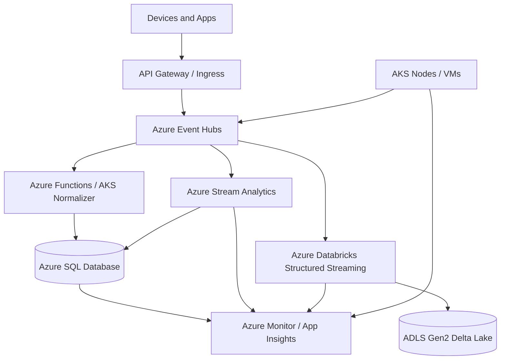
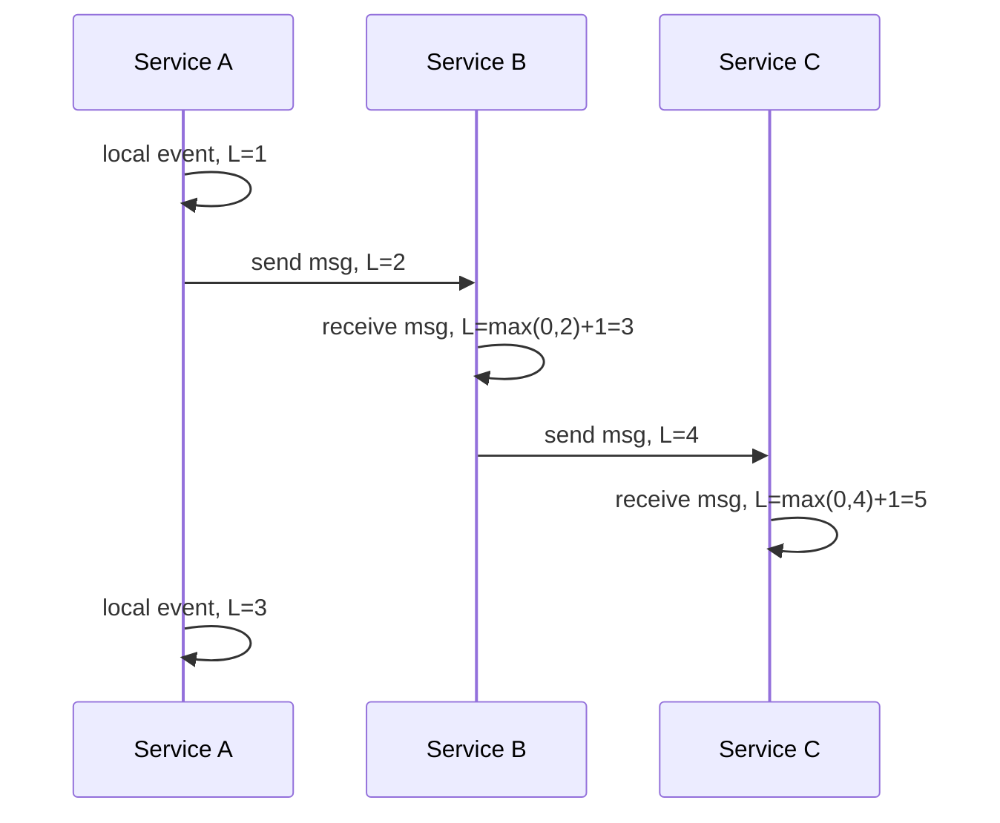
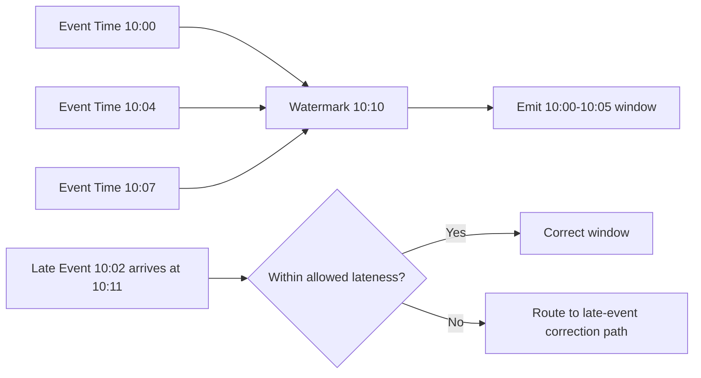

# Time, Clocks and Ordering

> Part of the **Enterprise Data & AI Architecture Handbook** · Phase-02 — Distributed Systems Deep Dive · Chapter 06.
> Estimated study time: **60 min reading + ~3h labs**.
> **Prerequisites:** read [Consensus and Coordination](01_Consensus_and_Coordination.md), [Replication and Consistency](02_Replication_and_Consistency.md), [Partitioning and Sharding](03_Partitioning_and_Sharding.md), [CAP and PACELC](04_CAP_and_PACELC.md), and especially [Distributed Transactions](05_Distributed_Transactions.md) first.

---

## Executive Summary

Distributed systems do not share a perfect clock. CPU clocks drift, network latency is asymmetric, VMs pause, containers restart, and regions fail independently. That means two events that look sequential in one process can appear reversed in another. Any architecture that assumes `timestamp A < timestamp B` is enough to prove causality will eventually fail under load, failover, or replay. Time in distributed systems is therefore not a convenience field. It is part of the correctness model.

The practical lesson is simple: use the weakest notion of ordering that safely solves the problem. For measuring elapsed duration inside one process, use a monotonic clock. For ordering events inside one partitioned log, use broker sequence and partition key. For proving causality across replicas or services, use logical clocks such as Lamport clocks, vector clocks, or hybrid logical clocks. For streaming analytics and AI feature pipelines, separate **event time** from **processing time** and make late data explicit with watermarks. For externally visible commit ordering across global systems, use platform guarantees such as Spanner-style bounded uncertainty rather than improvised wall-clock comparisons.

In Azure-first enterprise systems, this usually translates into five engineering rules. First, keep node time synchronized and monitor clock skew on Azure VMs, AKS nodes, and stateful compute. Second, partition ordered streams by business entity on Azure Event Hubs so local order is meaningful. Third, store both `event_time_utc` and `ingestion_time_utc` in Azure SQL, Delta Lake, and downstream analytical stores. Fourth, configure event-time watermarks explicitly in Azure Stream Analytics or Azure Databricks Structured Streaming rather than silently accepting processing-time semantics. Fifth, do not use wall clocks for correctness decisions such as deduplication, lease ownership, or cross-service conflict resolution unless the platform explicitly guarantees the required semantics.

This chapter builds directly on [Distributed Transactions](05_Distributed_Transactions.md). That chapter explained why business workflows must survive retries, duplicates, and partial completion. This chapter explains why those same workflows also need a disciplined treatment of clocks and order. If a platform cannot explain which timestamp means what, which clock can move backward, and where ordering is only partial, it is not production ready.

---

## Learning Objectives

By the end of this chapter you will be able to:

1. Explain why physical time cannot be assumed consistent across distributed nodes.
2. Distinguish wall clocks, monotonic clocks, logical clocks, and hybrid logical clocks.
3. Use happens-before reasoning to evaluate causality rather than relying on naive timestamp ordering.
4. Explain Lamport clocks and vector clocks, including what each can and cannot prove.
5. Evaluate hybrid logical clocks as a practical compromise between causality tracking and physical time approximation.
6. Design Azure-first event pipelines that correctly separate event time, ingestion time, and processing time.
7. Configure watermarks and late-data handling for streaming systems without corrupting aggregates.
8. Identify when ordering must be per entity, per partition, per workflow, or globally external.

---

## Business Motivation

- Revenue and compliance systems depend on correct order. If refund processing is timestamp-sorted incorrectly, a reversal can be applied before the original charge is visible.
- Data platforms depend on correct event-time semantics. Fraud models, IoT anomaly detection, and demand forecasting fail quietly when late events are counted in the wrong window.
- Multi-region systems need clocks that are good enough for tokens, leases, TTLs, and retention jobs, but not falsely trusted as proof of causality.
- Debugging costs rise sharply when logs, traces, and metrics disagree on ordering because timestamp semantics are inconsistent across services.
- AI and analytics pipelines require both correctness and explainability. A model feature computed on processing time instead of event time can shift business decisions without any obvious runtime error.
- Platform governance depends on standard time semantics. If every team chooses its own timestamp meaning, enterprise data lineage and incident reconstruction become unreliable.

---

## History and Evolution

- **1978 - Lamport clocks:** Leslie Lamport formalized partial ordering and showed that a total order can be imposed even without a shared physical clock.
- **1980s - NTP:** Network Time Protocol became the practical backbone for synchronizing clocks across large IP networks, trading precision for broad deployability.
- **1988 - Vector clocks:** Fidge and Mattern extended Lamport's work to capture causality more precisely, especially concurrent versus causally related events.
- **1990s to 2000s - Distributed databases:** Replication, leader election, and write conflict detection made time and ordering first-class operational concerns rather than academic abstractions.
- **Web-scale systems era:** Dynamo-style systems popularized version vectors and causal reconciliation for eventually consistent replicas.
- **2012 - Spanner and TrueTime:** Google demonstrated externally consistent global transactions using bounded clock uncertainty and commit wait.
- **Streaming era:** Systems such as Flink, Spark Structured Streaming, and cloud-managed stream processors made event time, processing time, and watermarking mainstream architectural concepts.
- **Modern cloud platform practice:** Enterprises now combine OS time sync, partitioned logs, logical ordering, and event-time analytics as one coherent discipline rather than separate specialties.

---

## Why This Technology Exists

Time, clocks, and ordering matter because distributed systems need to answer four different questions that look similar but are not:

1. What time is it on this machine?
2. Which event happened before another event causally?
3. In what order should this stream processor aggregate events?
4. When is a transaction externally visible to clients across regions?

Physical clocks answer the first question imperfectly. Logical clocks help answer the second. Watermarks and event-time processing help answer the third. Externally consistent database protocols answer the fourth. Confusing one answer for another creates brittle designs. For example, an API timeout, a replayed queue message, and a late telemetry event all involve "time," but they require different mechanisms.

This technology exists because distributed systems cannot rely on one universal, perfectly synchronized notion of now. Architecture must instead choose the right ordering primitive for the job, then make that primitive explicit in code, metadata, and operations.

---

## Problems It Solves

- Prevents false assumptions that wall-clock order equals causal order.
- Supports conflict detection and reconciliation across replicas and regions.
- Enables deterministic event-time analytics despite late or out-of-order arrival.
- Improves lease management, TTL handling, and timeout design by separating uncertainty from certainty.
- Provides the metadata needed to reconstruct incidents and data lineage accurately.
- Helps teams design safe partition-local ordering for brokers such as Azure Event Hubs and Kafka.
- Allows globally distributed databases to approximate real-time ordering with bounded uncertainty rather than naive timestamp comparisons.

---

## Problems It Cannot Solve

- It cannot make an unreliable network symmetric or low latency.
- It cannot eliminate clock drift; it can only bound, monitor, or work around it.
- It cannot infer business causality if the application fails to propagate correlation identifiers or logical version metadata.
- It cannot produce global total order for free at internet scale. Stronger ordering always costs coordination, latency, or both.
- It cannot rescue poorly defined timestamp semantics. If one service means "event created" and another means "event received" using the same field name, no protocol fixes the ambiguity.
- It cannot make late data disappear in streaming systems; it only lets the platform decide how long to wait and what to do when data arrives after that boundary.

---

## Core Concepts

### Physical Clocks

Physical clocks measure elapsed time using hardware oscillators. They drift because oscillators are imperfect and because power state changes, VM suspension, temperature, and virtualization add error. Physical clock synchronization tries to keep nodes close enough to UTC for operational needs, usually via NTP. Physical clocks are necessary for human reasoning, TTLs, audit timestamps, and external interfaces, but they are not sufficient proof of causality.

### NTP and Clock Skew

NTP synchronizes clients to upstream time sources by estimating offset and network delay. It can usually keep enterprise systems within acceptable milliseconds, but not with zero error. Clock skew is the difference between a node's local time and reference time. In practice, the architectural question is not "is NTP enabled" but "how much skew can this workflow tolerate before correctness changes?"

### Wall Clock versus Monotonic Clock

Wall clocks can jump forward or backward because of synchronization adjustments. Monotonic clocks only move forward and are therefore better for measuring durations, retry backoff, and timeout budgets. `DateTime.UtcNow` or similar wall-clock APIs are usually wrong for elapsed-time measurement inside an application. Use a monotonic timer for intervals, and use UTC timestamps for external records.

### Happens-Before and Causality

Lamport's happens-before relation states that event A happens before event B if:

- they occur in the same process and A is before B,
- A is a send and B is the corresponding receive,
- or the relation is transitively implied by earlier events.

If neither A happens before B nor B happens before A, the events are concurrent. This is the foundational concept for reasoning about distributed order without pretending a perfect global clock exists.

### Lamport Clocks

Lamport clocks assign a scalar logical time to each event. Each process increments its counter on local events and sends the counter with messages. Receivers set their counter to `max(local, received) + 1`. If event A happens before B, then Lamport(A) < Lamport(B). The reverse is not guaranteed, so Lamport clocks give a useful totalizable order but not precise concurrency detection.

### Vector Clocks

Vector clocks store one counter per participant. They capture causality more precisely. If every component of vector A is less than or equal to vector B and at least one is strictly less, then A happened before B. If neither vector dominates the other, the events are concurrent. This is powerful for conflict detection and merge logic, but the metadata grows with the number of participants.

### Hybrid Logical Clocks

Hybrid logical clocks, or HLCs, combine physical time with a logical counter. They preserve causality like logical clocks while staying close to physical time, making them operationally practical for databases and globally distributed services. They are attractive when teams need causality-sensitive ordering without carrying full vectors in every event.

### Event Time, Ingestion Time, and Processing Time

- **Event time:** when the event actually happened at the source.
- **Ingestion time:** when the platform first received it.
- **Processing time:** when a particular engine processed it.

These times diverge under device buffering, mobile offline behavior, retries, batch upload, or backlog recovery. Analytical correctness usually depends on event time, while operational observability often depends on processing or ingestion time.

### Watermarks

A watermark is the engine's current belief about how complete the event-time history is up to a certain point. Watermarks trade completeness for timeliness. Set them too aggressively and late events are dropped or misbucketed. Set them too conservatively and results stay pending too long, increasing latency and cost.

### Partial Order versus Total Order

Most distributed systems only need partial order: per entity, per partition, or per workflow. Total global order is far more expensive and should be reserved for problems that truly need it, such as externally consistent commit ordering or niche coordination-heavy workflows. This is the same discipline of selective rigor described in [Distributed Transactions](05_Distributed_Transactions.md).

---

## Internal Working

### How NTP Synchronization Works Operationally

An NTP client exchanges timestamps with upstream servers, estimates round-trip delay, and adjusts its local clock gradually or in controlled steps. Mature daemons such as `chronyd` avoid abrupt jumps whenever possible because backward time jumps can break applications that rely on increasing timestamps. In cloud environments, time synchronization can involve both host-assisted mechanisms and network time sources, so operators must monitor observed offset rather than trusting one configuration checkbox.

### How Lamport Clocks Advance

Each process maintains one integer counter.

1. Increment on any local event.
2. Include the counter in outbound messages.
3. On receive, set local counter to `max(local, received) + 1`.

This is cheap and widely usable for deterministic ordering, replay sequencing, and causality-aware logs. It does not identify concurrency directly, which is why simple Lamport timestamps are not enough for conflict-free merge decisions in peer-style replication.

### How Vector Clocks Merge

Each participant maintains a vector with one slot per node or replica family.

1. Increment the local slot on local mutation.
2. Ship the vector with the event or version.
3. On receive, take the element-wise maximum and then increment the local slot.

The result supports precise comparison of version histories. The operational challenge is growth. Membership churn, dynamic scale-out, and large replica sets make raw vectors difficult to keep small and stable.

### How Hybrid Logical Clocks Work

An HLC stores a pair: physical component and logical counter. On local events, it uses the maximum of local physical time and the last seen physical component. If physical time has advanced, the logical component resets. If not, the logical component increments. On receive, the node merges the remote HLC with its local state and physical time. This preserves the causal guarantee that received events never appear earlier than their causes while keeping timestamps close to UTC.

### How Event-Time Streaming Works

Streaming engines consume records in processing order but maintain aggregates keyed by event time. They buffer, reorder within a lateness budget, and emit results once a watermark indicates enough history has arrived. In Azure Stream Analytics, this is configured through event ordering and late arrival policies. In Azure Databricks Structured Streaming, it is typically expressed with `withWatermark` and windowed aggregations on an event-time column.

### Ordering in Real Platforms

- Azure Event Hubs preserves order only within a partition, not across partitions.
- Kafka does the same at the partition level.
- Azure Cosmos DB change feed preserves order per logical partition key.
- Delta Lake commit versions give table commit order, not original event order.
- SQL transaction timestamps provide storage commit order for that engine, not cross-system causality.

Production systems fail when these guarantees are confused. Architecture reviews should ask: ordered where, according to which clock, and for what scope?

---

## Architecture

The recommended architecture for enterprise time and ordering has five layers:

1. **Time synchronization layer:** Azure VMs, AKS nodes, and stateful compute maintain bounded clock offset and expose offset metrics.
2. **Ingress and ordering layer:** producers stamp event time, partition key, and optional logical clock metadata before publishing to Azure Event Hubs.
3. **Transactional truth layer:** Azure SQL Database, Azure Database for PostgreSQL, or Cosmos DB stores authoritative state with explicit timestamp semantics and version metadata.
4. **Streaming interpretation layer:** Azure Stream Analytics or Azure Databricks computes event-time windows with explicit watermark and late-arrival policy.
5. **Observability and governance layer:** Azure Monitor, Log Analytics, and OpenTelemetry correlate clock health, ordering lag, and business correctness.

This architecture keeps different notions of time separate. Wall-clock synchronization supports operations. Partition-local order supports ingestion. Logical or version metadata supports causality. Event-time windows support analytics. Transaction commit order supports source-of-truth changes. Mixing them into one overloaded `timestamp` field is the architectural failure mode to avoid.

---

## Components

| Component | Responsibility | Azure-first implementation |
|---|---|---|
| Time source and sync client | Keep node clocks close to reference time | Azure VM guest time sync plus `chronyd` or `w32time` with monitored offset |
| Monotonic timing API | Measure durations and retry budgets safely | .NET `Stopwatch`, Java `System.nanoTime`, Go monotonic `time.Time` behavior |
| Ordered event ingress | Provide partition-local order | Azure Event Hubs Standard or Premium with business-key partitioning |
| Transactional source of truth | Persist authoritative event metadata and versions | Azure SQL Database, Azure Database for PostgreSQL, Cosmos DB per logical partition |
| Logical clock metadata | Preserve causality or version lineage | Lamport counter, vector clock JSON, or HLC columns in event envelopes |
| Stream processor | Apply event-time windows and watermarks | Azure Stream Analytics or Azure Databricks Structured Streaming |
| Lakehouse storage | Persist raw and curated event records | ADLS Gen2 + Delta Lake on Azure Databricks |
| Monitoring plane | Detect skew, lag, and disorder | Azure Monitor, Log Analytics, Application Insights |
| Trace propagation | Correlate timing and order across services | OpenTelemetry with W3C trace context |
| Governance catalog | Standardize timestamp semantics | Microsoft Purview plus platform standards |

---

## Metadata

Time-aware systems need explicit metadata definitions. A minimum event envelope often includes:

- `event_id`: immutable unique identifier.
- `event_time_utc`: when the business event occurred at the source.
- `ingestion_time_utc`: when the first trusted platform boundary received the event.
- `processing_time_utc`: optional processor timestamp for diagnostics.
- `partition_key`: entity or workflow key used to preserve local order.
- `partition_sequence`: broker sequence number within the partition if available.
- `producer_instance_id`: helps explain resets or duplicate streams.
- `lamport_clock`: scalar logical order when needed.
- `vector_clock_json`: optional causal metadata for conflict-aware replicas.
- `hlc`: hybrid logical clock string or numeric representation.
- `traceparent` and `correlation_id`: cross-system observability context.
- `schema_version`: event schema governance.
- `watermark_lag_ms`: derived metric, not always stored in the raw event.

The critical requirement is semantic precision. A field called `timestamp` without a contract is a governance defect.

---

## Storage

Storage design should preserve both authoritative facts and ordering context.

- In Azure SQL Database or PostgreSQL, store UTC timestamps with clear column names such as `event_time_utc`, `created_utc`, and `last_seen_hlc`.
- In Azure Cosmos DB, keep causally related aggregates within one logical partition when ordering matters operationally. Cross-partition comparisons should be treated as eventual and application-defined.
- In Delta Lake on ADLS Gen2, partition data by business date or ingestion date carefully. Partitioning by raw event timestamp at too fine a granularity creates tiny files and operational pain.
- Keep raw arrival order, event time, and processing metadata available for replay and audit. Curated layers can derive simplified fields, but the raw lineage must remain reconstructable.

Do not rely on storage commit time as a substitute for event time. A delayed mobile device upload can be committed hours after the underlying event occurred.

---

## Compute

Compute choices affect timing behavior in subtle ways.

- Stateless APIs need monotonic timers for timeouts and circuit breakers.
- Stateful coordinators need version or logical clock metadata to avoid stale writes.
- Stream processors need memory and shuffle capacity sized for watermark delay and late data volume.
- Batch backfills need explicit rules for reusing historical event time instead of assigning current processing time.

Azure guidance:

- Use AKS when you need custom stream processors, sidecars, or time-aware DaemonSets that inspect node offset.
- Use Azure Functions for light relay or timestamp-normalization tasks, but avoid assuming one function instance has meaningful local order relative to another.
- Use Azure Databricks for complex event-time enrichment, joins, and stateful windows over Delta Lake.
- Use Azure Stream Analytics when managed event-time windows and low-ops operation are more important than custom engine logic.

Compute scale and ordering scope must match. Increasing parallelism beyond the ordering boundary without a partition key usually destroys correctness.

---

## Networking

Network behavior directly shapes clock accuracy and perceived order.

- NTP offset estimation depends on round-trip delay and asymmetry.
- AMQP or Kafka client retries can reorder processing across partitions even when single-partition order is preserved.
- Cross-region links increase skew sensitivity for lease expiry, leader election, and stream completeness.
- Private networking changes routing paths; that can affect measured delay and time-sync behavior.

Azure-specific implications:

- If outbound rules or firewall policy block required time-sync traffic, clock health can silently degrade.
- Event Hubs ordering guarantees stop at the partition boundary, so network-induced producer retries must still rely on idempotent or sequence-aware consumers.
- Multi-region active-active designs should avoid any hidden assumption that region-local wall clocks are close enough to establish business order.

Network topology is part of time correctness, not just performance.

---

## Security

Time is a security dependency.

- Authentication tokens have `nbf` and `exp` windows that fail under skew.
- Certificate validation relies on clock correctness.
- Lease and lock expiry can be abused if time control is weak.
- Event replay defenses often use time windows that become unsafe under drift.

Security controls should therefore include:

- limiting who can change system time on VMs and nodes,
- monitoring significant offset jumps as security-relevant events,
- separating client-supplied event time from trusted ingestion time,
- validating impossible timestamp values before they affect analytics or billing,
- recording operator interventions that replay or restamp events.

For regulated workloads, treat time-related metadata as integrity-sensitive. If event time can be forged without traceability, audit value collapses.

---

## Performance

Ordering and correctness always cost something.

- Strict event-time windows increase state retention and buffer pressure.
- Vector clocks increase payload size and merge cost as participant count grows.
- HLCs are cheaper than vectors but still add metadata and merge logic.
- Partition-local ordering can bottleneck hot keys if all events for one entity must stay serial.
- Strong external consistency adds coordination and commit-wait latency.

Performance tuning priorities:

- choose the smallest ordering scope that preserves correctness,
- keep hot partitions visible and rebalance business keys where possible,
- use event-time watermarks large enough for real late data but not so large that every aggregate stays open,
- avoid global sorts over raw wall-clock timestamps in the hot path,
- monitor not just throughput but disorder rate, lateness distribution, and watermark delay.

---

## Scalability

Scalability comes from narrowing where order matters.

- Preserve order per account, per device, per order, or per tenant rather than globally.
- Use partitioned logs such as Event Hubs and Kafka to scale throughput while keeping local sequence guarantees.
- Use HLCs or compact version metadata where causality is needed across many nodes; avoid full vector clocks at very high fan-out unless the domain truly needs them.
- Separate ingestion-scale concerns from analytics-order concerns by storing raw events first and computing event-time views downstream.

If a design requires global serialization for every user interaction, revisit the domain model before buying more infrastructure. This is the same aggregate-boundary discipline emphasized in [Partitioning and Sharding](03_Partitioning_and_Sharding.md).

---

## Fault Tolerance

Fault tolerance for time-aware systems means surviving uncertainty without lying.

- When clock offset exceeds tolerated bounds, some operations should fail closed rather than proceed with false confidence.
- When a stream falls behind, processors should expose watermark lag instead of silently emitting incomplete windows.
- When nodes restart with stale local state, logical clock merge rules must prevent time from moving backward causally.
- When region failover occurs, partition ownership and replay logic must not infer order from arrival time alone.

Representative failure modes:

- VM resume or snapshot causes backward wall-clock jump.
- NTP server unreachability leads to gradual drift that eventually breaks token validation.
- Late IoT batch upload lands after the event-time watermark and gets dropped from a compliance report.
- Hot partition backlog causes processing-time order to diverge sharply from event-time order.

Architects should define recovery rules for each of these before go-live.

---

## Cost Optimization

Cost optimization is mostly about not over-ordering.

- Do not pay for globally strong time semantics if per-partition or per-workflow order is enough.
- Use Event Hubs Standard for many workloads; move to Premium when throughput isolation or lower jitter justifies it.
- Use Azure Stream Analytics for straightforward event-time windows when Databricks would be operationally heavier than necessary.
- Avoid carrying full vector clocks in high-volume telemetry unless conflict detection genuinely requires them.
- Retain raw timestamp lineage in lower-cost storage tiers after hot operational windows close.

The cheapest design is the one that stores the minimal metadata necessary to reconstruct truth without forcing every component into a globally synchronized worldview.

---

## Monitoring

Minimum monitoring signals for time and ordering:

- node clock offset and drift trend,
- NTP sync status and last successful sync age,
- token or certificate validation failures attributable to skew,
- event hub partition lag and per-partition throughput,
- late-event percentage and lateness distribution,
- watermark lag by pipeline and entity class,
- out-of-order event count per stream,
- HLC or logical clock regression detection,
- lease contention or stale-writer detection events.

Azure Monitor, Log Analytics, and Databricks metrics dashboards should make these visible to both platform engineering and application teams.

---

## Observability

Observability must preserve the distinction between clock domains.

Best practices:

- include both event time and processing time in traces or logs where relevant,
- annotate traces with partition key and broker sequence for ordered streams,
- record logical version metadata when causality matters,
- expose watermark and lateness in dashboards, not just throughput and errors,
- correlate skew alarms with authentication errors, lease loss, and replay storms.

An incident timeline built only from wall-clock logs is often misleading. A useful timeline usually needs physical timestamps, causal links, and stream position metadata together.

---

## Governance

Enterprise governance should standardize time semantics the same way it standardizes identity, networking, and data classification.

Required controls:

- define a naming standard for timestamp fields,
- require UTC storage for authoritative system timestamps,
- require monotonic timers for duration measurement in service code standards,
- require event-time and late-arrival policies for streaming pipelines,
- document which systems rely on physical time, logical time, or platform commit order,
- review any proposal that claims global ordering without explicit proof of how it is achieved,
- treat time metadata as governed lineage in Microsoft Purview or equivalent catalogs.

Time semantics should be part of architecture review checklists, not an implementation footnote.

---

## Trade-offs

| Choice | Strengths | Weaknesses | Best fit | Avoid when |
|---|---|---|---|---|
| Physical UTC timestamp | Human-readable, operationally necessary | Drift and skew; not proof of causality | Audit logs, TTLs, UI display | Conflict resolution or causal ordering |
| Monotonic clock | Safe duration measurement | Not meaningful across machines | Timeouts, retries, backoff | Persisted business timestamps |
| Lamport clock | Cheap logical ordering | Cannot detect concurrency precisely | Deterministic event ordering and replay | Multi-writer conflict merges |
| Vector clock | Precise causal comparison | Metadata grows with participants | Conflict detection in eventually consistent replicas | High-fan-out high-volume telemetry |
| Hybrid logical clock | Good causality plus near-physical time | More complex than scalar logical clocks | Distributed databases and cross-service ordering hints | Extremely simple systems that only need partition order |
| Event-time processing | Correct analytical windows | More state, buffering, and late-data handling | IoT, clickstream, model features | Simple real-time dashboards where arrival time is enough |
| Processing-time processing | Low latency and simple operation | Incorrect under late or delayed data | Operational monitoring and low-stakes counters | Compliance, billing, or model training based on source time |

---

## Decision Matrix

| Use case | Ordering need | Recommended time model | Azure-first implementation | Open-source analogue |
|---|---|---|---|---|
| Payment workflow audit | Per workflow plus durable commit order | UTC + monotonic duration + transaction commit order | Azure SQL + Application Insights + Service Bus metadata | PostgreSQL + Kafka + OTel |
| IoT anomaly detection | Event-time windows with late data | Event time + watermark | Event Hubs + Databricks or Stream Analytics | Kafka + Flink |
| Multi-master replica conflict resolution | Causality across writers | Vector clock or HLC | Custom metadata over Cosmos DB or PostgreSQL | Dynamo-style vectors or Cockroach-style HLC |
| Lease and leader management | Local duration and bounded skew | Monotonic timer + offset monitoring | AKS/VMs + Azure Monitor | Kubernetes + node exporter |
| Global transaction ordering | External consistency | Platform-provided bounded uncertainty | Platform comparison only; redesign if Azure baseline lacks need | Spanner-like systems |
| Telemetry dashboard | Near-real-time arrival order | Processing time or ingestion time | Event Hubs + ASA | Kafka + ksqlDB or Flink |
| Customer activity timeline | Per user order with source-time truth | Event time + partition sequence | Event Hubs partition by user + Delta Lake | Kafka partition by user |

Decision rule:

1. State whether you need duration, causality, stream correctness, or global external order.
2. Choose the minimal ordering primitive that satisfies that requirement.
3. Make late data and uncertainty explicit instead of hiding them.

---

## Design Patterns

### Entity-Partitioned Ordered Log

Partition event streams by business entity so that local sequence has real meaning and consumers can scale horizontally.

### Dual Timestamp Pattern

Store both event time and ingestion time. Use event time for analytics and business chronology; use ingestion time for operational SLAs and replay diagnosis.

### Monotonic Timeout Pattern

Measure deadlines and retries using monotonic timers rather than wall-clock timestamps.

### Watermark and Allowed Lateness Pattern

Define a lateness budget explicitly and send very late events to a correction or reconciliation path instead of silently dropping them without audit.

### Hybrid Logical Clock Envelope

Attach HLC metadata to commands or replicated mutations when physical time needs to stay approximately meaningful without sacrificing causal safety.

### Version Vector Conflict Detection

Use vector clocks for specific replicated objects where concurrent updates must be identified rather than accidentally overwritten.

### Sequence plus Event-Time Pattern

Use partition sequence for delivery order and event time for business chronology. They answer different questions and should both be retained.

---

## Anti-patterns

- Sorting globally by wall-clock timestamp and calling the result causal order.
- Using local server time to generate uniqueness or deduplication guarantees.
- Assuming Event Hubs, Kafka, or Cosmos DB provide global order across partitions.
- Using processing time for billing or model training windows when devices can buffer and upload late.
- Hiding timestamp meaning behind a generic column named `timestamp`.
- Comparing timestamps from unsynchronized third-party systems as if they were authoritative.
- Using vector clocks everywhere because they are theoretically powerful, even when the metadata cost is unjustified.
- Measuring timeout duration with wall-clock APIs that can jump backward or forward.

---

## Common Mistakes

- Forgetting to monitor clock offset after enabling time sync.
- Treating `sysutcdatetime()` or `now()` as proof of source event chronology.
- Repartitioning streams on a non-causal key and then complaining that order is broken.
- Setting an event-time watermark based on optimistic assumptions rather than observed lateness distribution.
- Keeping raw late events out of the lakehouse, which destroys replay and audit capability.
- Using local time zones in persisted operational records.
- Assuming that because a workflow is idempotent, timestamp semantics no longer matter.
- Ignoring leap-second, VM pause, or node-suspension behavior in long-running services.

---

## Best Practices

- Use UTC for persisted physical timestamps and monotonic timers for elapsed duration.
- Keep broker ordering scope explicit: per partition, not global.
- Require event producers to stamp business event time at the source when feasible.
- Retain ingestion time separately at the first trusted platform boundary.
- Configure late-arrival handling based on measured reality, not guesswork.
- Use HLC or vector metadata only where causality actually changes business behavior.
- Validate timestamp semantics in schema reviews and data contracts.
- Test with injected skew, delayed delivery, replay, and backlog scenarios before production.

---

## Enterprise Recommendations

Recommended enterprise baseline:

1. **Standard timestamp contract:** every event must define `event_time_utc`, `ingestion_time_utc`, and the trusted producer of each.
2. **Standard duration rule:** service code must use monotonic time for retries, backoff, and deadline measurement.
3. **Standard stream rule:** event-driven systems must document ordering scope, partition key, and watermark policy.
4. **Standard conflict rule:** use vector clocks only for explicit multi-writer reconciliation scenarios; use HLC or simpler versioning elsewhere.
5. **Standard governance rule:** any design requiring global total order must justify why partition-local or workflow-local order is insufficient.

### ADR Example

**Context:** A global telemetry and order-intelligence platform currently uses processing time for all aggregations. Mobile clients upload buffered events hours late, causing revenue and SLA dashboards to diverge from business reality. Some teams also sort cross-region activity by API server timestamp and infer customer action order from it.

**Decision:** Standardize on event time plus ingestion time across all event contracts, enforce entity-based partitioning in Event Hubs, configure Databricks watermarks from observed lateness distributions, and prohibit cross-service business ordering decisions based solely on wall-clock timestamps. For replicated conflict detection in a small subset of metadata services, adopt HLC-based version fields.

**Consequences:** Analytics accuracy improves and incident timelines become reconstructable. Some dashboards become slightly less immediate because watermark delay is now explicit. Development teams must learn event-time semantics and update schemas and test cases.

**Alternatives considered:**

- keep processing-time windows and accept inaccuracies: rejected because billing and AI features require source chronology,
- use vector clocks for all events: rejected because the metadata overhead is unnecessary for one-way telemetry,
- centralize everything in one globally ordered database: rejected because cost and latency are disproportionate to the problem.

---

## Azure Implementation

### Reference Architecture

An Azure-first architecture for time-aware event processing and ordering:

- Azure API Management or device gateway accepts events.
- Producers stamp `event_time_utc`, `device_id` or business entity key, and optional HLC metadata.
- Azure Event Hubs receives events partitioned by the entity key so order is preserved within that scope.
- Azure Functions or AKS services perform lightweight normalization and enrichment where needed.
- Azure Databricks Structured Streaming or Azure Stream Analytics processes event-time windows with watermarks.
- Raw events land in ADLS Gen2 Delta tables with event time, ingestion time, partition sequence, and source metadata retained.
- Azure SQL Database or PostgreSQL stores authoritative transactional projections when the stream drives operational workflows.
- Azure Monitor and Application Insights alert on clock skew, watermark lag, and out-of-order spikes.

### Event Contract Example

```json
{
  "event_id": "8a6af6d7-8e06-4cd4-a7a8-0d6f1f92d4bc",
  "device_id": "device-1042",
  "event_time_utc": "2026-07-08T08:15:27.481Z",
  "hlc": "2026-07-08T08:15:27.481Z-0003-node7",
  "temperature_c": 23.4,
  "traceparent": "00-88b7d2a3024d412b9b6c83b511dc7086-f0fd0a3b519b2ee7-01"
}
```

### SQL Schema for Retaining Time Semantics

```sql
create table dbo.device_events (
    event_id uniqueidentifier not null primary key,
    device_id nvarchar(128) not null,
    event_time_utc datetime2 not null,
    ingestion_time_utc datetime2 not null default sysutcdatetime(),
    processing_time_utc datetime2 null,
    partition_key nvarchar(128) not null,
    partition_sequence bigint null,
    hlc nvarchar(64) null,
    payload nvarchar(max) not null
);

create index ix_device_events_device_event_time
on dbo.device_events (device_id, event_time_utc);

create index ix_device_events_ingestion_time
on dbo.device_events (ingestion_time_utc);
```

### Azure Databricks Structured Streaming Example

```python
from pyspark.sql import functions as F

raw = (spark.readStream
    .format("delta")
    .table("bronze.device_events"))

aggregated = (raw
    .withColumn("event_time", F.col("event_time_utc").cast("timestamp"))
    .withWatermark("event_time", "15 minutes")
    .groupBy(
        F.window("event_time", "5 minutes"),
        F.col("device_id")
    )
    .agg(
        F.avg("temperature_c").alias("avg_temp_c"),
        F.count("*").alias("event_count")
    ))

(aggregated.writeStream
    .outputMode("append")
    .option("checkpointLocation", "abfss://checkpoints@lake.dfs.core.windows.net/device-temp")
    .toTable("silver.device_temperature_5m"))
```

### Azure Stream Analytics Example

```sql
SELECT
    device_id,
    System.Timestamp() AS window_close_time,
    AVG(temperature_c) AS avg_temp_c,
    COUNT(*) AS event_count
INTO
    [sql-output]
FROM
    [eventhub-input] TIMESTAMP BY event_time_utc
GROUP BY
    device_id,
    TumblingWindow(minute, 5)
```

### HLC Utility Example in C#

```csharp
public sealed record HybridLogicalClock(DateTime PhysicalUtc, int Logical);

public static class Hlc
{
    public static HybridLogicalClock Tick(HybridLogicalClock lastSeen, DateTime nowUtc)
    {
        var physical = nowUtc > lastSeen.PhysicalUtc ? nowUtc : lastSeen.PhysicalUtc;
        var logical = nowUtc > lastSeen.PhysicalUtc ? 0 : lastSeen.Logical + 1;
        return new HybridLogicalClock(physical, logical);
    }

    public static HybridLogicalClock Merge(HybridLogicalClock local, HybridLogicalClock remote, DateTime nowUtc)
    {
        var physical = new[] { local.PhysicalUtc, remote.PhysicalUtc, nowUtc }.Max();

        if (physical == local.PhysicalUtc && physical == remote.PhysicalUtc)
        {
            return new HybridLogicalClock(physical, Math.Max(local.Logical, remote.Logical) + 1);
        }

        if (physical == local.PhysicalUtc)
        {
            return new HybridLogicalClock(physical, local.Logical + 1);
        }

        if (physical == remote.PhysicalUtc)
        {
            return new HybridLogicalClock(physical, remote.Logical + 1);
        }

        return new HybridLogicalClock(physical, 0);
    }
}
```

### Azure CLI Provisioning Example

```powershell
az group create --name rg-time-order --location westeurope
az storage account create --name sttimeorderweu --resource-group rg-time-order --location westeurope --sku Standard_LRS --kind StorageV2 --hierarchical-namespace true
az eventhubs namespace create --name ehns-time-order-weu --resource-group rg-time-order --location westeurope --sku Standard
az eventhubs eventhub create --resource-group rg-time-order --namespace-name ehns-time-order-weu --name device-events --partition-count 8 --message-retention 3
az monitor log-analytics workspace create --resource-group rg-time-order --workspace-name law-time-order-weu --location westeurope
```

### Bicep Example for Event Hubs and Log Analytics

```bicep
resource ns 'Microsoft.EventHub/namespaces@2022-10-01-preview' = {
  name: 'ehns-time-order-weu'
  location: resourceGroup().location
  sku: {
    name: 'Standard'
    tier: 'Standard'
    capacity: 1
  }
}

resource hub 'Microsoft.EventHub/namespaces/eventhubs@2022-10-01-preview' = {
  name: '${ns.name}/device-events'
  properties: {
    partitionCount: 8
    messageRetentionInDays: 3
  }
}

resource law 'Microsoft.OperationalInsights/workspaces@2022-10-01' = {
  name: 'law-time-order-weu'
  location: resourceGroup().location
  properties: {
    retentionInDays: 30
  }
  sku: {
    name: 'PerGB2018'
  }
}
```

### Kusto Example for Skew and Lateness Investigation

```kusto
AppTraces
| where Message has "event_received"
| extend event_time = todatetime(Properties.event_time_utc)
| extend ingestion_time = TimeGenerated
| extend lateness_ms = datetime_diff('millisecond', ingestion_time, event_time)
| summarize p50=percentile(lateness_ms, 50), p95=percentile(lateness_ms, 95), max=max(lateness_ms) by bin(TimeGenerated, 15m)
```

### Azure Operational Guidance

- Monitor node offset on AKS and stateful VMs; do not assume platform time is always within your business tolerance.
- Partition Event Hubs by the entity whose order matters. Partitioning by random GUID destroys locality and makes order meaningless.
- Store both source event time and platform ingestion time in Delta tables and operational projections.
- Use Stream Analytics or Databricks watermarking based on observed lateness from production traces, not intuition.
- For workflows influenced by [Distributed Transactions](05_Distributed_Transactions.md), keep transaction commit time separate from source event time and replay time.

---

## Open Source Implementation

### Reference Stack

An enterprise open-source implementation typically uses:

- Kafka for partitioned ordered ingress,
- Flink or Spark Structured Streaming for event-time windows and watermarks,
- PostgreSQL for authoritative transactional state,
- Kubernetes for service deployment,
- Prometheus, Grafana, and OpenTelemetry for monitoring and tracing.

### Kafka Producer Pattern

Use the business entity as the partition key so local order reflects business order. Include event time in the payload or headers, and retain broker offset separately for delivery-sequence diagnostics.

### Flink SQL Example

```sql
CREATE TABLE device_events (
  event_id STRING,
  device_id STRING,
  event_time TIMESTAMP(3),
  temperature_c DOUBLE,
  WATERMARK FOR event_time AS event_time - INTERVAL '15' MINUTE
) WITH (
  'connector' = 'kafka',
  'topic' = 'device-events',
  'properties.bootstrap.servers' = 'kafka:9092',
  'format' = 'json'
);

SELECT
  device_id,
  window_start,
  window_end,
  AVG(temperature_c) AS avg_temp_c
FROM TABLE(
  TUMBLE(TABLE device_events, DESCRIPTOR(event_time), INTERVAL '5' MINUTES)
)
GROUP BY device_id, window_start, window_end;
```

### Prometheus Monitoring Focus

- node clock offset and NTP health,
- Kafka partition lag and rebalance churn,
- watermark lag and late-data rate,
- consumer disorder rate,
- stale-writer or lease-expiry anomalies.

This stack is flexible and powerful, but it requires teams to own more integration, offset monitoring, and governance than the Azure-managed baseline.

---

## AWS Equivalent (comparison only)

| Azure-first service | AWS equivalent | Advantages in AWS | Disadvantages versus Azure baseline | Migration strategy | Selection criteria |
|---|---|---|---|---|---|
| Azure Event Hubs | Amazon Kinesis Data Streams or Amazon MSK | Strong managed streaming options | Different partition and retention ergonomics depending on service choice | Preserve partition-key strategy and event metadata before changing processors | Choose based on throughput shape and Kafka affinity |
| Azure Stream Analytics | Kinesis Data Analytics for Apache Flink | Managed Flink option for event-time windows | Less direct parity for ASA simplicity | Port watermark rules and late-data tests first | Choose when managed Flink fits the team better than custom streaming |
| Azure Databricks | Amazon EMR or Databricks on AWS | Strong lakehouse and Spark ecosystem | More choices increase platform variability | Keep Delta tables and event-time contracts stable during host migration | Choose when existing data platform standards already favor AWS |
| Azure SQL Database / PostgreSQL | Amazon RDS / Aurora | Mature managed relational base | Different operational knobs for cross-region timing and failover | Migrate schemas and timestamp contracts unchanged | Choose based on region fit and managed DB standardization |
| Azure Monitor / App Insights | CloudWatch / X-Ray | Native integration with AWS resources | Different query and dashboard conventions | Rebuild offset and lateness dashboards after preserving field names | Choose when operations are already centralized on AWS |

AWS can implement the same principles, but the success factor is preserving semantics for event time, partition order, and duration measurement rather than chasing one-to-one service labels.

---

## GCP Equivalent (comparison only)

| Azure-first service | GCP equivalent | Advantages in GCP | Disadvantages versus Azure baseline | Migration strategy | Selection criteria |
|---|---|---|---|---|---|
| Azure Event Hubs | Pub/Sub or Kafka on GKE | Strong managed messaging and broad ecosystem | Pub/Sub ordering semantics differ from partition-log assumptions | Revalidate ordering scope and dedupe behavior explicitly | Choose based on event fan-out versus strict partition-order needs |
| Azure Stream Analytics / Databricks | Dataflow / Dataproc / Databricks on GCP | Strong event-time processing with Beam model | Different developer model and operational patterns | Port watermark policy and late-data acceptance tests first | Choose when Beam or Dataflow already aligns with the platform roadmap |
| Azure SQL / PostgreSQL | Cloud SQL / AlloyDB | Strong managed relational options | Different failover and timing characteristics | Preserve timestamp semantics and monotonic-time coding standards | Choose based on workload profile and operational model |
| Azure Monitor | Cloud Monitoring / Cloud Trace | Mature observability stack | Different analytics workflow | Recreate skew, lag, and disorder dashboards with same metadata contract | Choose when GCP observability is already standardized |
| HLC and external-order comparison point | Spanner | First-party external consistency option | Higher conceptual and cost bar than many Azure-first workloads need | Adopt only if global external order is a true product requirement | Choose when globally consistent commit order is itself a differentiator |

GCP's main differentiator in this topic area is Spanner. If the requirement is externally consistent global commit order, GCP has a native strength. If the requirement is mainly stream correctness, partitioned ordering, and governed timestamp semantics, the Azure baseline remains simpler for many enterprises.

---

## Migration Considerations

Migration usually means correcting one of these legacy conditions:

1. processing-time-only analytics,
2. services using wall-clock time for retries and leases,
3. inconsistent timestamp semantics across teams,
4. false assumptions of global order in partitioned systems.

Recommended migration sequence:

- inventory all persisted timestamps and document what each field actually means,
- add explicit event-time and ingestion-time fields to schemas and topics,
- standardize monotonic timer usage in shared service libraries,
- partition event streams by entity or workflow rather than convenience keys,
- introduce watermarking in one high-value analytics pipeline first,
- add skew and lateness dashboards before enforcing stricter policies,
- backfill historical data with preserved source event time where available,
- retire logic that infers causality from raw server timestamps alone.

The organizational challenge is usually larger than the technical one. Teams have to agree that uncertain order should be exposed, not buried.

---

## Mermaid Architecture Diagrams

### Azure Time and Ordering Reference Architecture



### Happens-Before and Lamport Flow



### Event-Time Windowing with Watermark



These views emphasize the three distinct concerns: platform topology, causal ordering, and analytical completeness.

---

## End-to-End Data Flow

Consider an industrial IoT scenario on Azure:

1. A sensor records a temperature spike at `08:15:27.481Z` and stamps that as `event_time_utc`.
2. The device is briefly offline and buffers the event for three minutes.
3. On reconnect, it publishes to Azure Event Hubs using `device_id` as the partition key.
4. Event Hubs assigns partition-local sequence metadata and retains delivery order within that device stream.
5. A normalizer running on AKS enriches the record and writes a raw copy to Delta Lake, preserving both event time and ingestion time.
6. Azure Databricks applies a 15-minute watermark and groups readings into 5-minute windows based on event time.
7. A late event arriving after the watermark cutoff is routed to a correction path and logged for reconciliation.
8. An operational alerting projection in Azure SQL stores the latest known device state, clearly distinguished from the analytical event-time history.
9. Azure Monitor correlates any abnormal lateness spike with network issues or node clock offset.

This flow is correct because each stage uses the right notion of time for its purpose instead of pretending one timestamp can serve them all.

---

## Real-world Business Use Cases

- **Fraud detection:** event-time windows determine whether a card burst happened within the true source-time interval.
- **Industrial IoT:** device telemetry often arrives late due to intermittent connectivity, making event time mandatory.
- **Ad tech and clickstream:** attribution windows depend on user action time, not ingestion backlog time.
- **SaaS audit trails:** entitlement grant, revoke, and replay operations need per-tenant or per-user ordering that survives retries.
- **Feature stores and ML pipelines:** training and serving features require consistent chronology to avoid leakage and label skew.
- **Distributed workflows:** multi-step business processes need durable commit order and timeout logic that respects uncertain clocks.

---

## Industry Examples

- **Google Spanner:** externally consistent ordering backed by bounded uncertainty is the reference example for global commit order.
- **Dynamo-style systems:** vector clocks became a practical way to detect concurrent writes in eventually consistent replicas.
- **Kafka-based event platforms:** partition order is widely used to scale while preserving per-key sequence.
- **Flink and Spark Structured Streaming:** event-time processing and watermarking made late-data correctness a mainstream engineering discipline.
- **Cloud incident postmortems involving token expiry or skew:** these repeatedly show that operational time drift can create both availability and security failures.

The industry pattern is consistent: mature systems differentiate physical time, logical order, and analytical event chronology rather than collapsing them into one field.

---

## Case Studies

### Case Study 1: Leap-Second and Timer Instability Lessons

The 2012 leap-second incident affected multiple Linux-based systems and surfaced a broader lesson: time anomalies can cause CPU spikes, timer bugs, and cascading service instability even when the application itself never mentions leap seconds. The takeaway for enterprise teams is not just "patch kernels." It is that time behavior is an infrastructure dependency with application consequences.

### Case Study 2: Late Data Corrupting Executive Dashboards

An Azure-based field-device platform originally grouped events by processing time because the first dashboard was built for operational freshness, not analytical accuracy. As device buffering increased, incident counts were underreported in the real event windows and then appeared hours later in the wrong buckets. The remediation was to preserve event time at the edge, add ingestion time separately, and move executive metrics to event-time windows with watermark-driven completeness.

### Case Study 3: Stale Lease Failure in a Stateful Service

A stateful service on VMs measured lease expiry using wall-clock timestamps and encountered skew after a host maintenance event. One instance believed the lease had expired while another still considered it active, creating dual ownership of a partition. The permanent fix was to use monotonic local duration for lease renewal decisions, tighten skew monitoring, and add fencing tokens to downstream writes.

These cases all point to the same conclusion: time problems rarely announce themselves as "time problems" in the first incident ticket.

---

## Hands-on Labs

1. **Lamport clock simulator:** implement three services exchanging messages and show how scalar logical clocks evolve.
2. **Vector clock conflict lab:** model concurrent updates to a replicated object and detect true concurrency.
3. **Event Hubs ordering lab:** publish device events with partition keys and verify order is preserved only within partitions.
4. **Databricks watermark lab:** compare event-time and processing-time aggregation outputs on delayed telemetry.
5. **Clock skew lab:** simulate node offset on a non-production environment and observe effects on tokens, leases, and timeout metrics.

Each lab should record observed skew, lateness, and disorder rather than only confirming happy-path output.

---

## Exercises

1. Explain why two events with the same UTC timestamp may still have unknown causal order.
2. Compare Lamport clocks and vector clocks for conflict detection in a multi-writer metadata service.
3. Design a schema that captures event time, ingestion time, processing time, and partition order for an order-event stream.
4. State when processing-time windows are acceptable and when they are not.
5. Explain how HLCs improve on pure physical time without incurring the full metadata cost of vector clocks.
6. Describe how you would detect that a stream watermark is too aggressive for real late-data behavior.

---

## Mini Projects

1. Build an Azure Event Hubs plus Databricks pipeline that compares event-time versus processing-time metrics for IoT telemetry.
2. Implement HLC metadata in a small replicated service and show how it prevents backward causal order on replay.
3. Create a cross-team timestamp contract package with schema examples, validation tests, and dashboards for skew and lateness.

Each mini project should include one failure scenario, one governance artifact, and one replay or reconciliation demonstration.

---

## Capstone Integration

This chapter ties the earlier Phase-02 chapters together:

- [Consensus and Coordination](01_Consensus_and_Coordination.md) explains why ordering and quorum decisions require durable coordination rather than wishful synchronization.
- [Replication and Consistency](02_Replication_and_Consistency.md) provides the read/write consistency models that logical clocks and causal reasoning must support.
- [Partitioning and Sharding](03_Partitioning_and_Sharding.md) explains why ordering boundaries should align with partition keys and entity ownership.
- [CAP and PACELC](04_CAP_and_PACELC.md) explains why stronger global ordering increases coordination latency and availability trade-offs.
- [Distributed Transactions](05_Distributed_Transactions.md) shows why commit order, retries, and compensation need explicit time semantics.

The capstone design exercise for Phase-02 should require the reader to design a multi-region event-driven platform, defend its ordering boundaries, choose its watermark strategy, and justify where it relies on wall clocks, logical clocks, or platform commit order.

---

## Interview Questions

1. Why is `DateTime.UtcNow` usually the wrong API for measuring elapsed duration?
   **A:** Wall-clock time can jump backward or forward (NTP corrections, manual adjustment, leap seconds), so subtracting two `UtcNow` readings can produce a negative or wildly inflated duration; a monotonic clock API (unaffected by wall-clock adjustments) is the correct tool for measuring elapsed time.
2. What does happens-before mean in a distributed system?
   **A:** Happens-before is a partial-order relation capturing genuine causal dependency — event A happens-before event B if A could have influenced B (e.g., A is a message send and B is its receipt, or both occur in sequence on the same process) — events with no such relation are considered concurrent.
3. What guarantee does a Lamport clock provide, and what guarantee does it not provide?
   **A:** A Lamport clock guarantees that if A happens-before B, then A's timestamp is less than B's; it does not provide the converse — two events can have comparable timestamps (one less than the other) without one actually happening-before the other, so it can't distinguish true causality from coincidental ordering.
4. How do vector clocks detect concurrency?
   **A:** Each process maintains a vector of counters (one per process) and includes its current vector with every event; two events are concurrent if neither vector dominates the other (each has at least one component greater than the other's), which precisely captures the absence of a causal relationship that a single Lamport timestamp cannot.
5. What problem do hybrid logical clocks solve?
   **A:** HLCs combine a physical wall-clock component (for human-meaningful, roughly-synchronized timestamps close to real time) with a logical counter component (to preserve causal ordering even when physical clocks are imprecise or skewed), giving both causality-respecting ordering and timestamps usable for human-facing purposes like "recently modified."
6. What is the difference between event time and processing time?
   **A:** Event time is when something actually occurred in the real world (e.g., when a mobile app recorded a click); processing time is when the pipeline actually processes that event — the two can diverge significantly for late-arriving data (a phone offline for hours before syncing), and business logic that requires correctness must use event time, not processing time.
7. Why does partitioned streaming preserve order only within a partition?
   **A:** A partition is processed by a single consumer/thread maintaining sequential order for messages within it, but different partitions are processed independently and in parallel with no ordering relationship between them — global ordering across partitions is not guaranteed unless the system adds an explicit mechanism to establish it.
8. What is a watermark, and why is it necessary?
   **A:** A watermark is a declared assertion that "no more events with a timestamp earlier than X are expected," letting a stream-processing engine know when it's safe to close a time window and emit results; it's necessary because without it, a window could theoretically wait forever for a late event that never arrives, or emit incomplete results too early if closed prematurely.

---

## Staff Engineer Questions

1. Design an Azure event pipeline for mobile clients that can upload data hours late without corrupting billing windows.
   **A:** Use event-time-based windowing (not processing-time) with a watermark generous enough to accommodate the expected maximum client-side delay, and route events arriving after the watermark has passed to a separate late-data correction path that adjusts already-closed billing windows explicitly, rather than silently including or dropping them.
2. Explain how you would prove whether two cross-region events are causally related or merely close in wall-clock time.
   **A:** Compare their vector clocks or HLC timestamps rather than raw wall-clock timestamps — if one event's causal metadata explicitly incorporates or follows from the other's, they're causally related; if neither dominates, they're concurrent regardless of how close their wall-clock timestamps appear.
3. Compare HLC, vector clocks, and commit timestamps for a metadata service replicated across regions.
   **A:** HLC gives compact, human-meaningful timestamps with causality preservation for the common case, at lower storage/comparison cost than vector clocks; vector clocks give precise concurrent-vs-causal detection but grow with the number of replicas/processes tracked, becoming unwieldy at scale; simple commit timestamps (physical clock only) are cheapest but can misorder causally related events under clock skew — HLC is usually the practical middle ground for a replicated metadata service.
4. How would you detect and mitigate a hot partition when per-entity ordering is required?
   **A:** Detect via per-partition throughput/lag metrics showing one partition consistently hotter than peers; since per-entity ordering requires that entity's events stay on one partition, mitigate by choosing a higher-cardinality partition key upfront or splitting an overloaded entity's stream into sub-streams with their own internal sequencing if the entity itself can be decomposed.
5. Describe how clock skew can create stale-writer bugs even when retries and idempotency are correct.
   **A:** If a system uses wall-clock timestamps to decide "which write is newest" (last-writer-wins), a node with a skewed-ahead clock can have its older logical write incorrectly treated as "newer" than a genuinely later write from a node with an accurate clock — retries and idempotency prevent duplicate processing but do nothing to fix an ordering decision based on unreliable wall-clock comparison.
6. What dashboards would you build to distinguish backlog latency from source lateness?
   **A:** A dashboard tracking event-time-to-processing-time lag (source lateness) separately from queue/backlog depth and consumer lag (backlog latency) — conflating them hides whether a pipeline is slow because data arrives late at the source or because the pipeline itself has fallen behind processing data that arrived on time.

---

## Architect Questions

1. Which workloads in your estate need event-time correctness, and which only need processing-time freshness?
   **A:** Billing, financial reconciliation, and regulatory reporting need event-time correctness since they must reflect what actually happened when; operational dashboards and real-time monitoring often only need processing-time freshness since "close enough to now" is the actual requirement — conflating the two leads to either unnecessary complexity or incorrect financial results.
2. Where should ordering be per partition, per workflow, or globally external?
   **A:** Per-partition ordering suffices when all operations on a given entity route to the same partition; per-workflow ordering (via a saga/orchestrator) is needed when a business process spans multiple entities/partitions; globally external ordering (e.g., via Spanner's TrueTime or an external consensus service) is reserved for the rare case where cross-entity real-time ordering is a genuine business requirement, given its latency cost.
3. Under what conditions would you approve vector clocks instead of HLC or simple version numbers?
   **A:** Approve vector clocks only when the system genuinely needs to distinguish "concurrent and conflicting" from "one definitively happened before the other" across a bounded, small number of replicas (e.g., a CRDT-based multi-master store) — for most systems, HLC's simpler causal-plus-physical-time model is sufficient and vector clocks' growing overhead isn't justified.
4. How do time semantics interact with transactional outbox, replay, and compensation patterns?
   **A:** Outbox events should carry event-time metadata alongside their causal ordering so replay (reprocessing historical events) produces the same business outcome as the original processing; compensation logic must account for the possibility that a compensating action executes much later in processing time than the original event's event-time, and must be idempotent regardless of replay order.
5. What governance policy prevents teams from reintroducing ambiguous `timestamp` fields?
   **A:** Require every timestamp field in a shared schema to be explicitly named and documented as event-time or processing-time (never an ambiguous generic `timestamp`), enforced via schema-registry review — an ambiguous field name is how event-time/processing-time confusion silently creeps into downstream analytics.
6. How will your multi-region failover design behave if clocks remain within operational tolerance but messages still arrive badly delayed?
   **A:** Clock skew and message delay are separate failure modes — a design relying on HLC/vector clocks for causal correctness is resilient to modest clock skew, but severe message delay still requires a sufficiently generous watermark or explicit late-data handling path, since no clock discipline can make a genuinely late message arrive on time.

---

## CTO Review Questions

1. Which customer or regulatory outcomes depend on event-time accuracy rather than near-real-time dashboard freshness?
   **A:** Billing, SLA-credit calculations, and any regulatory reporting requiring an accurate "what happened when" record depend on event-time accuracy; dashboards showing "current state" are typically fine trading some event-time accuracy for processing-time freshness — conflating the two risks either incorrect bills or unnecessarily slow dashboards.
2. What is the business cost of waiting for late events versus the cost of publishing incomplete results early?
   **A:** This is a quantifiable trade-off specific to each workload — for billing, publishing early and later correcting is usually acceptable if correction is well-supported; for a one-time regulatory submission, waiting for a generous watermark to avoid ever needing a correction may be the safer, if slower, choice.
3. How much platform complexity is justified for causal ordering or external consistency in this product line?
   **A:** Only workloads with an actual demonstrated need for cross-entity causal guarantees justify the complexity and latency cost of vector clocks or externally consistent designs — most product lines are well served by simpler per-partition ordering plus HLC, and adding stronger guarantees "just in case" is often unjustified complexity.
4. Can the organization reconstruct a disputed sequence of events without trusting one server's wall clock?
   **A:** If reconstruction relies solely on a single server's local timestamp rather than causal metadata (HLC/vector clocks) or a durable, ordered event log, the answer is no — this is a real gap for any dispute-resolution or audit requirement and should be closed by ensuring causal ordering metadata is captured and retained.
5. What governance mechanism ensures time semantics stay consistent as teams add new data products and services?
   **A:** A schema-registry-enforced requirement that every new event schema explicitly classify its timestamp fields (event-time vs. processing-time) and a documented default clock strategy (HLC) for new services, so time-semantics consistency doesn't rely on each new team independently rediscovering the right approach.
6. Where would a time-related failure most likely appear first: security, analytics, workflow correctness, or incident response?
   **A:** Analytics and workflow correctness typically surface time-related failures first (a billing window silently including or excluding late data, a workflow step executing out of causal order), often well before the issue becomes visible enough to trigger an incident-response process — proactive event-time monitoring catches these before they escalate.

---

## References

- Leslie Lamport, *Time, Clocks, and the Ordering of Events in a Distributed System*.
- David L. Mills, *Network Time Protocol* specifications and operational guidance.
- Colin J. Fidge and Friedemann Mattern on vector clocks.
- James C. Corbett et al., *Spanner: Google's Globally Distributed Database*.
- Kulkarni, Demirbas, and others on hybrid logical clocks.
- Tyler Akidau et al., streaming and watermarking literature.
- Martin Kleppmann, *Designing Data-Intensive Applications*.

---

## Further Reading

- Revisit [Distributed Transactions](05_Distributed_Transactions.md) to connect commit ordering and timeout behavior with clock semantics.
- Revisit [Replication and Consistency](02_Replication_and_Consistency.md) for the consistency guarantees that ordering decisions must support.
- Revisit [Partitioning and Sharding](03_Partitioning_and_Sharding.md) before choosing any ordering scope broader than the natural entity boundary.
- Study Azure documentation for Event Hubs partitioning, Azure Stream Analytics event ordering policies, Azure Databricks watermarking, and Azure Monitor logging.
- Review public postmortems involving late data, time skew, token expiry drift, and globally ordered databases before approving new platform standards.