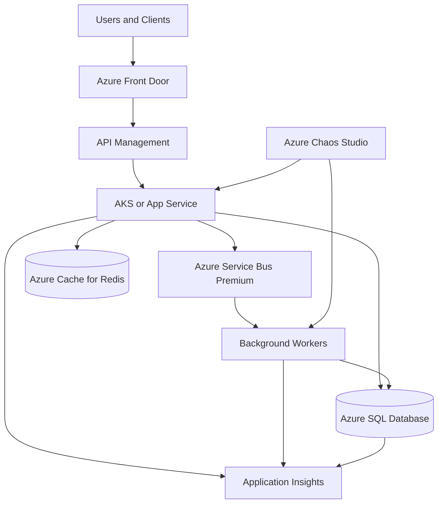
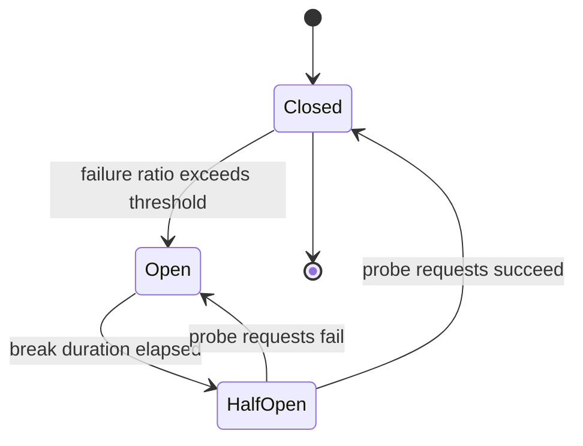
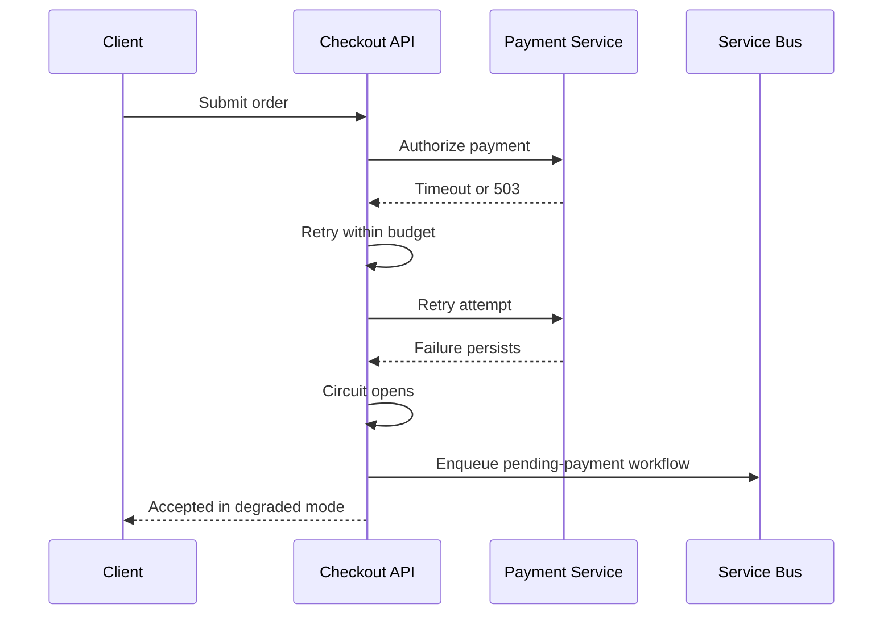

# Fault Tolerance and Resilience

> Part of the **Enterprise Data & AI Architecture Handbook** · Phase-02 — Distributed Systems Deep Dive · Chapter 07.
> Estimated study time: **60 min reading + ~4h labs**.
> **Prerequisites:** read [Consensus and Coordination](01_Consensus_and_Coordination.md), [Replication and Consistency](02_Replication_and_Consistency.md), [Partitioning and Sharding](03_Partitioning_and_Sharding.md), [CAP and PACELC](04_CAP_and_PACELC.md), [Distributed Transactions](05_Distributed_Transactions.md), and [Time, Clocks and Ordering](06_Time_Clocks_and_Ordering.md) first.

---

## Executive Summary

Distributed systems fail by default. Nodes reboot, zones lose connectivity, brokers throttle, downstream APIs brown out, clocks drift, disks saturate, and operator changes introduce new failure modes faster than architecture diagrams admit. The job of resilience engineering is therefore not to promise zero failure. It is to ensure the system fails within known boundaries, sheds non-critical work before core invariants collapse, and recovers automatically or predictably enough that the business remains intact.

Fault tolerance and resilience are related but not identical. **Fault tolerance** is the ability to continue correct service despite some component failures. **Resilience** is the broader capability to absorb disruption, degrade gracefully, recover quickly, and learn from the failure so recurrence is less damaging. A system can be fault tolerant for node loss yet not resilient to dependency brownouts, misconfiguration, or retry storms. In practice, enterprise architects need both.

The Azure-first baseline for this chapter is straightforward. Use bounded timeouts rather than indefinite waiting. Retry only idempotent operations, with exponential backoff and jitter plus a retry budget. Isolate critical paths with bulkheads. Decouple work with durable queues. Prefer zone-redundant or multi-region managed services where the business case supports them. Implement graceful degradation paths such as read-only mode, stale-cache fallback, or asynchronous acceptance. Add explicit load shedding before queues, databases, or thread pools saturate. Then prove the design with chaos experiments, failover drills, and post-incident review.

This chapter builds on [Consensus and Coordination](01_Consensus_and_Coordination.md), [Replication and Consistency](02_Replication_and_Consistency.md), [CAP and PACELC](04_CAP_and_PACELC.md), [Distributed Transactions](05_Distributed_Transactions.md), and [Time, Clocks and Ordering](06_Time_Clocks_and_Ordering.md). Those chapters explain why uncertainty, replication, ordering, and coordination are unavoidable. This chapter turns that theory into production posture: what to do when the network is slow, the leader disappears, the payment service is half alive, or the queue backlog is doubling faster than autoscale can react.

---

## Learning Objectives

By the end of this chapter you will be able to:

1. Distinguish fault tolerance from resilience and explain why both matter in enterprise systems.
2. Design failure detection and timeout strategies that reflect uncertainty rather than pretending failure is binary.
3. Apply retries, circuit breakers, and bulkheads without creating retry storms or shared-fate collapse.
4. Choose between active-passive, active-active, and quorum-based failover strategies for different workloads.
5. Design graceful degradation and load shedding paths that preserve core business flows.
6. Evaluate Azure-first resilience architectures using concrete platform services, deployment topologies, and operational controls.
7. Use chaos engineering and game days to validate assumptions before real incidents do it for you.
8. Build governance, observability, and cost controls around resilience rather than treating them as afterthoughts.

---

## Business Motivation

- Downtime is only one failure mode. Brownouts, extreme latency, silent data lag, and partial feature loss can damage revenue just as effectively while being harder to detect.
- Customer trust depends on graceful behavior under stress. A checkout flow that returns a clear pending status is often preferable to one that spins, times out, and charges twice.
- Enterprise platforms have deep dependency chains. Identity, networking, DNS, control planes, brokers, storage, and observability each create shared-fate risk if not classified and isolated.
- AI and data platforms are now operational dependencies, not just back-office analytics. Feature stores, approval services, policy engines, and catalog APIs can block transactional work if resilience boundaries are weak.
- Regulatory and contractual commitments turn resilience into a governance concern. Recovery time objective, recovery point objective, and error budget decisions become board-level questions when outages affect finance, healthcare, or critical infrastructure.
- Cloud bills can increase sharply when poor retry behavior, over-replication, or panic autoscaling is used as a substitute for disciplined resilience design.

---

## History and Evolution

- **Mainframe and transaction monitor era:** tightly controlled environments emphasized redundancy, failover, and restartable batch patterns for business continuity.
- **Tandem and fault-tolerant hardware systems:** showed that high availability could be engineered through redundant components and failure containment, but at high cost and limited flexibility.
- **Distributed systems research era:** consensus, failure detectors, and replication theory formalized why partial failure must be treated probabilistically rather than as a simple up-or-down check.
- **Early web scale:** large internet properties discovered that dependency timeouts, overload collapse, and retry amplification were often more dangerous than clean crashes.
- **Release It and circuit breakers:** operational patterns such as circuit breakers, bulkheads, and backpressure moved from specialist lore into mainstream engineering practice.
- **Netflix chaos engineering era:** failure injection became a proactive design discipline instead of a postmortem wish list.
- **SRE and error budgets:** reliability became an explicitly managed product property with service-level indicators and organizational trade-offs.
- **Managed cloud era:** cloud services reduced some hardware failure burden while introducing new control-plane, configuration, and regional blast-radius concerns.

---

## Why This Technology Exists

Fault tolerance and resilience exist because real systems experience **partial failure**, not neat stop-the-world failure. One dependency can be slow while another is healthy. One availability zone can be impaired while the region control plane still answers. One broker partition can lag while others are fine. One service can accept connections but fail every expensive call. If software responds to all of these conditions the same way, the outcome is usually cascading failure.

The technology exists to answer a practical set of questions:

1. How do we detect that something is wrong without waiting forever?
2. Which failures should be retried, and how often?
3. When should we stop calling a dependency that is already hurting us?
4. How do we isolate one overloaded component so it does not starve everything else?
5. What functionality can be degraded or deferred while protecting core commitments?
6. How do we fail over data and traffic without split-brain or unacceptable loss?
7. How do we test these assumptions before a real outage?

Without resilience patterns, distributed systems mostly convert small failures into larger ones.

---

## Problems It Solves

- Limits the blast radius of dependency failure, overload, and misconfiguration.
- Reduces latency amplification caused by unbounded waiting and uncontrolled retries.
- Preserves critical workflows during partial service degradation.
- Improves recovery speed through explicit failover, replay, and restart strategies.
- Makes overload survivable through backpressure and load shedding.
- Provides a repeatable way to validate reliability assumptions with chaos testing and drills.
- Supports clearer incident response because the system has defined degraded modes rather than undefined behavior.

---

## Problems It Cannot Solve

- It cannot make impossible business requirements achievable. If the business demands zero latency, zero loss, zero downtime, and zero cost simultaneously, architecture cannot satisfy that.
- It cannot fully protect against every correlated failure. Region-wide identity, DNS, or control-plane failures can still overwhelm poorly segmented estates.
- It cannot remove the need for correct domain design. A bad aggregate boundary or unsafe dual-write workflow remains risky even behind resilient infrastructure.
- It cannot replace capacity planning. Retries and autoscale cannot manufacture throughput that the downstream data store fundamentally lacks.
- It cannot prove correctness for side effects that are not idempotent or not compensatable.
- It cannot eliminate human operational error; it can only reduce the blast radius and improve recovery paths.

---

## Core Concepts

### Failure Models

Most enterprise systems design for crash, omission, delay, and partition failures. They do not normally design for Byzantine behavior, but they still face logically inconsistent states caused by software defects or unsafe operator intervention. The architectural rule is to name which failure model you are handling rather than use the word failure as if it were one thing.

### Failure Detection and Suspicion

Failure detectors rarely prove that a dependency is dead. They produce **suspicion** based on heartbeats, probe failures, timeout breaches, or quorum loss. This matters because aggressive detection thresholds create false positives, while lenient ones increase mean time to recovery. [Time, Clocks and Ordering](06_Time_Clocks_and_Ordering.md) already showed why timeout interpretation depends on uncertain clocks and network delay.

### Timeouts and Deadlines

Timeouts should be end-to-end budgets, not arbitrary per-hop guesses. A request with a 2-second client deadline cannot safely traverse five synchronous dependencies each allowed to wait 2 seconds. The practical design is deadline propagation plus smaller hop budgets for queueing, connect, read, and write phases.

### Retries and Retry Budgets

Retries are a controlled bet that a failure is transient. They only help when:

- the operation is idempotent or safely deduplicated,
- the dependency is likely to recover quickly,
- the caller has budget left,
- and the retry will not worsen overload.

Exponential backoff with jitter is the default. Fixed-interval immediate retries are usually harmful. Retry budgets cap the total additional load a client class is allowed to create during incidents.

### Circuit Breakers

Circuit breakers protect callers from repeatedly invoking a failing dependency. They transition through states such as closed, open, and half-open based on error ratio, throughput threshold, and sampling duration. The goal is not to hide failure. It is to stop self-harm and create space for fallback behavior.

### Bulkheads

Bulkheads isolate resources so one failure domain does not starve unrelated workloads. This can mean separate thread pools, queue partitions, node pools, caches, or even entire cells. If the reporting job can starve checkout CPU, there is no real isolation.

### Replication and Failover

Failover strategy must match consistency and business tolerance:

- **Active-passive:** simpler data correctness, slower failover, usually lower steady-state cost.
- **Active-active:** better locality and capacity, higher conflict and coordination complexity.
- **Quorum-based systems:** tolerate some failures while preserving write safety, at the price described in [CAP and PACELC](04_CAP_and_PACELC.md).

### Graceful Degradation and Load Shedding

Graceful degradation removes non-critical features or weakens freshness while keeping core commitments alive. Load shedding rejects or delays work before saturation causes systemic collapse. Common tactics include read-only mode, stale-cache reads, asynchronous acceptance, queue admission control, and per-tenant rate limiting.

### Resilience Objectives

Availability, latency, durability, RTO, RPO, and error budgets are the control variables. Teams that discuss resilience without explicit objectives usually overbuild the wrong layer and under-instrument the layer that will actually fail.

### Chaos Engineering

Chaos engineering is disciplined hypothesis testing in production-like systems. It is not random destruction. A good experiment states the steady-state signal, injects one plausible fault, defines abort conditions, and verifies that the system contains the blast radius as designed.

---

## Internal Working

### Failure Detection Loops

A healthy production system uses multiple signals, not one. Liveness probes, readiness probes, dependency health checks, queue lag, error-rate thresholds, quorum status, and business heartbeat events each expose different failure modes. Readiness should answer whether the instance can receive more work safely. Liveness should answer whether the process needs restart. Deep health checks that invoke every downstream service can turn the health system into a dependency amplifier.

### Timeout Propagation

Client deadlines should be passed through the request path so each service knows how much useful time remains. A dependency call made after the deadline is already almost spent is often wasteful. Modern service libraries can combine total timeout, per-attempt timeout, and cancellation propagation so a retry does not outlive the caller's interest.

### Circuit Breaker State Machine

Breakers start closed. If failure ratio exceeds threshold with enough volume, they open and fail fast for a cooling-off period. In half-open state, a limited number of probes are allowed through. If the dependency recovers, the breaker closes; otherwise it reopens. Correct thresholds depend on traffic shape. A breaker tuned for high-volume APIs can behave badly on low-volume admin endpoints.

### Replication and Failover Flow

Stateful failover usually involves four steps:

1. detect likely primary failure,
2. establish whether failover is safe,
3. promote or redirect to a new primary,
4. fence off the old primary to avoid split-brain writes.

This is why resilience cannot be separated from [Consensus and Coordination](01_Consensus_and_Coordination.md) and [Replication and Consistency](02_Replication_and_Consistency.md). Unsafe promotion is not resilience; it is data corruption with faster recovery messaging.

### Load Shedding Control Loops

Load shedding decisions are often driven by queue depth, CPU saturation, thread pool exhaustion, downstream error rate, or admission token availability. Good systems shed the cheapest or lowest-priority work first: recommendation refresh, analytics side effects, report generation, or non-critical notifications. They preserve authentication, checkout, entitlement validation, and other core transaction paths as long as possible.

### Chaos Experiment Lifecycle

An experiment begins with a hypothesis such as: if one Event Hubs consumer group stalls, ingestion lag alerting fires within 5 minutes and order acceptance remains unaffected because the operational path is decoupled. The team defines steady-state metrics, injects the fault in a limited blast radius, watches behavior, and records whether reality matched architecture. The learning is the actual deliverable.

---

## Architecture

The recommended resilience architecture has five layers:

1. **Edge protection and routing:** Azure Front Door, Application Gateway, or API Management enforce rate limits, health probes, and traffic steering.
2. **Application isolation:** AKS, App Service, Functions Premium, or Container Apps run services with bounded resource pools, readiness probes, and per-service resilience policies.
3. **Asynchronous decoupling:** Azure Service Bus or Event Hubs absorb spikes and isolate producer latency from consumer recovery time.
4. **State and failover:** Azure SQL Database, Azure Database for PostgreSQL, Cosmos DB, Redis, and object storage use explicit replication and failover posture.
5. **Control and observability:** Azure Monitor, Application Insights, Log Analytics, and Azure Chaos Studio validate and govern the system.

The key architectural principle is **do not spend resilience budget uniformly**. Protect the business path first. Order creation, payment authorization, and access control deserve stronger isolation than recommendation refresh or back-office synchronization. This is the same selective rigor principle emphasized in [Distributed Transactions](05_Distributed_Transactions.md).

---

## Components

| Component | Responsibility | Azure-first implementation |
|---|---|---|
| Global traffic entry | Route users to healthy regions and absorb edge attacks | Azure Front Door Standard or Premium |
| Regional API gateway | Apply auth, quotas, and request shaping | API Management Premium or Application Gateway WAF |
| Resilient application runtime | Execute business logic with probes and autoscale | AKS, App Service Premium v3, Functions Premium |
| Async buffer | Decouple spikes and downstream recovery | Service Bus Premium, Event Hubs Premium or Standard |
| Stateful primary store | Preserve authoritative state | Azure SQL Database, PostgreSQL Flexible Server, Cosmos DB |
| Cache and fallback store | Support degraded reads and relieve origin | Azure Cache for Redis |
| Health and control plane | Measure, alert, and trigger operations | Azure Monitor, Application Insights, Log Analytics |
| Chaos platform | Inject safe faults and validate hypotheses | Azure Chaos Studio |
| Backup and DR tooling | Protect restore and region-recovery objectives | Azure Backup, SQL backups, geo-restore, Site Recovery where relevant |
| Identity and secret boundary | Prevent auth and key failures from becoming broad outages | Microsoft Entra ID, managed identity, Key Vault |

---

## Metadata

Resilience decisions depend on metadata as much as infrastructure. Common fields include:

- `request_id` and `traceparent` for cross-service correlation.
- `deadline_utc` or remaining budget metadata propagated from the caller.
- `retry_attempt` and `retry_reason` for diagnosing amplification.
- `idempotency_key` for safe replay of side effects.
- `dependency_tier` to distinguish critical from best-effort downstream calls.
- `breaker_state` or sampled breaker metrics for health dashboards.
- `region`, `zone`, `cell`, or `node_pool` to detect correlated impact.
- `degradation_mode` such as stale-cache, read-only, async-accepted, or shed.
- `rto_class` and `rpo_class` for governed recovery expectations.
- `chaos_experiment_id` so intentionally injected faults do not look like unexplained outages.

Without this metadata, operators see red metrics but cannot explain why the system chose a fallback path or whether it was the correct one.

---

## Storage

Storage resilience is mostly about durability boundaries and recovery posture.

- **Azure SQL Database:** choose service tiers and zone redundancy according to latency and RTO targets; use backups and failover groups deliberately, not by marketing slogan.
- **Azure Database for PostgreSQL Flexible Server:** evaluate zone-redundant high availability, backup retention, and planned failover behavior.
- **Azure Cosmos DB:** use multi-region reads, optional multi-write only when conflict semantics are understood, and explicit partition design so failover does not create hot spots.
- **ADLS Gen2 and object storage:** treat durable storage as a recovery substrate, not a low-latency failover substitute.

Data-layer resilience must align with transaction and replication semantics from [Replication and Consistency](02_Replication_and_Consistency.md). Fast failover into a replica with stale or conflicting state may satisfy uptime metrics while violating business correctness.

---

## Compute

Compute resilience is largely about restartability, isolation, and controlled scale.

- Use multiple instances across zones when the workload justifies it.
- Configure readiness probes so traffic stops before the instance becomes obviously dead.
- Use Pod Disruption Budgets and carefully separated node pools on AKS for critical workloads.
- Avoid running all critical services on one autoscale plan or one shared node pool if their failure modes differ.
- For Functions Premium or App Service, understand cold start, instance warmup, deployment slot behavior, and scale triggers before calling the platform resilient.

Stateless compute can usually fail over faster than stateful compute. The operational mistake is assuming that makes the whole application stateless.

---

## Networking

Many outages are really networking or name-resolution problems wearing another label.

- Global routing must steer away from unhealthy regions without creating flapping.
- Private endpoints and VNET integration improve security posture but add networking dependencies that must be tested under failover.
- DNS TTL choices affect recovery speed and cache staleness.
- East-west network policy in Kubernetes can contain blast radius, but misconfiguration can create self-inflicted partitions.
- Connection pool exhaustion and SYN backlog saturation are resilience failures as much as performance failures.

Timeout design from [Time, Clocks and Ordering](06_Time_Clocks_and_Ordering.md) matters here. A network that is slow enough to violate a deadline is operationally equivalent to one that is down for that workflow.

---

## Security

Security and resilience are tightly coupled.

- DDoS protection, WAF policy, and rate limiting are resilience controls.
- Secret rotation failures can cause availability incidents.
- Identity-provider outages can become global application outages if no degradation posture exists.
- Break-glass access, privileged recovery paths, and audit trails are operational necessities during major incidents.

Azure-first guidance:

- Use managed identities to reduce secret distribution failure.
- Use Key Vault with clear outage assumptions and local caching where safe.
- Protect public endpoints with Front Door WAF and DDoS controls.
- Separate customer-facing throttles from internal control-plane permissions.

Never implement graceful degradation by disabling critical security guarantees. A resilient insecure system is still a failed system.

---

## Performance

Resilience mechanisms change latency and throughput behavior.

- Retries add latency and can multiply load.
- Circuit breakers reduce wasted latency but increase fast-fail responses.
- Bulkheads preserve tail latency for high-priority workloads at the expense of lower-priority throughput.
- Queues improve acceptance under spikes but increase completion latency.
- Active-active replication can improve locality while adding coordination cost.

The right performance metric is not raw throughput alone. It is useful work completed correctly under expected and degraded conditions.

---

## Scalability

Scalability and resilience reinforce each other when done correctly.

- Partition by tenant, region, or business entity so overload and failure remain local.
- Use queue-based load levelling so producer scale does not demand immediate consumer scale.
- Isolate admin, batch, and user-facing traffic with separate pools or cells.
- Prefer horizontal scale for stateless components, but ensure downstream stateful services and caches have matching scale strategy.
- Scale observability pipelines too; a blind but technically healthy system is not operationally resilient.

If every new tenant shares one thread pool, one cache, and one database bottleneck, the system is not truly scalable or resilient.

---

## Fault Tolerance

Fault tolerance is the direct engineering of continued service despite component loss.

- **Node failure tolerance:** multiple instances across zones or racks.
- **Dependency failure tolerance:** fallbacks, local caches, queues, or asynchronous acceptance.
- **Data failure tolerance:** replica promotion, backups, WAL replay, geo-redundancy, and integrity checks.
- **Traffic failure tolerance:** health-based routing, circuit breakers, and regional evacuation.
- **Operator failure tolerance:** staged rollout, deployment slots, canary release, and automated rollback.

The harder question is always what degree of correctness remains under tolerance. A system that stays up by silently dropping payment confirmations or accepting writes into split-brain state is not actually fault tolerant in the business sense.

---

## Cost Optimization

Resilience spending should follow business impact, not fear.

- Use zone redundancy for critical services before jumping to full active-active multi-region everywhere.
- Keep warm standbys only where RTO requires them; cold restore can be correct for lower tiers.
- Prefer asynchronous decoupling and graceful degradation over brute-force overprovisioning.
- Measure the cost of retries, dead-letter growth, and duplicate work during incidents.
- Budget for chaos experiments and DR drills as cost-avoidance, not optional overhead.

The cheapest resilient architecture is the one that isolates critical commitments well enough that non-critical work can be delayed or shed.

**Worked FinOps example — warm standby vs. cold restore break-even (illustrative rates; verify current figures in the Azure Pricing Calculator).** A warm active-passive standby for an Azure SQL Database Business Critical tier replica costs roughly the full price of a second instance running continuously — illustratively, a `Business Critical` 8-vCore replica at ≈$2.50/hour ≈ **$1,800/month**, purely for standby capacity that (ideally) never serves production traffic. A cold-restore posture instead relies on geo-redundant backups (a much smaller ongoing storage cost, illustratively $50-150/month for typical backup volumes) plus a restore time of 30-60 minutes. The break-even question is explicit: if the workload's RTO requirement is under ~15 minutes, warm standby is close to mandatory and the $1,650-1,750/month premium is the cost of that RTO. If the workload can tolerate a 30-60 minute RTO (most internal or non-transactional systems), cold restore saves roughly **$20,000/month** for that one database with no resilience gap relative to the actual, documented requirement. The mistake this playbook prevents is buying warm-standby-grade RTO for a workload whose real business requirement never demanded it.

---

## Monitoring

Minimum resilience monitoring signals:

- availability and successful request rate by endpoint,
- p50, p95, and p99 latency by dependency and route,
- timeout count, retry count, and retry budget burn,
- circuit breaker open events and half-open probe results,
- queue depth, oldest message age, and dead-letter count,
- readiness failures, restart count, and pod eviction rate,
- failover events, replica lag, and RPO exposure,
- load shedding count by tenant and feature,
- stale-cache fallback usage and degraded-mode duration,
- chaos experiment results and aborted experiments.

Use Azure Monitor alerts that distinguish hard down from soft degraded. A service can be available and still unacceptable.

---

## Observability

Observability is how the organization explains why the system degraded the way it did.

Best practices:

- propagate trace context end to end,
- tag spans with retry attempt, breaker state, dependency tier, and degradation mode,
- correlate application symptoms with platform signals such as node pressure and replica lag,
- log operator actions such as forced failover, replay, or manual traffic shift,
- preserve business outcomes in telemetry, not only HTTP status codes.

An outage timeline built only from response codes is usually too shallow. The real question is whether critical business outcomes continued, degraded safely, or corrupted silently.

---

## Operational Response Playbook

The two incident types that most benefit from a pre-agreed signal → detection → response playbook, rather than ad hoc incident-time judgment calls.

### Playbook 1: Retry storm / cascading overload

| Step | Action |
|---|---|
| **Signal** | A dependency's error rate rises, then request volume to that dependency rises *further* rather than falling, while overall latency degrades across unrelated call paths sharing the same connection pool or thread pool. |
| **Detection query (KQL, Application Insights)** | `requests \| where success == false \| summarize FailureCount = count() by bin(timestamp, 1m), name \| join kind=inner (dependencies \| summarize CallCount = count() by bin(timestamp, 1m), target) on timestamp \| where CallCount > 2 * avg_prev_CallCount` (compare call volume against its own recent baseline; a spike concurrent with failures is the retry-storm signature). |
| **Immediate remediation** | Trip the circuit breaker manually if it has not already opened; apply an emergency retry-budget cap at the gateway/API Management layer to stop the amplification before addressing the original dependency failure. |
| **Root-cause check** | Confirm whether retries used fixed-interval, no-jitter backoff (the near-universal root cause of synchronized retry waves) versus exponential backoff with jitter. |
| **Follow-up** | Standardize the shared resilience-policy library (backoff, jitter, retry budget) platform-wide so no team can reintroduce fixed-interval retries; add retry-rate and breaker-state as monitored SLIs, not just availability. |

### Playbook 2: Replica lag / failover-readiness breach

| Step | Action |
|---|---|
| **Signal** | A read replica's lag exceeds the documented RPO bound, or a failover drill/automated check shows the standby is not currently promotable within the target RTO. |
| **Detection query (KQL, Azure Monitor)** | Query the data store's native replication-lag metric (Cosmos DB `ReplicationLatency`, Azure SQL geo-replication `replication_lag_sec`) and alert when it exceeds the configured `rpo_class` threshold from the resilience metadata schema. |
| **Immediate remediation** | Determine whether lag is caused by a transient network blip (self-healing, monitor) or sustained write-volume/throughput saturation (needs write throttling, partition rebalancing, or a bigger replica tier). |
| **Root-cause check** | Confirm the failover runbook was last tested against the *current* data volume and topology — an untested runbook is not a verified RTO/RPO, regardless of what the architecture diagram claims. |
| **Follow-up** | Feed the incident into the next scheduled chaos-engineering game day as a regression test, and update the resilience-tier classification if the workload's actual RPO/RTO tolerance has changed. |

---

## Governance

Resilience requires standards, not heroics.

Governance guardrails:

- classify workloads into resilience tiers with explicit RTO, RPO, and SLO targets,
- require ADRs for active-active data designs, manual failover procedures, and circuit-breaker exceptions,
- standardize retry policies and forbid unbounded retries in shared libraries,
- require chaos experiments and failover drills before tier-1 production launch,
- define ownership for dead-letter queues, degraded modes, and manual compensation,
- audit whether critical dependencies such as identity, DNS, and secrets are treated as shared-fate risks.

This is the point where platform engineering, enterprise architecture, and operations discipline have to meet.

---

## Trade-offs

| Choice | Strengths | Weaknesses | Best fit | Avoid when |
|---|---|---|---|---|
| Active-passive failover | Simpler correctness and operator reasoning | Standby cost and slower regional recovery | Transactional systems with strict write authority | Ultra-low latency global write locality is required |
| Active-active | Better locality and utilization | Conflict resolution and broader blast radius | Read-heavy or partitioned workloads with clear ownership | Teams cannot explain write conflict semantics |
| Aggressive retries | Can recover transient faults quickly | Retry storm risk and amplified tail latency | Short-lived transient network or throttling events | Downstream is overloaded or operation is not idempotent |
| Circuit breaker | Prevents repeated self-harm | Requires careful tuning and fallbacks | High-volume dependency brownouts | Low-volume endpoints with no meaningful fallback |
| Bulkheads | Preserves priority workload health | Can strand unused capacity | Multi-tenant or mixed-criticality systems | Capacity is tiny and isolation overhead dominates |
| Queue-based decoupling | Absorbs spikes and isolates dependencies | Adds completion delay and replay complexity | Asynchronous business steps | Immediate synchronous confirmation is mandatory |
| Graceful degradation | Preserves core value under stress | Product complexity and conditional behavior | Tiered user experience or partial functionality | Every feature is equally critical |
| Load shedding | Prevents full collapse | Some users or features are rejected | Extreme saturation scenarios | Traffic is low and root issue is correctness, not load |

---

## Decision Matrix

| Use case | Failure posture needed | Recommended pattern | Azure-first stack | Open-source analogue |
|---|---|---|---|---|
| Checkout with external payment | Preserve order capture, isolate payment brownouts | Async acceptance, idempotent retries, circuit breaker, saga compensation | Front Door + AKS/App Service + Service Bus + SQL | Nginx + Kubernetes + Kafka + PostgreSQL |
| Real-time fraud scoring | Fast fallback with stale or heuristic mode | Short timeout, breaker, cached fallback, load shed low-priority enrichment | APIM + AKS + Redis + Monitor | Kubernetes + Redis + Prometheus |
| Internal reporting | Best-effort, delay acceptable | Queue-based processing and aggressive shedding under pressure | Event Hubs + Databricks + ADLS | Kafka + Spark/Flink + object storage |
| Multi-region reference data API | Continue read service during regional loss | Active-active reads, controlled write authority, cache fallback | Front Door + Cosmos DB or SQL read replicas | CDN or Nginx + PostgreSQL replicas |
| ML feature ingestion | Survive producer spikes and consumer lag | Backpressure, partitioned queues, dead-letter routing | Event Hubs + Databricks + Delta Lake | Kafka + Flink/Spark |
| Identity-dependent SaaS portal | Preserve core admin paths during IdP issues | Session caching, degraded admin read mode, fail-closed on high-risk actions | Front Door + App Service + Redis + Entra ID | Kubernetes + Redis + external IdP |

Decision rule:

1. Define which business capability must remain alive.
2. Define what degraded mode is acceptable.
3. Choose the cheapest pattern that preserves that capability without corrupting state.

---

## Design Patterns

### Deadline Propagation

Carry remaining request budget through every hop so downstream work can fail fast when success is no longer possible.

### Retry with Exponential Backoff and Jitter

Retry only transient, safe failures. Randomize delay so clients do not synchronize and stampede the dependency.

### Retry Budget

Limit total retry amplification per client or route during incidents.

### Circuit Breaker

Trip open on sustained failure ratio, then probe cautiously in half-open state.

### Bulkhead Isolation

Separate compute pools, queue partitions, or connection pools by criticality.

### Queue-Based Load Levelling

Accept work durably, then process at the rate the downstream system can sustain.

### Transactional Outbox and Idempotent Consumers

Use the pattern from [Distributed Transactions](05_Distributed_Transactions.md) so replay and recovery do not create missing or duplicate side effects.

### Read-Only or Stale-Read Degradation

Preserve visibility when write capacity or write authority is impaired.

### Token-Bucket or Priority Load Shedding

Reject lower-priority work before critical resources saturate.

### Cell-Based Architecture

Split the platform into smaller, semi-independent units so failures remain local.

---

## Anti-patterns

- Infinite retries with no deadline or budget.
- Using the same timeout for every dependency regardless of latency profile and criticality.
- Running critical and non-critical work in the same thread pool, queue, or node pool.
- Deep health checks that require every downstream dependency to succeed before the instance is considered ready.
- Calling a broken dependency synchronously from every request path because the response is usually fast on a good day.
- Active-active writes without conflict semantics, fencing, or operator clarity.
- Declaring chaos engineering complete because one node reboot test passed in staging.
- Treating manual failover instructions in a wiki as a resilience strategy.

---

## Common Mistakes

- Retrying 429 and 5xx errors identically without respecting server intent or backoff.
- Opening circuit breakers on too little traffic, causing flapping.
- Forgetting that queue backlogs are a latency problem even when request acceptance remains healthy.
- Assuming managed cloud services remove the need for DR drills and dependency tiering.
- Failing over application traffic faster than data replication can safely support.
- Not instrumenting degraded modes separately, which makes them invisible until support tickets arrive.
- Letting observability or identity become a single shared-fate dependency with no plan.
- Testing only clean crash failure instead of slowdown, throttling, packet loss, and partial regional impairment.

---

## Best Practices

- Design for partial failure first, total failure second.
- Prefer explicit deadlines to implicit waiting.
- Make retries safe through idempotency and bounded through budgets.
- Protect high-value paths with bulkheads and priority queues.
- Fail fast when the dependency is already hurting you and a fallback exists.
- Separate control-plane and data-plane recovery assumptions.
- Rehearse failover and degraded modes under real telemetry and runbook conditions.
- Preserve business correctness over vanity availability metrics.

---

## Enterprise Recommendations

Recommended enterprise baseline:

1. **Standard client policy:** deadline propagation, exponential backoff with jitter, retry budget, and circuit breaker defaults in shared libraries.
2. **Standard workload tiers:** tier-1 services require zone resilience, tested DR runbooks, and quarterly game days.
3. **Standard async posture:** use queues or topics for non-immediate work and isolate customer-facing paths from downstream batch pressure.
4. **Standard degraded modes:** every critical service must define what it can still do when one core dependency is unavailable.
5. **Standard validation:** use chaos experiments and controlled failover drills before calling a design resilient.

### ADR Example

**Context:** A global order platform currently calls payment, loyalty, notification, and analytics dependencies synchronously from the checkout API. During payment-provider brownouts, thread pools saturate, retries stack, and even pure order-read endpoints degrade. The business requires order capture to remain available with clear pending status during transient payment incidents.

**Decision:** Move non-critical downstream work behind Azure Service Bus Premium. Keep payment synchronous but bounded by a strict deadline, idempotency key, retry budget, and circuit breaker. Introduce a degraded mode that accepts the order as pending-payment when policy allows. Deploy stateless services across zones on AKS, keep SQL write authority regional, and validate with Azure Chaos Studio and controlled payment-provider fault injection.

**Consequences:** Core order capture becomes more resilient and isolated. Some orders complete asynchronously, which adds workflow and support complexity. Operational teams must monitor queue age, pending-payment rate, and compensation outcomes.

**Alternatives considered:**

- keep all calls synchronous with more autoscale: rejected because it amplifies overload and does not isolate failures,
- move all steps to asynchronous saga immediately: rejected because payment confirmation latency remains business-critical for some channels,
- full active-active writes across regions: rejected because data and payment conflict semantics do not justify the complexity.

---

## Azure Implementation

### Reference Architecture

An Azure-first resilience architecture for a critical customer workflow typically includes:

- Azure Front Door Standard or Premium for global routing, WAF, and origin health.
- API Management Premium or Application Gateway WAF for regional ingress policy and rate control.
- AKS or App Service Premium v3 for stateless business services with readiness probes and autoscale.
- Azure Service Bus Premium for queue-based decoupling and dead-letter handling.
- Azure SQL Database or PostgreSQL Flexible Server for authoritative state, with explicit HA and DR posture.
- Azure Cache for Redis for short-lived fallback reads and hot-path offload.
- Azure Monitor, Application Insights, and Log Analytics for resilience telemetry.
- Azure Chaos Studio for fault injection and experiment management.

### .NET Resilience Pipeline Example

```csharp
var pipeline = new ResiliencePipelineBuilder<HttpResponseMessage>()
    .AddTimeout(TimeSpan.FromSeconds(2))
    .AddRetry(new RetryStrategyOptions<HttpResponseMessage>
    {
        BackoffType = DelayBackoffType.Exponential,
        UseJitter = true,
        MaxRetryAttempts = 3,
        Delay = TimeSpan.FromMilliseconds(200),
        ShouldHandle = new PredicateBuilder<HttpResponseMessage>()
            .Handle<HttpRequestException>()
            .HandleResult(response =>
                (int)response.StatusCode >= 500 ||
                response.StatusCode == HttpStatusCode.TooManyRequests)
    })
    .AddCircuitBreaker(new CircuitBreakerStrategyOptions<HttpResponseMessage>
    {
        FailureRatio = 0.5,
        MinimumThroughput = 20,
        SamplingDuration = TimeSpan.FromSeconds(30),
        BreakDuration = TimeSpan.FromSeconds(15),
        ShouldHandle = new PredicateBuilder<HttpResponseMessage>()
            .Handle<HttpRequestException>()
            .HandleResult(response => (int)response.StatusCode >= 500)
    })
    .Build();
```

### AKS Deployment with Probes and Isolation

```yaml
apiVersion: apps/v1
kind: Deployment
metadata:
  name: checkout-api
spec:
  replicas: 6
  selector:
    matchLabels:
      app: checkout-api
  template:
    metadata:
      labels:
        app: checkout-api
    spec:
      nodeSelector:
        workload-tier: critical
      containers:
        - name: checkout-api
          image: ghcr.io/example/checkout-api:1.0.0
          resources:
            requests:
              cpu: 500m
              memory: 512Mi
            limits:
              cpu: 1
              memory: 1Gi
          readinessProbe:
            httpGet:
              path: /health/ready
              port: 8080
            periodSeconds: 5
            failureThreshold: 3
          livenessProbe:
            httpGet:
              path: /health/live
              port: 8080
            periodSeconds: 10
            failureThreshold: 3
---
apiVersion: policy/v1
kind: PodDisruptionBudget
metadata:
  name: checkout-api-pdb
spec:
  minAvailable: 4
  selector:
    matchLabels:
      app: checkout-api
```

### SQL Schema for Resilience State and Dead-Letter Triage

```sql
create table dbo.degraded_mode_events (
    event_id uniqueidentifier not null primary key,
    capability nvarchar(128) not null,
    mode nvarchar(64) not null,
    activated_utc datetime2 not null default sysutcdatetime(),
    cleared_utc datetime2 null,
    reason nvarchar(256) not null,
    trace_id nvarchar(64) null
);

create table dbo.dead_letter_triage (
    message_id uniqueidentifier not null primary key,
    source_queue nvarchar(128) not null,
    failure_class nvarchar(64) not null,
    first_seen_utc datetime2 not null,
    attempts int not null,
    last_error nvarchar(max) not null,
    owner nvarchar(128) null,
    resolved_utc datetime2 null
);
```

### Azure CLI Provisioning Example

```powershell
az group create --name rg-resilience --location westeurope
az monitor log-analytics workspace create --resource-group rg-resilience --workspace-name law-resilience-weu --location westeurope
az monitor app-insights component create --resource-group rg-resilience --app ai-resilience-weu --location westeurope --workspace law-resilience-weu
az servicebus namespace create --resource-group rg-resilience --name sb-resilience-weu --location westeurope --sku Premium
az aks create --resource-group rg-resilience --name aks-resilience-weu --node-count 3 --node-vm-size Standard_D4s_v5 --generate-ssh-keys --enable-managed-identity
```

### Bicep Example for Service Bus and Monitoring

```bicep
resource law 'Microsoft.OperationalInsights/workspaces@2022-10-01' = {
  name: 'law-resilience-weu'
  location: resourceGroup().location
  properties: {
    retentionInDays: 30
  }
  sku: {
    name: 'PerGB2018'
  }
}

resource appi 'Microsoft.Insights/components@2020-02-02' = {
  name: 'ai-resilience-weu'
  location: resourceGroup().location
  kind: 'web'
  properties: {
    Application_Type: 'web'
    WorkspaceResourceId: law.id
  }
}

resource sb 'Microsoft.ServiceBus/namespaces@2023-01-01-preview' = {
  name: 'sb-resilience-weu'
  location: resourceGroup().location
  sku: {
    name: 'Premium'
    tier: 'Premium'
    capacity: 1
  }
}
```

### Kusto Query for Retry Storm and Degradation Detection

```kusto
requests
| extend retry_attempt = toint(customDimensions.retry_attempt)
| extend degradation_mode = tostring(customDimensions.degradation_mode)
| summarize request_count=count(), retry_count=sum(retry_attempt) by bin(timestamp, 5m), resultCode, degradation_mode
| order by timestamp desc
```

### Azure Operational Guidance

- Use Front Door health probes that represent actual origin health, but avoid probes that recursively depend on every downstream service.
- Use Service Bus Premium for business-critical queues when predictable isolation, dead-lettering, and consistent throughput matter.
- Keep degraded modes explicit in telemetry and product messaging. Hidden degradation becomes support debt.
- Use Azure Chaos Studio to inject pod failure, CPU pressure, or network disruption in a limited blast radius before tier-1 launch.
- Drill regional traffic shift and database failover under live monitoring rather than assuming managed service defaults match business RTO.

---

## Open Source Implementation

### Reference Stack

An enterprise open-source resilience stack commonly uses:

- Kubernetes for isolated deployment and restart control.
- Nginx or an ingress controller for edge routing and rate limiting.
- Kafka for durable decoupling and backpressure-aware ingestion.
- PostgreSQL for authoritative state with replication and failover tooling.
- Redis for hot-path cache fallback where correctness permits.
- Prometheus, Grafana, and OpenTelemetry for telemetry and alerting.

### Prometheus Alert Rule Example

```yaml
groups:
  - name: resilience-alerts
    rules:
      - alert: HighRetryRate
        expr: sum(rate(http_client_retry_total[5m])) by (service) > 50
        for: 10m
      - alert: CircuitBreakerOpen
        expr: max(circuit_breaker_state{state='open'}) by (service) > 0
        for: 2m
      - alert: QueueBacklogAging
        expr: max(queue_oldest_message_seconds) by (queue) > 300
        for: 5m
```

### Kubernetes HPA Example for Queue-Driven Scale

```yaml
apiVersion: autoscaling/v2
kind: HorizontalPodAutoscaler
metadata:
  name: worker-hpa
spec:
  scaleTargetRef:
    apiVersion: apps/v1
    kind: Deployment
    name: order-worker
  minReplicas: 2
  maxReplicas: 20
  metrics:
    - type: Resource
      resource:
        name: cpu
        target:
          type: Utilization
          averageUtilization: 70
```

### Operational Pattern

- Partition Kafka topics so tenant or order-level overload stays local.
- Use consumer lag, rebalance churn, and dead-letter volume as first-class resilience signals.
- Keep PostgreSQL failover runbooks tested and fenced; promoting a stale writer is not a success.
- Use Grafana dashboards that separate availability from degraded-mode operation.

This stack is powerful, but more of the resilience surface area belongs directly to the platform team rather than to managed service defaults.

---

## AWS Equivalent (comparison only)

| Azure-first service | AWS equivalent | Advantages in AWS | Disadvantages versus Azure baseline | Migration strategy | Selection criteria |
|---|---|---|---|---|---|
| Azure Front Door | CloudFront plus Route 53 or Global Accelerator | Strong edge and routing ecosystem | More service composition for equivalent routing and protection patterns | Preserve health-routing intent and degraded-mode contracts first | Choose based on global edge posture and existing platform standard |
| API Management / App Gateway | API Gateway / ALB / WAF | Mature managed ingress choices | More pattern branching between services | Migrate ingress policies separately from business services | Choose based on API style and operational model |
| AKS / App Service | EKS / ECS / Elastic Beanstalk / Lambda | Broad runtime choices | Greater fragmentation of resilience controls across products | Keep probes, autoscale, and circuit policy consistent during move | Choose based on container and serverless maturity |
| Service Bus | SQS / SNS / Amazon MQ | Strong queue and fan-out options | No single direct equivalent for all Service Bus workflow behaviors | Map each queue and DLQ contract explicitly | Choose based on command, event, or workflow pattern |
| Azure Monitor / App Insights | CloudWatch / X-Ray | Native telemetry integration | Different query, dashboard, and alert ergonomics | Preserve metadata contract for retries, breaker state, and degradation mode | Choose when operations are already AWS-centric |

AWS can support the same resilience patterns. The migration risk lies in semantics such as failover behavior, queue guarantees, and observability conventions, not in raw service availability claims.

---

## GCP Equivalent (comparison only)

| Azure-first service | GCP equivalent | Advantages in GCP | Disadvantages versus Azure baseline | Migration strategy | Selection criteria |
|---|---|---|---|---|---|
| Azure Front Door | Cloud Load Balancing plus Cloud CDN | Strong global traffic capabilities | Different operational model for some edge protections | Recreate health probing and traffic policy carefully | Choose based on global user distribution and GCP standardization |
| AKS / App Service | GKE / Cloud Run / App Engine | Strong container and serverless options | Different autoscale and runtime assumptions | Preserve probe, bulkhead, and retry semantics | Choose based on container density and ops model |
| Service Bus / Event Hubs | Pub/Sub | High-scale managed messaging | Different workflow-control semantics from queue-first designs | Re-evaluate async workflow boundaries during migration | Choose based on event fan-out versus strict queue workflow needs |
| Azure SQL / PostgreSQL / Cosmos | Cloud SQL / AlloyDB / Spanner / Firestore | Broad data choices including externally consistent Spanner | Wider conceptual spread can complicate platform standards | Keep RTO, RPO, and conflict semantics explicit before cutover | Choose based on data model and global consistency need |
| Azure Monitor | Cloud Monitoring / Cloud Trace | Mature observability stack | Different telemetry workflow | Preserve resilience metadata names and alerts | Choose when platform ops are already GCP-first |

GCP is particularly strong when workloads need globally coordinated data platforms such as Spanner, but most application resilience questions still come down to the same fundamentals: deadlines, isolation, backpressure, failover safety, and tested degraded modes.

---

## Migration Considerations

Migration usually starts from one of four weak states:

1. synchronous fan-out from user-facing APIs,
2. shared infrastructure with no workload isolation,
3. failover procedures that exist only on paper,
4. observability that measures uptime but not degraded correctness.

Recommended migration sequence:

- inventory critical paths and classify dependency tiers,
- add idempotency and deadline propagation before adding retries,
- move non-critical synchronous work behind queues,
- introduce circuit breakers and degraded modes on one route at a time,
- isolate critical services with dedicated pools or cells,
- rehearse data failover and traffic shift with explicit abort criteria,
- add chaos experiments after the first stable fallback path exists,
- retire legacy unbounded retry code and undocumented manual recovery steps.

Do not migrate to active-active or multi-region topology before the single-region degraded-mode story is coherent. Complexity compounds faster than confidence.

---

## Mermaid Architecture Diagrams

### Azure Resilience Reference Architecture



### Circuit Breaker State Model



### Graceful Degradation and Load Shedding Flow



These three views emphasize that resilience is both structural and behavioral: topology matters, but so do runtime state transitions and fallback flow.

---

## End-to-End Data Flow

Consider a customer checkout on the Azure reference architecture:

1. The client request enters through Azure Front Door and API Management.
2. The checkout API validates the request, propagates a deadline, and starts a local transaction for order intent.
3. A synchronous payment call is attempted with a 2-second timeout and bounded retries.
4. The payment provider begins returning 503 and high latency.
5. Retry policy consumes part of the budget with exponential backoff and jitter.
6. Failure ratio crosses threshold; the payment circuit breaker opens.
7. The API writes the order as pending-payment, appends a workflow message, and returns an accepted-but-pending response.
8. Service Bus isolates downstream retry and recovery from the user-facing thread pool.
9. Background workers continue processing pending-payment workflows as the dependency recovers.
10. Application Insights and Log Analytics show the shift into degraded mode, breaker state, queue age, and eventual recovery.

This is resilience in practice: the system stops pretending the dependency is healthy, preserves the core business record, and contains the blast radius.

---

## Real-world Business Use Cases

- **E-commerce checkout:** preserve order capture during payment or inventory brownouts.
- **Banking and fintech APIs:** protect ledger correctness while degrading non-essential enrichment.
- **Healthcare scheduling:** preserve appointment booking while deferring notifications and analytics.
- **IoT ingestion:** absorb bursty device traffic and isolate slow downstream consumers.
- **SaaS control planes:** keep tenant read and admin visibility alive during background maintenance or queue lag.
- **Data and AI platforms:** maintain ingestion and governance correctness while shedding non-critical recomputation.

---

## Industry Examples

- **Netflix Chaos Monkey and Simian Army:** made failure injection a routine engineering discipline instead of an exotic exercise.
- **Google SRE practices:** institutionalized error budgets and reliability trade-offs as a product decision, not just an operations concern.
- **Public cloud regional incidents:** repeatedly show that shared control-plane dependencies, DNS, and identity are frequent blast-radius multipliers.
- **Queue-centric payment and commerce systems:** commonly preserve intake and reconcile asynchronously rather than coupling customer experience to every downstream dependency.
- **Modern stream-processing platforms:** use backpressure and checkpointing specifically because overload without flow control is a correctness problem, not just a speed problem.

---

## Case Studies

### Case Study 1: AWS S3 2017 Outage as a Blast-Radius Lesson

The 2017 AWS S3 outage is a widely discussed reminder that shared control-plane operations can have broad downstream impact. The lesson for enterprise architects is not vendor mockery. It is that highly available applications must still classify foundational dependencies and plan for unexpected correlated failure in storage, naming, or control surfaces.

### Case Study 2: Payment Brownout in a Retail Platform

An enterprise retailer originally retried payment provider failures synchronously from checkout threads. During a provider brownout, retries multiplied latency, thread pools saturated, and order-read APIs degraded even though they did not call the payment provider. Moving to bounded retries, a circuit breaker, Service Bus decoupling, and pending-payment degraded mode preserved order intake and made recovery auditable.

### Case Study 3: Analytics Pipeline Saturation Affecting Operational APIs

A platform shared one Kafka cluster, one consumer worker pool, and one PostgreSQL replica set between operational events and heavy nightly analytics backfill. Under spike load, lag and connection starvation propagated into customer-facing APIs. The fix was bulkhead isolation: separate topics, consumer groups, connection pools, and capacity tiers for operational versus analytical workloads.

These cases show the recurring pattern: most outages become larger because systems lack isolation, not because the first fault was exotic.

---

## Hands-on Labs

1. **Retry and timeout lab:** add deadline propagation, bounded retries, and jitter to an API calling a flaky dependency.
2. **Circuit breaker lab:** simulate a brownout and verify fast-fail plus fallback behavior.
3. **Bulkhead lab:** isolate batch traffic from interactive traffic on AKS using separate node pools or queues.
4. **Failover lab:** trigger controlled database failover and observe RTO, RPO exposure, and application behavior.
5. **Chaos engineering lab:** inject pod failure, CPU pressure, or network delay and verify the steady-state hypothesis.

Each lab should measure business outcome preservation, not just infrastructure survival.

---

## Exercises

1. Explain why retries without idempotency can reduce availability while increasing visible success rate.
2. Design timeout budgets for a request that calls three dependencies inside a 2-second client deadline.
3. Compare active-passive and active-active for a multi-region order platform with one authoritative payment workflow.
4. Identify which features in a SaaS portal should be shed first under severe load and justify why.
5. Describe how you would detect that a circuit breaker is tuned too aggressively.
6. Explain why chaos engineering without a defined steady-state signal is mostly theatre.

---

## Mini Projects

1. Build an Azure-based checkout service with retries, circuit breaker, Service Bus fallback, and a degraded pending-payment mode.
2. Build a Kubernetes worker platform with queue-based autoscale, bulkheads, and Prometheus alerts for backlog age and breaker state.
3. Create a resilience scorecard for an existing internal platform covering deadlines, retries, degraded modes, failover drills, and chaos coverage.

Each mini project should include an ADR, a runbook, and at least one failed experiment that changed the design.

---

## Capstone Integration

This chapter connects directly to the earlier Phase-02 material:

- [Consensus and Coordination](01_Consensus_and_Coordination.md) explains why safe leader change and quorum decisions matter during failover.
- [Replication and Consistency](02_Replication_and_Consistency.md) defines the replica and conflict semantics that resilience mechanisms must preserve.
- [Partitioning and Sharding](03_Partitioning_and_Sharding.md) explains how blast radius can be contained through partition boundaries and cells.
- [CAP and PACELC](04_CAP_and_PACELC.md) frames the availability versus consistency choices during partition and the latency cost of stronger guarantees.
- [Distributed Transactions](05_Distributed_Transactions.md) provides the outbox, idempotency, and compensation patterns needed for resilient workflow recovery.
- [Time, Clocks and Ordering](06_Time_Clocks_and_Ordering.md) grounds timeout design, failure detection, and replay behavior in real clock uncertainty.

The capstone exercise for Phase-02 should require a full multi-region service design that names failure detectors, deadlines, retry policy, failover strategy, degraded modes, and chaos validation plan.

---

## Interview Questions

1. What is the difference between fault tolerance and resilience?
   **A:** Fault tolerance is a system's ability to continue operating correctly despite a component failure (masking the fault); resilience is the broader ability to detect, absorb, and recover from disruption, including degrading gracefully and returning to normal operation — resilience includes fault tolerance but also covers scenarios where full masking isn't possible.
2. Why can retries make an outage worse?
   **A:** If a downstream service is already struggling under load, every client retrying a failed request multiplies the load on the already-struggling service, creating a retry storm that can turn a partial degradation into a full outage — retries need backoff, jitter, and a budget to avoid this amplification effect.
3. What is the purpose of a circuit breaker?
   **A:** A circuit breaker stops sending requests to a dependency that's failing at a high rate, "opening" the circuit to fail fast locally instead of piling up latency and resource exhaustion waiting on a doomed call, and periodically tests ("half-open") whether the dependency has recovered before fully resuming traffic.
4. How do bulkheads differ from autoscaling?
   **A:** A bulkhead isolates resources (thread pools, connection pools) per dependency or tenant so one failing/slow dependency can't exhaust resources needed by others; autoscaling adds capacity to handle more load overall — bulkheads contain a failure's blast radius, autoscaling addresses aggregate demand, and neither substitutes for the other.
5. When is active-passive preferable to active-active?
   **A:** Active-passive is preferable when the workload's consistency model can't cleanly support multi-writer conflict resolution, or when the operational simplicity of a single active region outweighs the availability benefit of running active in multiple regions simultaneously.
6. What is graceful degradation?
   **A:** Graceful degradation means shedding or simplifying non-essential functionality (turning off a recommendations widget, serving cached rather than live data) to keep the core critical path working when a dependency is impaired, rather than failing the entire request.
7. Why is load shedding a positive capability rather than a failure?
   **A:** Deliberately rejecting excess requests before they overwhelm a system protects the requests already being served and prevents a slow collapse into total unavailability — a system that can shed load gracefully under overload is more resilient than one that has no choice but to degrade uncontrollably for everyone.
8. What is the difference between readiness and liveness probes?
   **A:** A liveness probe checks whether a process is still running and should be restarted if not (detects deadlock/hang); a readiness probe checks whether the process is currently able to serve traffic and should be temporarily removed from load balancing if not (e.g., still warming up or overloaded) — conflating the two can cause a healthy-but-busy pod to be needlessly killed instead of just paused from traffic.

---

## Staff Engineer Questions

1. Design a payment-dependent API that preserves order capture during downstream brownouts without creating duplicate charges.
   **A:** Accept and durably persist the order request immediately (decoupling order capture from payment completion), process the payment asynchronously with an idempotency key so retries during the brownout can't double-charge, and use a circuit breaker on the payment call so brownouts fail fast into a queued-for-retry state rather than blocking the order-capture path itself.
2. Explain how you would choose retry budgets and timeout budgets for mixed-latency dependencies.
   **A:** Set each dependency's timeout based on its own measured p99 latency plus margin (not a single global timeout for all dependencies), and cap total retry budget as a percentage of overall request volume (not per-request unlimited retries) so a systemic dependency slowdown can't multiply load through unconstrained retrying.
3. Describe how you would instrument degraded modes so support and product teams can reason about them.
   **A:** Expose an explicit, queryable "current degradation state" per capability (e.g., "recommendations: degraded, serving cached data") rather than only raw error-rate metrics, so support and product teams can see and communicate what's actually happening to users without needing to interpret infrastructure telemetry themselves.
4. How would you isolate analytics backfill from interactive customer traffic on one shared platform?
   **A:** Use separate resource pools/bulkheads (dedicated compute clusters, separate connection pools, distinct priority queues) for backfill jobs versus interactive traffic, so a large backfill job's resource consumption can never starve the latency-sensitive interactive path.
5. What evidence would you require before approving active-active writes across regions?
   **A:** A documented and tested conflict-resolution strategy plus a measured real-world conflict rate under realistic multi-region write patterns — approving active-active without this evidence risks discovering conflict-handling gaps during an actual regional incident rather than in controlled testing.
6. How would you prove a chaos program is improving resilience rather than generating noise?
   **A:** Track whether chaos experiments are actually surfacing and driving fixes for real design gaps (a decreasing rate of newly discovered failure modes over time, or a measurable reduction in production incident severity for previously-tested failure classes) rather than just counting experiments run.

---

## Architect Questions

1. Which business capabilities must remain available during partial dependency failure, and which may be deferred?
   **A:** Core revenue-generating and safety-critical paths (checkout, authentication) must remain available even in degraded form; secondary features (recommendations, non-critical notifications) can be deferred or disabled entirely — this priority ranking should be an explicit, documented decision, not left to whichever code happens to fail first.
2. What are the exact RTO and RPO targets for each workload tier, and are they technically coherent?
   **A:** Each tier's targets must be checked against the actual replication/failover mechanism's real capability (e.g., an asynchronous replication design cannot deliver an RPO of zero regardless of what the target document states) — a target that the underlying architecture can't actually achieve is not coherent and will fail the first real test.
3. How will traffic shift, data failover, and identity dependency behave during a regional event?
   **A:** Map out the full dependency chain explicitly — if identity/auth is a single-region dependency, no amount of application-tier failover elsewhere will help since every request still needs auth; a coherent regional-failover design must address every tier in the request path, not just the most visible one.
4. Where should the system fail fast, where should it queue, and where should it degrade?
   **A:** Fail fast for requests where a stale or delayed response has no business value (real-time bidding); queue for requests where eventual processing is acceptable (order processing during a payment-provider brownout); degrade (serve cached/simplified results) for read paths where staleness is tolerable — this mapping should be made explicit per capability.
5. What shared-fate dependencies exist across regions, tenants, and control planes?
   **A:** Identify any component nominally "per-region" that actually shares a single control plane, identity provider, or configuration service across all regions — such a shared-fate dependency silently undermines the resilience benefit of an otherwise well-isolated multi-region design.
6. What platform standard prevents teams from reintroducing unbounded retries or unsafe failover assumptions?
   **A:** A shared client library enforcing retry budgets, circuit breakers, and bulkheads by default (so teams must opt out explicitly rather than opt in), combined with an architecture-review checklist item requiring explicit RTO/RPO justification for any new cross-region dependency.

---

## CTO Review Questions

1. Which outages would still cause unacceptable business loss even after this resilience design, and why?
   **A:** Any single point of failure not addressed by the resilience design (a shared identity provider, a single control-plane region) remains a full-outage risk regardless of how well individual services handle degradation — this gap analysis should be explicit and owned, not assumed away.
2. What is the cost premium of the proposed redundancy and standby posture, and what risk does it retire?
   **A:** Active-active or hot-standby postures cost meaningfully more than active-passive cold standby; this premium should be justified against the quantified cost of the downtime/data-loss risk it retires, not adopted by default without that comparison.
3. Can the organization explain degraded mode behavior to customers, regulators, and support teams?
   **A:** If degraded-mode behavior isn't documented in customer-facing terms and support runbooks, an actual degradation event will produce confused, inconsistent customer communication — this should be prepared and rehearsed before it's needed, not improvised during an incident.
4. Which dependencies create the largest correlated-failure risk across the estate?
   **A:** Shared infrastructure used by many otherwise-independent services (a shared identity provider, a shared message broker, a common DNS provider) creates correlated-failure risk where one component's failure takes down many services simultaneously — these should be explicitly inventoried and prioritized for redundancy investment.
5. How often are failover drills and chaos exercises performed, and what design changes have they produced?
   **A:** The value of a drill program is measured by the design changes it has actually driven, not just its frequency — a program that runs regularly but never surfaces a fix is either testing a system with no real gaps (unlikely) or not probing hard enough to find them.
6. If a major dependency suffers a brownout for two hours, which services remain alive, which degrade, and which stop by policy?
   **A:** This should be answerable from an explicit, documented degradation policy per service tier, tested via an actual simulated brownout — if the honest answer requires speculation rather than a tested runbook, the resilience design has an unverified assumption at its core.

---

## References

- Leslie Lamport and distributed systems literature on failure and coordination.
- Chandra and Toueg on unreliable failure detectors.
- Michael T. Nygard, *Release It!*.
- Google SRE books on error budgets, toil, and reliability management.
- Netflix engineering material on chaos engineering and resilience patterns.
- Martin Kleppmann, *Designing Data-Intensive Applications*.
- Azure architecture and Well-Architected reliability guidance.

---

## Further Reading

- Revisit [Consensus and Coordination](01_Consensus_and_Coordination.md) before approving failover plans that depend on safe leader change.
- Revisit [Distributed Transactions](05_Distributed_Transactions.md) for idempotency, outbox, and compensation patterns under recovery.
- Revisit [Time, Clocks and Ordering](06_Time_Clocks_and_Ordering.md) when tuning timeouts, leases, and failure detection thresholds.
- Study Azure documentation for Front Door health probes, Service Bus reliability, AKS probes and disruption budgets, Azure SQL failover options, and Azure Chaos Studio.
- Review real incident postmortems that involve retry storms, control-plane dependence, queue backlogs, and untested failover assumptions before finalizing platform standards.