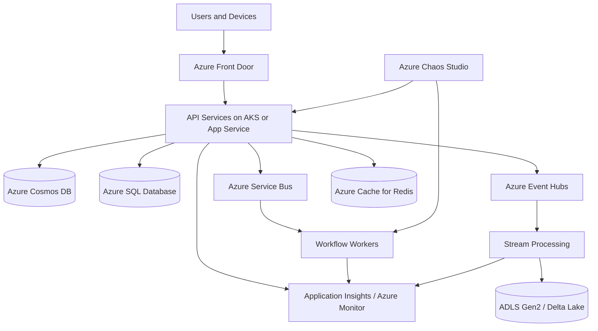
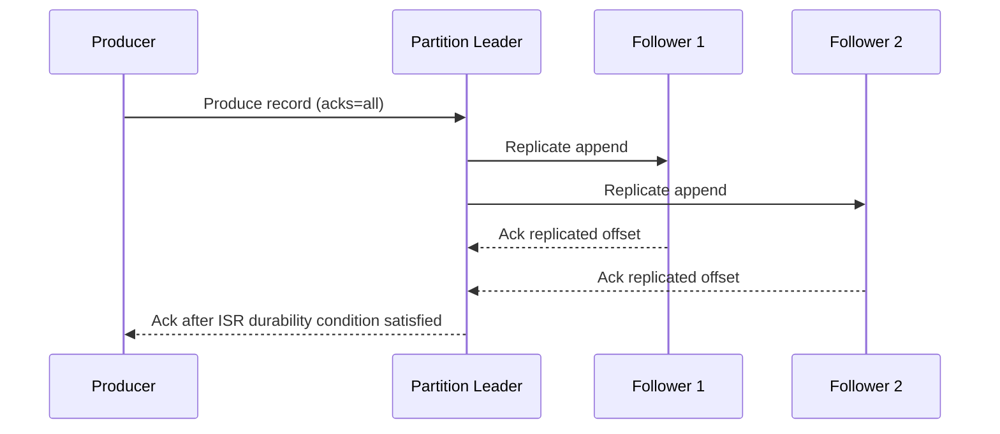
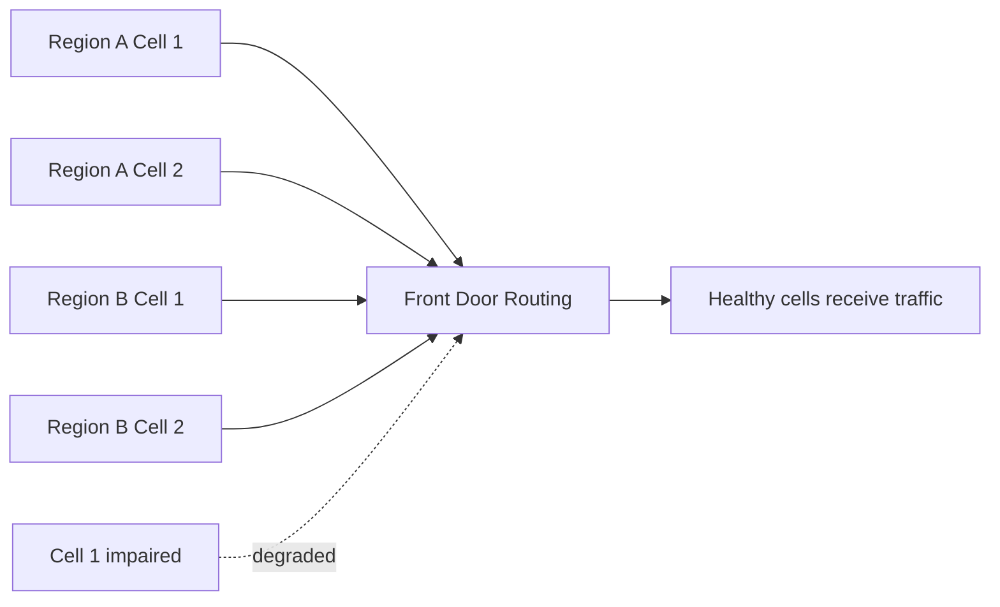

# Distributed Systems Case Studies

> Part of the **Enterprise Data & AI Architecture Handbook** · Phase-02 — Distributed Systems Deep Dive · Chapter 08.
> Estimated study time: **60 min reading + ~3h labs**.
> **Prerequisites:** read [Consensus and Coordination](01_Consensus_and_Coordination.md), [Replication and Consistency](02_Replication_and_Consistency.md), [Partitioning and Sharding](03_Partitioning_and_Sharding.md), [CAP and PACELC](04_CAP_and_PACELC.md), [Distributed Transactions](05_Distributed_Transactions.md), [Time, Clocks and Ordering](06_Time_Clocks_and_Ordering.md), and [Fault Tolerance and Resilience](07_Fault_Tolerance_and_Resilience.md) first.

---

## Executive Summary

The most useful distributed systems chapters are not the ones that list vocabulary. They are the ones that show how real systems made hard choices under real business pressure. Amazon Dynamo optimized for shopping-cart availability under partition and built around sloppy quorum, hinted handoff, and application-assisted conflict resolution. Google Bigtable optimized for sparse, sorted, wide-column storage at massive scale. Google Spanner paid the cost of tight coordination and clock discipline to provide externally consistent transactions across regions. Apache Kafka turned the distributed log into a practical backbone for event-driven systems by centering replication, leader election, and in-sync replicas. Netflix and Uber demonstrated that system correctness is not enough if the service still collapses operationally under dependency brownouts or cell-wide overload.

These case studies matter because they disprove simplistic architecture folklore. There is no universally superior consistency model, no free global order, no magically infinite partitioned log, and no resilient microservice platform without strong isolation discipline. Each of the systems in this chapter succeeded by choosing a primary problem and accepting the corresponding costs. Dynamo accepted reconciliation complexity to preserve write availability. Spanner accepted coordination and infrastructure sophistication to preserve external consistency. Kafka accepted partition-local ordering rather than global ordering. Netflix and Uber accepted platform complexity to keep failures local and customer-visible impact bounded.

For Azure-first enterprise architects, the real value is not copying these systems blindly. It is translating their lessons into platform choices that fit your workload. Use Azure Cosmos DB when entity-local availability and elastic partitioning matter more than global external consistency. Use Azure SQL Database or Azure Database for PostgreSQL when transactional correctness and relational constraints dominate. Use Azure Event Hubs or Kafka on AKS when partitioned logs and replayable streams are the right backbone. Use Azure Front Door, API Management, Redis, AKS, Service Bus, and Chaos Studio to operationalize the resilience patterns that Netflix and Uber made famous. If your architecture review cannot state which case study it resembles and why, it probably has not made the trade-offs explicit enough.

This chapter closes Phase-02 by converting theory into pattern literacy. The earlier chapters explained consensus, replication, partitioning, CAP and PACELC, distributed transactions, clock semantics, and resilience. This chapter shows how those ideas appear together in production-grade systems and what enterprise teams should copy, adapt, or avoid.

---

## Learning Objectives

By the end of this chapter you will be able to:

1. Explain the primary design goals and trade-offs behind Dynamo, DynamoDB, Bigtable, Spanner, Kafka, Netflix resilience patterns, and Uber platform patterns.
2. Map those case studies back to the concepts from [Consensus and Coordination](01_Consensus_and_Coordination.md), [Replication and Consistency](02_Replication_and_Consistency.md), and [CAP and PACELC](04_CAP_and_PACELC.md).
3. Distinguish availability-first, consistency-first, log-first, and cell-based platform strategies.
4. Identify which Azure services best approximate the lessons from each case study without forcing inappropriate one-to-one product mapping.
5. Recognize common failure stories such as hot partitions, unclean failover, retry storms, and control-plane blast radius.
6. Choose between queue-centric, database-centric, and log-centric architectures for different enterprise workloads.
7. Design Azure-first reference architectures that apply these lessons to data, AI, and transactional workloads.
8. Use public case studies and postmortems as inputs to ADRs, governance standards, and platform roadmaps.

---

## Business Motivation

- Enterprise teams repeatedly waste time rediscovering trade-offs that Dynamo, Spanner, Kafka, Netflix, and Uber already documented in public.
- Case studies compress years of failure and iteration into reusable design heuristics.
- Vendor marketing often flattens important differences between products. Real case studies recover the actual engineering constraints.
- Data and AI platforms now mix operational workloads, event streams, feature pipelines, and globally distributed control planes. One design style is not enough.
- Architecture governance becomes stronger when standards are rooted in known patterns rather than preference or fashion.
- Postmortem literacy improves capital allocation. It is easier to justify zone redundancy, queue decoupling, or stronger transaction boundaries when the team understands the failure modes they prevent.

---

## History and Evolution

- **2006 - Bigtable:** Google publishes Bigtable, showing how a sparse, sorted, distributed storage system can power internet-scale internal workloads.
- **2007 - Dynamo:** Amazon publishes Dynamo, making availability-first design and application-visible conflict resolution central to the NoSQL era.
- **Late 2000s to early 2010s - DynamoDB and managed NoSQL:** cloud-managed key-value stores turn previously bespoke distributed systems ideas into product features.
- **2011 - Kafka enters mainstream use:** the distributed log becomes a foundation for streaming and event-driven architecture.
- **2012 - Spanner:** Google publishes Spanner, showing that externally consistent global transactions are possible with enough coordination and clock discipline.
- **2012 onward - Netflix resilience tooling:** circuit breakers, fallback libraries, and chaos engineering move from specialist practice into industry-wide patterns.
- **2014 onward - Uber platform evolution:** cell isolation, dispatch-critical path protection, and operational partitioning become public examples of large-scale resilience design.
- **Managed cloud era:** Azure, AWS, and GCP each expose productized fragments of these ideas, but not with identical semantics or costs.

---

## Why This Technology Exists

This chapter exists because teams need more than abstract principles. They need evidence that:

1. real systems make incompatible but rational trade-offs,
2. distributed systems design is workload-specific,
3. failure handling is as important as the happy path,
4. operational posture determines whether elegant theory survives contact with production.

Case studies bridge the gap between theorem and architecture review. [Partitioning and Sharding](03_Partitioning_and_Sharding.md) explains why hot keys matter. Dynamo and Kafka show what happens when hot keys meet real production traffic. [Distributed Transactions](05_Distributed_Transactions.md) explains why cross-service atomicity is expensive. Spanner shows one answer for paying that cost, while Netflix and Uber show when to avoid paying it by isolating and degrading instead.

The practical purpose is comparative judgment. Architects should be able to say: this workload is cart-like, not ledger-like; this stream is Kafka-like, not relational; this control plane needs cell isolation more than global total order. Without that judgment, teams tend to overbuild strong coordination in low-value paths and underbuild correctness in high-value ones.

---

## Problems It Solves

- Grounds abstract distributed systems theory in concrete, battle-tested designs.
- Reveals the real operational cost of different consistency and availability choices.
- Provides reusable patterns for Azure-first architecture decisions.
- Helps identify which platform guarantees are sufficient and which are missing.
- Improves architecture reviews by anchoring trade-offs to known precedents.
- Sharpens incident analysis by comparing local failures to public failure stories.
- Reduces cargo-cult adoption of technology by exposing when not to copy a pattern.

---

## Problems It Cannot Solve

- It cannot substitute for workload-specific measurement, testing, and domain analysis.
- It cannot prove that a product with a similar marketing label behaves like the original case study.
- It cannot remove the need to understand local cloud-service semantics and limits.
- It cannot justify adopting a complex pattern when the business problem is simpler.
- It cannot replace direct DR, failover, load, and chaos testing in your own environment.
- It cannot turn a weak operating model into a resilient one by inspiration alone.

---

## Core Concepts

### Dynamo: Availability First

Dynamo's design center was a retail workload where writes had to keep flowing even when parts of the system were unhealthy. The core ideas were partitioning by key, replication to a preference list of nodes, sloppy quorum for writes and reads, hinted handoff for temporarily unreachable replicas, vector clocks for divergent-version tracking, and Merkle-tree-style anti-entropy for repair. The key lesson is that high availability under partition pushes conflict resolution somewhere. If the storage layer does not resolve it fully, the application or reconciliation workflow must.

### DynamoDB: Productized Operational Discipline

DynamoDB is not just Dynamo turned into a service. It is a managed, multi-tenant, operationally hardened evolution that exposes partitioned key-value design, automatic scaling behavior, adaptive capacity, conditional writes, streams, TTL, and global-table style replication in product form. The lesson is that the managed service changes the operating burden, but not the underlying trade-offs around access patterns, hot partitions, and consistency scope.

### Bigtable: Sorted Wide-Column Storage

Bigtable demonstrates the power of a sparse, distributed, sorted map keyed by row key, column family, and timestamp. Tablets split as data grows, writes land in logs and memtables before flushing to immutable files, and the row-key design determines locality and hotspot risk. The lesson is that data model and key design dominate operational outcome more than abstract database category labels.

### Spanner: External Consistency at Scale

Spanner combines sharding, Paxos replication groups, two-phase commit across groups, and tightly bounded clock uncertainty to provide externally consistent transactions. The lesson is not merely that strong global consistency is possible. It is that it requires coordinated infrastructure, strict timing assumptions, and acceptance of added latency and system complexity.

### Kafka: Distributed Log with In-Sync Replicas

Kafka's architecture centers on append-only partition logs, leader-follower replication, producer acknowledgements, and the in-sync replica set. Correctness depends on choices such as `acks=all`, `min.insync.replicas`, unclean leader election policy, and consumer offset management. The lesson is that the log is powerful precisely because it narrows guarantees: partition-local order, replayable history, and configurable durability rather than one giant exactly-once magic box.

### Netflix and Uber: Resilience as Architecture

Netflix emphasized circuit breakers, fallback, chaos engineering, and regional evacuation. Uber emphasized cell or domain isolation, critical-path prioritization, and platform-level strategies for preventing one service or region problem from becoming system-wide failure. The lesson is that distributed systems architecture is incomplete until failure containment is explicitly designed.

### Postmortem Literacy

Case studies are most valuable when read as decisions under constraint, not as badges of prestige. Every celebrated architecture contains warnings: Dynamo exposes reconciliation cost, Spanner exposes coordination cost, Kafka exposes hot-partition and durability-tuning risk, and resilience patterns expose their own operational and product complexity.

---

## Internal Working

### Dynamo Read and Write Flow

For a write, the coordinator routes by partition key to the preference list, writes to reachable replicas, may accept under sloppy quorum if some preferred replicas are unavailable, and stores hints for later delivery. For a read, the coordinator gathers enough replica responses to satisfy the configured read quorum, compares vector-clock lineage, and may return siblings for application-level merge. Anti-entropy later repairs divergence. This is a deliberate design for availability under imperfect membership and routing conditions.

### DynamoDB Operational Differences

DynamoDB hides node membership and repair mechanics from operators, but access-pattern design remains decisive. Partition-key skew still creates throughput hotspots. Conditional writes and idempotent request design still matter. Global tables reduce some replication toil but do not remove the need to understand conflict, latency, and regional-failover implications.

### Bigtable Storage Path

Bigtable writes append to a durable commit log and update an in-memory memtable. When a memtable fills, it flushes to immutable SSTable-like files. Tablets are the unit of distribution and split as data grows. Reads consult the memtable, immutable files, and supporting metadata structures. Compaction keeps read amplification under control but can create operational pressure if key design is poor or workload bursts are not understood.

### Spanner Commit Path

Spanner transactions interact with multiple replication groups when data spans shards. Each group uses consensus to replicate state. Cross-group work uses two-phase commit, while TrueTime-style bounded uncertainty enables commit timestamps that preserve external consistency. Commit-wait delays visibility long enough to ensure timestamp order matches real-world ordering guarantees. The value is strong global semantics; the cost is extra coordination on the critical path.

### Kafka Replication Path

Kafka producers write to the leader of a partition. Followers replicate the log. The ISR set tracks replicas deemed sufficiently caught up. With `acks=all`, the leader only acknowledges after the configured durability condition is satisfied. If ISR drops below `min.insync.replicas`, writes may fail rather than risk weaker durability. Controller logic manages leader changes, and unclean leader election settings determine whether availability is allowed to trump durability under certain failures.

### Netflix and Uber Runtime Control Loops

Circuit breakers, fallback caches, traffic shadowing, cell isolation, and gradual failover are continuous control loops, not one-time configurations. The system observes latency and error ratios, shifts traffic, opens or closes breakers, and optionally degrades features or regions. These patterns live in the runtime behavior of the platform as much as in topology diagrams.

---

## Architecture

The most useful architectural synthesis from these case studies is a layered, mixed-strategy platform:

1. **Availability-biased entity stores:** use a partitioned, highly available store for cart, session, preference, device shadow, or catalog-read scenarios.
2. **Strong transactional stores:** use relational or strongly scoped transactional systems for orders, billing, entitlements, and ledgers.
3. **Replayable event backbone:** use partitioned logs or durable queues for event propagation and decoupling.
4. **Cell or blast-radius boundaries:** isolate critical workloads by region, tenant, product slice, or service tier.
5. **Resilience and control loops:** add circuit breaking, fallback, chaos, observability, and controlled failover.

On Azure, that usually means Cosmos DB or a similarly partitioned store for availability-oriented state, Azure SQL Database or PostgreSQL for transaction-critical state, Event Hubs or Service Bus for the event backbone, AKS or App Service for services, Front Door for routing, Redis for tactical fallback, and Monitor plus Chaos Studio for operational control. The architecture is intentionally heterogeneous because the case studies prove that one storage or messaging model rarely fits every workload.

---

## Components

| Component | Lesson source | Responsibility | Azure-first analogue |
|---|---|---|---|
| Partitioned key-value store | Dynamo / DynamoDB | High-availability entity state, key-based access | Azure Cosmos DB |
| Sparse sorted storage | Bigtable | Ordered key access and large-scale semi-structured data | Cosmos DB with careful key design, or ADLS plus Delta for analytical range scans |
| Strong transactional core | Spanner lesson translated selectively | High-value consistency boundary | Azure SQL Database or Azure Database for PostgreSQL |
| Distributed log | Kafka | Replayable event stream with partition-local order | Azure Event Hubs or Kafka on AKS |
| Workflow and queue control | Netflix / Uber operational patterns | Isolate work and absorb spikes | Azure Service Bus |
| Edge routing and evacuation | Netflix / Uber resilience | Route away from unhealthy origins | Azure Front Door |
| Cell compute boundary | Uber platform strategy | Keep failures local | AKS node pools, namespaces, dedicated clusters, or deployment stamps |
| Observability plane | All case studies operationally | Explain system behavior under failure | Azure Monitor, Application Insights, OpenTelemetry |
| Chaos platform | Netflix lineage | Validate assumptions under fault | Azure Chaos Studio |
| Cache fallback | Netflix resilience | Reduce dependency pressure and support degraded reads | Azure Cache for Redis |

---

## Metadata

These case studies highlight that metadata is often the hidden control plane:

- partition keys and row keys determine locality and hot-spot risk,
- vector clocks or version lineage distinguish divergent from sequential updates,
- commit timestamps encode ordering guarantees,
- leader epoch and ISR metadata determine durable write safety,
- cell ID, tenant ID, region ID, and feature tier drive blast-radius containment,
- idempotency keys and message IDs prevent duplicate side effects,
- watermark, offset, and lag metrics determine whether streams are healthy or merely alive.

Enterprise systems should make this metadata explicit in schemas, traces, dashboards, and runbooks. It is difficult to reason about correctness after the fact if the system never records the ordering or partitioning context that drove its behavior.

---

## Storage

These case studies collectively teach four storage lessons:

- **Key design beats database category labels.** Bigtable and Dynamo both punish poor key design.
- **Write path design determines resilience.** Logs, memtables, replicas, and durability thresholds are not invisible implementation trivia.
- **Consistency scope must be deliberate.** Spanner's global semantics are valuable, but most workloads do not need to pay that cost.
- **Storage and messaging are coupled.** Kafka's log is storage with transport semantics; outbox patterns bridge transactional stores and event backbones.

On Azure, the practical storage split is usually: Cosmos DB for partitioned, low-latency, globally distributed entity state; Azure SQL or PostgreSQL for relational invariants; ADLS Gen2 with Delta Lake for replayable analytical history; Redis for ephemeral performance optimization only where correctness allows.

---

## Compute

Compute design changes by case-study lineage:

- Dynamo-like services emphasize stateless coordinators and smart clients over heavyweight cross-shard transaction engines.
- Spanner-like systems centralize more coordination cost into commit paths and metadata services.
- Kafka-based architectures shift compute into producers, brokers, stream processors, and consumers with explicit offset and lag handling.
- Netflix and Uber style platforms invest heavily in runtime policy, service mesh or client libraries, autoscale boundaries, and cell isolation.

Azure compute choices should reflect that split. Use AKS for complex brokers, stream processors, or cell-isolated control loops. Use App Service or Functions Premium for simpler APIs and relay workers. Keep coordinator logic thin where the data model already encodes the hard guarantee.

---

## Networking

Networking implications differ sharply across the case studies:

- Dynamo-like designs tolerate partitions by weakening immediate consistency and relying on repair.
- Spanner-like designs depend on predictable latency bounds and tight coordination between replicas.
- Kafka-like systems require stable broker reachability, partition leadership, and careful cross-zone bandwidth planning.
- Netflix and Uber style systems treat network faults as routine and isolate them with timeouts, fallback, and evacuation paths.

For Azure, the key lesson is not to discuss networking as a generic substrate. Route design, private endpoints, cross-region topology, DNS behavior, and partition-locality assumptions all directly affect the semantics the application can safely claim.

---

## Security

Security shows up in these case studies in two ways: control-plane dependency and blast-radius management.

- Highly available data paths still fail if identity, key management, or certificate paths are brittle.
- Multi-tenant managed systems require strict isolation and authorization discipline to preserve both correctness and performance.
- Event backbones and cell boundaries need clear trust separation so one compromised or noisy domain cannot access or starve another.
- Postmortems often reveal that emergency access, manual failover, and replay paths lacked proper auditability.

Azure-first designs should use managed identity, Key Vault, least-privilege RBAC, private networking where appropriate, and auditable break-glass paths. Resilience patterns copied from Netflix or Uber are incomplete if they rely on ad hoc security exceptions during incident response.

---

## Performance

The case studies show that performance is workload-shaped:

- Dynamo optimizes for low-latency availability under partial failure, not strict global ordering.
- Bigtable optimizes write throughput and ordered-key access, but can hotspot under poor row-key design.
- Spanner pays extra latency for stronger correctness.
- Kafka optimizes sequential I/O and high-throughput append, but consumer lag and hot partitions still dominate tail behavior.
- Netflix and Uber treat tail latency as a first-class operational threat because it often causes larger cascading failures than outright crashes.

Performance tuning must therefore respect architectural intent. Trying to make a globally consistent system behave like an eventually consistent cache, or vice versa, usually creates the worst of both worlds.

---

## Scalability

All of these systems scale by narrowing coordination domains:

- Dynamo scales by partitioning and tolerating temporary divergence.
- Bigtable scales by tablet splits and sorted distribution.
- Spanner scales by sharding with strong metadata and consensus groups, not by removing coordination entirely.
- Kafka scales by partitioning logs and consumer groups.
- Netflix and Uber scale organizations and platforms by cells, regions, and workload isolation.

The enterprise takeaway is that scale is architectural, not purely elastic. Autoscale helps only after the data model, partitioning strategy, and blast-radius boundaries are coherent.

---

## Fault Tolerance

The fault-tolerance strategies vary by system:

- Dynamo uses replication, hinted handoff, and read repair to stay available.
- DynamoDB operationalizes similar goals through managed service behavior while still exposing consistency and partitioning trade-offs.
- Bigtable relies on durable logs, tablet reassignment, and replicated storage layers.
- Spanner relies on consensus groups and carefully managed failover semantics.
- Kafka relies on ISR, leader election, and durable logs, with configuration choices defining the durability-availability trade-off.
- Netflix and Uber contain faults through fallback, isolation, load shedding, and cell boundaries.

This reinforces the core Phase-02 lesson: fault tolerance is not one mechanism. It is a stack of decisions about replication, repair, coordination, and degradation.

---

## Cost Optimization

These case studies also show how easily teams overpay when they copy the wrong pattern:

- Building Spanner-like coordination for workloads that only need entity-local consistency wastes latency and engineering effort.
- Building Dynamo-like reconciliation into a domain that actually needs strong invariants shifts cost into support, audit, and manual repair.
- Running Kafka clusters or AKS cell topologies for low-volume workflows can be operationally heavier than managed Event Hubs or Service Bus.
- Over-replicating every store or region equally ignores which capabilities are actually business critical.

Azure-first cost optimization means buying the narrowest strong guarantee you really need, then using managed services and asynchronous decoupling wherever they reduce operational toil without hiding critical semantics.

---

## Monitoring

Case-study-derived monitoring priorities include:

- partition heat and skew for Dynamo-like or Bigtable-like workloads,
- replica lag, failover state, and consistency-mode behavior for transactional stores,
- ISR size, under-replicated partitions, leader changes, consumer lag, and retention headroom for Kafka-style backbones,
- breaker-open rate, fallback activation, queue age, and cell-level health for resilience-centric platforms,
- degraded-mode usage and business-outcome metrics, not just CPU and request count.

Azure Monitor, Application Insights, Databricks metrics, and Event Hubs observability should make the chosen trade-offs visible, not merely the infrastructure state.

---

## Observability

Observability needs to preserve architectural intent.

- Trace data should carry partition key, consistency choice, retry attempt, cell ID, and message offset where relevant.
- Logs should distinguish source event time, processing time, and commit time when stream and database systems interact.
- Business spans should record whether a request used strong, session, cached, degraded, or replayed behavior.
- Postmortem timelines should reconstruct which architectural guardrail activated and whether it worked as intended.

Without this context, teams can see that something failed but not whether the platform behaved according to design.

---

## Governance

Architecture governance should turn these case studies into policy questions:

- Which workloads may choose availability over immediate consistency?
- Which workloads require relational invariants or explicit write authority?
- When is Kafka or Event Hubs the right backbone versus Service Bus or direct database integration?
- What evidence is required before approving active-active writes or multi-region failover?
- Which services need cell isolation or dedicated clusters rather than shared platform pools?
- How are public postmortems and internal incidents translated into updated standards?

Good governance uses case studies as precedent, not as dogma. The question is not which famous system the team admires. It is which problem the workload actually has.

---

## Trade-offs

| Pattern or system lesson | Strengths | Weaknesses | Best fit | Avoid when |
|---|---|---|---|---|
| Dynamo-style availability-first store | High write availability, partition tolerance, low-latency local decisions | Conflict resolution, repair complexity, weaker immediate consistency | Carts, sessions, device state, user preferences | Ledgers, strict inventory, compliance-critical workflows |
| DynamoDB-style managed key-value | Operational simplicity relative to self-managed clusters, elastic scale | Access-pattern rigidity, hot-partition sensitivity, consistency trade-offs remain | Cloud-native key-value workloads with clear keys | Arbitrary relational querying or cross-entity invariants |
| Bigtable-style sorted wide-column design | Excellent large-scale sparse storage and ordered key access | Key design is unforgiving, range hotspots are real | Time-series, large sparse tables, ordered analytical or serving patterns | Rich joins and cross-row transactions dominate |
| Spanner-style globally consistent database | Strong external consistency and global transactions | Higher latency, complexity, and infrastructure dependency | Global metadata, high-value correctness, globally coordinated platforms | Most CRUD systems that only need regional write authority |
| Kafka-style distributed log | Replayability, partitioned scale, stream backbone | Partition management, lag, retention, and durability tuning complexity | Event streaming, CDC fanout, analytics backbones | Immediate command workflows with strict queue semantics |
| Netflix/Uber resilience and cell patterns | Strong blast-radius containment and graceful degradation | Significant platform engineering investment | Large multi-tenant or mission-critical estates | Tiny systems where simpler isolation suffices |

---

## Decision Matrix

| Workload | Dominant need | Recommended lesson | Azure-first choice | Open-source analogue |
|---|---|---|---|---|
| Shopping cart or session state | Availability and partition tolerance | Dynamo / DynamoDB | Cosmos DB with session consistency and strong partition-key design | Redis plus PostgreSQL or a custom key-value stack |
| Order, billing, entitlement | Strong transactional invariants | Spanner lesson translated selectively, not copied fully | Azure SQL Database or PostgreSQL with outbox and regional write authority | PostgreSQL |
| High-volume telemetry or CDC fanout | Replayable ordered event streams | Kafka | Event Hubs or Kafka on AKS | Kafka |
| Large sparse operational lookup data | Ordered key access and wide sparse columns | Bigtable | Cosmos DB with careful key modeling, or Delta serving layers for analytical reads | HBase-like patterns are out of scope here; use PostgreSQL plus object storage carefully |
| Multi-tenant SaaS platform | Blast-radius containment | Netflix and Uber cells | AKS deployment stamps, Front Door routing, Redis fallback, Chaos Studio | Kubernetes cells plus Nginx, Prometheus, Grafana |
| Global metadata with strict ordering | External consistency | Spanner | Usually redesign for regional write authority on Azure; if not possible, reassess platform choice | Cockroach-style or Spanner-class systems outside this chapter's OSS baseline |

Decision rule:

1. Identify the business invariant.
2. Choose the case-study lineage that optimizes for that invariant.
3. Accept and instrument the cost that lineage implies.

---

## Design Patterns

### Sloppy Quorum with Repair

Useful for availability-first data when temporary divergence is acceptable and reconciliation is designed explicitly.

### Conditional Write and Idempotent Update

Necessary when managed key-value systems expose optimistic concurrency rather than relational transactions.

### Sorted-Key Locality Pattern

Use row or partition keys that preserve useful locality without creating hot prefixes.

### Commit Authority Boundary

Keep strong invariants inside a deliberately narrow consistency boundary, even if the broader system is distributed.

### Distributed Log Backbone

Use append-only, partitioned streams for replay, decoupling, and downstream fanout.

### ISR-Safe Producer Policy

Use `acks=all`, appropriate `min.insync.replicas`, and unclean-leader-election policies that match durability needs.

### Cell-Based Isolation

Split traffic, compute, and dependencies into semi-independent units so one incident remains local.

### Graceful Degradation and Fallback

Preserve core business flows while non-critical features shed or defer.

### Outbox plus Stream Propagation

Bridge strong local database commits to Kafka or Event Hubs style backbones safely.

---

## Anti-patterns

- Copying Spanner-like global consistency requirements into a workload that only needed regional write authority.
- Using a Dynamo-style entity store for strict financial invariants because it is horizontally scalable.
- Treating Kafka partition order as global business order.
- Ignoring hot-key and hot-partition risk in Cosmos DB, DynamoDB, Bigtable, or Kafka designs.
- Building fallback and chaos tooling after the platform has already fragmented into dozens of services.
- Running all critical and non-critical traffic through one shared cluster without cell boundaries.
- Assuming a managed service inherits every property of the research paper or ancestor system it resembles.
- Reading postmortems as stories about other companies rather than warnings about common design errors.

---

## Common Mistakes

- Using generic UUID partition keys where entity-local order or locality would have been more useful.
- Choosing consistency settings by latency taste rather than business invariant.
- Enabling durable log features without monitoring ISR shrink, lag, or retention pressure.
- Treating application merge logic as a trivial follow-up after availability-first storage is deployed.
- Forgetting that fallback data can go stale in ways that matter to the business.
- Assuming one product can simultaneously behave like Dynamo, Spanner, and Kafka if configured carefully enough.
- Failing to record why a workload chose one lineage over another in an ADR.

---

## Best Practices

- Start with workload classification, not product selection.
- Preserve strong invariants in the smallest possible boundary.
- Use partitioned logs where replay and fanout are core needs, not as a universal default for every workflow.
- Treat partition keys, row keys, and topic keys as architecture, not as implementation detail.
- Make resilience and degradation paths explicit early, especially for multi-service platforms.
- Translate public postmortems into concrete platform checks and experiment plans.
- Prefer managed Azure services where they reduce toil without hiding critical semantics you still need to reason about.

---

## Enterprise Recommendations

Recommended enterprise baseline after studying these case studies:

1. **Default data split:** availability-oriented entity state on Cosmos DB or equivalent; transaction-critical state on Azure SQL or PostgreSQL.
2. **Default event backbone:** Event Hubs for high-throughput streams; Service Bus for workflow-oriented commands and queues.
3. **Default resilience posture:** deployment stamps or cells for tenant or workload isolation, Front Door for traffic steering, and Chaos Studio for validation.
4. **Default governance rule:** every new distributed workload must name the case-study lineage it is closest to and the trade-offs it is explicitly accepting.
5. **Default observability rule:** dashboards must show partition heat, lag, degradation mode, and failover state, not just request rate.

### ADR Example

**Context:** A global SaaS platform needs shopping-cart-like user workspace state, strict billing records, high-volume audit streams, and region-contained failure domains. The team initially proposed one globally consistent database and synchronous service fanout for all paths.

**Decision:** Use Azure Cosmos DB with session consistency for workspace and preference state, Azure SQL Database for billing and entitlement authority, Event Hubs for audit and activity streams, Service Bus for workflow commands, AKS deployment stamps by region and tenant tier, and Front Door for traffic steering. Explicitly reject a single globally consistent database for all domains.

**Consequences:** The platform gains clearer boundaries and lower cost for most traffic, but engineers must manage multiple data models and use outbox plus idempotency patterns correctly. Some cross-domain views become eventually consistent by design.

**Alternatives considered:**

- One global strong database for every domain: rejected because most workloads do not need Spanner-class coordination and the latency cost is unjustified.
- One Kafka backbone for every interaction including commands: rejected because queue semantics and poison-message handling remain important for business workflows.
- One shared AKS cluster without stamp isolation: rejected because blast radius would be too broad for tier-1 workloads.

---

## Azure Implementation

### Reference Architecture

An Azure-first implementation that applies these case-study lessons to a modern enterprise platform looks like this:

- **Availability-oriented state:** Azure Cosmos DB stores cart, session, preference, feature-flag cache, or device-shadow style data using a partition key aligned to the business entity.
- **Transactional authority:** Azure SQL Database or Azure Database for PostgreSQL stores orders, billing, access control, and other strict invariants.
- **Streaming backbone:** Azure Event Hubs carries high-volume audit, telemetry, CDC, and domain-event fanout with partition-local order.
- **Workflow and decoupling:** Azure Service Bus handles command queues, dead-lettering, and controlled consumer workflows.
- **Compute and isolation:** AKS deployment stamps or App Service plans isolate workloads by region, tenant class, or criticality.
- **Resilience controls:** Azure Front Door, Redis, Application Insights, Log Analytics, and Chaos Studio enforce the Netflix/Uber lessons.

### Cosmos DB Container Design Example

```json
{
  "id": "cart-9d6f9",
  "tenantId": "contoso",
  "userId": "u-1042",
  "partitionKey": "contoso|u-1042",
  "items": [
    { "sku": "A100", "qty": 1 },
    { "sku": "B233", "qty": 2 }
  ],
  "lastUpdatedUtc": "2026-07-08T09:15:22Z",
  "etag": "00000000-0000-0000-6831-5a3f5f0b0000"
}
```

The key lessons from Dynamo and Bigtable apply here: the partition key is the architecture. If the key is wrong, no autoscale setting will rescue the hot path.

### SQL Schema for Transactional Authority and Outbox

```sql
create table dbo.billing_accounts (
    account_id uniqueidentifier not null primary key,
    tenant_id nvarchar(64) not null,
    status nvarchar(32) not null,
    balance decimal(18,2) not null,
    created_utc datetime2 not null default sysutcdatetime(),
    row_version rowversion
);

create table dbo.outbox_events (
    event_id uniqueidentifier not null primary key,
    aggregate_type nvarchar(64) not null,
    aggregate_id nvarchar(128) not null,
    event_type nvarchar(128) not null,
    payload nvarchar(max) not null,
    created_utc datetime2 not null default sysutcdatetime(),
    published_utc datetime2 null
);

create index ix_outbox_unpublished
on dbo.outbox_events (published_utc, created_utc)
where published_utc is null;
```

### Event Hubs and Consumer Design Example

```yaml
eventStream:
  name: platform-activity
  partitionKey: tenantId|entityId
  producer:
    guarantee: at-least-once
    idempotentPublisher: true
  consumerGroups:
    - name: audit-archive
    - name: realtime-features
    - name: billing-reconciliation
  ordering:
    scope: partition-local
```

### Azure CLI Provisioning Example

```powershell
az group create --name rg-case-studies --location westeurope
az cosmosdb create --name cos-case-studies-weu --resource-group rg-case-studies --kind GlobalDocumentDB --default-consistency-level Session --locations regionName=westeurope failoverPriority=0 isZoneRedundant=True
az sql server create --name sql-case-studies-weu --resource-group rg-case-studies --location westeurope --admin-user sqladmin --admin-password <secure-password>
az sql db create --resource-group rg-case-studies --server sql-case-studies-weu --name ledgerdb --service-objective GP_S_Gen5_2
az eventhubs namespace create --resource-group rg-case-studies --name ehns-case-studies-weu --location westeurope --sku Standard
az servicebus namespace create --resource-group rg-case-studies --name sb-case-studies-weu --location westeurope --sku Premium
az monitor log-analytics workspace create --resource-group rg-case-studies --workspace-name law-case-studies-weu --location westeurope
```

### Bicep Example for Cosmos DB and Event Hubs

```bicep
resource cosmos 'Microsoft.DocumentDB/databaseAccounts@2023-04-15' = {
  name: 'cos-case-studies-weu'
  location: resourceGroup().location
  kind: 'GlobalDocumentDB'
  properties: {
    databaseAccountOfferType: 'Standard'
    consistencyPolicy: {
      defaultConsistencyLevel: 'Session'
    }
    locations: [
      {
        locationName: resourceGroup().location
        failoverPriority: 0
        isZoneRedundant: true
      }
    ]
  }
}

resource eventHubNs 'Microsoft.EventHub/namespaces@2022-10-01-preview' = {
  name: 'ehns-case-studies-weu'
  location: resourceGroup().location
  sku: {
    name: 'Standard'
    tier: 'Standard'
    capacity: 1
  }
}

resource eventHub 'Microsoft.EventHub/namespaces/eventhubs@2022-10-01-preview' = {
  name: '${eventHubNs.name}/platform-activity'
  properties: {
    partitionCount: 8
    messageRetentionInDays: 3
  }
}
```

### Kusto Query for Hot Partition and Degraded Mode Detection

```kusto
AppTraces
| where Properties.partitionKey != ''
| summarize requests=count(), avgDurationMs=avg(DurationMs) by tostring(Properties.partitionKey), bin(TimeGenerated, 15m)
| order by requests desc
```

### Azure Operational Guidance

- Do not try to mimic Spanner globally on Azure unless the business invariant truly requires it and the team is prepared to accept the cost of strong coordination alternatives.
- Use Cosmos DB consistency levels deliberately. Session consistency is often the pragmatic default for Dynamo-like workloads.
- Use Event Hubs when the primary need is partitioned streaming and replay; use Service Bus when command semantics, dead-lettering, and workflow control are more important.
- Use deployment stamps or cell-like isolation for tier-1 SaaS workloads rather than one giant shared cluster.
- Apply Chaos Studio experiments to validate region evacuation, queue backlog handling, and fallback behavior.

---

## Open Source Implementation

### Reference Stack

An enterprise open-source stack that applies these lessons typically uses:

- Kafka as the distributed log backbone.
- PostgreSQL for strong transactional authority.
- Redis for tactical cache fallback and ephemeral fast state.
- Kubernetes for cell-like workload isolation and operational control.
- Prometheus, Grafana, and OpenTelemetry for monitoring and tracing.

### Kafka Topic Configuration Example

```properties
num.partitions=12
default.replication.factor=3
min.insync.replicas=2
unclean.leader.election.enable=false
```

### Kubernetes Namespace Isolation Example

```yaml
apiVersion: v1
kind: Namespace
metadata:
  name: cell-a
---
apiVersion: v1
kind: Namespace
metadata:
  name: cell-b
```

### Operational Pattern

- Keep PostgreSQL as the narrow strong-consistency boundary.
- Use Kafka partitions keyed by entity or tenant for replayable streams.
- Use Redis only where staleness is acceptable and fallback behavior is explicit.
- Use Kubernetes namespaces, node pools, and quotas to emulate cell isolation.
- Monitor under-replicated partitions, rebalance churn, consumer lag, and namespace-level saturation.

This does not recreate Dynamo, Spanner, or Bigtable exactly. It applies their lessons using a realistic enterprise open-source stack.

---

## AWS Equivalent (comparison only)

| Azure-first service | AWS equivalent | Advantages in AWS | Disadvantages versus Azure baseline | Migration strategy | Selection criteria |
|---|---|---|---|---|---|
| Azure Cosmos DB | DynamoDB | First-party lineage closest to Dynamo and managed key-value maturity | Different partition, API, and consistency ergonomics from Cosmos DB | Preserve access pattern and partition-key contract before data migration | Choose when AWS is the strategic cloud and Dynamo-style workloads dominate |
| Azure SQL Database / PostgreSQL | Aurora / RDS | Mature managed transactional engines | Different failover and scaling behaviors | Keep relational boundaries and outbox patterns stable while shifting engine | Choose when strict transactional domains dominate |
| Azure Event Hubs | Amazon MSK or Kinesis Data Streams | Strong managed streaming options | Different operational model depending on MSK versus Kinesis | Preserve stream contracts, ordering scope, and replay logic first | Choose based on Kafka affinity or Kinesis ecosystem fit |
| Azure Service Bus | SQS / SNS / Amazon MQ | Mature messaging building blocks | No single one-to-one workflow equivalent for all Service Bus semantics | Map each command, topic, and DLQ contract explicitly | Choose based on workflow versus stream needs |
| Azure Front Door / Chaos Studio | CloudFront or Global Accelerator plus Fault Injection Simulator | Good edge and chaos tooling | More service composition | Recreate routing and experiment hypotheses before cutover | Choose based on existing AWS operations posture |

AWS aligns most naturally with the Dynamo and DynamoDB lessons. The migration challenge is preserving semantics around partitioning, retries, failover, and event contracts, not simply moving APIs.

---

## GCP Equivalent (comparison only)

| Azure-first service | GCP equivalent | Advantages in GCP | Disadvantages versus Azure baseline | Migration strategy | Selection criteria |
|---|---|---|---|---|---|
| Azure Cosmos DB | Bigtable or Firestore depending workload shape | Strong fit for sparse ordered data and managed document use cases | No single product maps to all Cosmos DB APIs and guarantees | Re-evaluate workload shape before service mapping | Choose based on row-key versus document access pattern |
| Azure SQL / PostgreSQL | Cloud SQL / AlloyDB / Spanner | Spanner offers first-party external consistency | Higher conceptual and cost bar if global consistency is not required | Keep strict transactional domains separate during migration | Choose Spanner only when external consistency is a real requirement |
| Azure Event Hubs | Pub/Sub or Kafka on GKE | Mature high-scale messaging and stream integration | Ordering semantics differ from Kafka-style partition logs unless designed explicitly | Preserve ordering contract and lag dashboards first | Choose based on stream fanout and Beam or Dataflow alignment |
| Azure Service Bus | Pub/Sub plus workflow service combinations | Strong event distribution | Less direct queue workflow mapping | Separate stream and workflow responsibilities during migration | Choose based on workload split between events and commands |
| Azure Front Door / Chaos Studio | Cloud Load Balancing plus fault-injection tooling | Strong global traffic stack | Different operational model | Recreate routing, cell isolation, and chaos hypotheses | Choose based on GCP platform strategy |

GCP is the strongest native fit when the Spanner or Bigtable lessons are primary. Azure remains simpler when the enterprise standard is a mixed platform of Cosmos DB, SQL, Event Hubs, Service Bus, and AKS with deliberate boundaries.

---

## Migration Considerations

Migration usually means moving away from one of these weak patterns:

1. one shared database for every workload,
2. synchronous fanout without a replayable backbone,
3. weak partition-key design and hidden hot spots,
4. resilience treated as an infrastructure checkbox rather than a platform behavior.

Recommended migration sequence:

- classify workloads by dominant need: availability, strict transactionality, replayable streams, or blast-radius isolation,
- separate strong transactional boundaries from availability-first entity state,
- introduce Event Hubs or Service Bus where synchronous fanout currently creates coupling,
- redesign partition keys before scaling pain forces emergency fixes,
- add cell or deployment-stamp isolation for tier-1 workloads,
- translate postmortem lessons into monitoring, ADRs, and chaos experiments,
- avoid simultaneous migration of data model, stream backbone, and failover topology unless the team is unusually mature.

The biggest mistake is trying to migrate directly from an undifferentiated platform to a multi-pattern architecture without first agreeing which domains belong to which pattern.

---

## Mermaid Architecture Diagrams

### Azure Mixed-Strategy Platform Derived from the Case Studies



### Kafka ISR Replication and Producer Acknowledgement



### Cell-Based Isolation and Regional Evacuation



These views make the central lesson visible: different guarantees belong in different layers, and resilience boundaries are as important as data-path semantics.

---

## End-to-End Data Flow

Consider a global SaaS request that updates user workspace state, creates a billable event, and emits audit activity:

1. The client request enters through Azure Front Door and lands on an API service in the local deployment stamp.
2. Workspace preference or session-like state is written to Cosmos DB using a tenant-plus-user partition key.
3. Billing or entitlement changes are written to Azure SQL Database inside a local transactional boundary.
4. The same transaction writes an outbox record for downstream propagation.
5. A relay publishes high-volume audit activity to Event Hubs and workflow commands to Service Bus.
6. Event Hubs consumers build analytical and operational projections, preserving partition-local order.
7. Service Bus workers execute slower business workflows with retries, DLQ handling, and compensations.
8. Redis may serve bounded-staleness fallback reads when a non-critical downstream path is impaired.
9. Application Insights correlates the full path with partition key, stream offset, and degradation mode.
10. Chaos Studio or an actual failure can remove a cell, and Front Door reroutes traffic while keeping blast radius local.

This flow deliberately borrows different lessons from different case studies rather than expecting one substrate to solve every concern.

---

## Real-world Business Use Cases

- **Retail platforms:** Dynamo-style availability for carts, Spanner-like discipline for billing boundaries, Kafka-style streaming for events, Netflix-style degradation for promotions and recommendations.
- **Banking and fintech:** strong transactional cores with replayable streams and strict region or cell isolation.
- **IoT and industrial telemetry:** Bigtable and Kafka lessons around ordered keys, high write throughput, and late stream processing.
- **SaaS control planes:** availability-first tenant metadata, strong entitlements, and Uber-like blast-radius containment.
- **Data and AI platforms:** stream backbones, wide sparse metadata stores, and resilient orchestration across ingestion, feature, and governance paths.

---

## Industry Examples

- **Amazon retail lineage:** Dynamo emerged from the need to keep shopping-cart-like flows alive under partial failure.
- **Google infrastructure lineage:** Bigtable and Spanner show two different answers from the same ecosystem: one optimized for sorted sparse storage, the other for globally consistent transactions.
- **Kafka ecosystem adoption:** many enterprises learned that durable streams become a platform primitive, but only when partitioning, lag, and durability settings are treated as first-class architecture.
- **Netflix platform operations:** the company made region and dependency failure a routine part of design validation rather than a special emergency.
- **Uber platform engineering:** public material repeatedly highlights workload isolation, dispatch criticality, and keeping faults local to cells or domains.

These are useful not because the companies are famous, but because the underlying problems repeat across enterprises at smaller scale.

---

## Case Studies

### Amazon Dynamo

Dynamo was built for always-on retail primitives where temporary inconsistency was preferable to write unavailability. The decisive lesson is that if business value is concentrated in acceptance under failure, the architecture must preserve that path and accept merge or repair cost elsewhere. Teams frequently admire Dynamo's availability without budgeting for its reconciliation burden. That is the mistake to avoid.

### Amazon DynamoDB

DynamoDB turns many of the operationally difficult parts of distributed key-value systems into managed service behavior, but it does not change the centrality of access patterns. Hot partition incidents, skewed workloads, and misunderstanding of consistency scope are still common failure stories. The enterprise lesson is that managed services remove node operations, not the need for data-model discipline.

### Google Bigtable

Bigtable's enduring lesson is that row-key design is destiny. Sorted sparse storage enables powerful access patterns when keys align with usage, but it can produce concentrated load if keys trend monotonically or cluster too tightly. The enterprise translation is simple: partitioning and sort locality decisions belong in the earliest data model review.

### Google Spanner

Spanner proves that global transactions and external consistency are attainable, but not cheaply. Teams should learn from it in two directions: adopt the seriousness of its correctness model when the business truly needs it, and resist demanding Spanner-class guarantees for workloads that do not justify the latency and complexity. On Azure, that usually means narrowing strong write authority rather than trying to synthesize global external consistency from loosely related services.

### Apache Kafka

Kafka's public lessons are often misunderstood. Its power is not mystical exactly-once semantics. It is the practical combination of durable partitioned logs, replayability, consumer-group scale, and explicit durability tuning. Real failure stories often involve under-replicated partitions, poor key choice, unbounded backlog, or unsafe leader-election settings. The enterprise lesson is to treat topic design and durability policy as part of system correctness.

### Netflix Resilience Patterns

Netflix demonstrated that large-scale distributed systems need built-in failure containment: circuit breakers, fallback, timeouts, regional evacuation, and chaos experiments. The public lesson is not to copy a retired library or one specific tool. It is to adopt the practice of designing for dependency pain and validating that design continuously.

### Uber Platform Patterns

Uber's public engineering lessons repeatedly emphasize critical-path isolation, cell or domain segmentation, dispatch-aware architecture, and platform-level load management. The enterprise translation is that multi-tenant and mission-critical systems need more than autoscale; they need blast-radius-aware topology and policy.

### Failure Postmortems

The common thread across public failures is not exotic bugs. It is hidden coupling: shared control-plane assumptions, weak partition-key design, untested failover, retry amplification, and missing degraded modes. The correct response to these postmortems is not fear. It is design clarity.

---

## Hands-on Labs

1. **Dynamo lesson lab:** model a partitioned entity store in Cosmos DB and demonstrate how partition-key choice affects latency and throughput.
2. **Kafka durability lab:** deploy a small Kafka or Event Hubs style pipeline and compare `acks=all` style producer semantics to weaker acknowledgement choices.
3. **Spanner lesson lab:** build a narrow strong-consistency boundary in Azure SQL with an outbox, then contrast it with a more availability-oriented Cosmos DB path.
4. **Bigtable lesson lab:** simulate ordered-key hot spotting with a monotonic key and then fix it with a better key strategy.
5. **Cell resilience lab:** route traffic across two deployment stamps and inject failure into one cell to verify containment.

---

## Exercises

1. Explain why Dynamo-style availability requires a plan for conflict resolution rather than just faster repair.
2. Compare Bigtable row-key design mistakes with Kafka partition-key mistakes.
3. Describe when Event Hubs is a better fit than Service Bus and when the reverse is true.
4. Explain why Spanner is a useful case study even for teams not running on GCP.
5. Design an ADR that uses one case-study lineage for operational state and another for transactional billing.
6. Describe how a public postmortem should change a platform standard rather than merely becoming a presentation slide.

---

## Mini Projects

1. Build an Azure mixed-strategy reference platform with Cosmos DB for session state, SQL for billing, Event Hubs for activity streams, and Front Door for stamp routing.
2. Build a Kafka-backed audit pipeline with strong ISR settings, lag dashboards, and replay-safe consumers.
3. Create a governance pack that classifies internal workloads by Dynamo-like, Spanner-like, Kafka-like, or cell-isolation lineage and proposes platform standards for each.

Each mini project should include one postmortem-inspired failure test and one ADR explaining why a different lineage was rejected.

---

## Capstone Integration

This closing chapter integrates all prior Phase-02 material:

- [Consensus and Coordination](01_Consensus_and_Coordination.md) explains why Spanner and Kafka leader behavior depend on strong coordination primitives.
- [Replication and Consistency](02_Replication_and_Consistency.md) provides the formal lens for comparing Dynamo divergence, Spanner strictness, and Kafka durability modes.
- [Partitioning and Sharding](03_Partitioning_and_Sharding.md) explains why row keys, partition keys, and topic keys dominate operational outcome in Bigtable, Dynamo, Cosmos DB, and Kafka.
- [CAP and PACELC](04_CAP_and_PACELC.md) frames why Dynamo and Spanner make such different choices under failure and in healthy-state latency.
- [Distributed Transactions](05_Distributed_Transactions.md) explains why outbox patterns are usually a better enterprise bridge than trying to force every flow into global transactions.
- [Time, Clocks and Ordering](06_Time_Clocks_and_Ordering.md) grounds Spanner commit semantics, Kafka ordering boundaries, and stream-processing correctness.
- [Fault Tolerance and Resilience](07_Fault_Tolerance_and_Resilience.md) turns Netflix and Uber lessons into platform behavior rather than isolated anecdotes.

The Phase-02 capstone should require the reader to design a platform that deliberately mixes at least three of these lineages and defend each boundary explicitly.

---

## Interview Questions

1. What business problem was Dynamo originally optimizing for?
2. How does Bigtable differ from a generic relational database in design intent?
3. What makes Spanner's external consistency different from simple serializability?
4. What does Kafka's ISR protect, and what does it not protect?
5. Why is partition-key design central in both Dynamo-like and Kafka-like systems?
6. What is the difference between a workflow queue and a distributed log?
7. Why are Netflix and Uber case studies about platform behavior as much as technology choices?
8. Why should architects read postmortems from systems they do not run?

---

## Staff Engineer Questions

1. Design a mixed Azure architecture for carts, billing, and activity streams using lessons from Dynamo, Spanner, and Kafka.
2. Explain how you would justify Cosmos DB versus Azure SQL for a new tenant-metadata workload.
3. Describe the failure indicators that would tell you a Kafka-style backbone is becoming unsafe under lag or replica loss.
4. How would you encode cell isolation into AKS, Front Door routing, and observability for a multi-tenant SaaS platform?
5. What public postmortem would most influence your current platform standards, and exactly what would you change?
6. Under what conditions would you reject a request for globally strong consistency on Azure and propose a narrower write-authority boundary instead?

---

## Architect Questions

1. Which internal workloads are availability-first, which are consistency-first, and which are log-first?
2. What evidence do you require before approving a partition key, row key, or topic key for a tier-1 workload?
3. How do you govern the use of Event Hubs versus Service Bus versus direct database integration?
4. Which domains need cell isolation, and what shared dependencies still threaten blast radius?
5. How will your platform explain and test degraded modes, replay, and failover across heterogeneous data stores?
6. When does a public research-paper design become too complex for your team's operating maturity?

---

## CTO Review Questions

1. Which case-study lineage best matches the company's most critical revenue path, and why?
2. Where are we overpaying for coordination or underpaying for correctness?
3. Can the organization explain which workloads may be eventually consistent and which may not?
4. Which shared platform components create the largest blast radius across products and tenants?
5. What design changes have recent public or internal postmortems actually produced in our platform roadmap?
6. If a region, broker partition, or identity dependency degrades for two hours, which capabilities stay alive and which fail by policy?

---

## References

- Amazon Dynamo paper and subsequent DynamoDB operational literature.
- Google Bigtable and Spanner papers.
- Apache Kafka documentation and public operational guidance around replication and ISR.
- Netflix engineering material on resilience, traffic management, and chaos engineering.
- Uber engineering material on cell architecture, scaling, and critical-path isolation.
- Martin Kleppmann, *Designing Data-Intensive Applications*.
- Public cloud Well-Architected reliability and data platform guidance.

---

## Further Reading

- Revisit [Replication and Consistency](02_Replication_and_Consistency.md) before comparing any two of these case studies; most differences are really differences in replication and consistency posture.
- Revisit [Distributed Transactions](05_Distributed_Transactions.md) when deciding whether a Spanner-like boundary is necessary or an outbox plus stream model is enough.
- Revisit [Fault Tolerance and Resilience](07_Fault_Tolerance_and_Resilience.md) to translate Netflix and Uber lessons into concrete Azure controls and drills.
- Study Azure documentation for Cosmos DB partitioning and consistency, Event Hubs partition design, Service Bus workflow semantics, Front Door routing, and Chaos Studio experiments.
- Continue reading public postmortems and design papers with one practical question in mind: which part of our platform would fail the same way today?