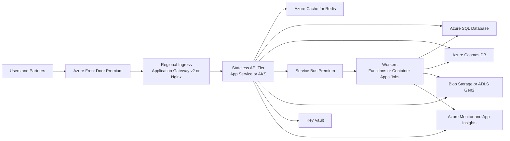
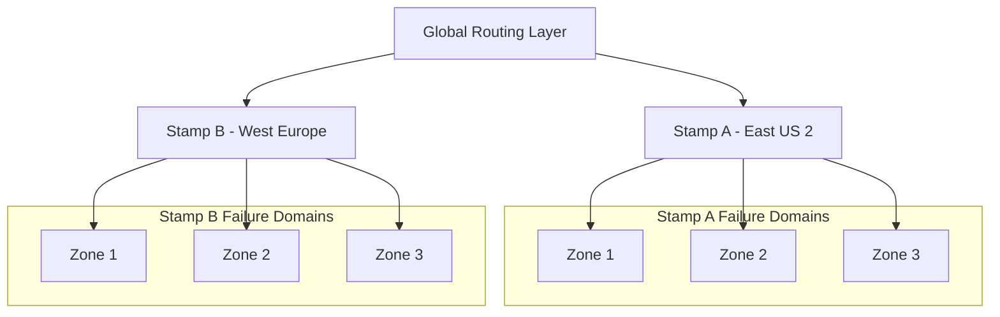
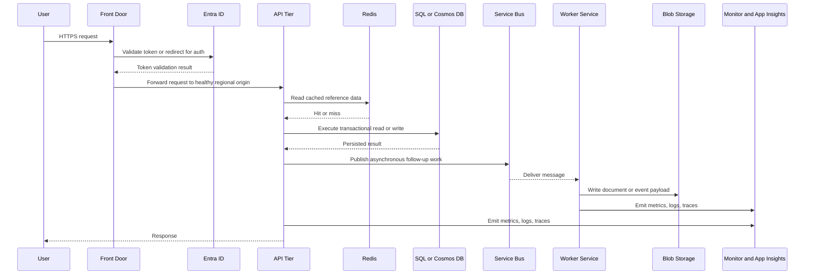

# Cloud Architecture Fundamentals

> Part of the **Enterprise Data & AI Architecture Handbook** · Phase-03 - Cloud & Azure Architecture · Chapter 01.
> Estimated study time: **60 min reading + ~3h labs**.
> **Prerequisites:** read [Distributed Systems Case Studies](../Phase-02/08_Distributed_Systems_Case_Studies.md) first.

---

## Executive Summary

Cloud architecture is not "rent some servers and move on." It is the discipline of turning shared infrastructure, managed platforms, and global networks into predictable business systems. The essential design questions are always the same: what does the provider operate, what must the customer still operate, where are the real failure boundaries, how fast can the system expand or contract, and how safely can multiple tenants share the same platform without contaminating cost, security, or performance?

For enterprise teams, the biggest mistakes usually come from category errors. Teams treat availability zones as disaster recovery, treat autoscaling as a substitute for capacity engineering, treat Kubernetes as a universal answer, or treat PaaS as "less enterprise" than IaaS. Mature cloud architecture rejects those shortcuts. It chooses the simplest abstraction that meets the workload's control, compliance, and performance needs, then adds explicit guardrails for identity, networking, observability, and cost.

In Azure-first environments, the most effective default posture is usually: SaaS when the capability is non-differentiating, PaaS when the workload is custom but operationally standard, containers when runtime portability or platform-level control is required, and IaaS only when the application cannot be realistically modernized yet. Around that, architects need zone-aware regional design, private-by-default networking, managed identity, policy-as-code, centralized telemetry, and a deliberate multi-tenancy model.

Open-source technologies remain important because they shape the operating model even in a managed-cloud world. Kubernetes, Nginx, PostgreSQL, Redis, Kafka, Prometheus, Grafana, Terraform, OpenTelemetry, and GitHub Actions frequently complement Azure managed services or provide portability boundaries. AWS and GCP are useful comparison points, but the core lesson is broader than any single vendor: cloud-native systems win by minimizing bespoke infrastructure, externalizing state, isolating failure domains, and making operations programmable.

## Learning Objectives

By the end of this chapter you will be able to:

1. Distinguish IaaS, PaaS, and SaaS using responsibility, operational burden, and architectural fit rather than marketing labels.
2. Explain shared responsibility as a moving boundary that changes by service model, service tier, and deployment pattern.
3. Design around regions, availability zones, and failure domains instead of assuming "the cloud" is one homogeneous reliability plane.
4. Separate elasticity from scalability, and use autoscaling only where workload shape, metrics, and warm-up behavior support it.
5. Apply the 12-factor model pragmatically to stateless services, jobs, and modern platform workloads.
6. Choose between pooled, bridge, and siloed multi-tenancy based on compliance, noisy-neighbor risk, and unit economics.
7. Map cloud architecture decisions to concrete Azure services, tiers, and guardrails.
8. Recognize where open-source platforms such as Kubernetes, PostgreSQL, Redis, Prometheus, Grafana, and OpenTelemetry add value or unnecessary complexity.
9. Compare Azure-first architectures against AWS and GCP without collapsing into false one-to-one equivalence.
10. Turn cloud fundamentals into reviewable ADRs, standards, and migration plans.

## Business Motivation

- Enterprises use cloud to reduce time-to-market, not merely to change who owns servers.
- Elastic platforms let businesses absorb seasonal spikes, product launches, and AI or analytics bursts without provisioning for annual peak every day.
- Global regions and managed services shorten the path from local application to multi-country product.
- Shared platforms lower the cost of reliability when teams use them correctly; they increase cost when teams recreate on-premises habits on top of cloud primitives.
- Standardized cloud foundations improve auditability, environment consistency, and platform reuse across data, application, and AI teams.
- Multi-tenancy, if chosen deliberately, can change economics by an order of magnitude for SaaS platforms.
- Cloud architecture matters directly to board-level concerns: cyber risk, regulatory posture, resilience, vendor concentration, and operating margin.

## History and Evolution

- Early hosting mostly replaced owned hardware with rented hardware; architecture changed little.
- Hypervisor-based virtualization made compute more fluid, but most systems were still managed like pets rather than cattle.
- Public cloud industrialized APIs for compute, storage, and networking, turning infrastructure into programmable inventory.
- Managed databases, queues, caches, and identity systems shifted value from server administration to platform composition.
- Containerization standardized packaging and dependency management, while Kubernetes provided a common orchestration layer across clouds and on-premises.
- Serverless platforms pushed the abstraction higher by charging for execution rather than reserved host capacity.
- Platform engineering and landing zones emerged because self-service cloud without governance quickly becomes ungoverned spend and security debt.
- AI and data workloads added a new pressure: bursty compute, large-scale object storage, vector and metadata services, and stricter data-governance requirements in the same environment.

## Why This Technology Exists

Cloud architecture exists because modern demand is variable, geography matters, and most enterprises should not be experts in power, cooling, datacenter fiber, bare-metal placement, hardware supply chain, or database failover internals for every workload. The cloud provider offers shared capital-intensive infrastructure and higher-level platforms so application teams can spend more effort on business logic and less on undifferentiated operations.

It also exists because many business capabilities are constrained by coordination cost rather than coding cost. Provisioning environments, acquiring certificates, connecting networks, managing secrets, building observability, and meeting compliance requirements all slow delivery when handled manually. Cloud platforms expose these as APIs and managed services so architecture can become repeatable.

The harder truth is that cloud does not eliminate systems engineering; it relocates it. Teams still need to reason about placement, capacity, throughput, consistency, data gravity, blast radius, and cost. What changes is the optimization problem: instead of deciding which RAID controller or top-of-rack switch to buy, architects decide where to spend control, where to consume managed abstractions, and where to keep portability or isolation.

## Problems It Solves

- Reduces infrastructure lead time from weeks or months to minutes.
- Supports global deployment without the enterprise owning facilities in every geography.
- Enables elastic capacity for web, batch, stream, and AI workloads.
- Makes production-grade identity, logging, monitoring, certificate management, and backup more accessible.
- Improves standardization through API-driven provisioning and policy enforcement.
- Lets teams externalize state into managed data services instead of binding application lifecycles to individual hosts.
- Simplifies multi-environment delivery by making infrastructure reproducible.
- Allows platform teams to create golden paths that scale better than ticket-driven operations.

## Problems It Cannot Solve

- It cannot make a poorly bounded domain model or chatty architecture reliable.
- It cannot violate network physics; cross-region latency and bandwidth constraints still exist.
- It cannot eliminate the need for capacity planning when workloads have warm-up time, quotas, or expensive state movement.
- It cannot automatically make a system compliant with data residency, industry regulation, or contractual isolation requirements.
- It cannot turn self-hosted complexity into managed simplicity if the team insists on rebuilding every platform layer manually.
- It cannot rescue bad software delivery practices; weak testing, weak rollout controls, and weak incident response still fail in cloud.
- It cannot remove concentration risk; using one provider aggressively can simplify operations and increase vendor dependency at the same time.
- It cannot make every workload cheaper; always-on, predictable, legacy-heavy estates may spend more in cloud if not redesigned.

## Core Concepts

### Service Models

| Model | You primarily manage | Provider primarily manages | Azure examples | Best fit |
|---|---|---|---|---|
| IaaS | Guest OS, runtime, patching, scaling logic, most middleware | Physical datacenter, host hardware, base virtualization | Virtual Machines, VM Scale Sets, virtual networks, managed disks | Legacy software, custom appliances, unusual OS/runtime dependencies |
| PaaS | Application code, configuration, data model, access policy | OS patching, platform runtime, many scaling and failover mechanics | App Service, Azure SQL Database, Cosmos DB, Service Bus, Functions, Container Apps | Standard web/API, integration, event-driven, data-serving workloads |
| SaaS | Tenant configuration, user lifecycle, data stewardship, integration | Entire application stack and infrastructure | Microsoft 365, Dynamics 365, GitHub Enterprise Cloud, Databricks SaaS control plane | Commodity capability where differentiation is low |

The right decision is rarely ideological. If the workload's value is in domain behavior rather than host-level tuning, moving up the abstraction stack usually wins.

### Shared Responsibility

Shared responsibility is not a fixed chart on a slide. It varies by product and architecture. In IaaS, the provider secures the datacenter, host hardware, and base virtualization layer, but the customer still patches guest OS images, configures hardening baselines, rotates app secrets, manages most network intent, and designs backup and DR. In PaaS, the provider absorbs more platform patching and failover mechanics, but the customer still owns identity design, data protection policy, application vulnerabilities, authorization, tenant boundaries, and many observability decisions. In SaaS, the provider owns nearly everything operationally, but the customer still owns access policy, data retention choices, integration trust, and misuse risk.

### Regions, Availability Zones, and Failure Domains

- A region is a geographic area containing one or more datacenters and the associated control and service footprint.
- An availability zone is a physically separate datacenter grouping inside a region with independent power, cooling, and networking paths.
- A failure domain is the unit that can fail together. Sometimes that is a rack, sometimes a zone, sometimes a region, sometimes a shared control-plane dependency.
- Zone redundancy improves tolerance to datacenter-level failure inside a region. It is not a substitute for regional DR.
- Some managed services are zone-redundant only in specific SKUs or regions. "Supported in region" does not mean every tier has the same resiliency behavior.

### Elasticity, Autoscaling, and Statelessness

- Scalability is the ability to handle more load. Elasticity is the ability to add or remove capacity in response to changing load.
- Autoscaling works best when scale signals are measurable, backlog or utilization correlates with user pain, and new instances can become useful quickly.
- Stateless services are easier to scale and replace because request-level state is externalized into caches, queues, databases, or tokens.
- Stateful workloads can still scale, but usually through partitioning, quorum, sharding, or explicit replication rather than naive horizontal duplication.

### 12-Factor Principles, Applied Pragmatically

The original 12 factors remain useful for cloud-native services:

1. One codebase per deployable service.
2. Dependencies declared explicitly.
3. Configuration kept out of code.
4. Backing services treated as attached resources.
5. Build, release, and run separated.
6. Stateless processes.
7. Port binding as a service contract.
8. Concurrency via scale-out processes.
9. Fast startup and graceful shutdown.
10. Dev/prod parity as much as practical.
11. Logs treated as event streams.
12. Admin tasks run as one-off processes.

Modern caveat: many enterprise systems include data pipelines, GPU workloads, or regulated workflows that are not purely web processes. The principle still holds, but the implementation becomes "externalize state and automate lifecycle" rather than blindly forcing everything into a web-service template.

### Multi-tenancy Models

| Model | Description | Strengths | Risks | Typical use |
|---|---|---|---|---|
| Pooled | Shared app tier and shared data plane with logical isolation | Best unit economics, easiest feature rollout | Noisy neighbors, stricter isolation discipline required | High-volume SaaS with similar tenants |
| Bridge | Shared control plane and app tier, but selected tenant data or compute isolated per tenant or per segment | Balances cost and compliance | More operational branching | B2B SaaS with premium or regulated tenants |
| Siloed | Dedicated stack per tenant or tenant group | Strongest isolation and customizability | Highest cost and operational overhead | Heavily regulated, strategic, or very large tenants |

## Internal Working

Cloud platforms operate through a split between control plane and data plane. The control plane accepts desired state through APIs, policy, templates, or portals. The data plane carries the actual workload traffic and state transitions: user requests, database I/O, queue delivery, DNS resolution, packet forwarding, and storage replication. Mature architectures assume the control plane may be slower, rate-limited, or partially impaired during incidents, so core runtime paths should continue without frequent control-plane dependence.

Compute placement is an optimization problem handled by provider schedulers and platform abstractions. Virtual machines are placed on hosts with resource capacity and policy constraints. Managed services often place replicas across zones or stamps internally. Kubernetes adds another scheduler layer that places pods onto nodes, which is why architects must understand anti-affinity, topology spread, and cluster-autoscaler timing rather than assuming a cluster distributes itself ideally.

Autoscaling is a closed-loop control system. Metrics are collected, evaluated against thresholds, then mapped into scale decisions subject to cooldown windows, quotas, and provisioning delays. That means autoscaling is always lagging real demand. If the service starts in 20 milliseconds, this lag is minor. If the service needs several minutes to warm JVMs, containers, caches, or data partitions, the lag dominates. Good cloud design therefore pairs autoscaling with buffering, pre-warming, and admission control.

Networking is abstracted through software-defined constructs, but the underlying concerns remain physical: route convergence, packet loss, SNAT port exhaustion, DNS propagation, TLS handshakes, and regional path diversity. Private Link, internal load balancing, and split-horizon DNS are architectural tools for reducing exposure and path variance, not just security checkboxes.

State durability is also layered. Object storage replicates data differently than relational databases, caches, or managed disks. Some services acknowledge writes after synchronous in-zone replication, some after cross-zone replication, and some after local commit plus asynchronous geo-replication. The architect must know which guarantee the workload is buying.

## Architecture

An Azure-first enterprise reference architecture for cloud fundamentals usually has six layers:

1. Edge and routing: Azure Front Door Standard or Premium for global ingress, TLS termination, WAF, and health-based routing.
2. Regional ingress: Application Gateway v2 with WAF or Kubernetes ingress for region-local HTTP policy and private origin routing where needed.
3. Stateless application layer: App Service Premium v3/v4, Azure Container Apps, or AKS depending runtime control requirements.
4. Integration and decoupling: Service Bus Premium, Event Hubs, or durable storage-backed workflows for buffering and asynchronous execution.
5. Data layer: Azure SQL Database, Azure Cosmos DB, Blob Storage or ADLS Gen2, Redis, and selective use of PostgreSQL or Databricks for analytical or AI-oriented workloads.
6. Platform and operations: Entra ID, Managed Identities, Key Vault, Azure Monitor, Application Insights, Defender for Cloud, Policy, and IaC delivered through Bicep or Terraform.

The architecture should be deployment-stamp aware. Instead of one giant multi-tenant region, use repeatable stamps aligned to geography, product line, or tenant segment. A global edge routes to healthy stamps. Each stamp owns its compute, integration, and data dependencies. Shared control-plane components exist only where the operational benefit exceeds the blast-radius cost.

Open-source technologies fit naturally inside this model. Nginx or Traefik can provide ingress behavior inside AKS. PostgreSQL, Redis, and Kafka can be used where protocol control, portability, or cost justify them. Prometheus, Grafana, and OpenTelemetry enrich observability. Terraform and GitHub Actions complement Azure-native deployment tooling. The key is to use OSS as a deliberate boundary, not as a reflexive replacement for every managed service.

## Components

| Component | Responsibility | Azure-first default | Open-source or portable option | Notes |
|---|---|---|---|---|
| Global entry point | TLS, WAF, routing, failover | Front Door Standard or Premium | Cloudflare, Nginx plus anycast CDN pattern | Premium is preferred when private origins and richer policy are required |
| Regional ingress | L7 policy, rewrite, internal routing | Application Gateway v2 | Nginx Ingress, Traefik | Keep ingress minimal; avoid business logic here |
| Stateless web/API | Synchronous request handling | App Service, Container Apps, AKS | Kubernetes Deployment, Nomad | Prefer the smallest platform that satisfies runtime needs |
| Async worker | Queue or event processing | Functions, Container Apps jobs, AKS workers | Kubernetes jobs, KEDA workers | Idempotency matters more than raw throughput |
| Queue or bus | Back-pressure, decoupling | Service Bus Premium | Kafka, RabbitMQ, NATS | Premium isolates noisy neighbors better than shared tiers |
| Event stream | High-throughput append log | Event Hubs | Kafka | Choose based on ordering, replay, and ecosystem needs |
| Transaction store | Correctness boundary | Azure SQL Database | PostgreSQL | Keep invariants close to the transactional store |
| Globally distributed key-value or document store | Low-latency entity state | Cosmos DB | Cassandra, ScyllaDB | Only enable multi-region writes when conflict handling is understood |
| Object storage | Durable blobs and lakehouse data | Blob Storage, ADLS Gen2 | MinIO | Separate hot operational blobs from analytical data lakes |
| Cache | Read acceleration and short-lived state | Azure Cache for Redis | Redis | Never store irreplaceable truth only in cache |
| Identity | Authentication and authorization | Entra ID, Managed Identity | Keycloak plus workload identity pattern | Human and workload identity should be handled differently |
| Telemetry | Metrics, logs, traces | Azure Monitor, App Insights | Prometheus, Grafana, OpenTelemetry, Loki, Tempo | Standardize correlation IDs and trace propagation |

## Metadata

Metadata is what turns cloud inventory into an operable platform. Without it, cost cannot be allocated correctly, policy cannot be enforced reliably, and failures cannot be traced quickly.

Required resource metadata typically includes:

| Metadata | Purpose |
|---|---|
| `application` | Names the business service or product |
| `owner` | Defines accountable engineering team |
| `environment` | Separates prod, preprod, dev, sandbox |
| `cost-center` | Supports FinOps and chargeback or showback |
| `data-classification` | Drives network, encryption, and logging controls |
| `rto` and `rpo` | Makes resilience intent auditable |
| `tenant-scope` | Clarifies pooled, bridge, or siloed model |
| `deployment-stamp` | Identifies failure and rollout boundary |
| `compliance-boundary` | Signals whether extra controls are required |

Runtime metadata is equally important:

- Correlation IDs tie user-visible failures to backend events.
- Tenant IDs determine isolation and rate-limiting behavior.
- Region, zone, and stamp identifiers reveal blast radius during incidents.
- Deployment version and feature-flag state explain whether behavior changed because of code or environment.
- Data lineage metadata becomes essential for lakehouse, AI, and analytical workloads.

## Storage

Storage architecture should start with data shape, consistency needs, retention, and failure tolerance rather than the popularity of a specific product.

Azure-first guidance:

- Use Blob Storage or ADLS Gen2 for large immutable objects, backups, archives, and analytical datasets.
- Use Managed Disks only for VM-bound state that cannot yet be externalized.
- Use Azure SQL Database for relational invariants, transactional consistency, and predictable schema-governed workloads.
- Use Azure Database for PostgreSQL when open-source ecosystem compatibility matters.
- Use Cosmos DB for globally distributed, partitioned, low-latency entity state where access patterns are known.
- Use Azure Cache for Redis only for acceleration, token storage, ephemeral coordination, or carefully bounded session data.

Open-source guidance:

- PostgreSQL is a strong default when teams need SQL, extensions, and portability.
- MinIO works well for S3-compatible object storage in self-managed environments, but its durability and operational burden are the customer's problem.
- ClickHouse, Trino, and DuckDB solve different analytical problems and should not be treated as replacements for operational data stores.
- Delta Lake, Apache Iceberg, and Apache Hudi matter when analytical object storage needs transactional table semantics.

Storage decisions should be explicit about durability tier. ZRS keeps data resilient across zones within one region. GRS or GZRS adds asynchronous cross-region durability but not instant failover semantics for every service. Backup, point-in-time restore, and geo-replication each solve different problems and should never be conflated.

## Compute

Compute selection is mainly about control surface, startup characteristics, and operational burden.

| Compute option | Use it when | Avoid it when | Azure notes |
|---|---|---|---|
| Virtual Machines / VMSS | Legacy software, OS-level agents, custom kernels, Windows dependencies, specialized licensing | The workload is a standard web/API or worker service | Use Standard SSD or Premium SSD deliberately; combine with VMSS only when scale logic is understood |
| App Service | HTTP apps and APIs with standard runtimes | You need custom kernel modules, sidecars, or deep networking control | Premium v3/v4 is usually the enterprise baseline for production web/API workloads |
| Azure Container Apps | Containerized HTTP or event-driven services that need less platform toil than AKS | You need advanced service mesh, device plugins, or deep node control | Good middle path for cloud-native teams |
| AKS | Multi-service platform control, Kubernetes-native ecosystem, advanced autoscaling, custom scheduling | The team mainly wants a hosted place to run one or two simple APIs | Budget for cluster operations, node upgrades, admission controls, and network policy |
| Functions | Burst-driven events, glue code, lightweight jobs | You need steady low-latency high-throughput compute with long-lived in-memory state | Cold start, concurrency, and dependency packaging must be tested rather than assumed |
| Databricks or Spark compute | Elastic batch, streaming, feature engineering, lakehouse processing | Transaction-serving API workloads | Treat data-platform compute separately from synchronous app compute |

The practical rule is simple: if the workload can be stateless and fits a managed runtime, choose that before introducing host-level or cluster-level complexity. Use AKS and IaaS when there is a concrete, reviewable reason.

## Networking

Networking is often where cloud architectures fail operationally even when the application code is sound. The common causes are unclear ingress strategy, uncontrolled egress, overlapping address space, fragile DNS, and accidental exposure of PaaS services to the public internet.

Azure-first patterns:

- Use hub-spoke or Virtual WAN patterns to separate shared connectivity from workload subscriptions.
- Use Front Door for global routing and Application Gateway v2 or private ingress inside regions when HTTP policy must be regional.
- Use Private Link for high-value PaaS dependencies such as storage, SQL, Key Vault, and Service Bus when public endpoints are unnecessary.
- Use NAT Gateway for deterministic outbound IP and to avoid SNAT exhaustion through overloaded default paths.
- Use Private DNS zones and clear ownership of DNS changes; DNS is part of runtime reliability, not just setup.
- Use DDoS protection, NSGs, and Azure Firewall or equivalent controls where risk and scale justify them.
- Use ExpressRoute or VPN only when there is a real hybrid requirement; avoid keeping cloud architectures artificially dependent on on-premises latency-sensitive paths.

Open-source networking components such as Nginx Ingress, Envoy, and Cilium can materially improve policy and observability in Kubernetes-centric estates, but they also add an additional control plane. Add them for capabilities, not fashion.

## Security

Security in cloud architecture is a design property, not a post-deployment checklist.

Identity should lead. Human access should flow through Entra ID, role-based access control, privileged identity management, conditional access, and break-glass accounts with rehearsed procedures. Workload identity should use Managed Identity or workload identity federation rather than long-lived secrets. Key Vault should store secrets and keys, but the deeper goal is to reduce secret count and rotation burden rather than simply moving plaintext elsewhere.

Network security should be private by default. Public entry points should be intentional, minimal, inspected, and shielded by WAF or equivalent controls. East-west traffic between services should be controlled by subnet boundaries, network policy, service identity, or both. Private endpoints are especially valuable when security teams need to prove that platform services are not exposed publicly.

Data protection requires classifying data first, then matching controls to classification. Encryption at rest is a baseline; customer-managed keys, HSM-backed keys, tokenization, field-level encryption, and region-restricted residency are situational controls, not universal defaults. Logs and traces often contain the most compliance risk because teams forget they replicate business data.

Supply-chain security matters as much as perimeter security. Container images should be signed or at least scanned, dependency sources should be controlled, IaC should be reviewed like application code, and rollout identity should be separated from runtime identity.

## Performance

Performance engineering in cloud is mostly about removing avoidable latency and aligning resources with the actual bottleneck.

- Start with user-facing SLOs and latency budgets rather than CPU graphs.
- Co-locate synchronous dependencies where possible; cross-region calls on the hot path are expensive in both latency and failure risk.
- Use caching for expensive reads, but validate cache invalidation, warm-up, and stale-read tolerance explicitly.
- Measure p95 and p99 latencies, not only averages.
- Avoid chatty service-to-service call chains; one extra network hop multiplied across fan-out paths becomes a real user-facing tax.
- Choose the right storage and messaging tier. Premium queues, business-critical databases, and local SSD-backed nodes exist because noisy neighbors and durability mechanics affect latency.
- Pre-warm compute when startup costs are material. Cold starts, image pulls, JVM warm-up, and JIT compilation all distort autoscaling.

The most common enterprise mistake is scaling compute before measuring downstream bottlenecks. If the true limit is database connection pool exhaustion, queue lock contention, or SNAT port depletion, more app instances only amplify failure.

## Scalability

Scalability is the ability to serve more work without disproportionate degradation in latency, error rate, or cost. In cloud systems that usually requires all of the following:

- Stateless front ends that can scale horizontally.
- Partitioned state stores whose keys reflect real access patterns.
- Asynchronous buffering to absorb burst mismatch between ingress and processing.
- Quotas and rate limits to prevent one tenant or batch from consuming shared capacity.
- Deployment stamps so scaling one segment does not destabilize every other segment.

Azure-specific concerns matter here. Subscription and regional quotas can become invisible ceilings. Some services scale instantly, some by control-plane operations, and some only by changing SKU or partition count. Cosmos DB partition-key design, Service Bus messaging units, SQL elastic pools, App Service plan density, AKS node pool size, and Front Door origin health configuration all affect whether the architecture scales smoothly or collapses at a threshold.

Open-source platforms add further dimensions. Kafka partitions define concurrency. Kubernetes cluster scale is constrained by control-plane and network behavior. PostgreSQL scales differently from distributed document stores. Prometheus and Grafana are not infinitely scalable without federation or remote storage. Good architecture treats these as first-class design facts.

## Fault Tolerance

Fault tolerance begins by acknowledging that faults are normal and correlated failures exist.

- Design for instance failure with health checks, retries with jitter, circuit breakers, and idempotent handlers.
- Design for zone failure with zone-redundant services, multi-zone node placement, and zone-aware load balancing.
- Design for regional failure with warm standby or active-active patterns, not just backups.
- Design for dependency impairment with graceful degradation, feature shedding, and queue buffering.
- Design for operator error with immutable infrastructure, scoped blast radius, canary rollout, and strong RBAC.

Public incidents repeatedly show the same lessons. Control-plane mistakes can break data-plane operations. Identity dependencies can become global choke points. Single-region assumptions fail under power, networking, or cooling events. Shared services make good platforms until every workload is coupled to the same one at the same time.

An enterprise standard should define minimum resilience classes. For example:

| Tier | Example workload | Typical target |
|---|---|---|
| Tier 0 | Revenue-critical customer APIs, payments, identity | Multi-zone in-region, regional DR tested, strict RTO and RPO |
| Tier 1 | Core operational systems | Multi-zone where supported, documented fallback, regular restore tests |
| Tier 2 | Internal line-of-business apps | Single-region with backups and clear recovery plan |
| Tier 3 | Dev, test, ephemeral analytics | Cost-optimized, best-effort restore |

## Cost Optimization

Cost optimization is not "make everything smaller." It is choosing the cheapest architecture that still satisfies SLOs, security, compliance, and team productivity.

Key cost levers:

- Prefer SaaS or PaaS where they remove labor-intensive operations that would otherwise be rebuilt internally.
- Use autoscale only where demand is variable and scale-in is safe.
- Use reserved capacity, savings plans, or committed use for predictable always-on estates.
- Choose storage tiers by access pattern: hot, cool, archive, premium, or ephemeral.
- Control data egress. Cross-region replication, internet egress, and repeated ETL movement often dominate cost unexpectedly.
- Keep non-production environments aggressively right-sized and automated for shutdown.
- Use tags, budgets, and anomaly detection to expose waste early.

Open-source does not automatically mean cheaper. Self-managed Kafka, PostgreSQL, Prometheus, or Kubernetes can look inexpensive on a unit-price slide and still be more expensive once staffing, patching, incident time, and overprovisioning are counted.

## Monitoring

Monitoring answers the question: is the system healthy enough right now to meet its commitments?

Azure-first monitoring baseline:

- Azure Monitor for platform metrics, alerts, and centralized ingestion.
- Log Analytics as the primary operational query surface.
- Application Insights for application telemetry, request rates, dependency calls, and failures.
- Resource Health and Service Health for provider-side visibility.
- Network Watcher and connection monitoring for network diagnostics.
- Budget and cost alerts for financial monitoring.

Minimum monitored dimensions should include availability, latency, saturation, error rate, queue depth, storage throttling, database DTU or vCore pressure, pod or instance restarts, certificate expiry, secret rotation health, and deployment drift.

Dashboards should be service-oriented, not tool-oriented. The useful dashboard is not "all Azure metrics in one place." It is "can the Orders API meet SLO right now, and if not, which layer is failing?"

## Observability

Observability goes beyond health checks and asks whether the system emits enough evidence to explain novel failure modes.

The practical baseline is:

- Metrics for fast detection.
- Logs for event detail and audit trails.
- Traces for cross-service causality.
- Correlation IDs that survive ingress, queues, retries, and worker execution.
- Structured events with tenant, region, stamp, and deployment metadata.

OpenTelemetry is the most useful common layer because it reduces instrumentation fragmentation across App Service, AKS, Functions, Java, .NET, Python, Node.js, and data-processing services. Prometheus and Grafana remain strong operational complements, especially in Kubernetes-heavy estates. In Azure-heavy estates, the best result is usually OTel for emission and Azure Monitor or Grafana for consumption, rather than separate incompatible telemetry pipelines per team.

Sampling strategy matters. Tail-based or dynamic sampling is often better for low-value high-volume traffic, but critical paths such as payments, identity, and compliance-sensitive workflows may justify higher fidelity. The guiding rule is simple: never sample away the evidence you need most during an incident.

## Governance

Governance is how the enterprise prevents cloud freedom from turning into cloud entropy.

Core governance mechanisms:

- Management groups and subscription segmentation aligned to environment, business unit, and platform responsibility.
- Landing zones with pre-approved network, identity, policy, logging, and deployment patterns.
- Azure Policy and policy exemptions managed as code.
- Role design that separates platform operations from workload operations.
- Tagging standards, budget controls, and cost accountability.
- ADRs and architecture review practices that make exceptions explicit.
- Data-classification policy tied to storage, network, and monitoring controls.

Good governance is not manual approval theater. It is a small set of enforced defaults, fast exception handling, and auditable ownership boundaries.

## Trade-offs

Every cloud architecture decision trades one form of control, speed, or efficiency for another.

| Decision area | Option A | Option B | Real trade-off |
|---|---|---|---|
| Service model | PaaS | IaaS | Faster delivery and less toil versus deeper customization and legacy compatibility |
| Multi-tenancy | Pooled | Siloed | Better unit economics versus simpler compliance narrative and stronger isolation |
| Regional strategy | Active-passive | Active-active | Lower complexity versus higher availability and higher operational complexity |
| Runtime | App Service / Container Apps | AKS | Less platform work versus more control and ecosystem depth |
| Data strategy | Managed data services | Self-hosted open source | Lower operational burden versus more portability and feature-level control |
| Networking | Public edge plus private backends | Fully private ingress via enterprise network | Simpler global access versus tighter exposure control and more operational coupling |

### ADR Example

**Context:** A B2B SaaS platform serves 300 tenants across North America and Europe. Ten tenants are regulated and require stronger data-isolation guarantees. The engineering team is strong in application development but small in platform operations. Peak demand is bursty around month-end processing.

**Decision:** Use a PaaS-first, deployment-stamp architecture: Front Door Premium at the edge, App Service Premium for the synchronous API tier, Service Bus Premium for asynchronous workload leveling, Azure SQL Database for transactional workloads, Blob Storage for documents, and a bridge multi-tenancy model where regulated tenants receive isolated databases and dedicated worker stamps.

**Consequences:** Delivery speed improves, platform toil stays manageable, and regulated tenants get auditable isolation. The downsides are reduced runtime customization compared with AKS and slightly higher cost than a fully pooled model.

**Alternatives considered:**

1. Single large AKS cluster with pooled multi-tenancy for all tenants. Rejected because it increased platform complexity and made regulated-tenant isolation harder to explain.
2. VM-based deployment per tenant. Rejected because operations and cost scale poorly.
3. Fully siloed stack for every tenant. Rejected because the economics did not support it for the long tail.

## Decision Matrix

| Workload scenario | Recommended service model | Recommended compute | Recommended tenancy | Why |
|---|---|---|---|---|
| Internal HR or finance capability with low differentiation | SaaS first | Provider-managed | Tenant model decided by provider | Do not build custom infrastructure for commodity capability |
| Public B2B API with standard runtime and strict SLOs | PaaS first | App Service or Container Apps | Pooled or bridge | Fast delivery, simpler operations, easy scale-out |
| Kubernetes-native platform product with service mesh or custom sidecars | PaaS plus container orchestration | AKS | Pooled or bridge | Real need for orchestration control justifies cluster operations |
| Legacy Windows application with custom drivers or installer dependencies | IaaS | VMSS or VMs | Usually siloed per environment | Practical bridge step before modernization |
| High-throughput event ingestion and replay | Managed stream plus workers | Event Hubs plus Container Apps or AKS | Pooled | Partitioned throughput and async buffering fit the workload |
| Regulated tenant with dedicated residency or key-management requirements | PaaS with selective isolation | App Service or AKS plus isolated data plane | Bridge or siloed | Compliance requires clearer boundaries |
| Data engineering platform with bursty ETL, ML, and lakehouse workloads | Managed platform and object storage | Databricks, Spark, or AKS where justified | Shared platform with project-level segregation | Separation of control and data planes matters more than generic VM counts |

## Design Patterns

1. Stateless front ends with external session state: essential for autoscaling and rolling upgrades.
2. Queue-based load leveling: absorb spikes between synchronous ingress and slower downstream processing.
3. Deployment stamps: replicate a proven unit of infrastructure by geography, segment, or tenant cohort.
4. Cell architecture: limit blast radius so one operational fault does not become a platform-wide incident.
5. Backing-service abstraction: keep service contracts stable even if the implementation changes from managed Azure service to open-source equivalent or vice versa.
6. Bulkheads and rate limits: protect shared platforms from a single noisy tenant or runaway batch.
7. Immutable infrastructure and image-based rollout: reduce configuration drift and rollback uncertainty.
8. Telemetry by default: every service emits metrics, traces, and structured logs before it is considered production ready.
9. Private-by-default data paths: expose only the minimum public surface area needed.
10. Workload identity federation: remove long-lived secrets from deployment and runtime paths.

## Anti-patterns

- Building one giant "strategic" AKS cluster for unrelated workloads and teams.
- Keeping sticky session state on local disk or node memory for customer-facing services.
- Treating availability zones as full disaster recovery.
- Leaving all PaaS services on public endpoints because private connectivity was deferred.
- Selecting IaaS because it feels more familiar even when the workload fits PaaS.
- Scaling on CPU alone for I/O-bound or queue-driven workloads.
- Running every tenant in one pooled database without rate limits, partition strategy, or data-isolation review.
- Relying on manual portal changes for production architecture.
- Ignoring provider quotas until the day a scale event needs them.
- Using open-source platforms without budgeting for operational ownership.

## Common Mistakes

- Confusing horizontal scaling with real elasticity.
- Choosing autoscale triggers that lag the business signal by too much.
- Forgetting that identity providers and DNS are critical dependencies.
- Underestimating cold-start or image-pull times for containers and serverless.
- Placing chatty services in different regions or forcing traffic through unnecessary middleboxes.
- Failing to tag resources well enough for cost ownership and incident triage.
- Assuming managed service replication semantics without reading the actual consistency and failover behavior.
- Overusing premium SKUs in development and underusing them in production-critical paths.
- Treating monitoring as logs-only and skipping trace correlation.
- Designing tenancy in legal terms only, without corresponding compute, data, and network boundaries.

## Best Practices

- Prefer PaaS over IaaS unless a concrete requirement disproves that choice.
- Make statelessness the default for web and API tiers.
- Externalize mutable state into managed stores with explicit consistency semantics.
- Standardize tags, naming, RBAC, and network baselines early.
- Use zones in the primary region for critical workloads whenever the service and region support them.
- Test restore, failover, and scale events; do not rely on architectural intent alone.
- Use Managed Identity and eliminate secrets wherever possible.
- Instrument every service with metrics, logs, and traces before production.
- Use policy-as-code and IaC for every persistent environment.
- Review tenancy and cost decisions with the same rigor as security decisions.

## Enterprise Recommendations

An opinionated enterprise baseline for cloud fundamentals should look like this:

| Decision area | Enterprise default |
|---|---|
| Service model | SaaS for commodity capability, PaaS for custom apps, AKS only by exception or strong justification, IaaS for constrained legacy workloads |
| Runtime selection | App Service or Container Apps before AKS for standard APIs and workers |
| Data | Managed databases and storage before self-hosted equivalents |
| Regional strategy | One primary zone-enabled region plus a documented paired-region recovery plan |
| Networking | Front Door at the global edge, private backends where practical, deterministic egress |
| Identity | Entra ID for humans, Managed Identity or workload federation for services |
| Telemetry | OpenTelemetry-compatible emission with centralized operational storage and alerting |
| Governance | Landing zones, policy-as-code, mandatory tags, subscription segmentation, architecture exceptions tracked through ADRs |
| Tenancy | Pooled by default, bridge for regulated or high-value tenants, silo only when justified |
| Delivery | Bicep or Terraform, CI/CD with gated rollout, environment promotion by automation not manual recreation |

This baseline is intentionally conservative. It biases toward operability, repeatability, and reviewability. Teams can deviate, but only by naming the gain and accepting the cost.

## Azure Implementation

Azure should be the primary implementation platform for this chapter because it provides strong managed primitives for identity, networking, observability, and data services while still accommodating Kubernetes and open-source workloads where needed.

Recommended Azure service posture:

- Use Front Door Premium when you need global routing, WAF, and private connectivity to regional origins.
- Use Application Gateway v2 WAF when regional HTTP inspection or path routing must remain inside the region.
- Use App Service Premium v3 or v4 for mainstream web/API workloads.
- Use Azure Container Apps for containerized services that need event-driven scale without taking on full AKS operations.
- Use AKS when you need Kubernetes-native packaging, advanced networking, or a broad platform ecosystem.
- Use Service Bus Premium for critical enterprise messaging where isolation and predictable behavior matter.
- Use Azure SQL Database Business Critical for latency-sensitive relational workloads and Hyperscale when storage growth and read scale dominate.
- Use Cosmos DB autoscale only when access patterns and partition keys are well understood.
- Use Blob Storage ZRS for in-region resilience and GZRS when regional durability matters more than write cost.
- Use Azure Cache for Redis Premium or Enterprise only where cache economics and failure semantics are acceptable.

Example Azure CLI bootstrap for a zone-aware baseline:

```bash
az group create \
  --name rg-cloudfund-prod-eus2 \
  --location eastus2

az monitor log-analytics workspace create \
  --resource-group rg-cloudfund-prod-eus2 \
  --workspace-name law-cloudfund-prod-eus2 \
  --location eastus2

az network vnet create \
  --resource-group rg-cloudfund-prod-eus2 \
  --name vnet-cloudfund-prod-eus2 \
  --address-prefixes 10.40.0.0/16 \
  --subnet-name snet-app \
  --subnet-prefixes 10.40.1.0/24

az aks create \
  --resource-group rg-cloudfund-prod-eus2 \
  --name aks-cloudfund-prod-eus2 \
  --node-count 3 \
  --zones 1 2 3 \
  --network-plugin azure \
  --enable-managed-identity \
  --enable-oidc-issuer \
  --enable-workload-identity \
  --generate-ssh-keys

az keyvault create \
  --resource-group rg-cloudfund-prod-eus2 \
  --name kvcloudfundprod01 \
  --location eastus2 \
  --enable-rbac-authorization

az servicebus namespace create \
  --resource-group rg-cloudfund-prod-eus2 \
  --name sb-cloudfund-prod-eus2 \
  --location eastus2 \
  --sku Premium
```

Example Bicep for enforceable baseline resources:

```bicep
@description('Common tags applied to all resources')
param tags object

param location string = resourceGroup().location

resource logAnalytics 'Microsoft.OperationalInsights/workspaces@2023-09-01' = {
  name: 'law-cloudfund-prod'
  location: location
  properties: {
    sku: {
      name: 'PerGB2018'
    }
    retentionInDays: 30
  }
  tags: tags
}

resource serviceBus 'Microsoft.ServiceBus/namespaces@2023-01-01-preview' = {
  name: 'sb-cloudfund-prod'
  location: location
  sku: {
    name: 'Premium'
    tier: 'Premium'
    capacity: 1
  }
  properties: {
    publicNetworkAccess: 'Disabled'
    zoneRedundant: true
  }
  tags: tags
}

resource storage 'Microsoft.Storage/storageAccounts@2023-05-01' = {
  name: 'st${uniqueString(resourceGroup().id)}'
  location: location
  sku: {
    name: 'Standard_ZRS'
  }
  kind: 'StorageV2'
  properties: {
    minimumTlsVersion: 'TLS1_2'
    allowBlobPublicAccess: false
    supportsHttpsTrafficOnly: true
  }
  tags: tags
}
```

## Open Source Implementation

An enterprise open-source baseline for cloud fundamentals usually centers on Kubernetes, ingress, autoscaling, messaging, observability, and policy.

Representative stack:

- Kubernetes for orchestration.
- Nginx Ingress or Traefik for L7 routing.
- KEDA and HPA for autoscaling.
- PostgreSQL for relational data, Redis for cache, and Kafka or NATS for eventing where protocol control matters.
- MinIO for S3-compatible object storage in self-managed environments.
- Prometheus, Grafana, Loki, Tempo, and OpenTelemetry Collector for telemetry.
- Terraform and GitHub Actions or Azure DevOps for delivery.

Example KEDA ScaledObject driven by Prometheus:

```yaml
apiVersion: keda.sh/v1alpha1
kind: ScaledObject
metadata:
  name: invoice-worker
spec:
  scaleTargetRef:
    name: invoice-worker
  pollingInterval: 15
  cooldownPeriod: 120
  minReplicaCount: 2
  maxReplicaCount: 20
  triggers:
  - type: prometheus
    metadata:
      serverAddress: http://prometheus.monitoring.svc.cluster.local:9090
      metricName: work_queue_depth
      query: sum(work_queue_depth{queue="invoice"})
      threshold: "200"
```

Example OpenTelemetry Collector configuration:

```yaml
receivers:
  otlp:
    protocols:
      grpc:
      http:

exporters:
  prometheus:
    endpoint: 0.0.0.0:8889
  logging:
    loglevel: warn

processors:
  batch:

service:
  pipelines:
    traces:
      receivers: [otlp]
      processors: [batch]
      exporters: [logging]
    metrics:
      receivers: [otlp]
      processors: [batch]
      exporters: [prometheus]
```

Use this stack when you truly need ecosystem portability, protocol depth, or consistent operation across multiple clouds and on-premises. Do not use it merely because it feels more "real" than managed services.

## AWS Equivalent (comparison only)

| Azure service or pattern | AWS equivalent | Where Azure is typically stronger | Where AWS is typically stronger | Migration note |
|---|---|---|---|---|
| Front Door Premium | CloudFront plus AWS WAF and often Global Accelerator | Tight Azure integration and private-origin patterns | Broader edge ecosystem maturity in some scenarios | Keep edge policy abstracted from app code |
| Application Gateway v2 | Application Load Balancer | Simple Azure regional L7 integration | Deep AWS ecosystem and common patterns | Avoid baking cloud-specific headers into business logic |
| App Service | Elastic Beanstalk or App Runner | Strong fit for Microsoft-centric teams and enterprise integration | App Runner simplicity for some containerized apps | Keep runtime config externalized |
| Azure Container Apps | App Runner or ECS Fargate | Good middle path between PaaS and full AKS | ECS ecosystem depth and Fargate maturity | Container contract remains the portability boundary |
| AKS | EKS | Strong Microsoft integration, Entra, and Azure networking alignment | Larger Kubernetes ecosystem mindshare and managed add-on breadth | Standardize on upstream Kubernetes APIs and GitOps |
| Azure SQL Database | Amazon RDS for SQL Server, Aurora, or RDS PostgreSQL depending engine | First-party SQL Server integration | Aurora scale profile for some relational workloads | Separate data model portability from engine-specific features |
| Cosmos DB | DynamoDB | Multi-model history and Azure ecosystem alignment | DynamoDB maturity for key-value at hyperscale | Model access patterns before translating service choice |
| Service Bus Premium | SQS plus SNS or MQ depending feature set | Rich enterprise messaging semantics | Simpler elastic primitives with SQS and SNS | Decouple business workflows from broker-specific contract |

Selection criteria should still favor workload fit over provider symmetry. Equivalent names do not imply equivalent semantics.

## GCP Equivalent (comparison only)

| Azure service or pattern | GCP equivalent | Where Azure is typically stronger | Where GCP is typically stronger | Migration note |
|---|---|---|---|---|
| Front Door Premium | Cloud Load Balancing plus Cloud Armor | Integrated enterprise edge patterns in Azure-first estates | Strong global network and load-balancing architecture | Keep edge routing intent documented independently of vendor |
| App Service | Cloud Run or App Engine depending runtime | Familiar enterprise application model | Cloud Run developer experience and scale-to-zero model | Container portability reduces migration friction |
| Azure Container Apps | Cloud Run | Broader Azure platform integration | Simpler serverless-container experience | Avoid coupling to provider-specific event sources when possible |
| AKS | GKE | Strong fit in Microsoft-centric enterprises | GKE operational maturity and Kubernetes depth | Use standard CRDs and portable ingress patterns |
| Azure SQL Database | Cloud SQL or AlloyDB depending workload | SQL Server and Azure governance integration | AlloyDB performance for PostgreSQL-heavy workloads | Plan schema and extension portability early |
| Cosmos DB | Firestore, Bigtable, or Spanner depending pattern | Unified Azure operational model | Distinct products optimized for document, wide-column, or globally consistent SQL | Re-evaluate data-access patterns rather than hunting for direct product clones |
| Service Bus Premium | Pub/Sub plus workflow or queue patterns | Rich broker semantics and enterprise integration | Pub/Sub scale and simplicity for event fan-out | Separate command workflow from event broadcast |
| Azure Monitor | Cloud Monitoring and Cloud Logging | Operational unity in Azure-centric estates | Mature SRE-focused workflows in GCP | Standardize telemetry schema with OpenTelemetry |

GCP often presents cleaner product separations for specific workload classes, while Azure often integrates more naturally with enterprise identity, governance, and Microsoft-heavy application estates.

## Migration Considerations

Migration should begin with workload classification, not tooling.

1. Identify which systems should move to SaaS, which should be modernized into PaaS, and which must remain on IaaS temporarily.
2. Establish landing-zone guardrails before onboarding many workloads.
3. Externalize state before chasing autoscaling or blue-green rollout.
4. Map identity, certificate, DNS, and secret dependencies early; these routinely block cutovers.
5. Validate egress cost and data-gravity effects for analytical and AI workloads.
6. Prove restore and failover before declaring the migration complete.
7. Document the tenancy model per workload, especially for regulated or premium customers.
8. Preserve exit options where they matter by keeping APIs, data models, and deployment contracts portable.

The practical migration sequence is usually foundation, pilot, standardization, then scale. Enterprises that reverse the order often create a large cloud footprint before they create a usable platform.

## Mermaid Architecture Diagrams





These diagrams show the two most important cloud architecture ideas: separate global routing from regional execution, and make failure boundaries visible rather than implicit.

## End-to-End Data Flow



The important design feature is that synchronous user experience ends before slow non-critical work completes. That is what makes elasticity, resilience, and cost control easier.

## Real-world Business Use Cases

1. Global B2B SaaS platform: pooled app tier, bridge data isolation, Front Door at the edge, region-local stamps for residency and latency.
2. Retail promotion or ticketing spike: stateless ingress, aggressive autoscale, queue-based smoothing, and cache-aware read paths.
3. Industrial IoT ingestion: event-driven front door, stream ingestion, storage tiering, and regional processing close to asset geography.
4. Enterprise data and AI platform: object storage, Spark or Databricks compute, governed metadata, private connectivity, and elastic batch clusters.
5. Regulated financial workflow: zone-resilient API tier, relational correctness boundary, isolated key management, strict observability, and rehearsed DR.
6. Internal developer platform: shared identity, golden-path templates, telemetry standardization, and policy-enforced environment provisioning.

## Industry Examples

- Netflix publicly demonstrated the value of stateless services, autoscaling, regional evacuation, and chaos engineering. The lesson is that cloud reliability comes from isolating failure and rehearsing degradation, not from trusting the happy path.
- Microsoft Teams publicly described extreme pandemic-era growth. The lesson is that elastic scale depends on platform automation, telemetry, and careful dependency management, not just more VMs.
- Capital One publicly described regulated cloud adoption grounded in infrastructure as code and security guardrails. The lesson is that governance must be codified and developer-friendly to scale.
- Shopify engineering has publicly discussed pod or cell-style isolation. The lesson is that high-growth platforms eventually need blast-radius boundaries beyond a single shared stack.
- Salesforce Hyperforce illustrates how a major SaaS platform can separate application architecture from underlying public-cloud footprint while still meeting regional and regulatory demands.

## Case Studies

### Case Study 1: AWS S3 us-east-1 outage (2017)

A debugging action against a subsystem responsible for indexing and placement triggered a broad service disruption in a major region. The lesson is that control-plane mistakes can have wide data-plane consequences, and that concentration in one region or one service dependency amplifies blast radius.

### Case Study 2: Azure Active Directory authentication incident (publicly reported class of outages)

Global authentication issues have repeatedly shown that identity is not a background utility. When identity stalls, applications that over-couple every request to fresh token or metadata lookup can fail even if their own compute and databases are healthy. The lesson is to design token caching, break-glass access, and dependency-aware degradation.

### Case Study 3: Fastly global CDN outage (2021)

A valid software bug combined with a broad configuration trigger caused a globally visible outage. The lesson is that cloud and edge platforms need canary rollout, configuration blast-radius limits, and the same engineering rigor for control changes as for code changes.

Taken together, these cases argue for deployment stamps, dependency maps, tested recovery, and strong change-management discipline for control-plane operations.

## Hands-on Labs

1. Build a shared-responsibility matrix for the same workload on VMs, App Service, and SaaS, then identify which controls move and which do not.
2. Deploy a zone-aware Azure environment with a VNet, Log Analytics workspace, App Service or AKS, Key Vault, and Service Bus using Bicep or Terraform.
3. Add autoscaling and run a controlled load test to compare CPU-based scaling versus queue-depth-based scaling.
4. Convert a session-sticky sample app into a stateless app by externalizing session state into Redis.
5. Add OpenTelemetry tracing and correlate a user request across ingress, API, queue, worker, and database layers.
6. Simulate a zone or dependency impairment and document the resulting RTO, degraded features, and observability signals.

## Exercises

1. Explain why a multi-zone regional design is not the same as multi-region disaster recovery.
2. For a new B2B SaaS product, choose pooled, bridge, or siloed tenancy and defend the choice.
3. Identify three workloads in your estate that should be SaaS, three that should be PaaS, and three that may need IaaS.
4. Write a short ADR arguing for App Service versus AKS for a stateless API platform.
5. Design a tagging standard that supports cost allocation, security classification, and resilience policy.
6. Choose appropriate Azure storage types for documents, transactional records, and analytical event history.
7. Define the minimum telemetry signals needed to debug a queue-backed cloud service.
8. Estimate which costs are likely to dominate for a public API with heavy global read traffic.

## Mini Projects

1. Multi-tenant SaaS starter platform: global edge, stateless API, per-tenant rate limiting, and bridge-model database isolation for premium tenants.
2. Event-driven ingestion platform: Front Door or ingress, Event Hubs or Kafka, worker autoscaling, Blob or ADLS storage, and Grafana dashboards.
3. Regulated workload landing zone: private networking, policy-as-code, managed identity, Key Vault integration, central logging, and tested backup or restore.

## Capstone Integration

This chapter converts the distributed-systems trade-offs from [Distributed Systems Case Studies](../Phase-02/08_Distributed_Systems_Case_Studies.md) into cloud-platform decisions. Dynamo-like access patterns push architects toward partitioned and elastic state stores. Spanner-like correctness needs push architects toward stronger transactional boundaries. Kafka-like event backbones push architects toward asynchronous decoupling. Netflix- and Uber-style resilience lessons push architects toward blast-radius isolation, deployment stamps, and aggressive observability.

As you move deeper into Phase-03, these fundamentals become the decision substrate for Azure Core Architecture, Landing Zones, Networking, Compute and Containers, Storage Services, and Well-Architected design. If this chapter is understood well, later Azure-specific chapters become implementation detail rather than disconnected product memorization.

## Interview Questions

1. What is the real difference between elasticity and scalability?
2. When is PaaS the wrong choice for a workload?
3. Why is statelessness so valuable for cloud-native APIs?
4. How would you explain shared responsibility to a security team that assumes the provider handles everything?
5. Why are availability zones not sufficient disaster recovery on their own?
6. What are the most common causes of autoscaling failure in production?
7. How do you choose between Azure SQL Database and Cosmos DB for a new service?
8. What metadata must every production cloud resource carry?
9. Why is queue-based load leveling often better than synchronous retry storms?
10. What does private-by-default networking actually mean in practice?

## Staff Engineer Questions

1. How would you design a deployment-stamp model for a SaaS platform with both pooled and regulated tenants?
2. What signals would you use for autoscaling a mixed synchronous and asynchronous workload, and why?
3. How do you prevent one tenant from exhausting a shared cloud platform?
4. Where should the blast-radius boundary sit for identity, messaging, and data dependencies?
5. How would you justify AKS over App Service in an architecture review?
6. What are the operational downsides of using open-source infrastructure components instead of managed Azure services?
7. How would you design observability so it remains useful during regional or identity incidents?
8. Which parts of the platform should be standardized centrally, and which should stay with product teams?

## Architect Questions

1. What is your enterprise default position on SaaS, PaaS, AKS, and IaaS, and what exceptions are allowed?
2. How do you map business criticality tiers to availability, region strategy, and cost posture?
3. Which workloads should be pooled, bridge-isolated, or fully siloed across your product portfolio?
4. How do you keep landing-zone governance strong without slowing delivery teams to a crawl?
5. What architectural evidence do you require before approving active-active multi-region?
6. How do you evaluate vendor lock-in against platform productivity in an Azure-first strategy?
7. What telemetry and operational readiness requirements must a service meet before production approval?
8. How do you decide when an open-source platform component is strategic versus accidental complexity?

## CTO Review Questions

1. Which parts of our cloud estate create unacceptable concentration risk, and what is the mitigation strategy?
2. Are we paying for control we do not use, or giving up control we actually need?
3. Which workloads should never have been migrated as-is to cloud, and why?
4. Do our tenancy choices maximize margin without creating unmanageable compliance or reputational risk?
5. How much of our reliability depends on shared identity, networking, or observability services, and have we rehearsed those failures?
6. Are our cloud operating costs primarily driven by compute, data movement, managed service premiums, or organizational sprawl?
7. Where do we need portability, and where is standardizing deeply on Azure the economically rational choice?
8. Is our platform model enabling product teams, or are we rebuilding a slow internal infrastructure provider in a different location?

## References

- NIST Special Publication 800-145, The NIST Definition of Cloud Computing.
- The Twelve-Factor App methodology.
- Azure Architecture Center guidance on regions, availability zones, and resilient application design.
- Azure Well-Architected Framework.
- Google Site Reliability Engineering books and workbooks.
- AWS Builders Library articles on cell-based architecture and shuffle sharding.
- FinOps Foundation framework and capability model.
- OpenTelemetry specification and semantic conventions.
- Kubernetes documentation on scheduling, topology spread, and autoscaling.
- Public postmortems and engineering write-ups from AWS, Microsoft, Fastly, Netflix, Shopify, and Capital One.

## Further Reading

- Re-read [Distributed Systems Case Studies](../Phase-02/08_Distributed_Systems_Case_Studies.md) and map each case study to a modern cloud service-model choice.
- Azure Core Architecture for subscription, region, and identity baselines.
- Azure Landing Zones for governance and platform structure.
- Azure Networking for ingress, egress, hybrid connectivity, and private access patterns.
- Azure Compute and Containers for runtime selection in more detail.
- Azure Storage Services for durability, performance, and lifecycle design.
- Well-Architected guidance for operationalizing reliability, security, performance, cost, and excellence trade-offs.