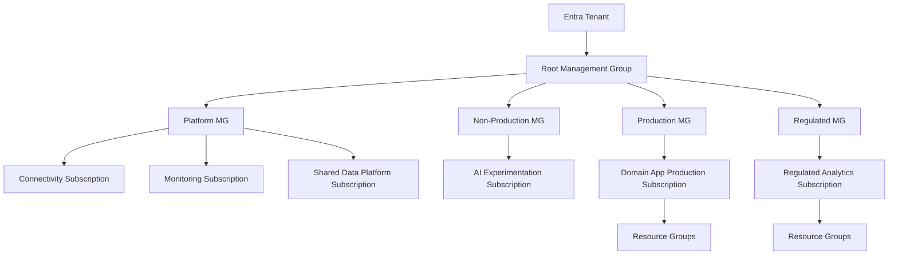
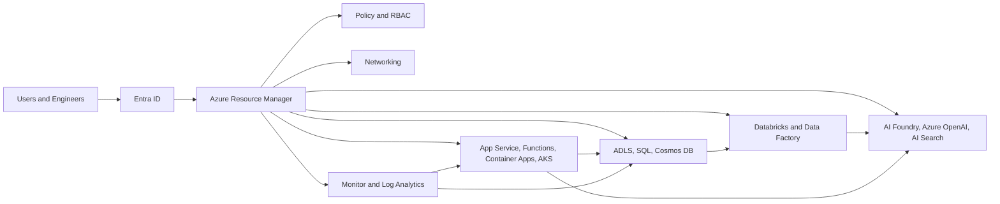
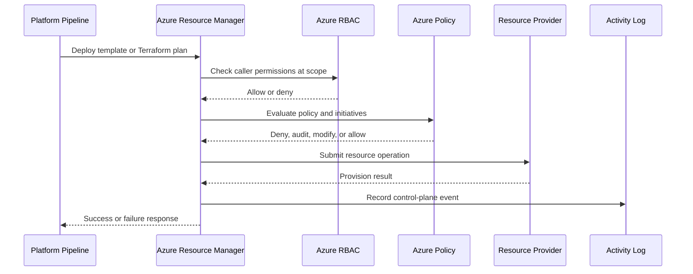

# Azure Core Architecture

> Part of the **Enterprise Data & AI Architecture Handbook** · Phase-03 - Cloud & Azure Architecture · Chapter 02.
> Estimated study time: **75 min reading + ~5h labs**.
> **Prerequisites:** read [Cloud Architecture Fundamentals](01_Cloud_Architecture_Fundamentals.md) first.

---

## Executive Summary

Azure core architecture is the discipline of structuring an Azure estate so that control, accountability, security, cost, and service placement remain understandable as the platform scales. The most important design decisions are not which VM size to buy or which portal blade to click. They are which responsibilities sit at management-group scope, how subscriptions are segmented, how resource groups map to deployment boundaries, how RBAC and policy are applied, which regions and paired regions support resilience, and how data and AI services are composed without losing governance.

In mature enterprises, Azure architecture fails less often because of missing products than because of weak structure. One oversized subscription becomes a security boundary, cost boundary, and blast-radius boundary by accident. Tags exist but are not enforced. Teams are granted Owner because the platform model is unclear. Data platforms and AI platforms grow faster than the governance model designed for line-of-business web apps. The result is predictable: quota surprises, audit friction, permission sprawl, unplanned internet exposure, and poor cost attribution.

The correct baseline is an opinionated Azure hierarchy. Management groups define policy and delegation boundaries. Subscriptions define billing, quota, and isolation boundaries. Resource groups define deployment and lifecycle boundaries. Azure RBAC defines least-privilege access. Azure Policy enforces mandatory controls. Blueprints remain relevant only as legacy context; modern estates should standardize on management groups, policy, Bicep or Terraform, template packaging, and deployment automation. Regions, paired regions, and availability zones should be selected deliberately based on workload criticality, data residency, and service availability rather than provider marketing.

For data and AI workloads, the architecture must also expose a clear service map. Storage, analytics, orchestration, AI model hosting, vector and search services, networking, observability, and governance each belong to explicit platform layers. Azure-native services such as ADLS Gen2, Azure SQL Database, Cosmos DB, Event Hubs, Service Bus, Azure Databricks, Azure AI Foundry, Azure OpenAI, Azure AI Search, AKS, Container Apps, Entra ID, Key Vault, Monitor, and Purview form the core. Open-source technologies such as Terraform, Kubernetes, PostgreSQL, Kafka, Redis, Prometheus, Grafana, and OpenTelemetry complement that core where portability, ecosystem compatibility, or lower-level control justify the extra operational surface.

## Learning Objectives

By the end of this chapter you will be able to:

1. Explain the Azure resource hierarchy from tenant through resource and choose the correct boundary for policy, access, billing, and deployment.
2. Design management-group and subscription patterns for enterprise platforms, data platforms, and AI workloads.
3. Apply Azure RBAC, deny assignments, and policy with enough precision to support least privilege without blocking delivery.
4. Distinguish the historical role of Azure Blueprints from the modern replacement pattern based on management groups, policy, Bicep or Terraform, and deployment automation.
5. Choose Azure regions, paired regions, and availability zones using resilience, residency, and service-availability criteria.
6. Build a practical Azure service map for data and AI capabilities and identify where open-source technologies fit.
7. Create a tagging and cost-management strategy that supports chargeback, showback, and operational accountability.
8. Recognize common Azure-estate failure modes such as subscription sprawl, policy drift, broad permissions, quota bottlenecks, and shared-service blast radius.
9. Translate Azure core architecture into executable governance, IaC, and operational standards.
10. Compare Azure governance primitives against AWS and GCP without assuming semantics are identical.

## Business Motivation

- Azure spend grows faster than control maturity in most enterprises unless the hierarchy is designed early.
- Data and AI platforms create heavier storage, networking, quota, and residency pressure than traditional app hosting alone.
- Regulatory and internal-control requirements are easier to satisfy when scope boundaries are explicit.
- A well-structured Azure estate shortens environment provisioning, permission review, and deployment approval cycles.
- Business continuity depends on region strategy, subscription isolation, and shared-service design, not only on application code.
- Cost optimization improves materially when ownership, environment, and workload metadata are enforced rather than optional.
- Architecture reviews are faster and more defensible when platform standards are visible in policy and IaC instead of tribal knowledge.

## History and Evolution

- Early Azure estates often centered on single subscriptions and portal-driven administration because workloads were small and governance expectations were light.
- Azure Resource Manager standardized resource providers, declarative deployment, role-based access control, and resource-group scoping.
- Management groups were introduced to solve policy and delegation sprawl across many subscriptions.
- Azure Policy moved governance from documentation into executable guardrails.
- Azure Blueprints packaged policy, RBAC, and templates for repeatable environments, but enterprises later found the underlying primitives more durable than the wrapper itself.
- Cloud Adoption Framework and landing-zone practices shifted Azure governance toward opinionated platform structure instead of ad hoc subscription growth.
- Data and AI adoption expanded the importance of services such as ADLS Gen2, Databricks, Synapse, Azure AI Foundry, Azure OpenAI, AI Search, Purview, and large-scale networking patterns.
- The most current direction is clear: treat Azure core architecture as a programmable platform with management groups, policy, templates, pipeline automation, and platform telemetry as first-class assets.

## Why This Technology Exists

Azure core architecture exists because enterprises need a stable control structure above individual workloads. Without that structure, every subscription becomes a special case, every environment becomes a snowflake, and every audit or cost question becomes a manual investigation. The purpose is not bureaucracy. The purpose is to make scale governable.

It also exists because cloud primitives have different natural boundaries. Permissions inherit by scope. Policy evaluates by scope. Budgets and invoices aggregate by subscription. Quotas are often subscription- or region-specific. Resources are deployed into resource groups. Networking, identity, and logging frequently span many workloads. If these boundaries are not aligned to business and engineering reality, the cloud estate develops invisible coupling.

For data and AI platforms the need is stronger. Model-serving, lakehouse, streaming, vector search, feature pipelines, and operational APIs all compete for shared identity, shared network paths, shared quotas, and shared storage conventions. A core architecture is what keeps that competition from degrading into operational chaos.

As established in [Cloud Architecture Fundamentals](01_Cloud_Architecture_Fundamentals.md), cloud architecture is about choosing the right abstraction and failure boundary. Azure core architecture is the Azure-specific expression of that principle.

## Problems It Solves

- Provides a repeatable hierarchy for policy, access, billing, and workload isolation.
- Reduces subscription sprawl by turning subscription creation into a deliberate platform workflow.
- Enforces mandatory controls such as tags, approved locations, private networking requirements, and diagnostic settings.
- Improves least-privilege access through scoped RBAC instead of broad ad hoc assignments.
- Supports region and paired-region strategies for resilience and residency.
- Makes data and AI service selection easier by exposing a common platform map.
- Improves FinOps by standardizing tagging, budgets, and ownership metadata.
- Creates a foundation for landing zones, deployment stamps, and platform engineering.

## Problems It Cannot Solve

- It cannot make a poorly designed application secure or resilient by hierarchy alone.
- It cannot remove service-specific limits, quotas, or feature gaps in chosen regions.
- It cannot guarantee compliance if data classification, retention, and workload behavior remain unclear.
- It cannot fix weak operational discipline around incident response, key rotation, or rollout controls.
- It cannot eliminate concentration risk if all critical shared services remain in one region or one subscription boundary.
- It cannot make open-source platforms simpler to operate if the organization chooses them without the staffing to support them.
- It cannot replace application-domain decisions such as tenancy strategy, data model quality, or API boundaries.

## Core Concepts

### Azure Resource Hierarchy

The Azure control hierarchy is:

1. Entra tenant.
2. Management groups.
3. Subscriptions.
4. Resource groups.
5. Resources.

Each layer solves a different problem.

- The tenant is the identity and directory boundary.
- Management groups organize subscriptions for policy and delegated administration.
- Subscriptions define billing, quota, provider-registration, and broad isolation boundaries.
- Resource groups define deployment, lifecycle, and coarse-grained ownership boundaries.
- Resources are the actual runtime and data services.

Architects repeatedly fail when they blur these boundaries. A resource group is not a cost model by itself. A subscription is not automatically an environment if multiple teams and workloads are forced into it. A management group is not a deployment unit.

### Azure RBAC

Azure RBAC grants permissions at scope. Built-in roles are useful starting points, but mature estates rely on carefully designed custom roles, group-based assignments, privileged identity management, and separation between control-plane and data-plane access. The practical rules are:

- Assign to groups rather than individuals.
- Prefer workload identity over long-lived secrets.
- Keep Owner rare and time-bound.
- Separate platform administration from application administration.
- Distinguish Azure resource access from data access inside the service.

### Azure Policy

Azure Policy is the executable expression of architecture standards. It can audit, deny, append, modify, or deploy supporting configuration. Common enterprise controls include required tags, allowed locations, allowed SKUs, diagnostic settings, private endpoint requirements, TLS version minimums, and prevention of public network exposure. Initiatives group policies into reusable control sets.

### Azure Blueprints

Azure Blueprints mattered because they packaged policy assignments, RBAC, ARM templates, and resource groups into one deployable artifact. The modern lesson is that the primitives mattered more than the packaging. Microsoft deprecated Azure Blueprints and set a retirement date of **July 2026**, after which existing Blueprint assignments stop being supported; any estate still relying on it needs an active migration plan, not a "someday" backlog item. In current enterprise practice, Blueprints should be treated as legacy estates to migrate from, not as the preferred future state. Management groups, policy initiatives, template specs, deployment stacks, Bicep, Terraform, and pipeline automation are the durable pattern.

### Regions, Paired Regions, and Availability Zones

- A region is the primary placement boundary for services and data.
- A paired region is Microsoft's documented regional pairing used for certain platform behaviors and disaster-recovery guidance.
- Availability zones are physically separate datacenter groupings within supported regions.
- Not every service is zone-aware or available in every region.
- A paired region is helpful context, but actual DR strategy must be based on workload-level service support, failover mechanics, and business targets rather than the existence of a documented pair alone.

### Core Services Map for Data and AI

| Capability | Azure-first services | Why they belong in core architecture |
|---|---|---|
| Identity and secrets | Entra ID, Managed Identity, Key Vault | Everything depends on identity and secret hygiene |
| Governance and metadata | Purview, Policy, Resource Graph, Cost Management | Platform inventory and control are inseparable from data and AI operations |
| Storage and lakehouse | Blob Storage, ADLS Gen2, Azure NetApp Files where justified | Foundational durable storage for structured and unstructured data |
| Relational and operational data | Azure SQL Database, Azure Database for PostgreSQL, Cosmos DB | Different correctness and latency boundaries |
| Integration and streaming | Event Hubs, Service Bus, Data Factory, Logic Apps | Decoupling and orchestration backbone |
| Analytics and ML | Azure Databricks, Fabric where applicable, Synapse patterns in legacy estates | Large-scale data processing and model pipelines |
| AI application services | Azure AI Foundry, Azure OpenAI, Azure AI Search, Content Safety | Model hosting, retrieval, evaluation, and AI app assembly |
| Compute and runtime | App Service, Functions, Container Apps, AKS, VMs | Execution surfaces for platform and product workloads |
| Observability | Azure Monitor, Application Insights, Log Analytics, Managed Grafana | Required to operate the estate safely |

## Internal Working

Azure Resource Manager is the control-plane broker for most Azure resources. When a template, CLI command, or portal action submits a deployment, ARM validates the request, authenticates the caller, checks RBAC at the requested scope, evaluates policy, routes to the correct resource provider, and records activity in control-plane telemetry. That means governance and deployment speed are deeply influenced by how scopes and providers are organized.

Management-group inheritance is one of the most important internal behaviors. A policy or role assignment placed too high can affect every child subscription. That is powerful and dangerous. Enterprises should keep the top of the tree intentionally small, then use lower management groups for environment class, platform domain, or compliance boundary. Policy inheritance is useful only when the inheritance path mirrors real governance intent.

Subscriptions are both operational and commercial units. They carry quotas, invoices, spending views, provider registrations, and many service limits. This is why putting dissimilar production workloads into one subscription can create invisible coupling. A burst in GPU capacity for AI training, for example, should not consume the operational slack needed by a critical API subscription unless that coupling is an intentional economic decision.

Resource groups are often misunderstood. They are not mini-subscriptions and should not become random folders. A resource group works best when resources share lifecycle, ownership, and deployment cadence. Splitting one tightly coupled service across many resource groups may make governance look neat while making deployment coordination harder.

Policy evaluation is also internalized over time. Some policies deny at create or update time, some audit existing drift, and some remediate by deploying configuration such as diagnostic settings. Teams should distinguish preventive controls from detective controls and automate exceptions with expiry and owner metadata rather than permanent manual bypass.

## Architecture

An enterprise Azure core architecture usually has four structural layers:

1. Tenant and identity layer: one or more Entra tenants, identity governance, break-glass accounts, and workload identity strategy.
2. Governance layer: management groups, policy initiatives, tagging standards, budgets, and platform review processes.
3. Subscription and landing-zone layer: subscriptions segmented by environment, business domain, data sensitivity, or platform function, with shared services clearly separated from workload subscriptions.
4. Workload layer: resource groups and resources for application, data, and AI services.

For a data and AI platform, a pragmatic Azure hierarchy often looks like this:

- Root management group.
- Platform management group for shared identity-adjacent platform services, monitoring, networking, and policy tooling.
- Corp or production management group for enterprise production workloads.
- Non-production management group for dev, test, and sandboxes.
- Regulated management group for workloads with additional residency or isolation requirements.
- Dedicated subscriptions for connectivity, monitoring, data platform shared services, AI shared services, and product or domain workloads.

Shared services should be used selectively. Centralized logging and network connectivity are common winners. Centralized data plane services are more dangerous. One shared Databricks workspace, one shared AI Search service, or one shared key store for every team often becomes a blast-radius amplifier. Use shared control planes where reuse dominates and stamped workload-local services where failure containment or data segregation matters more.

As introduced in [Cloud Architecture Fundamentals](01_Cloud_Architecture_Fundamentals.md), failure domains and abstraction choices must stay explicit. Azure core architecture makes those choices concrete in scopes and service placement.

## Components

| Component | Responsibility | Scope guidance | Azure notes |
|---|---|---|---|
| Entra tenant | Identity and directory boundary | Organization or strong federation boundary | Keep identity architecture deliberate; mergers and B2B collaboration complicate this layer |
| Management group | Governance and delegation | Policy class or organizational boundary | Do not create deep trees without a clear governance reason |
| Subscription | Billing, quota, and broad isolation | Environment, platform, or workload boundary | Separate prod from non-prod unless a stronger reason exists |
| Resource group | Lifecycle and deployment grouping | Service or solution lifecycle boundary | Avoid turning RGs into arbitrary categorization folders |
| Policy initiative | Control set | Tenant, management group, subscription, or RG | Use initiatives for coherent standards such as diagnostics or tag enforcement |
| RBAC role assignment | Access control | Narrowest practical scope | Group-based and time-bound where possible |
| Budget and cost alert | Financial guardrail | Subscription or resource group | Budgets without ownership and tags have limited value |
| Region and paired region plan | Placement and DR | Workload and platform domain | Validate actual service availability before standardizing |
| Data platform core | Storage, analytics, governance | Platform or domain subscription | ADLS, Databricks, Purview, SQL, Event Hubs are common anchors |
| AI platform core | Model access, vector, search, evaluation | Shared or domain-stamped depending sensitivity | AI services often need stronger quota and egress governance |

## Metadata

Metadata is the hinge between architecture intent and platform automation. Without consistent metadata, Azure estates become searchable but not governable.

Recommended mandatory tags:

| Tag | Purpose |
|---|---|
| `application` | Business service or platform name |
| `owner` | Accountable engineering or product team |
| `environment` | prod, preprod, test, dev, sandbox |
| `costCenter` | Chargeback or showback anchor |
| `dataClassification` | public, internal, confidential, restricted |
| `criticality` | tiering for operational expectations |
| `rto` | Recovery time target |
| `rpo` | Recovery point target |
| `tenantModel` | pooled, bridge, siloed, or not applicable |
| `regionClass` | primary, secondary, sovereign, regulated |

Additional metadata should exist outside tags as well:

- Policy exemptions with reason, owner, and expiry.
- Subscription purpose and onboarding date.
- Service catalog entries mapping product domains to Azure resources.
- Data lineage and catalog metadata for lakehouse and AI assets.
- Model registry metadata for AI endpoints and evaluations.

Do not overload tags to solve every metadata problem. Tags are useful for platform-wide search, policy, and cost. Rich operational metadata often belongs in service catalogs, CMDBs, data catalogs, or code repositories.

## Storage

Azure core architecture should categorize storage by role rather than by vendor family.

Operational storage:

- Azure SQL Database for transactional correctness and structured operational data.
- Azure Database for PostgreSQL when ecosystem compatibility and extension support matter.
- Cosmos DB for globally distributed, low-latency entity state with known access patterns.

Analytical and AI storage:

- ADLS Gen2 as the durable substrate for lakehouse patterns.
- Blob Storage for documents, model artifacts, staging payloads, backups, and cold data.
- Azure NetApp Files only when latency-sensitive or POSIX-heavy workloads justify cost.

Architectural considerations:

- Separate raw, curated, and serving zones at both naming and policy level.
- Decide which storage accounts or data platforms are shared and which are domain-local.
- Use private endpoints for sensitive storage paths.
- Standardize lifecycle policies for hot, cool, and archive tiers.
- Make storage region choice explicit; egress and residency matter more for data and AI platforms than for many web apps.

Open-source complements include PostgreSQL, Redis, Delta Lake, Apache Iceberg, Apache Hudi, and MinIO in self-managed estates. They are relevant, but Azure core architecture should still define how they are placed, secured, monitored, and billed.

## Compute

Compute decisions in Azure core architecture should reflect both workload fit and governance burden.

| Compute surface | Typical use | Governance concern | Azure guidance |
|---|---|---|---|
| VMs and VM Scale Sets | Legacy systems, appliances, custom agents | Patch drift, local admin sprawl, inconsistent hardening | Use sparingly and with strong image and policy baselines |
| App Service | Standard web and API workloads | Network integration and secret handling | Strong default for business apps with moderate platform needs |
| Functions | Event handlers and burst-driven tasks | Runtime packaging, identity, and observability | Good for narrow event-driven components, not for every integration problem |
| Container Apps | Containerized services and jobs | Environment sprawl and ingress standards | Useful middle path between PaaS and AKS |
| AKS | Kubernetes-native platforms | Cluster operations, policy, network complexity | Require clear platform ownership and upgrade discipline |
| Azure Databricks | Spark-based analytics, streaming, ML workflows | Workspace isolation, data egress, identity mapping | Separate shared versus dedicated workspaces deliberately |
| GPU or AI compute | Training, fine-tuning, specialized inference | Quota scarcity, cost spikes, regional availability | Keep capacity strategy explicit and isolated from general-purpose compute |

Compute architecture should not drift independently of subscription design. High-quota AI workloads, for example, often need their own subscription or management-group policy class because capacity requests, budget exposure, and network rules differ materially from mainstream application compute.

## Networking

Networking is where Azure core architecture becomes concrete. Identity and policy can be centrally designed, but data and AI systems still fail when the network model is vague.

Azure-first networking baseline:

- Separate connectivity subscriptions from workload subscriptions when the estate is large enough to justify a shared networking control plane.
- Use hub-spoke or Virtual WAN patterns rather than ad hoc peering meshes.
- Standardize private DNS ownership and naming early.
- Prefer private endpoints for storage, SQL, Key Vault, Service Bus, Event Hubs, and AI services where exposure risk is non-trivial.
- Use NAT Gateway or equivalent deterministic egress for workloads with partner allowlists or compliance controls.
- Design around region-local traffic where possible; cross-region data paths should be intentional and observable.
- Document internet ingress patterns clearly: Front Door, Application Gateway, API Management, Nginx ingress, or partner-specific entry points.

For data and AI platforms, network egress policy matters more than many teams realize. Model endpoints, package repositories, observability sinks, notebooks, partner APIs, and lakehouse paths all compete for outbound pathways. Uncontrolled egress is both a security and cost problem.

## Security

Security in Azure core architecture is the combination of scope design, identity, policy, secret handling, and service posture.

Identity controls:

- Use Entra groups for RBAC assignment.
- Use PIM for elevated roles.
- Separate break-glass from normal administration.
- Use Managed Identity or workload identity federation for applications and pipelines.

Scope and policy controls:

- Deny broad write access at shared platform scopes.
- Use policy to require diagnostic settings, private networking, tags, encryption baselines, and approved regions.
- Review exemptions regularly; expired exemptions should fail closed.

Data and AI controls:

- Apply classification-aware storage and network controls.
- Protect model endpoints and search indexes as production data surfaces.
- Log prompt, retrieval, and model-serving access in a privacy-aware way.
- Separate experimentation subscriptions from production AI subscriptions when quota and data sensitivity differ.

Security teams often over-focus on resource creation and under-focus on runtime identities, outbound access, and hidden data copies. Azure core architecture must account for both.

## Performance

Azure core architecture affects performance indirectly but materially.

- Region selection determines baseline latency.
- Subscription and quota placement determine whether scale events succeed.
- Private endpoints, firewalls, and proxy paths add latency and failure modes that must be budgeted.
- Shared services can become performance bottlenecks if they are centrally convenient but operationally overloaded.
- Data and AI workloads are especially sensitive to storage throughput, network pathing, and control-plane throttling during large deployment or scaling events.

Performance guidance:

- Keep latency-sensitive services near their primary data and user base.
- Reserve high-throughput services or isolate them in subscriptions where quota planning is explicit.
- Avoid forcing all telemetry, package fetches, or data access through one narrow network choke point.
- Benchmark region combinations before standardizing a global topology.

## Scalability

Azure estates scale well only when hierarchy and automation scale with them.

- Management-group trees should remain understandable after the first 10 subscriptions, not collapse under custom exceptions.
- Subscription vending should be automated; manual ticket-based creation does not scale.
- Policy should be templatized and versioned.
- Tags should be enforced at creation time, not backfilled quarterly.
- Shared services should be stamped or segmented before they become platform bottlenecks.
- Quota management should be forecasted for data, AI, and GPU-intensive workloads.

In practice, scalability often means recognizing that different platform classes need different Azure architecture. A central monitoring subscription can scale across many workloads. A single shared AI inference subscription frequently cannot, because quotas, billing, and security boundaries diverge too fast.

## Fault Tolerance

Azure core architecture should make failures local and recovery procedural rather than heroic.

- Separate critical shared services from disposable workload environments.
- Use paired-region thinking for planning, but validate actual failover behavior service by service.
- Prefer zone-aware services or zonal distribution where the workload justifies it.
- Keep configuration and IaC artifacts out of the same failure domain as the workloads they recreate.
- Do not centralize every secret, search index, or model endpoint without understanding the blast-radius implications.

Control-plane dependency is a frequent blind spot. During major incidents, creating or modifying resources may be impaired even when existing resources continue running. That is why production runtime paths should avoid unnecessary control-plane calls, and why DR needs pre-created capacity or at least pre-validated automation.

## Cost Optimization

Cost architecture in Azure begins with hierarchy and metadata, not discount mechanisms.

Practical FinOps baseline:

- Use dedicated subscriptions where cost ownership must be clear.
- Enforce `owner`, `costCenter`, and `environment` tags.
- Separate production and non-production spend.
- Use budgets, anomaly alerts, and forecast reviews at subscription and major platform-scope levels.
- Right-size shared services; many platform teams overbuild central infrastructure in the name of standardization.
- Use reservations, savings plans, or committed spend only for genuinely stable demand.
- Keep experimentation, notebook, and GPU workloads on tight budget guardrails.

Data and AI workloads deserve special scrutiny because storage, network egress, search indexing, token usage, and ephemeral compute can outgrow application hosting costs quickly. The platform should expose those cost drivers distinctly.

## Monitoring

Azure core architecture monitoring should answer platform questions before incidents force them.

Minimum monitoring surfaces:

- Activity Log for control-plane operations.
- Azure Monitor and Log Analytics for metrics and operational logs.
- Defender for Cloud for posture signals.
- Cost Management and budgets for financial health.
- Resource Graph for estate-wide inventory and compliance queries.
- Service Health and Resource Health for provider and regional incident context.

Platform dashboards should include:

- Subscription count and growth.
- Policy compliance by management group.
- RBAC drift and high-privilege assignment count.
- Public endpoint exposure count.
- Tag compliance.
- Regional distribution of critical workloads.
- Spend, forecast, and anomaly trends.
- Data and AI quota utilization where relevant.

## Observability

Observability extends beyond workload traces into platform behavior. The Azure estate itself is a system.

Useful observability patterns include:

- Tracing deployment pipelines from code change to control-plane operations.
- Correlating policy denials to specific pull requests or service onboardings.
- Capturing platform events, quota failures, and network changes in the same operational timeline as application symptoms.
- Standardizing OpenTelemetry for application emission while centralizing platform telemetry in Azure Monitor or Managed Grafana.

For data and AI workloads, observability should include data-pipeline state, notebook or job execution metadata, model deployment versions, token or inference consumption, vector-index freshness, and lineage events. A platform that can only observe web requests is incomplete.

## Governance

Governance is the core of this chapter because Azure architecture becomes enterprise architecture only when structure is enforceable.

Recommended governance stack:

- Management groups that reflect real policy classes.
- Subscription onboarding workflow with standard tags, budgets, diagnostic settings, and baseline role assignments.
- Policy initiatives for security, data protection, network posture, and operations.
- Architecture exceptions recorded as ADRs with expiry or review cadence.
- Platform product ownership for shared services.
- Documented rules for when data and AI services may be shared versus dedicated.

### ADR Example

**Context:** The enterprise is expanding from 8 to 60 Azure subscriptions while building a shared data platform, a shared AI foundation layer, and multiple business-domain product teams. Audit findings show inconsistent tags, excessive Owner assignments, and unclear chargeback.

**Decision:** Create a management-group hierarchy with separate production, non-production, and regulated branches. Centralize policy initiatives and logging at the management-group level. Separate subscriptions for connectivity, monitoring, shared data platform, shared AI experimentation, and domain workloads. Keep production AI inference and regulated data workloads in dedicated subscriptions rather than the shared experimentation subscription. Replace legacy Azure Blueprints with Bicep or Terraform modules plus policy initiatives and pipeline-driven onboarding.

**Consequences:** Governance becomes enforceable, cost allocation improves, and quota-intensive workloads stop colliding with ordinary application workloads. The trade-off is more subscriptions, stronger platform engineering requirements, and a need for disciplined onboarding automation.

**Alternatives:**

1. One subscription per business unit with all workloads mixed inside it. Rejected because governance and quotas become too coarse.
2. One central data and AI subscription for everything. Rejected because blast radius, spend visibility, and security boundaries degrade.
3. Continue using Azure Blueprints as the primary standardization mechanism. Rejected because the organization needs a more current, pipeline-native model.

## Trade-offs

| Decision area | Option A | Option B | Real trade-off |
|---|---|---|---|
| Subscription model | Fewer large subscriptions | More specialized subscriptions | Simpler inventory versus clearer isolation, quotas, and billing |
| Governance | Centralized policy | Domain-owned policy with guardrails | Consistency versus local autonomy |
| Shared services | Centralized platforms | Domain-stamped platforms | Lower duplication versus lower blast radius |
| Runtime posture | Managed Azure services | Self-managed open-source services | Lower toil versus greater portability or low-level control |
| Region strategy | Single primary region plus DR | Multi-region active distribution | Lower complexity versus higher resilience and operational overhead |
| Data platform | One shared workspace | Multiple domain or tier workspaces | Better collaboration versus stronger isolation and clearer cost boundaries |

The right answer is rarely uniform across all workloads. The architectural mistake is assuming one answer must be universal because it is operationally convenient.

## Decision Matrix

| Scenario | Recommended hierarchy choice | Recommended compute and service posture | Why |
|---|---|---|---|
| Standard enterprise app portfolio | Prod and non-prod management groups, one subscription per environment or domain class | App Service, SQL, Storage, Service Bus | Keeps governance and billing understandable |
| Shared data platform for many teams | Dedicated platform subscriptions plus domain delivery subscriptions | ADLS, Databricks, Event Hubs, Purview, SQL, Key Vault | Shared governance and data plane need careful separation |
| AI experimentation | Separate non-prod or lab subscription branch | Azure AI Foundry, Azure OpenAI, Container Apps, Search | Budget, quota, and data-risk containment |
| Regulated analytics workload | Regulated management group and dedicated subscriptions | Private endpoints, restricted regions, dedicated data services | Compliance and auditability dominate |
| Startup-scale low-complexity estate | Shallow management-group tree, few subscriptions | PaaS-first, minimal shared services | Avoid overengineering governance |
| Multi-domain SaaS at enterprise scale | Management groups by policy class, subscriptions by domain and environment, shared connectivity and monitoring | Mixed PaaS, AKS, data platform services | Balances autonomy and central control |

## Design Patterns

1. Subscription vending: automate creation of subscriptions with baseline tags, budgets, policies, and role assignments.
2. Deployment stamps: repeat a validated subscription and resource pattern per region, business domain, or tenant class.
3. Shared control plane, local data plane: centralize policy and monitoring, but keep critical workload state closer to the workload.
4. Policy-as-code: version policy definitions, initiatives, and exemptions with the same discipline as application code.
5. Least-privilege groups: map engineering roles to groups and custom roles rather than direct user assignments.
6. Tiered data and AI services: isolate experimentation, shared services, and production inference into separate scopes.
7. Cost-aware tagging: make every production resource attributable to an owner and budget.
8. Region-class standards: define which regions are default, restricted, or exception-only.

## Anti-patterns

- One mega-subscription for every production system.
- Treating resource groups as arbitrary folders rather than lifecycle boundaries.
- Assigning Owner to platform users because role design was deferred.
- Letting tags be optional and trying to repair cost visibility later.
- Assuming paired regions automatically define a usable disaster-recovery plan.
- Centralizing every data and AI workload into a single shared workspace or subscription.
- Continuing to standardize on Azure Blueprints in a modern estate instead of the current primitives.
- Mixing experimental GPU-heavy workloads with revenue-critical application workloads in the same quota boundary.
- Using policy only for audit, never for prevention.
- Relying on the Azure portal as the primary production change surface.

## Common Mistakes

- Building a management-group tree that mirrors the org chart but not the actual policy model.
- Creating too many subscriptions before defining onboarding automation.
- Misunderstanding the difference between RBAC on a resource and authorization inside the service.
- Ignoring private DNS complexity until private endpoints proliferate.
- Treating monitoring subscriptions as cost centers instead of operational dependencies.
- Underestimating region-specific service availability for AI and analytics products.
- Assuming data-platform shared services are always cheaper than stamped or domain-local services.
- Neglecting policy exemptions lifecycle and accumulating permanent exceptions.
- Letting CI or CD pipelines run with broad tenant-wide permissions.
- Forgetting that control-plane outages change what recovery options are possible during incidents.

## Best Practices

- Keep the management-group hierarchy shallow and purposeful.
- Separate production and non-production subscriptions by default.
- Enforce a small mandatory tag set at creation time.
- Use group-based RBAC and PIM for elevated roles.
- Prefer policy deny for high-risk controls and audit for exploratory controls.
- Use Bicep or Terraform for every persistent environment.
- Make subscription purpose, owner, and cost account visible from day one.
- Validate region, zone, and paired-region support before platform standardization.
- Isolate high-cost or high-quota data and AI workloads deliberately.
- Treat control-plane telemetry and policy compliance as first-class operational signals.

## Enterprise Recommendations

An opinionated enterprise recommendation set for Azure core architecture is:

| Area | Recommendation |
|---|---|
| Tenant strategy | Minimize tenant sprawl; use extra tenants only for clear legal, M and A, or isolation reasons |
| Management groups | Use a shallow root with production, non-production, regulated, and platform branches |
| Subscriptions | One subscription should correspond to a meaningful cost, quota, and governance boundary |
| Resource groups | Align to lifecycle and deployment unit, not to reporting categories |
| RBAC | Group-based, least privilege, PIM for elevation, Owner heavily restricted |
| Policy | Central initiatives for tags, locations, diagnostics, private networking, and encryption baseline |
| Blueprints | Support legacy estates only; standardize new work on policy plus IaC |
| Regions | Publish approved primary and secondary regions per workload class |
| Data and AI | Separate experimentation from production; keep shared services limited and justified |
| Cost | Mandatory tags, budgets, anomaly review, and FinOps ownership at subscription level |

## Azure Implementation

Azure implementation should be pipeline-native and scope-aware.

Example Azure CLI for management groups, tags, RBAC, and policy:

```bash
az account management-group create \
  --name mg-platform \
  --display-name "Platform"

az account management-group create \
  --name mg-prod \
  --display-name "Production"

az account management-group subscription add \
  --name mg-prod \
  --subscription 00000000-0000-0000-0000-000000000000

az group create \
  --name rg-data-platform-prod-eus2 \
  --location eastus2 \
  --tags application=data-platform environment=prod owner=data-platform-team costCenter=FIN-1001 dataClassification=confidential

az role assignment create \
  --assignee-object-id 11111111-1111-1111-1111-111111111111 \
  --role "Reader" \
  --scope /subscriptions/00000000-0000-0000-0000-000000000000/resourceGroups/rg-data-platform-prod-eus2

az policy assignment create \
  --name enforce-required-tags \
  --scope /providers/Microsoft.Management/managementGroups/mg-prod \
  --policy /providers/Microsoft.Authorization/policyDefinitions/22222222-2222-2222-2222-222222222222 \
  --params '{"requiredTags":{"value":["application","owner","environment","costCenter"]}}'
```

Example Bicep for management-group-scope governance primitives:

```bicep
targetScope = 'managementGroup'

param mgName string
param policyName string = 'requireCostCenterTag'

resource requireCostCenterTag 'Microsoft.Authorization/policyDefinitions@2023-04-01' = {
  name: policyName
  properties: {
    policyType: 'Custom'
    mode: 'Indexed'
    displayName: 'Require costCenter tag'
    policyRule: {
      if: {
        field: 'tags.costCenter'
        exists: false
      }
      then: {
        effect: 'deny'
      }
    }
  }
}

resource assignRequireCostCenterTag 'Microsoft.Authorization/policyAssignments@2024-04-01' = {
  name: 'assign-require-costcenter-tag'
  properties: {
    policyDefinitionId: requireCostCenterTag.id
    enforcementMode: 'Default'
  }
}
```

Example Terraform for resource-group baseline:

```hcl
resource "azurerm_resource_group" "data_platform_prod" {
  name     = "rg-data-platform-prod-eus2"
  location = "East US 2"

  tags = {
    application        = "data-platform"
    owner              = "data-platform-team"
    environment        = "prod"
    costCenter         = "FIN-1001"
    dataClassification = "confidential"
  }
}

resource "azurerm_log_analytics_workspace" "platform" {
  name                = "law-platform-prod-eus2"
  location            = azurerm_resource_group.data_platform_prod.location
  resource_group_name = azurerm_resource_group.data_platform_prod.name
  sku                 = "PerGB2018"
  retention_in_days   = 30
}
```

Azure service map for data and AI baseline:

| Layer | Preferred Azure services |
|---|---|
| Ingestion | Event Hubs, Data Factory, Logic Apps |
| Storage | ADLS Gen2, Blob Storage |
| Operational data | Azure SQL Database, PostgreSQL, Cosmos DB |
| Processing | Databricks, Functions, Container Apps, AKS |
| AI and retrieval | Azure AI Foundry, Azure OpenAI, Azure AI Search |
| Governance | Purview, Policy, Cost Management |
| Observability | Azure Monitor, Application Insights, Managed Grafana |

## Open Source Implementation

There is no open-source equivalent to Azure management groups or Azure Policy as a hosted control plane, but there are open-source tools that strengthen the operating model around Azure core architecture.

Practical open-source complements:

- Terraform for hierarchy and baseline provisioning.
- GitHub Actions or Azure DevOps pipelines for controlled deployment.
- Kubernetes for portable runtime hosting where AKS is used.
- PostgreSQL, Redis, Kafka, and Trino where ecosystem compatibility matters.
- Prometheus, Grafana, and OpenTelemetry for deeper workload observability.
- dbt, Airflow, Spark, Delta Lake, Iceberg, Hudi, MLflow, Ray, Feast, and Qdrant where the data and AI platform needs those specific patterns.

Example GitHub Actions workflow for Terraform validation:

```yaml
name: validate-platform-baseline

on:
  pull_request:
    paths:
    - infra/**

jobs:
  validate:
    runs-on: ubuntu-latest
    steps:
    - uses: actions/checkout@v4
    - uses: hashicorp/setup-terraform@v3
    - run: terraform -chdir=infra fmt -check
    - run: terraform -chdir=infra init -backend=false
    - run: terraform -chdir=infra validate
```

Example OpenTelemetry resource attributes for Azure workload telemetry:

```yaml
resource:
  attributes:
  - key: cloud.provider
    value: azure
  - key: cloud.region
    value: eastus2
  - key: service.namespace
    value: data-platform
  - key: deployment.environment
    value: prod
  - key: azure.subscription.id
    value: 00000000-0000-0000-0000-000000000000
```

Use these tools to improve automation and portability, not to bypass Azure governance primitives.

## AWS Equivalent (comparison only)

| Azure concept | AWS equivalent | Where Azure is typically stronger | Where AWS is typically stronger | Migration note |
|---|---|---|---|---|
| Management groups | AWS Organizations organizational units | Strong integration with Azure Policy and enterprise identity patterns | Broad multi-account operating maturity and service-control-policy ecosystem | Translate intent, not names |
| Subscription | AWS account | Clear billing and policy boundary integrated into Azure hierarchy | Multi-account practices are deeply standardized in AWS estates | Treat both as coarse isolation and financial boundaries |
| Resource group | Resource Groups and tagging combinations, but not a strict equivalent | Clear deployment and lifecycle grouping in ARM model | AWS often relies more on account and tagging patterns | Avoid assuming resource-group semantics exist elsewhere |
| Azure Policy | SCPs, Config rules, Control Tower guardrails | Tight scope integration from management group down to resource | Mature multi-account preventive-governance ecosystem | Map controls at the right enforcement layer |
| Entra ID plus RBAC | IAM, IAM Identity Center | Strong identity alignment for Microsoft-centric enterprises | IAM feature depth and ecosystem familiarity | Separate human and workload identity in either cloud |
| Databricks, ADLS, AI Foundry map | S3, Glue, EMR, Bedrock, OpenSearch, managed AI stack | Integrated Microsoft data and identity ecosystem | Breadth of specialized cloud-native data and AI primitives | Re-evaluate platform composition rather than searching for one-to-one product swaps |

## GCP Equivalent (comparison only)

| Azure concept | GCP equivalent | Where Azure is typically stronger | Where GCP is typically stronger | Migration note |
|---|---|---|---|---|
| Management groups | Folders and organization hierarchy | Strong enterprise governance story tied to subscriptions and policy | Clean org-folder-project hierarchy model | Hierarchy intent is portable even if mechanics differ |
| Subscription | Project plus billing account relationship, though semantics differ | Strong cost and policy isolation in subscription model | Project-centric simplicity for many engineering teams | Do not assume project equals subscription exactly |
| Resource group | No direct equivalent | Clear lifecycle grouping in ARM | Simpler project-scoped operations for some teams | Adapt deployment structure to provider model |
| Azure Policy | Organization Policy, Policy Controller, Config Validator patterns | Broad policy integration for Azure services | Strong Kubernetes and policy-controller ecosystem | Re-express policies in provider-native controls |
| Azure AI Foundry and OpenAI map | Vertex AI, model garden, search and serving stack | Microsoft ecosystem alignment and enterprise identity fit | Strong ML platform depth and data-science workflows | Preserve application contracts and evaluation workflows |
| Azure Monitor | Cloud Monitoring and Cloud Logging | Unified fit in Azure-centric enterprises | Mature SRE-centric workflows and project-scoped clarity | Standardize telemetry schema with OpenTelemetry |

## Migration Considerations

Migrating into a sound Azure core architecture usually requires re-sequencing work, not just moving resources.

1. Establish the target management-group and subscription model before large-scale workload onboarding.
2. Replace legacy Blueprints with policy plus IaC during platform refresh cycles rather than preserving them indefinitely.
3. Move shared platform capabilities into dedicated subscriptions only when shared ownership and blast radius are well defined.
4. Review every subscription for purpose, owner, tags, budget, and policy compliance before treating it as production-grade.
5. Re-check region choices for data and AI services; not all target services exist in the same regions as older app stacks.
6. Refactor RBAC away from user-level and Owner-heavy assignments before migration hardens bad habits.
7. Separate experimentation from production for AI and data science early; this prevents quota and cost conflict later.
8. Validate network, DNS, and private-endpoint design before mass deployment of storage and data services.

Migration should be judged complete only when the hierarchy, controls, and operational evidence are live, not merely when the workloads run.

## Mermaid Architecture Diagrams







## End-to-End Data Flow

The end-to-end control and data flow for a governed Azure data and AI workload typically looks like this:

1. A platform team creates or vends a subscription under the correct management group.
2. Baseline policy, RBAC, budgets, and logging are assigned automatically.
3. A workload team deploys resource groups and services with Bicep or Terraform.
4. Azure Resource Manager evaluates permissions and policy, then provisions services.
5. Data lands in ADLS Gen2 or Blob Storage through Event Hubs, Data Factory, or application APIs.
6. Processing services such as Databricks, Functions, Container Apps, or AKS transform and enrich the data.
7. Operational datasets flow into Azure SQL Database, PostgreSQL, or Cosmos DB as required.
8. AI applications use Azure AI Foundry, Azure OpenAI, and Azure AI Search for model access, retrieval, and serving.
9. Monitor, Application Insights, Resource Graph, and Cost Management expose runtime, platform, and spend signals.
10. Policy, audit, and telemetry feedback into platform improvement and exception review.

This flow matters because it shows that governance is not a one-time platform bootstrap. It is continuous control over how workloads are created, run, and changed.

## Real-world Business Use Cases

1. Enterprise data platform: domain teams ingest data into ADLS while central policy enforces region, tags, diagnostics, and private networking.
2. Multi-tenant B2B SaaS on Azure: subscriptions segment production, non-production, and regulated workloads while shared platform services remain controlled and observable.
3. AI product platform: experimentation runs in isolated subscriptions with strong budget controls, while production inference runs in separate scopes with stricter change management.
4. Global analytics estate: paired-region and zone-aware design support resilience while data sovereignty is handled through region-class policy.
5. Regulated financial-reporting platform: dedicated subscriptions, private endpoints, and tightly controlled RBAC support auditable operations.

## Industry Examples

- Large enterprises using Azure landing-zone patterns routinely separate connectivity, identity-adjacent shared services, and workload subscriptions to avoid central platform failures spilling into every product team.
- Capital One's widely discussed cloud-governance approach on AWS still generalizes here: account or subscription boundaries are one of the most important control surfaces in cloud. The lesson transfers even when the provider differs.
- Microsoft guidance for Cloud Adoption Framework and landing zones demonstrates that policy, management groups, and subscription design matter more to long-term stability than early service-by-service optimization.
- Databricks-on-Azure enterprise patterns consistently emphasize workspace isolation, network controls, and storage-governance boundaries because analytics platforms otherwise become shared-risk platforms.
- Public GenAI platform patterns across the industry increasingly separate sandbox, evaluation, and production model-serving scopes because quota, data sensitivity, and cost curves differ dramatically.

## Case Studies

### Case Study 1: Subscription Sprawl Without Onboarding Standards

A global enterprise allowed teams to create Azure subscriptions with minimal review. Within two years it had hundreds of subscriptions, inconsistent tags, overlapping VNets, and unclear owners. Budgets existed in some places, logging in others, and policy exemptions were undocumented. The failure was not Azure capability; it was lack of subscription vending, tagging enforcement, and management-group discipline. The repair involved freezing new subscriptions temporarily, defining platform baselines, then onboarding subscriptions into standardized branches.

### Case Study 2: Shared Analytics Workspace as a Blast-Radius Multiplier

A central data team placed too many business-critical data pipelines, notebook jobs, and exploratory workloads into one shared analytics environment. Heavy month-end processing and ad hoc experimentation collided. Cost spikes and job starvation affected downstream reporting. The lesson was that shared services should be separated by criticality and workload class, not only by organizational convenience.

### Case Study 3: Broad Permissions and Accidental Production Change

An engineer with inherited broad rights modified production network settings while troubleshooting a non-production issue because the access model was group-wide and poorly scoped. Recovery was possible, but the incident exposed a familiar pattern: Owner and Contributor assignments were being used as substitutes for role design. The fix was custom roles, PIM, and scope discipline rather than more documentation.

## Hands-on Labs

1. Create a management-group hierarchy for platform, production, non-production, and regulated workloads.
2. Onboard a new subscription and apply baseline tags, a budget, and policy initiatives.
3. Build a Bicep or Terraform module that creates a resource group with mandatory tags and a Log Analytics workspace.
4. Implement a policy that denies resource creation outside approved regions.
5. Assign least-privilege RBAC roles to platform engineers, application teams, and data scientists.
6. Design a core service map for a data and AI platform using Azure-native services and open-source complements.
7. Simulate a subscription quota or policy failure and document the operational response.

## Exercises

1. Explain why a subscription is both a financial boundary and an operational boundary.
2. Decide when a resource group should map to an entire solution versus one component.
3. Write an ADR arguing for a dedicated AI experimentation subscription branch.
4. Identify which policies should deny immediately and which should audit first.
5. Propose a tag schema that supports FinOps, security, and resilience reviews.
6. Compare one shared Databricks workspace versus multiple domain workspaces.
7. Evaluate whether a paired region alone is sufficient for your most critical workload.
8. Map your current Azure roles and identify where Owner can be removed.

## Mini Projects

1. Azure subscription-vending accelerator: a small IaC and pipeline solution that creates a new subscription baseline with tags, policies, budgets, and role assignments.
2. Data-and-AI platform map: a documented service map that places ingestion, storage, processing, search, model serving, and observability across a clean Azure hierarchy.
3. Policy compliance dashboard: a Log Analytics, Resource Graph, or Grafana view showing tag compliance, public exposure, high-privilege assignments, and regional placement.

## Capstone Integration

This chapter is the control-plane counterpart to [Cloud Architecture Fundamentals](01_Cloud_Architecture_Fundamentals.md). The earlier chapter explained service models, shared responsibility, failure domains, elasticity, and multi-tenancy. This chapter turns those ideas into Azure scope design, policy enforcement, region strategy, and service placement rules.

The rest of Phase-03 builds on this foundation. Landing zones, networking, compute and containers, storage services, and well-architected practices are all downstream from the decisions made here. If the management-group tree, subscription model, RBAC posture, tag strategy, and region standards are weak, later optimizations only hide the structural problem.

## Interview Questions

1. What is the difference between a management group, subscription, and resource group in Azure?
   **A:** A management group is a container for governing multiple subscriptions with inherited policy/RBAC; a subscription is a billing and scale boundary containing resources with its own quotas; a resource group is the finest-grained container grouping related resources for lifecycle management (deploy/delete together) — each nests inside the one above it.
2. Why is Owner one of the most dangerous roles to normalize in an enterprise estate?
   **A:** Owner grants both full data/resource control and the ability to manage RBAC assignments itself, meaning an Owner can grant themselves or others any other permission — normalizing it as a default role removes the least-privilege boundary that limits blast radius from a compromised account or an accidental change.
3. What kinds of controls belong in Azure Policy rather than documentation?
   **A:** Any control that must be true 100% of the time and is checkable programmatically (require encryption, deny public network access, enforce required tags) belongs in Policy because it's enforced automatically; documentation-only controls rely on humans remembering and following them, which fails silently at scale.
4. How would you explain the practical limits of paired regions to a non-technical stakeholder?
   **A:** Paired regions give some platform-level benefits (staggered updates, prioritized recovery) but do not automatically replicate your data or fail over your application — you still must design and test your own cross-region replication and failover, paired regions are a convenience for the underlying platform, not a DR solution you get for free.
5. When should a workload get its own subscription?
   **A:** When it has materially different compliance/regulatory requirements, needs subscription-level quota isolation (to avoid contending with other workloads), or requires a genuinely separate billing/cost-attribution boundary — not simply because a team wants organizational autonomy.
6. Why are data and AI workloads often bad candidates for one giant shared subscription?
   **A:** They frequently hit subscription-level quota limits (compute cores, storage accounts) faster than typical application workloads, and their often-experimental nature (AI training runs, ad hoc analytics) creates a different risk/change-velocity profile than stable production services sharing the same subscription.
7. What role do tags play in architecture rather than just billing?
   **A:** Tags encode ownership, environment, criticality, and data classification directly on the resource, which policy engines, incident response tooling, and cost allocation can all query programmatically — without them, answering "who owns this" or "is this production" requires manual investigation rather than a direct query.
8. Why should Azure Blueprints be treated as legacy context rather than the default forward path?
   **A:** Azure Blueprints has been deprecated in favor of Template Specs and Bicep/Terraform-based deployment stacks; understanding it is useful for maintaining existing estates that adopted it, but new landing-zone work should default to the currently supported IaC tooling.

## Staff Engineer Questions

1. How would you design a subscription-vending workflow that balances autonomy and control?
   **A:** Automate subscription creation via a self-service request that applies mandatory baseline policy and RBAC automatically (no manual step required for the guardrails), giving teams fast autonomy for their own resources while guaranteeing the non-negotiable controls are present from the moment the subscription exists.
2. What policy set would you enforce at production management-group scope on day one?
   **A:** Deny public network access on PaaS resources by default, require encryption at rest, require the mandatory tag set, and restrict allowed regions to the approved list — these are the highest-leverage, lowest-false-positive controls to enforce immediately rather than phasing in gradually.
3. How do you distinguish a shared platform service that should be centralized from one that should be stamped per domain?
   **A:** Centralize services with low domain-specific customization need and high value from economies of scale (identity, shared networking hub); stamp per domain when the service needs to evolve at a different pace or with different requirements per domain (a domain-specific data platform).
4. How would you prevent quota-heavy AI experimentation from impacting production workloads?
   **A:** Place AI experimentation in a separate subscription with its own quota allocation, so a training run consuming a large compute quota can never contend with or exhaust the quota production workloads depend on.
5. What evidence would you require before approving a broad Contributor or Owner assignment?
   **A:** A documented justification for why a narrower, custom RBAC role (scoped to only the specific actions needed) is insufficient — broad role assignments should be the exception requiring evidence, not the default requiring justification only to restrict.
6. How would you structure observability for both control-plane and data-plane failures across many subscriptions?
   **A:** Aggregate Azure Activity Log (control-plane changes) and resource-level diagnostic logs (data-plane behavior) centrally across subscriptions via a shared Log Analytics workspace or equivalent, so an incident spanning multiple subscriptions can be investigated from one place rather than requiring per-subscription log-hunting.
7. What are the operational downsides of building a deep management-group tree?
   **A:** Policy inheritance through many nested levels becomes hard to reason about (which effective policy applies at a given subscription becomes non-obvious), and deep trees slow down policy evaluation and organizational navigation — flatter, purpose-driven hierarchies are usually easier to operate.
8. How would you phase migration away from legacy Azure Blueprints without destabilizing existing subscriptions?
   **A:** Leave existing Blueprint-assigned subscriptions running as-is (don't force an unnecessary disruptive unassignment), but require all new subscriptions to use the current IaC tooling, and migrate legacy subscriptions opportunistically during their next major infrastructure change rather than as a dedicated, risky big-bang project.

## Architect Questions

1. What is the enterprise standard for subscription boundaries across environments, domains, and regulated workloads?
   **A:** Separate subscriptions per environment (dev/test/prod) at minimum, with regulated workloads getting dedicated subscriptions regardless of domain to isolate their compliance boundary, and domain-level subscription splits driven by quota needs and team autonomy requirements rather than a fixed rule.
2. Which controls must be globally inherited, and which must remain domain-local?
   **A:** Security baseline controls (encryption, network exposure, identity) should be globally inherited and non-overridable; technology-choice and workload-specific configuration should remain domain-local so domains aren't forced into a one-size-fits-all technical pattern that doesn't fit their workload.
3. How should region standards differ for mainstream apps, regulated systems, and AI-intensive workloads?
   **A:** Mainstream apps follow the standard approved-region list; regulated systems are constrained to specific residency-compliant regions only; AI-intensive workloads may need to follow GPU/specialized-hardware availability, which can be more limited than the general approved-region list, requiring an explicit exception process.
4. What is your default position on shared versus dedicated data-platform and AI-platform services?
   **A:** Default to a shared data platform for standard analytical workloads to amortize governance and operational cost, with dedicated platforms reserved for domains with genuinely different regulatory, quota, or performance-isolation requirements that a shared platform can't satisfy.
5. How do you govern policy exemptions so they do not become permanent architecture debt?
   **A:** Require every exemption to have an expiry date and a named owner, tracked in a visible register subject to periodic review — an exemption without an expiry silently becomes permanent, unreviewed technical debt.
6. How do you align Azure hierarchy with FinOps, security, and platform engineering responsibilities?
   **A:** Design the management-group/subscription hierarchy so cost-center boundaries, security-policy inheritance boundaries, and platform-team ownership boundaries all align to the same structure — misalignment between these three (e.g., cost centers crossing subscription boundaries) makes accountability ambiguous.
7. Which platform services deserve their own dedicated subscriptions, and why?
   **A:** Shared networking hub, shared identity/security tooling, and shared observability infrastructure typically deserve dedicated subscriptions because their blast radius affects everything else and their lifecycle/change cadence differs from any individual workload subscription.
8. What is your plan for ensuring Azure control-plane telemetry is part of production operations?
   **A:** Route Azure Activity Log data into the same operational monitoring/alerting pipeline as application telemetry, with alerts on high-risk control-plane events (role assignment changes, policy exemption creation) treated as first-class operational signals, not an afterthought only checked during audits.

## CTO Review Questions

1. Are our Azure subscription boundaries aligned to accountability, or are they historical accidents?
   **A:** This requires an honest audit — subscriptions created ad hoc during early cloud adoption often don't map cleanly to current organizational or cost-center structure, creating ambiguous ownership that should be remediated even though it's disruptive.
2. Which shared services create unacceptable blast radius if they fail or are misconfigured?
   **A:** Shared identity and shared networking hubs are the most common candidates — their failure or misconfiguration cascades broadly, so they warrant the highest redundancy and change-control rigor in the estate.
3. Are our data and AI platform costs attributable to real owners and products?
   **A:** If tagging and subscription structure don't cleanly attribute data/AI spend to specific products or teams, cost accountability is effectively absent, which typically means no one is incentivized to optimize that spend.
4. Where are we paying for centralization that no longer creates enough leverage?
   **A:** A centralized shared service that's become a bottleneck (slow onboarding, frequent contention) may be costing more in delivery friction than it saves in economies of scale — this should be periodically re-evaluated, not assumed permanently correct.
5. Which of our most critical workloads still depend on weak RBAC, weak tagging, or undefined region strategy?
   **A:** This is answerable via a direct policy-compliance query across the estate — any Tier-1 workload failing baseline RBAC/tagging/region policy checks represents an audit and incident-response risk that should be prioritized for remediation.
6. If a regulator asked us to prove who can create public endpoints today, could we answer quickly and accurately?
   **A:** This should be answerable via an Azure Policy compliance report or RBAC query in minutes — if it requires manual investigation across many subscriptions, that's a governance gap that itself is a compliance risk.
7. Are we over-standardizing on shared platform choices that slow high-value teams down?
   **A:** This requires listening to delivery-velocity complaints from high-value teams specifically — a standard that's right for 90% of teams may be actively harmful to a team with genuinely different, legitimate requirements, and blanket standardization without an exception path risks that friction.
8. What Azure architecture decisions are strategic, and which should remain reversible?
   **A:** Identity model and core network topology are strategic and hard to reverse; subscription-count and resource-naming conventions are comparatively reversible — treating reversible decisions with the same rigor as strategic ones slows delivery without proportional benefit.

## References

- Microsoft Cloud Adoption Framework for Azure.
- Azure Architecture Center guidance on management groups, subscriptions, and resource groups.
- Azure RBAC documentation and built-in role reference.
- Azure Policy documentation and policy initiative guidance.
- Azure Well-Architected Framework.
- Azure regions, paired regions, and availability zones documentation.
- Azure Cost Management and FinOps guidance.
- Azure Resource Graph documentation.
- Public guidance and engineering write-ups from Microsoft, Databricks, and major cloud adopters.

## Further Reading

- Re-read [Cloud Architecture Fundamentals](01_Cloud_Architecture_Fundamentals.md) and map each abstraction decision to an Azure scope decision.
- Azure Landing Zones for prescriptive enterprise platform structure.
- Azure Networking for private connectivity, ingress, egress, and hybrid path design.
- Azure Compute and Containers for runtime-specific placement decisions.
- Azure Storage Services for data durability, performance, and lifecycle architecture.
- Azure Well-Architected guidance for reliability, security, performance, cost, and operational excellence trade-offs.