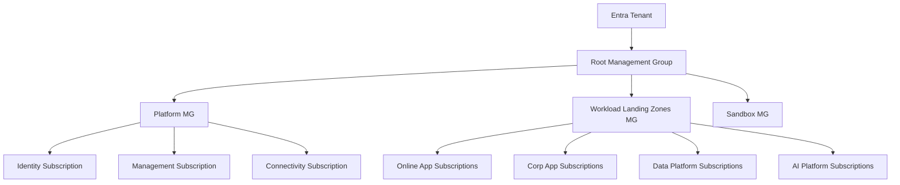
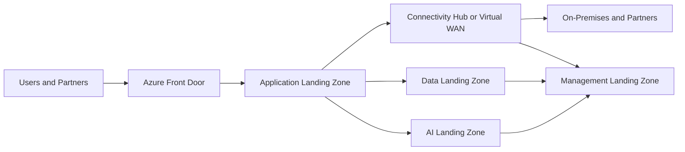
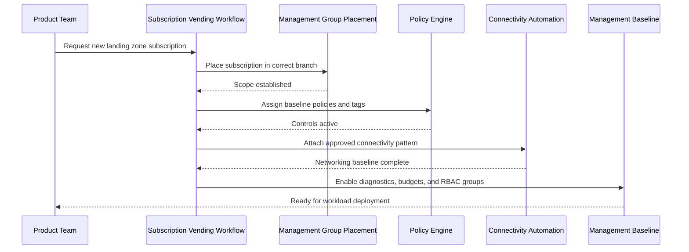

# Azure Landing Zones

> Part of the **Enterprise Data & AI Architecture Handbook** · Phase-03 - Cloud & Azure Architecture · Chapter 03.
> Estimated study time: **75 min reading + ~5h labs**.
> **Prerequisites:** read [Azure Core Architecture](02_Azure_Core_Architecture.md) first.

---

## Executive Summary

Azure landing zones are not a set of starter templates and they are not a marketing label for "well-organized subscriptions." They are the operational architecture that turns Azure from a collection of services into a governable enterprise platform. A landing zone defines where workloads live, how they connect, how identity and policy reach them, how shared services are separated from workload services, and how new subscriptions or environments are onboarded without re-arguing the basics each time.

The Cloud Adoption Framework enterprise-scale model matters because it gives a durable vocabulary for that platform structure. Platform landing zones host shared capabilities such as connectivity, management, and identity-adjacent services. Application landing zones host the business workloads, data platforms, and AI platforms that actually produce value. The distinction is fundamental. If shared platform services are mixed casually into workload subscriptions, every operational concern becomes coupled. If application teams are forced to consume one central environment for every runtime and data plane, platform convenience becomes business fragility.

The most effective Azure landing zone design is opinionated in a few places and flexible in the right places. Management groups carry policy and delegated administration. Subscriptions become cost, quota, and blast-radius boundaries. Shared networking usually uses hub-and-spoke or Virtual WAN rather than ad hoc peering. Identity, management, and connectivity subscriptions exist for specific reasons, not because the diagram looks mature. Bicep and Terraform accelerators exist to make this structure repeatable, reviewable, and testable.

For enterprise data and AI architecture, landing zones are especially important because these workloads concentrate cost, data sensitivity, egress, and quota pressure. A lakehouse platform, a model-serving platform, and a revenue-critical application should not inherit the same controls by accident. They should inherit them deliberately. Azure landing zones are the mechanism that makes that possible.

## Learning Objectives

By the end of this chapter you will be able to:

1. Explain what Azure landing zones are and why they are distinct from individual workload deployments.
2. Apply Cloud Adoption Framework enterprise-scale concepts to a real enterprise hierarchy.
3. Distinguish platform landing zones from application landing zones and justify different controls for each.
4. Choose between hub-and-spoke and Virtual WAN topologies based on scale, operating model, and connectivity complexity.
5. Define the purpose of identity, management, and connectivity subscriptions.
6. Create a landing-zone structure that supports data platforms, AI platforms, and standard application estates without collapsing them into one shared failure domain.
7. Use Bicep or Terraform to express landing-zone controls as code rather than manual platform convention.
8. Recognize common landing-zone anti-patterns such as over-centralization, over-customization, weak subscription onboarding, and shared-service blast radius.
9. Map landing zones to FinOps, security, compliance, and platform engineering responsibilities.
10. Compare Azure landing-zone concepts against AWS and GCP without assuming identical semantics.

## Business Motivation

- Enterprises need a repeatable platform model before large-scale Azure adoption becomes expensive entropy.
- Landing zones reduce the time and political friction required to onboard new product teams, data domains, and regulated workloads.
- Shared networking, monitoring, and policy only create value when they are structured to avoid becoming system-wide bottlenecks.
- Data and AI workloads intensify the need for subscription boundaries because quota, storage growth, and network behavior differ materially from standard web applications.
- Executable landing zones reduce audit effort because architecture intent is visible in management groups, policy, subscriptions, and IaC.
- Strong landing zones make platform teams faster because they answer the recurring 80 percent of platform questions once.
- Cost attribution improves when every workload enters the estate through a standard subscription and tagging workflow.

## History and Evolution

- Early Azure estates often grew through project-by-project subscription creation, with minimal shared structure beyond a directory tenant.
- Azure Resource Manager made declarative deployment and scope-based policy possible, but many enterprises still treated governance as documentation rather than code.
- The Cloud Adoption Framework introduced landing zones as a practical way to align organization, security, networking, and operations before cloud growth accelerated.
- The enterprise-scale reference architecture formalized management-group branches for platform, landing zones, sandbox, and decommissioned workloads.
- Platform landing zones for identity, management, and connectivity emerged because shared concerns needed dedicated operational boundaries.
- Hub-and-spoke became the default networking model for many estates, especially when hybrid connectivity and shared inspection were required.
- Virtual WAN became more attractive as estates grew geographically and needed managed branch, VPN, ExpressRoute, and transitive connectivity patterns.
- Bicep, Terraform, and GitOps-style deployment workflows turned landing zones from static diagrams into repeatable accelerators.
- Data and AI platforms forced a second evolution: landing zones had to accommodate lakehouses, model hosting, vector search, GPU quotas, and regulated data domains, not only line-of-business apps.

## Why This Technology Exists

Azure landing zones exist because a cloud estate needs a stable platform shape before it needs more workloads. Without that shape, every new team must renegotiate identity, networking, monitoring, cost ownership, and policy exceptions. That process does not scale. It produces inconsistent controls, slow onboarding, and fragile shared dependencies.

They also exist because Azure scopes have real operational semantics, as established in [Azure Core Architecture](02_Azure_Core_Architecture.md). Permissions inherit by scope. Policy inherits by scope. Budgets are often set at subscription scope. Connectivity patterns depend on which subscriptions own hubs and shared services. Diagnostics and logging must land somewhere. Landing zones are the design pattern that arranges these semantics into a coherent platform.

For data and AI workloads, landing zones solve a sharper problem: how to give teams enough autonomy to move quickly without letting model experimentation, lakehouse processing, and production-serving environments trample each other's quotas, network rules, or compliance posture. The landing zone is the agreement between platform engineering and product engineering about where freedom ends and platform guarantees begin.

## Problems It Solves

- Standardizes Azure onboarding for subscriptions, connectivity, policy, and logging.
- Separates shared platform concerns from workload concerns.
- Reduces uncontrolled network growth and ad hoc peering.
- Makes policy inheritance intentional rather than accidental.
- Improves blast-radius containment for shared services and high-cost workloads.
- Provides a clear place for data-platform and AI-platform services in the broader Azure estate.
- Enables platform engineering to package governance as reusable infrastructure.
- Supports multi-region and hybrid patterns with clearer ownership and dependency maps.

## Problems It Cannot Solve

- It cannot compensate for a poor application or data architecture inside the landing zone.
- It cannot eliminate service-specific limitations, unsupported regions, or quota delays.
- It cannot make one shared platform safe if the organization refuses to isolate high-risk workloads.
- It cannot replace a weak incident response model or weak change-management discipline.
- It cannot guarantee regulatory compliance when the workload mishandles data after deployment.
- It cannot make hub-and-spoke or Virtual WAN inexpensive if the traffic patterns are inherently costly.
- It cannot remove the need for strong identity, DNS, and certificate management.

## Core Concepts

### Cloud Adoption Framework and Enterprise-Scale

Cloud Adoption Framework enterprise-scale is the reference model for structuring a governed Azure estate. The important idea is not copying a diagram exactly. The important idea is separating policy classes, shared platform services, workload landing zones, sandbox areas, and lifecycle retirement in a way that remains operable at scale.

A common enterprise-scale shape includes:

- A root management group.
- Platform management groups for shared services and global guardrails.
- Landing-zone management groups for application and domain workloads.
- Sandbox management groups for low-risk experimentation.
- Decommissioned or transition branches for controlled retirement.

### Platform Versus Application Landing Zones

Platform landing zones host shared capabilities used by many workloads. Typical examples are:

- Connectivity subscription for hub networking, firewall, DNS resolvers, VPN, and ExpressRoute.
- Management subscription for Log Analytics, automation, update tooling, and operational services.
- Identity subscription for domain services, identity-adjacent legacy integration, or directory-dependent services that are not purely Entra-native.

Application landing zones host business workloads. These may be:

- Online landing zones for internet-facing cloud-native workloads.
- Corp landing zones for internal or hybrid-connected enterprise workloads.
- Dedicated data-platform landing zones for lakehouse, analytics, and streaming systems.
- Dedicated AI landing zones for experimentation, model evaluation, and production inference.

The design rule is straightforward: platform landing zones should provide enabling capabilities, not become the default runtime location for all workloads.

### Hub-and-Spoke and Virtual WAN

Hub-and-spoke centralizes shared network services in hub subscriptions and connects workload VNets as spokes. It works well when enterprises want strong control over inspection, DNS, routing, and hybrid ingress or egress, and when the operating model can support the hub as critical infrastructure.

Virtual WAN is a managed connectivity fabric that becomes attractive when the estate spans many regions, branches, or hybrid paths and the enterprise wants Microsoft-managed transit patterns rather than assembling them from many custom hubs. It simplifies some operations, but it also changes how teams reason about control, costs, and troubleshooting.

### Subscription Vending

Landing zones scale only when subscription creation becomes a productized workflow. Subscription vending means a new subscription is created under the correct management group with baseline tags, budgets, policy assignments, role assignments, diagnostic settings, and often connectivity automation. Without vending, landing zones degrade into architecture decks plus manual exceptions.

### Landing-Zone Accelerators

Landing-zone accelerators are IaC packages and pipelines that implement the platform baseline. In Azure, the most relevant implementation styles are Bicep and Terraform. The accelerator should encode:

- Management-group hierarchy.
- Policy initiatives and assignments.
- Baseline subscriptions and shared-resource deployment.
- Networking topology.
- Identity, monitoring, and diagnostics integration.
- Onboarding workflows for application or domain landing zones.

## Internal Working

An Azure landing zone works through inheritance, segmentation, and automation.

Inheritance comes from management groups and policy. Shared guardrails such as required tags, approved regions, diagnostic settings, and public-network restrictions are defined high enough to matter broadly, then refined lower in the hierarchy where workload class differs. If inheritance is badly placed, the landing zone becomes either porous or obstructive.

Segmentation comes from subscriptions and networking boundaries. Platform subscriptions hold shared capabilities with strong operational ownership. Workload subscriptions carry the business services, data services, and AI services that should scale or fail more independently. The landing zone decides which services remain central and which must be stamped or localized.

Automation is what makes the design usable. A request for a new application landing zone or data-platform landing zone should trigger policy-aware provisioning. The workflow should create or assign the subscription, place it in the correct management group, connect it to shared networking or Virtual WAN where approved, enable diagnostics, and seed the correct RBAC groups. If a human must remember all of that manually, the landing zone is not mature enough.

Operationally, landing zones also create a control-plane contract. Platform teams own the baseline and the shared services. Product and domain teams own the workload inside the approved guardrails. Exceptions are explicit, reviewable, and ideally time-bound. That is how platform autonomy and enterprise governance coexist.

## Architecture

An enterprise Azure landing-zone architecture usually has five structural layers:

1. Root governance layer with core policy and management-group structure.
2. Platform landing-zone layer for identity, management, and connectivity.
3. Workload landing-zone layer for online, corp, data, and AI workloads.
4. Shared observability and security services integrated across the estate.
5. Subscription-vending and IaC delivery pipelines for continuous onboarding.

For data and AI architecture, a practical extension is to split the workload layer further:

- Shared data-platform control services, if justified, in a dedicated subscription.
- Domain data landing zones for ownership, chargeback, and residency boundaries.
- AI experimentation landing zones with strong budget and quota controls.
- Production AI landing zones with tighter network, identity, and rollout controls.

The architecture should avoid two extremes:

- one giant central platform that every workload depends on for runtime, and
- complete decentralization where every team recreates identity, monitoring, networking, and policy poorly.

Landing zones exist to hold the line between those extremes.

## Components

| Component | Responsibility | Typical scope | Notes |
|---|---|---|---|
| Root management group | Global governance and inheritance anchor | Tenant-wide | Keep direct assignments limited |
| Platform management groups | Shared-service policy classes | Child of root | Separate by control class, not org chart vanity |
| Connectivity subscription | Hubs, firewall, VPN, ExpressRoute, DNS | Platform landing zone | High-criticality shared infrastructure |
| Management subscription | Logging, automation, operational tooling | Platform landing zone | Treat as production dependency |
| Identity subscription | Legacy or hybrid identity-adjacent services | Platform landing zone | Use only when Entra-native posture is insufficient |
| Application subscriptions | Product workloads | Application landing zones | Online, corp, or domain-specific |
| Data-platform subscriptions | Lakehouse, stream, or analytics platforms | Application landing zones | Often need dedicated quotas and network policy |
| AI subscriptions | Model experimentation or production serving | Application landing zones | Keep experimentation and production distinct |
| Policy initiatives | Guardrails and standards | Management group or subscription | Prefer versioned, code-reviewed policy |
| Subscription-vending pipeline | Standard onboarding workflow | Platform automation | Prevents manual drift |

## Metadata

Landing zones need both resource metadata and platform metadata.

Mandatory subscription or resource tags usually include:

| Tag | Purpose |
|---|---|
| `application` | Product or platform capability name |
| `owner` | Accountable team |
| `environment` | prod, preprod, test, dev, sandbox |
| `costCenter` | FinOps anchor |
| `criticality` | Recovery and alerting expectations |
| `dataClassification` | Security and compliance routing |
| `landingZoneType` | platform, online, corp, data, ai, sandbox |
| `regionClass` | primary, secondary, regulated, sovereign |

Platform metadata should also include:

- subscription purpose and onboarding date,
- management-group branch,
- approved connectivity model,
- policy exemptions with reason, owner, and expiry,
- DR tier and paired-region choice,
- data residency obligations for data and AI landing zones,
- workload category such as online application, internal platform, batch analytics, or AI inference.

This metadata is what lets the platform answer questions quickly: who owns this subscription, why is it here, what controls should apply, and what would break if it fails?

## Storage

Landing zones do not exist primarily to host storage, but storage architecture is heavily shaped by them.

Platform subscriptions typically hold shared operational storage only when centralization is justified, such as diagnostics archives, automation state, or security tooling data. They should not become a catch-all for business data because that confuses ownership and expands blast radius.

Application landing zones hold the business data stores and object stores aligned to the workload. For data platforms, that often means ADLS Gen2, Blob Storage, SQL, PostgreSQL, Event Hubs capture, or curated serving stores. For AI landing zones, it may include model artifacts, prompt logs with privacy controls, feature or retrieval metadata, and vector or search indexes. The landing zone decides the network posture, residency, and governance of those stores before the workload team starts improvising.

The practical rule is simple: centralize storage only when its consumers and controls are genuinely shared. Otherwise place it with the workload or domain landing zone that owns it.

## Compute

Compute placement in landing zones should reflect workload class, not just engineering preference.

Platform landing zones may host:

- network virtual appliances if the connectivity strategy requires them,
- Bastion or jump-host alternatives where still needed,
- automation workers or management runtimes,
- limited identity-adjacent IaaS where legacy dependencies remain.

Application landing zones host the primary runtime surfaces:

- App Service, Functions, Container Apps, AKS, or VMs for standard applications,
- Azure Databricks or Spark-oriented compute for analytics,
- GPU or AI-serving compute for experimentation or production inference,
- Kubernetes-based open-source stacks where justified.

The landing-zone perspective is not which compute is best universally. It is which compute belongs in which subscription and under which controls. Production inference clusters, for example, often deserve a different landing zone from exploratory notebook compute because quota, patching, cost, and incident response differ substantially.

## Networking

Networking is where landing zones become physically meaningful.

Hub-and-spoke remains appropriate when:

- the organization needs central inspection,
- hybrid connectivity is substantial,
- DNS and route control must be tightly governed,
- the estate is large enough to justify dedicated connectivity ownership.

Virtual WAN becomes attractive when:

- many branches or regions need managed transit,
- the enterprise wants simplified global connectivity patterns,
- operational teams want to reduce the amount of custom routing fabric they operate directly.

Key networking decisions inside landing zones include:

- whether private endpoints are mandatory for data and AI services,
- where DNS resolvers and private zones live,
- how outbound internet traffic is controlled,
- whether internet-facing workloads terminate at Front Door, Application Gateway, Nginx ingress, or a combination,
- how on-premises or partner connectivity is segmented from workload networks.

The common error is to centralize networking policy without budgeting for the hub or transit fabric as one of the estate's most critical shared services.

## Security

Landing zones are one of the strongest security control surfaces in Azure because they control inheritance, network posture, and permission boundaries before workloads exist.

Effective landing-zone security includes:

- least-privilege RBAC at management-group, subscription, and resource scopes,
- PIM for privileged roles,
- mandatory diagnostics and threat-protection onboarding,
- private-by-default posture for high-value data and AI services,
- policy-driven restriction of public network exposure and unapproved regions,
- strong separation between platform administrators and workload operators.

Security teams often ask for centralization because centralization is easier to visualize. Landing zones should challenge that assumption where necessary. A centralized service that sees every workload may be easier to audit and much harder to keep resilient.

## Performance

Landing zones affect performance through topology choices and shared-service design rather than direct application optimization.

- Poor hub design can add latency and failure modes to east-west or north-south traffic.
- Over-centralized DNS, proxy, or firewall paths can become bottlenecks.
- Cross-region shared services can penalize analytics and AI workloads that move large datasets.
- Platform automation that is too slow or too approval-heavy delays scaling and incident response.

The performance goal of a landing zone is not to maximize raw throughput everywhere. It is to avoid introducing unnecessary latency, control-plane friction, or transit chokepoints while still meeting governance requirements.

## Scalability

Landing zones must scale in two dimensions: estate size and workload diversity.

Estate size scaling means the management-group model, policy set, and subscription-vending workflow still work when the enterprise moves from 5 subscriptions to 50 or 500. Workload diversity scaling means the same platform can support ordinary internal apps, public SaaS products, lakehouse platforms, and AI inference systems without forcing them into one operational mold.

Scalability therefore depends on:

- a shallow, understandable management-group tree,
- automated subscription vending,
- reusable Bicep or Terraform modules,
- stamped rather than handcrafted workload onboarding,
- clear rules for when services are shared versus dedicated.

If every new workload requires a platform exception workshop, the landing zone is not scaling.

## Fault Tolerance

Landing zones need explicit thinking about shared-service failure because shared services are precisely where platform incidents spread.

- Connectivity subscriptions need their own resilience model, including region strategy, firewall scale, and DNS recovery.
- Management subscriptions need durable logging paths and restore or redeploy plans.
- Identity-adjacent services should not become untested single points of failure for hybrid workloads.
- Data and AI landing zones should avoid unnecessary dependence on one central workspace or index if that dependency would take down many product teams at once.

The discipline here is the same as in application architecture: identify the shared components, quantify the blast radius, and reduce dependency where the consequence is too large.

## Cost Optimization

Landing zones affect cost through structure more than through SKU choice.

Good cost behavior comes from:

- subscriptions that align with ownership and budgets,
- clear shared-service allocation models,
- policy-enforced tags,
- dedicated sandboxes for experimentation,
- deliberate use of premium networking and security services only where justified.

Hub-and-spoke and Virtual WAN both create recurring platform costs. Those costs are acceptable only when the platform is actually providing shared security, compliance, and operational leverage. If the enterprise centralizes everything and still cannot onboard quickly or govern clearly, it is paying platform tax without platform value.

## Monitoring

Landing-zone monitoring should cover both shared platform services and onboarding health.

Minimum signals include:

- policy compliance by management group,
- subscription-vending success and failure,
- connectivity health for hubs, gateways, firewalls, and DNS,
- diagnostic-setting coverage,
- privileged-role assignment counts,
- public endpoint exposure counts,
- regional distribution of critical workloads,
- spend and forecast by landing-zone class.

The management subscription often hosts the central operational workspaces and dashboards, but that does not mean every workload team loses visibility. Shared observability should amplify local accountability, not replace it.

## Observability

Observability for landing zones means the platform can explain why a deployment failed, why traffic broke, why a policy denied creation, or why a workload inherited unexpected routing or logging behavior.

Useful observability patterns include:

- Activity Log correlation with CI or CD runs,
- policy-denial dashboards linked to initiatives and scopes,
- network path visibility for hubs, Virtual WAN, private endpoints, and DNS,
- shared telemetry standards using OpenTelemetry for workload emission,
- platform event timelines that combine ARM operations, policy activity, and runtime symptoms.

For data and AI landing zones, observability should also expose egress, quota consumption, lineage signals, model deployment changes, and search or vector index freshness where relevant. Otherwise the landing zone may look healthy while the platform is functionally degraded.

## Governance

Landing zones are the executable form of governance. The platform team decides which controls are universal, which are workload-class specific, and which are exception-only.

Good landing-zone governance usually includes:

- management-group branches aligned to policy class,
- policy initiatives for tags, locations, private networking, diagnostics, and encryption baselines,
- subscription-vending workflows with approval only where risk justifies it,
- role design separating platform engineering, security operations, and workload engineering,
- explicit lifecycle for policy exemptions,
- cost accountability at the subscription or landing-zone level.

### ADR Example

**Context:** An enterprise with heavy hybrid connectivity is expanding into multi-region analytics and AI services. The platform team currently runs a manually built hub-and-spoke network in one region. New teams need faster onboarding, and the network team is considering Virtual WAN to reduce transit-complexity overhead.

**Decision:** Keep hub-and-spoke for the most tightly governed hybrid-connected production segments in the near term, but standardize new multi-region internet-facing application and AI experimentation landing zones on Virtual WAN where branch and region scale make managed transit operationally cheaper. Maintain shared policy, logging, and subscription-vending patterns across both models.

**Consequences:** The enterprise avoids a forced one-shot migration while reducing future custom network operations for the fastest-growing workload classes. The downside is a temporary dual-topology estate that requires sharper documentation and operational training.

**Alternatives:**

1. Stay fully on one manually operated hub-and-spoke model. Rejected because operating complexity and regional expansion pressure are increasing too quickly.
2. Migrate everything immediately to Virtual WAN. Rejected because some hybrid-connected segments require more cautious transition and validation.
3. Allow each workload team to choose its own networking pattern. Rejected because that destroys the point of a landing zone.

## Trade-offs

| Decision area | Option A | Option B | Real trade-off |
|---|---|---|---|
| Shared networking | Hub-and-spoke | Virtual WAN | More custom control versus more managed transit and potentially simpler global scale |
| Workload placement | Central shared platforms | Domain or workload stamps | Better reuse versus lower blast radius and clearer ownership |
| Subscription model | Few large landing zones | Many targeted landing zones | Lower inventory complexity versus stronger isolation and better FinOps |
| Accelerator style | Bicep-first | Terraform-first | Azure-native fidelity versus wider multi-cloud tooling consistency |
| Policy posture | High preventive enforcement | More audit-first governance | Stronger control versus faster experimentation |
| AI platform model | Shared experimentation and production | Separate experimentation and production zones | Simpler platform versus better quota, risk, and cost isolation |

## Decision Matrix

| Scenario | Recommended landing-zone approach | Why |
|---|---|---|
| Traditional enterprise apps with moderate hybrid needs | Hub-and-spoke, platform subscriptions, online and corp landing zones | Proven model with clear control boundaries |
| Fast-growing global SaaS product | Stamped application landing zones, Front Door, selective shared services | Reduces shared-runtime blast radius |
| Centralized lakehouse platform for many domains | Dedicated data landing zone plus domain data subscriptions where needed | Balances shared governance and domain ownership |
| AI experimentation at scale | Separate sandbox or experimentation landing zones with tight budgets | Controls quota and spend volatility |
| Regulated workloads with strict residency | Dedicated regulated landing-zone branch and subscriptions | Simplifies policy and audit narrative |
| Very large multi-region hybrid estate | Evaluate Virtual WAN with platform subscriptions for connectivity and management | Lowers custom transit-operations burden |
| Small early-stage Azure estate | Start shallow, but keep landing-zone patterns codified early | Avoids premature complexity while preserving upgrade path |

## Design Patterns

1. Platform landing zones for connectivity, management, and identity-adjacent services.
2. Application landing zones segmented by workload class such as online, corp, data, and AI.
3. Subscription vending with baseline tags, budgets, policy, and diagnostics.
4. Shared control plane, localized data plane for high-value workloads.
5. Stamped domain landing zones rather than one giant shared production environment.
6. Policy-as-code and exception-as-code.
7. Region-class standards for where landing zones may be placed.
8. Private-by-default data paths for data and AI services.
9. Dedicated experimentation zones with cost and quota guardrails.
10. Platform observability that correlates control-plane and data-plane events.

## Anti-patterns

- Treating landing zones as one-time setup instead of an operating model.
- Building a giant shared subscription and calling it a landing zone.
- Centralizing every workload runtime into platform subscriptions.
- Allowing application teams to bypass subscription vending because the process is slow.
- Running hub-and-spoke without treating the hub as critical production infrastructure.
- Using Virtual WAN because it looks modern without validating operational fit.
- Sharing data-platform or AI-platform services so broadly that they become multi-team outage amplifiers.
- Keeping policy only in audit mode for years.
- Mixing experimentation and production AI workloads in the same landing zone.
- Hardcoding exceptions manually in the portal.

## Common Mistakes

- Mirroring the org chart in the management-group tree instead of the policy model.
- Confusing application landing zones with network segments only.
- Forgetting that DNS design is part of the landing zone, not an afterthought.
- Underestimating the operational cost of shared firewalls and route inspection.
- Creating identity subscriptions without a clear reason once Entra-native patterns would suffice.
- Overusing central workspaces for analytics or AI because shared access feels cheaper.
- Defining a landing zone but not defining how a new subscription enters it.
- Ignoring paired-region and regional-service availability until disaster recovery planning begins.
- Assuming Terraform or Bicep alone is the landing zone instead of the implementation mechanism.
- Allowing policy exemptions to accumulate without owner and expiry.

## Best Practices

- Keep the landing-zone taxonomy small and purposeful.
- Separate platform subscriptions from workload subscriptions by default.
- Automate subscription onboarding and policy assignment.
- Treat connectivity and management subscriptions as production-critical services.
- Choose hub-and-spoke or Virtual WAN based on operating model, not diagram preference.
- Isolate high-cost and high-quota data or AI workloads early.
- Standardize tags, budgets, and diagnostics as landing-zone entry requirements.
- Keep policy initiatives versioned and code-reviewed.
- Document exception paths as part of the platform product.
- Reassess shared-service boundaries regularly as the estate grows.

## Enterprise Recommendations

An opinionated enterprise recommendation set for Azure landing zones is:

| Area | Recommendation |
|---|---|
| CAF model | Use enterprise-scale as the baseline vocabulary and operating shape |
| Platform zones | Maintain dedicated connectivity and management subscriptions; add identity subscription only where justified |
| Workload zones | Distinguish online, corp, data, AI, sandbox, and regulated workload classes where scale warrants it |
| Networking | Start with hub-and-spoke for conventional hybrid estates; evaluate Virtual WAN when regional and branch complexity justify it |
| Subscription onboarding | Productize subscription vending with baseline policy, tags, budgets, diagnostics, and RBAC |
| Data and AI | Separate experimentation from production and do not let shared platforms become default runtime monocultures |
| IaC | Standardize on Bicep or Terraform with pipeline enforcement and module reuse |
| Governance | Prefer preventive controls for high-risk exposure and audit-first controls for exploratory workload classes |
| Observability | Centralize platform telemetry, but preserve domain-level accountability and visibility |
| Cost | Allocate shared-service costs explicitly and review whether centralization still creates leverage |

## Azure Implementation

Azure implementation should focus on three things: hierarchy, shared subscriptions, and onboarding automation.

Example Azure CLI for management-group placement and shared resource-group creation:

```bash
az account management-group create \
  --name mg-platform \
  --display-name "Platform"

az account management-group create \
  --name mg-landingzones \
  --display-name "Landing Zones"

az account management-group create \
  --name mg-sandbox \
  --display-name "Sandbox"

az account management-group subscription add \
  --name mg-platform \
  --subscription 00000000-0000-0000-0000-000000000010

az account management-group subscription add \
  --name mg-landingzones \
  --subscription 00000000-0000-0000-0000-000000000020

az group create \
  --name rg-connectivity-prod-eus2 \
  --location eastus2 \
  --tags application=connectivity environment=prod owner=platform-network costCenter=NET-1001 landingZoneType=platform

az network vnet create \
  --resource-group rg-connectivity-prod-eus2 \
  --name vnet-hub-eus2 \
  --address-prefixes 10.10.0.0/16 \
  --subnet-name AzureFirewallSubnet \
  --subnet-prefixes 10.10.1.0/24
```

Example Bicep for management-group-scope policy and subscription baseline:

```bicep
targetScope = 'managementGroup'

param location string = 'eastus2'
param tagPolicyName string = 'requireLandingZoneTags'

resource requireLandingZoneTags 'Microsoft.Authorization/policyDefinitions@2023-04-01' = {
  name: tagPolicyName
  properties: {
    policyType: 'Custom'
    mode: 'Indexed'
    displayName: 'Require landing zone tags'
    parameters: {
      requiredTags: {
        type: 'Array'
      }
    }
    policyRule: {
      if: {
        anyOf: [
          {
            field: 'tags.application'
            exists: false
          }
          {
            field: 'tags.owner'
            exists: false
          }
          {
            field: 'tags.environment'
            exists: false
          }
          {
            field: 'tags.landingZoneType'
            exists: false
          }
        ]
      }
      then: {
        effect: 'deny'
      }
    }
  }
}

resource assignRequireLandingZoneTags 'Microsoft.Authorization/policyAssignments@2024-04-01' = {
  name: 'assign-require-landing-zone-tags'
  properties: {
    policyDefinitionId: requireLandingZoneTags.id
    enforcementMode: 'Default'
  }
}
```

Example Terraform for a shared connectivity landing-zone baseline:

```hcl
resource "azurerm_resource_group" "connectivity" {
  name     = "rg-connectivity-prod-eus2"
  location = "East US 2"

  tags = {
    application     = "connectivity"
    owner           = "platform-network"
    environment     = "prod"
    costCenter      = "NET-1001"
    landingZoneType = "platform"
  }
}

resource "azurerm_virtual_network" "hub" {
  name                = "vnet-hub-eus2"
  location            = azurerm_resource_group.connectivity.location
  resource_group_name = azurerm_resource_group.connectivity.name
  address_space       = ["10.10.0.0/16"]

  tags = azurerm_resource_group.connectivity.tags
}

resource "azurerm_subnet" "firewall" {
  name                 = "AzureFirewallSubnet"
  resource_group_name  = azurerm_resource_group.connectivity.name
  virtual_network_name = azurerm_virtual_network.hub.name
  address_prefixes     = ["10.10.1.0/24"]
}
```

Example landing-zone accelerator structure:

```text
alz/
  management-groups/
  policy/
  connectivity/
  management/
  identity/
  workload-online/
  workload-data/
  workload-ai/
  pipelines/
```

This structure matters more than naming style. The accelerator should make platform shape explicit and testable.

## Open Source Implementation

Open-source technologies strengthen landing zones by improving automation, portability, and observability around the Azure baseline.

Most relevant open-source components are:

- Terraform for hierarchy, policy, and shared-platform provisioning.
- GitHub Actions or Azure DevOps for gated rollout, testing, and subscription-onboarding automation.
- Kubernetes for application landing zones that need portable orchestration, usually on AKS.
- Nginx for ingress patterns inside workload landing zones where application teams need L7 control.
- Prometheus, Grafana, and OpenTelemetry for workload and platform telemetry, especially in Kubernetes-heavy estates.
- PostgreSQL, Redis, Kafka, Spark, Delta Lake, or Trino where domain workloads need those technologies inside approved landing zones.

Example GitHub Actions pipeline to validate landing-zone Terraform:

```yaml
name: validate-landing-zone

on:
  pull_request:
    paths:
    - landing-zones/**

jobs:
  validate:
    runs-on: ubuntu-latest
    steps:
    - uses: actions/checkout@v4
    - uses: hashicorp/setup-terraform@v3
    - run: terraform -chdir=landing-zones fmt -check
    - run: terraform -chdir=landing-zones init -backend=false
    - run: terraform -chdir=landing-zones validate
```

Example OpenTelemetry resource attributes for workload landing zones:

```yaml
resource:
  attributes:
  - key: cloud.provider
    value: azure
  - key: cloud.region
    value: eastus2
  - key: service.namespace
    value: workload-online
  - key: deployment.environment
    value: prod
  - key: platform.landing_zone_type
    value: online
```

These tools should reinforce the landing-zone model, not create a parallel shadow platform outside it.

## AWS Equivalent (comparison only)

| Azure landing-zone concept | AWS equivalent | Where Azure is typically stronger | Where AWS is typically stronger | Migration note |
|---|---|---|---|---|
| Enterprise-scale landing zones | Control Tower plus organization design and landing zone accelerators | Strong fit with Azure Policy and management-group inheritance | Mature account-centric operating patterns and SCP ecosystem | Translate governance intent, not naming |
| Platform and workload subscriptions | Shared platform accounts and workload accounts | Clear subscription semantics for billing and policy inheritance | Account isolation patterns are deeply standardized in AWS | Treat both as coarse isolation and budget boundaries |
| Hub-and-spoke connectivity | Transit Gateway-centered network patterns | Strong integration with Azure hub networking and private endpoints | Transit Gateway ecosystem maturity and multi-account patterns | Validate routing and inspection assumptions during migration |
| Virtual WAN | Cloud WAN | Good integration with Azure-managed connectivity stack | Broad AWS networking feature ecosystem | Compare operations model, not only feature matrix |
| Bicep landing-zone accelerator | CloudFormation or CDK plus Terraform alternatives | Azure-native control-plane fidelity | Wider AWS-native IaC ecosystem adoption | Preserve module boundaries so the platform can be translated |

## GCP Equivalent (comparison only)

| Azure landing-zone concept | GCP equivalent | Where Azure is typically stronger | Where GCP is typically stronger | Migration note |
|---|---|---|---|---|
| Management-group and landing-zone hierarchy | Organization, folders, and projects | Strong enterprise governance fit in Azure-centric estates | Clean org-folder-project mental model | Re-express hierarchy intent in provider-native scopes |
| Platform versus application subscriptions | Shared platform projects and workload projects | Clear budget and scope semantics in subscription model | Project-centric operational simplicity | Avoid assuming resource-group-style deployment grouping exists |
| Hub-and-spoke | Shared VPC with centralized networking patterns | Tight Azure private-endpoint and subscription-integration patterns | Shared VPC clarity and GCP network model simplicity | Revisit DNS and peering assumptions |
| Virtual WAN | Cloud WAN and global networking patterns | Familiar Azure-managed transit for Azure-first enterprises | Strong global backbone and project-centric operations | Compare troubleshooting model as much as architecture |
| Bicep or Terraform accelerators | Terraform or GCP deployment tooling | Strong Azure-native Bicep experience | Consistent project-level automation and policy-controller ecosystem | Keep onboarding workflow logic portable when possible |

## Migration Considerations

Migrating toward Azure landing zones is usually a platform refactoring exercise, not a simple redeployment.

1. Define the target management-group taxonomy before large subscription moves begin.
2. Decide which shared services truly belong in platform landing zones and which should move into workload zones.
3. Build subscription-vending automation before creating dozens of new subscriptions.
4. Normalize tags, budgets, RBAC groups, and diagnostics first so migrated subscriptions arrive into consistent controls.
5. Validate DNS, private endpoints, and routing design before moving data-platform and AI-platform services.
6. Treat hub or Virtual WAN migration as a critical-network program, not a side task.
7. Separate experimentation from production in data and AI estates early; this is easier before platform habits harden.
8. Migrate exceptions deliberately. An undocumented exception moved into a new landing zone becomes institutionalized debt.

Migration is complete only when new workloads use the landing-zone path by default. If the old manual path still exists and is easier, the migration is not finished.

## Mermaid Architecture Diagrams







## End-to-End Data Flow

An end-to-end landing-zone flow for a new domain workload usually looks like this:

1. A domain team requests a new application, data, or AI landing zone through the platform onboarding workflow.
2. The platform automation places the new subscription into the correct management-group branch.
3. Policy initiatives assign required tags, region restrictions, network posture, and diagnostic settings.
4. Baseline RBAC groups, budgets, and monitoring integration are applied.
5. If approved, the workload is connected to the hub or Virtual WAN fabric and private DNS patterns are configured.
6. The workload team deploys compute, storage, and integration services into resource groups inside the subscription.
7. Shared observability and security services ingest platform and workload telemetry.
8. FinOps, security, and platform operations use the landing-zone metadata to govern the workload through its lifecycle.

The important point is that the workload enters a prepared platform instead of inventing its own platform each time.

## Real-world Business Use Cases

1. Global enterprise platform onboarding many product teams that need consistent networking, RBAC, and logging.
2. Data platform rollout where domain-owned subscriptions inherit shared governance but keep data ownership clear.
3. AI experimentation environment separated from regulated production inference workloads.
4. Hybrid estate modernization where legacy corp workloads and internet-facing online workloads need different landing-zone policies.
5. Merger or acquisition integration where multiple workload classes must enter Azure without inheriting uncontrolled permissions or network overlap.

## Industry Examples

- Microsoft Cloud Adoption Framework guidance has made landing zones the default vocabulary for enterprise Azure adoption because unmanaged subscription growth consistently fails at scale.
- Large regulated enterprises commonly separate connectivity, management, and workload subscriptions because shared-network and logging services become de facto critical infrastructure.
- Databricks-on-Azure architectures frequently introduce dedicated data landing zones or workspace isolation patterns because a central analytics platform quickly becomes a shared-risk platform if left unsegmented.
- Enterprises deploying generative AI increasingly separate sandbox, evaluation, and production AI zones because quota, data sensitivity, and egress risk differ sharply across those stages.
- Large SaaS platforms often evolve from shared subscriptions to stamped workload landing zones once global growth or tenant isolation requirements expose the cost of over-centralization.

## Case Studies

### Case Study 1: Shared Hub as a Single Failure Amplifier

An enterprise centralized routing, DNS forwarding, firewall policy, and egress through one under-scaled hub environment without treating it as Tier 0 infrastructure. A routing change during maintenance impaired traffic for many business units at once. The lesson was not that hub-and-spoke is flawed. The lesson was that shared connectivity must be funded and operated like a critical platform, not like a sidecar utility.

### Case Study 2: Landing Zone Without Vending

A platform team defined an excellent management-group tree and strong policy sets, but new subscriptions were still created manually through tickets. Teams bypassed the process when deadlines hit, and manual placements plus missing tags accumulated. The lesson was that architecture without onboarding automation becomes optional architecture.

### Case Study 3: Central AI Platform With No Isolation Classes

An organization ran experimentation notebooks, batch embedding jobs, and customer-facing inference endpoints in one shared AI environment. Cost spikes and quota exhaustion from experimentation degraded production. The landing-zone repair created separate experimentation and production AI landing zones, each with distinct budgets, RBAC, and networking rules.

## Hands-on Labs

1. Design a management-group structure for platform, workload, sandbox, and regulated branches.
2. Create a shared connectivity subscription and deploy a basic hub VNet with Terraform or Bicep.
3. Implement a subscription-vending workflow that applies tags, budgets, and baseline RBAC.
4. Compare hub-and-spoke and Virtual WAN for a multi-region hybrid scenario and document the decision.
5. Build separate data and AI landing-zone templates with stricter policy for production than experimentation.
6. Configure monitoring and policy dashboards that show landing-zone compliance and drift.

## Exercises

1. Explain why platform landing zones should not become the default place to run application workloads.
2. Define when an identity subscription is justified and when it is unnecessary.
3. Write an ADR choosing hub-and-spoke or Virtual WAN for your organization.
4. Propose a subscription-vending workflow and name which steps must be automated.
5. Decide whether a shared data platform should live in one landing zone or multiple domain-specific ones.
6. Identify which policy controls must deny immediately in production landing zones.
7. Compare an AI experimentation landing zone with a production inference landing zone.
8. List the signals you would monitor to know a landing zone is drifting from its design.

## Mini Projects

1. Build a lightweight Azure landing-zone accelerator with Bicep or Terraform that creates management groups, policy assignments, and a connectivity subscription baseline.
2. Create a decision workbook for choosing hub-and-spoke versus Virtual WAN across three workload classes.
3. Design a data-and-AI landing-zone pack with separate templates for experimentation, regulated production, and shared platform services.

## Capstone Integration

This chapter operationalizes the scope and governance model from [Azure Core Architecture](02_Azure_Core_Architecture.md). Azure core architecture defines the scopes, inheritance model, and service map. Landing zones turn that into a deployable platform pattern for real teams.

The rest of Phase-03 depends on these choices. Networking patterns build on the connectivity landing zone. Compute and container strategy builds on the application landing zones. Storage architecture builds on the data landing zones. Well-architected guidance becomes actionable only when the platform shape is already clear.

## Interview Questions

1. What is an Azure landing zone, and how is it different from a resource template?
2. Why separate platform landing zones from application landing zones?
3. When is hub-and-spoke a better fit than Virtual WAN?
4. Why does subscription vending matter to landing-zone maturity?
5. What belongs in a management subscription?
6. How would you explain landing zones to a team that thinks they slow delivery down?
7. Why should data and AI workloads often have dedicated landing-zone treatment?
8. What is the operational risk of over-centralized shared services?

## Staff Engineer Questions

1. How would you design the first three management-group branches for a new enterprise Azure estate?
2. Which shared services deserve their own subscriptions, and which should stay with workloads?
3. How would you phase a migration from ad hoc networking to hub-and-spoke or Virtual WAN?
4. What telemetry would you require before declaring a landing zone production ready?
5. How do you decide whether a data platform should be shared, stamped, or domain-owned?
6. How would you keep platform landing zones from becoming a bottleneck to application-team autonomy?
7. What would make you split AI experimentation from production into different landing zones?
8. How would you structure Bicep or Terraform modules so the landing zone remains maintainable after 2 years of growth?

## Architect Questions

1. What is the enterprise default landing-zone taxonomy and what exceptions are allowed?
2. Which controls belong at root or platform scope, and which must remain workload-class specific?
3. How do you govern shared-network dependencies so they do not become invisible Tier 0 systems?
4. What is your standard for approving a new platform landing zone versus reusing an existing one?
5. When should a data or AI platform get a dedicated management-group branch?
6. How should region, residency, and DR influence landing-zone placement?
7. What is your policy for landing-zone exceptions and temporary bypasses?
8. How do you ensure landing zones remain an operating model rather than frozen documentation?

## CTO Review Questions

1. Which of our current shared services create unacceptable platform-wide blast radius?
2. Are our landing zones accelerating product delivery or recreating centralized IT friction in cloud form?
3. Where are we paying for shared networking and security without receiving enough risk reduction or speed benefit?
4. Which data and AI platforms should be isolated more aggressively because of cost, quota, or regulatory exposure?
5. If a regulator asked how new subscriptions become compliant on day one, could we demonstrate it?
6. Are our platform teams measured on operability and onboarding speed, or only on control?
7. What is our strategy for evolving from today's network topology to tomorrow's without destabilizing the estate?
8. Which landing-zone decisions are truly strategic and which should remain reversible?

## References

- Microsoft Cloud Adoption Framework for Azure.
- Azure Landing Zones reference guidance and enterprise-scale architecture documentation.
- Azure Architecture Center guidance for hub-and-spoke and Virtual WAN network topologies.
- Azure Policy, RBAC, and management-group documentation.
- Azure Monitor, Resource Graph, and Cost Management documentation.
- Bicep documentation and Azure deployment best practices.
- Terraform Azure provider documentation and enterprise platform automation practices.
- Public enterprise architecture guidance from Microsoft and large Azure adopters.

## Further Reading

- Re-read [Azure Core Architecture](02_Azure_Core_Architecture.md) and map each scope boundary to a landing-zone responsibility.
- Study Azure Networking next, with special attention to ingress, egress, DNS, and private connectivity.
- Review Azure Compute and Containers through the lens of workload placement inside landing zones.
- Revisit Azure Storage Services with a focus on which storage should be shared, stamped, or domain-owned.
- Use Well-Architected guidance to stress-test the landing-zone design for reliability, security, cost, and operational excellence.