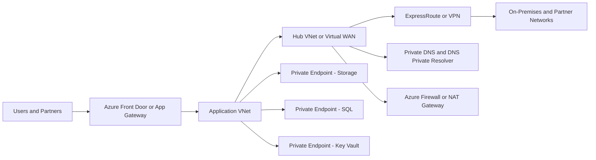
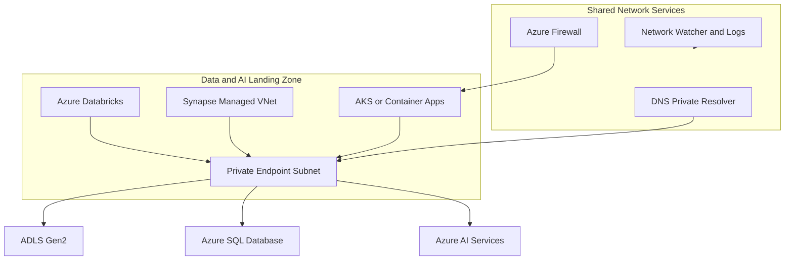
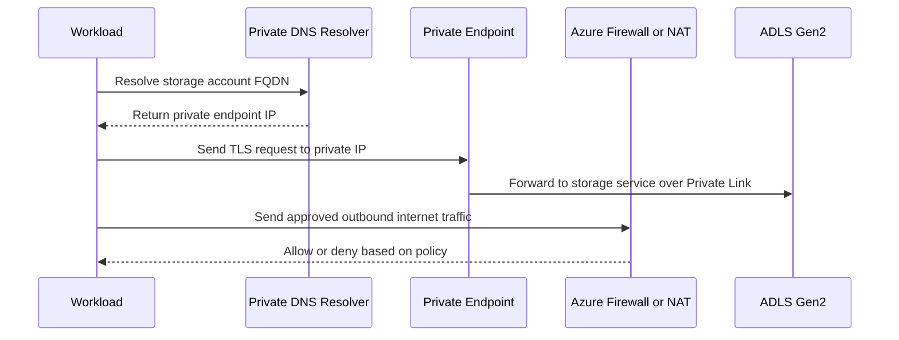

# Azure Networking

> Part of the **Enterprise Data & AI Architecture Handbook** · Phase-03 - Cloud & Azure Architecture · Chapter 04.
> Estimated study time: **75 min reading + ~5h labs**.
> **Prerequisites:** read [Azure Landing Zones](03_Azure_Landing_Zones.md) and [Networking Fundamentals](../Phase-00/04_Networking_Fundamentals.md) first.

---

## Executive Summary

Azure networking is where cloud architecture stops being abstract and starts becoming operationally binding. Identity, compute, storage, analytics, and AI services all depend on network placement, name resolution, routing, and egress control. In mature estates, networking is also the layer where shared-service convenience most often collides with resilience, latency, and compliance. A data platform with perfect storage design can still fail because DNS is wrong, routes are asymmetric, a private endpoint is mis-scoped, or egress control turns a routine package pull into a production incident.

The essential Azure networking primitives are simple enough to memorize and easy enough to misuse. Virtual networks define isolation and address spaces. Subnets carve policy and service-placement boundaries. Network security groups filter traffic statefully. User-defined routes alter the next hop and therefore the real path. Private Link changes the trust model for PaaS by moving service access onto private IPs in the customer VNet. ExpressRoute and VPN connect Azure to other networks, but they do not remove the need for clear routing, DNS, and failure-domain design. Azure Firewall, NAT Gateway, DNS Private Resolver, Front Door, Application Gateway, and Private DNS zones then shape ingress, egress, and name resolution in ways that directly affect availability and cost.

For data and AI workloads, networking decisions are especially high leverage. Azure Databricks, Synapse, Storage, SQL, Cosmos DB, Event Hubs, AI model endpoints, vector or search services, and notebook or cluster runtimes create dense east-west and north-south traffic patterns. Public endpoints remain easy to enable and hard to govern at scale. Private endpoints are usually the safer enterprise default, but they also introduce DNS complexity, subnet pressure, route considerations, and cost. Secure networking for these services is not one feature toggle; it is a coordinated design across landing zones, private name resolution, hybrid paths, inspection points, and workload-specific control planes.

The most defensible enterprise stance is usually private-by-default for critical data paths, explicit internet ingress, deliberate outbound control, and minimal centralization of runtime data planes. The right goal is not to maximize network cleverness. It is to make traffic intent obvious, failures local, and security posture auditable.

## Learning Objectives

By the end of this chapter you will be able to:

1. Design Azure VNets, subnets, NSGs, and UDRs for clear isolation and predictable traffic paths.
2. Explain the difference between Private Link, private endpoints, and service endpoints, and choose the right pattern for PaaS protection.
3. Select between ExpressRoute, site-to-site VPN, point-to-site VPN, and internet-first patterns based on risk, cost, and latency requirements.
4. Use Azure Firewall, NAT Gateway, DNS Private Resolver, and Private DNS zones to control egress and name resolution.
5. Secure Azure Databricks, Synapse, and Storage networking without blindly centralizing everything into one shared network dependency.
6. Distinguish control-plane networking concerns from data-plane networking concerns in Azure services.
7. Build routing and DNS designs that remain understandable during incidents.
8. Recognize common Azure networking anti-patterns such as flat address planning, excessive transitive dependency, and public-endpoint drift.
9. Map Azure networking choices to FinOps, compliance, and resilience trade-offs.
10. Compare Azure networking constructs with AWS and GCP equivalents without assuming identical semantics.

## Business Motivation

- Network design determines whether cloud security controls are enforceable or merely documented.
- Data and AI platforms can multiply egress, DNS, and private-connectivity costs if networking is designed late.
- Hybrid connectivity is often the longest pole in enterprise cloud programs because on-premises assumptions bleed into cloud design.
- Private connectivity for storage, analytics, and AI services reduces exposure but increases operational complexity that must be engineered deliberately.
- Networking errors create outsized blast radius because shared DNS, firewall, or routing mistakes affect many workloads at once.
- Well-structured networking shortens audit, onboarding, and incident-response cycles because traffic intent is visible.
- Cost attribution and platform ownership improve when connectivity, egress, and shared network services have explicit boundaries.

## History and Evolution

- Early Azure networking mostly focused on basic VNets, subnets, NSGs, and VPN gateways as enterprises lifted workloads into IaaS.
- VNet peering and service endpoints improved east-west connectivity and PaaS access, but many estates still exposed data services publicly.
- Private Link and private endpoints shifted enterprise design toward private-by-default access to PaaS.
- Hub-and-spoke architectures became the dominant governance model for shared network services in Azure enterprises.
- Azure Firewall, Firewall Policy, NAT Gateway, DNS Private Resolver, and Private DNS patterns expanded the network control surface beyond simple NSG filtering.
- ExpressRoute matured as the preferred premium hybrid path for high-throughput or lower-variance enterprise connectivity.
- Virtual WAN made Microsoft-managed global transit more attractive for very large or geographically distributed estates.
- Data platforms and AI platforms exposed new networking pressure points: private access to storage, control-plane dependencies for Databricks or Synapse, vector and search service exposure, and tighter egress restrictions for model-serving workloads.

## Why This Technology Exists

Azure networking exists because workload security, reachability, and performance cannot be outsourced to vague cloud assumptions. Every cloud service still runs on real network paths. Requests need addresses, routes, gateways, filters, and name resolution. Private access needs a mechanism. Hybrid connectivity needs a mechanism. Outbound internet access needs a mechanism. Azure networking provides those mechanisms in a way that can be programmed, inherited, and observed.

It also exists because traffic intent matters more in cloud than many teams expect. In a datacenter, an application team might know that all east-west traffic traverses a specific core path. In Azure, the path may change based on service endpoints, private endpoints, UDRs, peering, forced tunneling, or platform-managed routes. Without explicit design, the estate becomes reachable but not understandable.

As explained in [Networking Fundamentals](../Phase-00/04_Networking_Fundamentals.md), routing, subnetting, failure domains, and name resolution are universal concepts. Azure networking applies those fundamentals in a provider-specific control plane. As shown in [Azure Landing Zones](03_Azure_Landing_Zones.md), that control plane must fit a larger platform model rather than operate as a disconnected VNet collection.

## Problems It Solves

- Provides private and segmented connectivity for cloud-native, data, and AI workloads.
- Makes PaaS access governable through Private Link and private endpoints.
- Supports hybrid connectivity through ExpressRoute and VPN patterns.
- Allows centralized or distributed egress control with explicit next-hop routing.
- Enables platform teams to enforce network posture through landing zones, policy, and IaC.
- Supports multi-region, shared-services, and domain-isolated network topologies.
- Provides provider-native observability and control for routes, flows, DNS, and gateways.

## Problems It Cannot Solve

- It cannot fix poor application behavior such as chatty protocols or weak retry logic.
- It cannot remove physical latency between distant regions, branches, or datacenters.
- It cannot make a central firewall or DNS design safe if the blast radius is too large.
- It cannot guarantee compliance if workloads leak data through application logic or logs.
- It cannot make Private Link cheap or operationally simple in every scenario.
- It cannot eliminate the need for IP-address planning, route design, and DNS discipline.
- It cannot magically secure a service if broad identity permissions or public ingress still exist elsewhere.

## Core Concepts

### VNets and Subnets

Azure Virtual Network is the primary layer-3 isolation construct for customer-managed networking. Address planning matters because Azure networking lives for years, not for the first sprint. Enterprises that choose overlapping CIDR ranges casually make peering, hybrid routing, and acquisitions harder later.

Subnets are not just IP containers. They are placement and policy boundaries. Use them to separate application tiers, shared infrastructure, private endpoints, delegated services, and inspection paths. Keep subnet purpose explicit. Mixing private endpoints, cluster nodes, and management appliances into one subnet usually creates avoidable policy and capacity problems.

### NSGs and Application Security Groups

Network security groups are stateful packet filters applied at subnet or NIC scope. They are useful for coarse segmentation, east-west restrictions, and explicit allow or deny policy. They are not full firewalls and should not be expected to provide Layer 7 inspection, TLS inspection, or broad egress governance by themselves.

Application Security Groups can simplify rule authoring for VM-centric or service-group-based patterns, but they do not remove the need for careful subnet design.

### UDRs and Routing Precedence

User-defined routes override default system behavior by setting the next hop explicitly. In practice, UDRs are what turn a benign VNet into a forced-tunneled, firewall-inspected, or black-holed network. Architects must understand longest-prefix match, the interaction between system routes, BGP routes, and UDRs, and how asymmetry appears when one path is inspected and the return path is not.

### Private Link, Private Endpoints, and Service Endpoints

Private Link is the Azure capability. A private endpoint is the NIC placed in your subnet with a private IP representing the PaaS service. This changes the trust boundary: clients reach the service on a private address within the VNet, not through its public endpoint semantics.

Service endpoints are different. They extend VNet identity to a public Azure service over the Microsoft backbone, but the service still uses its public endpoint model. For highly sensitive data paths, regulated workloads, and enterprise-wide private-by-default postures, private endpoints are usually the stronger choice.

### Hybrid Connectivity

- Site-to-site VPN: encrypted tunnel over the public internet, cost-effective, faster to provision, more variable.
- Point-to-site VPN: user or device connectivity for admin or remote access use cases.
- ExpressRoute: private connectivity into Microsoft edge, higher cost, lower variance, more enterprise-grade integration.
- Virtual WAN: managed transit fabric that can simplify global hybrid patterns when scale and geography justify it.

### DNS and Egress Control

Private networking fails operationally when DNS is treated as an afterthought. Private endpoints require correct name resolution. Hybrid estates require split-horizon or conditional forwarding. DNS Private Resolver often becomes a critical service because it bridges on-premises and Azure resolution paths.

Egress control is the complementary discipline. NAT Gateway, Azure Firewall, Firewall Policy, route tables, service tags, FQDN filtering, TLS inspection where justified, and approved proxy or package-path patterns all determine whether workloads can reach what they need without becoming open internet clients.

## Internal Working

Azure networking combines provider-managed routes and customer-managed intent. Every subnet starts with system routes that understand local VNet paths, Azure platform paths, and internet egress defaults. When peering, service endpoints, private endpoints, VPN or ExpressRoute, Route Server, or UDRs are added, those defaults change. The resulting path is often obvious in the design review and much less obvious six months later during an outage.

Private endpoints are a good example. Creating a private endpoint places a network interface in the chosen subnet and associates the target service with a private IP. That alone is not enough. The client also needs correct DNS so the service FQDN resolves to that private IP. If the workload resolves the public name instead, traffic may leak to the public endpoint or fail based on service firewall configuration. Most Private Link outages are not caused by the endpoint itself; they are caused by missing or conflicting DNS.

ExpressRoute and VPN also illustrate the split between connectivity and reachability. A circuit or tunnel being up does not mean the application path is usable. BGP advertisements, route propagation settings, custom route tables, asymmetric return traffic, MTU behavior, and on-premises firewall policy all determine whether packets actually arrive usefully.

Azure Firewall and NAT Gateway expose a similar nuance. Both affect outbound behavior, but they solve different problems. NAT Gateway gives scalable, deterministic outbound SNAT without the policy surface of a firewall. Azure Firewall adds policy, logging, and inspection but introduces a more central dependency and higher cost. Using one as though it were the other creates either governance gaps or unnecessary complexity.

For data services, control plane and data plane often differ. A workspace or portal may be reachable over one set of endpoints while compute, storage, SQL, or metastore traffic uses another. That distinction matters in Databricks, Synapse, Storage, and AI services. Networking controls that protect data paths but accidentally break control-plane dependencies produce hard-to-debug partial outages.

## Architecture

An enterprise Azure networking architecture typically has six layers:

1. Global ingress and public exposure layer using Azure Front Door, DDoS protection, or region-local ingress where required.
2. Shared connectivity layer using hub-and-spoke or Virtual WAN for hybrid paths, DNS, inspection, and transitive routing.
3. Workload VNet layer for application, data, and AI landing zones.
4. Private access layer using private endpoints, Private DNS zones, and DNS resolution patterns for PaaS services.
5. Egress-control layer using NAT Gateway, Azure Firewall, and UDR-driven path enforcement.
6. Observability and governance layer using Azure Policy, Network Watcher, Firewall logs, DNS telemetry, and cost or flow visibility.

For a data and AI estate, the high-value architecture pattern is usually:

- workload-local VNets or subnets,
- private endpoints for storage, SQL, Cosmos DB, Key Vault, Event Hubs, AI services, and other sensitive dependencies,
- explicit DNS resolver paths,
- selective use of centralized inspection rather than forcing every packet through one chokepoint,
- separate network treatment for experimentation versus regulated production.

The architecture should not assume that every packet must traverse a single central hub to be secure. That pattern is sometimes necessary and sometimes operationally self-defeating.

## Components

| Component | Responsibility | Azure guidance | Common risk |
|---|---|---|---|
| Virtual Network | Address space and isolation boundary | Keep CIDR planning deliberate and acquisition-safe | Overlapping ranges break peering and hybrid growth |
| Subnet | Placement and policy boundary | Separate endpoints, workloads, and shared infrastructure | Mixing unlike services creates policy conflicts |
| NSG | Stateful L3 or L4 filtering | Use for coarse segmentation and least privilege | Treating NSGs as full egress governance |
| Route Table | Next-hop control | Apply UDRs intentionally and document them | Black holes and asymmetric routing |
| VNet Peering | Private connectivity between VNets | Useful for hub-and-spoke and selective east-west paths | Over-peering creates hidden coupling |
| Private Endpoint | Private IP-based access to PaaS | Prefer for critical data and AI services | DNS misconfiguration is the dominant failure mode |
| Private DNS Zone | Name resolution for private endpoints | Standardize linking and ownership | Split-brain DNS and stale records |
| DNS Private Resolver | Hybrid and VNet DNS bridging | Use when on-premises and Azure resolution must interoperate | It becomes a hidden Tier 0 dependency |
| Azure Firewall | Central policy, logging, inspection | Use when policy surface justifies cost and dependency | Over-centralized egress or latency chokepoints |
| NAT Gateway | Deterministic outbound SNAT | Use when outbound IP control matters without full firewalling | Assuming it provides inspection or policy |
| VPN Gateway | Encrypted internet-based hybrid path | Good for faster, lower-cost hybrid entry | Variable path quality and throughput |
| ExpressRoute Gateway | Private enterprise connectivity | Use when bandwidth, compliance, or path stability justify it | Treating the circuit as DR without testing routes |

## Metadata

Networking becomes governable when metadata captures traffic intent and ownership.

Recommended tags and metadata include:

| Metadata | Purpose |
|---|---|
| `owner` | Accountable network or workload team |
| `application` | Workload or platform capability |
| `environment` | prod, preprod, test, dev, sandbox |
| `networkZone` | hub, spoke, data, ai, shared, dmz |
| `dataClassification` | Drives private-access and inspection policy |
| `criticality` | Signals operational priority |
| `egressModel` | nat-gateway, firewall, direct-approved, or hybrid |
| `dnsAuthority` | Names the resolver or zone owner |
| `pairedRegion` | Documents recovery planning intent |
| `hybridClass` | none, vpn, expressroute, vwan |

Additional operational metadata should exist outside tags:

- route intent documents for shared subnets,
- private DNS zone ownership,
- private-endpoint inventory and service mapping,
- public-endpoint exception records,
- ExpressRoute circuit dependencies,
- approved package and egress destinations for restricted workloads.

Without this metadata, the estate may be connected but not operable.

## Storage

Storage networking deserves its own architectural attention because it is the most common data exfiltration surface in Azure estates.

Best-practice storage network posture usually means:

- disable public network access where feasible,
- use private endpoints for Blob, Data Lake Storage Gen2, File, Queue, and Table services as needed,
- place private endpoints in dedicated subnets or clearly governed endpoint subnets,
- integrate Private DNS zones correctly,
- restrict trusted-service exceptions and service firewall rules aggressively,
- keep cross-region replication behavior visible because DNS and failover paths may differ.

For lakehouse and analytics patterns, storage networking must also account for high-throughput internal access from Databricks, Synapse, AKS, Functions, or application services. The wrong design either exposes storage publicly for convenience or forces every high-volume path through unnecessary inspection, creating cost and performance pain.

## Compute

Compute networking in Azure is mostly about placement and dependency reachability.

- VM and VMSS workloads need explicit subnet, NSG, and route posture.
- App Service and Functions need VNet integration rules understood rather than assumed.
- AKS needs subnet sizing, CNI choice, DNS, ingress, egress, and network policy designed as part of the cluster, not after it.
- Container Apps need environment-level network decisions and dependency private access clarified.
- Databricks and Synapse need control-plane versus data-plane paths understood clearly.

The networking question is not whether compute can attach to a VNet. It is whether the compute path to its dependencies is private, observable, scalable, and not overly dependent on one shared chokepoint.

## Networking

Azure networking design should start with four questions:

1. Which traffic must stay private?
2. Which traffic must be inspected?
3. Which traffic must cross hybrid boundaries?
4. Which shared services are allowed to become Tier 0 dependencies?

A strong default pattern is:

- non-overlapping address spaces,
- dedicated subnets per major workload or endpoint class,
- NSGs for least-privilege segmentation,
- UDRs only where next-hop control is truly needed,
- private endpoints for sensitive PaaS dependencies,
- central or distributed egress chosen deliberately rather than inherited accidentally,
- clear DNS ownership and testing.

Use service endpoints sparingly where simplicity outweighs isolation demands. Use private endpoints where the service is high value, the data is sensitive, or public exposure is unjustifiable. Use ExpressRoute when hybrid traffic is strategic, predictable, or regulated. Use VPN when speed of delivery or cost matters more than deterministic path quality. Use Azure Firewall where policy, logging, and inspection justify it. Use NAT Gateway where deterministic outbound IP and SNAT scale matter without turning every workload into a firewall dependency.

## Security

Azure networking is a primary security control, but it only works when combined with identity and service configuration.

Enterprise security posture should usually include:

- private-by-default access for critical data services,
- minimal public ingress and explicit approval for public endpoints,
- NSG and route reviews for every production subnet,
- Azure Firewall Premium or equivalent only where TLS inspection or advanced filtering is justified,
- DNS control that prevents silent fallback to public endpoints,
- separation between experimentation networks and production data networks,
- explicit treatment of management paths such as Bastion, jump services, or privileged admin access.

Do not confuse network isolation with full data security. A private endpoint plus overly broad data-plane permissions is still a weak posture. Likewise, a public endpoint with strong identity and WAF may be acceptable for some application edges. The correct design depends on threat model and business impact.

## Performance

Networking affects performance through latency, throughput, jitter, and unnecessary path length.

- Every forced inspection hop adds cost and latency.
- Every cross-region dependency adds user-visible latency and failure surface.
- Private endpoints do not inherently make traffic slower, but poor DNS and route design can.
- ExpressRoute reduces internet variance but does not remove application or storage bottlenecks.
- Azure Firewall can become a throughput or connection bottleneck if sized or placed poorly.
- Databricks, Synapse, and storage-heavy workloads are especially sensitive to needless detours in the data path.

Performance design should therefore keep bulk data paths local, minimize inspection on trusted high-volume internal paths unless regulation requires it, and separate high-throughput data motion from low-throughput control traffic where possible.

## Scalability

Network architecture must scale with both traffic growth and service count.

- Subnet sizing must account for private endpoints, cluster nodes, and future growth.
- Firewall policies must scale operationally, not only technically.
- DNS patterns must handle many private zones and hybrid forwarders without becoming unmanageable.
- ExpressRoute and VPN designs must account for route-table scale and branch growth.
- AKS, Databricks, and other elastic platforms need enough IP and egress capacity to scale safely.

The scalable design is usually the one that minimizes bespoke exceptions. Every one-off route, custom DNS override, or local internet bypass increases future operating cost.

## Fault Tolerance

Network fault tolerance means more than redundant circuits.

- Design for zone and region failures where the services support it.
- Separate control dependencies from data dependencies where possible.
- Test DNS failover, not just gateway failover.
- Validate ExpressRoute plus VPN backup behavior under route changes, not only in diagrams.
- Treat shared firewalls, DNS resolvers, and connectivity hubs as critical infrastructure with their own resilience targets.

Many cloud networking incidents are partial failures: control plane healthy, DNS wrong; gateway up, routes wrong; firewall alive, policy broken; private endpoint deployed, zone link missing. Recovery procedures must reflect those realities.

## Cost Optimization

Azure networking cost is often underestimated because the individual building blocks look small compared with compute. At scale, they are not.

Major cost drivers include:

- Azure Firewall and Firewall Policy,
- Private Link and private endpoint count,
- ExpressRoute circuits and provider charges,
- VPN gateways,
- cross-zone and cross-region data transfer,
- internet egress,
- hub inspection for large analytics or AI data flows,
- log ingestion from verbose flow, firewall, and DNS telemetry.

Cost optimization means choosing the simplest secure path that meets requirements. Do not inspect bulk internal data paths centrally if regulation does not require it. Do not deploy private endpoints indiscriminately without subnet and DNS discipline. Do not choose ExpressRoute by default for workloads that barely use hybrid connectivity.

## Monitoring

Azure networking monitoring should cover reachability, policy, and cost-relevant signals.

Minimum signals include:

- gateway tunnel and circuit health,
- firewall throughput, rule hits, SNAT usage, and denied flows,
- NAT Gateway SNAT port pressure,
- DNS query failures and forwarding errors,
- private-endpoint connection status,
- route-table drift,
- NSG rule conflicts or unexpected allows,
- public endpoint exposure changes,
- storage and PaaS firewall or network-rule misconfiguration.

Azure Network Watcher, Connection Monitor, firewall logs, activity logs, resource health, and service-specific diagnostics are the core provider-native tools. Use them before inventing parallel network health lore.

## Observability

Observability is the ability to explain unexpected network behavior, not just alert that packets are failing.

Practical observability patterns include:

- end-to-end traces correlated with DNS and firewall events,
- route intent documentation mapped to actual UDR and peering state,
- centralized but queryable inventory of private endpoints and linked DNS zones,
- OpenTelemetry for workload-level dependency spans,
- Grafana or Azure dashboards that combine service latency with network-path changes.

For data and AI systems, observability should also expose which private paths were used for storage, model, search, or metastore access, and whether egress went through approved channels. Otherwise teams spend incident time debating which network path was even attempted.

## Governance

Networking governance must keep the secure path practical enough that teams use it.

Key governance controls include:

- policy restricting unapproved regions and public endpoints,
- standards for private endpoints versus service endpoints,
- central review for shared UDR and firewall changes,
- DNS ownership model and change control,
- subscription and landing-zone rules for hub participation,
- cost allocation for shared network services,
- documented exceptions with owner and expiry.

### ADR Example

**Context:** A regulated enterprise data platform uses Azure Databricks, Synapse, Storage, SQL, and Azure OpenAI. The initial design exposes storage and search endpoints publicly with IP restrictions because it is simpler for onboarding. Security and audit teams want stronger isolation. Platform engineering wants to avoid routing all high-volume data traffic through one central firewall.

**Decision:** Use hub-and-spoke landing zones with Azure Firewall Premium for controlled internet egress and shared policy enforcement, but keep bulk data paths private and local through private endpoints and Private DNS. Use ExpressRoute for strategic hybrid connectivity. Require private endpoints for Storage, SQL, Key Vault, and AI services in regulated subscriptions. Use dedicated endpoint subnets and DNS Private Resolver to integrate on-premises and Azure resolution.

**Consequences:** The platform materially reduces public exposure and improves auditability. The downsides are higher Private Link, DNS, and operational complexity, plus the need for strict endpoint and zone management.

**Alternatives:**

1. Public endpoints with IP allowlists and NSG-based control. Rejected because data-exfiltration and governance posture remain weak.
2. Force all traffic, including bulk storage access, through one central inspection stack. Rejected because performance, cost, and blast radius are unacceptable.
3. Allow each workload team to decide privately. Rejected because the resulting estate would be inconsistent and hard to audit.

## Trade-offs

| Decision area | Option A | Option B | Real trade-off |
|---|---|---|---|
| PaaS access | Private endpoints | Service endpoints or public endpoints with controls | Stronger isolation versus simpler operations and lower endpoint sprawl |
| Egress | Central Azure Firewall | NAT Gateway or distributed egress | Richer policy and visibility versus lower latency and simpler scaling |
| Hybrid path | ExpressRoute | VPN | Lower variance and enterprise integration versus lower cost and faster deployment |
| Topology | Hub-and-spoke | Virtual WAN | More custom control versus more managed transit |
| DNS | Central resolver model | Localized resolver patterns | Consistency versus lower shared dependency |
| Databricks or Synapse access | Strong private posture | Mixed public and private posture | Better security and auditability versus easier onboarding |

## Decision Matrix

| Scenario | Recommended networking posture | Why |
|---|---|---|
| Internet-facing SaaS with standard PaaS dependencies | Public ingress via Front Door or Application Gateway, private backend dependencies, selective centralized egress | Balances usability and private data access |
| Regulated lakehouse platform | Private endpoints for storage and data services, controlled egress, ExpressRoute where hybrid is strategic | Data-exfiltration reduction and auditability dominate |
| Early-stage internal workload | Simpler VNet plus NSG model, avoid over-centralization, introduce private endpoints where risk warrants | Keeps platform burden proportional |
| Global hybrid enterprise | Hub-and-spoke or Virtual WAN, DNS resolver strategy, ExpressRoute primary with tested backup | Connectivity consistency and scale matter |
| AI experimentation | Isolated subscription, bounded egress, selective private dependencies | Prevents spend, quota, and data leakage from contaminating production |
| Production AI inference with sensitive retrieval data | Private endpoint-backed dependencies, explicit DNS, minimal public exposure, audited egress | Model and data path need stronger controls |

## Design Patterns

1. Dedicated endpoint subnets for private endpoints.
2. Private DNS zones linked explicitly to participating VNets.
3. NAT Gateway for deterministic outbound IP where inspection is not required.
4. Azure Firewall for policy-rich egress and centralized visibility.
5. Hub-and-spoke with selective routing rather than universal forced tunneling.
6. Split experimentation and production network posture for AI workloads.
7. Service-local data paths with private access rather than hauling data through shared hubs.
8. Connection-monitoring and route-validation as standard operational checks.
9. Prefix planning that anticipates acquisition, peering, and region growth.
10. Control-plane and data-plane endpoint mapping documented per managed service.

## Anti-patterns

- Flat address space planning with overlapping CIDRs.
- Treating NSGs as a substitute for full egress strategy.
- Creating private endpoints without DNS ownership and testing.
- Forcing all traffic through one hub because centralization feels safer.
- Using ExpressRoute for prestige rather than a real business requirement.
- Exposing storage publicly for convenience in analytics or AI onboarding.
- Mixing high-volume data traffic and sensitive inspection traffic on the same forced path.
- Building peering meshes that no one can reason about during incidents.
- Leaving public endpoints enabled "temporarily" for months.
- Assuming Azure service defaults match enterprise policy intent.

## Common Mistakes

- Forgetting that private endpoints require correct private DNS.
- Using UDRs without a route-intent document.
- Under-sizing subnets for private endpoints or elastic compute.
- Treating hybrid connectivity as done once the circuit is up.
- Centralizing DNS without treating it as Tier 0.
- Confusing control-plane reachability with data-plane security.
- Using service endpoints where Private Link is required by risk posture.
- Failing to test failover for DNS, VPN, or ExpressRoute return paths.
- Overlooking log-ingestion cost from verbose network telemetry.
- Breaking Databricks or Synapse control-plane access while securing data paths.

## Best Practices

- Plan address space for long-term peering and hybrid growth.
- Use separate subnets for major workload classes and endpoint classes.
- Prefer private endpoints for critical PaaS services.
- Standardize Private DNS zone design and ownership.
- Use NAT Gateway where the problem is outbound scale or stable IP, not inspection.
- Use Azure Firewall only where its policy surface is genuinely needed.
- Keep high-throughput data paths local and private.
- Test route, DNS, and failover behavior, not just resource deployment.
- Document control-plane and data-plane endpoints for managed platforms.
- Review public endpoint exceptions regularly and expire them by policy.

## Enterprise Recommendations

An opinionated enterprise recommendation set for Azure networking is:

| Area | Recommendation |
|---|---|
| Address planning | Reserve non-overlapping ranges by platform, region, and future acquisition envelope |
| Subnetting | Treat subnets as policy boundaries, not generic folders |
| PaaS access | Private endpoints by default for regulated, data, and AI services |
| DNS | Centralize standards and ownership, but avoid fragile undocumented resolver chains |
| Egress | NAT Gateway for simple deterministic outbound; Azure Firewall for policy-rich or regulated egress |
| Hybrid | Use ExpressRoute where it materially changes risk or performance; otherwise do not overbuy it |
| Databricks and Synapse | Use private data paths, understand control-plane dependencies, and test onboarding with security enabled from day one |
| Storage | Disable public network access where feasible and avoid broad trusted-service exceptions |
| Governance | Policy-enforce endpoint, region, and exposure posture |
| Operations | Treat firewall, DNS, and shared connectivity as critical services with their own SLOs |

## Azure Implementation

Azure implementation should combine address planning, subnet segmentation, private access, and explicit outbound control.

Example Azure CLI for a workload VNet, endpoint subnet, firewall route table, and storage private endpoint:

```bash
az group create \
  --name rg-net-data-prod-eus2 \
  --location eastus2

az network vnet create \
  --resource-group rg-net-data-prod-eus2 \
  --name vnet-data-prod-eus2 \
  --address-prefixes 10.40.0.0/16 \
  --subnet-name snet-app \
  --subnet-prefixes 10.40.1.0/24

az network vnet subnet create \
  --resource-group rg-net-data-prod-eus2 \
  --vnet-name vnet-data-prod-eus2 \
  --name snet-private-endpoints \
  --address-prefixes 10.40.10.0/24 \
  --disable-private-endpoint-network-policies true

az network route-table create \
  --resource-group rg-net-data-prod-eus2 \
  --name rt-egress-firewall

az network route-table route create \
  --resource-group rg-net-data-prod-eus2 \
  --route-table-name rt-egress-firewall \
  --name default-to-firewall \
  --address-prefix 0.0.0.0/0 \
  --next-hop-type VirtualAppliance \
  --next-hop-ip-address 10.10.1.4

az network private-endpoint create \
  --resource-group rg-net-data-prod-eus2 \
  --name pe-adls-raw-prod \
  --vnet-name vnet-data-prod-eus2 \
  --subnet snet-private-endpoints \
  --private-connection-resource-id /subscriptions/00000000-0000-0000-0000-000000000000/resourceGroups/rg-storage-prod/providers/Microsoft.Storage/storageAccounts/stdatarawprod01 \
  --group-id dfs \
  --connection-name pe-adls-raw-prod-conn
```

Example Bicep for private DNS and Storage private endpoint:

```bicep
param location string = resourceGroup().location
param vnetName string = 'vnet-data-prod-eus2'
param endpointSubnetName string = 'snet-private-endpoints'
param storageAccountId string

resource vnet 'Microsoft.Network/virtualNetworks@2023-11-01' existing = {
  name: vnetName
}

resource privateDnsZone 'Microsoft.Network/privateDnsZones@2020-06-01' = {
  name: 'privatelink.dfs.core.windows.net'
  location: 'global'
}

resource vnetLink 'Microsoft.Network/privateDnsZones/virtualNetworkLinks@2020-06-01' = {
  name: 'privatelink.dfs.core.windows.net/${vnetName}-link'
  parent: privateDnsZone
  location: 'global'
  properties: {
    virtualNetwork: {
      id: vnet.id
    }
    registrationEnabled: false
  }
}

resource privateEndpoint 'Microsoft.Network/privateEndpoints@2023-11-01' = {
  name: 'pe-adls-raw-prod'
  location: location
  properties: {
    subnet: {
      id: resourceId('Microsoft.Network/virtualNetworks/subnets', vnetName, endpointSubnetName)
    }
    privateLinkServiceConnections: [
      {
        name: 'adls-dfs-connection'
        properties: {
          privateLinkServiceId: storageAccountId
          groupIds: [
            'dfs'
          ]
        }
      }
    ]
  }
}
```

Example Terraform for a DNS resolver-aware network baseline:

```hcl
resource "azurerm_resource_group" "network" {
  name     = "rg-net-shared-prod-eus2"
  location = "East US 2"
}

resource "azurerm_virtual_network" "hub" {
  name                = "vnet-hub-prod-eus2"
  location            = azurerm_resource_group.network.location
  resource_group_name = azurerm_resource_group.network.name
  address_space       = ["10.10.0.0/16"]
}

resource "azurerm_private_dns_zone" "blob" {
  name                = "privatelink.blob.core.windows.net"
  resource_group_name = azurerm_resource_group.network.name
}

resource "azurerm_private_dns_zone_virtual_network_link" "hub_link" {
  name                  = "hub-blob-link"
  resource_group_name   = azurerm_resource_group.network.name
  private_dns_zone_name = azurerm_private_dns_zone.blob.name
  virtual_network_id    = azurerm_virtual_network.hub.id
}
```

Databricks, Synapse, and Storage-specific guidance:

- Azure Databricks: prefer secure cluster connectivity or no-public-IP patterns where supported, keep workspace or web access posture explicit, and use private data paths to Storage, SQL, metastore, and Key Vault.
- Synapse: use managed virtual network and managed private endpoints when the security posture requires it; understand how data exfiltration protection changes dependency access.
- Storage: use private endpoints, restrict public access, and test zone-link behavior in failover and non-prod onboarding scenarios.

## Open Source Implementation

Open-source technologies matter in Azure networking mostly as workload-side complements to the Azure control plane.

Relevant patterns include:

- Terraform for reusable network modules and policy-aware onboarding.
- GitHub Actions or Azure DevOps for validated network changes and rollout gates.
- Kubernetes network policies on AKS for pod-level segmentation.
- Nginx ingress for workload-local Layer 7 control when AKS is used.
- Prometheus, Grafana, and OpenTelemetry for network-adjacent workload observability.
- PostgreSQL, Redis, Kafka, Trino, or Spark running in approved VNets or clusters with private dependencies.

Example GitHub Actions workflow for network IaC validation:

```yaml
name: validate-network-baseline

on:
  pull_request:
    paths:
    - network/**

jobs:
  validate:
    runs-on: ubuntu-latest
    steps:
    - uses: actions/checkout@v4
    - uses: hashicorp/setup-terraform@v3
    - run: terraform -chdir=network fmt -check
    - run: terraform -chdir=network init -backend=false
    - run: terraform -chdir=network validate
```

Example Kubernetes NetworkPolicy for workload isolation on AKS:

```yaml
apiVersion: networking.k8s.io/v1
kind: NetworkPolicy
metadata:
  name: allow-api-to-postgres
spec:
  podSelector:
    matchLabels:
      app: postgres
  policyTypes:
  - Ingress
  ingress:
  - from:
    - podSelector:
        matchLabels:
          app: api
    ports:
    - protocol: TCP
      port: 5432
```

Example OpenTelemetry resource attributes for network-aware tracing:

```yaml
resource:
  attributes:
  - key: cloud.provider
    value: azure
  - key: cloud.region
    value: eastus2
  - key: service.namespace
    value: data-platform
  - key: platform.egress_model
    value: firewall
```

The open-source lesson is simple: keep workload-local controls local when possible, and let Azure-native networking handle provider-level primitives such as Private Link, ExpressRoute, Firewall, and Private DNS.

## AWS Equivalent (comparison only)

| Azure service or pattern | AWS equivalent | Where Azure is typically stronger | Where AWS is typically stronger | Migration note |
|---|---|---|---|---|
| VNet | VPC | Clean integration with Azure Private Link and subscription model | Mature account-centric network patterns | Address planning and shared-service intent matter more than names |
| Private Link and private endpoints | AWS PrivateLink and interface endpoints | Strong enterprise fit for Azure PaaS-heavy estates | Broad endpoint ecosystem and account patterns | Re-evaluate DNS and endpoint sprawl during translation |
| Azure Firewall | AWS Network Firewall plus related controls | Simpler Azure-native integration in Azure estates | Broader mix of AWS-native network security tooling | Map policy intent rather than specific rule syntax |
| NAT Gateway | NAT Gateway | Similar core purpose | Similar maturity | Do not assume logging, SNAT scale, or route behavior are identical |
| ExpressRoute | Direct Connect | Strong fit in Microsoft-centric hybrid estates | Deep AWS hybrid ecosystem patterns | Validate routing, BGP, and failover assumptions explicitly |
| DNS Private Resolver | Route 53 Resolver | Good Azure private-endpoint integration | Mature hybrid resolver ecosystem | DNS behavior is a migration project, not a checkbox |

## GCP Equivalent (comparison only)

| Azure service or pattern | GCP equivalent | Where Azure is typically stronger | Where GCP is typically stronger | Migration note |
|---|---|---|---|---|
| VNet | VPC | Subscription-aligned enterprise governance fit | Project-centric network simplicity | Re-express scope and ownership in provider-native terms |
| Private Link and private endpoints | Private Service Connect | Strong Azure PaaS alignment in Azure-first estates | Clean service-connect patterns in some GCP designs | Translate endpoint and DNS behavior carefully |
| Azure Firewall | Cloud Firewall plus partner or layered controls | Strong single-service story for many Azure enterprises | GCP global network and project-centric policy model | Compare operations model, not just features |
| ExpressRoute | Cloud Interconnect | Strong hybrid fit in Microsoft-heavy enterprises | Strong global backbone integration | Test latency and route policy rather than relying on marketing parity |
| DNS Private Resolver | Cloud DNS plus forwarding and inbound or outbound resolver patterns | Better alignment with Azure private-endpoint-heavy estates | Mature project-scoped DNS workflows | Split-horizon DNS remains the hard part across clouds |
| Hub-and-spoke or Virtual WAN | Shared VPC and Cloud WAN style patterns | Familiar Azure landing-zone integration | Strong global-network characteristics | Avoid assuming transitive and inspection behavior are equivalent |

## Migration Considerations

Migrating to a stronger Azure networking posture is usually a phased architecture change, not a single cutover.

1. Inventory public endpoints, service endpoints, private endpoints, DNS zones, and route tables before redesigning.
2. Fix address overlap early; it is one of the most expensive late discoveries.
3. Define the DNS ownership model before large-scale Private Link rollout.
4. Migrate one dependency class at a time, for example Storage first, then SQL, then Key Vault.
5. Validate control-plane behavior for Databricks, Synapse, AI services, and other managed platforms before declaring the network model complete.
6. Test hybrid routing and failover with realistic path dependencies, not just ping tests.
7. Separate experimentation and production network postures early for data and AI platforms.
8. Remove temporary public access as part of migration completion criteria, not as optional cleanup.

Migration is complete only when the secure path is the default path and the legacy insecure path is gone.

## Mermaid Architecture Diagrams







## End-to-End Data Flow

An end-to-end secured data path for Azure analytics or AI usually works like this:

1. A workload in a spoke VNet or data landing zone initiates access to Storage, SQL, Key Vault, or an AI service.
2. DNS resolves the service FQDN through Private DNS to the private-endpoint IP.
3. Traffic stays on private addresses inside Azure networking rather than traversing a public service endpoint.
4. NSGs enforce coarse subnet-level rules and UDRs steer only the traffic classes that need inspection or controlled egress.
5. Approved outbound traffic such as package downloads or partner API calls goes through NAT Gateway or Azure Firewall, depending on policy needs.
6. Hybrid traffic to on-premises systems flows through VPN, ExpressRoute, or Virtual WAN according to route policy.
7. Network Watcher, firewall logs, and service diagnostics record the path well enough for incident reconstruction.
8. Platform governance checks for public endpoint drift, private-zone linkage, and route changes continuously.

This flow is what turns a set of networking resources into an auditable platform path.

## Real-world Business Use Cases

1. Regulated lakehouse platform with private ADLS access, controlled egress, and hybrid connectivity to on-premises source systems.
2. Azure Databricks estate where cluster traffic must reach storage and metastore privately while workspace access remains tightly governed.
3. Synapse analytics platform using managed VNet and managed private endpoints to reduce data-exfiltration risk.
4. Multi-tenant SaaS platform with public ingress but private data-plane dependencies and explicit outbound policy.
5. AI retrieval application using private endpoints for storage, search, and model-serving dependencies while keeping internet exposure minimal.

## Industry Examples

- Microsoft enterprise guidance repeatedly converges on private endpoints plus Private DNS for sensitive PaaS services because public-endpoint governance degrades quickly at scale.
- Large data-platform teams on Azure commonly separate high-throughput storage traffic from centrally inspected general egress to avoid turning the hub into a data-plane bottleneck.
- Regulated enterprises often discover that hybrid DNS design is the real gating item for Private Link adoption, not the endpoint creation itself.
- Databricks-on-Azure implementations frequently evolve toward stronger VNet control and private data paths once teams move beyond early experimentation.
- Organizations deploying generative AI on Azure increasingly isolate experimentation egress and production retrieval paths because the security and spend profiles differ sharply.

## Case Studies

### Case Study 1: Capital One 2019 SSRF and Cloud Metadata Exposure

Although not an Azure incident, the lesson generalizes directly: public exposure combined with overly broad identity or metadata access can turn a network foothold into a data breach. Azure teams should treat public endpoints, privileged managed identities, and implicit trust in metadata-access patterns as a combined risk, not separate checkboxes.

### Case Study 2: Meta 2021 Backbone Routing Outage

A backbone routing change took down global services and interfered with internal operational tools. The lesson for Azure networking is that shared routing and DNS services are Tier 0 systems. If the enterprise hub, DNS resolver chain, or central firewall becomes unavailable or unmanageable, many workloads fail together.

### Case Study 3: Private Endpoint Rollout With Broken DNS

Many enterprises report the same pattern during PaaS hardening: private endpoints are created successfully, public endpoints are disabled, and workloads fail because Private DNS zones were not linked correctly across spokes or hybrid resolvers. The lesson is that Private Link is a DNS program as much as a network feature.

## Hands-on Labs

1. Create a VNet with separate application and private-endpoint subnets, then attach NSGs and UDRs intentionally.
2. Add a Storage private endpoint and validate DNS resolution from a workload subnet.
3. Compare service endpoints and private endpoints for the same PaaS dependency and document the differences.
4. Build a hub-and-spoke pattern with Azure Firewall or NAT Gateway and test egress behavior.
5. Configure a site-to-site VPN or simulate hybrid routing decisions with route tables and monitoring.
6. Secure an Azure Databricks or Synapse-dependent architecture with private data paths and document the control-plane dependencies.

## Exercises

1. Explain why private endpoints fail most often because of DNS rather than because of the endpoint resource itself.
2. Decide when NAT Gateway is enough and when Azure Firewall is justified.
3. Write an ADR choosing ExpressRoute or VPN for a hybrid analytics platform.
4. Define which PaaS services in your estate should be private-by-default first.
5. Compare service endpoints with private endpoints for storage access.
6. Identify which network dependencies in your platform are effectively Tier 0.
7. Propose a subnet strategy for a data and AI landing zone.
8. Describe how you would validate that a Databricks workspace can still function after public storage access is disabled.

## Mini Projects

1. Build a reusable Azure networking baseline with hub, spoke, firewall or NAT pattern, private DNS, and private endpoint modules.
2. Create a private-data-platform reference design for ADLS, SQL, Databricks, and Key Vault with tested DNS behavior.
3. Design an AI application network pattern that separates experimentation, retrieval, and production-serving egress models.

## Capstone Integration

This chapter translates the platform structure from [Azure Landing Zones](03_Azure_Landing_Zones.md) and the theory from [Networking Fundamentals](../Phase-00/04_Networking_Fundamentals.md) into Azure-specific network control. Landing zones decide where shared services live and how workloads attach to them. Networking fundamentals explain why routes, DNS, and segmentation matter. Azure networking turns both into concrete VNets, subnets, private endpoints, routes, and hybrid paths.

The result should be a platform where the secure path is the easy path, the private path is the default for sensitive data, and the operational path is observable enough to debug under pressure.

## Interview Questions

1. What is the practical difference between a VNet, subnet, NSG, and UDR?
2. How do private endpoints differ from service endpoints?
3. When is ExpressRoute materially better than VPN?
4. Why is DNS often the hardest part of Private Link adoption?
5. What problem does NAT Gateway solve that Azure Firewall does not, and vice versa?
6. Why should storage networking be treated as a primary security topic in data platforms?
7. How would you explain control-plane versus data-plane network paths in a managed Azure service?
8. What makes a shared network service effectively Tier 0?

## Staff Engineer Questions

1. How would you design egress control for a mixed estate of public APIs, private data platforms, and AI experimentation workloads?
2. Which traffic classes should traverse a central firewall and which should stay local and private?
3. How would you structure subnetting for a regional data landing zone that includes private endpoints, AKS, and integration workers?
4. What evidence would you require before approving service endpoints instead of private endpoints for a regulated workload?
5. How do you prevent DNS from becoming the hidden failure point in a private-endpoint-heavy estate?
6. How would you phase migration from public Storage access to private endpoints without breaking analytics teams?
7. What network tests would you automate in CI or CD for infrastructure changes?
8. How would you keep Databricks or Synapse networking secure without turning onboarding into a months-long project?

## Architect Questions

1. What is the enterprise default for PaaS network exposure, and what exceptions are allowed?
2. How do you decide between hub-and-spoke and Virtual WAN for a large Azure estate?
3. Which shared network services deserve their own subscriptions and SLOs?
4. How do you align network segmentation with data classification and workload criticality?
5. What is your standard for ExpressRoute adoption versus internet-based connectivity?
6. How should public ingress, private backend access, and outbound internet policy interact in a standard application landing zone?
7. When should a data or AI platform get dedicated private DNS and endpoint governance?
8. How do you review route-table changes so they do not become invisible architecture debt?

## CTO Review Questions

1. Which current network dependencies could take down many of our workloads at once?
2. Are we paying for network centralization that does not materially reduce risk?
3. Where are our data and AI workloads still publicly reachable for convenience rather than necessity?
4. Can we prove which workloads have controlled outbound internet access today?
5. Are our hybrid connectivity choices driven by real business need or by inherited assumptions from on-premises operations?
6. If a regulator asked us how sensitive storage is isolated from the public internet, could we demonstrate it quickly?
7. Which network controls are strategic enough to standardize globally, and which should remain workload-local?
8. Are our teams debugging incidents with observable network intent, or with guesswork and tribal knowledge?

## References

- Microsoft Azure Virtual Network documentation.
- Azure Private Link and private endpoints documentation.
- Azure Firewall, NAT Gateway, and Firewall Policy documentation.
- Azure DNS, Private DNS, and DNS Private Resolver documentation.
- ExpressRoute and Azure VPN Gateway documentation.
- Azure Databricks networking guidance.
- Azure Synapse managed virtual network and managed private endpoint guidance.
- Azure Architecture Center networking and hybrid connectivity guidance.
- Public incident reports and engineering write-ups relevant to cloud networking, DNS, and hybrid failures.

## Further Reading

- Re-read [Networking Fundamentals](../Phase-00/04_Networking_Fundamentals.md) and map subnetting, routing, and DNS theory to your Azure estate.
- Revisit [Azure Landing Zones](03_Azure_Landing_Zones.md) and identify which networking controls belong in platform subscriptions versus workload subscriptions.
- Review Azure Firewall, Private Link, ExpressRoute, and DNS architecture guidance in the provider documentation and compare it against your actual operating model.