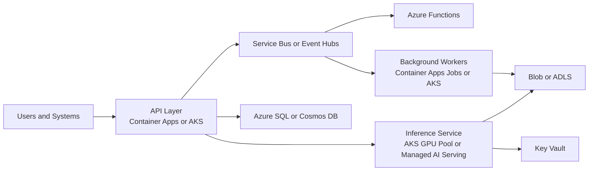
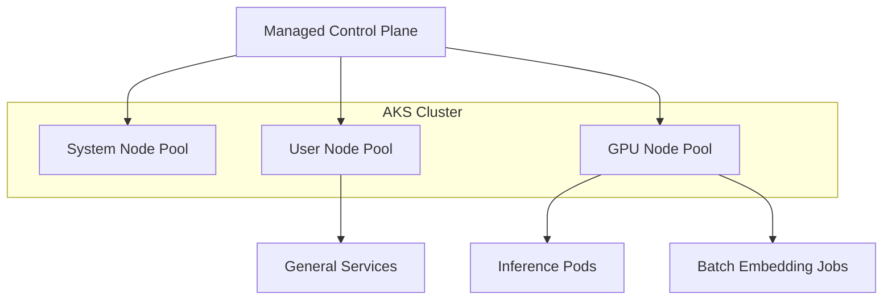
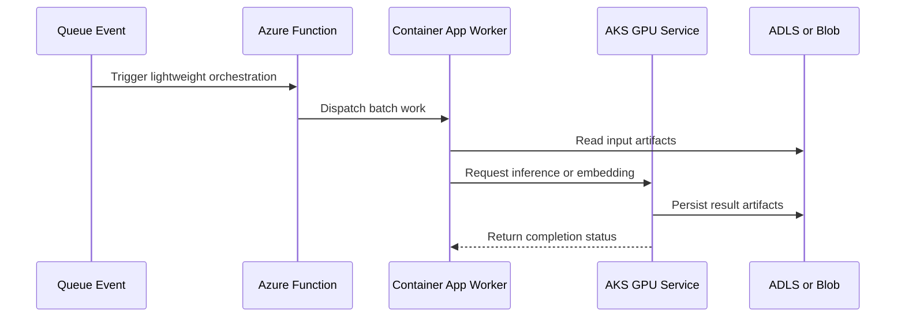

# Azure Compute and Containers

> Part of the **Enterprise Data & AI Architecture Handbook** · Phase-03 - Cloud & Azure Architecture · Chapter 05.
> Estimated study time: **60 min reading + ~4h labs**.
> **Prerequisites:** read [Azure Core Architecture](02_Azure_Core_Architecture.md) first.

---

## Executive Summary

Azure compute choices determine far more than runtime placement. They determine patching burden, scaling behavior, failure domains, quota pressure, rollout controls, cost elasticity, identity posture, and the speed at which teams can turn code into running systems. In practice, the most common enterprise mistake is not choosing the "wrong" Azure product once. It is choosing a compute model that quietly pulls an organization into an operating model it cannot sustain.

The decision surface is larger than "VMs versus containers." Azure provides IaaS virtual machines and VM Scale Sets for legacy or highly customized workloads, AKS for Kubernetes-centric platforms, Azure Container Apps for event-driven and container-native services that do not justify full cluster ownership, and Azure Functions for bursty or glue-oriented serverless workloads. Around that, enterprises must decide how much platform they want to run themselves, how much cold-start or warm-up behavior they can tolerate, how state is externalized, and how autoscaling is tied to user-facing or backlog-facing signals.

For data and AI workloads the stakes are higher. GPU capacity is scarce and region-specific. Spot capacity can improve economics dramatically and destroy predictability if used carelessly. Batch and stream runtimes compete with long-lived inference services for the same quotas and network paths. AKS node-pool design, Functions concurrency, Container Apps scaling, and VM-family selection all become part of the architecture review, not mere deployment choices.

The most defensible enterprise posture is usually pragmatic rather than ideological: use managed PaaS or serverless compute where the workload fits, use AKS when Kubernetes solves a real packaging or platform problem, and use VMs when legacy software, specialized drivers, or OS-level control genuinely require them. GPU compute should be isolated deliberately, not sprinkled into generic subscriptions. Compute architecture succeeds when the chosen abstraction matches the organization’s operational maturity and the workload’s failure and scaling profile.

## Learning Objectives

By the end of this chapter you will be able to:

1. Select between VMs, VM Scale Sets, AKS, Azure Container Apps, and Azure Functions using workload and operating-model criteria.
2. Explain Azure VM families, reserved versus spot capacity, and where each belongs.
3. Design AKS clusters with appropriate system and user node pools, autoscaling behavior, and workload isolation.
4. Distinguish Container Apps and Functions from cluster-based compute in terms of packaging, scaling, and control.
5. Evaluate serverless versus cluster compute trade-offs for data, integration, and AI workloads.
6. Choose GPU compute options and isolation models for training, fine-tuning, batch inference, and online inference.
7. Map compute choices to networking, security, observability, and cost controls.
8. Recognize anti-patterns such as Kubernetes by reflex, VM-first cloud adoption, and uncontrolled spot usage.
9. Build reviewable Azure compute standards for platform and workload teams.
10. Compare Azure compute patterns with AWS and GCP without flattening the real differences.

## Business Motivation

- Compute choices directly drive delivery speed, staffing needs, and incident frequency.
- Data and AI teams often spend too much on always-on compute when workload shape is actually bursty.
- Legacy application modernization depends on realistic bridges, not all-or-nothing platform rewrites.
- Container and serverless platforms reduce toil only when they match the workload’s runtime needs.
- GPU workloads require explicit planning because cost, quotas, and lead time are materially different from general-purpose CPU workloads.
- FinOps outcomes improve when compute is classified by workload profile instead of by team preference.
- Enterprise platform standards become more credible when they explain when not to use AKS, Functions, or spot capacity.

## History and Evolution

- Early Azure adoption was heavily VM-centric because enterprises were moving server-shaped workloads into cloud.
- VM Scale Sets improved horizontal elasticity for IaaS-hosted services without changing the basic guest-OS burden.
- App Service and Functions shifted many teams toward managed platform runtimes for APIs and background tasks.
- Kubernetes standardized container orchestration across environments and pushed Azure toward AKS as the managed cluster control plane.
- Container Apps emerged to cover the gap between simple PaaS and full Kubernetes ownership.
- GPU-backed cloud compute moved from niche HPC to mainstream AI engineering infrastructure.
- Data-platform and MLOps practices increased demand for mixed compute estates: ephemeral batch, long-running workers, cluster jobs, and production inference in the same organization.
- The current pattern is not convergence on one runtime. It is deliberate heterogeneity with strong platform guardrails.

## Why This Technology Exists

Azure compute services exist because workloads need execution environments with different control, startup, scaling, isolation, and hardware profiles. Some workloads need OS-level agents, Windows-specific dependencies, or specialized drivers. Some need elastic HTTP handling with minimal operations. Some need Kubernetes-native packaging and multi-container coordination. Some need event-driven short-lived execution. Some need GPUs.

They also exist because enterprises cannot optimize every workload against one abstraction. A single compute platform creates either oversupply of control or undersupply of capability. VMs overserve low-complexity APIs with unnecessary OS management. Functions underserve long-running stateful services or GPU-intensive inference. AKS can be exactly right for platform-centric teams and excessive for small product teams with ordinary web services.

As established in [Azure Core Architecture](02_Azure_Core_Architecture.md), platform decisions must reflect scope, quotas, governance, and operational ownership. Azure compute and container decisions are the runtime manifestation of that architecture. The question is not only where code runs. It is which operational promises the platform is making and which promises the workload team must still keep.

## Problems It Solves

- Provides multiple runtime models for different workload shapes.
- Supports legacy modernization paths without forcing an immediate rewrite.
- Enables elastic scale for web, integration, background, and AI-serving workloads.
- Reduces undifferentiated platform toil when managed services fit the workload.
- Supports hardware-specific execution including GPU-backed AI workloads.
- Allows platform teams to separate experimentation, batch, and production inference compute classes.
- Improves deployment consistency through container packaging and IaC-driven provisioning.

## Problems It Cannot Solve

- It cannot make poorly designed software cloud-native simply by changing the runtime.
- It cannot eliminate the need for capacity planning when cold start, image pull, or GPU quota constraints exist.
- It cannot remove the operational burden of Kubernetes if the organization adopts AKS without the skills to run it well.
- It cannot make spot capacity predictable for workloads that require strict continuity.
- It cannot solve data architecture, message ordering, or consistency problems by runtime choice alone.
- It cannot make GPUs cheap, broadly available, or instantly provisionable in every region.
- It cannot compensate for weak observability, rollout control, or security hygiene.

## Core Concepts

### Compute Model Spectrum

Azure compute fits on a control-versus-abstraction spectrum:

- VMs and VM Scale Sets provide the most host-level control and the most operational burden.
- AKS provides container orchestration control with managed control plane but significant platform responsibility.
- Container Apps provides container-native execution with far less cluster ownership.
- Functions provides the highest event-driven abstraction for supported execution patterns.

The right choice depends on runtime constraints, packaging needs, state model, and team maturity rather than architectural fashion.

### VM Families and Spot Capacity

Azure VM families map to workload types:

- `B` series for burstable, low-intensity workloads, usually non-critical or low-duty services.
- `D` series for general-purpose workloads.
- `E` series for memory-heavy applications.
- `F` series for compute-optimized needs.
- `Lsv3` and similar storage-optimized families for high local-throughput workloads.
- `M` series for large memory or enterprise-scale database needs.
- `NC`, `ND`, and `NV` families for GPU or visualization-oriented workloads.

Spot VMs provide discounted capacity subject to eviction. They are excellent for fault-tolerant batch, distributed training that checkpoints aggressively, non-critical test environments, and elastic worker fleets. They are poor fits for tightly coupled stateful services, revenue-critical APIs, or workflows that cannot tolerate preemption.

### AKS Architecture and Node Pools

AKS separates the managed control plane from customer-managed worker nodes. Cluster design should distinguish:

- system node pools for core Kubernetes add-ons,
- user node pools for application workloads,
- specialized node pools for GPU, memory-heavy, or batch workloads,
- optional spot node pools for interruptible work,
- workload identities, network model, ingress, and policy add-ons.

The key design principle is not to collapse unrelated workloads into one undifferentiated pool.

### Container Apps and Functions

Azure Container Apps is best understood as managed container execution with event-driven scale, revision-based rollout, and less cluster ownership than AKS. It is a strong middle ground for APIs, background workers, and event consumers that need container packaging but not full Kubernetes depth.

Azure Functions is best for event-driven execution, glue logic, scheduled tasks, and narrow service components where concurrency, cold start, and execution limits are understood and acceptable. Functions becomes a poor fit when the workload depends on long-lived in-memory state, very predictable low-latency throughput, large custom runtime footprints, or heavy GPU requirements.

### Serverless Versus Cluster Compute

Serverless compute optimizes for burst elasticity, consumption economics, and reduced platform toil. Cluster compute optimizes for runtime flexibility, local ecosystem control, and broad container orchestration patterns. The enterprise mistake is treating them as philosophical camps. They are tools for different shapes of work.

### Data-Platform Compute Runtimes

General-purpose compute guidance is not sufficient for a data and AI estate. Data engineering, analytics, and ML teams choose among a distinct family of managed runtimes that sit on top of, or alongside, the general compute spectrum:

- **Azure Databricks compute** splits into job clusters (ephemeral, pipeline-scoped, cheapest per-DBU for scheduled ETL), all-purpose clusters (shared, interactive, most expensive per-DBU, meant for development and ad hoc exploration), and serverless SQL or serverless job compute (Databricks-managed capacity with no cluster sizing or warm-up decisions, priced at a premium for convenience and near-instant start). The default posture should be job clusters for production pipelines, serverless for unpredictable interactive or BI load, and all-purpose clusters capped by policy so they are not left running as an expensive shared workspace.
- **Synapse Spark pools** provide Azure-native Spark compute integrated with Synapse pipelines and serverless SQL pools. They are the right choice when a workload is already committed to the Synapse control plane, needs tight integration with Synapse pipelines or serverless SQL on the same lake, or must minimize the number of distinct data platforms under governance. They trail Databricks on runtime feature velocity (Photon-equivalent acceleration, Unity Catalog-equivalent governance) and should not be assumed to be a like-for-like substitute.
- **Azure ML Compute** covers training clusters (autoscaling CPU or GPU node pools scoped to a workspace, billed only while jobs run) and managed online endpoints or batch endpoints for inference. Training clusters are the default for experimentation and scheduled training jobs that do not need Databricks' data-engineering ecosystem; managed endpoints are the default for model-serving when the team wants Azure to own scaling, blue-green rollout, and autoscale-to-zero without hand-building that on AKS.
- **GPU pool guidance** across these runtimes follows the same rule stated in GPU Compute below: isolate GPU node pools or clusters by quota and workload class (training, batch inference, online inference, experimentation), and treat Databricks GPU clusters, Synapse Spark GPU pools, and Azure ML GPU compute as competing consumers of the same regional GPU quota, not independent budgets.

The selection question is rarely "AKS or Databricks." It is which of these managed data-runtime services already covers the workload before a general-purpose compute platform is built underneath it by hand.

### GPU Compute for AI Workloads

GPU compute architecture should separate:

- training or fine-tuning clusters,
- batch inference,
- latency-sensitive online inference,
- experimentation or notebook use,
- platform services that need GPUs only occasionally.

Quota management, isolation, node warm-up time, image size, and checkpointing strategy matter more here than in generic CPU workloads.

## Internal Working

Azure compute services differ fundamentally in how capacity is allocated and how scale events become usable runtime.

VMs and VM Scale Sets allocate hosts or host-equivalent instances, attach OS images and disks, then boot the guest OS. Scaling therefore includes image provisioning, host placement, extension startup, and application warm-up. This makes them powerful and slower to become productive than lighter platforms.

AKS adds another layer. The control plane schedules pods onto node pools, while cluster autoscaler or Karpenter-style approaches add nodes when unschedulable demand appears. The real scale path therefore includes container image pulls, node provisioning, daemonset initialization, CNI behavior, and workload startup. Teams that evaluate AKS scaling on pod counts alone often underestimate actual user-facing latency during surges.

Container Apps abstracts much of that orchestration while still relying on container startup, dependency reachability, and scale rules. The productivity gain is real, but it does not remove the need to understand request concurrency, revision rollout, and cold-start characteristics.

Functions adds an event-driven execution model where the platform decides instance count and concurrency based on triggers and runtime plan. This reduces operations and increases sensitivity to packaging, connection handling, timeout design, and execution model boundaries.

GPU compute introduces a further step function. Quota approval, node availability, driver compatibility, CUDA stack alignment, and checkpoint or model-cache handling all determine whether the cluster is theoretically available or practically usable. Most GPU incidents are not raw hardware failures; they are mismatches between orchestration assumptions and AI runtime behavior.

## Architecture

An enterprise Azure compute architecture usually has four runtime classes:

1. Legacy or specialized runtime class on VMs or VM Scale Sets.
2. Standard container-native runtime class on Container Apps or AKS.
3. Event-driven serverless class on Functions.
4. Specialized AI or analytics class on GPU-capable VMs, AKS node pools, or managed AI-serving platforms.

For a data and AI estate, a defensible architecture pattern is:

- App Service, Container Apps, or AKS for synchronous APIs depending packaging and control needs.
- Functions or Container Apps jobs for orchestration, event handling, and lightweight background work.
- AKS or managed AI platforms for model-serving workloads that need custom runtimes, sidecars, or fine-grained traffic control.
- VM or scale-set islands only for legacy, appliances, or unusually constrained software.
- Dedicated GPU pools or subscriptions for training and production inference where quotas and cost require isolation.

The architecture should make one thing explicit: compute platforms are products with operational contracts. A platform team that offers AKS is promising upgrades, policy, observability, and incident response. A team that offers Container Apps is promising a narrower and more automated contract. Choose accordingly.

## Components

| Component | Responsibility | Azure guidance | Common risk |
|---|---|---|---|
| Virtual Machine | Full guest OS runtime | Use for legacy or specialized control needs | Recreating on-premises ops burden in cloud |
| VM Scale Set | Elastic VM fleet | Use for scale-out IaaS workloads with clear image discipline | Weak image and extension hygiene |
| Managed Disk | Persistent block storage for VMs | Use deliberately; avoid accidental host coupling | Assuming storage is the only state concern |
| AKS control plane | Managed Kubernetes control plane | Let Azure run control plane; you run workload platform | Underestimating cluster operations burden |
| AKS system node pool | Core add-ons and control-support workloads | Keep isolated from application noise | Scheduling everything together |
| AKS user node pool | App or service workloads | Split by workload class or hardware need | Too many mixed priorities in one pool |
| AKS GPU node pool | AI or ML workloads | Keep isolated and quota-aware | GPU starvation by non-critical jobs |
| Container Apps environment | Managed container runtime boundary | Good for multi-service container estates without AKS | Treating it as AKS with fewer knobs |
| Azure Functions plan | Serverless execution boundary | Match plan to latency and control needs | Ignoring cold start and concurrency behavior |
| Spot VM or spot node pool | Interruptible discounted compute | Use for checkpointable or disposable work | Using it for strict SLO paths |

## Metadata

Compute platforms need metadata strong enough to support scaling, security, and FinOps.

Recommended tags and metadata include:

| Metadata | Purpose |
|---|---|
| `application` | Service or platform capability |
| `owner` | Accountable team |
| `environment` | prod, preprod, test, dev, sandbox |
| `runtimeClass` | vm, vmss, aks, containerapps, functions, gpu |
| `criticality` | Signals rollback, failover, and alert posture |
| `scaleProfile` | steady, bursty, scheduled, batch, inference |
| `capacityModel` | reserved, autoscale, spot, mixed |
| `dataClassification` | Aligns with network and secret policies |
| `gpuClass` | none, train, batch-inference, online-inference |
| `costCenter` | FinOps anchor |

Additional operational metadata should include:

- node-pool purpose and workload taints,
- supported regions and quota requirements,
- cold-start or warm-up expectations,
- image provenance and patch baseline,
- checkpointing rules for spot or batch jobs,
- owning on-call group and rollback model.

Without this metadata, compute becomes provisioned but not governable.

## Storage

Compute and storage choices are tightly coupled.

- VMs often depend on managed disks and can drift into host-coupled state if teams are not disciplined.
- AKS workloads should externalize durable state to managed databases, object storage, or purpose-built volumes rather than rely on pod lifecycles.
- Container Apps and Functions are strongest when state is externalized entirely.
- GPU and training jobs often require fast access to model artifacts, checkpoints, and datasets from Blob Storage, ADLS Gen2, Azure Files, or distributed cache layers.

The compute decision should therefore be made alongside storage semantics. A platform that claims stateless scaling while writing critical session or model state to local ephemeral disk is not stateless in practice.

## Compute

Compute selection should start with workload shape and only then map to services.

| Workload shape | Recommended Azure default | Why |
|---|---|---|
| Legacy Windows or Linux application with OS-level dependencies | VM or VM Scale Set | Real host control is required |
| Standard HTTP API with moderate custom runtime needs | Container Apps or App Service, AKS only if justified | Lower toil than full cluster ownership |
| Event-driven worker or glue service | Azure Functions or Container Apps jobs | Event scale and lower idle cost |
| Multi-service platform with sidecars, service mesh, or Kubernetes-native workflows | AKS | Cluster-level control matters |
| Distributed batch or checkpointable workers | VMSS, AKS spot pools, or Container Apps jobs | Scale-out economics and disposability |
| Low-latency custom model inference | AKS GPU pool or specialized Azure AI serving platform | Fine-grained control over runtime and traffic |
| Experimental fine-tuning or training | Dedicated GPU VMs or isolated AKS GPU node pools | Quota, drivers, and spend need containment |
| Scheduled ETL or data-engineering pipeline | Databricks job clusters (or Synapse Spark pools if already Synapse-committed) | Cheapest per-DBU option; ephemeral and pipeline-scoped |
| Interactive analytics or BI-driven ad hoc queries | Databricks serverless SQL or serverless compute | Near-instant start, no cluster sizing, premium price accepted for convenience |
| Shared interactive data-science development | Databricks all-purpose clusters, capped by cluster policy | Needed for exploration, but must not become an always-on shared cost sink |
| Model training or scheduled retraining jobs | Azure ML Compute training clusters (CPU or GPU) | Autoscaling, billed only while running, workspace-scoped |
| Managed model serving without hand-built autoscaling | Azure ML managed online/batch endpoints | Azure owns scaling, rollout, and scale-to-zero |
| ETL or training batch jobs on Container Apps | Container Apps Jobs | Event- or schedule-triggered container execution without owning a cluster or a Databricks/Synapse workspace |

The key is to avoid treating AKS as the default answer and Functions as the default shortcut. Both can be right. Both can be very expensive mistakes when misapplied.

## Networking

Compute runtime determines network posture requirements.

- VMs need subnet, NSG, route, and sometimes load-balancer design handled directly.
- AKS needs VNet, subnet sizing, CNI choice, ingress, DNS, egress, and network policy decisions before production use.
- Container Apps needs environment-level ingress, VNet integration, and dependency reachability clarified.
- Functions needs storage, secret, queue, and API dependencies reachable with the right latency and network exposure model.
- GPU clusters and inference platforms often have heavy artifact pull, telemetry, and model-caching paths that can overwhelm poorly planned egress and subnet capacity.

The compute chapter cannot link to later networking material under this prompt contract, but the architectural dependency still exists: runtime choices are only as good as the network assumptions underneath them.

## Security

Compute security starts with minimizing the control surface.

- Prefer managed identity over secrets.
- Restrict SSH or RDP access and avoid treating VMs as manually administered pets.
- Use hardened base images and image-signing or scanning pipelines.
- Apply least privilege to kubeconfig, cluster admin, and workload identity paths in AKS.
- Separate production GPU and AI-serving environments from exploratory notebooks or experiments.
- Use revision, deployment, and rollout controls that make rollback explicit.
- Keep admin and management paths isolated from normal workload traffic.

Security teams should distinguish between runtime classes. Hardening a VM farm is different from hardening a managed Functions environment. Hardening AKS is different again because the attack surface includes cluster configuration, image supply chain, and workload-to-cluster identity boundaries.

## Performance

Performance engineering for compute is mostly about startup characteristics, concurrency, and bottleneck alignment.

- VM performance depends on family choice, disk tier, host placement, and application tuning.
- AKS performance depends on node sizing, CNI overhead, image pull times, pod startup, HPA behavior, and connection management.
- Container Apps performance depends on revision design, scale rules, and startup footprint.
- Functions performance depends on plan type, concurrency behavior, cold start, and dependency latency.
- GPU performance depends on driver stack, model load path, batch sizing, cache locality, and concurrency per device.

The most common mistake is scaling compute before identifying whether the real bottleneck is storage throughput, queue depth, network latency, model initialization time, or downstream database saturation.

## Scalability

Compute scalability is the ability to add useful work capacity, not merely more instances.

- VMSS scales best when images are standardized and startup is predictable.
- AKS scales best when node pools are purpose-built and unschedulable demand maps cleanly to autoscaler behavior.
- Container Apps scales well for event-driven or HTTP-triggered services with clean container startup paths.
- Functions scales well for supported triggers and short-lived or moderately bounded execution models.
- GPU workloads scale only when quotas, regions, images, checkpointing, and scheduler behavior all cooperate.

Scalability reviews should always ask whether the next capacity unit becomes useful quickly enough to protect user experience or batch deadlines. If not, buffering, pre-warming, or workload partitioning must do more of the work.

## Fault Tolerance

Fault tolerance differs sharply by compute class.

- VMs need image-based replacement, zone distribution, and explicit health-probe strategy.
- VMSS needs autoscale plus safe rollout and repair policies.
- AKS needs multi-zone node pools where supported, pod disruption budgeting, readiness gates, and cluster-upgrade discipline.
- Container Apps and Functions need idempotent handlers, retry awareness, and dependency degradation strategies.
- Spot compute needs checkpointing, queue replay, or work stealing because eviction is part of the model.
- GPU inference and training need fallback capacity strategy or degraded-mode rules because replacement is slower and quota-constrained.

The practical question is not whether the platform claims high availability. It is how quickly the workload can reconstitute useful capacity when a node, zone, plan, or runtime instance disappears.

## Cost Optimization

Compute cost optimization means matching pricing model to workload behavior.

High-leverage tactics include:

- reserved capacity or savings constructs for stable VM or steady AKS node demand,
- spot capacity for checkpointable or disposable work,
- Container Apps or Functions for bursty event-driven components,
- autoscaling with scale-to-zero only where cold start is acceptable,
- dedicated GPU environments with budgets and explicit scheduling rules,
- separating experimentation from production so idle platform tax does not spread unnoticed.

The cost trap is paying for full-cluster control where managed execution would work, or paying consumption premiums for constant steady-state workloads that should sit on reserved capacity. Good FinOps requires workload classification, not blanket slogans.

## Monitoring

Compute monitoring should be runtime-specific.

Minimum signals include:

- VM and VMSS health, CPU, memory, disk, and extension status,
- AKS node pool pressure, pod restarts, unschedulable pods, image pull failures, autoscaler actions, and control-plane health indicators,
- Container Apps revision health, scale events, concurrency, and startup failures,
- Functions invocation counts, failure rates, cold starts, queue lag, and throttling,
- GPU utilization, memory pressure, model load time, quota consumption, and eviction or preemption events.

Monitoring is not complete unless it can explain both capacity shortfall and capacity waste.

## Observability

Observability means the runtime emits enough evidence to explain why scale, latency, or failures behave unexpectedly.

Useful patterns include:

- tracing requests across ingress, queues, workers, and inference layers,
- structured logs with runtime class, node pool, deployment revision, and capacity model,
- correlation between platform events such as autoscaler decisions and application symptoms,
- model-serving telemetry that records model version, load time, cache hit rate, and device class,
- workload identity and secret-fetch traces where startup depends on external systems.

For AKS and containerized estates, OpenTelemetry plus platform metrics gives the clearest shared model. For VM-heavy estates, stronger image, patch, and extension telemetry is equally important.

## Governance

Compute governance exists to stop runtime choice from becoming accidental architecture.

Core controls usually include:

- approved runtime classes by workload category,
- image baselines and patch expectations,
- cluster platform standards for AKS,
- function and container packaging standards,
- spot usage rules and checkpointing requirements,
- GPU quota governance and budget ownership,
- subscription or landing-zone rules that isolate experimentation from production.

### ADR Example

**Context:** An enterprise is building a platform that includes internal APIs, event-driven data movement, nightly AI feature computation, and a customer-facing retrieval-augmented inference service. Several teams want AKS everywhere for consistency. The platform team is small and GPU quota is limited.

**Decision:** Use Container Apps for most synchronous APIs and worker services, Functions for glue and scheduled event handling, AKS only for the custom online inference service that needs GPU node pools and sidecar-level control, and VMSS only for one legacy dependency that cannot yet be containerized. Isolate GPU workloads in dedicated subscriptions and node pools.

**Consequences:** The estate reduces cluster sprawl and preserves AKS for places where Kubernetes-specific control actually matters. The trade-off is a multi-runtime estate that needs strong standards and observability rather than a simplistic one-platform narrative.

**Alternatives:**

1. Put everything on AKS. Rejected because platform toil would rise faster than business value.
2. Use Functions everywhere possible, including inference. Rejected because cold start, package size, and GPU requirements do not fit.
3. Keep the whole platform on VMs. Rejected because it preserves too much undifferentiated operations burden.

## Trade-offs

| Decision area | Option A | Option B | Real trade-off |
|---|---|---|---|
| Runtime | Managed serverless or container platform | Self-managed cluster or VM layer | Less toil versus more control |
| Batch economics | Spot-heavy | Reserved or on-demand | Lower cost versus higher predictability |
| Container runtime | Container Apps | AKS | Simpler operations versus deeper orchestration control |
| Event handling | Functions | Long-running workers | Consumption elasticity versus steady-state control |
| GPU serving | Managed AI service | AKS or VM-based custom serving | Faster managed onboarding versus deeper runtime control |
| Cluster design | Shared cluster | Multiple purpose-built clusters | Better consolidation versus lower blast radius and clearer ownership |

## Decision Matrix

| Scenario | Recommended compute choice | Why |
|---|---|---|
| Legacy enterprise application with OS dependencies | VM or VMSS | Guest-level control is unavoidable |
| Typical containerized API platform | Container Apps first, AKS if platform features are required | Minimizes cluster ownership |
| Event-driven integration workload | Functions or Container Apps jobs | Elastic, backlog-driven execution fits |
| Internal platform requiring service mesh or advanced scheduling | AKS | Kubernetes primitives are a real requirement |
| Checkpointable training or embedding batch | Spot GPU VMs or AKS spot GPU pools | Large economics gain if eviction is tolerated |
| Customer-facing low-latency custom inference | AKS GPU pool or specialized managed inference | Control over model server and scaling |
| Burstable cron or ETL glue | Functions | Low idle cost and easy scheduling |
| High-compliance production runtime with predictable load | Reserved AKS or VM capacity, possibly App Service or Container Apps for simpler cases | Predictability and governance matter more than maximum elasticity |

## Design Patterns

1. Mixed-runtime platform with strong standards rather than one forced runtime for all workloads.
2. Separate system and user node pools in AKS.
3. Dedicated GPU node pools with taints and quotas.
4. Container Apps for containerized services that do not need full Kubernetes control.
5. Functions for event glue, timers, and bounded async work.
6. VMSS for scale-out legacy bridges with immutable image discipline.
7. Spot pools for checkpointable or replayable work only.
8. Revision-based rollout and blue-green patterns for containerized services.
9. Workload identity everywhere possible.
10. Scale rules tied to backlog or user-facing stress, not arbitrary CPU alone.

## Anti-patterns

- Putting every workload on AKS because the platform team knows Kubernetes.
- Running production-critical services on spot compute without checkpointing or fallback.
- Using VMs as manually maintained pets in cloud.
- Treating Functions as a universal substitute for application architecture.
- Mixing system components, user workloads, and GPUs in one undifferentiated AKS node pool.
- Choosing serverless for steady-state high-throughput workloads that rarely scale down.
- Leaving experimentation and production GPU usage in the same quota boundary.
- Using container packaging without image provenance, scanning, or patch strategy.
- Designing autoscale without measuring startup time.
- Assuming managed means operationally invisible.

## Common Mistakes

- Ignoring region-specific GPU availability and quota lead times.
- Underestimating container image size and cold-start penalty.
- Treating AKS cluster creation as the hard part and cluster operations as trivial afterward.
- Choosing VM families by CPU count alone instead of workload memory or IO shape.
- Overusing spot compute in revenue-sensitive paths.
- Forgetting to isolate noisy batch jobs from latency-sensitive services.
- Assuming Functions concurrency defaults match downstream capacity.
- Failing to set pod disruption budgets or rollout safeguards.
- Keeping state local to pods or instances while claiming stateless scale.
- Ignoring the cost of idle non-production cluster capacity.

## Best Practices

- Prefer the smallest abstraction that fully fits the workload.
- Use VMs only when a concrete requirement disproves PaaS or container options.
- Keep AKS clusters purpose-driven and node pools isolated by workload class.
- Use Container Apps for many ordinary containerized services before defaulting to AKS.
- Use Functions for bounded event-driven tasks, not as a blanket architecture style.
- Treat GPU capacity as a shared scarce asset with explicit governance.
- Use spot capacity only where workload design assumes eviction.
- Externalize state and secrets from runtime instances.
- Instrument scale and startup behavior before production rollout.
- Align runtime choice with landing-zone and subscription boundaries.

## Enterprise Recommendations

An opinionated enterprise recommendation set for Azure compute is:

| Area | Recommendation |
|---|---|
| General runtime | Container Apps or App Service before AKS for ordinary APIs and workers |
| Kubernetes | AKS only when Kubernetes-native features materially matter |
| Legacy | VM or VMSS as modernization bridge, not permanent default |
| Event-driven | Functions for glue, scheduled work, and narrow event processing |
| GPU | Isolate by quota, budget, and workload class; keep experimentation separate from production |
| Spot | Use for batch, training, replayable work, and non-critical environments only |
| Standards | Approved images, identity model, scale rules, and telemetry per runtime class |
| Security | Managed identity, image scanning, and strong rollout controls across all runtimes |
| FinOps | Runtime classification required before provisioning large estates |
| Operations | Platform owners must publish runtime-specific SLOs and support boundaries |

## Azure Implementation

Azure implementation should make runtime choice explicit and repeatable.

Example Azure CLI for VMSS, AKS with separate node pools, and Container Apps environment creation:

```bash
az group create \
  --name rg-compute-prod-eus2 \
  --location eastus2

az vmss create \
  --resource-group rg-compute-prod-eus2 \
  --name vmss-legacy-workers \
  --image Ubuntu2204 \
  --vm-sku Standard_D4s_v5 \
  --instance-count 2 \
  --upgrade-policy-mode automatic \
  --admin-username azureuser \
  --generate-ssh-keys

az aks create \
  --resource-group rg-compute-prod-eus2 \
  --name aks-ai-prod-eus2 \
  --node-count 3 \
  --node-vm-size Standard_D4ds_v5 \
  --zones 1 2 3 \
  --enable-managed-identity \
  --enable-oidc-issuer \
  --enable-workload-identity \
  --network-plugin azure \
  --generate-ssh-keys

az aks nodepool add \
  --resource-group rg-compute-prod-eus2 \
  --cluster-name aks-ai-prod-eus2 \
  --name gpunp \
  --node-vm-size Standard_NC24ads_A100_v4 \
  --node-count 1 \
  --node-taints workload=gpu:NoSchedule \
  --labels workload=gpu env=prod

az containerapp env create \
  --name cae-app-prod-eus2 \
  --resource-group rg-compute-prod-eus2 \
  --location eastus2
```

Example Bicep for Container Apps environment and workload identity-ready AKS:

```bicep
param location string = resourceGroup().location

resource managedEnvironment 'Microsoft.App/managedEnvironments@2024-03-01' = {
  name: 'cae-app-prod'
  location: location
  properties: {}
}

resource aks 'Microsoft.ContainerService/managedClusters@2024-05-01' = {
  name: 'aks-ai-prod'
  location: location
  identity: {
    type: 'SystemAssigned'
  }
  properties: {
    dnsPrefix: 'aks-ai-prod'
    agentPoolProfiles: [
      {
        name: 'systemnp'
        mode: 'System'
        count: 3
        vmSize: 'Standard_D4ds_v5'
        osType: 'Linux'
        type: 'VirtualMachineScaleSets'
      }
    ]
    oidcIssuerProfile: {
      enabled: true
    }
    securityProfile: {}
    workloadAutoScalerProfile: {}
  }
}
```

Example Terraform for an isolated GPU-capable node pool:

```hcl
resource "azurerm_kubernetes_cluster" "ai" {
  name                = "aks-ai-prod-eus2"
  location            = "East US 2"
  resource_group_name = "rg-compute-prod-eus2"
  dns_prefix          = "aks-ai-prod"

  default_node_pool {
    name       = "systemnp"
    node_count = 3
    vm_size    = "Standard_D4ds_v5"
  }

  identity {
    type = "SystemAssigned"
  }
}

resource "azurerm_kubernetes_cluster_node_pool" "gpu" {
  name                  = "gpunp"
  kubernetes_cluster_id = azurerm_kubernetes_cluster.ai.id
  vm_size               = "Standard_NC24ads_A100_v4"
  node_count            = 1
  mode                  = "User"
  node_taints           = ["workload=gpu:NoSchedule"]
  node_labels = {
    workload = "gpu"
  }
}
```

Example Kubernetes deployment fragment for GPU isolation:

```yaml
apiVersion: apps/v1
kind: Deployment
metadata:
  name: inference-server
spec:
  replicas: 2
  selector:
    matchLabels:
      app: inference-server
  template:
    metadata:
      labels:
        app: inference-server
    spec:
      tolerations:
      - key: workload
        operator: Equal
        value: gpu
        effect: NoSchedule
      nodeSelector:
        workload: gpu
      containers:
      - name: server
        image: myregistry.azurecr.io/inference-server:1.0.0
        resources:
          limits:
            nvidia.com/gpu: 1
```

## Open Source Implementation

Open-source technologies matter most where compute packaging, orchestration, and observability need portability or ecosystem depth.

Relevant patterns include:

- Kubernetes as the upstream model behind AKS decisions.
- KEDA for event-driven autoscaling on AKS.
- Prometheus, Grafana, and OpenTelemetry for runtime and cluster observability.
- Ray, MLflow, Spark, and distributed Python or JVM runtimes for AI and data workloads running on clusters or VMs.
- Docker for build packaging and image discipline.
- Terraform and GitHub Actions or Azure DevOps for platform automation.
- PostgreSQL, Redis, Kafka, and other stateful dependencies running beside compute only when there is a clear operational reason.

Example KEDA ScaledObject for queue-driven workers:

```yaml
apiVersion: keda.sh/v1alpha1
kind: ScaledObject
metadata:
  name: embedding-workers
spec:
  scaleTargetRef:
    name: embedding-workers
  minReplicaCount: 1
  maxReplicaCount: 30
  triggers:
  - type: azure-servicebus
    metadata:
      queueName: embeddings
      namespace: sb-ai-prod
      messageCount: "50"
```

Example GitHub Actions workflow for image validation:

```yaml
name: validate-container-runtime

on:
  pull_request:
    paths:
    - containers/**

jobs:
  validate:
    runs-on: ubuntu-latest
    steps:
    - uses: actions/checkout@v4
    - run: docker build -t local/compute-test:pr containers/app
```

Example OpenTelemetry resource attributes for runtime-class visibility:

```yaml
resource:
  attributes:
  - key: cloud.provider
    value: azure
  - key: cloud.region
    value: eastus2
  - key: service.namespace
    value: ai-platform
  - key: platform.runtime_class
    value: aks-gpu
```

The open-source lesson is straightforward: use OSS to deepen runtime capability where it provides real leverage, not to recreate every managed platform feature by hand.

## AWS Equivalent (comparison only)

| Azure service or pattern | AWS equivalent | Where Azure is typically stronger | Where AWS is typically stronger | Migration note |
|---|---|---|---|---|
| Virtual Machines and VMSS | EC2 and Auto Scaling Groups | Microsoft ecosystem fit and familiar enterprise operations | Breadth of EC2 ecosystem and instance variety | Map workload shape before translating SKUs |
| AKS | EKS | Strong Entra and Azure integration for Microsoft-heavy estates | Large Kubernetes ecosystem mindshare and mature patterns | Standardize on upstream Kubernetes artifacts |
| Container Apps | App Runner or ECS Fargate | Strong middle-ground story between PaaS and AKS | Mature ECS and Fargate ecosystem depth | Preserve container contracts and autoscale intent |
| Azure Functions | AWS Lambda | Strong Microsoft integration and tooling in Azure estates | Lambda ecosystem maturity and trigger breadth | Validate cold start and packaging assumptions anew |
| GPU VMs and AKS GPU pools | EC2 GPU instances, EKS GPU nodes, SageMaker serving depending pattern | Good enterprise integration in Azure-first environments | Breadth of GPU offerings and mature AI platform patterns | Treat quota and region strategy as first-class migration work |

## GCP Equivalent (comparison only)

| Azure service or pattern | GCP equivalent | Where Azure is typically stronger | Where GCP is typically stronger | Migration note |
|---|---|---|---|---|
| Virtual Machines and VMSS | Compute Engine managed instance groups | Subscription-aligned governance fit | Simpler project-centric operations in some cases | Keep image and autoscale assumptions portable |
| AKS | GKE | Strong enterprise alignment in Azure-centric estates | GKE operational maturity and Kubernetes depth | Use standard CRDs and deployment patterns |
| Container Apps | Cloud Run | Broad Azure integration and landing-zone fit | Very strong serverless-container developer experience | Compare concurrency and cold-start behaviors directly |
| Azure Functions | Cloud Functions or Cloud Run functions style patterns | Strong integration in Microsoft-heavy platforms | Simple event-driven experience for many cases | Re-evaluate execution limits and trigger semantics |
| GPU compute on Azure | Compute Engine GPUs, GKE GPU pools, Vertex AI serving and training | Azure ecosystem fit and enterprise security alignment | Strong ML platform integration and GPU product breadth | Separate training, batch, and serving patterns during comparison |

## Migration Considerations

Migration to modern Azure compute should be sequenced by runtime fit, not by service popularity.

1. Classify workloads into VM, container, serverless, and GPU categories before migration.
2. Modernize packaging and externalize state before moving from VMs to containers or serverless runtimes.
3. Decide whether AKS is truly needed before building cluster platforms.
4. Test cold start, connection, and concurrency behavior early when moving to Functions or Container Apps.
5. Separate AI experimentation and production inference before GPU demand hardens into shared operational pain.
6. Validate region and quota availability for target VM families, especially GPUs.
7. Migrate observability, identity, and deployment pipelines with the runtime change rather than after it.
8. Keep legacy VM islands deliberately temporary and documented.

Migration is complete only when the new runtime’s operating model is actually adopted. A containerized app still managed like a manually patched VM is not modernized.

## Mermaid Architecture Diagrams







## End-to-End Data Flow

An end-to-end compute flow for a modern data and AI platform often works like this:

1. A request arrives through a synchronous API hosted on Container Apps or AKS.
2. Lightweight request validation and metadata handling occurs in the API tier.
3. Background work is published to Service Bus or Event Hubs.
4. Functions or Container Apps jobs handle orchestration, scheduling, or glue logic.
5. Heavier compute such as transformation, embedding, or inference runs on AKS user pools, GPU pools, or a specialized managed AI serving surface.
6. State and artifacts are written to Blob Storage, ADLS, SQL, or Cosmos DB.
7. Telemetry from each runtime class is correlated to explain scale events, bottlenecks, and failures.
8. FinOps and governance systems use runtime metadata to track spend, quota, and platform-class adoption.

The architectural insight is that one business workflow can use multiple compute abstractions, each selected for a different part of the work profile.

## Real-world Business Use Cases

1. Enterprise API platform using Container Apps for normal services and AKS for specialized platform workloads.
2. Data-ingestion and enrichment pipeline using Functions for event routing and AKS or VMSS workers for heavy batch processing.
3. Generative AI inference service using dedicated GPU node pools for low-latency online serving.
4. Legacy operational application using VMSS during phased modernization while adjacent services move to containerized runtimes.
5. Feature-engineering and embedding platform using spot compute for replayable batch jobs and reserved GPU capacity for production serving.

## Industry Examples

- Netflix, Uber, and similar platform-centric companies show that cluster orchestration can be powerful, but only when supported by deep platform engineering and operational tooling. The lesson is not "everyone needs Kubernetes." It is "clusters demand real ownership."
- Shopify, Atlassian, and many SaaS organizations have publicly shown the value of containerization combined with strong delivery standards, while still being selective about where full orchestration complexity is justified.
- Public cloud AI platform patterns increasingly separate experimentation, batch inference, and online inference because each workload class has distinct compute economics and failure tolerance.
- Microsoft and other hyperscalers repeatedly emphasize serverless for event-driven automation and glue rather than for every performance-critical service path.
- Many enterprise data teams have learned that a small amount of carefully governed VM or VMSS compute can be a better bridge for legacy tooling than a forced and rushed container migration.

## Case Studies

### Case Study 1: Kubernetes Everywhere, Platform Team Nowhere

An enterprise adopted AKS as the default runtime for all new services, including small internal APIs and simple scheduled workers. Cluster count grew quickly, upgrade windows were missed, and teams copied insecure examples because the platform team was too small to support the estate. The lesson was that AKS is a platform decision, not just a packaging choice.

### Case Study 2: Spot Capacity Used in Production Inference

A team moved customer-facing inference onto spot GPUs because the cost savings looked compelling. Eviction events caused repeated cold starts and user-visible latency spikes. The design lacked checkpointing or warm standby. The lesson was that spot economics only work when the workload is architected for interruption.

### Case Study 3: Functions Replacing a Proper Work Queue Design

An integration team used Functions for long-running, memory-heavy processing that would have fit better as queue-driven workers. Concurrency and timeout behaviors collided with downstream systems. The lesson was that serverless is powerful when the work unit is bounded and the event model is aligned, not when it is used to avoid queue and worker design.

## Hands-on Labs

1. Deploy a VM Scale Set for a legacy worker workload and compare its lifecycle with Container Apps.
2. Create an AKS cluster with separate system and user node pools, then add a dedicated GPU pool.
3. Deploy a queue-triggered Azure Function and measure cold-start or concurrency behavior.
4. Build a Container Apps service and compare revision rollout behavior against an AKS deployment.
5. Run a checkpointable batch job on spot capacity and record eviction-handling behavior.
6. Design a low-latency online inference path on AKS or a managed AI serving surface and document the scaling assumptions.

## Exercises

1. Explain when a VM family should be chosen for memory, compute, storage, or GPU shape rather than CPU count alone.
2. Decide when Container Apps is a better default than AKS.
3. Write an ADR choosing Functions, Container Apps, or AKS for an event-driven AI enrichment service.
4. Define when spot capacity is acceptable for your enterprise.
5. Propose node-pool boundaries for a shared AKS cluster serving APIs, background jobs, and GPU inference.
6. Compare a training cluster with an online inference service from a compute-governance perspective.
7. Identify which workloads in your estate are still on VMs for legitimate reasons and which are there by inertia.
8. Describe how you would test whether serverless cold-start behavior is acceptable for a given workload.

## Mini Projects

1. Create an Azure compute decision guide that maps workload characteristics to VMs, VMSS, AKS, Container Apps, Functions, and GPU options.
2. Build a reference AKS platform with separated node pools, workload identity, autoscaling, and GPU isolation.
3. Design a mixed-runtime AI platform that uses Functions for orchestration, Container Apps for ordinary services, and AKS GPU pools for specialized inference.

## Capstone Integration

This chapter turns the platform structure from [Azure Core Architecture](02_Azure_Core_Architecture.md) into runtime choice. Core architecture defines scopes, governance, and service placement. Compute and container strategy decides how workload code actually runs inside that governed platform.

The result should be a runtime estate where each compute abstraction is used intentionally: VMs for true constraints, AKS for true orchestration needs, Container Apps for many ordinary containerized services, Functions for bounded event-driven work, and isolated GPU compute where AI workloads justify it.

## Interview Questions

1. When are VMs still the right answer in Azure?
   **A:** VMs are still right for legacy applications requiring specific OS-level control or licensing that can't be containerized, workloads needing specialized hardware access not exposed by a managed service, and lift-and-shift migrations where re-architecting to a managed platform isn't yet justified by the business case.
2. What is the practical difference between AKS and Container Apps?
   **A:** AKS gives full Kubernetes API access and control (custom scheduling, CRDs, sidecar patterns, fine-grained networking) at the cost of operating the control plane's complexity yourself; Container Apps is a simpler, serverless container platform built on Kubernetes/Dapr under the hood but abstracts away cluster management entirely, trading control for operational simplicity.
3. Why should system and user node pools be separated in AKS?
   **A:** System node pools run critical cluster add-ons (CoreDNS, metrics-server) and need protection from being starved or evicted by application workload scheduling pressure; separating user workloads onto their own node pools prevents an application's resource-hungry pod from destabilizing the cluster's own control components.
4. When is Azure Functions a poor fit despite its operational simplicity?
   **A:** Functions is a poor fit for long-running processes (exceeding the plan's execution time limits), workloads with unpredictable cold-start latency tolerance, or workloads needing persistent in-memory state across invocations — its serverless execution model assumes short, stateless, event-triggered work.
5. How should spot capacity be governed in an enterprise?
   **A:** Restrict spot VM/node usage to workloads genuinely tolerant of sudden eviction (batch processing, non-critical background jobs) via explicit policy, and require production/customer-facing workloads to run on standard (non-spot) capacity — ungoverned spot usage on latency-sensitive workloads risks unpredictable customer-visible failures.
6. What makes GPU compute architecture different from generic CPU compute?
   **A:** GPU compute requires specialized VM SKUs often with limited regional availability and quota, has a fundamentally different cost model (expensive, often billed by the hour regardless of utilization efficiency), and needs workload scheduling aware of GPU-specific constraints (memory-per-GPU, multi-GPU communication topology) that generic CPU autoscaling doesn't account for.
7. How do you explain serverless versus cluster compute trade-offs to a product team?
   **A:** Serverless means you don't manage servers at all and pay per execution, ideal for spiky, event-driven work but with less control over cold starts and long-running processes; cluster compute (AKS) gives you full control and can be more cost-efficient at sustained high utilization, but you own operating the cluster — the trade-off is operational simplicity versus control and cost efficiency at scale.
8. What signals tell you that an organization is using Kubernetes as fashion rather than engineering?
   **A:** Adopting AKS for workloads that would run identically well on Container Apps or App Service, teams that can't articulate a specific Kubernetes-native feature they actually use, and clusters running with default configurations because no one has the expertise to actually leverage Kubernetes' advanced capabilities are all signals of adoption driven by resume-building or industry trend-following rather than genuine engineering need.

## Staff Engineer Questions

1. How would you design a mixed-runtime platform that avoids both cluster sprawl and runtime sprawl?
   **A:** Publish a small, decision-tree-based runtime selection guide (Container Apps as default, AKS only for genuine Kubernetes-native needs, Functions for event-driven short tasks) so teams converge on a small set of standard runtimes rather than each independently choosing based on familiarity, which is how both cluster sprawl and runtime sprawl happen.
2. What criteria would you use to decide whether a new service belongs on Container Apps, AKS, or Functions?
   **A:** Use Functions for short-lived, event-triggered, stateless work; Container Apps for standard containerized services needing simple autoscaling without Kubernetes-native features; AKS only when the workload genuinely needs a Kubernetes-specific capability (custom scheduler, DaemonSets, service mesh sidecar integration) that the simpler platforms can't provide.
3. How would you isolate GPU demand so experimentation cannot starve production inference?
   **A:** Use separate node pools or entirely separate clusters/subscriptions for GPU experimentation versus production inference, each with their own quota allocation, so a training job's GPU consumption can never contend with the quota production inference depends on.
4. What autoscaling signals are appropriate for queue workers, online APIs, and inference services respectively?
   **A:** Queue workers should scale on queue depth/message age; online APIs should scale on request latency or concurrent-connection count; inference services should scale on GPU/accelerator utilization or request-queue depth specific to the model-serving runtime — using CPU utilization uniformly across all three often produces the wrong scaling behavior for at least one of them.
5. How would you design an AKS cluster boundary for multiple teams without creating a noisy shared platform?
   **A:** Use dedicated node pools per team with resource quotas and network policies enforcing namespace isolation, and consider separate clusters entirely for teams with significantly different security or compliance requirements rather than relying solely on namespace-level soft isolation within one shared cluster.
6. What migration path would you recommend for a large VM-based integration estate?
   **A:** Containerize and migrate services incrementally starting with the least risky, most stateless integrations first, running the new containerized version in parallel with the legacy VM until validated, rather than attempting a big-bang migration of the entire estate simultaneously.
7. How would you validate that a serverless design is acceptable before approving it for production?
   **A:** Load-test the cold-start latency under realistic traffic patterns against the workload's actual latency SLO, and confirm the workload's execution duration and state requirements genuinely fit within the serverless platform's constraints — approving serverless without this validation risks discovering a cold-start SLA violation only in production.
8. What observability signals must exist before approving a custom model-serving runtime on AKS?
   **A:** GPU/accelerator utilization metrics, inference latency percentiles, request-queue depth, and model-version/rollout tracking — a custom serving runtime without these is effectively a black box that can't be safely operated or debugged when inference latency degrades.

## Architect Questions

1. What is the enterprise default runtime policy and what exceptions are allowed?
   **A:** Default to Container Apps for standard containerized workloads and Functions for event-driven short tasks; AKS requires an ADR documenting the specific Kubernetes-native capability needed, since AKS carries meaningfully more operational responsibility than the simpler managed alternatives.
2. Which workload categories justify AKS, and which should be pushed toward more managed runtimes?
   **A:** Workloads needing custom schedulers, service mesh, DaemonSets, or fine-grained multi-tenant resource isolation justify AKS; standard stateless APIs, background workers, and typical microservices should default to Container Apps unless a specific gap is identified.
3. How should GPU quotas, budgets, and landing zones be governed across the enterprise?
   **A:** Centralize GPU quota request and approval through a dedicated process given regional scarcity and cost, with budget alerts tied to actual GPU-hour consumption, and place GPU workloads in landing zones with quota isolated from CPU-only production workloads.
4. When is it acceptable to keep a workload on VMs rather than forcing containerization?
   **A:** When the workload has a specific OS-level dependency incompatible with containerization, or when the business case for the containerization migration effort doesn't outweigh its benefit for a workload nearing planned retirement — containerization for its own sake, without a concrete operational benefit, isn't worth the migration cost.
5. How do you align compute choices with networking, security, and cost governance?
   **A:** Ensure the compute-runtime selection guide references the same network-exposure defaults (private endpoints), identity model (managed identity), and cost-tagging requirements as the rest of the platform, so runtime choice doesn't inadvertently bypass other governance domains.
6. What should be standardized globally for container images, identity, and deployment pipelines?
   **A:** A base image registry with vulnerability scanning enforced, managed identity (not embedded secrets) as the default authentication mechanism, and a standard CI/CD pipeline template that all teams build from — these are high-leverage, low-customization-need standards worth enforcing globally.
7. How do you decide whether a shared AKS platform or multiple domain-aligned clusters are the better organizational fit?
   **A:** A shared platform amortizes operational cost across teams with similar, compatible requirements; domain-aligned separate clusters make sense when domains have genuinely different compliance, scaling, or availability requirements that a shared cluster's compromise configuration would poorly serve for at least one domain.
8. What is your policy for spot capacity in production and non-production estates?
   **A:** Allow spot capacity broadly in non-production/experimentation environments; restrict production spot usage to explicitly eviction-tolerant workload classes (batch, non-critical background processing) via policy, never for customer-facing latency-sensitive services.

## CTO Review Questions

1. Are we paying for platform complexity that our teams are not equipped to operate?
   **A:** If AKS clusters are running without genuine Kubernetes operational expertise on the team, the organization is paying for both the platform's complexity cost and the incident risk of undertrained operators — this should be assessed honestly against actual team skill inventory, not assumed adequate.
2. Which parts of our compute estate are legacy by necessity and which are legacy by habit?
   **A:** VMs kept for a genuine unmigrated dependency are legacy by necessity; VMs kept simply because no one has prioritized modernizing them despite no technical blocker are legacy by habit — this distinction should drive modernization roadmap prioritization.
3. Where are GPU costs and quotas likely to become strategic constraints in the next 12 months?
   **A:** As AI workload adoption grows, GPU quota and cost typically become a binding constraint faster than teams expect — this should be forecast proactively against planned AI initiatives rather than discovered reactively when a quota request is denied.
4. Are our teams choosing runtimes based on workload fit or based on familiarity and internal politics?
   **A:** This is testable by auditing whether AKS-hosted workloads actually use Kubernetes-native features, or whether they're running as if on a simpler platform — the latter pattern indicates familiarity/politics-driven choice rather than workload-fit-driven choice.
5. Do we have too many clusters, too many VMs, or too many ad hoc serverless functions without clear ownership?
   **A:** Sprawl in any runtime category without clear per-resource ownership tagging is a cost and security risk — this should be answerable via a direct inventory query, and an inability to answer it quickly is itself the finding.
6. Can we explain which runtime classes are approved for regulated and revenue-critical workloads today?
   **A:** This should be documented in the runtime-selection standard referenced above; if the answer requires case-by-case investigation, the governance model hasn't actually been operationalized as a real, enforced standard.
7. Are our platform teams standardizing the right abstractions, or are we standardizing tools instead of outcomes?
   **A:** Standardizing on "everyone uses AKS" is tool-standardization; standardizing on "workloads meet their latency/cost/operability targets, using whichever runtime achieves that most simply" is outcome-standardization — the latter produces better long-term platform health.
8. Which compute decisions are reversible, and which will create long-lived operational commitments?
   **A:** A Container Apps or Functions deployment is comparatively easy to migrate later; a deep AKS adoption with custom operators and CRDs creates a long-lived operational commitment that's expensive to unwind — this asymmetry should weigh into the initial runtime decision, not be discovered after the fact.

## References

- Microsoft Azure Virtual Machines and VM Scale Sets documentation.
- Azure Kubernetes Service architecture and operations guidance.
- Azure Container Apps documentation.
- Azure Functions hosting, scaling, and performance guidance.
- Azure GPU VM and quota documentation.
- Azure Architecture Center compute guidance.
- Kubernetes documentation for node pools, taints, scheduling, and autoscaling.
- Public engineering write-ups and postmortems relevant to cluster operations, serverless behavior, and AI-serving workloads.

## Further Reading

- Re-read [Azure Core Architecture](02_Azure_Core_Architecture.md) and map compute choices to scope, quota, and governance boundaries.
- Review networking and storage architecture for each runtime class before production rollout, especially for AKS and GPU-serving workloads.
- Study Azure Well-Architected reliability, cost, and operational excellence guidance through the lens of runtime choice.