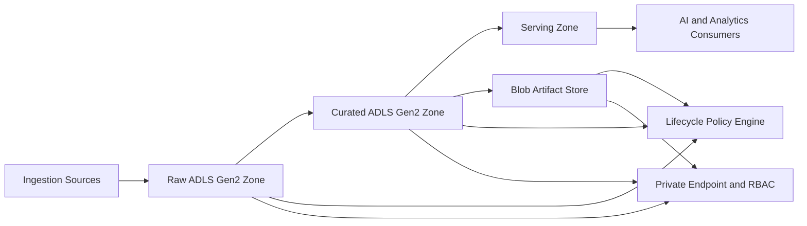
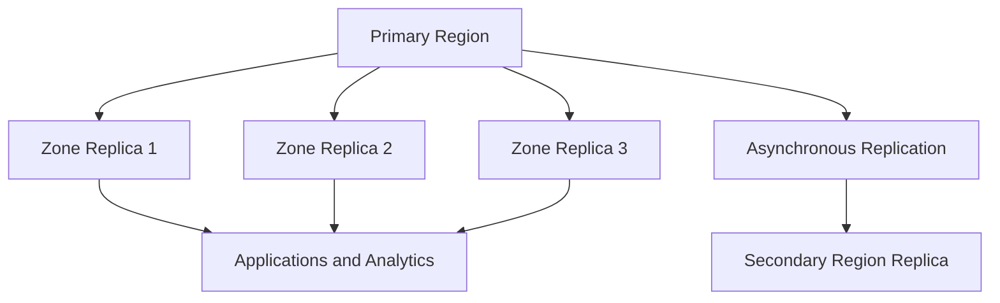
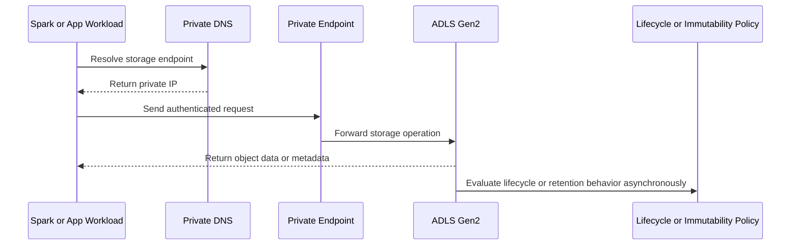

# Azure Storage Services

> Part of the **Enterprise Data & AI Architecture Handbook** · Phase-03 - Cloud & Azure Architecture · Chapter 06.
> Estimated study time: **60 min reading + ~4h labs**.
> **Prerequisites:** read [Storage Systems Fundamentals](../Phase-00/05_Storage_Systems_Fundamentals.md) first.

---

## Executive Summary

Azure Storage is the physical and logical substrate for most modern Azure data platforms. It holds raw data lake zones, curated analytics tables, backup payloads, documents, model artifacts, logs, checkpoints, media, archives, and immutable compliance records. For data and AI architecture, the most important decision is rarely "Blob versus Data Lake" in the vague sense. It is whether the workload needs simple object semantics, hierarchical namespace semantics, strong lifecycle automation, specific redundancy characteristics, and private or public access patterns that match the data’s value and operating model.

Azure Blob Storage and ADLS Gen2 are closely related but architecturally meaningful distinctions still matter. Blob Storage without hierarchical namespace is a highly scalable object store. ADLS Gen2 adds hierarchical namespace, directory semantics, POSIX-style ACLs, and atomic rename behavior that materially improves lakehouse and analytics workflows. That difference is not academic. It changes how Spark commit protocols behave, how data engineers manage folders, and how platform teams govern shared analytical storage.

The rest of the storage decision surface is about lifecycle and durability economics. Hot, cool, cold, and archive tiers shape storage cost over time. Immutability policies, legal hold, soft delete, versioning, and change feed determine whether an accidental deletion becomes a minor incident or a reportable event. LRS, ZRS, GRS, and GZRS define what kinds of hardware, zone, and regional failures the platform can tolerate, and which failures still require a recovery plan. Encryption, RBAC, SAS design, private endpoints, and firewall policy determine whether the platform is merely durable or actually secure.

The strongest enterprise pattern is usually deliberate separation: HNS-enabled accounts for lakehouse and analytical zones, simpler blob-oriented accounts for artifacts and unstructured assets where HNS does not add value, lifecycle rules tied to data domain and retention intent, redundancy chosen by business criticality rather than habit, and security posture built around Entra identity, RBAC, user delegation SAS, private networking, and public-access denial by default. Azure Storage succeeds when the platform makes durable data easy to govern and expensive mistakes hard to repeat.

## Learning Objectives

By the end of this chapter you will be able to:

1. Distinguish Blob Storage from ADLS Gen2 using namespace, analytics, and governance criteria.
2. Choose between hot, cool, cold, and archive tiers based on access pattern, retention horizon, and restore expectations.
3. Select LRS, ZRS, GRS, or GZRS using real fault-tolerance requirements rather than default comfort.
4. Design lifecycle rules, immutability policy, soft delete, and versioning for cost and resilience together.
5. Explain performance, throughput, partitioning, and throttling behavior for Azure Storage workloads.
6. Apply RBAC, POSIX ACLs, SAS patterns, encryption, and firewall controls with production-grade discipline.
7. Organize storage accounts and data zones for lakehouse, operational, and AI artifact workloads.
8. Recognize anti-patterns such as one giant storage account, public access drift, and small-file pathologies.
9. Build executable Azure Storage standards using CLI, Bicep, Terraform, and policy-driven controls.
10. Compare Azure Storage patterns with AWS and GCP equivalents without forcing false parity.

## Business Motivation

- Storage cost and retention policy dominate the economics of many data and AI platforms.
- Lakehouse, archive, and AI artifact workflows need different namespace, lifecycle, and durability characteristics.
- Storage is often the most sensitive exfiltration surface in the estate, so identity and network controls matter materially.
- Analytics and AI teams create enough volume and churn that poor lifecycle design compounds into real budget waste.
- Redundancy choices directly affect availability, recovery posture, and compliance posture.
- Storage-account structure often becomes a hidden blast-radius and quota boundary for data platforms.
- Good storage governance reduces audit friction because data location, retention, and deletion behavior become explicit.

## History and Evolution

- Early Azure Blob Storage focused on massively scalable object storage for files, media, and application payloads.
- General-purpose v2 storage accounts unified object, queue, table, and file capabilities with broader lifecycle and tiering support.
- ADLS Gen1 addressed analytics-oriented storage but created a platform split.
- ADLS Gen2 brought hierarchical namespace to Blob Storage, merging durable object storage with analytics-friendly directory semantics.
- Lifecycle management, soft delete, versioning, change feed, and immutability expanded storage from capacity service into governance service.
- Private Link and stronger RBAC patterns made enterprise storage designs shift toward private-by-default access.
- The lakehouse model increased the importance of atomic rename, directory operations, transaction logs, and file-layout strategy.
- AI and MLOps workloads then increased demand for artifact stores, checkpoint stores, model registry blobs, and retrieval corpora at scale.

## Why This Technology Exists

Azure Storage exists because most enterprise data does not belong in block devices or relational rows. It belongs in highly durable, low-cost, massively scalable object or namespace-oriented storage with explicit retention, lifecycle, and access controls. Businesses need somewhere to land raw telemetry, maintain document archives, serve media, stage backups, manage model artifacts, and persist analytical tables without paying transactional-database economics for every byte.

It also exists because not all object storage workloads are equal. Simple blob-oriented access is enough for many applications. Analytics platforms and lakehouses need stronger directory semantics, ACL inheritance, and rename behavior. Compliance workloads need WORM or legal hold. Recovery-sensitive workloads need replication choices that fit business expectations. Cost-sensitive archives need policy-driven demotion to lower tiers. These needs are similar in theme and different in implementation, which is why Azure Storage exposes multiple storage semantics and controls within one broad service family.

As established in [Storage Systems Fundamentals](../Phase-00/05_Storage_Systems_Fundamentals.md), durability, access patterns, retention, object semantics, and failure domains are storage architecture fundamentals rather than vendor trivia. Azure Storage is the Azure-specific implementation of those fundamentals for enterprise cloud platforms.

## Problems It Solves

- Provides highly durable object storage for operational, analytical, archival, and AI artifact workloads.
- Adds hierarchical namespace semantics for data-lake and lakehouse platforms.
- Supports policy-driven cost reduction through tiering and lifecycle automation.
- Enables immutable retention and legal hold for regulated records.
- Supports enterprise-scale identity, network, encryption, and governance controls.
- Offers multiple redundancy models for different recovery and availability targets.
- Provides soft delete, versioning, change feed, and restore-oriented capabilities that reduce operator error impact.

## Problems It Cannot Solve

- It cannot substitute for transactional OLTP databases where row-level constraints and low-latency updates dominate.
- It cannot rescue poor file layout such as billions of tiny objects or chaotic prefixes without broader data design changes.
- It cannot act as a full backup strategy by itself; deletion, corruption, or bad lifecycle policy can still propagate.
- It cannot provide instant multi-region consistency when replication is asynchronous.
- It cannot make public exposure safe if identity, SAS handling, or application logic are weak.
- It cannot replace true POSIX file systems for every legacy application expectation.
- It cannot prevent expensive analytics if compute engines repeatedly scan the wrong files or tiers.

## Core Concepts

### Blob Storage Versus ADLS Gen2 Hierarchical Namespace

Blob Storage without hierarchical namespace is best understood as flat object storage with container-level grouping. It is excellent for unstructured assets, backups, document stores, media, model artifacts, and application payloads.

ADLS Gen2 is Blob Storage with hierarchical namespace enabled. That change adds:

- directory semantics,
- atomic directory and file rename behavior,
- POSIX-style ACLs,
- better fit for Spark, Trino, and lakehouse table operations,
- clearer analytics-oriented path governance.

The practical rule is simple: choose HNS-enabled accounts by default for lakehouse, analytical zones, and many data-platform workloads. Choose plain blob-oriented accounts where hierarchical namespace offers no business or operational advantage.

### Access Tiers, Lifecycle, and Immutability

Hot, cool, cold, and archive tiers trade storage price against access latency, retrieval cost, and minimum retention expectations. Hot favors frequent reads and writes. Cool and cold reduce at-rest cost for less active data with increasing penalties or operational friction. Archive is for very infrequent access and requires rehydration.

Lifecycle management moves blobs across tiers or deletes them according to policy. Immutability adds time-based retention or legal hold so data cannot be modified or deleted before policy permits it. These are different concerns: one optimizes economics, the other constrains deletion behavior.

### Redundancy Models

| Model | Primary protection | Typical use |
|---|---|---|
| LRS | Multiple copies within one datacenter or storage stamp in one region | Cost-sensitive or lower-criticality data where single-region failure is acceptable |
| ZRS | Synchronous copies across availability zones in one region | Workloads needing stronger in-region resilience |
| GRS | LRS in primary plus asynchronous copy to paired secondary region | DR-oriented durability where in-region zonal resilience is not the main requirement |
| GZRS | ZRS in primary plus asynchronous copy to secondary region | Stronger in-region and regional durability for high-value data |

Read-access variants may also matter operationally, but the architectural point is that cross-region replication in GRS and GZRS is **asynchronous and carries a non-zero recovery point objective (RPO)**: Microsoft publishes typical GRS/GZRS RPO in the tens-of-minutes range, and Azure Storage does not guarantee a specific RPO in its SLA. A workload that assumes GRS or GZRS gives zero data loss on regional failover is architecturally wrong; if the business requires a guaranteed RPO, that must be met with application-level replication, synchronous writes to two regions, or an explicitly tested and documented recovery procedure, not by the redundancy SKU name alone. Cross-region replication is asynchronous and does not replace backup or point-in-time protection.

### Security Building Blocks

Azure Storage security uses multiple overlapping controls:

- Entra identity and RBAC for control-plane and increasingly data-plane authorization,
- POSIX ACLs for HNS-enabled path-level governance,
- user delegation SAS, service SAS, or account SAS where delegated access is necessary,
- encryption at rest with Microsoft-managed or customer-managed keys,
- firewall rules, private endpoints, and public network restrictions,
- immutability, versioning, and soft delete to reduce operator or ransomware damage.

### Performance and Throttling

Storage performance depends on object size, request distribution, tier, redundancy model, account type, client concurrency, and file layout. The service scales extremely far, but it still enforces per-account, per-partition, and per-request-path behavior that surfaces as latency, throttling, or cost. High-performance design usually means:

- parallelism with large enough block sizes,
- prefix and path layout that distribute load sensibly,
- avoiding pathological small-file patterns,
- isolating very hot workloads into dedicated accounts when necessary.

## Internal Working

Azure Storage is a distributed storage service fronted by account endpoints and implemented through partitioned metadata and durable data extents. Clients interact with REST or protocol endpoints, but the service internally separates namespace management from data placement and replication. This is why account-level design, naming, and access patterns influence throughput and throttling more than many teams initially expect.

Blob Storage works naturally as an object namespace. ADLS Gen2 overlays hierarchical namespace metadata on top of the same storage substrate. That overlay is what enables directory semantics, ACL inheritance, and atomic rename behavior critical for analytics engines. The value is not merely nicer folder names. It is a fundamentally better control-plane fit for file-oriented big-data workflows.

Tiering and lifecycle are asynchronous service behaviors. When a lifecycle rule moves data from hot to cool, cold, or archive, or deletes aged blobs, it does so through policy-driven background activity rather than a synchronous application transaction. Archive access also involves rehydration time, which means archive is a storage-economics tool, not an operational data-serving tier.

Geo-redundant models replicate asynchronously to a secondary region. That means a regional catastrophe can still produce some recovery-point gap, and a logically bad write or delete may be replicated as faithfully as a good one. Zone-redundant models improve in-region availability but do not create a second-region rollback point. This is why redundancy, versioning, soft delete, immutability, and backup thinking must be combined rather than confused.

Security behavior is similarly layered. A storage account can reject public network traffic, require TLS, deny anonymous blob access, rely on Entra-based RBAC, use customer-managed keys, and still be operationally weak if SAS tokens are long-lived and widely shared. The platform is secure only when the entire authorization and access path is coherent.

## Architecture

An enterprise Azure Storage architecture usually separates storage by workload semantics and blast radius, not just by team name.

A strong default pattern is:

1. HNS-enabled storage accounts for raw, curated, and serving analytical zones.
2. Separate blob-oriented accounts for application assets, backups, document payloads, model artifacts, and logs where HNS does not add value.
3. Private endpoints and firewall restrictions for sensitive accounts.
4. Lifecycle policies aligned to domain and retention class rather than one global rule.
5. Redundancy selected by business criticality: ZRS or GZRS for high-value production data, lower-cost models where failure impact is lower.
6. Separate accounts where throughput, tenancy, or compliance justify harder boundaries.

For data and AI platforms, the common architecture is account or container separation by data zone and sometimes by domain:

- raw landing zone,
- curated transformation zone,
- serving zone,
- model artifact and checkpoint zone,
- immutable compliance or evidence zone.

The wrong architecture is often a single giant account holding every workload because it looked simpler on day one. At scale, that becomes a governance, cost, and throttling problem disguised as convenience.

## Components

| Component | Responsibility | When to use | Common risk |
|---|---|---|---|
| Storage account | Billing, quota, policy, network, and replication boundary | Always; choose deliberately by workload class | Making one account the blast radius for everything |
| Blob container | Logical grouping of objects | Documents, artifacts, archives, logical object domains | Weak naming and retention discipline |
| ADLS filesystem | HNS-enabled container abstraction | Lakehouse zones and analytics paths | Treating it as if path and ACL design do not matter |
| Access tier | Storage-cost and retrieval model | Lifecycle-aligned data classes | Putting hot operational data in cold or archive tiers |
| Lifecycle policy | Automated tiering or deletion | Large-scale retention management | Silent destructive rules without review |
| Soft delete and versioning | Recovery from accidental change | Most business-critical object workloads | Assuming they replace backup entirely |
| Immutability policy | WORM retention or legal hold | Regulated evidence, records, audit data | Applying it without operational break-glass planning |
| Private endpoint | Private network access to storage | Sensitive production and regulated environments | DNS or subnet misconfiguration |
| CMK integration | Customer-controlled encryption keys | Regulatory or contractual key-control requirements | Overcomplicating low-risk data paths |
| SAS token | Delegated access without full identity grant | Narrow, time-bound data access | Long-lived tokens and poor revocation hygiene |

## Metadata

Storage systems only become governable when object and account metadata are treated as part of the architecture.

Important metadata layers include:

| Metadata type | Purpose |
|---|---|
| Account tags | Owner, environment, classification, cost center, criticality |
| Blob metadata | Application-specific descriptive fields |
| Blob index tags | Searchable classification and lifecycle routing |
| POSIX ACLs | Path-level access governance on HNS-enabled accounts |
| Content type and encoding | Correct client behavior and downstream processing |
| Retention and immutability state | Compliance and legal-readiness visibility |
| Change feed and version history | Audit, replay, and restore support |
| Delta or Iceberg metadata files | Lakehouse transaction and snapshot semantics |

For lakehouse platforms, metadata is not ancillary. The transaction log and table metadata often determine whether storage is operationally trustworthy for analytical compute. For document and archive platforms, metadata is what makes retention and search meaningful.

## Storage

Azure Storage should be treated first as a data-architecture substrate and only second as a bucket service.

For lakehouse and analytical data:

- enable HNS,
- keep zone layout intentional,
- avoid tiny-file explosions,
- separate raw and curated retention policies,
- align table format choices such as Delta Lake, Iceberg, or Hudi with compute engines and governance needs.

For operational object storage:

- choose flat blob accounts when HNS adds no value,
- separate document workloads from analytics when access and retention behavior differ,
- keep versioning and soft delete aligned to business recovery needs,
- use immutability only where the retention model is understood by operators and compliance stakeholders.

The best storage design usually uses multiple accounts for clarity and control rather than a single monolith for perceived simplicity.

## Compute

Storage design is inseparable from compute behavior.

- Spark, Databricks, Synapse, and Trino benefit materially from HNS and sane file layouts.
- Functions and containerized services often use Blob Storage for artifacts, documents, or event payloads where HNS is unnecessary.
- AKS, GPU inference services, and ML pipelines often need durable artifact, checkpoint, and model stores with lifecycle discipline.
- VM-based legacy applications may need simpler blob or file-backed semantics and should not force analytics-oriented storage design onto the whole platform.

### How Databricks and Synapse Consume ADLS Gen2

Databricks and Synapse do not treat ADLS Gen2 as a generic file share; they bind directly to hierarchical namespace behavior:

- Both engines rely on ADLS Gen2's atomic rename to implement safe commit protocols for Delta Lake, Parquet, and other table formats — Spark's commit-then-rename pattern for job output depends on that atomicity, which flat Blob Storage without HNS cannot provide with the same guarantees.
- Unity Catalog (Databricks) and Synapse's linked-service/managed-identity model both authorize access through the storage account's RBAC and ACL layers, not through account keys or SAS tokens, in production configurations — credential passthrough or shared-key access should be treated as a legacy pattern.
- Cluster or pool identity (a Databricks access connector's managed identity, or a Synapse workspace's managed identity) needs `Storage Blob Data Contributor` or finer-grained ACL grants scoped to the specific containers or paths the workload touches, not subscription- or account-wide roles.
- Mounting patterns (DBFS mounts, `abfss://` direct paths) affect both governance and performance: direct `abfss://` access with Unity Catalog external locations is the current recommended pattern; legacy DBFS mounts obscure lineage and complicate access review.
- Private endpoint-based access to storage should be validated from inside the Databricks or Synapse managed VNet (or VNet-injected workspace), because control-plane reachability succeeding does not guarantee the cluster's data-plane path to storage is private.

Compute platforms will expose storage flaws quickly. Small files, poor prefix layout, weak lifecycle policy, or public-access shortcuts eventually become compute-performance problems, not just storage problems.

## Networking

Storage networking should normally be private by default for sensitive enterprise data.

Recommended posture:

- disable public network access unless a reviewed use case requires it,
- use private endpoints for Blob and Data Lake endpoints where appropriate,
- link Private DNS zones correctly,
- scope firewall rules tightly for exceptional public cases,
- separate public-content storage accounts from private analytical or regulated accounts,
- keep hybrid DNS and private endpoint routing tested rather than assumed.

Storage is often the highest-value dependency in a data platform, so convenient public access is usually a poor long-term trade unless the content is explicitly meant for internet distribution.

## Security

Azure Storage security should begin with identity, not shared secrets.

Strong default posture includes:

- Entra-based RBAC for human and workload access,
- POSIX ACLs for HNS-enabled path governance,
- user delegation SAS preferred over account SAS for delegated blob access,
- disallow shared key access when the workload and operational model permit it,
- encryption at rest with Microsoft-managed keys by default and CMK where required,
- private endpoints or tightly governed firewall rules,
- public blob access disabled unless explicitly approved,
- immutability and versioning for regulated or high-value data.

The main security failure modes are usually not broken encryption. They are token sprawl, public endpoint drift, excessive account-wide SAS permissions, and treating storage as "internal" simply because it is in the same subscription.

## Performance

Azure Storage performance is usually dominated by request pattern and file layout rather than by abstract service category alone.

Important performance realities:

- large sequential operations behave differently from millions of tiny file operations,
- HNS-enabled accounts enable better analytics semantics but still need file compaction discipline,
- partition hot spots appear when naming or workload patterns concentrate too much traffic on specific prefixes or objects,
- archive and lower-cost tiers reduce storage price but increase retrieval or restore friction,
- throttling often surfaces as 429 or 503-style service protection behavior and should be treated as a design signal, not only as an operational annoyance.

Good performance design uses parallelism, reasonable object sizes, separate accounts for very hot domains when necessary, and deliberate differentiation between operational blob serving and analytical data-lake traffic.

## Scalability

Azure Storage scales extremely far, but enterprise scalability still requires architecture.

- Account boundaries are quota and policy boundaries.
- Prefix or path design influences partition behavior.
- Private endpoint sprawl can become a scaling and operations issue if not standardized.
- Lakehouse data growth demands compaction, retention, and metadata discipline.
- Multi-account strategies are often necessary for isolation, compliance, or throughput reasons.

True scalability means the storage platform can grow without every performance or governance problem turning into a full-account incident.

## Fault Tolerance

Storage fault tolerance is a layered decision:

- LRS protects against local hardware issues.
- ZRS protects against zone failure in-region.
- GRS adds asynchronous secondary-region durability.
- GZRS combines strong in-region resilience with asynchronous secondary-region durability.
- Soft delete, versioning, and change feed help with logical mistakes.
- Immutability helps against malicious or accidental deletion within retention windows.

The failure most teams miss is logical failure. Replication happily preserves bad deletes, bad overwrites, and bad lifecycle rules unless other protective layers exist. Redundancy is not the same thing as recoverability.

## Cost Optimization

Storage cost optimization usually has five major levers:

1. tier selection,
2. lifecycle automation,
3. redundancy level,
4. request and transaction volume,
5. file-layout efficiency.

Practical rules:

- keep hot data hot only as long as it is truly hot,
- use cool, cold, and archive intentionally and account for early-deletion or retrieval economics,
- avoid storing transient processing artifacts forever,
- reduce tiny-file pathologies because transaction cost and metadata overhead add up quickly,
- do not pay GZRS for data that has low business impact and good rebuild options.

The most common waste patterns are idle hot data, unnecessary geo-redundancy, overly granular objects, and log or artifact sprawl with no lifecycle owner.

## Monitoring

Storage monitoring should cover availability, latency, throttling, capacity growth, and security posture.

Minimum signals include:

- transaction success and failure rates,
- ingress and egress trends,
- server latency and end-to-end latency,
- throttling indicators,
- capacity and object-count growth,
- lifecycle-rule effects,
- soft delete and versioning behavior,
- public-access changes,
- private-endpoint health where applicable.

Azure Monitor, Storage Insights, diagnostic logs, Defender for Storage, and workload-specific telemetry should be combined rather than treated as separate worlds.

## Observability

Observability means storage behavior is explainable from the workload’s point of view.

Important observability practices include:

- client request IDs and correlation IDs in data-plane calls,
- tracing analytical job slowdowns back to storage latency or throttling,
- surfacing lifecycle and immutability events in operational timelines,
- tracking who generated SAS tokens and for how long,
- understanding whether failures were identity, network, tier, redundancy, or application-layout problems.

For lakehouse platforms, observability must also include metadata health such as table-log growth, compaction behavior, and partition skew. Otherwise the platform sees "storage is slow" when the real issue is file-layout entropy.

## Governance

Storage governance should make the correct data-placement decision the default one.

Core governance controls usually include:

- approved account patterns by workload class,
- mandatory tags and naming standards,
- public access denied by policy unless approved,
- minimum TLS and encryption standards,
- lifecycle-policy review and ownership,
- immutability approval and break-glass process,
- storage-account separation standards for regulated or high-throughput workloads,
- backup and restore expectations for logically critical datasets.

### ADR Example

**Context:** An enterprise data and AI platform needs one storage strategy that supports a lakehouse, model artifacts, document payloads, and compliance evidence. The initial proposal is a single storage account with hot-tier retention and broad account SAS because onboarding is faster.

**Decision:** Use separate HNS-enabled accounts for raw and curated lakehouse zones, a separate blob-oriented account for application and model artifacts, and a dedicated immutable storage account for compliance records. Enable private endpoints, deny public access by default, use RBAC plus user delegation SAS, and apply lifecycle policies by workload class rather than one global rule.

**Consequences:** Governance, blast radius, lifecycle, and security posture become clearer. The trade-off is more accounts, more DNS and private-endpoint management, and stronger platform discipline during onboarding.

**Alternatives:**

1. One shared account for every storage workload. Rejected because cost, security, and throttling domains become entangled.
2. Blob-only accounts with no HNS for the lakehouse. Rejected because directory and rename semantics for analytics are weaker.
3. Manual tiering and retention per team. Rejected because it does not scale and fails auditability.

## Trade-offs

| Decision area | Option A | Option B | Real trade-off |
|---|---|---|---|
| Namespace | HNS-enabled ADLS Gen2 | Plain Blob | Better analytics semantics versus simpler object-only model |
| Durability | ZRS or GZRS | LRS or GRS | Higher resilience versus lower cost or simpler economics |
| Delegated access | User delegation SAS and RBAC | Broad account SAS or shared keys | Stronger security versus easier but riskier shortcuts |
| Lifecycle | Aggressive tiering and deletion | Conservative hot retention | Lower cost versus faster retrieval and lower operational surprise |
| Account strategy | Multiple purpose-built accounts | One consolidated account | Clearer isolation versus simpler inventory |
| Compliance | Immutability and legal hold | Versioning and soft delete only | Stronger WORM guarantees versus easier operational flexibility |

## Decision Matrix

| Scenario | Recommended Azure storage choice | Why |
|---|---|---|
| Lakehouse raw and curated zones | HNS-enabled StorageV2 account with ADLS Gen2 semantics | Directory and rename semantics matter for analytics |
| Application documents or media | Blob-oriented StorageV2 account | Simpler object workload with lifecycle needs |
| Compliance evidence archive | Immutable blob containers with appropriate retention and likely higher durability | WORM and auditability dominate |
| Model artifacts and checkpoints | Blob-oriented or HNS-enabled account depending tooling, usually with private access | Artifact access pattern differs from main lakehouse |
| Global high-value production data | ZRS or GZRS depending regional recovery posture | Stronger availability and durability |
| Non-critical transient staging data | LRS with lifecycle cleanup | Low cost and rebuildability matter more |
| Very cold archive with rare retrieval | Archive tier with documented rehydration expectations | Cheapest at-rest economics with slower operational path |

## Design Patterns

1. Raw, curated, and serving zones separated by container or account with explicit lifecycle and ACL design.
2. HNS-enabled accounts for analytical tables and Spark-heavy workloads.
3. Separate artifact and checkpoint stores from the main lakehouse when retention and access differ.
4. Lifecycle by prefix, tag, or container rather than manual cleanup.
5. Soft delete plus versioning for operational recovery.
6. Immutable containers for regulated evidence or audit records.
7. Multiple accounts to isolate noisy or high-throughput workloads.
8. Private endpoints and denied public access for sensitive data paths.
9. Path-level ACLs for multi-team lakehouse governance.
10. Compaction and table maintenance as first-class platform operations.

## Anti-patterns

- One giant shared storage account for every data class and workload.
- Public access enabled "temporarily" for analytics onboarding.
- Broad account SAS tokens passed around as operational shortcuts.
- Treating GRS or GZRS as a substitute for backup or logical recovery.
- Running a lakehouse with unmanaged small-file explosions.
- Applying archive tier to data with routine access needs.
- Enabling HNS only after downstream tooling assumptions are already locked in without testing.
- Sharing immutable policies without understanding operational break-glass implications.
- Mixing compliance evidence and noisy transient staging payloads in the same account.
- Ignoring transaction and request cost while focusing only on storage-at-rest cost.

## Common Mistakes

- Choosing plain blob accounts for analytics platforms that need HNS semantics.
- Assuming geo-redundancy gives zero data-loss failover.
- Forgetting that private endpoints require correct DNS design.
- Using SAS tokens with excessive lifetime or scope.
- Demoting data to cooler tiers without understanding read or early-deletion economics.
- Ignoring soft delete and versioning because redundancy feels sufficient.
- Underestimating metadata and request overhead from tiny files.
- Keeping non-production artifacts forever because no lifecycle owner exists.
- Confusing RBAC with path-level permissions in HNS-enabled accounts.
- Failing to test restore and failover procedures before calling the design resilient.

## Best Practices

- Use HNS-enabled accounts for data-lake and lakehouse workloads by default.
- Separate storage accounts by workload class, data sensitivity, and throughput needs.
- Prefer Entra-based authorization and user delegation SAS over shared keys.
- Deny public access by default and use private endpoints for sensitive workloads.
- Enable versioning, soft delete, and change feed where logical recovery matters.
- Apply lifecycle rules with explicit owner review and change control.
- Keep file sizes and partitioning patterns healthy for analytical engines.
- Match redundancy to business impact, not to vague fear.
- Treat immutable retention as an enterprise control, not a per-team experiment.
- Monitor throttling, request cost, and capacity growth continuously.

## Enterprise Recommendations

An opinionated enterprise recommendation set for Azure Storage is:

| Area | Recommendation |
|---|---|
| Lakehouse | HNS-enabled StorageV2 accounts with explicit zone design |
| Documents and artifacts | Separate blob-oriented accounts where HNS adds little value |
| Security | RBAC, user delegation SAS, private endpoints, public access disabled by default |
| Redundancy | ZRS for critical in-region workloads, GZRS for high-value regional durability, LRS only where rebuildability is acceptable |
| Lifecycle | Mandatory policy-driven tiering and cleanup for non-immutable data |
| Compliance | Dedicated immutable containers or accounts for evidence-class data |
| Performance | Multi-account isolation for very hot domains and compaction discipline for analytics |
| Governance | Policy-enforced naming, tags, TLS minimums, and exposure controls |
| Recovery | Versioning, soft delete, documented restore steps, and tested failover assumptions |
| FinOps | Treat request volume and tier choice as first-class cost drivers |

## Azure Implementation

Azure implementation should make namespace, security, lifecycle, and redundancy explicit.

Example Azure CLI for an HNS-enabled account with private-first posture:

```bash
az group create \
  --name rg-storage-data-prod-eus2 \
  --location eastus2

az storage account create \
  --name stdatalakeprod01 \
  --resource-group rg-storage-data-prod-eus2 \
  --location eastus2 \
  --kind StorageV2 \
  --sku Standard_ZRS \
  --hns true \
  --access-tier Hot \
  --allow-blob-public-access false \
  --min-tls-version TLS1_2 \
  --https-only true

az storage account blob-service-properties update \
  --account-name stdatalakeprod01 \
  --resource-group rg-storage-data-prod-eus2 \
  --enable-versioning true \
  --enable-delete-retention true \
  --delete-retention-days 30 \
  --enable-container-delete-retention true \
  --container-delete-retention-days 30
```

Example lifecycle-management policy:

```json
{
  "rules": [
    {
      "enabled": true,
      "name": "curated-to-cool-then-cold",
      "type": "Lifecycle",
      "definition": {
        "filters": {
          "blobTypes": [
            "blockBlob"
          ],
          "prefixMatch": [
            "curated/"
          ]
        },
        "actions": {
          "baseBlob": {
            "tierToCool": {
              "daysAfterModificationGreaterThan": 30
            },
            "tierToCold": {
              "daysAfterModificationGreaterThan": 120
            },
            "delete": {
              "daysAfterModificationGreaterThan": 730
            }
          }
        }
      }
    }
  ]
}
```

Example Bicep for an HNS-enabled storage account with versioning and firewall posture:

```bicep
param location string = resourceGroup().location

resource storage 'Microsoft.Storage/storageAccounts@2023-05-01' = {
  name: 'stdatalakeprod01'
  location: location
  sku: {
    name: 'Standard_ZRS'
  }
  kind: 'StorageV2'
  properties: {
    accessTier: 'Hot'
    allowBlobPublicAccess: false
    allowSharedKeyAccess: false
    isHnsEnabled: true
    minimumTlsVersion: 'TLS1_2'
    supportsHttpsTrafficOnly: true
    networkAcls: {
      defaultAction: 'Deny'
      bypass: 'AzureServices'
    }
  }
}

resource blobService 'Microsoft.Storage/storageAccounts/blobServices@2023-05-01' = {
  name: '${storage.name}/default'
  properties: {
    deleteRetentionPolicy: {
      enabled: true
      days: 30
    }
    containerDeleteRetentionPolicy: {
      enabled: true
      days: 30
    }
    isVersioningEnabled: true
  }
}
```

Example Terraform for a lakehouse-oriented storage baseline:

```hcl
resource "azurerm_storage_account" "lake" {
  name                     = "stdatalakeprod01"
  resource_group_name      = "rg-storage-data-prod-eus2"
  location                 = "East US 2"
  account_tier             = "Standard"
  account_replication_type = "ZRS"
  account_kind             = "StorageV2"
  access_tier              = "Hot"

  is_hns_enabled                 = true
  allow_nested_items_to_be_public = false
  min_tls_version                = "TLS1_2"
  shared_access_key_enabled      = false
}
```

Example immutable-container posture for records workloads:

```bash
az storage container-rm create \
  --storage-account stdatalakeprod01 \
  --name records-archive

az storage container immutability-policy create \
  --account-name stdatalakeprod01 \
  --container-name records-archive \
  --period 365 \
  --allow-protected-append-writes true
```

## Open Source Implementation

Open-source storage architectures usually separate object-store substrate from table-format semantics.

Typical enterprise open-source stack:

- MinIO for S3-compatible object storage in self-managed environments.
- Delta Lake, Apache Iceberg, or Apache Hudi for analytical table semantics.
- Spark, Trino, or Flink as compute engines over those object stores.
- OpenMetadata or Apache Atlas for catalog and lineage.
- Prometheus and Grafana for storage and object-service observability.
- Terraform and GitHub Actions or Azure DevOps for environment automation.

The important comparison is that Azure Storage gives a managed substrate with strong cloud-native identity, lifecycle, and redundancy integration. Open-source stacks give more substrate portability and sometimes more control, but they move durability, upgrade, and incident burden back to the customer.

Example MinIO lifecycle rule application:

```bash
mc alias set local http://minio.example.internal minioadmin minioadmin
mc mb local/lakehouse-raw
mc ilm rule add local/lakehouse-raw --noncurrent-expiry-days 90
```

Example Iceberg-style warehouse configuration concept:

```properties
catalog.type=hadoop
warehouse=s3a://lakehouse-curated/
fs.s3a.path.style.access=true
```

Example Delta-oriented lakehouse pattern:

- object store for raw and curated data,
- transaction log for snapshot and ACID-like table operations,
- compaction and vacuum process under governance,
- separate artifact and checkpoint paths from analytical tables.

The open-source lesson is clear: table semantics are often the real analytical abstraction, while object storage remains the durable substrate underneath.

## AWS Equivalent (comparison only)

| Azure storage concept | AWS equivalent | Where Azure is typically stronger | Where AWS is typically stronger | Migration note |
|---|---|---|---|---|
| Blob Storage | Amazon S3 | Strong Azure identity and platform integration in Azure-first estates | Enormous ecosystem maturity and bucket-level tooling depth | Translate lifecycle, IAM, and endpoint models explicitly |
| ADLS Gen2 with HNS | S3 plus analytics table formats, or EMR and lakehouse patterns on top | HNS and analytics semantics integrated into managed Azure storage | Deep S3 ecosystem and broad lakehouse tooling maturity | Re-evaluate namespace and ACL assumptions carefully |
| Hot, cool, cold, archive tiers | S3 Standard, Standard-IA, Intelligent-Tiering, Glacier tiers | Simple enterprise integration in Azure estates | Rich archival tier ecosystem and S3 tooling breadth | Compare retrieval fees and minimum retention carefully |
| LRS, ZRS, GRS, GZRS | S3 regional durability model with cross-region replication patterns | Clear named redundancy options within Azure control model | Strong cross-region storage patterns in AWS ecosystem | Map business continuity intent, not labels |
| Immutability and legal hold | S3 Object Lock | Strong integration into Azure enterprise governance stacks | Mature S3 compliance ecosystem | Validate retention semantics and operational controls |

## GCP Equivalent (comparison only)

| Azure storage concept | GCP equivalent | Where Azure is typically stronger | Where GCP is typically stronger | Migration note |
|---|---|---|---|---|
| Blob Storage | Cloud Storage | Tight Azure platform integration for Azure-first estates | Clean project-centric storage model | Re-express governance and network policy in provider-native terms |
| ADLS Gen2 with HNS | Cloud Storage plus analytics table formats and Dataproc or BigLake patterns | Integrated HNS semantics for Azure analytics estates | Strong analytics ecosystem integration in some GCP data patterns | Check rename, ACL, and path-governance assumptions |
| Access tiers and lifecycle | Standard, Nearline, Coldline, Archive | Familiar enterprise integration in Azure | Clear class separation in GCP storage model | Compare restore and minimum-duration economics |
| ZRS or GZRS style resilience decisions | Multi-zone and dual-region storage patterns | Named redundancy choices in Azure control model | Strong dual-region and global storage options | Match workload RPO and RTO requirements directly |
| SAS and RBAC model | Signed URLs and IAM | Strong Entra and RBAC alignment in Microsoft-centric estates | Clean project IAM and signed-URL workflows | Avoid assuming delegated-access mechanics are equivalent |

## Migration Considerations

Storage migration should begin with data classification and access pattern inventory, not with a copy job.

1. Classify datasets into lakehouse, documents, backups, archives, artifacts, and regulated records.
2. Decide which workloads need HNS before creating or upgrading accounts.
3. Normalize naming, tagging, lifecycle, and retention intent before bulk migration.
4. Clean up public access, SAS habits, and firewall assumptions early.
5. Test analytical engines against realistic file layouts, not only against copied data volume.
6. Plan DNS and private-endpoint rollout before turning off public access for critical accounts.
7. Validate recovery, soft delete, and version behavior after migration, not just copy completion.
8. Treat small-file cleanup and table maintenance as part of migration closure.

Migration is complete only when the target storage semantics, security posture, and lifecycle behavior are actually being used by the workloads.

## Mermaid Architecture Diagrams







## End-to-End Data Flow

An end-to-end Azure Storage data path for a lakehouse and AI platform often works like this:

1. Source systems land raw files into an HNS-enabled raw zone through private endpoints.
2. Analytical compute reads from raw, writes cleaned outputs to curated zones, and records table metadata.
3. Serving datasets, features, or embeddings are materialized into serving paths or specialized stores.
4. Model artifacts, checkpoints, and prompt or retrieval corpora are stored in separate blob-oriented or HNS-enabled artifact zones depending access pattern.
5. Lifecycle rules gradually demote inactive data from hot to cooler tiers or delete transient artifacts when policy allows.
6. Versioning, soft delete, and change feed provide operator and recovery safety nets.
7. Immutability protects evidence-class or regulated record sets.
8. Monitoring and governance systems inspect access, growth, throttling, and exposure posture continuously.

This flow is what turns storage from a capacity bucket into a governed data platform.

## Real-world Business Use Cases

1. Enterprise lakehouse foundation with raw, curated, and serving zones on HNS-enabled storage.
2. Immutable compliance archive for financial records, audit evidence, or regulated reports.
3. AI platform artifact store for model packages, checkpoints, evaluation outputs, and retrieval corpora.
4. Document and media repository for line-of-business applications with lifecycle-driven archiving.
5. Backup and export landing zone for operational systems that need cheap durable retention.

## Industry Examples

- Databricks-on-Azure lakehouse patterns rely heavily on ADLS Gen2 because HNS and object durability align well with Delta-style analytical workflows.
- Media and content platforms often use blob-oriented storage accounts with lifecycle rules to push older assets to cooler tiers while keeping active content hot.
- Financial and healthcare organizations frequently separate immutable evidence stores from operational data-lake zones because retention and deletion policy differ completely.
- AI platform teams increasingly distinguish artifact storage, training data, and production retrieval corpora because cost, mutability, and access control requirements are not the same.
- Large enterprises often split storage accounts by domain or classification after discovering that one shared account created noisy-neighbor, billing, and governance pain.

## Case Studies

### Case Study 1: AWS S3 us-east-1 Outage (2017)

An operational action against core S3 control subsystems in one major region caused prolonged service disruption for many dependent services. The lesson for Azure Storage architects is straightforward: one-region concentration and control-plane dependency matter even when the storage system is highly durable. Redundancy choice, dependency mapping, and recovery posture must be explicit.

### Case Study 2: Capital One Breach (2019)

Although the root mechanics involved SSRF and identity misuse rather than Azure Storage specifically, the broader lesson is directly relevant to cloud object storage: storage exposure is rarely just a network problem or just an IAM problem. Public reachability, delegated credentials, and excessive permissions combine into real breach paths. Azure teams should treat SAS, public access, identity scope, and network exposure as one security system.

### Case Study 3: Small-File Lake Migration Failure Pattern

Many enterprises migrating HDFS or file-share workloads into ADLS discover that copying billions of tiny files "as-is" produces poor Spark performance, expensive list operations, and throttling under metadata-heavy workloads. The lesson is that object storage migration is also a data-layout redesign exercise. Storage platforms are durable, but they still reward healthy file geometry and table maintenance.

## Hands-on Labs

1. Create an HNS-enabled storage account and compare it with a plain blob-oriented account.
2. Implement lifecycle rules that move curated data from hot to cool to cold based on age.
3. Enable versioning and soft delete, then simulate accidental deletion and restore.
4. Create a private endpoint and validate private DNS resolution for a storage account.
5. Apply an immutability policy to a records container and test allowed versus blocked operations.
6. Benchmark large-file and small-file access patterns from analytical compute and record the differences.

## Exercises

1. Explain when HNS is worth the extra namespace semantics and when plain blob access is enough.
2. Choose between LRS, ZRS, GRS, and GZRS for three different workload classes.
3. Write an ADR selecting lifecycle and redundancy policy for a regulated analytics platform.
4. Compare RBAC, POSIX ACLs, and SAS as delegated-access mechanisms.
5. Identify which datasets in your estate should use immutability and which should not.
6. Describe how you would detect and correct small-file pathologies in a lakehouse.
7. Explain why geo-redundancy is not the same thing as backup.
8. Design a storage-account strategy for documents, raw data, curated data, and AI artifacts.

## Mini Projects

1. Build an Azure Storage baseline module that creates HNS-enabled accounts, private networking, lifecycle policy, and versioning defaults.
2. Design a lakehouse storage taxonomy with raw, curated, serving, and artifact zones plus retention rules.
3. Create a compliance-focused archive pattern using immutability, legal hold, and audited delegated access.

## Capstone Integration

This chapter operationalizes the durability, namespace, and retention theory introduced in [Storage Systems Fundamentals](../Phase-00/05_Storage_Systems_Fundamentals.md). The earlier chapter explains why object storage, redundancy, lifecycle, and failure domains matter. This chapter turns those ideas into concrete Azure Storage account patterns, HNS decisions, lifecycle policies, and security controls.

The end goal is a storage platform where analytical engines, applications, and AI services all land on durable and governable storage without inheriting public exposure, uncontrolled retention, or accidental cost sprawl.

## Interview Questions

1. What is the practical difference between Blob Storage and ADLS Gen2?
   **A:** ADLS Gen2 is Blob Storage with a Hierarchical Namespace (HNS) enabled, adding true directory/file semantics, atomic directory rename, and POSIX-style ACLs on top of the same underlying object storage — plain Blob Storage treats paths as flat key prefixes with no real directory structure or atomic rename.
2. When should an account be HNS-enabled and when is plain blob enough?
   **A:** Enable HNS for analytical/lakehouse workloads (Spark, Databricks, Synapse) that benefit from atomic directory operations and fine-grained POSIX ACLs; plain blob storage is enough for simple object storage use cases (static assets, backups) with no need for directory-level semantics or engine-level lakehouse features.
3. How do hot, cool, cold, and archive tiers differ operationally?
   **A:** Hot has the highest storage cost but lowest access cost and instant access, for frequently accessed data; cool and cold progressively lower storage cost while raising per-access cost and requiring longer minimum-storage-duration commitments; archive has the lowest storage cost but data must be rehydrated (a process taking hours) before it can be read at all.
4. Why is GRS not the same thing as backup?
   **A:** GRS (Geo-Redundant Storage) protects against a regional infrastructure failure by asynchronously replicating data to a secondary region, but it replicates every change including accidental deletions or corruption — it does not protect against a logical/application-level mistake the way a point-in-time backup with retained history does.
5. When is user delegation SAS preferable to account SAS?
   **A:** User delegation SAS is signed with Azure AD credentials and can be scoped to specific Azure AD identity permissions with a shorter practical lifetime, making it more secure and auditable; account SAS is signed with the storage account key itself, meaning anyone possessing it has broad access that's harder to revoke individually and isn't tied to an auditable identity.
6. How do versioning, soft delete, and immutability complement one another?
   **A:** Versioning retains previous versions of a blob when overwritten; soft delete retains a deleted blob for a recovery window; immutability (WORM policies) prevents any modification or deletion for a defined retention period regardless of permissions — together they protect against accidental overwrite, accidental deletion, and even a compromised account attempting to tamper with data.
7. What causes Azure Storage throttling in real platforms?
   **A:** Exceeding the account's or partition's request-rate or bandwidth limits, often from too many small files being accessed at high concurrency (each incurring per-request overhead) or a hot partition within the storage service's internal partitioning scheme — throttling is frequently a symptom of small-file proliferation or a highly skewed access pattern, not just raw volume.
8. Why is storage-account structure a governance decision rather than just a naming decision?
   **A:** The storage account boundary determines the blast radius of a security incident, the granularity of access control and monitoring, and the applicable redundancy/lifecycle policy — how accounts are structured (per domain, per environment, per data classification) is a governance decision with real security and compliance consequences, not just a cosmetic naming convention.

## Staff Engineer Questions

1. How would you separate lakehouse, artifact, and compliance storage in one enterprise platform?
   **A:** Use separate storage accounts (or at minimum separate containers with distinct access policies) for lakehouse analytical data, build/deployment artifacts, and compliance-retention data, since each has different access patterns, redundancy needs, and retention/immutability requirements that a shared account would force into an uncomfortable compromise.
2. What criteria would you use to decide whether a data domain gets its own storage account?
   **A:** Decide based on distinct access-control boundaries needed (different consuming teams with no legitimate need to see each other's data), different redundancy/tier requirements, or regulatory data-classification differences — not simply because a domain wants organizational autonomy.
3. How would you phase a migration from public blob access to private endpoints without breaking downstream systems?
   **A:** Add the private endpoint alongside existing public access, migrate and validate each downstream consumer's connectivity individually against the private path, and disable public network access only after every consumer is confirmed working — a premature public-access disablement risks breaking any consumer not yet migrated.
4. What metrics and logs would you require before approving a large analytical workload on a shared storage account?
   **A:** Expected request rate and bandwidth against the account's throttling limits, average file size (to catch small-file-driven request amplification before it happens), and diagnostic logging enabled to attribute usage per consuming workload for both cost and incident-investigation purposes.
5. How would you prevent long-lived SAS tokens from becoming institutional risk?
   **A:** Default to short-lived, user-delegation SAS tokens generated on-demand rather than long-lived account SAS tokens embedded in application configuration, and audit for any SAS token with an expiry far in the future as a policy violation requiring remediation.
6. What file-layout standards would you enforce for Spark or lakehouse workloads?
   **A:** Target a minimum average file size (avoiding small-file proliferation), require scheduled compaction/`OPTIMIZE` jobs, and enforce a partitioning scheme aligned to actual query patterns rather than arbitrary high-cardinality partitioning that fragments files further.
7. How would you choose between ZRS and GZRS for a mission-critical dataset?
   **A:** Choose GZRS when the dataset needs both zone-level resilience within a region and cross-region disaster recovery for a regional-scale event; choose ZRS alone when zone-level resilience is sufficient and the cost/complexity of cross-region replication isn't justified by the workload's actual RTO/RPO requirement.
8. What operational checks would you automate around lifecycle rules and immutability policy?
   **A:** Automated validation that lifecycle rules match the documented data-classification retention requirement (catching a rule that would delete data before its mandated retention period), and alerting on any attempt to modify or shorten an immutability policy on regulated data.

## Architect Questions

1. What is the enterprise default storage-account pattern for documents, lakehouse data, and AI artifacts?
   **A:** Separate storage accounts per data class (documents, lakehouse analytical data, AI training artifacts/model weights) with HNS enabled for lakehouse data, private-endpoint-only access by default, and lifecycle/redundancy policy mapped to each class's actual retention and durability requirement rather than a single uniform policy for everything.
2. Which workloads should be private-by-default, immutable-by-default, or geo-redundant-by-default?
   **A:** All workloads should be private-by-default in 2026; regulated/compliance data (financial records, audit logs) should be immutable-by-default; mission-critical, hard-to-regenerate datasets should be geo-redundant-by-default — these defaults should be encoded in policy, not left to individual project decisions.
3. How should storage governance align with data classification and regional residency requirements?
   **A:** Each data classification tier should map to a mandatory minimum redundancy option, access tier, and set of approved regions, enforced via policy-as-code so a regulated dataset can't accidentally be provisioned in a non-compliant region or with insufficient redundancy.
4. When is one shared storage account acceptable, and when is it clearly wrong?
   **A:** Acceptable for genuinely low-risk, low-volume, single-team use cases where the operational overhead of separate accounts isn't justified; clearly wrong when it mixes data classifications requiring different access-control boundaries, or when multiple independent teams' workloads would create noisy-neighbor throttling risk for each other.
5. What is your policy for HNS adoption across the estate?
   **A:** Mandate HNS for all new analytical/lakehouse storage accounts by default, since the atomic-rename and POSIX-ACL benefits materially improve engine compatibility and reliability, with plain blob reserved only for genuinely simple object-storage use cases with no analytical engine consumption.
6. How do you govern lifecycle rules so cost savings do not become accidental data loss?
   **A:** Require lifecycle rule changes to go through the same reviewed IaC/PR process as other infrastructure changes, with automated validation against the data's documented retention requirement, since an overly aggressive lifecycle rule (deleting data too early to save cost) is functionally equivalent to accidental data loss.
7. Which storage security controls belong in policy, and which belong in workload engineering standards?
   **A:** Encryption, public-network-access denial, and mandatory tagging belong in enforced policy since they must be true universally; specific access-pattern optimizations (partition scheme, file-size targets) belong in workload engineering standards since they vary legitimately by workload.
8. How do you explain the difference between durability, recoverability, and compliance retention to senior stakeholders?
   **A:** Durability is the guarantee data isn't lost due to hardware failure (replication/erasure coding); recoverability is the ability to restore a previous state after an accidental or malicious change (versioning, soft delete, backup); compliance retention is a legal/regulatory requirement that data must be kept unmodified for a defined period (immutability policy) — all three are necessary and none substitutes for the others.

## CTO Review Questions

1. Which of our storage decisions create the biggest long-term cost risk?
   **A:** Data left in the Hot tier past its actual access-frequency decay point, and small-file proliferation driving both storage overhead and query-time request-cost amplification, are typically the largest addressable long-term cost risks in a storage estate.
2. Are we paying for higher redundancy than our workloads genuinely justify?
   **A:** This requires auditing each dataset's configured redundancy option against its actual documented RTO/RPO requirement — GZRS applied uniformly "to be safe" for data that doesn't actually need cross-region DR is a common, quantifiable overspend.
3. Where is sensitive data still publicly reachable for convenience rather than necessity?
   **A:** This is directly auditable via a policy-compliance query for public network access on storage accounts holding classified/regulated data — any finding here is an immediate, high-priority remediation item, not a long-term roadmap item.
4. Could we prove today which datasets are immutable, which are recoverable, and which are merely replicated?
   **A:** This should be answerable from a data-classification-to-storage-policy mapping document and a policy-compliance report, not from memory or investigation — if it requires investigation, that gap is itself a compliance risk.
5. Are our AI artifacts and training data governed with the same seriousness as customer-facing production data?
   **A:** AI training data and model artifacts often contain the same sensitive information as production data but historically receive less governance rigor since they're seen as "internal" — this should be corrected given AI's growing business criticality and regulatory scrutiny.
6. How many of our storage accounts are shared for convenience and now represent avoidable blast radius?
   **A:** This requires an inventory audit identifying storage accounts serving multiple unrelated teams or data classifications — each such account represents an avoidable concentration of blast radius that should be evaluated for splitting.
7. Are we treating lifecycle policy as a real engineering control or as an afterthought?
   **A:** If lifecycle rules are set once at account creation and never revisited despite changing access patterns, they're an afterthought rather than a maintained control — mature governance treats lifecycle policy as an ongoing, monitored, and periodically re-validated engineering practice.
8. Which storage platform decisions are strategic and which should remain reversible?
   **A:** HNS-enablement and the fundamental account-segmentation-by-data-class model are strategic and costly to change later; specific lifecycle-rule day-thresholds and tier assignments are comparatively reversible and should be tuned iteratively based on measured access patterns.

## References

- Microsoft Azure Blob Storage documentation.
- Azure Data Lake Storage Gen2 documentation.
- Azure Storage redundancy, failover, and durability documentation.
- Azure lifecycle management, versioning, soft delete, and change feed documentation.
- Azure Storage immutability and legal hold documentation.
- Azure Storage security guidance for RBAC, SAS, encryption, and firewall controls.
- Azure Architecture Center guidance for lakehouse and storage patterns.
- Public postmortems and engineering write-ups related to object-storage outages, security incidents, and large-scale analytics storage operations.

## Further Reading

- Re-read [Storage Systems Fundamentals](../Phase-00/05_Storage_Systems_Fundamentals.md) and map each core concept to your Azure account patterns.
- Review Azure-native lakehouse, archive, and storage-security guidance through the lens of your own data retention and access patterns.
- Study how your analytical engines interact with storage metadata, file layout, and namespace semantics before finalizing platform standards.