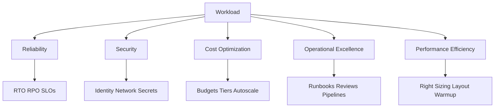
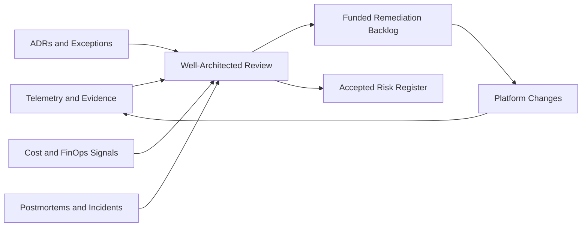
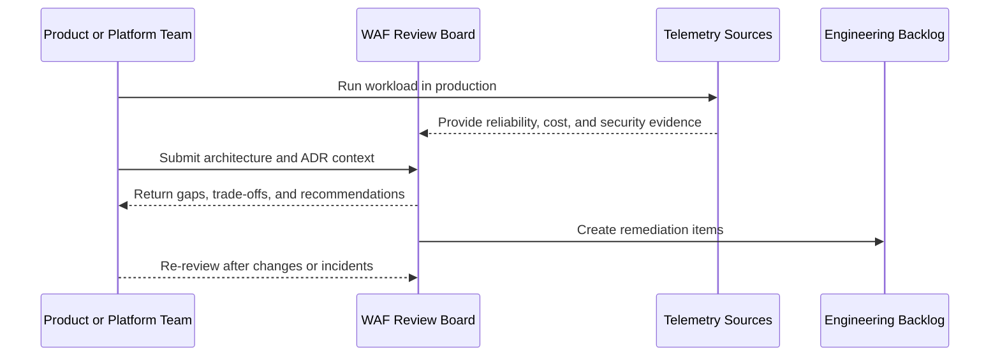

# Azure Well-Architected Framework

> Part of the **Enterprise Data & AI Architecture Handbook** · Phase-03 - Cloud & Azure Architecture · Chapter 07.
> Estimated study time: **60 min reading + ~3h labs**.
> **Prerequisites:** read [Azure Core Architecture](02_Azure_Core_Architecture.md) first.

---

## Executive Summary

The Azure Well-Architected Framework is not a checklist to run after architecture is complete. It is the decision framework used to keep architecture from drifting into an expensive, fragile, and unreviewable state. For data and AI platforms, that means every major design choice should be defensible through five lenses: reliability, security, cost optimization, operational excellence, and performance efficiency. The framework is valuable precisely because those lenses conflict. The point is not to maximize all five simultaneously. The point is to make trade-offs explicit before production discovers them for you.

In data platforms, the five pillars show up in concrete ways. Reliability becomes RTO, RPO, replayability, checkpointing, and dependency isolation. Security becomes identity boundaries, private data paths, secrets handling, lineage access, and model or artifact governance. Cost optimization becomes lifecycle policy, idle compute reduction, storage tiering, GPU scheduling, and egress discipline. Operational excellence becomes ADRs, release controls, observability, runbooks, and review cadence. Performance efficiency becomes file layout, query shape, cache strategy, warm-up control, parallelism, and resource-class selection.

The framework matters because data and AI systems rarely fail for only one reason. A low-cost storage tier can create performance pain. A security control can create operational fragility. A high-availability topology can become financially irrational. A cluster platform can satisfy performance needs and overwhelm the operating model. The Well-Architected Framework forces teams to acknowledge these couplings and design for their business consequences rather than for technical aesthetics.

In Azure-first estates, the practical implementation surface is broad: management groups and policy for governance, Monitor and Log Analytics for detection, Key Vault and Managed Identity for security, Front Door and zone-aware services for resilience, Advisor and Cost Management for efficiency, Chaos Studio for reliability validation, and Bicep or Terraform for repeatable controls. Open-source complements such as OpenTelemetry, Prometheus, Grafana, Great Expectations, Delta Lake, Kubernetes, Ray, and MLflow strengthen the operating model where Azure-native controls need deeper workload-level evidence.

The strongest enterprise posture is to use the framework continuously. Run reviews before onboarding a platform, before approving a production exception, after major incidents, and when cost or reliability trends deviate materially. Architecture that is not periodically re-reviewed is architecture that is quietly being replaced by accidents.

## Learning Objectives

By the end of this chapter you will be able to:

1. Apply the five Azure Well-Architected pillars to data and AI platform design rather than only to generic web applications.
2. Translate reliability into measurable targets such as SLOs, RTO, RPO, and degradation strategy.
3. Define a security and identity baseline that fits Azure-native and hybrid enterprise estates.
4. Use FinOps and cost-governance hooks as architectural controls rather than finance-only afterthoughts.
5. Evaluate operational excellence using runbooks, reviews, rollout safety, incident learning, and platform ownership models.
6. Identify where performance efficiency conflicts with reliability, security, or cost.
7. Create design reviews, ADRs, and engineering standards that operationalize the framework.
8. Recognize anti-patterns such as framework theater, vanity resilience, and security controls without operating models.
9. Map Azure services and open-source tools to each pillar pragmatically.
10. Compare Azure Well-Architected practices with AWS and GCP equivalents without assuming the same supporting platform model.

## Business Motivation

- Data and AI systems concentrate risk because they mix storage, compute, identity, networking, and governance in one platform.
- Executives care about reliability, security, cost, and speed at the same time; the framework gives architecture teams a disciplined way to address all four without hand-waving.
- Audit, compliance, and incident reviews go faster when architecture intent is expressed through standard pillars and measurable targets.
- FinOps outcomes improve when cost trade-offs are addressed before platform adoption hardens waste into architecture.
- Engineering organizations make better decisions when performance or reliability upgrades are justified against business objectives instead of enthusiasm or fear.
- Post-incident learning becomes more reusable when failures are analyzed through the same architectural lens used during design.

## History and Evolution

- Early cloud architecture guidance focused heavily on infrastructure availability and security baselines, often without enough attention to cost and operations as first-class design constraints.
- As public-cloud adoption matured, providers formalized framework-based architecture guidance to make trade-offs repeatable across many workload types.
- Microsoft's Azure Well-Architected Framework evolved into a five-pillar model that aligned architectural choices with business outcomes rather than with product catalogs.
- The rise of platform engineering, SRE, and FinOps increased the importance of operational excellence and cost optimization as architecture topics rather than only runtime concerns.
- Data platforms, lakehouses, and AI systems widened the scope further by introducing large-scale storage, bursty compute, GPUs, compliance-sensitive data flows, and multi-stage model pipelines.
- The current enterprise trend is to run Well-Architected style reviews continuously, not only during initial design approval.

## Why This Technology Exists

The Azure Well-Architected Framework exists because cloud architectures are easy to make functional and hard to make durable. Most design decisions can be justified locally. The framework exists to force a broader question: does this decision still make sense when reliability, security, performance, operations, and cost are considered together?

It also exists because cloud complexity accumulates invisibly. A queue here, a storage tier there, a private endpoint later, a GPU node pool next quarter, a second region after the first incident. Without a common review language, each change is approved for a local reason and the platform becomes globally incoherent. The framework creates that common language.

For data and AI estates, the need is stronger. These systems often serve many teams, carry sensitive data, and operate across batch, stream, and inference paths. As established in [Azure Core Architecture](02_Azure_Core_Architecture.md), scopes, quotas, governance boundaries, and shared services are part of the architecture. The Well-Architected Framework exists to evaluate whether those boundaries and services still produce the outcomes the enterprise actually wants.

## Problems It Solves

- Creates a shared review model for architecture trade-offs.
- Converts vague non-functional goals into measurable design targets.
- Helps teams detect over-engineering and under-engineering earlier.
- Integrates cost, governance, and operations into technical design.
- Improves consistency of architecture reviews across products and platform teams.
- Turns incidents and postmortems into reusable design guidance.
- Makes data and AI platform risk easier to communicate to non-specialists.

## Problems It Cannot Solve

- It cannot replace workload-specific testing, benchmarking, or chaos validation.
- It cannot rescue an organization that refuses to fund operations, security, or platform ownership.
- It cannot make contradictory business requirements disappear.
- It cannot convert a weak delivery culture into operational excellence by terminology alone.
- It cannot select services automatically; judgment is still required.
- It cannot guarantee that a reviewed architecture will remain good after uncontrolled change.

## Core Concepts

### The Five Pillars for Data Platforms

| Pillar | Core question | Data and AI interpretation |
|---|---|---|
| Reliability | Will the system keep or restore its commitments under fault? | RTO, RPO, replayability, checkpointing, zone and region behavior, control-plane dependency, graceful degradation |
| Security | Is data, identity, and execution access controlled proportionally to risk? | Entra identity, Managed Identity, RBAC, data-plane access, private networking, key management, lineage and model protection |
| Cost Optimization | Are we paying for value rather than for accidental complexity? | Storage tiers, GPU scheduling, idle cluster control, egress reduction, lifecycle rules, right-sizing, budget ownership |
| Operational Excellence | Can the team change and run the system safely? | ADRs, pipelines, incident response, review cadence, runbooks, rollback, data quality and model monitoring, ownership clarity |
| Performance Efficiency | Does the system use resources effectively to meet business goals? | File layout, caching, partitioning, autoscaling, concurrency, model warm-up, query design, node pool selection |

### Reliability Targets and RTO or RPO

Reliability becomes useful only when the target is explicit. Teams should define:

- SLOs for latency, throughput, freshness, or availability,
- RTO for how quickly the service or dataset must recover,
- RPO for how much data loss is tolerable,
- degradation modes when full service is unavailable,
- restore and failover test frequency.

Data platforms often need different targets per domain. A fraud score service, a daily financial close, and a recommendation batch job are not one reliability class.

### Security and Identity Baseline

For Azure-first estates, the baseline usually includes:

- Entra ID for human identity,
- Managed Identity or workload identity federation for runtime identity,
- least-privilege RBAC and group-based assignment,
- private data paths where risk justifies them,
- Key Vault or equivalent secret and key management,
- logging and alerting that do not leak sensitive data while still preserving audit value.

### Operational Excellence and Review Loops

Operational excellence is the pillar most often underfunded. For data and AI platforms it means:

- reviewed IaC and deployment pipelines,
- runbooks for data delay, quota pressure, cost spikes, and security exceptions,
- scheduled Well-Architected reviews,
- postmortems that produce changes rather than narratives,
- platform ownership boundaries that are visible and enforced.

### Cost Optimization and FinOps Hooks

FinOps is a set of architectural hooks, not only a finance report. The hooks include:

- mandatory cost tags,
- budgets and anomaly alerts,
- runtime classification by workload shape,
- lifecycle rules on data,
- reservation or savings choices for stable demand,
- separate quotas and subscriptions for expensive AI experimentation.

## Internal Working

The Well-Architected Framework works as a review and feedback loop, not as a document. A platform or workload is designed, evaluated against the pillars, implemented with explicit controls, monitored in production, and then reviewed again after incidents, cost changes, platform growth, or major feature shifts. The value comes from repeating the loop with evidence.

In Azure estates, much of the evidence is already available if the platform is instrumented correctly. Azure Monitor, Application Insights, Cost Management, Activity Log, Defender, Advisor, Policy compliance, Resource Graph, and service-specific telemetry provide the raw material. Open-source tools such as OpenTelemetry, Prometheus, Grafana, and Great Expectations fill workload-level gaps. The architecture review should convert those signals into decisions: keep, change, isolate, simplify, or invest.

Data and AI systems need an additional internal feedback path because correctness is not only uptime. A platform may be available and still be failing because data freshness is stale, a model is serving the wrong version, a lineage process is broken, or a lifecycle rule archived something too soon. That means Well-Architected reviews for data platforms need operational evidence from data quality, lineage, retention, and model-serving layers, not only from infrastructure metrics.

The framework also works through explicit trade-off recording. When a team chooses cheaper storage over lower RTO, simpler identity over least privilege, or a shared cluster over blast-radius isolation, the decision should be written down with consequences. Otherwise the platform behaves as if the choice were accidental, and future teams will not know what they are allowed to change.

## Architecture

An enterprise Azure Well-Architected architecture is best understood as an overlay across platform layers rather than a separate stack. The same storage account, AKS cluster, data pipeline, or model-serving endpoint is evaluated through all five pillars.

For data and AI platforms, a strong architecture review model typically evaluates:

1. platform foundation: identity, landing zones, networking, logging, governance;
2. data foundation: storage layout, retention, lineage, data quality, protection;
3. compute and runtime: batch, stream, API, GPU, orchestration, scaling;
4. operational controls: deployment, rollback, cost alerts, incident response, change review;
5. business continuity: RTO, RPO, backup, failover, degradation, recovery rehearsal.

The architecture should make it impossible to answer pillar questions with slogans. "It is secure because it is in Azure" is not acceptable. "It is reliable because it is zone redundant" is not acceptable. "It is cost optimized because serverless scales to zero" is not acceptable. Every answer must be tied to a concrete workload and evidence path.

## Components

| Component | Role in the framework | Azure-first examples |
|---|---|---|
| Governance boundary | Makes architectural controls enforceable | Management groups, subscriptions, Azure Policy, budgets |
| Identity baseline | Secures control and data access | Entra ID, Managed Identity, PIM, Key Vault |
| Reliability substrate | Supports fault tolerance and recovery | Availability Zones, paired-region designs, backup, geo-redundancy |
| Operational telemetry | Supplies review evidence | Azure Monitor, Log Analytics, Application Insights, Resource Graph |
| Cost controls | Expose and constrain waste | Cost Management, budgets, Advisor, lifecycle policies |
| Workload runtime | Hosts the data or AI service | App Service, Container Apps, AKS, Functions, Databricks, GPU VMs |
| Data substrate | Stores durable state and artifacts | ADLS Gen2, Blob Storage, SQL, Cosmos DB |
| Review artifact set | Records decisions and exceptions | ADRs, runbooks, incident postmortems, review scorecards |

## Metadata

Well-Architected reviews are only repeatable when the platform carries metadata that maps to the pillars.

Recommended metadata includes:

| Metadata | Why it matters |
|---|---|
| `criticality` | Drives reliability class and incident urgency |
| `rto` and `rpo` | Makes recovery intent explicit |
| `sloClass` | Maps services to performance and availability expectations |
| `dataClassification` | Drives security and network posture |
| `costCenter` and `owner` | Enables FinOps accountability |
| `runtimeClass` | Helps review operational and performance assumptions |
| `retentionClass` | Connects lifecycle, compliance, and storage cost |
| `tenantModel` | Shapes isolation, scale, and security decisions |
| `reviewCadence` | Ensures the architecture is revisited |

Additional review metadata should include review date, exceptions, accepted risks, unresolved gaps, and the evidence source used during the last review.

## Storage

The Well-Architected view of storage is not only durability. It is whether storage design is fit for reliability, security, cost, and performance simultaneously.

Examples:

- Reliability: versioning, soft delete, and redundancy choices that match RPO.
- Security: RBAC, POSIX ACLs, private endpoints, SAS governance, and encryption.
- Cost: tiering, lifecycle policies, log retention, and archive economics.
- Operational excellence: ownership, data cataloging, recovery testing, and documented retention.
- Performance efficiency: file layout, namespace semantics, partition strategy, and request distribution.

Storage is often where multiple pillars collide most visibly. A cost-saving lifecycle change can break performance or recovery. A security restriction can break analytics onboarding. A high-redundancy choice can be unjustified for rebuildable data. Reviews should treat storage as a first-class architectural domain, not as passive capacity.

## Compute

Compute choices must be reviewed through all pillars rather than through platform preference.

- Reliability: does the runtime recover fast enough, and can it degrade safely?
- Security: how are images, identities, secrets, and admin paths handled?
- Cost: is the workload stable enough for reserved capacity, or bursty enough for serverless or spot?
- Operational excellence: is the chosen platform within the team’s support maturity?
- Performance efficiency: do scaling signals match the workload’s real bottleneck?

Data and AI compute often introduces asymmetric risk. GPUs may be critical for performance and disastrous for cost if idle. AKS may be necessary for model-serving customization and excessive for ordinary services. Functions may be ideal for orchestration and unsuitable for long-running memory-heavy work. The framework forces those distinctions into the review conversation.

## Networking

Networking shows up in every pillar.

- Reliability: do DNS, private endpoints, and hybrid paths fail in predictable ways?
- Security: are sensitive data paths private by default and explicitly authorized?
- Cost: is centralized inspection creating unnecessary egress or transit cost?
- Operational excellence: can engineers diagnose route and name-resolution failures under pressure?
- Performance efficiency: are high-volume data paths local enough and fast enough?

For data platforms, networking review should always include storage access, private endpoint design, resolver chains, egress governance, and whether the chosen shared network services are effectively Tier 0 dependencies.

## Security

Security in the Well-Architected Framework is broader than prevention. It includes detection, response, least privilege, data protection, and secure defaults.

For Azure data and AI platforms, the baseline usually means:

- Entra-based access and PIM for privileged roles,
- Managed Identity for workloads,
- least-privilege data-plane authorization,
- private-by-default network posture for critical services,
- encryption with customer-managed keys only where required,
- prompt, model, artifact, and lineage governance for AI workloads,
- security telemetry that is actionable and privacy-aware.

The common failure pattern is strong infrastructure controls plus weak delegated credentials, weak runtime identity boundaries, or weak review of data-plane exposure.

## Performance

Performance efficiency asks whether the system meets business goals with the least wasteful design that still works. For data and AI platforms, that includes:

- efficient file layout and partitioning,
- concurrency aligned with downstream capacity,
- right-sized compute classes and node pools,
- caching where it reduces expensive repeated work,
- tiering or locality choices that do not sabotage latency or freshness,
- warm-up strategy for inference or cluster startup paths.

The right performance question is not "what is the fastest possible design?" It is "what performance target matters, and what is the least irresponsible way to meet it?"

## Scalability

Scalability is the ability to grow usefully without proportionate operational pain.

Well-Architected scalability review asks:

- do quotas, account boundaries, or region choices create hidden ceilings?
- can the system absorb more tenants, data, traffic, or models without re-platforming?
- are control-plane and data-plane scaling assumptions explicit?
- does the operating team scale with the platform, or is complexity outrunning ownership?

For data and AI platforms, scalability failures often come from governance and cost structures as much as from compute or storage limits.

## Fault Tolerance

Fault tolerance is the practical expression of the reliability pillar during incidents.

It requires:

- clear dependency maps,
- safe retries and replay paths,
- backup and restore plans,
- zone or region strategies that match the workload’s business value,
- queueing or buffering where useful,
- tested failover or degraded-mode behavior.

Fault tolerance reviews should distinguish between infrastructure failure, logical corruption, operator error, and quota or platform dependency exhaustion. Many data-platform outages are not outages of the primary service. They are outages of the assumptions around it.

## Cost Optimization

Cost optimization in the Well-Architected Framework is not austerity. It is disciplined economics.

Important FinOps hooks include:

- budget owners and escalation paths,
- chargeback or showback tags,
- lifecycle rules for data,
- cluster or job shutdown policies,
- reservation decisions for steady demand,
- GPU scheduling and occupancy standards,
- review gates for expensive shared services.

Architecturally, the most dangerous pattern is high-cost complexity that nobody explicitly owns because the platform is "strategic." Strategic platforms still need unit economics.

## Monitoring

Monitoring answers whether the platform is currently healthy enough to meet its commitments.

Minimum monitoring surfaces for Well-Architected review include:

- availability and latency SLO indicators,
- failure and retry rates,
- storage and compute saturation signals,
- security posture drift,
- cost anomalies,
- data freshness or quality indicators,
- backup and restore signal health,
- deployment and pipeline health.

Azure Monitor, Application Insights, Defender, Cost Management, and service-specific dashboards should be used together rather than reviewed in isolation.

## Observability

Observability goes beyond threshold alarms and asks whether the system emits enough evidence to explain new failure modes.

For data and AI platforms, that means:

- traces across APIs, workers, queues, and storage paths,
- lineage and freshness evidence,
- model version and inference-path telemetry,
- cost-correlated telemetry for expensive execution paths,
- review artifacts that map incidents back to prior architectural assumptions.

OpenTelemetry is often the clearest unifying layer at the workload boundary, while Azure-native telemetry supplies platform signals. Both are needed.

## Governance

Governance is how the framework becomes institutional rather than optional.

Recommended governance mechanisms:

- mandatory Well-Architected review for high-criticality or high-cost platforms,
- annual or semiannual re-review cadence depending change rate,
- platform exception process with expiry,
- ADRs for major trade-offs,
- review boards that focus on evidence and consequences rather than preference,
- explicit mapping between policy controls and pillar objectives.

### ADR Example

**Context:** An enterprise data and AI platform wants a single shared runtime and storage layer to reduce operating cost. The initial design centralizes AKS, Storage, search, and AI-serving dependencies while targeting aggressive RTO and multi-team onboarding speed.

**Decision:** Use the Well-Architected Framework to split the platform into shared control services plus domain-aligned runtime and data boundaries. Keep central observability, identity, and policy. Avoid one shared runtime or storage blast radius for every team. Set explicit RTO and RPO by workload class, separate experimentation from regulated production, and tie cost reviews to shared-service budgets.

**Consequences:** Reliability and governance improve, and platform cost becomes attributable. The trade-off is more subscriptions, more standards, and a need for stronger platform engineering.

**Alternatives:**

1. One giant shared platform. Rejected because blast radius and ownership ambiguity are too large.
2. Full decentralization. Rejected because governance and support would fracture.
3. Delay review until after production growth. Rejected because the architecture debt would compound faster than the platform team could repay it.

## Trade-offs

| Decision area | Option A | Option B | Real trade-off |
|---|---|---|---|
| Reliability posture | Active-active or strong redundancy | Simpler active-passive or rebuildable patterns | Lower outage impact versus higher cost and complexity |
| Security posture | Private-by-default and least privilege | Simpler public or broad-access shortcuts | Stronger control versus easier onboarding |
| Runtime strategy | Managed services | Custom platforms | Lower toil versus deeper flexibility |
| Cost strategy | Aggressive optimization | Comfort-oriented overprovisioning | Better economics versus more operational tuning pressure |
| Operations | Strong review cadence | Minimal governance overhead | Better long-term quality versus slower local autonomy |
| Performance | Specialized tuned architecture | Simpler generic architecture | Better efficiency versus more design and support complexity |

## Decision Matrix

| Workload class | Pillar priority pattern | Recommended posture |
|---|---|---|
| Revenue-critical online data service | Reliability and security first, then performance | Zone-aware, private-by-default, clear SLOs, strong rollback and runbooks |
| Regulated reporting platform | Security and reliability first, operational excellence close behind | Strong retention and immutability controls, tested recovery, controlled change |
| Analytical lakehouse | Cost, operational excellence, and performance balanced with security | HNS-enabled storage, lifecycle management, compaction, workload isolation, strong observability |
| AI experimentation platform | Cost and operational excellence first, bounded reliability | Separate quotas and budgets, safe sandboxes, limited blast radius |
| Production AI inference | Reliability, performance, and security first | Dedicated runtime class, controlled rollout, model telemetry, capacity planning |
| Internal batch integration | Cost and operational excellence with adequate reliability | Queue-driven design, checkpointing, serverless or batch-friendly compute, clear retry model |

## Design Patterns

1. Pillar-based review scorecards per workload class.
2. Reliability tiers with explicit RTO and RPO.
3. Shared control plane with domain-local data and runtime boundaries.
4. Cost guardrails for GPU, storage, and egress-heavy workloads.
5. Private-by-default network posture for sensitive data paths.
6. Revision-based rollout and safe rollback for runtime changes.
7. Data quality and lineage as operational-excellence controls.
8. ADR-backed exception handling with expiry.
9. Review cadence triggered by incidents and cost anomalies.
10. Platform telemetry unified across Azure-native and open-source instrumentation.

## Anti-patterns

- Treating the Well-Architected Framework as a one-time slide deck exercise.
- Chasing maximum scores across all pillars without acknowledging trade-offs.
- Using reliability language without measurable targets.
- Funding security controls without funding their operational runbooks.
- Centralizing platforms until shared-service failure becomes business-wide failure.
- Labeling expensive designs as strategic instead of justifying their economics.
- Running reviews without evidence from telemetry, incidents, or cost data.
- Using the framework to block delivery without providing platform alternatives.
- Assuming platform-managed equals well-architected.
- Treating data quality and lineage as outside operational excellence.

## Common Mistakes

- Setting vague RTO and RPO values that no system design actually supports.
- Confusing redundancy with recoverability.
- Reviewing infrastructure and ignoring data-plane or model-serving behavior.
- Overlooking quota and cost as reliability risks.
- Treating monitoring as sufficient observability.
- Approving one shared cluster or storage account for all teams by default.
- Ignoring the operating burden of controls such as CMKs, private endpoints, or GPU pools.
- Failing to revisit architecture after rapid platform growth.
- Leaving exceptions open indefinitely.
- Optimizing for one spectacular failure mode and ignoring the common ones.

## Best Practices

- Define workload-specific SLO, RTO, and RPO before approving architecture.
- Use the five pillars continuously, not only at design kickoff.
- Combine Azure-native controls with workload-level evidence from open-source observability where needed.
- Tie cost reviews to real owners and architectural decisions.
- Keep reliability and security baselines practical enough that teams will actually use them.
- Treat data quality, lineage, and model versioning as part of operational excellence.
- Record trade-offs explicitly in ADRs.
- Re-run reviews after incidents, major cost shifts, or major platform changes.
- Separate experimentation from production for expensive or sensitive workloads.
- Make review output actionable: change, accept, isolate, simplify, or invest.

## Enterprise Recommendations

An opinionated enterprise recommendation set for Azure Well-Architected practice is:

| Area | Recommendation |
|---|---|
| Review cadence | Review major platforms before production, after major incidents, and at least annually |
| Reliability | Publish tiered RTO and RPO standards per workload class |
| Security | Use Entra, Managed Identity, least privilege, and private access as the default baseline |
| Cost | Budget and anomaly ownership must be attached to architecture, not only finance |
| Operations | Every critical platform needs runbooks, telemetry, rollback, and named ownership |
| Performance | Optimize toward business SLOs, not synthetic vanity metrics |
| Data and AI | Treat data quality, lineage, artifact governance, and model monitoring as first-class review inputs |
| Exceptions | Require ADRs with expiry and consequence statements |
| Tooling | Standardize evidence collection through Monitor, Log Analytics, Resource Graph, Cost Management, and OTel-compatible telemetry |
| Organization | Train reviewers to challenge both over-engineering and under-investment |

## Azure Implementation

Azure implementation should turn pillar intent into enforceable or observable controls.

Representative Azure mapping:

- Reliability: Availability Zones, geo-redundant storage choices, backup, Chaos Studio, tested restore automation.
- Security: Entra ID, Managed Identity, Key Vault, Defender for Cloud, Azure Policy, private endpoints.
- Cost optimization: Cost Management budgets, Azure Advisor, lifecycle rules, reservations, quotas.
- Operational excellence: Bicep or Terraform, deployment pipelines, Log Analytics, Workbooks, Action Groups, Resource Graph.
- Performance efficiency: autoscaling, right-sized SKUs, storage tiers, caching, optimized data layouts.

Example Azure CLI budget creation:

```bash
az consumption budget create \
  --budget-name bg-data-platform-prod-monthly \
  --amount 25000 \
  --category cost \
  --time-grain monthly \
  --start-date 2026-07-01 \
  --end-date 2027-06-30 \
  --resource-group rg-platform-finops-prod
```

Example Azure CLI Action Group for operational alerts:

```bash
az monitor action-group create \
  --name ag-platform-critical \
  --resource-group rg-observability-prod \
  --short-name platcrit
```

Example Bicep for mandatory diagnostics on a storage account:

```bicep
param storageAccountName string
param logAnalyticsWorkspaceId string

resource storage 'Microsoft.Storage/storageAccounts@2023-05-01' existing = {
  name: storageAccountName
}

resource diag 'Microsoft.Insights/diagnosticSettings@2021-05-01-preview' = {
  name: '${storage.name}-diag'
  scope: storage
  properties: {
    workspaceId: logAnalyticsWorkspaceId
    logs: [
      {
        category: 'StorageRead'
        enabled: true
      }
      {
        category: 'StorageWrite'
        enabled: true
      }
      {
        category: 'StorageDelete'
        enabled: true
      }
    ]
    metrics: [
      {
        category: 'Transaction'
        enabled: true
      }
    ]
  }
}
```

Example Terraform budget and diagnostics concept:

```hcl
resource "azurerm_monitor_action_group" "platform_critical" {
  name                = "ag-platform-critical"
  resource_group_name = "rg-observability-prod"
  short_name          = "platcrit"
}

resource "azurerm_monitor_diagnostic_setting" "storage" {
  name                       = "diag-storage"
  target_resource_id         = azurerm_storage_account.lake.id
  log_analytics_workspace_id = azurerm_log_analytics_workspace.ops.id

  enabled_log {
    category = "StorageRead"
  }

  metric {
    category = "Transaction"
  }
}
```

Review workflow suggestion:

1. Gather telemetry, ADRs, and current costs.
2. Evaluate each pillar with evidence.
3. Identify top three architectural gaps.
4. Convert them into funded backlog items or explicit accepted risks.

## Open Source Implementation

The Well-Architected Framework is provider-neutral in spirit, so open-source tooling matters wherever workload-level evidence is needed.

Useful open-source complements include:

- OpenTelemetry for traces, metrics, and logs across services.
- Prometheus and Grafana for workload and cluster observability.
- Great Expectations or similar data-quality controls as operational-excellence evidence.
- Kubernetes and KEDA metrics for autoscaling and performance review.
- MLflow or model registries for model lineage and release discipline.
- Delta Lake, Iceberg, or Hudi metadata operations as part of reliability and performance reviews.
- GitHub Actions or Azure DevOps for reviewed pipeline changes.

Example OpenTelemetry resource attributes for reviewability:

```yaml
resource:
  attributes:
  - key: cloud.provider
    value: azure
  - key: service.namespace
    value: data-platform
  - key: architecture.review_tier
    value: critical
  - key: architecture.slo_class
    value: tier0
```

Example Great Expectations concept for operational-excellence evidence:

```yaml
expectation_suite_name: orders_freshness_suite
expectations:
  - expectation_type: expect_table_row_count_to_be_between
    kwargs:
      min_value: 1
  - expectation_type: expect_column_values_to_not_be_null
    kwargs:
      column: order_id
```

The key point is that open-source tools supply evidence for the pillars. They do not replace the review discipline itself.

## AWS Equivalent (comparison only)

| Azure concept | AWS equivalent | Where Azure is typically stronger | Where AWS is typically stronger | Migration note |
|---|---|---|---|---|
| Azure Well-Architected Framework | AWS Well-Architected Framework | Strong fit for Microsoft-centric enterprise governance and identity integration | Broad maturity and ecosystem familiarity around workload reviews | Translate review evidence and control models, not just pillar names |
| Azure Advisor plus Policy plus Monitor | AWS Trusted Advisor plus Config plus CloudWatch | Tight Azure subscription and policy integration | Broad AWS account-centric governance ecosystem | Map evidence sources and ownership explicitly |
| Cost Management plus budgets | Cost Explorer plus Budgets | Strong enterprise integration in Azure estates | Mature AWS cost-optimization practices and tooling breadth | Keep FinOps taxonomy portable |
| Defender plus Entra plus Key Vault | Security Hub, IAM, KMS, and related services | Strong Microsoft identity alignment | Deep AWS security service ecosystem | Rebuild least-privilege and review evidence per provider |

## GCP Equivalent (comparison only)

| Azure concept | GCP equivalent | Where Azure is typically stronger | Where GCP is typically stronger | Migration note |
|---|---|---|---|---|
| Azure Well-Architected Framework | Google Cloud Architecture Framework | Strong enterprise governance alignment in Azure-first estates | Strong SRE and performance culture integration in GCP ecosystem | Translate operating model and review cadence, not only categories |
| Azure Monitor plus Log Analytics | Cloud Monitoring and Cloud Logging | Unified fit in Azure-centric estates | Mature SRE-style project workflows | Preserve telemetry schema and review KPIs |
| Azure Policy plus management groups | Organization Policy plus folder and project governance | Strong subscription-scope governance fit | Clean org-folder-project review model | Re-express policy evidence in provider-native scopes |
| Cost Management and Advisor | Billing tools and Recommender | Strong enterprise cost and scope alignment | Strong project-centric optimization workflow | Keep ownership and unit-economics model explicit |

## Migration Considerations

Adopting the Well-Architected Framework usually requires organizational change more than service migration.

1. Start by classifying workload tiers and naming review triggers.
2. Define the minimum evidence set for a review: telemetry, ADRs, incident history, costs, security posture, and recovery targets.
3. Align review output with backlog ownership and funding decisions.
4. Train teams to write measurable RTO, RPO, SLO, and cost assumptions.
5. Separate platform-wide guardrails from workload-specific optimization work.
6. Use incidents and cost spikes as forcing functions to refine the review model.
7. Avoid copying another enterprise's scorecard blindly; fit the review depth to your operating reality.
8. Make accepted risk visible and time-bound.

Migration is complete only when teams change how they design and review systems, not when a framework document is published.

## Mermaid Architecture Diagrams







## End-to-End Data Flow

An end-to-end Well-Architected review flow for a data platform typically works like this:

1. A platform team defines the workload class, business criticality, and baseline RTO or RPO.
2. The team gathers telemetry from Azure Monitor, cost systems, security controls, and data-platform observability.
3. ADRs and prior incidents are reviewed to understand current trade-offs.
4. The workload is assessed pillar by pillar with evidence rather than opinion.
5. The review produces remediation work, accepted risks, or changes to platform standards.
6. The workload is re-evaluated after implementation, major incidents, or major cost changes.

The key outcome is not a score. It is a smaller set of clearer decisions.

## Real-world Business Use Cases

1. Reviewing a multi-tenant lakehouse platform before onboarding regulated domains.
2. Evaluating a production inference platform with expensive GPU runtime and tight latency targets.
3. Reassessing an ingestion estate after repeated storage-throttling or queue-backlog incidents.
4. Running cost-focused review on an analytics platform with uncontrolled non-production sprawl.
5. Establishing a security baseline for AI retrieval systems handling sensitive internal data.

## Industry Examples

- Many financial institutions use structured architecture review frameworks to ensure recovery, immutability, and access controls are provable before regulated data moves to cloud.
- Large SaaS platforms routinely separate reliability tiers and service review depth because not every workload deserves the same redundancy spend.
- Mature platform organizations tie FinOps and SRE practices together so cost anomalies and reliability regressions both feed architecture decisions.
- AI platform teams increasingly treat model lineage, artifact governance, and evaluation telemetry as part of operational excellence rather than separate data-science concerns.
- Enterprises with strong cloud governance typically move from one-time design approval to recurring evidence-based reviews once they experience their first major scale or cost incident.

## Case Studies

### Case Study 1: AWS S3 us-east-1 Outage (2017)

The outage showed that extreme service durability does not remove regional concentration risk or control-plane dependency. The Well-Architected lesson is reliability requires explicit regional and dependency analysis, not faith in a managed service label.

### Case Study 2: Capital One Breach (2019)

The breach demonstrated that public exposure, delegated credentials, and identity misuse combine into a real system failure. The Well-Architected lesson is that security must be reviewed as an end-to-end control path, not as isolated network or IAM settings.

### Case Study 3: Cloudflare WAF Rule Incident (2019)

A bad WAF rule deployment created a global outage despite the protective intent of the control. The Well-Architected lesson is operational excellence matters as much as security ambition. Safe rollout, staged change, and blast-radius control are part of good architecture.

## Hands-on Labs

1. Build a small Well-Architected review template for a data platform and populate it with real Azure telemetry fields.
2. Define RTO, RPO, and SLOs for three workload classes and map them to Azure service choices.
3. Create a budget, alerting action group, and diagnostic-setting baseline for a production resource group.
4. Run a tabletop review of a storage-exposure scenario and record the remediation backlog.
5. Evaluate a GPU inference design through all five pillars and document which trade-offs are accepted.
6. Use Resource Graph or policy outputs to identify one security or governance drift trend across the estate.

## Exercises

1. Explain why cost optimization is an architecture topic rather than only a finance topic.
2. Compare reliability design for a batch lakehouse pipeline and a customer-facing inference API.
3. Write an ADR that accepts a lower RTO in exchange for materially lower platform cost.
4. Identify which signals in your current platform best represent operational excellence.
5. Describe how you would prove that a platform meets its stated RPO.
6. Choose which data and AI workloads should be re-reviewed quarterly versus annually.
7. Explain the difference between monitoring, observability, and governance in review practice.
8. List three places where performance efficiency can conflict with security or cost.

## Mini Projects

1. Create a Well-Architected review workbook tailored to data and AI workloads.
2. Build an Azure dashboard pack that surfaces one key KPI per pillar for a production platform.
3. Design an exception process with ADR templates, expiry, and evidence requirements for non-standard platform decisions.

## Capstone Integration

This chapter converts the structural thinking from [Azure Core Architecture](02_Azure_Core_Architecture.md) into a reusable review model. Core architecture defines scope, governance, and service layout. The Well-Architected Framework evaluates whether those choices are still producing the right outcomes under real business pressure.

Across the rest of the handbook, this framework becomes the evaluation lens. Landing zones, networking, compute, storage, and future multi-cloud decisions should all be reviewed through the five pillars rather than defended as isolated technology selections.

## Interview Questions

1. What are the five Azure Well-Architected pillars, and how do they change for data platforms?
2. Why are RTO and RPO not the same thing as uptime?
3. How would you explain operational excellence to a team that thinks it just means better documentation?
4. What is the architectural difference between cost optimization and cost cutting?
5. Why is security incomplete if it does not include identity and delegated-access review?
6. What evidence would you ask for before declaring a platform reliable?
7. How do performance and reliability goals sometimes conflict?
8. Why should incidents trigger architecture reviews rather than only patch fixes?

## Staff Engineer Questions

1. How would you build a review cadence that teams will actually use instead of route around?
2. Which telemetry signals are essential for a Well-Architected review of a lakehouse platform?
3. How would you prioritize remediation if a platform is weak in three pillars at once?
4. What makes a cost anomaly an architecture issue rather than only an operations issue?
5. How would you review an AI inference platform differently from a batch data platform?
6. Which design decisions deserve ADRs because they materially affect multiple pillars?
7. How would you keep a centralized review board from becoming slow architecture theater?
8. What standards would you publish so teams can self-assess before formal review?

## Architect Questions

1. What is the enterprise standard for workload tiering, RTO, RPO, and review cadence?
2. Which controls should be globally enforced, and which should vary by workload class?
3. How do you map the five pillars to platform-team and product-team responsibilities?
4. When is it rational to accept lower reliability or weaker performance in exchange for cost control?
5. How do you govern high-cost shared services so they remain strategically useful rather than politically protected?
6. What is your default identity and network baseline for sensitive data and AI workloads?
7. How should postmortems feed back into architecture standards and policy?
8. What is your threshold for requiring a formal Well-Architected review before production approval?

## CTO Review Questions

1. Are our most expensive platforms also the ones with the clearest reliability and ownership models?
2. Which pillar are we currently under-investing in, and what is the likely business consequence?
3. Where are we paying for resilience or complexity that does not match business criticality?
4. Can we prove which systems have meaningful recovery targets and which only have reassuring language?
5. Are our AI platforms governed with the same rigor as our traditional production systems?
6. Do our review processes change architecture, or do they mostly generate documents?
7. Which shared services create the biggest unpriced operational risk in the estate?
8. What architectural decisions should be standardized enterprise-wide, and which should remain local trade-offs?

## References

- Microsoft Azure Well-Architected Framework guidance.
- Azure Architecture Center reliability, security, cost, and operations guidance.
- Azure Advisor, Cost Management, Azure Policy, Defender, and Monitor documentation.
- SRE, FinOps, and postmortem practices relevant to cloud data and AI platforms.
- Public incident reports and engineering write-ups that demonstrate reliability, security, cost, and operational trade-offs in practice.

## Further Reading

- Re-read [Azure Core Architecture](02_Azure_Core_Architecture.md) and map each major scope and service decision to the five pillars.
- Review the rest of Phase-03 through this framework rather than as isolated product chapters.
- Build a lightweight internal review scorecard before designing the next production data or AI platform.