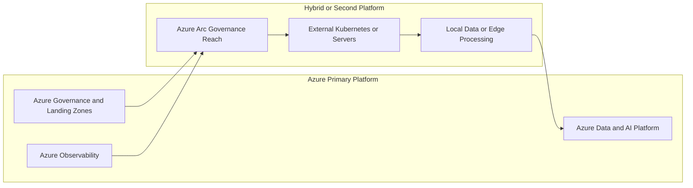
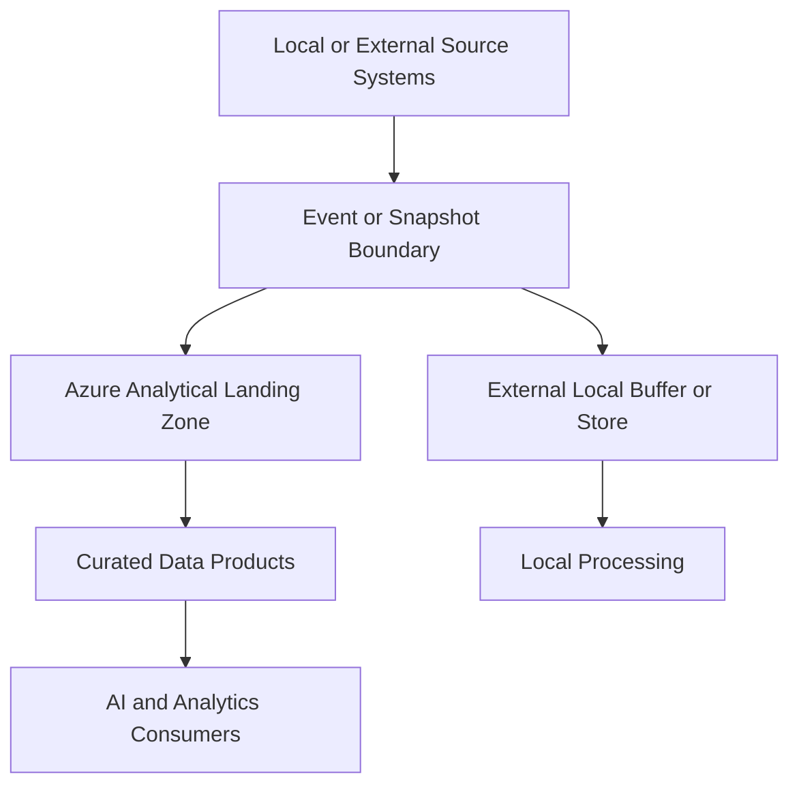
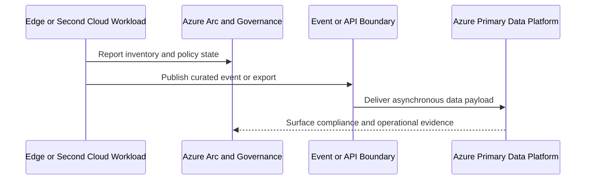

# Multi-Cloud and Hybrid Architecture

> Part of the **Enterprise Data & AI Architecture Handbook** · Phase-03 - Cloud & Azure Architecture · Chapter 08.
> Estimated study time: **60 min reading + ~3h labs**.
> **Prerequisites:** read [Azure Landing Zones](03_Azure_Landing_Zones.md) first.

---

## Executive Summary

Multi-cloud and hybrid architecture is one of the most misunderstood topics in enterprise technology. Many organizations describe it as a resilience strategy, a negotiation strategy, a compliance strategy, or a portability strategy without separating which of those they actually need. In practice, most enterprises do not need symmetric multi-cloud platforms. They need a disciplined way to combine Azure with existing datacenters, SaaS control planes, regional constraints, edge locations, acquired environments, or selective second-cloud workloads without turning architecture into permanent translation overhead.

The first useful distinction is between hybrid and multi-cloud. Hybrid architecture combines public cloud with on-premises, edge, or hosted private environments. Multi-cloud architecture spans two or more public-cloud providers. These are not the same operating model and should not be justified with the same language. Hybrid is often driven by latency, sovereignty, regulated systems, existing hardware estates, industrial integration, or migration sequencing. Multi-cloud is often driven by acquisitions, customer-mandated deployment options, uneven service availability, strategic platform risk, or product-specific fit. Treating both as a generic "avoid lock-in" program is how enterprises create broad complexity without proportionate value.

Azure-first enterprises should assume deep Azure integration by default and then make explicit exceptions where hybrid or multi-cloud is worth the cost. Azure Arc matters because it extends governance, policy, inventory, and operational visibility across non-Azure resources without pretending all environments are identical. Data gravity and egress economics matter because data rarely moves as cheaply or as quickly as architecture slides imply. Portability also has layers: container portability is not data portability; IaC portability is not operational portability; API portability is not governance portability.

The strongest enterprise stance is usually selective, not ideological. Use Azure deeply where Azure is the strategic operating platform. Use Azure Arc and hybrid control-plane patterns where control needs to span locations. Use multi-cloud only where a concrete business, legal, latency, platform, or resilience need justifies the operational and economic overhead. Design around bounded domains, asynchronous data exchange, and explicit topology choices rather than around fantasy full-cloud interchangeability.

## Learning Objectives

By the end of this chapter you will be able to:

1. Distinguish hybrid architecture from multi-cloud architecture using business and operational criteria.
2. Identify valid drivers and weak anti-drivers for multi-cloud adoption.
3. Explain how Azure Arc extends governance and control-plane reach across hybrid environments.
4. Evaluate data gravity, latency, and egress economics as first-class architectural constraints.
5. Separate portability goals into runtime, data, IaC, identity, and operational layers.
6. Choose reference topologies for selective multi-cloud data exchange and hybrid integration.
7. Recognize anti-patterns such as symmetric multi-cloud by default and fake portability narratives.
8. Build reviewable Azure-first recommendations that still allow targeted second-cloud or on-premises integration.
9. Map governance, security, and cost concerns across hybrid and multi-cloud estates.
10. Use Azure-first implementation patterns without pretending Azure and other platforms are operationally identical.

## Business Motivation

- Many enterprises already have hybrid reality because critical systems, factories, branches, or acquired datacenters still exist.
- Some industries need workload placement choices driven by residency, latency, sovereign-cloud availability, or regulatory requirements.
- Large platforms sometimes need selected second-cloud services because of geographic coverage, customer requirements, or specialized managed capabilities.
- Azure-first organizations need a way to extend governance without replatforming every asset immediately.
- Data and AI platforms create strong data-gravity effects, making placement and movement economics strategic rather than incidental.
- Architecture reviews become more credible when multi-cloud is justified by explicit constraints instead of negotiation folklore.

## History and Evolution

- Early enterprise hybrid patterns focused on network extension, directory federation, and lift-and-shift coexistence between datacenters and public cloud.
- Public-cloud adoption initially concentrated on single-cloud modernization because operating one cloud well was already difficult enough.
- As organizations acquired other companies, entered regulated markets, or diversified vendor relationships, multi-cloud became more common as a consequence rather than as a clean-slate design goal.
- Kubernetes, Terraform, and service-mesh ecosystems encouraged a portability narrative, but many teams later discovered that runtime portability did not eliminate data, identity, and operations divergence.
- Azure Arc expanded the Azure control plane beyond Azure-hosted resources, making hybrid governance more practical without requiring symmetric infrastructure.
- Data-platform and AI-platform growth increased pressure on data locality, egress economics, and cross-environment governance, especially for training data, artifacts, model serving, and retrieval corpora.
- The current mature pattern is selective multi-cloud or hybrid design with explicit asymmetry rather than universal platform sameness.

## Why This Technology Exists

Multi-cloud and hybrid architecture exists because real enterprises do not operate on blank paper. They inherit datacenters, industrial systems, regulated zones, partner platforms, acquisitions, and customer commitments. Not every workload should move immediately. Not every service is best delivered from one cloud. Not every region is equally available, affordable, or legally acceptable. The architecture therefore needs patterns for spanning boundaries without pretending the boundaries do not matter.

It also exists because resilience, bargaining power, and platform fit are sometimes legitimate concerns. The critical nuance is that different concerns justify different designs. A second cloud for market access is not the same as a second cloud for disaster recovery. Azure Arc for governance over Kubernetes clusters is not the same as application portability across data platforms. On-premises edge processing for latency-sensitive industrial workloads is not the same as keeping an old VM farm alive indefinitely.

As established in [Azure Landing Zones](03_Azure_Landing_Zones.md), platform boundaries, subscriptions, connectivity, and shared services must be deliberate. Multi-cloud and hybrid architecture extends that principle across clouds and non-cloud locations. The decision is never just whether something can run elsewhere. The real question is whether the business value of spanning environments exceeds the permanent cost of doing so.

## Problems It Solves

- Supports staged modernization where some workloads or data must remain outside Azure temporarily or indefinitely.
- Enables selective deployment across clouds or on-premises when legal, latency, or commercial drivers require it.
- Extends governance and inventory through Azure Arc and hybrid control-plane patterns.
- Reduces concentration risk for specific high-value or customer-constrained workloads when done carefully.
- Allows data and AI platforms to keep certain datasets or inference paths closer to local systems or regulated boundaries.
- Provides migration patterns that do not require one-shot replatforming.

## Problems It Cannot Solve

- It cannot make two clouds operationally identical.
- It cannot remove egress cost, latency, and data-consistency trade-offs.
- It cannot make skill depth free; operating two clouds well usually requires more than double the governance thought.
- It cannot provide simple failover for stateful platforms without explicit cross-cloud data and identity design.
- It cannot justify itself through vague anti-lock-in language when workload reality is still provider-specific.
- It cannot fix poor platform ownership or weak architecture standards.

## Core Concepts

### Drivers and Anti-Drivers for Multi-Cloud

Legitimate drivers include:

- regulatory or sovereign placement requirements,
- merger or acquisition integration,
- customer-mandated deployment options,
- specialized service or regional capability gaps,
- bounded concentration-risk reduction for selected workloads,
- edge or industrial integration needs that favor hybrid placement.

Weak anti-drivers include:

- generic fear of lock-in with no migration budget,
- desire to keep every option open forever,
- belief that portability comes free with containers alone,
- assumption that symmetric multi-cloud automatically improves resilience.

### Azure Arc and Hybrid Control Planes

Azure Arc extends Azure governance and management patterns to servers, Kubernetes clusters, data services, and selected application services outside Azure. The architectural value is not that non-Azure environments become Azure. The value is that policy, inventory, deployment, security posture, and operational visibility can be centralized more coherently.

Azure Arc is especially useful when an enterprise wants:

- one governance plane for heterogeneous estates,
- policy and tagging consistency,
- deployment control over Kubernetes clusters in multiple environments,
- extended security and inventory visibility,
- migration pathways that avoid immediate full replatforming.

### Data Gravity and Egress Economics

Data gravity means large, frequently accessed, security-sensitive datasets attract compute and dependent services toward themselves. In multi-cloud architecture, data gravity punishes naïve portability. Moving petabytes, retraining models across clouds, duplicating lakehouses, or synchronizing hot operational datasets is rarely a trivial line item. Egress charges, latency, transfer windows, and consistency models must be treated as architecture inputs from day one.

### Portability Versus Deep Native Integration

Portability has layers:

- runtime portability: containers or VMs can run elsewhere,
- deployment portability: IaC or GitOps patterns can target multiple environments,
- data portability: schemas, object layout, table formats, and replication models can move or interoperate,
- operational portability: teams can actually observe, secure, and support the system elsewhere,
- identity and governance portability: access models and policy controls translate acceptably.

Deep native integration is often rational. Azure-native security, networking, identity, and data services can be dramatically more efficient than a lowest-common-denominator design. The key is knowing where deep integration creates durable value and where it creates avoidable dependence.

### Reference Multi-Cloud Data Topologies

Common patterns include:

- hub control plane with domain-local data planes,
- event-driven cross-cloud integration rather than synchronous dual writes,
- local edge processing with central analytical consolidation,
- regional or sovereign split where only metadata or aggregate outputs cross boundaries,
- selective second-cloud workloads with shared identity and policy overlays where possible.

## Internal Working

Hybrid and multi-cloud systems work by decomposing control planes, data planes, and trust boundaries rather than by pretending they can be unified fully. A hybrid control plane may centralize governance, inventory, policy, and deployment orchestration while leaving data paths local to Azure, on-premises, or another cloud. Azure Arc is one example of this design: it extends policy and management without eliminating the underlying platform differences.

Data-plane behavior is where many architectures fail. Cross-cloud or cross-premises synchronization introduces latency, replication windows, conflict handling, transfer failure modes, and cost accumulation. Event-driven integration and derived-data replication usually behave better than hot synchronous shared-state patterns. That is why mature topologies often keep source-of-truth ownership local and exchange events, snapshots, aggregates, or model artifacts rather than trying to make all platforms act like one enormous LAN.

Identity is another split plane. Human identity may be centrally governed through Entra and federation, but workload identity, service principals, IAM roles, certificates, and key-management workflows usually remain provider-specific. A portable application that still requires totally different secret, role, and audit designs across environments is only partially portable.

Operationally, multi-cloud works only when the organization decides what is standardized and what is intentionally asymmetric. Tooling, SLOs, telemetry schema, ADR format, and incident process may be standardized. Underlying storage replication, networking, GPU quota management, or managed data-service semantics usually cannot be standardized fully. Good architecture acknowledges that gap rather than hiding it behind a platform slogan.

## Architecture

An Azure-first multi-cloud and hybrid architecture usually has four structural layers:

1. governance and control layer using Azure landing zones, Azure Arc, policy, identity, and central telemetry;
2. connectivity layer spanning Azure networking, on-premises connectivity, and approved external-cloud paths;
3. workload layer where each platform hosts workloads according to business fit and local constraints;
4. data-exchange layer using event streams, object exchange, APIs, or snapshot replication rather than universal shared state.

For data and AI platforms, a pragmatic reference architecture is:

- Azure as the primary analytics, governance, and identity platform,
- Azure Arc to extend policy and inventory over external Kubernetes or server estates,
- domain-local storage and compute in secondary clouds or on-premises only where justified,
- asynchronous movement of curated datasets, features, embeddings, logs, or aggregates into Azure-centered analytical domains,
- explicit separation between experimentation and regulated production when different locations or clouds are involved.

The architecture should make asymmetry explicit. Azure does not need to be mirrored perfectly elsewhere to support a good hybrid or multi-cloud outcome.

## Components

| Component | Responsibility | Azure-first guidance | Common risk |
|---|---|---|---|
| Azure landing zones | Primary governance and Azure workload structure | Keep Azure as the main policy and workload host where it is strategic | Assuming Azure landing zones can govern everything without Arc or federation |
| Azure Arc-enabled servers | Hybrid governance for non-Azure servers | Use for inventory, policy, and operational standardization | Treating Arc as equivalent to migration |
| Azure Arc-enabled Kubernetes | Governance and deployment reach across clusters | Useful for cross-environment cluster policy and app deployment | Ignoring platform differences below the control plane |
| ExpressRoute, VPN, or partner connectivity | Hybrid path between environments | Use only where latency, compliance, or data exchange require it | Treating network reachability as workload portability |
| Event streaming or integration backbone | Asynchronous exchange between domains | Prefer event-driven over synchronous tight coupling | Creating hidden cross-cloud dependency loops |
| Object-store exchange pattern | Bulk or staged data movement | Use for snapshots, artifacts, curated exports, and lineage-safe exchange | Unpriced egress and slow transfer windows |
| Identity federation | Human and workload trust alignment | Keep human identity centralized where feasible | Assuming workload identity semantics align automatically |
| Cost and observability layer | Cross-environment operational evidence | Standardize schema and review process more than tooling brand | Fragmented telemetry and unclear spend ownership |

## Metadata

Multi-cloud and hybrid systems need metadata that explains placement and movement intent.

Recommended metadata includes:

| Metadata | Why it matters |
|---|---|
| `platformLocation` | Distinguishes Azure, onprem, edge, or second cloud placement |
| `sourceOfTruth` | Clarifies authoritative system for data domains |
| `dataResidencyClass` | Drives legal and operational movement constraints |
| `egressOwner` | Makes transfer cost accountable |
| `syncPattern` | event, batch, snapshot, api, or none |
| `portabilityClass` | runtime-only, deployment, data, or operational portability target |
| `recoveryLocation` | Names intended secondary site or cloud |
| `identityTrustModel` | Documents federation and delegated-auth assumptions |
| `latencyClass` | Indicates local, regional, cross-region, or cross-cloud sensitivity |

Without this metadata, platforms look connected while remaining architecturally ambiguous.

## Storage

Storage is where hybrid and multi-cloud complexity becomes expensive fastest.

Key principles:

- avoid bi-directional hot synchronization unless the business case is exceptional,
- prefer open or semi-open data formats where cross-platform analytical portability is a real requirement,
- keep bulk data local to the compute that uses it most often,
- treat backup, archive, curated export, and operational source-of-truth storage as separate concerns,
- design object and table portability deliberately rather than assuming one vendor’s service semantics map cleanly to another’s.

For data platforms, lakehouse portability is usually less about moving every table constantly and more about using interoperable formats, clear lineage, and controlled replication boundaries.

## Compute

Compute portability is not binary. Containers and Kubernetes improve runtime mobility, but they do not erase differences in networking, storage semantics, IAM, cost, or operational tooling.

Practical compute guidance:

- keep stateless APIs and event consumers more portable than stateful data services,
- use AKS or Kubernetes portability where it solves a real requirement, not as a universal mandate,
- use Azure Arc or GitOps patterns to standardize deployment across heterogeneous cluster locations where justified,
- isolate GPU-intensive AI workloads where the right hardware, quota, or local policy exists,
- avoid designing every runtime against the least capable common denominator.

Compute should follow business fit and data gravity, not portability theater.

## Networking

Networking is one of the main reasons multi-cloud aspirations fail operationally.

- cross-cloud latency is real and often nontrivial,
- egress is billable and frequently underestimated,
- transitive trust and DNS assumptions break quickly across environments,
- private connectivity is feasible but not free,
- centralized inspection can become a global chokepoint if stretched too far.

Strong patterns usually involve:

- explicit integration points rather than full-mesh connectivity,
- separate operational networks from data-exchange paths,
- event and API boundaries instead of broad east-west assumptions,
- clear ownership of DNS, certificates, and route changes.

## Security

Security in multi-cloud and hybrid estates requires clarity on what is centralized and what is provider-local.

Good posture usually includes:

- central human identity and access-review discipline,
- provider-local workload identity patterns handled explicitly,
- key-management boundaries documented clearly,
- data movement reviewed as seriously as data-at-rest controls,
- telemetry and audit evidence normalized enough for enterprise review,
- platform-specific security features used where they materially improve posture.

The common failure is building a weak portable baseline instead of using strong native controls with explicit interoperability design.

## Performance

Performance in multi-cloud and hybrid environments is dominated by placement and movement.

- data-local compute usually beats remote compute plus transfer,
- edge inference usually beats central round trips where latency is strict,
- analytical consolidation can be efficient if movement is batched and curated,
- synchronous cross-cloud paths are usually performance and resilience liabilities.

Performance review should start with data location and call path, not with VM size or SKU tuning.

## Scalability

Scalability in multi-cloud or hybrid design is not just more nodes. It is the ability to grow without multiplying coordination cost faster than business value.

Questions to ask:

- can the governance model scale across environments?
- do telemetry and incident processes still work when two control planes are involved?
- can data exchange patterns handle volume growth without exploding egress spend?
- are portability decisions making every workload slower to evolve?

The scalable design is almost always selective and standardized at the boundary, not universally portable everywhere.

## Fault Tolerance

Hybrid and multi-cloud fault tolerance must distinguish:

- resilience within one platform,
- failover across sites,
- failover across clouds,
- tolerance for degraded local operation when central services are unreachable.

Using a second cloud does not automatically create a usable DR posture. Identity, data consistency, DNS, certificates, automation, and operator readiness all need to work across the boundary. Many enterprises are better served by strong Azure regional resilience plus targeted hybrid continuity patterns than by expensive symmetric multi-cloud duplicates.

## Cost Optimization

Cost optimization is often the most underestimated pillar in multi-cloud and hybrid architecture.

Primary cost drivers include:

- cross-cloud and outbound egress,
- duplicated platform tooling,
- duplicated skills and support models,
- duplicated observability and security controls,
- idle standby environments kept for portability narratives,
- data replication and synchronization overhead.

Good multi-cloud design uses the second platform sparingly enough that the cost has a clear owner and purpose.

## Monitoring

Monitoring should expose both platform-local health and cross-platform dependency health.

Important signals include:

- connectivity and replication lag,
- queue or event exchange health,
- identity and certificate failures,
- egress volume and unexpected transfer patterns,
- workload placement drift,
- cost anomalies by environment,
- policy compliance for Azure Arc-managed assets.

The goal is not one giant dashboard of every metric. The goal is evidence strong enough to tell whether the boundary itself is the problem.

## Observability

Observability must preserve causality across environment boundaries.

Good practice includes:

- correlation IDs that survive API, event, and batch exchange,
- standardized telemetry fields for platform location, tenancy, and data domain,
- tracing of data freshness and lag across cloud boundaries,
- explicit logging of who initiated replication, export, or failover actions,
- topology-aware dashboards rather than single-cloud assumptions.

For data and AI systems, observability should also include model version distribution, feature or embedding freshness, and cross-environment lineage breaks.

## Governance

Governance is what keeps hybrid and multi-cloud from becoming exception sprawl.

Recommended governance mechanisms:

- explicit approval criteria for second-cloud or on-prem placement,
- Azure Arc and policy where centralized control-plane visibility is valuable,
- architecture review that requires drivers, anti-drivers, cost model, and exit criteria,
- bounded portability goals stated up front,
- platform ownership that names who supports the boundary itself,
- documented data-movement and recovery patterns.

### ADR Example

**Context:** An Azure-first enterprise supports a regulated manufacturing business with factory-edge systems, a central Azure analytics platform, and one customer-facing product that must also deploy in another cloud for contractual reasons. A broad multi-cloud initiative is proposed to avoid lock-in across the entire portfolio.

**Decision:** Keep Azure as the primary cloud and control plane. Use Azure Arc for hybrid governance over edge and external Kubernetes estates. Limit second-cloud deployment to the customer-constrained product and design it around portable containers, asynchronous data exchange, and provider-local data services where appropriate. Keep central analytics, governance, and most internal platforms Azure-native.

**Consequences:** The enterprise avoids platform-wide portability tax while still satisfying real hybrid and customer-driven multi-cloud requirements. The trade-off is asymmetric architecture that requires explicit documentation and strong boundary design.

**Alternatives:**

1. Full symmetric multi-cloud platform for all workloads. Rejected because cost and operational duplication exceed value.
2. Azure-only posture for every workload. Rejected because certain customer and edge constraints are real.
3. Full decentralization by product team. Rejected because governance and support would fragment.

## Trade-offs

| Decision area | Option A | Option B | Real trade-off |
|---|---|---|---|
| Cloud strategy | Azure-first with selective exceptions | Symmetric multi-cloud baseline | Lower complexity versus broader optionality at much higher cost |
| Data movement | Local source of truth with asynchronous exchange | Shared hot cross-cloud state | Better reliability and economics versus stronger global coupling illusion |
| Control plane | Central Azure governance with Arc | Fully separate governance per environment | More consistency versus less central dependency |
| Portability goal | Bounded portability by workload class | Universal portability | Higher realism versus higher abstraction ambition |
| DR strategy | Strong regional Azure design plus selective hybrid patterns | Full second-cloud duplication | Lower cost and simpler operations versus broader but harder failover story |
| AI platform | Local training or inference where data and hardware fit best | Uniform AI runtime everywhere | Better fit and economics versus simpler but weaker standardization |

## Decision Matrix

| Scenario | Recommended posture | Why |
|---|---|---|
| Standard enterprise internal platforms | Azure-first, no second cloud unless forced | Complexity budget should be spent elsewhere |
| Regulated edge or factory systems | Hybrid with Arc-enabled governance and local processing | Latency and local control matter |
| Customer-mandated alternative-cloud deployment | Selective multi-cloud for that product only | Business requirement is bounded and explicit |
| Large analytical lakehouse | Keep primary analytics plane close to primary data gravity center | Cross-cloud duplication is expensive and operationally messy |
| Disaster recovery concern for general workloads | Strong Azure regional resilience first, second cloud only for selected cases | Second cloud is not free resilience |
| AI inference near local assets or sovereign domains | Hybrid or selective secondary placement | Data locality and compliance may dominate |

## Design Patterns

1. Azure-first control plane with selective Arc-managed hybrid extensions.
2. Event-driven cross-cloud integration instead of synchronous shared state.
3. Domain-local source of truth with curated export or replication.
4. Edge processing with central analytical consolidation.
5. Portable container runtime only where product distribution requires it.
6. Separate governance of experimentation and regulated production across locations.
7. Explicit egress-owner tagging and cost review.
8. Data-format portability through open table or object conventions where justified.
9. Local managed services with common review standards rather than forced identical service selection.
10. Bounded escape-hatch patterns rather than enterprise-wide portability mandates.

## Anti-patterns

- Symmetric multi-cloud by default for all workloads.
- Declaring lock-in avoidance as a strategy without a funded portability plan.
- Forcing the same architecture on products with radically different placement needs.
- Synchronous cross-cloud database or storage coupling without exceptional justification.
- Ignoring egress economics until after data movement is live.
- Treating Azure Arc as migration complete.
- Building one giant shared integration fabric across every environment.
- Standardizing on the least capable common denominator to preserve theoretical portability.
- Using a second cloud as a disaster-recovery slogan instead of a tested operating model.
- Letting platform boundaries exist without named owners.

## Common Mistakes

- Overestimating how portable managed data services really are.
- Underestimating data-movement cost and latency.
- Copying Kubernetes everywhere without solving identity, storage, or operations equivalence.
- Designing network reachability and calling it architecture.
- Centralizing governance without documenting provider-local responsibilities.
- Ignoring how acquisitions change identity, DNS, and address-space assumptions.
- Failing to define which workloads are allowed to remain asymmetric.
- Using hybrid to preserve legacy indefinitely with no modernization intent.
- Skipping exit criteria for temporary hybrid patterns.
- Treating every workload as strategic enough to justify multi-cloud complexity.

## Best Practices

- Default to Azure-first unless a real constraint disproves it.
- State the specific business driver for every hybrid or second-cloud decision.
- Keep data local and exchange events, snapshots, or curated outputs where possible.
- Use Azure Arc where centralized governance is useful, but do not confuse governance reach with platform sameness.
- Limit portability goals to the layers that matter for the workload.
- Make egress and replication cost visible from day one.
- Keep second-cloud usage product-bounded unless a broader case is provably justified.
- Test failover and degraded operation at the boundary, not only inside one cloud.
- Standardize telemetry and review processes before standardizing tooling brands.
- Publish exit or re-evaluation criteria for hybrid patterns.

## Enterprise Recommendations

An opinionated enterprise recommendation set for multi-cloud and hybrid architecture is:

| Area | Recommendation |
|---|---|
| Default strategy | Azure-first, not cloud-neutral by default |
| Hybrid governance | Use Azure Arc selectively for centralized policy, inventory, and cluster governance |
| Workload placement | Require explicit driver and owner for any non-Azure primary placement |
| Data movement | Prefer asynchronous integration and domain-local source-of-truth patterns |
| DR | Strengthen Azure regional resilience before pursuing symmetric second-cloud DR |
| Portability | Define bounded portability targets by workload class and layer |
| Cost | Track egress, duplicate tooling, and duplicated operational ownership explicitly |
| AI and data | Keep analytical gravity and model artifact gravity visible in platform decisions |
| Operations | Assign ownership to the boundary, not only to each side of the boundary |
| Review | Re-review multi-cloud and hybrid exceptions annually or after major incidents or cost shifts |

## Azure Implementation

Azure implementation should emphasize governance reach, selective connectivity, and bounded workload placement.

Representative Azure tools and services:

- Azure Arc for servers, Kubernetes, and selected data services.
- Azure Policy and management groups for governance consistency.
- ExpressRoute, VPN Gateway, or approved private connectivity for hybrid paths.
- Event Hubs, Service Bus, Data Factory, Logic Apps, or API Management for cross-boundary integration depending pattern.
- Azure Monitor, Log Analytics, and Defender for unified operational visibility.
- Azure landing zones as the primary Azure platform structure.

Example Azure CLI for connecting an Arc-enabled Kubernetes cluster is environment-specific, but the broader control-plane pattern is to onboard the external cluster into Azure governance, then apply policy, inventory, and deployment standards rather than rebuild the entire application platform first.

Example Bicep snippet for tagging and policy alignment at management-group scope:

```bicep
targetScope = 'managementGroup'

resource requirePlatformLocationTag 'Microsoft.Authorization/policyDefinitions@2023-04-01' = {
  name: 'require-platform-location-tag'
  properties: {
    policyType: 'Custom'
    mode: 'Indexed'
    displayName: 'Require platformLocation tag'
    policyRule: {
      if: {
        field: 'tags.platformLocation'
        exists: false
      }
      then: {
        effect: 'deny'
      }
    }
  }
}
```

Example Terraform concept for standard tagging on cross-boundary integration resources:

```hcl
locals {
  common_tags = {
    owner            = "platform-architecture"
    environment      = "prod"
    platformLocation = "azure"
    egressOwner      = "data-platform"
    syncPattern      = "event"
  }
}
```

Example Azure integration guidance:

- keep Azure as the primary analytics and governance plane,
- use Arc to extend standards to external Kubernetes or server estates where useful,
- choose event-driven integration or curated export first,
- document any direct synchronous dependency as an exception.

## Open Source Implementation

Open-source technologies are often the portability layer in selective multi-cloud designs.

Relevant patterns include:

- Kubernetes for bounded runtime portability.
- Terraform for multi-environment IaC with provider-specific modules rather than fake universal modules.
- OpenTelemetry for common telemetry schema across clouds.
- Kafka or other event backbones for asynchronous cross-platform exchange where justified.
- Delta Lake, Apache Iceberg, or Apache Hudi for portable analytical table semantics when multiple compute environments need to read shared or replicated datasets.
- PostgreSQL, Redis, or other OSS components where product-level portability requirements are real and supported operationally.

The architectural warning is important: OSS can reduce one layer of lock-in while increasing operating burden. Use it where portability is worth that cost.

Example OpenTelemetry resource attributes for topology-aware observability:

```yaml
resource:
  attributes:
  - key: cloud.provider
    value: azure
  - key: platform.location
    value: hybrid
  - key: portability.class
    value: runtime-and-data-boundary
```

Example GitHub Actions concept for provider-bounded Terraform validation:

```yaml
name: validate-hybrid-topology

on:
  pull_request:
    paths:
    - infra/**

jobs:
  validate:
    runs-on: ubuntu-latest
    steps:
    - uses: actions/checkout@v4
    - uses: hashicorp/setup-terraform@v3
    - run: terraform -chdir=infra fmt -check
    - run: terraform -chdir=infra init -backend=false
    - run: terraform -chdir=infra validate
```

## AWS Equivalent (comparison only)

| Azure concept | AWS equivalent | Where Azure is typically stronger | Where AWS is typically stronger | Migration note |
|---|---|---|---|---|
| Azure Arc | AWS Systems Manager, EKS Anywhere, and related hybrid-management patterns | Strong unified governance story for Azure-first estates | Broader set of separate hybrid tools in some AWS patterns | Map governance intent, not brand equivalence |
| Azure landing zones plus Arc | AWS Organizations plus Control Tower plus hybrid tooling | Strong Azure-first policy continuity | Mature multi-account operating patterns | Keep scope and ownership model explicit |
| Event-driven cross-boundary integration | EventBridge, SQS, SNS, MSK, or API patterns depending need | Strong Azure integration when Azure is primary | Broader AWS integration ecosystem in some scenarios | Prefer loose coupling during migration |
| Azure-first asymmetric strategy | AWS-first asymmetric strategy | Strong Microsoft ecosystem fit | Strong AWS-native service depth where AWS is primary | Choose a real primary platform instead of theoretical neutrality |

## GCP Equivalent (comparison only)

| Azure concept | GCP equivalent | Where Azure is typically stronger | Where GCP is typically stronger | Migration note |
|---|---|---|---|---|
| Azure Arc | Anthos and related hybrid-management patterns | Strong enterprise governance alignment in Azure-first estates | Strong Kubernetes-centric hybrid story in some GCP cases | Compare operational model, not marketing category |
| Azure landing zones plus Arc | Organization, folders, projects, and Anthos or hybrid tooling | Strong Azure control continuity | Strong project-centric and Kubernetes-centric management patterns | Translate governance and ownership boundaries explicitly |
| Azure-first hybrid analytics control plane | GCP-centered hybrid analytics pattern | Good fit when Azure is already the enterprise platform | Strong data and ML ecosystem in GCP-centered designs | Keep data-gravity and transfer economics explicit |
| Event-driven data exchange | Pub/Sub and API-driven integration patterns | Azure-native integration fit | Strong event and analytics ecosystem in some GCP scenarios | Keep asynchronous boundary patterns portable |

## Migration Considerations

Migration to hybrid or multi-cloud architecture should start with classification, not enthusiasm.

1. Identify which workloads are truly constrained by hybrid or second-cloud needs.
2. Define the primary platform and the reason any exception exists.
3. Choose portability goals by layer: runtime, data, IaC, identity, or operations.
4. Inventory data-movement cost, transfer windows, and sovereignty constraints early.
5. Use Azure Arc or equivalent governance-extension mechanisms before building custom shadow control planes.
6. Pilot one bounded topology before broad adoption.
7. Document exit criteria for temporary hybrid states.
8. Re-test cost and resilience assumptions after the first production quarter.

Migration is complete only when the cross-boundary architecture is supportable, measured, and intentionally limited to real business need.

## Mermaid Architecture Diagrams







## End-to-End Data Flow

An end-to-end hybrid or multi-cloud data path usually works like this:

1. A workload remains local to a second cloud, edge site, or on-premises environment because of latency, sovereignty, or customer constraint.
2. Azure Arc or another approved governance mechanism extends inventory and policy visibility over that environment.
3. Source-of-truth data remains local for operational reasons, while events, snapshots, or curated datasets are exported asynchronously.
4. Azure receives those exports into a governed analytical or AI platform.
5. Central reporting, model training, or broader enterprise analytics occurs primarily in Azure.
6. Results, aggregates, or model artifacts may flow back to the local environment if the use case demands it.
7. Monitoring, cost tracking, and architecture review treat the boundary itself as a managed product rather than as an invisible tunnel.

This flow is what keeps hybrid practical and multi-cloud bounded.

## Real-world Business Use Cases

1. Factory-edge analytics where local processing must continue during WAN disruption but central reporting happens in Azure.
2. Customer-constrained SaaS deployment where one product must also run in another cloud while the enterprise platform remains Azure-first.
3. Acquisition integration where acquired workloads stay in place temporarily while governance and telemetry are centralized gradually.
4. Sovereign or regulated workloads where sensitive operational data stays local while aggregates or approved derivatives move centrally.
5. AI inference near physical assets or private datasets with central model governance and retraining in Azure.

## Industry Examples

- Retail, industrial, and energy companies often keep local operational systems near stores, plants, or field assets while consolidating analytics centrally.
- Large SaaS vendors sometimes support selected second-cloud deployment options only for specific products or customer segments rather than for the entire platform.
- Enterprises with significant acquisition activity often become hybrid or multi-cloud by inheritance, making governance-extension patterns more valuable than immediate forced standardization.
- Data-platform teams frequently adopt open table formats or containerized runtimes selectively where analytics or product distribution boundaries genuinely cross cloud providers.
- Organizations that succeed with hybrid usually keep their topology simple and their business driver explicit.

## Case Studies

### Case Study 1: Dropbox Leaving AWS for Owned Infrastructure

Dropbox's well-known repatriation story showed that cloud strategy is workload-specific and economics-specific, not ideological. The lesson for hybrid architecture is that placement can rationally change when scale, data gravity, and unit economics change enough.

### Case Study 2: Capital One Style Cloud Governance Lesson

Even though Capital One is primarily discussed in an AWS context, the transferable lesson is that governance and policy standardization matter more than provider-neutral rhetoric. Multi-environment success depends on disciplined boundaries, not on slogans about choice.

### Case Study 3: Industrial Edge Analytics Pattern

Many industrial enterprises keep operational control loops local because cloud round-trip latency and intermittent connectivity make central-only control unacceptable. The lesson is that hybrid architectures are often correct when local continuity is a physical business requirement, not a political compromise.

## Hands-on Labs

1. Define a workload inventory and classify which systems truly need hybrid or second-cloud placement.
2. Design an Azure Arc-centered governance model for a small external Kubernetes estate.
3. Compare synchronous API integration versus event-driven exchange for a cross-cloud data flow.
4. Model egress cost for a large dataset moving daily versus weekly versus on-demand.
5. Create an ADR for a product that must support customer-specific second-cloud deployment.
6. Design a hybrid edge analytics pattern that can operate disconnected temporarily.

## Exercises

1. Explain the difference between hybrid and multi-cloud in operational terms.
2. List three valid drivers and three weak anti-drivers for multi-cloud.
3. Write an ADR choosing Azure-first asymmetry over symmetric multi-cloud.
4. Identify where data gravity would stop you from moving a platform casually.
5. Compare runtime portability with operational portability.
6. Explain why a second cloud is not automatically a disaster-recovery strategy.
7. Design a metadata model that tracks cross-boundary data movement intent.
8. Decide which parts of your current estate should remain intentionally non-portable.

## Mini Projects

1. Build a selective multi-cloud decision guide that classifies when second-cloud placement is justified.
2. Design a hybrid data-topology blueprint using Azure as the central analytics platform and local edge processing at the boundary.
3. Create an Arc-enabled governance proposal for one inherited non-Azure or on-premises platform segment.

## Capstone Integration

This chapter closes Phase-03 by turning Azure-first cloud architecture into a boundary-aware enterprise strategy. [Azure Landing Zones](03_Azure_Landing_Zones.md) defines how Azure itself is structured and governed. Multi-cloud and hybrid architecture defines when those boundaries should be extended, bridged, or selectively crossed.

The result should be a platform strategy that is disciplined rather than doctrinaire: Azure where Azure is the best primary platform, hybrid where locality or regulation demands it, and multi-cloud only where explicit business value outweighs the permanent portability tax.

## Interview Questions

1. What is the real difference between hybrid and multi-cloud architecture?
2. When is multi-cloud a business requirement rather than an architectural preference?
3. What does Azure Arc solve, and what does it not solve?
4. Why is data gravity one of the strongest arguments against casual multi-cloud design?
5. How do portability and deep native integration conflict?
6. Why is a second cloud not automatically a resilience plan?
7. How would you explain egress economics to a product team that wants cross-cloud replication by default?
8. What signals tell you a multi-cloud strategy is creating more complexity than value?

## Staff Engineer Questions

1. How would you decide whether a workload deserves a portability requirement at all?
2. What cross-cloud integration pattern would you choose for a high-volume analytics feed and why?
3. How would you use Azure Arc without pretending it removes platform asymmetry?
4. What metadata and telemetry are essential to operate a hybrid data boundary safely?
5. How would you constrain a second-cloud requirement to one product rather than one enterprise platform?
6. What recovery design would you require before accepting second-cloud DR claims?
7. How would you price the ongoing tax of multi-cloud operations for architecture review?
8. What would make you recommend repatriation or consolidation after an inherited multi-cloud period?

## Architect Questions

1. What is the enterprise default cloud strategy and what exceptions are allowed?
2. Which workloads should remain Azure-native and intentionally non-portable?
3. How do you govern hybrid and multi-cloud exceptions so they stay bounded?
4. When should data stay local and when should it consolidate centrally?
5. What is your identity, policy, and telemetry baseline across non-Azure environments?
6. How do you separate customer-driven second-cloud needs from internally imagined future optionality?
7. What review evidence do you require before approving a new cross-cloud dependency?
8. How should AI workloads be classified when model serving, training, and data locality differ by location?

## CTO Review Questions

1. Are we pursuing multi-cloud for a real business reason or for strategic theater?
2. Which current hybrid patterns are temporary bridges and which are becoming permanent platforms?
3. Do we know the true cost of data movement, duplicated tooling, and duplicated skills across environments?
4. Where are we overpaying for portability we do not use?
5. Which products genuinely need second-cloud support, and which should standardize more deeply on Azure?
6. If Azure were impaired regionally tomorrow, which workloads truly need non-Azure continuity and which only need stronger Azure resilience?
7. Are our cross-boundary architectures owned as products, or left as integration side effects?
8. Which hybrid or multi-cloud decisions should be retired in the next 12 months?

## References

- Microsoft Azure Arc documentation and hybrid-management guidance.
- Azure landing zones and enterprise-scale governance guidance.
- Cloud economics and FinOps guidance relevant to data egress and duplicated platform cost.
- Public architecture discussions on hybrid cloud, edge processing, repatriation, and selective multi-cloud operation.
- Kubernetes, Terraform, and observability ecosystem guidance relevant to bounded portability patterns.

## Further Reading

- Re-read [Azure Landing Zones](03_Azure_Landing_Zones.md) and identify which governance patterns should extend beyond Azure and which should remain Azure-local.
- Review your current estate for accidental hybrid or multi-cloud complexity before designing any deliberate expansion.
- Study provider documentation for Azure Arc, hybrid networking, and selective portability tooling through the lens of your actual business constraints.