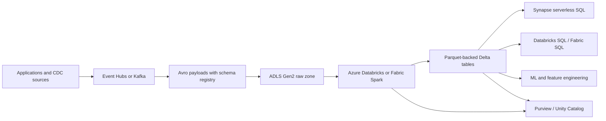
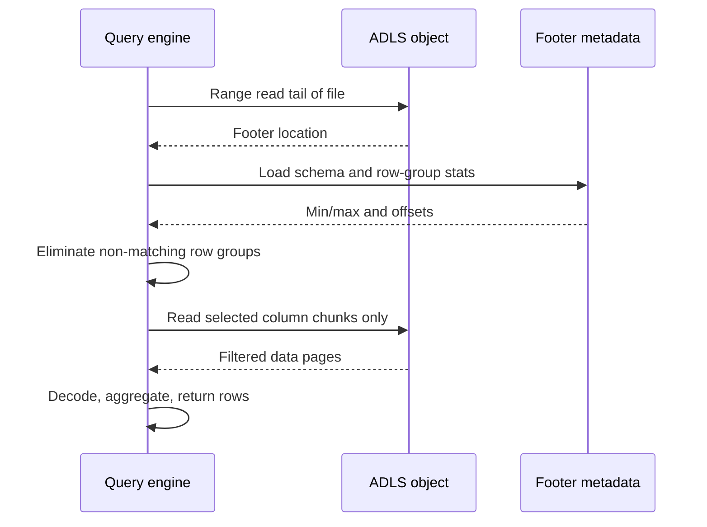
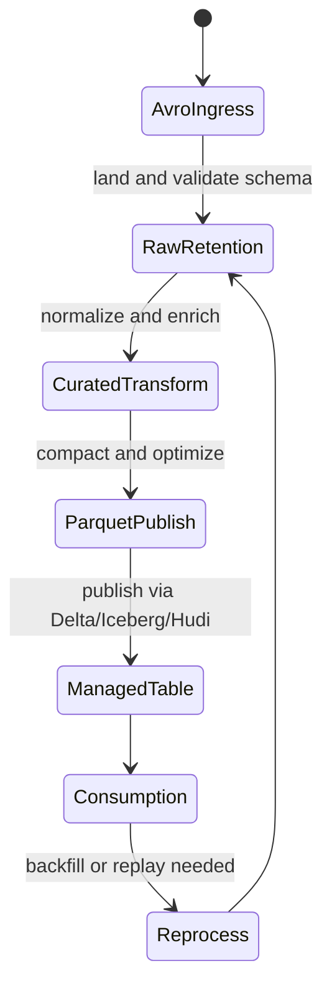

# File Formats: Parquet, ORC, Avro

> Part of the **Enterprise Data & AI Architecture Handbook** · Phase-04 - Storage Systems & Table Formats · Chapter 01.
> Estimated study time: **60 min reading + ~4h labs**.
> **Prerequisite:** read [Storage Systems Fundamentals](../Phase-00/05_Storage_Systems_Fundamentals.md) first.

---

## Executive Summary

Parquet, ORC, and Avro exist because enterprise data workloads do not all read and write data the same way. Event producers, CDC pipelines, and service integrations tend to emit full records in append-heavy streams. Analytical engines, by contrast, usually read a small subset of columns from very large datasets and benefit when data is physically grouped by column instead of by row. The central architectural question is therefore not "which format is best?" but "which access pattern, schema contract, and compute engine am I optimizing for?"

Parquet is the default analytical file format for most modern lakehouse estates because it combines broad interoperability, strong compression, row-group level pruning, and efficient vectorized reads. ORC remains strong where Hive- and Trino-centric ecosystems value its stripe indexes, bloom filters, and historically tight integration with warehouse-style scan engines. Avro is the opposite of a warehouse format by design: it is row-oriented, schema-aware, compact for message transport, and excellent for operational interchange, but it is usually the wrong long-term format for large-scale BI or ML feature scans.

On Azure, the most reliable enterprise pattern is: use Avro at ingestion and contract boundaries when schema evolution must be explicit, land analytical datasets on ADLS Gen2 in Parquet-backed table formats, and allow ORC only where the consuming engine demonstrably benefits. Azure Databricks, Microsoft Fabric, Synapse serverless SQL, Event Hubs Capture, and Microsoft Purview all fit naturally into that pattern. The format decision also directly affects cost because column pruning, predicate pushdown, compression, and file sizing determine how many bytes are stored, scanned, and transferred.

The practical conclusion is opinionated. Use Avro for streams and interchange. Use Parquet as the enterprise default for persisted analytical data. Use ORC as an exception-based choice for specific Hive or Trino estates, not as a reflex. If the dataset needs ACID transactions, snapshots, schema governance, and safe concurrent updates, treat Parquet or ORC as the physical layer underneath a table format rather than as the governance boundary itself.

## Learning Objectives

By the end of this chapter you will be able to:

1. Explain the difference between row-oriented and columnar storage and predict which workloads benefit from each.
2. Describe Parquet internals including row groups, column chunks, pages, encodings, and footer metadata.
3. Explain when ORC is preferable to Parquet and when Avro is preferable to both.
4. Reason about schema evolution across Avro, Parquet, and ORC without confusing file-level behavior with table-level guarantees.
5. Quantify the impact of predicate pushdown and column pruning on Azure storage scan cost.
6. Choose file sizes, compression codecs, and partitioning strategies that fit Azure Databricks, Fabric, Synapse, and Trino workloads.
7. Recognize when a file format choice must be paired with Delta Lake, Apache Iceberg, or Apache Hudi for correctness.
8. Build an Azure-primary architecture that uses ADLS Gen2, Event Hubs, Databricks, and governance controls coherently.
9. Identify anti-patterns such as small-file explosions, Avro-as-warehouse, and schema changes without compatibility testing.
10. Defend a format decision in a staff-level architecture review with explicit trade-offs.

## Business Motivation

- File formats materially change query cost because serverless and lakehouse engines bill or consume CPU based on bytes scanned, decompressed, and shuffled.
- A good format decision can cut analytical scan volume by an order of magnitude when analysts read 8 columns from a 200-column table.
- Schema-aware ingestion reduces breakage across producer and consumer teams, especially in regulated environments where contract drift becomes an incident.
- Standardizing on one analytical default lowers operational friction across BI, ML, governance, and platform teams.
- Poor file-layout and format choices amplify cloud spend through excess storage transactions, unnecessary compute, and reprocessing.
- Format interoperability affects vendor flexibility. A Parquet-backed estate is easier to query from Databricks, Fabric, Synapse, Trino, DuckDB, Spark, and Pandas than a bespoke binary layout.
- Enterprise governance tools classify, scan, and catalog columnar datasets more effectively when schemas are explicit and stable.

## History and Evolution

- Early Hadoop ecosystems leaned heavily on text, CSV, and JSON because they were easy to produce, but they scanned poorly at scale.
- Avro emerged from the Apache Hadoop ecosystem to provide compact row-oriented serialization with explicit schemas and robust schema resolution.
- RCFile and SequenceFile improved some scan patterns, but still left major performance gaps for analytical workloads.
- ORC was developed primarily to accelerate Hive-style warehouse queries through stronger columnar layout, stripe-level indexes, and better compression.
- Parquet was designed to provide a general-purpose columnar format with strong support across multiple compute engines and nested data models.
- As cloud object stores became the default persistence layer, immutable columnar files became the physical substrate for lakehouse designs.
- Table formats such as Delta Lake, Apache Iceberg, and Apache Hudi later addressed transactionality, snapshot isolation, and metadata management on top of Parquet or ORC.
- The modern enterprise pattern is therefore layered: Avro for interchange, Parquet or ORC for persisted analytics, and a table format for mutable datasets.

## Why This Technology Exists

These formats exist because the physical organization of bytes on disk or object storage determines how much I/O, CPU, and network a query must consume before it can answer a business question. As established in [Storage Systems Fundamentals](../Phase-00/05_Storage_Systems_Fundamentals.md), storage systems reward sequential access, compression, locality, and metadata that allows work to be skipped. File formats encode those optimization opportunities.

Avro exists because distributed systems need a stable row-level interchange format that preserves the full record, carries schema information, and supports forward and backward compatibility rules. It is optimized for writing and replaying whole events, not for reading a few columns from a trillion-row dataset.

Parquet and ORC exist because analytical workloads are disproportionately read-heavy, selective, and repetitive. Analysts do not usually need the entire row. They need a subset of fields for aggregation, filtering, and joins. Columnar layout lets the engine skip irrelevant bytes, compress similar values together, and use file statistics to avoid opening large parts of the dataset entirely.

## Problems It Solves

| Problem | Avro | Parquet | ORC |
|---|---|---|---|
| Row-oriented event interchange | Strong | Weak | Weak |
| Compact analytics scan | Weak | Strong | Strong |
| Schema evolution with reader/writer resolution | Strong | Moderate | Moderate |
| Compression efficiency on repeated column values | Limited | Strong | Strong |
| Predicate pushdown and column pruning | Minimal | Strong | Strong |
| Broad lakehouse interoperability | Moderate | Strong | Moderate to strong |
| Efficient nested analytics | Moderate | Strong | Strong |

In practice these formats solve five recurring enterprise problems:

1. They reduce storage and scan cost relative to text-heavy formats.
2. They allow compute engines to skip unnecessary data through metadata-aware reads.
3. They create portable, engine-readable datasets on object storage.
4. They formalize schema handling instead of leaving it implicit in producer code.
5. They enable lakehouse table formats to rely on immutable files as durable physical objects.

## Problems It Cannot Solve

- A file format cannot provide multi-writer ACID guarantees by itself. Use a table format when correctness matters.
- A file format cannot rescue pathological partitioning or billions of tiny objects; the layout strategy is separate from the format.
- Columnar formats do not make high-frequency point updates cheap. Rewrites are still expensive on object storage.
- Avro schema evolution does not eliminate the need for compatibility testing, especially for enum changes, defaults, and field renames.
- Parquet and ORC statistics do not help if the query predicate is on a field with poor clustering or high null skew.
- No file format can enforce fine-grained authorization by itself; security lives in the storage, catalog, and compute layers.
- Choosing Parquet or ORC does not automatically solve lineage, data quality, retention, or governance.

## Core Concepts

### Row vs columnar layout

| Dimension | Row-oriented layout | Columnar layout |
|---|---|---|
| Physical grouping | Full records stored together | Values of the same column stored together |
| Best for | Ingestion, replay, point record reconstruction | Aggregations, filters, wide scans with few selected columns |
| Compression | Lower when columns vary heavily | Higher because adjacent values are similar |
| Update pattern | Natural for append streams | Natural for immutable analytical batches |
| Typical format | Avro | Parquet, ORC |

Row layout is efficient when the consumer wants the whole record. Columnar layout is efficient when the consumer wants a subset of columns or benefits from type-specific encodings.

### Parquet internals

Parquet stores data in **row groups**. Each row group contains **column chunks**, and each column chunk is broken into **pages**. This matters because:

- row groups are the main unit for pruning and parallel scan planning,
- column chunks enable column pruning,
- pages carry encoded values and optional page-level statistics,
- footer metadata allows the reader to discover schema, row-group boundaries, and statistics with one tail read.

Common Parquet encodings include dictionary encoding, run-length encoding (RLE), delta encoding, and bit-packing. Compression is typically applied after encoding, with Snappy, ZSTD, or Gzip depending on latency and ratio goals.

### ORC internals

ORC organizes data into **stripes** instead of row groups. Each stripe contains row data, index data, and footer information. ORC also stores file-level metadata and supports lightweight indexes and optional bloom filters that can improve selective scans. In Hive and Trino-heavy ecosystems, ORC has historically provided excellent scan performance because the reader can use stripe statistics and row indexes aggressively.

### Avro internals

Avro is row-oriented. In Avro object container files, the header stores the schema and metadata, while records are written in blocks separated by sync markers. Avro does not aim to optimize selective analytical reads. It aims to make record serialization and schema resolution explicit and portable.

### Predicate pushdown and column pruning

Predicate pushdown means the reader uses file or stripe metadata to skip chunks that cannot satisfy a filter such as `event_date = '2026-07-01'`. Column pruning means the reader fetches only requested columns instead of full rows. These two mechanisms are among the largest cost levers in lakehouse analytics because they reduce storage I/O, network transfer, and decompression work.

## Internal Working

When a Spark or Photon writer produces Parquet, it first materializes rows in memory, then groups them into row groups. Inside each row group, values are split by column, encoded, compressed, and written as pages. At file close, the writer emits a footer that describes schema, row groups, statistics, encodings, and offsets. Readers typically perform a small range read from the file tail to get the footer, decide which row groups to skip, then issue additional range reads only for the selected columns and row groups.

ORC is similar in purpose but differs in layout. Writers accumulate rows into stripes, emit indexes and optional bloom filters, compress column streams, and write a postscript and footer at the end. Readers open the postscript, find the footer, evaluate stripe-level statistics, and then fetch only the streams needed for selected columns.

Avro writers serialize each record according to the writer schema and append it to a block. The schema is embedded in the file header or stored externally in a registry when Avro is used over Kafka or Event Hubs. Readers reconcile the writer schema with the reader schema using Avro compatibility rules. This is operationally useful for streams, but it does not provide the same skip-read efficiency as columnar layouts.

On Azure object storage the access path is remote rather than local. Every extra file open, footer read, and range request becomes a transaction and a latency event. That is why file count, row-group sizing, and partition layout matter as much as the format itself. The format enables skipping work, but the dataset layout determines whether the engine can exploit it economically.

## Architecture

The default enterprise architecture is a three-stage pattern:

1. **Ingress and contract boundary:** capture events, logs, or CDC in Avro when producer/consumer compatibility is important.
2. **Curated analytical persistence:** convert to Parquet-backed managed tables for BI, ML, and batch analytics.
3. **Serving and governance:** expose the data through Azure Databricks, Fabric, Synapse, or Trino with catalog and lineage controls.

On Azure, that typically means Event Hubs or Kafka-compatible ingress, ADLS Gen2 as the durable storage substrate, Azure Databricks or Fabric for transformation, and Purview or Unity Catalog for metadata and governance. ORC becomes a targeted choice where Hive or Trino workloads already optimize around it. Avro usually remains near the ingestion edge or in replayable raw zones with bounded retention.

## Components

| Component | Responsibility | Typical Azure choice |
|---|---|---|
| Object store | Durable file persistence | ADLS Gen2 on Standard GPv2 with HNS |
| Stream ingress | Event transport and capture | Event Hubs or Kafka on HDInsight replacement stacks / Confluent |
| Schema registry | Contract management | Azure Schema Registry in Event Hubs namespace |
| Transformation engine | Convert and optimize data | Azure Databricks or Fabric Spark |
| Query engine | Read optimized datasets | Databricks SQL, Synapse serverless SQL, Fabric Warehouse, Trino |
| Catalog and governance | Schema, lineage, access policy | Unity Catalog, Microsoft Purview |
| Table format | Transactions and snapshots | Delta Lake, Apache Iceberg, Apache Hudi |
| Format inspector | Low-level debugging and profiling | parquet-tools, orc-tools, avro-tools, DuckDB |

## Metadata

Metadata quality determines whether the engine can skip work safely and whether humans can govern the dataset confidently.

| Format | Important metadata | Architectural consequence |
|---|---|---|
| Avro | Writer schema, codec, sync markers, object container metadata | Strong contract portability; weak scan pruning |
| Parquet | File schema, row-group stats, column encodings, page offsets | Strong pruning and cross-engine interoperability |
| ORC | Stripe stats, row indexes, bloom filters, file footer | Strong pruning in ORC-aware engines |

For nested data, metadata fidelity matters even more. Column path naming, logical types, nullability, decimal precision, and timestamp semantics can create silent cross-engine differences. The enterprise rule should be simple: treat schemas as versioned contracts, not as a side effect of whatever Spark inferred from yesterday's payload.

## Storage

From a storage perspective, the main design variables are object size, compression, redundancy, and layout.

- **Parquet row group size:** a practical default is 128 MB to 512 MB uncompressed per row group for large analytical datasets.
- **ORC stripe size:** a practical default is 64 MB to 256 MB, tuned to the engine and memory envelope.
- **Avro block size:** keep blocks large enough for throughput, but do not mistake larger Avro blocks for a replacement for columnar layout.
- **Compression:** Snappy is the default for hot analytics, ZSTD is often better for colder curated zones, and Gzip is usually too CPU-expensive for interactive warehouse paths.
- **ADLS tiering:** hot or cool tiers are common for analytical zones; archive is usually inappropriate for active Parquet or ORC datasets.

For immutable analytical data, storage efficiency comes more from format and sorting than from expensive storage SKUs. Standard GPv2 ADLS Gen2 with hierarchical namespace is usually sufficient; the performance bottlenecks are more often file count, poor pruning, and bad table maintenance than the underlying storage tier.

## Compute

Compute engines exploit these formats differently:

- **Azure Databricks Photon** aggressively benefits from Parquet statistics, vectorized decode paths, and sorted data.
- **Fabric and Synapse serverless SQL** benefit when external datasets are columnar and partition-aligned because the billing model tracks bytes scanned.
- **Trino** performs well on both ORC and Parquet, but engine-specific defaults and connector behavior matter.
- **Spark structured streaming** often lands row-oriented or semi-structured data first, then batch-optimizes it into columnar form.

Compute cost is therefore tightly coupled to file format. A fast engine still pays for every byte it must request, deserialize, and decompress. The right format reduces work before CPU parallelism even begins.

## Networking

Remote file access over object storage makes networking a first-order concern:

- Many small files cause excessive open requests and tail-latency amplification.
- Footer-first reads rely on additional range GETs, which are cheap individually and expensive in aggregate at scale.
- Column pruning reduces network transfer because only selected column chunks are fetched.
- Cross-region querying of raw files introduces egress cost and higher latency.
- Private endpoints and VNet injection improve security but can expose DNS and throughput design mistakes.

Columnar formats reduce network load best when the engine can avoid scanning irrelevant partitions, row groups, or stripes. If every query still opens every file, the format choice has been undermined by the dataset layout.

## Security

Security for file formats is mostly about the surrounding platform, but format design still matters.

- Avro with explicit schemas improves controlled interchange and reduces ad hoc parser drift.
- Parquet and ORC persist rich typed schemas that governance tools can inspect more reliably than raw JSON.
- None of the formats provide durable row- or column-level authorization on their own; enforce that in Unity Catalog, Purview-integrated systems, or engine-specific policy layers.
- Use ADLS Gen2 ACLs, RBAC, managed identities, and private endpoints instead of long-lived SAS tokens for core analytical zones.
- Encrypt at rest with Microsoft-managed keys by default and use CMK where policy requires it.
- Protect schema registries because a poisoned or unauthorized schema change can become a platform-wide outage.

Treat sensitive columns explicitly. Compression and encoding are storage optimizations, not masking or tokenization controls.

## Performance

| Workload | Best default | Why |
|---|---|---|
| Event stream interchange | Avro | Strong schema evolution, efficient full-record serialization |
| Interactive analytics | Parquet | Broad engine support, pruning, vectorized readers |
| Hive/Trino warehouse with ORC-tuned readers | ORC | Strong stripe indexes and historical ecosystem fit |
| ML feature backfills | Parquet | Narrow-column scans and efficient compression |
| Long-term raw replay | Avro or compressed JSON only when justified | Preserve producer fidelity, then convert for analytics |

The biggest performance levers are not subtle:

1. Sort or cluster on common filter columns before writing.
2. Keep file sizes in the 128 MB to 1 GB range for large lakehouse datasets unless the engine guidance says otherwise.
3. Compact aggressively after micro-batch ingestion.
4. Use Snappy for hot latency-sensitive reads and evaluate ZSTD for colder curated zones.
5. Avoid very wide nested schemas with low-selectivity filters unless the engine's nested-column pruning is proven.

## Scalability

These formats scale well because they are immutable, splittable, and cheap to parallelize. Thousands of workers can read different Parquet row groups or ORC stripes concurrently without centralized write locks. Avro also scales for append-heavy ingestion because writers only need to serialize full records and append blocks.

The real scalability limits usually come from metadata and layout rather than the format spec:

- too many partitions,
- too many files per partition,
- schema drift across files,
- table maintenance jobs that cannot keep up with compaction,
- catalogs that become inconsistent with physical layout.

At enterprise scale, format standardization is partly a people problem. If every team chooses a different codec, timestamp representation, and partition convention, compute engines become the integration tax collector.

## Fault Tolerance

Immutable files are naturally resilient to partial reader interference, but writers still need safe commit behavior. On Azure, that usually means the table layer or job orchestration defines the atomic publication step. A failed Spark job that writes plain Parquet without a transaction log can leave orphan files or incomplete partitions even if each individual file is valid.

Format-level resilience differs slightly:

- Avro sync markers help readers recover block boundaries after corruption.
- Parquet corruption is often scoped to a page, column chunk, or footer, though a damaged footer can make the file unreadable without repair tooling.
- ORC footers and stripe-level metadata make selective recovery possible, but corruption still tends to be operationally disruptive.

Do not confuse durable storage with correct publication. ADLS redundancy protects objects. Delta Lake, Iceberg, or Hudi protect table state.

## Cost Optimization

| Lever | Primary benefit | Typical Azure effect |
|---|---|---|
| Convert Avro to Parquet quickly | Lower scan bytes | Lower Databricks, Fabric, and Synapse query cost |
| Compact small files | Fewer transactions and better scan efficiency | Lower ADLS transaction count and lower query latency |
| Use ZSTD in cold curated zones | Lower storage footprint | Lower ADLS storage cost, slightly higher CPU |
| Sort on common filter columns | Better row-group pruning | Lower bytes scanned in serverless engines |
| Retain Avro only where replay is needed | Avoid duplicate storage of low-value raw copies | Lower storage and governance overhead |

FinOps guidance should be explicit:

- budget for scan cost, not only storage cost,
- measure bytes read versus rows returned,
- charge back repeated anti-patterns such as tiny-file writes,
- review raw-zone retention for Avro and JSON regularly,
- standardize codecs to avoid inconsistent CPU and storage economics.

## Monitoring

Monitor the following operational metrics continuously:

- average file size per table and per partition,
- files created per hour from streaming or CDC jobs,
- bytes scanned per query versus rows returned,
- percentage of queries using predicate pushdown,
- schema compatibility failures in the registry or ingestion layer,
- ADLS transaction count spikes,
- compaction backlog,
- read amplification caused by duplicate small partitions.

On Azure Databricks, query plans and file-scan metrics expose whether the engine is skipping row groups. In Synapse serverless and Fabric, watch scanned data volume because that is the immediate commercial signal of layout health.

## Observability

Observability is deeper than threshold monitoring. You need enough context to explain why a query scanned 4 TB instead of 300 GB.

- Capture query plans and file-scan statistics as telemetry.
- Track schema versions and compatibility decisions over time.
- Log row-group and partition pruning ratios for critical datasets.
- Maintain lineage from Avro ingress topics to Parquet or ORC serving tables.
- Add data quality assertions for nullability, enum drift, timestamp normalization, and decimal precision.

An observable format estate lets platform teams distinguish storage problems from compute problems. Without that visibility, everything looks like a generic Spark slowdown.

## Governance

Format governance should be policy, not folklore.

Recommended enterprise standard:

1. Avro is approved for event interchange, landing zones, replay buffers, and contract-driven integration.
2. Parquet is the default persisted analytics format for raw-curated-serving lake zones.
3. ORC requires an explicit engine-fit justification.
4. Mutable business-critical datasets must sit behind a managed table format.
5. Schema changes require compatibility tests and documented ownership.

Use metadata catalogs and contract reviews to enforce these rules. Governance should also record timestamp conventions, decimal precision policy, partition strategy, PII tagging, retention, and encryption requirements. As with [Storage Systems Fundamentals](../Phase-00/05_Storage_Systems_Fundamentals.md), durable bytes without lifecycle and ownership discipline are not an enterprise capability.

## Trade-offs

| Trade-off | Avro | Parquet | ORC |
|---|---|---|---|
| Write simplicity | Strong | Moderate | Moderate |
| Selective read efficiency | Weak | Strong | Strong |
| Broad multi-engine support | Moderate | Strong | Moderate to strong |
| Schema compatibility behavior | Strong | Moderate | Moderate |
| Human inspectability | Moderate | Moderate | Moderate |
| Best fit for lakehouse default | Weak | Strong | Conditional |

The critical trade-off is that the format best for transport is not the format best for analytics. Teams that try to preserve one format end-to-end usually optimize one stage and penalize every other stage.

## Decision Matrix

| Use case | Recommended format | Reason | Notes |
|---|---|---|---|
| Kafka or Event Hubs event payload | Avro | Strong schema contract and full-record reads | Pair with schema registry |
| BI fact table on ADLS | Parquet | Column pruning and broad interoperability | Usually under Delta Lake |
| Fabric or Synapse external query dataset | Parquet | Lower bytes scanned and strong support | Optimize partitioning carefully |
| Hive or Trino estate with ORC tuning history | ORC | Engine-specific optimization path | Use only with clear benchmark win |
| Raw forensic replay store | Avro | Preserve source fidelity | Retention should be bounded |
| Near-real-time enrichment store | Parquet | Better analytical read path after landing | Convert from Avro quickly |
| Mutable large table | Parquet-backed Delta/Iceberg/Hudi | File format alone is insufficient | Choose table format intentionally |

## Design Patterns

1. **Ingress-contract-curation pattern:** Avro on the edge, Parquet in the curated zone, table format for publication.
2. **Hot and cold codec split:** Snappy for hot serving tables, ZSTD for colder historical partitions.
3. **Sort-for-pruning pattern:** write Parquet sorted by the highest-value filter columns to increase row-group skip rates.
4. **Retention split:** keep raw Avro for a short replay window and longer-lived Parquet for analytics.
5. **Schema registry gate:** reject incompatible event schemas before they land in shared analytical storage.
6. **Compact-after-streaming pattern:** land frequently, publish less frequently, compact continuously.
7. **Exception-based ORC pattern:** use ORC only for workloads whose benchmark and engine behavior justify it.

## Anti-patterns

1. Using Avro as the long-term warehouse format for Power BI, Fabric SQL, or Synapse-facing datasets.
2. Writing one Parquet file per micro-batch per partition without compaction.
3. Choosing ORC because it is "also columnar" without measuring reader behavior on the actual engine.
4. Allowing Spark schema inference to define production contracts.
5. Renaming or repurposing columns without compatibility review.
6. Mixing timestamp semantics across writers in the same dataset.
7. Partitioning on high-cardinality keys that explode directory counts.
8. Assuming the file format can replace table maintenance, governance, and lifecycle policy.

## Common Mistakes

- **Mistake:** storing raw, curated, and serving datasets all in the same format for convenience.  
  **Consequence:** one stage is always suboptimal.  
  **Fix:** standardize by workload stage, not by aesthetic preference.

- **Mistake:** using default file sizes from a demo notebook.  
  **Consequence:** small-file sprawl and poor scan efficiency.  
  **Fix:** set target file sizes and validate them continuously.

- **Mistake:** relying on partition pruning alone.  
  **Consequence:** row-group skipping remains weak and scan cost stays high.  
  **Fix:** combine partition design with sort order and statistics-aware writes.

- **Mistake:** evolving Avro schemas without testing old consumers.  
  **Consequence:** runtime deserialization failures or silent default misuse.  
  **Fix:** enforce compatibility mode in the registry and run contract tests.

- **Mistake:** comparing ORC and Parquet on tiny samples.  
  **Consequence:** wrong benchmark conclusions.  
  **Fix:** benchmark on realistic file counts, selectivity, and engine versions.

## Best Practices

1. Default to Parquet for persisted analytical data on ADLS Gen2.
2. Use Avro at contract boundaries where schema evolution matters more than scan efficiency.
3. Treat ORC as a targeted optimization for specific engines, not a general lakehouse standard.
4. Standardize timestamp, decimal, and nullability conventions across producers.
5. Compact streaming outputs into stable files before exposing them broadly.
6. Use managed table formats for mutable or concurrently written datasets.
7. Choose codecs per access tier rather than globally.
8. Validate predicate-pushdown effectiveness with real query plans.
9. Keep raw-zone retention intentional; do not keep every Avro landing forever.
10. Inspect files with low-level tools during incidents instead of guessing from high-level symptoms.

## Enterprise Recommendations

The recommended enterprise standard is deliberately narrow:

- **Default analytical persistence:** Parquet.
- **Default event contract format:** Avro.
- **Default table abstraction for mutable data:** Delta Lake on Azure unless a specific interoperability requirement points to Iceberg or Hudi.
- **Default ORC stance:** allowed by exception with benchmark evidence.

### ADR example: default file format for persisted analytical tables

**Context:** Multiple data domains need a common format for BI, ML, and ad hoc analytics across Azure Databricks, Fabric, Synapse serverless SQL, and some Trino workloads. The estate also uses Event Hubs for ingress and requires schema-governed event payloads.

**Decision:** Standardize on Avro for event interchange and Parquet for persisted analytical datasets. Require Delta Lake for mutable published tables. Permit ORC only where an identified workload shows measurable improvement and does not reduce interoperability.

**Consequences:** Query cost and interoperability improve across most engines. Event contracts remain explicit. Platform standards become simpler. Some Hive-native ORC estates may need translation layers or exceptions.

**Alternatives considered:**

1. ORC as the enterprise default: rejected because interoperability was weaker across the broader Azure analytics estate.
2. Avro end-to-end: rejected because analytical scan cost and column pruning were materially worse.
3. Raw JSON plus schema inference: rejected because governance and performance were unacceptable.

## Azure Implementation

The Azure-primary implementation pattern is:

1. Event Hubs or Kafka-compatible ingress with Avro payloads and Schema Registry.
2. ADLS Gen2 Standard GPv2 with hierarchical namespace enabled.
3. Azure Databricks or Fabric Spark to convert Avro landing data into Parquet-backed Delta tables.
4. Synapse serverless SQL or Fabric SQL endpoints for ad hoc query over curated Parquet datasets.
5. Unity Catalog or Microsoft Purview for governance, lineage, and access policy.

Recommended Azure service posture:

- ADLS Gen2: Standard GPv2, HNS enabled, ZRS for critical regional workloads, GZRS when regional durability requirements justify the premium.
- Azure Databricks: Photon-enabled SQL warehouses and current LTS runtime for high-volume Parquet workloads.
- Event Hubs: use Avro plus Schema Registry when compatibility contracts matter; avoid unversioned JSON for shared enterprise streams.
- Synapse serverless SQL: use for selective external querying of Parquet, not as a rescue plan for poor file layout.

### Bicep: ADLS Gen2 storage account for analytical files

```bicep
param location string = resourceGroup().location
param storageAccountName string

resource lake 'Microsoft.Storage/storageAccounts@2023-05-01' = {
  name: storageAccountName
  location: location
  sku: {
    name: 'Standard_ZRS'
  }
  kind: 'StorageV2'
  properties: {
    isHnsEnabled: true
    accessTier: 'Hot'
    minimumTlsVersion: 'TLS1_2'
    allowBlobPublicAccess: false
    supportsHttpsTrafficOnly: true
  }
}
```

### Azure Databricks: convert Avro landing data into optimized Parquet-backed Delta

```python
source_path = "abfss://raw@contosolake.dfs.core.windows.net/orders_avro/"
target_path = "abfss://curated@contosolake.dfs.core.windows.net/orders_delta/"

spark.conf.set("spark.sql.parquet.filterPushdown", "true")
spark.conf.set("spark.sql.parquet.enableVectorizedReader", "true")
spark.conf.set("spark.sql.parquet.compression.codec", "zstd")

(spark.read.format("avro").load(source_path)
    .withColumn("order_date", F.to_date("order_timestamp"))
    .repartition("order_date")
    .sortWithinPartitions("order_date", "customer_id")
    .write
    .format("delta")
    .mode("append")
    .partitionBy("order_date")
    .save(target_path))
```

### Synapse serverless SQL: external query over Parquet

```sql
SELECT TOP 100
    customer_id,
    order_date,
    net_amount
FROM OPENROWSET(
    BULK 'https://contosolake.dfs.core.windows.net/curated/orders_parquet/*',
    FORMAT = 'PARQUET'
) WITH (
    customer_id BIGINT,
    order_date DATE,
    net_amount DECIMAL(18,2)
) AS rows
WHERE order_date >= '2026-07-01';
```

Operational Azure guidance:

- Keep Event Hubs capture or raw Avro retention short unless regulated replay is required.
- Publish shared analytical datasets through managed tables, not ad hoc file paths.
- Measure scan bytes in Synapse and Fabric after every major partitioning or codec change.
- Use Purview or Unity Catalog classifications for PII; do not assume file-level schema alone is sufficient governance.

## Open Source Implementation

An enterprise open-source pattern uses Kafka, Schema Registry, Spark, Trino, and object storage such as MinIO.

### Avro schema for an order event

```json
{
  "type": "record",
  "name": "OrderEvent",
  "namespace": "com.contoso.sales",
  "fields": [
    {"name": "order_id", "type": "string"},
    {"name": "customer_id", "type": "long"},
    {"name": "order_timestamp", "type": {"type": "long", "logicalType": "timestamp-millis"}},
    {"name": "net_amount", "type": "double"},
    {"name": "country_code", "type": ["null", "string"], "default": null}
  ]
}
```

### Spark: write both Parquet and ORC for benchmark comparison

```python
df = spark.read.format("avro").load("s3a://raw/orders_avro/")

(df.write
   .mode("overwrite")
   .option("compression", "snappy")
   .partitionBy("country_code")
   .parquet("s3a://curated/orders_parquet/"))

(df.write
   .mode("overwrite")
   .option("orc.compress", "zstd")
   .partitionBy("country_code")
   .orc("s3a://curated/orders_orc/"))
```

### Trino: compare scan behavior

```sql
EXPLAIN ANALYZE
SELECT country_code, sum(net_amount)
FROM lake.orders_parquet
WHERE order_timestamp >= TIMESTAMP '2026-07-01 00:00:00'
GROUP BY country_code;
```

Open-source guidance:

- Use Kafka plus Schema Registry for Avro compatibility enforcement.
- Benchmark ORC versus Parquet on the exact engine and connector combination you run in production.
- Use DuckDB or parquet-tools in CI to validate file-level expectations after schema or writer changes.
- Pair Parquet or ORC with Iceberg, Delta Lake, or Hudi once concurrent publish semantics matter.

## AWS Equivalent (comparison only)

| Azure pattern | AWS equivalent | Advantages | Disadvantages | Migration note |
|---|---|---|---|---|
| ADLS Gen2 for Parquet lake | Amazon S3 | Mature ecosystem and broad service support | No HNS semantics identical to ADLS ACL model | Review path semantics and IAM policy model |
| Azure Databricks for Parquet optimization | Databricks on AWS or EMR Spark | Strong Spark support | More service fragmentation if using EMR + Glue + Athena | Keep Parquet and table formats portable |
| Event Hubs + Schema Registry + Avro | Kinesis plus Glue Schema Registry or MSK + Schema Registry | Strong managed ingress options | Schema workflow differs by stack | Separate transport migration from file-format migration |
| Synapse serverless SQL over Parquet | Athena | Simple serverless scan model | Cost remains sensitive to layout | Re-benchmark scan cost after partition migration |

Selection criteria:

- Choose AWS equivalence primarily when compute and governance estates already live there.
- Keep Parquet and Avro standards portable so migration is mostly platform re-wiring rather than dataset rewriting.
- Avoid ORC-only assumptions unless the destination engines are proven to benefit.

## GCP Equivalent (comparison only)

| Azure pattern | GCP equivalent | Advantages | Disadvantages | Migration note |
|---|---|---|---|---|
| ADLS Gen2 for Parquet lake | Google Cloud Storage | Broad ecosystem support and strong durability | Different IAM and namespace behavior | Revisit ACL and object naming assumptions |
| Azure Databricks or Fabric Spark | Dataproc, Databricks on GCP, or Dataflow for transformation | Flexible Spark and Beam choices | Operational model differs by engine | Keep file format and table format decoupled from orchestrator |
| Synapse serverless SQL over Parquet | BigQuery external tables / BigLake | Strong analytics integration | Native BigQuery storage has different economics than external files | Compare external versus native table cost carefully |
| Event Hubs + Avro contract boundary | Pub/Sub + Dataflow + schema-aware tooling | Managed streaming services | Schema registry patterns are less uniform | Preserve Avro schemas and compatibility tests during migration |

Selection criteria:

- GCP is attractive when BigQuery is the dominant analytical surface, but native storage may reduce the value of hand-optimizing external file layouts for some workloads.
- If external object-store analytics remain important, Parquet portability keeps the migration straightforward.

## Migration Considerations

Common migrations include JSON to Avro at ingress, Avro to Parquet for analytics, and ORC to Parquet when broad engine interoperability becomes more important than legacy Hive tuning.

Migration sequence:

1. Inventory datasets by workload: stream interchange, raw replay, curated analytics, published serving.
2. Freeze and document schema contracts before changing physical layout.
3. Benchmark representative queries, not toy samples.
4. Convert one domain at a time and compare scan bytes, latency, and compatibility behavior.
5. Introduce a table format if mutable tables are currently plain files.
6. Maintain dual writes briefly only when cutover risk justifies the cost.

Migration risks:

- timestamp representation drift,
- decimal precision mismatches,
- nullability changes,
- lost partition semantics,
- unexpected consumer coupling to raw Avro payload shape,
- cost spikes during backfill and dual-storage windows.

## Mermaid Architecture Diagrams

### Azure ingestion to lakehouse publication



### Predicate pushdown read path



### Lifecycle from event contract to curated analytics



## End-to-End Data Flow

1. A producer emits an event using an Avro schema and registers or references its contract.
2. Event Hubs or Kafka transports the payload and optionally lands raw Avro in object storage.
3. A streaming or batch job validates compatibility, normalizes timestamps and decimals, and tags the data domain.
4. The transformation engine writes curated Parquet files, usually inside a managed table format.
5. Data is partitioned by business time and often sorted by high-value filter columns.
6. Table maintenance compacts small files and updates metadata.
7. Query engines read file footers, prune partitions, prune row groups, and fetch only selected columns.
8. Governance systems capture lineage from Avro contract to curated analytical table.
9. Monitoring surfaces scan-byte anomalies, schema drift, and compaction backlog.
10. Consumers query curated data while raw Avro is retained only as long as replay or audit policy requires.

## Real-world Business Use Cases

| Use case | Recommended pattern |
|---|---|
| Retail clickstream analytics | Avro for event ingress, Parquet for curated behavior tables |
| IoT telemetry lake | Avro or protobuf-equivalent at edge, Parquet for fleet-wide trend analysis |
| Financial transaction enrichment | Avro for service contracts, Parquet-backed managed tables for risk and reconciliation |
| Healthcare claims processing | Explicit contract format at ingress, Parquet for regulatory analytics and cost reporting |
| Marketing attribution and experimentation | Parquet for wide denormalized feature sets with selective reads |

## Industry Examples

- Hive-first data warehouse estates have historically favored ORC because its stripe indexes and compression aligned well with Hive scan patterns.
- Modern Spark and lakehouse platforms overwhelmingly standardize on Parquet as the physical file layer for Delta Lake, Iceberg, and many Hudi deployments.
- Streaming ecosystems centered on Kafka commonly use Avro with Schema Registry because schema compatibility is a first-order operational concern.
- BI and ad hoc analytics teams benefit most when raw integration formats are decoupled from published analytical formats.

These are not abstract tendencies. They reflect the fact that transport contracts, warehouse scans, and multi-engine portability are different optimization problems.

## Case Studies

### Case study 1: Hive warehouse modernization

A legacy Hive estate stored large reporting tables in ORC and saw good performance in its original engine. When the organization later introduced Spark, Pandas, and mixed SQL endpoints, interoperability became the bottleneck. The lesson was not that ORC was wrong; it was that the format choice had been optimized for one engine family. The modernization path kept ORC where it was measured to help and moved shared analytical publication to Parquet-backed managed tables.

### Case study 2: Azure retail lakehouse cost reduction

An Azure retail platform kept both raw Avro and downstream Parquet indefinitely for every domain. Storage cost was acceptable, but serverless scan cost was not, because analysts often queried partially transformed Avro-based external views. Standardizing curated access on Parquet-backed Delta and shortening raw Avro retention reduced scan volume and simplified governance. The lesson was that keeping the transport format visible to every consumer creates avoidable analytical cost.

### Case study 3: CDC small-file failure pattern

An enterprise CDC pipeline wrote one small Parquet file per micro-batch per partition. The format was technically correct and the queries were still slow because the engine paid transaction and planning overhead on millions of files. Compaction and publish-frequency redesign produced more improvement than any codec change. The lesson was that file format choice does not compensate for bad file-count economics.

## Hands-on Labs

1. **Inspect Parquet metadata on Azure Databricks**: write a sample dataset, use `DESCRIBE DETAIL` and low-level tools, and relate row-group statistics to query pruning.
2. **Measure scan cost in Synapse serverless**: query the same dataset as CSV and Parquet, compare bytes scanned, and explain the difference.
3. **Benchmark ORC versus Parquet in Trino**: run the same selective and non-selective queries, then compare CPU, bytes read, and elapsed time.
4. **Schema evolution lab with Avro**: add optional fields, change defaults, and test backward compatibility with old consumers.
5. **Small-file remediation lab**: intentionally create many small Parquet files, compact them, and compare ADLS transaction counts and query latency.

## Exercises

1. Explain why Avro is usually a poor default for BI serving tables.
2. Describe the difference between a Parquet row group and an ORC stripe.
3. When would ZSTD be preferable to Snappy in an Azure lakehouse?
4. Why does predicate pushdown fail even when the dataset is stored as Parquet?
5. What risks remain if a team uses Parquet without Delta, Iceberg, or Hudi for concurrent writes?
6. How would you prove that ORC is the better choice for one workload in your estate?
7. Which metrics would show that a small-file problem is dominating performance?
8. Why should raw Avro retention usually be bounded?
9. What compatibility risks arise from changing an Avro enum?
10. How would you explain column pruning to a finance stakeholder in cost terms?

## Mini Projects

1. Build a format benchmark harness on ADLS Gen2 that writes the same dataset as Avro, Parquet, and ORC, then reports storage size, query latency, and scanned bytes.
2. Create a schema-governed streaming ingestion pipeline using Event Hubs, Avro, Databricks, and Purview lineage capture.
3. Implement an automated data-layout scorecard that flags small files, weak pruning ratios, and inconsistent codecs per table.

## Capstone Integration

This chapter should feed directly into a larger capstone where an enterprise data platform ingests contract-governed events, lands immutable raw data, curates analytical tables, and exposes governed serving layers. The critical integration point is that the physical file format must align with the ingestion contract, table abstraction, and query surface simultaneously. [Storage Systems Fundamentals](../Phase-00/05_Storage_Systems_Fundamentals.md) explains why the bytes behave this way; this chapter translates that into format standards an enterprise can operationalize.

## Interview Questions

1. Why does columnar storage usually outperform row-oriented storage for analytical queries?
   **A:** Analytical queries typically read a small subset of columns across many rows; columnar storage keeps each column's values contiguous so the engine can read only the needed columns and skip the rest entirely, whereas row-oriented storage must read every column of every row even if only one column is needed.
2. What is a Parquet row group and why does its size matter?
   **A:** A row group is a horizontal partition of the file holding a batch of rows with their own per-column statistics and encoded data; its size matters because too-small row groups increase per-group metadata overhead and reduce compression efficiency, while too-large row groups reduce the granularity of statistics-based pruning and increase memory pressure when reading.
3. How does Avro schema evolution work at a high level?
   **A:** Avro embeds the writer's schema with the data (or references it via a schema registry) and uses schema-resolution rules at read time to reconcile differences between the writer's and reader's schema — adding a field with a default, or removing a field, can be done compatibly as long as the compatibility rules (backward/forward) are respected.
4. What is predicate pushdown and how does it reduce cloud cost?
   **A:** Predicate pushdown evaluates query filters as early as possible — ideally using file-level statistics to skip entire files or row groups before reading any actual data — which directly reduces bytes scanned and therefore reduces cost in consumption-billed (bytes-scanned) query engines like serverless SQL.
5. When would you choose ORC over Parquet?
   **A:** Choose ORC primarily when working within a Hive-centric ecosystem where ORC has historically been the native, best-optimized format, or when specific ORC features (built-in bloom filters, particular compression defaults) are proven beneficial for the specific workload — for a modern Azure/Databricks-first estate, Parquet is generally the better default given its broader ecosystem support.
6. Why is file count often more important than codec choice?
   **A:** A large number of small files creates per-file open/metadata overhead and request amplification that dwarfs the marginal difference between compression codecs; fixing small-file proliferation via compaction typically yields a bigger performance and cost improvement than switching codecs.
7. What does column pruning save besides storage I/O?
   **A:** It also saves network transfer between storage and compute, deserialization/decode CPU cost for the skipped columns, and memory footprint during query execution — all four budgets are reduced by not touching unneeded columns, not just disk I/O.
8. Why is a table format often required on top of Parquet?
   **A:** Plain Parquet files on object storage have no built-in mechanism for atomic multi-file writes, concurrent-write conflict detection, or schema evolution tracking — a table format (Delta/Iceberg/Hudi) adds a transaction log and metadata layer that makes a collection of Parquet files behave like a reliable, ACID-compliant table.

## Staff Engineer Questions

1. How would you define enterprise standards for Parquet row-group sizing across heterogeneous workloads?
   **A:** Set a target row-group size range (commonly 128MB-1GB depending on engine) as a platform default, but allow workload-specific tuning documented via ADR when a specific access pattern (highly selective point lookups versus full-table scans) justifies deviating from the default.
2. What telemetry would you collect to prove that a format migration delivered value?
   **A:** Before/after bytes-scanned per query, query latency percentiles, and storage cost — a format migration justified only by "it's a better format" without measured before/after evidence is an assumption, not a proven improvement.
3. How do you separate a file-format problem from a partition-design problem during an incident?
   **A:** Check whether the slow query is scanning far more files/bytes than the query's selectivity should require (a partition-design problem — wrong partition key or granularity) versus whether it's scanning the right amount of data but decoding it slowly (a format/codec problem) — these have different fixes and conflating them leads to the wrong remediation.
4. Under what conditions would you approve ORC as a strategic exception?
   **A:** Approve it only when a specific, documented technical requirement (an existing Hive-based downstream system with hard ORC dependency, or a demonstrated performance benefit for a specific workload) justifies deviating from the Parquet default, with the exception tracked and reviewed periodically.
5. How would you design raw-zone retention so replay needs are met without duplicative long-term storage?
   **A:** Retain raw-zone data (often in its original format like Avro) only for the duration needed to support reprocessing/replay of the curated zone, with a defined retention policy tied to the curated zone's own reliability — once the curated table format's own history/versioning can serve replay needs, indefinite raw retention becomes redundant duplicate storage cost.
6. What compatibility contract would you require for Avro schema changes across teams?
   **A:** Mandate backward (or full) compatibility mode enforced by a schema registry, rejecting any schema change that would break existing consumers, and require new fields to have defaults so old data remains readable under the new schema.
7. How would you benchmark format choices without biasing toward one engine?
   **A:** Run the same benchmark workload across multiple representative engines (not just the one the platform team prefers), using realistic production-like data volume and access patterns rather than synthetic microbenchmarks that may favor one format's specific optimizations.
8. Where should ownership sit for file-layout remediation: platform or domain team?
   **A:** The platform team should own the tooling and standards (compaction schedules, target file sizes), while domain teams own applying those standards to their specific tables and monitoring their own table health — a purely centralized remediation model doesn't scale, and a purely domain-owned model without shared tooling leads to inconsistent quality.

## Architect Questions

1. What is the enterprise default format and what exceptions are allowed?
   **A:** Parquet (within a Delta or Iceberg table format) should be the enterprise default for curated analytical data, with Avro retained for streaming/event interchange given its schema-evolution strengths there, and any other format (ORC, CSV) requiring a documented ADR exception.
2. How does the file-format standard influence multi-cloud portability?
   **A:** Parquet and Avro are both open, engine-neutral formats supported broadly across cloud providers, so standardizing on them (versus a proprietary format) preserves the *data's* portability even if the surrounding platform services (Databricks, Synapse) are Azure-specific.
3. Which workloads require a table format rather than plain files?
   **A:** Any workload with concurrent writers, a need for row-level updates/deletes, or a requirement for reliable schema evolution and time travel needs a table format; append-only, single-writer archival data can sometimes remain as plain files without the added complexity.
4. How do security and governance controls change when raw Avro remains broadly accessible?
   **A:** Raw event data often contains PII or unvalidated fields not yet subject to the curated zone's governance controls, so raw-zone access should be more tightly restricted (fewer consumers, stronger data-classification review) than the governed, table-format curated zone.
5. How would you design a migration from a Hive ORC estate to an Azure lakehouse?
   **A:** Migrate incrementally table-by-table, converting ORC files to Parquet under a Delta/Iceberg table format while validating query-result parity between old and new for each migrated table before decommissioning the legacy Hive path, rather than attempting a single big-bang cutover.
6. What are the cost and risk implications of keeping both Avro and Parquet indefinitely?
   **A:** Maintaining both format's tooling, monitoring, and team expertise indefinitely is a genuine ongoing cost; the risk is justified only if each format serves a genuinely distinct purpose (Avro for streaming schema evolution, Parquet for analytical scan efficiency) rather than historical accident.
7. How should format decisions differ between operational replay and analytical serving?
   **A:** Operational replay (reprocessing a raw event stream) benefits from Avro's row-oriented, schema-evolution-friendly design; analytical serving benefits from Parquet's columnar pruning — using the same format for both forces a compromise that serves neither use case optimally.
8. What architecture review evidence is sufficient to justify deviating from Parquet as the default?
   **A:** A documented, measured benchmark showing a specific alternative format delivers a material benefit for the specific workload's actual access pattern, not a general preference or unverified claim.

## CTO Review Questions

1. Are we paying to store and scan multiple representations of the same data without business justification?
   **A:** This requires an audit of datasets stored in more than one format — if a dataset genuinely doesn't need both a raw Avro copy and a curated Parquet copy indefinitely, one is avoidable duplicate storage and scan cost.
2. Does our current file-format standard increase or reduce platform portability?
   **A:** Standardizing on open formats (Parquet, Avro) rather than proprietary alternatives keeps the data portable regardless of which compute platform (Databricks, Synapse, or a future alternative) processes it — this should be an explicit, deliberate choice, not an accident of whichever engine's defaults were used.
3. Which customer-facing or regulatory risks depend on schema-governed event contracts?
   **A:** Any event stream feeding a customer-facing or regulatory-reporting pipeline depends on schema-registry-enforced compatibility to avoid silent, breaking schema drift — an ungoverned schema change here is a direct correctness and compliance risk.
4. Where do poor file-layout practices translate directly into avoidable cloud spend?
   **A:** Small-file proliferation directly inflates both storage-transaction costs and bytes-scanned query costs; this is one of the most common, quantifiable, and fixable sources of avoidable lakehouse spend.
5. Do our governance tools have enough visibility into the formats we publish?
   **A:** If the data catalog can't answer "what format and table-format version is this dataset" without manual investigation, governance visibility has a gap that should be closed via automated catalog metadata rather than relying on institutional knowledge.
6. If we had to migrate platforms in 12 months, which format decisions would help or hurt us most?
   **A:** Open formats (Parquet, Avro, Delta/Iceberg) would materially ease a migration since the data itself is portable; any dataset locked into a proprietary format or deeply coupled to one engine's specific internal representation would be the highest-risk, highest-cost migration item.

## References

- Apache Parquet Format documentation.
- Apache ORC Specification.
- Apache Avro Specification.
- Azure Databricks documentation for Parquet, Delta Lake, and Photon.
- Microsoft Learn documentation for ADLS Gen2, Event Hubs Schema Registry, and Synapse serverless SQL.
- "Dremel: Interactive Analysis of Web-Scale Datasets" for columnar nested-data ideas that influenced modern analytical formats.
- Apache Iceberg, Delta Lake, and Apache Hudi documentation for table-layer behavior above physical files.

## Further Reading

- Official parquet-tools, orc-tools, and avro-tools repositories for file inspection.
- DuckDB documentation for local inspection of Parquet files.
- Microsoft Fabric guidance on OneLake and external data access patterns.
- FinOps guidance for serverless scan-cost optimization.
- Vendor-neutral benchmarking guidance for object-store analytics.