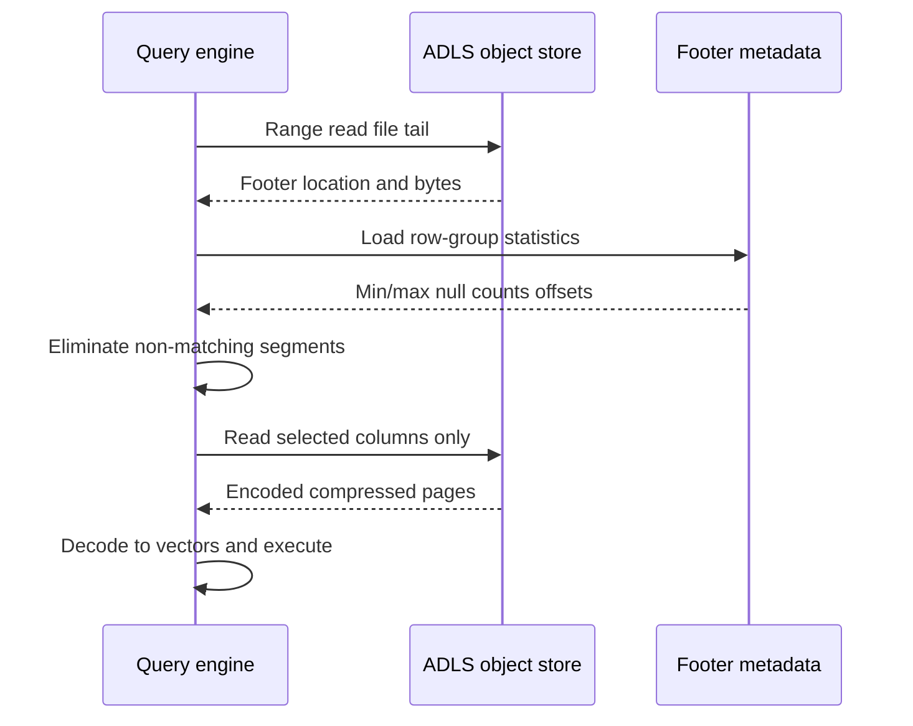
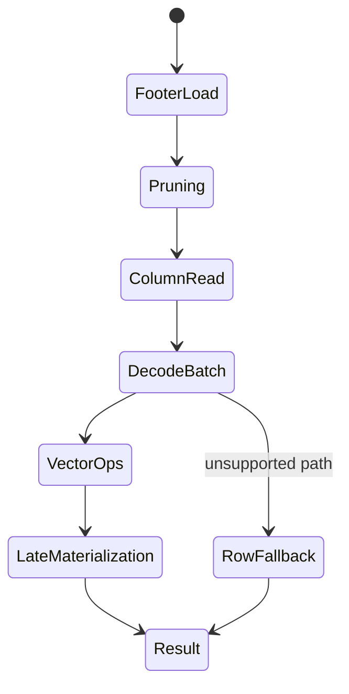

# Columnar Storage Internals

> Part of the **Enterprise Data & AI Architecture Handbook** · Phase-04 - Storage Systems & Table Formats · Chapter 02.
> Estimated study time: **60 min reading + ~4h labs**.
> **Prerequisite:** read [File Formats: Parquet, ORC, Avro](01_File_Formats.md) first.

---

## Executive Summary

Columnar storage is not fast because it is fashionable. It is fast because it arranges bytes so analytical engines can avoid work. The core mechanisms are physical locality by column, low-cardinality encodings such as dictionary and run-length encoding, general-purpose compression layered over already-regular byte streams, file and page statistics that let readers skip whole segments, and vectorized execution paths that keep data in CPU-friendly batches instead of row-by-row objects. The consequence is simple: fewer bytes read from storage, fewer bytes copied over the network, fewer branches in the CPU pipeline, and more useful work per core.

The internals matter operationally. A platform team that understands row groups, pages, stripes, dictionary fallback, null bitmaps, min/max statistics, SIMD-friendly loops, and Apache Arrow memory buffers can usually explain why one Parquet dataset scans in seconds while another scans in minutes even when the schema appears identical. The answer is often not "more compute." It is a combination of encoding choice, sort order, statistics fidelity, file size, and whether the engine can stay on a vectorized path end to end.

On Azure, these internals show up directly in Azure Databricks Photon execution, Microsoft Fabric and Synapse bytes-scanned economics, ADLS Gen2 transaction behavior, and Purview or Unity Catalog metadata practices. The most effective enterprise stance is therefore to standardize not only on file format, as established in [File Formats: Parquet, ORC, Avro](01_File_Formats.md), but also on write patterns that preserve the advantages of columnar execution: stable file sizes, sorted data for pruning, consistent codec policy, and managed table maintenance.

The practical conclusion is opinionated. Use columnar internals deliberately. Prefer Parquet-backed managed tables on ADLS Gen2 for analytical workloads, size files and row groups for vectorized readers, use Snappy or ZSTD intentionally rather than by habit, and treat Arrow as the in-memory interoperability layer that keeps BI, Spark, Pandas, and ML tools from re-materializing rows unnecessarily. If the workload is transaction-heavy, point-lookup heavy, or dominated by full-row operational reads, do not force a columnar design where it does not fit.

## Learning Objectives

By the end of this chapter you will be able to:

1. Explain dictionary, RLE, delta, and bit-packing encodings and when each helps or hurts.
2. Compare Snappy, ZSTD, and GZIP for analytical storage versus transport and archival paths.
3. Describe how vectorized and SIMD execution turns columnar bytes into faster query operators.
4. Use min/max statistics, zone maps, and column-level metadata to reason about pruning efficiency.
5. Explain Apache Arrow as an in-memory columnar format and why it matters for interoperability.
6. Relate Parquet and ORC file internals to Azure Databricks, Fabric, Synapse, and Trino performance.
7. Diagnose common columnar pathologies such as dictionary overflow, tiny pages, and statistics blind spots.
8. Choose enterprise defaults for file size, codec, partitioning, and sort strategy on ADLS Gen2.
9. Quantify how columnar internals affect storage cost, query cost, and CPU efficiency.
10. Defend columnar design decisions in a staff-level architecture review.

## Business Motivation

- Query engines in Azure Databricks, Fabric, and Synapse pay for reading, decompressing, and decoding data before any business logic executes; efficient encodings reduce that cost directly.
- Serverless and SQL-per-byte-scanned pricing models magnify the financial impact of pruning and column selection.
- CPU efficiency matters because modern analytical platforms are often bottlenecked by memory bandwidth and decompression cost rather than raw storage throughput.
- Enterprise lakehouse teams need one consistent mental model for why some datasets are cheap and interactive while others are expensive and sluggish.
- Governance and platform standards are easier to enforce when file internals such as statistics, codec policy, and schema conventions are explicit.
- Poorly chosen codecs or write settings can convert an otherwise correct architecture into a chronic FinOps problem.
- Cross-tool interoperability with Arrow reduces data-copy overhead between Spark, Python, SQL engines, and ML workloads.

## History and Evolution

- Early analytic systems relied on row stores and text files, forcing readers to parse every field for every record.
- Research systems such as MonetDB and C-Store demonstrated that analytical workloads benefit from physically separating columns.
- Hadoop-era formats evolved from SequenceFile and RCFile toward ORC and Parquet, which formalized page-, stripe-, and footer-based metadata for skip-reads.
- CPU architecture shifted the performance discussion from only disk I/O to cache locality, branch prediction, and SIMD vector units.
- Vectorized query engines emerged in warehouse systems and then in Spark, Databricks Photon, DuckDB, ClickHouse, and Trino.
- Compression codecs improved materially, especially with ZSTD, making it practical to trade modest CPU for better storage and scan economics.
- Apache Arrow provided a shared in-memory columnar representation, reducing conversion overhead between languages and engines.
- Modern lakehouse systems now rely on both on-disk columnar formats and in-memory columnar execution to deliver end-to-end performance.

## Why This Technology Exists

Columnar internals exist because analytical workloads repeatedly ask narrow questions of wide datasets. A finance analyst may query 6 columns from a 250-column fact table. A feature engineering job may compute aggregates over three numeric fields across billions of rows. A fraud model backfill may touch one timestamp, two IDs, and a score column. Row-oriented storage forces the engine to drag every field through storage, memory, and CPU even when most of it is irrelevant.

Columnar storage solves that by grouping like with like. Once similar values are adjacent, the system can encode them compactly, compress them effectively, and execute operators over tight contiguous arrays. As described in [Storage Systems Fundamentals](../Phase-00/05_Storage_Systems_Fundamentals.md), hardware rewards sequential access and regular memory access patterns. Columnar internals are the file-format manifestation of that reality. As described in [File Formats: Parquet, ORC, Avro](01_File_Formats.md), the format decision establishes the opportunity; the internal layout determines whether the opportunity is captured.

Apache Arrow exists because disk efficiency alone is insufficient. Analytical systems increasingly move data between storage engines, execution engines, Python data frames, ML libraries, and RPC boundaries. Without a shared in-memory representation, those hops repeatedly convert rows to columns and back, wasting CPU and memory. Arrow reduces that tax.

## Problems It Solves

| Problem | Columnar internals contribution |
|---|---|
| Excessive scan volume | Column pruning and statistics skip unread data |
| Poor compression on repeated values | Dictionary, RLE, delta, and bit-packing regularize streams |
| High CPU overhead per row | Vectorized batch processing reduces per-value branching |
| Interoperability friction between engines | Arrow provides a shared in-memory layout |
| Expensive object-store reads | Footer metadata and zone maps reduce range reads |
| Slow aggregations on wide tables | Contiguous numeric columns improve cache locality |
| Repeated deserialization cost | Vectorized readers decode to columnar buffers directly |

These mechanisms are especially valuable in cloud analytics because they save at three layers simultaneously: storage bytes, network bytes, and CPU cycles.

## Problems It Cannot Solve

- Columnar internals do not provide ACID transactions or safe concurrent table publication by themselves.
- They do not make random single-row updates cheap on object storage; rewrites remain expensive.
- They do not eliminate the need for good partitioning and sort strategy.
- They do not guarantee pruning if the data is unsorted, statistics are missing, or predicates are not supported.
- They do not make a row-heavy operational workload suddenly suitable for an analytical format.
- Arrow does not solve business-level schema governance by itself; it solves memory layout, not ownership and compatibility.
- Compression and encoding cannot compensate for a tiny-file explosion or weak table maintenance.

## Core Concepts

### Encoding layers

Columnar systems typically apply two layers of reduction before bytes reach storage:

1. **Encoding:** transform values into a representation with more regularity.
2. **Compression:** apply a general-purpose codec to the encoded stream.

The distinction matters because most analytical performance gains come from making streams compressible and cheap to decode, not from compression alone.

### Dictionary encoding

Dictionary encoding replaces repeated values with small integer IDs. It works best on low- to medium-cardinality string or categorical columns such as `country_code`, `status`, or `channel`. If the number of distinct values grows too large, the dictionary becomes expensive to store and lookup. Good engines therefore fall back automatically when dictionaries stop helping.

### Run-length encoding

RLE stores repeating values as `(value, run_length)` pairs. It works especially well when data is sorted or clustered such that adjacent rows share the same value. RLE is often paired with dictionary IDs, null markers, or definition levels rather than raw strings.

### Delta encoding

Delta encoding stores differences between adjacent numeric or time-ordered values. It is effective for monotonically increasing IDs, timestamps, counters, and sorted numeric measures because the deltas are smaller and therefore easier to bit-pack or compress.

### Bit-packing

Bit-packing stores values using only the number of bits required by the observed range. If dictionary IDs require only 5 bits, storing them in 32-bit integers wastes space and memory bandwidth. Bit-packing reduces both.

### Compression codecs

| Codec | Strengths | Weaknesses | Typical use |
|---|---|---|---|
| Snappy | Fast decode, low CPU overhead | Lower compression ratio | Hot interactive analytics |
| ZSTD | Strong ratio with tunable levels | More CPU than Snappy | Curated and historical analytical zones |
| GZIP | Good ratio, ubiquitous tooling | Slow decode for interactive reads | Archival or batch-only paths |

### Statistics, zone maps, and min/max

Statistics summarize data segments so readers can decide what not to read. The most common summaries are row count, null count, min/max, and sometimes bloom filters or distinct count approximations. A zone map is a generic term for segment-level min/max metadata used to skip segments that cannot satisfy a predicate.

### Vectorized execution and SIMD

Vectorized execution processes batches of values at a time instead of one row at a time. SIMD extends that idea into hardware by allowing one CPU instruction to operate on multiple data elements in parallel. Together they reduce loop overhead, virtual dispatch, and branch misprediction while improving cache locality.

### Apache Arrow

Arrow is an in-memory columnar format with contiguous buffers, type metadata, offsets, and null bitmaps. It is designed for zero- or low-copy interchange between systems. On analytical platforms, Arrow often sits between the file reader and downstream consumers such as Pandas, PySpark UDF boundaries, or Flight RPC services.

## Internal Working

The write path starts with a batch of rows in an execution engine such as Spark or Photon. The writer groups rows into a row group or stripe, then handles each column independently. Low-cardinality columns may attempt dictionary encoding first. Sorted columns may produce long RLE runs. Monotonic values may be delta encoded. The resulting encoded stream is bit-packed where practical and then compressed with the configured codec. At the same time, the writer records statistics such as row count, null count, min/max, and byte offsets.

The read path reverses the process selectively. A reader first performs a tail read to load file metadata. It uses partition metadata, file statistics, and row-group or stripe statistics to skip segments. For the remaining segments, it reads only the selected columns. The decoder expands compressed pages into vectors, often directly into engine-native columnar batches. Operators such as filters, projections, aggregates, joins, and expressions then run over those vectors rather than materializing rows.

The most important operational detail is that the engine may fall off the fast path. Examples include unsupported data types, UDF-heavy logic, nested schemas that force scalar decode paths, excessive dictionary cardinality, or Arrow interoperability boundaries that are broken by row materialization. When that happens, the file format is still columnar, but the execution becomes less columnar than the design intended.

On Azure, this distinction shows up clearly in Databricks and Fabric workloads. A dataset can sit in Parquet on ADLS Gen2 and still perform poorly if the writer produced tiny row groups, weak statistics, or unsorted data. The physical format is necessary. The execution path is what cashes the check.

## Architecture

An enterprise Azure architecture for columnar internals should be treated as a pipeline of preservation:

1. Writers preserve data regularity through sane partitioning and sort order.
2. Encoders and codecs preserve compactness.
3. File metadata preserves opportunities to skip work.
4. Query engines preserve vectorization.
5. Interchange layers preserve columnar buffers through Arrow where possible.

That usually means ADLS Gen2 for object storage, Azure Databricks or Fabric Spark for writes, Delta Lake or Iceberg for managed table publication, Databricks SQL or Synapse/Fabric SQL for reads, and optional Arrow-based movement into Python or ML consumers. The architecture fails when one layer breaks columnar assumptions, for example by exporting everything to JSON, using row-oriented UDFs for hot paths, or writing millions of tiny files that force excessive metadata reads.

## Components

| Component | Role | Typical Azure mapping |
|---|---|---|
| Column writer | Forms row groups or stripes and emits pages | Spark, Photon, Fabric Spark |
| Encoder | Applies dictionary, RLE, delta, bit-packing | Parquet or ORC writer implementation |
| Compressor | Shrinks encoded streams | Snappy, ZSTD, GZIP |
| Footer and indexes | Store schema, stats, offsets | Parquet footer, ORC footer and stripe indexes |
| Object store | Persists immutable files | ADLS Gen2 |
| Vectorized reader | Decodes pages into batches | Photon, Spark vectorized reader, Trino reader |
| Execution engine | Applies operators over vectors | Databricks SQL, Fabric engine, Synapse, Trino |
| In-memory interchange | Moves columnar buffers across runtimes | Apache Arrow |
| Catalog and table layer | Governs schema and publication | Unity Catalog, Purview, Delta Lake, Iceberg |

## Metadata

Metadata is the control plane for skipping work.

| Metadata type | Purpose | Failure mode if poor |
|---|---|---|
| File schema | Type fidelity and compatibility | Wrong type coercions and reader fallback |
| Row-group or stripe stats | Predicate pruning | Full scans when stats are missing or useless |
| Null counts | Optimize `IS NULL` and sparse columns | Misleading selectivity estimates |
| Min/max values | Zone-map pruning | Poor clustering leads to broad min/max ranges |
| Encodings used | Reader optimization path | Slow decode or unsupported reader behavior |
| Byte offsets | Range reads to selected data | Extra object-store reads |
| Arrow schema | Zero-copy or low-copy interoperability | Runtime conversions and extra memory copies |

Metadata quality is not purely technical. It is also governance-relevant because it exposes schema, sensitive column names, and operational signals about data layout.

## Storage

Columnar storage design should align with object storage economics:

- Keep files large enough to amortize metadata and transaction overhead, typically 128 MB to 1 GB for lakehouse datasets.
- Size row groups or stripes so readers can prune effectively while still exposing enough parallelism.
- Avoid over-partitioning because the object-store namespace becomes the hidden index every query must traverse.
- Use Snappy for hot zones where latency matters and ZSTD for colder zones where storage savings justify the extra CPU.
- Prefer ADLS Gen2 Standard GPv2 with hierarchical namespace for analytical estates; storage SKU is rarely the dominant issue when layout is poor.

Columnar internals reduce bytes per value, but storage architecture still matters. Cool or archive tiers are usually a mismatch for active analytical scans regardless of codec choice because rehydration or higher access latency negates the benefits.

## Compute

Compute is where columnar internals translate into business-visible latency.

- Vectorized readers decode batches directly into primitive arrays.
- SIMD operations apply predicates, arithmetic, and comparisons across multiple values per instruction.
- CPU cache locality improves when contiguous buffers are scanned sequentially.
- Late materialization delays row reconstruction until the engine knows a row survives filters.
- Arrow buffers reduce Python and JVM boundary costs when tools interoperate correctly.

Azure Databricks Photon is a practical reference implementation of these principles. Fabric and Synapse also benefit from columnar datasets, though the exact execution internals differ. The main architectural lesson is stable across engines: preserve batch-oriented compute and avoid forcing row-by-row logic in hot analytical paths.

## Networking

In cloud analytics, networking is inseparable from file internals.

- Footer and index reads are range requests against remote objects.
- Column pruning reduces transferred bytes because only selected column chunks are fetched.
- Better statistics reduce the number of range requests needed at all.
- Small files increase request count and coordination overhead, which turns object-store latency into query latency.
- Cross-region analytics punishes poor pruning because every unnecessary byte becomes both latency and egress spend.

Well-formed columnar data therefore behaves like a network optimization, not just a storage optimization.

## Security

Columnar internals do not replace platform security, but they influence how security controls behave.

- Rich schemas and footers expose structural information, so storage access should be tightly controlled.
- Columnar layouts make column-level governance easier conceptually, but enforcement still belongs in catalogs and engines.
- Arrow-based sharing can create in-memory exposure paths if notebooks, drivers, or service layers are over-privileged.
- Compression and encoding are not masking, tokenization, or encryption.
- Sensitive datasets should use private endpoints, managed identities, RBAC, ACLs, and catalog-based policy controls.

Treat file metadata as potentially sensitive because column names and types often reveal regulated business context even before values are read.

## Performance

| Lever | Why it helps | Typical impact |
|---|---|---|
| Sort by filter keys | Narrows min/max ranges | Better row-group pruning |
| Low-cardinality dictionary columns | Shrinks repeated values | Lower bytes scanned and faster decode |
| Snappy for hot queries | Low decode overhead | Lower CPU latency |
| ZSTD for colder historical data | Higher compression ratio | Lower storage cost, similar or slightly slower reads |
| Larger stable files | Fewer object-store transactions | Lower planning and network overhead |
| Avoid row UDFs | Preserve vectorized path | Lower CPU and serialization cost |

The hardest performance truth to accept is that pruning quality often matters more than raw compression ratio. A dataset that skips 90% of row groups with Snappy usually beats a dataset that reads everything with a smaller GZIP footprint.

Two table-format features change this pruning story further and belong in any columnar performance review, as detailed in [Delta Lake](04_Delta_Lake.md): **deletion vectors** trade an immediate rewrite of a Parquet file for a small merge-on-read cost at scan time, so scan performance depends on how aggressively the platform schedules DV compaction, not just on encoding and row-group statistics. **Liquid clustering** (Databricks Runtime 13.3+, not available in OSS Delta or Microsoft Fabric) changes the column-pruning story by letting the engine re-cluster files incrementally instead of requiring a full Z-ORDER rewrite, which materially lowers the cost of keeping a large table well-pruned over time.

## Scalability

Columnar internals scale well because work can be divided across files, row groups, stripes, and vectors. Thousands of tasks can read different segments concurrently, and each worker can process batches without reconstructing rows prematurely. Arrow also improves horizontal scalability across service boundaries because it reduces per-record marshaling overhead.

The scalability risks are mostly self-inflicted:

- dictionaries that explode on high-cardinality columns,
- nested schemas that disable efficient reader paths,
- too many small files,
- weak compaction,
- poor sorting that destroys zone-map selectivity,
- incompatible schema versions across partitions.

## Fault Tolerance

Columnar formats are resilient to a point because data is chunked and metadata-driven. A corrupt page may affect one column chunk instead of an entire dataset, and immutable files limit write-write interference. However:

- a damaged footer can make an otherwise healthy file hard to read,
- corrupted statistics can produce wrong pruning or force conservative full reads,
- partial writes without managed publication can expose incomplete files,
- Arrow interchange layers can still fail at runtime due to schema mismatch or memory pressure.

Use managed table formats and atomic publication patterns to provide correctness above the file layer.

## Cost Optimization

Columnar internals influence cost through storage, compute, and request volume.

| Cost lever | Mechanism | Azure effect |
|---|---|---|
| Better pruning | Read fewer row groups | Lower Synapse/Fabric bytes scanned |
| Efficient codec choice | Store fewer bytes or decode faster | Lower ADLS storage or compute spend |
| Compaction | Fewer object transactions | Lower ADLS request cost and better query latency |
| Arrow interoperability | Fewer conversions | Lower notebook and ML runtime CPU cost |
| Sorted writes | Better min/max selectivity | Lower SQL warehouse and serverless query spend |

FinOps teams should not evaluate codec changes in isolation. The correct question is total cost to store, scan, decode, and operate the dataset for its real query mix.

## Monitoring

Monitor at least the following:

- average file size and file count per partition,
- row-group or stripe count per file,
- percentage of files using each codec,
- query bytes scanned versus rows returned,
- vectorized reader hit rate where the engine exposes it,
- Arrow serialization or conversion time in Python-heavy pipelines,
- compaction backlog,
- schema drift and statistics completeness.

On Azure Databricks, query plans and table maintenance metrics are the first place to look. On Synapse or Fabric, scanned-data volume is the clearest leading indicator of pruning health.

## Observability

Observability should let a platform engineer answer three questions quickly:

1. Did the engine skip what it should have skipped?
2. Did the reader stay on a vectorized path?
3. Did any conversion boundary force row materialization or excess copying?

Useful signals include query plan annotations, stage-level input bytes, scan-task metrics, codec distribution, file cardinality histograms, Arrow memory allocation telemetry, and schema-version lineage. Without these signals, every slow query looks like generic cluster pressure.

## Governance

Columnar internals should be governed as platform standards, not left to individual notebooks. Governance policy should cover:

1. approved formats and codecs by workload tier,
2. target file and row-group sizing,
3. required sort or clustering keys for major subject areas,
4. schema evolution rules,
5. retention of raw versus curated datasets,
6. approved use of Arrow interfaces across trusted zones,
7. validation of statistics completeness in production pipelines.

This governance stance extends the format-level standards from [File Formats: Parquet, ORC, Avro](01_File_Formats.md) into execution-quality standards.

## Trade-offs

| Choice | Benefit | Cost | When not to use |
|---|---|---|---|
| Snappy | Fast reads | Larger files | Cold archival datasets where space dominates |
| ZSTD | Better compression | Higher CPU | Ultra-low-latency interactive hot path if CPU is tight |
| Dictionary encoding | Excellent for repeated categories | Weak on very high cardinality | UUID-heavy or near-unique string columns |
| Strong sort order | Better pruning and RLE | More write cost | Append-only low-value raw landing where speed matters more |
| Arrow handoff | Lower copy overhead | Requires compatible tooling | Boundaries that already force row serialization |
| Fine-grained partitions | Easier partition pruning | More files and metadata | High-cardinality keys and low-volume partitions |

## Decision Matrix

| Scenario | Recommended choice | Reason |
|---|---|---|
| Interactive Databricks SQL fact table | Parquet + Snappy, sorted by common filters | Fast decode and strong pruning |
| Historical curated zone queried less frequently | Parquet + ZSTD | Better compression with acceptable CPU trade-off |
| Event replay raw zone | Avro or raw contract format, then convert | Transport and schema needs differ from analytical needs |
| Trino or Hive estate with proven ORC advantage | ORC with engine-tuned settings | Reader behavior may justify it |
| Python data science interchange | Arrow-enabled reads | Avoid extra copies into Pandas or PyArrow |
| High-cardinality string dimension | Disable forced dictionary if benchmarks show fallback pain | Prevent oversized dictionaries and decode overhead |
| Narrow time-series analytics | Delta encoding plus sorted timestamps | Smaller deltas and better compression |

## Design Patterns

1. **Sort-then-encode pattern:** cluster data by the most selective business predicates before writing.
2. **Hot/cold codec split:** use Snappy for interactive tables and ZSTD for colder historical partitions.
3. **Arrow boundary preservation:** keep data in Arrow-compatible batches when moving from Spark to Python or service APIs.
4. **Compaction-as-governance:** treat file compaction as a mandatory platform control, not a best-effort cleanup job.
5. **Statistics-first publishing:** do not publish shared datasets if footer statistics are missing or low-quality.
6. **Exception-based ORC use:** allow ORC where the engine stack and benchmark justify it, otherwise default to Parquet.
7. **Late materialization pattern:** push filters and projections before row reconstruction whenever the engine allows it.

## Anti-patterns

1. Forcing GZIP on hot analytical tables because smaller files look cheaper.
2. Assuming Parquet automatically guarantees good performance without sort order or compaction.
3. Dictionary encoding high-cardinality text blindly.
4. Exporting columnar datasets to JSON between every pipeline stage.
5. Writing one file per streaming micro-batch forever.
6. Using row-based Python UDFs in the hot path of otherwise vectorized pipelines.
7. Ignoring Arrow compatibility and repeatedly converting between JVM objects and Python objects.
8. Treating missing statistics as harmless.

## Common Mistakes

- **Mistake:** tuning codec before checking pruning.  
  **Consequence:** large effort for marginal gains.  
  **Fix:** inspect row-group selectivity first.

- **Mistake:** assuming min/max always helps.  
  **Consequence:** surprise full scans on unsorted data.  
  **Fix:** benchmark with realistic clustering.

- **Mistake:** disabling vectorized readers because of one compatibility issue and never revisiting it.  
  **Consequence:** long-term CPU waste.  
  **Fix:** isolate the unsupported types or logic and restore vectorization elsewhere.

- **Mistake:** exposing raw landing tables directly to analysts.  
  **Consequence:** poor compression, weak pruning, and governance confusion.  
  **Fix:** publish curated columnar tables only.

- **Mistake:** using Arrow opportunistically without memory budgeting.  
  **Consequence:** driver or notebook OOM events.  
  **Fix:** cap batch size and monitor Arrow buffer growth.

## Best Practices

1. Default to Parquet-backed managed tables for analytical persistence on Azure.
2. Target file sizes that reduce transaction overhead without starving parallelism.
3. Sort on high-value filter columns before writing shared analytical tables.
4. Use Snappy for hot interactive data and evaluate ZSTD for colder or larger historical partitions.
5. Keep vectorized readers enabled unless a measured incompatibility requires an exception.
6. Use Arrow-based interchange where tooling is compatible and memory limits are understood.
7. Monitor pruning effectiveness, not just query duration.
8. Compact continuously after streaming or CDC ingestion.
9. Treat schema and statistics quality as publish-time requirements.
10. Benchmark on production-like data distributions, not synthetic uniform samples.

## Enterprise Recommendations

Recommended enterprise defaults:

- **Physical format:** Parquet for analytical data, with ORC by measured exception.
- **Codec:** Snappy for hot serving tables; ZSTD for colder curated partitions after benchmarking.
- **File sizing:** 128 MB to 1 GB files with stable row-group sizing.
- **Execution:** preserve vectorized reads and Arrow-compatible boundaries wherever practical.
- **Publication:** use Delta Lake, Iceberg, or Hudi for managed table semantics above the file layer.

### ADR example: standard codec and vectorization policy for shared analytical tables

**Context:** The estate has mixed workloads across Azure Databricks SQL, Fabric notebooks, Synapse serverless SQL, and Python-based ML. Some teams want maximum compression everywhere. Others want lowest-latency reads everywhere. The platform also needs a consistent standard that preserves vectorized execution.

**Decision:** Standardize on Snappy for hot shared analytical tables and ZSTD for colder historical partitions when benchmarked. Require vectorized reader compatibility testing for shared datasets and prefer Arrow-enabled interchange for approved Python and ML paths.

**Consequences:** Interactive query latency remains predictable, cold-storage efficiency improves where justified, and platform standards remain explainable. Some teams lose the freedom to over-tune codecs locally, but the estate gains consistency.

**Alternatives considered:**

1. GZIP everywhere: rejected because decode cost degraded interactive analytics.
2. Snappy everywhere: rejected because historical storage footprint stayed unnecessarily high.
3. Team-by-team codec choice: rejected because operational sprawl outweighed local optimization.

## Azure Implementation

On Azure, columnar internals are most visible in ADLS Gen2 storage behavior, Databricks Photon execution, Fabric external and managed tables, and Synapse serverless scan economics.

Recommended Azure implementation pattern:

1. Store analytical datasets on ADLS Gen2 Standard GPv2 with hierarchical namespace enabled.
2. Use Azure Databricks or Fabric Spark to write Parquet with explicit codec and sort strategy.
3. Publish mutable datasets via Delta Lake.
4. Use Databricks SQL, Fabric SQL, or Synapse serverless SQL to validate pruning and scan cost.
5. Use Purview or Unity Catalog to govern schema and access.

### Bicep: ADLS Gen2 storage for columnar analytics

```bicep
param location string = resourceGroup().location
param storageAccountName string

resource lake 'Microsoft.Storage/storageAccounts@2023-05-01' = {
  name: storageAccountName
  location: location
  sku: {
    name: 'Standard_ZRS'
  }
  kind: 'StorageV2'
  properties: {
    isHnsEnabled: true
    accessTier: 'Hot'
    allowBlobPublicAccess: false
    minimumTlsVersion: 'TLS1_2'
    supportsHttpsTrafficOnly: true
  }
}
```

### Azure Databricks: write optimized Parquet-backed Delta

```python
from pyspark.sql import functions as F

spark.conf.set("spark.sql.parquet.enableVectorizedReader", "true")
spark.conf.set("spark.sql.parquet.filterPushdown", "true")
spark.conf.set("spark.sql.parquet.compression.codec", "snappy")
spark.conf.set("spark.sql.execution.arrow.pyspark.enabled", "true")

df = (spark.read.table("bronze.sales_events")
      .withColumn("event_date", F.to_date("event_timestamp")))

(df.repartition("event_date")
   .sortWithinPartitions("event_date", "country_code", "customer_id")
   .write
   .format("delta")
   .mode("overwrite")
   .option("delta.autoOptimize.optimizeWrite", "true")
   .option("delta.autoOptimize.autoCompact", "true")
   .partitionBy("event_date")
   .saveAsTable("gold.sales_events"))
```

### Synapse serverless SQL: test pruning behavior

```sql
SELECT
    country_code,
    SUM(net_amount) AS total_net_amount
FROM OPENROWSET(
    BULK 'https://contosolake.dfs.core.windows.net/gold/sales_events/*',
    FORMAT = 'PARQUET'
) WITH (
    event_date DATE,
    country_code VARCHAR(2),
    net_amount DECIMAL(18,2)
) AS rows
WHERE event_date >= '2026-07-01'
GROUP BY country_code;
```

### PySpark to Pandas with Arrow

```python
spark.conf.set("spark.sql.execution.arrow.pyspark.enabled", "true")

pdf = (spark.table("gold.sales_events")
         .where("event_date >= '2026-07-01'")
         .select("customer_id", "event_timestamp", "net_amount")
         .toPandas())
```

Operational Azure guidance:

- Validate scan bytes before and after sort-order changes.
- Keep Auto Optimize enabled only where its behavior aligns with volume and latency objectives; very large estates may still need scheduled compaction.
- Use current LTS Databricks runtimes for stable vectorized-reader behavior.
- Prefer managed identities, Unity Catalog, and private networking for shared analytical zones.

## Open Source Implementation

The same principles apply in open-source stacks using Spark, Trino, DuckDB, and PyArrow.

### Spark: compare codec behavior

```python
base = spark.read.parquet("s3a://lake/gold/sales_events/")

(base.write.mode("overwrite")
     .option("compression", "snappy")
     .parquet("s3a://lake/bench/sales_events_snappy/"))

(base.write.mode("overwrite")
     .option("compression", "zstd")
     .parquet("s3a://lake/bench/sales_events_zstd/"))
```

### DuckDB: inspect pruning and scan plan

```sql
EXPLAIN ANALYZE
SELECT country_code, SUM(net_amount)
FROM read_parquet('sales_events_snappy/*.parquet')
WHERE event_date >= DATE '2026-07-01'
GROUP BY country_code;
```

### PyArrow: zero-copy oriented columnar handoff

```python
import pyarrow.dataset as ds

dataset = ds.dataset("sales_events_snappy", format="parquet")
table = dataset.to_table(columns=["customer_id", "net_amount"])
```

Open-source guidance:

- Use Trino or DuckDB explain plans to confirm pruning.
- Use `parquet-tools` or equivalent to inspect encodings and statistics during incidents.
- Keep Arrow libraries version-aligned across Python and JVM ecosystems where interoperability matters.
- Avoid row-by-row UDFs in Spark unless they are outside the hot analytical path.

## AWS Equivalent (comparison only)

| Azure pattern | AWS equivalent | Advantages | Disadvantages | Migration note |
|---|---|---|---|---|
| ADLS Gen2 + Parquet lake | Amazon S3 + Parquet | Broad service compatibility | IAM and path semantics differ | Keep file and table standards portable |
| Databricks Photon on Azure | Databricks on AWS or EMR-based Spark | Similar Parquet optimization paths | Service composition differs | Benchmark codec and pruning behavior again |
| Synapse serverless over Parquet | Athena | Simple pay-per-scan model | Cost still highly sensitive to pruning | Revalidate bytes-scanned economics |
| Arrow-enabled Python interoperability | AWS Glue / EMR / SageMaker PyArrow paths | Strong tooling availability | Runtime version sprawl can be worse | Freeze Arrow versions in migration plans |

Selection criteria:

- Prefer parity at the file and table layer, not one-to-one service mimicry.
- Re-benchmark vectorized and Arrow behavior because runtime versions change performance materially.

## GCP Equivalent (comparison only)

| Azure pattern | GCP equivalent | Advantages | Disadvantages | Migration note |
|---|---|---|---|---|
| ADLS Gen2 + Parquet lake | GCS + Parquet | Durable object-store base | Different metadata and IAM model | Review path and ACL assumptions |
| Databricks or Fabric Spark | Dataproc, Databricks on GCP, BigQuery external tables | Strong analytical options | Native BigQuery storage changes some economics | Decide whether external files remain strategic |
| Synapse/Fabric selective scans | BigQuery external or BigLake | Tight analytics integration | External versus native storage trade-offs differ | Compare scan-cost models carefully |
| Arrow interoperability | Vertex AI / PyArrow / Pandas paths | Strong Python ecosystem | Environment drift remains a risk | Pin Arrow and Pandas versions |

Selection criteria:

- If BigQuery native tables become the default, some file-level tuning becomes less central for that surface but remains important for open-lake interoperability.
- Keep Parquet and Arrow standards vendor-neutral to reduce migration tax.

## Migration Considerations

Migration usually means one of four things: moving from row-oriented files to columnar files, changing codec policy, changing sort strategy, or introducing Arrow-based interchange.

Migration sequence:

1. Profile current query patterns and bytes scanned.
2. Inspect current file internals, not just schema.
3. Benchmark codec and sort-order changes on representative partitions.
4. Roll out to one domain at a time.
5. Validate vectorized execution and Arrow compatibility after cutover.
6. Keep rollback paths simple by preserving old tables temporarily rather than mutating them in place.

Common migration risks:

- timestamp semantics shifting during rewrite,
- dictionary behavior changing due to sort-order changes,
- Arrow version mismatches,
- query regressions caused by lost statistics,
- temporary cost spikes during backfill and dual storage.

## Mermaid Architecture Diagrams

### Columnar write and read architecture

```mermaid
flowchart LR
    A[Raw rows in Spark or Photon] --> B[Column writer]
    B --> C[Dictionary RLE delta bit-packing]
    C --> D[Compression codec]
    D --> E[Parquet or ORC file on ADLS Gen2]
    E --> F[Footer and statistics]
    F --> G[Vectorized reader]
    G --> H[SIMD-capable execution engine]
    H --> I[Arrow buffers]
    I --> J[Python ML SQL BI consumers]
```



### Predicate pruning sequence



### Vectorized execution state flow



## End-to-End Data Flow

1. A batch or streaming job lands normalized rows in a bronze or raw layer.
2. The transformation engine partitions and sorts rows for the curated analytical shape.
3. The writer encodes each column using dictionary, RLE, delta, or bit-packing where beneficial.
4. Encoded streams are compressed with Snappy or ZSTD and persisted to ADLS Gen2.
5. Footer metadata records schema, statistics, encodings, and offsets.
6. A consumer query reads the footer first, prunes partitions and row groups, and requests only relevant columns.
7. The engine decodes selected pages into vectors and applies SIMD-friendly operators.
8. If the consumer is Python or ML-oriented, Arrow buffers carry the result with minimal copying.
9. Managed table maintenance compacts files and preserves layout quality over time.
10. Governance and observability systems record lineage, schema versions, and scan behavior.

## Real-world Business Use Cases

| Use case | Columnar internals value |
|---|---|
| Retail basket analytics | Dictionary and RLE compress product and channel dimensions well |
| IoT time-series analysis | Delta encoding and sorted timestamps improve compression and pruning |
| Financial risk backtesting | Narrow-column scans over very wide fact tables reduce bytes scanned |
| ML feature engineering | Arrow reduces Python handoff overhead and columnar reads cut scan cost |
| Audit and compliance analytics | Min/max statistics and managed tables speed selective historical queries |

## Industry Examples

- Databricks Photon workloads often realize major gains when Parquet files are well sorted, reasonably sized, and left on vectorized paths.
- DuckDB shows how aggressively columnar and vectorized execution can perform even on a laptop when data is well structured.
- Hive and Trino deployments demonstrate that ORC stripe indexes can remain valuable in the right ecosystem.
- PyArrow and Pandas integrations show the practical importance of an in-memory columnar standard beyond disk formats.

These examples reinforce a core point: columnar performance is a system property spanning disk format, storage layout, query engine, and memory interchange.

## Case Studies

### Case study 1: Azure serverless scan-cost reduction

An enterprise analytics team exposed unsorted Parquet data directly through Synapse serverless SQL. Compression looked reasonable, but scanned bytes stayed high because min/max ranges spanned almost every business date in every file. Rewriting the dataset sorted by `event_date` and `country_code` reduced scanned bytes dramatically. The lesson was that statistics are only as valuable as the data distribution they summarize.

### Case study 2: Python-heavy feature store slowdown

A data science team pulled large Spark results into Pandas without Arrow enabled. The dataset was already columnar on disk, but the runtime spent excessive CPU converting JVM rows to Python objects. Enabling Arrow-based interchange and reducing selected columns cut notebook runtime and driver pressure materially. The lesson was that columnar value can be destroyed at the language boundary.

### Case study 3: Misapplied GZIP in interactive analytics

A platform team standardized on GZIP everywhere to minimize storage footprint. Query latency in Databricks SQL and Fabric degraded because decode CPU became the dominant cost. The estate moved to Snappy for hot tables and ZSTD for colder partitions, preserving performance while still reducing storage where it mattered. The lesson was that smallest files are not the same as cheapest analytics.

## Hands-on Labs

1. Write the same dataset with Snappy and ZSTD in Azure Databricks, then compare storage size and query latency.
2. Use `EXPLAIN` in Databricks SQL or DuckDB to compare pruning before and after sorting on a high-value filter column.
3. Enable and disable Arrow in PySpark to measure the impact on `toPandas()` for a medium-sized dataset.
4. Inspect Parquet metadata with low-level tooling to identify row-group statistics and encodings.
5. Create a tiny-file anti-pattern intentionally, then compact the table and compare request count and scan cost.

## Exercises

1. Why is dictionary encoding beneficial for low-cardinality strings but harmful for near-unique strings?
2. What is the difference between encoding and compression?
3. When would Snappy be preferable to ZSTD even if ZSTD compresses better?
4. How do min/max statistics become ineffective on poorly clustered data?
5. What is late materialization and why does it matter?
6. Why can a Parquet dataset still perform poorly despite being columnar?
7. What problem does Arrow solve that Parquet does not?
8. How would you detect that a query fell off a vectorized path?
9. Why can small files dominate cost on object storage?
10. What would justify ORC over Parquet for one domain in your estate?

## Mini Projects

1. Build a benchmark harness that writes the same dataset with multiple codecs and reports bytes scanned, storage footprint, and query latency.
2. Create a columnar-layout scorecard that inspects file size, row-group count, codec, and statistics completeness for every shared table.
3. Build a PyArrow-based export service that reads governed Parquet tables and serves Arrow batches to ML consumers over Arrow Flight.

## Capstone Integration

This chapter provides the internal mechanics behind the format choices introduced in [File Formats: Parquet, ORC, Avro](01_File_Formats.md). In a capstone platform, the team should combine schema-governed ingress, curated Parquet-backed managed tables, continuous compaction, pruning-aware sort order, and Arrow-enabled data science access. The value is cumulative: correct format choice, correct layout, correct table abstraction, and correct execution path together produce the platform behavior stakeholders perceive as "fast" and "cost-efficient."

## Interview Questions

1. What is dictionary encoding and when should it be avoided?
   **A:** Dictionary encoding replaces repeated values with a compact integer reference to a dictionary of unique values, hugely reducing size for low-cardinality columns; it should be avoided (or capped) for high-cardinality columns where the dictionary itself grows nearly as large as the data, adding overhead without a compression benefit.
2. How does RLE benefit sorted data?
   **A:** Run-length encoding stores a value once plus a count of consecutive repeats, so sorted or clustered data with long runs of identical values compresses extremely well — the same data unsorted would have short, frequent runs and gain far less benefit from RLE.
3. Why is compression not the same as encoding?
   **A:** Encoding (dictionary, RLE, delta) exploits known structure in the data type/distribution to represent it more compactly and often in a way that's still directly queryable; compression (Snappy, ZSTD, GZIP) is a general-purpose, structure-agnostic byte-level compression applied afterward — encoding typically must be undone before compression can be reapplied at write time in a different codec.
4. What is a zone map?
   **A:** A zone map is a per-column min/max (and sometimes null-count) statistic stored at the file or row-group level, letting the query engine skip that entire block without reading it if the map proves the block can't satisfy the query's filter predicate.
5. Why does vectorized execution outperform row-by-row execution?
   **A:** Vectorized execution processes a batch of values (a column chunk) per operation using CPU SIMD instructions and cache-friendly memory access, amortizing per-row interpretation overhead across many rows at once; row-by-row execution pays that interpretation overhead individually for every single row.
6. What role does SIMD play in analytical scans?
   **A:** SIMD (Single Instruction, Multiple Data) lets the CPU apply the same operation (a comparison, an arithmetic op) to multiple data elements in a single instruction cycle, which vectorized columnar engines exploit directly since column data is already laid out contiguously in a SIMD-friendly format.
7. What does Apache Arrow solve?
   **A:** Arrow defines a standard, zero-copy, in-memory columnar format that multiple languages and engines (Python, JVM, C++) can share directly without serialization/deserialization overhead when passing data between them — it solves the "every language boundary pays a costly conversion tax" problem.
8. Why can GZIP be a poor default for hot analytical tables?
   **A:** GZIP achieves strong compression ratios but at meaningfully higher decode CPU cost than Snappy or ZSTD, which directly slows down interactive query latency for frequently-scanned hot tables — the storage savings rarely offset the recurring query-latency penalty for hot workloads.

## Staff Engineer Questions

1. How would you set enterprise defaults for codec choice across hot and cold analytical tiers?
   **A:** Default to Snappy for hot, frequently-queried tables prioritizing decode speed, and ZSTD for colder, less-frequently-queried tables prioritizing storage/scan-cost reduction — document this tiering as a platform default rather than leaving codec choice to individual table owners' habit.
2. Which metrics best prove that vectorization is actually being preserved in production?
   **A:** CPU-per-row-processed and rows-per-second throughput metrics from the query engine, correlated with whether any UDFs or row-by-row operations are present in the query plan that would force a fallback to non-vectorized execution — a sudden throughput drop without a data-volume change often indicates a vectorization fallback.
3. How would you design a rollback plan for a large-scale Parquet rewrite that changes sort order?
   **A:** Write the resort/rewrite to a new table version or path first, validate query-result parity and performance against the original before cutover, and retain the pre-rewrite files until the new layout is confirmed stable in production — a table format's time-travel/versioning feature makes this rollback path much safer.
4. What are the failure modes of Arrow-based interoperability in a mixed Python and JVM estate?
   **A:** Version mismatches between Arrow implementations across languages can cause subtle serialization incompatibilities, and not every operation preserves zero-copy semantics — a seemingly Arrow-native pipeline can silently fall back to a slow serialization path if any component in the chain doesn't actually support zero-copy for that specific data type.
5. How do you separate partition-design problems from encoding problems during a performance incident?
   **A:** Check bytes-scanned versus the query's actual selectivity first (a partition-design problem if scanning far more than necessary); if bytes-scanned is appropriate but decode time is high, that points to an encoding/codec problem instead — conflating the two leads to fixing the wrong layer.
6. When would you deliberately disable dictionary encoding for a column?
   **A:** For a column with very high cardinality (e.g., a UUID or free-text field) where the dictionary would grow nearly as large as the raw data, disabling dictionary encoding avoids the overhead of maintaining a dictionary that provides little compression benefit.
7. How would you benchmark ORC versus Parquet fairly across multiple engines?
   **A:** Run the same query workload and data volume against both formats on each engine being considered, avoiding a benchmark that only tests the format on the engine most optimized for it (e.g., testing ORC only on Hive, which is expected to favor it).
8. Which teams should own compaction and file-layout standards?
   **A:** A platform team should own the shared tooling and default thresholds (target file size, compaction schedule), while domain teams are responsible for applying and monitoring those standards on their own tables — pure centralization doesn't scale, pure domain autonomy leads to inconsistent quality.

## Architect Questions

1. What should be the enterprise default for analytical file internals and which exceptions require review?
   **A:** Dictionary/RLE/delta encoding enabled by default (engine defaults typically handle this automatically), Snappy for hot tiers and ZSTD for cold tiers, with any deviation (disabling encoding, using GZIP on a hot table) requiring a documented, benchmarked justification.
2. How do columnar internals influence multi-cloud portability?
   **A:** Parquet's encoding and compression are part of the open format specification, so a Parquet file with standard encodings is readable identically by any compliant engine on any cloud — portability is preserved as long as the platform avoids engine-specific proprietary extensions to the format.
3. Which datasets justify ZSTD despite higher decode CPU?
   **A:** Cold, infrequently-queried historical datasets where storage and cross-region-read cost reduction outweighs the decode CPU penalty, since such datasets are queried rarely enough that the aggregate decode cost stays low even with a slower codec.
4. How does Arrow change the design of data science and ML access paths?
   **A:** Arrow lets a Python data-science workflow read columnar data directly into a zero-copy in-memory format without a costly row-by-row deserialization step, meaning ML feature-engineering pipelines can preserve the same columnar efficiency the analytical engine already achieved rather than losing it at the language boundary.
5. What governance controls are needed to keep statistics quality from degrading over time?
   **A:** Ensure `ANALYZE`/statistics-refresh jobs run on a defined schedule (or automatically after significant data changes), and monitor for tables where stale statistics are causing the optimizer to make poor plan choices — stale statistics silently degrade both pruning effectiveness and join-strategy selection.
6. How would you explain the relationship between file format, table format, and execution engine to leadership?
   **A:** The file format (Parquet) defines how bytes are physically encoded on disk; the table format (Delta/Iceberg) adds a transactional, versioned metadata layer on top of many files to make them behave like one reliable table; the execution engine (Spark, Databricks Photon) is the compute layer that reads both and executes queries — each layer is independently replaceable, which is exactly what gives the architecture its flexibility.
7. When does a columnar strategy stop being appropriate for a workload?
   **A:** When the access pattern is dominated by single-row lookups or writes touching entire rows frequently (an OLTP-style workload) rather than scanning many rows across few columns — columnar storage's benefit is specific to analytical, column-selective access patterns.
8. What architecture evidence is sufficient to justify an ORC exception?
   **A:** A documented benchmark showing a measurable, workload-specific benefit plus an existing hard dependency (a legacy Hive-based consumer) that would be more costly to migrate than to accommodate — general familiarity or historical usage alone isn't sufficient evidence.

## CTO Review Questions

1. Are we optimizing for smallest files or lowest total analytical cost?
   **A:** Total cost includes query latency and CPU decode cost, not just storage footprint — a codec chosen purely to minimize file size can inflate query cost enough to make the "optimization" a net loss; this trade-off should be evaluated holistically per workload tier.
2. Which parts of our cloud bill are inflated by poor pruning and excess file counts?
   **A:** This is directly auditable via bytes-scanned metrics per query correlated with actual result-set selectivity — a large gap between bytes scanned and bytes actually needed indicates poor pruning (missing statistics, poor partition design, or excess small files) driving avoidable cost.
3. Do our data science workflows preserve columnar efficiency or destroy it at the Python boundary?
   **A:** If ML/data-science pipelines convert columnar data into row-oriented Python objects (e.g., naive pandas iteration) rather than using Arrow-based zero-copy access, they're discarding the columnar efficiency the platform invested in upstream — this should be audited and corrected in shared feature-engineering tooling.
4. Are our platform standards specific enough to prevent local codec and layout sprawl?
   **A:** If codec and encoding choices vary ad hoc by table owner without a documented platform default, the estate accumulates inconsistent, unbenchmarked choices that make cross-table performance comparison and troubleshooting harder — a published, enforced default closes this gap.
5. Which data domains carry the most risk if schema and statistics quality drift silently?
   **A:** High-value, frequently-queried domains feeding executive dashboards or regulatory reporting carry the most risk, since silently stale statistics there degrade decision-critical query performance and correctness assumptions without any obvious symptom until someone investigates a slow query.
6. If we needed to migrate platforms next year, which columnar standards would preserve portability?
   **A:** Standard Parquet encodings (dictionary, RLE, standard compression codecs) without engine-specific proprietary extensions preserve portability; any reliance on a single engine's non-standard internal optimizations would need to be identified and addressed before a migration.

## References

- Apache Parquet format specification.
- Apache ORC specification.
- Apache Arrow format and Flight documentation.
- Microsoft Learn documentation for ADLS Gen2, Azure Databricks, Synapse serverless SQL, and Microsoft Fabric.
- Databricks documentation for Photon, Delta Lake optimization, and Parquet reader settings.
- Research literature on C-Store, MonetDB, vectorized execution, and late materialization.
- DuckDB documentation for vectorized execution and Parquet scanning.

## Further Reading

- Parquet and ORC tooling documentation for metadata inspection.
- PyArrow and Pandas interoperability guidance.
- FinOps guidance on bytes-scanned analytics platforms.
- ClickHouse and DuckDB engineering blogs on SIMD and vectorization.
- Table-format documentation for Delta Lake, Apache Iceberg, and Apache Hudi.