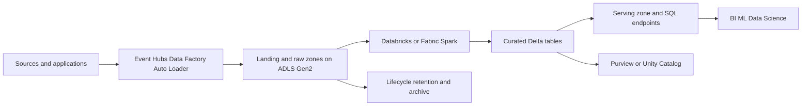
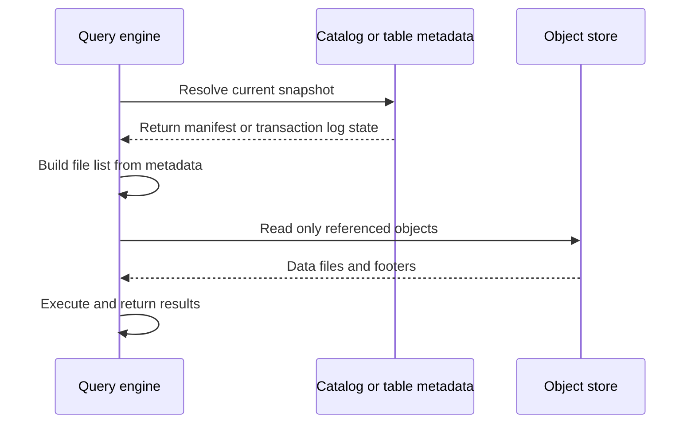
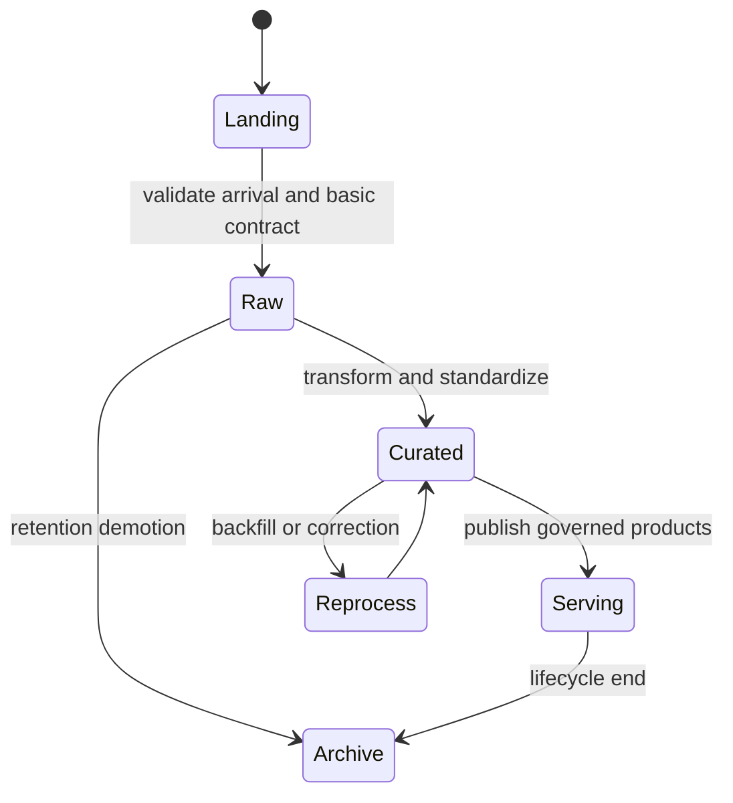

# Object Storage and Data Lakes

> Part of the **Enterprise Data & AI Architecture Handbook** · Phase-04 - Storage Systems & Table Formats · Chapter 03.
> Estimated study time: **60 min reading + ~3h labs**.
> **Prerequisite:** read [Azure Storage Services](../Phase-03/06_Azure_Storage_Services.md) first.

---

## Executive Summary

Object storage is the default physical substrate for modern data lakes because it is cheap, durable, massively scalable, and natively aligned with immutable analytical files. That is the upside. The downside is that object storage is not a distributed file system and not a database. It has different semantics around directories, listing, rename, transactions, and metadata discovery. A reliable data lake architecture therefore depends less on the slogan "store data in the lake" and more on how the platform handles consistency, prefix layout, manifests, partitions, and file-count discipline.

The central operational truth is simple: most lake failures are metadata failures before they become compute failures. Query engines do not usually choke because the bytes are physically unavailable. They choke because a prefix contains millions of small files, a recursive listing takes too long, a metastore view no longer matches the object layout, a commit protocol publishes incomplete partitions, or a raw zone has become a data swamp with no ownership boundary. On Azure, the most effective lake architectures reduce those risks by using ADLS Gen2 hierarchical namespace semantics, disciplined zone design, managed table metadata, and strong governance over naming, retention, and file size.

Object-store consistency also matters more than teams often assume. Azure Blob Storage and ADLS Gen2 provide strong consistency within the primary region, which simplifies lakehouse commit behavior relative to older eventual-consistency assumptions. That does not eliminate failure modes. Cross-region replication is still asynchronous, engine-side metadata caches can still be stale, and listing millions of objects is still expensive in both latency and transaction cost. Table formats such as Delta Lake, Apache Iceberg, and Apache Hudi exist partly because object stores are excellent at storing immutable files and much weaker at being scanned as a giant ad hoc namespace on every query.

The practical conclusion is opinionated. Use object storage deliberately. Build lake zones with explicit purpose, ownership, and retention. Use manifests or transaction logs instead of recursive prefix discovery for shared analytical datasets. Treat the small-file problem as a platform reliability issue, not a cosmetic performance issue. On Azure, default to ADLS Gen2 for enterprise data lakes; in open-source estates, MinIO is a credible S3-compatible lake substrate when operationally justified. Do not confuse a bucket full of files with a governed data platform.

## Learning Objectives

By the end of this chapter you will be able to:

1. Explain how object storage semantics differ from file systems and why that matters for lake design.
2. Reason about consistency, listing behavior, and metadata discovery cost in object-store-backed analytics.
3. Design lake zones, naming conventions, and partition strategies that avoid swamp-like sprawl.
4. Diagnose small-file pathologies and connect them to object-store request economics.
5. Compare metadata and manifest strategies across raw layouts and managed table formats.
6. Build an Azure-first data lake architecture using ADLS Gen2, Databricks, Fabric, Synapse, and Purview.
7. Explain when MinIO is a sound S3-compatible choice for an open-source lakehouse stack.
8. Distinguish storage durability from analytical correctness and table publication safety.
9. Establish governance standards for data lake zones, retention, and access boundaries.
10. Defend lake design trade-offs in a staff-level architecture review.

## Business Motivation

- Object storage is usually the cheapest durable layer for large analytical estates, so most enterprise lake spend starts here.
- Query cost and latency are directly shaped by listing behavior, partition shape, and file counts.
- A lake with weak zoning and ownership quickly becomes a compliance and reliability problem, not just a discoverability problem.
- Enterprises need one shared physical substrate for BI, ML, data science, batch, and streaming workloads.
- Storage-scale durability is easy to buy; operating-discipline around metadata, retention, and publication is not.
- Cloud FinOps programs frequently discover that avoidable object-store transactions and serverless scan amplification are material spend drivers.
- Multi-engine interoperability depends on consistent layout, manifest strategy, and governed publication, not only on choosing Parquet.

## History and Evolution

- Early analytical platforms relied on on-premises NAS, SAN, and distributed file systems with POSIX-like expectations.
- Hadoop popularized HDFS-based data lakes, but operational gravity shifted toward cloud object stores as scale and economics improved.
- Amazon S3 normalized the idea that immutable objects and HTTP APIs could replace file systems for many analytics workloads.
- Azure Blob Storage and later ADLS Gen2 brought object-store economics together with analytics-oriented namespace and ACL features.
- The industry learned that a pile of files is not a lakehouse: metadata, table semantics, lineage, and governance became first-order concerns.
- Delta Lake, Iceberg, and Hudi emerged to address object-store commit, snapshot, and discovery limitations.
- Microsoft Fabric and OneLake further pushed the idea of a shared analytical substrate, while still depending on disciplined metadata and file layout underneath.
- Open-source estates adopted MinIO to bring S3-compatible object semantics to private-cloud and on-premises lakehouse patterns.

## Why This Technology Exists

Object storage exists because enterprises need a durable, low-cost, horizontally scalable place to store enormous volumes of immutable data without paying block- or file-system economics for every byte. Data lakes exist because enterprises also need that storage to support many workloads at once: raw ingestion, replay, batch transformation, BI, ML feature engineering, and archival retention.

As established in [Azure Storage Services](../Phase-03/06_Azure_Storage_Services.md), object stores trade POSIX semantics for scalability, durability, and cost efficiency. That trade is acceptable only if the platform compensates elsewhere. Data lake conventions, metadata catalogs, and table formats are the compensation layer. They make an object namespace usable for analytics by imposing structure, ownership, discovery, and safe publication patterns over a storage substrate that otherwise has little opinion about business meaning.

The technology therefore exists to solve a coordination problem as much as a storage problem. The bytes are easy to persist. Making them discoverable, governable, performant, and safe for concurrent analytical use is the hard part.

## Problems It Solves

| Problem | How object storage and lake design help |
|---|---|
| Cheap durable storage for large datasets | Commodity cloud object storage scales well at low cost |
| Shared persistence for many engines | Spark, SQL, ML, and stream processors can read the same files |
| Separation of storage and compute | Compute clusters can scale independently from persisted data |
| Retention of raw and curated history | Immutable objects preserve replay and audit paths |
| Cross-domain data sharing | Standard lake zones and catalogs expose common data products |
| Multi-engine interoperability | Parquet-backed or manifest-backed datasets remain portable |
| Private-cloud lakehouse substrate | MinIO provides S3-compatible semantics outside public cloud |

## Problems It Cannot Solve

- Object storage does not provide multi-object ACID transactions by itself.
- A bucket or container cannot create business ownership, data quality, or lineage discipline automatically.
- Strong storage durability does not guarantee consistent analytical publication.
- Object storage does not make small files efficient; it often makes them painfully expensive.
- Lake zones do not replace a catalog, schema governance, or access policy model.
- Listing a giant namespace is not a substitute for a manifest or table metadata layer.
- Object storage is a poor fit for high-frequency random-update OLTP patterns.

## Core Concepts

### Object semantics versus file-system semantics

Object stores manage immutable objects addressed by keys or paths, not mutable files on a general-purpose file system. Flat object stores traditionally emulate directories through prefixes. ADLS Gen2 improves this with hierarchical namespace support, directory semantics, and atomic rename behavior, but the physical reality remains object-oriented rather than block-oriented.

### Consistency and listings

Consistency matters at two levels:

1. **Object-store consistency:** whether a newly written or deleted object is immediately visible to readers and listings.
2. **Engine and catalog consistency:** whether Spark, Trino, Synapse, or a metastore is aware of the latest storage state.

Azure Blob Storage and ADLS Gen2 provide strong consistency in the primary region, which simplifies analytical read-after-write expectations. However, listings and metadata scans still cost time and money, and secondary-region replicas remain asynchronous in geo-redundant models.

### Listing costs

Lake workloads frequently perform object discovery before they perform useful compute. Recursive listings, partition enumeration, HEAD requests, and footer reads all translate into object-store transactions. On large lakes, listing can dominate planning latency and contribute meaningful cost. This is one reason transaction logs, manifests, and metadata tables matter.

### Partitioning and prefix layout

Partitioning narrows discovery and scan scope, but over-partitioning increases directory fan-out, file counts, and metadata overhead. Layout is therefore a balancing act between pruning and namespace sprawl. Good lake layouts reflect common filter dimensions, retention logic, and ownership boundaries rather than accidental pipeline implementation details.

### Small-file problem

Thousands or millions of suboptimal objects impose planning, listing, open, and metadata overhead that swamps the actual data volume. The small-file problem degrades performance, raises transaction cost, stresses metastores, and complicates compaction. It is one of the most common root causes of lakehouse instability.

### Zones and conventions

A lake zone is a semantic boundary with explicit policy, not just a folder name. Common enterprise zones include landing, raw, validated, curated, serving, sandbox, and archive. The value of zones comes from clear rules about who writes, who reads, retention, schema expectations, and whether data is publishable.

### Metadata and manifests

Raw prefix scanning does not scale indefinitely. Metadata strategies such as Hive partitions, Delta transaction logs, Iceberg manifests, and Hudi timelines reduce discovery cost and provide safer publication semantics. The general rule is simple: the more shared and business-critical a dataset becomes, the less it should depend on ad hoc recursive listing.

### MinIO as an S3-compatible lake

MinIO provides S3-compatible object storage for private-cloud, edge, or regulated environments that cannot or should not depend entirely on public cloud object services. It is a storage substrate, not a lake governance solution by itself. It still requires catalogs, table formats, access policy, observability, and lifecycle management.

## Internal Working

When a lake ingestion pipeline writes data to object storage, the writer serializes immutable files and commits them to a target prefix. In a raw landing pattern, downstream readers may discover those files by listing the prefix, applying naming conventions, and inferring partitions from paths. In a managed table pattern, downstream readers instead consult a log or manifest layer that points to the relevant files for a specific table snapshot.

Listing is deceptively expensive. A planner may need to enumerate partitions, open files for footer metadata, reconcile discovered objects with metastore entries, and then build a read plan. If the dataset contains millions of tiny files, the cost of discovering what exists can exceed the cost of reading the actual payload. Object storage is durable at scale, but namespace walking is not free.

Consistency is similarly layered. On ADLS Gen2, a write to the primary region becomes strongly visible, which reduces some historical object-store race conditions. That does not mean consumers always see the newest data immediately. Spark caches, SQL endpoint metadata caches, stale manifests, and catalog refresh delays can still produce stale reads. In geo-replicated designs, the secondary copy is also asynchronous, so disaster-recovery reads may lag the primary.

Commit behavior differs materially by storage and table strategy. Plain file drops into a prefix rely on writer discipline and naming conventions. Delta Lake commits a transaction log entry and checkpoints periodically. Iceberg maintains manifest lists and snapshot metadata. Hudi tracks file groups and a timeline. These abstractions exist because object stores are excellent append-and-read substrates and weak transactional discovery systems.

## Architecture

The strongest enterprise architecture separates concerns cleanly:

1. **Storage substrate:** ADLS Gen2 or S3-compatible object storage for durable objects.
2. **Zone model:** landing, raw, curated, serving, and archive boundaries with explicit policy.
3. **Metadata plane:** catalogs, schemas, table metadata, lineage, and data classification.
4. **Compute plane:** Spark, SQL, stream, and ML engines that read from published datasets rather than random prefixes.
5. **Governance plane:** RBAC, ACLs, private networking, retention, lifecycle, and audit.

On Azure, a robust pattern is Event Hubs or batch ingress into raw ADLS Gen2 zones, Azure Databricks or Fabric Spark for transformation, Delta-managed curated and serving zones, Synapse serverless SQL or Databricks SQL for consumption, and Purview or Unity Catalog for governance. Open-source estates often mirror this with MinIO, Spark, Trino, and an external catalog such as Hive Metastore, Nessie, or a managed alternative.

The architecture fails when one namespace tries to be everything at once, or when raw paths are exposed directly as production interfaces. Shared data products should be published, versioned, and governed. Raw landings should remain operational internals.

## Components

| Component | Responsibility | Typical Azure mapping |
|---|---|---|
| Object store | Durable file persistence | ADLS Gen2 Standard GPv2 with HNS |
| Ingestion layer | Land batch or stream files | Event Hubs Capture, Data Factory, Databricks Auto Loader |
| Zone structure | Separate lifecycle and semantics | Containers or filesystems per zone and domain |
| Metadata catalog | Discovery, lineage, schema, policy | Purview, Unity Catalog |
| Table metadata | Published snapshot and file tracking | Delta Lake, Iceberg, Hudi |
| Query engine | Read governed lake data | Databricks SQL, Fabric, Synapse serverless SQL, Trino |
| Lifecycle automation | Tiering and retention | Storage lifecycle policies, pipeline cleanup jobs |
| Observability | Metrics, logs, lineage | Azure Monitor, Log Analytics, OpenTelemetry, Prometheus |
| S3-compatible private storage | Self-hosted object layer | MinIO |

## Metadata

Metadata is what keeps a lake from becoming a swamp.

Important metadata layers include:

| Metadata layer | Purpose | Failure if weak |
|---|---|---|
| Path and naming conventions | Human and engine discoverability | Opaque prefixes and accidental duplication |
| Partition definitions | Pruning and retention logic | Full scans and inconsistent backfills |
| Schema registry or table schema | Type safety | Silent coercion and reader failure |
| Catalog entries | Search and ownership | Undiscoverable or unowned datasets |
| Transaction log or manifest | Safe file discovery | Expensive recursive listing and inconsistent reads |
| Classification tags | Security and compliance | Uncontrolled access to sensitive data |
| Lineage records | Audit and incident triage | Unknown upstream dependencies |

The more shared the lake becomes, the more metadata must be treated as a product. A published finance dataset with no owner, no manifest strategy, and no retention policy is not a platform asset. It is an incident waiting to happen.

## Storage

Object storage design for lakes should optimize for durability, namespace clarity, and operational efficiency.

- Use separate containers or filesystems for major zones or security domains rather than one undifferentiated namespace.
- Prefer ADLS Gen2 with hierarchical namespace for enterprise analytics because rename and ACL semantics materially help data engineering workflows.
- Keep active lake data on hot or cool tiers according to access pattern; archive is usually unsuitable for datasets that back interactive analytics.
- Choose ZRS or GZRS for business-critical production lakes where zonal or regional durability requirements justify the premium.
- Use lifecycle rules for raw retention and archival demotion, but treat shared serving data more conservatively.

Storage is rarely the narrowest bottleneck in a healthy lake. Poor file and namespace design usually dominates first.

## Compute

Compute engines interact with lakes very differently depending on how datasets are published.

- Spark and Databricks can handle both raw prefix scans and managed tables, but managed tables scale operationally better.
- Synapse serverless SQL and Fabric external access become expensive quickly when partition and file design are weak.
- Trino benefits from object-store-aware connectors but still suffers from namespace sprawl and tiny files.
- Streaming engines often create the small-file problem unless compaction is explicitly designed.

The core compute rule is that engines should consume publishable zones and metadata-aware tables whenever possible. Raw directories are for pipelines, not for broad enterprise query surfaces.

## Networking

Object-store lakes are remote systems. Every listing, read, HEAD, and footer fetch is a network operation.

- Small files multiply network round trips.
- Deep recursive listing magnifies latency before query execution begins.
- Cross-region reads add egress cost and disaster-recovery complexity.
- Private endpoints and VNet integration improve security but can expose DNS and throughput design flaws.
- Network planning matters for self-hosted MinIO clusters because erasure coding, node fan-out, and east-west traffic are part of normal operation.

In practice, network cost and object transaction cost are often symptoms of bad layout rather than insufficient bandwidth.

## Security

Lake security must assume that object paths and metadata are sensitive.

- Use Entra ID, RBAC, ACLs, private endpoints, and public-access denial by default for ADLS Gen2.
- Separate highly sensitive domains into distinct storage accounts or containers where blast radius warrants it.
- Apply catalog-level access control for published datasets instead of distributing raw path access broadly.
- Use immutability, soft delete, versioning, and logging where regulatory or ransomware posture requires them.
- Treat MinIO credentials, policies, and KMS integrations with the same rigor as cloud storage identities.

The security anti-pattern is direct path sprawl: too many humans and tools reading arbitrary raw prefixes with broad permissions because the catalog is incomplete.

## Performance

| Performance lever | Why it matters |
|---|---|
| Partition design | Reduces scan scope and object discovery work |
| File size discipline | Avoids excessive open and planning overhead |
| Manifest or log strategy | Replaces brute-force recursive listing |
| Zone separation | Prevents mixed workloads from polluting prefixes |
| Strong naming conventions | Simplifies partition inference and lifecycle cleanup |
| Compaction | Converts streaming or CDC output into efficient analytical files |

The dominant lake performance problem is usually not raw object throughput. It is metadata amplification: too many files, too many partitions, too many listing operations, or too much reliance on path scanning instead of metadata-aware publication.

## Scalability

Object storage scales extremely far in capacity and object count, but lake usability does not scale automatically with it. A lake can hold exabytes and still be operationally unusable if the namespace is chaotic.

Scalability requires:

1. stable naming and partition conventions,
2. automated compaction,
3. metadata-aware table formats for shared datasets,
4. bounded retention of raw operational landings,
5. governance that prevents each team from inventing a new layout standard.

MinIO also scales well when deployed correctly, but self-managed scaling introduces cluster, network, and durability planning responsibilities that public cloud object stores abstract away.

## Fault Tolerance

Durable object storage protects bytes, not publication correctness.

- ADLS Gen2 redundancy protects objects against hardware, zone, and some regional failures depending on SKU.
- Table metadata protects readers from partial publish states when used correctly.
- Versioning, soft delete, and immutable retention reduce accidental deletion impact.
- MinIO erasure coding protects against disk and node failures but still requires sound operational procedures.
- Disaster recovery must account for asynchronous geo-replication and metadata-system recovery, not just blob durability.

The most common false assumption is that because the object store is durable, the lake is reliable. A half-published table on durable storage is still an outage.

## Cost Optimization

| Cost lever | Mechanism | Typical Azure effect |
|---|---|---|
| Compaction | Fewer objects and requests | Lower ADLS transaction cost and faster queries |
| Better partitioning | Fewer scanned files | Lower Synapse/Fabric/Databricks cost |
| Lifecycle rules | Move stale raw data to cheaper tiers | Lower storage cost |
| Manifest-based reads | Less recursive listing | Lower planning latency and request count |
| Bound raw retention | Avoid duplicate long-lived copies | Lower storage and governance overhead |

FinOps teams should treat list and metadata operations as real cost drivers. A lake that looks cheap per GB can still be expensive per useful query if every workload enumerates millions of objects before reading any data.

## Monitoring

Monitor lake health at the namespace, table, and policy layers:

- object count and average file size by zone,
- files created per hour from stream and batch pipelines,
- recursive listing latency for critical prefixes,
- query bytes scanned versus rows returned,
- compaction backlog,
- raw-zone retention drift,
- access-denied and anonymous-access events,
- catalog freshness and metadata refresh failures.

For MinIO, also monitor disk health, healing operations, erasure-set balance, and API latency by verb.

## Observability

Observability should answer four questions quickly:

1. Which files were published for this dataset snapshot?
2. How many object-store operations did the query perform before reading useful data?
3. Did stale metadata, stale cache, or stale manifests contribute to the incident?
4. Which team owns the prefix, schema, and retention policy?

Useful signals include storage access logs, query plans, catalog refresh events, Delta or Iceberg metadata history, object operation histograms, lineage graphs, and compaction job traces. Without these signals, lake incidents are often misdiagnosed as generic cluster or network problems.

## Governance

The lake governance model should define at least the following:

1. approved zone taxonomy,
2. approved naming and partition conventions,
3. dataset ownership requirements,
4. retention and legal-hold policy by zone,
5. publication rules for shared datasets,
6. allowed table formats and manifest strategies,
7. access patterns for raw versus curated data,
8. exception process for self-managed object storage such as MinIO.

Good governance keeps raw landings operationally necessary and socially invisible. Consumers should experience the lake through published data products, not through scavenging prefixes.

## Trade-offs

| Choice | Benefit | Cost | When not to use |
|---|---|---|---|
| Direct path reads | Simple for prototypes | Brittle and expensive at scale | Shared production datasets |
| Fine-grained partitions | Better pruning | More files and more listings | Low-volume, high-cardinality keys |
| Large raw retention window | Easier replay | More storage and governance burden | Domains with low replay value |
| MinIO self-hosting | Data sovereignty and private-cloud control | Operational burden | Teams without storage operations maturity |
| Single giant storage account | Simpler on day one | Governance and blast-radius problems | Multi-domain enterprise platforms |
| Table manifests and logs | Better discovery and correctness | Additional metadata systems | Tiny one-off datasets |

## Decision Matrix

| Scenario | Recommended approach | Reason |
|---|---|---|
| Enterprise Azure lakehouse | ADLS Gen2 + Delta-managed published zones | Strong Azure integration, HNS semantics, safer publication |
| Shared curated datasets across many engines | Manifest or transaction-log-backed tables | Avoid brute-force listing and stale prefix assumptions |
| Regulated private-cloud analytics | MinIO + Spark/Trino + external catalog | S3-compatible control in private environment |
| Short-lived experimental data | Simple zone with bounded retention | Governance overhead can stay lighter |
| Streaming raw telemetry | Landing zone with strict retention and scheduled compaction | Prevent small-file swamp |
| Cross-region disaster recovery lake | GZRS plus tested metadata recovery plan | Storage durability alone is insufficient |
| Very high-cardinality time ingestion | Partition conservatively, cluster within files, compact often | Avoid namespace explosion |

## Design Patterns

1. **Landing-to-published pattern:** land raw data fast, publish curated data through managed tables only.
2. **Zone-by-policy pattern:** define each zone by retention, writer, reader, and quality expectations.
3. **Manifest-first query pattern:** shared consumers resolve snapshots through metadata, not recursive path discovery.
4. **Compact-after-streaming pattern:** micro-batches land frequently, publication compacts on a separate cadence.
5. **Domain-isolated storage pattern:** separate highly sensitive or high-throughput domains into deliberate account or container boundaries.
6. **Replay-window pattern:** keep raw retention long enough for backfill and incident replay, not forever by default.
7. **MinIO control-plane pattern:** pair MinIO with a catalog, IAM-like policy, KMS, and observability stack before exposing it broadly.

## Anti-patterns

1. Treating the raw zone as a production query interface.
2. Partitioning on a nearly unique field such as `user_id` or `event_id`.
3. Writing tiny files continuously without compaction.
4. Using one storage account or bucket for every domain, environment, and retention policy.
5. Assuming object-store strong consistency removes the need for metadata refresh or commit discipline.
6. Letting each team invent its own directory naming pattern.
7. Relying on recursive listing for all shared analytical queries.
8. Deploying MinIO as a cheap bucket replacement without planning backup, healing, upgrades, or KMS.

## Common Mistakes

- **Mistake:** believing folders in flat object storage are real directories with cheap rename semantics.  
  **Consequence:** incorrect assumptions about commit and delete behavior.  
  **Fix:** understand the object-store namespace and use HNS-aware or manifest-aware publication patterns.

- **Mistake:** exposing bronze or raw paths directly to analysts.  
  **Consequence:** inconsistent business logic, duplicate scans, and governance drift.  
  **Fix:** publish curated or serving tables only.

- **Mistake:** optimizing storage tier before fixing file-count explosion.  
  **Consequence:** cost and latency remain poor.  
  **Fix:** compact first, then revisit tier and codec choices.

- **Mistake:** treating MinIO compatibility as full ecosystem equivalence without testing.  
  **Consequence:** connector edge cases and policy surprises.  
  **Fix:** validate every engine and IAM assumption in a realistic environment.

- **Mistake:** using path names as the only metadata system.  
  **Consequence:** no ownership, weak lineage, and brittle downstream logic.  
  **Fix:** require a catalog and published schemas for shared datasets.

## Best Practices

1. Default to ADLS Gen2 with hierarchical namespace for Azure-based enterprise lakes.
2. Separate raw, curated, and serving concerns physically or logically with explicit policy.
3. Use Delta, Iceberg, or Hudi for shared analytical publication rather than direct prefix reads.
4. Bound raw retention based on replay value and compliance need.
5. Compact aggressively after high-frequency ingestion.
6. Design partitions around real predicates and retention logic, not developer convenience.
7. Measure listing and planning latency explicitly.
8. Keep raw paths out of end-user BI tools.
9. Treat metadata quality as production-critical.
10. Use MinIO only when the operational ownership model is explicit and funded.

## Enterprise Recommendations

Recommended enterprise defaults:

- **Azure lake substrate:** ADLS Gen2 Standard GPv2 with HNS enabled.
- **Zone model:** landing, raw, curated, serving, archive, and sandbox with documented purpose.
- **Publication model:** Delta-managed curated and serving datasets unless a cross-engine requirement clearly favors Iceberg or Hudi.
- **Operational standard:** compaction, lifecycle policy, catalog registration, and lineage capture are mandatory, not optional.
- **Open-source exception:** MinIO is approved only for private-cloud, sovereign, or edge cases with a named platform owner.

### ADR example: metadata and publication strategy for shared lake datasets

**Context:** Multiple teams want to publish shared analytical datasets on object storage. Some propose simple path-based contracts because they are easy to start with. Others want managed tables and a catalog. The estate uses Azure Databricks, Synapse serverless SQL, and some Trino workloads.

**Decision:** Use ADLS Gen2 as the storage substrate, but require shared curated and serving datasets to be published through Delta-managed tables registered in a governed catalog. Raw paths remain internal to pipelines. Direct prefix contracts are allowed only for isolated one-team datasets with bounded retention.

**Consequences:** Query planning improves, publication safety improves, governance is clearer, and storage discovery costs fall. Some lightweight use cases carry extra metadata overhead, but the shared-platform reliability gain is worth it.

**Alternatives considered:**

1. Path-only contracts: rejected because recursive listing and ownership drift do not scale.
2. One global bucket with folder conventions only: rejected because governance and blast radius were too weak.
3. MinIO for all environments: rejected because public-cloud native services already met the majority requirement more simply.

## Azure Implementation

The Azure-first implementation pattern is straightforward:

1. ADLS Gen2 as the durable object substrate.
2. Separate containers or filesystems by zone and sometimes by domain.
3. Event Hubs, Data Factory, or Databricks Auto Loader for ingestion.
4. Databricks or Fabric Spark for curation and compaction.
5. Delta-managed curated and serving tables.
6. Purview or Unity Catalog for discovery, lineage, and policy.
7. Synapse serverless SQL or Databricks SQL for published consumption.

### Bicep: ADLS Gen2 account for enterprise lake zones

```bicep
param location string = resourceGroup().location
param storageAccountName string

resource lake 'Microsoft.Storage/storageAccounts@2023-05-01' = {
  name: storageAccountName
  location: location
  sku: {
    name: 'Standard_GZRS'
  }
  kind: 'StorageV2'
  properties: {
    isHnsEnabled: true
    accessTier: 'Hot'
    minimumTlsVersion: 'TLS1_2'
    allowBlobPublicAccess: false
    supportsHttpsTrafficOnly: true
  }
}
```

### Azure CLI: create a filesystem for a curated zone

```powershell
az storage fs create \
  --account-name contosolake \
  --name curated \
  --auth-mode login
```

### Databricks: compact and publish a curated Delta dataset

```python
from pyspark.sql import functions as F

raw_path = "abfss://raw@contosolake.dfs.core.windows.net/sales/orders/"

df = (spark.read.format("json").load(raw_path)
      .withColumn("order_date", F.to_date("order_timestamp")))

(df.repartition("order_date")
   .sortWithinPartitions("order_date", "country_code")
   .write
   .format("delta")
   .mode("overwrite")
   .option("delta.autoOptimize.optimizeWrite", "true")
   .option("delta.autoOptimize.autoCompact", "true")
   .partitionBy("order_date")
   .saveAsTable("curated.sales_orders"))
```

### Synapse serverless SQL: read published data instead of raw paths

```sql
SELECT
    order_date,
    country_code,
    SUM(net_amount) AS total_net_amount
FROM OPENROWSET(
    BULK 'https://contosolake.dfs.core.windows.net/curated/sales_orders/*',
    FORMAT = 'PARQUET'
) WITH (
    order_date DATE,
    country_code VARCHAR(2),
    net_amount DECIMAL(18,2)
) AS rows
WHERE order_date >= '2026-07-01'
GROUP BY order_date, country_code;
```

Operational Azure guidance:

- Prefer one storage account per major security or scale boundary rather than one global account.
- Use private endpoints, firewall restrictions, managed identities, and ACLs for all production lake zones.
- Capture lineage and classification on curated and serving tables before exposing them broadly.
- Use lifecycle policies for raw retention and cleanup, not for active serving datasets.

## Open Source Implementation

An open-source lakehouse pattern typically combines MinIO, Spark, Trino, and a metadata layer such as Iceberg catalog or Hive Metastore.

### Docker Compose: MinIO for a private lake sandbox

```yaml
services:
  minio:
    image: minio/minio:RELEASE.2026-06-13T11-33-47Z
    command: server /data --console-address ":9001"
    environment:
      MINIO_ROOT_USER: minioadmin
      MINIO_ROOT_PASSWORD: minioadmin123
    ports:
      - "9000:9000"
      - "9001:9001"
    volumes:
      - minio-data:/data

volumes:
  minio-data:
```

### Spark configuration for MinIO via S3A

```python
spark.conf.set("spark.hadoop.fs.s3a.endpoint", "http://localhost:9000")
spark.conf.set("spark.hadoop.fs.s3a.access.key", "minioadmin")
spark.conf.set("spark.hadoop.fs.s3a.secret.key", "minioadmin123")
spark.conf.set("spark.hadoop.fs.s3a.path.style.access", "true")
spark.conf.set("spark.hadoop.fs.s3a.connection.ssl.enabled", "false")

(spark.read.parquet("s3a://curated/sales_orders/")
   .write
   .format("iceberg")
   .mode("overwrite")
   .save("catalog.analytics.sales_orders"))
```

### Trino catalog example for Iceberg on MinIO

```properties
connector.name=iceberg
iceberg.catalog.type=hive_metastore
hive.metastore.uri=thrift://metastore:9083
fs.native-s3.enabled=true
s3.endpoint=http://minio:9000
s3.path-style-access=true
s3.aws-access-key=minioadmin
s3.aws-secret-key=minioadmin123
```

Open-source guidance:

- Validate S3 compatibility across every engine and connector you intend to support.
- Pair MinIO with TLS, KMS, backup, lifecycle, and metrics from day one.
- Prefer table formats over raw prefix discovery for shared datasets just as you would in cloud-native environments.

## AWS Equivalent (comparison only)

| Azure pattern | AWS equivalent | Advantages | Disadvantages | Migration note |
|---|---|---|---|---|
| ADLS Gen2 enterprise lake | Amazon S3 | Broad ecosystem support | Different namespace and ACL semantics | Rework HNS and RBAC assumptions |
| Purview or Unity Catalog governance | Glue Catalog, Lake Formation, Unity Catalog on AWS | Deep ecosystem options | Policy model differs materially | Migrate governance model, not only files |
| Synapse/Fabric serverless scans | Athena | Easy pay-per-scan model | Equally sensitive to partition and file design | Re-benchmark listing and bytes-scanned economics |
| Databricks on Azure | Databricks on AWS or EMR Spark | Similar Spark patterns | Supporting services differ | Keep file and table layout portable |

Selection criteria:

- Choose AWS equivalence when the surrounding compute and governance estate is already centered there.
- Preserve open formats and manifest-backed tables so migration is mostly platform reconfiguration rather than data redesign.

## GCP Equivalent (comparison only)

| Azure pattern | GCP equivalent | Advantages | Disadvantages | Migration note |
|---|---|---|---|---|
| ADLS Gen2 enterprise lake | Google Cloud Storage | Durable global-scale object storage | Different access-control and namespace behavior | Review path, IAM, and lifecycle semantics |
| Purview or Unity Catalog | Dataplex, BigLake, or external catalogs | Strong governance integration options | Architectural center of gravity may move toward BigQuery | Reassess which datasets remain open-lake first |
| Synapse or Fabric external queries | BigQuery external tables / BigLake | Tight analytics integration | Native BigQuery tables change economics | Compare external and native strategies carefully |
| Databricks or Fabric Spark | Dataproc or Databricks on GCP | Flexible Spark options | Operational model differs | Re-test object-discovery and caching assumptions |

Selection criteria:

- GCP is attractive when BigQuery is the main analytical surface, but open-lake portability still depends on disciplined file and metadata design.
- If lake interoperability matters, keep the publication layer format- and catalog-aware instead of path-contract-aware.

## Migration Considerations

Typical migrations include on-premises HDFS to ADLS Gen2, raw path-based lakes to managed lakehouse tables, and public-cloud object stores to private MinIO deployments for sovereign requirements.

Migration sequence:

1. Inventory every dataset by owner, retention, sensitivity, and consumer type.
2. Separate operational landings from published analytical data before migrating namespaces.
3. Normalize naming and partition conventions before scale-out replication.
4. Introduce a manifest or transaction-log strategy for shared datasets.
5. Compact and rewrite pathological small-file partitions during the move.
6. Rebuild lineage and access policy mappings explicitly.

Key risks:

- stale assumptions about rename and consistency,
- broken partition discovery,
- hidden consumer dependence on raw path shape,
- security drift during ACL or IAM translation,
- dual-run cost spikes,
- object-count shock when raw historic data is copied unchanged.

## Mermaid Architecture Diagrams

### Azure enterprise lake architecture



### Manifest-driven query flow



### Zone lifecycle state model



## End-to-End Data Flow

1. A source system emits files or events into a landing zone.
2. Ingestion services persist immutable objects into ADLS Gen2 or MinIO.
3. Validation jobs classify the data, enforce schema expectations, and route it into the appropriate raw or domain prefix.
4. Transformation jobs compact, partition, and standardize the data into curated datasets.
5. Managed table metadata records the current published snapshot.
6. Catalog services register ownership, schema, lineage, and sensitivity tags.
7. Query engines resolve the published snapshot through metadata rather than by brute-force namespace scanning.
8. Consumers access curated or serving datasets through governed compute endpoints.
9. Lifecycle policies age out or demote raw and archival data according to policy.
10. Observability systems capture object operations, publish history, and compaction health.

## Real-world Business Use Cases

| Use case | Lake design emphasis |
|---|---|
| Retail clickstream lake | Short raw retention, heavy compaction, curated serving tables |
| Industrial IoT history | Time-based partitioning, replay windows, strict lifecycle control |
| Financial audit lake | Immutable retention, strong cataloging, controlled serving interfaces |
| Healthcare claims platform | Domain-separated sensitive zones and governed curated products |
| Multi-country enterprise analytics | Domain ownership, regional boundaries, and published data products |

## Industry Examples

- Azure-centric lakehouse programs commonly standardize on ADLS Gen2 plus Databricks or Fabric because HNS semantics, ACLs, and governance integration reduce operational friction.
- Large Spark estates learned repeatedly that the small-file problem is a platform problem, not just a query-optimization problem.
- Mature lakehouse teams use Delta, Iceberg, or Hudi to reduce listing dependence and publication risk.
- Regulated private-cloud programs increasingly use MinIO as the object substrate, but only when the team is prepared to own storage operations.

The industry pattern is consistent: object storage wins on durability and scale, while metadata discipline determines whether the lake remains usable.

## Case Studies

### Case study 1: Data swamp through zone collapse

An enterprise built one giant raw container and allowed every domain to land, curate, and serve data inside it. Access policies were broad, naming conventions drifted, and analysts started querying semi-processed prefixes directly. The storage was durable and cheap, but the lake became ungovernable. The recovery path involved introducing explicit zones, publishing curated tables, and revoking broad raw-path access. The lesson was that a lake without policy boundaries becomes a swamp regardless of storage quality.

### Case study 2: Listing storm after CDC expansion

A CDC pipeline wrote thousands of small Parquet files per hour across many date partitions. Query planners spent significant time listing objects and opening footers before doing useful work. Compaction, lower-frequency publication, and Delta-managed discovery reduced both latency and object-store transaction volume. The lesson was that storage throughput was not the problem; namespace discovery was.

### Case study 3: Sovereign analytics with MinIO

A regulated organization needed S3-compatible storage inside a private environment. MinIO met the storage requirement, but early deployments underestimated observability, backup, and upgrade discipline. After adding KMS integration, structured metrics, tested restore procedures, and manifest-backed tables, the platform stabilized. The lesson was that self-hosting object storage shifts platform responsibility upward, not downward.

## Hands-on Labs

1. Build an ADLS Gen2 zone structure and register curated datasets in a governed catalog.
2. Create a streaming pipeline that intentionally produces small files, then measure the effect of compaction.
3. Compare raw path scans versus Delta- or Iceberg-backed table reads for the same dataset.
4. Apply lifecycle policies to a raw zone and validate retention behavior safely.
5. Stand up a local MinIO sandbox and read/write it from Spark using S3A.

## Exercises

1. Why does strong consistency in ADLS Gen2 not eliminate stale-read incidents entirely?
2. What is the difference between storage durability and analytical publication correctness?
3. Why are recursive listings a cost problem, not just a latency problem?
4. When does partitioning help and when does it become harmful?
5. Why should raw zones usually not be exposed to BI users?
6. What problem do Delta logs or Iceberg manifests solve on object storage?
7. When is MinIO a sound architectural choice?
8. Why is the small-file problem often created by streaming pipelines?
9. How would you explain a data swamp to a non-technical executive?
10. Which signals would prove that metadata discovery is the query bottleneck?

## Mini Projects

1. Build a lake layout linter that validates zone names, partition conventions, and average file size thresholds.
2. Implement a compaction scorecard that reports per-table file count, listing latency, and request amplification.
3. Create a MinIO-based local lakehouse sandbox with Spark, Trino, and an Iceberg catalog for integration testing.

## Capstone Integration

This chapter provides the storage and namespace design layer for a larger enterprise lakehouse capstone. A credible platform combines the storage controls from [Azure Storage Services](../Phase-03/06_Azure_Storage_Services.md) with explicit zone policy, table publication, lineage, lifecycle, and compaction. The capstone should treat raw ingestion, curated publication, serving interfaces, and archival policy as distinct platform concerns even when they share the same underlying object substrate.

## Interview Questions

1. Why is object storage the default substrate for data lakes?
   **A:** Object storage offers virtually unlimited, cheap, durable capacity decoupled from compute, with a simple HTTP-based API that any engine can integrate with — this combination of low cost, elastic scale, and broad compatibility is why it replaced HDFS-style storage as the default lake substrate.
2. What is the small-file problem and why is it expensive?
   **A:** The small-file problem is when a dataset accumulates a very large number of small files instead of fewer, appropriately-sized ones, expensive because each file incurs fixed per-request overhead (open, metadata lookup, network round trip) that dominates the actual data-transfer time — many small files can make a scan slower than one large file with the same total data volume.
3. How does ADLS Gen2 differ from a flat object store in ways that matter to data engineers?
   **A:** ADLS Gen2's Hierarchical Namespace adds atomic directory rename and true directory semantics, which matters for lakehouse operations like atomically swapping a directory of new data into place, and for POSIX-style ACLs that a flat object store's key-prefix model can't provide natively.
4. Why are manifests or transaction logs useful on object storage?
   **A:** Object storage has no native concept of a multi-file atomic transaction, so a manifest/transaction log (as used by Delta, Iceberg, Hudi) provides an authoritative, atomically-updated record of exactly which files constitute the current valid state of the table, letting readers get a consistent view without listing the raw storage directly.
5. What is the difference between a raw zone and a curated zone?
   **A:** The raw zone holds data close to its original source format with minimal transformation (for full-fidelity replay/audit purposes); the curated zone holds cleaned, validated, transformed data in a governed table format optimized for analytical consumption — consumers should generally read from curated, not raw.
6. Why can listing operations become a bottleneck?
   **A:** Listing a directory with a very large number of objects requires paginated API calls proportional to object count, which is slow and can itself become a throttled, costly operation — this is why table formats maintain their own manifest/log instead of relying on a live directory listing to know which files exist.
7. When would you use MinIO instead of a public-cloud object store?
   **A:** For on-premises or air-gapped environments requiring S3-compatible object storage without cloud connectivity, or for a specific portability/multi-cloud strategy — for a standard Azure-native deployment, ADLS Gen2 is typically the better default given its managed operational model.
8. Why is strong consistency not the whole story for lake correctness?
   **A:** Modern cloud object stores now generally provide strong read-after-write consistency for individual objects, but a lake's correctness also depends on atomic multi-file/multi-object operations (a table's transaction boundary), which the object store's per-object consistency guarantee alone doesn't provide — that's the table format's job.

## Staff Engineer Questions

1. How would you define a zone taxonomy that remains useful across many domains?
   **A:** Use a small, consistent set of zones (raw, curated/silver, serving/gold) with a clear, documented purpose and access-control policy for each, applied uniformly across all domains — a taxonomy that varies ad hoc per domain undermines cross-domain governance and discoverability.
2. Which metrics would you track to prove a lake is healthy at the metadata layer?
   **A:** Average file size per table (catching small-file drift), manifest/transaction-log size growth rate, and listing/metadata-operation latency trends — these surface metadata-layer degradation before it becomes a user-visible query-performance incident.
3. How would you design a compaction strategy for high-frequency CDC feeds?
   **A:** Schedule frequent, incremental compaction of recently-written small files (since CDC feeds naturally write many small commits) while less frequently compacting older, already-consolidated data, balancing compaction compute cost against the small-file accumulation rate.
4. When would you allow direct path contracts between producers and consumers?
   **A:** Rarely, and only for a low-risk, tightly-coupled internal integration where both sides are willing to accept the coupling risk — direct path contracts bypass the table format's schema/versioning governance and should be the exception, with a governed table interface as the default.
5. How would you quantify the cost of recursive listing in a large estate?
   **A:** Measure the API request cost and latency of a full recursive listing against a table's manifest-based file enumeration for the same table — the delta reveals exactly how much a table-format's manifest avoids in unnecessary listing overhead at scale.
6. What controls are required before approving MinIO for a regulated workload?
   **A:** Documented encryption-at-rest and in-transit configuration, an operational plan for patching and scaling the self-managed MinIO cluster, and a disaster-recovery/backup strategy equivalent to what a managed cloud object store would provide by default — self-managed storage shifts these responsibilities onto the team.
7. How would you migrate a path-contract lake to a managed-table lakehouse incrementally?
   **A:** Wrap existing raw files with a table format (Delta/Iceberg) one table at a time, validate that consumers reading via the new table interface get identical results to the old path-based access, and only then deprecate the direct path access for that table — table-by-table migration avoids a risky, disruptive big-bang cutover.
8. Which team should own raw retention policy and why?
   **A:** A platform/data-governance team should own the default raw-retention policy (balancing replay needs against storage cost) while domain teams can request documented exceptions for specific regulatory or business needs — leaving retention entirely to individual domain teams risks inconsistent, ungoverned data hoarding.

## Architect Questions

1. What should be the enterprise default substrate and publication strategy for lake data?
   **A:** ADLS Gen2 with HNS enabled as the storage substrate, and a governed table format (Delta as the Azure-native default) as the publication interface — consumers should access data through the table format, not raw paths, by default.
2. How do storage-account boundaries map to blast radius, compliance, and scale concerns?
   **A:** Each storage account boundary determines the scope of a security incident, the applicable redundancy/compliance policy, and the account-level throughput/quota ceiling — splitting accounts by data classification and domain limits blast radius and avoids one domain's volume hitting shared account-level quota limits.
3. When is one global lake account acceptable and when is it not?
   **A:** Acceptable for a small organization with uniform data classification and low volume; not acceptable once multiple domains with different compliance requirements or high combined throughput risk hitting shared account-level quota limits or creating unacceptable shared blast radius.
4. How does object-store semantics influence table format choice?
   **A:** All major table formats (Delta, Iceberg, Hudi) are designed around object storage's eventually-listable, strongly-read-after-write-consistent semantics and its lack of native atomic multi-file transactions — this is exactly the gap each format's transaction log/manifest mechanism is built to fill, so the choice of table format matters less for object-store compatibility than for the specific metadata/catalog features needed.
5. What governance rules prevent a lake from becoming a swamp?
   **A:** Mandatory zone taxonomy with access-control boundaries, required table-format wrapping before data is discoverable to broad consumers, and a data-classification/ownership tag required at ingestion — a lake without these controls accumulates ungoverned, undiscoverable, duplicate data over time.
6. How would you design disaster recovery for both objects and metadata systems?
   **A:** Replicate the underlying object storage (GRS/GZRS) and separately ensure the table format's transaction log/catalog metadata is included in that same replication scope — recovering the raw objects without the metadata describing which files constitute a valid table version leaves the lake unusable even though the bytes technically survived.
7. What evidence is sufficient to approve MinIO instead of native cloud storage?
   **A:** A documented business driver (air-gapped environment, specific multi-cloud portability requirement) plus a credible operational plan for the ongoing self-management burden — approving it for cost savings alone without accounting for the added operational responsibility is usually a false economy.
8. Which workloads should never read directly from raw landings?
   **A:** Any workload feeding customer-facing, financial, or regulatory-reporting output should never read raw landing data directly, since raw data lacks the validation, deduplication, and governance controls applied in the curated zone — direct raw access should be reserved for internal debugging/reprocessing use cases only.

## CTO Review Questions

1. Are we operating a governed lake or just accumulating low-cost files?
   **A:** The test is whether data is discoverable, owned, and access-controlled through a catalog and zone taxonomy, versus simply being cheap to store with no governance — cheap storage without governance is a swamp regardless of the underlying technology's sophistication.
2. Which parts of our cloud spend are driven by bad file-count and listing behavior rather than real data volume?
   **A:** This is auditable via per-table average file size and listing-operation cost metrics — tables with disproportionately high request costs relative to their actual data volume are typically small-file-driven and represent avoidable, fixable spend.
3. Do we have named owners and lifecycle policy for every major lake zone?
   **A:** This should be answerable from a governance registry, not investigation — an unowned zone or table is a governance gap that typically surfaces expensively during an audit or incident rather than being caught proactively.
4. What business risk arises if analysts consume raw paths directly?
   **A:** Raw data lacking validation and deduplication can silently feed incorrect figures into analyst-driven decisions or reports, and any schema change to raw data (outside governance) can break analyst queries with no warning — this is a data-quality and reporting-accuracy risk that a curated-zone-only access policy directly mitigates.
5. If a region fails, do we know how to recover both objects and lake metadata safely?
   **A:** This should be demonstrable via an actual DR drill recovering both the replicated storage and the table format's metadata/catalog together — an untested assumption that "storage replication covers it" often misses that table-format metadata must be recovered consistently with the data files it describes.
6. Are we choosing self-managed storage for valid strategic reasons or only to avoid visible cloud line items?
   **A:** Self-managed storage (MinIO) shifts cost from a visible cloud bill to less-visible internal operational effort — if the total cost of ownership (including that operational effort) isn't genuinely lower or the strategic driver isn't real, this is cost-shifting rather than cost-saving.

## References

- Azure Blob Storage and ADLS Gen2 documentation.
- Microsoft Learn guidance for Azure Storage lifecycle management, private endpoints, and hierarchical namespace.
- Delta Lake, Apache Iceberg, and Apache Hudi documentation for table metadata and snapshot management.
- MinIO documentation for deployment, erasure coding, IAM-style policies, and KMS integration.
- Trino, Spark, and Synapse documentation for object-store-backed analytical access.

## Further Reading

- FinOps guidance for object-store transactions and serverless scan costs.
- Lakehouse design papers and engineering write-ups on metadata scaling.
- Operational postmortems on small-file incidents and namespace sprawl.
- Private-cloud object storage operations guidance.
- Catalog and lineage implementation guides for enterprise analytics platforms.