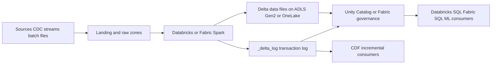
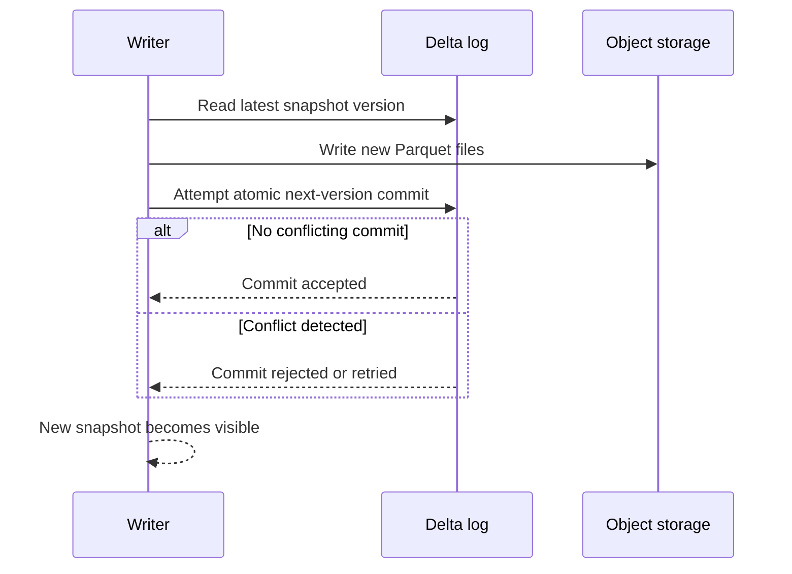
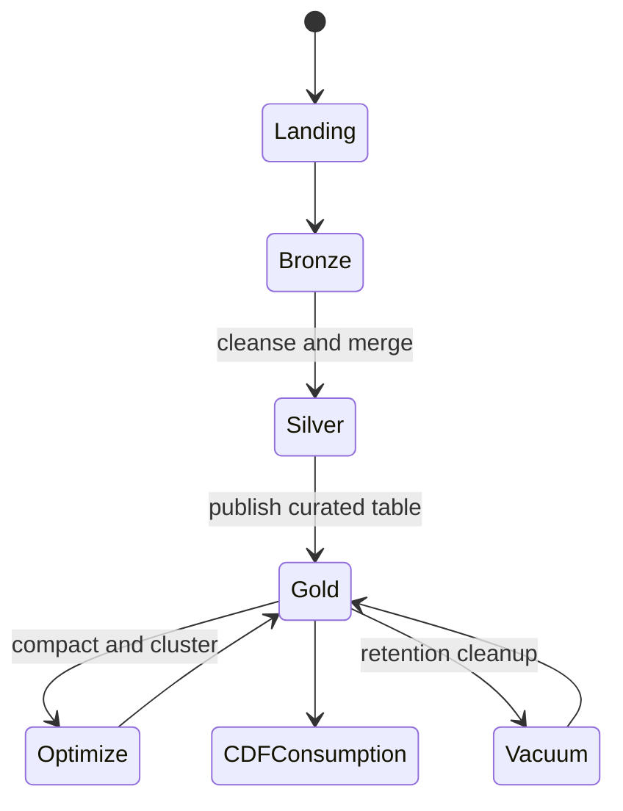

# Delta Lake

> Part of the **Enterprise Data & AI Architecture Handbook** · Phase-04 - Storage Systems & Table Formats · Chapter 04.
> Estimated study time: **75 min reading + ~5h labs**.
> **Prerequisite:** read [Object Storage and Data Lakes](03_Object_Storage_and_Data_Lakes.md) first.

---

## Executive Summary

Delta Lake exists because object storage is a strong substrate for immutable analytical files and a weak substrate for trustworthy shared tables. Raw Parquet on a lake can be fast and portable, but it does not by itself provide multi-writer ACID semantics, safe concurrent updates, reliable change capture, or a scalable answer to "what files make up the current table state?" Delta Lake addresses those gaps by adding a transaction log, protocol-governed table features, optimistic concurrency control, checkpoints, and table maintenance operations that turn object-store files into a lakehouse table with predictable behavior.

The core implementation is deceptively simple. A Delta table is still files on object storage plus a `_delta_log` directory containing ordered commit files and periodic checkpoints. The practical effect is much larger than the mechanism suggests. Readers can reconstruct a consistent snapshot without brute-force listing. Writers can detect conflicting concurrent changes. Operators can time travel to older versions, apply `MERGE` for CDC upserts, compact files with `OPTIMIZE`, and expose downstream incremental changes through Change Data Feed. On supported runtimes, deletion vectors further reduce rewrite pressure for row-level deletes and updates.

On Azure, Delta Lake is a first-class operational pattern rather than a theoretical abstraction. Azure Databricks uses Delta as the default table layer for many lakehouse workloads and exposes mature operational features around Photon, Unity Catalog, auto compaction, predictive optimization, data skipping, Z-ORDER, liquid clustering, CDF, and deletion vectors. Microsoft Fabric uses Delta-backed Lakehouse tables in OneLake and gives Spark and SQL-based consumers a shared analytical substrate, though advanced Delta protocol features should always be validated against the current Fabric runtime before assuming parity with Databricks.

The most important architectural conclusion is opinionated. Use Delta Lake for shared, mutable, business-critical analytical tables on object storage. Do not use it because it is fashionable, and do not expect it to behave like an OLTP database. Delta is strongest when the workload is append-heavy, batch-plus-stream hybrid, or CDC-driven and requires strong publication semantics on top of lake files. It is weak when the workload demands millisecond point updates, per-row transactional latency, or unrestricted interoperability with engines that lag Delta protocol support.

## Learning Objectives

By the end of this chapter you will be able to:

1. Explain the Delta transaction log, checkpoints, and protocol feature model.
2. Describe how Delta provides ACID semantics and snapshot isolation on object storage.
3. Use time travel, `MERGE`, `OPTIMIZE`, `VACUUM`, and Change Data Feed appropriately.
4. Distinguish Z-ORDER from liquid clustering, including runtime-version and partitioning-exclusivity constraints, and know when each helps or hurts.
5. Explain deletion vectors, their protocol-version compatibility implications, and the operational need for scheduled DV compaction.
6. Explain Delta UniForm's Iceberg interoperability model, its non-round-tripping features, and its effect on lock-in.
7. Design an Azure-first Delta architecture using ADLS Gen2, Azure Databricks, Fabric, and governed catalogs.
8. Diagnose common Delta failure modes such as log bloat, small files, retention mistakes, and protocol incompatibility.
9. Compare Delta with plain Parquet and with other table-format choices at the decision level.
10. Build operational guardrails for schema evolution, retention, and table maintenance.
11. Defend Delta Lake adoption in a staff- or architect-level review with explicit trade-offs.

## Business Motivation

- Enterprises need the low storage cost of object stores without accepting unsafe file-level mutation semantics.
- CDC, SCD, and late-arriving data are common business realities; append-only raw files are insufficient for these patterns.
- Regulatory audit, root-cause analysis, and rollback scenarios benefit materially from snapshot history and time travel.
- Query cost and platform latency improve when metadata discovery comes from a log instead of recursive prefix listing.
- Lakehouse teams need one table abstraction that works for BI, ML, data science, and incremental pipelines.
- FinOps programs benefit when small-file sprawl, rewrite cost, and unmanaged historical retention are explicitly controlled.
- Governance is easier when table changes, schema evolution, and ownership are visible at the metadata layer rather than hidden in path conventions.

## History and Evolution

- Early data lakes stored raw and curated Parquet on object storage but relied on ad hoc file conventions, Hive metastores, and batch overwrite patterns.
- Those patterns worked tolerably for append-only data and failed badly for concurrent updates, incremental corrections, and reliable discovery.
- Hive ACID never became the dominant cloud-native answer for lakehouse tables because it remained tightly coupled to older warehouse assumptions.
- Delta Lake emerged to provide transactional semantics, schema enforcement, and time travel directly on object storage using a lightweight log.
- As lakehouse adoption grew, features expanded to include `MERGE`, schema evolution, generated columns, checkpoints, CDF, deletion vectors, protocol table features, and advanced layout optimization.
- Databricks drove much of the operational maturity, while the open-source Delta project enabled broader adoption in Spark-based ecosystems.
- Microsoft Fabric adopted Delta-backed Lakehouse tables as a default storage abstraction in OneLake, bringing Delta semantics into a broader analytics platform.
- Modern Delta usage now spans streaming ingestion, CDC pipelines, feature engineering, BI serving, compliance replay, and ML training sets.

## Why This Technology Exists

Delta Lake exists because object stores are excellent at durable immutable files and poor at representing trustworthy mutable tables. As described in [Object Storage and Data Lakes](03_Object_Storage_and_Data_Lakes.md), object-store listings are expensive, rename and directory assumptions are dangerous, and brute-force prefix discovery does not scale operationally. A shared analytical table needs more than bytes on disk. It needs snapshot definition, concurrency control, schema rules, discoverability, and maintenance semantics.

Delta solves that by separating physical data files from logical table state. The object store persists Parquet data files. The transaction log declares which files are live for each version, what the schema is, what protocol features are required, and what operations were performed. That division is the key design move. It keeps the storage substrate cheap and open while making the table state explicit and reconstructable.

The technology also exists because modern analytical systems need to reconcile batch and streaming semantics. Late records, CDC corrections, and backfills are operational facts. Delta gives teams a table abstraction that can absorb those changes with predictable conflict detection and auditable history instead of forcing overwrite-heavy or dual-table workarounds.

## Problems It Solves

| Problem | Delta Lake contribution |
|---|---|
| Unsafe concurrent writes to object storage | Optimistic concurrency and atomic log commits |
| Expensive table-state discovery | Transaction log and checkpoints define current snapshot |
| CDC upserts and deletes | `MERGE`, `DELETE`, `UPDATE`, and deletion vectors on supported runtimes |
| Historical audit and rollback | Versioned snapshots and time travel |
| Incremental downstream processing | Change Data Feed |
| Schema drift in shared tables | Schema enforcement and controlled evolution |
| Small-file sprawl after ingestion | `OPTIMIZE`, compaction, and layout tuning |

## Problems It Cannot Solve

- Delta does not turn object storage into a low-latency OLTP database.
- Delta does not eliminate the need for good partitioning, clustering, and compaction strategy.
- Delta history is not infinite if `VACUUM` and log-retention policies remove old files and metadata.
- Delta does not guarantee cross-engine compatibility for every advanced table feature.
- Delta does not replace a governance model, a catalog, or access control.
- Delta does not make tiny, highly concurrent row-level updates cheap at arbitrary scale.
- Delta does not protect a platform from bad business logic inside a `MERGE` statement.

## Core Concepts

### Transaction log

Every Delta table has a `_delta_log` directory containing ordered JSON commit files and periodic Parquet checkpoints. The log is the source of truth for the table snapshot. Readers do not have to trust raw object discovery; they trust the log.

### Actions in the log

The log records actions such as:

- `protocol`: minimum reader and writer capabilities,
- `metaData`: schema, partitioning, properties, and table configuration,
- `add`: a new data file and its statistics,
- `remove`: a tombstone for a file that is no longer part of the live snapshot,
- `txn`: application transaction identifiers for idempotent patterns,
- `commitInfo`: audit context for the operation.

These actions let the engine reconstruct any version of the table that still has retained metadata and data files.

### ACID and snapshot isolation

Delta uses optimistic concurrency control. Writers read a snapshot, prepare new files or metadata, and then try to atomically commit a new log entry. If another conflicting writer committed first, the second writer detects the conflict and retries or fails. Readers see a consistent snapshot, not a partially applied multi-file update.

### Protocol and table features

Modern Delta tables may require specific reader and writer features. Deletion vectors, column mapping, liquid clustering, row tracking, and other advanced behaviors can raise protocol requirements. This is operationally significant in mixed estates because a table that works on one runtime may be unreadable or partially supported on another.

### Time travel

Time travel allows reads by version or timestamp. It is useful for audit, rollback analysis, reproducibility, model retraining, and incident investigation. It is not permanent unless retention policy preserves the required files and log history.

### `MERGE`

`MERGE` combines updates, inserts, and optionally deletes in one declarative statement. It is the workhorse operation for CDC, SCD Type 1, Type 2 variants with custom logic, deduplication, and late-arriving corrections.

### `OPTIMIZE`, Z-ORDER, and liquid clustering

`OPTIMIZE` compacts many small files into fewer larger files. Z-ORDER attempts to colocate related values to improve data skipping for selected columns, but it requires rewriting the whole targeted dataset each time clustering keys change and is mutually exclusive with liquid clustering on the same table.

Liquid clustering is a more flexible clustering model that avoids rigid directory partitions and lets the table evolve clustering strategy over time without a full rewrite. It has real version and platform boundaries that must be checked before adoption:

- It requires **Databricks Runtime 13.3 LTS or newer**, and further capabilities (e.g. automatic clustering, wider column-type support) arrived in later DBR releases — always confirm the current DBR's supported feature set before designing around it.
- A table is **either Hive-style partitioned or liquid-clustered, not both**. Liquid clustering replaces `PARTITIONED BY` for the clustering-key use case; enabling it on a partitioned table requires an explicit migration (typically a `CREATE OR REPLACE TABLE` / `deep clone` with `CLUSTER BY` and a rewrite), not an in-place toggle.
- It is **not available in OSS Delta Lake and not available in Microsoft Fabric Lakehouse** as of this writing. A Fabric-only or open-source-Delta-only estate must plan around Z-ORDER, partitioning, and standard `OPTIMIZE` instead, and should re-verify Fabric's Delta feature parity before assuming liquid clustering will appear there on any particular timeline.
- **Migration path from partitioned tables:** (1) confirm DBR version support, (2) pick clustering columns from existing high-selectivity filter/join predicates — typically the same columns that were over-partitioned before, (3) rewrite via `CREATE TABLE ... CLUSTER BY (...)` plus a backfill job or `deep clone`, (4) run `OPTIMIZE` to trigger clustering on the new table, (5) cut over readers/writers and decommission the old partitioned table once validated. Do not attempt to enable liquid clustering by altering table properties on a live partitioned table in place.

### Deletion vectors

Deletion vectors record row-level removals or modifications without immediately rewriting every affected data file: a small side-file marks which rows in an existing Parquet file are logically deleted, and readers merge that marker against the base file at scan time (merge-on-read for deletes). This trades immediate rewrite cost for a small amount of extra read-time work and an operational obligation to reconcile the vectors later.

Operational specifics that a platform team must plan for:

- Deletion vectors require **Delta protocol table feature `deletionVectors`**, which raises the table's minimum reader/writer protocol version (protocol writer version 7 with the `deletionVectors` writer feature, reader version 3 with the `deletionVectors` reader feature under Delta's table-features protocol model). Once enabled, older Delta clients and engines that do not understand the feature **cannot read or write the table at all**, not merely with degraded performance — this is a hard compatibility break, not a soft one.
- Engine support varies materially: recent Databricks Runtime and OSS Delta Lake (Spark connector) versions support reading and writing deletion vectors; other engines (older Trino/Presto connectors, some BI or ETL tools, Fabric depending on version) may only have partial or read-only support. Confirm every consuming engine's deletion-vector support before enabling the feature on a shared table.
- Uncompacted deletion vectors accumulate over time and **slow scans**, because each read must merge the base file against a growing set of markers. Treat DV compaction as a scheduled maintenance job (`OPTIMIZE` with DV-aware compaction, or `REORG TABLE ... APPLY (PURGE)` to physically remove deleted rows) rather than a one-time setting, the same way `VACUUM` is scheduled rather than run once.
- The practical rule: enable deletion vectors for workloads with high `DELETE`/`UPDATE`/`MERGE` churn where rewrite cost dominates, schedule regular DV compaction, and verify every downstream engine's support level before turning it on for a table that is read outside Databricks/OSS Delta.

### Change Data Feed

Change Data Feed exposes row-level change events (inserts, updates, deletes, and pre/post images) for downstream incremental consumers, independent of whether the underlying rows were rewritten or represented via deletion vectors.

### Delta UniForm

Delta UniForm (Universal Format) addresses cross-engine consumption without forcing a second table-format migration. A UniForm-enabled Delta table asynchronously generates and maintains Iceberg (and, depending on version, Hudi) metadata alongside the native Delta log, so Iceberg-reading engines (Trino, Snowflake, Athena, Iceberg-native catalogs) can read the same physical Parquet files as an ordinary Iceberg table without a separate ETL or dual-write pipeline.

Key operational and architectural characteristics:

- **Delta remains the table of record.** UniForm is Delta-first: all writes go through Delta, and the Iceberg (or Hudi) metadata is a derived, read-only view generated after the fact. Iceberg engines cannot write back through UniForm metadata.
- **Not every Delta feature round-trips.** Delta-specific behaviors such as `GENERATED` columns, check constraints, deletion vectors (depending on version support in the generated Iceberg metadata), and some column-mapping modes may not have a faithful Iceberg equivalent. Validate the specific feature set in use against the current UniForm compatibility matrix before depending on non-Delta engines seeing identical semantics.
- **Effect on lock-in:** UniForm reduces read-side lock-in — it lets an organization standardize writes on Delta/Databricks while still allowing Iceberg-native consumers (including different vendors' query engines) to read the data without a conversion job. It does not reduce write-side lock-in, since the table is still fundamentally a Delta table operationally (maintenance, protocol upgrades, and DV compaction are all Delta operations). Treat UniForm as an interoperability bridge for read access, not as a reason to skip an explicit table-format decision.

## Internal Working

The write path starts with a writer reading the current Delta snapshot from the log. The engine plans data changes, writes new Parquet files, and gathers file-level statistics such as min/max and null counts. It then prepares a new commit entry containing the relevant `add`, `remove`, and metadata actions. The final step is an atomic attempt to append the next version file in `_delta_log`. If no conflicting changes occurred, the commit succeeds and becomes the next snapshot. If conflicting changes were committed first, Delta rejects or retries the write depending on the operation and engine behavior.

The read path is log-first rather than prefix-first. Readers resolve the latest or requested version by scanning recent JSON log files and checkpoints, then build the active file list from `add` and `remove` actions. Because the log contains statistics, the engine can combine table metadata, partition filters, and file-level skipping to reduce reads. This is one reason Delta often improves both correctness and performance relative to naive Parquet-on-path layouts.

`MERGE` is effectively a coordinated read-modify-write over the affected logical rows. Without deletion vectors, changed rows usually result in rewritten files and remove/add actions in the log. With deletion vectors on supported runtimes, some deletes or updates can be represented as row-level markers associated with existing files, reducing rewrite pressure. The trade-off is more sophisticated reader requirements and occasional cleanup or materialization work later.

Checkpointing is the operational counterweight to log growth. Instead of replaying every JSON file forever, Delta periodically writes a Parquet checkpoint representing the table state up to a given version. Readers can start from the checkpoint and replay only the newer commits. If checkpointing, compaction, and retention are neglected, metadata overhead becomes its own performance problem.

## Architecture

The strongest Delta architecture separates physical persistence, transaction semantics, and governance clearly:

1. **Object storage substrate:** ADLS Gen2 or other supported object storage for Parquet data files and `_delta_log`.
2. **Transactional table layer:** Delta protocol, checkpoints, and table features.
3. **Catalog and security layer:** Unity Catalog, Fabric governance, or equivalent metadata control.
4. **Compute layer:** Databricks Spark, Photon, Fabric Spark, SQL endpoints, or compatible open-source engines.
5. **Lifecycle and observability layer:** compaction, retention, CDF consumers, metrics, and audit.

On Azure, the dominant production pattern is ADLS Gen2 plus Azure Databricks for shared curated and serving tables, with Unity Catalog controlling published access. Fabric commonly uses OneLake-backed Delta tables inside a Lakehouse, with Spark and SQL analytics endpoints consuming the same underlying table state. The key design rule is that raw lake paths remain pipeline internals and shared business data is exposed as governed Delta tables.

## Components

| Component | Responsibility | Typical Azure mapping |
|---|---|---|
| Object store | Persists Parquet data files and `_delta_log` | ADLS Gen2 or OneLake-backed storage |
| Transaction log | Defines table versions and operations | `_delta_log` JSON and checkpoint Parquet |
| Compute engine | Executes reads, writes, `MERGE`, and maintenance | Azure Databricks, Fabric Spark |
| SQL serving engine | Queries the current snapshot | Databricks SQL, Fabric SQL endpoint, Synapse-compatible readers where supported |
| Catalog | Namespaces, ownership, access policy | Unity Catalog, Fabric workspace and catalog surfaces |
| Maintenance jobs | `OPTIMIZE`, `VACUUM`, checkpointing, cleanup | Databricks jobs, Fabric pipelines, scheduled Spark notebooks |
| Incremental feed | Exposes row-level changes | Change Data Feed |
| Compatibility boundary | Validates reader/writer feature support | Runtime version policy and platform standards |

## Metadata

Delta metadata is richer and more operationally meaningful than plain lake path metadata.

| Metadata element | Purpose | Operational consequence |
|---|---|---|
| Table schema | Type, nullability, generated columns | Enables schema enforcement |
| Partition columns | Physical layout and pruning | Affects file counts and maintenance |
| File statistics | Data skipping via min/max and null counts | Reduces scan bytes |
| Protocol version / table features | Compatibility contract | Can block older readers |
| Commit history | Audit trail and operational diagnostics | Supports incident analysis |
| Table properties | CDF, deletion vectors, retention, checkpoints | Changes behavior materially |
| Checkpoints | Faster snapshot reconstruction | Limits metadata replay cost |

The important architectural point is that metadata is not incidental. In Delta, metadata is part of the table’s correctness model.

## Storage

Delta stores data as Parquet plus log files. That means the storage substrate still matters:

- object-store durability and consistency remain foundational,
- file size discipline still matters for performance,
- partition and clustering choices still shape scan cost,
- retention policies still determine how much history remains recoverable.

The best default on Azure is ADLS Gen2 Standard GPv2 with hierarchical namespace enabled, usually in ZRS or GZRS for critical production estates. For Fabric, the storage surface is OneLake-backed and operationally abstracted, but the same file-count and maintenance economics still apply.

Storage anti-patterns remain familiar even under Delta: too many partitions, too many tiny files, aggressive retention cleanup, and one giant multi-domain lake account with weak blast-radius boundaries.

## Compute

Delta is a compute-aware table format. Its value is highest when the compute engine understands the protocol deeply.

- Azure Databricks with Photon provides the most mature Delta execution and maintenance experience.
- Fabric Spark provides Delta-native Lakehouse behavior and shared table consumption across Spark and SQL surfaces.
- Open-source Spark with Delta Lake OSS supports core transactional behavior and many table operations.
- Other engines may read a subset of Delta capabilities, but advanced features must be validated.

Compute design should therefore treat Delta as a contract between storage and engine. The wrong engine or the wrong runtime version can turn a feature-rich table into an interoperability incident.

## Networking

Delta improves networking efficiency mostly by improving discovery and skipping unnecessary reads.

- snapshot reconstruction avoids brute-force recursive object listing,
- file statistics reduce unnecessary file fetches,
- compaction reduces object-open overhead,
- CDF consumers can read changes incrementally instead of rescanning full tables.

However, Delta does not eliminate network sensitivity. Large merges, checkpoint creation, and wide-table optimize jobs still move substantial data over remote object storage. Cross-region access remains costly and should not be normalized as a default operating pattern.

## Security

Delta security is mostly inherited from the surrounding platform, but the table layer changes how access should be granted.

- Prefer catalog-governed table access over raw path access.
- Protect `_delta_log` as carefully as data files because unauthorized changes or reads affect correctness and exposure.
- Use managed identities, private networking, RBAC, ACLs, and Unity Catalog or Fabric controls for production tables.
- Treat CDF as sensitive because it may expose before/after states and operationally rich metadata.
- Validate deletion-vector and log-retention settings against legal hold, privacy, and evidence requirements.

The common failure pattern is broad object-path access that bypasses table governance and allows unreviewed consumers to depend on implementation details.

## Performance

| Lever | Why it helps | Common risk |
|---|---|---|
| `OPTIMIZE` | Reduces small-file overhead | Overuse on low-value tables wastes compute |
| Z-ORDER | Improves data skipping on selective predicates | Poor column choice yields little benefit |
| Liquid clustering | Adapts layout without rigid partitions | Requires runtime support and operational maturity |
| Data skipping stats | Reduces scanned files | Weak clustering limits selectivity |
| Deletion vectors | Avoids some rewrites | Reader support and cleanup complexity |
| CDF | Enables incremental consumers | Retention mistakes can break downstream readers |

The biggest Delta performance gains usually come from eliminating pathologies rather than from exotic tuning. Compact files, stable clustering, and log hygiene often matter more than turning on every advanced feature.

## Scalability

Delta scales well because it preserves the storage/compute separation of object stores while introducing explicit metadata and concurrency rules. Thousands of readers can consume a stable snapshot concurrently. Many writers can operate safely if conflict domains are designed sensibly and the workload is not forcing hot-row contention.

The scaling limits are real:

- log growth can degrade planning if checkpointing and retention are neglected,
- extreme small-file generation can overwhelm maintenance windows,
- high-contention concurrent merges can create repeated conflict retries,
- advanced table features can narrow engine portability.

Large Delta estates therefore need table-level SLOs, maintenance cadences, and compatibility policy rather than assuming the format will self-manage at scale.

## Fault Tolerance

Delta fault tolerance operates at multiple layers:

- object storage protects persisted files,
- atomic log commits protect snapshot integrity,
- checkpoints reduce recovery time for table-state reconstruction,
- version history supports rollback analysis,
- CDF and history support downstream replay.

The main failure modes are operational rather than conceptual. If `VACUUM` is run too aggressively, old versions and CDF windows disappear. If a protocol feature is enabled without fleet compatibility checks, readers fail. If concurrent writers constantly conflict, throughput collapses despite storage durability. Reliable Delta operations require policy around retention, protocol upgrades, and maintenance, not just trust in ACID terminology.

## Cost Optimization

| Cost lever | Mechanism | Typical Azure effect |
|---|---|---|
| Compaction | Fewer files and requests | Lower ADLS transaction count and faster queries |
| Incremental CDF consumers | Avoid full rescans | Lower Databricks and Fabric compute cost |
| Targeted Z-ORDER or clustering | Better pruning | Lower bytes scanned |
| Sensible retention | Avoid unlimited history accumulation | Lower storage and metadata cost |
| Photon-aware Delta design | Faster query execution per core | Better SQL warehouse efficiency |

FinOps guidance should be explicit: storage history is not free, `OPTIMIZE` is not free, and deleting history too aggressively can trigger even more expensive reprocessing later. The right target is lowest total operational cost, not lowest immediate storage footprint.

## Monitoring

Monitor Delta at both table and platform levels:

- file count and average file size per table,
- `_delta_log` growth and checkpoint cadence,
- commit latency and conflict retry rate,
- CDF consumer lag,
- optimize and vacuum backlog,
- protocol feature distribution across the estate,
- bytes scanned versus rows returned,
- merge duration and touched-file count.

On Databricks, `DESCRIBE HISTORY`, job telemetry, and query plans provide strong operational visibility. In Fabric, Spark job telemetry and Lakehouse operational monitoring should be used to track Delta maintenance health.

## Observability

Observability should make these questions easy to answer:

1. What exact version did this consumer read?
2. Which files were added or removed by this operation?
3. Did a conflict, protocol mismatch, or retention boundary cause the failure?
4. How many files did the `MERGE` or `OPTIMIZE` actually touch?

Useful evidence includes commit history, log inspection, CDF windows, job run metadata, catalog audit logs, and storage access traces. Without these signals, teams often misclassify Delta failures as generic Spark instability.

## Governance

Delta governance should define:

1. approved runtime versions and protocol features,
2. default table properties for shared domains,
3. retention windows for history and CDF,
4. ownership of `OPTIMIZE`, `VACUUM`, and schema changes,
5. which datasets may enable deletion vectors or liquid clustering,
6. whether direct path access to Delta tables is permitted,
7. compatibility rules for Databricks and Fabric coexistence.

The governance principle is straightforward: shared Delta tables are products, not notebook artifacts.

## Trade-offs

| Choice | Benefit | Cost | When not to use |
|---|---|---|---|
| Delta over plain Parquet | ACID, history, metadata, CDC | Added metadata complexity | Static append-only one-off datasets |
| Deletion vectors | Faster row-level ops on supported runtimes | Compatibility and cleanup complexity | Mixed-engine estates without feature parity |
| Z-ORDER | Better skipping for selective workloads | Extra maintenance cost | Tables with weak predicate locality |
| Liquid clustering | Flexible evolving layout | Runtime dependency and operational discipline | Small simple tables where partitions are enough |
| Long retention | Rich audit and reproducibility | Higher storage cost | Low-value transient tables |
| Aggressive vacuum | Lower storage footprint | Reduced recoverability and broken CDF readers | Audit-heavy or delayed-consumer workloads |

## Decision Matrix

| Scenario | Recommended Delta stance | Reason |
|---|---|---|
| Shared curated table with CDC updates | Delta default | `MERGE`, history, and CDF are strong fits |
| Immutable append-only archive rarely queried | Plain Parquet may be sufficient | Delta overhead may not pay back |
| Mixed Databricks and Fabric estate needing broad compatibility | Delta with conservative feature set | Avoid advanced protocol mismatches |
| High-value BI serving table on Databricks | Delta + `OPTIMIZE` + Z-ORDER or clustering | Strong read performance and governance |
| Feature engineering table with reproducibility needs | Delta with time travel and governed retention | Snapshot repeatability matters |
| Heavy row-by-row operational workload | Do not use Delta as the primary store | Not an OLTP engine |
| Private-cloud lakehouse with Spark | Delta OSS on MinIO or equivalent | Good when platform team accepts operational ownership |

## Design Patterns

1. **Bronze-silver-gold Delta pattern:** raw ingestion lands fast, curation and serving publish governed Delta tables.
2. **CDC merge pattern:** use staged deduplicated change sets and `MERGE` into target tables on a cadence that balances freshness and file churn.
3. **Incremental fan-out pattern:** publish operational changes through CDF rather than forcing downstream rescans.
4. **Compaction-after-streaming pattern:** keep ingestion latency low and repair file layout on a separate maintenance cadence.
5. **Conservative-feature portability pattern:** in mixed-engine estates, enable only table features every required consumer supports.
6. **Snapshot reproducibility pattern:** retain enough history for ML training, audit, and business restatement windows.
7. **Governed path isolation pattern:** hide raw object paths and expose curated Delta tables through a catalog.

## Anti-patterns

1. Treating Delta as a direct substitute for a transactional database.
2. Enabling every advanced table feature on day one without compatibility testing.
3. Running `VACUUM` aggressively on shared tables with delayed consumers or audit needs.
4. Allowing streaming jobs to create endless small files and assuming `OPTIMIZE` will save everything later.
5. Exposing raw path access to `_delta_log`-backed tables as a public contract.
6. Z-ORDERing on too many columns or on weakly selective dimensions.
7. Using `MERGE` against unbounded, undeduplicated CDC source sets.
8. Mixing runtime versions across critical writers without protocol policy.

## Common Mistakes

- **Mistake:** assuming time travel is permanent.  
  **Consequence:** teams discover too late that `VACUUM` removed needed history.  
  **Fix:** align retention with audit, CDF, and ML reproducibility requirements.

- **Mistake:** enabling deletion vectors in a mixed-tool estate without reader validation.  
  **Consequence:** downstream engines fail or silently avoid the fast path.  
  **Fix:** gate advanced features through compatibility certification.

- **Mistake:** using `MERGE` on raw duplicate CDC input.  
  **Consequence:** incorrect upserts, excessive file rewrites, and unstable pipelines.  
  **Fix:** deduplicate and order changes before the merge boundary.

- **Mistake:** optimizing every table on the same schedule.  
  **Consequence:** wasted compute on low-value datasets and maintenance backlog on high-value ones.  
  **Fix:** tier maintenance by business value and write pattern.

- **Mistake:** reading Delta tables directly from object paths in many tools.  
  **Consequence:** governance bypass and fragile dependencies on storage details.  
  **Fix:** route shared access through a governed catalog surface.

## Best Practices

1. Use Delta as the default table layer for mutable analytical datasets on Azure object storage.
2. Keep feature adoption conservative in mixed-engine or mixed-runtime estates.
3. Deduplicate CDC inputs before `MERGE`.
4. Run `OPTIMIZE` and `VACUUM` according to table tier and SLA, not by blind cron.
5. Retain enough history for audit, rollback, and downstream incremental consumers.
6. Use Z-ORDER or liquid clustering only when query patterns justify them.
7. Monitor conflict rates and merge touched-file counts.
8. Prefer catalog-level table access over raw path access.
9. Treat `_delta_log` growth and checkpoint health as production signals.
10. Test protocol upgrades in a staging estate before enabling table features in production.

## Enterprise Recommendations

Recommended enterprise defaults:

- **Default Azure table layer:** Delta Lake on ADLS Gen2.
- **Default compute:** Azure Databricks Premium with current LTS runtime for critical production Delta workloads; Fabric Lakehouse for integrated OneLake-centric scenarios.
- **Default governance:** Unity Catalog or Fabric-governed table access; no broad raw path contracts for shared tables.
- **Default feature posture:** enable core Delta capabilities broadly, and enable deletion vectors, liquid clustering, or other advanced table features only after compatibility review.
- **Default retention posture:** explicit history and CDF retention classes by data-product tier.

### ADR example: default transactional table format for the Azure analytical platform

**Context:** The platform needs a default table abstraction for curated and serving datasets on ADLS Gen2. Workloads include CDC upserts, governed BI serving, ML reproducibility, and mixed Databricks/Fabric consumption. Plain Parquet is simple but does not provide reliable update semantics or snapshot history.

**Decision:** Standardize on Delta Lake for shared mutable analytical tables. Use Azure Databricks as the primary implementation surface and allow Fabric consumption for supported feature sets. Require feature-compatibility review before enabling advanced protocol capabilities such as deletion vectors or liquid clustering on shared cross-platform tables.

**Consequences:** Operational correctness improves, CDC and audit patterns simplify, and metadata-driven discovery replaces recursive listing. The estate accepts additional maintenance and protocol-governance responsibilities. Some cross-engine portability is constrained relative to plain Parquet.

**Alternatives considered:**

1. Plain Parquet with path conventions: rejected because correctness and discovery costs do not scale.
2. Apache Iceberg as the single standard: rejected for this estate because Databricks-first operational maturity and team familiarity were stronger around Delta.
3. Apache Hudi as the single standard: rejected because the main workload mix favored Delta’s Azure-first ecosystem fit.

## Azure Implementation

The Azure-first Delta pattern is:

1. ADLS Gen2 or OneLake as the storage substrate.
2. Azure Databricks Premium or a Fabric Lakehouse workspace as the main compute surface.
3. Unity Catalog or Fabric governance for shared access.
4. Scheduled maintenance for `OPTIMIZE`, `VACUUM`, and checkpoint-friendly compaction.
5. Incremental downstream processing through CDF where needed.

Recommended Azure posture:

- ADLS Gen2 Standard GPv2 with HNS enabled, typically ZRS or GZRS for critical workloads.
- Azure Databricks Premium or above, current LTS runtime, Photon-enabled SQL warehouses for serving workloads.
- Fabric Lakehouse on dedicated F-SKU capacity for production analytical domains that need OneLake-native collaboration.
- Private networking, managed identities, and governed catalogs for all production Delta estates.

### Databricks SQL: create a Delta table and enable CDF

```sql
CREATE TABLE gold.customer_orders (
    customer_id BIGINT,
    order_id STRING,
    order_timestamp TIMESTAMP,
    order_date DATE,
    country_code STRING,
    net_amount DECIMAL(18,2)
)
USING DELTA
PARTITIONED BY (order_date)
TBLPROPERTIES (
    delta.enableChangeDataFeed = true
);
```

### Databricks SQL: CDC merge and maintenance

```sql
MERGE INTO gold.customer_orders AS target
USING staging.customer_orders_changes AS source
ON target.order_id = source.order_id
WHEN MATCHED AND source.is_deleted = true THEN DELETE
WHEN MATCHED THEN UPDATE SET *
WHEN NOT MATCHED THEN INSERT *;

OPTIMIZE gold.customer_orders ZORDER BY (customer_id, country_code);
VACUUM gold.customer_orders RETAIN 168 HOURS;
```

### Databricks SQL: time travel and incremental changes

```sql
SELECT *
FROM gold.customer_orders VERSION AS OF 120;

SELECT *
FROM table_changes('gold.customer_orders', 115, 120);
```

### Databricks SQL: liquid clustering on supported runtimes

```sql
CREATE TABLE gold.session_events
USING DELTA
CLUSTER BY (event_date, account_id)
AS
SELECT * FROM silver.session_events;
```

### Fabric Spark: write and maintain a Delta Lakehouse table

```python
from pyspark.sql import functions as F

df = (spark.read.table("bronze_sales_orders")
      .withColumn("order_date", F.to_date("order_timestamp")))

(df.write
   .format("delta")
   .mode("overwrite")
   .partitionBy("order_date")
   .save("Tables/gold_customer_orders"))

spark.sql("OPTIMIZE gold_customer_orders")
```

Azure guidance that matters in practice:

- Keep Databricks and Fabric feature expectations explicit; advanced Delta features should be certified before mixed consumption.
- Use Unity Catalog for Databricks-managed tables and restrict raw ABFS path access for shared domains.
- Treat Fabric Lakehouse tables as Delta tables operationally, but validate runtime support before depending on the newest Delta protocol features.
- Align `VACUUM` and CDF retention with downstream SLAs rather than copying defaults blindly.

## Open Source Implementation

Open-source Delta is strong for Spark-centered estates and private-cloud lakehouses.

### Spark with Delta OSS and MinIO

```python
from pyspark.sql import SparkSession
from delta import configure_spark_with_delta_pip

builder = (SparkSession.builder
    .appName("delta-oss")
    .config("spark.sql.extensions", "io.delta.sql.DeltaSparkSessionExtension")
    .config("spark.sql.catalog.spark_catalog", "org.apache.spark.sql.delta.catalog.DeltaCatalog")
    .config("spark.hadoop.fs.s3a.endpoint", "http://minio:9000")
    .config("spark.hadoop.fs.s3a.access.key", "minioadmin")
    .config("spark.hadoop.fs.s3a.secret.key", "minioadmin123")
    .config("spark.hadoop.fs.s3a.path.style.access", "true")
    .config("spark.hadoop.fs.s3a.connection.ssl.enabled", "false"))

spark = configure_spark_with_delta_pip(builder).getOrCreate()

(spark.read.parquet("s3a://landing/customer_orders/")
      .write
      .format("delta")
      .mode("overwrite")
      .save("s3a://curated/customer_orders_delta/"))
```

### Spark SQL: merge in OSS Delta

```sql
MERGE INTO delta.`s3a://curated/customer_orders_delta/` AS target
USING delta.`s3a://staging/customer_orders_changes/` AS source
ON target.order_id = source.order_id
WHEN MATCHED THEN UPDATE SET *
WHEN NOT MATCHED THEN INSERT *;
```

### Trino Delta connector example

```properties
connector.name=delta_lake
fs.native-s3.enabled=true
s3.endpoint=http://minio:9000
s3.path-style-access=true
s3.aws-access-key=minioadmin
s3.aws-secret-key=minioadmin123
hive.metastore.uri=thrift://metastore:9083
```

Open-source guidance:

- Keep Delta OSS runtime versions pinned and tested because protocol support evolves.
- Validate which advanced features your open-source readers actually support before enabling them.
- Pair Delta with object-store observability, catalog discipline, and compaction jobs just as you would on Azure.

## AWS Equivalent (comparison only)

| Azure pattern | AWS equivalent | Advantages | Disadvantages | Migration note |
|---|---|---|---|---|
| Azure Databricks + ADLS + Delta | Databricks on AWS + S3 + Unity Catalog | Strong product parity for Delta operations | Different IAM and storage-policy model | Preserve table layout and govern credential migration carefully |
| Fabric Lakehouse + OneLake Delta | No direct one-product equivalent; typically S3 + Athena/Glue or Databricks + S3 | Broad ecosystem options | More composition work to match integrated experience | Separate storage migration from governance migration |
| ADLS-backed Delta governance | Lake Formation / Glue / Unity Catalog on AWS | Mature governance surfaces | Policy model differs materially | Revalidate raw-path exposure and catalog ownership rules |

Selection criteria:

- Prefer AWS parity when the broader compute and IAM estate already lives there.
- Keep Delta features conservative if multiple engines or managed services must read the same tables.

## GCP Equivalent (comparison only)

| Azure pattern | GCP equivalent | Advantages | Disadvantages | Migration note |
|---|---|---|---|---|
| Azure Databricks + ADLS + Delta | Databricks on GCP + GCS + Unity Catalog | Similar Delta operating model | Different object-store and IAM semantics | Re-test retention, path access, and external location policy |
| Fabric Lakehouse Delta | Dataproc or BigLake plus Delta-compatible tooling | Flexible analytics stack | Less single-platform integration | Decide whether open-lake or native warehouse becomes primary |
| Unity/Fabric-governed Delta sharing | Dataplex, BigLake, or Unity Catalog on GCP | Strong governance choices | Governance center may shift toward BigQuery | Keep Delta tables and policies loosely coupled during migration |

Selection criteria:

- GCP is attractive when BigQuery and GCS are already strategic, but Delta feature parity must be tested against the actual engine mix.
- Migration is simplest when the table abstraction stays governed and the feature set stays conservative.

## Migration Considerations

Typical migrations include plain Parquet to Delta, legacy Hive-style tables to Delta, and Databricks-only Delta estates to mixed Databricks/Fabric consumption.

Migration sequence:

1. Inventory tables by mutability, consumer engines, retention requirements, and current file-count health.
2. Convert append-only Parquet tables with minimal risk first.
3. Introduce Delta on CDC-driven tables next, validating `MERGE` logic and downstream expectations.
4. Certify protocol features per engine before enabling advanced capabilities.
5. Align retention, CDF windows, and vacuum policy with actual downstream SLAs.
6. Backfill history only where audit or reproducibility justifies the cost.

Key risks:

- protocol upgrades that strand older readers,
- accidental loss of historical recoverability after vacuum,
- merge logic errors during CDC cutover,
- performance regression from inheriting existing small-file patterns,
- treating Fabric and Databricks as identical without runtime validation.

## Mermaid Architecture Diagrams

### Delta Lake architecture on Azure



### Delta commit sequence



### Delta table lifecycle



## End-to-End Data Flow

1. Source systems emit batch data or CDC events into raw lake zones.
2. A staging process normalizes schema and deduplicates change records.
3. Databricks or Fabric Spark reads the staged data and resolves the current Delta snapshot.
4. The engine writes new Parquet files and prepares `add` and `remove` actions.
5. The writer commits a new `_delta_log` version atomically.
6. Catalog and governance surfaces expose the updated table snapshot to consumers.
7. BI, ML, and downstream pipelines read the latest snapshot or consume incremental CDF records.
8. Maintenance jobs compact files, checkpoint state, and prune historical artifacts according to policy.
9. Observability systems capture commit history, performance metrics, and protocol state.
10. Incident responders can inspect specific versions or revert business logic by replaying validated snapshots.

## Real-world Business Use Cases

| Use case | Why Delta fits |
|---|---|
| Customer master upserts | `MERGE` handles inserts and corrections cleanly |
| Financial reconciliation lakehouse | Time travel and governed history support audit and restatement |
| Retail clickstream curation | Append-heavy writes plus compaction and CDF downstream fan-out |
| ML feature store backfills | Reproducible snapshots and incremental refresh |
| Regulatory corrections on published facts | ACID table updates without full-path rewrites |

## Industry Examples

- Azure Databricks-based lakehouse programs commonly use Delta as the default curated and serving table layer because it reduces the operational cost of CDC, reproducibility, and governed sharing.
- Teams that adopted raw Parquet first often introduced Delta later when backfills, audit, and concurrent update patterns became painful.
- Fabric-centric estates increasingly depend on Delta-backed Lakehouse tables for a shared OneLake analytical substrate.
- Private-cloud Spark estates use Delta OSS when they need transactional semantics without abandoning an object-store lake design.

The consistent industry theme is that Delta pays for itself when table state, not only file storage, becomes operationally important.

## Case Studies

### Case study 1: Aggressive vacuum broke compliance replay

A platform team reduced storage spend by vacuuming heavily used Delta tables with a short retention window. Weeks later, an audit replay and a delayed CDF consumer both failed because the required historical files had been removed. The fix was not merely a longer retention setting. It was a retention policy tied to business replay windows, consumer lag, and audit requirements. The lesson was that history is a product decision, not a housekeeping afterthought.

### Case study 2: Merge storm from undeduplicated CDC

An enterprise CDC pipeline fed raw duplicates into a large `MERGE` target table. The result was high file churn, unstable correctness on out-of-order updates, and repeated conflict retries. The durable fix was to stage, deduplicate, and order the changes before merging. The lesson was that Delta protects table state, not bad upstream change semantics.

### Case study 3: Protocol mismatch in a mixed estate

A team enabled advanced Delta features in Databricks and later discovered that a secondary consumer stack could not read the table reliably. The table itself was healthy; the estate policy was not. The recovery involved feature rollback where possible, reader upgrades, and a stricter certification path for protocol changes. The lesson was that Delta governance must include runtime compatibility, not only schema and access policy.

## Hands-on Labs

1. Create a Delta table, inspect `_delta_log`, and map commit files to table history.
2. Perform a `MERGE` from staged CDC input and verify row-level outcomes.
3. Read the same table `VERSION AS OF` multiple points to demonstrate time travel.
4. Enable CDF and build a downstream incremental consumer.
5. Generate small files intentionally, then use `OPTIMIZE` and compare planning and query behavior.
6. Test Z-ORDER on a selective workload and compare bytes scanned.
7. Validate protocol compatibility by reading a table from more than one supported engine or runtime.

## Exercises

1. Why is Delta Lake necessary even when object storage is strongly consistent?
2. What problem does the transaction log solve that plain Parquet does not?
3. How does optimistic concurrency differ from lock-based concurrency?
4. Why can `VACUUM` break time travel or CDF consumers?
5. When does Z-ORDER help and when is it wasted maintenance?
6. What is the difference between compaction and clustering?
7. Why can deletion vectors be beneficial and risky at the same time?
8. How would you explain snapshot isolation to a data analyst?
9. What signals suggest a `MERGE` strategy is too expensive?
10. Why should raw path access to Delta tables usually be restricted?

## Mini Projects

1. Build a CDC reference pipeline that stages changes, deduplicates them, and merges them into a governed Delta table with CDF enabled.
2. Create a Delta health scorecard that reports file count, average file size, checkpoint freshness, protocol features, and CDF lag.
3. Build a mixed Databricks/Fabric compatibility test harness that validates approved Delta table features before production rollout.

## Capstone Integration

This chapter is the transactional counterpart to the storage and lake design foundations from [Object Storage and Data Lakes](03_Object_Storage_and_Data_Lakes.md). In a capstone platform, raw data lands cheaply on the lake, but business-critical curated and serving datasets are published as Delta tables with governed access, explicit retention, CDF-based fan-out, and scheduled maintenance. The capstone should demonstrate that storage durability, table correctness, incremental delivery, and auditability are separate responsibilities that must be designed together.

## Interview Questions

1. What is stored in `_delta_log` and why is it important?
   **A:** `_delta_log` contains an ordered sequence of JSON commit files (and periodic Parquet checkpoints) recording every add/remove file action and metadata change to the table; it's important because it's the single authoritative source letting any reader reconstruct an exact, consistent snapshot of the table at any version without relying on a live directory listing.
2. How does Delta provide ACID semantics on object storage?
   **A:** Delta uses the transaction log with an atomic, conditional "put if not exists" (or equivalent optimistic concurrency check) when committing a new log entry, so concurrent writers detect conflicting commits and retry rather than silently corrupting the table — the log's atomic append is the mechanism that provides transactional guarantees over otherwise non-transactional object storage.
3. What is time travel and what limits it in practice?
   **A:** Time travel lets you query a table as it existed at a previous version or timestamp by replaying the transaction log up to that point; in practice it's limited by the table's configured log/data retention period (`VACUUM` eventually removes old files, and log checkpoint/retention settings bound how far back you can query).
4. When would you use `MERGE` instead of append?
   **A:** Use `MERGE` when you need to conditionally insert, update, or delete rows based on matching keys against existing data (CDC upserts, slowly changing dimensions); append is for pure new-data addition with no need to reconcile against existing rows.
5. What problem does `OPTIMIZE` solve?
   **A:** `OPTIMIZE` compacts many small files into fewer, appropriately-sized larger files, directly addressing the small-file problem's read-amplification and per-file overhead cost that accumulates from frequent small writes (streaming ingestion, frequent `MERGE` operations).
6. How does Z-ORDER differ from partitioning?
   **A:** Partitioning physically segregates data into separate directories by a low-cardinality key, useful for coarse-grained pruning; Z-ORDER co-locates data with similar values across multiple columns within files using a space-filling curve, improving data-skipping for multi-dimensional filter predicates without creating a directory explosion the way over-partitioning would.
7. What is Change Data Feed?
   **A:** Change Data Feed (CDF) exposes a queryable, row-level record of exactly what changed (inserted, updated, deleted) between two table versions, letting downstream consumers process incremental changes without re-scanning the entire table or reconstructing changes from full snapshots themselves.
8. Why can advanced table features create interoperability risks?
   **A:** Features like deletion vectors, column mapping, and liquid clustering raise the table's protocol version requirements, meaning older or non-Databricks readers/writers (a different engine or an outdated client library) may be unable to read or safely write the table until they support the required protocol features — enabling them broadly in a mixed-engine estate risks silently breaking some consumers.

## Staff Engineer Questions

1. How would you set retention policy for history and CDF across different data-product tiers?
   **A:** Set longer retention (weeks to months) for regulated or high-value data products needing audit/replay capability, and shorter retention for low-value, high-churn tables where storage cost of retained history isn't justified — retention should be a deliberate, tiered policy, not a single global default.
2. Which metrics would you use to detect a Delta merge pattern that is becoming unsustainably expensive?
   **A:** Track `MERGE` execution time trend, files rewritten per merge, and shuffle volume — a steadily growing files-rewritten-per-merge ratio relative to actual changed-row count signals the merge pattern (or table layout) needs redesign, e.g. via better partition pruning of the merge condition or enabling deletion vectors.
3. How would you decide between partitions, Z-ORDER, and liquid clustering for a large mutable table?
   **A:** Use partitioning for a low-cardinality key with genuinely large, distinct data volumes per value; use Z-ORDER when queries filter on multiple correlated columns not suited to directory-level partitioning; use liquid clustering (DBR 13.3+) when the table's query patterns evolve over time and you want to change clustering without a full table rewrite.
4. What certification process should exist before enabling deletion vectors in a shared estate?
   **A:** Require validating that every consuming engine/client library in the estate supports the resulting protocol version before enabling deletion vectors on a shared table, plus a documented scheduled DV-compaction plan, since uncompacted deletion vectors can slow scans over time.
5. How would you migrate a plain Parquet table to Delta with minimal downtime?
   **A:** Use `CONVERT TO DELTA` (which wraps existing Parquet files with a Delta transaction log without rewriting the data files themselves) for a fast, low-downtime migration, then optionally run `OPTIMIZE` afterward if the existing file layout needs improvement.
6. When should Delta not be the default despite platform familiarity?
   **A:** When a workload genuinely needs multi-engine write support beyond what Delta's ecosystem currently offers well (favoring Iceberg's broader catalog-neutral writer support), or when the data is truly append-only, single-writer archival data where a table format's overhead isn't justified.
7. How would you prove that path-based access is creating governance or compatibility risk?
   **A:** Show a concrete incident or near-miss where a consumer reading raw paths directly broke due to an underlying file layout change (a compaction, a schema evolution) that a table-format-based consumer would have been insulated from — direct evidence of a real risk is more persuasive than a theoretical governance argument.
8. Which team should own optimize and vacuum policy, and why?
   **A:** A platform team should own the default scheduling and thresholds (ensuring compaction and vacuum run reliably platform-wide), while domain teams own confirming their specific table's retention needs are compatible with the vacuum schedule — leaving it entirely to domain teams risks inconsistent maintenance and unexpected table bloat.

## Architect Questions

1. What should be the enterprise default table layer for mutable analytical data on Azure, and why?
   **A:** Delta Lake, given its native, first-class integration with Azure Databricks (the most common Azure Spark compute) and growing Fabric OneLake support — the tight platform integration reduces operational friction versus alternatives that would need more manual catalog/engine wiring on Azure specifically.
2. How do Databricks and Fabric roles differ in a Delta-centered platform?
   **A:** Databricks is typically the primary write/transform engine with full access to advanced Delta protocol features (deletion vectors, liquid clustering); Fabric's Lakehouse consumes Delta tables in OneLake but advanced protocol features should be validated against Fabric's current runtime support before assuming parity with Databricks.
3. Which Delta features should be globally allowed, conditionally allowed, or prohibited?
   **A:** Core Delta capabilities (`MERGE`, `OPTIMIZE`, basic time travel) should be globally allowed; deletion vectors and liquid clustering should be conditionally allowed pending a cross-engine compatibility review for shared tables; features with no clear governed use case should default to prohibited until a specific need is documented.
4. How should disaster recovery cover both data files and Delta metadata history?
   **A:** DR replication (GRS/GZRS) must include the `_delta_log` directory alongside the data files, since recovering data files without the corresponding transaction log leaves the table's version history and even its current valid-file-set unreconstructable.
5. What architecture boundaries prevent Delta from becoming a shadow OLTP store?
   **A:** Enforce that Delta is used for analytical, batch/near-real-time workloads and not for high-frequency, low-latency point-update transactional workloads that a real OLTP database should serve — a governance boundary (and workload-fit review) prevents teams from misusing Delta's `MERGE` capability as a substitute for a proper transactional database.
6. How do you balance long retention for audit with FinOps pressure to reduce storage?
   **A:** Tier retention by data value/regulatory need rather than applying one uniform long retention window everywhere, and use lifecycle policies to move older table versions' underlying files to cheaper storage tiers where the table format and cloud storage tiering both support it.
7. What evidence is sufficient to justify liquid clustering on a high-value table?
   **A:** A documented, measured benefit (reduced query latency or reduced OPTIMIZE/Z-ORDER maintenance cost) from a controlled trial, combined with confirmation the table's consuming runtime (DBR 13.3+) supports it and that it's not needed on OSS Delta or Fabric consumers of the same table.
8. How would you govern compatibility across cloud, runtime, and engine changes?
   **A:** Maintain a documented compatibility matrix (which Delta protocol features each consuming engine/runtime version supports) reviewed before any runtime upgrade or new protocol feature adoption, so a runtime change doesn't silently break a consumer relying on an assumption that's no longer valid.

## CTO Review Questions

1. Are we using Delta to solve real correctness and governance needs, or only adding complexity by default?
   **A:** Delta is justified when the workload genuinely needs ACID guarantees, concurrent writers, or time travel; if a table is append-only with a single writer and never needs these guarantees, plain Parquet might suffice, and Delta's added metadata layer should be a deliberate choice, not a reflexive default.
2. Which costs in our lakehouse come from poor file layout and maintenance rather than real business demand?
   **A:** Unoptimized tables with small-file proliferation or stale statistics inflate both storage and query-compute cost independent of actual data growth — this is auditable via file-size and OPTIMIZE-frequency metrics per table and is typically a fixable, not inherent, cost.
3. Do we know how long our critical Delta tables remain reproducible and replayable?
   **A:** This should be answerable from each table's documented retention/vacuum policy — if a critical table's actual retention is shorter than what audit or dispute-resolution requirements assume, that's a gap that should be identified proactively, not discovered during an actual audit.
4. What operational risk do we carry if multiple teams can enable advanced table features without review?
   **A:** An uncoordinated team enabling deletion vectors or liquid clustering on a shared table can silently break another team's older client library or engine version — this is why a certification/review gate for advanced features on shared tables is a real risk-mitigation control, not bureaucracy.
5. If an audit or model dispute requires a historical rebuild, can we still read the needed versions?
   **A:** This depends entirely on whether the required historical version falls within the table's configured retention window and whether `VACUUM` has already removed the underlying files — this should be verified proactively for any table subject to potential audit/dispute requirements, not assumed.
6. Are we treating raw object paths as products when they should be hidden behind governed tables?
   **A:** If consumers are directly reading raw Delta table storage paths rather than going through the catalog/table interface, they bypass governance and risk breaking on any underlying layout change — raw paths should be an implementation detail, not a consumed product interface.

## References

- Delta Lake protocol and transaction-log documentation.
- Azure Databricks documentation for Delta Lake, Photon, Unity Catalog, and table maintenance commands.
- Microsoft Fabric documentation for Lakehouse tables, Spark, and OneLake.
- Open-source Delta Lake project documentation and release notes.
- Production engineering material on optimistic concurrency, data skipping, and lakehouse table maintenance.

## Further Reading

- Operational guidance for CDC pipelines and `MERGE` strategy at scale.
- Governance playbooks for table-feature compatibility and retention management.
- Performance write-ups on Z-ORDER, clustering, and small-file remediation.
- Incident postmortems involving vacuum retention, CDF lag, and merge contention.
- Comparative material on Delta, Iceberg, and Hudi for mixed-engine lakehouse platforms.