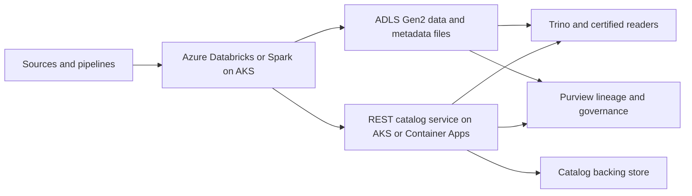
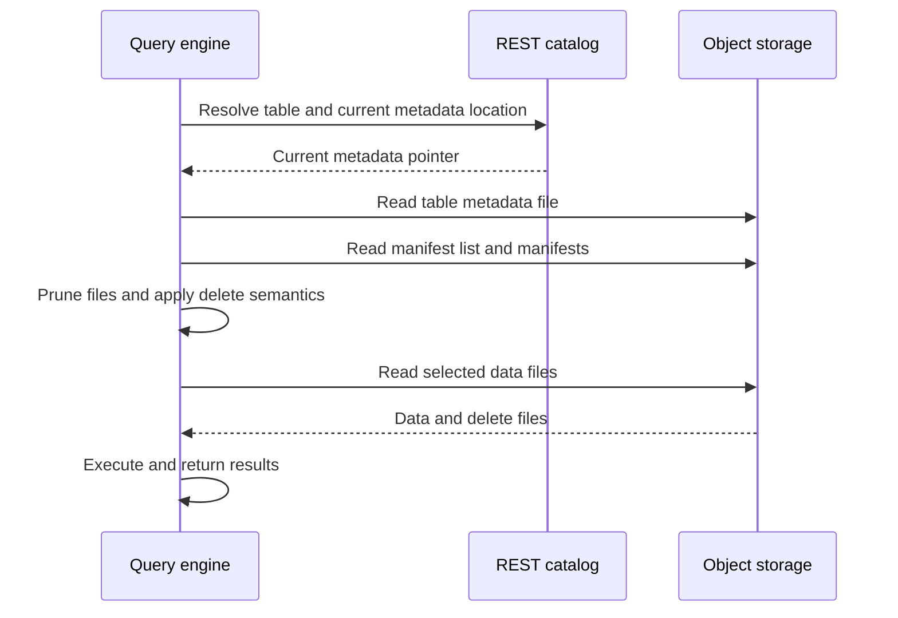
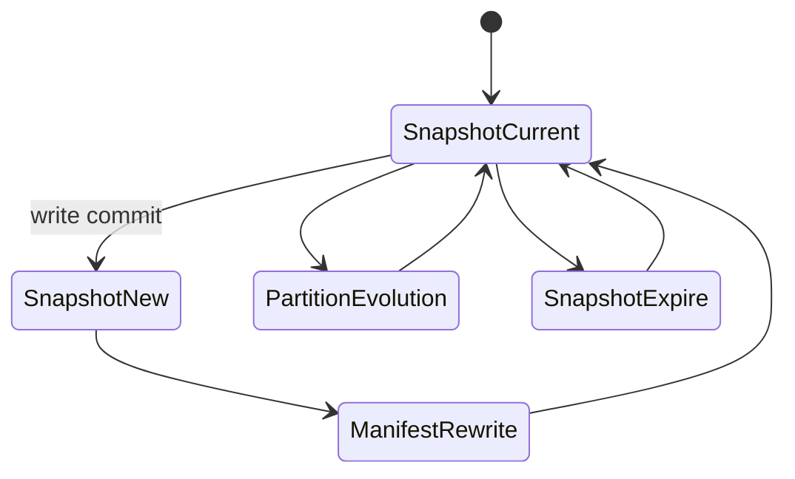

# Apache Iceberg

> Part of the **Enterprise Data & AI Architecture Handbook** · Phase-04 - Storage Systems & Table Formats · Chapter 05.
> Estimated study time: **75 min reading + ~5h labs**.
> **Prerequisite:** read [Delta Lake](04_Delta_Lake.md) first.

---

## Executive Summary

Apache Iceberg exists because plain files on object storage are not enough to represent a durable, evolvable, multi-engine analytical table. A lake can store Parquet efficiently, but it still needs a reliable answer to questions such as which files belong to the current table snapshot, how partitions evolve without breaking consumers, how schema changes remain safe across engines, and how different compute engines discover and commit table state without relying on fragile recursive listings. Iceberg answers those questions with a metadata tree built around table metadata files, manifest lists, manifests, snapshots, and a catalog layer that decouples engine behavior from raw object paths.

The defining design choice in Iceberg is openness at the table abstraction layer. Instead of optimizing primarily for one engine family, Iceberg standardizes snapshot metadata, partition transforms, schema field IDs, delete semantics, and catalog interactions so Spark, Flink, Trino, DuckDB, and other engines can operate on the same table with fewer implementation-specific assumptions. Hidden partitioning and partition evolution are especially important because they remove a large class of path-contract and partition-refactoring pain that older Hive-style layouts made normal.

On Azure, Iceberg is most useful when the organization values engine interoperability, open catalog patterns, and long-term portability more than tight coupling to one vendor’s lakehouse runtime. ADLS Gen2 provides the storage substrate, while Azure Databricks, self-managed Spark on AKS, Trino, or other Iceberg-capable engines provide compute. A REST catalog hosted on Azure infrastructure becomes the control plane that multiple engines can share. This is operationally different from [Delta Lake](04_Delta_Lake.md), which is often the default in Databricks-first Azure estates because Delta’s platform integration is stronger there.

The practical conclusion is opinionated. Use Iceberg when the strategic requirement is open, multi-engine table interoperability with safe schema and partition evolution on object storage. Do not use it merely because it is open source, and do not assume every Azure analytics surface provides equal Iceberg depth. Iceberg is strongest when the platform team is ready to govern catalogs, snapshot retention, manifest maintenance, and engine compatibility deliberately.

## Learning Objectives

By the end of this chapter you will be able to:

1. Explain Iceberg metadata layers including table metadata, manifest lists, manifests, snapshots, and delete files.
2. Describe hidden partitioning and partition evolution and why they are materially different from Hive-style path contracts.
3. Explain how Iceberg handles schema evolution safely through field IDs rather than only column names.
4. Use time travel, snapshot maintenance, and table procedures appropriately.
5. Distinguish Iceberg format v1, v2, and v3, and know which version to target for production tables today.
6. Explain why the REST catalog matters for engine interoperability and governance, and evaluate catalog implementations such as Unity Catalog, Polaris, Nessie, and Gravitino.
7. Design an Azure-first Iceberg architecture on ADLS Gen2 with Spark, Trino, and a governed catalog, including the operational risk of the catalog as a single point of failure.
8. Diagnose common Iceberg operational failures such as manifest bloat, stale snapshot retention, and engine feature mismatch.
9. Compare Iceberg with Delta at a decision level without reducing the conversation to marketing claims.
10. Define enterprise standards for partition transforms, snapshot retention, and catalog ownership.
11. Defend Iceberg adoption in a staff- or architect-level review with explicit trade-offs.

## Business Motivation

- Enterprises increasingly want table abstractions that remain portable across multiple compute engines rather than tightly coupled to one vendor runtime.
- Object-storage lakes need a metadata layer that scales better than recursive prefix discovery and brittle partition path conventions.
- Data domains evolve over time; schemas and partitions must change without forcing table rewrites or consumer outages.
- Open table standards lower migration risk and reduce the chance that one engine becomes the only viable reader or writer.
- FinOps programs benefit when manifest-driven planning reduces wasteful listings and when maintenance is explicit rather than accidental.
- Governance is improved when the catalog is a real control plane instead of a sidecar to path naming.
- Large analytical estates often need Spark, Trino, streaming, batch, and data science consumers to share one table contract safely.

## History and Evolution

- Early data lakes relied on Hive-style tables where partition paths were part of the public contract and schema evolution was awkward.
- Those designs worked for append-heavy batch pipelines but became brittle as engines multiplied and data products evolved.
- Partition evolution often required path rewrites, downstream query changes, or incompatible dual layouts.
- Iceberg emerged to solve these issues by formalizing snapshots, manifests, field-ID-based schema evolution, and hidden partitioning on object storage.
- Adoption accelerated as Spark, Flink, Trino, and other engines needed a neutral table abstraction rather than per-engine glue.
- The REST catalog model further improved interoperability by standardizing how engines discover and commit table state.
- As lakehouse competition increased, Iceberg became a strategic choice for organizations prioritizing openness and engine plurality.
- Modern Iceberg usage spans batch analytics, streaming ingest, CDC, branch-based experimentation, and multi-engine data sharing.

## Why This Technology Exists

Iceberg exists because storing files is easy and operating shared analytical tables is hard. Object storage gives inexpensive immutable persistence, but it does not define snapshot semantics, safe schema evolution, or a stable method for multiple engines to agree on the current table state. Hive-era conventions solved some of this through metastore records and directory patterns, but those conventions made partitions too visible, evolution too painful, and engine behavior too implementation-dependent.

Iceberg responds by moving table semantics into explicit metadata. Instead of teaching every consumer to infer meaning from directory structures, Iceberg gives the consumer a catalog entry, a current metadata pointer, a snapshot graph, and manifests that enumerate the relevant data and delete files. The result is a table abstraction that is less dependent on path layout and more dependent on portable metadata rules.

The technology also exists because enterprises increasingly need engine plurality. Spark may write the data, Trino may serve interactive SQL, Flink may stream updates, and Python-native tools may inspect or export subsets. Iceberg’s design goal is not merely performance. It is durable interoperability with safe evolution.

## Problems It Solves

| Problem | Iceberg contribution |
|---|---|
| Fragile directory-based partition contracts | Hidden partitioning and partition transforms |
| Painful partition redesign | Partition evolution without rewriting all historical data |
| Unsafe schema renames and reorders | Field-ID-based schema evolution |
| Expensive raw file discovery | Snapshot metadata, manifest lists, and manifests |
| Multi-engine catalog inconsistency | Standardized catalog and REST catalog interactions |
| Historical reproducibility | Snapshot-based time travel |
| Row-level delete and update support on object storage | Equality and position delete files |

## Problems It Cannot Solve

- Iceberg does not make object storage behave like an OLTP database.
- Iceberg does not remove the need for compaction, manifest cleanup, or snapshot expiration policy.
- Iceberg does not guarantee equal feature support across every engine and runtime.
- Iceberg does not replace data governance, access control, or lineage systems.
- Iceberg cannot save a table from poor business semantics or incorrect CDC logic.
- Iceberg does not make all partitioning decisions irrelevant; bad transforms still have consequences.
- Iceberg does not justify using a weakly governed catalog as a production control plane.

## Core Concepts

### Metadata tree

Iceberg tables are governed by a layered metadata structure:

1. a catalog entry points to the current table metadata file,
2. the table metadata file describes schemas, partition specs, sort orders, snapshots, and properties,
3. each snapshot points to a manifest list,
4. the manifest list points to manifest files,
5. manifest files enumerate data files and delete files plus partition and statistics data.

This layered model is the heart of Iceberg’s scalability and portability.

### Snapshots

Every committed change creates a new snapshot. Readers select a snapshot implicitly as the current state or explicitly for time travel, branches, or tags where supported. Snapshots define table history and reproducibility.

### Manifests and manifest lists

Manifest files describe groups of data files or delete files along with partition and statistics metadata. Manifest lists assemble the set of manifests for a snapshot. This avoids brute-force object listing and keeps discovery bounded by metadata rather than by namespace traversal.

### Hidden partitioning

Users query business columns such as `order_timestamp` or `customer_id`; they do not need to know the underlying partition transform such as `days(order_timestamp)` or `bucket(32, customer_id)`. That is hidden partitioning. It removes a large class of consumer coupling to physical layout.

### Partition evolution

Iceberg lets a table change partition specs over time. New data can use a new spec while old data remains valid under its original spec. Files record the spec ID that produced them, so readers can plan across mixed layouts. This is materially better than path-contract tables that require whole-table rewrites or awkward compatibility layers.

### Schema evolution with field IDs

Iceberg tracks columns using stable field IDs. This makes renames, reorders, and compatible additions safer than name-only systems because engines can reason about identity across schema versions.

### Delete files

Iceberg supports row-level changes through delete files rather than only full data-file rewrites. Position deletes reference specific row positions in data files. Equality deletes describe rows matching key-like predicates. This gives the table format more flexibility while also increasing maintenance and reader complexity.

### Format versions: v1, v2, and v3

Iceberg's table specification is versioned, and the version in use determines which features and which engine compatibility guarantees apply:

- **v1** is the original format: append-only-oriented, no native row-level delete files. Largely legacy at this point.
- **v2** is the version most production Iceberg tables target today. It adds row-level deletes (position and equality delete files), sequence numbers for correct delete/data ordering, and is the version with the broadest current engine support (Spark, Trino, Flink, Snowflake, etc.).
- **v3** extends the spec further with capabilities such as row lineage tracking, deletion vectors as a first-class Iceberg construct (converging conceptually with Delta's deletion vectors), variant/geospatial type additions, and default-value handling improvements. v3 engine support is materially less mature and less uniform across the ecosystem than v2; treat v3 as an emerging target and validate every engine in the estate against the specific v3 features actually needed before committing production tables to it.

The practical governance rule: pin new production tables to v2 unless a specific v3 feature is required and every consuming engine has verified v3 support; do not assume "latest spec version" is automatically the safe production default the way it might be for a library dependency.

### REST catalog

The REST catalog standardizes how engines resolve namespaces, tables, metadata locations, and commits through an HTTP interface. The architectural benefit is clear: the catalog becomes a neutral control plane that multiple engines can share without each one being tightly coupled to one metastore implementation.

### Catalog landscape

The REST catalog is a protocol, not a single product, and the choice of *implementation* materially affects operations:

- **Unity Catalog** (Databricks) now speaks the Iceberg REST catalog protocol in addition to Delta, positioning it as a single governed catalog for mixed Delta/Iceberg estates inside a Databricks-centric platform.
- **Polaris** (originally Snowflake-driven, donated to Apache) is an open-source REST catalog implementation aimed at vendor-neutral, multi-engine Iceberg governance outside any single vendor's runtime.
- **Project Nessie** adds Git-like versioning semantics on top of catalog operations (branches, tags, multi-table commits), which is valuable when a platform needs atomic changes across several tables or wants isolated write branches for testing.
- **Apache Gravitino** positions itself as a broader metadata-and-catalog federation layer that can front multiple underlying catalogs (Hive Metastore, Iceberg REST, Unity, etc.) rather than being a single-catalog implementation.

**REST-catalog-as-SPOF:** whichever implementation is chosen, the catalog becomes the single point every reader and writer depends on to resolve the current table state. If the catalog service is unavailable, every Iceberg engine in the estate loses the ability to discover or commit table state, even though the underlying Parquet data and manifest files in object storage are perfectly intact. This is a materially different operational risk profile than Delta's log-in-object-storage model, where the "catalog" (the `_delta_log` directory) is inherently as available as the object store itself. Enterprises adopting a REST catalog must treat it as Tier 0 infrastructure: run it highly available, back it with a durable metadata store, monitor it explicitly, and have a tested recovery procedure, not just a single container or a single database instance behind it.

## Internal Working

The read path begins with the catalog. An engine resolves a table name through the catalog and receives the current table metadata location. It reads that metadata file to identify the current snapshot, schema, partition specs, sort order, and table properties. The snapshot points to a manifest list, which in turn points to manifest files. From those manifests, the engine determines the relevant data files and delete files and applies partition pruning and file-level filtering before reading actual table data.

The write path is similarly metadata-driven. A writer reads the current table metadata, produces new data files and optionally delete files, writes new manifests or reuses existing ones, creates a new snapshot entry in a new table metadata file, and then attempts an atomic catalog commit that swaps the current metadata pointer. If another writer updated the table first, the commit conflicts and must be retried or failed according to engine behavior.

Hidden partitioning changes how planning works. Query predicates are translated through partition transforms rather than by requiring users to filter on path-derived partition columns. Partition evolution means the planner must reason across multiple historical partition specs. That is one reason Iceberg metadata is richer than a simple manifest of files.

Delete semantics also matter operationally. Position and equality deletes are powerful for row-level changes, but they introduce read-time merge work and later compaction pressure. If delete files accumulate faster than the platform rewrites or compacts affected data files, query performance will degrade even though correctness is preserved.

## Architecture

The strongest Iceberg architecture separates storage, metadata, catalog, compute, and governance deliberately:

1. **Object storage substrate:** ADLS Gen2 or another compatible object store for data files and metadata files.
2. **Catalog control plane:** REST, JDBC, or equivalent catalog service that owns table pointers and commit coordination.
3. **Compute plane:** Spark, Flink, Trino, or other Iceberg-capable engines.
4. **Governance plane:** access control, lineage, classification, and operational policy.
5. **Maintenance plane:** snapshot expiration, manifest rewrite, data-file compaction, and branch hygiene where used.

On Azure, a strong pattern is ADLS Gen2 for storage, Azure Databricks or Spark on AKS for writes, Trino for interactive SQL where needed, Microsoft Purview for governance, Azure Database for PostgreSQL Flexible Server for catalog persistence where the chosen catalog implementation needs it, and a REST catalog service hosted on AKS or Container Apps. The critical design rule is that shared tables are governed through the catalog, not through raw ABFS path conventions.

## Components

| Component | Responsibility | Typical Azure mapping |
|---|---|---|
| Object store | Persist data files, delete files, and metadata files | ADLS Gen2 |
| Catalog service | Resolve table names and coordinate commits | REST catalog service on AKS or Container Apps |
| Catalog backing store | Persist namespaces and catalog state if required | Azure Database for PostgreSQL Flexible Server |
| Compute engine | Read, write, and maintain Iceberg tables | Azure Databricks, Spark on AKS, Trino on AKS |
| Metadata files | Define schemas, snapshots, specs, and properties | Iceberg table metadata JSON files |
| Manifest lists and manifests | Enumerate files for snapshots | Iceberg metadata layer |
| Delete files | Represent row-level removals | Equality and position delete files |
| Governance | Classification, lineage, and access policy | Microsoft Purview, Entra ID, RBAC |

## Metadata

Iceberg is unusually metadata-centric by design.

| Metadata element | Purpose | Operational consequence |
|---|---|---|
| Table metadata file | Current table definition and snapshot references | Central pointer for every read |
| Schema with field IDs | Safe evolution across renames and reorder | Reduces brittle schema changes |
| Partition specs | Defines transforms used over time | Enables partition evolution |
| Sort orders | Optional ordering hints | Can improve pruning and file locality |
| Manifest list | Enumerates manifests for one snapshot | Bounded discovery cost |
| Manifest files | Enumerate data and delete files | Critical for planning efficiency |
| Snapshot refs | Branches, tags, or current pointer where supported | Enables reproducible workflows |

The architectural implication is direct: metadata quality and lifecycle are not secondary concerns. They are the table system.

## Storage

Iceberg inherits object-store economics while adding metadata files and delete files. That means:

- object-store durability and consistency still matter,
- file size still matters for analytical performance,
- metadata file count and manifest depth also matter,
- delete-file accumulation can become a hidden storage and performance tax.

On Azure, ADLS Gen2 Standard GPv2 with hierarchical namespace enabled remains the best default for enterprise Iceberg tables. ZRS or GZRS should be chosen based on fault-tolerance requirements, not habit. Cool and archive tiers are rarely appropriate for actively queried Iceberg tables because metadata and data need predictable low-latency access.

## Compute

Iceberg is strongest when the compute layer is intentionally plural.

- Spark handles large-scale writes, maintenance, and complex transforms well.
- Trino is strong for interactive SQL over Iceberg metadata and file pruning.
- Flink is valuable for streaming ingestion and continuous table updates.
- Azure Databricks can participate where the selected runtime and integration pattern support the needed Iceberg features.
- Fabric should be treated cautiously for Iceberg-centric architectures; validate actual support rather than assuming parity with Delta-native Lakehouse flows.

Compute design therefore starts with engine certification, not with abstract format preference.

## Networking

Iceberg reduces some network waste by reducing brute-force namespace discovery, but it remains a remote object-store table format.

- readers fetch metadata files before data files,
- manifest-heavy planning can become expensive if manifest maintenance is neglected,
- delete files increase additional reads and read-time merge work,
- cross-region access remains an avoidable cost multiplier.

For Azure-hosted REST catalogs, network design also matters between compute clusters, the catalog service, and the catalog backing store. Private endpoints, internal DNS, and latency between control-plane services become part of the performance story.

## Security

Iceberg security is split across storage, catalog, and compute layers.

- Protect the catalog aggressively because it controls table state and commit authority.
- Protect metadata files as carefully as data files because they expose schema, history, and object locations.
- Use Entra ID, managed identities, RBAC, ACLs, Key Vault, and private networking for ADLS-backed estates.
- Apply least privilege separately for storage access and catalog mutation rights.
- Treat delete-file history and snapshot refs as potentially sensitive because they reveal operational change history.

The common failure mode is granting broad storage-path access while assuming the catalog is the only control point. In reality, raw object access can bypass table-level governance expectations.

## Performance

| Lever | Why it helps | Common risk |
|---|---|---|
| Hidden partitioning with good transforms | Better pruning without path coupling | Poor transform choice still hurts |
| Manifest maintenance | Faster planning | Neglect causes manifest bloat |
| Data-file rewrite compaction | Reduces small-file overhead | Overuse wastes compute |
| Delete-file compaction | Reduces read-time merge cost | Delay causes query slowdown |
| Sort order design | Improves locality and pruning | Wrong sort order adds write cost without payoff |
| Snapshot expiration | Limits metadata growth | Over-aggressive expiration can hurt reproducibility |

The biggest Iceberg performance truth is that openness does not mean self-maintaining. A badly maintained Iceberg table can be as slow and expensive as a badly maintained Delta or Parquet table.

## Scalability

Iceberg scales well because snapshot planning is metadata-driven and partition evolution avoids whole-table rewrites for common layout changes. It also scales organizationally because a neutral catalog and table spec let more engines coexist without immediately fragmenting the lake.

The limits appear when:

- manifest counts grow too quickly,
- delete files accumulate without rewrite,
- too many engines write without governance,
- catalog service availability or latency becomes a bottleneck,
- feature assumptions drift across engine versions.

Large Iceberg estates therefore need explicit ownership of table maintenance and catalog operations.

## Fault Tolerance

Iceberg fault tolerance spans object storage, metadata, and the catalog pointer.

- object storage protects immutable files,
- snapshot-based metadata protects consistent table reads,
- atomic catalog commits protect table-state transitions,
- snapshot history supports rollback analysis and recovery,
- ADLS redundancy protects storage according to selected SKU.

The critical operational fact is that the catalog is now part of the fault domain. If the catalog is unavailable or corrupted, the data files still exist but the governed table interface is degraded or unavailable. Disaster-recovery design must therefore include the catalog and its backing store, not only the object store.

## Cost Optimization

| Cost lever | Mechanism | Typical Azure effect |
|---|---|---|
| Manifest rewrite | Lower planning overhead | Faster Trino and Spark planning on ADLS |
| Rewrite data files | Lower small-file overhead | Fewer requests and better scan efficiency |
| Expire snapshots with policy | Lower metadata and data retention cost | Lower storage footprint |
| Conservative delete-file retention | Avoid excessive read-time merge cost | Lower query CPU and I/O |
| Shared REST catalog | Better engine reuse | Lower duplicated platform complexity |

FinOps teams should treat metadata operations as real cost. A small number of large data files can still be wrapped in an expensive metadata estate if snapshot and manifest maintenance are ignored.

## Monitoring

Monitor Iceberg at table, catalog, and storage layers:

- snapshot count and age distribution,
- manifest count and average manifest size,
- delete-file count and growth rate,
- data-file count and average size,
- planning latency per engine,
- REST catalog latency and error rate,
- commit-conflict frequency,
- snapshot expiration and compaction backlog.

On Azure, combine engine telemetry with Azure Monitor, Log Analytics, and storage access logs. For catalog services on AKS or Container Apps, monitor API latency, availability, and backing-store health explicitly.

## Observability

Observability should answer these questions quickly:

1. Which snapshot did this query read?
2. Which manifests and delete files were involved?
3. Did the failure originate in storage, the catalog, or engine compatibility?
4. Did recent partition evolution or schema evolution change planning behavior?

Useful evidence includes metadata history, catalog audit logs, query plans, snapshot inspection tables, storage request traces, and maintenance-job telemetry. Without this evidence, Iceberg incidents often get mislabeled as generic object-store or Spark issues.

## Governance

Iceberg governance should define:

1. approved catalogs and who owns them,
2. which engines may write to which namespaces,
3. default partition transforms and sort-order guidelines,
4. schema evolution approval rules,
5. snapshot retention and expiration classes,
6. delete-file maintenance policy,
7. engine-version certification for shared tables,
8. raw path access policy versus catalog-mediated access.

The principle is simple: if the catalog is the control plane, governance must govern the catalog, not only the bucket.

## Trade-offs

| Choice | Benefit | Cost | When not to use |
|---|---|---|---|
| Iceberg over plain Parquet | Safe evolution and metadata-driven planning | Added catalog and maintenance complexity | Static one-off datasets |
| Hidden partitioning | Decouples users from path layout | Requires trust in engine planners | Debug-light teams that depend on visible partition contracts |
| Partition evolution | Avoids table rewrites for layout changes | Mixed-spec planning complexity | Very small tables where simple rewrites are cheaper |
| REST catalog | Multi-engine neutrality | Additional control-plane service to run | Single-engine isolated environments |
| Delete files | Row-level changes without full rewrites | More read-time complexity | Workloads where periodic full rewrite is simpler |
| Long snapshot retention | Better reproducibility | Higher storage and metadata cost | Low-value transient tables |

## Decision Matrix

| Scenario | Recommended Iceberg stance | Reason |
|---|---|---|
| Multi-engine Azure analytics platform | Strong candidate | REST catalog and open engine interoperability matter |
| Databricks-only lakehouse with deep Delta feature use | Usually not the default | Delta platform fit is often stronger |
| ADLS-backed Trino + Spark estate | Strong candidate | Shared open table abstraction pays off |
| Table with frequent partition-layout redesign | Strong candidate | Partition evolution reduces rewrite pain |
| Tiny isolated append-only dataset | Often unnecessary | Plain Parquet may suffice |
| Heavily governed private-cloud analytics | Strong candidate with MinIO or ADLS equivalent | Openness and neutral catalog are valuable |
| Workload needing rich vendor-specific lakehouse features now | Evaluate carefully | Openness may trade off against runtime maturity |

## Design Patterns

1. **REST-catalog-first pattern:** treat the catalog as the shared control plane for all engine interactions.
2. **Hidden-partitioning pattern:** optimize partition transforms without publishing them as user-facing contracts.
3. **Partition-evolution pattern:** evolve layout forward without rewriting historical data unless performance requires it.
4. **Write-with-few-engines pattern:** allow many readers but keep the set of writers intentionally small and certified.
5. **Manifest-hygiene pattern:** schedule rewrite and snapshot-expiration maintenance explicitly.
6. **Delete-file containment pattern:** rewrite or compact high-delete tables before read amplification becomes visible to users.
7. **Azure control-plane pattern:** host the catalog inside private Azure network boundaries close to the compute layer.

## Anti-patterns

1. Treating hidden partitioning as permission to stop thinking about partition design.
2. Letting every engine in the estate write to the same table without compatibility policy.
3. Ignoring manifest and snapshot growth because object storage is cheap.
4. Using raw path access as the public contract for Iceberg tables.
5. Deploying a REST catalog without backup, HA, or audit controls.
6. Expiring snapshots on a schedule that ignores reproducibility and downstream SLAs.
7. Accumulating equality and position deletes indefinitely without rewrite strategy.
8. Assuming Fabric or every Azure analytics surface supports Iceberg as deeply as Spark-based engines do.

## Common Mistakes

- **Mistake:** assuming hidden partitioning means partition choice no longer matters.  
  **Consequence:** poor pruning and expensive scans.  
  **Fix:** design transforms from real query predicates and retention logic.

- **Mistake:** using too many concurrent writers from heterogeneous engines.  
  **Consequence:** commit conflicts and compatibility incidents.  
  **Fix:** certify writers and narrow write authority.

- **Mistake:** ignoring manifest rewrite and snapshot expiration.  
  **Consequence:** planning latency climbs even when storage size looks healthy.  
  **Fix:** schedule metadata maintenance by table tier.

- **Mistake:** renaming columns without understanding field-ID semantics across tools.  
  **Consequence:** engine-specific confusion or downstream serialization issues.  
  **Fix:** test schema evolution in all certified engines.

- **Mistake:** treating the REST catalog as stateless and disposable.  
  **Consequence:** control-plane outages and recovery gaps.  
  **Fix:** back it up, monitor it, and include it in DR design.

## Best Practices

1. Use Iceberg where multi-engine openness is a primary requirement, not as a reflex.
2. Keep the set of production writers small, deliberate, and version-certified.
3. Design partition transforms around stable business predicates.
4. Use REST catalog patterns for cross-engine estates.
5. Expire snapshots and rewrite manifests according to policy, not only when users complain.
6. Track delete-file accumulation as a first-class operational metric.
7. Prefer catalog-mediated access over raw path access.
8. Validate schema evolution and partition evolution in every certified engine.
9. Keep control-plane services inside private, monitored Azure boundaries.
10. Compare Iceberg against [Delta Lake](04_Delta_Lake.md) using workload needs, not ideology.

## Enterprise Recommendations

Recommended enterprise defaults:

- **Azure storage substrate:** ADLS Gen2 Standard GPv2 with hierarchical namespace enabled.
- **Catalog standard:** REST catalog for shared multi-engine estates; simpler catalogs only for isolated teams.
- **Writer policy:** Spark-based certified writers by default; read-only access can be broader.
- **Governance policy:** Purview, Entra ID, RBAC, and catalog ownership are mandatory for shared tables.
- **Maintenance policy:** snapshot expiration, manifest rewrite, and file compaction are required platform controls.

### ADR example: default open table format for the multi-engine Azure analytics platform

**Context:** The organization needs one table abstraction that works across Spark, Trino, and future engine choices on ADLS Gen2. Some teams favor [Delta Lake](04_Delta_Lake.md) for tighter Databricks integration. Others prioritize open catalogs, hidden partitioning, and broader engine neutrality.

**Decision:** Standardize on Iceberg for shared multi-engine analytical domains where interoperability is the primary requirement. Use a REST catalog hosted on Azure infrastructure and restrict production writes to certified Spark-based pipelines. Continue using Delta for Databricks-first domains whose operational needs align better with Delta features.

**Consequences:** Open interoperability and partition evolution improve, but the platform must own catalog operations and compatibility certification. The estate also accepts that some vendor-specific conveniences will be lower than in a Delta-first domain.

**Alternatives considered:**

1. Delta everywhere: rejected because cross-engine openness was a first-order requirement in some domains.
2. Plain Parquet plus Hive metastore: rejected because evolution and planning behavior were too brittle.
3. One catalog per engine: rejected because governance and operational overhead would fragment the lake.

## Azure Implementation

The Azure-first Iceberg implementation pattern is:

1. ADLS Gen2 as the object-storage warehouse.
2. Azure-hosted REST catalog service on AKS or Container Apps.
3. Azure Database for PostgreSQL Flexible Server or another supported backing store for catalog state if the chosen service requires it.
4. Azure Databricks or Spark on AKS as the primary writer engine.
5. Trino on AKS or another certified SQL engine as a secondary reader or writer where justified.
6. Purview, Entra ID, private endpoints, and Azure Monitor for governance and operations.

### Bicep: ADLS Gen2 account for Iceberg warehouse storage

```bicep
param location string = resourceGroup().location
param storageAccountName string

resource lake 'Microsoft.Storage/storageAccounts@2023-05-01' = {
  name: storageAccountName
  location: location
  sku: {
    name: 'Standard_ZRS'
  }
  kind: 'StorageV2'
  properties: {
    isHnsEnabled: true
    accessTier: 'Hot'
    allowBlobPublicAccess: false
    minimumTlsVersion: 'TLS1_2'
    supportsHttpsTrafficOnly: true
  }
}
```

### Spark configuration for an Azure-hosted REST catalog

```python
spark.conf.set("spark.sql.catalog.prod", "org.apache.iceberg.spark.SparkCatalog")
spark.conf.set("spark.sql.catalog.prod.type", "rest")
spark.conf.set("spark.sql.catalog.prod.uri", "https://iceberg-catalog.contoso.internal")
spark.conf.set("spark.sql.catalog.prod.warehouse", "abfss://warehouse@contosolake.dfs.core.windows.net/iceberg")
spark.conf.set("spark.sql.catalog.prod.io-impl", "org.apache.iceberg.hadoop.HadoopFileIO")
```

### Spark SQL: create an Iceberg table with hidden partitioning

```sql
CREATE TABLE prod.sales.orders (
    order_id STRING,
    customer_id BIGINT,
    order_timestamp TIMESTAMP,
    country_code STRING,
    net_amount DECIMAL(18,2)
)
USING iceberg
PARTITIONED BY (days(order_timestamp), bucket(32, customer_id));
```

### Spark SQL: evolve schema and partition spec safely

```sql
ALTER TABLE prod.sales.orders ADD COLUMN sales_channel STRING;
ALTER TABLE prod.sales.orders RENAME COLUMN net_amount TO order_net_amount;
ALTER TABLE prod.sales.orders ADD PARTITION FIELD months(order_timestamp);
ALTER TABLE prod.sales.orders DROP PARTITION FIELD days(order_timestamp);
```

### Spark SQL: time travel and maintenance procedures

```sql
SELECT *
FROM prod.sales.orders VERSION AS OF 3827161283;

CALL prod.system.rewrite_data_files(table => 'sales.orders');
CALL prod.system.rewrite_manifests(table => 'sales.orders');
CALL prod.system.expire_snapshots(table => 'sales.orders', older_than => TIMESTAMP '2026-07-01 00:00:00');
```

Azure guidance that matters in practice:

- Host the REST catalog inside private network boundaries and back it up like any other control-plane service.
- Keep ADLS access separate from catalog mutation rights.
- Use Azure Databricks for Iceberg only where the selected runtime and connector policy are certified; do not assume parity with its Delta-first experience.
- Treat Fabric as a consumer only when the exact integration pattern has been validated for the target Iceberg features.

## Open Source Implementation

An open-source Iceberg platform commonly combines Spark, Trino, MinIO, and a REST catalog.

### Docker Compose: MinIO for an Iceberg sandbox

```yaml
services:
  minio:
    image: minio/minio:RELEASE.2026-06-13T11-33-47Z
    command: server /data --console-address ":9001"
    environment:
      MINIO_ROOT_USER: minioadmin
      MINIO_ROOT_PASSWORD: minioadmin123
    ports:
      - "9000:9000"
      - "9001:9001"
    volumes:
      - minio-data:/data

volumes:
  minio-data:
```

### Spark configuration for a REST catalog on MinIO

```python
spark.conf.set("spark.sql.catalog.dev", "org.apache.iceberg.spark.SparkCatalog")
spark.conf.set("spark.sql.catalog.dev.type", "rest")
spark.conf.set("spark.sql.catalog.dev.uri", "http://catalog:8181")
spark.conf.set("spark.sql.catalog.dev.warehouse", "s3a://warehouse/iceberg")
spark.conf.set("spark.hadoop.fs.s3a.endpoint", "http://minio:9000")
spark.conf.set("spark.hadoop.fs.s3a.access.key", "minioadmin")
spark.conf.set("spark.hadoop.fs.s3a.secret.key", "minioadmin123")
spark.conf.set("spark.hadoop.fs.s3a.path.style.access", "true")
spark.conf.set("spark.hadoop.fs.s3a.connection.ssl.enabled", "false")
```

### Trino Iceberg catalog example

```properties
connector.name=iceberg
iceberg.catalog.type=rest
iceberg.rest-catalog.uri=http://catalog:8181
fs.native-s3.enabled=true
s3.endpoint=http://minio:9000
s3.path-style-access=true
s3.aws-access-key=minioadmin
s3.aws-secret-key=minioadmin123
```

Open-source guidance:

- Certify read and write feature support per engine before promoting a table to shared use.
- Keep catalog and MinIO backups explicit; neither is optional just because the stack is open.
- Use Spark for heavy rewrite maintenance even if Trino serves most interactive reads.

## AWS Equivalent (comparison only)

| Azure pattern | AWS equivalent | Advantages | Disadvantages | Migration note |
|---|---|---|---|---|
| ADLS Gen2 + REST catalog + Spark/Trino | S3 + Iceberg REST or Glue catalog + EMR/Trino | Mature ecosystem and broad community patterns | IAM and storage semantics differ | Re-certify catalog auth and object policy design |
| Azure Databricks plus ADLS Iceberg estate | Databricks on AWS plus S3 | Similar Spark operating model | Vendor/runtime support details still vary | Keep feature usage conservative during migration |
| Purview-governed Iceberg domains | Glue, Lake Formation, external catalogs | Strong governance options | Policy model differs materially | Migrate governance intentionally, not only data files |

Selection criteria:

- Choose AWS equivalence when the surrounding engine and IAM ecosystem is already centered there.
- Preserve open Iceberg metadata and catalog semantics so migration is control-plane work more than table redesign.

## GCP Equivalent (comparison only)

| Azure pattern | GCP equivalent | Advantages | Disadvantages | Migration note |
|---|---|---|---|---|
| ADLS Gen2 + Iceberg on Azure | GCS + Iceberg on Dataproc, Trino, or Databricks on GCP | Strong open-lake options | Different IAM and networking model | Re-test catalog-to-storage auth flows |
| Azure-hosted REST catalog | GKE or Cloud Run hosted catalog | Flexible control-plane hosting | Platform operational model changes | Keep REST catalog contract stable |
| Purview and Entra governance | Dataplex, BigLake, or external governance stack | Strong integration options | Governance center of gravity may shift | Decouple catalog and governance responsibilities clearly |

Selection criteria:

- GCP is attractive when open lake plus BigQuery-adjacent analytics matter, but engine certification still drives real operability.
- Migration is easiest when partition transforms, schema evolution rules, and REST catalog contracts are already standardized.

## Migration Considerations

Typical migrations include Hive-style tables to Iceberg, plain Parquet data lakes to Iceberg-managed tables, and Delta or other lakehouse domains to Iceberg where openness becomes the strategic priority.

Migration sequence:

1. Inventory tables by engine mix, mutability, retention, and current partition contract pain.
2. Convert low-risk append-heavy datasets first.
3. Move shared multi-engine datasets next, because they benefit most from open catalogs and hidden partitioning.
4. Validate schema and partition evolution across all certified engines before production cutover.
5. Introduce snapshot expiration and manifest rewrite policy at the same time as the first production tables.
6. Keep path contracts stable temporarily where legacy consumers require a transition window.

Key risks:

- hidden consumers depending on directory layout,
- engine-version mismatches in field-ID handling or delete-file support,
- catalog outage as a new operational bottleneck,
- snapshot retention policies that remove needed reproducibility windows,
- assuming Iceberg eliminates the small-file problem without rewrite jobs.

## Mermaid Architecture Diagrams

### Azure Iceberg architecture



### Iceberg read path sequence



### Snapshot and evolution lifecycle



## End-to-End Data Flow

1. A writer engine ingests or transforms data for a target Iceberg table.
2. The engine resolves the table through the catalog and reads the current metadata pointer.
3. The writer creates new data files and, where needed, delete files.
4. The writer produces new manifests or updates manifest references.
5. A new snapshot is recorded in a new table metadata file.
6. The engine attempts an atomic catalog commit to promote that metadata file as current.
7. Readers resolve the new current snapshot through the catalog.
8. Query planners inspect manifests and prune data files before reading payloads.
9. Maintenance jobs later rewrite manifests, compact files, and expire old snapshots according to policy.
10. Governance systems track ownership, lineage, classification, and engine certification status.

## Real-world Business Use Cases

| Use case | Why Iceberg fits |
|---|---|
| Multi-engine analytics across Spark and Trino | Shared open table abstraction and REST catalog |
| Large fact tables whose partition strategy evolves yearly | Partition evolution avoids disruptive rewrites |
| Regulated analytics platforms seeking vendor portability | Open metadata and neutral catalogs reduce lock-in |
| Data products shared across business units | Hidden partitioning reduces consumer coupling |
| Streaming plus batch convergence | Snapshot model supports both modes with the right engines |

## Industry Examples

- Organizations with heterogeneous engine estates frequently favor Iceberg because open catalog patterns matter more than single-engine acceleration.
- Teams migrating away from Hive-style path contracts often cite hidden partitioning as one of the most immediately valuable improvements.
- Trino-heavy analytics programs commonly adopt Iceberg because metadata-driven planning and open catalogs align with their engine strategy.
- Cloud platforms that need portability across Spark vendors often use Iceberg to avoid embedding vendor-specific table semantics into every domain.

The repeated pattern is that Iceberg becomes most compelling when engine plurality is a strategic requirement rather than an accidental byproduct.

## Case Studies

### Case study 1: Partition evolution without business outage

A retail analytics team initially partitioned order data by `days(order_timestamp)` and later found most cost-sensitive queries filtered by `months(order_timestamp)` and `bucket(customer_id)`. In a Hive-style table, this change would have required disruptive rewrites and consumer retraining. With Iceberg, the platform evolved the partition spec for new data and retained compatibility for historical files. The lesson was that layout evolution stopped being a breaking contract negotiation.

### Case study 2: Manifest bloat degraded planning

A large IoT table ingested continuously from many writers. Data files stayed reasonably sized, but manifest counts exploded because rewrite maintenance lagged. Query planning slowed before storage or CPU became obvious bottlenecks. Scheduled manifest rewrite and a stricter writer policy fixed the issue. The lesson was that metadata maintenance is not optional just because file size looks healthy.

### Case study 3: Catalog treated as an afterthought

A platform adopted Iceberg for openness but ran the catalog without HA, backup, or clear ownership. A catalog outage made shared tables operationally unavailable despite intact ADLS data. The eventual fix included HA deployment, private networking, backup, and audit logging. The lesson was that the control plane must be operated like production infrastructure, not like a developer utility.

## Hands-on Labs

1. Create an Iceberg table on ADLS Gen2 with hidden partitioning and inspect its metadata tree.
2. Evolve a partition spec and observe how old and new data coexist safely.
3. Rename a column and verify schema evolution behavior across two certified engines.
4. Query an older snapshot using time travel and compare results with the current snapshot.
5. Accumulate small files and manifests intentionally, then run rewrite procedures and measure planning improvements.
6. Deploy a minimal REST catalog and connect Spark plus Trino to the same table.

## Exercises

1. Why is hidden partitioning materially different from simply hiding a folder path from users?
2. What problem do manifest lists solve?
3. Why do stable field IDs matter for schema evolution?
4. When does partition evolution reduce risk and when can it still add complexity?
5. Why is the catalog part of the fault domain?
6. What is the difference between equality deletes and position deletes?
7. Why can Iceberg be a stronger choice than Delta for some Azure estates?
8. Which metrics would show that manifest maintenance is overdue?
9. Why is raw path access a governance risk for Iceberg tables?
10. How would you explain snapshot-based time travel to a finance stakeholder?

## Mini Projects

1. Build an Azure-hosted REST catalog proof of concept with ADLS Gen2, Spark, and Trino.
2. Create an Iceberg maintenance scorecard that tracks snapshots, manifests, delete files, and compaction backlog.
3. Build a certification harness that validates one Iceberg table across Spark and Trino before production release.

## Capstone Integration

This chapter is the open-interoperability counterpart to [Delta Lake](04_Delta_Lake.md). In a capstone platform, the team should choose Iceberg for domains whose long-term value depends on multi-engine neutrality, safe partition evolution, and catalog-governed openness. The capstone should show that object storage, metadata-driven planning, catalog operations, and engine certification are separate concerns that must all be designed together.

## Interview Questions

1. What are the main layers of Iceberg metadata?
   **A:** A metadata file (table schema, partition spec, snapshot list) at the top, manifest lists (one per snapshot, pointing to manifests), and manifest files (listing the actual data files with their statistics) — this layered structure lets Iceberg avoid rewriting the entire metadata tree for small changes.
2. What is hidden partitioning?
   **A:** Iceberg derives partition values from column transforms (e.g., `day(timestamp)`) automatically at write and query time, so users query the underlying column naturally without needing to know or reference the physical partition scheme — this avoids the common Hive-style mistake of forgetting to include the partition column explicitly in a filter.
3. Why is partition evolution important?
   **A:** It lets a table's partition scheme change (e.g., from daily to hourly partitioning) going forward without rewriting historical data, since Iceberg tracks which partition spec applied to which files — a capability plain Hive-style partitioning fundamentally lacks without a full table rewrite.
4. How does Iceberg support time travel?
   **A:** Every write creates a new snapshot referencing a specific manifest list; time travel queries simply read the table as of a specific snapshot ID or timestamp, reconstructing exactly the set of files valid at that point without needing to touch any data written afterward.
5. What does the REST catalog solve?
   **A:** It provides a standardized, engine-agnostic API for catalog operations (table lookup, commit, listing) so different query engines (Spark, Trino, Flink) can interoperate against the same tables through one common catalog protocol rather than each requiring a bespoke catalog integration.
6. Why do field IDs matter for schema evolution?
   **A:** Iceberg tracks columns by a stable, unique field ID rather than by name or position, so renaming a column or reordering columns doesn't break historical data files' schema mapping — a rename in Iceberg is a safe metadata-only operation rather than requiring a data rewrite.
7. What is the difference between equality deletes and position deletes?
   **A:** Position deletes mark a specific row (by file and row-offset) as deleted, requiring the writer to know the row's exact physical location; equality deletes mark rows matching a value predicate (e.g., a key) as deleted without needing to know their physical position, trading a cheaper write for a more expensive read that must check the predicate against every row.
8. Why can Iceberg be more portable than other table approaches?
   **A:** Its open specification and REST catalog standard are designed explicitly for multi-engine, multi-cloud interoperability from the outset, with a broad and growing set of independent engine implementations (Spark, Trino, Flink, Snowflake) — reducing the risk of being tied to one vendor's specific implementation.

## Staff Engineer Questions

1. How would you decide whether a domain should standardize on Iceberg or Delta?
   **A:** Choose Iceberg when the domain genuinely needs multi-engine write support across heterogeneous compute (not just Databricks) or catalog-neutral portability; choose Delta when the domain is predominantly Databricks-based and benefits from its tighter native integration and simpler operational model on Azure.
2. What writer policy would you impose in a multi-engine Azure estate?
   **A:** Certify which specific engines and versions are approved to write production Iceberg tables (validating they correctly implement the catalog commit protocol and don't silently corrupt manifests), rather than allowing any engine claiming Iceberg support to write without validation.
3. How would you size snapshot-retention windows across different data-product tiers?
   **A:** Set longer snapshot retention for regulated or high-value tables needing audit/replay capability, and shorter retention for high-churn, low-value tables where the storage cost of retained snapshots and their referenced files isn't justified.
4. When would you rewrite data files versus only rewriting manifests?
   **A:** Rewrite manifests only (a cheap metadata operation) when consolidating many small manifest entries pointing to already well-sized data files; rewrite data files (a more expensive compaction) when the underlying files themselves are too small or fragmented and need physical consolidation.
5. How would you make the catalog highly available without overengineering it?
   **A:** Use a managed, already-highly-available backing store for the catalog (a managed database or Azure-native service) behind the REST catalog interface rather than self-hosting a complex custom highly-available catalog cluster — leverage existing managed HA rather than building bespoke infrastructure.
6. What evidence would justify partition-spec evolution on a production table?
   **A:** A demonstrated, measured query-performance or storage-cost problem with the current partition granularity, validated that the new spec would address it — partition evolution should be evidence-driven, not speculative "might help" tuning on a table with no observed problem.
7. How would you detect that delete-file accumulation is harming the estate?
   **A:** Monitor the ratio of delete files to data files per table and query-time overhead attributable to delete-file application (merge-on-read cost) — a growing ratio without corresponding compaction indicates delete-file accumulation is starting to degrade read performance.
8. Which team should own catalog operations and why?
   **A:** A platform team should own catalog availability, backup, and upgrade operations given its shared, cross-cutting Tier-0 nature (its failure affects every table/domain relying on it), while domain teams own their own table-level schema and partition decisions within that catalog.

## Architect Questions

1. What should be the enterprise default open table format for multi-engine analytics, and why?
   **A:** Iceberg is the better default specifically when multi-engine (beyond Databricks) analytical access is a genuine, current requirement, given its catalog-neutral design and broad engine ecosystem — for a predominantly Databricks-first estate, Delta may still be the simpler pragmatic default.
2. How should Azure control-plane services be arranged to support a REST catalog securely?
   **A:** Host the REST catalog behind Private Link with managed identity-based authentication, backed by a managed, highly available database, and integrate its access logs into the platform's centralized observability so catalog-level operations are auditable alongside data-plane access.
3. Which engines are allowed to write production Iceberg tables and under what conditions?
   **A:** Only engines that have passed a documented compatibility/certification process validating correct manifest and snapshot commit behavior should be allowed to write production tables — an uncertified engine risks silently corrupting the table's metadata even if it can technically read/write Iceberg format files.
4. How do you balance openness with operational simplicity in an Azure platform?
   **A:** Adopt Iceberg's openness where multi-engine access is a genuine requirement, but don't force it onto workloads that are single-engine (Databricks-only) and would gain more from Delta's simpler, more tightly integrated Azure operational model — openness has a real operational cost that should be justified by an actual need.
5. What disaster-recovery plan covers both ADLS data and the catalog state?
   **A:** Replicate ADLS data (GRS/GZRS) and separately ensure the catalog's backing database/store is included in the same DR scope with a tested recovery procedure — recovering data files without a consistent, recovered catalog state leaves tables unreadable even if the underlying bytes are intact.
6. When is Iceberg not worth the added metadata and catalog complexity?
   **A:** When the estate is genuinely single-engine and the catalog-neutral, multi-engine benefit Iceberg provides will never be exercised — in that case, its additional operational surface (running/operating a catalog service) is pure overhead relative to a simpler, more tightly integrated alternative.
7. What governance policy prevents hidden partitioning from becoming hidden chaos?
   **A:** Require partition-spec changes to go through the same reviewed change process as any schema change, with the resulting partition strategy documented — hidden partitioning's convenience (no manual partition-column management) shouldn't become an excuse for undocumented, unreviewed partition-scheme sprawl.
8. How would you evaluate Fabric participation in an Iceberg-centered architecture responsibly?
   **A:** Validate Fabric's current, specific level of Iceberg support (which is evolving and may lag Databricks' native Iceberg/Delta support) against the actual features the architecture depends on before assuming full parity — don't design around capabilities not yet actually present in the runtime being used.

## CTO Review Questions

1. Are we choosing Iceberg for real interoperability needs or only because it sounds open?
   **A:** This requires an honest check of whether the estate actually has (or credibly will have) more than one engine writing the same tables — adopting Iceberg's added operational complexity for a purely single-engine estate is choosing complexity for its reputation, not its function.
2. Which parts of the platform become more reliable with Iceberg, and which become more operationally demanding?
   **A:** Multi-engine consistency and long-term format portability become more reliable; catalog operation (availability, upgrades, backup) becomes a new, more demanding operational responsibility that didn't exist to the same degree with a simpler single-engine table format.
3. Do we have a clear owner for the catalog control plane?
   **A:** This should be answerable immediately from a governance registry — an unowned, shared, Tier-0 catalog service is a significant operational risk that should be closed before it's discovered during an incident.
4. If we needed to change engines in two years, would Iceberg materially reduce migration risk?
   **A:** Yes, materially, if the data and metadata genuinely conform to the open Iceberg spec without vendor-specific extensions — this benefit is real but only realized if the estate has avoided the kind of proprietary lock-in Iceberg is meant to prevent in the first place.
5. Are we preserving enough snapshot history to support audit and reproducibility needs?
   **A:** This should be verified per table against its actual retention configuration and the business/regulatory reproducibility requirement — a mismatch here is a compliance gap that should be found proactively, not during an actual audit request.
6. Are we allowing too many teams or tools to mutate shared tables without certification?
   **A:** Any uncertified engine writing to a shared production Iceberg table is a real corruption risk — this should be governed by an explicit writer-certification policy, not left to whichever tool a team happens to prefer.

## References

- Apache Iceberg specification and documentation.
- Spark, Trino, and Flink documentation for Iceberg catalog and table operations.
- Microsoft Learn guidance for ADLS Gen2, private endpoints, AKS, and Azure Database for PostgreSQL Flexible Server.
- Production engineering material on snapshot maintenance, manifest planning, and open table interoperability.
- Comparative lakehouse engineering guidance for Iceberg and [Delta Lake](04_Delta_Lake.md).

## Further Reading

- Catalog architecture guides for REST-based open table deployments.
- Maintenance playbooks for manifest rewrite, snapshot expiration, and delete-file compaction.
- Engineering write-ups on hidden partitioning and schema field IDs.
- Cross-engine compatibility guides for Spark, Trino, and Flink on Iceberg.
- FinOps material on metadata-driven planning costs in large object-store lakes.