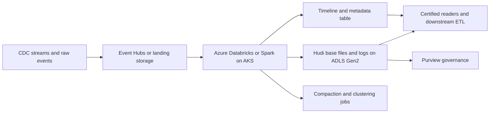
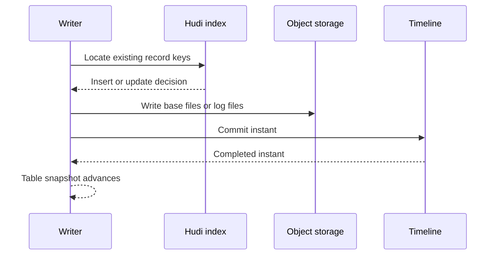
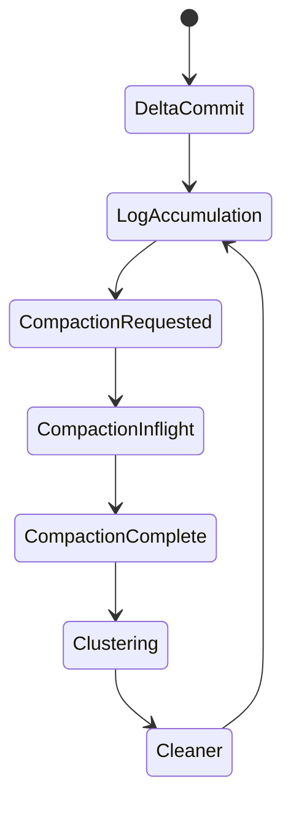

# Apache Hudi

> Part of the **Enterprise Data & AI Architecture Handbook** · Phase-04 - Storage Systems & Table Formats · Chapter 06.
> Estimated study time: **60 min reading + ~3h labs**.
> **Prerequisite:** read [Delta Lake](04_Delta_Lake.md) first.

---

## Executive Summary

Apache Hudi exists because many lake workloads are not simply append-only analytical tables. They are high-churn record streams with frequent upserts, late-arriving corrections, deduplication requirements, and downstream consumers that want incremental changes rather than repeated full snapshots. Plain Parquet on object storage is too weak for that problem, and table formats optimized primarily around snapshots do not always provide the most natural fit for record-oriented ingestion pipelines. Hudi addresses this by centering the table around record-level write semantics, indexes that locate existing records efficiently, and a timeline of instants that describes every mutation and table service action.

The defining Hudi decision is to optimize for mutable data on the lake, especially CDC-like and near-real-time ingestion patterns. Copy-on-write tables rewrite columnar files immediately on change and favor read performance. Merge-on-read tables defer some rewrite work by storing delta logs and compacting later, which favors write latency and streaming ingestion. That trade-off is the heart of Hudi architecture: choose when to pay the merge cost and choose which consumers need near-real-time freshness versus pre-compacted read efficiency.

On Azure, Hudi is most compelling when the platform needs Spark-first, ingestion-heavy lakehouse patterns over ADLS Gen2, especially for CDC pipelines, streaming deduplication, and incremental downstream pulls. Azure Databricks or Spark on AKS can run Hudi effectively, Event Hubs can feed the landing layer, and Purview can govern published outputs. Hudi is less natural where the platform is deeply standardized on [Delta Lake](04_Delta_Lake.md) features, or where the primary strategic requirement is broad neutral catalog interoperability in the style of Iceberg.

The practical conclusion is opinionated. Use Hudi when record-level upserts, ingestion efficiency, and incremental query semantics are the strategic need. Do not use it only because it is another open table format. Hudi is strongest when the team understands its timeline, indexing, compaction, and clustering model and is prepared to run those table services deliberately.

## Learning Objectives

By the end of this chapter you will be able to:

1. Explain the difference between Hudi copy-on-write and merge-on-read table types.
2. Describe Hudi’s timeline, instants, and asynchronous table services.
3. Explain how Hudi indexes support record-level upserts and deduplication.
4. Use incremental queries appropriately for downstream processing.
5. Reason about compaction and clustering as separate operational controls.
6. Design an Azure-first Hudi architecture on ADLS Gen2 with Spark-centric ingestion.
7. Diagnose common Hudi issues such as log-file buildup, weak key design, and index overhead.
8. Identify the workload patterns where Hudi is a stronger fit than Delta or Iceberg.
9. Define governance rules for record keys, precombine fields, retention, and table-service cadence.
10. Defend Hudi adoption in a staff- or architect-level review with explicit trade-offs.

## Business Motivation

- Enterprises increasingly ingest CDC and event streams that update existing records rather than only append new ones.
- Re-reading full tables for every downstream consumer is expensive when only a small change set is needed.
- Near-real-time ingestion pipelines need lower write latency than full rewrite-heavy lake patterns allow.
- Deduplication and late-arriving updates are operational facts in customer, order, session, and IoT domains.
- FinOps programs benefit when downstream jobs can consume only changed records instead of rescanning large tables.
- Lakehouse teams need one table abstraction for high-churn operational analytics that still lands on low-cost object storage.
- Governance improves when record mutation history and table-service actions are explicit rather than buried in pipeline code.

## History and Evolution

- Early Hadoop and cloud data lakes handled mutable data poorly because files on object storage were effectively immutable publication units.
- Teams commonly solved CDC and updates with expensive table rewrites, dual raw-plus-curated tables, or custom compaction logic.
- Apache Hudi emerged to bring record-level upserts, incremental pull patterns, and table services directly to the data lake.
- Its original strength was ingestion-heavy workloads where records must be updated on the lake without moving the workload back into traditional warehouses.
- Over time Hudi added richer indexes, metadata table support, optimistic concurrency control options, clustering, and better engine integrations.
- Copy-on-write and merge-on-read became the central design fork for balancing write efficiency and read simplicity.
- The project gained traction in streaming and CDC use cases where downstream consumers needed change-aware lake tables.
- Modern Hudi usage spans fraud detection feeds, customer profile unification, operational analytics, and incremental ETL pipelines.

## Why This Technology Exists

Hudi exists because record mutation on object storage is awkward. Object stores are excellent at durable immutable files and weak at row-level change semantics. As explained in [Delta Lake](04_Delta_Lake.md), the lakehouse response is to place a table abstraction over files. Hudi chooses to optimize that abstraction around ingestion-heavy record changes and incremental processing rather than starting from snapshot-first neutrality.

The core problem is practical. A CDC feed may contain multiple updates for the same business key in one hour. A customer profile table may need idempotent upserts and late correction handling. A downstream serving pipeline may not want a full snapshot every run; it may want every record changed since instant `T`. Hudi addresses these patterns directly through record keys, precombine logic, indexes, timeline instants, and incremental query semantics.

The technology therefore exists to make lake-based mutation cheaper and more operationally explicit. It is not simply another format wrapper over Parquet. It is a design for continuous record evolution on object storage.

## Problems It Solves

| Problem | Hudi contribution |
|---|---|
| Record-level upserts on object storage | Key-based indexing plus table mutations |
| High-frequency CDC ingestion | MOR and asynchronous services reduce write pressure |
| Deduplication of late or repeated records | Record key and precombine semantics |
| Incremental downstream ETL | Incremental queries over the timeline |
| Balancing write latency and read performance | COW vs MOR table choice |
| Small-file accumulation during streaming ingest | Clustering and compaction services |
| Change-aware operational analytics | Timeline-based mutation history |

## Problems It Cannot Solve

- Hudi does not turn a lake into a millisecond OLTP database.
- Hudi does not remove the need for careful primary-key and precombine-field design.
- Hudi does not guarantee equal support across every Azure engine or SQL surface.
- Hudi does not eliminate compaction, clustering, or cleanup operations; it makes them explicit.
- Hudi does not replace governance, lineage, or access control.
- Hudi does not justify broad write access from many heterogeneous engines without certification.
- Hudi cannot make bad CDC ordering or incorrect deduplication logic safe automatically.

## Core Concepts

### Copy-on-write versus merge-on-read

Hudi offers two primary table types:

- **Copy-on-write (COW):** updates rewrite columnar files directly, which simplifies reads and favors analytical query latency.
- **Merge-on-read (MOR):** updates are first written to delta log files and later compacted into base files, which favors lower-latency ingestion and more continuous updates.

This is the central Hudi design trade-off. COW pays write cost sooner. MOR defers part of the cost into later compaction and read-time merge behavior.

### Record keys and precombine fields

A Hudi table needs a stable record key to identify logical rows across upserts. It also typically uses a precombine field, often an event timestamp or sequence number, to choose the winning record when multiple changes arrive for the same key. Weak key design causes correctness and performance problems quickly.

### Timeline and instants

Hudi tracks table state as a timeline of instants. Instants move through states such as requested, inflight, and completed. Different instant types represent commits, delta commits, compactions, clustering, clean operations, rollback, and savepoints. The timeline is the operational history of the table.

### Indexes

Hudi indexes locate existing records so the engine can decide whether an incoming record is an insert or an update. Common index strategies include bloom, simple, bucket, and record-level indexes depending on workload and runtime support. Index choice is one of the most important Hudi design decisions because it shapes write amplification, lookup cost, and scaling behavior.

### Incremental queries

Incremental queries return records changed since a specified instant rather than the full table snapshot. This is one of Hudi’s strongest differentiators for downstream pipelines that want change capture semantics without rescanning all files.

### Compaction and clustering

Compaction merges MOR delta logs into new base files. Clustering rewrites data layout to improve file sizing and locality, often without changing logical table contents. These are related but distinct table services. Compaction primarily repays deferred write cost. Clustering primarily improves read efficiency and file health.

### Metadata table

Hudi can maintain a metadata table to accelerate file listing and improve planning. This matters because lake-scale performance problems often begin with metadata discovery rather than payload I/O.

### Hudi 1.x and current currency

Hudi's 1.x release line changed enough operationally that older 0.x-era assumptions should be re-validated rather than carried forward:

- **Table format changes:** Hudi 1.x introduced a redesigned timeline layout (LSM-tree-based timeline storage instead of a flat file listing) intended to scale to far larger numbers of instants without listing-cost blowup, plus improvements to the metadata table and concurrency control that reduce commit-conflict rates under concurrent writers.
- **MOR read-time merge cost remains the central trade-off in 1.x just as it was before.** Every MOR read still merges base files against delta logs unless compaction has caught up; 1.x's engine and metadata improvements reduce planning overhead, not the fundamental merge-on-read cost model. Do not assume version upgrades remove the need for a disciplined compaction schedule.
- **Index-choice trade-offs got sharper, not simpler.** Bloom and simple indexes remain the lowest-friction defaults for moderate-cardinality keys; bucket indexes trade a fixed, pre-declared bucket count for materially faster point lookups at high write throughput but make repartitioning expensive later; record-level (metadata-table-backed) indexes reduce lookup cost further but add metadata-table maintenance as a hard dependency. Pick the index at table-creation time with the expected write pattern in mind — changing index strategy on a live large table is an expensive migration, not a configuration flag flip.
- **Azure and Fabric support level:** Hudi runs on Azure primarily as a library inside self-managed Spark (Azure Databricks with the Hudi Spark package, or Spark on AKS/HDInsight); it is not a first-party managed table format the way Delta is inside Databricks or the way Delta-backed Lakehouse is inside Microsoft Fabric. As of this writing, Fabric does not offer native Hudi table support in the way it offers Delta — treat any Fabric/Hudi interoperability as requiring Trino, Presto, or a conversion/interop layer rather than native OneLake support, and re-verify current Fabric support before committing to Hudi in a Fabric-centric estate.

### When NOT to use Hudi

- The platform is already Databricks-first and standardized on Delta: Delta gets first-party Photon, Unity Catalog, and liquid-clustering support that Hudi will not receive on that same runtime.
- The platform's top strategic requirement is neutral, catalog-based multi-engine interoperability: Iceberg's catalog model and broader current engine parity (Snowflake, BigQuery, Athena, Trino) is usually a better fit than Hudi's more Spark-centric ecosystem.
- The estate is Fabric-centric: native Lakehouse tooling assumes Delta, and Hudi would be a bolt-on requiring extra engine plumbing.
- The workload is mostly append-only analytics with few updates: Hudi's indexing and timeline machinery add operational cost that a plain Parquet or simpler Delta table would not require.
- The team cannot commit to running compaction, clustering, and metadata-table maintenance as first-class scheduled jobs: an unmaintained MOR Hudi table degrades read performance predictably and silently.

## Internal Working

The write path begins when the engine receives a batch or micro-batch of records. Hudi uses the configured record key and index to determine which records are inserts and which update existing rows. The precombine field resolves duplicates or conflicting updates for the same key within the batch according to the configured ordering rule.

In a copy-on-write table, affected base files are rewritten so the current snapshot stays simple to read. In a merge-on-read table, incoming updates are appended to log files and recorded as delta commits. Readers can then read base files plus logs, or the platform can later run compaction to materialize a cleaner read-optimized view. This is why MOR is typically more ingestion-friendly and more operationally complex.

The timeline records these activities through instants. A commit or delta commit reaches completion when the mutation is durable and visible. Compaction and clustering may be scheduled asynchronously, move through requested and inflight states, and later complete as separate table services. Cleaner and archiver services manage older files and timeline history so the table does not accumulate infinite operational debris.

Incremental queries walk the timeline rather than comparing full snapshots naively. A downstream consumer can ask for all changes after a given instant and process only that mutation window. This is one of Hudi’s core operational advantages for change-propagation pipelines.

## Architecture

The strongest Hudi architecture separates ingestion, mutation management, serving, and governance clearly:

1. **Object-storage substrate:** ADLS Gen2 for data files, logs, and Hudi metadata.
2. **Spark-centric write plane:** Azure Databricks or Spark on AKS as the controlled mutation engine.
3. **Table-service plane:** scheduled or asynchronous compaction, clustering, cleaning, and archiving.
4. **Consumption plane:** Spark, certified SQL engines, or downstream pipelines consuming snapshots or incremental changes.
5. **Governance plane:** catalogs, lineage, security, and table-ownership controls.

On Azure, a common pattern is Event Hubs or batch CDC ingest into raw storage, Azure Databricks Structured Streaming or scheduled Spark jobs writing Hudi to ADLS Gen2, Purview registering the published datasets, and downstream Spark or Trino consumers using snapshot or incremental reads. The architecture works best when write authority is narrow and table services are run predictably.

## Components

| Component | Responsibility | Typical Azure mapping |
|---|---|---|
| Object store | Persist base files, log files, and metadata | ADLS Gen2 |
| Write engine | Perform upserts and table-service operations | Azure Databricks or Spark on AKS |
| Index | Locate existing records | Hudi bloom, simple, bucket, or record index |
| Timeline | Record commits and services | `.hoodie` metadata and timeline |
| Compaction service | Materialize MOR log updates into base files | Scheduled Spark jobs |
| Clustering service | Improve file sizing and data locality | Scheduled Spark jobs |
| Metadata table | Accelerate listings and planning | Hudi metadata table |
| Governance | Ownership, lineage, access policy | Microsoft Purview, Entra ID, RBAC |

## Metadata

Hudi metadata is operationally dense.

| Metadata element | Purpose | Operational consequence |
|---|---|---|
| Record key | Row identity across updates | Bad key design breaks correctness |
| Precombine field | Determines winning update | Wrong ordering causes stale data |
| Timeline instant | Records mutation or service action | Enables incremental processing |
| File group | Tracks base file plus related log files | Important for MOR planning |
| Commit metadata | Captures changed partitions and files | Useful for observability |
| Metadata table | Speeds file discovery | Reduces listing overhead |
| Savepoints and cleaner state | Recovery and retention control | Affects rollback and history |

The platform consequence is direct: Hudi tables are not only data files. They are active metadata systems that need policy and observability.

## Storage

Hudi stores different physical artifacts depending on table type:

- COW tables mainly store rewritten base files,
- MOR tables store base files plus append-oriented log files,
- both store timeline metadata and possibly metadata-table artifacts.

On Azure, ADLS Gen2 Standard GPv2 with hierarchical namespace enabled remains the right default substrate. ZRS or GZRS should be selected based on business continuity requirements. Storage sizing must account not only for the main dataset but also for log-file growth, compaction backlog, and retained history. Archive tiers are poor fits for active Hudi tables because compaction and query planning require low-latency access to both data and metadata.

## Compute

Hudi is compute-dependent in a way that heavily favors Spark-centric estates.

- Azure Databricks is usually the cleanest Azure runtime for Hudi because Spark-native write operations, scheduling, and streaming support are mature.
- Spark on AKS is viable where the organization prefers self-managed compute or more open deployment patterns.
- Downstream SQL engines can read Hudi to varying degrees, but the richest mutation and maintenance support is still Spark-centric.
- Fabric should be treated cautiously for Hudi-first architectures; validate exact support instead of assuming parity with Delta-centric experiences.

Compute planning should therefore start with the writers and table services, not only the consumers. A Hudi estate with underpowered or poorly scheduled table services degrades quickly.

## Networking

Hudi remains a remote object-store table format, so network behavior matters:

- MOR reads may require base files plus multiple log-file reads,
- incremental consumers benefit by avoiding full-table rescans,
- compaction and clustering can move large amounts of data over the network,
- metadata-table usage can reduce file-listing overhead,
- cross-region access amplifies the cost of write-heavy and service-heavy tables.

On Azure, private endpoints, VNet injection, and internal routing between Databricks, AKS, and ADLS need to be designed intentionally so table-service traffic does not become an afterthought.

## Security

Hudi security is inherited from the surrounding platform, but mutation-centric tables make control boundaries especially important.

- Restrict write authority to a small set of certified jobs and engines.
- Protect `.hoodie` metadata and timeline state as carefully as base data files.
- Use managed identities, Entra ID, RBAC, ACLs, and private networking for ADLS-backed tables.
- Govern incremental feeds because they may expose operationally sensitive change streams.
- Align cleaner and retention policy with audit, privacy, and legal-hold requirements.

The common security mistake is granting broad path-level write access and assuming Hudi’s table semantics will survive uncoordinated mutation safely.

## Performance

| Lever | Why it helps | Common risk |
|---|---|---|
| Right table type choice | Aligns write/read trade-off with workload | Wrong choice creates constant operational pain |
| Good record key and precombine design | Efficient upserts and correct winners | Weak design causes churn and bad results |
| Proper index selection | Avoids excessive lookup cost | Overly heavy index hurts ingest throughput |
| Regular compaction | Keeps MOR reads from degrading | Delay causes log-file explosion |
| Clustering | Improves file sizing and read locality | Overuse wastes compute |
| Incremental downstream reads | Avoids full rescans | Consumer lag and retention misalignment can break flows |

The critical performance truth is that Hudi’s ingestion advantage is real only when table services are healthy. A neglected MOR table can become slower and more expensive than the alternatives it was meant to beat.

## Scalability

Hudi scales well for high-volume mutation-heavy pipelines because it is designed around record-level changes, not only snapshot replacement. It can ingest large CDC or event streams efficiently when indexes, partitioning, and service cadence are well designed.

The scaling limits appear when:

- indexes become too expensive for key cardinality and partition shape,
- too many writers compete for the same table,
- compaction falls behind write throughput,
- clustering is never performed,
- incremental consumers lag beyond retained history,
- engine support is assumed rather than certified.

Large Hudi estates need explicit SLOs for compaction lag, log depth, and incremental-consumer lag.

## Fault Tolerance

Hudi fault tolerance spans storage durability, timeline correctness, and service recovery.

- ADLS durability protects physical files.
- Timeline instants give the system an explicit mutation history.
- Rollbacks and savepoints help recover from failed writes or bad deployments.
- Cleaner and archiver policies keep history manageable without retaining everything forever.
- Compaction failure handling is part of operational recovery, not a rare edge case.

The main failure mode is not that Hudi lacks durability. It is that service backlogs or poor retention rules quietly erode correctness, recoverability, or read performance over time.

## Cost Optimization

| Cost lever | Mechanism | Typical Azure effect |
|---|---|---|
| Incremental downstream queries | Avoid repeated full scans | Lower Databricks and ADLS read cost |
| Correct table type selection | Match write/read economics | Lower unnecessary rewrite cost |
| Scheduled compaction | Prevent runaway MOR read amplification | Lower query CPU and I/O |
| Clustering by business access pattern | Better file efficiency | Lower request counts and scan cost |
| Metadata table | Fewer expensive listings | Lower planning latency and transaction overhead |

FinOps guidance should recognize that Hudi shifts some cost from repeated full snapshots into continuous service operations. That can be a major win, but only if compaction and cleanup are run intentionally rather than reactively.

## Monitoring

Monitor Hudi at both data and table-service layers:

- commit and delta-commit frequency,
- compaction backlog and average lag,
- clustering backlog,
- log-file count per file group,
- incremental-consumer lag,
- file size distribution,
- cleaner and archiver activity,
- index lookup cost and write latency.

On Azure, combine Spark job telemetry, Azure Monitor, Log Analytics, and ADLS storage metrics. The goal is to detect service drift before users feel query pain.

## Observability

Observability should answer these questions quickly:

1. What instant did this consumer read up to?
2. Which file groups are carrying the heaviest log depth?
3. Is the bottleneck ingest, index lookup, compaction, or clustering?
4. Did a bad key, bad precombine field, or retention policy cause the issue?

Useful evidence includes timeline inspection, commit metadata, Spark stage metrics, ADLS request traces, incremental-reader checkpoints, and file-group health reports. Without these signals, Hudi problems often get misdiagnosed as generic Spark streaming instability.

## Governance

Hudi governance should define:

1. approved table types by workload tier,
2. record-key and precombine-field design rules,
3. which engines may write versus only read,
4. compaction and clustering SLOs,
5. incremental-query retention windows,
6. savepoint and rollback policy,
7. raw path access rules for published Hudi tables,
8. compatibility policy for Azure runtimes and open-source readers.

The key governance principle is that mutation semantics are a product contract. They cannot be left to per-notebook improvisation.

## Trade-offs

| Choice | Benefit | Cost | When not to use |
|---|---|---|---|
| COW | Simpler reads and fewer merge costs | Higher write amplification | Very high-frequency update streams |
| MOR | Lower write latency and better continuous ingest | Compaction and read complexity | Read-latency-sensitive BI tables without service discipline |
| Heavy indexing | Faster update location | Higher ingest overhead | Append-mostly tables with little update reuse |
| Incremental query pipelines | Avoid full rescans | Require timeline retention discipline | Consumers that need only periodic full snapshots |
| Frequent clustering | Better file layout | More compute spend | Small low-value tables |
| Broad engine writes | Flexibility | Higher compatibility risk | Production shared tables |

## Decision Matrix

| Scenario | Recommended Hudi stance | Reason |
|---|---|---|
| High-churn CDC table on Azure Spark | Strong candidate, often MOR | Record upserts and incremental pulls fit well |
| BI-serving table with modest updates | COW may fit | Simpler reads matter more than write latency |
| Databricks-first enterprise already standardized on Delta | Usually not default | Platform integration favors Delta |
| Multi-engine openness as top priority | Usually not first choice | Iceberg is often stronger for neutral interoperability |
| Streaming ingestion with downstream change propagation | Strong candidate | Incremental timeline semantics are valuable |
| Mostly append-only immutable analytics | Often unnecessary | Plain Parquet or other table formats may suffice |
| Private-cloud Spark estate on object storage | Strong candidate | Open-source Spark-centric mutation model fits |

## Design Patterns

1. **CDC bronze-to-Hudi pattern:** stage raw changes, deduplicate by key, then upsert into a Hudi table.
2. **MOR-for-ingest pattern:** use MOR for fast writes and schedule compaction to align with serving SLAs.
3. **COW-for-serving pattern:** use COW when query simplicity and lower read latency dominate.
4. **Incremental fan-out pattern:** downstream ETL reads only records changed since last processed instant.
5. **Asynchronous table-service pattern:** separate ingestion from compaction and clustering so each can scale independently.
6. **Metadata-table acceleration pattern:** enable metadata services to reduce heavy listing cost on large estates.
7. **Narrow-writer pattern:** allow many readers but keep the writer set intentionally small and certified.

## Anti-patterns

1. Choosing MOR for every table because it sounds more advanced.
2. Letting compaction lag grow without an SLO.
3. Using unstable business identifiers as record keys.
4. Treating precombine fields as optional on out-of-order event streams.
5. Allowing too many heterogeneous engines to mutate one table.
6. Ignoring incremental-consumer lag until retention cleanup breaks them.
7. Publishing raw Hudi paths broadly instead of governed table interfaces.
8. Assuming Hudi automatically beats Delta or Iceberg on every mutable workload.

## Common Mistakes

- **Mistake:** choosing MOR for a dashboard-serving table with tight read latency goals.  
  **Consequence:** users pay merge and log-read overhead on every query.  
  **Fix:** use COW or run compaction aggressively enough to meet the SLA.

- **Mistake:** selecting a poor record key.  
  **Consequence:** excessive index work, duplicates, or incorrect updates.  
  **Fix:** design keys from stable business identity and validate cardinality early.

- **Mistake:** skipping precombine logic on late-arriving streams.  
  **Consequence:** stale records can win over newer ones.  
  **Fix:** enforce deterministic ordering with a reliable sequence field.

- **Mistake:** treating compaction as a cleanup task rather than part of the serving path.  
  **Consequence:** MOR performance collapses under backlog.  
  **Fix:** operate compaction as an SLO-backed service.

- **Mistake:** assuming every SQL engine reads Hudi with equal fidelity.  
  **Consequence:** compatibility incidents and misleading benchmarks.  
  **Fix:** certify engines explicitly before shared production use.

## Best Practices

1. Choose COW or MOR per workload, not per organizational fashion.
2. Design record keys and precombine fields as part of the data contract.
3. Keep compaction and clustering on deliberate schedules with measurable lag targets.
4. Use incremental queries where downstream pipelines truly benefit from change-based processing.
5. Enable metadata-table acceleration on large estates after validation.
6. Restrict production writes to a small set of Spark-based jobs.
7. Track log-file depth and file-group health continuously.
8. Align retention and cleaner policy with incremental-consumer SLAs.
9. Compare Hudi with [Delta Lake](04_Delta_Lake.md) using workload shape, not ideology.
10. Treat Hudi table services as first-class platform operations.

## Enterprise Recommendations

Recommended enterprise defaults:

- **Azure substrate:** ADLS Gen2 Standard GPv2 with HNS enabled.
- **Primary writer engine:** Azure Databricks current LTS runtime or certified Spark on AKS.
- **Default use case:** CDC-driven mutable operational analytics, not general-purpose serving for every domain.
- **Table-type policy:** MOR for ingest-heavy mutation tables, COW for read-optimized mutable tables.
- **Governance policy:** narrow write authority, required key/precombine review, explicit compaction SLOs.

### ADR example: default mutable lake table format for CDC-heavy operational domains

**Context:** The platform has several CDC-heavy domains with frequent record corrections, near-real-time update expectations, and downstream consumers that want incremental change pulls. The estate already knows [Delta Lake](04_Delta_Lake.md), but some teams find full-snapshot or merge-centric patterns expensive for continuous high-churn feeds.

**Decision:** Use Apache Hudi for selected CDC-heavy operational analytical domains on ADLS Gen2. Default to MOR for ingestion-heavy tables and COW for read-optimized mutable domains. Keep Azure Databricks as the primary writer surface and require compatibility certification for all secondary readers.

**Consequences:** Ingestion efficiency and incremental propagation improve, but the platform must own compaction, clustering, and key design discipline. Hudi becomes a targeted capability rather than a universal table default.

**Alternatives considered:**

1. Delta everywhere: rejected because some CDC-heavy domains wanted stronger incremental semantics and different write/read trade-offs.
2. Iceberg everywhere: rejected because ingestion-centric record mutation was the higher priority than neutral engine plurality in these domains.
3. Plain Parquet with custom upsert logic: rejected because operational complexity and correctness risk were too high.

## Azure Implementation

The Azure-first Hudi pattern is:

1. Event Hubs, batch CDC, or landing files feed raw change data.
2. Azure Databricks Structured Streaming or scheduled Spark jobs write Hudi tables on ADLS Gen2.
3. Compaction, clustering, cleaning, and archiving run as explicit Spark jobs.
4. Purview captures ownership and lineage for published mutable datasets.
5. Certified consumers read snapshots or incremental changes according to SLA.

Recommended Azure posture:

- ADLS Gen2 Standard GPv2 with HNS enabled, usually ZRS or GZRS for critical domains.
- Azure Databricks Premium with current LTS runtime for primary Hudi mutation workloads.
- Managed identities, private endpoints, and ACLs for all production tables.
- Azure Monitor and Log Analytics for table-service telemetry and operational alerts.

### Bicep: ADLS Gen2 account for Hudi tables

```bicep
param location string = resourceGroup().location
param storageAccountName string

resource lake 'Microsoft.Storage/storageAccounts@2023-05-01' = {
  name: storageAccountName
  location: location
  sku: {
    name: 'Standard_ZRS'
  }
  kind: 'StorageV2'
  properties: {
    isHnsEnabled: true
    accessTier: 'Hot'
    allowBlobPublicAccess: false
    minimumTlsVersion: 'TLS1_2'
    supportsHttpsTrafficOnly: true
  }
}
```

### PySpark: write a Hudi MOR table on ADLS Gen2

```python
hudi_options = {
    "hoodie.table.name": "customer_profile_hudi",
    "hoodie.datasource.write.recordkey.field": "customer_id",
    "hoodie.datasource.write.precombine.field": "event_ts",
    "hoodie.datasource.write.partitionpath.field": "country_code",
    "hoodie.datasource.write.table.type": "MERGE_ON_READ",
    "hoodie.datasource.write.operation": "upsert",
    "hoodie.datasource.hive_sync.enable": "false"
}

(incoming_df.write
    .format("hudi")
    .options(**hudi_options)
    .mode("append")
    .save("abfss://curated@contosolake.dfs.core.windows.net/customer_profile_hudi"))
```

### PySpark: incremental query from a Hudi table

```python
changes = (spark.read.format("hudi")
    .option("hoodie.datasource.query.type", "incremental")
    .option("hoodie.datasource.read.begin.instanttime", "20260709090000")
    .load("abfss://curated@contosolake.dfs.core.windows.net/customer_profile_hudi"))
```

### PySpark: schedule compaction or clustering

```python
spark.sql("CALL run_compaction(table => 'customer_profile_hudi')")
spark.sql("CALL run_clustering(table => 'customer_profile_hudi')")
```

Azure guidance that matters operationally:

- Do not assume Fabric is an equivalent primary Hudi runtime; validate exact support before committing to that path.
- Treat Hudi as a Spark-first Azure pattern, not as a universal Azure analytics default.
- Keep compaction and clustering jobs separate from ingestion so each can scale and fail independently.
- Make incremental-consumer SLAs explicit before setting cleaner retention.

## Open Source Implementation

An open-source Hudi platform usually combines Spark, Kafka or Flink, MinIO, and optional query engines.

### Docker Compose: MinIO for a Hudi sandbox

```yaml
services:
  minio:
    image: minio/minio:RELEASE.2026-06-13T11-33-47Z
    command: server /data --console-address ":9001"
    environment:
      MINIO_ROOT_USER: minioadmin
      MINIO_ROOT_PASSWORD: minioadmin123
    ports:
      - "9000:9000"
      - "9001:9001"
    volumes:
      - minio-data:/data

volumes:
  minio-data:
```

### Spark configuration for Hudi on MinIO

```python
spark.conf.set("spark.hadoop.fs.s3a.endpoint", "http://minio:9000")
spark.conf.set("spark.hadoop.fs.s3a.access.key", "minioadmin")
spark.conf.set("spark.hadoop.fs.s3a.secret.key", "minioadmin123")
spark.conf.set("spark.hadoop.fs.s3a.path.style.access", "true")
spark.conf.set("spark.hadoop.fs.s3a.connection.ssl.enabled", "false")
```

### Spark Structured Streaming to Hudi

```python
(stream_df.writeStream
    .format("hudi")
    .options(**hudi_options)
    .option("checkpointLocation", "s3a://checkpoints/customer_profile_hudi")
    .outputMode("append")
    .start("s3a://curated/customer_profile_hudi"))
```

### Trino Hudi catalog example

```properties
connector.name=hudi
hive.metastore.uri=thrift://metastore:9083
fs.native-s3.enabled=true
s3.endpoint=http://minio:9000
s3.path-style-access=true
s3.aws-access-key=minioadmin
s3.aws-secret-key=minioadmin123
```

Open-source guidance:

- Use Spark for the richest mutation and service behavior even if another engine handles most interactive reads.
- Validate reader support for MOR versus COW before publishing a table widely.
- Pair Hudi with disciplined streaming checkpoints, backups, and metadata-table monitoring.

## AWS Equivalent (comparison only)

| Azure pattern | AWS equivalent | Advantages | Disadvantages | Migration note |
|---|---|---|---|---|
| ADLS + Databricks/Spark + Hudi | S3 + EMR/Databricks + Hudi | Mature Spark-centric Hudi ecosystem | IAM and storage-policy model differs | Re-certify index, cleaner, and streaming behavior |
| Event Hubs + Databricks ingest | Kinesis or MSK + Spark/Flink ingest | Strong streaming options | Broader service composition required | Separate transport migration from table migration |
| Purview-governed mutable domains | Glue/Lake Formation plus Hudi-compatible engines | Mature governance choices | Policy model differs materially | Rebuild governance model intentionally |

Selection criteria:

- Choose AWS equivalence when the Spark/Flink and IAM center of gravity already lives there.
- Preserve Hudi key design and service cadence as part of migration planning, not only the data files.

## GCP Equivalent (comparison only)

| Azure pattern | GCP equivalent | Advantages | Disadvantages | Migration note |
|---|---|---|---|---|
| ADLS + Spark-based Hudi estate | GCS + Dataproc or Databricks on GCP + Hudi | Strong open Spark options | Different IAM and network model | Re-test object-store and checkpoint semantics |
| Event Hubs + Databricks CDC ingest | Pub/Sub or Kafka + Spark/Flink | Flexible ingestion tooling | Integration pattern differs | Validate ordering and incremental SLAs during migration |
| Purview + Entra governance | Dataplex, BigLake, or external governance stack | Good governance choices | Hudi may be less central in some native GCP patterns | Decide whether Hudi remains strategic before lift-and-shift |

Selection criteria:

- GCP is attractive when Spark-centric mutation pipelines remain strategic.
- Migration is simplest when the Hudi service model and key semantics stay explicit and documented.

## Migration Considerations

Typical migrations include raw CDC files to Hudi, plain Parquet mutable tables to Hudi, and Delta-based CDC domains to Hudi where incremental pull behavior and ingestion economics become more important than Delta-native platform features.

Migration sequence:

1. Inventory mutable domains by update frequency, key quality, and downstream change-consumer needs.
2. Design and validate record keys and precombine fields before table conversion.
3. Choose COW or MOR based on actual read/write SLA, not assumptions.
4. Stand up compaction, clustering, and cleaner schedules before production cutover.
5. Validate incremental consumers against retention and lag expectations.
6. Certify every required reader engine against the chosen Hudi table type.

Key risks:

- unstable or non-unique business keys,
- incorrect winner selection from poor precombine logic,
- compaction backlog after cutover,
- underestimated MOR read cost,
- consumers silently depending on full snapshots instead of incremental semantics,
- assuming Hudi outperforms Delta or Iceberg without workload-specific evidence.

## Mermaid Architecture Diagrams

### Azure Hudi mutation architecture



### Hudi upsert sequence



### MOR service lifecycle



## End-to-End Data Flow

1. A CDC or event source emits records into Event Hubs or raw landing storage.
2. A Spark-based pipeline normalizes schema, record keys, and precombine fields.
3. Hudi indexes determine whether each record is an insert or update.
4. The write path stores data as COW base-file rewrites or MOR log-file appends.
5. The timeline records commit or delta-commit completion.
6. Downstream consumers read either the latest snapshot or only changes after a given instant.
7. Compaction and clustering jobs periodically improve file health and read efficiency.
8. Cleaner and archiver services prune obsolete artifacts according to policy.
9. Governance services capture ownership, lineage, and access controls.
10. Operators monitor lag, log depth, and consumer freshness as first-class SLOs.

## Real-world Business Use Cases

| Use case | Why Hudi fits |
|---|---|
| Customer profile unification | Frequent key-based upserts and late corrections |
| Fraud or risk event tables | Continuous ingestion with downstream incremental processing |
| IoT device state tables | Mutable records updated by latest device reading |
| Operational sales or order mirrors | CDC-driven updates with periodic analytical reads |
| Near-real-time feature pipelines | Incremental pull semantics reduce full-table recomputation |

## Industry Examples

- Streaming and CDC-heavy data lake programs often choose Hudi when change propagation is more important than broad neutral interoperability.
- Spark-centric platforms use Hudi effectively for operational analytics tables that mutate continuously.
- Teams that struggled with repeated full-table merges sometimes move selected domains to Hudi because incremental pulls simplify downstream ETL.
- Organizations with strict BI-read simplicity sometimes choose COW Hudi selectively while using other formats for broader lakehouse standards.

The repeated pattern is that Hudi becomes most compelling when the table is closer to a continuously maintained record store than to a mostly static analytical snapshot.

## Case Studies

### Case study 1: MOR without compaction discipline

A team selected MOR for a customer-state table because ingest latency mattered. Initial write performance was strong, but compaction was treated as low priority. Log depth increased, readers slowed, and downstream SLAs were missed. The eventual fix was an explicit compaction SLO and dedicated compute windows. The lesson was that MOR is not cheaper; it is deferred cost that must be repaid operationally.

### Case study 2: Bad key design caused duplicate customers

A profile-unification pipeline used an unstable surrogate key instead of a durable business identifier. Hudi performed exactly as configured and still produced duplicate logical customers because the record key was wrong. Reworking the key and precombine strategy fixed the issue. The lesson was that table format correctness cannot rescue a broken identity model.

### Case study 3: Incremental ETL beat repeated table scans

A downstream enrichment pipeline originally rescanned an entire mutable table every hour. Switching to Hudi incremental reads reduced compute cost and improved freshness. The win did not come from more compression or better SQL. It came from reading only what changed. The lesson was that change-aware consumption can be more important than snapshot elegance.

## Hands-on Labs

1. Create both COW and MOR Hudi tables for the same dataset and compare write/read behavior.
2. Upsert duplicate and late-arriving events to observe record-key and precombine behavior.
3. Run an incremental query starting from a selected instant and validate downstream change capture.
4. Intentionally delay compaction on a MOR table, then measure the performance impact and recover it.
5. Inspect Hudi timeline instants and correlate them with table-service jobs.

## Exercises

1. What is the operational difference between COW and MOR?
2. Why does Hudi need both a record key and a precombine field?
3. What problem does the index solve during upserts?
4. Why can incremental queries reduce cost significantly?
5. How is compaction different from clustering?
6. When does Hudi beat Delta in practice?
7. Why can MOR tables become expensive if ignored?
8. What metrics would show a compaction backlog becoming dangerous?
9. Why should only a small set of engines write production Hudi tables?
10. How would you explain Hudi to a business stakeholder who only cares about freshness and cost?

## Mini Projects

1. Build a CDC pipeline from Event Hubs to a Hudi MOR table on ADLS Gen2 with an incremental downstream consumer.
2. Create a Hudi operations scorecard that tracks compaction lag, log depth, and incremental-consumer freshness.
3. Build a controlled benchmark comparing Hudi COW, Hudi MOR, and a Delta merge pattern for one mutable domain.

## Capstone Integration

This chapter is the mutation- and ingestion-centric counterpart to [Delta Lake](04_Delta_Lake.md). In a capstone platform, Hudi should be chosen only for domains that truly benefit from record-oriented upserts and incremental query patterns. The capstone should show that lake mutation is not one generic problem: some domains want snapshot-centric Delta behavior, some want open Iceberg interoperability, and some want Hudi’s continuous record-evolution model.

## Interview Questions

1. What is the difference between Hudi COW and MOR?
   **A:** Copy-on-Write (COW) rewrites the affected data file entirely on every update, giving simpler, faster reads at the cost of more expensive writes; Merge-on-Read (MOR) writes updates to a separate delta log file and merges them with base files at read time, giving cheaper writes at the cost of more expensive reads (merge cost) unless compaction keeps the delta logs small.
2. Why does Hudi need an index for upserts?
   **A:** To perform an upsert efficiently, Hudi must quickly determine which existing file a given record key already belongs to (to update it in place) without scanning the entire table — the index (bloom-filter-based, simple, or global) maps record keys to file locations to make that lookup fast.
3. What is the role of the timeline?
   **A:** The timeline is Hudi's ordered log of all actions taken on the table (commits, compactions, cleans), analogous to Delta's transaction log — it's the mechanism providing atomicity, snapshot isolation, and the basis for incremental queries.
4. What is an incremental query?
   **A:** An incremental query reads only the records that changed between two timeline instants, letting a downstream consumer process just the delta rather than re-scanning the full table — this is one of Hudi's most distinctive, natively-supported capabilities.
5. Why are record keys and precombine fields important?
   **A:** The record key uniquely identifies a logical row for upsert/delete matching; the precombine field (often an update timestamp) determines which of multiple incoming records for the same key wins when there's a conflict — without correct precombine logic, out-of-order or duplicate updates can silently apply in the wrong order.
6. How do compaction and clustering differ?
   **A:** Compaction (relevant to MOR tables) merges accumulated delta log files into the base file to bound read-time merge cost; clustering reorganizes data layout (e.g., sorting, resizing files) to improve query performance, independent of whether there are pending deltas to merge — they solve different problems (write-log buildup vs. layout optimization).
7. When does Hudi outperform Delta or Iceberg?
   **A:** Hudi tends to outperform for CDC-heavy, high-frequency upsert workloads specifically because of its native incremental-query support and indexing designed around efficient upserts — for append-mostly or infrequent-update analytical workloads, its specialized upsert machinery provides less differentiated benefit.
8. Why is Hudi considered Spark-centric in many estates?
   **A:** Hudi's most mature, feature-complete integration and tooling historically has been with Apache Spark, and while other engine integrations exist, they often lag in feature parity — teams adopting Hudi should validate their specific non-Spark engine's actual support level rather than assuming full parity.

## Staff Engineer Questions

1. How would you choose between COW and MOR for a CDC-heavy domain with mixed read patterns?
   **A:** Choose MOR if writes are frequent and read latency can tolerate some merge-on-read overhead (with disciplined compaction scheduling to bound that overhead); choose COW if reads are latency-sensitive and dominate over write frequency, accepting the higher per-write rewrite cost in exchange for simpler, faster reads.
2. What key and precombine rules would you mandate before a team can create a Hudi table?
   **A:** Require an explicit, documented record key with genuine uniqueness guarantees and a precombine field that reliably orders conflicting updates (typically an event or update timestamp) — allowing a table without a well-defined precombine field risks silent, non-deterministic conflict resolution.
3. How would you set SLOs for compaction lag and incremental-consumer delay?
   **A:** Define a maximum acceptable delta-log accumulation (compaction lag) before it materially degrades read-merge cost, and a maximum acceptable incremental-consumer processing delay tied to the downstream business requirement (e.g., near-real-time dashboard freshness) — both should be monitored and alerted on, not just configured and forgotten.
4. When should Hudi be preferred over Delta in an Azure platform?
   **A:** Prefer Hudi when the domain's core requirement is efficient, native incremental processing of a high-frequency upsert/CDC stream that Hudi's purpose-built indexing and incremental-query features directly address — for most other Azure/Databricks-centric analytical workloads, Delta's tighter platform integration usually makes it the more pragmatic default.
5. How would you benchmark index choices without biasing the outcome?
   **A:** Test each index type (bloom, simple, global) against the actual production-representative record-key distribution and update pattern, since index performance is highly sensitive to key cardinality and update locality — a benchmark using an unrepresentative key distribution can favor the wrong index type for the real workload.
6. What evidence would show that Hudi table services need dedicated compute isolation?
   **A:** Compaction/clustering jobs consistently contending with and delaying interactive query workloads on the same shared cluster is direct evidence that table-service maintenance work needs its own isolated compute allocation rather than competing with user-facing queries.
7. How would you govern secondary SQL readers with weaker Hudi support?
   **A:** Document exactly which secondary engines (a particular SQL engine with partial Hudi support) can safely read which table configuration (COW may be more broadly readable than MOR's merge-on-read requirement), and restrict weaker-support engines to the configurations they can actually handle correctly.
8. Which domains should never be modeled as Hudi tables?
   **A:** Domains with simple, append-mostly, infrequent-update patterns gain little from Hudi's upsert-optimized machinery and would carry unnecessary table-service operational overhead (compaction/clustering scheduling) for no corresponding benefit — these are better served by a simpler table format.

## Architect Questions

1. What should be the enterprise criteria for allowing Hudi at all?
   **A:** Allow Hudi only for domains with a documented, genuine high-frequency CDC/upsert requirement where its native incremental-query and indexing capabilities provide a measurable advantage over the platform's default (Delta) — introducing a second table format has a real ongoing operational cost that must be justified per domain, not assumed broadly beneficial.
2. How does Hudi fit into an Azure platform already using Delta for most curated tables?
   **A:** Position Hudi as a narrow, justified exception for specific CDC-heavy domains, with clear documentation of why that domain deviates from the Delta default, rather than allowing it to spread as an alternative default without a differentiating reason per adopting domain.
3. Which Azure runtimes are allowed to write production Hudi tables and under what controls?
   **A:** Restrict production writes to the Spark-based runtimes with mature, validated Hudi support (typically Databricks or HDInsight/Synapse Spark with confirmed Hudi library versions), with any non-Spark writer requiring an explicit compatibility validation before being approved.
4. How should disaster recovery account for timeline history and retained increments?
   **A:** DR replication must include the Hudi timeline metadata alongside data and delta-log files, since the timeline is what makes the table's commit history and incremental-query capability reconstructible after a recovery — losing timeline metadata while retaining raw files breaks incremental consumers relying on it.
5. What governance prevents Hudi from becoming a dumping ground for every mutable workload?
   **A:** Require the documented CDC/upsert-frequency justification (from the "enterprise criteria" above) as a gate before any new Hudi table is provisioned, rather than allowing teams to default to Hudi simply because it supports mutability generally.
6. When is incremental processing a strategic advantage versus a local optimization?
   **A:** It's a strategic advantage when multiple downstream consumers across the platform benefit from the same incremental-query capability (justifying the shared table-service operational investment); it's merely a local optimization when only one pipeline benefits, in which case a simpler application-level incremental-processing pattern might suffice without adopting Hudi platform-wide.
7. How should compaction and clustering budgets be represented in platform capacity planning?
   **A:** Treat table-service compute (compaction, clustering) as a distinct, forecasted capacity line item separate from interactive query compute, since its resource needs scale with write/update volume rather than query volume and can silently grow to compete for shared cluster capacity if not planned for explicitly.
8. What evidence is sufficient to claim Hudi beats Delta or Iceberg for one domain?
   **A:** A controlled, representative benchmark on the domain's actual CDC volume and update pattern showing a measurable latency or cost improvement for incremental consumption — a general claim about Hudi's upsert-optimized design isn't sufficient without workload-specific, measured evidence.

## CTO Review Questions

1. Are we using Hudi only where its mutation model creates business value, or are we adding platform diversity without a reason?
   **A:** Every Hudi table should trace to a documented CDC/upsert requirement that Delta couldn't serve as well — Hudi adoption without that specific justification is unnecessary platform diversity, adding operational cost (a second table format's tooling and expertise) without a corresponding benefit.
2. Which costs shift downward when downstream jobs consume only changes instead of full tables?
   **A:** Incremental consumption via Hudi's native incremental query avoids full-table re-scans for downstream consumers, directly reducing compute cost and processing latency for pipelines that only need to react to what changed — this benefit should be quantifiable per adopting domain.
3. Do we have explicit owners for Hudi table services and retention policy?
   **A:** This should be answerable from a governance registry — Hudi's table-service maintenance (compaction, cleaning) requires active ownership, and an unowned Hudi table risks silent compaction-lag buildup degrading read performance over time.
4. If compaction stops for a week, what business-facing SLAs break first?
   **A:** MOR tables' read-merge cost grows unbounded as uncompacted delta logs accumulate, so any downstream SLA depending on that table's query latency is the first to break — this dependency should be explicitly mapped so an operational failure's business impact is understood in advance, not discovered during an incident.
5. Are we choosing Hudi because the workload truly demands it, or because teams want autonomy from platform standards?
   **A:** This requires an honest review of each Hudi adoption's stated justification against its actual measured workload characteristics — adoption driven by a team's preference for autonomy rather than a genuine technical requirement should be redirected back to the platform's Delta default.
6. Can we explain clearly why a given domain is Hudi instead of Delta or Iceberg?
   **A:** Every Hudi table should have a one-sentence, documented justification tied to its specific CDC/upsert requirement — if that justification can't be articulated clearly, the table is a candidate for migration back to the platform default.

## References

- Apache Hudi documentation and table-services reference.
- Spark Structured Streaming documentation for lake mutation pipelines.
- Microsoft Learn guidance for ADLS Gen2, Azure Databricks, Event Hubs, and Azure Monitor.
- Engineering material on CDC pipelines, record-level upserts, and incremental lake processing.
- Comparative lakehouse engineering material for Hudi and [Delta Lake](04_Delta_Lake.md).

## Further Reading

- Hudi operational playbooks for compaction, clustering, and cleaner tuning.
- Benchmarking guidance for mutable lake workloads across Hudi, Delta, and Iceberg.
- Streaming CDC design patterns on Azure with Spark and ADLS Gen2.
- Metadata-table and indexing deep dives for large Hudi estates.
- FinOps guidance for incremental processing and mutable table maintenance.