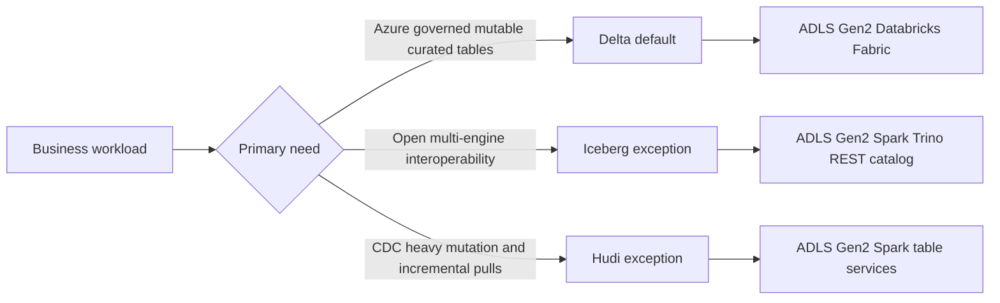
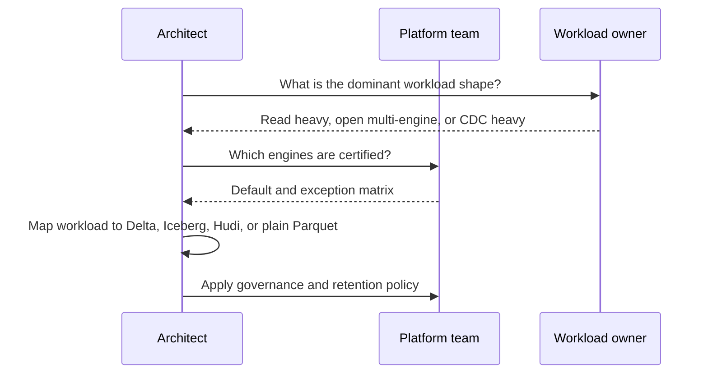
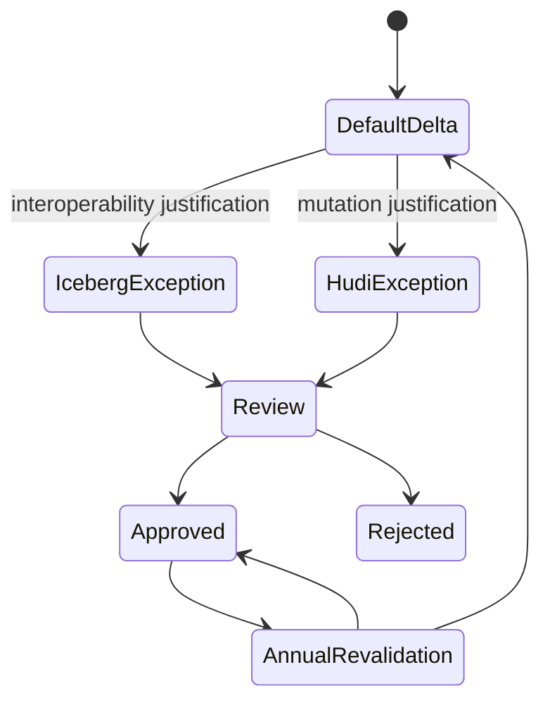

# Table Format Comparison and Selection

> Part of the **Enterprise Data & AI Architecture Handbook** · Phase-04 - Storage Systems & Table Formats · Chapter 07.
> Estimated study time: **45 min reading + ~2h labs**.
> **Prerequisites:** read [Delta Lake](04_Delta_Lake.md), [Apache Iceberg](05_Apache_Iceberg.md), and [Apache Hudi](06_Apache_Hudi.md) first.

---

## Executive Summary

Enterprises do not need a favorite table format. They need a defensible selection framework. Delta Lake, Apache Iceberg, and Apache Hudi all solve the same broad problem: they turn object-store files into governed analytical tables with better semantics than raw Parquet on a path. They diverge in what they optimize first. Delta optimizes for operational maturity and lakehouse integration, especially in Azure Databricks and Delta-centric ecosystems. Iceberg optimizes for open multi-engine interoperability, hidden partitioning, and catalog-neutral control planes. Hudi optimizes for record-level mutation, CDC-heavy ingestion, and incremental downstream processing.

The wrong way to choose among them is by ideology, popularity, or one benchmark. The right way is to decide which failure you most need to avoid. If your priority is safe, governed, mutable analytical tables on Azure with strong Databricks alignment, the default answer is often [Delta Lake](04_Delta_Lake.md). If your priority is long-term engine portability, REST-catalog interoperability, and partition evolution without path-coupling, [Apache Iceberg](05_Apache_Iceberg.md) is often the stronger design. If your priority is high-churn record upserts with incremental pull semantics and Spark-centric mutation services, [Apache Hudi](06_Apache_Hudi.md) can be the better fit.

On Azure, this distinction matters because the surrounding platform is not neutral. Databricks, Fabric, ADLS Gen2, Trino on AKS, Event Hubs, Purview, Unity Catalog, and OneLake all bias the operating model differently. The format choice therefore cannot be separated from the engine estate, the governance posture, and the kind of workloads the business actually runs.

The practical conclusion is opinionated. Most Azure enterprises should default to Delta for shared mutable curated tables unless there is a specific reason not to. Choose Iceberg where open multi-engine interoperability is a first-order requirement. Choose Hudi only where CDC-heavy record mutation and incremental change consumption create measurable value. Standardize aggressively, permit exceptions intentionally, and never let every domain invent its own table-format theology.

## Learning Objectives

By the end of this chapter you will be able to:

1. Compare Delta, Iceberg, and Hudi across metadata, mutation, interoperability, and maintenance models.
2. Explain which workloads favor each format and which workloads do not justify any table layer at all.
3. Evaluate ecosystem support across Azure Databricks, Fabric, Spark, Trino, and other engines.
4. Reason about interoperability mechanisms such as UniForm and XTable without exaggerating their maturity or guarantees.
5. Quantify the trade-offs between platform integration, openness, and mutation efficiency.
6. Design an Azure-first enterprise standard with controlled exceptions.
7. Identify lock-in risks and understand where they come from in practice.
8. Build selection criteria based on workload shape, governance needs, and team operating maturity.
9. Define a migration path when one format no longer fits a domain.
10. Defend a format recommendation in a staff- or CTO-level review.

## Business Motivation

- A lakehouse standard reduces platform sprawl, but the wrong standard can create operational or portability debt.
- Format choice affects query cost, mutation cost, governance complexity, and engine freedom simultaneously.
- Large enterprises increasingly run mixed engine estates: Databricks, Fabric, Spark, Trino, notebooks, ML pipelines, and streaming jobs.
- CDC, BI serving, ML reproducibility, and open data-sharing workloads do not all want the same table semantics.
- Vendor lock-in is rarely only about storage; it often emerges from table features, catalogs, governance tooling, and operational habits.
- FinOps programs benefit when each domain uses the lightest viable table abstraction rather than the most fashionable one.
- Architecture review quality improves when format choice is tied to explicit workload criteria instead of local team preference.

## History and Evolution

- Early cloud lakes exposed raw files and Hive-style partitions directly to consumers, which created brittle contracts and expensive operational workarounds.
- Delta, Iceberg, and Hudi each emerged as different answers to the same weakness: object stores persist files well but manage shared mutable tables poorly.
- Hudi initially differentiated around record-level upserts and incremental processing for ingestion-heavy pipelines.
- Delta differentiated around ACID transactions, time travel, and lakehouse-centric operational simplicity, especially in Databricks-driven estates.
- Iceberg differentiated around open metadata, hidden partitioning, field-ID-based schema evolution, and engine-neutral catalogs.
- As the ecosystem matured, the competition shifted from "can files be transactional?" to "which metadata model best fits the enterprise operating model?"
- Interoperability efforts such as Delta UniForm and XTable emerged because enterprises increasingly want to reduce the cost of table-format heterogeneity.
- The modern question is no longer whether to use a table format, but which one should be the default and which exceptions should be allowed.

## Why This Technology Exists

This comparison chapter exists because choosing a table format has become an architectural decision, not a storage checkbox. After reading [Delta Lake](04_Delta_Lake.md), [Apache Iceberg](05_Apache_Iceberg.md), and [Apache Hudi](06_Apache_Hudi.md), the next practical question is not how each format works in isolation. It is how to decide between them under real platform constraints.

The comparison is necessary because these formats optimize different bottlenecks. Delta reduces operational friction for governed mutable tables in Delta-friendly ecosystems. Iceberg reduces cross-engine coupling and layout rigidity. Hudi reduces the cost of record-level upserts and incremental downstream fan-out. Those are not interchangeable goals.

The chapter also exists because many organizations over-index on one dimension. Some choose openness and underestimate catalog operations. Some choose platform integration and underestimate portability needs. Some choose mutation efficiency and underestimate table-service complexity. A serious selection framework forces those trade-offs into view before the platform standard hardens.

## Problems It Solves

| Decision problem | How this comparison helps |
|---|---|
| One default format is needed for the Azure platform | Provides an explicit decision model instead of ad hoc team choice |
| Mixed engines compete for architectural priority | Clarifies where openness matters more than runtime integration |
| CDC and mutable workloads are growing | Distinguishes snapshot-first versus change-first table strategies |
| Lock-in fears are vague and political | Breaks lock-in into storage, catalog, feature, and ops dimensions |
| Teams want exception paths | Defines when an exception is justified and when it is not |
| Migration plans are uncertain | Compares compatibility and conversion risk by workload |
| Table-format debates consume architecture time | Replaces opinion with workload-based selection criteria |

## Problems It Cannot Solve

- A comparison chapter cannot replace workload benchmarking on representative data.
- No framework can remove the need for engine certification in a mixed-runtime estate.
- Table format choice does not solve poor data modeling, bad partitioning, or weak governance.
- No recommendation here makes an unsupported engine suddenly production-ready.
- Interoperability bridges do not eliminate all semantic mismatches between formats.
- Standardization cannot compensate for weak platform ownership or unclear data-product accountability.
- There is no single format that dominates every workload, every engine, and every governance posture simultaneously.

## Core Concepts

### Comparison dimensions

The right comparison dimensions are:

1. metadata and commit model,
2. mutation semantics,
3. engine interoperability,
4. maintenance model,
5. governance and catalog integration,
6. Azure platform fit,
7. migration and lock-in risk.

### High-level positioning

| Format | Primary strength | Primary risk | Best fit |
|---|---|---|---|
| Delta | Azure and Databricks-aligned operational maturity | Feature and runtime portability can narrow | Shared mutable curated tables on Azure |
| Iceberg | Open multi-engine interoperability | Catalog and maintenance burden | Multi-engine open lakehouse domains |
| Hudi | CDC-heavy mutation and incremental processing | Spark-centric service complexity | High-churn upsert-driven domains |

### Feature-by-feature comparison matrix

| Capability | Delta | Iceberg | Hudi |
|---|---|---|---|
| ACID table semantics | Strong | Strong | Strong |
| Snapshot time travel | Strong | Strong | Moderate to strong via timeline and snapshots |
| Hidden partitioning | Limited relative to Iceberg | Strong | Moderate |
| Partition evolution | Moderate | Strong | Moderate |
| Record-level CDC upsert focus | Strong | Moderate | Strongest |
| Incremental downstream query semantics | CDF-centric | Snapshot- and metadata-centric | Strongest native fit |
| Open catalog neutrality | Moderate | Strongest | Moderate |
| Databricks-first Azure fit | Strongest | Moderate | Moderate |
| Broad Spark + Trino portability | Moderate | Strongest | Selective |
| Operational table-service complexity | Moderate | Moderate | Highest |

### Interoperability bridges

Two comparison topics matter here:

- **UniForm:** a Delta-oriented interoperability approach intended to expose data in ways more readily consumable by Iceberg-compatible or other engines, depending on the runtime feature set.
- **XTable:** a broader table-conversion or interoperability approach intended to reduce the cost of operating multiple table abstractions.

The right architectural reading is conservative. These tools reduce some migration and coexistence pain. They do not erase semantic differences, feature gaps, or governance complexity.

### Table-format × catalog interoperability matrix

Catalog compatibility, not just file-format compatibility, is what actually determines whether an engine can use a table. The matrix below summarizes native and bridged support as of this writing; always re-verify against the current version of each engine before relying on a cell.

| Catalog / engine | Delta (native) | Iceberg v2 (native) | Hudi (native) |
|---|---|---|---|
| Unity Catalog (Databricks) | Full | Full (REST catalog protocol) | Not natively cataloged; readable via Spark session catalog only |
| Polaris / Apache Iceberg REST catalogs | Via UniForm bridge only | Full | Not applicable |
| Project Nessie | Via UniForm bridge only | Full, plus branch/tag versioning | Not applicable |
| Apache Gravitino | Federated (fronts Unity/Iceberg REST/Hive Metastore) | Federated | Federated via Hive Metastore compatibility |
| Hive Metastore (legacy) | Partial (Delta Spark/Hive connectors) | Partial (Iceberg Hive catalog) | Full (Hudi's original catalog integration) |
| Microsoft Fabric / OneLake | Full (native Lakehouse) | Read via shortcuts/Trino, no native write | Not supported natively |
| Trino / Presto | Read/write via Delta connector | Read/write, strongest overall parity | Read via Hudi connector, write support narrower |
| Snowflake | Read via external table / UniForm-generated Iceberg metadata | Read/write via Iceberg tables (Polaris or external catalog) | Not natively supported |

The practical reading: Iceberg currently has the broadest *native* multi-catalog and multi-engine parity; Delta has the strongest single-vendor (Databricks/Fabric) depth and increasingly bridges out via UniForm; Hudi remains the most Spark- and Hive-Metastore-centered of the three, with the narrowest catalog federation story.

### Quantifying the cost of multi-format sprawl

Running more than one table format in production is a real, recurring cost, not a one-time tooling decision. A platform team should budget for it explicitly rather than discover it incident by incident:

- **Duplicated table-service operations.** `OPTIMIZE`/compaction, retention/`VACUUM`, and clustering must be implemented, scheduled, and monitored per format. A team running Delta and Iceberg in parallel is not paying "1.5x" the maintenance engineering cost of one format; it is closer to 2x, because the failure modes, tuning knobs, and monitoring queries do not transfer between formats.
- **Duplicated or bridged catalogs.** Every additional format that is not natively covered by the platform's primary catalog (Unity Catalog, Purview, or a REST catalog) either needs its own catalog, a federation layer such as Gravitino, or an interoperability bridge such as UniForm/XTable \u2014 each of which is itself an operated service with its own on-call burden.
- **Engine-certification matrix growth.** Every table format multiplies the engine-certification test matrix (which engine, which version, can read/write which format, with which features). A single-format estate certifies once per engine upgrade; a three-format estate certifies up to three times per engine upgrade.
- **Skills and on-call cost.** Engineers need working knowledge of each format's timeline/log/manifest model to debug a stuck pipeline. A rough enterprise rule of thumb: budget roughly one additional senior-engineer-equivalent of ongoing platform effort for each additional production table format beyond the first, covering table-service tuning, catalog integration, and incident response \u2014 treat this as a real FinOps and staffing line item when a team proposes adopting a second or third format, not as a free architectural choice.
- **The counter-argument for consolidation:** these costs are exactly why "Delta-first (or Iceberg-first) with tightly governed exceptions," as recommended in the Architecture section below, is the default enterprise posture. Every exception domain should have to justify its share of this ongoing multiplier, not just its initial adoption case.

### Lock-in dimensions

Lock-in is not one thing. It usually appears in four layers:

1. **storage lock-in:** least severe when files remain open formats such as Parquet,
2. **metadata lock-in:** higher when a table’s control plane depends on proprietary or poorly portable metadata behaviors,
3. **engine lock-in:** higher when advanced features only work well in one runtime family,
4. **operational lock-in:** highest when teams build processes, monitoring, and skills around one stack and cannot easily switch.

## Internal Working

The comparison becomes concrete when you follow the read and write path of each format. Delta readers resolve the current snapshot through `_delta_log` files and checkpoints. Iceberg readers resolve a current metadata pointer through a catalog, then read a snapshot’s manifest list and manifests. Hudi readers consult the timeline and, depending on table type, read either directly rewritten base files or a combination of base files and delta logs.

Writers also diverge. Delta writers build new data files and attempt optimistic commits against the log. Iceberg writers create new metadata files and atomically swap the catalog pointer to a new table metadata version. Hudi writers use indexes and record keys to decide inserts versus updates, then write into COW or MOR structures and record timeline instants. These differences matter because they determine conflict behavior, service dependencies, and maintenance patterns.

Interoperability is therefore not just about who can read Parquet. It is about who can faithfully interpret the metadata model, mutation semantics, retention expectations, and advanced features. That is why table-format decisions cannot be outsourced to file-format compatibility alone.

## Architecture

The format-selection architecture for Azure should be explicit rather than emergent:

1. **Platform default:** one primary table format for the majority of curated domains.
2. **Exception classes:** specific conditions under which Iceberg or Hudi are allowed.
3. **Engine-certification matrix:** approved readers and writers per format.
4. **Governance model:** catalog, lineage, access, and policy integration per format.
5. **Interoperability strategy:** where UniForm, XTable, dual-publish, or conversion are acceptable.

For most Azure enterprises, the practical architecture is Delta-first with tightly governed exceptions. That usually means ADLS Gen2 or OneLake, Databricks or Fabric as primary compute, Unity Catalog or equivalent governance, and targeted Iceberg or Hudi domains where openness or mutation semantics materially justify the divergence.

## Components

| Component | Delta emphasis | Iceberg emphasis | Hudi emphasis |
|---|---|---|---|
| Storage substrate | ADLS Gen2 / OneLake | ADLS Gen2 | ADLS Gen2 |
| Metadata control plane | `_delta_log` | Catalog + metadata files + manifests | Timeline + metadata + indexes |
| Primary Azure compute fit | Databricks, Fabric | Spark, Trino, certified engines | Spark-centric engines |
| Catalog model | Unity Catalog / managed surfaces | REST catalog / open catalog | Optional metastore/catalog plus table metadata |
| Mutation model | `MERGE`, deletes, CDF | snapshot + delete files | record upserts, COW/MOR, incremental reads |
| Table services | optimize, vacuum, clustering | snapshot expiration, manifest rewrite, file rewrite | compaction, clustering, cleaning, archiving |
| Interoperability posture | Improving, but feature-sensitive | Strongest by design | Selective and Spark-centered |

## Metadata

Metadata is where these formats differ most materially.

| Dimension | Delta | Iceberg | Hudi |
|---|---|---|---|
| Core metadata structure | Log files + checkpoints | Metadata file + manifest tree + snapshots | Timeline instants + file groups + indexes |
| Schema evolution identity | Schema metadata and protocol rules | Stable field IDs | Record schema plus key/precombine semantics |
| Partition abstraction | Table metadata plus layout features | Hidden partitioning and spec evolution | Partition paths plus mutation-aware planning |
| Change visibility | CDF and history | Snapshot history and delete semantics | Timeline and incremental queries |

If the business needs open neutral metadata across many engines, Iceberg starts ahead. If the business needs the most Azure-integrated operational workflow, Delta starts ahead. If the business needs mutation-first metadata for change propagation, Hudi starts ahead.

## Storage

All three formats still rely on object-storage economics and immutable files. None of them changes the fact that file size, partitioning, clustering, and retention affect cost. The difference is how much extra metadata and auxiliary files each format introduces and how those files are used.

Delta adds log history and sometimes format-specific features such as deletion vectors. Iceberg adds table metadata files, manifest lists, manifests, and delete files. Hudi adds timeline state, indexes, and, for MOR tables, log files that defer rewrite cost. From a pure storage perspective, the most expensive format is often not the one with the most data. It is the one whose maintenance model is being neglected.

## Compute

Compute fit is one of the most decisive selection criteria on Azure.

- **Delta:** strongest fit with Azure Databricks and good strategic fit with Fabric Lakehouse.
- **Iceberg:** strongest fit where Spark, Trino, or multiple engines share the same domains and the team wants a neutral catalog.
- **Hudi:** strongest fit where Spark-centric ingestion dominates and incremental mutation semantics are the primary value.

This means the question "which format is best?" is usually the wrong question. The real question is "which format best matches the engines we are actually willing to certify and operate?"

## Networking

All three formats reduce some raw object-listing pain relative to plain paths, but in different ways:

- Delta reduces discovery through log-based snapshots.
- Iceberg reduces discovery through catalogs, metadata pointers, and manifests.
- Hudi reduces some downstream network cost through incremental queries, while MOR may add extra reads through log-file merges.

For Azure networks, catalog placement matters especially for Iceberg, while service traffic for compaction and clustering matters especially for Hudi. Delta usually has the most straightforward network story in a Databricks- or Fabric-centered estate.

## Security

Security comparison is mostly about where the control plane lives:

- Delta security is strongest when table access is mediated through Unity Catalog or equivalent managed controls.
- Iceberg security depends materially on both storage access and catalog protection, especially with REST catalogs.
- Hudi security depends materially on restricting mutation authority and protecting `.hoodie` metadata and incremental feeds.

The platform lesson is that direct object-path access is a governance smell regardless of format. The stronger the table abstraction, the less shared production access should rely on raw storage paths.

## Performance

| Workload pattern | Delta tendency | Iceberg tendency | Hudi tendency |
|---|---|---|---|
| High-value BI serving | Strong when well optimized on Databricks/Fabric | Strong with good manifests and file layout | COW can fit; MOR often less ideal |
| Multi-engine interactive SQL | Moderate to strong, feature-sensitive | Strongest | Moderate |
| High-churn CDC upserts | Strong | Moderate | Strongest |
| Incremental downstream ETL | Strong via CDF | Moderate via snapshot/diff patterns | Strongest native fit |
| Partition-layout evolution | Moderate | Strongest | Moderate |
| Operational simplicity on Azure | Strongest | Moderate | Weakest of the three |

The biggest performance misconception is assuming the fastest benchmark wins the decision. Performance depends on engine, maintenance, feature set, file layout, and what fraction of workload is read-dominated versus mutation-dominated.

## Scalability

All three formats scale to very large datasets. Their real scaling differences are organizational and operational.

- Delta scales well when the organization standardizes around a smaller set of Azure-friendly runtimes.
- Iceberg scales well when many engines must coexist under one neutral table abstraction.
- Hudi scales well when a high-volume mutation workload must stay on the lake without repeated full rewrites.

The wrong scaling move is allowing all three everywhere. That maximizes optionality on paper and operational chaos in practice.

## Fault Tolerance

Each format protects consistent table state differently:

- Delta relies on log commits and checkpoints.
- Iceberg relies on atomic metadata-pointer swaps through the catalog.
- Hudi relies on timeline instants, rollbacks, and table services.

Operationally, the most important question is not which has ACID semantics. It is which control plane the organization is actually prepared to back up, monitor, recover, and certify. Iceberg makes the catalog more central to fault domains. Hudi makes service backlogs more central. Delta makes runtime-feature governance more central.

## Cost Optimization

| Cost driver | Delta | Iceberg | Hudi |
|---|---|---|---|
| Metadata planning cost | Usually moderate | Can climb with manifest bloat | Can climb with timeline or metadata drift |
| Small-file remediation cost | Optimize and clustering | Rewrite data files and manifests | Compaction and clustering |
| Incremental-consumer cost | CDF reduces rescans | Often requires snapshot-aware logic | Native incremental pull is strong |
| Platform-operations cost | Lower in Databricks-first Azure estates | Higher due to catalog operations | Higher due to table-service operations |

The cost model that matters is total ownership cost, not just storage cost. Delta often wins on operating simplicity, Iceberg on portability value, and Hudi on mutation-efficiency value.

## Monitoring

The monitoring baseline should be format-specific and centrally standardized:

- **Delta:** log growth, checkpoint freshness, conflict rate, optimize/vacuum backlog, CDF lag.
- **Iceberg:** snapshot count, manifest count, delete-file growth, catalog latency, rewrite backlog.
- **Hudi:** compaction lag, log depth, incremental-consumer lag, clustering backlog, cleaner behavior.

One platform lesson is non-negotiable: if the organization wants multiple table formats, it must also want multiple format-specific operational dashboards.

## Observability

Observability must answer different core questions per format:

- **Delta:** what version was read and what commit changed the table?
- **Iceberg:** what snapshot and manifests were resolved through the catalog?
- **Hudi:** what timeline instant and file-group state produced this output?

This difference is not academic. It determines how incidents are debugged, how lineage is explained, and how platform support teams are trained.

## Governance

Governance is where the format decision should become explicit policy.

Recommended governance model:

1. one default table format for the platform,
2. documented exception criteria for Iceberg and Hudi,
3. approved engines per format,
4. retention classes per format,
5. raw-path access rules per format,
6. interoperability policy for UniForm, XTable, or conversion jobs,
7. review gates before enabling advanced format-specific features.

Without this governance layer, format pluralism becomes platform entropy.

## Trade-offs

| Format choice | Main benefit | Main cost | When not to use |
|---|---|---|---|
| Delta as default | Azure operational simplicity and maturity | Some openness and portability constraints | When open multi-engine neutrality is the top requirement |
| Iceberg as default | Best open interoperability posture | Catalog and certification burden | When the estate is overwhelmingly Databricks/Fabric-centric |
| Hudi as default | Best mutation-centric ingest semantics | Highest service complexity | When most domains are read-heavy curated analytics |
| Multi-format strategy | Better workload fit per domain | Highest governance and operations burden | Small or low-maturity platform teams |
| Interoperability bridge strategy | Lower migration pain | Feature mismatch risk remains | When teams assume bridges eliminate all differences |

## Decision Matrix

| Scenario | Best default | Why |
|---|---|---|
| Azure enterprise with Databricks/Fabric-centered curated lakehouse | Delta | Strongest operational fit and governed-table maturity |
| Open multi-engine analytics with Spark + Trino + future portability needs | Iceberg | Neutral catalog model and stronger interoperability posture |
| CDC-heavy mutable operational analytics on Spark | Hudi | Record-level upserts and incremental consumption are first-class |
| Mostly append-only historical data | Plain Parquet or minimal table layer | None of the heavier table abstractions may pay back |
| Cross-domain shared BI serving with strong Azure ownership | Delta | Simpler operational standard on Azure |
| Platform team optimizing to avoid vendor-specific table control | Iceberg | Lower metadata and engine lock-in risk |
| Downstream ETL that must consume only changed records | Hudi or Delta with CDF | Choose Hudi when continuous mutation dominates; choose Delta when Azure integration dominates |
| Private-cloud Spark estate on S3-compatible object storage | Iceberg or Hudi by workload | Choose Iceberg for openness, Hudi for CDC-heavy change flows |

## Design Patterns

1. **Delta-default with governed exceptions pattern:** use Delta broadly, with Iceberg and Hudi approved only for named workload classes.
2. **Iceberg-open-domain pattern:** use Iceberg for domains that must remain equally accessible from Spark and Trino under a neutral catalog.
3. **Hudi-CDC pattern:** use Hudi where incremental downstream change propagation is a primary architectural goal.
4. **UniForm/XTable transition pattern:** use interoperability tooling as a migration bridge, not as an excuse to skip format governance.
5. **Two-tier platform pattern:** one enterprise default plus one or two sanctioned specialist formats, never unlimited pluralism.
6. **Format-certification pattern:** certify readers and writers per format before production usage.
7. **Table-light pattern:** keep static, low-value, append-only datasets out of heavyweight table abstractions unless governance demands otherwise.

## Anti-patterns

1. Letting every team choose any format by preference.
2. Standardizing on a format because of one vendor demo or one benchmark.
3. Assuming open file formats eliminate lock-in while ignoring catalog and engine lock-in.
4. Choosing Hudi for general-purpose BI tables with no real mutation pressure.
5. Choosing Iceberg while underinvesting in catalog operations.
6. Choosing Delta while pretending feature-portability questions do not matter.
7. Using interoperability bridges as permanent substitutes for a real selection strategy.
8. Forgetting that plain Parquet can still be the right answer for low-value immutable data.

## Common Mistakes

- **Mistake:** forcing one format into every domain.  
  **Consequence:** local workloads pay for abstractions they do not need.  
  **Fix:** define a default and explicit exception criteria.

- **Mistake:** treating interoperability claims as equivalent to full behavioral compatibility.  
  **Consequence:** migration surprises and production reader failures.  
  **Fix:** certify the actual feature set end to end.

- **Mistake:** choosing Iceberg for openness while keeping only one tightly coupled engine in practice.  
  **Consequence:** extra operational cost without business return.  
  **Fix:** match openness investment to real engine plurality.

- **Mistake:** choosing Hudi without staffing compaction and clustering operations.  
  **Consequence:** ingestion stays fast briefly and query quality collapses later.  
  **Fix:** treat Hudi table services as mandatory platform operations.

- **Mistake:** choosing Delta and enabling every advanced feature immediately.  
  **Consequence:** mixed-engine or mixed-runtime compatibility incidents.  
  **Fix:** adopt advanced features only behind runtime policy and certification.

## Best Practices

1. Default to Delta on Azure unless openness or mutation semantics clearly justify another format.
2. Use Iceberg for multi-engine domains that genuinely need neutral catalogs and partition evolution.
3. Use Hudi for CDC-heavy mutable domains that benefit from incremental consumption.
4. Keep an explicit engine-support matrix per format.
5. Treat UniForm and XTable as transition tools, not architecture strategies by themselves.
6. Require a written ADR for every non-default format decision.
7. Standardize monitoring, retention, and maintenance policy per format.
8. Keep static low-value datasets simple.
9. Review format decisions annually as the engine estate changes.
10. Compare the formats against [Delta Lake](04_Delta_Lake.md), [Apache Iceberg](05_Apache_Iceberg.md), and [Apache Hudi](06_Apache_Hudi.md) using workload evidence rather than preferences.

## Enterprise Recommendations

Recommended enterprise standard:

- **Default Azure table format:** Delta Lake for shared mutable curated and serving datasets.
- **Approved open-interoperability exception:** Iceberg for domains where Spark + Trino or broader engine neutrality is a strategic requirement.
- **Approved mutation-centric exception:** Hudi for high-churn CDC domains requiring incremental downstream consumption.
- **Non-table exception:** plain Parquet for static or low-value append-only datasets when governance and lifecycle requirements permit.
- **Interoperability stance:** UniForm and XTable may be used as transitional tools, but not as substitutes for explicit domain ownership and format choice.

### ADR example: enterprise standard for lakehouse table formats

**Context:** The platform supports Azure Databricks, Fabric, Spark workloads, Trino-based SQL, and some CDC-heavy operational analytics. Teams want flexibility, but uncontrolled flexibility would multiply operational and governance burden. The platform needs one default plus explicit exception paths.

**Decision:** Standardize on Delta Lake as the Azure default for shared mutable curated tables. Allow Iceberg where multi-engine neutrality and open catalogs are first-order requirements. Allow Hudi where CDC-heavy record mutation and incremental downstream pulls are core to the workload. Require an ADR and engine certification for all non-default choices.

**Consequences:** The majority of domains benefit from a simpler Azure operating model. Openness and mutation-specialized needs are still supported where justified. The platform accepts some complexity in exchange for controlled flexibility, but avoids unrestricted pluralism.

**Alternatives considered:**

1. Delta everywhere: rejected because some domains require stronger openness or mutation specialization.
2. Iceberg everywhere: rejected because most Azure domains do not need the extra catalog and interoperability overhead.
3. Hudi everywhere: rejected because most curated analytics domains are not mutation-heavy enough to justify the service complexity.
4. No standard at all: rejected because platform support and governance costs would grow too quickly.

## Azure Implementation

The Azure implementation should be a portfolio, not three unrelated experiments:

1. ADLS Gen2 or OneLake as the shared storage substrate.
2. Azure Databricks and Fabric as the main compute and governance surfaces for the default path.
3. Spark, Trino, and REST-catalog patterns on AKS or managed compute for Iceberg exception domains.
4. Spark-centric ingestion pipelines for Hudi exception domains.
5. Purview, Unity Catalog, Entra ID, RBAC, private endpoints, and Azure Monitor across all formats.

### Bicep: baseline ADLS Gen2 storage account for shared table-format domains

```bicep
param location string = resourceGroup().location
param storageAccountName string

resource lake 'Microsoft.Storage/storageAccounts@2023-05-01' = {
  name: storageAccountName
  location: location
  sku: {
    name: 'Standard_ZRS'
  }
  kind: 'StorageV2'
  properties: {
    isHnsEnabled: true
    accessTier: 'Hot'
    allowBlobPublicAccess: false
    minimumTlsVersion: 'TLS1_2'
    supportsHttpsTrafficOnly: true
  }
}
```

### Azure decision rubric in code-like form

```yaml
format_selection:
  default: delta
  choose_iceberg_when:
    - multi_engine_interoperability_required
    - rest_catalog_is_approved
    - writer_engines_are_certified
  choose_hudi_when:
    - cdc_heavy_upserts_dominate
    - incremental_downstream_consumers_are_required
    - spark_based_table_services_are_operationally_supported
  choose_plain_parquet_when:
    - data_is_append_only
    - governance_requirements_are_light
    - no_shared_mutation_semantics_are_needed
```

### Databricks SQL: default Delta path

```sql
CREATE TABLE gold.orders_delta (
    order_id STRING,
    customer_id BIGINT,
    order_timestamp TIMESTAMP,
    net_amount DECIMAL(18,2)
)
USING DELTA;
```

### Spark SQL: Iceberg exception path

```sql
CREATE TABLE prod.sales.orders_iceberg (
    order_id STRING,
    customer_id BIGINT,
    order_timestamp TIMESTAMP,
    net_amount DECIMAL(18,2)
)
USING iceberg
PARTITIONED BY (days(order_timestamp));
```

### PySpark: Hudi exception path

```python
hudi_options = {
    "hoodie.table.name": "orders_hudi",
    "hoodie.datasource.write.recordkey.field": "order_id",
    "hoodie.datasource.write.precombine.field": "event_ts",
    "hoodie.datasource.write.table.type": "MERGE_ON_READ",
    "hoodie.datasource.write.operation": "upsert"
}

(changes_df.write
    .format("hudi")
    .options(**hudi_options)
    .mode("append")
    .save("abfss://curated@contosolake.dfs.core.windows.net/orders_hudi"))
```

Azure guidance that matters in practice:

- Keep the default path simple and heavily supported.
- Host Iceberg catalog services in private Azure boundaries and treat them as production control planes.
- Restrict Hudi to Spark-based domains with explicit table-service ownership.
- Use Purview or Unity Catalog naming and ownership standards consistently across all formats.

## Open Source Implementation

An open-source enterprise platform usually exposes the comparison more sharply than Azure managed services do.

- **Delta path:** Spark plus Delta OSS, often on MinIO or S3-compatible storage.
- **Iceberg path:** Spark or Trino plus REST catalog plus MinIO or object storage.
- **Hudi path:** Spark or Flink plus Hudi, often with Kafka or CDC-driven ingest.

### Docker Compose sketch for an open comparison lab

```yaml
services:
  minio:
    image: minio/minio:RELEASE.2026-06-13T11-33-47Z
    command: server /data --console-address ":9001"
    environment:
      MINIO_ROOT_USER: minioadmin
      MINIO_ROOT_PASSWORD: minioadmin123
    ports:
      - "9000:9000"
      - "9001:9001"

  trino:
    image: trinodb/trino:latest
    ports:
      - "8080:8080"
```

### Spark comparison harness idea

```python
workload_profile = {
    "needs_open_multi_engine": True,
    "needs_high_churn_upserts": False,
    "is_databricks_first": False
}

if workload_profile["needs_high_churn_upserts"]:
    selected = "hudi"
elif workload_profile["needs_open_multi_engine"]:
    selected = "iceberg"
else:
    selected = "delta"
```

Open-source guidance:

- Run the same workload through all three formats only when the benchmark includes the real maintenance and reader model.
- Catalog, mutation services, and governance overhead must be measured alongside query time.
- Avoid using open-source labs to claim production equivalence without operational evidence.

## AWS Equivalent (comparison only)

| Azure recommendation | AWS-oriented comparison | Selection note |
|---|---|---|
| Delta default on Azure Databricks/Fabric-like curated domains | Databricks on AWS or Delta-capable Spark on S3 | Strong when Databricks remains the center of gravity |
| Iceberg exception for open multi-engine domains | S3 + Iceberg + Glue or REST catalog + EMR/Trino | Strong when open engine plurality is strategic |
| Hudi exception for CDC-heavy domains | S3 + EMR/Databricks/Flink + Hudi | Strong when change-heavy ingestion dominates |

Advantages and disadvantages on AWS follow the same logic as Azure, but the service gravity shifts. AWS often makes Iceberg and Hudi feel more natural in some open-stack architectures, while Delta remains strong in Databricks-centered estates.

Migration note: keep the decision criteria portable, not the service names. The wrong migration move is to map every Azure service one-to-one and forget why the format was chosen in the first place.

## GCP Equivalent (comparison only)

| Azure recommendation | GCP-oriented comparison | Selection note |
|---|---|---|
| Delta default for Azure-managed lakehouse domains | Databricks on GCP or Spark-centered Delta usage | Best where Delta-centric runtime integration still dominates |
| Iceberg exception for open multi-engine domains | GCS + Iceberg + Dataproc/Trino/REST catalog | Often attractive where open lake plus engine neutrality matters |
| Hudi exception for CDC-heavy domains | GCS + Dataproc/Flink + Hudi | Viable where Spark- or Flink-centric CDC remains strategic |

GCP often changes the surrounding engine economics, especially near BigQuery. That makes it even more important to choose the format based on real engine strategy rather than by copying an Azure default mechanically.

Migration note: the more the enterprise standard is based on workload classes and certified engine behaviors, the easier it is to reapply in GCP without re-litigating the whole strategy.

## Migration Considerations

Format migration should be treated as control-plane change, consumer change, and governance change, not just data rewrite.

Typical migration triggers:

1. a Delta domain needs broader open-engine neutrality,
2. an Iceberg domain becomes overwhelmingly Databricks-first and no longer needs the extra openness,
3. a mutable Delta or Iceberg domain becomes CDC-heavy enough that Hudi’s incremental model pays back,
4. a low-value table can be simplified back to plain Parquet.

Migration risks:

- semantic gaps between change models,
- reader feature mismatches,
- history and retention discontinuity,
- catalog and lineage drift,
- duplicated storage and maintenance spend during coexistence,
- false confidence from interoperability tooling.

Migration rule: if a domain cannot explain why it is changing formats in one sentence tied to workload or platform reality, the migration probably is not justified.

## Mermaid Architecture Diagrams

### Enterprise selection architecture



### Format comparison sequence for an architecture review



### Exception-governance lifecycle



## End-to-End Data Flow

1. A business domain defines its workload profile: read-heavy, open multi-engine, or CDC-heavy.
2. The platform team evaluates engine support, governance needs, and retention requirements.
3. The domain is mapped to Delta, Iceberg, Hudi, or plain Parquet under the platform standard.
4. Storage, catalog, and compute services are provisioned according to the selected path.
5. Writers publish data through the approved table abstraction.
6. Readers consume through governed endpoints rather than raw paths.
7. Format-specific maintenance jobs run according to table type and SLA.
8. Monitoring and observability surfaces report format-specific health signals.
9. Interoperability tooling may be used where coexistence or migration is required.
10. The format choice is periodically revalidated as workloads and engines change.

## Real-world Business Use Cases

| Use case | Recommended fit |
|---|---|
| Azure enterprise sales lakehouse with Fabric and Databricks | Delta default |
| Cross-platform analytics shared by Spark and Trino engineering teams | Iceberg exception |
| Customer 360 or fraud tables fed by continuous CDC streams | Hudi exception |
| Regulatory archive with low mutation and low query frequency | Plain Parquet or minimal table layer |
| ML training sets needing reproducible snapshots on Azure | Delta or Iceberg depending on engine plurality |

## Industry Examples

- Databricks-first enterprises usually standardize on Delta because the operating model is simpler and more mature in that environment.
- Open-lake programs with strong Trino and Spark coexistence often standardize on Iceberg because the neutral catalog model pays back quickly.
- Streaming-heavy organizations sometimes reserve Hudi for a narrower slice of high-churn operational analytics where incremental pull semantics are worth the added table-service complexity.
- Mature platform teams often converge on one default plus tightly governed exceptions rather than trying to crown one universal winner.

The industry pattern is not convergence on one format. It is convergence on disciplined selection.

## Case Studies

### Case study 1: Too much openness, too little control

An enterprise allowed any format in any domain. Within a year, some teams were on Delta, some on Iceberg, some on Hudi, and many on plain Parquet with custom logic. Support, monitoring, and governance fragmented. The recovery path standardized on Delta for most Azure-curated domains and forced ADR-backed exceptions for the others. The lesson was that unrestricted flexibility is not architecture; it is decentralization debt.

### Case study 2: Iceberg paid off only where the engines were real

A platform selected Iceberg broadly because openness sounded strategically valuable. In practice, most teams only used Databricks, and the platform carried REST catalog overhead without meaningful benefit. Iceberg remained valuable for two shared Spark-plus-Trino domains, but the broader estate moved back to a Delta default. The lesson was that real engine plurality matters more than future-proofing rhetoric.

### Case study 3: Hudi justified itself through incremental ETL savings

A change-heavy operational domain repeatedly merged large tables and then rescanned them hourly for downstream enrichments. Moving that domain to Hudi with incremental reads reduced downstream compute and improved freshness. The platform did not generalize Hudi everywhere; it kept it as a targeted capability. The lesson was that specialist formats pay back most when the workload is truly specialist.

## Hands-on Labs

1. Build a side-by-side workload rubric for one real Azure data domain and choose Delta, Iceberg, Hudi, or plain Parquet.
2. Benchmark one append-only dataset and show why no heavyweight table abstraction may be needed.
3. Compare a Delta CDF pattern, an Iceberg open-catalog pattern, and a Hudi incremental pattern for one mutation-heavy dataset.
4. Create an architecture review template that forces teams to justify non-default format choices.
5. Prototype a UniForm or XTable coexistence path and document what still does not translate cleanly.

## Exercises

1. Why is Delta usually the Azure default in a Databricks- and Fabric-centered platform?
2. What makes Iceberg stronger for multi-engine neutrality?
3. What makes Hudi stronger for CDC-heavy operational analytics?
4. When should plain Parquet remain the right answer?
5. Why is lock-in not only a storage-format issue?
6. What problem do UniForm and XTable try to reduce?
7. Why should exception-based format policy be preferred over unrestricted choice?
8. Which platform metrics would show that Hudi is overused?
9. How would you explain metadata lock-in to a CTO?
10. Why can openness be an unnecessary cost in a single-engine estate?

## Mini Projects

1. Build a format-selection scorecard that scores Delta, Iceberg, Hudi, and plain Parquet for one domain.
2. Create a platform certification matrix that lists approved readers and writers per format.
3. Build a migration playbook for moving one domain from Delta to Iceberg or from Delta to Hudi with explicit rollback criteria.

## Capstone Integration

This chapter is the platform-decision counterpart to [Delta Lake](04_Delta_Lake.md), [Apache Iceberg](05_Apache_Iceberg.md), and [Apache Hudi](06_Apache_Hudi.md). In a capstone platform, the team should show not only how each format works, but also why the platform chooses one as the default and how exceptions are governed. The capstone is complete only when the format decision is operationally defensible, not just technically possible.

## Interview Questions

1. What is the main architectural strength of Delta Lake?
   **A:** Its tight, mature native integration with Azure Databricks and Spark, giving the simplest operational path to ACID guarantees, time travel, and advanced optimizations (Photon, predictive optimization) with minimal additional platform machinery to operate.
2. What is the main architectural strength of Iceberg?
   **A:** Its catalog-neutral, multi-engine-first design with hidden partitioning, safe partition/schema evolution via stable field IDs, and a broad, growing ecosystem of independent engine implementations, making it the strongest choice for genuinely heterogeneous, multi-engine estates.
3. What is the main architectural strength of Hudi?
   **A:** Native, purpose-built support for high-frequency upserts and incremental queries via its indexing and timeline design, making it well suited to CDC-heavy workloads where efficiently applying and consuming frequent row-level changes is the dominant requirement.
4. Why is plain Parquet still sometimes the right answer?
   **A:** For genuinely append-only, single-writer, archival data with no need for ACID guarantees, concurrent writers, or time travel, a table format's transaction-log/catalog overhead provides no benefit — plain Parquet is simpler and sufficient.
5. What does hidden partitioning buy you that Delta does not prioritize the same way?
   **A:** Users query the underlying column naturally without needing to know or reference the physical partition scheme, avoiding the common mistake of forgetting to filter on an explicit partition column — Delta's model, by contrast, still generally requires explicit partition-column awareness for optimal pruning.
6. Why can Hudi be the best choice for some CDC-heavy domains?
   **A:** Its native incremental-query capability lets downstream consumers process only what changed since their last read without re-scanning the full table, and its indexing is specifically optimized for the upsert-matching workload CDC ingestion generates — a capability the other formats support less natively.
7. What is the difference between engine lock-in and storage lock-in?
   **A:** Engine lock-in means your data is technically portable but practically requires a specific engine's proprietary optimizations or catalog to use effectively; storage lock-in means the actual bytes/format are proprietary and can't be read by any other tool at all — open table formats (Parquet-based) largely avoid storage lock-in, but engine lock-in can still exist through catalog or optimization dependencies.
8. How should an enterprise standardize without eliminating justified exceptions?
   **A:** Publish one clear default format with documented, evidence-based criteria for when an exception (a different format for a specific workload need) is justified, rather than either forcing rigid uniformity or allowing unconstrained format choice per team.

## Staff Engineer Questions

1. How would you build an evidence-based selection rubric for table formats in an Azure platform?
   **A:** Score each candidate table format against the domain's actual workload characteristics (write pattern, multi-engine need, upsert frequency) with weighted criteria specific to what matters for that domain, rather than a generic feature checklist that doesn't reflect actual usage patterns.
2. What signals would justify moving a domain away from the default Delta path?
   **A:** A demonstrated, measured need for genuine multi-engine write access Delta doesn't serve well (favoring Iceberg), or a CDC/upsert-frequency profile where Hudi's native incremental machinery provides a measurable advantage — signals should be evidence-based, not preference-based.
3. How would you compare the operational burden of an Iceberg REST catalog against Delta platform simplicity?
   **A:** Quantify the additional operational surface (standing up, securing, and maintaining a highly-available catalog service) Iceberg requires versus Delta's simpler reliance on the existing Databricks/Unity Catalog integration — this operational cost delta should be weighed explicitly against Iceberg's multi-engine benefit for the specific domain.
4. When does Hudi's incremental-processing value outweigh its table-service complexity?
   **A:** When multiple downstream consumers genuinely benefit from incremental consumption at a frequency/volume where full-table rescans would be prohibitively expensive — for a domain with only one consumer or infrequent updates, the table-service (compaction) operational overhead likely isn't justified.
5. How would you decide whether UniForm or XTable is mature enough for a production transition?
   **A:** Validate feature parity for the specific non-round-tripping features your tables actually use (generated columns, constraints) against the target format's documented limitations, and run a controlled pilot confirming cross-format read correctness before relying on it for production cross-engine consumption.
6. What format-specific dashboards should the platform provide before allowing exceptions?
   **A:** Per-table file-count/size health, compaction/maintenance-job success rate, and query-latency/cost trend dashboards specific to each format's operational characteristics — without this visibility, an exception format's operational health can degrade unnoticed until a user-facing incident.
7. How would you prove that plain Parquet is sufficient for one domain?
   **A:** Demonstrate the domain's actual write pattern is genuinely append-only single-writer with no observed or anticipated need for time travel, concurrent writes, or row-level updates — absence of a table-format-specific requirement is the evidence, not a preference for simplicity alone.
8. Which format decisions should be revisited annually and why?
   **A:** Any exception-format adoption (Iceberg, Hudi) should be revisited annually against its original justification, since workload characteristics and the platform's default-format capabilities both evolve — an exception justified two years ago may no longer be necessary if the default format has since closed the capability gap.

## Architect Questions

1. What should be the enterprise default format for Azure-curated data products, and why?
   **A:** Delta Lake, given its native Databricks/Fabric integration providing the lowest operational overhead for the majority of Azure-centric analytical workloads — it should be the default that exceptions must justify deviating from, not one option among equals.
2. Under what exact conditions should Iceberg be approved as an exception?
   **A:** When a domain has a documented, current requirement for genuine multi-engine write access (beyond Databricks) that Delta's ecosystem doesn't yet serve well, validated against actual engine usage rather than hypothetical future flexibility.
3. Under what exact conditions should Hudi be approved as an exception?
   **A:** When a domain has a measured, high-frequency CDC/upsert workload where Hudi's native incremental-query and indexing capabilities provide a demonstrated advantage over Delta's `MERGE`-based approach, validated via a representative benchmark, not a general preference.
4. How do UniForm and XTable influence long-term migration strategy without replacing explicit format choice?
   **A:** They reduce the cost of interoperability between formats (letting a Delta-first table be read as Iceberg, for instance) but don't eliminate the need to choose a primary write format deliberately — they're a bridge reducing lock-in risk, not a substitute for the underlying format decision.
5. What governance controls prevent a multi-format platform from fragmenting?
   **A:** A documented default-plus-exception-criteria policy (as above) enforced via architecture review for any new non-default format adoption, plus a periodic audit of existing exceptions against their original justification — without this, format choice fragments ad hoc across teams over time.
6. How would you represent table-format choice in the target architecture and standards repository?
   **A:** Publish an explicit decision matrix (workload characteristic → recommended format) alongside the currently-approved exception list with justifications, kept current as part of the standards repository's regular review cycle, not a one-time document.
7. What is the disaster-recovery difference between a Delta-first, Iceberg-first, and Hudi-first domain?
   **A:** Each requires replicating not just data files but the format-specific metadata (Delta's `_delta_log`, Iceberg's catalog and manifest files, Hudi's timeline) — a generic "replicate the storage account" DR plan is insufficient unless it explicitly accounts for each format's distinct metadata recovery requirement.
8. How do you keep format decisions aligned with changing engine strategy over time?
   **A:** Review format standards whenever the platform's primary engine strategy changes materially (e.g., expanding beyond Databricks to a new engine), since a format decision made for a single-engine estate may need re-evaluation once genuine multi-engine requirements emerge.

## CTO Review Questions

1. Are we standardizing on the format that best fits our actual Azure platform, or the one with the loudest advocates?
   **A:** This requires an honest check of whether the chosen default aligns with the platform's actual predominant engine (Databricks) and workload characteristics, versus being influenced by industry trend-following or vocal internal advocacy disconnected from measured need.
2. Where does each exception format create measurable business value rather than just technical novelty?
   **A:** Each exception (Iceberg, Hudi) adoption should be traceable to a specific, quantified business outcome (reduced multi-engine integration cost, reduced incremental-processing latency) — an exception justified only by technical interest without a business-value trace is a candidate for reconsideration.
3. Are we carrying operational overhead for openness or mutation patterns that only a small part of the estate needs?
   **A:** If Iceberg's catalog infrastructure or Hudi's table-service tooling is maintained platform-wide but only genuinely used by a small subset of domains, that's disproportionate operational overhead relative to the value delivered, and should be scoped down to just the domains that need it.
4. Do we know which parts of our lock-in risk come from storage, engines, catalogs, or operating model?
   **A:** This requires explicitly decomposing lock-in risk by layer — open storage formats mitigate storage lock-in, but catalog and operational-tooling dependencies can still create engine-level lock-in even with an "open" table format, and leadership should understand which layer any residual lock-in risk actually sits at.
5. If we changed primary analytics engines in two years, which format choices would help or hurt us most?
   **A:** Iceberg's catalog-neutral design would materially ease an engine change; a deep Delta-specific feature dependency (liquid clustering, deletion vectors relied upon heavily) would be the highest-friction migration item, since those features aren't uniformly available across all Delta-reading engines either.
6. Can the platform explain every non-default format in one sentence tied to business need?
   **A:** This is the practical test of whether format governance is actually working — if any exception format's presence can't be justified in one sentence tied to a specific business need, it's either undocumented technical debt or a candidate for migration back to the default.

## References

- Delta Lake documentation and protocol material.
- Apache Iceberg specification and engine integration documentation.
- Apache Hudi documentation and table-services guidance.
- Azure Databricks, Microsoft Fabric, ADLS Gen2, AKS, and Purview documentation.
- Engineering material on UniForm, XTable, and open table interoperability.

## Further Reading

- Lakehouse platform standards playbooks for multi-format governance.
- Workload benchmarking guidance for mutable versus immutable lake domains.
- FinOps material on metadata planning, compaction, and incremental-processing cost.
- Migration case studies across Delta, Iceberg, Hudi, and plain Parquet.
- Architecture review templates for data-platform exception handling.