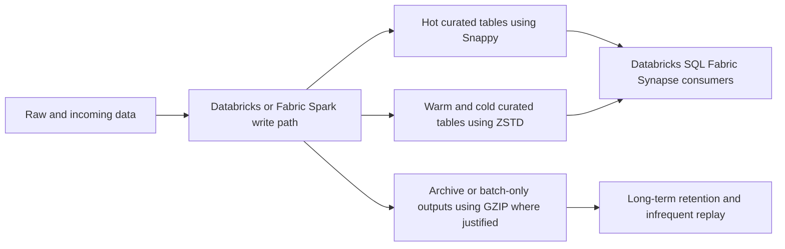
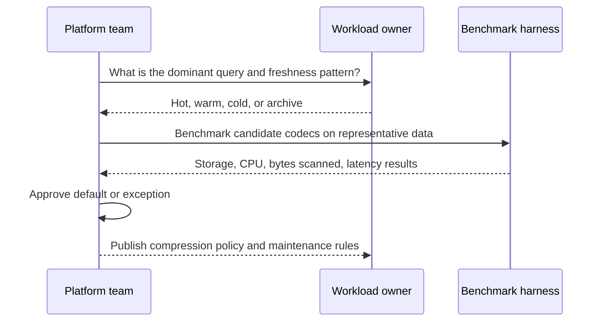
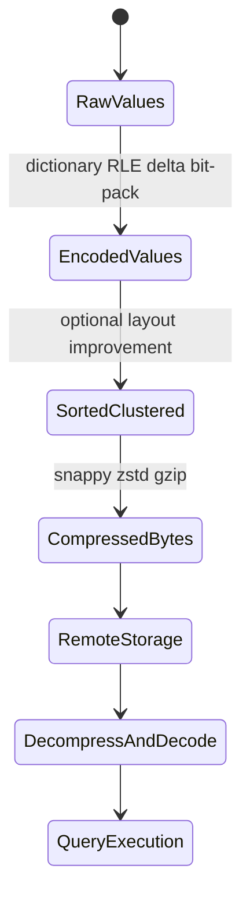

# Compression and Encoding Strategies

> Part of the **Enterprise Data & AI Architecture Handbook** · Phase-04 - Storage Systems & Table Formats · Chapter 08.
> Estimated study time: **45 min reading + ~2h labs**.
> **Prerequisite:** read [Columnar Storage Internals](02_Columnar_Storage_Internals.md) first.

---

## Executive Summary

Compression and encoding strategy is one of the highest-leverage design choices in a lakehouse because it affects four budgets at once: storage footprint, network transfer, CPU decode cost, and cache efficiency. Teams often discuss codecs as if the only question were how small the file becomes. That is a shallow model. The real architectural question is how the encoding and compression chain changes the total cost of writing, storing, reading, skipping, decoding, and repeatedly querying the dataset under real workload patterns.

The most important principle is that encoding comes before compression and often matters more. Sorting, clustering, dictionary encoding, run-length encoding, delta encoding, and bit-packing make data more regular. General-purpose codecs such as Snappy, ZSTD, and GZIP then exploit that regularity. As established in [Columnar Storage Internals](02_Columnar_Storage_Internals.md), columnar systems become fast when like values sit together and the engine stays on vectorized paths. Compression strategy is therefore not a storage afterthought. It is part of the compute path.

On Azure, these choices show up directly in ADLS Gen2 storage cost, Databricks and Fabric query latency, Synapse bytes-scanned economics, and network behavior between remote object storage and compute. Snappy often wins for hot interactive analytics because decode speed matters more than maximal compression ratio. ZSTD often wins for colder historical zones because it reduces storage and scan cost without the harsh interactivity penalty of GZIP. GZIP can still be useful, but usually in archival or batch-only contexts rather than hot analytical serving.

The practical conclusion is opinionated. Choose encoding and compression by workload tier, not by habit. Sort or cluster data for compressibility when the read pattern justifies it. Use benchmarking discipline instead of cargo-cult defaults. On Azure, default to fast decode for hot curated data, stronger compression for colder zones, and explicit evidence before deviating. The right goal is not smallest files. It is lowest total cost per useful query and per reliable pipeline run.

## Learning Objectives

By the end of this chapter you will be able to:

1. Explain the difference between encoding and compression and why they must be tuned together.
2. Compare Snappy, ZSTD, and GZIP using real CPU, latency, and storage trade-offs.
3. Explain how sorting and clustering increase compressibility and data-skipping efficiency.
4. Reason about column-level encoding choices for low-cardinality, monotonic, sparse, and skewed data.
5. Quantify how codec choice affects network transfer, cache locality, and query cost on Azure.
6. Design an Azure-first compression policy for hot, warm, and cold analytical tiers.
7. Build a benchmarking method that avoids misleading results.
8. Diagnose when a compression strategy is masking deeper layout or small-file problems.
9. Define governance standards for table-level and zone-level compression policy.
10. Defend a compression choice in a staff-level architecture review.

## Business Motivation

- Storage spend is material at enterprise scale, but compute and scan cost often exceed storage savings if the wrong codec is chosen.
- Interactive BI and self-service SQL workloads are highly sensitive to decode CPU and cache efficiency.
- Serverless and per-byte-scanned billing models make compression and pruning strategy directly commercial.
- Wide datasets with repeated categorical values can become dramatically cheaper when encoded and clustered well.
- Network transfer from object storage to compute is a recurring tax that compression can reduce if decode cost remains acceptable.
- ML, feature engineering, and notebooks often suffer when storage choices optimize only for archive ratio rather than repeated reads.
- Standardizing compression policy reduces platform drift and makes benchmarking results easier to compare across domains.

## History and Evolution

- Early data platforms relied heavily on text and row-oriented formats, where general-purpose compression saved space but did little to optimize analytical execution.
- Warehouse and columnar systems learned that type-aware encodings such as dictionary, delta, and run-length techniques often outperform naive compression-first thinking.
- Hadoop ecosystems initially normalized codecs such as GZIP and Snappy largely around file storage concerns.
- Parquet and ORC improved the model by embedding column-level encodings and allowing compression after those encodings have regularized the byte streams.
- CPU improvements and vectorized engines shifted the question from only disk savings to decode path efficiency and memory bandwidth.
- ZSTD emerged as a strong modern codec because it offered a better compression-versus-CPU balance than older high-ratio defaults.
- Cloud object storage economics made network and remote I/O costs more visible, increasing the value of smaller transferred payloads.
- Modern lakehouse systems now treat encoding, clustering, and compression policy as part of performance engineering rather than as a file-output detail.

## Why This Technology Exists

Compression and encoding strategies exist because raw data representation is wasteful for analytical workloads. Similar values, repeated categories, ordered timestamps, null-heavy sparse columns, and bounded integer ranges all contain structure that can be exploited. Encoding uses data semantics or local patterns to represent those values more compactly. Compression then exploits the resulting regular byte structure more effectively.

The technology also exists because object-storage analytics are remote by default. Every unnecessary byte must be stored, transferred, decompressed, and often cached or shuffled. That is expensive in multiple layers of the system. As established in [Columnar Storage Internals](02_Columnar_Storage_Internals.md), the most effective analytical systems win by avoiding work before the CPU begins executing business logic. Compression strategy is part of that work-avoidance system.

It also exists because workloads are not uniform. A cold historical partition queried monthly can tolerate heavier compression than a dashboard table queried every 10 seconds. A benchmark-free one-size-fits-all policy is therefore usually a sign of immaturity, not simplicity.

## Problems It Solves

| Problem | Compression and encoding contribution |
|---|---|
| Excessive storage footprint | Better ratio through encoding plus codec selection |
| High network transfer cost | Smaller payloads to remote compute |
| Poor cache utilization | Denser data improves effective memory and disk cache usage |
| Expensive repeated scans | Smaller and better-pruned data lowers repeated read cost |
| Weak compressibility of unordered data | Sorting and clustering increase regularity |
| Wasteful representation of low-cardinality values | Dictionary and RLE shrink repeated categories |
| High cost of full-rescan benchmarking | Incremental methodology exposes the right trade-offs earlier |

## Problems It Cannot Solve

- Compression does not fix bad partitioning, tiny files, or weak table maintenance.
- A better codec cannot rescue a workload that should not be repeatedly scanned at all.
- Heavier compression does not guarantee lower total cost if decode CPU dominates.
- Encoding cannot compensate for poor schema design or unbounded column cardinality.
- Compression is not a security control and does not replace encryption or masking.
- The best benchmark on one engine may not hold on another engine or runtime version.
- Compression policy cannot replace capacity planning for network, shuffle, and caching layers.

## Core Concepts

### Encoding versus compression

Encoding changes the representation of values into something more regular or compact. Compression then applies a general-purpose algorithm to the resulting bytes. This sequencing matters because a well-encoded stream is far more compressible than a raw stream.

### Common encodings

As detailed in [Columnar Storage Internals](02_Columnar_Storage_Internals.md), the most relevant encodings include:

- dictionary encoding for low- and medium-cardinality repeated values,
- run-length encoding for long repeated runs,
- delta encoding for ordered numeric and temporal data,
- bit-packing for narrow bounded ranges.

### Common codecs

| Codec | Primary strength | Primary weakness | Typical fit |
|---|---|---|---|
| Snappy | Fast decode and low CPU overhead | Lower compression ratio | Hot interactive analytics |
| ZSTD | Strong ratio with tunable levels | Higher CPU than Snappy | Warm and cold curated data |
| GZIP | Strong legacy compression and broad tooling support | Slow decode for interactive reads | Batch-only or archival paths |

### Sorting and clustering for compressibility

Compression ratio is heavily influenced by ordering. Sorting or clustering groups similar values together, which improves dictionary reuse, RLE effectiveness, delta compactness, and overall codec efficiency. This means layout choices upstream of file writing can matter more than the codec itself.

### Column-level tuning

Different columns deserve different treatment:

- low-cardinality strings favor dictionary encoding,
- monotonically increasing timestamps favor delta encoding,
- sparse nullable columns benefit from efficient null representation,
- near-unique high-entropy identifiers often compress poorly regardless of strategy.

### Network and cache effects

Smaller encoded and compressed payloads reduce network transfer and increase effective cache density. However, if decode CPU becomes the bottleneck, the system may shift from I/O-bound to CPU-bound and overall latency can worsen.

### Benchmarking discipline

The correct benchmark question is not "which file is smallest?" It is "which strategy minimizes total cost and latency for the actual read/write pattern we care about?"

## Internal Working

The internal flow starts when a writer receives a batch of rows and organizes them into columnar groups or pages. Each column is encoded according to its local value characteristics. A low-cardinality dimension may be dictionary-encoded, a sorted timestamp column may be delta-encoded, and a mostly repeated status field may benefit from RLE and bit-packing. Once encoded, the byte stream is passed through a codec such as Snappy, ZSTD, or GZIP.

At read time, the process reverses. The engine fetches compressed bytes from remote storage, decompresses them, and then decodes the column values into vectors or engine-native columnar buffers. This means the true cost is not only the size on disk. It is the sum of remote read, decompression, decode, and downstream operator execution. A smaller file can therefore still be slower overall if the decode path is too CPU-intensive for the workload.

Sorting and clustering alter this pipeline before compression begins. If rows are grouped by common filter columns or repeated categories, the encoded streams become more regular and the compressed output becomes denser. This is one reason physical layout and compression policy must be designed together rather than by separate teams.

On Azure, this flow becomes even more visible because ADLS Gen2 is remote, Databricks or Fabric compute is elastic, and serverless or SQL-style consumption often exposes scan volume as a direct billing signal. Compression strategy is therefore a system design choice, not just a writer option.

## Architecture

An enterprise compression architecture should be tiered:

1. **Hot serving tier:** optimized for decode speed and consistent interactivity.
2. **Warm curated tier:** balanced between storage efficiency and query performance.
3. **Cold historical tier:** optimized more aggressively for ratio where access is infrequent.
4. **Archive tier:** optimized for storage cost where query latency is not the primary concern.

On Azure, that usually means ADLS Gen2 or OneLake as the substrate, Azure Databricks or Fabric Spark as writers, Databricks SQL/Fabric/Synapse as readers, and table maintenance policies that align clustering and compaction with the chosen codec policy. The architecture fails when every domain chooses its own codec without workload evidence or when the same aggressive codec is forced onto both hot dashboards and cold archives.

## Components

| Component | Responsibility | Typical Azure mapping |
|---|---|---|
| Encoder | Regularize values before compression | Parquet or ORC writer settings in Spark/Databricks/Fabric |
| Codec | Compress encoded streams | Snappy, ZSTD, GZIP |
| Layout strategy | Sort or cluster data for compressibility | Delta `OPTIMIZE`, Z-ORDER, liquid clustering, Spark sortWithinPartitions |
| Storage tier | Persist compressed files | ADLS Gen2 or OneLake |
| Query engine | Decompress and decode on read | Databricks SQL, Fabric, Synapse, Trino, DuckDB |
| Benchmark harness | Compare strategies on realistic workloads | Databricks notebooks, Spark jobs, DuckDB scripts |
| Governance policy | Standardize defaults and exceptions | Platform standards, Purview, Unity Catalog |

## Metadata

Compression strategy is only governable if its metadata is visible.

| Metadata type | Purpose | Operational consequence |
|---|---|---|
| File codec | Identify compression algorithm used | Required for consistent read behavior and benchmarking |
| Column encodings | Explain layout choices | Useful during performance diagnosis |
| Sort/clustering metadata | Explain why compressibility changed | Correlates with pruning and compression results |
| File size distribution | Detect over- or under-compaction | Strong leading indicator of performance drift |
| Benchmark results | Preserve evidence for defaults | Prevents anecdotal policy churn |

Without explicit metadata and evidence, compression policy quickly becomes folklore.

## Storage

From a storage perspective, compression is a direct cost lever, but not the only one. Small files, over-partitioning, duplicate raw retention, and weak lifecycle policy can overwhelm any codec benefit. The right storage view is therefore:

- use compression to reduce bytes,
- use compaction to reduce object counts,
- use lifecycle rules to move lower-value data to cheaper tiers,
- use clustering and sort order to improve both compression and pruning.

On ADLS Gen2, a well-compressed and well-clustered curated dataset lowers both storage footprint and repeated scan volume. On archival tiers, stronger compression may be acceptable because read frequency is low. On hot serving zones, decode speed should usually dominate the storage-ratio conversation.

## Compute

Compression is a compute problem as much as a storage problem.

- Snappy favors fast decompression and is often the default for interactive compute.
- ZSTD trades more CPU for better compression, and often wins when storage and network savings matter but latency budgets are not razor-thin.
- GZIP can be too expensive for hot analytical paths because the decode cost shifts the bottleneck into CPU.
- Column encodings reduce the amount of useful work decompression must expose to later operators.

On Databricks, Fabric, and Synapse-backed analytical surfaces, the best compression choice often follows the dominant read pattern rather than the write pattern. Fast writes into a poorly chosen hot-serving codec are usually a false economy.

## Networking

Compression directly influences network usage because object-storage reads are remote:

- smaller payloads reduce transfer time,
- better clustering can reduce how many files need to be fetched at all,
- compressed pages improve cache density on intermediate layers,
- heavier codecs may save transfer cost while increasing decompression cost after the bytes arrive.

For Azure, this means network and codec decisions are coupled. A dataset read across regions or through constrained network paths may benefit more from higher compression than the same dataset read locally near the compute plane.

## Security

Compression is not a security boundary, but it does influence how security and compliance behave operationally.

- Compressed datasets still require encryption at rest and in transit.
- Compression should never be mistaken for obfuscation or masking.
- Benchmark artifacts and metadata may reveal sensitive schema or workload patterns and should be governed.
- Highly sensitive data sometimes requires extra care because some optimization pipelines create temporary files or intermediate outputs.

The main security lesson is simple: do not let optimization tooling create ungoverned side paths for regulated data.

## Performance

| Strategy | Typical effect | Main risk |
|---|---|---|
| Snappy on hot curated data | Lower decode latency | Larger storage footprint |
| ZSTD on warm/cold data | Lower storage and transfer cost | Higher CPU on reads |
| GZIP on batch-only datasets | Strong ratio | Poor interactive performance |
| Sorting by repeated dimensions | Better compressibility and pruning | Higher write cost |
| Clustering by access patterns | Better locality and cache behavior | Ongoing maintenance cost |
| Column-level encoding tuning | Better engine efficiency | Requires evidence and expertise |

The most important performance truth is that compression cannot be discussed independently from clustering, pruning, and engine vectorization. Fast decode on badly clustered data still wastes money. High compression on poorly used cold data may be perfectly rational.

## Scalability

Compression policy scales well only when it is standardized by tier and workload class. If every team chooses its own codec, benchmark method, and clustering rule, the platform loses comparability and multiplies support cost.

Technically, compressed columnar datasets scale to very large sizes, but organizationally they become fragile if:

- benchmark results are not retained,
- compaction and clustering are inconsistent,
- hot and cold tiers share one codec policy,
- engine-specific tuning leaks into enterprise-wide standards without validation.

## Fault Tolerance

Compression does not fundamentally change durability, but it does affect recoverability and operational behavior.

- Corruption in compressed streams can render data segments unreadable if not protected by higher-level integrity checks.
- Poorly tested codec changes can create compatibility incidents across engines.
- Aggressive re-encoding migrations can create large backfill windows and new failure surfaces.
- Benchmark-driven policy changes should always include rollback options.

Fault-tolerant optimization means rolling out codec or encoding changes incrementally and validating reader compatibility before standardizing them.

## Cost Optimization

| Lever | Mechanism | Typical Azure effect |
|---|---|---|
| Snappy for hot data | Lower CPU per query | Higher storage, lower interactive cost |
| ZSTD for colder data | Better storage and transfer ratio | Lower ADLS storage and serverless scan cost |
| Sorting before write | Better compression and pruning | Lower repeated query cost |
| Column tuning | Smaller encoded streams | Lower CPU, storage, and network in the right columns |
| Benchmark discipline | Prevents expensive misconfiguration | Lower long-term platform drift cost |

FinOps guidance should be direct: codec policy belongs in the cost model. The wrong compression choice can move spend from storage to compute or from compute to latency without ever reducing total cost.

## Monitoring

Monitor compression strategy continuously:

- codec distribution by zone and table,
- average compression ratio by workload tier,
- read CPU versus bytes scanned,
- file size distribution after compaction,
- cache hit behavior where the engine exposes it,
- clustering and sort-order drift,
- benchmark regressions after runtime upgrades.

On Azure, combine Spark and SQL telemetry with ADLS metrics and platform cost dashboards so compression policy remains evidence-driven.

## Observability

Observability should answer these questions quickly:

1. Did a recent codec or layout change increase CPU cost?
2. Did better compression reduce bytes scanned or only reduce bytes stored?
3. Did clustering improve compressibility and pruning together, or only one of them?
4. Did a benchmark result remain valid after a runtime or engine upgrade?

Useful signals include engine query plans, scan metrics, file statistics, storage operation logs, cache traces, and benchmark snapshots. Without that evidence, teams often argue about codecs using storage-size screenshots instead of production behavior.

## Governance

Compression governance should define:

1. default codec by data tier,
2. approved exceptions and evidence required,
3. clustering and sort-order rules for major subject areas,
4. benchmark methodology and sign-off criteria,
5. compatibility validation across engines,
6. retention of benchmark artifacts and decision records.

The enterprise principle is straightforward: encoding and compression defaults are platform standards, not notebook preferences.

## Trade-offs

| Choice | Benefit | Cost | When not to use |
|---|---|---|---|
| Snappy everywhere | Operational simplicity and fast decode | Higher storage cost | Very large colder historical tiers |
| ZSTD everywhere | Stronger compression | Higher hot-path CPU | Interactive dashboards and latency-critical serving |
| GZIP for hot analytics | Small files | High decode latency | Any hot or repeatedly queried dataset |
| Aggressive clustering for compressibility | Better ratio and pruning | Extra maintenance compute | Low-value or rarely queried data |
| Column-level special tuning | Better workload fit | Higher operational complexity | Small estates without strong platform discipline |

## Decision Matrix

| Scenario | Recommended strategy | Reason |
|---|---|---|
| Hot BI-serving Delta tables on Databricks | Snappy plus clustering where justified | Decode speed matters most |
| Warm curated analytical history | ZSTD with measured level settings | Balance storage and CPU |
| Cold historical partitions queried rarely | ZSTD or GZIP after benchmark | Ratio matters more than latency |
| Streaming ingestion followed by hourly compaction | Fast-write codec first, optimize later | Keep ingest stable and serving tuned separately |
| Wide low-cardinality dimensions | Dictionary-friendly sort order plus Snappy or ZSTD | Encodings will pay back strongly |
| Near-unique high-entropy IDs | Minimal special tuning | Encoding gains are limited |
| Serverless SQL over ADLS | ZSTD or Snappy based on query latency SLA | Scan-cost and decode-cost trade-off must be measured |

## Design Patterns

1. **Hot/warm/cold codec policy:** map codecs to workload tiers, not to teams.
2. **Sort-for-compressibility pattern:** cluster on selective, repeated dimensions that also help pruning.
3. **Compaction-before-conclusion pattern:** benchmark only after file counts and sizes are healthy.
4. **Column-aware tuning pattern:** adjust encoding expectations for categorical, temporal, sparse, and numeric columns differently.
5. **Benchmark-as-policy pattern:** promote a codec only after measured evidence on representative workloads.
6. **Write-fast/read-smart pattern:** keep ingestion stable and optimize read layout later where the SLA allows it.
7. **Engine-upgrade revalidation pattern:** rerun core compression benchmarks after runtime or engine changes.

## Anti-patterns

1. Picking the smallest files as the only success metric.
2. Using GZIP on hot interactive analytics by default.
3. Benchmarking on toy datasets with uniform synthetic values.
4. Ignoring sort order while debating codecs.
5. Blaming codecs for problems caused by tiny files or weak pruning.
6. Allowing each team to pick its own default compression strategy.
7. Changing codec policy without revalidating downstream engine support.
8. Assuming higher compression always means lower total cost.

## Common Mistakes

- **Mistake:** benchmarking compression before fixing file-size pathologies.  
  **Consequence:** wrong conclusion because metadata overhead dominates.  
  **Fix:** compact first, benchmark second.

- **Mistake:** comparing only storage size.  
  **Consequence:** interactive query latency gets worse while dashboards appear cheaper on paper.  
  **Fix:** include query CPU, latency, and bytes scanned.

- **Mistake:** applying one codec policy across all zones.  
  **Consequence:** hot and cold data both get the wrong optimization.  
  **Fix:** set tier-based defaults.

- **Mistake:** over-tuning column encodings without stable workload evidence.  
  **Consequence:** operational complexity outgrows the gain.  
  **Fix:** reserve specialized tuning for high-value tables.

- **Mistake:** mistaking better compression for better pruning.  
  **Consequence:** big files still scan too much data.  
  **Fix:** treat clustering and pruning as separate measurements.

## Best Practices

1. Default to Snappy for hot interactive analytical tables unless evidence shows otherwise.
2. Use ZSTD for colder curated data where storage and transfer savings matter.
3. Reserve GZIP mostly for archival or batch-only contexts.
4. Treat sorting and clustering as part of the compression strategy.
5. Benchmark on representative data distribution and query mix.
6. Measure total cost across storage, network, CPU, and latency.
7. Revalidate codec policy after engine upgrades.
8. Keep compression defaults centralized and exceptions documented.
9. Tune column-level strategies only for high-value workloads.
10. Use [Columnar Storage Internals](02_Columnar_Storage_Internals.md) as the conceptual baseline for compression decisions.

## Enterprise Recommendations

Recommended enterprise defaults:

- **Hot curated tables:** Snappy by default.
- **Warm and cold curated history:** ZSTD by default after representative validation.
- **Archive and batch-only paths:** GZIP or stronger ratio strategies only where decode latency is unimportant.
- **Layout policy:** sort or cluster high-value tables on columns that improve both compressibility and pruning.
- **Governance policy:** every compression exception requires benchmark evidence and owner sign-off.

### ADR example: default codec policy for Azure lakehouse tiers

**Context:** The platform runs Azure Databricks, Fabric, and Synapse over ADLS Gen2. Some teams want ZSTD everywhere for storage savings. Others want Snappy everywhere for operational simplicity. Historical datasets are large, while hot curated tables back frequent BI queries.

**Decision:** Standardize on Snappy for hot curated and serving tiers, ZSTD for colder historical curated tiers after benchmark validation, and GZIP only for archive or batch-only use cases. Require clustering and compaction health checks before evaluating codec changes on shared tables.

**Consequences:** Hot workloads keep predictable latency, colder tiers reduce storage and transfer cost, and the enterprise gains a policy that matches actual access patterns. The platform must maintain benchmark artifacts and revisit defaults as engines evolve.

**Alternatives considered:**

1. Snappy everywhere: rejected because colder large historical zones were paying avoidable storage and scan cost.
2. ZSTD everywhere: rejected because hot BI-serving latency budgets would tighten unnecessarily.
3. GZIP everywhere: rejected because interactive decode cost was unacceptable.

## Azure Implementation

The Azure-first implementation pattern is tiered and evidence-driven:

1. ADLS Gen2 or OneLake stores the compressed analytical files.
2. Azure Databricks or Fabric Spark writes data with explicit codec settings.
3. Databricks SQL, Fabric SQL, or Synapse serverless validates real query behavior.
4. Delta optimization, clustering, and compaction preserve layout quality before codec conclusions are drawn.
5. Azure Monitor and cost telemetry capture the effects of the chosen policy.

### Bicep: ADLS Gen2 baseline for compressed analytical storage

```bicep
param location string = resourceGroup().location
param storageAccountName string

resource lake 'Microsoft.Storage/storageAccounts@2023-05-01' = {
  name: storageAccountName
  location: location
  sku: {
    name: 'Standard_ZRS'
  }
  kind: 'StorageV2'
  properties: {
    isHnsEnabled: true
    accessTier: 'Hot'
    allowBlobPublicAccess: false
    minimumTlsVersion: 'TLS1_2'
    supportsHttpsTrafficOnly: true
  }
}
```

### Databricks or Fabric Spark: write hot data with Snappy

```python
spark.conf.set("spark.sql.parquet.compression.codec", "snappy")

(df.repartition("event_date")
   .sortWithinPartitions("event_date", "country_code")
   .write
   .format("delta")
   .mode("overwrite")
   .partitionBy("event_date")
   .saveAsTable("gold.sales_events_hot"))
```

### Databricks or Fabric Spark: write colder history with ZSTD

```python
spark.conf.set("spark.sql.parquet.compression.codec", "zstd")

(historical_df.repartition("event_month")
   .sortWithinPartitions("event_month", "product_category")
   .write
   .format("delta")
   .mode("overwrite")
   .partitionBy("event_month")
   .saveAsTable("gold.sales_events_history"))
```

### Synapse serverless SQL: compare scanned bytes and latency

```sql
SELECT country_code, SUM(net_amount) AS total_net_amount
FROM OPENROWSET(
    BULK 'https://contosolake.dfs.core.windows.net/gold/sales_events_history/*',
    FORMAT = 'PARQUET'
) WITH (
    country_code VARCHAR(2),
    net_amount DECIMAL(18,2),
    event_month DATE
) AS rows
WHERE event_month >= '2026-01-01'
GROUP BY country_code;
```

Operational Azure guidance:

- Do not change codecs on hot shared tables without measuring SQL warehouse and serverless behavior together.
- Keep clustering and compaction aligned with codec policy; otherwise benchmark conclusions will drift.
- Prefer tier-based defaults over team-level preferences.
- Re-run critical benchmarks when Databricks runtimes or Fabric engine behavior changes.

## Open Source Implementation

Open-source stacks expose the same decisions clearly with Spark, Trino, DuckDB, and local tooling.

### Spark: compare Snappy and ZSTD output

```python
(df.write.mode("overwrite")
   .option("compression", "snappy")
   .parquet("s3a://bench/sales_snappy/"))

(df.write.mode("overwrite")
   .option("compression", "zstd")
   .parquet("s3a://bench/sales_zstd/"))
```

### DuckDB: benchmark scan behavior

```sql
EXPLAIN ANALYZE
SELECT country_code, SUM(net_amount)
FROM read_parquet('sales_zstd/*.parquet')
WHERE event_month >= DATE '2026-01-01'
GROUP BY country_code;
```

### Trino: compare query wall time and bytes read

```sql
EXPLAIN ANALYZE
SELECT product_category, SUM(net_amount)
FROM analytics.sales_history
WHERE event_month >= DATE '2026-01-01'
GROUP BY product_category;
```

Open-source guidance:

- Use the same representative workload shape across engines when comparing codecs.
- Keep benchmark data distributions realistic and preserve sort order between variants.
- Validate that engine versions expose the same codec support and statistics behavior before drawing conclusions.

## AWS Equivalent (comparison only)

| Azure pattern | AWS equivalent | Advantages | Disadvantages | Migration note |
|---|---|---|---|---|
| ADLS + Databricks/Fabric tiered codec policy | S3 + Databricks/EMR/Athena | Similar codec strategy applies | Service behavior and billing surfaces differ | Re-benchmark on actual engine mix |
| Synapse serverless validation | Athena validation | Simple bytes-scanned model | Per-engine optimizer differences remain | Compare latency and cost, not only file size |
| Azure-first hot/warm/cold policy | S3 lifecycle plus engine-aware codec tiers | Portable concept | Operational defaults still differ | Migrate policy intent, not just config keys |

Selection criteria:

- Keep the tiering principle portable across clouds.
- Re-run benchmarks on the target engine stack because codec trade-offs are engine-sensitive.

## GCP Equivalent (comparison only)

| Azure pattern | GCP equivalent | Advantages | Disadvantages | Migration note |
|---|---|---|---|---|
| ADLS + Databricks/Fabric tiered codec policy | GCS + Dataproc/Databricks/BigLake external reads | Similar object-store strategy | Native BigQuery storage can change the economics | Re-evaluate where external-file compression still matters |
| Synapse/Fabric scan validation | BigQuery external table validation | Strong observability into scan cost | Execution model differs materially | Compare equivalent workloads, not raw tool outputs |
| Azure benchmark discipline | GCP benchmark discipline | Policy remains portable | Runtime behavior still differs | Re-certify defaults before standardizing |

Selection criteria:

- Compression policy remains relevant wherever object-store-backed analytical files remain strategic.
- If the platform shifts heavily toward native warehouse storage, some file-level codec choices may matter less for that slice.

## Migration Considerations

Compression migration is usually lower risk than table-format migration, but it still needs discipline.

Migration sequence:

1. Fix file-size and partitioning pathologies first.
2. Benchmark current and proposed strategies on representative workload slices.
3. Migrate one tier or one domain at a time.
4. Validate read performance, bytes scanned, and storage delta together.
5. Keep rollback paths simple by preserving previous table versions or outputs during the cutover.

Key risks:

- measuring storage savings while missing latency regressions,
- changing codec without re-clustering comparable data,
- underestimating engine-version sensitivity,
- rewriting very large tables without business justification,
- invalid benchmark conclusions from synthetic or skew-free test data.

## Mermaid Architecture Diagrams

### Tiered compression strategy on Azure



### Compression decision sequence



### Encode then compress lifecycle



## End-to-End Data Flow

1. A source dataset is partitioned and clustered according to access patterns.
2. Column values are encoded based on their local characteristics.
3. Encoded streams are compressed with the tier-appropriate codec.
4. Files are written to ADLS Gen2 or OneLake with observable metadata about size and layout.
5. Query engines fetch compressed remote bytes for selected files and columns.
6. The engine decompresses and decodes the streams into vectors.
7. Query and ML workloads consume the result with lower storage and transfer overhead.
8. Monitoring captures ratio, CPU, bytes scanned, and latency.
9. Platform teams compare outcomes against benchmark baselines.
10. Policies are adjusted only when evidence shows a better total-cost outcome.

## Real-world Business Use Cases

| Use case | Recommended strategy |
|---|---|
| Executive dashboard fact tables | Snappy plus clustering for hot interactive performance |
| Historical finance facts queried monthly | ZSTD with strict benchmark validation |
| Feature-store backfill history | ZSTD or Snappy depending on repeated training-read behavior |
| Long-lived event archive | GZIP or strong ratio strategies when latency is irrelevant |
| Cross-region analytical replication reads | Higher compression may pay back if network dominates |

## Industry Examples

- Databricks-heavy estates often keep Snappy on hot Delta tables because decode speed and Photon efficiency matter more than smallest files.
- Large historical object-store zones often adopt ZSTD to reduce both storage and repeated remote-read cost.
- Teams that applied GZIP broadly to interactive tables often learned that storage savings did not offset the query-latency penalty.
- Mature lakehouse teams benchmark compression as part of layout tuning rather than as a separate writer toggle.

The recurring pattern is that compression policy becomes effective only when coupled to workload tiers and layout discipline.

## Case Studies

### Case study 1: ZSTD improved history without hurting analysts

A platform kept all curated history in Snappy for simplicity. Storage and scan cost grew faster than usage value. After benchmarking, the team moved colder historical partitions to ZSTD while keeping hot serving partitions on Snappy. Query latency for the hot path stayed stable and historical scan cost dropped. The lesson was that tiered policy pays back more than one universal default.

### Case study 2: GZIP looked cheaper and made dashboards slower

An optimization initiative focused only on storage footprint and re-encoded hot BI tables with GZIP. The files shrank, but dashboard latency worsened because decode CPU became the limiting factor. The rollback restored Snappy for the hot tier and preserved GZIP only for long-retention archival data. The lesson was that smallest files are not equivalent to lowest business cost.

### Case study 3: Codec debate hid a layout problem

A team compared Snappy and ZSTD extensively on a dataset suffering from severe small-file fragmentation. Results were noisy and inconclusive because file-open overhead dominated the measured latency. After compaction and clustering, the benchmark became stable enough to show a meaningful difference. The lesson was that compression benchmarking must start from a healthy physical layout.

## Hands-on Labs

1. Write the same dataset with Snappy, ZSTD, and GZIP and compare storage size, query latency, and bytes scanned.
2. Sort a dataset by a repeated dimension and measure the effect on compression ratio.
3. Benchmark a low-cardinality and high-cardinality column set to observe encoding differences.
4. Compact a fragmented dataset before and after codec testing to see the difference in benchmark quality.
5. Compare a hot-table and cold-table compression policy on Azure Databricks or Fabric.

## Exercises

1. Why is encoding usually discussed before compression in columnar systems?
2. When is Snappy a better choice than ZSTD?
3. Why can GZIP be rational for archive and irrational for dashboards?
4. How do sorting and clustering improve compressibility?
5. Why is smaller storage footprint not enough to declare success?
6. Which metrics would prove a codec change reduced total cost?
7. Why must compression benchmarks be rerun after engine upgrades?
8. How does network distance change codec choice?
9. When is column-level tuning worth the extra complexity?
10. Why can a codec benchmark be invalid on a small-file-fragmented table?

## Mini Projects

1. Build a codec benchmarking harness for ADLS-backed analytical tables that reports storage, query CPU, bytes scanned, and latency.
2. Create a compression policy linter that flags non-standard codecs by workload tier.
3. Build a platform scorecard that correlates clustering quality, compression ratio, and serverless scan cost.

## Capstone Integration

This chapter complements [Columnar Storage Internals](02_Columnar_Storage_Internals.md) by turning encoding theory into a workload-tier policy. In a capstone platform, the team should show not only which codecs are supported, but also why hot Delta or Parquet tables use one strategy, colder historical partitions use another, and how those choices are benchmarked and governed over time. The capstone is credible only when compression defaults are tied to cost, latency, and maintainability together.

## Interview Questions

1. What is the difference between encoding and compression?
   **A:** Encoding (dictionary, RLE, delta, bit-packing) exploits known structure in a column's data type or value distribution to represent it more compactly, often while remaining directly queryable; compression (Snappy, ZSTD, GZIP) is a general-purpose, structure-agnostic byte-level algorithm applied afterward — encoding typically happens first because it makes the resulting bytes more regular and therefore more compressible.
2. Why is Snappy often the default for hot analytics?
   **A:** Snappy prioritizes decode speed over compression ratio, which matters most for hot, frequently-queried tables where the recurring cost of repeated decompression during interactive queries dominates the one-time cost of writing slightly larger files.
3. When is ZSTD a better choice than Snappy?
   **A:** ZSTD is better for colder, less-frequently-queried data where reducing storage footprint and cross-region/remote-read network cost matters more than minimizing per-query decode latency, since ZSTD's higher compression ratio comes at a moderate additional decode CPU cost that's easily amortized when data is queried rarely.
4. Why can GZIP harm interactive performance?
   **A:** GZIP achieves strong compression ratios but at meaningfully higher decode CPU cost than Snappy or ZSTD, and for interactive, frequently-queried tables that recurring decode cost accumulates into materially higher query latency, often outweighing whatever storage savings GZIP delivers.
5. How do sorting and clustering affect compression ratio?
   **A:** Sorting or clustering data by a repeated dimension groups similar/identical values together, which dramatically improves the effectiveness of dictionary encoding and run-length encoding — the same data in random order would have much shorter runs and gain far less benefit from these encodings.
6. What is the relationship between compression and cache efficiency?
   **A:** Well-compressed, well-encoded data occupies less memory and disk-cache space for the same logical dataset, meaning more of the working set fits in cache/memory at once, reducing cache misses and the associated remote-read penalty — compression strategy is therefore also a cache-efficiency lever, not just a storage-size lever.
7. Why should compression policy differ by data tier?
   **A:** Hot, frequently-queried tiers benefit most from fast-decode codecs (Snappy) since decode cost recurs on every query; cold, rarely-queried tiers benefit most from high-ratio codecs (ZSTD/GZIP) since the storage/network savings compound over a long retention period without a corresponding frequent decode-cost penalty — a single uniform codec policy serves neither tier optimally.
8. What makes a compression benchmark credible?
   **A:** A credible benchmark starts from a healthy, non-fragmented file layout (since small-file overhead can swamp and obscure codec differences), uses realistic production-representative data and query patterns, and measures the full cost picture (storage, CPU, latency, bytes scanned) rather than compression ratio alone.

## Staff Engineer Questions

1. How would you set enterprise codec policy for hot, warm, cold, and archive analytical tiers?
   **A:** Default to Snappy for hot, ZSTD for warm/cold tiers balancing ratio and decode cost, and ZSTD or a high-ratio GZIP-class codec for archive where decode frequency is lowest — document this as a tiered platform default so individual table owners don't need to rediscover the trade-off from scratch.
2. What evidence is sufficient to approve a non-standard codec exception?
   **A:** A benchmark on the specific table's actual data and query pattern showing the standard tiered default underperforms a specific alternative in a measurable, business-relevant way (latency, cost) — general preference or an assumption without a benchmark isn't sufficient evidence.
3. How would you separate codec effects from file-layout effects in a benchmark?
   **A:** Compact/consolidate the dataset into a healthy file-size distribution first, then run the codec comparison — running a codec benchmark on a fragmented, small-file dataset conflates file-open overhead with codec decode cost and produces misleading, noisy results.
4. When is column-level encoding tuning worth the platform complexity?
   **A:** When a specific high-value table has a data distribution (very high or very low cardinality, monotonic values) that clearly benefits from a non-default encoding choice, validated by a benchmark — applying column-level tuning broadly without evidence adds maintenance complexity disproportionate to its benefit for most tables.
5. How would you quantify the trade-off between lower bytes scanned and higher CPU decode cost?
   **A:** Measure total query cost (bytes-scanned billing plus compute time billing, or wall-clock latency for a fixed-cost cluster) under each codec option for the actual workload — the right answer depends on the specific billing model and workload, not a general rule of thumb.
6. Which Azure services should be included in the benchmark loop for a shared table?
   **A:** Every engine that actually reads the shared table in production (Databricks, Synapse serverless SQL, Fabric) should be included, since codec decode performance and cost model can differ meaningfully across engines even for the identical Parquet file.
7. How would you keep compression policy valid through runtime upgrades?
   **A:** Re-run the benchmark suite after any significant engine/runtime version upgrade (a new Photon version, a new serverless SQL engine release) since decode performance characteristics can shift with engine improvements, potentially changing which codec is actually optimal.
8. Which teams should own clustering and compaction standards, and why?
   **A:** A platform team should own the default policy and shared benchmarking tooling, while domain teams apply and monitor it for their own tables — this balances consistent platform-wide standards against the reality that only domain teams have visibility into their specific table's actual query patterns.

## Architect Questions

1. What should be the enterprise default codec policy for Azure-curated lakehouse tiers?
   **A:** Snappy for hot/serving tiers, ZSTD for warm/cold/historical tiers, documented as a tiered default in the platform's standards repository, with any deviation requiring a benchmark-backed exception request.
2. How do you keep compression policy aligned with FinOps rather than only with storage administration?
   **A:** Track total cost (storage plus bytes-scanned/compute cost attributable to codec choice) as a FinOps-visible metric per table tier, rather than treating compression purely as a storage-administration setting disconnected from the query-cost side of the trade-off.
3. Which workloads justify stronger compression despite higher CPU cost?
   **A:** Workloads with high storage/egress cost sensitivity and low query frequency (cold historical archives, cross-region replicated datasets where network cost dominates) justify accepting higher decode CPU for a stronger compression ratio.
4. How do you decide when to cluster for compressibility versus only for pruning?
   **A:** Cluster for compressibility when the workload's dominant cost driver is storage/scan volume and the clustering key also happens to group similar values well; cluster purely for pruning when the goal is skipping irrelevant files/row-groups for selective queries — often the same clustering key serves both goals, but they should be evaluated as distinct benefits.
5. What governance controls keep compression exceptions from proliferating?
   **A:** Require every non-default codec choice to be logged with its benchmark justification in a discoverable location (the standards repository or table metadata), reviewed periodically to confirm the original justification still holds — undocumented, unreviewed exceptions tend to accumulate and obscure the platform's actual codec-usage landscape over time.
6. How should compression choices be represented in platform reference architecture and standards?
   **A:** As an explicit tiered decision matrix (data tier → recommended codec) in the standards repository, kept current and referenced by data-platform onboarding documentation, not buried in individual team runbooks that new teams won't discover.
7. What disaster-recovery or rollback concerns arise from large-scale re-encoding projects?
   **A:** A large-scale codec migration should write to a new table version/path and validate query-result parity and performance before cutover, retaining the pre-migration files until the new codec choice is confirmed stable — an in-place re-encoding with no rollback path risks a difficult-to-reverse mistake if the new codec underperforms in production.
8. How do you evaluate compression policy across Databricks, Fabric, and Synapse fairly?
   **A:** Benchmark the same table and codec choice across all three engines actually used in production, since decode performance, cost model (bytes-scanned billing versus compute-time billing), and Photon-style acceleration availability differ meaningfully across them — a codec optimal on one engine isn't guaranteed optimal on another.

## CTO Review Questions

1. Are we optimizing for smallest files or for lowest total cost to serve analytical workloads?
   **A:** Total cost includes query latency and CPU decode cost, not just storage footprint — optimizing purely for smallest files can inflate query cost enough to make the "optimization" a net loss, and this trade-off should be evaluated holistically per workload tier rather than defaulting to whichever codec compresses best.
2. Which parts of our cloud spend are most sensitive to codec and layout choices?
   **A:** Bytes-scanned billing models (serverless SQL, some Fabric consumption models) are directly and immediately sensitive to codec/layout choices, while fixed-cluster compute costs are sensitive more indirectly through query latency and cluster utilization — this should be quantified per billing model in use.
3. Do we have evidence behind our compression defaults, or only inherited habits?
   **A:** This requires an honest audit — many platforms carry forward a codec default chosen early on without ever benchmarking it against the platform's actual current workload and engine versions, which may no longer be the optimal choice years later.
4. Are we carrying hot-workload latency penalties to save cold-workload storage dollars?
   **A:** Applying a single high-compression codec uniformly across all tiers (chosen to save cold-tier storage cost) can silently impose a latency tax on hot, interactive tables that never needed that trade-off — a tiered policy avoids this cross-contamination between tiers with genuinely different needs.
5. If runtime behavior changes next year, do we know how to revalidate our standards quickly?
   **A:** This requires a maintained, repeatable benchmark harness (not a one-time manual test) that can be re-run quickly after any engine upgrade — without this, revalidating compression standards after a runtime change becomes a slow, ad hoc project rather than a routine check.
6. Can we explain every compression exception in one sentence tied to business value?
   **A:** This is the practical test of whether compression governance is working — any exception codec choice that can't be justified in one sentence tied to a specific, measured business outcome is either undocumented technical debt or a candidate to revert to the platform default.

## References

- Columnar format and codec documentation for Parquet and ORC.
- Azure Databricks, Microsoft Fabric, Synapse serverless SQL, and ADLS Gen2 documentation.
- Engineering material on ZSTD, Snappy, GZIP, and modern analytical storage benchmarking.
- Performance guidance for vectorized readers, clustering, and file compaction.
- Work on encoding strategies discussed in [Columnar Storage Internals](02_Columnar_Storage_Internals.md).

## Further Reading

- FinOps playbooks for object-store analytics and bytes-scanned platforms.
- Benchmark design guidance for analytical data platforms.
- Engine-specific tuning guides for Spark, Trino, DuckDB, and serverless SQL.
- Case studies on compression-policy drift and hot/cold tier rationalization.
- Operational guidance for clustering, compaction, and layout-aware optimization.