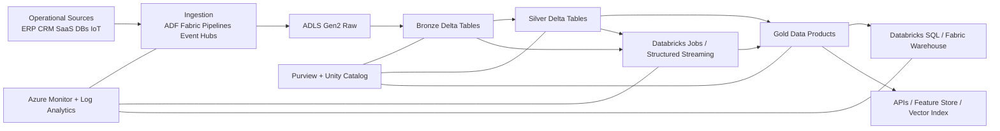
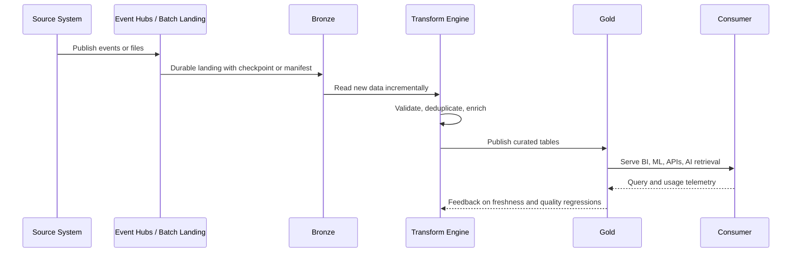
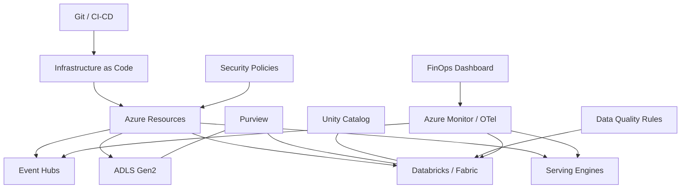

# Modern Data Stack Overview

> Part of the **Enterprise Data & AI Architecture Handbook** · Phase-05 - Modern Data Engineering & Lakehouse · Chapter 01.
> Estimated study time: **45 min reading + ~2h labs**.
> **Prerequisites:** read [Table Format Comparison](../Phase-04/07_Table_Format_Comparison.md), [Object Storage and Data Lakes](../Phase-04/03_Object_Storage_and_Data_Lakes.md), [Delta Lake](../Phase-04/04_Delta_Lake.md), [Compression and Encoding](../Phase-04/08_Compression_and_Encoding.md), [Distributed Systems Primer](../Phase-00/08_Distributed_Systems_Primer.md), [Cloud Architecture Fundamentals](../Phase-03/01_Cloud_Architecture_Fundamentals.md), [Azure Core Architecture](../Phase-03/02_Azure_Core_Architecture.md), [Azure Networking](../Phase-03/04_Azure_Networking.md), [Well-Architected Framework](../Phase-03/07_Well_Architected_Framework.md), and [Architecture Decision Records](../Phase-01/03_Architecture_Decision_Records.md) first.

---

## Executive Summary

The modern data stack is not one product. It is a layered operating model for moving data from source systems into governed analytical and operational consumption surfaces with predictable cost, quality, and latency. The canonical path is ingest -> store -> transform -> serve -> observe. In Azure-first enterprises, the practical default is usually Event Hubs or batch connectors for ingestion, ADLS Gen2 for storage, Delta Lake tables for governed lakehouse persistence, Azure Databricks or Fabric for transformation and serving, dbt for SQL-centric modeling, Purview plus Unity Catalog for governance, and Azure Monitor plus OpenTelemetry for runtime visibility.

The stack exists because no single warehouse or single ETL product is sufficient for every data shape, latency requirement, or governance boundary. Streaming telemetry, CDC from transactional systems, document data, model features, BI marts, and retrieval indexes for AI workloads have materially different operating constraints. A modern stack accepts that heterogeneity, but forces it through a disciplined control plane: catalogs, contracts, lineage, security policy, and platform standards.

The architecture decision that matters most is not which tool is fashionable. It is where the platform will standardize and where it will permit exceptions. For most Azure estates, the most defensible position is: ADLS Gen2 as the durable storage substrate, Delta as the default analytical table abstraction, Databricks or Fabric as the default compute plane, dbt or SQL models for semantic curation, and open components such as Kafka, Trino, Airflow, Iceberg, or OpenMetadata only when they solve a concrete interoperability or sovereignty problem.

The wrong implementation pattern is best-of-breed sprawl. The right pattern is a small number of approved blueprints, each tied to workload shape. That is how platform teams reduce integration cost, control egress, isolate blast radius, and keep architecture reviews about business outcomes instead of tool preferences.

## Learning Objectives

By the end of this chapter you should be able to:

1. Explain the five-stage lifecycle of a modern data stack: ingestion, storage, transform, serve, and observe.
2. Distinguish ETL from ELT and identify when each pattern is operationally justified.
3. Compare a warehouse, a data lake, and a lakehouse using governance, cost, and workload criteria rather than slogans.
4. Choose between managed Azure services and open-source components based on team maturity, latency, lock-in tolerance, and support boundaries.
5. Design an Azure-first reference topology with clear control-plane and data-plane boundaries.
6. Map metadata, lineage, quality, and access-control concerns to concrete platform services.
7. Identify the scaling and failure modes that appear when batch, streaming, and serving workloads share the same estate.
8. Build a defensible decision matrix for platform standardization and exception handling.
9. Describe migration paths from warehouse-only, Hadoop-era, or point-to-point ETL architectures into a modern data stack.
10. Defend an architecture recommendation in engineer, staff, architect, and CTO review settings.

## Business Motivation

- Enterprises need one platform that can serve BI, machine learning, operational analytics, and AI enrichment without multiplying storage copies for every team.
- Source-system change rates are rising while acceptable delivery latency is shrinking; nightly ETL is often no longer enough.
- Cloud economics reward separation of storage and compute, but only if the platform avoids repeated full scans, redundant copies, and poorly governed ad hoc workloads.
- Data products now have more consumers than analysts: applications, feature stores, retrieval pipelines, and automated agents consume data continuously.
- Regulatory pressure has increased the cost of weak lineage, weak access control, and undocumented transformations.
- Executive teams expect platform reuse and faster domain onboarding; a modern data stack provides reusable primitives rather than custom projects.
- Staff-level architecture quality improves when the organization can say, "this is our default blueprint," instead of re-litigating ingestion and serving choices for every initiative.

## History and Evolution

- First generation enterprise analytics centralized data into on-premises warehouses with heavy ETL, rigid schemas, and expensive scale-up compute.
- Hadoop-era data lakes reduced storage cost and improved landing flexibility, but often failed as products because object paths replaced real governance and many lakes degraded into uncurated file dumps.
- Cloud warehouses simplified elasticity and SQL serving, but became expensive or awkward for very large raw data, semi-structured ingestion, ML features, and multi-engine access.
- Lakehouse platforms emerged to combine object-store economics with table semantics such as ACID transactions, schema evolution, and time travel, building on ideas covered in [Delta Lake](../Phase-04/04_Delta_Lake.md) and [Table Format Comparison](../Phase-04/07_Table_Format_Comparison.md).
- Modern stacks then extended beyond storage and SQL: streaming, orchestration, lineage, data quality, semantic models, and AI-serving patterns were promoted into first-class platform concerns.
- The present state is not convergence to one universal product. It is convergence to a small set of interoperable layers, with Azure, Databricks, Fabric, Kafka, dbt, Trino, and observability tooling filling different roles.

## Why This Technology Exists

The modern data stack exists because the enterprise problem is not "where do I run SQL?" The enterprise problem is how to create durable, trustworthy data products from systems with incompatible schemas, inconsistent SLAs, and different change patterns.

Traditional ETL stacks assumed a small number of relational sources, predictable nightly windows, and a primary consumer that was a BI team. That assumption is no longer valid. Enterprises now ingest application events, SaaS data, APIs, blobs, logs, documents, CDC streams, and model outputs. Some must be available within seconds, some can arrive hourly, and some need to be kept cheaply for years. A single tightly coupled ETL server or a single warehouse cannot absorb that entire shape efficiently.

The modern stack addresses this by separating concerns:

- cheap, durable storage from elastic compute,
- operational ingestion from analytical curation,
- metadata control from data payload movement,
- platform defaults from workload-specific exceptions.

This is also why the stack must be designed as an architecture, not purchased as a catalog. The hard problems are dependency management, ownership boundaries, security posture, and operational discipline, all of which connect directly back to [Architecture Decision Records](../Phase-01/03_Architecture_Decision_Records.md) and [Well-Architected Framework](../Phase-03/07_Well_Architected_Framework.md).

## Problems It Solves

| Problem | How the modern data stack helps |
|---|---|
| Many source systems with different delivery patterns | Decouples ingestion mechanisms from storage and serving surfaces |
| Expensive warehouse-only raw storage | Moves raw and historical persistence to low-cost object storage |
| Weak reproducibility of data pipelines | Uses versioned tables, orchestrated jobs, and declarative transforms |
| Long lead time for new use cases | Reuses landing, transform, governance, and serving blueprints |
| Fragmented batch and streaming architectures | Allows batch and streaming to converge on the same curated tables |
| Poor lineage and auditability | Centralizes metadata, access policy, lineage, and quality signals |
| Analytics platform lock-in anxiety | Permits open table formats and engine separation where justified |
| AI and ML feature duplication | Serves shared curated datasets and features from a common platform |

## Problems It Cannot Solve

- It does not correct bad source-system semantics or missing business ownership.
- It does not remove the need for domain modeling, quality rules, or stewardship.
- It does not make every workload real time; end-to-end latency still depends on source, compute, and governance constraints.
- It does not eliminate vendor or operational lock-in; it only makes that trade-off visible and manageable.
- It does not replace a semantic layer for metrics and business definitions.
- It does not make inexperienced teams safe to run a highly open, multi-engine estate without stronger platform guardrails.
- It does not justify storing everything forever in the hot tier.

## Core Concepts

### 8.1 The five-stage lifecycle

The simplest useful mental model is ingest -> store -> transform -> serve -> observe.

- **Ingest:** land data from applications, databases, SaaS systems, files, and event streams.
- **Store:** persist immutable raw data and mutable curated tables on a durable substrate such as ADLS Gen2.
- **Transform:** clean, join, enrich, and model data into reusable curated assets.
- **Serve:** expose data to BI, APIs, notebooks, ML features, and AI retrieval systems.
- **Observe:** measure freshness, volume, cost, quality, lineage, and user-facing SLA behavior.

The stage model matters because each stage has a different optimization target. Ingestion optimizes reliability and capture completeness. Storage optimizes durability and layout. Transformation optimizes correctness and reproducibility. Serving optimizes latency and concurrency. Observability optimizes time to detect and remediate platform drift.

### 8.2 ETL versus ELT

| Pattern | Meaning | Best fit | Main risk |
|---|---|---|---|
| ETL | Transform before loading into the final analytical store | Sensitive data minimization before shared landing, legacy appliances, strict interface contracts | Early transformation can reduce replayability and hide raw truth |
| ELT | Load raw or lightly normalized data first, then transform in the analytical platform | Cloud object storage plus elastic compute, replay, multiple downstream use cases | Raw landing without governance can become an expensive swamp |

For Azure lakehouse programs, ELT is usually the default because ADLS Gen2 and Databricks/Fabric make raw retention and replay cheap compared with re-extracting data from source systems. ETL remains valid when data must be redacted before platform entry or when upstream systems can only emit already-curated extracts.

### 8.3 Warehouse versus lake versus lakehouse

| Model | Strength | Weakness | Use it when |
|---|---|---|---|
| Warehouse | Strong SQL serving, mature governance, simple analyst experience | Raw retention and non-tabular workloads can be expensive or awkward | BI-serving is dominant and data shapes are stable |
| Lake | Cheap raw storage and broad format flexibility | Governance and table semantics are weak without additional layers | Raw landing, archival, and experimentation dominate |
| Lakehouse | Balances object-store economics with table semantics and multi-workload support | Requires stronger platform engineering discipline than a single warehouse | The estate needs shared raw, curated, and ML/AI access patterns |

The modern stack usually uses all three ideas in one estate. Raw landing behaves like a lake. Curated Delta or Iceberg tables behave like a lakehouse. Highly tuned consumption marts may still behave like warehouse-like serving surfaces.

### 8.4 Open versus managed components

Managed services reduce undifferentiated operational work. Open components reduce dependency on one vendor and can improve feature depth in specialized domains.

Use managed-first when:

- the team is smaller than the platform ambition,
- regulated support boundaries matter,
- the organization needs predictable time to production,
- service integration with identity, networking, and monitoring is worth more than theoretical portability.

Use open components when:

- multi-cloud or sovereign portability is a first-order requirement,
- the workload needs capabilities the managed platform does not yet expose,
- platform teams have proven capability to operate stateful distributed systems,
- the cost model materially benefits from self-managed infrastructure at scale.

### 8.5 Control plane versus data plane

The data plane moves bytes. The control plane decides who can see them, how they are described, how they are versioned, and whether they are trustworthy.

Typical control-plane services are Unity Catalog, Microsoft Purview, schema registries, Git repositories, CI/CD pipelines, quality-rule stores, and secrets managers. Typical data-plane services are Event Hubs, ADLS Gen2, Spark compute, SQL warehouses, and serving indexes.

Architectures fail when control-plane scope is treated as optional. A cheap object store without strong control-plane design is not a modern stack. It is a storage account with future incidents scheduled.

### 8.6 Batch-stream convergence

The modern stack prefers one curated truth for both batch and streaming consumers. Streaming ingest writes replayable bronze data. Scheduled or streaming transforms promote silver and gold data. Consumers choose their latency and freshness requirements from the same governed estate. That convergence is a major reason lakehouse patterns displaced separate lambda-style architectures for many enterprise workloads.

## Internal Working

### 9.1 Batch ingestion path

Batch sources such as ERP exports, SaaS snapshots, or SFTP drops typically land in ADLS Gen2 through Azure Data Factory, Fabric pipelines, or Databricks workflows. The ingestion contract should add source metadata, arrival timestamp, schema version, and file manifest information before the data becomes discoverable. This preserves replayability and supports source-level accountability.

### 9.2 Streaming ingestion path

Streaming sources land through Event Hubs, Kafka, or CDC connectors. The first objective is not transformation elegance. It is durable capture, ordered checkpointing, and consumer isolation. On Azure, Event Hubs plus Databricks Structured Streaming is a common default because it balances managed ingestion with Spark-native processing. Kafka on AKS is justified when protocol compatibility, connector breadth, or partition-level tuning exceeds Event Hubs requirements.

### 9.3 Transform and publish path

Transforms usually follow a bronze/silver/gold promotion model:

- **Bronze:** append-only raw or lightly normalized data with minimal business rules.
- **Silver:** conformed, deduplicated, validated, and enriched records.
- **Gold:** consumer-facing marts, features, aggregates, or semantic views.

This is less about fashionable naming than about blast-radius control. Bronze protects replay. Silver protects consistency. Gold protects consumption simplicity.

### 9.4 Query-serving path

Serving can take several forms in the same stack:

- BI dashboards on Databricks SQL or Fabric Warehouse,
- ad hoc analysis on Spark SQL,
- API-facing aggregates in PostgreSQL, Redis, or ClickHouse,
- feature sets in Feast or a vector store for AI retrieval.

The key design rule is to avoid forcing one serving engine to satisfy every latency and concurrency profile. A modern stack is a pipeline plus a serving strategy, not only a storage strategy.

### 9.5 Observability and governance path

Every stage emits metadata: job starts, schema changes, lineage edges, quality results, scan sizes, query latency, and access events. Those signals should feed Azure Monitor, Log Analytics, Databricks system tables, Purview, and, where open tooling is justified, Prometheus, Grafana, OpenMetadata, or OpenTelemetry collectors. The control plane then closes the loop by turning those signals into alerting, policy enforcement, or rollback decisions.

## Architecture

### 10.1 Reference topology

An Azure-first modern data stack typically looks like this:

1. Sources publish via files, APIs, CDC, or events.
2. Event Hubs, Data Factory, or Fabric pipelines land data into ADLS Gen2.
3. Bronze Delta tables store replayable raw data.
4. Databricks, Fabric Spark, or SQL-based transforms produce silver and gold layers.
5. Serving occurs through Databricks SQL, Fabric Warehouse, Synapse serverless SQL, APIs, feature stores, or vector indexes.
6. Purview and Unity Catalog own governance metadata, while Azure Monitor and data-quality services provide runtime visibility.

### 10.2 Workload separation

Use separate planes for ingestion, transformation, and serving whenever concurrency or security boundaries justify it.

- Separate dev, test, and prod subscriptions or resource groups.
- Isolate high-throughput streaming clusters from ad hoc data-science compute.
- Isolate BI-serving warehouses from batch backfills.
- Keep raw landing storage logically separate from curated zones.

This follows the same separation principles described in [Azure Core Architecture](../Phase-03/02_Azure_Core_Architecture.md) and [Azure Networking](../Phase-03/04_Azure_Networking.md): isolate blast radius first, then optimize convenience.

### 10.3 Platform defaults and exception policy

The modern stack should be standardized as a small number of approved blueprints:

- **Default batch and streaming analytics blueprint:** ADLS Gen2 + Delta + Databricks + dbt/SQL + Purview/Unity Catalog.
- **Open interoperability blueprint:** ADLS Gen2 or MinIO + Iceberg + Spark/Trino + OpenMetadata.
- **Low-latency serving blueprint:** curated Delta/Iceberg -> materialized serving table in PostgreSQL, ClickHouse, Redis, or Fabric Warehouse.
- **AI enrichment blueprint:** curated tables -> feature extraction -> vector store or graph store with lineage back to gold tables.

### 10.4 ADR example: standardize on a lakehouse default

**Context:** The enterprise currently runs separate SSIS pipelines, a cloud warehouse for BI, a Kafka cluster for events, and ad hoc notebooks writing files directly into shared storage. Teams want more flexibility, but platform leadership wants lower integration cost and consistent governance.

**Decision:** Standardize on ADLS Gen2 as the durable storage substrate, Delta Lake as the default curated table format, Azure Databricks Premium as the default transformation engine, Event Hubs as the default managed streaming ingress, and Purview plus Unity Catalog as the shared governance plane. Allow Iceberg plus Trino only for approved multi-engine or portability cases.

**Consequences:** Batch and streaming can converge on common curated data. Governance becomes more consistent. The platform team reduces tool sprawl and can publish stronger blueprints. Some teams lose local freedom to choose every component. Open-format exceptions require review and certified support.

**Alternatives considered:**

1. Warehouse-only architecture: rejected because raw retention, ML/AI workloads, and multi-format data would be too expensive or constrained.
2. Fully open self-managed stack on AKS: rejected as the default because the enterprise does not want to carry Kafka, Spark, Trino, Airflow, catalog, and monitoring operations for every domain.
3. Best-of-breed per team: rejected because governance, networking, cost, and incident response would become fragmented.

## Components

| Stage | Azure-first default | Open-source alternative | Primary failure mode | Core SLI |
|---|---|---|---|---|
| Ingestion | Event Hubs, Data Factory, Fabric pipelines | Kafka, Debezium, Airbyte, NiFi | dropped events or partial loads | source capture completeness |
| Storage | ADLS Gen2 + Delta | MinIO/S3-compatible object store + Iceberg/Delta/Hudi | layout drift, unmanaged retention | durable bytes with replay window |
| Transform | Azure Databricks, Fabric Spark, dbt | Spark on Kubernetes, Flink, dbt Core | non-idempotent jobs, hidden state | successful publish latency |
| Serve | Databricks SQL, Fabric Warehouse, Synapse serverless | Trino, ClickHouse, DuckDB, Superset | poor concurrency isolation | p95 query latency |
| Observe | Azure Monitor, Log Analytics, Purview | Prometheus, Grafana, OpenTelemetry, OpenMetadata | alert fatigue or blind spots | MTTD and freshness SLA compliance |
| Govern | Purview, Unity Catalog, Entra ID, Key Vault | Apache Atlas, OpenMetadata, Ranger, Vault | policy gaps and weak lineage | percentage of assets with owner and lineage |

## Metadata

Metadata is the real operating system of the modern data stack. Without it, storage and compute are just utilities.

| Metadata type | What it describes | Azure implementation | Open implementation |
|---|---|---|---|
| Technical schema | columns, types, partitioning, table versions | Unity Catalog, Fabric metadata, Delta log | Iceberg catalog, Hive metastore, OpenMetadata |
| Business metadata | owner, glossary, criticality, data product tags | Purview | OpenMetadata, Atlas |
| Operational metadata | run history, retries, latency, volume | Azure Monitor, Databricks Jobs, Log Analytics | Airflow metadata DB, Prometheus, Grafana |
| Lineage metadata | source-to-target edges | Purview lineage, Databricks lineage | OpenLineage, Marquez, OpenMetadata |
| Quality metadata | rule results, scorecards, anomalies | Great Expectations on Databricks, Fabric quality checks | Great Expectations, Soda, Deequ |
| Access metadata | who read what and under which policy | Entra ID, Azure RBAC, Unity Catalog audit | Ranger, Keycloak, Vault audit |

The architectural implication is straightforward: catalog choice is not secondary. It controls discoverability, policy enforcement, table registration, and change management. Azure teams that ignore metadata early usually rediscover it later as manual spreadsheets, tribal knowledge, and audit exceptions.

## Storage

Storage should be boring, cheap, durable, and version-aware.

Azure-first guidance:

- Use ADLS Gen2 as the default storage substrate for raw, bronze, silver, and gold data.
- Store raw arrival data separately from curated tables, even when they live in the same account.
- Default curated analytical tables to Delta unless a reviewed Iceberg exception exists.
- Use partitioning and clustering policies informed by [Compression and Encoding](../Phase-04/08_Compression_and_Encoding.md), not by source-system folder layout.
- Apply lifecycle policies so stale raw data can move to cooler tiers without breaking compliance retention.

Recommended logical layout:

- `raw/` for immutable landed files or CDC segments,
- `bronze/` for replayable Delta tables,
- `silver/` for conformed tables,
- `gold/` for consumer-specific marts and feature sets,
- `checkpoints/` for streaming state,
- `sandbox/` only in non-production or tightly controlled research contexts.

The biggest storage mistake is putting semantics into paths instead of table metadata. Paths support organization. They are not a substitute for governed table contracts.

## Compute

The compute layer should map to workload shape rather than forcing every job onto one engine.

| Workload | Azure-first compute | Why | Open-source option |
|---|---|---|---|
| Batch ELT and heavy joins | Azure Databricks jobs clusters or Fabric Spark | elastic Spark runtime, Delta-native operations | Spark on Kubernetes |
| Structured streaming | Azure Databricks Structured Streaming | mature checkpointing, Delta sinks, Event Hubs integration | Flink or Spark on Kubernetes |
| SQL modeling | dbt on Databricks SQL or Fabric Warehouse | declarative lineage and testing | dbt Core on Trino/Postgres |
| Interactive BI | Databricks SQL or Fabric Warehouse | concurrency controls and serverless execution | Trino + Superset, ClickHouse |
| Lightweight serving API backends | Azure Database for PostgreSQL Flexible Server or Azure Cache for Redis | better latency than general-purpose lake queries | PostgreSQL, Redis, ClickHouse |
| ML feature engineering | Databricks workflows and model-serving integrations | co-locates features with governed data | Feast + Spark/Ray |

Compute standardization should also include policy:

- jobs clusters for scheduled ETL and backfills,
- SQL warehouses for dashboard concurrency,
- separate pools or capacities for development versus production,
- autoscaling limits tied to budget alerts,
- mandatory auto-termination outside interactive windows.

## Networking

Networking is where many otherwise solid data platforms become fragile or expensive.

Azure-first network principles:

- Use Private Link or private endpoints for ADLS Gen2, Key Vault, Event Hubs, and PostgreSQL where supported.
- Prefer VNet-injected or no-public-IP Databricks workspaces for regulated environments.
- Route private DNS consistently across hub-spoke networks so data-plane endpoints resolve without manual workstation exceptions.
- Keep ingestion close to source where possible to reduce cross-region egress and noisy failure domains.
- Use ExpressRoute or VPN only when the source-system gravity justifies hybrid latency or compliance needs.

Common network failure modes:

- data engineers testing against public endpoints that do not exist in production,
- firewall rules managed manually rather than by IaC,
- cross-region backfills generating unexpected egress cost,
- self-hosted integration runtimes becoming hidden single points of failure.

The design goal is predictable private connectivity, not maximal openness. The more critical the data product, the less acceptable public-network shortcuts become.

## Security

Security posture has to cover identity, secrets, data access, and exfiltration controls simultaneously.

Recommended Azure controls:

- Entra ID groups for human and workload identities.
- Managed identities for platform services wherever possible.
- Key Vault for secret material that cannot be fully eliminated.
- Unity Catalog for table, column, and row-level policy where Databricks is the primary compute plane.
- Purview classifications and labels for sensitivity awareness.
- Storage account public access disabled by default, with ACLs minimized.
- Customer-managed keys only where policy or risk justifies their operational burden.

Security design rules:

1. Do not grant users broad raw-path access when table-level access is possible.
2. Separate platform-admin roles from data-product ownership roles.
3. Treat CDC landing zones as sensitive because they often expose operational fields that gold marts intentionally hide.
4. Audit notebook tokens, service principals, and cluster policies as seriously as storage ACLs.
5. Align security boundaries with the governance model, not just with subscription boundaries.

## Performance

Performance tuning in a modern data stack is mostly about removing wasted work.

Primary levers:

- right-sized files and compaction,
- partition pruning and clustering,
- incremental processing instead of repeated full-table rebuilds,
- caching or serving-table materialization for dashboard hotspots,
- concurrency isolation between ETL and BI,
- avoiding JSON parsing or schema inference in the hot path.

| Bottleneck | Signal | First lever | Azure-first response |
|---|---|---|---|
| Small files | high file counts, long planning time | optimize/compact | Databricks `OPTIMIZE`, scheduled compaction jobs |
| Full rescans | stable job logic but rising run time | incremental MERGE or CDF | Delta incremental pattern on Databricks |
| BI contention | dashboard latency spikes during backfills | isolate serve compute | dedicated SQL warehouse or Fabric capacity |
| Metadata overhead | slow table listing and planning | reduce table sprawl and use healthy catalogs | Unity Catalog governance and table hygiene |
| Streaming lag | input grows faster than consumption | scale partitions/consumers | Event Hubs TU review and autoscaling compute |

Performance review quality improves when teams state which layer is slow: ingestion, table maintenance, transformation logic, or serving. "The lakehouse is slow" is not a diagnosis.

## Scalability

Scalability must be evaluated across four dimensions, not one:

1. **Data volume:** can the platform handle more bytes without redesign?
2. **Concurrency:** can it serve more users and jobs safely at once?
3. **Change rate:** can it absorb more upstream updates per hour?
4. **Team scale:** can more teams onboard without creating architecture entropy?

Azure-first scaling guidance:

- Scale storage separately from compute; do not solve storage growth by overprovisioning serving nodes.
- Use separate warehouses, clusters, or capacities for ingestion, transformation, and BI concurrency when demand profiles diverge.
- Use domain-aligned catalogs and naming conventions so metadata scale does not collapse into one flat namespace.
- Standardize templates and CI/CD so more teams do not imply more bespoke infrastructure.

The hardest scaling dimension is usually team scale, not raw data scale. Many platforms can store petabytes. Far fewer can safely support dozens of domain teams without contract and governance decay.

## Fault Tolerance

Fault tolerance in the modern data stack is built from idempotency, replayability, and isolation.

Required patterns:

- append-only raw retention for replay,
- checkpointed streaming consumers,
- deterministic business keys for deduplication,
- backfill paths that do not corrupt serving tables,
- storage and control-plane backups where supported,
- alerting on freshness and lag, not just process exit codes.

| Failure class | Typical cause | Recovery pattern |
|---|---|---|
| Partial batch load | connector timeout or source extract failure | rerun from manifest and use idempotent target writes |
| Streaming interruption | consumer restart, network issue, scaling lag | recover from checkpoint and replay retained events |
| Schema drift | upstream column add/drop or type change | quarantine incompatible data, update contract, then replay |
| Serving regression | bad gold publish or semantic bug | time travel, versioned rollback, or consumer pinning |
| Metadata outage | catalog or lineage service issue | cache critical configs and fail closed for writes |

The modern stack is resilient when the platform can answer two questions quickly: what data changed, and from where can we replay it?

## Cost Optimization

FinOps in the modern data stack is not mostly about buying cheaper storage. It is about preventing expensive repetition.

High-value cost levers:

- use incremental transforms instead of full rebuilds,
- keep raw and cold historical data off expensive serving planes,
- auto-stop interactive compute outside office hours,
- separate BI-serving capacity from bursty engineering workloads,
- standardize compaction and retention to prevent query amplification,
- avoid duplicate marts in multiple engines unless there is a real latency need,
- use managed services by default when operating equivalent open systems would require extra platform headcount.

| Lever | Benefit | Risk if overused |
|---|---|---|
| Aggressive auto-termination | lowers idle compute spend | frustrates interactive development if set too low |
| Cool/archive storage tiering | reduces long-term storage cost | retrieval fees and slower access for active data |
| Serverless SQL for bursty BI | pay for usage rather than fixed capacity | unpredictable spend if governance is weak |
| Incremental ELT | massive scan reduction | harder correctness if keys and watermarks are weak |
| Shared open-source clusters | better utilization at scale | noisy-neighbor and support burden |

Worked FinOps example: assume a nightly gold rebuild currently scans 30 TB from silver and runs for 4 hours on a Databricks jobs cluster. Moving to a change-driven pattern that scans only 3 TB of changed data cuts scan work by about 90 percent. If the blended compute cost of the cluster is roughly $18 per hour and the old job takes 120 cluster-hours per month while the new job takes 18 cluster-hours, the compute saving is about $1,836 per month before counting lower BI contention. Separately, moving 80 TB of bronze history from hot to cool ADLS storage at an illustrative delta of $8 to $10 per TB-month saves another roughly $640 to $800 per month, but only if replay of that data is rare. The lesson is that the biggest savings usually come from workload shape and retention discipline, not from a heroic discount on one SKU.

## Monitoring

Monitoring answers: is the system healthy against known expectations right now?

Minimum monitoring set:

- ingestion success/failure counts,
- source lag and backlog,
- pipeline duration and queue time,
- table freshness by data product,
- storage growth and file-count anomalies,
- query latency and concurrency saturation,
- cost by workspace, pipeline, and domain,
- access-denied and policy-evaluation failures.

| Layer | Metric | Suggested alert |
|---|---|---|
| Event ingestion | consumer lag, dropped events | lag exceeds agreed freshness SLO for 10 minutes |
| Batch ingestion | rows landed versus manifest expectation | variance above threshold |
| Transform | job duration, failure rate | 2 consecutive failures or p95 duration breach |
| Storage | small-file count, table size growth | file-count spike outside compaction window |
| Serve | p95 query latency, queue time | dashboard SLO breach |
| Platform cost | daily spend by workload | anomaly above budget envelope |

Azure Monitor, Log Analytics, Databricks system tables, and Fabric capacity metrics should be the default monitoring surfaces. Open tools are valuable, but they should export into the central operational workflow rather than becoming a second monitoring universe.

## Observability

Observability answers: why is the system behaving this way, especially when the symptom was not predicted in advance?

Strong observability in a modern data stack combines:

- logs from orchestration, compute, and connectors,
- traces or correlated run IDs across pipeline stages,
- lineage from source to gold assets,
- data-quality events and anomaly explanations,
- version history for tables and code,
- operational context such as release changes, feature flags, and schema-contract revisions.

Useful design practices:

- propagate a run ID from ingestion through serving publication,
- record source high-watermark and target publish version on every run,
- emit lineage edges automatically from transformation tools where possible,
- make data-quality failures queryable, not trapped in notebook output.

### Operational Response Playbook

| Signal | Detection query or check | Immediate remediation |
|---|---|---|
| Streaming lag spike on a critical topic | Check Event Hubs lag, consumer throughput, and Databricks stream backlog for the affected consumer group | pause non-critical consumers, scale stream compute, verify checkpoint health, and confirm source publish rate |
| Small-file explosion in silver | Query file counts and average file size for affected tables in system metadata | suspend downstream optimize-sensitive queries, run compaction, and review micro-batch trigger interval or partitioning |
| Gold freshness breach with green upstream jobs | Compare latest source high-watermark, silver publish time, and gold publish dependency timestamps | inspect dependency orchestration, rerun only the missing downstream step, and backfill lineage markers |
| Query latency spike after schema change | Compare warehouse latency metrics with recent table-version and schema-history changes | rollback to prior table version if needed, then restore with a forward-compatible schema plan |

The practical difference between monitoring and observability is simple: monitoring tells you that the dashboard is late; observability tells you whether the root cause is connector lag, schema drift, compaction debt, or a broken semantic model.

## Governance

Governance should accelerate trusted use, not only block risky use.

Core governance controls:

- named owner and steward for every production data product,
- documented data contract for each important source,
- catalog registration before a table becomes generally discoverable,
- sensitivity classification and policy inheritance,
- lineage from source through gold,
- retention and deletion policy by zone,
- architecture review for new platforms, not only new pipelines.

Governance decisions should be codified in templates and automation. If every new table requires manual committee review, the platform will route around governance. If governance is encoded in workspace setup, cluster policy, catalog policy, and CI checks, compliance becomes the path of least resistance.

The operating model also matters. Platform teams should own shared patterns, security controls, and certification. Domain teams should own data semantics, SLAs, and quality rules. The modern stack collapses when nobody owns the seam between those two responsibilities.

## Trade-offs

| Choice | Benefit | Cost | When not to use |
|---|---|---|---|
| Azure managed-first stack | faster delivery, easier support integration | some lock-in and feature dependency | strict multi-cloud portability requirements |
| Open self-managed stack | stronger control and portability | higher operations burden | small platform teams or regulated support needs |
| ELT-first design | raw replay and multi-use flexibility | stronger governance needed in landing zones | highly sensitive data must be transformed before entry |
| Single default table format | simpler support and skills | some workloads fit less perfectly | where multi-engine neutrality is a top requirement |
| Unified lakehouse serving | fewer copies and consistent governance | not ideal for every low-latency use case | sub-second operational serving with high QPS |

## Decision Matrix

| Scenario | Recommended stack shape | Reason | Avoid if |
|---|---|---|---|
| Enterprise BI modernization on Azure | ADLS Gen2 + Delta + Databricks/Fabric + dbt | strong Azure integration and governed SQL serving | organization requires engine-neutral open catalogs from day one |
| High-volume CDC with moderate latency | Event Hubs or Kafka + bronze Delta + incremental silver | durable capture and replay, scalable curation | source cannot provide stable keys or ordering markers |
| Multi-engine analytics with Trino and Spark parity | Iceberg-centric exception blueprint | better open interoperability | platform team cannot operate the extra catalog and certification burden |
| Near-real-time customer 360 | streaming ingest + curated silver + serving mart/cache | balances freshness and governed history | platform insists on querying bronze directly for APIs |
| AI retrieval over enterprise documents | raw document lake + extraction pipeline + curated embeddings/index | supports lineage from source documents to retrieval assets | security controls for document access are immature |
| Low-volume departmental reporting | warehouse or Fabric-only simplified stack | lower complexity than a full platform | domain is expected to scale to many sources quickly |
| Multi-region regulatory archival | raw ADLS retention + curated regional serving | separates compliance retention from compute | analytics requires constant cross-region querying |

## Design Patterns

1. **Replayable bronze pattern:** land raw data with minimal mutation so bad downstream logic can be corrected without re-extracting from sources.
2. **Single table-format default pattern:** pick one primary curated table abstraction and force exceptions through review.
3. **Decoupled ingest and transform pattern:** ingestion should prioritize capture reliability, not downstream business logic completeness.
4. **Stream-batch convergence pattern:** use the same silver and gold targets for micro-batch and scheduled pipelines where semantics permit.
5. **Control-plane-first pattern:** catalogs, lineage, identities, and contracts are created before broad production onboarding.
6. **Serving-surface specialization pattern:** use dedicated serving engines or caches when concurrency or latency differs materially from ETL needs.
7. **Quality gate promotion pattern:** do not promote from bronze to silver or silver to gold without explicit validation checkpoints.
8. **Cost envelope pattern:** every blueprint has an expected cost range and scaling trigger for when a different blueprint becomes cheaper.

## Anti-patterns

1. Dumping files into shared storage and calling it a data platform.
2. Using the BI-serving engine as the raw landing zone for every source.
3. Letting every team pick its own orchestrator, catalog, and table format.
4. Running backfills directly against production serving warehouses during business hours.
5. Giving analysts broad raw-path access because governance is unfinished.
6. Treating schema inference as a long-term contract strategy.
7. Building one giant "gold" table that tries to satisfy all use cases.
8. Assuming open source is cheaper without accounting for platform staffing and on-call cost.

## Common Mistakes

- **Mistake:** choosing tools before defining workload classes.  
  **Consequence:** platform sprawl and support confusion.  
  **Fix:** define a small number of approved blueprints first.

- **Mistake:** using full reloads for mutable operational sources.  
  **Consequence:** avoidable scan cost, longer windows, and inconsistent history.  
  **Fix:** adopt CDC or incremental merge patterns.

- **Mistake:** pushing business logic into ingestion connectors.  
  **Consequence:** replay becomes hard and defects become harder to isolate.  
  **Fix:** keep ingest thin and version logic in transforms.

- **Mistake:** skipping metadata ownership during early delivery.  
  **Consequence:** discovery and audit debt accumulate quickly.  
  **Fix:** require owner, classification, and lineage on production assets.

- **Mistake:** forcing sub-second applications to query generalized lake tables directly.  
  **Consequence:** unpredictable latency and concurrency pain.  
  **Fix:** materialize a serving-specific data store when needed.

- **Mistake:** ignoring network and identity design until go-live.  
  **Consequence:** public-endpoint dependencies and emergency firewall work.  
  **Fix:** design private connectivity and workload identity from the beginning.

## Best Practices

1. Standardize on one Azure-first reference topology and publish it as code.
2. Retain immutable raw history long enough to support real replay and audit needs.
3. Keep transformations declarative and versioned where possible.
4. Separate ingestion, transformation, and serving compute for important production workloads.
5. Measure freshness, quality, and cost as first-class platform metrics.
6. Use open components selectively and only with clear ownership and support boundaries.
7. Prefer managed identity and private networking over embedded credentials and public endpoints.
8. Treat metadata and lineage as production features, not documentation afterthoughts.
9. Model exceptions explicitly in ADRs rather than letting them grow by precedent.
10. Benchmark on representative data and concurrency before standardizing a new component.

## Enterprise Recommendations

Recommended default posture for a mid-to-large Azure enterprise:

- **Storage default:** ADLS Gen2 with separate raw, bronze, silver, gold, and checkpoint paths.
- **Curated table default:** Delta Lake on curated layers unless open multi-engine needs justify Iceberg.
- **Compute default:** Azure Databricks Premium or Fabric for transformation and SQL serving, with dbt for SQL-centric modeling.
- **Streaming default:** Event Hubs first; Kafka only when connector breadth or protocol-level control is required.
- **Governance default:** Purview plus Unity Catalog or the closest equivalent managed control plane.
- **Observability default:** Azure Monitor, Log Analytics, Databricks system tables, and data-quality results exported into central operational views.

Recommended decision rights:

- Platform architecture board approves new blueprints.
- Platform engineering certifies supported engines and patterns.
- Domain teams own data-product semantics, SLAs, and gold-layer logic.
- Security and governance teams define policy guardrails in code, not by one-off review.

Recommended exception policy:

1. Require an ADR for any new table format, catalog, orchestrator, or serving engine in production.
2. Require a documented exit strategy for self-managed stateful services.
3. Require FinOps review when an open or bespoke stack is proposed as "cheaper."
4. Reassess exceptions annually; many should collapse back into the platform default once capabilities mature.

## Azure Implementation

### Recommended service map

| Layer | Default Azure service | Typical tier or SKU guidance |
|---|---|---|
| Batch ingestion | Azure Data Factory or Fabric Data Factory | managed VNet IR where required |
| Streaming ingress | Azure Event Hubs | Standard for most programs, Dedicated for very high sustained throughput |
| Durable storage | ADLS Gen2 | Standard ZRS for critical regional durability, lifecycle tiers for cold data |
| Transform | Azure Databricks | Premium workspace, jobs clusters for ETL, separate SQL warehouse for BI |
| Alternative transform/serve | Microsoft Fabric | capacity sized by concurrency and data volume |
| Governance | Microsoft Purview + Unity Catalog | enterprise catalog with automated scans and classifications |
| Secrets and identity | Key Vault + Entra ID | managed identity first |
| Monitoring | Azure Monitor + Log Analytics | workspace-based diagnostics and budget alerts |

### Bicep: baseline storage and event ingress

```bicep
param location string = resourceGroup().location
param storageAccountName string
param eventHubNamespaceName string

resource storage 'Microsoft.Storage/storageAccounts@2023-05-01' = {
  name: storageAccountName
  location: location
  sku: {
    name: 'Standard_ZRS'
  }
  kind: 'StorageV2'
  properties: {
    isHnsEnabled: true
    allowBlobPublicAccess: false
    minimumTlsVersion: 'TLS1_2'
    supportsHttpsTrafficOnly: true
  }
}

resource bronze 'Microsoft.Storage/storageAccounts/blobServices/containers@2023-05-01' = {
  name: '${storage.name}/default/bronze'
  properties: {
    publicAccess: 'None'
  }
}

resource silver 'Microsoft.Storage/storageAccounts/blobServices/containers@2023-05-01' = {
  name: '${storage.name}/default/silver'
  properties: {
    publicAccess: 'None'
  }
}

resource gold 'Microsoft.Storage/storageAccounts/blobServices/containers@2023-05-01' = {
  name: '${storage.name}/default/gold'
  properties: {
    publicAccess: 'None'
  }
}

resource eventHubs 'Microsoft.EventHub/namespaces@2022-10-01-preview' = {
  name: eventHubNamespaceName
  location: location
  sku: {
    name: 'Standard'
    tier: 'Standard'
    capacity: 2
  }
  properties: {
    minimumTlsVersion: '1.2'
    publicNetworkAccess: 'Disabled'
  }
}
```

### Terraform: Databricks workspace baseline

```hcl
provider "azurerm" {
  features {}
}

resource "azurerm_resource_group" "data" {
  name     = "rg-modern-data-prod"
  location = "westeurope"
}

resource "azurerm_databricks_workspace" "this" {
  name                        = "dbw-modern-data-prod"
  resource_group_name         = azurerm_resource_group.data.name
  location                    = azurerm_resource_group.data.location
  sku                         = "premium"
  managed_resource_group_name = "rg-modern-data-prod-databricks-managed"
  public_network_access_enabled = false
}
```

### Databricks Auto Loader: bronze ingest

```python
from pyspark.sql.functions import current_timestamp, input_file_name

orders_raw = (
    spark.readStream
    .format("cloudFiles")
    .option("cloudFiles.format", "json")
    .option("cloudFiles.inferColumnTypes", "true")
    .load("abfss://raw@stmoderndata001.dfs.core.windows.net/orders")
)

(
    orders_raw
    .withColumn("ingested_at_utc", current_timestamp())
    .withColumn("source_file", input_file_name())
    .writeStream
    .option("checkpointLocation", "abfss://checkpoints@stmoderndata001.dfs.core.windows.net/orders_bronze")
    .trigger(processingTime="1 minute")
    .toTable("bronze.orders_raw")
)
```

### SQL example: silver promotion

```sql
CREATE OR REPLACE TABLE silver.orders AS
SELECT
  order_id,
  customer_id,
  CAST(order_ts AS TIMESTAMP) AS order_ts,
  UPPER(currency_code) AS currency_code,
  amount,
  ingested_at_utc
FROM bronze.orders_raw
QUALIFY ROW_NUMBER() OVER (
  PARTITION BY order_id
  ORDER BY ingested_at_utc DESC
) = 1;
```

The important implementation detail is not the snippet itself. It is that landing, checkpointing, curation, and serving all remain within a governed Azure control plane.

## Open Source Implementation

An enterprise open-source variant is valid when engine neutrality, data sovereignty, or advanced component control outweighs the cost of operations.

Reference open stack:

- Kafka or Redpanda for event ingestion.
- Debezium for CDC.
- Spark or Flink on Kubernetes for processing.
- Iceberg or Delta on MinIO or another S3-compatible object store.
- Trino for federated SQL serving.
- Airflow for orchestration.
- OpenMetadata or Atlas for catalog and lineage.
- Prometheus, Grafana, and OpenTelemetry for monitoring and observability.

### Spark with Iceberg catalog on an object store

```properties
spark.sql.catalog.lake=org.apache.iceberg.spark.SparkCatalog
spark.sql.catalog.lake.type=rest
spark.sql.catalog.lake.uri=http://nessie:19120/api/v1
spark.sql.catalog.lake.warehouse=s3a://lakehouse/
spark.hadoop.fs.s3a.endpoint=http://minio:9000
spark.hadoop.fs.s3a.path.style.access=true
spark.hadoop.fs.s3a.access.key=minio
spark.hadoop.fs.s3a.secret.key=minio123
```

### Trino catalog example

```properties
connector.name=iceberg
iceberg.catalog.type=rest
iceberg.rest-catalog.uri=http://nessie:19120/api/v1
fs.native-s3.enabled=true
s3.endpoint=http://minio:9000
s3.path-style-access=true
```

### dbt project baseline

```yaml
name: modern_data_stack
version: 1.0.0
profile: trino_lakehouse

models:
  modern_data_stack:
    silver:
      +materialized: table
    gold:
      +materialized: table
```

The operational warning is serious: this stack can be excellent, but only if the platform team is willing to own Kubernetes operations, catalog durability, TLS, upgrades, and production incident response across several stateful systems. Many enterprises underestimate that burden.

## AWS Equivalent (comparison only)

| Azure-first component | AWS equivalent | Notes |
|---|---|---|
| ADLS Gen2 | Amazon S3 | Similar storage role; Azure has tighter default integration with Databricks in many Azure-first estates |
| Event Hubs | Amazon MSK or Kinesis | Kinesis is more managed but less Kafka-native; MSK is closer for Kafka interoperability |
| Azure Data Factory | AWS Glue or Step Functions plus connectors | Glue provides ETL and catalog features; orchestration choices are more fragmented |
| Azure Databricks | Databricks on AWS or Amazon EMR | Databricks gives cross-cloud parity; EMR gives more self-managed flexibility |
| Fabric Warehouse / Databricks SQL | Redshift or Athena | Redshift is stronger as a warehouse; Athena is lighter-weight and lake-centric |
| Purview | Lake Formation plus Glue Data Catalog | Similar governance intent, but operating model differs materially |
| Azure Monitor | CloudWatch | Similar monitoring role, but data-platform teams often add more third-party tooling on AWS |

Selection criteria: choose the Azure stack when the enterprise is already standardized on Entra ID, Azure networking, and Azure-native governance. Choose AWS analogs only when the cloud strategy or application gravity justifies that estate. Do not create a second cloud implementation solely for architectural symmetry.

## GCP Equivalent (comparison only)

| Azure-first component | GCP equivalent | Notes |
|---|---|---|
| ADLS Gen2 | Google Cloud Storage | Similar storage role; governance and IAM models differ |
| Event Hubs | Pub/Sub | Pub/Sub is highly managed but semantically different from Kafka-centric patterns |
| Azure Data Factory | Cloud Data Fusion or Composer-based orchestration | GCP often leans more on managed connectors plus Composer for orchestration |
| Azure Databricks | Databricks on GCP or Dataproc | Dataproc offers open Spark/Hadoop control; Databricks offers closer cross-cloud parity |
| Fabric Warehouse / Databricks SQL | BigQuery | BigQuery is stronger as a serverless analytics engine than as a general raw landing substrate |
| Purview | Dataplex plus Data Catalog lineage features | GCP governance is improving but differs in organizational workflow |
| Azure Monitor | Cloud Monitoring and Logging | Similar operational role |

Selection criteria: BigQuery is often the biggest architectural difference because it encourages more warehouse-centric patterns even when a lakehouse is also present. Azure-first teams moving to GCP should explicitly re-evaluate serving, storage, and cost boundaries rather than mechanically renaming services.

## Migration Considerations

Modernizing into this stack usually happens along one of four paths:

1. **Warehouse-first migration:** keep the existing warehouse for serving while moving raw landing and heavy transforms into ADLS Gen2 plus Databricks.
2. **ETL-tool modernization:** replace point-to-point ETL with replayable landing and declarative ELT models.
3. **Hadoop-to-lakehouse migration:** move from cluster-tied storage to object storage plus open or managed table formats.
4. **Departmental sprawl consolidation:** standardize several local stacks into one governed platform.

Migration rules that reduce risk:

- move one workload class at a time, not every pipeline at once,
- prove replay and rollback before decommissioning legacy jobs,
- map data contracts and ownership before moving raw feeds,
- maintain consumer compatibility during gold-layer cutover,
- treat catalog and lineage migration as first-class work, not documentation cleanup.

Typical cutover sequence:

1. Land raw data in the new stack in parallel.
2. Build silver equivalence checks.
3. Publish gold outputs behind a compatibility layer or new semantic schema.
4. Run dual reporting and variance reconciliation.
5. Flip consumer traffic only after latency, quality, and cost are acceptable.

## Mermaid Architecture Diagrams

### Azure-first reference topology



### End-to-end streaming and batch convergence



### Control plane and observability view



## End-to-End Data Flow

Consider an order-events platform for a retailer.

1. Web and mobile applications publish order events to Event Hubs.
2. A Databricks Structured Streaming job lands those events into `bronze.orders_raw`, adding arrival time, source partition, and schema version.
3. A silver transformation deduplicates by `order_id`, joins reference data such as channel and currency, and quarantines invalid records.
4. A gold model computes daily net sales, cancellation rates, and customer-order facts for BI and downstream APIs.
5. Databricks SQL or Fabric Warehouse serves dashboards, while a compact serving table or cache supports operational customer-service lookups.
6. Purview records lineage from source topic to gold tables, and Azure Monitor tracks freshness, lag, failure rate, and query latency.
7. If a source bug emits duplicate events, the platform can replay from bronze without asking the source team to republish history.

The practical lesson is that end-to-end flow quality depends on the seams: schema change handling, deduplication keys, publish versioning, and serving isolation. Most platform failures happen there, not inside a marketing diagram.

## Real-world Business Use Cases

1. **Customer 360 and marketing attribution:** combine CRM, clickstream, orders, and support interactions into governed customer marts and features.
2. **Fraud and risk analytics:** blend CDC from transaction systems with near-real-time scoring and case-management views.
3. **Supply-chain control towers:** merge ERP, warehouse telemetry, carrier events, and inventory snapshots into a shared operational picture.
4. **Product telemetry and experimentation:** retain raw event streams, transform into sessionized silver data, and serve gold experiment metrics.
5. **Finance reconciliation and regulatory reporting:** keep replayable raw data while publishing tightly governed curated outputs.
6. **AI retrieval and feature generation:** use gold tables and curated documents as the governed source for embeddings, vector indexes, and prompt-time retrieval.

## Industry Examples

- **Retail:** event-heavy ingestion, seasonal concurrency spikes, and strong demand for BI plus personalization favor a lakehouse with separate BI-serving capacity.
- **Banking and insurance:** CDC, auditability, lineage, and privacy controls dominate; managed identity, row-level controls, and immutable raw retention matter more than maximum tool freedom.
- **Manufacturing:** sensor streams plus ERP and maintenance data reward convergence of streaming and batch on shared curated assets.
- **Healthcare and life sciences:** de-identification, access boundaries, and reproducibility are as important as analytic speed; ETL before broad shared access is more common.
- **Energy and utilities:** long retention, telemetry bursts, and cost-aware cold storage patterns make storage tiering and replay a first-class concern.
- **Public sector:** sovereign requirements often justify more open components or stricter network isolation than commercial digital-native teams would choose.

## Case Studies

### Case study 1: Uber and Apache Hudi

Uber publicly described the operational pain that led to Apache Hudi: very large incremental data volumes, late-arriving records, and the need to upsert efficiently without reprocessing full tables. The lesson for the modern data stack is not "everyone should use Hudi." The lesson is that mutation-heavy, CDC-first workloads need table semantics designed for change propagation. If your enterprise has a similar shape, a default batch-only warehouse pattern will underperform both technically and financially.

### Case study 2: Netflix and Apache Iceberg

Netflix publicly described metadata-scale and partition-management pain in large Hive-style table estates. Iceberg emerged to address catalog-scale metadata handling, hidden partitioning, and multi-engine interoperability. The lesson is that object storage alone does not solve table-scale metadata problems. If your platform expects many engines and very large analytical tables, metadata architecture is not optional.

### Case study 3: common Azure lakehouse failure pattern

Repeated enterprise lakehouse programs on Azure run into the same failure mode: teams stream tiny files into curated tables, let dashboards query them immediately, and then discover unstable latency and runaway cost. The root cause is not usually ADLS Gen2 or Databricks. It is the absence of compaction policy, serving isolation, and freshness-aware observability. The lesson is operational: the modern data stack succeeds when table maintenance and serving architecture are part of the blueprint, not postponed until after adoption.

## Hands-on Labs

### Lab 1: Build a bronze-to-silver ingestion path on Azure

Objective: ingest JSON order events from ADLS Gen2 or Event Hubs into bronze, then publish a deduplicated silver table.

Steps:

1. Provision ADLS Gen2, Event Hubs, and an Azure Databricks workspace.
2. Land sample events into raw storage or a topic.
3. Create a streaming bronze ingest with a checkpoint location.
4. Publish a silver table with deduplication and schema normalization.
5. Add a freshness alert and a row-count quality check.

Success criteria: the platform can replay from raw input, silver data is deduplicated, and freshness alerts trigger when ingestion stops.

### Lab 2: Add a gold serving layer and cost guardrails

Objective: expose a BI-ready gold model while measuring query latency and compute usage.

Steps:

1. Create a gold sales summary table.
2. Serve it through Databricks SQL or Fabric Warehouse.
3. Compare full-refresh versus incremental update cost over several runs.
4. Configure warehouse auto-stop and budget alerts.

Success criteria: the gold model meets a stated freshness target and the team can explain the cost difference between full and incremental processing.

### Lab 3: Stand up an open-source comparison stack

Objective: deploy a minimal Iceberg plus Trino plus MinIO lab and compare the operating model against the Azure-managed default.

Steps:

1. Start MinIO, a REST catalog, Spark, and Trino locally or on Kubernetes.
2. Register an Iceberg table and query it from Spark and Trino.
3. Capture the extra operational steps for networking, TLS, and monitoring.
4. Write an ADR explaining whether this stack should be a production exception or only a lab reference.

Success criteria: the team can demonstrate the portability benefit and articulate the extra operating burden honestly.

## Exercises

1. Explain why ELT is usually the default in a cloud lakehouse, then list two cases where ETL should still be preferred.
2. Draw your organization's likely control plane and data plane on one page.
3. Identify three workloads that should not share the same compute pool.
4. Write a draft exception policy for introducing a second table format.
5. Compare Databricks SQL, Fabric Warehouse, and Trino for one specific serving use case.
6. Estimate the monthly cost difference between a full-refresh gold job and an incremental version using your own workload assumptions.
7. Define five metadata fields that every production data product in your enterprise should require.
8. List the failure signals that distinguish source lag from downstream transformation lag.
9. Describe a replay strategy for a source that emits out-of-order updates.
10. Decide which data should stay in raw, bronze, silver, and gold for one real business domain.

## Mini Projects

1. Build a domain onboarding template that provisions storage paths, catalog entries, pipeline skeletons, and budget tags for a new data product.
2. Create a streaming SLA dashboard that correlates Event Hubs lag, Databricks checkpoint progress, and gold freshness.
3. Implement a small semantic serving layer with dbt tests, lineage capture, and a curated BI mart.
4. Build a FinOps analyzer that flags expensive full rescans and idle interactive compute across workspaces.

## Capstone Integration

Capstone objective: design and implement a production-grade, Azure-first data platform slice for one business capability.

Minimum scope:

1. One batch source and one streaming or CDC source.
2. Raw landing plus bronze, silver, and gold tables on ADLS Gen2.
3. One governed serving surface for BI or API consumption.
4. Purview or equivalent metadata registration, ownership, and lineage.
5. Monitoring for freshness, failures, and cost.
6. An ADR that justifies the chosen default blueprint and any exception.

Evaluation criteria:

- architecture consistency with [Cloud Architecture Fundamentals](../Phase-03/01_Cloud_Architecture_Fundamentals.md),
- storage and table choices aligned with [Object Storage and Data Lakes](../Phase-04/03_Object_Storage_and_Data_Lakes.md) and [Table Format Comparison](../Phase-04/07_Table_Format_Comparison.md),
- platform decisions documented with the rigor expected in [Architecture Decision Records](../Phase-01/03_Architecture_Decision_Records.md).

## Interview Questions

1. What is the difference between ETL and ELT, and why does cloud object storage make ELT more attractive?
2. Why is a data lake not automatically a modern data stack?
3. Explain the difference between bronze, silver, and gold layers and the failure each one is intended to isolate.
4. When would you choose Event Hubs over Kafka, and when would you make the opposite choice?
5. Why should BI dashboards usually avoid querying raw or bronze data directly?
6. What are the practical differences between a warehouse, a lake, and a lakehouse?
7. How would you detect that a streaming pipeline is healthy but the served data product is still stale?
8. What metadata must exist before a production table is broadly discoverable?
9. Why can a self-managed open-source stack cost more than a managed one even when license fees are lower?
10. What conditions would justify materializing data into a serving-specific store outside the lakehouse?

## Staff Engineer Questions

1. How would you design platform defaults so domain teams can move quickly without creating governance exceptions by default?
2. What objective criteria would you use to approve a second table format in production?
3. How would you separate compute planes for ingestion, transformation, and serving while keeping lineage coherent?
4. What are the hidden costs of stream-batch convergence, and when does a split architecture still make sense?
5. How would you quantify whether an open-source interoperability stack is worth its operating burden?
6. How would you design freshness, quality, and cost SLOs for a shared data platform?
7. What are the failure modes of using one SQL serving engine for both ETL and dashboard concurrency?
8. How would you evolve a warehouse-centric estate toward a lakehouse without creating a multi-year duplicate-platform tax?

## Architect Questions

1. What is your default Azure data-platform blueprint, and which assumptions make it valid?
2. How do networking, identity, and governance decisions constrain technology choice more than feature matrices do?
3. Under what circumstances would you recommend Fabric over Databricks, or Databricks over Fabric, as the primary platform layer?
4. How would you structure subscriptions, resource groups, and environments for a multi-domain data estate?
5. What is your exit strategy if the default platform no longer meets portability or cost requirements?
6. How do you prevent governance from becoming a manual bottleneck while still satisfying regulatory controls?
7. What workloads should never be forced into the lakehouse serving layer, and what would you use instead?
8. How would you defend a managed-first strategy to a team that prefers a fully open stack on principle?

## CTO Review Questions

1. What business capabilities become faster or safer when the enterprise adopts this stack, and how will you measure that?
2. What operating-cost categories shrink, and which new ones appear, after modernization?
3. Where is the platform intentionally accepting lock-in, and why is that trade-off justified?
4. What is the failure scenario most likely to create executive-visible impact, and how fast can the platform recover?
5. How many supported blueprints will the enterprise allow, and who enforces that limit?
6. What evidence would convince you that the current default blueprint should be revised next year?

## References

- [Table Format Comparison](../Phase-04/07_Table_Format_Comparison.md)
- [Object Storage and Data Lakes](../Phase-04/03_Object_Storage_and_Data_Lakes.md)
- [Delta Lake](../Phase-04/04_Delta_Lake.md)
- [Compression and Encoding](../Phase-04/08_Compression_and_Encoding.md)
- [Distributed Systems Primer](../Phase-00/08_Distributed_Systems_Primer.md)
- [Cloud Architecture Fundamentals](../Phase-03/01_Cloud_Architecture_Fundamentals.md)
- [Azure Core Architecture](../Phase-03/02_Azure_Core_Architecture.md)
- [Azure Networking](../Phase-03/04_Azure_Networking.md)
- [Well-Architected Framework](../Phase-03/07_Well_Architected_Framework.md)
- [Architecture Decision Records](../Phase-01/03_Architecture_Decision_Records.md)
- Azure Databricks documentation and Delta Lake operational guidance.
- Microsoft Fabric architecture guidance.
- Azure Event Hubs, ADLS Gen2, Purview, Key Vault, and Azure Monitor product documentation.
- Apache Kafka, Apache Iceberg, Apache Hudi, Apache Spark, Trino, Airflow, dbt, and OpenMetadata project documentation.

## Further Reading

- *Designing Data-Intensive Applications* by Martin Kleppmann.
- *Fundamentals of Data Engineering* by Joe Reis and Matt Housley.
- *Building the Data Lakehouse* style guidance from Databricks and major cloud reference architectures.
- Public engineering talks from Uber on Apache Hudi and incremental data processing.
- Public engineering talks from Netflix on Iceberg, metadata scale, and multi-engine analytics.
- Azure Architecture Center reference architectures for analytics and lakehouse deployments.
- FinOps Foundation guidance on cloud cost allocation, chargeback, and optimization for data platforms.