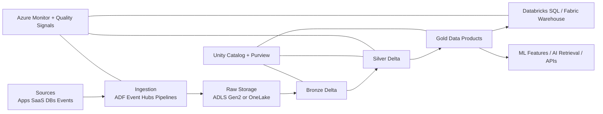
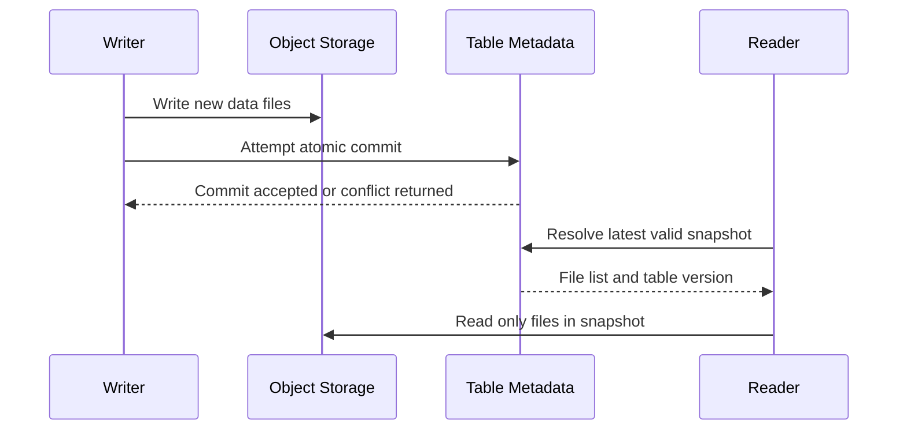
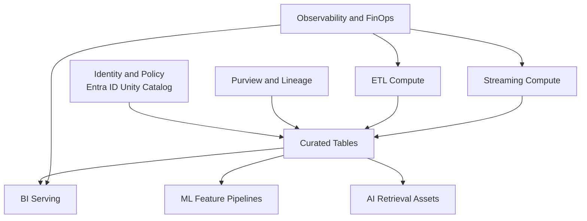

# Lakehouse Architecture

> Part of the **Enterprise Data & AI Architecture Handbook** · Phase-05 - Modern Data Engineering & Lakehouse · Chapter 02.
> Estimated study time: **75 min reading + ~5h labs**.
> **Prerequisites:** read [Modern Data Stack Overview](01_Modern_Data_Stack_Overview.md) and [Delta Lake](../Phase-04/04_Delta_Lake.md) first.

---

## Executive Summary

Lakehouse architecture is the disciplined attempt to unify the low-cost, open-storage properties of a data lake with the governance, transactional safety, and serving discipline historically associated with a data warehouse. In practice, a lakehouse is not only object storage plus Parquet. It is object storage plus transactional table semantics, metadata governance, workload isolation, and explicit serving patterns for BI, ML, and increasingly AI retrieval workloads.

For Azure-first enterprises, the most pragmatic lakehouse default is usually ADLS Gen2 or OneLake as the storage substrate, Delta Lake as the primary curated table abstraction, Azure Databricks or Microsoft Fabric as the primary compute plane, Unity Catalog and Purview as the control plane, and a small number of approved serving surfaces such as Databricks SQL, Fabric Warehouse, Synapse serverless SQL, PostgreSQL, Redis, or vector indexes. The architecture is successful when storage remains durable and cheap, compute remains elastic and isolated, metadata remains authoritative, and consumers avoid bypassing the control plane.

The lakehouse matters because warehouse-only estates become too expensive or rigid for raw retention, semi-structured data, and ML feature generation, while lake-only estates without table semantics often devolve into weakly governed file systems. The lakehouse solves that middle problem: it lets the enterprise keep replayable raw data, build ACID-governed curated tables, serve BI and ML from common assets, and evolve to multiple engines without copying the same data repeatedly.

The important architectural warning is that a lakehouse is not a license to collapse every workload into one engine or one team. It is a platform pattern that works only when storage, compute, metadata, security, and observability are intentionally separated. The right outcome is one governed platform with multiple workload blueprints. The wrong outcome is a fashionable new storage layer that simply rebrands the same operational chaos.

## Learning Objectives

By the end of this chapter you should be able to:

1. Explain what a lakehouse is and how it differs from a lake-only or warehouse-only architecture.
2. Describe why separation of storage and compute is foundational to lakehouse design.
3. Explain how transactional table layers such as Delta support unified batch and streaming pipelines.
4. Compare Azure Databricks and Microsoft Fabric as lakehouse implementations in an Azure estate.
5. Design a control plane that combines catalog, lineage, policy, and quality management.
6. Reason about BI, ML, and AI serving from one governed data platform without over-consolidating execution engines.
7. Identify the scaling, cost, and governance trade-offs of lakehouse adoption.
8. Build a decision matrix for when a lakehouse is the default and when it should not be.
9. Define a migration path from warehouse-centric or lake-centric patterns into a governed lakehouse.
10. Defend a lakehouse recommendation in staff, architect, and CTO review settings.

## Business Motivation

- Enterprises want one governed analytical substrate that can support reporting, data science, machine learning, and AI enrichment without storing multiple uncontrolled copies of the same data.
- Raw data retention on general-purpose warehouse storage is often expensive, while raw data retention in unmanaged lakes often creates governance and trust failures.
- Business teams increasingly expect new domains to onboard in weeks rather than quarters; a lakehouse lets the platform reuse storage, governance, and transformation primitives.
- Streaming and CDC workloads increasingly need to publish into the same curated tables that batch pipelines use.
- Executive pressure for cost efficiency favors separation of cheap durable storage from elastic compute, but only if the platform prevents scan amplification and compute contention.
- Data governance programs need stronger lineage, access control, and auditability than classic file-based lakes typically deliver.
- AI and ML programs need governed feature and document stores that remain traceable back to canonical enterprise data.

## History and Evolution

- Enterprise data warehouses optimized for SQL serving, dimensional modeling, and curated governance, but struggled with raw scale, semi-structured data, and broad workload diversity.
- Hadoop-era lakes made cheap storage and flexible landing possible, but many organizations discovered that files on object storage do not automatically become governed analytical products.
- Cloud data warehouses improved elasticity and operations, yet many remained costly for long-term raw retention, replayable CDC history, and multi-engine access patterns.
- Transactional table layers such as Delta, Iceberg, and Hudi emerged to add ACID, schema evolution, time travel, and more disciplined metadata to open object storage, as covered in [Delta Lake](../Phase-04/04_Delta_Lake.md) and the storage-phase table-format comparison guidance.
- The lakehouse model then expanded beyond storage: serving, feature generation, lineage, observability, quality gates, and AI retrieval patterns all became part of the platform architecture.
- On Azure, the evolution now has two strong implementation paths: Azure Databricks centered lakehouses with Unity Catalog and Delta semantics, and Microsoft Fabric centered lakehouses with OneLake, Warehouse, semantic serving, and tightly integrated SaaS governance patterns.

## Why This Technology Exists

Lakehouse architecture exists because enterprises need both flexibility and discipline at the same time. The lake gives flexibility: raw retention, broad file support, and low-cost storage. The warehouse gives discipline: governed schemas, transactional consistency, reliable SQL serving, and predictable consumer contracts. Real enterprises need both.

Without a lakehouse, organizations usually fall into one of two weak states. In the first, everything is forced into a warehouse, so raw retention, feature engineering, and semi-structured landing become expensive or awkward. In the second, everything lands in a lake, so every table is reconstructed informally and governance becomes path-based folklore. The lakehouse attempts to avoid both failures by turning object storage into governed tables while preserving open-file economics.

This is especially important for unified batch and streaming. Batch sources still matter for ERP, finance, and partner extracts. Streaming sources matter for telemetry, event analytics, fraud, personalization, and CDC. A lakehouse gives both paths a common curated destination, reducing copy count and improving consistency.

The architecture also exists because the enterprise increasingly needs one data foundation for BI and ML. Dashboards, features, retrieval indexes, and quality scorecards all benefit when their source data is versioned, replayable, and governed through the same control plane.

## Problems It Solves

| Problem | How lakehouse architecture helps |
|---|---|
| Warehouse storage is too expensive for raw or historical retention | Moves durable storage to object storage while keeping governed table semantics |
| File-based lakes are weakly governed | Adds transactional tables, metadata, lineage, and policy enforcement |
| Batch and streaming publish to separate stores | Converges both into shared curated tables |
| BI and ML depend on inconsistent copies | Serves both from common governed assets where appropriate |
| Multi-engine analytics creates copy sprawl | Preserves shared table abstractions and catalog-driven access |
| Reprocessing after data defects is painful | Keeps replayable raw and versioned curated history |
| Lake-only estates have weak trust | Establishes stronger contracts, ownership, and observability |
| AI teams bypass the data platform | Gives them governed inputs for features, documents, and retrieval assets |

## Problems It Cannot Solve

- It does not fix poor source-system contracts or missing business ownership.
- It does not make every analytical workload cheap; bad layout and unconstrained queries still cost money.
- It does not remove the need for serving-specific databases when latency or concurrency requirements exceed generalized lakehouse serving.
- It does not automatically make open formats interoperable across every engine and every advanced feature.
- It does not eliminate platform lock-in; it only changes where the lock-in sits.
- It does not replace strong semantic modeling for metrics, definitions, and domain ownership.
- It does not justify letting every team run arbitrary compute directly against production curated tables.

## Core Concepts

### 8.1 Separation of storage and compute

The architectural core of the lakehouse is storage-compute separation. ADLS Gen2 or OneLake stores durable bytes. Compute engines such as Databricks, Fabric Spark, Trino, or serverless SQL read and write those bytes independently. This breaks the traditional scale-up warehouse coupling between stored data volume and always-on compute cost.

The benefit is not only cost. It is also isolation. ETL clusters can scale independently from BI warehouses. Data science notebooks can be governed separately from streaming jobs. Historical data can stay in object storage without forcing the organization to pay for high-end serving capacity continuously.

### 8.2 Transactional table semantics on object storage

Object storage is durable but not relational. Lakehouse table layers add the semantics missing from raw files:

- ACID transactions,
- snapshot isolation,
- schema evolution,
- time travel,
- optimistic concurrency control,
- data skipping and layout metadata.

For Azure-first lakehouses, Delta is often the default because of tight Databricks and Fabric alignment, practical operational maturity, and strong support for mutation-heavy analytical tables. Open exceptions are often justified with Iceberg when multi-engine neutrality is a first-order architectural requirement, as discussed in the prior storage-phase comparison material.

### 8.3 Unified batch and streaming

The lakehouse should not maintain one truth for batch and another for streaming. Streaming data can land in bronze tables through checkpointed ingestion, while batch sources land through manifests or scheduled loads. Both are then promoted into shared silver and gold tables. This simplifies downstream logic, reduces duplication, and improves consistency between dashboards, features, and model training sets.

### 8.4 Medallion and domain-layer discipline

Bronze, silver, and gold are not branding exercises. They are blast-radius boundaries.

- **Bronze** protects replay and source fidelity.
- **Silver** protects consistency, conformance, and quality.
- **Gold** protects consumption simplicity and business contract stability.

This layered discipline is one reason lakehouse programs succeed where file-based lakes failed. Consumers should know whether they are reading raw, standardized, or consumption-grade assets.

### 8.5 Control plane versus data plane

The data plane moves data through Event Hubs, pipelines, storage, and compute. The control plane enforces who can access which objects, how those objects are described, which lineage edges exist, and which quality rules passed. In a lakehouse, catalogs and metadata are not optional extras. They are what turns files into governed products.

Typical Azure control-plane components are Unity Catalog, Purview, Entra ID, Key Vault, Git-based CI/CD, policy automation, and budget controls. The data plane is ADLS Gen2 or OneLake, Event Hubs, Databricks, Fabric, SQL warehouses, and serving stores.

### 8.6 BI, ML, and AI on one platform

One platform does not mean one engine for every workload. It means one governed storage and metadata backbone. BI may read gold tables through Databricks SQL or Fabric Warehouse. ML training may read silver and gold features through Databricks, Fabric Spark, or Azure ML. AI retrieval may read curated documents and embeddings produced from the same governed estate. The unification point is metadata, storage, and contracts, not blind runtime consolidation.

### 8.7 Open governance versus managed governance

Unity Catalog is a managed governance plane deeply aligned with Databricks compute, Delta tables, volumes, and fine-grained access policies. Open governance patterns use tools such as OpenMetadata, Atlas, or REST catalogs to preserve interoperability across engines. The architecture decision is not ideological. It is a question of whether the enterprise values faster managed integration or broader neutral control more highly, and whether it is willing to operate the supporting services.

## Internal Working

### 9.1 Write path and optimistic commits

Writers land new files into object storage, calculate metadata changes, and then attempt an atomic commit to the table log or catalog. The critical design point is that multiple writers can operate without rewriting the entire table, as long as the commit protocol detects conflicts correctly. This is what lets batch jobs, merges, and streaming micro-batches coexist on the same lakehouse table.

### 9.2 Read path and snapshot resolution

Readers do not list raw folders and guess state. They resolve a consistent table snapshot through the metadata layer, determine which files belong to the transactionally valid version, and then push down partition, predicate, and statistics pruning. That is why curated lakehouse reads behave much more like disciplined table access than ad hoc file scans.

### 9.3 Batch-stream convergence inside the table layer

A streaming micro-batch may append or merge records into bronze and silver tables every minute, while a scheduled daily batch may update reference dimensions or slowly changing attributes. The table layer holds a consistent history so downstream readers can consume a coherent version. This is one of the strongest reasons a lakehouse is more than an object store with notebooks.

### 9.4 Metadata and access resolution

When a user queries a table through Databricks SQL or Fabric, the access path should resolve through the catalog and identity layer first. The platform decides whether the identity is allowed, which table version is visible, what row or column policies apply, and how lineage and audit events are recorded. Direct raw-path access bypasses that discipline and should be considered a governance smell.

### 9.5 Serving behavior for BI and ML

BI-serving paths emphasize concurrency, caching, and stable semantics. ML-serving paths emphasize reproducibility, feature freshness, and training-set traceability. A strong lakehouse architecture lets both paths consume the same underlying governed assets, but still separates serving engines where needed so dashboard spikes do not interfere with feature pipelines or backfills.

## Architecture

### 10.1 Azure Databricks lakehouse reference

The common Azure Databricks reference uses ADLS Gen2 as the durable storage layer, Delta as the table abstraction, Unity Catalog as the governance plane, Databricks jobs clusters for ETL, Structured Streaming for near-real-time ingestion, and Databricks SQL for curated BI. Purview complements the architecture as the broader enterprise metadata and discovery plane.

### 10.2 Microsoft Fabric lakehouse reference

The Fabric reference uses OneLake as the storage substrate, Fabric Lakehouse and Warehouse as tightly integrated serving and transformation surfaces, Spark notebooks or pipelines for engineering workflows, shortcuts for federated data access, and a SaaS-centric operating model that reduces some infrastructure decisions at the cost of lower infrastructure-level control.

### 10.3 Hybrid lakehouse reference with open interoperability

Some enterprises want an Azure-first default with carefully governed open exceptions. In that model, Delta on ADLS Gen2 remains the default, but selected domains may expose Iceberg-readable or open-catalog-compatible tables, use Trino for federated read access, and register metadata with OpenMetadata or another open catalog in addition to managed governance. This architecture is more flexible, but the support matrix and on-call complexity increase materially.

### 10.4 ADR example: choose a Delta-first lakehouse standard

**Context:** The enterprise currently stores raw data in ADLS Gen2, serves BI from a warehouse, runs some Spark jobs on Databricks, and has several ML teams copying data into isolated stores. Governance and lineage are inconsistent, and streaming pipelines publish to separate paths from batch loads.

**Decision:** Standardize on a Delta-first lakehouse architecture: ADLS Gen2 for durable storage, Unity Catalog for primary table governance, Azure Databricks Premium for transformation and streaming, Databricks SQL and Fabric Warehouse for serving by workload fit, and Purview for enterprise-wide discovery and classification. Allow open-catalog or Iceberg exceptions only when multi-engine neutrality is a documented requirement.

**Consequences:** Data copies shrink, replay and lineage improve, batch and streaming converge on shared curated assets, and ML teams can reuse governed features. The platform team must enforce access through the catalog, manage file-layout health, and certify the exception path carefully.

**Alternatives considered:**

1. Keep a warehouse-only pattern: rejected because raw retention, semi-structured ingestion, and ML use cases remain awkward or expensive.
2. Keep a lake-only pattern with path-based governance: rejected because trust, lineage, and policy enforcement remain weak.
3. Standardize on a fully open self-managed stack: rejected as the default because the enterprise does not want to operate all catalog, compute, and governance components itself for every domain.

## Components

| Layer | Azure-first default | Open or alternative option | Primary risk | Core SLI |
|---|---|---|---|---|
| Raw landing | ADLS Gen2 or OneLake | MinIO or another S3-compatible store | ungoverned landing sprawl | landed bytes with manifest completeness |
| Table layer | Delta Lake | Iceberg or Hudi for exceptions | metadata drift or unsupported features | successful commit rate |
| Transform | Azure Databricks jobs, Fabric Spark | Spark on Kubernetes, Flink | non-idempotent publishes | publish latency |
| Streaming ingest | Event Hubs with Structured Streaming | Kafka, Redpanda | lag and checkpoint instability | freshness SLA |
| Governance | Unity Catalog, Purview | OpenMetadata, Atlas, REST catalogs | weak policy consistency | assets with owner and lineage |
| BI serving | Databricks SQL, Fabric Warehouse, Synapse serverless | Trino, ClickHouse, Superset | concurrency contention | p95 query latency |
| ML and AI | Databricks ML, Azure ML, feature pipelines | Feast, Ray, vector stores | copy sprawl and stale features | feature freshness |

## Metadata

Metadata is the boundary between "files in storage" and "enterprise data products." In a lakehouse, it covers more than schemas. It includes access policies, table versions, ownership, lineage, retention, business criticality, and quality status.

| Metadata class | Example | Azure implementation | Open implementation |
|---|---|---|---|
| Table metadata | schema, partitions, versions, stats | Delta log, Unity Catalog, Fabric item metadata | Iceberg catalog, Hudi timeline, Hive metastore |
| Business metadata | domain owner, glossary term, criticality | Purview, catalog tags | OpenMetadata, Atlas |
| Security metadata | grants, row filters, column masking | Unity Catalog, Entra ID groups | Ranger, Keycloak-backed policy layers |
| Operational metadata | run IDs, lag, retries, compaction status | Databricks system tables, Azure Monitor, Fabric monitoring | Airflow metadata, Prometheus, Grafana |
| Lineage metadata | source-to-target relationships | Purview lineage, Unity Catalog lineage | OpenLineage, Marquez |
| Quality metadata | expectation results, scorecards | Great Expectations, platform scorecards | Great Expectations, Soda, Deequ |

The operating lesson is direct: if metadata is incomplete, the lakehouse is incomplete. Catalog coverage should be treated as a production readiness requirement, not a documentation project.

## Storage

Lakehouse storage should be durable, open-file-based, and layout-aware.

Recommended Azure posture:

- use ADLS Gen2 for enterprise-managed lakehouse storage when you need infrastructure-level control,
- use OneLake when the Fabric operating model and SaaS integration outweigh the need for low-level storage administration,
- keep raw, bronze, silver, gold, and checkpoint/state assets logically separate,
- default curated tables to Delta unless a reviewed portability requirement justifies another table format,
- enforce table registration and ownership before broad read access,
- treat file size, retention, and clustering policy as platform concerns rather than notebook-level preferences.

| Zone | Purpose | Typical table expectation | Azure storage surface |
|---|---|---|---|
| Raw | immutable source arrival and replay | files or append-only bronze staging | ADLS Gen2 container or OneLake landing path |
| Bronze | replayable transactional landing | append-heavy Delta tables | ADLS Gen2 + Delta or Fabric Lakehouse |
| Silver | standardized, deduplicated, quality-gated data | mutable Delta tables with governed schemas | ADLS Gen2 + Delta or Fabric Lakehouse |
| Gold | consumer-facing marts, features, and serving tables | stable contracts, explicit SLAs | Delta tables, Fabric Warehouse, or serving marts |
| Checkpoints and state | streaming offsets, workflow state, quality artifacts | tightly permissioned operational state | separate container, volume, or managed path |

Current Delta-era features matter architecturally. In Databricks-centered lakehouses, deletion vectors can improve mutation efficiency, and liquid clustering can reduce repartitioning pain on selected tables, but both require explicit runtime certification, maintenance policy, and engine-support review before broad adoption. The lakehouse architecture should assume feature gating, not universal compatibility.

## Compute

Lakehouse compute should be selected by workload class and isolated by concurrency profile.

| Workload class | Azure-first compute | Why it fits | Notes |
|---|---|---|---|
| Batch ELT and heavy joins | Azure Databricks jobs clusters | elastic Spark execution and strong Delta integration | best default for scheduled engineering pipelines |
| Near-real-time streaming | Databricks Structured Streaming | checkpointing, Event Hubs integration, transactional sinks | isolate from ad hoc notebooks |
| Curated BI serving | Databricks SQL serverless or Fabric Warehouse | concurrency controls and SQL-serving discipline | choose by workload fit and operating model |
| Interactive exploration | Databricks all-purpose compute or Fabric notebooks | flexible notebook-driven engineering | govern tightly and auto-terminate aggressively |
| ML feature engineering | Databricks ML runtimes or Fabric Spark | proximity to curated data and lineage | use feature contracts, not ad hoc copies |
| Model training and inference batches | Azure ML Compute or Databricks jobs | training isolation, GPU selection, managed experiment workflows | use when ML lifecycle needs exceed core lakehouse jobs |
| Transitional SQL over lake | Synapse serverless SQL or Fabric SQL endpoints | lightweight access for selected consumers | useful as an access surface, not as the primary architecture |

The practical recommendation is simple: one lakehouse does not imply one compute pool. Separate ETL, streaming, BI, notebooks, and ML training when production importance or concurrency justify it.

## Networking

Lakehouse networking should bias toward private connectivity and low-egress topology.

Recommended Azure principles:

- make Private Link or private endpoints the default for ADLS Gen2, Event Hubs, Key Vault, PostgreSQL, and other supporting services,
- treat service endpoints as legacy or maintenance-mode compatibility patterns rather than the preferred design,
- prefer no-public-IP or VNet-injected Databricks workspaces in regulated environments,
- use Azure DNS Private Resolver so private endpoint name resolution works consistently across hub-spoke and hybrid networks,
- use Azure Bastion for controlled administrative access instead of broad jump-host exposure,
- keep lakehouse compute and storage region-local where possible to minimize egress and reduce failure domains.

Fabric changes some infrastructure choices because it is more SaaS-like, but the architectural requirement does not change: data-plane access should still be intentional, private where possible, and auditable.

## Security

Lakehouse security should be identity-first, catalog-driven, and hostile to path-based bypass.

Core controls:

- Entra ID groups for human and workload identities,
- managed identities where Azure services support them,
- Key Vault for secret material that cannot be eliminated,
- Unity Catalog for table, schema, column, row, and volume-level governance in Databricks-led estates,
- Purview classifications and sensitivity labels for wider enterprise governance,
- cluster, SQL warehouse, and workspace policies that prevent ungoverned compute behavior,
- audit logs that cover both control-plane policy changes and data-plane read/write events.

The strongest lakehouse security posture routes most consumer access through tables, views, and governed serving endpoints instead of raw storage paths. When a team insists on raw-path access in production, that should trigger an architecture review, not quiet approval.

## Performance

Performance in a lakehouse is mostly a table-layout and workload-shaping problem before it is a CPU problem.

| Bottleneck | Typical symptom | Primary lever | Lakehouse-specific note |
|---|---|---|---|
| Small-file explosion | long planning times and inconsistent query latency | compaction and optimized write sizing | streaming design often causes this first |
| Poor pruning | stable compute but rising scan sizes | partition strategy, clustering, statistics | gold contracts should hide poor raw layout |
| Mutation debt | upserts get slower over time | optimize, compaction, and feature-aware maintenance | deletion vectors must be compacted on a schedule where used |
| BI contention | dashboards slow during backfills | dedicated SQL-serving compute | do not share critical BI with heavy ETL by default |
| Cross-engine mismatch | one engine is fast, another is not | certify features and table behavior | open interoperability has real support cost |

Liquid clustering is useful on selected Databricks Delta tables when access patterns evolve faster than static partitions can keep up, but it is not a universal default and should be adopted only where engine support and operational ownership are clear. The same principle applies to UniForm-style exposure and advanced table features: they are architecture choices, not defaults for every domain.

## Scalability

Scalability in a lakehouse has five dimensions:

1. data volume,
2. writer concurrency,
3. reader concurrency,
4. metadata scale,
5. team and domain scale.

Object storage handles data volume well, but metadata scale and team scale usually break first. If catalogs, naming conventions, ownership models, and engine-certification rules are weak, a petabyte-scale lakehouse can still fail operationally at a much smaller business scale.

Azure-first scaling guidance:

- scale storage independently from serving,
- scale BI-serving separately from ETL and streaming,
- divide domains and catalogs intentionally rather than by random workspace history,
- standardize onboarding templates so each new domain does not invent a new lakehouse pattern,
- monitor commit contention and small-file growth before they become platform-wide incidents.

## Fault Tolerance

Lakehouse fault tolerance comes from replayability, transactional history, and isolated failure domains.

| Failure class | Typical cause | Recovery approach |
|---|---|---|
| Partial batch publish | source timeout or failed transform step | rerun idempotently from raw or bronze and republish silver/gold |
| Streaming interruption | checkpoint corruption, backlog spike, or network issue | restore from checkpoint if valid, otherwise replay retained source data |
| Bad table mutation | faulty merge logic or accidental delete | roll back through time travel or restore from prior version |
| Serving regression | schema or semantic change breaks consumers | pin consumers to stable views and restore prior gold version |
| Regional storage event | regional outage or failover | use documented disaster recovery runbooks and accept non-zero RPO on async replicated storage |

Important Azure note: ADLS Gen2 GRS and GZRS failover is asynchronous, so a lakehouse disaster recovery design must assume non-zero RPO during regional failure. Do not present geo-redundancy as synchronous table-level consistency.

## Cost Optimization

The lakehouse is economically defensible only when it reduces repeated storage and compute work rather than merely relocating it.

High-value cost levers:

- keep raw history on object storage, not on premium serving tiers,
- use incremental silver and gold processing rather than repeated full-table rebuilds,
- separate always-on BI-serving from bursty engineering compute,
- aggressively auto-terminate notebook and exploratory compute,
- compact small files before they create expensive query amplification,
- avoid duplicating the same curated data into multiple warehouses without a concrete latency need,
- standardize table features and engine combinations so support effort does not become hidden cost.

| Lever | Benefit | Risk if overused |
|---|---|---|
| Serverless or autoscaled SQL serving | reduces idle cost | surprise spend under weak workload governance |
| Cooler storage tiers for older bronze | lowers storage cost | retrieval penalties if replay is frequent |
| Incremental gold updates | major scan reduction | logic quality depends on good keys and change capture |
| Shared open compute clusters | higher utilization | noisy-neighbor and support burden |
| Advanced Delta features | lower write or read cost in specific cases | compatibility and maintenance overhead |

Worked FinOps example: assume the old architecture stored 90 TB of raw history in a premium warehouse-adjacent tier and rebuilt a 20 TB gold aggregate every night. Moving raw history to ADLS Gen2 and keeping only curated serving data on higher-cost serving compute means the gold path can process 2 TB of changes instead of 20 TB nightly. If the old job consumed an illustrative 90 cluster-hours per month at $20 per hour and the new incremental path consumes 22 cluster-hours, compute spend falls from about $1,800 to about $440, a reduction of roughly $1,360 per month. If 70 TB of older bronze history can move from hot to cool storage at an illustrative $8 per TB-month delta, that adds another roughly $560 per month in storage savings. The larger lesson is that lakehouse savings come from workload shape, copy reduction, and retention discipline, not from declaring object storage automatically cheap.

## Monitoring

Monitoring should answer whether the lakehouse is healthy against explicit service expectations.

Minimum signals:

- ingestion lag and arrival completeness,
- successful publish latency for bronze, silver, and gold,
- commit failure rate and retry behavior,
- file-count and compaction health,
- BI query latency and queue time,
- feature freshness for ML-serving pipelines,
- policy-denied access events,
- cost by domain, workspace, and serving surface.

| Layer | Metric | Alert example |
|---|---|---|
| Streaming ingest | consumer lag | freshness SLO breached for 10 minutes |
| Table layer | commit failures and optimistic concurrency retries | retry rate spike above baseline |
| Storage | file counts and average file size | small-file threshold exceeded |
| BI serving | p95 latency and queue time | dashboard SLO breach |
| ML feature pipelines | latest successful feature publish time | freshness beyond target window |
| Platform cost | daily spend or warehouse utilization | anomaly beyond forecast envelope |

## Observability

Observability should explain why a lakehouse is behaving the way it is, especially when symptoms cross batch, streaming, and serving boundaries.

Useful observability practices:

- propagate run IDs from source landing through gold publish,
- capture source high-watermarks and target table versions on every publish,
- log lineage edges automatically where tooling supports it,
- correlate query regressions with table-version, schema, and layout changes,
- keep quality events queryable instead of buried in notebook or job logs,
- tie infrastructure changes and policy changes back to data-product impact.

### Operational Response Playbook

| Signal | Detection query or check | Immediate remediation |
|---|---|---|
| Rising commit retries on a hot silver table | inspect Delta history, concurrent writer activity, and job overlap windows | serialize conflicting writers, review merge keys, and move non-critical jobs out of the contention window |
| BI latency spike after heavy streaming day | compare SQL latency with file counts, optimize backlog, and recent publish sizes | run compaction, review trigger interval, and isolate BI-serving compute from backlog recovery |
| Consumers bypassing catalog access | audit raw storage reads against expected table access patterns | remove broad raw-path grants, publish governed views, and remediate the access model |
| Feature freshness breach with healthy gold tables | compare feature pipeline timestamps, upstream table version, and job dependency state | rerun only the feature pipeline, validate dependency contracts, and restore freshness alerts |

The observability difference is practical: monitoring tells you the gold dashboard is late; observability tells you whether the root cause is commit contention, checkpoint lag, schema drift, compaction debt, or a bad serving dependency.

## Governance

Lakehouse governance must combine table semantics, ownership, identity, and metadata discipline.

Core rules:

- every production table needs an owner, steward, and business purpose,
- gold tables require explicit contracts and SLA definitions,
- raw and bronze access should be more restrictive than silver and gold access,
- lineage should be present before broad discoverability,
- table features should be approved by platform standards before mass adoption,
- exception paths such as open catalogs or alternate table formats should require ADRs.

Unity Catalog is often the fastest way to enforce this in Azure Databricks estates. Fabric gives tighter SaaS integration for workspace-oriented governance. Open governance tools give broader neutrality, but they shift more operating responsibility to the platform team. The architecture decision should be explicit, because governance federation is usually harder than storage federation.

## Trade-offs

| Choice | Benefit | Cost | When not to use |
|---|---|---|---|
| Delta-first Azure lakehouse | strong managed integration and mutation support | some runtime and feature dependency | hard multi-engine neutrality requirements |
| Fabric-centric lakehouse | tight SaaS integration and simplified operations | less low-level control | teams need infrastructure-level tuning freedom |
| Open-catalog lakehouse | broader interoperability | more services to operate and certify | small platform teams |
| Unified BI and ML storage backbone | fewer copies and better lineage | more pressure on metadata and serving discipline | when use cases have radically different latency or governance needs |
| Advanced table features everywhere | potential efficiency gains | compatibility and maintenance risk | multi-engine estates with uneven support |

## Decision Matrix

| Scenario | Recommended lakehouse shape | Reason | Avoid if |
|---|---|---|---|
| Azure enterprise analytics modernization | ADLS Gen2 + Delta + Databricks + Unity Catalog | strongest pragmatic default for Azure estates | enterprise requires fully neutral open governance from day one |
| SaaS-heavy analytics with tight Microsoft integration | Fabric Lakehouse plus Fabric Warehouse | simplified operating model and integrated serving | workload needs more infra-level compute and governance control |
| Multi-engine analytical platform | Delta-first default with open exceptions or Iceberg exception domains | balances standardization with portability | platform team cannot certify the extra matrix |
| Streaming plus BI convergence | Event Hubs + bronze/silver/gold Delta + dedicated serving | shared truth with isolated compute | organization insists on dashboarding from bronze |
| ML and feature reuse on one platform | governed silver/gold lakehouse plus feature pipelines | reproducibility and lineage improve | feature latency requires a separate online store only |
| Departmental low-scale reporting | simpler warehouse-only or Fabric-only pattern | lower complexity than a full lakehouse | domain will rapidly expand across many source types |

## Design Patterns

1. **Replayable bronze pattern:** preserve source fidelity and allow deterministic reprocessing.
2. **Shared silver foundation pattern:** standardize conformed entities once for many consumers.
3. **Serving specialization pattern:** use distinct serving surfaces for BI, APIs, features, and retrieval.
4. **Control-plane-first pattern:** register data, policy, and ownership before wide consumer access.
5. **Feature-gated table semantics pattern:** adopt advanced Delta or open-format features only after certification.
6. **Lakehouse plus warehouse edge pattern:** keep the lakehouse as system of curation and attach optimized serving marts where justified.
7. **Batch-stream convergence pattern:** converge batch and streaming outputs on common curated tables.
8. **Exception-by-ADR pattern:** require written architecture decisions for alternate catalogs, table formats, or engines.

## Anti-patterns

1. Treating a folder hierarchy as governance.
2. Letting dashboards query bronze directly.
3. Sharing one compute pool across heavy ETL, ad hoc notebooks, and executive BI.
4. Enabling advanced table features without verifying engine support.
5. Granting broad storage-path access because catalog policy setup is incomplete.
6. Running a second lakehouse stack for one team without an exit strategy.
7. Declaring the lakehouse "open" while quietly depending on engine-specific behavior everywhere.
8. Ignoring file-layout health until users complain.

## Common Mistakes

- **Mistake:** choosing a lakehouse because it sounds modern rather than because workload shape requires it.  
	**Consequence:** unnecessary complexity and weak adoption.  
	**Fix:** map concrete workloads and consumers before selecting the architecture.

- **Mistake:** assuming object storage alone gives warehouse-like trust.  
	**Consequence:** path sprawl, poor lineage, and weak access control.  
	**Fix:** enforce table registration, ownership, and policy before broad use.

- **Mistake:** using full refresh pipelines for mutable high-volume domains.  
	**Consequence:** inflated compute cost and longer recovery times.  
	**Fix:** use CDC or incremental merge patterns.

- **Mistake:** over-consolidating all consumers onto one SQL surface.  
	**Consequence:** concurrency contention and unstable latency.  
	**Fix:** separate serving surfaces by latency and workload class.

- **Mistake:** enabling deletion vectors, liquid clustering, or UniForm-style exposure without standards.  
	**Consequence:** compatibility drift and confused operators.  
	**Fix:** adopt feature gates, version baselines, and certified engine lists.

## Best Practices

1. Keep the lakehouse storage and governance backbone shared, but separate compute by workload.
2. Default to Delta on Azure unless a reviewed portability requirement overrides it.
3. Route production access through catalogs, views, and governed tables rather than storage paths.
4. Treat bronze, silver, and gold as operational boundaries, not only naming conventions.
5. Standardize monitoring for freshness, commit health, file layout, and serving latency.
6. Use open-source components selectively and only with explicit ownership.
7. Keep advanced table features behind platform approval until engine support is proven.
8. Publish ADRs for major governance, table-format, or serving exceptions.
9. Model BI, ML, and AI consumers separately even when they share the same curated backbone.
10. Reassess feature usage, catalog design, and serving patterns annually as workloads evolve.

## Enterprise Recommendations

Recommended default posture:

- use ADLS Gen2 or OneLake as the durable lakehouse substrate,
- use Delta as the primary curated table layer,
- use Azure Databricks or Fabric as the primary compute plane based on operating-model fit,
- use Unity Catalog and Purview as the default governance backbone in Databricks-heavy estates,
- allow open-catalog or alternative table-format exceptions only through architecture review,
- isolate BI-serving from engineering and streaming workloads,
- keep ML feature pipelines attached to governed silver and gold assets rather than unmanaged extracts.

Recommended decision rights:

1. Platform engineering defines approved lakehouse blueprints.
2. Security and governance define policy guardrails in code.
3. Domain teams own semantic quality, SLAs, and gold-layer business contracts.
4. Architecture review approves exceptions in table format, catalog, or serving engine.

## Azure Implementation

### Service map

| Lakehouse concern | Databricks-first implementation | Fabric-first implementation |
|---|---|---|
| Durable storage | ADLS Gen2 | OneLake |
| Curated table layer | Delta Lake | Delta-backed Fabric Lakehouse tables |
| Governance | Unity Catalog plus Purview | Fabric governance plus Purview integration |
| Streaming ingest | Event Hubs + Structured Streaming | Eventstream or pipelines plus Spark |
| BI serving | Databricks SQL | Fabric Warehouse or SQL endpoint |
| ML and AI | Databricks ML, Azure ML, feature pipelines | Fabric Spark plus external Azure ML where needed |

### Bicep: ADLS Gen2 with private endpoint baseline

```bicep
param location string = resourceGroup().location
param storageAccountName string
param virtualNetworkId string
param subnetId string

resource lake 'Microsoft.Storage/storageAccounts@2023-05-01' = {
	name: storageAccountName
	location: location
	sku: {
		name: 'Standard_ZRS'
	}
	kind: 'StorageV2'
	properties: {
		isHnsEnabled: true
		allowBlobPublicAccess: false
		minimumTlsVersion: 'TLS1_2'
		publicNetworkAccess: 'Disabled'
		supportsHttpsTrafficOnly: true
	}
}

resource privateEndpoint 'Microsoft.Network/privateEndpoints@2023-05-01' = {
	name: '${storageAccountName}-dfs-pe'
	location: location
	properties: {
		subnet: {
			id: subnetId
		}
		privateLinkServiceConnections: [
			{
				name: 'dfs'
				properties: {
					privateLinkServiceId: lake.id
					groupIds: [
						'dfs'
					]
				}
			}
		]
	}
}
```

### Unity Catalog SQL: storage credential and external location

```sql
CREATE STORAGE CREDENTIAL mi_prod_lakehouse
WITH AZURE_MANAGED_IDENTITY;

CREATE EXTERNAL LOCATION prod_silver
URL 'abfss://silver@stlakehouseprod.dfs.core.windows.net/'
WITH (STORAGE CREDENTIAL mi_prod_lakehouse);

CREATE CATALOG prod_lakehouse;
CREATE SCHEMA prod_lakehouse.sales;

GRANT USE CATALOG ON CATALOG prod_lakehouse TO `data-engineering`;
GRANT SELECT ON EXTERNAL LOCATION prod_silver TO `finance-analysts`;
```

### Databricks SQL: gold table maintenance

```sql
OPTIMIZE prod_lakehouse.sales.orders_gold
ZORDER BY (customer_id, order_date);

VACUUM prod_lakehouse.sales.orders_gold RETAIN 168 HOURS;
```

Fabric implementation note: Fabric simplifies some infrastructure wiring through OneLake, Lakehouse, Warehouse, and shortcuts, but the same design discipline still applies. Gold contracts, serving isolation, governance ownership, and cost controls do not disappear in a SaaS operating model.

## Open Source Implementation

An open lakehouse implementation is justified when neutrality, sovereignty, or engine diversity are first-order requirements.

Reference stack:

- object storage on MinIO or another S3-compatible platform,
- Delta or Iceberg tables on open storage,
- Spark on Kubernetes for transformation,
- Kafka or Redpanda for streaming ingress,
- Trino for federated SQL serving,
- OpenMetadata or Atlas for catalog and lineage,
- Prometheus, Grafana, and OpenTelemetry for monitoring and observability.

### Spark configuration example

```properties
spark.sql.extensions=io.delta.sql.DeltaSparkSessionExtension
spark.sql.catalog.spark_catalog=org.apache.spark.sql.delta.catalog.DeltaCatalog
spark.sql.catalog.lake=org.apache.iceberg.spark.SparkCatalog
spark.sql.catalog.lake.type=rest
spark.sql.catalog.lake.uri=http://nessie:19120/api/v1
spark.sql.catalog.lake.warehouse=s3a://lakehouse/
spark.hadoop.fs.s3a.endpoint=http://minio:9000
spark.hadoop.fs.s3a.path.style.access=true
```

### Trino catalog example

```properties
connector.name=iceberg
iceberg.catalog.type=rest
iceberg.rest-catalog.uri=http://nessie:19120/api/v1
fs.native-s3.enabled=true
s3.endpoint=http://minio:9000
s3.path-style-access=true
```

### OpenMetadata ingestion outline

```yaml
source:
	type: trino
	serviceName: trino_lakehouse
processor:
	type: orm-profiler
sink:
	type: metadata-rest
	config:
		api_endpoint: http://openmetadata:8585/api
```

The warning is operational, not ideological: this stack can be excellent, but only if the platform team is willing to run object storage, catalogs, Spark, Trino, metadata services, TLS, upgrades, and incident response as real production services.

## AWS Equivalent (comparison only)

| Azure lakehouse component | AWS equivalent | Comparison note |
|---|---|---|
| ADLS Gen2 | Amazon S3 | similar durable storage role; AWS governance patterns differ materially |
| Azure Databricks | Databricks on AWS or EMR | Databricks offers closer cross-cloud parity; EMR offers more self-managed control |
| Fabric Lakehouse/Warehouse | Athena plus Redshift or other analytics layers | more fragmented than Fabric's integrated SaaS model |
| Unity Catalog | Lake Formation plus Glue Data Catalog | governance intent is similar, but control-plane behavior differs |
| Event Hubs | MSK or Kinesis | choose based on Kafka compatibility and ops posture |
| Purview | Glue catalog plus Lake Formation plus third-party metadata tooling | often needs more composition |

Selection criteria: choose AWS analogs when the surrounding application estate and operating model are already AWS-centered. Do not create a parallel AWS lakehouse only for symmetry if the enterprise is operationally Azure-first.

## GCP Equivalent (comparison only)

| Azure lakehouse component | GCP equivalent | Comparison note |
|---|---|---|
| ADLS Gen2 | Google Cloud Storage | similar storage role with different IAM and metadata workflow |
| Azure Databricks | Databricks on GCP or Dataproc | Dataproc provides open Spark control; Databricks provides closer cross-cloud consistency |
| Fabric Warehouse | BigQuery | stronger serverless SQL identity but different storage-serving assumptions |
| Unity Catalog | Dataplex plus Data Catalog lineage features | governance is improving but follows a different control-plane model |
| Event Hubs | Pub/Sub | highly managed but not Kafka-native in the same way |
| Purview | Dataplex and related metadata tooling | more compositional than a Databricks-led Azure governance pattern |

Selection criteria: BigQuery can shift the design toward warehouse-centric serving even when an object-storage-backed lakehouse exists. Azure-first teams moving to GCP should re-evaluate serving and governance assumptions rather than mechanically renaming services.

## Migration Considerations

Lakehouse migration should be incremental, not theatrical.

Common migration paths:

1. warehouse-first to lakehouse curation,
2. file-lake to governed lakehouse,
3. fragmented Spark jobs to standardized Delta or Fabric lakehouse,
4. separate BI and ML data copies to a shared governed curated backbone.

Recommended sequence:

1. land raw data in the new lakehouse alongside the old estate,
2. build bronze and silver pipelines with equivalence checks,
3. publish gold outputs behind stable interfaces or views,
4. dual-run critical reports and model features until variance is acceptable,
5. cut over consumers one workload class at a time,
6. decommission the legacy copy only after replay, rollback, and audit needs are proven.

Avoid big-bang migration unless the current platform is truly non-viable. Most enterprises underestimate the semantic drift in old gold tables and overestimate how quickly all downstream consumers can move.

## Mermaid Architecture Diagrams

### Azure lakehouse reference



### Commit and read path



### Control plane and serving separation



## End-to-End Data Flow

Consider a retail order and personalization lakehouse.

1. Transaction systems emit order CDC and clickstream events.
2. Event Hubs captures the event stream while scheduled pipelines land reference and master data.
3. Bronze Delta tables retain raw facts and replayable source context.
4. Silver tables standardize customers, products, sessions, and orders with conformance and deduplication.
5. Gold tables publish BI-ready revenue, fulfillment, and customer-behavior marts.
6. Databricks SQL or Fabric Warehouse serves dashboards from gold.
7. Feature pipelines consume silver and gold to build ML-ready features.
8. AI retrieval workflows consume curated product and customer-support documents derived from the same governed platform.
9. Observability ties lag, table versions, feature freshness, and dashboard latency back to the same publish chain.

The key architectural point is not merely shared storage. It is shared truth with workload-specific serving surfaces.

## Real-world Business Use Cases

1. Customer 360 with BI and personalization on shared curated entities.
2. Fraud and risk analytics combining CDC, event streams, and governed features.
3. Supply-chain control towers built from ERP, telemetry, and partner events.
4. Experimentation and product telemetry with both dashboarding and training reuse.
5. Financial reconciliation with replayable raw records and governed reporting outputs.
6. AI retrieval over enterprise knowledge assets with lineage back to curated source data.

## Industry Examples

- Retail benefits from stream-batch convergence and promotional elasticity.
- Financial services benefits from governed mutation handling, lineage, and access controls.
- Manufacturing benefits from shared telemetry and ERP curation on one platform.
- Healthcare benefits from a governed backbone where de-identification and feature reuse are both required.
- Media and digital platforms benefit from scalable event analytics and experimentation reuse.
- Public sector programs benefit from centralized governance and selective open interoperability where sovereignty matters.

## Case Studies

### Case study 1: Netflix and Iceberg-era metadata lessons

Netflix publicly discussed the metadata and partition-management challenges that contributed to the creation and adoption of Iceberg. The lesson for lakehouse architects is not that every Azure estate should standardize on Iceberg. The lesson is that table metadata and catalog scale are architecture concerns, not implementation trivia. If metadata design is weak, the lakehouse will fail long before raw object storage runs out of space.

### Case study 2: Uber and mutation-heavy lakehouse patterns

Uber publicly described operational pain that led to Apache Hudi for large incremental pipelines and late-arriving updates. The lesson for lakehouse design is that mutation-heavy domains need table semantics and replay discipline. A raw-file lake cannot sustainably satisfy those needs at enterprise scale.

### Case study 3: common Azure lakehouse failure pattern

Repeated enterprise failures on Azure follow the same pattern: a team lands data in bronze, exposes it directly to dashboards, ignores compaction and ownership, and then blames the platform when performance degrades and trust collapses. The actual root cause is architectural bypass: no clear gold contract, no serving isolation, and no governance enforcement. The lakehouse succeeds only when those controls are treated as first-class design elements.

## Hands-on Labs

### Lab 1: Build a Databricks-led lakehouse

Objective: create raw, bronze, silver, and gold layers on ADLS Gen2 with Unity Catalog governance.

Steps:

1. Provision ADLS Gen2, Event Hubs, and an Azure Databricks Premium workspace.
2. Create storage credentials, external locations, catalog, and schemas.
3. Ingest sample events into bronze using Structured Streaming.
4. Publish deduplicated silver and BI-ready gold tables.
5. Add grants, lineage validation, and freshness monitoring.

Success criteria: the platform can replay from bronze, governance is catalog-driven, and gold is queryable through a dedicated SQL surface.

### Lab 2: Compare Fabric lakehouse and warehouse serving

Objective: implement the same curated dataset in Fabric Lakehouse and Warehouse, then compare operating model and serving behavior.

Steps:

1. Load sample data into OneLake.
2. Build a Fabric Lakehouse table flow and a Warehouse serving layer.
3. Compare SQL latency, governance workflow, and semantic serving convenience.
4. Document where Fabric simplifies the architecture and where it hides useful control.

Success criteria: the team can articulate when Fabric is the preferred lakehouse operating model and when Databricks remains the better primary platform.

### Lab 3: Build an open comparison lakehouse

Objective: deploy a minimal open lakehouse with MinIO, Spark, Trino, and OpenMetadata.

Steps:

1. Stand up object storage, Spark, Trino, and metadata services.
2. Register a curated table and query it from two engines.
3. Capture the additional work for TLS, catalog durability, and observability.
4. Write an ADR stating whether the open stack should remain an exception or become a supported blueprint.

Success criteria: the team demonstrates both interoperability benefit and additional operating burden with evidence.

## Exercises

1. Explain why storage-compute separation matters financially and operationally.
2. Draw a control-plane and data-plane view of your target lakehouse.
3. Describe when a warehouse-only pattern remains the better architecture.
4. List three reasons BI should not query bronze directly.
5. Compare Databricks-first and Fabric-first lakehouse models for one business domain.
6. Define the minimum metadata required before a gold table is broadly discoverable.
7. Explain how a lakehouse can support both ML features and BI marts without collapsing into one serving engine.
8. Describe a safe rollout policy for advanced Delta features in a multi-engine estate.
9. Model a replay strategy for a bad silver publish.
10. Estimate the cost difference between full-refresh and incremental gold publishing for one of your domains.

## Mini Projects

1. Build a reusable lakehouse onboarding template with catalog, storage, and quality defaults.
2. Create a lakehouse observability dashboard that correlates lag, table-version, file-count, and BI latency.
3. Implement a governed feature pipeline that consumes silver or gold and records freshness metadata.
4. Build a decision tool that recommends Databricks-first, Fabric-first, or open-exception lakehouse blueprints.

## Capstone Integration

Capstone objective: design a production-grade lakehouse for one end-to-end business capability.

Minimum scope:

1. one batch and one streaming or CDC source,
2. raw, bronze, silver, and gold layers,
3. one BI-serving surface and one ML or AI consumption path,
4. catalog-driven governance and lineage,
5. monitoring for freshness, file health, and cost,
6. an ADR justifying the selected lakehouse pattern.

Evaluation criteria:

- alignment with the platform model in [Modern Data Stack Overview](01_Modern_Data_Stack_Overview.md),
- correct use of transactional lakehouse semantics as described in [Delta Lake](../Phase-04/04_Delta_Lake.md),
- clear justification for serving isolation, governance design, and cost controls.

## Interview Questions

1. What problem does a lakehouse solve that a warehouse-only platform does not?
2. Why is storage-compute separation a first-order design property rather than only a cost feature?
3. How does a transactional table layer change the behavior of object storage?
4. Why should batch and streaming converge on the same curated tables when possible?
5. What is the difference between a governance plane and a storage account ACL?
6. When would Fabric be a better primary lakehouse than Databricks?
7. Why might a lakehouse still need a serving-specific database or cache?
8. What failure modes appear when multiple writers target the same curated table?
9. What does "open" mean in a lakehouse architecture, and what does it not mean?
10. Which indicators show that a lakehouse program is operationally healthy, not just deployed?

## Staff Engineer Questions

1. How would you define the standard lakehouse blueprint and the rules for exceptions?
2. How would you isolate BI, ETL, streaming, and ML compute while preserving common governance?
3. What criteria would you require before enabling deletion vectors, liquid clustering, or open-table exposure patterns in production?
4. How would you quantify the cost of a second table format or second governance plane?
5. What are the hidden support costs of a hybrid managed-plus-open lakehouse architecture?
6. How would you design a gold contract so both dashboards and feature pipelines can rely on it safely?
7. What signals distinguish a layout problem from a serving-engine problem?
8. How would you migrate a warehouse-centric estate into a lakehouse without carrying duplicate costs for years?

## Architect Questions

1. What is your default Azure lakehouse blueprint, and which assumptions make it valid?
2. How do Unity Catalog, Purview, and open catalogs differ in control-plane responsibility?
3. When should Databricks be the primary lakehouse engine and when should Fabric be?
4. What workloads should never be forced into the generalized lakehouse serving path?
5. How do network, identity, and storage design decisions constrain lakehouse choices more than feature checklists do?
6. What is your disaster recovery posture for async-replicated object storage and versioned tables?
7. How would you defend a Delta-first standard to a team asking for full format neutrality everywhere?
8. What evidence would make you revise the current lakehouse standard next year?

## CTO Review Questions

1. What business capabilities become faster, safer, or cheaper after moving to a lakehouse?
2. Where is the architecture intentionally accepting platform dependency, and why is that acceptable?
3. What is the most likely executive-visible failure mode, and how quickly can the platform recover?
4. How many supported lakehouse blueprints will the enterprise allow, and who enforces the limit?
5. What cost categories shrink after consolidation, and which new platform costs appear?
6. What governance evidence would prove that the lakehouse is delivering trust rather than only centralizing storage?

## References

- [Modern Data Stack Overview](01_Modern_Data_Stack_Overview.md)
- [Delta Lake](../Phase-04/04_Delta_Lake.md)
- Azure Databricks architecture and Unity Catalog documentation.
- Microsoft Fabric Lakehouse, Warehouse, and OneLake documentation.
- Delta Lake operational guidance for ACID tables on object storage.
- Apache Iceberg, Apache Hudi, Spark, Trino, and OpenMetadata project documentation.

## Further Reading

- *Designing Data-Intensive Applications* by Martin Kleppmann.
- *Fundamentals of Data Engineering* by Joe Reis and Matt Housley.
- Public engineering material from Netflix on Iceberg and metadata scale.
- Public engineering material from Uber on Hudi and incremental data processing.
- FinOps Foundation guidance for analytical platforms and shared cloud services.