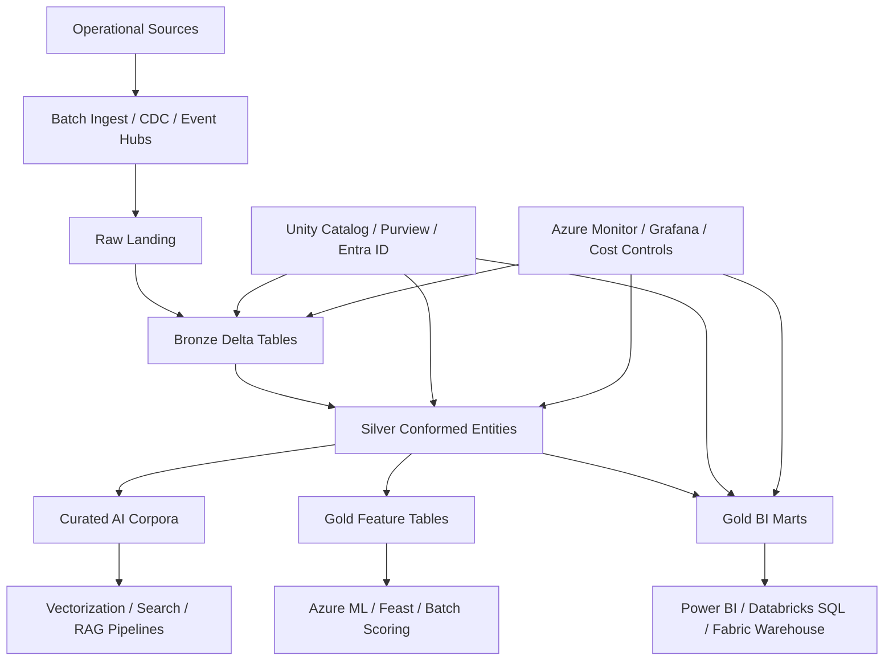
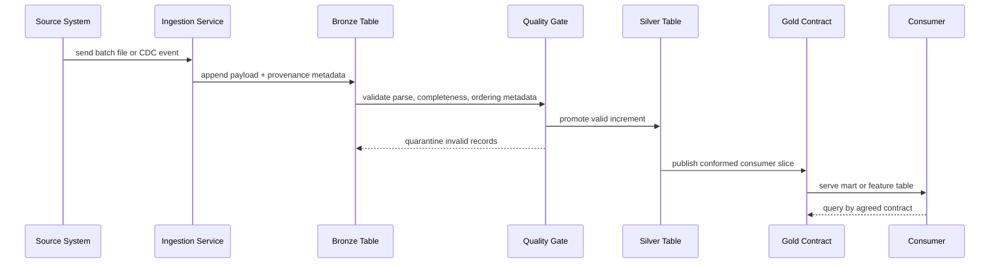
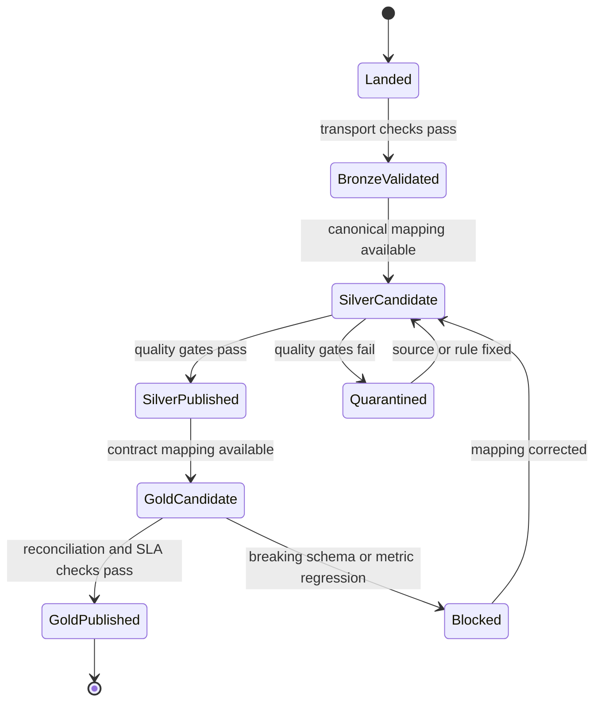

# Medallion Architecture

> Part of the **Enterprise Data & AI Architecture Handbook** · Phase-05 - Modern Data Engineering & Lakehouse · Chapter 03.
> Estimated study time: **60 min reading + ~4h labs**.
> **Prerequisites:** read [Modern Data Stack Overview](01_Modern_Data_Stack_Overview.md), [Lakehouse Architecture](02_Lakehouse_Architecture.md), [Object Storage and Data Lakes](../Phase-04/03_Object_Storage_and_Data_Lakes.md), [Delta Lake](../Phase-04/04_Delta_Lake.md), [Apache Iceberg](../Phase-04/05_Apache_Iceberg.md), and [Table Format Comparison](../Phase-04/07_Table_Format_Comparison.md) first.

---

## Executive Summary

Medallion architecture is the operational discipline of refining data through explicit trust boundaries rather than exposing every consumer directly to raw files, source-system quirks, and incomplete transformations. The pattern is commonly described as bronze, silver, and gold, but the important architectural idea is not the color names. It is the separation of concerns: preserve source fidelity and replay in bronze, create canonical and quality-gated business-ready data in silver, and publish stable serving contracts in gold.

For Azure-first enterprises, the most pragmatic implementation is usually ADLS Gen2 or OneLake as the storage substrate, Delta tables as the transactional abstraction, Azure Databricks or Microsoft Fabric as the primary refinement engine, Event Hubs and batch ingestion services for source capture, Unity Catalog plus Microsoft Purview for governance, and constrained serving surfaces such as Databricks SQL, Fabric Warehouse, Power BI semantic models, Azure ML feature pipelines, PostgreSQL, or Redis where workload shape requires them. That combination gives the enterprise replayable raw history, incremental transformation, quality gates, auditability, and consumer-friendly marts without copying the same data through multiple unmanaged stacks.

The architecture exists because most failures in analytical estates come from mixing incompatible needs in one layer. Raw data needs replay, tolerance for source defects, and cheap retention. Consumer-facing data needs stability, semantics, performance, and contractual governance. Feature pipelines need freshness, reproducibility, and traceability. A medallion design works when each layer has a strict purpose, explicit promotion rules, and ownership boundaries. It fails when bronze becomes an unofficial BI source, silver becomes a dumping ground for half-modeled tables, or gold becomes a thin rename of upstream chaos.

The right way to evaluate medallion architecture is not to ask whether bronze, silver, and gold sound modern. Ask whether the organization needs replayable ingestion, idempotent incremental processing, schema enforcement with controlled evolution, quality gates, and multiple serving patterns over a shared lakehouse. If the answer is yes, medallion is often the clearest operating model. If the domain is tiny, the latency is ultra-low, or the workload is warehouse-only and highly stable, a simpler design may be better.

## Learning Objectives

By the end of this chapter you should be able to:

1. Explain why medallion architecture is a contract model, not just a folder naming convention.
2. Define the distinct responsibilities of bronze, silver, and gold layers.
3. Design idempotent incremental pipelines for append, update, delete, and late-arriving data.
4. Place data quality gates correctly between layers and defend why they belong there.
5. Apply schema enforcement and controlled evolution without breaking downstream consumers.
6. Distinguish when gold should publish marts, semantic views, feature tables, or specialized serving stores.
7. Compare Azure Databricks and Microsoft Fabric medallion implementations in an Azure estate.
8. Evaluate open-source alternatives using Spark, Kafka, Trino, dbt, Great Expectations, OpenMetadata, and Feast.
9. Identify the operational, cost, governance, and security failure modes of medallion programs.
10. Defend a medallion architecture recommendation in engineer, staff, architect, and CTO review settings.

## Business Motivation

- Business teams need trustworthy data products faster than source-system modernization cycles can deliver.
- Finance, operations, and customer-facing metrics need stable gold contracts even while upstream source payloads keep changing.
- AI and ML teams need traceable features and curated document corpora that remain linked to governed enterprise data.
- Enterprises need a way to retain raw history cheaply for replay, audit, and investigation without forcing consumers to understand every source defect.
- Streaming, CDC, and batch pipelines increasingly converge on the same entities; medallion architecture creates a repeatable refinement model across all three.
- Data platform teams need a standard onboarding blueprint so every new domain does not invent its own folders, quality rules, and serving conventions.
- Regulatory and audit requirements demand lineage, reproducibility, and proof that consumer-facing data passed explicit controls.

## History and Evolution

- Classic warehouses concentrated on curated relational serving, dimensional modeling, and strong business reporting contracts, but were often too rigid or expensive for raw retention and semi-structured data.
- Data lakes solved cheap storage and broad ingest, but many estates degraded into low-trust file systems because raw, standardized, and consumer-facing assets were mixed together.
- Lakehouse adoption, as introduced in [Lakehouse Architecture](02_Lakehouse_Architecture.md), created a stronger foundation by putting transactional table semantics on object storage.
- Medallion architecture emerged as the operating pattern that made lakehouse execution manageable: raw data lands safely, business logic is standardized once, and consumer contracts are published deliberately.
- The pattern became more important as CDC, event streams, and ML feature engineering converged. Batch-only transformation pipelines were no longer enough.
- Open table formats such as those described in [Delta Lake](../Phase-04/04_Delta_Lake.md), [Apache Iceberg](../Phase-04/05_Apache_Iceberg.md), and [Apache Hudi](../Phase-04/06_Apache_Hudi.md) made the promotion model more practical by supporting ACID operations, version history, and schema evolution on object storage.
- Modern enterprises now extend medallion beyond BI. Gold outputs may feed semantic models, feature stores, retrieval corpora, reverse ETL, operational scorecards, or compliance evidence.

## Why This Technology Exists

Medallion architecture exists because raw fidelity and consumer usability are different engineering problems. The bronze layer optimizes for ingestion reliability, replayability, and source evidence. The silver layer optimizes for standardization, deduplication, conformance, and quality enforcement. The gold layer optimizes for business meaning, performance, and stable consumption contracts. Combining those goals in one layer usually produces either operational fragility or consumer distrust.

The pattern also exists because incremental computing is hard to operationalize without trust boundaries. If every dataset is both a raw landing zone and a consumer-facing table, engineers cannot safely decide where deduplication, business keys, late-arrival handling, or schema evolution should occur. Medallion puts those decisions in predictable places.

The architecture is especially useful when multiple consumer types share the same upstream domain. A sales order stream may need near-real-time operational monitoring, daily finance reconciliations, customer 360 features, and monthly executive KPIs. Bronze preserves source truth. Silver resolves business truth. Gold publishes consumption truth. Those are related but not identical.

## Problems It Solves

| Problem | How medallion architecture helps | Enterprise signal that it is working |
|---|---|---|
| Raw data is too messy for broad consumption | confines source defects to bronze and promotes only quality-gated data | analysts and data scientists stop building one-off cleanup logic |
| Reprocessing after defects is painful | keeps replayable raw history and deterministic promotion logic | backfills become planned operations instead of crisis rewrites |
| CDC and batch logic disagree | applies one canonical silver model for both paths | duplicate counts and reconciliation gaps fall materially |
| Downstream consumers break on schema drift | bronze captures change, silver standardizes it, gold versions consumer contracts | fewer report outages after source changes |
| Teams bypass governance and query raw paths | gold becomes the approved consumption contract and silver remains controlled | direct storage-path access steadily declines |
| ML features and BI marts disagree on core entities | both consume conformed silver entities or governed gold outputs | business metrics and model features reconcile more reliably |
| Platform cost rises due to repeated full refreshes | incremental promotion reduces repeated scans and rewrites | cluster-hours and warehouse scans drop as data volume grows |
| Ownership is ambiguous | every layer has explicit owners, SLAs, and promotion criteria | incident response becomes faster and more accountable |

## Problems It Cannot Solve

- It cannot fix poor source-system semantics or missing business ownership.
- It does not eliminate the need for domain modeling, semantic definitions, and clear KPI stewardship.
- It does not make gold tables a substitute for low-latency operational databases or search indexes when millisecond serving is required.
- It does not guarantee low cost if teams over-partition, full-refresh large tables, or allow unbounded ad hoc compute.
- It does not remove the need for separate stores when online feature serving, vector retrieval, or OLTP concurrency exceed lakehouse serving patterns.
- It does not automatically resolve organizational conflict between platform and domain teams.
- It is not mandatory for every workload; small stable marts can remain simpler than a full medallion pipeline.
- It does not make weak data contracts acceptable simply because lineage and dashboards exist.

## Core Concepts

### 8.1 Layers are contracts, not color-themed folders

The most important conceptual correction is that medallion layers are semantic contracts. A folder named `/gold/` does not make a dataset gold. A gold asset must have a defined business purpose, owner, refresh expectation, access policy, and consumption contract. Likewise, bronze is not merely "raw" if the platform already performed record-level normalization, metadata enrichment, and transactional landing.

### 8.2 Bronze preserves source fidelity and replay

Bronze is the place to land source data with minimal irreversible change. Recommended bronze responsibilities:

- retain source payload and source metadata such as event time, ingestion time, source system, file name, partition key, source LSN, or message offset,
- tolerate malformed rows by routing them to quarantine rather than silently dropping them,
- normalize transport concerns such as compression, framing, and envelope parsing,
- avoid business-rule enrichment that would make replay or forensic analysis harder.

In Azure-first estates, bronze usually lands in Delta tables on ADLS Gen2 or OneLake, while immutable raw files may remain in a separate landing container as additional evidence. Bronze is usually append-heavy and partitioned by ingestion date or source arrival time, not by business dimensions.

### 8.3 Silver creates canonical business-ready data

Silver is where data becomes internally trustworthy. Typical silver responsibilities:

- standardize datatypes, identifiers, currencies, and timestamps,
- deduplicate using business keys plus ordering logic,
- model deletes and corrections consistently,
- conform reference data and slowly changing dimensions,
- enforce data quality expectations and quarantine failures,
- expose entities that multiple downstream consumers can reuse.

Silver is where most idempotent incremental logic lives. It is also where platform teams should force disciplines such as surrogate key assignment, late-arrival handling, and canonical null semantics.

### 8.4 Gold publishes serving contracts

Gold exists for consumption, not for engineering convenience. Gold outputs may take the form of:

- star-schema fact and dimension marts for BI,
- wide semantic tables for a constrained reporting domain,
- feature tables for batch or near-real-time feature generation,
- aggregated operational scorecards,
- curated document and chunk registries for AI retrieval pipelines.

Gold should be narrow in purpose and explicit in SLA. The design question is always: which consumer is this for, and what is the contract?

### 8.5 Idempotent incremental processing

Idempotency means rerunning the same promotion step does not produce a different result unless the input changed. Incremental means processing only the changed slice rather than rebuilding everything. The common building blocks are:

- source high-watermarks such as LSNs, offsets, or extract timestamps,
- deterministic merge keys,
- ordering columns for latest-wins or business-approved conflict resolution,
- explicit delete semantics,
- checkpoint state and replay strategy,
- table-version-aware backfills.

This concept depends on the consistency and ordering foundations described in [Replication and Consistency](../Phase-02/02_Replication_and_Consistency.md) and [Time, Clocks, and Ordering](../Phase-02/06_Time_Clocks_and_Ordering.md). A medallion design that cannot explain its ordering model will eventually mis-handle late or conflicting updates.

### 8.6 Data quality gates between layers

Quality gates should become stricter as trust increases.

| Promotion path | Gate purpose | Typical checks |
|---|---|---|
| Raw to bronze | protect ingestion integrity | file completeness, parse success rate, schema registry compatibility, non-null transport metadata |
| Bronze to silver | protect business trust | uniqueness by business key, referential integrity, valid code sets, timestamp sanity, dedup success |
| Silver to gold | protect consumer contract | metric reconciliation, dimensional completeness, freshness SLA, row count delta reasonableness, nullability on contract columns |

The design principle is simple: a layer should never promote data that would force downstream consumers to rediscover a known defect.

### 8.7 Schema enforcement and evolution

Bronze should capture source changes quickly but not blindly propagate them to every consumer. Silver should enforce canonical schema and accept only reviewed evolution. Gold should version contract changes deliberately. Recommended rules:

- allow additive fields into bronze if provenance remains intact,
- require explicit mapping for new or changed fields before silver promotion,
- block destructive or semantic-breaking changes from auto-promoting to gold,
- use compatibility matrices for engines and table features, especially when comparing [Delta Lake](../Phase-04/04_Delta_Lake.md), [Apache Iceberg](../Phase-04/05_Apache_Iceberg.md), and [Apache Hudi](../Phase-04/06_Apache_Hudi.md),
- record schema decisions in ADRs and catalog metadata.

### 8.8 Serving marts and feature tables

Gold is not limited to BI marts. In mature platforms, gold also publishes:

- feature tables with freshness, point-in-time join rules, and lineage,
- consumable semantic models for finance and executive reporting,
- API-ready serving tables for downstream application teams,
- AI enrichment outputs such as chunk metadata, classifications, or embeddings indexes backed by curated source data.

The key control is that all of these remain derived from governed silver or gold contracts, not from ad hoc bronze extracts.

## Internal Working

### 9.1 Source capture and landing

Sources arrive through batch extracts, CDC feeds, event streams, or API pulls. The landing pattern should preserve provenance and support replay. For Azure, that often means Event Hubs for event ingress, Azure Data Factory or Fabric pipelines for scheduled ingestion, and landing files or streaming sinks into ADLS Gen2 or OneLake. Source metadata such as offset, partition, file manifest ID, or source LSN must be written with the payload.

### 9.2 Bronze commit and checkpoint state

Bronze writes should be atomic at the table level, checkpointed for streaming, and partitioned by arrival-oriented fields. Engineers should be able to answer three questions immediately:

1. What source slice was processed?
2. What table version or file set was produced?
3. How would the pipeline replay from the last safe point?

That operational clarity is one reason transactional table layers matter more than raw folders.

### 9.3 Silver standardization, deduplication, and quarantine

Silver jobs read bronze increments, apply canonical typing and business rules, deduplicate by entity key, and separate bad records into quarantine tables with reason codes. A good silver design does not hide failures. It exposes them in a queryable form so incident response, source remediation, and data stewardship can act on them.

### 9.4 Gold publication and workload-specific serving

Gold publication should be decoupled from silver standardization. This allows one conformed silver entity to feed multiple gold outputs such as finance marts, sales dashboards, and feature tables without re-implementing core cleanup logic. Gold jobs should publish business-friendly names, curated dimensions, consumer SLAs, and performance-aware storage or serving layouts.

### 9.5 Reprocessing and rollback

The operational test of medallion maturity is not the happy path. It is how the platform behaves when a schema changes, a source sends duplicates, or a quality rule starts failing. Mature designs use table version history, replayable bronze, idempotent silver logic, and controlled gold republishes. They can backfill a selected partition or table version without forcing the entire estate into a full refresh.

## Architecture

### 10.1 Azure Databricks reference architecture

The common Azure Databricks design uses ADLS Gen2 as durable storage, Delta tables for bronze, silver, and gold, Event Hubs for streaming ingress, ADF or Databricks Workflows for scheduled pipelines, Unity Catalog for table governance, Microsoft Purview for enterprise classification and discovery, Databricks jobs clusters for transformation, and Databricks SQL or Fabric Warehouse for curated consumption.

### 10.2 Microsoft Fabric reference architecture

In a Fabric-centered estate, OneLake is the storage substrate, Fabric Lakehouse or Warehouse provides primary analytical surfaces, Spark notebooks or pipelines handle transformations, shortcuts reduce unnecessary copies, and semantic models publish curated gold outputs. Fabric simplifies some platform assembly, but the same layer discipline still applies: bronze is for evidence, silver is for canonical truth, gold is for consumption.

### 10.3 Open lakehouse reference architecture

An enterprise open stack usually combines Kafka or Redpanda for ingress, Spark on Kubernetes or managed Spark for transformation, Delta or Iceberg tables on MinIO or cloud object storage, Airflow for orchestration, Trino for interactive SQL, OpenMetadata or Atlas for catalog and lineage, Great Expectations for quality, Grafana and Prometheus for telemetry, and Feast for feature serving metadata. This design maximizes neutrality but increases platform operating burden.

### 10.4 ADR example: standardize on medallion as the default refinement model

**Context:** The enterprise currently has direct source-to-report pipelines, separate CDC and batch logic, inconsistent deduplication, and frequent downstream breakage when schemas change. BI teams, data science teams, and AI teams all build their own cleanup layers. Storage costs are manageable, but engineering cost and trust failures are rising.

**Decision:** Adopt medallion architecture as the default pattern for analytical domains. Require replayable bronze landing, quality-gated conformed silver entities, and explicit gold contracts for all business-critical consumption paths. Standardize on ADLS Gen2 plus Delta plus Unity Catalog for Azure-first domains, with reviewed Fabric or open-stack exceptions where justified.

**Consequences:** Incremental processing, replay, governance, and consumer stability improve materially. Platform teams must invest in shared standards for keys, schema evolution, quarantine handling, cost guardrails, and catalog ownership. Some small domains will incur slightly more upfront structure than before.

**Alternatives considered:**

1. Keep direct source-to-mart pipelines: rejected because logic duplication and breakage scale poorly.
2. Use a lakehouse without medallion discipline: rejected because the storage substrate alone does not solve trust and contract problems.
3. Move every workload into a warehouse-only pattern: rejected because raw retention, semi-structured ingest, and feature pipelines remain awkward or expensive.

## Components

| Component | Primary responsibility | Azure-first default | Open alternative | Key operational risk |
|---|---|---|---|---|
| Source capture | collect batch, CDC, and event changes | ADF, Fabric pipelines, Event Hubs | Airbyte, Kafka Connect, Debezium | incomplete or duplicated intake |
| Bronze tables | preserve source fidelity and replay | Delta on ADLS Gen2 or OneLake | Delta or Iceberg on object storage | losing provenance or ordering |
| Silver transforms | canonicalize and deduplicate | Databricks jobs, Fabric Spark | Spark, Flink, dbt incremental models | non-idempotent merge logic |
| Quality service | enforce promotion rules | Great Expectations, DLT expectations, custom scorecards | Great Expectations, Soda, Deequ | silent degradation |
| Gold publishing | serve marts and features | Databricks SQL, Fabric Warehouse, Power BI, Azure ML | Trino, ClickHouse, Feast, Superset | contract sprawl |
| Governance plane | identity, lineage, policy, metadata | Unity Catalog, Purview, Entra ID | OpenMetadata, Atlas, Ranger, Keycloak | policy inconsistency |
| Observability plane | pipeline telemetry and diagnostics | Azure Monitor, Log Analytics, Databricks system tables | Prometheus, Grafana, OpenTelemetry | weak root-cause isolation |
| Cost controls | budget and workload guardrails | Azure Cost Management, budgets, cluster policies | Prometheus cost exporters, FinOps dashboards | invisible spend growth |

## Metadata

Metadata is what makes medallion operationally defensible. Important metadata classes include:

- ingestion metadata: source system, offset, LSN, extract window, file manifest ID,
- structural metadata: schema version, nullability, partitioning, clustering, table feature flags,
- business metadata: domain owner, steward, criticality, glossary mapping, PII classification,
- operational metadata: run ID, checkpoint version, retry count, failure reason, table version,
- quality metadata: expectation suite version, pass or fail counts, quarantine reason codes,
- serving metadata: gold contract version, consumer list, freshness SLA, semantic-model dependency,
- feature metadata: point-in-time logic, feature owner, offline and online freshness targets.

The metadata rule is simple: if an incident commander cannot answer which source slice produced a gold table version and which quality rules it passed, the platform is not operating at medallion maturity.

## Storage

Medallion storage design should follow the object-storage and table-format principles discussed in [Object Storage and Data Lakes](../Phase-04/03_Object_Storage_and_Data_Lakes.md), [Columnar Storage Internals](../Phase-04/02_Columnar_Storage_Internals.md), and [Compression and Encoding](../Phase-04/08_Compression_and_Encoding.md).

| Layer | Storage pattern | Recommended retention posture | Common mistake |
|---|---|---|---|
| Raw landing | immutable files or append-only ingest tables | retain according to replay and compliance needs | overwriting source arrivals |
| Bronze | append-heavy transactional tables with provenance columns | keep enough history for deterministic reprocessing | partitioning by business keys too early |
| Silver | mutable tables with merge and delete support | retain curated change history and quarantine evidence | mixing canonical entities and consumer-specific tables |
| Gold marts | narrow consumer-facing tables and aggregates | retain according to SLA and audit needs | publishing every intermediate as gold |
| Gold features | point-in-time join-safe feature tables | retain feature versions for model reproducibility | training on data that cannot be reconstructed |
| Checkpoints and quarantine | isolated operational paths | retain per recovery policy | storing them with broad consumer access |

Recommended Azure posture:

- use ADLS Gen2 StorageV2 with hierarchical namespace enabled for infrastructure-managed estates,
- keep landing, bronze, silver, gold, quarantine, and checkpoint paths logically separate,
- default to Delta for mutation-heavy layers unless a reviewed multi-engine requirement justifies Iceberg or Hudi,
- target healthy file sizes and compaction policies rather than letting every job write arbitrary fragments,
- protect checkpoint and quarantine paths with narrower access than analytical tables.

## Compute

Compute should be selected by workload shape rather than forcing every layer through one execution surface.

| Workload class | Azure-first compute | Why it fits | Open-source analogue |
|---|---|---|---|
| High-volume bronze ingest | Databricks Structured Streaming, Fabric Spark, ADF copy for batch | strong object-store integration and checkpointing | Spark Structured Streaming, Flink |
| Silver conformance and dedup | Databricks jobs clusters or Fabric Spark | scalable joins, merge support, reusable notebooks or jobs | Spark on Kubernetes, dbt incremental on Trino compatible stack |
| Gold BI publication | Databricks SQL, Fabric Warehouse, serverless SQL for limited patterns | constrained serving surface and SQL governance | Trino, ClickHouse, DuckDB batch exports |
| Feature engineering | Databricks ML, Azure ML pipelines, Fabric Spark | lineage to silver and gold plus training reproducibility | Feast plus Spark or Flink |
| Semantic serving | Power BI semantic models, Fabric semantic models | business-friendly contracts | Superset semantic layer or custom metrics layers |

The practical recommendation is to isolate streaming, heavy batch, BI serving, and experimentation. A medallion design becomes unstable when notebook exploration, backfills, and dashboard traffic fight for the same compute pool.

## Networking

Medallion networking is often overlooked because the pattern is presented as a data-model concept, but production reliability depends on network design.

Recommended Azure networking principles:

- use private endpoints for ADLS Gen2, Event Hubs, Key Vault, Azure Database for PostgreSQL, and other supporting services,
- use no-public-IP or VNet-injected Databricks workspace designs in regulated environments,
- place Databricks or Fabric-connected services in regions that minimize cross-region egress for the dominant data path,
- use hub-spoke or virtual WAN patterns so shared platform services remain centrally governed,
- standardize private DNS resolution early; storage and control-plane outages often begin as name-resolution drift,
- separate data-plane traffic from management-plane access controls where possible.

Open-stack equivalents usually rely on Kubernetes network policies, private load balancers, service meshes, and object-store-locality design. The risk is the same across platforms: a medallion pattern cannot hide bad network topology.

## Security

Security policy should tighten as trust and consumption breadth increase.

| Layer | Default access posture | Typical controls |
|---|---|---|
| Raw and bronze | platform and engineering only | storage ACLs, Unity Catalog grants, column masking for sensitive payloads |
| Silver | controlled reuse across engineering, data science, and stewardship | table grants, row filters, PII tokenization, Purview labels |
| Gold | broadest read access consistent with business need | curated views, semantic-layer access, audited consumer groups |
| Checkpoints and quarantine | restricted operational access | secret-backed service principals, incident-only read paths |

Recommended Azure controls:

- Entra ID groups as the primary identity boundary,
- Unity Catalog for schema, table, row, and column permissions in Databricks-led estates,
- Purview sensitivity labeling and discovery for enterprise-wide policy context,
- Key Vault for connection secrets where managed identity is not available,
- storage accounts with public network access disabled,
- audit logging for direct path reads, grant changes, and privileged actions.

The architectural warning is that broad bronze access almost always becomes a governance leak. If analysts are querying raw payloads regularly, the layer responsibilities are already failing.

## Performance

Performance depends more on layout discipline and workload isolation than on branding a table as silver or gold.

| Concern | Recommended tactic | Failure mode if ignored |
|---|---|---|
| Small file explosion | compaction and controlled micro-batch sizing | query amplification and metadata overhead |
| Merge fan-out | use correct keys, pruning predicates, and narrow change windows | expensive full-table scans |
| Skewed joins | salted joins or staged conformance for hot keys | executor imbalance and long tails |
| Over-partitioning | partition by low-cardinality pruning dimensions only | tiny files and unstable query plans |
| Gold over-generalization | separate marts by workload need | every consumer scans too much |
| Feature point lookups on cold lake tables | precompute serving surfaces or caches | unacceptable online latency |

For Delta-heavy Azure implementations, performance work usually centers on file size hygiene, clustering strategy, pruning-friendly merge predicates, and query-surface isolation. For open stacks, catalog metadata latency and object-store access tuning can dominate.

## Scalability

Medallion architecture scales well when standards are codified, not when every domain improvises. The architecture must scale across:

- number of sources,
- number of tables and feature sets,
- number of domains and teams,
- rate of schema change,
- concurrency of backfills, streaming, and BI demand,
- governance obligations such as lineage, PII, and retention.

The proven scaling pattern is template-driven onboarding: a standard bronze table template, silver promotion checklist, gold contract template, quality framework, naming policy, and CI or CD workflow. Without that, the platform becomes a collection of individually clever pipelines that cannot be supported predictably.

## Fault Tolerance

Fault tolerance in medallion architecture is mostly about replay, isolation, and bounded blast radius.

| Failure mode | Design response |
|---|---|
| source resend or duplicate delivery | deduplicate in silver using deterministic keys and ordering |
| partial bronze write | rely on transactional commits and checkpoint rollback |
| schema drift in source | capture in bronze, quarantine incompatible records, stop unsafe silver promotion |
| gold publish regression | roll back or republish from stable silver snapshot |
| bad reference data | isolate affected silver or gold entities without replaying all bronze |
| region or workspace failure | retain object-store durability and rehearse recovery runbooks |

The most important resilience principle is that bronze should preserve enough evidence to reproduce silver and gold exactly. If not, fault tolerance becomes guesswork.

## Cost Optimization

Medallion only improves economics when it reduces repeated computation, copy count, and incident cost.

High-value cost levers:

- keep replayable history on object storage rather than premium serving tiers,
- process only changed slices into silver and gold,
- avoid publishing unnecessary gold variants for every team,
- isolate always-on BI serving from bursty engineering compute,
- auto-terminate exploratory compute aggressively,
- compact files and cluster selectively instead of letting scans grow silently,
- budget gold refresh frequency by consumer value, not by habit,
- standardize a small number of approved serving patterns to reduce hidden support cost.

| Lever | Benefit | Risk if overused |
|---|---|---|
| Incremental silver merges | large scan reduction | wrong keys produce silent data loss or duplication |
| Cooler storage tiers for older bronze | lower storage spend | expensive retrieval if replay is frequent |
| Shared conformed silver entities | fewer duplicate transforms | coupling if ownership is unclear |
| Serverless or elastic gold serving | lower idle spend | runaway cost without query governance |
| Feature-store offload only where needed | avoids duplicate serving systems | online latency may still require separate stores |

Worked FinOps example: assume a retail domain lands 1.2 TB of daily order, clickstream, and inventory changes. A naive full-refresh design rebuilds a 14 TB silver entity set and a 6 TB gold mart every day, consuming an illustrative 95 cluster-hours per day at $18 per hour, or about $51,300 per month. A disciplined medallion design keeps bronze replayable, merges only the 1.2 TB changed slice into silver, and republishes just 450 GB of affected gold partitions. If compute drops to 28 cluster-hours per day, monthly spend falls to about $15,120, a reduction of roughly $36,180 per month. If 40 TB of older bronze history moves from hot to cool storage at an illustrative $7 per TB-month difference, that saves another roughly $280 per month. The lesson is not the exact number. It is that medallion savings come from incrementalism, copy reduction, and retention discipline, not from object storage alone.

## Monitoring

Monitoring should answer whether each layer is meeting explicit service objectives.

Minimum signals:

- ingestion completeness by source and partition,
- bronze-to-silver promotion latency,
- duplicate and quarantine rates,
- silver-to-gold publish latency,
- schema-change detection events,
- table version growth and compaction backlog,
- gold query latency and consumer error rate,
- feature freshness and training-set reproducibility status,
- cost by domain, workspace, and serving surface.

| Layer | Metric | Alert example |
|---|---|---|
| Bronze | landed bytes versus expected manifest | source completeness breach |
| Silver | duplicate ratio and quarantine count | quality threshold exceeded |
| Gold | freshness SLA and row-count delta | business dashboard lag |
| Feature tables | last successful point-in-time publish | stale feature warning |
| Storage | file count and average file size | compaction backlog exceeded |
| Cost | daily spend versus forecast | anomaly above control band |

## Observability

Observability should explain why a dataset is late, wrong, or expensive, not just state that it is unhealthy.

Useful observability practices:

- propagate run IDs from landing through gold publication,
- record source high-watermarks and target table versions on every promotion,
- store quality failures in queryable tables rather than only in logs,
- correlate schema changes with downstream breakage and metric drift,
- trace which gold assets and feature tables depended on a changed silver entity,
- tie cost anomalies back to specific jobs, tables, or consumers.

### Operational Response Playbook

| Signal | Detection query or check | Immediate remediation |
|---|---|---|
| Bronze freshness breach | compare expected source manifest or offsets with landed metadata | validate source availability, replay ingestion window, and confirm checkpoint health |
| Silver duplicate spike | inspect windowed duplicate counts by business key and source LSN | pause promotion, verify ordering columns, and reprocess the affected change window |
| Gold KPI mismatch after schema change | compare current contract version with prior table version and lineage graph | roll back gold publish, map schema change explicitly, and rerun reconciliation tests |
| Feature freshness breach with healthy gold tables | compare feature publish timestamps to upstream silver and gold versions | rerun feature pipeline only and review dependency scheduling |
| Sudden cost jump on one domain | correlate job history with scan volume, file counts, and query patterns | enforce pruning predicates, compact files, and cap runaway compute |

Monitoring tells you that a publish failed. Observability tells you whether the failure came from source lateness, checkpoint drift, schema incompatibility, skew, bad merge keys, or a consumer contract violation.

## Governance

Medallion governance must define who is allowed to promote data, not just who can read it.

Core rules:

- every bronze, silver, and gold asset needs an owner and steward,
- silver promotion criteria must be documented and testable,
- gold datasets require explicit consumer contracts, SLA targets, and access groups,
- schema changes must follow a reviewed change process,
- quality exceptions need severity classification and time-bound remediation,
- direct raw-path or bronze-path access should be treated as an exception,
- feature tables need the same governance rigor as BI marts,
- ADRs should be required for major deviations such as bypassing silver or using a non-standard table format.

In Azure Databricks estates, Unity Catalog is usually the fastest control plane for table and column governance, while Purview expands discoverability, classification, and lineage. In Fabric estates, workspace and semantic-model governance are tighter, but the same ownership and contract rules still apply.

## Trade-offs

| Benefit | Cost or trade-off | When the trade-off is acceptable |
|---|---|---|
| clear trust boundaries | more upfront design than direct pipelines | when data products are reused by many consumers |
| replayable bronze history | higher storage footprint | when audit, backfill, or ML reproducibility matter |
| reusable conformed silver entities | more governance overhead | when multiple marts or features share core entities |
| stable gold contracts | risk of gold proliferation | when contract review is disciplined |
| incremental processing | more complex state management | when data volume or refresh frequency is material |
| open lakehouse serving flexibility | weaker low-latency guarantees than specialized stores | when workloads are analytical, not transactional |

The honest trade-off is organizational: medallion architecture rewards discipline. Teams that want unrestricted direct access and no promotion standards often perceive it as bureaucracy. In reality, it is replacing distributed chaos with explicit engineering contracts.

## Decision Matrix

| Scenario | Recommended medallion depth | Why it fits | When not to use it |
|---|---|---|---|
| Enterprise BI over many operational sources | full bronze, silver, gold | needs replay, conformance, and stable marts | if the warehouse already has all required raw history and governance |
| CDC plus streaming plus batch convergence | full bronze and silver, selective gold | shared canonical entities reduce duplication | if the workload is a single isolated event stream with no reuse |
| ML feature platform with governed history | bronze, silver, gold features | traceability and point-in-time reproducibility matter | if features are ephemeral and domain-isolated |
| Small static departmental reporting | silver plus gold, minimal bronze | lower complexity can be sufficient | if source replay and audit are immaterial |
| Real-time operational serving under 20 ms | silver feeding specialized online store | lakehouse gold alone will not meet latency | if direct OLTP or cache-based serving is required |
| One-off research sandbox | bronze or silver only | gold contracts may be premature | if the output is not productionized |

## Design Patterns

1. Immutable landing plus transactional bronze: keep source evidence immutable and land replayable bronze tables with provenance metadata.
2. Canonical silver entity model: one conformed customer, order, claim, or device entity reused by many downstream products.
3. Quarantine-with-reason-code: route failing records into queryable quarantine tables instead of dropping them.
4. Late-arrival-aware merge: use source ordering columns and bounded windows to reconcile delayed updates safely.
5. Gold by consumer contract: publish narrow marts or feature tables for explicit consumers rather than one giant universal gold table.
6. Shared dimensions in silver, semantic shaping in gold: centralize conformance while keeping consumer-specific logic closer to consumption.
7. Replay-first backfill design: ensure bronze retention and silver logic allow partition or version-level reprocessing.
8. Feature lineage from silver and gold: make training sets, offline features, and online projections traceable to governed upstream assets.

## Anti-patterns

1. Treating directory names as proof of data quality.
2. Allowing analysts or APIs to read bronze by default.
3. Putting all transformation logic directly into gold because deadlines are tight.
4. Rebuilding entire silver and gold estates daily when only a small change slice exists.
5. Allowing schema drift to auto-promote from bronze to gold.
6. Mixing domain conformance logic and one-off dashboard logic in the same silver tables.
7. Publishing dozens of lightly different gold copies because consumer definitions were never aligned.
8. Using medallion terminology while ignoring checkpointing, lineage, or replay.

## Common Mistakes

1. Choosing business-date partitioning for bronze and then discovering replay and late-arrival handling are painful.
2. Using update timestamps as dedup keys when the source clock is not authoritative.
3. Hiding bad records in logs instead of storing them in quarantine tables.
4. Treating silver as a temporary layer rather than the canonical reusable one.
5. Publishing gold directly from bronze for speed and never returning to fix the debt.
6. Letting every team define its own null semantics, currency handling, or timezone policy.
7. Forgetting that feature tables need contract management just like BI marts.
8. Overusing partitions and underusing compaction or clustering.
9. Keeping gold tables stable in name but unstable in business meaning.
10. Assuming one medallion shape fits every domain without documenting exceptions.

## Best Practices

1. Start with explicit layer entry and exit criteria before writing pipeline code.
2. Capture provenance columns in bronze consistently across all sources.
3. Centralize canonical business keys and ordering logic for silver merges.
4. Separate quarantine paths from normal analytical datasets and expose them to stewardship workflows.
5. Version gold contracts and communicate breaking changes as product changes, not job details.
6. Standardize quality categories such as completeness, uniqueness, validity, consistency, and freshness.
7. Use IaC and cluster or workspace policies so new domains inherit sane security and cost defaults.
8. Measure direct bronze reads and treat them as an architecture smell.
9. Rehearse backfill and rollback procedures before the first major incident.
10. Keep the number of approved serving patterns intentionally small.

## Enterprise Recommendations

- Make medallion architecture the default for shared analytical domains, not necessarily for every isolated data task.
- Publish a platform standard covering bronze provenance fields, silver quality gates, gold contract metadata, and retention rules.
- Standardize on one primary lakehouse table format for the estate and review exceptions through ADRs.
- Separate data plane responsibilities from control plane responsibilities. Teams should not have to guess where governance lives.
- Treat gold outputs as products with named consumers, owners, SLAs, and deprecation plans.
- Require feature engineering teams to consume governed silver or gold rather than source-adjacent shortcuts.
- Budget for stewardship and operational support. Medallion succeeds only when people own the promotion rules.
- Use phased onboarding by domain so standards improve through real workloads before enterprise-wide expansion.

## Azure Implementation

### Service map

| Medallion concern | Databricks-first implementation | Fabric-first implementation |
|---|---|---|
| Durable storage | ADLS Gen2 StorageV2 with hierarchical namespace | OneLake |
| Batch and CDC ingress | ADF, Databricks Workflows, Event Hubs, Azure Functions where needed | Fabric pipelines, Eventstream, Dataflow Gen2 |
| Bronze, silver, gold tables | Delta Lake on ADLS Gen2 | Delta-backed Fabric Lakehouse or Warehouse tables |
| Governance | Unity Catalog plus Purview | Fabric governance surfaces plus Purview |
| Serving marts | Databricks SQL, Power BI semantic models, Synapse serverless for constrained use | Fabric Warehouse, SQL endpoint, semantic models |
| Feature pipelines | Databricks ML, Azure ML, batch feature tables on Delta | Fabric Spark plus Azure ML where lifecycle needs exceed Fabric |

### Bicep: storage baseline with medallion containers

```bicep
param location string = resourceGroup().location
param storageAccountName string

resource lake 'Microsoft.Storage/storageAccounts@2023-05-01' = {
	name: storageAccountName
	location: location
	sku: {
		name: 'Standard_ZRS'
	}
	kind: 'StorageV2'
	properties: {
		isHnsEnabled: true
		allowBlobPublicAccess: false
		minimumTlsVersion: 'TLS1_2'
		publicNetworkAccess: 'Disabled'
		supportsHttpsTrafficOnly: true
	}
}

resource blobService 'Microsoft.Storage/storageAccounts/blobServices@2023-05-01' = {
	name: '${lake.name}/default'
}

resource bronze 'Microsoft.Storage/storageAccounts/blobServices/containers@2023-05-01' = {
	name: '${lake.name}/default/bronze'
}

resource silver 'Microsoft.Storage/storageAccounts/blobServices/containers@2023-05-01' = {
	name: '${lake.name}/default/silver'
}

resource gold 'Microsoft.Storage/storageAccounts/blobServices/containers@2023-05-01' = {
	name: '${lake.name}/default/gold'
}

resource quarantine 'Microsoft.Storage/storageAccounts/blobServices/containers@2023-05-01' = {
	name: '${lake.name}/default/quarantine'
}

resource checkpoints 'Microsoft.Storage/storageAccounts/blobServices/containers@2023-05-01' = {
	name: '${lake.name}/default/checkpoints'
}
```

### Databricks PySpark: bronze streaming ingest

```python
from pyspark.sql.functions import current_timestamp, input_file_name, to_date

bronze_stream = (
	 spark.readStream
	 .format("cloudFiles")
	 .option("cloudFiles.format", "json")
	 .option("cloudFiles.schemaLocation", "abfss://checkpoints@stlakeprod.dfs.core.windows.net/schemas/orders")
	 .load("abfss://landing@stlakeprod.dfs.core.windows.net/orders/")
	 .withColumn("ingest_ts", current_timestamp())
	 .withColumn("ingestion_date", to_date(current_timestamp()))
	 .withColumn("source_file", input_file_name())
)

(bronze_stream.writeStream
	 .option("checkpointLocation", "abfss://checkpoints@stlakeprod.dfs.core.windows.net/bronze/orders")
	 .trigger(processingTime="1 minute")
	 .toTable("prod.bronze.orders_raw"))
```

### Databricks SQL: silver idempotent merge with latest-wins ordering

```sql
MERGE INTO prod.silver.orders AS target
USING (
  SELECT
    order_id,
    customer_id,
    order_status,
    order_total,
    event_ts,
    source_lsn,
    operation,
    ROW_NUMBER() OVER (
      PARTITION BY order_id
      ORDER BY event_ts DESC, source_lsn DESC
    ) AS rn
  FROM prod.bronze.orders_raw
  WHERE ingestion_date >= current_date() - INTERVAL 2 DAYS
) AS src
ON target.order_id = src.order_id
WHEN MATCHED AND src.rn = 1 AND src.operation = 'DELETE' THEN DELETE
WHEN MATCHED AND src.rn = 1 AND src.event_ts >= target.event_ts THEN UPDATE SET
  customer_id = src.customer_id,
  order_status = src.order_status,
  order_total = src.order_total,
  event_ts = src.event_ts,
  source_lsn = src.source_lsn
WHEN NOT MATCHED AND src.rn = 1 AND src.operation <> 'DELETE' THEN INSERT (
  order_id,
  customer_id,
  order_status,
  order_total,
  event_ts,
  source_lsn
) VALUES (
  src.order_id,
  src.customer_id,
  src.order_status,
  src.order_total,
  src.event_ts,
  src.source_lsn
);
```

### Silver-to-gold quality gate example

```sql
CREATE OR REPLACE VIEW prod.quality.orders_gold_gate AS
SELECT
  current_date() AS validation_date,
  COUNT(*) AS row_count,
  SUM(CASE WHEN gross_revenue < 0 THEN 1 ELSE 0 END) AS negative_revenue_rows,
  SUM(CASE WHEN customer_id IS NULL THEN 1 ELSE 0 END) AS null_customer_rows
FROM prod.gold.daily_sales_mart;
```

Fabric implementation note: Fabric reduces some infrastructure assembly through OneLake, shortcuts, Warehouse, and semantic integration, but the same design discipline remains mandatory. Bronze still needs provenance, silver still needs explicit conformance rules, and gold still needs contract ownership.

## Open Source Implementation

An open medallion stack is justified when engine neutrality, data sovereignty, or cloud portability are first-order requirements.

Reference stack:

- Kafka or Redpanda for streaming ingress,
- Spark on Kubernetes for bronze and silver processing,
- Delta or Iceberg on MinIO or cloud object storage,
- Airflow for orchestration,
- dbt for gold publishing and semantic discipline,
- Trino for interactive SQL serving,
- Great Expectations for quality gates,
- OpenMetadata or Atlas for metadata and lineage,
- Prometheus, Grafana, and OpenTelemetry for operations,
- Feast for feature contract metadata when ML maturity justifies it.

### Spark configuration example

```properties
spark.sql.extensions=io.delta.sql.DeltaSparkSessionExtension
spark.sql.catalog.spark_catalog=org.apache.spark.sql.delta.catalog.DeltaCatalog
spark.hadoop.fs.s3a.endpoint=http://minio:9000
spark.hadoop.fs.s3a.path.style.access=true
spark.hadoop.fs.s3a.access.key=minio
spark.hadoop.fs.s3a.secret.key=minio123
spark.sql.shuffle.partitions=200
```

### dbt incremental model for gold publishing

```sql
{{ config(materialized='incremental', unique_key='order_id') }}

with ranked as (
    select
        order_id,
        customer_id,
        order_date,
        gross_revenue,
        row_number() over (
            partition by order_id
            order by event_ts desc, source_lsn desc
        ) as rn
    from {{ ref('silver_orders') }}
    
    where event_ts >= (
        select coalesce(max(order_date), cast('1970-01-01' as date)) from {{ this }}
    )
    
)

select
    order_id,
    customer_id,
    order_date,
    gross_revenue
from ranked
where rn = 1
```

### Great Expectations example for silver promotion

```yaml
expectations:
  - expect_column_values_to_not_be_null:
      column: order_id
  - expect_column_values_to_be_unique:
      column: order_id
  - expect_column_values_to_be_between:
      column: gross_revenue
      min_value: 0
```

The warning is operational rather than ideological: this stack can be excellent, but only if the platform team is prepared to operate Kafka, Spark, object storage, orchestration, metadata, quality, and incident response as real production services.

## AWS Equivalent (comparison only)

| Azure-first surface | AWS equivalent | Comparison note |
|---|---|---|
| ADLS Gen2 | Amazon S3 | equivalent durable object-store role; access patterns and governance integrations differ |
| Event Hubs | Kinesis Data Streams or MSK | choose Kinesis for managed simplicity, MSK for Kafka compatibility |
| Azure Databricks | Databricks on AWS or EMR | Databricks preserves stronger Delta-first parity; EMR offers more self-managed flexibility |
| Unity Catalog | Lake Formation plus Glue Data Catalog | similar governance intent, different policy and metadata behavior |
| Purview | AWS Glue Data Catalog plus Macie and governance tooling | broader assembly required |
| Fabric Warehouse or Databricks SQL | Redshift or Athena | Redshift favors warehouse-style serving; Athena favors lake query patterns |
| Azure ML feature workflows | SageMaker Feature Store | online and offline feature patterns still need explicit contract design |

Selection criteria: if moving from Azure to AWS, preserve the medallion responsibilities first and map services second. The migration failure pattern is service renaming without re-establishing provenance, quality gates, and contract boundaries.

## GCP Equivalent (comparison only)

| Azure-first surface | GCP equivalent | Comparison note |
|---|---|---|
| ADLS Gen2 | Google Cloud Storage | similar object-store role with different IAM and networking ergonomics |
| Event Hubs | Pub/Sub or Kafka on GCP | Pub/Sub is simpler for many eventing cases; Kafka remains relevant for compatibility |
| Azure Databricks | Databricks on GCP or Dataproc | Databricks offers stronger cross-cloud parity; Dataproc offers more native assembly flexibility |
| Unity Catalog | Dataplex plus Data Catalog | improving governance plane but with different control surfaces |
| Purview | Dataplex plus Cloud DLP and lineage tooling | more compositional than a Databricks-led Azure pattern |
| Fabric Warehouse or Databricks SQL | BigQuery | BigQuery can shift the design toward warehouse-centric serving even when object storage remains central |
| Azure ML feature workflows | Vertex AI Feature Store or BigQuery-based feature tables | point-in-time correctness and ownership rules remain the hard part |

Selection criteria: GCP migrations often tempt teams to collapse gold into BigQuery-only serving. That can be appropriate for some domains, but the decision should be explicit rather than accidental.

## Migration Considerations

Recommended migration sequence:

1. Inventory current sources, marts, data-quality pain points, and duplicate transformation logic.
2. Establish bronze landing with provenance columns and retention policy before changing consumer paths.
3. Build silver canonical entities for the highest-value shared domains such as customer, product, order, device, or ledger event.
4. Publish one or two gold contracts for critical consumers and cut them over with reconciliation windows.
5. Add quality scorecards, lineage capture, and operational dashboards before scaling to more domains.
6. Introduce feature tables or AI-ready curated corpora only after core conformance is stable.
7. Decommission direct source-to-report paths once reconciliation is complete and consumer confidence is established.

Migration warnings:

- do not attempt a big-bang rewrite of every mart,
- do not move gold consumers before silver definitions are stable,
- do not copy old warehouse anti-patterns directly into silver,
- do not assume all existing gold outputs deserve to survive unchanged.

## Mermaid Architecture Diagrams

### Reference architecture



### End-to-end promotion sequence



### Schema change and promotion state model



## End-to-End Data Flow

An order-domain medallion flow typically works like this:

1. ERP change events, e-commerce API extracts, and payment settlements arrive through batch and streaming ingestion.
2. Raw arrivals are retained for replay and evidence.
3. Bronze writes persist payload plus source metadata such as LSN, offset, extract time, and file manifest.
4. Bronze checks validate transport integrity and route malformed rows to quarantine.
5. Silver promotion standardizes datatypes, currencies, timezones, and identifiers.
6. Silver deduplicates using business keys plus authoritative ordering columns.
7. Reference data joins enrich orders with customer, store, and product context.
8. Silver quality gates verify uniqueness, referential integrity, and metric reasonableness.
9. Gold marts publish finance-approved revenue and order metrics for BI.
10. Gold feature tables publish recency, frequency, and value signals for ML scoring.
11. Semantic models and dashboards consume gold marts, while feature pipelines and AI workflows consume approved downstream contracts.
12. Monitoring and observability tie every gold or feature output back to source slice, table version, and quality results.

## Real-world Business Use Cases

| Use case | Bronze role | Silver role | Gold role |
|---|---|---|---|
| Finance reconciliation | retain ERP, payment gateway, and settlement evidence | conform transactions and map corrections | publish ledger-aligned revenue and cash views |
| Customer 360 | land CRM, clickstream, and support interactions | deduplicate identities and standardize attributes | publish marketing and service marts plus features |
| Supply chain visibility | retain warehouse scans and supplier feeds | conform product, site, and shipment entities | publish OTIF, inventory, and replenishment marts |
| Fraud analytics | keep raw events for forensic replay | standardize device, account, and transaction entities | publish feature tables and analyst investigation datasets |
| GenAI knowledge grounding | retain source documents and update events | normalize metadata, extract structure, de-duplicate content | publish curated corpora, chunk registries, and citation-ready metadata |

## Industry Examples

- Banking: card transactions, account master data, and fraud signals converge in silver before feeding regulatory gold marts and feature tables.
- Retail: POS, e-commerce, returns, and loyalty interactions become conformed order and customer entities before merchandising and personalization consumption.
- Healthcare: claims, provider, patient, and encounter data require careful silver conformance before gold quality reporting and risk models.
- Manufacturing: sensor telemetry, maintenance events, and asset master data combine into silver asset histories and gold reliability marts.
- Telecommunications: network events, CRM records, and billing changes converge into silver subscriber entities and gold churn or service-quality products.

## Case Studies

### Case study 1: publicly discussed mobility-platform pattern

Public engineering discussions from large mobility and marketplace companies have repeatedly described the need to retain raw event history, reconcile late-arriving corrections, and publish trusted financial and operational metrics from shared conformed entities. The medallion lesson is that one event stream often feeds many truths: operational dashboards, pricing analytics, financial close, and ML features. Bronze preserves the event record. Silver resolves domain truth. Gold publishes workload-specific views.

### Case study 2: Azure-first retail modernization

A common Azure retail modernization pattern lands POS, e-commerce, pricing, inventory, and loyalty events into bronze on ADLS Gen2, standardizes customer, order, product, and store entities in silver on Delta, then publishes finance, merchandising, and marketing marts in gold. The breakthrough is usually not a better dashboard. It is that one conformed order entity finally serves finance, supply chain, and personalization without each team rebuilding it.

### Case study 3: composite enterprise failure story

In a repeated failure pattern across enterprise data programs, analysts were granted broad bronze access because silver was delayed. Dashboards were built on duplicate-laden source events, KPI discrepancies reached leadership, and engineering spent months reconciling what should have been a silver responsibility. The lesson is practical: once bronze becomes a sanctioned reporting source, the platform has effectively abandoned medallion discipline. Recovery required revoking raw-path access, formalizing quality gates, and publishing contract-owned gold tables.

## Hands-on Labs

### Lab 1: Build bronze landing with provenance

Goal: ingest JSON order events into a bronze Delta table with source metadata.

Tasks:

1. Create bronze and checkpoint storage paths.
2. Land a batch file and a streaming feed into one bronze table.
3. Add `ingest_ts`, `source_file`, `source_lsn`, and `ingestion_date` columns.
4. Validate that rerunning the ingest does not create partial writes.

Expected outcome: a replayable bronze table with transaction history and consistent provenance fields.

### Lab 2: Promote bronze to silver with quality gates

Goal: standardize, deduplicate, and quarantine invalid records.

Tasks:

1. Implement canonical typing for keys, timestamps, and currency values.
2. Deduplicate by `order_id` using `event_ts` and `source_lsn` ordering.
3. Route null keys, invalid revenue, and orphan references into quarantine.
4. Publish quality metrics for completeness and uniqueness.

Expected outcome: one canonical silver orders table and one queryable quarantine table.

### Lab 3: Publish gold marts and feature tables

Goal: create one BI mart and one feature table from the same silver entity.

Tasks:

1. Publish a daily sales mart grouped by date, store, and channel.
2. Publish a customer feature table with recency, frequency, and monetary value.
3. Add freshness checks and reconciliation rules.
4. Compare the consumer contract of the mart versus the feature table.

Expected outcome: two gold outputs with different contracts but shared silver lineage.

### Lab 4: Compare Azure-first and open-stack execution

Goal: understand which concerns are architectural versus platform-specific.

Tasks:

1. Run the same medallion logic in Azure Databricks and in Spark plus dbt plus Trino.
2. Compare metadata, governance, and operational burden.
3. Document which parts of the design are portable and which are platform-optimized.

Expected outcome: an ADR explaining why one path is your default and where exceptions are justified.

## Exercises

1. Explain why bronze should usually partition by ingestion-oriented metadata rather than business date.
2. Design a silver deduplication rule for a source that can resend updates out of order.
3. List three quality gates that belong between silver and gold but not between raw and bronze.
4. Describe how you would handle a new optional source column versus a breaking type change.
5. Compare a gold BI mart and a gold feature table for the same domain entity.
6. Write an ADR outline for allowing direct source-to-gold publishing in a small domain.
7. Propose an observability query that links a gold KPI regression back to a silver schema change.
8. Estimate the cost effect of replacing a daily full refresh with an incremental merge.

## Mini Projects

1. Customer 360 medallion: build bronze landing, silver identity resolution, and gold customer engagement marts.
2. IoT operations medallion: ingest device telemetry, standardize asset state in silver, and publish maintenance gold products.
3. Fraud feature medallion: land payment events, conform account and device entities, and publish point-in-time-safe gold features.

## Capstone Integration

This chapter should be integrated with the rest of the handbook as follows:

- use [Lakehouse Architecture](02_Lakehouse_Architecture.md) to justify the storage, compute, and governance substrate,
- use [Delta Lake](../Phase-04/04_Delta_Lake.md) and [Table Format Comparison](../Phase-04/07_Table_Format_Comparison.md) to defend the transactional table choice,
- use [Object Storage and Data Lakes](../Phase-04/03_Object_Storage_and_Data_Lakes.md) and [Compression and Encoding](../Phase-04/08_Compression_and_Encoding.md) for layout and file-size decisions,
- use [Fault Tolerance and Resilience](../Phase-02/07_Fault_Tolerance_and_Resilience.md) for replay and recovery design,
- use [Architecture Decision Records](../Phase-01/03_Architecture_Decision_Records.md) to document platform defaults and exceptions.

Capstone deliverable: design one domain-level medallion architecture, implement bronze through gold for at least one business entity, add quality and observability controls, and defend the result in a formal architecture review.

## Interview Questions

1. What is the real purpose of bronze, silver, and gold layers?
2. Why is medallion architecture more than a folder hierarchy?
3. How do you make a silver pipeline idempotent?
4. Where should duplicate handling happen, and why?
5. How would you handle late-arriving CDC events?
6. Why should bronze access usually be restricted?
7. What is the difference between a gold BI mart and a gold feature table?
8. When would you avoid a full three-layer medallion design?

## Staff Engineer Questions

1. How would you standardize provenance and quality metadata across dozens of domains without slowing onboarding too much?
2. What is your strategy for reconciling batch and streaming updates into the same silver entity?
3. How do you decide whether a dataset belongs in silver or should remain a consumer-specific gold output?
4. How would you design cost guardrails so medallion adoption does not become uncontrolled compute growth?
5. What signals would you use to detect that teams are bypassing the intended promotion path?
6. How would you manage table-format exceptions in a mostly Delta-standardized estate?

## Architect Questions

1. Where should governance live in an Azure-first medallion platform, and how do you prevent control-plane fragmentation?
2. How do you choose between Azure Databricks and Microsoft Fabric as the default implementation path?
3. Which workloads should consume gold directly, and which should require specialized serving stores?
4. How do you design medallion architecture for multi-region recovery and regulated data residency?
5. How do you integrate feature engineering and AI retrieval pipelines without weakening data contracts?
6. Under what conditions would you permit a silver-only or warehouse-only alternative?

## CTO Review Questions

1. What measurable business risk decreases when we adopt medallion architecture?
2. How much of the current reporting and AI inconsistency is caused by missing layer discipline versus missing platform capability?
3. What operating model changes are required so medallion standards do not become shelfware?
4. Where will this architecture reduce cost, and where will it intentionally add structure or controls?
5. Which domains should migrate first to prove enterprise value quickly?
6. What exceptions are acceptable, and who approves them?

## References

- [Modern Data Stack Overview](01_Modern_Data_Stack_Overview.md)
- [Lakehouse Architecture](02_Lakehouse_Architecture.md)
- [Object Storage and Data Lakes](../Phase-04/03_Object_Storage_and_Data_Lakes.md)
- [Delta Lake](../Phase-04/04_Delta_Lake.md)
- [Apache Iceberg](../Phase-04/05_Apache_Iceberg.md)
- [Apache Hudi](../Phase-04/06_Apache_Hudi.md)
- [Table Format Comparison](../Phase-04/07_Table_Format_Comparison.md)
- [Compression and Encoding](../Phase-04/08_Compression_and_Encoding.md)
- Databricks documentation and public architecture guidance on medallion design and Delta Lake operations.
- Microsoft Azure Architecture Center, Microsoft Learn, and Fabric architecture guidance for lakehouse and analytics patterns.
- Great Expectations, OpenMetadata, Feast, and dbt project documentation for quality, metadata, and analytical contract patterns.

## Further Reading

- Advanced CDC design patterns for out-of-order delivery and delete propagation.
- Point-in-time feature engineering and training-serving consistency design.
- Data product operating models and domain ownership patterns.
- Semantic modeling for gold marts and metric standardization.
- FinOps approaches for scan-heavy analytical estates.
- Lakehouse table-maintenance strategies such as compaction, clustering, and retention governance.
- Incident management playbooks for data-quality and freshness failures.
- Governance patterns for AI-ready curated corpora and retrieval pipelines.