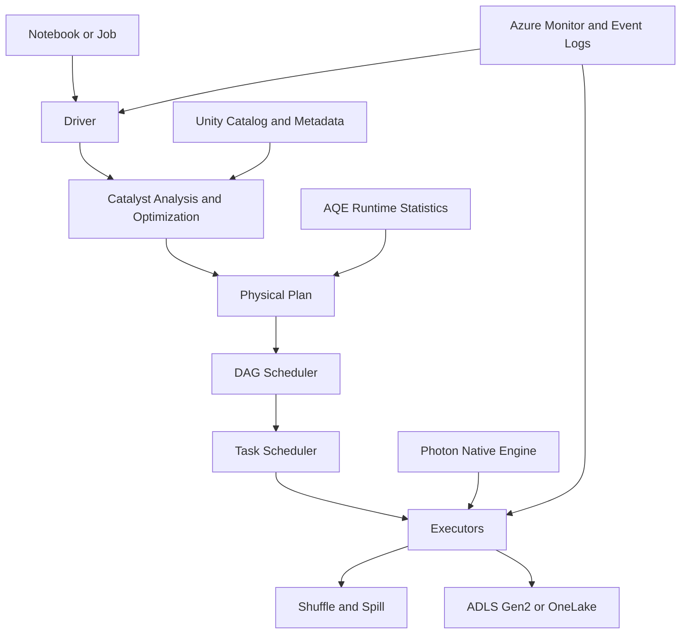
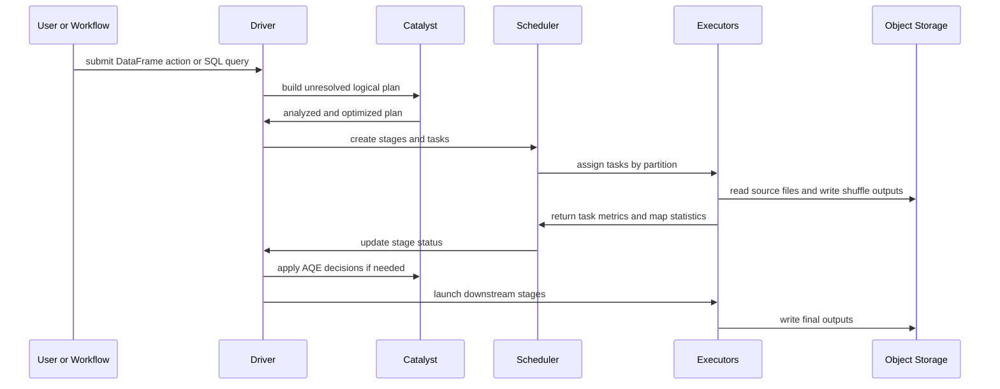
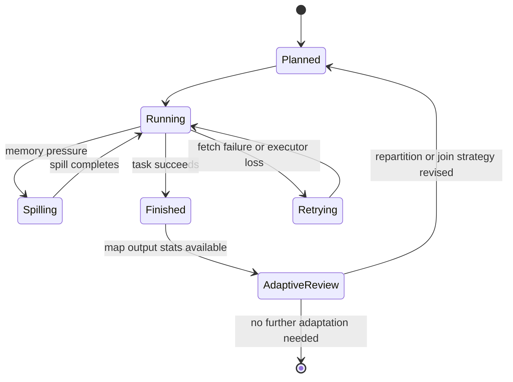

# Apache Spark Internals

> Part of the **Enterprise Data & AI Architecture Handbook** · Phase-05 - Modern Data Engineering & Lakehouse · Chapter 04.
> Estimated study time: **90 min reading + ~6h labs**.
> **Prerequisites:** read [Concurrency and Parallelism](../Phase-00/06_Concurrency_and_Parallelism.md) first.

---

## Executive Summary

Apache Spark internals matter because Spark performance failures are rarely fixed by adding more cores blindly. Production outcomes depend on how the driver builds a DAG, how Catalyst analyzes and rewrites plans, how Adaptive Query Execution adjusts runtime decisions, how Tungsten manages memory and code generation, and how shuffle behavior interacts with skew, spill, and object storage. Teams that understand those internals can usually explain why one job runs in eight minutes while an apparently similar job runs for two hours and exhausts the cluster.

For Azure-first enterprises, the most pragmatic Spark operating model is usually Azure Databricks as the primary execution platform, ADLS Gen2 or OneLake as the storage substrate, Delta tables as the dominant table abstraction, Unity Catalog plus Microsoft Purview as the governance layer, and Azure Monitor plus Databricks system tables as the operational telemetry surface. In that design, Spark is not treated as a black box. The runtime is an explicitly governed distributed engine whose scheduling, memory, and network behavior must be designed along with the data model.

The critical internal model is simple but unforgiving. The driver constructs and optimizes a plan. The DAG scheduler splits work into stages at shuffle boundaries. The task scheduler assigns tasks to executors, influenced by locality and cluster state. Executors run JVM or native engine operators, manage memory, spill when necessary, and exchange shuffle data over the network. AQE then re-optimizes using runtime statistics, and Photon may replace supported Spark SQL execution paths with a vectorized native engine. Every major runtime symptom maps to one of those control points.

This chapter focuses on the internals that most often determine production outcomes: driver and executor behavior, DAG construction, Catalyst and AQE, Tungsten and memory management, shuffle and skew, spill management, and Databricks Photon. The goal is not academic completeness. It is to give senior engineers and architects enough understanding to diagnose real jobs, choose the right Azure implementation, and decide when Spark is the correct engine and when it is not.

## Learning Objectives

By the end of this chapter you should be able to:

1. Explain how the driver, executors, and cluster manager cooperate during Spark job execution.
2. Describe how Spark transforms a logical query into stages and tasks.
3. Interpret Catalyst analysis, optimization, and physical planning at a production-useful level.
4. Explain what AQE changes at runtime and when it materially helps or fails to help.
5. Diagnose the runtime effects of Tungsten, whole-stage code generation, off-heap memory, and binary row formats.
6. Identify the practical causes of skew, spill, and long-tail shuffle tasks.
7. Explain how Photon differs from upstream Apache Spark execution and when it is worth enabling.
8. Tune Spark jobs on Azure Databricks using plan inspection, cluster sizing, layout improvements, and runtime configuration.
9. Distinguish when Spark is the correct engine from cases better served by warehouses, stream processors, or operational stores.
10. Defend Spark platform decisions in engineer, staff engineer, architect, and CTO review settings.

## Business Motivation

- Large analytical pipelines often fail because runtime costs and tail latency rise faster than data volume, and Spark internals determine that curve.
- Enterprise data platforms need one engine that can handle wide batch ETL, structured streaming, feature engineering, and large-scale SQL-style transformations.
- FinOps programs need predictable explanations for DBU, VM, and storage cost, which requires understanding where shuffle, scan, and spill costs originate.
- Lakehouse adoption increases the importance of Spark plan quality because open object storage makes bad layout and poor query planning more visible.
- AI and ML programs rely on reproducible large-scale feature preparation, and Spark internals determine whether those jobs stay reliable as volume grows.
- Teams migrating from warehouse-centric SQL often overestimate what Spark will optimize automatically; internal understanding closes that gap.
- Platform teams need operational standards for runtime versions, cluster policies, and performance debugging rather than relying on trial and error.

## History and Evolution

- Spark emerged as a response to MapReduce-era batch systems that wrote too much intermediate state to disk and made iterative workloads painfully slow.
- The original Resilient Distributed Dataset model emphasized lineage-based recovery and in-memory computation for iterative algorithms.
- Spark SQL introduced higher-level relational semantics and opened the path for Catalyst, which became the core optimization framework for DataFrames and SQL.
- Tungsten redesigned critical execution paths around CPU efficiency, binary row formats, off-heap memory, and code generation.
- Whole-stage code generation reduced virtual-function overhead by generating fused execution code for supported operators.
- AQE matured the engine further by letting Spark change selected physical execution decisions after runtime statistics become available.
- Structured Streaming unified incremental processing with the DataFrame engine.
- Databricks Photon extended the execution story in managed environments by replacing many supported Spark SQL operators with a native vectorized engine while preserving Spark API compatibility at the planning boundary.

## Why This Technology Exists

Spark exists because modern analytical workloads combine too much data, too many joins, and too many transformation steps for single-node processing to remain practical. Enterprises need a distributed engine that can express SQL-style plans, batch pipelines, and some streaming patterns without forcing every team to build low-level distributed systems logic themselves.

Its internals matter because distributed execution is dominated by coordination costs and data movement. Work must be partitioned, scheduled, shuffled, retried, and recombined. Memory pressure must be controlled. Runtime statistics must influence planning. If these concerns were hidden entirely, the engine would either be too rigid or too unpredictable for serious enterprise use.

Spark therefore exists as both a high-level developer abstraction and a low-level execution runtime. Catalyst abstracts relational reasoning. Tungsten abstracts efficient execution. DAG and task scheduling abstract distributed work allocation. AQE abstracts some runtime correction. But none of those abstractions are magic. Their trade-offs become visible the moment workloads become large, skewed, or operationally important.

## Problems It Solves

| Problem | How Spark internals address it | Production signal that it is working |
|---|---|---|
| Large joins and aggregations exceed one machine | partitions work across executors and stages | runtimes scale sublinearly instead of collapsing outright |
| Static plans are wrong for real data distributions | AQE can adapt partition counts and some join strategies at runtime | reduced small-task overhead and fewer pathological skew tails |
| JVM object overhead wastes CPU and memory | Tungsten uses compact binary formats and generated code | lower GC pressure and better CPU utilization |
| Repeated pipeline logic is hard to standardize | DataFrame and SQL plans route through common optimizer paths | common tuning patterns apply across teams |
| Object storage introduces variable latency | Spark pipelines can overlap compute and I/O at cluster scale | throughput remains acceptable despite cloud storage latency |
| Executor failure would otherwise restart entire jobs | lineage and stage retry isolate failures | one executor loss does not usually kill the whole job |
| Mixed batch and streaming data engineering needs | one engine supports both modes with shared abstractions | platform complexity stays lower than separate stacks for every domain |
| SQL users need distributed scale without low-level code | Catalyst plus SQL APIs provide a declarative surface | most business transformations are expressed without manual RDD logic |

## Problems It Cannot Solve

- It cannot make a poor data model efficient if the workload inherently requires massive unnecessary shuffles.
- It does not remove the need for good table layout, partitioning discipline, and file-size hygiene.
- It is not a substitute for low-latency OLTP systems, search engines, or serving caches.
- It cannot fully compensate for wrong business keys, missing ordering columns, or inconsistent source semantics.
- It does not eliminate network bottlenecks; wide transformations remain constrained by data exchange.
- It will not optimize arbitrary Python or Scala UDF chains into native vectorized plans.
- It is not the best default for tiny datasets, point lookups, or highly concurrent sub-second BI workloads.
- It does not prevent platform lock-in when proprietary accelerators such as Photon become part of the operating model.

## Core Concepts

### 8.1 Driver, executors, and cluster manager

The driver is the control plane of a Spark application. It holds the SparkSession, builds plans, coordinates execution, tracks stage state, and aggregates metrics. Executors are the distributed worker processes that execute tasks, store shuffle blocks, and manage memory. The cluster manager provides resources and process placement. In Azure Databricks this is abstracted behind the managed control plane, but the internal model still applies.

The prerequisite concepts in [Concurrency and Parallelism](../Phase-00/06_Concurrency_and_Parallelism.md) matter directly here. Spark combines coarse-grained parallelism across partitions with scheduler-level resource coordination. Confusing concurrency with useful parallelism is a common source of bad sizing decisions.

### 8.2 DAGs, stages, and tasks

Spark builds a DAG of transformations. Narrow dependencies, where each output partition depends on a small number of input partitions, can often stay within one stage. Wide dependencies, where data must be redistributed by key or ordering, create shuffle boundaries and therefore new stages. Tasks are the per-partition execution units scheduled within a stage.

The practical implication is that every wide operation should be treated as a design event. Group by, join, distinct, and repartition are not merely API calls. They are stage-shaping operations with network and spill consequences.

### 8.3 Lazy evaluation and plan materialization

Spark transformations are lazy until an action forces plan execution. This allows Catalyst to reason over larger plan fragments and to eliminate or reorder work before execution. It also means engineers sometimes misread the cost of a pipeline because nothing expensive happens until the terminal action causes the full DAG to be built.

### 8.4 Catalyst optimizer

Catalyst works in phases:

- parse SQL or DataFrame expressions into an unresolved logical plan,
- analyze the plan against catalogs, schemas, and functions,
- apply rule-based logical optimizations such as predicate pushdown, projection pruning, constant folding, and subquery rewriting,
- generate candidate physical plans,
- choose a physical plan using heuristics and cost-informed decisions where statistics exist.

Catalyst is powerful, but it is constrained by metadata quality, available statistics, and the structure of the expressed plan. It does not invent business logic or rescue opaque UDF-heavy transformations.

### 8.5 Adaptive Query Execution

AQE changes selected physical plan decisions during execution after map output statistics become available. It can:

- coalesce overly small shuffle partitions,
- split skewed partitions,
- switch some join strategies such as sort-merge to broadcast join when the realized size is small enough,
- improve stage parallelism after the initial static estimate proves wrong.

AQE is one of the most important modern Spark defaults, but it is not universal rescue. If a job is dominated by opaque UDF code, pathological keys, or bad source layout, AQE can only improve parts of the execution.

### 8.6 Tungsten, binary execution, and memory management

Tungsten reworked Spark execution around CPU and memory efficiency. Important elements include compact binary row formats such as UnsafeRow, off-heap memory options, cache-friendly processing, and whole-stage code generation. The goal is to reduce JVM object overhead, pointer chasing, and garbage-collection pressure.

In production terms, Tungsten is why seemingly minor design choices such as using built-in functions instead of UDFs can produce large runtime differences. Built-in expressions can stay on optimized execution paths. UDF-heavy logic often cannot.

### 8.7 Shuffle, skew, and spill

Shuffle is the movement of partitioned data across executors to satisfy wide dependencies. It is typically the dominant cost center in big Spark jobs because it combines serialization, network transfer, disk I/O, and often memory pressure.

Skew occurs when some keys or partitions are much larger than others. One or a few tasks then run far longer than the rest, often spilling repeatedly. Spill occurs when in-memory structures such as sort buffers, hash maps, or aggregation state exceed available execution memory and are written to disk. The presence of spill is not automatically a bug, but repeated heavy spill often signals a design or sizing problem.

### 8.8 Photon

Photon is Databricks' native vectorized execution engine for many Spark SQL and DataFrame workloads. It still depends on Spark planning boundaries, but supported operators execute in a native engine rather than the standard JVM path. In practice, Photon can materially improve SQL-style ETL, joins, and aggregations, especially when plans remain on supported built-in operators.

Photon is not upstream Apache Spark and should be treated as a managed-platform optimization rather than a portability assumption. Plans with unsupported operators, certain UDF patterns, or some specialized code paths may partially or fully fall back to standard Spark execution.

## Internal Working

### 9.1 Query compilation path

When a Spark SQL query or DataFrame action is issued, Spark first constructs a logical plan. Unresolved attribute references, functions, and table names are then analyzed against the catalog. Catalyst applies rule batches to simplify, reorder, and reduce the work where it safely can. The resulting optimized logical plan is then translated into a physical execution plan.

### 9.2 Physical planning and stage generation

The physical plan is composed of concrete operators such as scan, filter, project, broadcast hash join, sort-merge join, aggregate, or exchange. Exchange operators typically mark shuffle boundaries. The DAG scheduler takes this plan and segments it into stages such that each stage can run without further wide redistribution.

### 9.3 Task scheduling and locality

Within a stage, the task scheduler assigns tasks to executors based on locality, resource availability, and failures. The scheduler prefers process-local, node-local, rack-local, or remote placement in that order where the deployment model exposes those distinctions. In cloud environments, network topology and object-store access often reduce locality advantages relative to HDFS-era clusters, but shuffle locality and executor placement still matter materially.

### 9.4 Execution memory, spill, and shuffle persistence

Each executor manages memory for execution and storage. Sort buffers, hash maps, cached blocks, and shuffle buffers compete for finite space. When execution structures exceed their usable share, Spark spills to disk. Shuffle outputs are written, indexed, and fetched by downstream tasks. Sort-based shuffle dominates modern Spark because it scales more predictably than older strategies.

### 9.5 Runtime adaptation and engine fallback

AQE observes map output sizes and can re-plan selected downstream operations before the next stage starts. In Databricks, supported SQL operators may run under Photon while unsupported fragments fall back to the standard Spark engine. This means performance debugging must answer not only what the plan was, but which parts of the plan were actually executed by which engine path.

## Architecture

### 10.1 Azure Databricks reference architecture

The common Azure-first Spark architecture uses Azure Databricks as the managed execution plane, ADLS Gen2 as the primary storage substrate, Delta as the dominant table abstraction, Unity Catalog for access control and object governance, Purview for enterprise discovery and classification, and Azure Monitor plus Databricks system tables for platform telemetry. Jobs clusters or serverless workloads execute ETL and feature preparation, while SQL warehouses or semantic tools serve downstream consumers.

### 10.2 Fabric and Microsoft analytics variants

Microsoft Fabric and other Microsoft analytics surfaces expose Spark runtimes with different operational constraints. The internal planning model remains Spark-like, but runtime knobs, cluster control, and native accelerators differ. Fabric may reduce infrastructure assembly cost, but Azure Databricks usually exposes more direct control for deep Spark performance engineering and Photon-enabled optimization.

### 10.3 Open Spark on Kubernetes reference architecture

An enterprise open stack commonly pairs Spark on Kubernetes with object storage, a catalog or metastore, Airflow or another orchestrator, Prometheus, Grafana, and a Spark History Server. This architecture maximizes portability and component-level control, but it shifts responsibility for upgrades, shuffle behavior, observability, and incident response back to the platform team.

### 10.4 ADR example: standardize on Azure Databricks for Spark-heavy lakehouse workloads

**Context:** The enterprise runs multiple Spark-like workloads across inconsistent platforms. Teams debug performance mostly by increasing cluster size. Shuffle-heavy joins are unstable, runtime versions differ by team, and there is no common policy for AQE, Photon, or event-log retention. Some workloads are warehouse-friendly, but many require large-scale batch refinement and feature preparation on open storage.

**Decision:** Standardize Spark-heavy workloads on Azure Databricks Premium workspaces with governed runtime versions, Photon-enabled SQL-first jobs where supported, AQE enabled by default, Unity Catalog for data-plane governance, and cluster policies that constrain node families, autoscaling, and public networking. Allow open Spark on Kubernetes only for reviewed portability or sovereignty exceptions.

**Consequences:** Performance engineering becomes more repeatable, observability improves, and teams gain managed acceleration paths such as Photon. The estate accepts some platform-specific optimization and must manage Databricks-specific governance and cost controls explicitly.

**Alternatives considered:**

1. Remain on mixed unmanaged Spark platforms: rejected because operational inconsistency is already the dominant cost.
2. Use only warehouse-native ELT: rejected because several workloads require large-scale transformation, feature engineering, or custom execution patterns that exceed warehouse fit.
3. Standardize only on open Spark on Kubernetes: rejected as the default because the platform team does not want to own every scheduler, upgrade, and deep runtime concern for all domains.

## Components

| Component | Primary role | Why it matters operationally | Typical failure mode |
|---|---|---|---|
| Driver | builds plans and coordinates execution | control-plane correctness and memory are critical | driver OOM or excessive plan complexity |
| Cluster manager | allocates executor resources | determines elasticity and placement | slow scale-up or poor quota planning |
| Executor | runs tasks and holds blocks | actual compute, spill, and shuffle work happen here | executor OOM or repeated loss |
| DAGScheduler | segments jobs into stages | wide dependencies become stage boundaries | too many shuffle stages or misread bottlenecks |
| TaskScheduler | places tasks on executors | locality and retries influence runtime tails | skewed or repeatedly failing tasks |
| Catalyst | analyzes and optimizes plans | plan quality strongly affects scan and shuffle cost | opaque UDFs and weak statistics reduce benefit |
| Tungsten | optimizes memory and CPU paths | reduces JVM overhead | fallback to slower execution paths |
| AQE | adjusts some physical decisions at runtime | helps with skew and over-partitioning | limited benefit when core logic is wrong |
| Shuffle subsystem | redistributes wide dependencies | dominant cost center for big jobs | spill, skew, and fetch failures |
| Photon | native Databricks execution path | accelerates supported SQL/DataFrame plans | fallback on unsupported operators |
| Spark UI and event logs | runtime diagnostics | required for real debugging | disabled or low-retention telemetry |
| Catalog and table metadata | resolution and statistics | influences plan quality and governance | stale stats or weak ownership |

## Metadata

Spark performance depends on more metadata than many teams realize.

Important metadata classes include:

- catalog metadata such as schemas, table definitions, file locations, and function registrations,
- statistical metadata such as table size, row counts, column histograms where available, and file-level min or max values,
- runtime metadata such as stage IDs, task IDs, spill metrics, and shuffle map-output statistics,
- operational metadata such as runtime version, cluster policy, job ID, notebook revision, and commit SHA,
- governance metadata such as owner, sensitivity classification, and approved serving surface.

AQE is especially sensitive to runtime metadata quality because its adaptive choices depend on realized partition sizes. Event logs and Databricks system tables are equally important for debugging because they preserve the evidence required to explain long-tail tasks, fetch failures, and repeated executor loss.

## Storage

Spark is compute-centric, but storage behavior shapes most real performance outcomes.

| Storage concern | Internal role | Azure-first recommendation | Common failure |
|---|---|---|---|
| Source files on object storage | scan input for DataFrames and SQL | use ADLS Gen2 with disciplined file sizes and hierarchical namespace | many tiny files and poor pruning |
| Table transaction logs | resolve valid table state and statistics | keep Delta logs healthy and avoid path-based chaos | metadata bloat and slow planning |
| Local executor disks | hold shuffle and spill data | prefer worker families with adequate local storage for shuffle-heavy jobs | spill storms and disk saturation |
| Cache and persisted datasets | reuse expensive intermediate results | cache only after filters and only if reused | caching everything and evicting useful blocks |
| Checkpoints | bound lineage and recover stateful jobs | isolate checkpoint paths and govern retention | checkpoint corruption or overgrowth |
| Event logs | preserve execution evidence | persist to durable storage for history retention | no forensic trail after failures |

ADLS Gen2 is a practical advantage for Azure-first Spark because hierarchical namespace and robust directory semantics reduce some of the output-commit and rename pain associated with less filesystem-like object-store behavior. That does not remove small-file problems, but it does simplify some write paths relative to platforms that emulate rename less directly.

## Compute

Spark compute planning is mostly about balancing CPU, memory, network throughput, and local disk for the workload shape.

| Workload shape | Recommended Azure-first compute posture | Why it fits | Common wrong choice |
|---|---|---|---|
| General ETL with moderate joins | Photon-enabled jobs cluster on Azure Databricks with autoscaling | strong default for SQL and DataFrame pipelines | using a fixed oversized all-purpose cluster |
| Very wide joins and heavy spill risk | memory-leaning worker families and larger local disk budgets | reduces spill pressure and executor churn | CPU-heavy nodes with insufficient memory |
| High-concurrency SQL-style transformations | Databricks SQL or serverless compute where appropriate | isolates serving from engineering workloads | running everything on shared notebooks |
| Experimental notebooks | small auto-terminating interactive clusters | controls cost and noisy neighbors | leaving exploratory clusters running indefinitely |
| Open portability workloads | Spark on Kubernetes with explicit executor sizing | reproducible open-stack behavior | under-instrumented containers with no history retention |

The dominant sizing mistake is treating executor count as the only performance dial. Memory overhead, shuffle disk, task concurrency per executor, and network saturation frequently dominate before pure core count does.

## Networking

Spark networking matters most during shuffle, remote reads, and control-plane communication.

Recommended Azure networking principles:

- use private connectivity for storage, governance, and supporting services,
- keep Spark compute and primary storage in the same region unless a deliberate data-residency design requires otherwise,
- use no-public-IP or VNet-injected workspace patterns in regulated environments,
- understand that shuffle-heavy jobs are often limited by east-west bandwidth rather than raw CPU,
- isolate high-concurrency BI-serving paths from heavy ETL traffic where the platform exposes separate surfaces,
- budget for DNS and endpoint stability because data-path incidents are often misdiagnosed as Spark failures when the real issue is network resolution or service reachability.

In open Kubernetes deployments, network policy, pod-to-pod throughput, and storage endpoint locality become first-order design concerns. Spark does not hide a weak network fabric.

## Security

Security for Spark is partly about data access and partly about execution isolation.

| Concern | Azure-first control |
|---|---|
| cluster identity and secret access | managed identity where supported, otherwise Key Vault-backed secret scopes |
| data object permissions | Unity Catalog grants, storage credentials, and external locations |
| network exposure | private endpoints, disabled public network access, VNet injection where required |
| code and library governance | cluster policies, approved libraries, CI or CD for jobs and notebooks |
| auditability | workspace audit logs, storage access logs, job ownership, and catalog lineage |
| sensitive intermediate data | encrypted storage, restricted scratch paths, and limited checkpoint access |

The internal lesson is that execution environments are part of the attack surface. A Spark cluster that can reach too much data or install arbitrary code by default is both a governance and a security defect.

## Performance

Performance work should start with plan shape, not folklore.

| Lever | Why it matters internally | Expected effect |
|---|---|---|
| built-in expressions over UDFs | preserves Catalyst and codegen optimization paths | lower CPU cost and better vectorization |
| correct join strategy | reduces unnecessary shuffle and sort work | shorter wide stages |
| AQE enabled | fixes some static misestimates at runtime | fewer tiny shuffle tasks and better skew handling |
| file-size discipline | lowers task scheduling overhead and metadata scanning | smoother parallelism and less small-file overhead |
| selective caching | avoids recomputing expensive reused stages | lower repeat cost when reuse is real |
| pre-aggregation before wide joins | shrinks shuffle volume early | materially less network and spill cost |
| Photon on supported plans | uses native vectorized execution | faster SQL-style ETL and aggregations |
| cluster isolation by workload | prevents dashboard and notebook interference | fewer noisy-neighbor regressions |

The practical workflow is to inspect the plan, read Spark UI metrics, identify whether the bottleneck is scan, shuffle, spill, skew, or CPU, and only then tune configuration or layout. Most wasted tuning effort starts by changing cluster size without proving which subsystem is saturated.

## Scalability

Spark scales well when both the engine and the surrounding platform are standardized.

Key scaling pressures include:

- number of partitions and files,
- number of stages and total task count,
- metadata and catalog volume,
- size and complexity of generated plans,
- concurrency of many independent jobs,
- rate of schema and layout change,
- cross-team variance in runtime standards.

At enterprise scale, scheduler overhead and metadata management often become more important than raw per-task execution time. A platform with thousands of tiny files, unbounded task counts, and inconsistent cluster policies can appear to have a Spark problem when it actually has a platform-standardization problem.

## Fault Tolerance

Spark fault tolerance is based on lineage, stage boundaries, retry logic, and durable storage.

| Failure mode | Internal response | Design implication |
|---|---|---|
| executor loss | retry affected tasks or stages on remaining executors | one node failure should not imply full job loss |
| transient fetch failure | retry downstream shuffle fetch or recompute lost shuffle outputs | unstable shuffle surfaces need investigation, not just retries |
| driver failure | application usually fails because the control plane is lost | driver sizing and stability matter more than many teams assume |
| corrupted input or bad records | query may fail unless guarded by quality or permissive parsing | raw ingestion needs quarantine strategies |
| extremely long lineage chains | recomputation becomes expensive | checkpoint selected workloads and bound lineage depth |
| skew-induced stragglers | job technically continues but tail latency explodes | resilience and performance are coupled in wide stages |

Barrier execution, streaming state, and external side effects need additional care because standard retry behavior is not always sufficient to preserve semantics.

## Cost Optimization

Spark costs are driven mainly by scan volume, shuffle volume, cluster-hours, and platform inefficiency.

High-value cost levers:

- reduce wide shuffles before increasing cluster size,
- keep file sizes in a healthy range so the scheduler is not paying to manage millions of fragments,
- use Photon for supported SQL-style plans when the workload benefits,
- keep interactive and production workloads on separate compute policies,
- auto-terminate exploratory clusters aggressively,
- avoid repeated cache or persist of large datasets without measured reuse,
- use AQE and pruning-friendly layout to reduce wasted work,
- standardize runtime defaults so teams do not rediscover the same expensive anti-patterns.

| Lever | Benefit | Risk if overused |
|---|---|---|
| Photon-enabled jobs | lower runtime for supported operators | portability assumptions can drift |
| autoscaling job clusters | reduces idle cost | cold start or scale lag may affect small jobs |
| broadcast joins where safe | avoids large shuffle cost | oversized broadcasts can destabilize executors |
| storage layout maintenance | lower scan and planning cost | maintenance jobs themselves can become expensive |
| isolated SQL warehouses | shields BI users from ETL contention | separate serving layers can increase platform sprawl |

Worked FinOps example: assume an Azure Databricks nightly transformation currently runs on an autoscaling cluster that averages 18 worker-hours plus 2 driver-hours per run at an illustrative blended cost of $14 per cluster-hour, including platform and infrastructure charges. At two runs per day, monthly cost is roughly $16,800. Spark UI shows 42 percent of executor time is spent in spill-heavy shuffle stages, with one skewed join dominating the tail. After pre-aggregating one fact stream, enabling AQE skew handling, replacing a Python UDF with built-in expressions, and moving the supported plan to Photon-enabled compute, average runtime drops so the same workload now consumes 9 worker-hours plus 1 driver-hour per run. Monthly cost falls to roughly $8,400. The lesson is not the exact price. It is that internal plan shape usually matters more than simply purchasing a larger cluster.

## Monitoring

Monitoring should answer whether Spark jobs are healthy against explicit expectations.

Minimum signals:

- job duration and stage duration trends,
- executor CPU, memory, and GC time,
- shuffle read, shuffle write, and fetch wait time,
- memory and disk spill volume,
- skew indicators such as max task time versus median task time,
- failed task and retry counts,
- cluster start latency and autoscaling behavior,
- Photon versus non-Photon execution where exposed,
- cost per job, domain, and environment.

| Area | Metric | Alert example |
|---|---|---|
| DAG execution | stage p95 duration | stage runtime doubles relative to baseline |
| memory health | spill bytes and GC time | spill exceeds policy threshold |
| shuffle health | fetch wait and failed fetches | repeated fetch failures in one workflow |
| task balance | skew ratio of longest task to median | tail task ratio exceeds expected band |
| platform cost | cost per successful run | sudden spend increase without code change |
| control plane | driver memory and job failure rate | driver OOM recurrence |

## Observability

Observability should explain why the engine slowed down, not just that it did.

Useful observability practices:

- retain Spark event logs long enough for post-incident comparison,
- persist plan text or explain output for critical jobs on each release,
- correlate runtime changes with code, data volume, and layout changes,
- capture cluster policy, runtime version, and configuration alongside job results,
- record whether unsupported operators forced part of a Photon-eligible workflow back onto standard execution,
- tie job metrics to business outputs so platform regressions are visible before executives see stale dashboards.

### Operational Response Playbook

| Signal | Detection query or check | Immediate remediation |
|---|---|---|
| One stage runs far longer than the others | inspect Spark UI task timeline and compare max task duration to median | identify skewed keys, pre-aggregate, or enable or tune AQE skew handling |
| Executor OOM after a join release | compare plan before and after change, inspect join strategy and spill metrics | reduce partition size, change join shape, remove oversized broadcast, or resize executor memory |
| Sudden loss of expected Photon acceleration | inspect physical plan and runtime metadata for unsupported operators | replace opaque UDF logic where possible and revalidate runtime engine eligibility |
| Many tiny tasks with low CPU utilization | inspect file counts, partition sizes, and post-shuffle partition count | compact files, coalesce partitions via AQE, and fix upstream layout |
| Repeated fetch failures from one workflow | inspect executor loss, disk pressure, and network errors around shuffle stages | stabilize worker disk or network surfaces and rerun from the affected stage boundary |

Monitoring tells you the job is slower. Observability tells you whether the cause is skew, changed join strategy, storage fragmentation, driver pressure, or platform configuration drift.

## Governance

Spark governance is the discipline that prevents every team from becoming its own runtime vendor.

Core rules:

- approve a small set of runtime versions and deprecate them deliberately,
- enforce cluster policies for node families, autoscaling limits, and public networking,
- require explain-plan review for business-critical or high-cost jobs,
- control library installation and ban unreviewed init-script sprawl,
- define which workloads may use Photon, serverless, or open-stack exceptions,
- store job definitions and notebooks in version control with promotion gates,
- retain event logs and metrics as production records, not ephemeral artifacts,
- require ownership for every production workflow and clear SLOs for cost and latency.

Without governance, Spark degenerates into a set of expensive clusters whose behavior varies more by team habit than by workload need.

## Trade-offs

| Benefit | Trade-off | When the trade-off is acceptable |
|---|---|---|
| one engine for many large-scale transforms | engine complexity is high | when platform teams can support runtime standards |
| declarative APIs with distributed scale | performance is not self-evident | when teams invest in plan inspection and standards |
| open storage compatibility | object-store inefficiencies become visible | when layout and file maintenance are disciplined |
| managed acceleration such as Photon | some optimizations are platform-specific | when the estate is already Azure Databricks-centric |
| resilient retry model | driver remains a critical failure point | when driver sizing and stability are treated seriously |
| strong SQL support | low-latency point lookup remains weak | when workloads are analytical rather than transactional |

## Decision Matrix

| Scenario | Recommended choice | Why | When not to use Spark |
|---|---|---|---|
| large batch ETL over lakehouse tables | Azure Databricks with AQE and Photon where supported | best balance of scale, governance, and managed performance | if a warehouse-native transformation already meets the need cheaply |
| deep portability requirement | open Spark on Kubernetes | preserves engine-level control and neutrality | if the platform team cannot operate the stack reliably |
| ad hoc dashboard serving with high concurrency | SQL warehouse or semantic serving layer, not raw Spark clusters | isolates serving patterns better | if sub-second concurrency is the primary requirement |
| online scoring or point lookups | specialized serving store | Spark is not a low-latency online engine | if operational latency is under tens of milliseconds |
| small static datasets | single-node or warehouse compute | Spark overhead may dominate | if distributed execution adds more complexity than value |
| heavy custom SQL-style ETL in Azure | Photon-enabled Databricks jobs | native acceleration often helps materially | if the plan is dominated by unsupported UDFs |

## Design Patterns

1. Filter and project before wide exchange: reduce payload before any repartition, join, or aggregation.
2. Broadcast small dimensions deliberately: avoid large shuffle joins when one side is provably small.
3. Pre-aggregate before joining large facts: shrink the wide stage early.
4. Separate Python boundaries from core relational work: keep most of the plan on Catalyst and codegen-friendly paths.
5. Persist only reused, post-filtered intermediates: cache where recomputation cost is proven.
6. Standardize runtime defaults with AQE enabled: platform consistency beats per-team tuning folklore.
7. Keep event-log and explain-plan evidence: performance reviews need artifacts, not memory.
8. Use specialized serving layers after gold publication: do not force Spark to solve operational serving problems it was not built for.

## Anti-patterns

1. Calling `collect()` on large production datasets.
2. Writing `coalesce(1)` for convenience on significant outputs.
3. Using Python UDFs for logic that built-in functions already cover.
4. Repartitioning repeatedly without proving the new partitioning helps.
5. Treating AQE as a substitute for data-model and layout discipline.
6. Running critical ETL on shared all-purpose clusters with notebooks and ad hoc users.
7. Ignoring skew because average task duration looks acceptable.
8. Enabling every cache or persistence option by habit.

## Common Mistakes

1. Reading only total job runtime and not stage or task distribution.
2. Choosing huge executors that increase GC and reduce failure isolation.
3. Choosing tiny executors that spend too much time in scheduler overhead and remote reads.
4. Forgetting that millions of tiny files can dominate scheduling cost before compute even begins.
5. Assuming object storage throughput is free just because the engine is distributed.
6. Trusting inferred join strategies without verifying the actual physical plan.
7. Leaving driver memory undersized for complex plans or metadata-heavy workloads.
8. Using skewed natural keys without salting, pre-aggregation, or domain-specific mitigation.
9. Confusing success with efficiency because a job eventually completes.
10. Assuming Databricks Photon will accelerate unsupported custom operator patterns automatically.

## Best Practices

1. Start every tuning session with `EXPLAIN FORMATTED` or equivalent plan inspection.
2. Compare median task time to max task time to identify skew quickly.
3. Use built-in Spark SQL functions whenever possible.
4. Keep runtime versions and cluster policies narrow and deliberate.
5. Separate engineering, serving, and experimentation compute surfaces.
6. Persist event logs and key metrics for every production workflow.
7. Tune partition count and file size from measured data volume, not inherited defaults.
8. Revalidate physical plans after schema or layout changes, not only after code changes.
9. Treat driver sizing as a production architecture decision.
10. Use proprietary acceleration only where the operational benefit outweighs portability loss.

## Enterprise Recommendations

- Make Azure Databricks the default Spark platform when the estate is already Azure-first and Spark-heavy.
- Standardize on Photon-enabled compute for supported SQL-style ETL unless a portability constraint forbids it.
- Require event-log retention, explain-plan capture, and job-cost attribution for all critical workflows.
- Define approved executor and node-family templates by workload class rather than letting every team improvise.
- Teach engineers to diagnose shuffle, skew, and spill from Spark UI before they are allowed to tune production jobs.
- Treat cluster policies as governance artifacts, not convenience settings.
- Move low-latency or high-concurrency serving needs to purpose-built services after Spark has produced the governed data product.
- Keep open-stack Spark as an exception path with explicit support commitments.

## Azure Implementation

### Service map

| Spark concern | Azure Databricks-first implementation | Microsoft platform alternative |
|---|---|---|
| managed Spark runtime | Azure Databricks Premium workspace | Fabric Spark runtime |
| storage substrate | ADLS Gen2 | OneLake |
| governed table access | Unity Catalog plus Purview | Fabric governance surfaces plus Purview |
| event-log and metrics retention | Databricks system tables, Azure Monitor, Log Analytics | Fabric monitoring plus Azure Monitor integration |
| SQL-style acceleration | Photon-enabled jobs or SQL warehouses | Fabric engine optimizations, without Photon parity |
| orchestration | Databricks Workflows, ADF, Azure DevOps, GitHub Actions | Fabric pipelines |

### Azure CLI: create a baseline Premium Databricks workspace

```bash
az databricks workspace create \
  --resource-group rg-data-prod \
  --name adb-prod-spark \
  --location westeurope \
  --sku premium \
  --managed-resource-group rg-data-prod-managed
```

### Cluster policy JSON: Photon-enabled autoscaling jobs baseline

```json
{
  "spark_version": {
    "type": "fixed",
    "value": "auto:latest-lts"
  },
  "node_type_id": {
    "type": "allowlist",
    "values": [
      "Standard_D16ds_v5",
      "Standard_E16ds_v5"
    ],
    "defaultValue": "Standard_D16ds_v5"
  },
  "runtime_engine": {
    "type": "fixed",
    "value": "PHOTON"
  },
  "autoscale.min_workers": {
    "type": "fixed",
    "value": 2
  },
  "autoscale.max_workers": {
    "type": "fixed",
    "value": 12
  },
  "autotermination_minutes": {
    "type": "fixed",
    "value": 20
  },
  "data_security_mode": {
    "type": "fixed",
    "value": "SINGLE_USER"
  }
}
```

### PySpark: inspect plan and enforce key AQE defaults

```python
spark.conf.set("spark.sql.adaptive.enabled", "true")
spark.conf.set("spark.sql.adaptive.coalescePartitions.enabled", "true")
spark.conf.set("spark.sql.adaptive.skewJoin.enabled", "true")
spark.conf.set("spark.sql.files.maxPartitionBytes", 134217728)

fact = spark.table("prod.sales.orders")
dim = spark.table("prod.ref.customers")

query = (
    fact.filter("order_date >= date_sub(current_date(), 30)")
        .join(dim.hint("broadcast"), "customer_id", "left")
        .groupBy("customer_segment")
        .sum("gross_revenue")
)

query.explain("formatted")
```

### Databricks SQL: runtime settings for a tuning session

```sql
SET spark.sql.adaptive.enabled = true;
SET spark.sql.adaptive.coalescePartitions.enabled = true;
SET spark.sql.adaptive.skewJoin.enabled = true;
SET spark.sql.autoBroadcastJoinThreshold = 52428800;

EXPLAIN FORMATTED
SELECT
  c.customer_segment,
  SUM(o.gross_revenue) AS revenue_30d
FROM prod.sales.orders o
LEFT JOIN prod.ref.customers c
  ON o.customer_id = c.customer_id
WHERE o.order_date >= current_date() - INTERVAL 30 DAYS
GROUP BY c.customer_segment;
```

Fabric implementation note: Fabric exposes Spark runtimes for notebooks and pipelines, but deep internals tuning is generally less explicit than in Azure Databricks. If the platform goal is managed Spark internals engineering with Photon, cluster policies, and explicit runtime control, Azure Databricks remains the stronger default.

## Open Source Implementation

An open implementation is justified when portability, sovereignty, or component-level control are first-order constraints.

Reference stack:

- Spark on Kubernetes,
- object storage such as MinIO or cloud-native object stores,
- Hive metastore, Iceberg REST catalog, or another approved catalog path,
- Airflow or Argo Workflows for orchestration,
- Prometheus and Grafana for metrics,
- Spark History Server for event-log review,
- OpenTelemetry for unified observability where the platform supports it.

### `spark-submit` example for Kubernetes

```bash
spark-submit \
  --master k8s://https://kubernetes.default.svc \
  --deploy-mode cluster \
  --name spark-etl-orders \
  --conf spark.executor.instances=6 \
  --conf spark.executor.memory=8g \
  --conf spark.executor.cores=4 \
  --conf spark.sql.adaptive.enabled=true \
  --conf spark.sql.adaptive.skewJoin.enabled=true \
  --conf spark.eventLog.enabled=true \
  --conf spark.eventLog.dir=s3a://spark-event-logs/ \
  --conf spark.kubernetes.container.image=registry.example.com/spark:3.5.1 \
  local:///opt/spark/jobs/orders_etl.py
```

### SparkApplication example for Spark Operator

```yaml
apiVersion: sparkoperator.k8s.io/v1beta2
kind: SparkApplication
metadata:
  name: orders-etl
spec:
  type: Python
  mode: cluster
  image: registry.example.com/spark:3.5.1
  mainApplicationFile: local:///opt/spark/jobs/orders_etl.py
  sparkVersion: 3.5.1
  restartPolicy:
    type: OnFailure
  driver:
    cores: 2
    memory: 4g
    serviceAccount: spark-runner
  executor:
    cores: 4
    instances: 6
    memory: 8g
  sparkConf:
    spark.sql.adaptive.enabled: "true"
    spark.sql.adaptive.coalescePartitions.enabled: "true"
    spark.eventLog.enabled: "true"
    spark.eventLog.dir: s3a://spark-event-logs/
```

### Prometheus JMX exporter snippet

```yaml
rules:
  - pattern: 'metrics<name=(jvmGCTime|memoryBytesSpilled|diskBytesSpilled|shuffleReadBytes|shuffleWriteBytes)><>Value'
    name: spark_$1
    type: GAUGE
```

The warning is operational rather than ideological: an open stack can match Spark semantics well, but only if the platform team is prepared to operate scheduler integration, images, metrics, event-log retention, storage credentials, upgrades, and incident response as production services.

## AWS Equivalent (comparison only)

| Azure-first surface | AWS equivalent | Comparison note |
|---|---|---|
| Azure Databricks | Databricks on AWS or EMR | Databricks preserves more cross-cloud runtime parity; EMR gives more native AWS assembly choices |
| ADLS Gen2 | Amazon S3 | similar durable storage role, but rename and commit-path behavior differ materially |
| Unity Catalog | Lake Formation plus Glue Data Catalog | similar governance intent with different control-plane behavior |
| Azure Monitor plus Log Analytics | CloudWatch plus related analytics tooling | both can monitor Spark, but integrations differ |
| Photon-enabled Databricks jobs | Photon-enabled Databricks jobs on AWS | similar managed acceleration path in Databricks-managed environments |
| ADF or Databricks Workflows | Step Functions, MWAA, or Databricks Workflows | orchestration fit depends on platform standardization |

Selection criteria: if migrating to AWS, preserve plan-inspection, event-log retention, runtime governance, and workload isolation practices first. Merely mapping workspace names and storage endpoints does not preserve Spark operational quality.

## GCP Equivalent (comparison only)

| Azure-first surface | GCP equivalent | Comparison note |
|---|---|---|
| Azure Databricks | Databricks on GCP or Dataproc | Databricks keeps stronger cross-cloud parity; Dataproc favors more native Google assembly |
| ADLS Gen2 | Google Cloud Storage | similar object-store role, different operational and commit-path trade-offs |
| Unity Catalog | Dataplex plus Data Catalog | governance is improving but remains a different control-plane model |
| Azure Monitor plus Log Analytics | Cloud Monitoring plus Cloud Logging | comparable monitoring role with different integrations |
| Photon-enabled jobs on Databricks | Photon-enabled jobs on Databricks | similar managed acceleration within Databricks-managed environments |
| Databricks Workflows or ADF | Cloud Composer, Workflows, or Databricks Workflows | orchestration choice depends on the wider platform estate |

Selection criteria: GCP migrations often tempt teams to collapse Spark-heavy transformations into BigQuery-only patterns. That may be right for some workloads, but the decision should follow workload shape, not vendor symmetry assumptions.

## Migration Considerations

Recommended migration sequence:

1. Inventory current Spark or Spark-like workloads, runtime versions, and top-cost jobs.
2. Capture baseline explain plans, Spark UI metrics, cost, and job failure modes before any migration.
3. Standardize cluster policies, event-log retention, and AQE defaults before chasing deep tuning.
4. Move one representative shuffle-heavy workload to the target Azure Databricks pattern and validate cost and runtime.
5. Introduce Photon selectively for supported SQL-heavy jobs and compare physical plans and runtimes.
6. Separate notebook experimentation from production jobs early so migration noise does not distort results.
7. Retire unmanaged or inconsistent clusters only after observability and rollback paths are proven.

Migration warnings:

- do not compare platforms using tiny benchmark datasets,
- do not accept "the job passed" as evidence of performance equivalence,
- do not migrate without preserving event logs and plan artifacts,
- do not assume Spark portability means operational parity.

## Mermaid Architecture Diagrams

### Spark execution architecture



### Query execution sequence



### Task and adaptation state model



## End-to-End Data Flow

An end-to-end Spark SQL workload typically proceeds as follows:

1. A workflow submits a SQL query or DataFrame action to the driver.
2. The driver builds an unresolved logical plan.
3. Catalyst analyzes identifiers, schemas, and functions against the catalog.
4. Catalyst rewrites the logical plan through optimization rule batches.
5. Spark generates one or more candidate physical plans.
6. The chosen physical plan inserts exchanges where wide dependencies require shuffle.
7. The DAG scheduler converts the plan into stages separated by shuffle boundaries.
8. The task scheduler assigns per-partition tasks to executors.
9. Executors read input files, run generated or native operators, and emit shuffle outputs.
10. Runtime statistics flow back to the driver and may trigger AQE changes.
11. Downstream stages fetch shuffle data, complete aggregations or joins, and write outputs.
12. Event logs and metrics persist execution evidence for later debugging and cost review.

## Real-world Business Use Cases

| Use case | Why Spark internals matter |
|---|---|
| lakehouse ETL and medallion promotion | wide joins, incremental merges, and file layout determine job stability and cost |
| customer 360 and entity conformance | skewed identities and large joins stress shuffle behavior |
| feature engineering for ML | reproducibility, large aggregations, and cost-efficient batch computation depend on plan quality |
| clickstream and telemetry enrichment | file counts, late data, and partition sizing determine throughput |
| financial reconciliation | deterministic joins and fault tolerance matter more than raw throughput alone |
| backfills and audit replay | lineage, checkpointing, and storage layout determine operational feasibility |

## Industry Examples

- Retail: order, returns, pricing, and loyalty pipelines rely on Spark joins and aggregations where skewed customers and promotions can dominate shuffle cost.
- Banking: transaction normalization and regulatory reporting depend on deterministic large-scale joins and strong retry behavior.
- Telecommunications: network event enrichment requires careful stage planning and spill management for very wide fact data.
- Manufacturing: sensor and maintenance pipelines benefit when Spark separates raw ingestion from heavy conformance and aggregation work.
- Healthcare: claims and encounter integration often reveals why Catalyst-friendly SQL and careful partition design outperform opaque UDF pipelines.

## Case Studies

### Case study 1: public large-scale Spark operators and the small-file problem

Public engineering material from large Spark operators such as Netflix and Uber has consistently shown that file and metadata scale can dominate runtime long before raw compute is exhausted. The lesson is that a cluster with many cores still performs badly if each job must schedule and open enormous numbers of tiny files. Spark internals reward upstream layout discipline more than reactive cluster scaling.

### Case study 2: Databricks Photon for SQL-heavy Azure transformations

Public Databricks guidance and customer case material repeatedly show a consistent pattern: SQL-heavy ETL with built-in operators often benefits materially from Photon, while Python UDF-heavy plans or unsupported operators benefit much less. The lesson is that Photon is strongest when the workload stays close to optimized Spark SQL semantics rather than escaping into opaque code paths.

### Case study 3: common enterprise failure story in shuffle-heavy joins

A recurring failure pattern in enterprise Spark estates is a fact-to-fact join on a heavily skewed business key, followed by a wide aggregation and a Python UDF. The job technically succeeds in testing but spills heavily in production, one reducer runs dramatically longer than the rest, and engineers respond by doubling cluster size. The durable fix is usually architectural: pre-aggregate, isolate or remove the UDF, validate join cardinality, and let AQE work on a healthier plan shape.

## Hands-on Labs

### Lab 1: inspect plans and Spark UI

Goal: learn to connect explain plans to observed stage behavior.

Tasks:

1. Run a join and aggregation query on Azure Databricks.
2. Capture `EXPLAIN FORMATTED` output before execution.
3. Inspect stage boundaries, shuffle exchanges, and task timelines in Spark UI.
4. Explain which operator or exchange dominated runtime.

Expected outcome: you can map logical and physical plans to actual stage execution.

### Lab 2: reproduce and fix skew

Goal: observe long-tail tasks and mitigate them.

Tasks:

1. Create a skewed dataset with one hot key.
2. Join it to a moderately large dimension.
3. Compare runtime with AQE off and AQE on.
4. Apply salting or pre-aggregation and compare spill and tail-task behavior.

Expected outcome: you can explain skew from task metrics rather than intuition.

### Lab 3: compare standard execution and Photon

Goal: measure the effect of managed native acceleration.

Tasks:

1. Run one SQL-heavy ETL query on a standard Spark path.
2. Run the same workload on Photon-enabled Azure Databricks compute.
3. Inspect plan shape, runtime, and operator support.
4. Note where custom logic limited the acceleration.

Expected outcome: you understand when Photon is a major accelerator and when it is not.

### Lab 4: run Spark on Kubernetes with event-log retention

Goal: understand the operational differences of an open stack.

Tasks:

1. Submit a Spark job through the Spark Operator.
2. Persist event logs to object storage.
3. View the run in Spark History Server.
4. Compare what you must operate yourself versus what Azure Databricks manages.

Expected outcome: you can articulate the operational trade-off between managed and open Spark deployments.

## Exercises

1. Explain why a shuffle boundary creates a new stage.
2. Compare narrow and wide dependencies using one real data-engineering example each.
3. Describe how AQE can change a join strategy after execution has started.
4. List three reasons a Python UDF can hurt performance beyond raw CPU cost.
5. Design a tuning approach for a job that spills heavily but does not fail.
6. Explain why driver memory can become a bottleneck even when executors look healthy.
7. Compare Photon acceleration with standard Spark execution for a SQL-heavy workload.
8. Propose a monitoring dashboard for skew, spill, and fetch-failure visibility.

## Mini Projects

1. Build a Spark performance diagnostics kit that stores explain plans, stage metrics, and cost trends for production jobs.
2. Create a benchmark suite comparing shuffle-heavy workloads across standard Spark and Photon-enabled Azure Databricks clusters.
3. Build an open-stack Spark on Kubernetes reference environment with History Server, Prometheus, and Grafana dashboards.

## Capstone Integration

This chapter should be used as the execution-engine lens for larger data-platform decisions.

- Use [Concurrency and Parallelism](../Phase-00/06_Concurrency_and_Parallelism.md) to reason about locality, parallel work, contention, and throughput limits.
- Pair Spark internals with lakehouse, medallion, and table-format design work when deciding where wide transformations, incremental merges, and feature preparation should run.
- Use the Spark diagnostics approach from this chapter to validate whether platform-level architecture choices are operationally defensible.

Capstone deliverable: choose one high-cost Spark workload, document its physical plan and stage behavior, redesign the worst shuffle path, compare cost and runtime before and after, and defend the target platform choice in an architecture review.

## Interview Questions

1. What is the difference between the driver and an executor?
2. Why do joins and group by operations often create new stages?
3. What does Catalyst optimize, and what can it not optimize well?
4. How does AQE improve a query at runtime?
5. What is spill, and why is it often a symptom rather than the root cause?
6. Why can a job with low average task time still run slowly overall?
7. What types of workloads benefit most from Photon?
8. When should you avoid Spark entirely?

## Staff Engineer Questions

1. How would you standardize Spark tuning and diagnostics across many teams without turning every workflow into a manual performance project?
2. What evidence would you require before approving a cluster-size increase for a costly job?
3. How do you decide whether to fix skew in the data model, the query plan, or the cluster configuration?
4. What runtime artifacts should be preserved so regressions can be diagnosed after deployment?
5. How would you manage the trade-off between Photon-specific optimization and cross-platform portability?
6. When would you push a workload from Spark into a warehouse or another compute engine?

## Architect Questions

1. Where should Spark sit in an Azure-first data platform alongside warehouses, streaming engines, and ML systems?
2. How do you choose between Azure Databricks and an open Spark on Kubernetes deployment?
3. What governance controls are mandatory before Spark becomes a shared enterprise platform?
4. How do storage layout and networking architecture influence Spark engine success?
5. How should event logs, cost attribution, and runtime standards be integrated into the control plane?
6. Under what conditions is Photon worth making part of the platform standard?

## CTO Review Questions

1. What business outcomes improve when Spark internals are treated as a platform engineering concern rather than a notebook-level concern?
2. Where are we currently paying for avoidable shuffle, spill, and cluster idle time?
3. What level of platform specialization are we willing to accept for Azure Databricks acceleration?
4. Which workloads should remain on Spark, and which should move elsewhere for cost or latency reasons?
5. What operating model changes are required so performance regressions are caught before they hit executive reporting or model-refresh deadlines?
6. How will we measure success beyond "jobs still run"?

## References

- [Concurrency and Parallelism](../Phase-00/06_Concurrency_and_Parallelism.md)
- Apache Spark documentation for SQL, scheduling, memory management, and structured execution.
- Matei Zaharia et al., "Resilient Distributed Datasets: A Fault-Tolerant Abstraction for In-Memory Cluster Computing."
- Michael Armbrust et al., "Spark SQL: Relational Data Processing in Spark."
- Apache Spark design and tuning material for Catalyst, Tungsten, and Adaptive Query Execution.
- Azure Databricks documentation for cluster policies, runtime configuration, SQL warehouses, and Photon.
- Public Databricks and industry conference material on Spark performance, skew mitigation, and production operations.

## Further Reading

- Whole-stage code generation internals and generated Java inspection.
- Spark AQE implementation details and limitations.
- Shuffle subsystem evolution and sort-based shuffle behavior.
- Python execution boundaries, Arrow optimizations, and vectorized UDF trade-offs.
- Databricks Photon public architecture guidance.
- Spark on Kubernetes operational runbooks.
- FinOps patterns for large-scale analytical clusters.
- Production playbooks for fetch failures, driver pressure, and storage-fragmentation incidents.