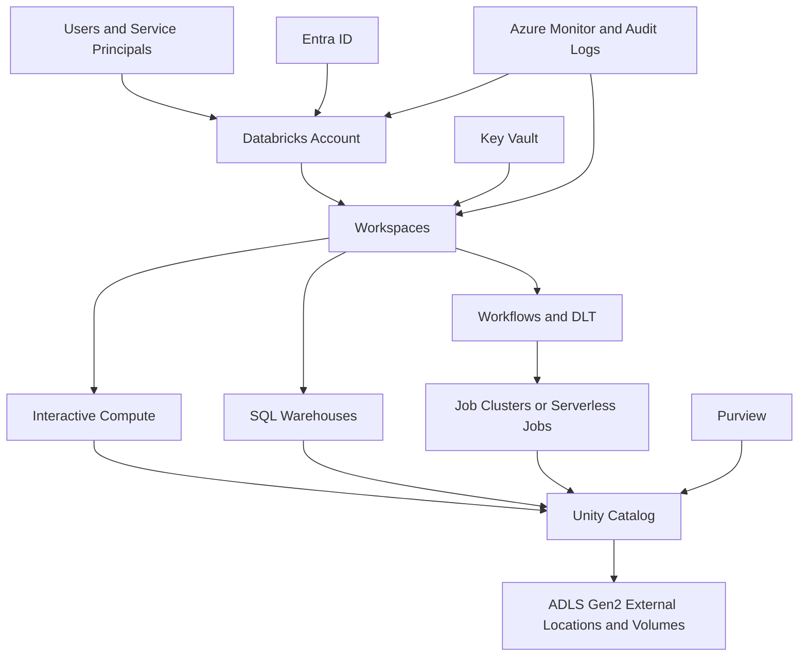
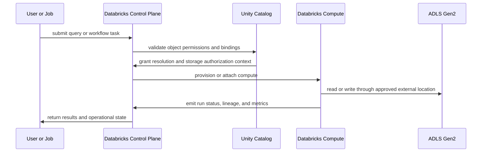
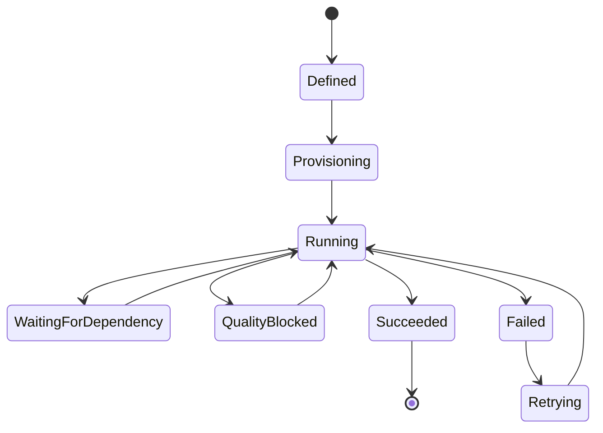

# Databricks Platform

> Part of the **Enterprise Data & AI Architecture Handbook** · Phase-05 - Modern Data Engineering & Lakehouse · Chapter 05.
> Estimated study time: **75 min reading + ~6h labs**.
> **Prerequisites:** read [Apache Spark Internals](04_Apache_Spark_Internals.md) first.

---

## Executive Summary

The Databricks platform is not merely hosted Spark. It is an opinionated enterprise data and AI control plane that combines managed compute orchestration, transactional lakehouse primitives, governance, observability, and developer workflow tooling around open storage. The architectural value comes from standardizing how teams provision workspaces, run jobs, govern data access, and publish curated assets without forcing every team to become its own Spark-platform operator.

For Azure-first enterprises, the most pragmatic Databricks posture is usually Azure Databricks Premium workspaces, ADLS Gen2 as the primary storage substrate, Unity Catalog as the governance backbone, Photon-enabled compute where supported, Databricks Workflows for orchestration, Delta Live Tables for declarative data-pipeline paths, and secure networking through VNet injection or no-public-IP deployment patterns with Private Link and tightly controlled storage access. In that operating model, the platform separates control plane concerns from data plane concerns, while still giving the enterprise a coherent runtime for data engineering, analytics, ML feature preparation, and selected AI-adjacent pipelines.

The most important design insight is that Databricks solves platform standardization more than it solves raw compute alone. Spark execution behavior still matters, as described in [Apache Spark Internals](04_Apache_Spark_Internals.md), but enterprise outcomes often depend even more on account structure, cluster policy, Unity Catalog boundaries, workspace isolation, secure storage access, and whether teams use ephemeral governed compute rather than long-lived shared clusters with ad hoc permissions.

This chapter focuses on the parts of Databricks that determine production outcomes: workspace, control plane, and data plane separation; cluster and warehouse types; pools and Photon; Unity Catalog governance; Delta Live Tables and Workflows; and Azure security and networking. The goal is to let architects and senior engineers decide when Databricks is the correct platform abstraction, how to run it safely in Azure, and where its trade-offs become visible.

## Learning Objectives

By the end of this chapter you should be able to:

1. Explain the difference between Databricks control plane responsibilities and customer data plane responsibilities.
2. Describe how workspaces, accounts, metastores, and identities fit together in Azure Databricks.
3. Choose between all-purpose compute, job clusters, pools, SQL warehouses, serverless surfaces, and Photon.
4. Explain Unity Catalog object hierarchy, storage credentials, external locations, workspace bindings, and lineage behavior.
5. Design secure Azure Databricks networking with private connectivity and controlled egress.
6. Decide when Delta Live Tables and Workflows are appropriate versus custom orchestration.
7. Diagnose the platform-level causes of cost, latency, and governance failures in Databricks estates.
8. Compare Databricks with open Spark stacks, Fabric, warehouse-native ELT, and self-managed lakehouse platforms.
9. Build an Azure-first operating model for enterprise Databricks adoption.
10. Defend Databricks platform choices in engineer, staff engineer, architect, and CTO review settings.

## Business Motivation

- Enterprises need a governed lakehouse platform without operating every Spark scheduler, metastore, and monitoring component directly.
- Data teams want one primary platform for ETL, streaming, SQL-style transformation, feature preparation, and selected ML workflows over open storage.
- Security teams need clearer separation of identities, storage access, workspace boundaries, and audit surfaces than ad hoc notebook clusters provide.
- FinOps programs need measurable explanations for DBU spend, cluster idle time, SQL warehouse usage, and workload isolation.
- Governance programs need centralized lineage, access policies, object registration, and catalog ownership across many workspaces and teams.
- Platform teams need faster developer onboarding through standard templates, policies, and shared orchestration primitives.
- Azure-first organizations want a managed path that integrates well with Entra ID, ADLS Gen2, Private Link, Key Vault, Azure Monitor, and Purview.

## History and Evolution

- Databricks began as a managed Spark platform but quickly expanded into a broader lakehouse control plane.
- Early platform adoption focused on notebook collaboration and clusters; later enterprise adoption focused on governance, automation, and standardized pipelines.
- Delta Lake made Databricks much more than compute over files by giving transactional semantics to open storage.
- Databricks SQL expanded platform reach into BI and governed SQL-serving workloads.
- Photon introduced native vectorized execution for many SQL and DataFrame paths, shifting some performance questions from pure Spark tuning to managed engine eligibility.
- Unity Catalog changed the governance model from workspace-local object assumptions to account-level governance and more consistent access control.
- Delta Live Tables and Workflows raised the abstraction level for pipeline orchestration, data quality expectations, and managed scheduling.
- Recent enterprise usage increasingly treats Databricks as a platform operating model spanning data engineering, analytics, feature preparation, lineage, and selective AI enablement rather than a cluster-by-cluster service.

## Why This Technology Exists

Databricks exists because self-managed distributed data platforms often fail for organizational rather than algorithmic reasons. Teams can usually install Spark, object storage connectors, and a metastore. They struggle to keep runtimes current, cluster policies consistent, storage permissions narrow, lineage usable, observability complete, and production incidents diagnosable across many domains. Databricks packages those concerns into a platform with managed control surfaces and a consistent execution model.

The platform also exists because enterprises want open-storage economics without rebuilding warehouse-era governance from scratch. Open object storage is attractive, but without catalog, policy, lineage, and operational discipline, the estate quickly becomes a loosely governed file system. Databricks addresses this by binding compute, metadata, governance, and orchestration more tightly around open lakehouse storage.

In Azure, this value is stronger when teams already depend on ADLS Gen2, Entra ID, Private Link, Key Vault, and Azure network controls. Databricks becomes the governed execution platform layered over those services rather than a separate parallel universe.

## Problems It Solves

| Problem | How Databricks helps | Enterprise signal that it is working |
|---|---|---|
| unmanaged Spark sprawl | standardizes runtimes, orchestration, and policies | fewer team-specific cluster snowflakes |
| weak lake governance | Unity Catalog centralizes object registration and grants | raw path access declines and catalog lineage improves |
| slow provisioning of new data teams | workspace and policy templates accelerate onboarding | domains go live in weeks instead of months |
| repeated hand-built orchestration | Workflows and DLT provide common scheduling and pipeline patterns | less custom scheduler glue code |
| inconsistent performance engineering | Photon, cluster policies, and standard runtimes narrow the tuning surface | cost and runtime variance drop across similar jobs |
| poor observability of data jobs | system tables, event logs, lineage, and audit surfaces improve diagnostics | incidents are traced to specific runs, plans, and grants |
| insecure storage access patterns | storage credentials and external locations reduce ad hoc secret use | fewer broad storage keys and shared secrets |
| mixed batch, streaming, and SQL transformation needs | one platform supports multiple execution surfaces over shared data | fewer uncontrolled copies across engines |

## Problems It Cannot Solve

- It cannot fix poor domain modeling, bad business definitions, or missing ownership.
- It does not remove the need for good Spark and SQL plan design.
- It is not the right serving platform for all ultra-low-latency operational workloads.
- It cannot guarantee portability when enterprises lean heavily on proprietary features such as Photon or tightly coupled governance patterns.
- It does not eliminate the need for network, identity, and storage engineering in Azure.
- It is not the best default for tiny datasets or simple departmental reporting that a warehouse already handles cheaply.
- It does not automatically make AI or ML workflows reproducible unless teams govern features, datasets, and pipeline releases explicitly.
- It cannot replace all external orchestration, operational databases, or domain-specific serving stores.

## Core Concepts

### 8.1 Workspace, account, control plane, and data plane

The Databricks account is the governance and administration boundary above individual workspaces. Workspaces are collaborative execution environments where notebooks, jobs, pipelines, and SQL assets live. The control plane is Databricks-managed and handles workspace services, APIs, orchestration, notebook state, and platform coordination. The data plane runs compute resources that execute workloads against customer data. In Azure Databricks, this distinction matters operationally because governance, networking, logging, and incident response often hinge on which responsibility sits with Databricks and which sits with the customer subscription.

### 8.2 Compute surfaces and workload fit

Databricks exposes multiple compute surfaces:

- all-purpose clusters for interactive exploration,
- job clusters for ephemeral scheduled execution,
- cluster pools to reduce startup latency,
- SQL warehouses for governed SQL-serving patterns,
- serverless surfaces where supported for lower management overhead,
- DLT-managed compute for declarative pipelines.

The platform works best when those surfaces are treated as distinct workload classes rather than interchangeable ways to run notebooks.

### 8.3 Photon as a platform optimization boundary

Photon is not a general marketing label for speed. It is a native execution path for many supported SQL and DataFrame workloads. Its value is greatest when the plan remains on built-in operators and supported execution patterns. Teams that design around Photon should still inspect plans and confirm that unsupported operators did not force critical fragments back onto standard Spark execution.

### 8.4 Unity Catalog governance model

Unity Catalog provides account-level governance for data and AI assets. The key hierarchy is metastore, catalog, schema, and object. Additional constructs such as storage credentials, external locations, volumes, row filters, column masks, and workspace bindings extend the model beyond simple table grants. The architectural importance is that compute identity and storage identity are separated more cleanly than in path-based governance models.

### 8.5 Delta Live Tables and declarative pipelines

Delta Live Tables is Databricks' declarative pipeline model for managed table transformations, expectations, and incremental orchestration. It is especially effective for medallion-style pipelines where quality gates, dependency ordering, and managed refresh behavior matter. It should not be treated as the only pipeline option, but it is often the fastest route to consistent bronze, silver, and gold promotion when the workload fits its operating model.

### 8.6 Workflows as orchestration control plane

Databricks Workflows coordinates tasks such as notebooks, Python scripts, SQL queries, DLT pipelines, and dependent jobs. It is not only a scheduler. It is the control plane for retries, task dependencies, environment selection, notifications, and production job ownership. The strongest use is platform-standardized orchestration rather than arbitrary per-team schedules.

### 8.7 Secure Azure deployment patterns

Azure Databricks security architecture is determined by network placement, identity propagation, storage access patterns, and workspace isolation. No-public-IP deployments, Private Link, scoped storage credentials, Entra ID identity lifecycle, Key Vault-backed secrets where needed, and restricted workspace admin practices are foundational. Most serious platform incidents in regulated estates are caused by weak Azure controls more than by missing Spark features.

## Internal Working

### 9.1 Control-plane request flow

When a user or job triggers work, the control plane authenticates the principal, resolves workspace and object context, validates permissions, and submits cluster or warehouse operations through managed APIs. The control plane coordinates cluster lifecycle, notebook state, workflow graphs, SQL history, audit events, and metadata interactions. It is the orchestration brain of the platform.

### 9.2 Data-plane execution flow

The data plane provisions or reuses compute in the customer cloud environment, attaches the selected runtime, and executes Spark or SQL work against storage. If Unity Catalog is in use, compute resolves object permissions and storage access through catalog-mediated constructs such as storage credentials and external locations. The compute path still follows Spark execution principles discussed in [Apache Spark Internals](04_Apache_Spark_Internals.md), but Databricks wraps those paths in stronger orchestration and governance.

### 9.3 Cluster lifecycle and pool behavior

Interactive clusters tend to be long-lived relative to job clusters. Job clusters should be ephemeral and policy-bound. Pools reduce cold-start latency by keeping VM capacity warm, but they do not eliminate the need for workload isolation. If teams use pools without policy discipline, they often reduce startup time while preserving the same governance and cost problems.

### 9.4 Catalog and storage authorization path

With Unity Catalog, a query does not simply read a path. The request resolves catalog-level permissions, schema and object grants, workspace binding rules where applicable, and storage authorization through storage credentials. This is the main difference between governed Databricks operation and older path-centric data lake patterns.

### 9.5 Pipeline and workflow coordination

DLT evaluates declared dependencies, materialization rules, expectations, and refresh mode to determine what to build and how to recover after failure. Workflows coordinates broader DAGs across notebooks, tasks, SQL statements, and pipeline invocations. Together they provide a stronger production-control surface than ad hoc notebook chains.

## Architecture

### 10.1 Azure Databricks enterprise reference architecture

The common enterprise pattern uses a single Databricks account with multiple workspaces aligned to environment or data-product boundaries, a shared or selectively partitioned Unity Catalog metastore strategy, ADLS Gen2 for durable data, Access Connector for Azure Databricks or approved identity patterns for storage access, Azure Monitor and Log Analytics for platform telemetry, Purview for broader discovery and classification, and network isolation through VNet injection or no-public-IP patterns with Private Link.

### 10.2 Control-plane and data-plane boundary architecture

Architecturally, the control plane remains managed by Databricks while the customer owns the placement and security posture of storage and most network controls that protect the data plane. This is why Azure reviews must examine workspace deployment mode, storage firewalls, egress strategy, DNS behavior, and identity propagation rather than focusing only on notebook features.

### 10.3 Multi-workspace operating model

Most large enterprises should not treat one workspace as the entire platform. A better model separates development, test, and production and often also separates sensitive domains or major personas. Unity Catalog can still provide a common governance backbone, but workspace isolation reduces blast radius, simplifies access review, and improves CI or CD discipline.

### 10.4 ADR example: standardize on Premium Azure Databricks with Unity Catalog and policy-bound job compute

**Context:** The enterprise currently runs a mix of self-managed Spark, warehouse-native ELT, and a small Databricks footprint. Teams have inconsistent cluster policies, broad path-based storage access, and no shared governance model. Performance tuning is mostly reactive, and security reviews keep finding long-lived clusters with excessive permissions.

**Decision:** Adopt Azure Databricks Premium as the primary Spark and lakehouse execution platform. Require Unity Catalog for governed production data access, job clusters for scheduled production workloads, Photon-enabled compute for supported SQL-heavy jobs, DLT for selected medallion pipelines, and VNet-injected or no-public-IP deployment patterns with Private Link for regulated environments.

**Consequences:** Platform consistency, lineage, and access control improve materially. Teams gain managed acceleration and stronger orchestration, but the estate accepts a Databricks-centric control plane and must manage workspace standards, metastore strategy, and FinOps discipline deliberately.

**Alternatives considered:**

1. Keep self-managed Spark plus custom metadata tooling: rejected because operating burden and inconsistency are already too high.
2. Move all transformations into warehouse-native ELT: rejected because some workloads require open-storage scale, Spark semantics, or non-trivial pipeline orchestration.
3. Use Fabric or another integrated Microsoft analytics platform as the default: rejected as the universal answer because deeper Spark control, Photon, and mature Databricks governance patterns are stronger for the current workload mix.

## Components

| Component | Primary role | Why it matters | Common failure mode |
|---|---|---|---|
| account console | top-level administration and identities | centralizes governance above one workspace | fragmented administration |
| workspace | collaborative execution environment | contains jobs, notebooks, SQL assets, and user context | overloading one workspace for every persona |
| metastore | top-level Unity Catalog governance store | anchors catalogs, schemas, and object policies | unclear ownership or wrong scoping |
| catalogs and schemas | logical organization of governed data | separate domains, environments, and contracts | naming chaos and cross-domain leakage |
| storage credentials | mediated storage identity | avoids broad secret sprawl | over-privileged identity bindings |
| external locations and volumes | governed path abstractions | connect storage safely to compute | path-based bypasses |
| clusters and pools | Spark compute surfaces | control performance, cost, and isolation | long-lived shared clusters |
| SQL warehouses | SQL-serving compute surface | isolate BI and SQL consumers | running ETL on the wrong surface |
| Workflows | orchestration layer | enforces production DAGs and retries | custom schedule sprawl |
| Delta Live Tables | declarative data pipelines | standardizes medallion-style promotion | forcing every pipeline into DLT |
| system tables and audit logs | operational evidence | required for observability and cost review | not retaining enough telemetry |
| repos and bundles | deployment artifacts | enable CI or CD discipline | manual notebook drift |

## Metadata

Databricks success depends on treating metadata as a first-class control surface rather than a byproduct.

Important metadata classes include:

- identity and entitlement metadata for users, groups, service principals, and workspace access,
- Unity Catalog metadata for catalogs, schemas, tables, views, volumes, models, functions, grants, masks, and lineage,
- storage metadata for external locations, credentials, access connectors, and approved paths,
- operational metadata for jobs, run IDs, task states, SQL history, cluster events, and pipeline refresh state,
- cost and governance metadata for tags, owners, environment, data sensitivity, and business criticality,
- performance metadata for runtime version, Photon usage, autoscaling behavior, and job metrics.

Weak metadata discipline is the fastest way to turn Databricks into an expensive notebook estate instead of a governed platform.

## Storage

Databricks is most effective when storage is explicit, governed, and separated by purpose.

| Storage concern | Recommended Azure-first posture | Anti-pattern |
|---|---|---|
| lakehouse data | ADLS Gen2 with Unity Catalog-managed access | direct unmanaged path reads by most users |
| transactional tables | Delta as the default table abstraction | mixing unmanaged files and tables without policy |
| raw, bronze, silver, and gold data | separate logical paths or tables with ownership | using one flat shared container for everything |
| checkpoint and state data | isolated operational paths with tighter access | exposing streaming state broadly |
| DBFS root | avoid for production governed data | storing critical data products in workspace-local roots |
| volumes | use for governed non-tabular assets where appropriate | ad hoc blob storage with no catalog context |

DBFS remains useful for selected workspace-scoped artifacts, but it should not be the default home for durable enterprise data products. ADLS Gen2 plus Unity Catalog is the stronger production pattern.

## Compute

Compute selection is the most visible Databricks decision and the easiest place to get governance wrong.

| Compute surface | Best fit | Key guardrail |
|---|---|---|
| all-purpose clusters | engineering exploration and controlled collaboration | auto-termination, restricted sizes, and narrow access modes |
| job clusters | scheduled ETL and production tasks | ephemeral lifecycle and policy enforcement |
| pools | reduce cluster startup latency | use with workload classes, not as a substitute for governance |
| SQL warehouses | governed BI and SQL consumption | isolate serving from engineering pipelines |
| serverless SQL or serverless jobs where available | reduce infrastructure management overhead | enforce cost visibility and data-governance boundaries |
| DLT-managed compute | declarative data pipelines with expectations | use when the pipeline fits the model, not by default for all jobs |

Access mode and identity choice matter as much as machine size. Single-user or tightly governed shared modes are generally safer than older permissive patterns. Compute should be tied to personas and workload classes, not to convenience.

## Networking

Azure Databricks networking should be designed as part of the platform, not patched in after notebook adoption.

Recommended Azure posture:

- prefer no-public-IP or VNet-injected deployments for regulated environments,
- use Private Link for storage, workspace connectivity, and supporting services where required by policy,
- route egress through approved paths such as Azure Firewall or controlled NAT where inspection or allowlisting is required,
- keep ADLS Gen2, Key Vault, and Databricks workspaces region-aligned unless residency rules force exceptions,
- standardize private DNS zones and resolution early to avoid intermittent control-plane or storage access incidents,
- document the control-plane connectivity model so security teams understand which traffic is Databricks-managed versus customer-managed.

Network reviews should explicitly cover frontend connectivity, backend data access, DNS, egress, and workspace-to-storage trust assumptions. Many failed deployments solve only one of those five.

## Security

Security in Databricks is a layered combination of identity, network, compute policy, and storage mediation.

| Concern | Recommended control |
|---|---|
| user and group lifecycle | Entra ID federation and SCIM provisioning |
| storage access | Unity Catalog storage credentials with Access Connector or approved managed identities |
| secrets | Key Vault-backed secret scopes or managed identity patterns where feasible |
| privileged operations | restrict workspace admin rights and separate account administration |
| code execution | cluster policies, approved runtimes, library governance, and repo-based deployment |
| data exfiltration | private networking, restricted egress, audited external locations, and narrow tokens |
| audit trail | account logs, workspace audit logs, system tables, and storage logs |

The main security warning is that broad workspace administrator rights combined with long-lived shared compute often undo otherwise good governance design.

## Performance

Databricks performance is the result of both Spark internals and platform choices.

| Lever | Why it matters on Databricks | Typical effect |
|---|---|---|
| Photon | native acceleration for supported plans | faster SQL-style ETL and aggregations |
| job clusters instead of shared clusters | cleaner runtime isolation | more predictable performance |
| pools for cold-start-sensitive jobs | lowers startup delay | better SLA consistency for small frequent jobs |
| SQL warehouses for BI | isolates concurrency-heavy serving | fewer ETL versus BI collisions |
| cluster policy standardization | reduces bad executor and runtime choices | less performance variance |
| Unity Catalog table governance plus good layout | improves query-path consistency | less drift in scan and access behavior |
| DLT for selected pipelines | standardizes pipeline refresh and expectations | less hand-built orchestration overhead |

Performance debugging should still begin with plan inspection and workload shape, not with faith in the platform. Databricks helps most when teams combine good Spark design with good platform discipline.

## Scalability

Databricks scales technically and organizationally when platform boundaries are explicit.

Scalability pressures include:

- number of workspaces and environments,
- number of teams and entitlements,
- number of production jobs and pipelines,
- metadata volume in Unity Catalog,
- volume of SQL-serving consumers,
- growth of lineage, audit, and monitoring data,
- need to isolate highly sensitive or heavily regulated domains.

The most common scaling failure is organizational: one workspace, too many admins, unclear catalog ownership, and no consistent deployment model. Technical elasticity does not solve that governance problem.

## Fault Tolerance

Databricks improves fault tolerance through managed orchestration, retry behavior, and durable control surfaces, but it does not remove workload design responsibilities.

| Failure mode | Databricks response | Remaining design responsibility |
|---|---|---|
| executor or VM loss | Spark retries or cluster replacement | write idempotent pipelines and safe side effects |
| job task failure | Workflow retries and dependency control | tune retry policy to failure semantics |
| pipeline quality failure | DLT expectations can block, quarantine, or surface issues | define meaningful expectations and remediation paths |
| workspace or service incident | managed service reduces some operational burden | design region strategy and recovery procedures |
| bad grant or catalog change | auditability and lineage help diagnose | enforce change review and IaC for governance |
| storage-path outage or DNS issue | platform signals failures quickly | engineer Azure networking and storage resilience correctly |

Fault tolerance is strongest when jobs are ephemeral, data products are transactional, and deployment artifacts are versioned.

## Cost Optimization

The highest Databricks costs usually come from weak workload isolation, idle interactive compute, oversized clusters, and unmanaged SQL growth rather than from the platform license alone.

High-value cost levers:

- move scheduled production work to job clusters rather than always-on all-purpose clusters,
- use pools only where startup latency matters enough to justify warm capacity,
- use Photon for supported ETL and SQL workloads when it reduces total runtime materially,
- keep BI workloads on SQL warehouses rather than sharing engineering clusters,
- standardize auto-termination and cluster policies across all non-production compute,
- attribute usage by tags, workspace, job owner, and environment,
- decommission unmanaged legacy clusters once the Databricks platform becomes the standard,
- keep DLT usage aligned to pipelines that benefit from its declarative model rather than forcing every workflow into it.

| Lever | Benefit | Risk if overused |
|---|---|---|
| ephemeral job clusters | eliminates idle production compute | frequent tiny jobs may pay more startup overhead |
| pools | lower startup latency | warm capacity can become hidden idle cost |
| Photon | shorter runtime on supported plans | portability assumptions can become too optimistic |
| SQL warehouse isolation | better concurrency control | more surfaces to govern and budget |
| serverless where approved | less operational overhead | weak chargeback can hide runaway spend |

Worked FinOps example: assume a data-engineering team currently runs four long-lived all-purpose clusters in production-like usage, each averaging 12 hours per day at an illustrative blended cost of $18 per cluster-hour, for about $25,920 per month. The same workloads are redesigned into ephemeral job clusters and one small interactive engineering cluster, while frequent short jobs use a warm pool only during business hours. Average production compute falls to the equivalent of 720 cluster-hours per month at the same illustrative blended rate, or about $12,960 per month. If Photon also reduces runtime for the main SQL-heavy jobs by 25 percent, the effective monthly spend can drop further to roughly $9,720. The core lesson is that Databricks cost is controlled through platform operating model, not by debating DBUs in isolation.

## Monitoring

Monitoring should answer whether the Databricks platform is healthy against explicit service expectations.

Minimum signals:

- job success rate, runtime, and queue delay,
- cluster start time, utilization, and auto-termination compliance,
- SQL warehouse queue time, concurrency, and latency,
- DLT pipeline refresh state, quality failures, and latency,
- Unity Catalog grant changes, lineage coverage, and unauthorized-access attempts,
- workspace admin activity, token usage, and provisioning events,
- DBU and infrastructure spend by workspace, job, and environment,
- storage-access failures tied to external locations or credentials.

| Area | Metric | Alert example |
|---|---|---|
| orchestration | failed job runs | repeated task failure beyond retry policy |
| compute lifecycle | cluster launch latency | startup time breaches SLA band |
| SQL serving | warehouse queue time | concurrency backlog exceeds expected band |
| governance | grant-change volume | unusual privilege escalation activity |
| DLT quality | expectation-failure count | sudden spike in dropped or quarantined rows |
| FinOps | spend per workspace | unplanned cost increase without release change |

## Observability

Observability should explain why the platform became slower, riskier, or more expensive, not merely that one run failed.

Useful observability practices:

- retain system tables, job history, and cluster event data long enough for release-to-release comparison,
- correlate job regressions with runtime version changes, cluster policy changes, and Unity Catalog changes,
- trace whether a data failure came from DLT expectations, storage authorization, network reachability, or Spark plan shape,
- preserve deployment artifacts such as bundles, notebooks, and configuration at the run level,
- tie cost anomalies to specific workspaces, warehouses, clusters, or pipeline releases,
- expose lineage coverage and direct-path bypass attempts as governance health signals.

### Operational Response Playbook

| Signal | Detection query or check | Immediate remediation |
|---|---|---|
| Production jobs start slowly after an environment change | inspect cluster events, pool utilization, and policy changes | validate pool warm capacity, revert harmful policy change, or right-size startup-sensitive jobs |
| Unity Catalog access failures spike | inspect recent grants, workspace bindings, storage credential changes, and audit logs | roll back the last governance change, validate storage identity, and rerun a narrow access test |
| SQL warehouse latency rises sharply | compare queue time, concurrency, and warehouse sizing against prior baseline | scale the warehouse appropriately, isolate heavy queries, and review BI workload bursts |
| DLT pipeline stops promoting silver tables | inspect pipeline event log, expectation failures, and upstream table freshness | quarantine bad input where appropriate, fix the rule or source defect, and rerun the failed update window |
| DBU spend jumps without more business output | compare job-cluster lifecycles, interactive-cluster uptime, and new warehouse usage | shut down idle compute, move scheduled work to ephemeral clusters, and tag new workloads correctly |

Monitoring tells you a workspace is unhealthy. Observability tells you whether the cause is cluster policy drift, storage identity breakage, DLT quality failure, SQL concurrency, or interactive idle waste.

## Governance

Governance is where Databricks either becomes an enterprise platform or stays a notebook service.

Core rules:

- make Unity Catalog mandatory for production governed data access,
- define metastore, catalog, and schema ownership explicitly,
- bind production catalogs to approved workspaces only,
- ban unmanaged DBFS-root data products for production analytics,
- manage jobs, bundles, and permissions through version-controlled deployment processes,
- separate account administration from workspace administration,
- require cluster policies and approved runtime families for production workloads,
- treat direct path access and unmanaged secrets as exceptions requiring review.

Databricks governance should be read as platform engineering, not only data governance. The strongest control failures are often compute and admin failures that later become data failures.

## Trade-offs

| Benefit | Trade-off | When the trade-off is acceptable |
|---|---|---|
| managed lakehouse platform | tighter coupling to Databricks control surfaces | when platform consistency matters more than raw neutrality |
| strong governance via Unity Catalog | operational learning curve for catalog design | when many teams share data products |
| Photon and managed runtime optimization | some acceleration is proprietary | when Azure Databricks is already the strategic platform |
| integrated Workflows and DLT | platform-native orchestration patterns | when governance and delivery speed outweigh using one scheduler everywhere |
| multiple compute surfaces | more operating choices to standardize | when workload isolation is a core requirement |
| account and workspace separation | more architectural design upfront | when blast-radius control and scale matter |

## Decision Matrix

| Scenario | Recommended choice | Why | When not to choose Databricks as default |
|---|---|---|---|
| large-scale Azure lakehouse engineering | Azure Databricks Premium with Unity Catalog | strongest blend of Spark control, governance, and managed platform | if the workload is warehouse-only and simple |
| highly regulated multi-team analytics | Azure Databricks with private networking and strict workspace isolation | strong control-plane plus data-plane separation | if the org cannot support the governance operating model |
| small departmental BI | SQL warehouse or existing analytics platform | Databricks may be more platform than needed | if no distributed engineering need exists |
| portability-first platform | open Spark plus open governance stack | keeps more control in-house | if the team does not want to operate the full stack |
| Microsoft SaaS-first analytics estate | Fabric may be a better default | tighter SaaS integration and simpler surface | if deep Spark engineering and Photon are required |
| feature engineering over open lakehouse storage | Databricks often fits well | shared compute and governed open storage help | if online serving, not offline engineering, is the dominant requirement |

## Design Patterns

1. Multi-workspace by environment and sensitivity: separate dev, test, prod, and highly regulated domains.
2. Unity Catalog as mandatory control plane: keep production data access catalog-mediated rather than path-mediated.
3. Ephemeral job compute for production: schedule most production pipelines on job clusters or serverless jobs where approved.
4. SQL warehouses for BI isolation: keep high-concurrency readers away from engineering compute.
5. DLT for declarative medallion pipelines: use expectations, lineage, and managed refresh where the pattern fits.
6. Account-level identity and policy management: drive entitlements centrally, not ad hoc inside each workspace.
7. Bundles or repo-driven deployment: treat Databricks jobs and pipelines as deployable artifacts, not manual UI state.
8. Access Connector plus storage credentials: avoid distributing storage keys or broad secrets.

## Anti-patterns

1. Using one workspace for every environment, persona, and sensitivity level.
2. Letting analysts and engineers share long-lived all-purpose clusters with admin-level capabilities.
3. Treating Unity Catalog as optional for production data.
4. Storing governed production datasets in DBFS root.
5. Using pools everywhere because startup time feels annoying.
6. Allowing unmanaged libraries, init scripts, and notebook-only deployment for critical jobs.
7. Running BI dashboards on engineering clusters because they are already there.
8. Assuming Photon fixes poorly designed Spark plans automatically.

## Common Mistakes

1. Confusing workspace boundaries with governance boundaries.
2. Granting too many workspace admins because the rollout is new.
3. Choosing interactive clusters for scheduled production work out of habit.
4. Underestimating the complexity of metastore and catalog naming strategy.
5. Designing private networking without end-to-end DNS validation.
6. Using secret scopes as a substitute for proper storage credential design.
7. Letting DLT pipelines grow without clear ownership, SLOs, or quality semantics.
8. Ignoring system tables and audit logs until after the first major incident.
9. Measuring success by notebook adoption instead of governed production outcomes.
10. Treating account-level controls as optional because the first workspace worked without them.

## Best Practices

1. Start with account, workspace, and metastore architecture before onboarding many teams.
2. Make Unity Catalog, cluster policies, and private storage access part of the initial platform baseline.
3. Default production orchestration to Workflows and version-controlled artifacts.
4. Keep interactive exploration small, short-lived, and clearly separated from production.
5. Use Photon where supported, but verify plan eligibility and actual benefit.
6. Tag everything needed for cost attribution: workspace, environment, domain, owner, and criticality.
7. Keep DBFS root out of governed production-data patterns.
8. Review grants, admin roles, and storage credentials as part of regular platform governance.
9. Preserve enough telemetry to compare runs across runtime and policy changes.
10. Define clear exception paths for open-stack or non-Databricks workloads.

## Enterprise Recommendations

- Make Azure Databricks the primary lakehouse engineering platform only if the organization is willing to standardize governance and compute operations around it.
- Choose Premium workspaces and Unity Catalog for serious multi-team enterprise use.
- Enforce production job clusters or approved serverless patterns rather than shared interactive compute.
- Use SQL warehouses for curated serving and separate them from data-engineering pipelines.
- Prefer catalog-mediated storage access with Access Connector and storage credentials over secret-driven path access.
- Treat DLT as a strategic option for declarative pipelines, not as mandatory religion.
- Build a platform SRE-style operating model around system tables, audit logs, cost attribution, and incident playbooks.
- Keep open-source equivalence patterns documented so the enterprise understands where Databricks is accelerating the platform and where it is tightening platform dependency.

## Azure Implementation

### Service map

| Platform concern | Azure Databricks-first implementation | Supporting Azure service |
|---|---|---|
| workspace runtime | Azure Databricks Premium workspace | Entra ID for identity, Azure Resource Manager for deployment |
| governed storage access | Unity Catalog plus storage credentials | ADLS Gen2 and Access Connector for Azure Databricks |
| secure secrets | secret scopes where required | Azure Key Vault |
| private data access | cluster or warehouse access to private services | Private Link, Private DNS, Azure Firewall or NAT |
| observability | system tables, audit logs, cluster events | Azure Monitor and Log Analytics |
| discovery and classification | Unity Catalog lineage plus enterprise metadata | Microsoft Purview |
| CI or CD | Databricks bundles, repos, and workflows | Azure DevOps or GitHub Actions |

### Azure CLI: create a Premium workspace baseline

```bash
az databricks workspace create \
  --resource-group rg-data-prod \
  --name adb-prod-core \
  --location westeurope \
  --sku premium \
  --managed-resource-group rg-data-prod-adb-managed
```

### Bicep: workspace with no-public-IP parameters

```bicep
param location string = resourceGroup().location
param workspaceName string
param managedResourceGroupId string
param virtualNetworkId string
param publicSubnetName string
param privateSubnetName string

resource workspace 'Microsoft.Databricks/workspaces@2024-05-01' = {
	name: workspaceName
	location: location
	sku: {
		name: 'premium'
	}
	properties: {
		managedResourceGroupId: managedResourceGroupId
		publicNetworkAccess: 'Disabled'
		parameters: {
			enableNoPublicIp: {
				value: true
			}
			customVirtualNetworkId: {
				value: virtualNetworkId
			}
			customPublicSubnetName: {
				value: publicSubnetName
			}
			customPrivateSubnetName: {
				value: privateSubnetName
			}
		}
	}
}
```

### Unity Catalog SQL: storage credential, external location, and grants

```sql
CREATE STORAGE CREDENTIAL ac_prod_lake
WITH AZURE_MANAGED_IDENTITY;

CREATE EXTERNAL LOCATION ext_prod_silver
URL 'abfss://silver@stprodlake.dfs.core.windows.net/'
WITH (STORAGE CREDENTIAL ac_prod_lake);

CREATE CATALOG prod;
CREATE SCHEMA prod.finance;

GRANT USE CATALOG ON CATALOG prod TO `data-engineering`;
GRANT USE SCHEMA ON SCHEMA prod.finance TO `finance-analysts`;
GRANT SELECT ON EXTERNAL LOCATION ext_prod_silver TO `finance-analysts`;
```

### Databricks bundle YAML: workflow with job-cluster policy

```yaml
bundle:
  name: finance-prod

resources:
  jobs:
    finance_daily:
      name: finance-daily
      tasks:
        - task_key: bronze_to_silver
          notebook_task:
            notebook_path: ../src/bronze_to_silver.py
          job_cluster_key: etl_cluster
        - task_key: silver_to_gold
          depends_on:
            - task_key: bronze_to_silver
          notebook_task:
            notebook_path: ../src/silver_to_gold.py
          job_cluster_key: etl_cluster
      job_clusters:
        - job_cluster_key: etl_cluster
          new_cluster:
            spark_version: 15.4.x-scala2.12
            node_type_id: Standard_D16ds_v5
            runtime_engine: PHOTON
            autoscale:
              min_workers: 2
              max_workers: 8
            autotermination_minutes: 20
```

### Delta Live Tables Python: expectation-driven silver table

```python
import dlt
from pyspark.sql.functions import col

@dlt.table(name='orders_silver')
@dlt.expect_or_drop('valid_order_id', 'order_id IS NOT NULL')
@dlt.expect('non_negative_revenue', 'gross_revenue >= 0')
def orders_silver():
	return (
		spark.readStream.table('prod.bronze.orders_raw')
		.select('order_id', 'customer_id', 'order_ts', 'gross_revenue')
		.where(col('order_ts').isNotNull())
	)
```

Azure implementation note: the strongest Azure Databricks deployments treat workspace provisioning, Unity Catalog assignments, storage credentials, and networking as code from the beginning. Retrofitting those controls after teams have already created manual clusters and direct path patterns is much more expensive.

## Open Source Implementation

There is no exact open-source clone of the full Databricks platform. The closest approximation is a composed platform made of several separate systems.

Reference stack:

- Spark on Kubernetes for distributed compute,
- Delta Lake, Apache Iceberg, or Apache Hudi on object storage,
- Airflow or Argo Workflows for orchestration,
- JupyterHub or VS Code-based workflows for notebook-style collaboration,
- MLflow open source for experiment tracking where relevant,
- Nessie, Hive Metastore, OpenMetadata, or Apache Atlas for catalog and lineage functions,
- Great Expectations or Soda for data-quality controls,
- Prometheus, Grafana, and OpenTelemetry for observability,
- Terraform, GitHub Actions, or Azure DevOps for deployment automation.

### Airflow DAG example for job orchestration

```python
from airflow import DAG
from airflow.operators.bash import BashOperator
from datetime import datetime

with DAG(
	'finance_medallion',
	start_date=datetime(2026, 1, 1),
	schedule='0 4 * * *',
	catchup=False,
) as dag:
	bronze_to_silver = BashOperator(
		task_id='bronze_to_silver',
		bash_command='spark-submit /opt/jobs/bronze_to_silver.py'
	)

	silver_to_gold = BashOperator(
		task_id='silver_to_gold',
		bash_command='spark-submit /opt/jobs/silver_to_gold.py'
	)

	bronze_to_silver >> silver_to_gold
```

### SparkApplication YAML for Kubernetes

```yaml
apiVersion: sparkoperator.k8s.io/v1beta2
kind: SparkApplication
metadata:
  name: finance-etl
spec:
  type: Python
  mode: cluster
  image: registry.example.com/spark:3.5.1
  mainApplicationFile: local:///opt/spark/jobs/finance_etl.py
  sparkVersion: 3.5.1
  restartPolicy:
    type: OnFailure
  driver:
    cores: 2
    memory: 4g
    serviceAccount: spark-runner
  executor:
    cores: 4
    memory: 8g
    instances: 6
```

### OpenMetadata ingestion outline

```yaml
source:
  type: trino
  serviceName: analytics_trino
processor:
  type: orm-profiler
sink:
  type: metadata-rest
  config:
    api_endpoint: http://openmetadata:8585/api
```

The warning is operational, not ideological: this stack can reproduce many Databricks capabilities, but only by asking the platform team to operate multiple products that Databricks integrates under one control plane.

## AWS Equivalent (comparison only)

| Azure Databricks surface | AWS equivalent | Comparison note |
|---|---|---|
| Azure Databricks Premium workspace | Databricks on AWS or EMR Studio plus EMR | Databricks on AWS preserves stronger platform parity; EMR gives more raw control but less integrated platform behavior |
| Unity Catalog | Unity Catalog on Databricks AWS or Lake Formation plus Glue Data Catalog | Lake Formation is not a drop-in platform substitute for Unity Catalog semantics |
| ADLS Gen2 plus external locations | Amazon S3 plus governed external locations | similar open-storage role with different IAM and network patterns |
| Access Connector plus managed identity patterns | IAM roles and instance profiles | AWS identity patterns are mature but operationally different |
| Azure Monitor plus Log Analytics | CloudWatch plus related analytics tooling | similar observability role with different surface area |
| Private Link and VNet controls | PrivateLink and VPC controls | comparable private-connectivity model with different implementation details |

Selection criteria: if the enterprise is committed to Databricks as the platform standard, Databricks on AWS is usually the closest match. If the organization prefers more native AWS assembly and is willing to rebuild governance and orchestration patterns itself, EMR-centered designs may be viable.

## GCP Equivalent (comparison only)

| Azure Databricks surface | GCP equivalent | Comparison note |
|---|---|---|
| Azure Databricks Premium workspace | Databricks on GCP or Dataproc plus adjacent tooling | Databricks on GCP preserves stronger platform parity; Dataproc is more component-oriented |
| Unity Catalog | Unity Catalog on Databricks GCP or Dataplex plus Data Catalog | Dataplex is improving but remains a different governance model |
| ADLS Gen2 plus external locations | Google Cloud Storage plus governed paths | similar object-store role with different IAM and network ergonomics |
| Access Connector patterns | workload identity and service-account patterns | strong GCP-native identity model but different operational assumptions |
| Azure Monitor plus Log Analytics | Cloud Monitoring plus Cloud Logging | similar monitoring objective, different operating surface |
| Azure private networking controls | Private Service Connect and VPC controls | comparable private-access model with different topology details |

Selection criteria: GCP equivalents are strongest when the organization values GCP-native analytics and identity integration more than strict platform symmetry with Azure Databricks.

## Migration Considerations

Recommended migration sequence:

1. Inventory existing Spark, notebook, ELT, and warehouse-native workflows and classify them by workload type.
2. Design account, workspace, metastore, network, and identity architecture before migrating workloads.
3. Standardize cluster policies, tags, audit retention, and Unity Catalog conventions early.
4. Migrate one representative production pipeline using version-controlled deployment and ephemeral job clusters.
5. Introduce DLT only for pipelines that benefit from declarative refresh and expectations.
6. Move curated BI SQL workloads to SQL warehouses rather than leaving them on engineering clusters.
7. Retire broad path-based access and unmanaged secrets once catalog-mediated access is proven.

Migration warnings:

- do not migrate notebooks without migrating governance and deployment standards,
- do not treat one successful workspace as proof that the enterprise architecture is complete,
- do not skip network and DNS validation for private deployments,
- do not accept interactive-cluster convenience as the long-term production model.

## Mermaid Architecture Diagrams

### Platform architecture



### Secure request flow



### Pipeline state model



## End-to-End Data Flow

An end-to-end governed Databricks flow typically works like this:

1. A developer or service principal triggers a Workflow or DLT pipeline.
2. The Databricks control plane authenticates the principal and resolves workspace context.
3. The platform validates permissions against Unity Catalog objects and workspace bindings.
4. Job compute or a SQL warehouse is provisioned according to the selected policy.
5. The compute surface attaches the approved Databricks runtime and Photon settings where relevant.
6. The workload reads Delta tables or files through storage credentials and external locations.
7. Transformations execute through Spark or SQL plans, with DLT expectations or Workflow task rules applied where configured.
8. Results are written back to governed tables or volumes in ADLS Gen2.
9. Lineage, audit signals, cluster events, and cost metadata are recorded.
10. Downstream SQL consumers, feature pipelines, or other workflows access the resulting governed assets through approved surfaces.

## Real-world Business Use Cases

| Use case | Why Databricks platform fit matters |
|---|---|
| enterprise medallion lakehouse | DLT, Unity Catalog, and ephemeral compute provide repeatable governed refinement |
| customer 360 and large-scale conformance | Spark-scale transforms plus catalog governance reduce duplicated cleanup stacks |
| financial reconciliation and risk analytics | controlled job orchestration and audited access improve reproducibility |
| feature engineering for ML | shared open storage, governed transformations, and lineage support reproducible features |
| streaming plus batch convergence | one platform can coordinate both paths with common governance |
| regulated analytics modernization | private networking, narrow storage identity, and strong catalog controls support security reviews |

## Industry Examples

- Retail: unify e-commerce, POS, inventory, and loyalty pipelines with governed open storage and isolated BI-serving surfaces.
- Banking: run large-scale batch and near-real-time risk preparation under strict identity, lineage, and private-network controls.
- Healthcare: combine governed PHI-aware access patterns with distributed transformations and audited pipelines.
- Manufacturing: standardize telemetry enrichment, asset-history pipelines, and site analytics on shared lakehouse governance.
- Telecommunications: isolate high-volume enrichment jobs from analyst-serving SQL surfaces while keeping one catalog backbone.

## Case Studies

### Case study 1: public enterprise pattern around Unity Catalog standardization

Public Databricks customer and field guidance repeatedly shows a similar pattern: platform value rises sharply when enterprises move from workspace-local object assumptions to Unity Catalog with account-level governance. The lesson is that Databricks becomes more strategically useful when governance is centralized early, not when catalogs are added after years of path-based usage.

### Case study 2: common Azure networking failure story

A repeated enterprise failure pattern is to deploy Azure Databricks with private intentions but incomplete DNS or Private Link design. Clusters launch, but access to storage or workspace endpoints fails intermittently, and teams misdiagnose the problem as a Spark issue. The lesson is simple: Databricks platform reliability in Azure depends on correct private connectivity and name resolution, not just on cluster configuration.

### Case study 3: interactive-cluster cost spiral

In many first-wave Databricks adoptions, teams leave exploratory clusters running as de facto production engines. Jobs share those clusters, SQL workloads query against them indirectly, and monthly cost rises with no corresponding business output. The corrective pattern is consistent: separate interactive and production workloads, enforce job clusters or serverless jobs, and tag compute so FinOps can act on real usage.

## Hands-on Labs

### Lab 1: Provision a secure workspace baseline

Goal: create an Azure Databricks workspace aligned with enterprise controls.

Tasks:

1. Deploy a Premium workspace in Azure.
2. Configure a no-public-IP or equivalent private network posture.
3. Validate private access to ADLS Gen2 and Key Vault.
4. Document the control-plane versus data-plane trust boundaries.

Expected outcome: you can explain and demonstrate the Azure security baseline, not merely create a workspace.

### Lab 2: Configure Unity Catalog for governed storage access

Goal: replace path-based access with catalog-mediated access.

Tasks:

1. Create a metastore or connect to the enterprise metastore.
2. Create a storage credential and external location.
3. Register a catalog and schema.
4. Grant least-privilege read access to one analyst group.

Expected outcome: analysts query through Unity Catalog rather than direct storage credentials or paths.

### Lab 3: Build a Workflow with ephemeral job compute

Goal: operationalize a small production DAG.

Tasks:

1. Create a job cluster policy with Photon enabled.
2. Define a two-task Workflow with dependency ordering.
3. Set retries, notifications, and tags.
4. Compare cluster lifecycle and cost behavior with an all-purpose cluster.

Expected outcome: you understand why ephemeral production compute is a platform pattern, not an optimization detail.

### Lab 4: Build a DLT pipeline with expectations

Goal: use declarative pipeline semantics for governed data promotion.

Tasks:

1. Create bronze and silver tables.
2. Add expectations for key validity and freshness assumptions.
3. Trigger a pipeline refresh and inspect lineage.
4. Force a data-quality failure and observe the operational response path.

Expected outcome: you can defend where DLT helps and where custom orchestration remains appropriate.

## Exercises

1. Explain the difference between Databricks control plane and data plane in Azure.
2. Compare all-purpose clusters, job clusters, pools, and SQL warehouses by workload fit.
3. Describe when Photon is valuable and when it is irrelevant.
4. Design a Unity Catalog hierarchy for three domains and three environments.
5. Explain why Access Connector plus storage credentials is better than broad shared secrets.
6. Propose a private-network validation checklist for a new workspace.
7. Describe one pipeline that should use DLT and one that should not.
8. Design a cost-attribution model for Databricks workspaces and compute surfaces.

## Mini Projects

1. Enterprise workspace blueprint: create IaC, policies, tags, and monitoring for one governed Azure Databricks environment.
2. Unity Catalog rollout plan: design catalogs, schemas, grants, and workspace bindings for a multi-domain enterprise.
3. Production modernization pilot: migrate one legacy Spark workflow and one SQL-serving workload into standardized Databricks operating patterns.

## Capstone Integration

This chapter should be used as the platform-operations layer above [Apache Spark Internals](04_Apache_Spark_Internals.md). Spark explains how distributed execution behaves. Databricks explains how the enterprise should package, govern, secure, deploy, and observe that execution in Azure.

Capstone deliverable: design a production-grade Azure Databricks platform slice for one regulated business domain, including workspace topology, Unity Catalog structure, private networking, cluster policies, orchestration choice, cost model, and incident playbook. Then defend the design in an architecture review.

## Interview Questions

1. What is the difference between a Databricks workspace and a Databricks account?
2. Why is Unity Catalog more than just a metastore?
3. When should you use job clusters instead of all-purpose clusters?
4. What problem do pools solve, and what problem do they not solve?
5. How do Workflows and DLT differ?
6. Why does Azure networking matter so much in Databricks deployments?
7. What does Photon accelerate, and what does it not guarantee?
8. Why is DBFS root a poor default for governed production data?

## Staff Engineer Questions

1. How would you standardize Databricks platform usage across teams without making the platform too rigid to adopt?
2. What evidence would you require before approving an exception to Unity Catalog for a production dataset?
3. How would you decide whether a pipeline belongs in DLT, Workflows, or an external orchestrator?
4. What telemetry would you preserve so cost and governance regressions can be diagnosed after a release?
5. How would you balance Photon-specific optimization against portability concerns?
6. What compute policies would you define for interactive, production, and SQL-serving workloads?

## Architect Questions

1. How should account, workspace, and metastore boundaries map to enterprise domains and environments?
2. When is Azure Databricks a better platform choice than Fabric or an open Spark stack?
3. How should private networking, egress control, and storage identity be designed together?
4. What is the right governance model for catalogs, schemas, external locations, and admin roles?
5. How should SQL warehouses, job clusters, and interactive compute be isolated operationally?
6. What is the minimum platform baseline before onboarding regulated workloads?

## CTO Review Questions

1. What business outcomes improve when Databricks is run as a governed platform instead of a notebook service?
2. Where are we currently paying for idle compute, duplicated orchestration, or weak governance?
3. How much platform dependence on Databricks are we willing to accept in exchange for speed and standardization?
4. Which workloads should remain outside Databricks even if the platform becomes strategic?
5. What operating-model changes are required so security, cost, and reliability controls remain real after adoption?
6. How will we measure platform maturity beyond the number of users or notebooks?

## References

- [Apache Spark Internals](04_Apache_Spark_Internals.md)
- Azure Databricks documentation for workspaces, cluster policies, Workflows, DLT, SQL warehouses, and Unity Catalog.
- Microsoft Azure documentation for Private Link, Entra ID, Key Vault, ADLS Gen2, Access Connector, and Azure Monitor.
- Public Databricks field guidance on workspace architecture, governance, and enterprise deployment practices.
- Unity Catalog documentation and public presentations on governance, lineage, and external-location patterns.
- Delta Live Tables documentation and public architecture material for declarative pipeline operations.

## Further Reading

- Unity Catalog advanced patterns for row filters, column masks, workspace bindings, and external data governance.
- Databricks bundles and CI or CD practices for governed platform delivery.
- Secure Azure Databricks networking patterns with VNet injection, Private Link, DNS, and egress control.
- Photon eligibility analysis and SQL warehouse tuning patterns.
- DLT operational playbooks for quality failures, schema drift, and refresh backlogs.
- Databricks FinOps models for cluster policy, SQL warehouse governance, and serverless cost attribution.
- Open-stack alternatives for Spark, catalog, orchestration, and notebook collaboration.