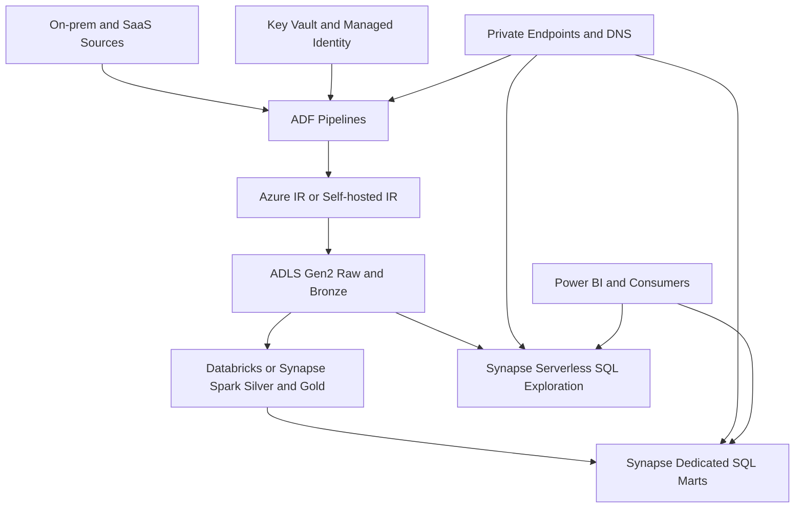
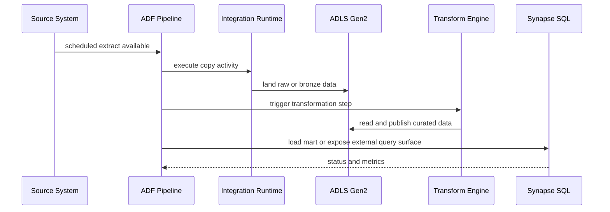
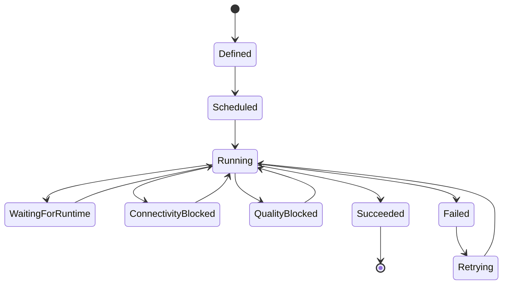

# Azure Data Factory and Synapse

> Part of the **Enterprise Data & AI Architecture Handbook** · Phase-05 - Modern Data Engineering & Lakehouse · Chapter 06.
> Estimated study time: **60 min reading + ~4h labs**.
> **Prerequisites:** read [Medallion Architecture](03_Medallion_Architecture.md) first.

---

## Executive Summary

Azure Data Factory and Azure Synapse Analytics occupy an important middle ground in modern Azure data platforms. They are not the only way to build analytical systems, and they are rarely the best answer for every workload. Their value is in controlled orchestration, managed connectivity, SQL-centric analytics surfaces, and a Microsoft-native operating model that can be effective when enterprises need repeatable data movement, governed connectivity, and a clear separation between orchestration, transformation, and serving concerns.

Azure Data Factory is primarily an orchestration and integration service. Its core abstractions are pipelines, activities, datasets, linked services, triggers, and integration runtimes. Synapse Analytics is a broader analytics platform that combines SQL serving, Spark, data integration, and workspace-level management. The most important architectural distinction is that ADF is usually the orchestration and connectivity plane, while Synapse is a mixed analytics plane that includes dedicated and serverless SQL options, Spark pools, pipelines, and integrated development surfaces.

For Azure-first enterprises, the practical question is not whether ADF or Synapse are good in the abstract. The practical question is where they fit relative to Databricks, Fabric, and warehouse-native patterns. ADF is strong when the need is reliable data movement, schedule control, hybrid connectivity, and pipeline coordination. Synapse dedicated SQL pools are strong when predictable, high-throughput MPP warehouse-style serving is required. Synapse serverless SQL is strong for exploratory or federated querying over lake storage with lower infrastructure commitment. Both become weak when teams expect them to replace disciplined medallion design, purpose-built low-latency serving systems, or modern Spark-centric engineering platforms without trade-offs.

This chapter explains where ADF and Synapse belong in a serious enterprise architecture: how ADF pipelines, datasets, linked services, and integration runtimes actually work; how mapping data flows differ from Spark-based engineering; how Synapse dedicated SQL differs from serverless SQL; how secure connectivity should be engineered; and how to choose ADF versus Databricks versus Fabric without collapsing into tool-brand bias.

## Learning Objectives

By the end of this chapter you should be able to:

1. Explain the roles of ADF pipelines, datasets, linked services, triggers, and integration runtimes.
2. Distinguish orchestration, data movement, SQL transformation, and Spark-based engineering concerns in Azure.
3. Compare ADF mapping data flows with Spark-based transformation in Databricks or Synapse Spark.
4. Explain the differences between Synapse dedicated SQL pools and serverless SQL pools.
5. Design secure Azure connectivity using managed identity, linked services, private endpoints, and self-hosted integration runtimes.
6. Identify when ADF is the correct orchestrator and when it becomes an awkward substitute for a fuller engineering platform.
7. Choose between ADF, Synapse, Databricks, and Fabric based on workload shape and operating model.
8. Design a medallion-aligned Azure data platform using ADF and Synapse without confusing raw movement with curated transformation.
9. Diagnose the cost, performance, governance, and operational trade-offs of ADF and Synapse.
10. Defend ADF or Synapse platform choices in engineer, staff engineer, architect, and CTO review settings.

## Business Motivation

- Enterprises need a managed way to orchestrate data movement across cloud, on-premises, SaaS, and lake or warehouse destinations.
- Many organizations still have substantial hybrid connectivity requirements that demand secure copy paths, controlled schedules, and operational retries.
- SQL-heavy teams want an Azure-native analytical surface with explicit warehouse or federation choices.
- Governance teams need linked-service, identity, and network controls that are stronger than ad hoc scripts or desktop ETL tools.
- Platform teams need a pragmatic way to coordinate lakehouse, warehouse, and integration workloads without hand-building every scheduler path.
- Data programs often need to modernize incrementally, and ADF plus Synapse can bridge legacy integration patterns and modern lakehouse patterns.
- Executives want cost and ownership clarity: which service is moving data, which service is transforming it, and which service is serving it.

## History and Evolution

- Azure Data Factory evolved from a cloud ETL and orchestration service into a broader data integration control plane with managed connectors, triggers, data flows, and hybrid integration runtime patterns.
- Synapse Analytics grew from the SQL Data Warehouse lineage into a broader analytics workspace that combines dedicated SQL pools, serverless SQL, Spark, and pipelines.
- Early enterprise use often focused on lift-and-shift ETL scheduling or warehouse loading rather than lakehouse-first design.
- As data lake and lakehouse patterns matured, ADF became more useful as an orchestrator and connector plane than as the sole transformation engine.
- Synapse expanded to cover more analytics personas, but its multi-surface nature also increased architectural ambiguity. Teams often need to decide whether they are building a SQL warehouse platform, a light lake query surface, or a broader analytics workspace.
- The rise of Databricks and Fabric changed the comparison baseline. ADF and Synapse are no longer evaluated only against older SSIS-style or pure warehouse patterns; they are evaluated against integrated lakehouse and SaaS analytics platforms.
- Modern Azure architectures increasingly treat ADF as selective orchestration and data movement infrastructure, and treat Synapse as a SQL-serving and selected analytics workspace rather than a universal platform answer.

## Why This Technology Exists

ADF exists because enterprises need a managed control plane for moving and orchestrating data across many systems, especially when those systems span cloud services, SaaS APIs, private networks, and on-premises estates. Building that orchestration layer from custom scripts or generic schedulers is possible, but operationally expensive and often weak in governance, connectivity management, and supportability.

Synapse exists because Azure customers also need analytics surfaces that cover structured SQL serving, federated lake querying, and selected Spark-based processing under one workspace umbrella. It allows teams to combine warehouse-style workloads, exploratory data-lake SQL, and some broader analytics tasks while staying close to Azure-native identity and networking controls.

The combination exists because many real platforms need both: a pipeline plane that can move and coordinate data, and an analytics plane that can store, query, or transform it. The architectural mistake is not using them. The mistake is using them for every problem regardless of workload shape.

## Problems It Solves

| Problem | How ADF and Synapse help | Enterprise signal that it is working |
|---|---|---|
| many-source integration sprawl | ADF centralizes connectivity, schedules, retries, and monitored movement | fewer bespoke copy scripts and cron jobs |
| hybrid connectivity requirements | self-hosted IR and managed connectors bridge private systems safely | on-premises sources integrate without broad firewall exceptions |
| warehouse-style analytics on Azure | Synapse dedicated SQL offers MPP serving and explicit workload control | curated BI workloads stabilize on governed SQL surfaces |
| ad hoc or exploratory lake SQL | Synapse serverless SQL provides lightweight pay-per-query access | teams inspect lake data without provisioning a full warehouse |
| orchestration across mixed compute engines | ADF and Synapse pipelines can coordinate SQL, Spark, copy, web, and notebook steps | platform DAGs become consistent and auditable |
| secure service-to-service connectivity | linked services plus managed identity and private networking reduce secret sprawl | fewer embedded credentials and broad keys |
| staged modernization from legacy ETL | ADF can wrap migration paths while lakehouse and warehouse targets mature | legacy schedules retire without breaking business deadlines |
| medallion-aligned movement and serving | ADF lands and promotes data while Synapse serves gold or exploratory slices | raw, curated, and consumer-facing responsibilities become clearer |

## Problems It Cannot Solve

- It cannot compensate for weak medallion boundaries or poor domain modeling described in [Medallion Architecture](03_Medallion_Architecture.md).
- It is not the strongest default for complex large-scale Spark engineering compared with a mature Databricks platform.
- It does not make mapping data flows a universal replacement for code-based transformations.
- It is not the right primary platform for ultra-low-latency serving or high-concurrency transactional workloads.
- It cannot remove the need for network engineering, private DNS, and identity design in Azure.
- It is not the best answer for every modern analytics estate when Fabric or Databricks better match the target operating model.
- It does not automatically prevent redundant copies, poor partitioning, or small-file problems in lake storage.
- It is not a substitute for purpose-built semantic models, feature stores, or application databases.

## Core Concepts

### 8.1 ADF as orchestration and integration plane

ADF should be thought of as a workflow and connectivity platform. Its central job is to coordinate actions such as copy, lookup, validation, notebook execution, stored procedures, data-flow runs, and external API calls. This is different from assuming ADF is where all substantive business logic should live.

### 8.2 Pipelines, activities, datasets, and linked services

Pipelines define orchestration logic. Activities are the execution steps inside pipelines. Datasets describe the shape and location of data used by activities. Linked services define connection information to services such as ADLS Gen2, SQL databases, Synapse, SAP, Salesforce, or self-hosted sources. The architectural pattern is clean when pipelines orchestrate, linked services connect, and datasets parameterize data contracts.

### 8.3 Integration runtimes

Integration runtimes are execution backplanes for ADF activities. Azure IR handles cloud-native data movement and activity dispatch. Self-hosted IR provides secure connectivity to private or on-premises sources. Azure-SSIS IR supports SSIS package migration scenarios. Integration runtime choice is often the real design decision behind hybrid connectivity.

### 8.4 Mapping data flows versus Spark

Mapping data flows offer low-code transformation over Spark-managed infrastructure hidden behind ADF or Synapse. They can be effective for moderate transformation logic, team accessibility, and managed visual flows. They are weaker than code-based Spark for complex engineering, advanced dependency control, reusable libraries, deeper performance tuning, and platform-wide standardization. The decision is not about whether visual tooling is good or bad. It is about whether the workload demands real Spark engineering discipline.

### 8.5 Synapse dedicated SQL versus serverless SQL

Dedicated SQL pools are provisioned MPP warehouses with persistent compute allocation, distribution choices, workload management, and predictable performance envelopes when designed correctly. Serverless SQL pools are on-demand query surfaces over data in storage, optimized for exploratory access, federation, lightweight serving, or external-table patterns rather than high-throughput engineered warehousing.

### 8.6 Linked services and secure connectivity

Linked services are not just connection strings in a UI. They are the policy boundary for how pipelines and activities reach external systems. Managed identity, Key Vault integration, network isolation, and IR placement determine whether linked services are a governance asset or a secret-management liability.

### 8.7 ADF versus Databricks versus Fabric

ADF is strongest as orchestration and controlled movement. Databricks is strongest for Spark-centric engineering, governed lakehouse execution, and deeper distributed compute control. Fabric is strongest when a SaaS-centric Microsoft analytics estate wants tighter integrated experiences and OneLake-centered operating simplicity. Synapse sits between those poles, often fitting SQL-heavy and mixed Azure analytics estates that still want explicit control over warehouse and serverless surfaces.

## Internal Working

### 9.1 Pipeline compilation and execution

ADF and Synapse pipelines compile activity definitions, resolve parameters, evaluate dependencies, and submit work to the appropriate runtime or managed service. A copy activity may dispatch to Azure IR or self-hosted IR. A notebook or Spark activity may trigger an external compute surface. A stored procedure activity may invoke SQL execution on a target engine. The platform is orchestrating a graph, not acting as one universal compute substrate.

### 9.2 Data movement path

Copy activities optimize for managed data movement between source and sink. The movement path depends on source, sink, network location, IR type, and whether staging is used. In hybrid scenarios, self-hosted IR becomes the anchor that securely bridges private systems into Azure-managed workflows.

### 9.3 Mapping data flow execution

Mapping data flows execute on managed Spark infrastructure abstracted behind the service. Designers define transforms visually, but the runtime still translates those operations into distributed execution. This is why performance, partitioning, and complexity ceilings still exist even if the authoring experience is low-code.

### 9.4 Synapse query execution surfaces

Dedicated SQL executes through provisioned MPP warehouse nodes and distribution strategies. Serverless SQL resolves external data at query time, reading directly from storage and applying schema inference or explicit external metadata. The resulting cost and performance model is therefore fundamentally different.

### 9.5 Control-plane coordination across services

In real Azure estates, ADF or Synapse pipelines often coordinate external compute and storage services rather than owning all transformation internally. That means the operating model must treat orchestration, compute, and serving as related but separate concerns.

## Architecture

### 10.1 Azure enterprise reference architecture

The common Azure-first pattern uses ADF as the orchestration and connectivity layer, ADLS Gen2 as lake storage, medallion-style landing and refinement aligned to [Medallion Architecture](03_Medallion_Architecture.md), Synapse serverless SQL for exploratory or federated lake querying, Synapse dedicated SQL pools for curated warehouse-style marts where required, and Databricks or Synapse Spark for transformations that exceed low-code data-flow fit.

### 10.2 Hybrid ingestion and analytics architecture

In hybrid estates, self-hosted IR runs inside a controlled network segment to pull from private databases, fileshares, or packaged applications. ADF schedules and monitors the movement. Landed data goes to ADLS Gen2. Transformation then occurs either through SQL, mapping data flows, or Spark. Synapse or other serving layers consume gold outputs. This architecture is common because the hardest problem is often secure ingress, not final dashboards.

### 10.3 Synapse-centric warehouse architecture

Some enterprises still want a stronger warehouse-centric posture. In that model, ADF orchestrates ingestion and loading, Synapse dedicated SQL becomes the primary gold-serving engine, and serverless SQL is used selectively for external-lake exploration or lower-cost access patterns. This can work well when SQL-heavy governance and predictable warehouse semantics matter more than open lakehouse engineering flexibility.

### 10.4 ADR example: use ADF for orchestration, Databricks for core transformations, and Synapse for selective SQL serving

**Context:** The enterprise needs to ingest from on-premises ERP, SaaS applications, and cloud operational systems into a medallion lakehouse. Some teams want ADF to handle all transformations. Others want Databricks for all processing. BI teams want predictable SQL-serving performance for curated marts. Security requires private connectivity and managed identity.

**Decision:** Use ADF as the default orchestration and hybrid-ingestion plane. Land raw and bronze data into ADLS Gen2. Use Databricks for complex silver and gold transformations requiring deeper Spark engineering. Use Synapse dedicated SQL only for curated marts that need MPP warehouse semantics and SQL workload controls. Use Synapse serverless SQL for exploration and lightweight external access, not as the universal production warehouse.

**Consequences:** Connectivity and orchestration become standardized, complex transformations remain on a stronger engineering platform, and BI receives a clear SQL-serving option. The platform must still manage multiple services and explicit workload routing decisions.

**Alternatives considered:**

1. Put all transformations into ADF mapping data flows: rejected because scale, reuse, and engineering control are insufficient for the most complex workloads.
2. Use Databricks for everything including all orchestration: rejected as the only pattern because hybrid connectivity and broad enterprise integration still favor ADF in many estates.
3. Use Synapse as the universal answer: rejected because serverless, dedicated SQL, Spark, and pipeline surfaces have different strengths and should not be conflated.

## Components

| Component | Primary role | Why it matters | Common failure mode |
|---|---|---|---|
| ADF pipeline | orchestration graph | coordinates movement, dependencies, and retries | too much embedded business logic |
| activity | executable pipeline step | moves, validates, invokes, or transforms | overusing custom activities for missing platform decisions |
| dataset | data shape and location abstraction | parameterizes sources and sinks | hard-coded path sprawl |
| linked service | connection and secret boundary | anchors secure connectivity | credential sprawl or weak identity design |
| Azure IR | cloud execution backplane | handles managed connectivity and dispatch | assuming it reaches private systems automatically |
| self-hosted IR | hybrid connectivity bridge | enables secure private access | weak patching or network placement |
| mapping data flow | low-code transformation engine | accessible moderate transformation surface | forcing complex engineering into visual flows |
| Synapse dedicated SQL pool | provisioned MPP warehouse | stable SQL serving for curated data | poor distribution design and idle spend |
| Synapse serverless SQL | on-demand lake query surface | exploratory and lightweight external query | using it as a high-throughput warehouse substitute |
| Synapse workspace | mixed analytics surface | centralizes SQL, Spark, and pipelines | unclear persona and workload boundaries |
| managed private endpoints | secure service connectivity | narrows data-plane exposure | incomplete DNS and connectivity validation |
| Key Vault integration | secret governance | reduces embedded credentials | relying on it without identity discipline |

## Metadata

ADF and Synapse depend heavily on metadata-driven operation.

Important metadata classes include:

- pipeline metadata such as parameters, trigger schedules, dependencies, activity policies, and retry behavior,
- connection metadata in linked services, including identity mode, endpoint, IR path, and secret references,
- dataset metadata such as file format, schema, partition path, and parameter contracts,
- Synapse warehouse metadata such as schemas, distributions, partitions, statistics, and external data definitions,
- operational metadata such as run IDs, activity durations, queue times, pipeline failures, and query history,
- governance metadata such as owner, criticality, data sensitivity, and approved target zones.

Strong metadata discipline is what allows these services to scale across many sources without turning into UI-defined ambiguity.

## Storage

ADF and Synapse storage design should be explicit about purpose and serving pattern.

| Storage concern | Recommended Azure-first posture | Common mistake |
|---|---|---|
| landing and raw data | ADLS Gen2 with immutable or controlled append patterns | loading directly into curated marts with no replay zone |
| bronze, silver, gold lake zones | separate logical paths or managed tables aligned to medallion responsibilities | flattening all data into one shared container |
| Synapse external access | use serverless SQL over curated or exploration-safe paths | exposing unstable raw paths to broad consumers |
| dedicated SQL internal tables | use only for curated serving and warehouse workloads | copying every lake layer into dedicated SQL |
| ADF staging paths | isolate temporary copy or compression stages | leaving transient artifacts unmanaged |
| checkpoints and pipeline state | retain operational state with tighter access | mixing operational state with analytical data |

The correct storage question is always: is this path meant for landing, refinement, or serving? If that answer is unclear, the architecture is already drifting.

## Compute

Compute choice should follow workload shape, not product familiarity.

| Workload class | Best Azure-first surface | Why it fits | Common wrong choice |
|---|---|---|---|
| bulk movement and scheduling | ADF copy and orchestration | managed connectors and retry logic | writing custom code for routine movement |
| moderate visual transformation | mapping data flows | accessible low-code transformation | using them for very complex reusable engineering |
| complex Spark engineering | Databricks or Synapse Spark | richer code, libraries, and distributed control | forcing deep logic into data flows |
| curated MPP warehouse serving | Synapse dedicated SQL pool | predictable warehouse-style performance and workload control | serving all BI directly from the lake by default |
| lightweight lake SQL exploration | Synapse serverless SQL | pay-per-query access with low setup overhead | using dedicated SQL for infrequent inspection |
| integrated SaaS analytics posture | Fabric | simpler Microsoft SaaS operating model | building a multi-service Azure pattern when the org wants less infrastructure control |

The practical architecture often combines these rather than choosing exactly one.

## Networking

Secure connectivity is one of the main reasons enterprises choose ADF and Synapse.

Recommended Azure posture:

- use managed private endpoints and private endpoints for storage, Key Vault, SQL, and other governed services,
- place self-hosted IR in controlled network segments with outbound rules aligned to approved services,
- standardize private DNS zones and resolution before hybrid rollout,
- keep Synapse workspaces, storage, and major dependencies region-aligned where practical,
- route outbound access through approved enterprise controls when inspection or allowlisting is required,
- validate both control-plane and data-plane connectivity paths before production cutover.

The common networking failure pattern is partial private design: storage is private, but DNS or outbound reachability is incomplete, causing intermittent pipeline or query failures that look like product defects.

## Security

Security design should center on identity, secret minimization, and narrow runtime reach.

| Concern | Recommended control |
|---|---|
| service authentication | managed identity for ADF and Synapse where supported |
| secret handling | Key Vault-backed secret references in linked services |
| private data access | managed private endpoints, private endpoints, and self-hosted IR where needed |
| data movement privileges | least-privilege source and sink permissions |
| SQL access | role-based access and object-level permissions in Synapse |
| administrative control | separate platform administration from pipeline authorship |
| auditability | Azure Monitor, diagnostic logs, activity history, and SQL auditing |

The strongest security posture minimizes both embedded credentials and overly broad IR or workspace reach.

## Performance

Performance work must distinguish between orchestration latency, movement throughput, and analytical query execution.

| Lever | Why it matters | Typical effect |
|---|---|---|
| choose copy activity for movement-heavy paths | optimized for transfer rather than transformation semantics | higher throughput and simpler operations |
| use mapping data flows selectively | good for moderate transformations, not everything | avoids overcomplicating the platform |
| design dedicated SQL distributions and partitions carefully | warehouse performance depends on physical design | better join and load performance |
| reserve serverless SQL for the right workload | avoids paying for or expecting the wrong performance model | cleaner cost and latency behavior |
| push complex transformations to stronger Spark platforms | preserves engineering control | less hidden runtime pain |
| parameterize datasets and pipelines well | improves reuse and reduces drift | lower maintenance overhead |

Performance debugging should begin by locating the bottleneck: IR connectivity, copy throughput, data-flow runtime, SQL distribution design, object-storage layout, or consumer query concurrency.

## Scalability

ADF and Synapse scale acceptably when the architecture separates concerns clearly.

Scalability pressures include:

- number of connectors and linked services,
- number of scheduled pipelines and dependencies,
- number of private connectivity paths and IR hosts,
- number of SQL consumers and concurrency expectations,
- size of curated marts served from dedicated SQL,
- growth of metadata, activity history, and operational alerts.

The main scaling failure is using one service surface for too many unrelated responsibilities. ADF should not become an accidental business-logic platform. Serverless SQL should not become an implicit enterprise warehouse.

## Fault Tolerance

ADF and Synapse fault tolerance is mostly about retry discipline, durable landing, and workload isolation.

| Failure mode | Platform response | Remaining design responsibility |
|---|---|---|
| transient source connectivity loss | pipeline retry and rerun semantics | define safe retry windows and idempotent loads |
| self-hosted IR outage | activity failure with recoverable operational signals | deploy, patch, and monitor IR hosts properly |
| bad source data | copy may succeed while quality still fails downstream | use quarantine and medallion controls rather than trusting movement success |
| dedicated SQL load failure | failed load or query operation with workload history | design staging and rollback patterns |
| serverless query regression | on-demand execution surfaces failure or latency | keep serverless usage scoped to appropriate workloads |
| private endpoint or DNS issue | managed service surfaces connection failure | engineer network validation and change control correctly |

The resilient pattern is to separate movement success from business-data correctness. A copied file is not automatically a trusted dataset.

## Cost Optimization

The highest avoidable cost in ADF and Synapse usually comes from moving too much data, choosing the wrong compute surface, and keeping provisioned SQL capacity alive without business need.

High-value cost levers:

- use copy activity for movement rather than heavier compute when no transformation is needed,
- keep mapping data flows for appropriate medium-complexity use cases, not all transformation workloads,
- pause or scale dedicated SQL pools according to usage windows,
- use serverless SQL for exploration and intermittent query paths instead of provisioning dedicated capacity prematurely,
- avoid copying every curated lake table into dedicated SQL unless there is a clear serving requirement,
- use ADF to orchestrate stronger compute engines where that reduces total operational and runtime cost,
- tag pipelines, IRs, workspaces, and SQL pools for ownership and chargeback.

| Lever | Benefit | Risk if overused |
|---|---|---|
| serverless SQL for sporadic access | avoids always-on warehouse cost | poor fit for sustained heavy concurrency |
| dedicated SQL pause and resume discipline | lowers idle spend | resume delays can affect time-sensitive windows |
| self-hosted IR right-sizing | avoids underused connector infrastructure | too little capacity causes ingestion delay |
| selective lake-to-warehouse publishing | reduces duplicate storage and load cost | under-serving BI needs if done dogmatically |
| use Databricks for complex transformations | better engineering efficiency on hard workloads | unnecessary multi-service complexity on simpler workloads |

Worked FinOps example: assume an enterprise currently lands 8 TB of daily source data and loads 5 TB of it into a dedicated SQL pool every night, even though only 900 GB is queried by BI consumers the next day. The dedicated SQL pool runs 24x7 at an illustrative $12 per DWU-hour equivalent for a configuration that costs about $8,640 per month, while the nightly load window also drives heavy ADF and SQL activity. By moving raw and bronze landing to ADLS Gen2, keeping only silver and selected gold outputs in the lake, publishing 900 GB of truly consumed marts into dedicated SQL, and pausing the dedicated pool outside the business window, the warehouse cost can fall to roughly $2,880 per month in this illustrative scenario. If serverless SQL covers another low-frequency 300 GB of exploratory demand, duplicate loading falls further. The lesson is that the cost win comes from serving-discipline and workload routing, not from product branding.

## Monitoring

Monitoring should answer whether pipelines, runtimes, and SQL surfaces are healthy against explicit expectations.

Minimum signals:

- pipeline success rate, duration, and queue time,
- copy throughput and bytes moved by source and sink,
- self-hosted IR availability and host health,
- mapping data-flow runtime and failure patterns,
- Synapse dedicated SQL utilization, query latency, and load history,
- Synapse serverless query cost and latency trends,
- private endpoint and linked-service failure rates,
- cost by pipeline, workspace, SQL pool, and environment.

| Area | Metric | Alert example |
|---|---|---|
| orchestration | failed pipeline runs | repeated pipeline failure beyond retry threshold |
| movement | copy throughput | transfer rate drops materially below baseline |
| hybrid runtime | IR heartbeat and queue depth | self-hosted IR unavailable or saturated |
| SQL serving | dedicated SQL queue and latency | load or query backlog exceeds SLA |
| governance | linked-service auth failures | sudden spike in secret or identity failures |
| FinOps | daily service spend | unexpected increase without release or volume change |

## Observability

Observability should explain why a pipeline, copy path, or SQL surface degraded, not just that it failed.

Useful observability practices:

- retain pipeline run history and activity-level metrics for release-over-release comparison,
- correlate failed linked-service calls with secret rotation, private endpoint changes, or IR updates,
- tie dedicated SQL performance regressions to load patterns, distribution changes, or consumer query shifts,
- capture which downstream marts or consumers were affected by a failed landing or promotion step,
- preserve dataset and pipeline parameter values for production runs where policy allows,
- expose direct-path or bypass patterns where users query unstable raw locations instead of curated surfaces.

### Operational Response Playbook

| Signal | Detection query or check | Immediate remediation |
|---|---|---|
| Pipeline copy activity suddenly slows | inspect source latency, IR health, network route, and sink throttling metrics | reroute or scale IR capacity, validate source limits, and narrow the affected window |
| Linked-service authentication failures spike | compare recent secret rotation, managed identity changes, and private endpoint health | restore prior secret or identity path, validate endpoint resolution, and rerun a narrow connectivity test |
| Dedicated SQL load window overruns business SLA | inspect load history, distribution skew, locking, and concurrent consumer pressure | pause competing workloads, optimize load pattern, and reconsider which tables belong in dedicated SQL |
| Serverless SQL cost rises sharply | compare scan volume, file counts, and consumer query patterns | restrict unstable paths, improve file layout, and route repeated heavy workloads to a more appropriate surface |
| Self-hosted IR starts failing intermittently | inspect host patching state, CPU, memory, outbound rules, and certificate or trust issues | fail over where possible, restore host health, and review IR operational runbook |

Monitoring tells you the run failed. Observability tells you whether the real cause was IR health, identity drift, storage layout, SQL distribution design, or consumer misuse of the query surface.

## Governance

ADF and Synapse governance is primarily about controlling connectivity, workload placement, and production discipline.

Core rules:

- treat linked services as governed connection assets, not convenience shortcuts,
- require managed identity or Key Vault-backed secret patterns for production connections,
- separate landing, refinement, and serving paths according to medallion responsibilities,
- define when data belongs in dedicated SQL versus remaining in the lake with serverless or other access paths,
- version pipelines, SQL artifacts, and infrastructure as code,
- restrict self-hosted IR administration and patching responsibilities clearly,
- require ownership and SLAs for production pipelines and SQL marts,
- treat direct consumer access to unstable raw or bronze paths as an exception.

Without governance, ADF and Synapse often degrade into a mix of UI pipelines, unmanaged connections, and unclear warehouse duplication.

## Trade-offs

| Benefit | Trade-off | When the trade-off is acceptable |
|---|---|---|
| strong managed connectivity | service sprawl if misapplied | when hybrid or multi-source integration is real |
| Azure-native orchestration | less engineering flexibility than code-first platforms | when repeatable enterprise scheduling matters more than custom control |
| dedicated SQL predictability | provisioned cost and physical-design burden | when curated MPP serving is valuable |
| serverless SQL flexibility | less predictable heavy-workload performance | when queries are exploratory or intermittent |
| mapping data flows accessibility | weaker fit for deep engineering logic | when transformations are moderate and team accessibility matters |
| integrated workspace options in Synapse | workload-boundary ambiguity | when the architecture explicitly assigns surfaces by role |

## Decision Matrix

| Scenario | Recommended choice | Why | When not to use it |
|---|---|---|---|
| hybrid ingestion from many enterprise systems | ADF | strongest connector, schedule, and IR pattern | if the workload is entirely SaaS analytics inside one managed platform |
| moderate low-code transformations | ADF mapping data flows | good accessibility for controlled medium-complexity logic | if transformations are large, reusable, or Spark-heavy |
| complex medallion engineering | Databricks or Synapse Spark | stronger distributed-engineering control | if the need is simple movement only |
| predictable curated SQL marts | Synapse dedicated SQL | stable MPP warehouse semantics | if usage is sparse or exploratory |
| exploratory or federated lake SQL | Synapse serverless SQL | pay-per-query and low setup friction | if consumer load is sustained and mission-critical |
| Microsoft SaaS-first analytics strategy | Fabric | integrated SaaS operating model | if explicit Azure network and warehouse controls are more important |

## Design Patterns

1. ADF as orchestrator, not universal transform engine: keep major engineering logic on the best-fit compute surface.
2. Self-hosted IR as controlled ingress bridge: isolate and harden hybrid connectivity rather than widening direct cloud access.
3. Lake landing plus selective warehouse publishing: keep replay and refinement in the lake, then publish only justified marts to dedicated SQL.
4. Serverless SQL for exploration, not default production BI: keep its role narrow and intentional.
5. Parameterized datasets and linked services: reduce duplication and make platform standards reusable.
6. Managed identity first: minimize secret-heavy linked-service patterns.
7. Pipeline DAG plus compute specialization: orchestrate across ADF, Spark, SQL, and external services without conflating them.
8. Medallion-aware promotion: align raw, bronze, silver, and gold boundaries to explicit platform responsibilities.

## Anti-patterns

1. Using ADF mapping data flows for every transformation because the UI is convenient.
2. Copying every lake table into Synapse dedicated SQL by default.
3. Treating serverless SQL as a free high-concurrency warehouse.
4. Building production pipelines with unmanaged linked-service secrets.
5. Using one self-hosted IR host with no failover or operational discipline.
6. Serving analysts directly from raw or bronze landing paths.
7. Assuming Synapse workspace integration automatically means workload architecture is solved.
8. Replacing engineering decisions with product loyalty, especially in ADF versus Databricks versus Fabric debates.

## Common Mistakes

1. Confusing successful data copy with successful business-data integration.
2. Ignoring the operational cost of self-hosted IR patching and support.
3. Overestimating mapping data-flow portability and reusability.
4. Underestimating dedicated SQL physical-design work such as distribution and partition choices.
5. Using serverless SQL on unstable small-file-heavy raw zones and then blaming the service for poor performance.
6. Hard-coding paths and connection values instead of parameterizing datasets and pipelines.
7. Failing to define when Synapse is a serving surface and when it is merely an exploratory access layer.
8. Letting ADF become a UI-managed black box with weak source control and change review.
9. Building private connectivity without full DNS and endpoint validation.
10. Treating Fabric, Databricks, Synapse, and ADF as mutually exclusive religions rather than workload tools.

## Best Practices

1. Start by assigning clear roles to orchestration, transformation, and serving surfaces.
2. Use managed identity and Key Vault-backed references wherever possible.
3. Keep self-hosted IR instances monitored, patched, and capacity-planned like real production services.
4. Use ADF copy for movement-first workloads and escalate to Spark only when needed.
5. Keep complex transformation logic in code-based platforms when reuse, testing, and performance matter.
6. Use Synapse dedicated SQL only for marts that truly benefit from warehouse semantics.
7. Use Synapse serverless SQL for exploration and selective governed access, not blind production centrality.
8. Keep landing and medallion layers in ADLS Gen2 with explicit lifecycle and ownership.
9. Version pipelines and infrastructure through CI or CD rather than relying on manual UI changes.
10. Measure both cost and consumer value before duplicating data into additional serving layers.

## Enterprise Recommendations

- Make ADF the default orchestration and controlled-ingestion service only where its connector and scheduling strengths are materially useful.
- Treat Synapse as a set of surfaces with distinct purposes, not as a universal one-click analytics answer.
- Keep medallion refinement and warehouse publishing decisions explicit and architecture-reviewed.
- Prefer Databricks for deep Spark engineering and ADF for orchestration rather than trying to force one product into every role.
- Use dedicated SQL pools selectively for curated gold marts with clear workload needs.
- Use serverless SQL as a governed exploratory and federation surface with tight consumer expectations.
- Standardize private networking, identity, and linked-service patterns before scaling pipeline count.
- Maintain a comparison framework with Fabric so future platform shifts can be evaluated rationally rather than emotionally.

## Azure Implementation

### Service map

| Concern | Azure-first implementation | Supporting service |
|---|---|---|
| orchestration | Azure Data Factory pipelines and triggers | Azure Monitor, Key Vault |
| private or on-prem ingestion | self-hosted IR | private network, VM or server host |
| cloud-native movement | Azure IR | managed Azure execution plane |
| lake storage | ADLS Gen2 | private endpoints, RBAC, lifecycle policies |
| curated MPP serving | Synapse dedicated SQL pool | workspace networking, workload management |
| lightweight lake SQL | Synapse serverless SQL pool | external tables, OPENROWSET, storage access |
| complex engineering | Databricks or Synapse Spark | broader Spark ecosystem and code control |

### Azure CLI: create Data Factory and Synapse workspace baselines

```bash
az datafactory create \
  --resource-group rg-data-prod \
  --factory-name adf-prod-core \
  --location westeurope

az synapse workspace create \
  --name syn-prod-core \
  --resource-group rg-data-prod \
  --storage-account stlakeprod \
  --file-system synapse \
  --sql-admin-login-user synadmin \
  --sql-admin-login-password 'ReplaceMe123!'
```

### Bicep: Data Factory with managed virtual network enabled baseline

```bicep
param location string = resourceGroup().location
param dataFactoryName string

resource dataFactory 'Microsoft.DataFactory/factories@2018-06-01' = {
	name: dataFactoryName
	location: location
	identity: {
		type: 'SystemAssigned'
	}
	properties: {
		publicNetworkAccess: 'Disabled'
	}
}
```

### ADF pipeline JSON: copy from SQL to ADLS Gen2

```json
{
  "name": "CopyOrdersToBronze",
  "properties": {
    "activities": [
      {
        "name": "CopyOrders",
        "type": "Copy",
        "inputs": [
          {
            "referenceName": "SqlOrdersDataset",
            "type": "DatasetReference"
          }
        ],
        "outputs": [
          {
            "referenceName": "BronzeOrdersDataset",
            "type": "DatasetReference"
          }
        ],
        "typeProperties": {
          "source": {
            "type": "SqlSource"
          },
          "sink": {
            "type": "DelimitedTextSink"
          }
        }
      }
    ]
  }
}
```

### Synapse SQL: serverless exploration versus dedicated warehouse pattern

```sql
-- Serverless exploratory query over curated lake data
SELECT TOP 100 *
FROM OPENROWSET(
    BULK 'https://stlakeprod.dfs.core.windows.net/gold/sales/',
    FORMAT = 'PARQUET'
) AS rows;

-- Dedicated SQL curated mart load target
CREATE TABLE dbo.sales_daily_mart
WITH (
    DISTRIBUTION = HASH(customer_id),
    CLUSTERED COLUMNSTORE INDEX
)
AS
SELECT customer_id, order_date, gross_revenue
FROM dbo.sales_stage;
```

### Linked service pattern with Key Vault reference

```json
{
  "name": "AzureSqlLinkedService",
  "properties": {
    "type": "AzureSqlDatabase",
    "typeProperties": {
      "connectionString": "Server=tcp:sqlprod.database.windows.net,1433;Database=Sales;Encrypt=True;",
      "userName": "adf_runner",
      "password": {
        "type": "AzureKeyVaultSecret",
        "store": {
          "referenceName": "KeyVaultLinkedService",
          "type": "LinkedServiceReference"
        },
        "secretName": "sql-adf-runner-password"
      }
    }
  }
}
```

Azure implementation note: the strongest Azure pattern is usually ADF for governed ingress and orchestration, ADLS Gen2 for lake storage, Databricks or Synapse Spark for complex transformations, Synapse dedicated SQL only for justified curated marts, and serverless SQL only where its on-demand model matches the consumer behavior.

## Open Source Implementation

There is no exact open-source equivalent to the combined ADF plus Synapse managed experience. The closest pattern is a composed stack.

Reference stack:

- Airflow or Dagster for orchestration,
- dbt for SQL transformation and analytics engineering,
- Spark on Kubernetes for distributed transformations,
- Trino or DuckDB for federated or lightweight lake querying,
- PostgreSQL or ClickHouse for curated SQL-serving scenarios,
- OpenMetadata or Apache Atlas for metadata and lineage,
- Great Expectations for data-quality checks,
- MinIO or cloud object storage for lake paths,
- Prometheus, Grafana, and OpenTelemetry for monitoring and observability.

### Airflow DAG example

```python
from airflow import DAG
from airflow.operators.bash import BashOperator
from datetime import datetime

with DAG(
	'orders_ingest_and_publish',
	start_date=datetime(2026, 1, 1),
	schedule='0 2 * * *',
	catchup=False,
) as dag:
	copy_to_lake = BashOperator(
		task_id='copy_to_lake',
		bash_command='python /opt/jobs/copy_orders_to_lake.py'
	)

	run_dbt = BashOperator(
		task_id='run_dbt',
		bash_command='dbt run --select sales_marts'
	)

	copy_to_lake >> run_dbt
```

### dbt model for curated mart publication

```sql
{{ config(materialized='table') }}

select
    customer_id,
    order_date,
    sum(gross_revenue) as gross_revenue
from {{ ref('silver_orders') }}
group by customer_id, order_date
```

### Trino catalog example for lake access

```properties
connector.name=iceberg
iceberg.catalog.type=rest
iceberg.rest-catalog.uri=http://nessie:19120/api/v1
fs.native-s3.enabled=true
```

The warning is operational rather than ideological: this stack can reproduce many patterns, but it does so by asking the platform team to operate orchestration, query serving, metadata, quality, and runtime coordination separately.

## AWS Equivalent (comparison only)

| Azure surface | AWS equivalent | Comparison note |
|---|---|---|
| Azure Data Factory | AWS Glue workflows plus Step Functions or MWAA | AWS often requires more composition across services |
| self-hosted IR | self-managed agents, VPN, Direct Connect, or private integration tooling | hybrid patterns are possible but less unified |
| Synapse dedicated SQL | Amazon Redshift | comparable curated MPP warehouse role with different operational model |
| Synapse serverless SQL | Athena | similar on-demand lake SQL role with different tuning surfaces |
| linked services plus Key Vault | service connections plus Secrets Manager | similar intent, different control-plane assembly |
| managed private endpoints | PrivateLink and VPC endpoints | similar private connectivity objective |

Selection criteria: AWS equivalents are strongest when the organization is willing to compose multiple services rather than expecting one Azure-like orchestration and analytics packaging model.

## GCP Equivalent (comparison only)

| Azure surface | GCP equivalent | Comparison note |
|---|---|---|
| Azure Data Factory | Cloud Composer plus Data Fusion or custom orchestration | often more compositional than ADF |
| self-hosted IR | self-managed connectors plus hybrid connectivity patterns | equivalent outcomes require more platform assembly |
| Synapse dedicated SQL | BigQuery reservations or warehouse-style BigQuery serving patterns | different serverless-first economics and architecture |
| Synapse serverless SQL | BigQuery external tables or BigLake patterns | similar exploration role with different governance model |
| linked services plus Key Vault | connections plus Secret Manager | similar secret-management goal |
| private endpoints and managed private endpoints | Private Service Connect and VPC connectivity | similar security objective with different network ergonomics |

Selection criteria: GCP often shifts the architecture toward BigQuery-centric serving even when lake storage remains important. That can be appropriate, but it changes the orchestration and warehouse design assumptions materially.

## Migration Considerations

Recommended migration sequence:

1. Inventory current sources, schedulers, connectors, and SQL-serving workloads.
2. Define medallion responsibilities and target landing zones before recreating old ETL jobs in Azure.
3. Design managed identity, Key Vault, private endpoints, and self-hosted IR placement first.
4. Migrate movement-first pipelines to ADF copy activities and parameterized datasets.
5. Route complex transformations to Databricks or Synapse Spark where appropriate instead of forcing mapping data flows.
6. Introduce Synapse dedicated SQL only for marts that justify warehouse semantics.
7. Use serverless SQL selectively for lake exploration, governed external access, and lightweight federation.

Migration warnings:

- do not recreate legacy ETL complexity inside visual pipelines just because the UI exists,
- do not migrate warehouse tables into dedicated SQL without validating actual consumer demand,
- do not skip DNS and private-connectivity testing for hybrid workloads,
- do not confuse faster initial build with lower long-term platform cost.

## Mermaid Architecture Diagrams

### Reference architecture



### Pipeline and serving sequence



### Pipeline state model



## End-to-End Data Flow

An Azure-first end-to-end pattern typically works like this:

1. ADF trigger fires on schedule or event.
2. The pipeline resolves parameters, datasets, and linked services.
3. Azure IR or self-hosted IR connects to the source.
4. Copy activity lands data into raw or bronze storage on ADLS Gen2.
5. ADF records run and activity metadata for monitoring.
6. The pipeline triggers Databricks, Synapse Spark, mapping data flow, or SQL-based transformation according to workload fit.
7. Curated silver and gold outputs are written to lake storage or curated marts.
8. Synapse dedicated SQL loads selective gold marts where warehouse semantics are needed.
9. Synapse serverless SQL exposes exploratory or lightweight query access over curated lake zones.
10. Consumers access the appropriate serving surface, while observability and governance tie the run back to its source and pipeline context.

## Real-world Business Use Cases

| Use case | Why ADF and Synapse fit |
|---|---|
| hybrid ERP ingestion | self-hosted IR plus ADF orchestration handles private-source movement cleanly |
| curated finance marts | ADF orchestrates loads and Synapse dedicated SQL serves controlled marts |
| exploratory lake analysis | Synapse serverless SQL provides quick federated access |
| phased modernization from legacy ETL | ADF bridges schedules and connectors while lakehouse patterns mature |
| regulatory data pipelines | managed identity, private networking, and explicit orchestration improve control |
| mixed Azure analytics estates | ADF coordinates Databricks, SQL, storage, and external calls in one governed DAG |

## Industry Examples

- Banking: ingest core-banking and regulatory feeds through controlled hybrid connectivity, then serve curated marts to governed BI users.
- Retail: coordinate SaaS, POS, and ERP source movement into lake storage, then selectively publish high-value marts into dedicated SQL.
- Manufacturing: bring plant-network data through self-hosted IR into Azure, then expose curated production and maintenance views.
- Public sector: use private-networked data movement and curated SQL-serving patterns for tightly controlled reporting estates.
- Healthcare: land sensitive claims and encounter data through managed connectivity and restrict serverless exploration to governed curated zones only.

## Case Studies

### Case study 1: common hybrid-ingestion success pattern

In many enterprise Azure programs, the hardest modernization barrier is not SQL modeling or Spark engineering. It is getting data safely out of private or legacy systems on time. ADF succeeds when it is used as a disciplined hybrid-ingestion and orchestration platform, while downstream transformation and serving are routed to the right engines.

### Case study 2: serverless SQL misuse failure story

A repeated failure pattern is treating Synapse serverless SQL as a universal production warehouse over unstable raw or bronze paths. Query cost spikes, latency becomes inconsistent, and downstream users lose trust. The corrective action is to narrow serverless to exploration and curated external access, while moving repeated heavy serving patterns to better-fit surfaces.

### Case study 3: dedicated SQL over-copying problem

Another common failure is loading every lakehouse table into Synapse dedicated SQL because BI exists. This duplicates storage, increases load windows, and often serves data that no one queries. The successful recovery pattern is to identify true consumer marts, keep most refinement in the lake, and publish only justified curated gold outputs into dedicated SQL.

## Hands-on Labs

### Lab 1: Build a secure ADF ingest pipeline

Goal: land source data from a private SQL source into ADLS Gen2.

Tasks:

1. Configure a linked service with Key Vault-backed credentials or managed identity.
2. Set up self-hosted IR or validate Azure IR suitability.
3. Create source and sink datasets.
4. Build and run a copy pipeline.

Expected outcome: a secure, parameterized landing pipeline with observable run history.

### Lab 2: Compare mapping data flow with Spark transformation

Goal: understand when low-code transformation is sufficient.

Tasks:

1. Implement one moderate transformation in mapping data flow.
2. Implement the same transformation in Databricks or Synapse Spark.
3. Compare reuse, debugging, CI or CD, and runtime behavior.
4. Document which pattern you would standardize for your estate.

Expected outcome: a reasoned platform choice rather than a tool preference.

### Lab 3: Build curated SQL access with dedicated and serverless Synapse

Goal: compare the two Synapse SQL serving models.

Tasks:

1. Query a curated lake zone through serverless SQL.
2. Load one selected gold mart into dedicated SQL.
3. Compare cost, latency, and operational overhead.
4. Recommend which consumers should use each surface.

Expected outcome: a clear decision framework for dedicated versus serverless SQL.

### Lab 4: Validate private connectivity end to end

Goal: prove that the architecture is secure and operable.

Tasks:

1. Create or review private endpoints for storage, Key Vault, and Synapse.
2. Test linked-service connectivity through the approved runtime path.
3. Break one DNS or endpoint dependency intentionally in a non-production environment.
4. Document the detection and remediation flow.

Expected outcome: a concrete network and operations runbook instead of assumed connectivity.

## Exercises

1. Explain the difference between a linked service and a dataset.
2. Describe when self-hosted IR is necessary and what risk it introduces.
3. Compare mapping data flows with code-based Spark transformations.
4. Explain when Synapse dedicated SQL is superior to serverless SQL.
5. Design a medallion-aligned pipeline where ADF orchestrates but does not own all transformation logic.
6. Propose a Key Vault and managed identity pattern for production linked services.
7. Explain why data movement success is not equivalent to data-product success.
8. Design a cost review for ADF, dedicated SQL, and serverless SQL consumption.

## Mini Projects

1. Enterprise ingress blueprint: build a reusable ADF template library for hybrid and SaaS ingestion.
2. Synapse serving benchmark: compare dedicated and serverless SQL for three representative gold-consumer patterns.
3. Workload-routing decision guide: codify when the organization chooses ADF, Databricks, Synapse, or Fabric for new use cases.

## Capstone Integration

This chapter should be used with [Medallion Architecture](03_Medallion_Architecture.md) as the orchestration-and-serving complement to the lakehouse refinement model. Medallion explains where raw, bronze, silver, and gold belong. ADF and Synapse explain how Azure-native orchestration, connectivity, and selected SQL-serving surfaces can support those boundaries.

Capstone deliverable: design one Azure-first data platform slice that includes private-source ingestion through ADF, lake landing in ADLS Gen2, transformation on the appropriate compute surface, and a justified Synapse serving choice. Then defend the routing between ADF, Synapse, Databricks, and Fabric in an architecture review.

## Interview Questions

1. What is the difference between a pipeline, dataset, linked service, and integration runtime in ADF?
2. When should you use self-hosted IR instead of Azure IR?
3. How do mapping data flows differ from Spark engineering on Databricks?
4. What is the difference between Synapse dedicated SQL and serverless SQL?
5. Why is ADF often best treated as an orchestration plane rather than the only transformation plane?
6. How should private connectivity be designed for ADF and Synapse?
7. When should data remain in the lake instead of being loaded into dedicated SQL?
8. How do you choose ADF versus Databricks versus Fabric?

## Staff Engineer Questions

1. How would you standardize ADF pipeline patterns so they remain reusable and reviewable across dozens of teams?
2. What criteria would you use to allow or deny mapping data flows for a new production workload?
3. How would you decide whether a gold mart belongs in Synapse dedicated SQL or should stay on the lake?
4. What operational evidence would you preserve to diagnose IR, linked-service, and SQL regressions after deployment?
5. How would you keep ADF from becoming a visual-ETL dumping ground?
6. How would you design a platform decision rubric for ADF, Databricks, Synapse, and Fabric?

## Architect Questions

1. How should orchestration, transformation, and serving responsibilities be split across Azure services in a modern data platform?
2. When is Synapse a better fit than Databricks or Fabric, and when is it not?
3. How should private networking, managed identity, Key Vault, and self-hosted IR be designed together?
4. What is the right governance model for linked services, datasets, curated marts, and lake zones?
5. How do you prevent warehouse duplication while still supporting BI users effectively?
6. What is the minimum architecture baseline before onboarding regulated hybrid workloads?

## CTO Review Questions

1. What business outcomes improve when orchestration, transformation, and serving are routed to the correct Azure surfaces instead of forced into one tool?
2. Where are we currently paying for unnecessary data copies, idle warehouse capacity, or weak hybrid connectivity operations?
3. How much platform complexity are we willing to accept in exchange for explicit Azure control and hybrid reach?
4. Which workloads should stay on ADF and Synapse, and which should move to Databricks or Fabric?
5. What operating-model changes are required so linked-service security, IR health, and SQL cost remain controlled at scale?
6. How will we measure whether this platform routing is working beyond pipeline success percentages?

## References

- [Medallion Architecture](03_Medallion_Architecture.md)
- Azure Data Factory documentation for pipelines, datasets, triggers, linked services, and integration runtimes.
- Azure Synapse Analytics documentation for dedicated SQL pools, serverless SQL pools, Spark, and workspace networking.
- Microsoft Azure documentation for ADLS Gen2, Private Link, managed identity, Key Vault, and Azure Monitor.
- Public Microsoft architecture guidance for hybrid data integration, lakehouse, and analytics platform design.
- Field guidance and community architecture patterns comparing ADF, Synapse, Databricks, and Fabric usage in Azure estates.

## Further Reading

- Advanced ADF parameterization, metadata-driven orchestration, and reusable pipeline frameworks.
- Dedicated SQL physical-design practices including distribution, partitioning, and workload management.
- Serverless SQL cost control and query-path optimization over lake storage.
- Secure self-hosted IR deployment and operations runbooks.
- Medallion-aware workload routing between orchestration, Spark engineering, and SQL serving.
- Azure private DNS and endpoint design for analytics platforms.
- Comparative decision frameworks for ADF, Synapse, Databricks, and Fabric.