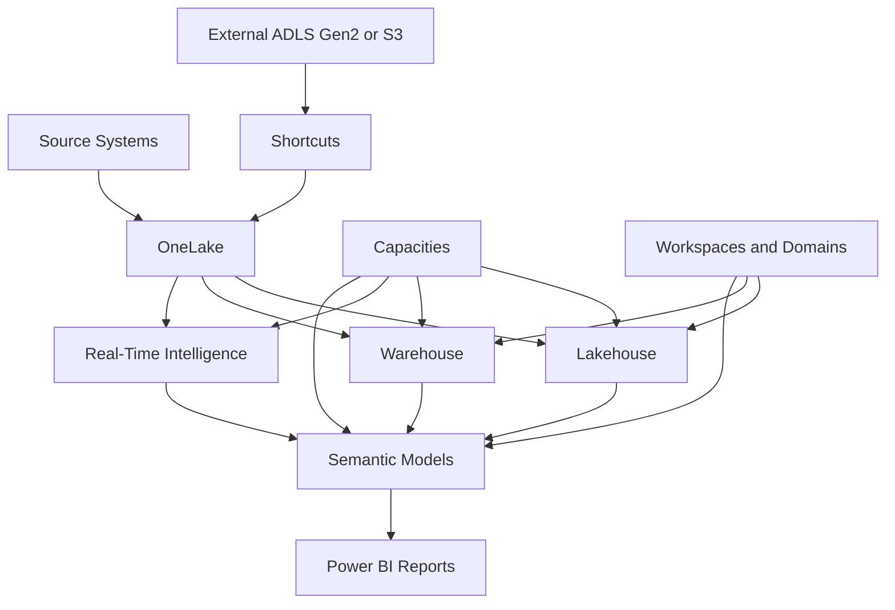
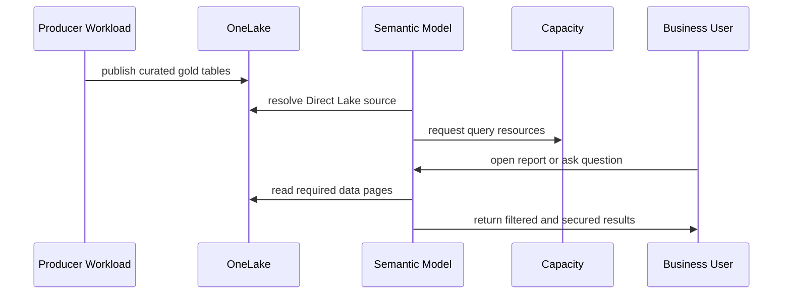
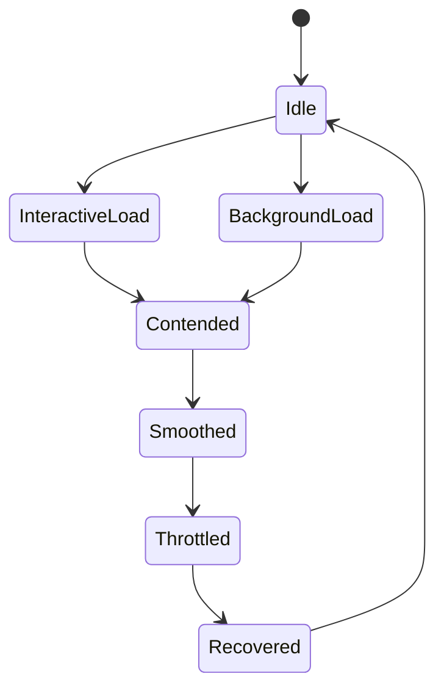

# Microsoft Fabric

> Part of the **Enterprise Data & AI Architecture Handbook** · Phase-05 - Modern Data Engineering & Lakehouse · Chapter 07.
> Estimated study time: **75 min reading + ~5h labs**.
> **Prerequisites:** read [Lakehouse Architecture](02_Lakehouse_Architecture.md) first.

---

## Executive Summary

Microsoft Fabric is a SaaS analytics platform that tries to reduce the operational gap between lake storage, SQL serving, semantic models, real-time analytics, notebooks, and enterprise BI. Its architectural center is not a single engine. It is the combination of OneLake as the shared storage substrate, capacity-governed compute surfaces, integrated workloads such as Data Engineering, Warehouse, and Real-Time Intelligence, and Power BI-native consumption patterns such as Direct Lake.

For Azure-first enterprises, Fabric is most compelling when the target operating model is Microsoft-centric, SaaS-first, and Power BI-heavy. In that model, OneLake reduces copy sprawl, shortcuts expose external data with less duplication, Fabric Lakehouse and Warehouse provide curated data surfaces, Direct Lake reduces refresh-heavy import patterns for selected semantic models, and a shared capacity model gives platform teams one control surface for cost, throttling, and workload isolation. The strength is faster platform standardization with less infrastructure assembly than Azure Databricks plus Synapse plus Power BI plus ADF assembled separately.

The most important architectural caution is that Fabric is not a universal replacement for every Azure data service. It trades away some infrastructure-level control in exchange for integrated SaaS operation. That is an advantage when the estate wants less VNet design, cluster engineering, and multi-service assembly. It is a disadvantage when the estate needs deep Spark engineering control, highly customized private-network topologies, or broad cross-platform neutrality. The right decision is therefore workload- and operating-model-driven, not branding-driven.

This chapter explains Fabric at the production-architecture level: OneLake and shortcuts, the Fabric workload model, Direct Lake behavior, capacity and governance design, and how to position Fabric versus Databricks and Synapse. The goal is to help senior engineers and architects decide where Fabric should be the default, where it should be adjacent to other platforms, and where it should not be used.

## Learning Objectives

By the end of this chapter you should be able to:

1. Explain how OneLake changes storage and copy patterns in a Microsoft analytics estate.
2. Describe how Fabric workloads such as Data Engineering, Warehouse, and Real-Time Intelligence fit together.
3. Explain how shortcuts work and when they reduce duplication versus when they create governance ambiguity.
4. Understand how Direct Lake differs from Import and DirectQuery patterns in Power BI.
5. Design a Fabric capacity strategy that separates critical and non-critical workloads.
6. Distinguish Fabric governance surfaces such as tenant settings, workspaces, domains, sensitivity labels, and semantic-model security.
7. Decide when Fabric should replace or complement Synapse, Databricks, and ADF in Azure.
8. Diagnose Fabric performance, throttling, and cost issues at the capacity and item level.
9. Design an Azure-first Fabric architecture that remains defensible in staff- and architect-level review.
10. Build a pragmatic migration path from fragmented Microsoft analytics tools into a Fabric-centered operating model.

## Business Motivation

- Many Microsoft-centric enterprises want fewer moving parts between storage, notebooks, SQL, real-time analytics, and BI consumption.
- Power BI-heavy organizations want lower-latency semantic-model access to lake data without always relying on repeated import refresh cycles.
- Platform teams want a SaaS operating model that reduces cluster and warehouse assembly work.
- Governance programs want one tenant- and workspace-aware control plane rather than disconnected analytics tools.
- Business teams want faster onboarding of analytics projects without waiting for a bespoke Azure architecture for each domain.
- Data-product teams want to reduce duplicate data copies across lake, warehouse, and BI-serving layers.
- Executives want clearer cost, capacity, and ownership signals than a scattered set of services often provides.

## History and Evolution

- Microsoft analytics estates historically used separate products for BI, lake storage, warehouse serving, pipelines, and notebooks.
- Power BI became the semantic and BI standard in many enterprises, while Azure data services handled storage, ingestion, and transformation separately.
- Synapse attempted to unify parts of the SQL, Spark, and integration story, but many estates still experienced architectural fragmentation across services.
- Fabric emerged as a SaaS-first unification layer that centers analytics around OneLake, integrated workloads, and Power BI-native consumption.
- Direct Lake changed the BI conversation by allowing selected semantic models to query lakehouse-backed data more directly than traditional import-only patterns.
- Real-Time Intelligence extended the platform beyond batch and warehouse use cases into event and KQL-driven operational analytics.
- Fabric's growth shifted the architectural question from "which individual Azure service do we need?" to "which workloads justify a more integrated SaaS operating model?"

## Why This Technology Exists

Fabric exists because many enterprises do not want to assemble and operate a full analytics platform from separate services when their target users mostly care about fast delivery, integrated governance, and consistent BI consumption. A single tenant-level SaaS platform with shared storage semantics, common workspaces, and capacity-based cost control is operationally simpler than stitching together multiple infrastructure-heavy components.

It also exists because the gap between data engineering and BI consumption has historically been expensive. The lake contains the data, the warehouse serves a subset, the BI model imports another subset, and every copy introduces latency, cost, and governance risk. Fabric's OneLake plus Direct Lake plus shared workspace model is an attempt to reduce those friction points.

The platform is especially relevant when a Microsoft estate values rapid standardization, Power BI integration, and unified capacity management more than low-level runtime customization. Where those priorities are reversed, the platform fit weakens.

## Problems It Solves

| Problem | How Fabric helps | Enterprise signal that it is working |
|---|---|---|
| analytics tool sprawl inside Microsoft estates | unifies lakehouse, warehouse, real-time, pipelines, notebooks, and BI around one SaaS control plane | fewer disconnected service handoffs |
| duplicate copies between lake and BI | Direct Lake and OneLake reduce some import and serving duplication | semantic models stop requiring separate export tables in many cases |
| fragmented storage across teams | OneLake provides one logical storage layer with workspace and item organization | fewer uncontrolled data copies and path conventions |
| slow onboarding of analytics projects | SaaS workspaces and integrated items reduce setup burden | teams spend less time waiting on bespoke infra |
| weak governance consistency across BI and data workloads | Fabric uses shared tenant, workspace, and item governance patterns | lineage, labels, and access reviews become more coherent |
| hard-to-explain platform cost | capacities provide a central cost and throttling surface | teams can attribute hotspots to capacity and workload classes |
| real-time analytics disconnected from the broader data platform | Real-Time Intelligence integrates event and KQL patterns into the same estate | streaming analytics no longer lives entirely outside the platform |
| lakehouse-to-report latency from repeated refreshes | Direct Lake shortens the path for selected models | executives see fresher data without full import churn |

## Problems It Cannot Solve

- It cannot fix weak domain modeling, poor metrics definitions, or missing data ownership.
- It does not eliminate the need for curated gold contracts as discussed in [Lakehouse Architecture](02_Lakehouse_Architecture.md).
- It is not the best default for every deep Spark-engineering use case or platform-sovereignty requirement.
- It cannot guarantee low cost if teams overload a shared capacity or publish every experiment into production workspaces.
- It does not remove the need for semantic modeling discipline just because Direct Lake exists.
- It is not a replacement for specialized low-latency operational stores or complex transactional systems.
- It does not make shortcuts a free governance shortcut; exposed data still needs ownership, quality, and policy.
- It cannot fully replace explicit Azure network engineering when private-source integration or adjacent services still matter.

## Core Concepts

### 8.1 OneLake as the logical storage foundation

OneLake is Fabric's shared logical data lake for the tenant. It provides a common storage substrate across lakehouse, warehouse, and selected analytical items. The architectural value is not only shared bytes. It is the ability to reduce copy sprawl and standardize where analytics assets live inside the SaaS platform.

### 8.2 Shortcuts as controlled low-copy access

Shortcuts expose data without physically duplicating it into a second managed copy when that duplication is unnecessary. They are useful for connecting external ADLS Gen2 or Amazon S3 data into OneLake-aligned workflows. The important discipline is to treat shortcuts as governed access patterns, not as a bypass around curation and ownership.

### 8.3 Fabric workload model

Fabric is a multi-workload platform. The most relevant workloads for enterprise architecture are:

- Data Engineering for notebooks, Spark-based lakehouse work, and managed table processing,
- Warehouse for SQL-centric curated serving,
- Real-Time Intelligence for event ingestion, KQL-based analytics, and hot-path operational insight,
- Data Factory in Fabric for selected orchestration and pipeline scenarios,
- Power BI semantic models and reports as the primary consumption layer.

This matters because a Fabric architecture should route work to the right workload surface rather than assuming every item is equally good for every task.

### 8.4 Direct Lake mode

Direct Lake lets Power BI semantic models operate more directly over OneLake-resident data than traditional import-based models, while still keeping the semantic layer inside Power BI. It reduces some refresh overhead and storage duplication, but it does not eliminate model design, data shaping, or performance discipline. A bad star schema remains bad under Direct Lake.

### 8.5 Capacity as the operating system of the platform

In Fabric, capacity is the economic and operational control surface. Workloads share compute capacity, and interactive and background operations contend within that boundary. Capacity planning therefore becomes one of the most important architectural decisions. A platform with one overloaded shared capacity will appear unreliable even if the underlying item design is reasonable.

### 8.6 SaaS governance model

Fabric governance is layered through tenant settings, capacities, workspaces, domains, item permissions, sensitivity labels, endorsements, lineage, and semantic-model security constructs such as row-level and object-level security. The strongest architectural insight is that governance in Fabric is more SaaS- and item-centric than infrastructure-centric.

### 8.7 Fabric versus Databricks versus Synapse

Fabric is strongest when the estate values SaaS simplicity, Power BI integration, and OneLake-centered unification. Databricks is strongest when the estate needs deep Spark engineering, broader platform-level control, and advanced lakehouse operations, as discussed in [Databricks Platform](05_Databricks_Platform.md). Synapse remains relevant where explicit Azure SQL-serving patterns, federated query, or broader infrastructure-level control still matter, as discussed in [Azure Data Factory and Synapse](06_Azure_Data_Factory_and_Synapse.md). The correct answer is often coexistence by workload class rather than winner-take-all standardization.

## Internal Working

### 9.1 Item-centric control plane

Fabric manages analytics assets as items in SaaS workspaces. Lakehouses, warehouses, pipelines, notebooks, eventhouses, KQL databases, semantic models, and reports exist under a common governance plane. This is different from a model where each service has its own separate provisioning and administration flow.

### 9.2 OneLake path resolution and shortcut access

When an item reads data from OneLake, the platform resolves the item context, workspace location, permissions, and underlying data reference. If the item reads through a shortcut, Fabric resolves the external or alternate internal location through the shortcut definition rather than through a manually duplicated copy.

### 9.3 Direct Lake query path

Direct Lake semantic models resolve data from OneLake-backed structures without always requiring the traditional import-copy lifecycle. This lowers some data-movement overhead, but the semantic model still governs relationships, measures, security, and user-facing logic. The optimization is therefore in storage and refresh path simplification, not in eliminating semantic modeling.

### 9.4 Capacity scheduling, smoothing, and throttling

Fabric workloads consume capacity resources through interactive and background operations. When workloads exceed healthy limits, the platform may delay, smooth, or throttle operations. This means governance and FinOps need to understand capacity behavior at the workload and workspace level, not only at the report or notebook level.

### 9.5 Real-time and historical convergence

Real-Time Intelligence lets event streams and KQL-style analytical workloads live closer to the lakehouse and BI estate than in older architectures. The operational win is that event, batch, and semantic consumption can align under a shared platform, though hot and cold paths still need distinct design discipline.

## Architecture

### 10.1 Azure-first Fabric enterprise reference architecture

The common Azure-first Fabric pattern uses Fabric capacities as the SaaS compute boundary, OneLake as the shared storage substrate, lakehouse items for engineering and staged curation, warehouse items for curated SQL-serving use cases, semantic models and reports for business consumption, Data Factory in Fabric for selective orchestration, and Real-Time Intelligence for event and operational analytics. Adjacent Azure services such as ADLS Gen2, Event Hubs, Key Vault, Entra ID, and Purview still matter, but Fabric becomes the primary user-facing analytics platform.

### 10.2 Fabric plus Azure lakehouse hybrid architecture

Many enterprises will not move everything into Fabric immediately. A pragmatic hybrid pattern keeps core lake storage or engineering on ADLS Gen2 and Databricks for selected workloads, then uses shortcuts or curated publishing into OneLake so Fabric can serve downstream semantic models, warehouse consumers, and real-time dashboards. This often gives the best blend of deep engineering control and SaaS consumption simplicity.

### 10.3 Power BI-centric SaaS analytics architecture

Organizations already standardized on Power BI often benefit most from Fabric when the main gap is not raw compute but the operational friction between data preparation, semantic publishing, and report delivery. In that pattern, Direct Lake semantic models over curated gold tables become the main value driver, and Spark or KQL workloads exist mainly to feed those curated models.

### 10.4 ADR example: adopt Fabric as the default consumption and integrated analytics platform, keep Databricks for advanced engineering

**Context:** The enterprise already uses Power BI broadly, stores data in Azure, and wants faster onboarding of analytics teams with less platform assembly. Databricks is effective for advanced engineering, but too many downstream teams are copying data into separate BI-serving layers. Leadership wants a clearer SaaS operating model and simpler capacity-based cost governance.

**Decision:** Use Microsoft Fabric as the default integrated analytics and BI-consumption platform. Standardize on OneLake, workspace governance, and Direct Lake for selected curated semantic models. Keep Databricks as the primary platform for advanced Spark engineering and selected platform-heavy transformations. Use shortcuts and curated publishing patterns to bridge the two.

**Consequences:** BI and integrated analytics delivery simplify materially, and copy sprawl decreases. The estate accepts a stronger Microsoft SaaS dependency and must treat capacity planning, workspace governance, and semantic-model discipline as first-class architecture concerns.

**Alternatives considered:**

1. Continue with separate Power BI, Synapse, ADF, and storage patterns: rejected because operational fragmentation remains too high.
2. Move all analytics engineering and consumption to Databricks: rejected because BI and SaaS-centric users would lose some integrated platform advantage.
3. Use Fabric as the only platform for all engineering and operations: rejected because some advanced workloads still require deeper platform control.

## Components

| Component | Primary role | Why it matters | Common failure mode |
|---|---|---|---|
| capacity | shared compute and cost boundary | governs performance, throttling, and spend | one capacity overloaded by too many personas |
| workspace | security and collaboration boundary | organizes items and teams | dev, test, prod, and sensitive domains mixed together |
| OneLake | shared logical storage substrate | reduces copy sprawl and unifies data access | unmanaged shortcuts and weak ownership |
| lakehouse | engineering and table-centric analytical item | supports Spark notebooks and curated tables | using it as a dumping ground with no contracts |
| warehouse | SQL-centric curated serving surface | strong fit for governed BI-serving tables | loading everything into warehouse by default |
| semantic model | business-facing semantic layer | enables measures, RLS, OLS, and Direct Lake | treating raw tables as report-ready models |
| Data Factory in Fabric | pipeline and orchestration capability | coordinates movement and transformations | expecting it to replace all engineering platforms |
| Real-Time Intelligence items | event and KQL analytics | supports hot-path operational insights | mixing hot and cold workloads carelessly |
| shortcuts | low-copy data exposure | reduces duplication and accelerates onboarding | bypassing governance review |
| notebooks and Spark jobs | code-driven transformation | keeps engineering flexible inside the SaaS platform | forcing all code patterns into UI-only workflows |
| deployment pipelines and Git integration | promotion and release control | enables controlled delivery | manual workspace drift |
| domains and endorsements | business governance metadata | improves trust and discoverability | publishing too much without curation |

## Metadata

Fabric is heavily metadata-driven.

Important metadata classes include:

- workspace and item metadata such as owner, environment, capacity assignment, and sensitivity,
- OneLake metadata such as item paths, shortcut definitions, and table structures,
- warehouse and lakehouse metadata such as schemas, tables, relationships, and query history,
- semantic-model metadata such as measures, relationships, row-level security, endorsements, and refresh or Direct Lake settings,
- real-time metadata such as event sources, KQL tables, ingestion policies, and retention settings,
- operational metadata such as run histories, notebook executions, capacity metrics, and tenant setting changes.

If metadata is incomplete, Fabric quickly becomes a collection of SaaS objects without a trustworthy control plane.

## Storage

Fabric storage design should treat OneLake as a logical unification layer, not as an excuse to ignore data-product boundaries.

| Storage concern | Recommended Fabric posture | Common mistake |
|---|---|---|
| core analytical data | use OneLake-backed lakehouse or warehouse items with explicit ownership | hiding critical data only in ad hoc files |
| external data exposure | use shortcuts where low-copy access is justified | creating shortcuts with no curation or lifecycle ownership |
| medallion layering | map raw, bronze, silver, and gold responsibilities to explicit lakehouse or warehouse structures | flattening all tables into one workspace with no lifecycle distinction |
| semantic-model serving data | point Direct Lake or warehouse models at curated gold contracts | using unstable silver tables directly for executive reports |
| real-time hot data | use Real-Time Intelligence storage and retention appropriate to event workloads | forcing all streaming data into one historical pattern |
| tenant-wide discoverability | use domains, endorsements, and lineage to explain storage purpose | assuming shared storage alone creates shared meaning |

OneLake reduces some storage-management burden, but it increases the need for governance discipline because exposure becomes easier.

## Compute

Fabric compute planning is mostly a capacity-routing problem.

| Workload class | Best Fabric surface | Why it fits | Common wrong choice |
|---|---|---|---|
| Spark-based lakehouse engineering | Data Engineering | integrated notebooks and lakehouse tables | using warehouse for complex Spark transforms |
| curated SQL marts | Warehouse | strong SQL serving and business-friendly access | keeping every BI workload on notebooks |
| semantic BI consumption | semantic models with Direct Lake or warehouse sources | aligns with Power BI-native consumption | importing every dataset by habit |
| event and operational analytics | Real-Time Intelligence | KQL-style hot-path analytics | forcing all event consumers into warehouse tables |
| light orchestration | Data Factory in Fabric | good for integrated pipeline coordination | overusing it for large external integration estates |

The main compute mistake is capacity consolidation without persona isolation. One capacity for engineering notebooks, executive reports, and real-time workloads is convenient until it fails.

## Networking

Fabric networking is more SaaS-oriented than Databricks or Synapse. That changes the architecture discussion.

Recommended Azure-first posture:

- treat Fabric as a Microsoft-managed SaaS surface and design around tenant, source, and gateway boundaries rather than per-cluster VNet injection,
- use private endpoints and private networking on adjacent Azure services such as ADLS Gen2, Key Vault, SQL, and Event Hubs where they remain part of the architecture,
- use gateways or approved private integration patterns for private or on-premises sources,
- document exactly which data paths remain external to Fabric so security reviews are not confused by the SaaS abstraction,
- separate internet-facing user access concerns from backend source connectivity concerns,
- align tenant and regional placement decisions to data-residency and latency requirements.

Fabric is often the wrong choice when the primary requirement is deep customer-controlled network topology for every compute surface.

## Security

Security in Fabric is largely identity-, item-, and semantic-model-centric.

| Concern | Recommended control |
|---|---|
| user and group lifecycle | Entra ID groups and service principals |
| workspace-level access | narrow workspace roles and least privilege |
| semantic-model data access | row-level security, object-level security, and endorsed models |
| sensitive-data governance | Microsoft Purview integration, sensitivity labels, and workspace separation |
| external source credentials | approved secret and connector patterns, not ad hoc embedded credentials |
| privileged administration | separate tenant admin, capacity admin, and workspace admin responsibilities |
| data egress and sharing | governed sharing, shortcut review, and audited external exposure |

The security warning is practical: SaaS simplicity can encourage over-broad workspace access if the governance model is not defined early.

## Performance

Fabric performance depends on model design, capacity assignment, and workload routing more than on low-level infrastructure tuning.

| Lever | Why it matters | Typical effect |
|---|---|---|
| Direct Lake over curated gold tables | reduces some refresh and copy overhead | fresher semantic-model performance with less duplication |
| isolate noisy engineering and BI workloads across capacities or workspaces | reduces contention | fewer executive-report slowdowns |
| model star schemas intentionally | semantic performance still depends on good dimensional design | lower query cost and better user experience |
| use shortcuts selectively | avoids unnecessary duplication without hiding source complexity | faster onboarding with manageable governance |
| use warehouse for warehouse-like SQL | keeps high-concurrency SQL off notebook-centric paths | more stable BI query behavior |
| use Real-Time Intelligence for hot-path event analysis | avoids forcing event workloads into cold analytical patterns | better latency for operational insights |

The common performance failure is blaming Fabric when the real issue is an overloaded capacity, weak semantic model, or wrong workload surface.

## Scalability

Fabric scales best when capacities, workspaces, and domains are designed before broad adoption.

Key scaling pressures include:

- number of workspaces and domains,
- number of semantic models and reports,
- number of concurrent business users,
- number of engineering notebooks and background jobs,
- volume of real-time ingestion,
- amount of shortcut-connected external data,
- governance effort required for endorsements, labels, and lineage.

The platform does not scale well socially if every team gets a workspace, one shared capacity, and no promotion discipline. SaaS reduces infrastructure toil, not governance toil.

## Fault Tolerance

Fabric provides managed service resilience, but enterprise reliability still depends on design choices.

| Failure mode | Fabric response | Remaining design responsibility |
|---|---|---|
| failed background refresh or job | managed run history and rerun options | define retry semantics and ownership |
| capacity saturation | platform queues, smooths, or throttles operations | isolate critical workloads and size capacities correctly |
| bad shortcut target or permission drift | item access fails visibly | review source ownership and connectivity governance |
| semantic-model regression | reports fail or slow despite healthy storage | enforce semantic change control and testing |
| event burst beyond hot-path assumptions | real-time latency degrades | design retention, ingestion, and workload tiers intentionally |
| tenant or admin misconfiguration | platform behavior changes quickly across many items | use change control and environment separation |

Fabric removes some infrastructure failure burden, but it does not remove platform-operating discipline.

## Cost Optimization

Fabric cost is dominated by capacity decisions, duplication patterns, and consumer behavior.

High-value cost levers:

- size capacities by workload class, not by optimism,
- use Direct Lake to reduce unnecessary import refresh duplication where the model fit is strong,
- keep exploratory engineering off premium business-reporting capacities where possible,
- publish only justified semantic models and warehouses rather than every intermediate artifact,
- use shortcuts to reduce duplicate storage when governance and performance allow it,
- route event workloads to Real-Time Intelligence only when hot-path analytics adds real value,
- review dormant workspaces, reports, and duplicated marts regularly,
- govern deployment pipelines so test and abandoned items do not linger on expensive capacities.

| Lever | Benefit | Risk if overused |
|---|---|---|
| shared OneLake storage model | lower duplicate storage and movement | easier accidental overexposure |
| Direct Lake | lower refresh overhead for selected models | poor semantic design can still waste capacity |
| capacity isolation by persona | better predictability for critical workloads | too many capacities can fragment spend |
| selective shortcuts | faster onboarding and lower copy cost | source-system volatility can leak into consumers |
| warehouse only where needed | lower unnecessary SQL-serving spend | under-serving some BI workloads if done dogmatically |

Worked FinOps example: assume a Power BI-heavy enterprise currently maintains one import semantic model per business unit, each refreshing from duplicated gold tables exported into separate serving schemas. The duplicated serving footprint totals 4 TB, and the report estate is pushing the team from an illustrative F64 capacity to an F128 because refresh and query windows overlap badly. By moving the largest curated semantic models to Direct Lake over shared gold tables in OneLake, removing duplicate export tables, and separating exploratory engineering from executive reporting on a different capacity, the team keeps the critical BI estate within an F64-equivalent envelope instead of expanding to F128. If the avoided capacity jump is illustratively worth $6,000 per month and duplicate storage plus refresh compute avoided is worth another $1,200, the annual difference is material. The point is not the exact SKU math. The point is that Fabric costs are shaped by capacity routing and duplication discipline, not by report count alone.

## Monitoring

Monitoring should answer whether Fabric workloads are healthy against explicit service objectives.

Minimum signals:

- capacity utilization, throttling, and queued operations,
- lakehouse and warehouse query latency,
- semantic-model query latency and refresh or Direct Lake behavior,
- notebook and pipeline run success and duration,
- real-time ingestion lag and query latency,
- shortcut access failures and source availability,
- workspace admin changes and sharing activity,
- spend by capacity, workspace, and workload class.

| Area | Metric | Alert example |
|---|---|---|
| capacity health | throttling events and queued work | interactive report latency breaches expected band |
| BI serving | semantic-model p95 query time | executive dashboard slowdown exceeds SLA |
| engineering | notebook and pipeline failure rate | repeated failed background jobs |
| real-time | ingestion lag and KQL latency | event backlog breaches target window |
| governance | unusual sharing or admin changes | privilege-change spike outside change window |
| FinOps | monthly cost by capacity | unexpected rise without new business demand |

## Observability

Observability should explain why a Fabric tenant or workspace became slower, noisier, or more expensive, not just that it did.

Useful observability practices:

- correlate capacity spikes with specific reports, notebooks, pipelines, or event workloads,
- track whether Direct Lake models are performing as expected or are forcing less efficient access patterns,
- tie business incidents back to workspace, item, and capacity changes,
- preserve lineage and semantic-model release context for critical reports,
- measure which shortcuts serve stable curated data and which expose unstable upstream behavior,
- expose capacity contention between background and interactive work as an explicit operating signal.

### Operational Response Playbook

| Signal | Detection query or check | Immediate remediation |
|---|---|---|
| Executive reports slow during engineering windows | inspect capacity metrics, background-job spikes, and semantic-model query latency | move or defer non-critical engineering workloads, isolate capacities, and review schedule overlap |
| Direct Lake model behaves inconsistently | inspect semantic-model design, source table health, and recent schema or shortcut changes | validate gold-table contract, repair the model, and stop routing unstable tables into production BI |
| Shortcut-backed dataset suddenly fails | inspect source ownership, permissions, and upstream path changes | restore source access, repoint the shortcut if appropriate, and notify dependent consumers |
| Real-time dashboards lag behind event source | inspect ingestion lag, KQL workload metrics, and capacity contention | scale or isolate real-time workload capacity and review retention or query patterns |
| Capacity spend rises without more users | compare new workspaces, notebooks, warehouses, and semantic models against prior baseline | retire unused items, reassign noisy workloads, and tighten deployment governance |

Monitoring tells you Fabric is stressed. Observability tells you whether the cause is capacity contention, semantic-model drift, shortcut volatility, or workload-routing failure.

## Governance

Fabric governance is the boundary between a controlled SaaS platform and a report-and-workspace sprawl problem.

Core rules:

- define capacity ownership and workload classes explicitly,
- separate dev, test, prod, and sensitive-domain workspaces,
- make endorsed semantic models the default BI contract rather than raw item discovery,
- review shortcuts before exposing them to broad consumer workspaces,
- control tenant settings, external sharing, and service-principal usage centrally,
- require Git integration and deployment pipelines for production items,
- enforce naming, lineage, and ownership conventions for lakehouses, warehouses, and semantic models,
- keep OneLake openness aligned to data-product governance rather than convenience.

Fabric governance should be treated as a combination of data governance, BI governance, and SaaS platform governance. Ignoring any one of those three leaves a hole in the architecture.

## Trade-offs

| Benefit | Trade-off | When the trade-off is acceptable |
|---|---|---|
| integrated SaaS platform | less infrastructure-level control | when speed and simplification matter most |
| OneLake unification | stronger platform dependency on Microsoft patterns | when the estate is already Microsoft-heavy |
| Direct Lake | semantic-model design still matters deeply | when curated gold contracts are strong |
| capacity-based governance | contention becomes a tenant-wide architectural issue | when teams can enforce workload isolation |
| easier cross-persona collaboration | workspace and item sprawl can grow quickly | when governance is mature |
| integrated real-time and BI surfaces | one platform can attract too many dissimilar workloads | when routing rules are explicit |

## Decision Matrix

| Scenario | Recommended choice | Why | When not to choose Fabric as default |
|---|---|---|---|
| Power BI-centric enterprise wanting SaaS simplification | Fabric | strongest integrated BI and lakehouse operating model | if deep platform control is more important than SaaS simplicity |
| advanced Spark engineering and heavy platform customization | Databricks | more explicit compute and governance control for engineering | if the estate mainly needs integrated BI consumption |
| explicit Azure SQL and federated query architecture | Synapse | clearer dedicated versus serverless SQL surfaces | if the target is broader SaaS unification |
| mixed Microsoft estate with heavy hybrid integration | Fabric plus adjacent ADF or Databricks | pragmatic coexistence by workload class | if the org insists on one tool for every concern |
| real-time operational dashboards plus enterprise BI | Fabric can fit well | Real-Time Intelligence plus semantic layer integration | if latency or protocol needs exceed Fabric fit |
| cross-cloud-neutral platform strategy | open stack or carefully limited managed use | avoids overcommitting to one SaaS platform | if Microsoft-native productivity is the top priority |

## Design Patterns

1. OneLake hub with curated gold contracts: keep shared storage value while preserving domain boundaries.
2. Direct Lake over governed semantic models: use it for stable gold tables rather than volatile engineering outputs.
3. Capacity separation by persona: isolate executive BI, engineering, and experimental workloads where business criticality differs.
4. Shortcut-mediated federation: expose external lake data selectively without creating blind copies.
5. Warehouse for SQL-heavy curated marts, lakehouse for engineering: keep workload surfaces intentional.
6. Real-Time Intelligence for hot-path telemetry, warehouse or lakehouse for colder historical analysis.
7. Git and deployment pipelines for production Fabric items.
8. Domain and endorsement model for discoverability and trust.

## Anti-patterns

1. Putting every workspace on one shared critical capacity.
2. Treating Direct Lake as an excuse to skip star-schema and semantic-model discipline.
3. Creating shortcuts everywhere because copying feels inefficient.
4. Using warehouse, lakehouse, and semantic models without clearly assigned consumer roles.
5. Publishing experimental notebooks and production reports in the same workspace.
6. Assuming Fabric removes the need for Azure-adjacent network and source governance.
7. Recreating duplicated marts inside Fabric because old patterns were never challenged.
8. Using Fabric as the answer to deep custom engineering requirements it was not designed for.

## Common Mistakes

1. Confusing storage unification with governance maturity.
2. Underestimating capacity contention between background engineering and interactive BI.
3. Designing Direct Lake models over unstable or weakly curated tables.
4. Treating shortcuts as technical conveniences rather than governed data exposures.
5. Letting workspace roles sprawl because SaaS administration feels easy.
6. Ignoring semantic-model testing because the data is already "in the lake."
7. Expecting Fabric to replace Databricks or Synapse without a workload-by-workload review.
8. Publishing too many overlapping semantic models for the same business concepts.
9. Missing lineage and endorsement curation as the tenant grows.
10. Measuring adoption by the number of workspaces instead of trusted production outcomes.

## Best Practices

1. Start with capacity, workspace, and domain design before mass onboarding.
2. Curate gold tables and semantic models intentionally before enabling Direct Lake broadly.
3. Use shortcuts for governed federation, not for escaping ownership rules.
4. Keep executive BI, engineering, and experimental workloads on distinct operational paths.
5. Use endorsed semantic models as the business contract for common metrics.
6. Preserve Git-backed release control for production notebooks, pipelines, and models.
7. Track capacity consumption by workload class and workspace from the start.
8. Keep Fabric adjacent to Databricks or Synapse where their strengths remain necessary.
9. Review workspace roles, sharing, and sensitivity labeling regularly.
10. Treat OneLake openness as a strategic capability that must be governed, not merely enabled.

## Enterprise Recommendations

- Choose Fabric as the default integrated analytics platform when the estate is already Power BI-heavy and wants a SaaS-first operating model.
- Keep Databricks as the preferred adjacent platform for advanced Spark engineering where Fabric is not the strongest fit.
- Use Fabric capacities as a formal FinOps and reliability boundary, not as an afterthought.
- Standardize on OneLake plus curated gold tables plus endorsed semantic models rather than allowing every team to invent a new serving pattern.
- Treat shortcuts as reviewed architectural assets.
- Reserve Real-Time Intelligence for workloads that genuinely benefit from event and KQL patterns.
- Use workspace and domain governance aggressively early; retrofitting it later is painful.
- Maintain a platform decision framework that explicitly compares Fabric, Databricks, and Synapse by workload shape.

## Azure Implementation

### Service map

| Fabric concern | Primary Fabric surface | Supporting Azure or Microsoft service |
|---|---|---|
| shared storage and analytics data | OneLake | Entra ID, Purview, adjacent ADLS Gen2 where needed |
| engineering notebooks and Spark tables | Data Engineering and Lakehouse | Power BI tenant controls, Git integration |
| curated SQL marts | Warehouse | semantic models, deployment pipelines |
| BI consumption | Power BI semantic models and reports | Direct Lake, RLS, OLS |
| hot-path analytics | Real-Time Intelligence | Event Hubs or other event sources where appropriate |
| orchestration | Data Factory in Fabric | adjacent Azure integration services when external reach is large |
| governance | workspaces, domains, endorsements, labels | Purview, tenant admin settings |

### Fabric notebook PySpark: publish curated gold table

```python
from pyspark.sql.functions import col, date_trunc, sum as spark_sum

orders = spark.read.table("sales_lakehouse.silver_orders")

gold_daily = (
    orders
    .where(col("order_status") == "COMPLETED")
    .groupBy(
        col("customer_id"),
        date_trunc("day", col("order_ts")).alias("order_day")
    )
    .agg(spark_sum("gross_revenue").alias("gross_revenue"))
)

(
    gold_daily.write
    .format("delta")
    .mode("overwrite")
    .saveAsTable("sales_lakehouse.gold_daily_revenue")
)
```

### Warehouse SQL: curated mart for SQL consumers

```sql
CREATE TABLE dbo.daily_revenue_mart AS
SELECT
    customer_id,
    order_day,
    gross_revenue
FROM sales_lakehouse.gold_daily_revenue;
```

### KQL: real-time operational insight

```kusto
OrdersEventStream
| where EventTime > ago(15m)
| summarize TotalRevenue = sum(GrossRevenue), Orders = count() by bin(EventTime, 5m), Region
| order by EventTime asc
```

### Semantic-model design note for Direct Lake

Recommended Direct Lake posture:

- point semantic models at curated gold tables, not raw lakehouse tables,
- keep dimensions and measures explicit rather than relying on auto-detection,
- validate row-level security and model behavior before broad rollout,
- test model behavior under realistic concurrency on the target capacity.

Azure implementation note: Fabric is SaaS-first, so the strongest implementation artifacts are often item definitions, notebook code, semantic-model design, workspace governance, and deployment pipelines rather than low-level network templates. That is a feature when the operating model wants less infrastructure, and a limitation when it needs more.

## Open Source Implementation

There is no single open-source platform that reproduces Fabric end to end. The closest equivalent is a composed analytics platform.

Reference stack:

- MinIO or cloud object storage for a shared open lake,
- Delta Lake or Apache Iceberg for transactional tables,
- Spark on Kubernetes for engineering workloads,
- Trino for federated SQL access,
- dbt for curated marts and semantic discipline,
- Superset for BI serving,
- Kafka plus Flink or Spark Structured Streaming for hot-path data,
- ClickHouse for selected real-time analytical serving,
- OpenMetadata or Apache Atlas for metadata and lineage,
- Prometheus, Grafana, and OpenTelemetry for operations.

### Trino plus Iceberg catalog example

```properties
connector.name=iceberg
iceberg.catalog.type=rest
iceberg.rest-catalog.uri=http://nessie:19120/api/v1
fs.native-s3.enabled=true
s3.endpoint=http://minio:9000
```

### dbt model for curated mart publication

```sql
{{ config(materialized='table') }}

select
    customer_id,
    order_day,
    sum(gross_revenue) as gross_revenue
from {{ ref('gold_daily_revenue_source') }}
group by customer_id, order_day
```

### ClickHouse real-time aggregate example

```sql
CREATE MATERIALIZED VIEW revenue_5m_mv
ENGINE = SummingMergeTree
ORDER BY (event_window, region)
AS
SELECT
    toStartOfFiveMinute(event_time) AS event_window,
    region,
    sum(gross_revenue) AS gross_revenue
FROM orders_events
GROUP BY event_window, region;
```

The warning is operational rather than ideological: this stack can approximate many Fabric patterns, but only by operating separate storage, SQL, BI, metadata, streaming, and observability components that Fabric integrates under one SaaS control plane.

## AWS Equivalent (comparison only)

| Fabric surface | AWS equivalent | Comparison note |
|---|---|---|
| OneLake | Amazon S3 plus Lake Formation and Glue catalog | similar open-storage role, but no identical tenant-wide SaaS OneLake abstraction |
| Warehouse | Amazon Redshift | comparable curated SQL-serving role with different operational model |
| Direct Lake plus semantic model | QuickSight plus Redshift or Athena patterns | no direct functional equivalent to Fabric's exact Direct Lake semantics |
| Real-Time Intelligence | Kinesis plus managed analytics and query surfaces | AWS requires more composed architecture |
| Data Engineering in Fabric | EMR, Glue, or Databricks on AWS | more componentized and infrastructure-aware |
| capacity model | service-by-service cost and reservation model | less unified than Fabric's single-capacity concept |

Selection criteria: AWS equivalents are strongest when the organization prefers composed services and explicit infrastructure control over a single Microsoft-centric SaaS analytics surface.

## GCP Equivalent (comparison only)

| Fabric surface | GCP equivalent | Comparison note |
|---|---|---|
| OneLake | BigLake plus Cloud Storage | similar logical-governance intent with different architecture |
| Warehouse | BigQuery | stronger serverless warehouse default, but not the same integrated Power BI model |
| Direct Lake plus semantic model | Looker plus BigQuery | similar consumption goal with different semantics and governance path |
| Real-Time Intelligence | Pub/Sub plus BigQuery streaming or related analytics paths | more componentized than Fabric's integrated experience |
| Data Engineering in Fabric | Dataproc or Databricks on GCP | more explicit compute control, less unified SaaS analytics surface |
| capacity model | slot reservations and service budgets | different operating model from Fabric capacities |

Selection criteria: GCP becomes attractive when BigQuery-centric analytics and Google-native services are a better fit than Microsoft-centric semantic and SaaS integration.

## Migration Considerations

Recommended migration sequence:

1. Inventory current Power BI models, lake or warehouse storage, downstream marts, and duplicated serving paths.
2. Decide whether Fabric is becoming the default BI-consumption platform, the broader analytics platform, or only a selective workspace.
3. Design capacity, workspace, domain, and tenant-governance boundaries before moving many teams.
4. Migrate one curated gold domain into OneLake with a clear semantic-model contract.
5. Test Direct Lake against realistic model shape, security, and concurrency.
6. Introduce shortcuts selectively where external data exposure is more valuable than managed copying.
7. Keep advanced engineering on Databricks or adjacent Azure services until Fabric proves the workload fit.

Migration warnings:

- do not migrate reports without rationalizing duplicated semantic models,
- do not assume Fabric automatically eliminates the need for curated gold layers,
- do not put all workspaces on one capacity just because onboarding is easy,
- do not turn shortcuts into unmanaged shadow integration patterns.

## Mermaid Architecture Diagrams

### Fabric reference architecture



### Direct Lake and consumption sequence



### Capacity and workload state model



## End-to-End Data Flow

An end-to-end Fabric flow typically works like this:

1. Source data lands in OneLake directly or is exposed through a shortcut.
2. Data Engineering notebooks or pipelines curate lakehouse tables.
3. Gold tables are published either in lakehouse form or into warehouse items for SQL-centric consumers.
4. Real-Time Intelligence ingests hot operational streams where required.
5. Semantic models are built over curated tables, ideally with Direct Lake where the model fit is strong.
6. Reports and downstream analysts query the semantic model rather than the raw tables.
7. Capacity governance and observability track which workloads consume shared resources.
8. Domains, endorsements, and labels tell consumers which data products are trusted.

## Real-world Business Use Cases

| Use case | Why Fabric fits |
|---|---|
| Power BI-heavy enterprise modernization | integrated semantic, lakehouse, and governance model reduces tool sprawl |
| departmental analytics at scale | SaaS workspaces accelerate onboarding and reduce infra friction |
| curated self-service BI over central gold tables | Direct Lake shortens the path from governed data to reports |
| retail or sales operational dashboards | real-time and historical analytics can share one platform experience |
| finance and executive scorecards | warehouse and semantic models provide strong curated-serving patterns |
| Microsoft-first data-product platform | OneLake plus workspaces provide a common landing and sharing model |

## Industry Examples

- Retail: unify e-commerce, sales, and inventory reporting around OneLake and Direct Lake-powered semantic models.
- Financial services: combine curated marts, strict workspace governance, and real-time operational insight under one tenant.
- Healthcare: centralize governed analytical data with endorsement, labeling, and carefully curated semantic models.
- Manufacturing: pair real-time plant telemetry dashboards with historical quality and supply analytics in one platform.
- Public sector: reduce analytics-platform fragmentation while keeping strong tenant-level governance and BI consistency.

## Case Studies

### Case study 1: public Microsoft modernization pattern

Public Microsoft architecture guidance and customer narratives consistently position Fabric as strongest where the primary pain is platform fragmentation across Power BI, lake data, and curated analytics delivery. The pattern succeeds when teams already trust Power BI and need a more integrated SaaS operating model behind it.

### Case study 2: shortcut governance failure story

A repeated failure pattern in early Fabric adoption is creating shortcuts rapidly from many external sources because the low-copy model feels efficient. Teams then discover that semantic consumers are reading unstable, differently governed data with unclear ownership. The recovery pattern is always governance-first: review shortcuts like data-product exposures, not like folder links.

### Case study 3: capacity contention in mixed personas

Another common failure is placing engineering notebooks, executive dashboards, and real-time analytics on the same critical capacity. Nothing looks wrong during pilot scale, but once scheduled workloads and business-hour report traffic overlap, users experience inconsistent latency and throttling. The fix is not magical tuning. It is capacity architecture and workload isolation.

## Hands-on Labs

### Lab 1: Build a governed Fabric lakehouse and semantic path

Goal: publish a curated gold table and consume it through a semantic model.

Tasks:

1. Create a lakehouse workspace structure for dev and prod.
2. Load a sample silver table and publish a gold table through a notebook.
3. Build a semantic model over the gold table.
4. Compare Direct Lake behavior with a traditional import approach.

Expected outcome: a concrete understanding of how curation and BI consumption interact in Fabric.

### Lab 2: Use shortcuts intentionally

Goal: expose external data without uncontrolled duplication.

Tasks:

1. Create a shortcut to approved external data.
2. Document ownership and source volatility.
3. Build a small validation notebook over the shortcut data.
4. Decide whether the shortcut should remain consumer-facing or be republished as a curated table.

Expected outcome: a governance-aware shortcut pattern rather than a convenience-only pattern.

### Lab 3: Compare Fabric workload routing

Goal: decide which Fabric surface should handle which work.

Tasks:

1. Run one moderate transformation in a lakehouse notebook.
2. Publish a curated SQL mart in Warehouse.
3. Build a simple KQL insight in Real-Time Intelligence.
4. Explain why each surface was chosen.

Expected outcome: a workload-routing rationale grounded in platform fit.

### Lab 4: Capacity behavior and isolation

Goal: understand the real platform bottleneck.

Tasks:

1. Simulate report activity and notebook activity on one capacity.
2. Observe capacity metrics and response times.
3. Separate the workloads by workspace or capacity.
4. Document the before-and-after operational effect.

Expected outcome: a practical understanding of why Fabric capacity design is architecture, not administration.

## Exercises

1. Explain the difference between OneLake and a traditional data lake account.
2. Describe when a shortcut is the right pattern and when it is dangerous.
3. Compare Direct Lake with Import and DirectQuery at a production-architecture level.
4. Explain why Fabric capacity is both a FinOps and a reliability concern.
5. Design a workspace and domain model for three business units and two environments.
6. Compare Fabric Data Engineering and Databricks for a complex transformation workload.
7. Explain when Fabric Warehouse should be used instead of a lakehouse table plus semantic model alone.
8. Propose a governance rule set for shortcut approvals and semantic-model endorsements.

## Mini Projects

1. Fabric capacity blueprint: design capacity tiers, workspace assignments, and operating guardrails for a multi-team tenant.
2. Direct Lake pilot: migrate one business-critical semantic model from duplicated imports to curated Direct Lake.
3. Fabric versus Databricks decision guide: build a workload-routing rubric for your enterprise.

## Capstone Integration

This chapter should be used as the SaaS-platform complement to [Lakehouse Architecture](02_Lakehouse_Architecture.md). Lakehouse architecture explains why open storage, governance, and serving separation matter. Fabric explains how a Microsoft-centric SaaS platform can package many of those ideas for faster delivery, especially when semantic BI consumption is central.

Capstone deliverable: design a Fabric-centered analytics platform slice for one business domain, including OneLake structure, shortcut rules, capacity assignment, semantic-model strategy, real-time fit, and coexistence boundaries with Databricks or Synapse. Then defend the design in an architecture review.

## Interview Questions

1. What is OneLake, and why is it not just another storage account?
2. What problem do shortcuts solve, and what risk do they introduce?
3. How does Direct Lake differ from Import and DirectQuery?
4. Why is capacity planning central to Fabric architecture?
5. When should Fabric Warehouse be used instead of only Lakehouse plus semantic models?
6. How does Fabric differ from Databricks for advanced engineering work?
7. Why can one shared capacity become a production risk?
8. When should Fabric not be the default platform?

## Staff Engineer Questions

1. How would you standardize workspace, domain, and semantic-model patterns across many Fabric teams without slowing delivery too much?
2. What criteria would you apply before allowing a shortcut into a production consumer workspace?
3. How would you decide whether a model should use Direct Lake or another access mode?
4. What telemetry would you preserve so capacity regressions can be diagnosed after a release?
5. How would you route workloads between Fabric, Databricks, and Synapse in a mixed estate?
6. What production controls would you require before allowing Real-Time Intelligence workloads onto shared capacities?

## Architect Questions

1. When is Fabric the right primary analytics platform for an Azure-first enterprise, and when is it not?
2. How should capacities, workspaces, and domains map to business units, environments, and sensitivity boundaries?
3. How should OneLake, shortcuts, and curated gold contracts be governed together?
4. Where should semantic-model ownership live relative to data-product ownership?
5. How should Fabric coexist with Databricks and Synapse without creating new platform overlap?
6. What is the minimum security and governance baseline before onboarding regulated workloads into Fabric?

## CTO Review Questions

1. What business outcomes improve if we standardize more of the analytics estate on Fabric?
2. Where are we currently paying for duplicated copies, duplicated BI models, or fragmented Microsoft analytics operations?
3. How much infrastructure control are we willing to trade for SaaS simplicity and integrated BI delivery?
4. Which workloads should remain on Databricks, Synapse, or other platforms even if Fabric becomes strategic?
5. What operating-model changes are required so capacities, workspaces, and semantic models remain governed at scale?
6. How will we measure Fabric success beyond the number of workspaces or reports created?

## References

- [Lakehouse Architecture](02_Lakehouse_Architecture.md)
- [Databricks Platform](05_Databricks_Platform.md)
- [Azure Data Factory and Synapse](06_Azure_Data_Factory_and_Synapse.md)
- Microsoft Fabric documentation for OneLake, lakehouse, warehouse, Real-Time Intelligence, semantic models, and tenant governance.
- Power BI documentation for Direct Lake, semantic models, row-level security, and deployment pipelines.
- Microsoft guidance for Fabric capacities, workspace administration, and governance patterns.
- Public Microsoft architecture material and customer case studies on Fabric adoption, Direct Lake, and OneLake design.

## Further Reading

- Advanced Fabric capacity planning and workload isolation strategies.
- Direct Lake modeling limitations, design trade-offs, and operational playbooks.
- OneLake shortcut governance, lineage, and external-data stewardship patterns.
- Real-Time Intelligence architecture and KQL workload design.
- Fabric Git integration, deployment pipelines, and CI or CD operating models.
- Comparative platform strategy for Fabric, Databricks, Synapse, and Power BI.
- Tenant-level governance and domain operating models for large Fabric estates.