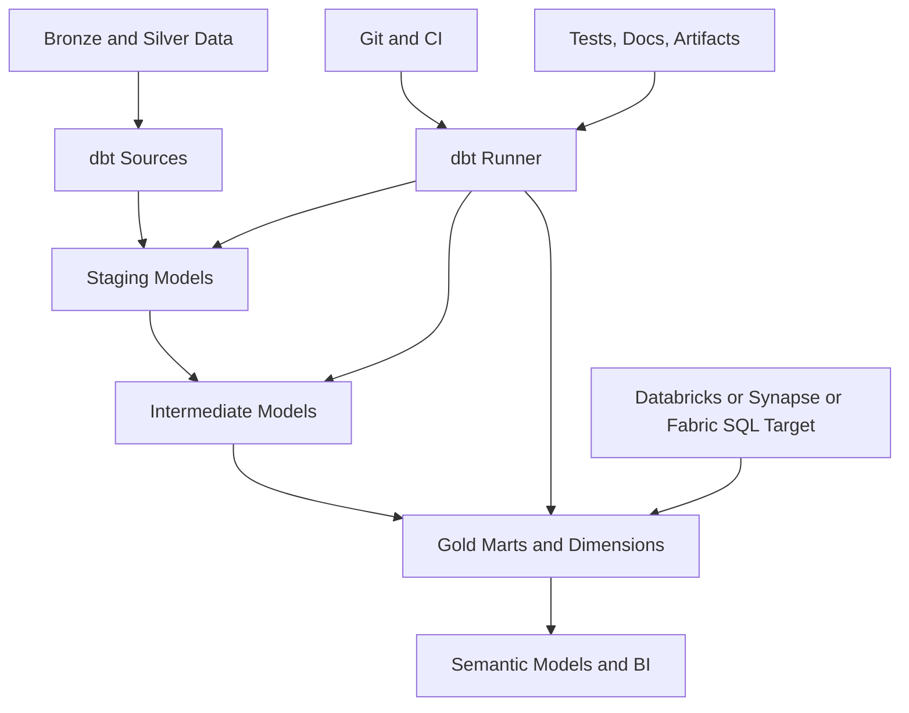
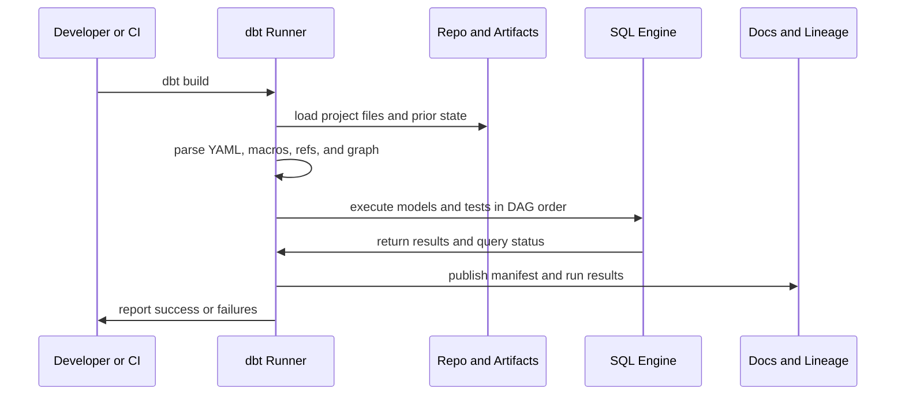
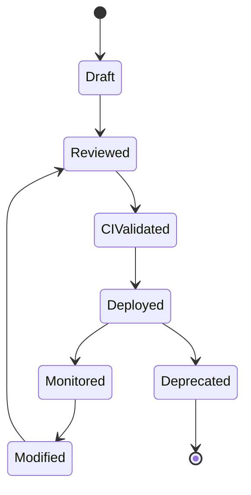

# dbt and Analytics Engineering

> Part of the **Enterprise Data & AI Architecture Handbook** · Phase-05 - Modern Data Engineering & Lakehouse · Chapter 08.
> Estimated study time: **60 min reading + ~4h labs**.
> **Prerequisites:** read [Medallion Architecture](03_Medallion_Architecture.md) first.

---

## Executive Summary

dbt is the software-engineering layer for analytical SQL transformation. It does not replace storage, orchestration, or distributed compute platforms. It standardizes how teams define transformations as code, build dependency-aware DAGs with `ref()` and `source()`, test data contracts, document business logic, and promote curated analytical models through environments with CI or CD discipline. The architectural value is that SQL transformation stops being an opaque collection of warehouse scripts and starts behaving more like a governed application codebase.

For Azure-first enterprises, the strongest dbt posture is usually dbt Core or dbt Cloud operating over governed analytical engines such as Azure Databricks SQL warehouses, Synapse dedicated SQL pools, or Fabric Warehouse and curated SQL endpoints where supported. The winning pattern is to use dbt for silver-to-gold and gold-serving transformations aligned to the medallion contract from [Medallion Architecture](03_Medallion_Architecture.md), while keeping ingestion, raw landing, and heavy non-SQL compute on better-fit services. In that model, dbt becomes the contract and release layer for analytics engineering, not an attempt to make SQL perform every platform role.

The most important technical insight is that dbt is a compiler and dependency manager around SQL, metadata, tests, and artifacts. It compiles Jinja-templated SQL, resolves model lineage, executes nodes in dependency order, persists run artifacts, and exposes those artifacts to documentation, CI, and observability patterns. Teams that understand that model use dbt well. Teams that think it is only a SQL runner usually overload it with orchestration, ingestion, or procedural logic that belongs elsewhere.

This chapter covers dbt at production depth: models, refs, sources, DAGs, tests, snapshots, docs, incremental models, materializations, Azure targets such as Databricks, Synapse, and Fabric, and the analytics-engineering workflow that makes dbt useful beyond the first few marts. The goal is not tool fandom. The goal is to give you a defensible way to decide where dbt belongs in an enterprise data platform and how to run it with engineering discipline.

## Learning Objectives

By the end of this chapter you should be able to:

1. Explain how dbt models, refs, sources, and DAGs structure analytical transformations.
2. Distinguish dbt's role from ingestion, orchestration, semantic serving, and distributed compute platforms.
3. Design testing, documentation, and lineage practices that make analytical SQL production-grade.
4. Explain how snapshots, incremental models, and materializations work and when each is appropriate.
5. Route dbt workloads correctly across Azure Databricks, Synapse, and Fabric targets.
6. Design an analytics-engineering workflow with CI, environment isolation, and release controls.
7. Identify the operational, cost, governance, and performance trade-offs of dbt adoption.
8. Decide when dbt is the correct transformation layer and when another tool or engine should own the logic.
9. Build a pragmatic Azure-first architecture for dbt in a medallion-aligned platform.
10. Defend dbt platform choices in engineer, staff engineer, architect, and CTO review settings.

## Business Motivation

- Enterprises need analytical SQL logic to be testable, reviewable, and deployable like software instead of like unmanaged scripts.
- Data teams want a shared transformation framework that standardizes lineage, documentation, and CI behavior across many domains.
- Business stakeholders need confidence that gold tables and marts are governed, tested, and traceable back to curated upstream assets.
- Platform teams need a way to separate raw landing and heavy engineering from business-facing SQL transformation responsibilities.
- Azure-first estates often have multiple candidate execution engines, and dbt provides a consistent modeling discipline across them.
- Modern analytics engineering requires faster iteration without losing release quality, ownership, or explainability.
- FinOps programs benefit when repeated full-refresh SQL patterns are replaced with deliberate incremental and contract-aware design.

## History and Evolution

- Traditional BI and warehouse teams often managed SQL through stored procedures, scheduled scripts, or GUI ETL tools with weak source control and limited test discipline.
- As cloud warehouses and lakehouse SQL surfaces matured, transformation logic became easier to write but also easier to proliferate without standards.
- dbt emerged to apply software-engineering practices to analytics SQL: version control, modularity, dependencies, tests, documentation, and artifacts.
- The analytics engineering role then emerged around dbt-style practices: staging layers, curated marts, documented metrics logic, and CI-backed SQL changes.
- dbt's materializations and incremental model support let teams scale beyond simple view-building into more serious production transformation patterns.
- Ecosystem growth added adapters for major platforms, making dbt a cross-engine abstraction for analytical SQL rather than a warehouse-specific niche.
- In Azure estates, dbt increasingly became the transformation discipline layer over Databricks SQL, Synapse dedicated SQL, and Fabric-aligned serving surfaces rather than a competitor to those engines.

## Why This Technology Exists

dbt exists because SQL transformation became central to analytics but remained operationally immature in many enterprises. Analysts and engineers wrote useful business logic, yet that logic often lived in undocumented views, copied scripts, stored procedures, or notebooks that were hard to test and harder to review. The problem was not SQL itself. The problem was the absence of an engineering framework around SQL.

dbt solves that by turning SQL transformations into a graph of nodes with explicit dependencies, configuration, tests, and documentation. It treats analytical transformation as a codebase. That lets teams reason about upstream sources, downstream marts, CI impact, incremental behavior, and data contracts more systematically.

It also exists because modern analytical platforms have multiple compute and serving layers. A company may ingest through ADF or Kafka, refine through Spark, publish curated marts through Databricks SQL, Synapse, or Fabric, and serve through semantic models. dbt gives the silver-to-gold and gold-modeling layers a portable discipline across those target systems, as long as the logic stays inside the SQL-first transformation envelope.

## Problems It Solves

| Problem | How dbt helps | Enterprise signal that it is working |
|---|---|---|
| SQL logic is scattered and undocumented | centralizes models, tests, docs, and lineage in one repo | new engineers can trace marts without archaeology |
| dependencies are implicit and fragile | `ref()` and `source()` create explicit DAGs | breakage is detected before production consumers do |
| gold transformations are inconsistent across teams | standard staging, intermediate, and mart patterns create repeatability | marts across domains start to look intentionally designed |
| data quality is checked too late | tests run alongside transformation workflows | defect detection shifts closer to code change |
| slowly changing analytical history is hard to maintain | snapshots and incremental patterns standardize historical tracking | business audits no longer depend on ad hoc table copies |
| releases are risky | CI, docs generation, and state-aware selection narrow change risk | teams deploy SQL changes more frequently with less fear |
| medallion layers are conceptually clear but operationally messy | dbt codifies silver and gold modeling contracts | transformations align more visibly to medallion intent |
| business logic is trapped in warehouse-specific procedures | dbt raises logic into a more transparent code layer | model ownership and review improve materially |

## Problems It Cannot Solve

- It cannot ingest data or replace a full data-movement platform.
- It does not substitute for deep Spark engineering when transformations are not naturally SQL-first.
- It is not the right home for low-latency operational business logic or transactional workloads.
- It cannot fix weak source-system contracts or ambiguous business definitions on its own.
- It does not eliminate the need for orchestration, secrets management, network design, and environment isolation.
- It will not rescue poorly designed marts or bad dimensional models just because they are version-controlled.
- It is not the best default for raw and bronze transformations that require heavy procedural parsing or opaque binary processing.
- It cannot replace a semantic layer, although it can prepare data for one.

## Core Concepts

### 8.1 Models, refs, sources, and DAGs

dbt models are SQL select statements or transformations that define analytical assets. `ref()` creates dependencies on other dbt models. `source()` declares governed upstream raw or curated objects outside dbt-managed models. Together these constructs form a DAG that dbt compiles and executes in dependency order. This is the foundation of maintainable analytical transformation because it makes lineage explicit rather than implied.

### 8.2 Staging, intermediate, and marts

The common analytics-engineering pattern is:

- staging models normalize source-system shape,
- intermediate models handle reusable business transformations,
- marts publish consumer-facing facts, dimensions, and aggregates.

This maps cleanly to the curated portions of the medallion pattern described in [Medallion Architecture](03_Medallion_Architecture.md). dbt is usually strongest from conformed silver upward, not at raw landing.

### 8.3 Tests and documentation

dbt tests express assumptions about uniqueness, non-nullness, accepted values, relationships, and custom business assertions. Documentation describes models, columns, sources, and ownership. The important point is not that dbt has a docs site. It is that tests and docs become versioned artifacts that travel with transformation logic rather than living in side documents.

### 8.4 Materializations

Materializations control how a model is persisted:

- `view` for lightweight logical projection,
- `table` for precomputed storage,
- `incremental` for change-aware persisted tables,
- `ephemeral` for inlined compile-time logic,
- adapter-specific options such as merge-based incrementals or optimized serving patterns.

Materialization choice is one of the most important architectural levers in dbt because it defines compute, storage, and dependency behavior.

### 8.5 Incremental models

Incremental models process only changed slices when possible. They are essential once model size, cost, or refresh frequency make full rebuilds wasteful. The architectural challenge is not enabling incremental mode. It is choosing correct keys, windows, delete semantics, and backfill strategies so incremental behavior remains correct under late-arriving data and upstream corrections.

### 8.6 Snapshots

Snapshots preserve row-level historical state over time, typically for slowly changing analytical use cases where source systems do not provide retained history in a convenient form. They are useful for auditability and dimensional history, but they should be used deliberately. Not every mutable table deserves snapshot history.

### 8.7 Analytics engineering workflow

dbt is most effective when embedded in a workflow that includes source contracts, model reviews, CI checks, target environments, documentation publishing, ownership metadata, and governed release promotion. A team that only writes models but skips that workflow has adopted the syntax without the operating model.

## Internal Working

### 9.1 Project parsing and compilation

dbt parses the project graph, loads YAML metadata, resolves macros, and compiles Jinja-templated SQL into executable SQL for the target adapter. It builds a manifest of nodes, tests, sources, macros, exposures, and relationships. That manifest becomes the authoritative graph for execution and downstream tooling.

### 9.2 Dependency resolution and execution order

When `dbt run` or `dbt build` executes, dbt walks the DAG so upstream dependencies are built before downstream consumers. Concurrency is applied where dependencies allow it. The result is a predictable execution model that avoids manual script-order management.

### 9.3 Artifacts and state comparison

dbt writes artifacts such as `manifest.json`, `run_results.json`, and compiled SQL. These artifacts enable documentation, lineage visualization, slim CI, state comparison, and operational debugging. Production-grade dbt programs treat artifacts as useful telemetry, not disposable build output.

### 9.4 Test and snapshot execution

Tests execute as SQL assertions against built models or sources. Snapshots evaluate configured unique keys and change-detection strategies to persist historical state. Both are tightly coupled to the project graph, which is why they fit naturally into the same codebase.

### 9.5 Adapter delegation

dbt does not execute transformations directly. It delegates execution to the configured target engine. Performance, transaction behavior, concurrency, and storage semantics therefore depend heavily on whether the target is Databricks, Synapse, Fabric, or another adapter-backed engine.

## Architecture

### 10.1 Azure-first dbt reference architecture

The common Azure-first pattern uses dbt Core or dbt Cloud as the transformation-control layer, GitHub or Azure DevOps as the source-control and release system, Databricks SQL warehouses or curated Databricks compute as the primary execution target for lakehouse SQL, Synapse dedicated SQL for warehouse-centric marts where appropriate, and Fabric Warehouse or supported Fabric SQL endpoints where a SaaS-first Microsoft serving model is desired. Orchestration may come from Databricks Workflows, Azure DevOps pipelines, ADF, Fabric pipelines, or dbt Cloud jobs depending on the operating model.

### 10.2 Medallion-aligned analytical architecture

The strongest dbt architecture usually starts above bronze. Raw and bronze landing happen outside dbt. Silver conformance may be partially shared with Spark pipelines depending on complexity. dbt then becomes the primary framework for curated silver, gold marts, semantic-serving tables, and business-facing dimensions and facts. This preserves the medallion boundary instead of forcing dbt into raw-ingestion roles it does not own well.

### 10.3 Mixed-engine Azure architecture

Many enterprises will use more than one target engine. A realistic pattern is dbt on Databricks for lakehouse gold models, dbt on Synapse for legacy warehouse marts still in transition, and dbt with Fabric-aligned SQL-serving surfaces for BI-heavy SaaS teams. The important architecture rule is to keep ownership, environment, and deployment standards consistent even if the target adapters differ.

### 10.4 ADR example: standardize dbt for curated SQL transformations, keep ingestion and heavy engineering outside it

**Context:** The enterprise currently uses a mixture of SQL stored procedures, notebook SQL, and ad hoc views for reporting logic. Ingestion is handled by pipelines and Spark jobs. Teams want more reuse, tests, lineage, and CI, but there is disagreement about whether dbt should become the universal transformation tool.

**Decision:** Standardize on dbt for curated SQL transformations from conformed silver upward, including marts, dimensions, facts, and semantic-serving tables. Keep raw ingestion, complex procedural parsing, and heavy non-SQL engineering on dedicated ingestion or Spark platforms. Use dbt Core with version control and CI as the default operational model, with Azure-aligned execution targets chosen by workload.

**Consequences:** SQL transformation quality and ownership improve materially, and release discipline becomes more consistent. Teams must still maintain clear boundaries between orchestration, ingestion, semantic serving, and non-SQL compute.

**Alternatives considered:**

1. Keep stored procedures and ad hoc SQL scripts: rejected because reviewability, lineage, and testing remain weak.
2. Use notebooks for all SQL transformation: rejected because notebook sprawl and release discipline remain poor.
3. Force dbt into all transformation layers including raw ingestion: rejected because raw movement and heavy engineering are not its strongest fit.

## Components

| Component | Primary role | Why it matters | Common failure mode |
|---|---|---|---|
| model | SQL transformation node | core reusable analytical logic | giant all-purpose models with no layering |
| `ref()` | inter-model dependency | explicit DAG and lineage | hard-coded schema or table names bypassing lineage |
| `source()` | external upstream declaration | governed entry point into dbt | directly selecting raw tables everywhere |
| schema YAML | tests, docs, metadata | keeps contracts with code | docs and tests omitted as projects grow |
| macro | reusable logic abstraction | reduces duplication and adapter-specific branching | over-abstracting business logic into unreadable macros |
| snapshot | historical change capture | supports type-2-like history patterns | snapshotting everything by default |
| materialization | persistence strategy | governs cost and runtime behavior | wrong default materialization for model size |
| artifact | execution and lineage evidence | powers docs, CI, and observability | artifacts ignored or not retained |
| package | shared functionality import | accelerates standards and reuse | unmanaged package sprawl |
| runner | executes dbt commands | anchors environment and secret design | local-only runs with no controlled CI path |
| adapter | target-engine integration | shapes actual SQL execution behavior | pretending adapter differences do not matter |
| docs site | discoverability and trust surface | helps business and engineering collaboration | stale docs published from old artifacts |

## Metadata

dbt is fundamentally metadata-rich.

Important metadata classes include:

- source definitions, freshness policies, and loaded-at fields,
- model descriptions, owners, tags, and group or domain assignments,
- column descriptions and column-level tests,
- DAG lineage in the manifest,
- run results, compiled SQL, and execution timing,
- exposures that tie models to dashboards or downstream consumers,
- environment and target metadata such as database, catalog, schema, and adapter settings.

Strong analytics engineering depends on keeping this metadata accurate because it turns SQL code into a navigable governed system rather than a set of isolated statements.

## Storage

dbt itself stores code and artifacts, but its architectural impact on storage is really about how target tables are persisted.

| Storage concern | Recommended posture | Common mistake |
|---|---|---|
| project code | Git-backed repo with environment-specific configs | local-only model authoring |
| compiled artifacts | retained in CI or build storage | discarding all run evidence |
| staging and mart tables | persist on the governed target platform with explicit schemas or catalogs | mixing dev and prod outputs |
| incremental state | define explicit unique keys and historical assumptions | treating append-only tables as always safe |
| snapshots | retain only where business history is valuable | using snapshots as a blanket backup mechanism |
| docs output | publish generated docs from trusted artifacts | exposing docs from stale branches |

Storage design is especially important on lakehouse targets because incremental and table materializations interact with Delta tables, curated warehouse tables, or Fabric Warehouse structures differently.

## Compute

dbt delegates compute to the target engine, so compute design is a target-selection decision.

| Workload class | Best Azure-first target | Why it fits | Common wrong choice |
|---|---|---|---|
| lakehouse SQL marts over curated Delta tables | Databricks SQL warehouse or governed Databricks SQL path | strong lakehouse SQL and incremental-merge fit | forcing all heavy engineering into dbt models only |
| classic MPP warehouse marts | Synapse dedicated SQL | strong SQL-serving and warehouse patterns | using serverless exploration surfaces as production marts |
| Microsoft SaaS BI-centric marts | Fabric Warehouse or supported Fabric SQL endpoint | aligns with SaaS semantic consumption | treating Fabric lakehouse engineering like a full replacement for all platform controls |
| CI validation of changed models | smaller warehouse or isolated dev target | limits cost while testing DAG impact | running every PR against full production-sized compute |
| exploratory ad hoc SQL | notebook or warehouse-native exploration, not always dbt | keeps dbt focused on repeatable transformation | encoding one-off debugging into permanent dbt models |

The compute rule is simple: dbt works best where the target engine is already the correct place for repeated curated SQL transformation.

## Networking

Networking for dbt is mostly about runner placement, secret access, and target-engine reachability.

Recommended Azure-first posture:

- keep CI runners or dbt execution environments in approved network zones,
- use private or controlled connectivity to Databricks SQL, Synapse, Key Vault, and other targets where policy requires it,
- separate developer local access from production-runner access patterns,
- document whether dbt Cloud or self-managed runners are acceptable under enterprise egress and compliance rules,
- route artifacts and docs publication through approved endpoints rather than ad hoc personal environments,
- validate cross-environment connectivity before release windows rather than during incident response.

dbt is often viewed as only code, but the runner location and connectivity model can become a security and operability boundary.

## Security

Security in dbt centers on secrets, identities, and controlled promotion.

| Concern | Recommended control |
|---|---|
| target authentication | service principals, managed identity where supported, or scoped tokens |
| secret storage | Azure Key Vault or secure CI secret stores |
| developer versus production credentials | separate least-privilege targets and schemas |
| model release control | pull requests, approvals, protected branches, and CI gates |
| data access | rely on target-engine object permissions rather than broad shared credentials |
| docs exposure | publish only approved metadata and avoid leaking sensitive descriptions or schemas |
| package governance | approve external packages before adoption |

The main security failure pattern is broad shared warehouse or lakehouse credentials embedded into build runners or local profiles.

## Performance

dbt performance work is mostly about model design, target-engine behavior, and avoiding unnecessary rebuilds.

| Lever | Why it matters | Typical effect |
|---|---|---|
| incremental materializations | avoids repeated full-table work | major cost and runtime reduction |
| staging normalization before marts | shrinks repeated logic and simplifies joins | cleaner compiled SQL and lower duplication |
| adapter-specific incremental strategy | aligns merge or insert behavior to engine strengths | better reliability on large marts |
| ephemeral models used selectively | reduces unnecessary persisted intermediates | lower storage overhead for small reusable logic |
| state-aware CI | runs only impacted nodes where appropriate | faster validation and lower dev cost |
| model decomposition | avoids giant monolith SQL blocks | easier tuning and targeted rebuilds |
| target-specific optimization | uses Databricks, Synapse, or Fabric strengths intentionally | better query shapes and persistence choices |

The common performance mistake is treating dbt as the bottleneck when the real bottleneck is poor SQL shape, wrong materialization, or an overloaded target engine.

## Scalability

dbt scales well when project structure, ownership, and CI standards scale with it.

Scalability pressures include:

- number of models and DAG complexity,
- number of teams contributing to one repo or mesh of repos,
- need for environment promotion and selective builds,
- number of target adapters and target-specific macros,
- documentation and lineage volume,
- growth of snapshot tables and incremental history,
- need for multi-domain ownership without duplicated business logic.

The biggest scaling failure is social, not technical: one huge repo with unclear ownership, inconsistent naming, and no domain boundaries eventually becomes as hard to manage as the scripts dbt replaced.

## Fault Tolerance

dbt's resilience comes from idempotent model design, repeatable builds, and safe target behavior.

| Failure mode | dbt response | Remaining design responsibility |
|---|---|---|
| model build failure | halts downstream dependent nodes | define rerun boundaries and incident ownership |
| broken upstream source assumptions | source tests or downstream model failures surface issues | build source contracts and quarantine logic outside dbt where needed |
| incremental logic defect | model may run but corrupt target state | define backfill and full-refresh recovery playbooks |
| snapshot misconfiguration | historical data can bloat or become incorrect | review history use cases explicitly |
| runner or CI outage | build does not execute | separate platform-runner reliability from model logic reliability |
| target-engine outage | commands fail visibly | design environment failover and maintenance windows appropriately |

dbt helps with deterministic reruns, but only if model logic, unique keys, and release patterns are designed for repeatability.

## Cost Optimization

The strongest dbt cost wins come from running less SQL, not from buying a cheaper target.

High-value cost levers:

- use incremental materializations where correctness allows,
- keep CI scoped to modified nodes and their dependents when safe,
- avoid full-refresh habits on large marts unless recovery truly requires it,
- choose the right target engine for the model's workload and serving purpose,
- use ephemeral models only where compile-time inlining does not create monstrous downstream SQL,
- publish only justified marts and aggregates instead of every intermediate idea,
- deprecate unused models, snapshots, and exposures,
- separate dev and prod targets so experimentation does not consume premium production compute.

| Lever | Benefit | Risk if overused |
|---|---|---|
| incremental models | lower scan and rebuild cost | silent correctness drift if keys or filters are wrong |
| slim CI and state selection | faster feedback and lower validation spend | missed impact if state strategy is weak |
| view materializations for light logic | lower storage cost | repeated expensive runtime queries if overused |
| selective snapshots | preserves only useful history | missing required history if governance is weak |
| adapter-appropriate serving targets | aligns cost to consumer need | platform sprawl if every team chooses differently |

Worked FinOps example: assume a retail analytics repo has 140 dbt models, of which 18 large marts are rebuilt fully every hour on a premium SQL engine. The full rebuild path scans about 11 TB per run and consumes an illustrative $1,100 per day in target-engine cost. After redesigning the largest marts as merge-based incremental models, introducing source-date predicates, and applying slim CI so pull requests validate only changed graph slices, hourly production scans drop to about 2.4 TB and daily validation cost falls materially as well. If that lowers target-engine cost from about $1,100 per day to roughly $360 per day, the monthly reduction is over $22,000 in this illustrative scenario. The real lesson is that dbt cost control is mostly about model shape, rebuild scope, and engine routing discipline, not about the CLI itself.

## Monitoring

Monitoring should answer whether dbt builds, tests, and docs are healthy against explicit expectations.

Minimum signals:

- build success rate and duration by environment,
- model-level failure frequency,
- test failure counts by severity,
- snapshot volume growth and runtime,
- incremental full-refresh frequency,
- docs publication success,
- target-engine cost and concurrency trends attributable to dbt runs,
- freshness failures for declared critical sources.

| Area | Metric | Alert example |
|---|---|---|
| build pipeline | failed runs | repeated prod build failures across two release windows |
| data quality | critical test failures | uniqueness or relationship tests fail on gold marts |
| source governance | freshness lag | source delayed beyond SLA threshold |
| model efficiency | duration regression | one model runtime doubles relative to baseline |
| cost | warehouse or SQL spend per run | unexpected rise without graph or volume change |
| artifacts | docs or manifest publication | docs site not updated after main-branch release |

## Observability

Observability should explain why a dbt project became slower, riskier, or more expensive, not just that `dbt build` failed.

Useful observability practices:

- retain run artifacts and compile output for critical releases,
- compare manifests between releases to understand graph growth and lineage drift,
- correlate target-engine cost spikes with specific models, materializations, or full-refresh events,
- tie failing marts to their semantic or downstream exposures,
- track which sources repeatedly violate freshness or schema expectations,
- expose incremental versus full-refresh behavior so recovery paths are intentional rather than accidental.

### Operational Response Playbook

| Signal | Detection query or check | Immediate remediation |
|---|---|---|
| Large mart runtime suddenly doubles | inspect `run_results.json`, compiled SQL diff, and target-engine query history | identify new join or filter regression, revert the offending model change, and rerun the affected graph slice |
| Critical tests start failing on a gold model | inspect test SQL, recent source changes, and upstream incremental logic | halt downstream publication if needed, fix the source or model logic, and perform targeted backfill |
| Incremental model begins returning incorrect duplicates | compare unique key assumptions, merge strategy, and late-arriving source rows | switch to controlled full-refresh recovery, repair the incremental predicate, and add stronger regression tests |
| Docs site and manifest drift from production reality | compare deployed artifacts to main branch release commit | republish docs from the approved build artifact and tighten release automation |
| dbt run cost rises without new business outputs | compare changed nodes, full-refresh frequency, and target-engine history | remove unnecessary rebuilds, restore state-aware CI, and right-size target selection |

Monitoring tells you the run failed. Observability tells you whether the real cause was model design drift, bad source freshness, incremental logic regression, or wrong target-engine routing.

## Governance

dbt governance is the difference between analytics engineering and SQL sprawl with a nicer CLI.

Core rules:

- require every production model to have an owner, description, and target-layer intent,
- standardize naming and folder conventions for staging, intermediate, and marts,
- require tests on critical keys, relationships, and business contract columns,
- keep source declarations reviewed and version-controlled,
- manage packages, macros, and adapter-specific overrides through approved patterns,
- publish docs and lineage from trusted build artifacts only,
- restrict production full refreshes and snapshot expansion with change review,
- treat exposures and semantic consumers as governed downstream contracts.

dbt governance must align to both data governance and software delivery governance. If it satisfies only one of those two, it will fail under scale.

## Trade-offs

| Benefit | Trade-off | When the trade-off is acceptable |
|---|---|---|
| SQL transformation as code | teams must learn software-engineering discipline | when curated analytical logic matters materially |
| explicit lineage and docs | metadata upkeep becomes real work | when many consumers depend on the models |
| cross-engine adapter model | adapter differences still leak through | when portability is valuable but not absolute |
| incremental and snapshot capabilities | correctness becomes more configuration-sensitive | when data volume makes full rebuilds impractical |
| lightweight developer model | easy to start, easy to misuse | when governance matures alongside adoption |
| modular SQL reuse | over-abstraction can hurt readability | when teams keep macros and layers intentional |

## Decision Matrix

| Scenario | Recommended choice | Why | When not to use dbt as default |
|---|---|---|---|
| curated marts over lakehouse SQL on Azure | dbt on Databricks SQL | strongest SQL-centric lakehouse transformation fit | if transformations are mostly non-SQL or streaming-heavy |
| warehouse-centric curated marts | dbt on Synapse dedicated SQL | aligns to MPP warehouse behavior and governed SQL | if query frequency is tiny or marts are unstable prototypes |
| Microsoft SaaS BI-first teams | dbt on Fabric-compatible SQL-serving surface where supported | fits Power BI-centric delivery when SQL contracts are stable | if the workload needs deep custom Spark engineering |
| source landing or bronze parsing | ingestion and Spark platforms, not dbt | dbt is weak at raw movement and binary parsing | if teams try to force raw ETL into models |
| simple one-off analysis | ad hoc SQL or notebook | avoids permanent model noise | if the logic will become a shared recurring asset |
| enterprise analytics engineering standardization | dbt Core or Cloud with CI and docs | strongest balance of SQL discipline and flexibility | if the organization is unwilling to govern SQL like code |

## Design Patterns

1. Source-to-staging-to-mart layering: keep model purposes explicit and reusable.
2. Thin staging, opinionated marts: normalize raw shape early and concentrate business semantics closer to consumption.
3. Incremental-by-exception, not by default dogma: use incrementals where scan reduction matters and correctness is defensible.
4. Exposure-linked governance: connect marts to reports or applications so downstream impact is visible.
5. Adapter-aware macros: abstract only what truly needs reuse across targets.
6. Slim CI with state selection: validate changed graph slices quickly without rebuilding the entire estate.
7. Contracts and tests on gold tables: treat consumer-facing models as products.
8. dbt plus orchestration separation: let orchestrators schedule, let dbt model and test.

## Anti-patterns

1. Using dbt for raw ingestion and file movement.
2. Building one giant model that implements an entire business domain in a single SQL file.
3. Hard-coding database and schema references instead of using `ref()` and `source()`.
4. Publishing marts with no tests because the logic "looks right."
5. Converting every intermediate into a persisted table without reason.
6. Snapshotting high-churn tables with no business use case for retained history.
7. Using macros to hide all business logic until the project becomes unreadable.
8. Treating CI as optional because developers can run locally.

## Common Mistakes

1. Confusing dbt with a full orchestration platform.
2. Writing staging models that already contain consumer-specific logic.
3. Making marts directly dependent on raw sources without conformed staging.
4. Choosing incremental materializations without a trustworthy unique key.
5. Failing to plan for full-refresh recovery of broken incremental models.
6. Ignoring source freshness until executives ask why reports are stale.
7. Allowing docs and ownership metadata to lag behind model changes.
8. Running all PR checks on production-sized compute when small isolated targets would suffice.
9. Assuming adapter portability means identical SQL behavior across engines.
10. Measuring success by model count instead of trusted analytical outcomes.

## Best Practices

1. Align dbt model layers to medallion responsibilities and domain ownership.
2. Use `ref()` and `source()` everywhere lineage matters.
3. Keep tests close to business risk: keys, relationships, accepted values, and contract columns first.
4. Publish docs from trusted artifacts on every main-branch release.
5. Use incremental models deliberately and rehearse full-refresh recovery paths.
6. Separate development, CI, and production targets clearly.
7. Keep macros readable and limited to true reuse or adapter abstraction.
8. Route orchestration and secrets management to dedicated platform services.
9. Review snapshots for actual business value and storage impact.
10. Treat semantic-model dependencies and exposures as part of the release contract.

## Enterprise Recommendations

- Make dbt the default curated SQL transformation framework if the estate values software discipline for analytics.
- Keep ingestion, heavy parsing, and deep Spark engineering outside dbt unless there is a clear SQL-first justification.
- Standardize on one or two approved Azure target patterns rather than letting every team choose freely.
- Use Git-backed CI, docs publication, and artifact retention from the first production rollout.
- Apply stronger governance to gold-serving models than to early experimental intermediates.
- Require environment-specific least-privilege targets and secret hygiene.
- Publish a model taxonomy and naming standard before the repo exceeds a few dozen models.
- Keep a clear comparison rubric for dbt on Databricks, Synapse, and Fabric so platform choices remain rational.

## Azure Implementation

### Service map

| Concern | Azure-first implementation | Supporting service |
|---|---|---|
| lakehouse SQL target | Azure Databricks SQL warehouse with `dbt-databricks` | Databricks workspace, Unity Catalog |
| warehouse SQL target | Synapse dedicated SQL with `dbt-synapse` | Synapse workspace, dedicated pool |
| SaaS Microsoft SQL target | Fabric Warehouse or supported Fabric SQL endpoint with `dbt-fabric` where approved | Fabric workspace, capacity |
| source control and CI | Azure DevOps or GitHub Actions | Key Vault, secure runners |
| orchestration | Databricks Workflows, ADF, Fabric pipelines, or Azure DevOps schedules | platform-specific scheduler |
| secret management | Azure Key Vault and secure pipeline variables | Entra ID, service principals |

### `dbt_project.yml` example

```yaml
name: enterprise_analytics
version: 1.0.0
config-version: 2

profile: enterprise_analytics

model-paths: ["models"]
test-paths: ["tests"]
macro-paths: ["macros"]
snapshot-paths: ["snapshots"]

models:
  enterprise_analytics:
    staging:
      +materialized: view
    intermediate:
      +materialized: ephemeral
    marts:
      +materialized: incremental
      +on_schema_change: sync_all_columns
```

### Source and test YAML example

```yaml
version: 2

sources:
  - name: bronze
    schema: bronze
    tables:
      - name: orders_raw
        loaded_at_field: ingest_ts
        freshness:
          warn_after: {count: 30, period: minute}
          error_after: {count: 2, period: hour}

models:
  - name: stg_orders
    description: Canonicalized order records for downstream marts.
    columns:
      - name: order_id
        tests:
          - not_null
          - unique
      - name: customer_id
        tests:
          - not_null

  - name: fct_daily_orders
    description: Gold fact table for daily order metrics.
    columns:
      - name: order_date
        tests:
          - not_null
```

### Incremental model example for Databricks SQL

```sql
{{
  config(
    materialized='incremental',
    unique_key='order_id',
    incremental_strategy='merge'
  )
}}

with source_orders as (
    select
        order_id,
        customer_id,
        order_ts,
        gross_revenue,
        updated_at
    from {{ ref('stg_orders') }}
    
    where updated_at >= (select coalesce(max(updated_at), cast('1970-01-01' as timestamp)) from {{ this }})
    
)

select
    order_id,
    customer_id,
    cast(order_ts as date) as order_date,
    gross_revenue,
    updated_at
from source_orders
```

### Snapshot example

```sql


{{
  config(
    target_schema='snapshots',
    unique_key='customer_id',
    strategy='timestamp',
    updated_at='updated_at'
  )
}}

select
  customer_id,
  customer_status,
  updated_at
from {{ ref('stg_customers') }}


```

### GitHub Actions workflow example

```yaml
name: dbt-ci

on:
  pull_request:
  push:
    branches: [main]

jobs:
  build:
    runs-on: ubuntu-latest
    steps:
      - uses: actions/checkout@v4
      - uses: actions/setup-python@v5
        with:
          python-version: '3.11'
      - run: pip install dbt-databricks
      - run: dbt deps
      - run: dbt build --select state:modified+ --defer --state ./artifacts
        env:
          DATABRICKS_HOST: ${{ secrets.DATABRICKS_HOST }}
          DATABRICKS_TOKEN: ${{ secrets.DATABRICKS_TOKEN }}
```

Azure implementation note: in Azure-first estates, the cleanest dbt pattern is usually dbt Core in Git-based CI with Databricks as the primary lakehouse target, Synapse for transitional or warehouse-centric marts where justified, and Fabric only where its SQL surface and semantic-delivery model are the actual consumer fit. Use dbt to standardize the transformation layer, not to pretend all three targets are identical.

## Open Source Implementation

dbt itself is open source in its Core form, and the most flexible open implementation uses dbt Core plus adjacent platform tools.

Reference stack:

- dbt Core in Docker or virtual environments,
- Airflow, Dagster, or GitHub Actions for orchestration,
- PostgreSQL, Trino, DuckDB, ClickHouse, Spark SQL, or other supported adapters as targets,
- OpenMetadata or dbt docs plus catalog tooling for lineage and discovery,
- Great Expectations or native dbt tests for complementary data-quality strategies,
- Prometheus, Grafana, and OpenTelemetry around runners and targets where needed.

### Dockerfile example

```dockerfile
FROM python:3.11-slim

RUN pip install --no-cache-dir dbt-core dbt-postgres

WORKDIR /app
COPY . /app

CMD ["dbt", "build"]
```

### Airflow orchestration example

```python
from airflow import DAG
from airflow.operators.bash import BashOperator
from datetime import datetime

with DAG(
    'dbt_marts',
    start_date=datetime(2026, 1, 1),
    schedule='0 * * * *',
    catchup=False,
) as dag:
    dbt_build = BashOperator(
        task_id='dbt_build',
        bash_command='dbt build --select marts+'
    )
```

### `profiles.yml` example for open PostgreSQL target

```yaml
enterprise_analytics:
  target: prod
  outputs:
    prod:
      type: postgres
      host: analytics-db
      port: 5432
      user: dbt_runner
      password: "{{ env_var('DBT_PASSWORD') }}"
      dbname: analytics
      schema: marts
      threads: 8
```

The warning is operational, not ideological: dbt Core plus open targets can be excellent, but only if the platform team owns orchestration, secrets, runner lifecycle, lineage publication, and incident response rather than assuming dbt alone provides them.

## AWS Equivalent (comparison only)

| Azure-first dbt target | AWS equivalent | Comparison note |
|---|---|---|
| Databricks SQL on Azure | Databricks SQL on AWS | strongest cross-cloud parity for dbt lakehouse SQL targets |
| Synapse dedicated SQL | Amazon Redshift | similar curated warehouse target with different operational and SQL behavior |
| Fabric Warehouse or SQL-serving surface | Redshift plus QuickSight or other BI stack | no exact equivalent to Fabric's combined semantic experience |
| Azure DevOps or GitHub Actions runners | CodeBuild, MWAA, GitHub Actions, or dbt Cloud | orchestration and CI shape depends on estate standards |
| Key Vault-backed secret model | Secrets Manager and IAM roles | similar intent with different control-plane implementation |

Selection criteria: AWS equivalents are strongest when the organization is comfortable composing more services around dbt rather than expecting a Microsoft-centric integrated analytics surface.

## GCP Equivalent (comparison only)

| Azure-first dbt target | GCP equivalent | Comparison note |
|---|---|---|
| Databricks SQL on Azure | Databricks SQL on GCP | strongest cross-cloud parity for lakehouse SQL targets |
| Synapse dedicated SQL | BigQuery reservations or warehouse-style BigQuery patterns | different serverless-first economics and optimizer behavior |
| Fabric-compatible semantic path | Looker plus BigQuery or other GCP-native serving | similar business outcome with different semantics and governance |
| Azure DevOps or GitHub Actions runners | Cloud Build, Composer, GitHub Actions, or dbt Cloud | execution-control plane depends on wider platform strategy |
| Key Vault-backed secret model | Secret Manager and service accounts | similar secret-governance intent |

Selection criteria: GCP patterns often make dbt feel more warehouse-native around BigQuery. That can be advantageous, but it changes the lakehouse and semantic-serving assumptions materially.

## Migration Considerations

Recommended migration sequence:

1. Inventory current SQL scripts, stored procedures, views, and reporting dependencies.
2. Separate raw-ingestion and bronze responsibilities from curated analytical SQL responsibilities.
3. Establish dbt repo structure, naming conventions, and environment strategy before migrating logic.
4. Migrate one domain through staging, intermediate, and mart layers with tests and docs.
5. Add CI, docs publication, and artifact retention before scaling model count aggressively.
6. Introduce incremental models and snapshots only after the baseline full-build logic is correct.
7. Route models deliberately to Databricks, Synapse, or Fabric targets based on consumer and platform fit.

Migration warnings:

- do not lift every stored procedure into one gigantic dbt model,
- do not skip source declarations and ownership metadata during migration,
- do not adopt incremental models before full-refresh correctness is proven,
- do not conflate analytics-engineering standardization with universal platform consolidation.

## Mermaid Architecture Diagrams

### dbt reference architecture



### Build execution sequence



### Model lifecycle state model



## End-to-End Data Flow

An end-to-end dbt analytics-engineering flow typically works like this:

1. Raw and bronze data are landed outside dbt.
2. Conformed upstream tables are declared as dbt `source()` objects.
3. Staging models normalize names, types, keys, and source quirks.
4. Intermediate models encode reusable business logic.
5. Gold marts, facts, and dimensions are built from staged and intermediate models.
6. Tests validate contracts such as keys, nullability, accepted values, and relationships.
7. Snapshots capture selected historical state where business need justifies it.
8. Artifacts and docs are published from the build.
9. Semantic layers, dashboards, or downstream consumers read the gold outputs.
10. CI and observability compare later changes against this graph and its runtime behavior.

## Real-world Business Use Cases

| Use case | Why dbt fits |
|---|---|
| curated executive and finance marts | SQL-heavy gold logic benefits from tests, docs, and controlled releases |
| customer 360 marts | reusable staging and conformed dimensions support many downstream consumers |
| regulated analytical reporting | lineage, snapshots, and tested SQL improve auditability |
| lakehouse SQL standardization | Databricks SQL plus dbt creates a disciplined gold-modeling layer |
| SaaS BI modernization | dbt provides reusable transformation logic beneath semantic models |
| warehouse script retirement | stored procedures and unmanaged views migrate into a governed codebase |

## Industry Examples

- Retail: standardize product, store, campaign, and sales marts with documented ownership and incremental refresh.
- Banking: build governed finance, risk, and customer marts with snapshot-backed historical logic where needed.
- Healthcare: manage curated claims and encounter marts with stronger documentation and contract testing.
- Manufacturing: publish asset, maintenance, and production marts from conformed silver entities.
- Telecommunications: standardize subscriber, billing, and service-quality marts across many source systems.

## Case Studies

### Case study 1: common stored-procedure modernization pattern

Across many enterprises, the first successful dbt adoption pattern is not a greenfield program. It is replacing a fragile web of warehouse stored procedures and reporting views with staged models, marts, tests, and docs. The real win is usually not shorter SQL. It is clearer change control and recoverability.

### Case study 2: incremental-model failure story

A repeated failure pattern is enabling incremental models quickly because cost is high, but doing so without a trustworthy unique key or late-arrival strategy. Runs become cheaper, yet aggregates slowly drift from truth. The recovery pattern is always the same: prove full-refresh correctness first, document the incremental contract, and add regression tests before trusting the cheaper path.

### Case study 3: dbt as an orchestration anti-pattern

Another common failure is expecting dbt to become the entire pipeline platform. Teams try to drive ingestion, external API calls, secret rotation, and operational branching through dbt alone. The result is awkward macros, hidden side effects, and poor operator experience. The successful correction is to keep dbt focused on SQL transformation and let dedicated orchestrators schedule and recover the broader workflow.

## Hands-on Labs

### Lab 1: Build a layered dbt project

Goal: implement a basic staging-to-mart flow with tests.

Tasks:

1. Define a `source()` for one curated upstream table.
2. Create `staging`, `intermediate`, and `marts` folders.
3. Build one fact model and one dimension model.
4. Add key and relationship tests.

Expected outcome: a small but correctly layered dbt project with explicit lineage.

### Lab 2: Add incremental behavior safely

Goal: turn a growing mart into an incremental model.

Tasks:

1. Build the mart as a full-refresh model first.
2. Add a unique key and incremental predicate.
3. Simulate late-arriving changes and validate correctness.
4. Rehearse a targeted full-refresh recovery.

Expected outcome: a defensible incremental model rather than a cost shortcut.

### Lab 3: Compare Azure targets

Goal: understand how target engines change the operating model.

Tasks:

1. Run the same dbt graph on Databricks SQL.
2. Run an equivalent graph on Synapse dedicated SQL or a Fabric-compatible SQL-serving surface.
3. Compare runtime, SQL behavior, and deployment friction.
4. Document which domain should use which target.

Expected outcome: a target-engine decision grounded in workload behavior rather than preference.

### Lab 4: Build CI and docs publication

Goal: operationalize dbt like a software project.

Tasks:

1. Set up a pull-request validation workflow.
2. Add state-aware model selection where appropriate.
3. Publish docs from main-branch artifacts.
4. Review a failing test as part of the release process.

Expected outcome: a repeatable analytics-engineering release workflow.

## Exercises

1. Explain the difference between `ref()` and `source()`.
2. Describe why dbt DAGs reduce release risk compared with ordered SQL scripts.
3. Compare `view`, `table`, `incremental`, and `ephemeral` materializations.
4. Explain when a snapshot is justified and when it is wasteful.
5. Design a test suite for a gold revenue mart.
6. Compare dbt on Databricks and dbt on Synapse for one representative workload.
7. Explain why raw landing should usually stay outside dbt.
8. Propose a CI strategy that validates changed models without rebuilding the entire estate.

## Mini Projects

1. Stored-procedure retirement pilot: migrate one domain from procedural SQL into a layered dbt project.
2. Incremental governance toolkit: create macros, tests, and runbooks for safe incremental model adoption.
3. Azure target-routing guide: build a decision rubric for dbt on Databricks, Synapse, and Fabric.

## Capstone Integration

This chapter should be used with [Medallion Architecture](03_Medallion_Architecture.md) as the SQL-transformation discipline layer for curated analytics. Medallion defines where curated contracts belong. dbt defines how those contracts are built, tested, documented, and promoted with software-engineering rigor.

Capstone deliverable: design one domain-level analytics-engineering project that starts from curated upstream sources, builds staging, intermediate, and mart layers, applies tests and documentation, chooses an Azure target engine intentionally, and ships through CI with clear ownership and rollback patterns.

## Interview Questions

1. What problem does dbt solve that a folder of SQL scripts does not?
2. How do `ref()` and `source()` shape lineage and execution order?
3. What is the difference between a model materialization and a snapshot?
4. When should you use an incremental model?
5. Why is dbt not the right tool for raw ingestion?
6. How does dbt fit into a medallion architecture?
7. What Azure targets are reasonable for dbt workloads?
8. Why do analytics teams need CI and docs even if the transformations are only SQL?

## Staff Engineer Questions

1. How would you structure a large dbt codebase so domain ownership remains clear as model count grows?
2. What evidence would you require before approving an incremental model on a critical mart?
3. How would you balance adapter portability with target-specific optimization?
4. What artifacts and telemetry should be retained to debug performance and correctness regressions after deployment?
5. How would you decide whether a transformation belongs in dbt, Databricks notebooks, or an orchestration layer?
6. What platform standards would you publish for tests, docs, snapshots, and materializations?

## Architect Questions

1. Where should dbt sit in an Azure-first data platform relative to Databricks, Synapse, Fabric, and orchestration services?
2. Which transformation layers should be standardized on dbt and which should not?
3. How should environments, secrets, and release pipelines be designed for production dbt use?
4. How do you prevent a multi-team dbt estate from becoming another monolith?
5. When is dbt on Fabric or Synapse a better fit than dbt on Databricks?
6. What is the minimum governance baseline before allowing business-critical marts to depend on dbt?

## CTO Review Questions

1. What business outcomes improve when analytical SQL is governed like application code?
2. Where are we currently paying for full-refresh waste, undocumented marts, or brittle SQL releases?
3. How much platform standardization do we gain by adopting dbt versus keeping each team on its own SQL patterns?
4. Which workloads should remain outside dbt even if it becomes strategic?
5. What operating-model changes are required so tests, docs, and ownership remain real under delivery pressure?
6. How will we measure success beyond the number of models or repos created?

## References

- [Medallion Architecture](03_Medallion_Architecture.md)
- dbt documentation for Core, model configuration, tests, snapshots, docs, and state-aware CI.
- Adapter documentation for dbt-databricks, dbt-synapse, and dbt-fabric or equivalent current Microsoft adapter support.
- Public analytics engineering guidance and field practices for layered SQL modeling, CI, and governed marts.
- Azure documentation for Databricks SQL, Synapse SQL, Key Vault, Entra ID, and CI or CD tooling used to run dbt.

## Further Reading

- Advanced incremental-model strategies and late-arriving-change handling.
- dbt state-aware CI, manifest comparison, and artifact-driven observability.
- Adapter-specific behavior for Databricks, Synapse, and Fabric SQL targets.
- Analytics engineering team topology, ownership models, and data-product alignment.
- Snapshot retention strategy and history-governance trade-offs.
- Semantic-model integration patterns above dbt gold marts.
- Cross-platform platform strategy for dbt, Spark engineering, and orchestration.