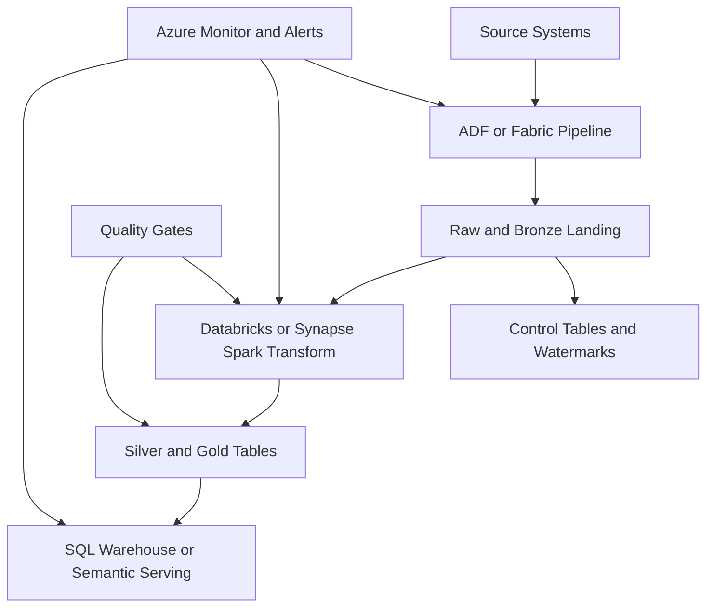
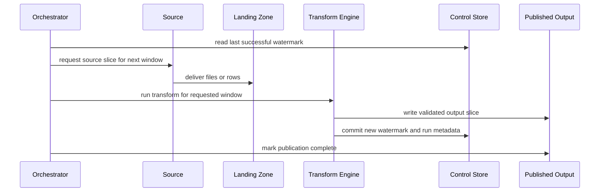
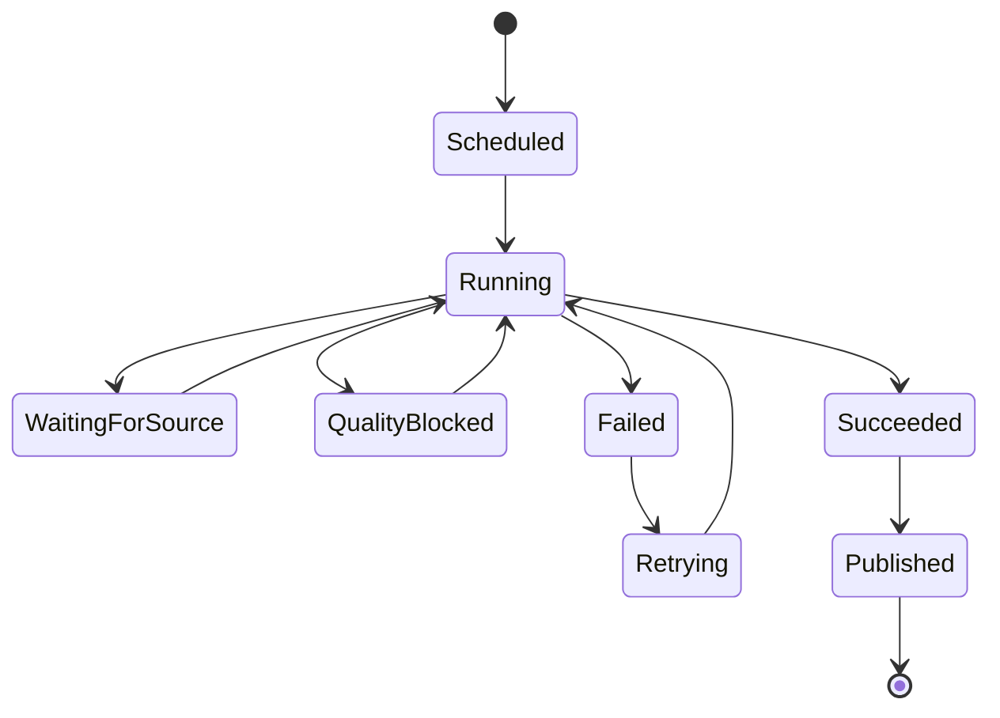

# Batch Pipeline Design

> Part of the **Enterprise Data & AI Architecture Handbook** · Phase-05 - Modern Data Engineering & Lakehouse · Chapter 09.
> Estimated study time: **60 min reading + ~4h labs**.
> **Prerequisites:** read [Azure Data Factory and Synapse](06_Azure_Data_Factory_and_Synapse.md) first.

---

## Executive Summary

Batch pipeline design is the discipline of making repeated, scheduled data processing reliable under imperfect conditions: late-arriving source data, duplicate extracts, broken schemas, partial failures, backfills, storage fragmentation, and cost pressure. The technology choices matter, but the real architecture question is whether the pipeline can be rerun safely, observed clearly, backfilled deliberately, and scheduled economically without corrupting downstream truth. Pipelines that merely succeed on the happy path do not meet enterprise requirements.

For Azure-first enterprises, the most pragmatic batch-pipeline architecture usually combines ADLS Gen2 or OneLake for durable storage, a medallion-aligned data layout as described in [Medallion Architecture](03_Medallion_Architecture.md), Azure Data Factory or Fabric pipelines for orchestration where appropriate, Azure Databricks or Synapse Spark for heavy distributed transformation, and curated SQL-serving or semantic layers for downstream consumption. The core engineering principles are consistent regardless of tooling: idempotent inputs and outputs, deterministic incremental boundaries, explicit watermarks, recoverable state, bounded backfill plans, well-defined SLAs, and cost-aware scheduling.

The most important conceptual correction is that batch pipelines rarely provide magical end-to-end exactly-once behavior. What serious systems usually provide is effectively-once business correctness through idempotent writes, deduplication keys, deterministic partition replacement or merge logic, and carefully governed reprocessing. If that distinction is misunderstood, pipeline teams often overpromise semantics they do not actually enforce.

This chapter focuses on the production design of batch pipelines: idempotency and exactly-once semantics, backfills and reprocessing, partitioning and incremental watermarks, SLAs and retry policy, alerting, and cost-aware scheduling. The goal is to give senior engineers and architects a concrete framework for building batch pipelines that survive real enterprise conditions rather than looking clean only in architecture diagrams.

## Learning Objectives

By the end of this chapter you should be able to:

1. Explain the difference between idempotent batch design and true end-to-end exactly-once semantics.
2. Design batch pipelines that support safe reruns, targeted backfills, and deterministic reprocessing.
3. Choose appropriate incremental-watermark, partitioning, and merge strategies for different source behaviors.
4. Define SLAs, retry policy, and alerting thresholds that reflect business impact rather than scheduler defaults.
5. Distinguish movement, transformation, serving, and orchestration concerns in Azure batch architectures.
6. Design batch pipelines that remain cost-efficient as data volume and pipeline count grow.
7. Decide when to use ADF, Databricks, Synapse, Fabric, or open orchestration stacks for batch workloads.
8. Build observability and operational playbooks that support incident response and controlled recovery.
9. Apply governance, security, and FinOps discipline to enterprise batch processing.
10. Defend batch-pipeline architecture decisions in engineer, staff engineer, architect, and CTO review settings.

## Business Motivation

- Most enterprise analytical and reporting workloads still depend on scheduled batch pipelines even when real-time systems exist alongside them.
- Financial close, regulatory reporting, KPI publication, and model-feature refreshes require repeatable and auditable processing windows.
- Business teams need predictable freshness rather than generic claims that data is "updated regularly."
- Data-platform teams need rerun-safe jobs because source defects, schema drift, and operational incidents are inevitable.
- FinOps programs need clear explanations for why compute runs when it does and how scan volume, partition strategy, and retries affect cost.
- Enterprises need a scalable operating model: tens or hundreds of pipelines cannot be supported with human-only runbooks and ad hoc manual corrections.
- Backfills and historical reprocessing are common in real systems, and weak pipeline design turns them into high-risk incidents.

## History and Evolution

- Early batch systems were often file-driven nightly jobs with weak lineage, large restart windows, and manual operational playbooks.
- Warehouse-era ETL tools introduced scheduling, dependencies, and some restartability, but many pipelines still embedded business logic in opaque procedural flows.
- Cloud data lakes and lakehouses expanded scale and flexibility, but also increased the need for explicit idempotency, partitioning, and reprocessing design because storage is cheaper and more open.
- Distributed compute engines made historical reprocessing technically easier, yet also made careless full-rebuild habits more expensive.
- Modern medallion architectures clarified that raw replay, curated transformation, and serving contracts are separate responsibilities, not one giant batch job.
- Orchestration platforms such as ADF, Databricks Workflows, Airflow, and Fabric pipelines improved scheduling and dependency control, but they do not automatically solve business-correctness semantics.
- Mature enterprises now treat batch pipelines as productized operational systems with SLAs, error budgets, incident playbooks, and cost ownership rather than just cron-driven data movement.

## Why This Technology Exists

Batch pipeline design exists because many business processes do not require millisecond updates, but they do require reliability, scale, and auditability. Source systems often publish in files, scheduled extracts, CDC windows, or periodic APIs. Consumers often need hourly, daily, or business-window freshness rather than continuous streaming. Batch remains the economically and operationally sensible default for many of those workloads.

The design discipline exists because the hard part is not launching a scheduled job. The hard part is proving that reruns are safe, partial failures are detectable, late data is handled consistently, historical reprocessing is bounded, and consumer contracts remain stable under repair operations. Without that discipline, batch pipelines become a hidden operational debt layer beneath otherwise modern architectures.

It also exists because platform teams need predictable ways to reason about time and change. Watermarks, partitions, processing windows, retries, and backfills are the control mechanisms that let the platform distinguish a new increment from a repeated one and a targeted repair from an accidental duplicate load.

## Problems It Solves

| Problem | How disciplined batch design helps | Enterprise signal that it is working |
|---|---|---|
| repeated reruns create duplicates | idempotent writes and deterministic keys prevent double counting | rerunning a failed window does not change correct output |
| late-arriving data breaks daily reports | watermark and partition logic absorb controlled lateness | KPI revisions are explainable and bounded |
| historical corrections are hard | backfill strategy and replayable raw data make selective repair possible | teams reprocess days or partitions without rebuilding everything |
| SLAs are vague | explicit freshness and completion targets define support expectations | consumers know when data is late and how late |
| scheduler success hides business failure | tests and alerting separate movement success from data-product correctness | jobs can be "green" only when output is correct enough |
| cost grows faster than value | cost-aware schedule and incremental logic reduce wasted full refreshes | compute spend grows more slowly than data volume |
| operational knowledge lives in a few people | runbooks and observability make recovery explicit | on-call response becomes repeatable |
| many pipelines become unmanageable | standard batch patterns scale across teams and domains | new pipelines look consistent and are easier to support |

## Problems It Cannot Solve

- It cannot fix poor source-system semantics or missing business ownership.
- It does not remove the need for streaming where latency requirements are genuinely real-time.
- It cannot guarantee end-to-end exactly-once correctness if upstream systems resend ambiguous or unordered data without usable keys.
- It is not the strongest pattern for event-driven operational decisions that require immediate action.
- It cannot make full historical reprocessing cheap if storage layout and partition strategy are poor.
- It does not eliminate the need for semantic-layer discipline, curated marts, or downstream contract management.
- It cannot compensate for weak network, identity, or secret-management design in the surrounding platform.
- It should not be used as a pretext to avoid domain-specific data quality and reconciliation work.

## Core Concepts

### 8.1 Idempotency versus exactly-once semantics

Idempotency means the same pipeline step can run more than once with the same input and still produce the same final business result. Exactly-once semantics means each logical input affects the final outcome only once end to end. In practice, most enterprise batch systems achieve effectively-once business behavior through idempotent landing, deterministic deduplication, merge-based writes, partition replacement, and controlled replay. Claims of exactly-once should therefore be specific about the system boundary and the guarantees actually enforced.

### 8.2 Incremental watermarks

Watermarks define what slice of source data should be processed next. Common watermark choices include source update timestamps, extract timestamps, monotonically increasing IDs, source LSNs, partition dates, or compound high-watermark tuples. The design question is whether the chosen watermark is stable, replayable, and aligned to source behavior. If not, incremental correctness will drift.

### 8.3 Partitioning and processing windows

Partitioning is both a storage and an operational design decision. Good partition choices bound scan cost, speed up selective reprocessing, and align to consumer patterns. Bad partition choices create tiny files, hot partitions, or unbounded backfill work. Processing windows must also account for source lateness, timezone policy, and business-cutoff definitions.

### 8.4 Backfills and reprocessing

Backfills are deliberate re-executions of historical windows or partitions. Reprocessing may be full historical rebuild, partial partition replacement, or merge-based repair. Mature platforms treat backfills as first-class operations with parameters, safety rails, and cost controls rather than ad hoc "run it again for last month" requests.

### 8.5 SLAs, retries, and alerting

Batch SLAs should define freshness, completion time, and acceptable failure or delay thresholds. Retry policy should reflect failure semantics, not just default scheduler settings. Alerting should distinguish transient retriable issues from business-impacting missed deadlines. Too much alerting creates noise. Too little alerting hides degraded business operations.

### 8.6 Cost-aware scheduling

Scheduling is a cost decision as much as a freshness decision. A pipeline that runs every 15 minutes but has hourly business value is wasting compute. A pipeline that overlaps with warehouse peak time or expensive shared capacities may be operationally correct but economically poor. Cost-aware scheduling optimizes for business value per run, not technical habit.

### 8.7 Batch pipeline contract layers

Strong batch design usually separates:

- source acquisition and landing,
- raw and replayable storage,
- conformance and quality gates,
- curated serving outputs,
- orchestration and operational control.

This separation is what prevents one failed step from requiring a full pipeline redesign or full historical reload.

## Internal Working

### 9.1 Scheduling and dependency resolution

Batch orchestrators evaluate schedule triggers, dependency conditions, and runtime parameters, then submit work to the selected execution surface. The orchestrator's job is to start, order, retry, and report. It is not automatically the source of truth for business correctness.

### 9.2 Window selection and input qualification

Before processing begins, the pipeline determines which source slice belongs to the current run. This may involve reading prior watermark state, comparing source manifests, checking file completeness, or selecting changed rows based on timestamps or LSNs. If this qualification step is weak, every later step inherits ambiguity.

### 9.3 Transformation and persistence path

The pipeline reads the qualified increment, applies conformance logic, deduplicates where required, then writes to target tables through append, merge, replace, or partition overwrite patterns. The persistence mode is the practical expression of idempotency design.

### 9.4 State update and publication

After successful persistence and validation, the pipeline updates its operational state: watermark values, run status, processed manifest IDs, or control-table records. Only then should downstream publication be considered complete. Advancing state too early is one of the most common causes of data loss and silent gaps.

### 9.5 Recovery and replay

On failure, the pipeline either retries within the current run, halts for investigation, or supports a controlled rerun or backfill. Good recovery depends on replayable inputs, deterministic write behavior, and state transitions that are only committed after durable success.

## Architecture

### 10.1 Azure-first batch reference architecture

The common Azure pattern uses ADF or Fabric pipelines for orchestration, ADLS Gen2 or OneLake for raw and curated storage, Azure Databricks or Synapse Spark for distributed transformations, Databricks SQL, Synapse dedicated SQL, Fabric Warehouse, or semantic layers for downstream serving, and Azure Monitor plus target-engine telemetry for observability. The key is not the service list. The key is the contract between landing, state, transformation, and publication layers.

### 10.2 Hybrid enterprise batch architecture

In hybrid environments, self-hosted integration runtimes or controlled private connectors pull source data from on-premises systems into Azure landing zones. Batch transforms then run in cloud compute surfaces with replayable raw storage and parameterized reprocessing logic. This architecture is common because the source side is still private while the analytical side is cloud-scale.

### 10.3 Lakehouse batch architecture

In lakehouse-centered estates, batch pipelines usually land raw or bronze data first, then refine silver and gold outputs incrementally using merge or partition-replacement patterns. This architecture works best when medallion contracts are explicit and downstream marts do not bypass silver-quality boundaries.

### 10.4 ADR example: standardize on idempotent partitioned batch with controlled backfills

**Context:** The enterprise runs many daily and hourly pipelines with mixed full-refresh and append-only behavior. Reruns often create duplicates, backfills are handled manually, and consumers receive inconsistent explanations when data is late or corrected. Compute spend rises because pipelines frequently rebuild entire tables.

**Decision:** Standardize batch pipelines on replayable landing, explicit watermark state, partition-aware processing, and idempotent target writes using merge or partition replacement depending on target semantics. Require parameterized backfill paths and completion SLAs for all business-critical pipelines. Use ADF or Fabric for orchestration and Databricks or Synapse Spark for complex transforms where appropriate.

**Consequences:** Recovery becomes safer, cost decreases through incrementalism, and supportability improves. Teams must invest upfront in source keys, watermark design, control tables, and operational playbooks.

**Alternatives considered:**

1. Keep append-only loads everywhere: rejected because corrections and reruns remain unsafe.
2. Rebuild full tables for every run: rejected because cost and windows become unsustainable at scale.
3. Move all workloads to streaming: rejected because many business SLAs and source systems do not justify the complexity.

## Components

| Component | Primary role | Why it matters | Common failure mode |
|---|---|---|---|
| scheduler or orchestrator | run triggering and dependency control | defines operational cadence | confusing schedule success with data correctness |
| landing zone | replayable raw intake | provides recovery evidence | overwriting raw arrivals |
| control table or state store | watermark and run-state tracking | anchors incremental correctness | advancing state prematurely |
| transformation engine | conformance and aggregation logic | shapes compute cost and scalability | wrong engine for workload complexity |
| target table strategy | append, merge, or replace behavior | determines idempotency semantics | duplicate-prone writes |
| quality gate | contract validation | prevents bad data from becoming published truth | no separation between movement and correctness |
| partition layout | scan and backfill boundary | controls cost and repair scope | misaligned partitions and tiny files |
| alerting path | incident surfacing | makes latency and failure visible | noisy alerts with no actionability |
| backfill mechanism | historical repair control | enables safe replay and recovery | manual reprocessing with no guardrails |
| audit and lineage artifacts | run traceability | supports governance and RCA | missing evidence after incidents |
| serving publication step | consumer-facing completion | protects downstream contracts | publishing before validation finishes |
| cost telemetry | resource and run economics | supports schedule and engine tuning | no attribution by pipeline or domain |

## Metadata

Batch pipelines are metadata-heavy systems.

Important metadata classes include:

- source metadata such as extract timestamps, file manifests, LSNs, offsets, or source version identifiers,
- operational metadata such as run IDs, start and end times, attempt counts, runner identity, and target environment,
- control metadata such as last successful watermark, backfill range, partition list, and replay mode,
- quality metadata such as expectation results, reconciliation totals, and quarantine counts,
- cost metadata such as cluster-hours, scan bytes, SQL cost, or capacity consumption by run,
- governance metadata such as owner, SLA tier, criticality, and downstream exposures.

The engineering rule is simple: if the pipeline cannot explain what it processed, when, and why, it is not production-grade.

## Storage

Storage design determines whether batch pipelines are cheap to rerun or painful to recover.

| Storage concern | Recommended posture | Common mistake |
|---|---|---|
| raw landing | immutable or append-only with provenance | overwriting delivered source files |
| bronze and replay zones | retain enough history for repair and audit | pruning history before consumers stabilize |
| silver and gold tables | choose merge or replace semantics aligned to contracts | mixing staging artifacts with consumer-facing tables |
| partition layout | align to business access and reprocessing windows | partitioning solely by convenience timestamp |
| checkpoints and control records | isolate from analytical tables | storing state in ad hoc notebook variables |
| quarantine data | preserve rejected records with reason codes | dropping bad rows silently |

The strongest batch systems optimize not only for the latest run but also for the next rerun and the next backfill.

## Compute

Compute choice should follow transformation complexity and operational profile.

| Workload class | Best Azure-first surface | Why it fits | Common wrong choice |
|---|---|---|---|
| simple movement and gating | ADF copy plus control logic | efficient orchestration and managed connectors | custom code for routine moves |
| moderate SQL-serving load prep | Synapse dedicated SQL or Fabric Warehouse | curated warehouse behavior where justified | using a warehouse as the raw landing engine |
| complex distributed conformance | Databricks or Synapse Spark | richer handling of joins, merges, and backfills | forcing all complexity into visual orchestration |
| Power BI-centric curated publication | Fabric-aligned paths | good fit for SaaS-centric consumer model | ignoring capacity contention implications |
| CI or test reruns of small windows | smaller dev or isolated compute targets | faster feedback and lower cost | validating every change on full production-sized clusters |

The core compute decision is whether the pipeline is mostly orchestration, SQL serving, or heavy distributed engineering. Confusing those roles causes both cost and support problems.

## Networking

Networking matters because batch pipelines depend on predictable reachability more than glamorous runtime features.

Recommended Azure-first posture:

- use private endpoints or approved private connectivity for storage, SQL, Key Vault, and relevant platform services,
- place self-hosted integration components in controlled network segments with documented egress rules,
- validate DNS and endpoint resolution for every production dependency,
- keep data movement and compute services region-aligned where possible to reduce latency and egress,
- separate source-connectivity incidents from transformation incidents in runbooks,
- document which paths are SaaS-managed versus subscription-managed so incident ownership is clear.

Many batch incidents blamed on schedulers are actually unresolved connectivity, DNS, or source-firewall changes.

## Security

Security for batch pipelines is mostly about narrow identities, secret hygiene, and controlled reprocessing powers.

| Concern | Recommended control |
|---|---|
| service authentication | managed identity or scoped service principals |
| source and sink access | least-privilege grants aligned to pipeline function |
| secret storage | Key Vault or secure CI secret stores |
| backfill permissions | restrict who can trigger historical reprocessing |
| raw data sensitivity | tighter access on landing and quarantine zones than on curated outputs |
| pipeline definition change control | repo-backed code review and protected release paths |
| auditability | retain run history, activity logs, and target-engine access evidence |

One of the highest-risk operations in batch platforms is ad hoc historical rerun by over-privileged operators.

## Performance

Batch performance should be evaluated against business windows, not just total runtime vanity metrics.

| Lever | Why it matters | Typical effect |
|---|---|---|
| incremental windowing | shrinks scan and write volume | shorter runs and lower cost |
| partition-aware writes | bounds work to changed slices | faster reprocessing and lower merge cost |
| source qualification before heavy compute | avoids launching large jobs unnecessarily | lower idle and wasted compute |
| target-specific merge or replace strategy | matches engine strengths | more predictable runtime behavior |
| decoupled quality checks | catches issues early without rebuilding everything | faster failure visibility |
| schedule staggering | reduces contention on shared warehouses or capacities | fewer business-hour slowdowns |

Performance tuning that ignores correctness is dangerous. A faster pipeline that mis-advances its watermark is worse than a slower correct one.

## Scalability

Batch systems scale only when their operational contracts scale with them.

Scalability pressures include:

- number of independent pipelines,
- number of source systems and watermark styles,
- number of backfill requests,
- size and frequency of partitioned outputs,
- concurrency pressure on shared compute and serving surfaces,
- amount of retained history and audit evidence,
- complexity of SLA tiers across domains.

The most common scaling failure is one-off design. A handful of bespoke pipelines may work, but dozens of bespoke pipelines become an unsupportable platform.

## Fault Tolerance

Fault tolerance in batch is mostly about safe retry, safe replay, and bounded blast radius.

| Failure mode | Design response | Remaining responsibility |
|---|---|---|
| transient source outage | retry or delay within SLA window | set retry policy that matches source behavior |
| partial write to target | transactional or replace-safe write pattern | ensure target engine semantics are understood |
| watermark advanced before durable success | state commit only after validation | code and control-table discipline |
| late-arriving source correction | controlled backfill or merge logic | define acceptable lateness contract |
| partition corruption | partition-level rebuild from replayable raw data | retain raw history and repair tooling |
| downstream consumer reads early | publish only after success criteria are met | serving contract discipline |

The engineering principle is to fail closed where possible: do not declare success until the pipeline has produced validated output and durable state.

## Cost Optimization

Batch cost optimization should start with schedule value and increment size, not with VM discounts.

High-value cost levers:

- schedule by business value rather than habit,
- process only changed slices where correctness allows,
- use partition-aware backfills instead of full historical rebuilds,
- separate critical and non-critical windows on shared capacities or warehouses,
- stop publishing duplicate serving copies unless a real consumer need exists,
- use smaller validation environments for CI and test reruns,
- constrain retry storms so repeated failures do not multiply cost,
- retire dormant pipelines and historical artifacts with no governance purpose.

| Lever | Benefit | Risk if overused |
|---|---|---|
| coarse but sufficient schedule | lower compute and orchestration cost | freshness SLA may be missed if coarsened too far |
| incremental watermarks | lower scan cost | silent gaps if watermark logic is wrong |
| partition-level backfills | bounded recovery cost | more operational logic to maintain |
| dedicated off-peak runs | cheaper contention profile | may delay consumer availability |
| selective warehouse publication | lower duplicate storage and load cost | under-serving BI users if applied dogmatically |

Worked FinOps example: assume a sales domain currently rebuilds a 9 TB daily fact and three downstream aggregate tables every two hours on a premium Spark and SQL stack, consuming an illustrative $1,450 per day. Analysis shows only 380 GB of source data changes per run and most consumer queries touch the latest seven days plus monthly aggregates. By switching to watermark-driven incrementals, partition replacement for daily slices, and warehouse publication only for the two aggregates with active BI demand, daily cost falls to roughly $520 in this illustrative case. If the removed full-refresh scans also free shared capacity during business hours, the platform avoids a separate warehouse scale-up decision. The lesson is that cost-aware scheduling is an architecture decision, not a billing afterthought.

## Monitoring

Monitoring should answer whether pipelines are healthy against explicit freshness and completion expectations.

Minimum signals:

- run success rate and total duration,
- lateness against SLA and completion deadline,
- watermark progression and skipped-window detection,
- source completeness and manifest variance,
- quality-failure counts and quarantine volume,
- compute cost per run and per domain,
- retry counts and repeated-failure patterns,
- downstream publication lag.

| Area | Metric | Alert example |
|---|---|---|
| orchestration | failed or delayed runs | business-critical pipeline misses completion SLA |
| correctness | stale or non-advancing watermark | no new processed window for expected source cadence |
| source health | missing manifests or row count drift | source completeness anomaly beyond threshold |
| cost | run cost regression | pipeline cost doubles with no planned volume change |
| quality | critical test or reconciliation failure | gold output blocked due to data-quality breach |
| recovery | repeated retries | same failure recurs across three attempts |

## Observability

Observability should explain why a pipeline was late, wrong, or expensive, not just whether the scheduler says it passed.

Useful observability practices:

- persist run-level metadata, watermark values, and target-version evidence for each batch execution,
- correlate source lateness, partition counts, and target-engine cost across releases,
- retain the parameters used for backfills and replay runs,
- link published outputs to the exact pipeline run that produced them,
- expose quality gates separately from transport and orchestration outcomes,
- compare current partition sizes, runtime, and merge behavior against historical baselines.

### Operational Response Playbook

| Signal | Detection query or check | Immediate remediation |
|---|---|---|
| Watermark stopped advancing but scheduler still shows success | compare control-table state, source manifests, and target partition updates | halt downstream publication, inspect qualification logic, and rerun the missed window explicitly |
| Backfill request threatens production SLA window | estimate partitions, scan volume, and shared-capacity overlap | move backfill to isolated compute or off-peak window and cap scope by partition range |
| Gold pipeline finishes late after source correction day | inspect late-arrival volume, merge cost, and partition skew | widen late-data window temporarily, isolate hot partitions, and communicate revised SLA impact |
| Pipeline cost spikes without more data volume | compare full-refresh frequency, retries, and target-write strategy | disable accidental full refresh, limit retries, and restore incremental path |
| Consumer sees duplicate records after rerun | inspect write semantics, dedup keys, and prior successful state | revert or rebuild affected partitions, repair idempotency bug, and add regression tests before next rerun |

Monitoring tells you the batch is late. Observability tells you whether the root cause is source lateness, bad watermark logic, partition skew, accidental full refresh, or unsafe rerun behavior.

## Governance

Batch governance is mostly about controlling risk around time, state, and historical repair.

Core rules:

- every production pipeline needs an owner, SLA tier, and downstream consumer map,
- control tables, watermark rules, and backfill procedures must be documented,
- raw, quarantine, and curated outputs require distinct retention and access policies,
- historical reprocessing should require approval proportional to business impact,
- orchestration definitions and transformation logic must be version-controlled,
- quality gates should be classified by severity and business consequence,
- duplicate serving outputs should be justified, not assumed,
- run artifacts and incident history should be retained long enough for audit and RCA.

Without governance, batch platforms drift into hidden state machines that only a few operators understand.

## Trade-offs

| Benefit | Trade-off | When the trade-off is acceptable |
|---|---|---|
| predictable scheduled processing | freshness is bounded by schedule | when business does not need real-time response |
| replayable and auditable design | more state and control logic to manage | when correctness and recovery matter materially |
| incremental cost efficiency | greater complexity around watermarks and corrections | when data volume makes full refresh impractical |
| partition-level repair | more storage-layout discipline required | when historical corrections are common |
| simpler than full streaming for many cases | not suitable for urgent operational actions | when latency tolerance is measured in minutes or hours |
| standardized operations | upfront design discipline is higher | when the estate has many pipelines to support |

## Decision Matrix

| Scenario | Recommended choice | Why | When not to use it |
|---|---|---|---|
| hourly or daily curated data products | batch pipeline with incremental state | best balance of simplicity, cost, and correctness | if business requires sub-minute reaction |
| large historical reprocessing needs | partition-aware batch with replayable raw data | supports safe bounded backfill | if source history is not retained or keys are unusable |
| hybrid enterprise ingestion | ADF or equivalent orchestration plus cloud compute | strong managed connectivity and scheduling | if sources are fully event-native and real-time critical |
| lakehouse silver and gold refinement | Databricks or Synapse Spark batch patterns | strong fit for merge and partition operations | if transformations are tiny and warehouse-native only |
| Power BI-centric curated publication | Fabric-aligned batch publication | good SaaS consumer fit | if workload isolation and capacity planning are immature |
| event-driven operational response | streaming or message-driven systems | batch is too delayed | if business impact of lateness is immediate |

## Design Patterns

1. Replay-first landing: store raw inputs with enough provenance to rerun safely.
2. Watermark plus bounded lateness window: process deltas while still accounting for late arrivals.
3. Partition replacement for stable windows: rebuild only affected slices rather than full tables.
4. Merge-based upserts with deterministic keys: support effectively-once business outcomes.
5. Publish-after-validate: do not expose gold outputs until quality and state commits succeed.
6. Backfill as a productized operation: parameterize date range, partition range, and dry-run estimation.
7. Cost-tiered scheduling: align runtime windows to business value and platform contention.
8. Dual-status reporting: separate scheduler status from business-data readiness.

## Anti-patterns

1. Advancing watermarks before target validation completes.
2. Treating append-only writes as safe when source corrections exist.
3. Rebuilding entire historical tables for every small late-arriving slice.
4. Using one-off manual SQL fixes directly on published tables with no replay plan.
5. Running critical backfills on the same capacity and window as executive-report refreshes.
6. Assuming scheduler retries automatically imply safe idempotent behavior.
7. Publishing raw or bronze data directly as consumer truth because deadlines are tight.
8. Letting each pipeline invent its own control-table schema and state semantics.

## Common Mistakes

1. Confusing source event time with reliable processing watermark time.
2. Choosing partition columns only for query pruning and not for reprocessing practicality.
3. Ignoring timezone and business-cutoff definitions in daily windows.
4. Treating a successful copy activity as proof of a correct analytical load.
5. Over-retrying source failures until costs spike and windows collapse.
6. Failing to preserve enough raw data for the first serious audit or backfill.
7. Designing incremental logic without a plan for late or deleted records.
8. Running CI or validation builds on production-sized compute without need.
9. Forgetting that downstream semantic layers may cache or read partially refreshed data.
10. Measuring reliability by green scheduler dashboards instead of trusted consumer outcomes.

## Best Practices

1. Define idempotency semantics explicitly for every write path.
2. Keep watermark state durable, queryable, and change-controlled.
3. Design partition layouts to support both query efficiency and bounded historical repair.
4. Separate raw replay, curated transformation, and consumer publication concerns.
5. Make backfills parameterized, cost-estimated, and approval-aware.
6. Publish SLAs in business language, not only scheduler configuration.
7. Test reruns and late-arrival scenarios before the first production incident.
8. Track cost per run and per output, not just total platform spend.
9. Retain run artifacts and lineage long enough for meaningful RCA.
10. Align batch scheduling to platform contention windows and consumer value.

## Enterprise Recommendations

- Make idempotent batch design the default for hourly and daily analytical pipelines.
- Standardize one control-table or watermark pattern across the platform rather than letting each team improvise.
- Use ADF or Fabric pipelines for orchestration where managed connectivity and scheduling help, but keep heavy engineering on better-fit compute engines.
- Require parameterized backfill capability for all critical data products.
- Treat cost-aware scheduling as part of architecture review, not as a later optimization task.
- Keep medallion boundaries explicit so raw reruns do not leak directly into consumer truth.
- Use isolated compute or windows for large historical repairs when business-critical serving would otherwise be impacted.
- Preserve a clear decision boundary between batch-default workloads and truly streaming-required workloads.

## Azure Implementation

### Service map

| Batch concern | Azure-first implementation | Supporting service |
|---|---|---|
| orchestration | Azure Data Factory or Fabric pipelines | Azure Monitor, Key Vault |
| durable landing | ADLS Gen2 or OneLake | private endpoints, lifecycle rules |
| heavy transformation | Azure Databricks or Synapse Spark | Spark runtime, Delta tables |
| curated SQL-serving output | Synapse dedicated SQL, Databricks SQL, or Fabric Warehouse | Power BI semantic models or direct consumers |
| operational state | control tables in SQL or Delta metadata tables | secure storage and query surface |
| observability | Azure Monitor, Log Analytics, target-engine metrics | action groups and alerting |

### Bicep: storage baseline for replay, quarantine, and checkpoints

```bicep
param location string = resourceGroup().location
param storageAccountName string

resource lake 'Microsoft.Storage/storageAccounts@2023-05-01' = {
	name: storageAccountName
	location: location
	sku: {
		name: 'Standard_ZRS'
	}
	kind: 'StorageV2'
	properties: {
		isHnsEnabled: true
		allowBlobPublicAccess: false
		publicNetworkAccess: 'Disabled'
		supportsHttpsTrafficOnly: true
	}
}

resource raw 'Microsoft.Storage/storageAccounts/blobServices/containers@2023-05-01' = {
	name: '${lake.name}/default/raw'
}

resource bronze 'Microsoft.Storage/storageAccounts/blobServices/containers@2023-05-01' = {
	name: '${lake.name}/default/bronze'
}

resource quarantine 'Microsoft.Storage/storageAccounts/blobServices/containers@2023-05-01' = {
	name: '${lake.name}/default/quarantine'
}

resource checkpoints 'Microsoft.Storage/storageAccounts/blobServices/containers@2023-05-01' = {
	name: '${lake.name}/default/checkpoints'
}
```

### ADF pipeline pattern: parameterized backfill window

```json
{
  "name": "OrdersBatchPipeline",
  "properties": {
    "parameters": {
      "start_date": { "type": "String" },
      "end_date": { "type": "String" },
      "mode": { "type": "String", "defaultValue": "incremental" }
    },
    "activities": [
      {
        "name": "CopySourceWindow",
        "type": "Copy"
      },
      {
        "name": "TransformSilverGold",
        "type": "DatabricksNotebook"
      }
    ]
  }
}
```

### Databricks SQL: idempotent partition replacement for daily gold slice

```sql
DELETE FROM prod.gold.daily_sales
WHERE order_date BETWEEN '{{ var("start_date") }}' AND '{{ var("end_date") }}';

INSERT INTO prod.gold.daily_sales
SELECT
  order_date,
  customer_id,
  gross_revenue,
  order_count
FROM prod.silver.daily_sales_rebuild
WHERE order_date BETWEEN '{{ var("start_date") }}' AND '{{ var("end_date") }}';
```

### PySpark control-table watermark update pattern

```python
from pyspark.sql import Row

next_state = [
    Row(
        pipeline_name="orders_gold_batch",
        last_successful_watermark="2026-07-10T10:00:00Z",
        run_id="20260710_1000_orders_gold"
    )
]

state_df = spark.createDataFrame(next_state)

(state_df.write
    .format("delta")
    .mode("overwrite")
    .option("replaceWhere", "pipeline_name = 'orders_gold_batch'")
    .saveAsTable("prod.control.pipeline_watermarks"))
```

### Azure CLI: schedule runbook example

```bash
az datafactory pipeline create-run \
  --factory-name adf-prod-core \
  --resource-group rg-data-prod \
  --name OrdersBatchPipeline \
  --parameters '{"start_date":"2026-07-01","end_date":"2026-07-07","mode":"backfill"}'
```

Azure implementation note: the strongest Azure batch pattern is usually ADF or Fabric for orchestration, ADLS Gen2 or OneLake for replayable storage, Databricks or Synapse Spark for complex transformation, and a narrow publication layer for curated outputs. The design should make backfill and rerun parameters explicit from the beginning rather than bolt them on after the first major incident.

## Open Source Implementation

Open batch design can be excellent when the platform team is prepared to operate the surrounding control surfaces deliberately.

Reference stack:

- Airflow or Dagster for orchestration,
- Spark on Kubernetes for distributed transformations,
- dbt for curated SQL batch modeling,
- Delta Lake or Apache Iceberg on object storage for idempotent target writes,
- MinIO or cloud object storage for replayable raw and bronze layers,
- Great Expectations for quality gates,
- OpenMetadata or Apache Atlas for lineage and ownership,
- Prometheus, Grafana, and OpenTelemetry for operational visibility.

### Airflow DAG example with backfill parameters

```python
from airflow import DAG
from airflow.operators.bash import BashOperator
from datetime import datetime

with DAG(
    'orders_batch',
    start_date=datetime(2026, 1, 1),
    schedule='0 * * * *',
    catchup=False,
) as dag:
    run_pipeline = BashOperator(
        task_id='run_pipeline',
        bash_command='spark-submit /opt/jobs/orders_batch.py --start {{ ds }} --end {{ ds }}'
    )
```

### Spark SQL incremental merge example

```sql
MERGE INTO gold.daily_sales AS target
USING silver.daily_sales_increment AS src
ON target.order_id = src.order_id
WHEN MATCHED AND src.updated_at >= target.updated_at THEN UPDATE SET *
WHEN NOT MATCHED THEN INSERT *;
```

### Great Expectations batch validation outline

```yaml
expectations:
  - expect_column_values_to_not_be_null:
      column: order_id
  - expect_column_values_to_be_unique:
      column: order_id
  - expect_table_row_count_to_be_between:
      min_value: 1
```

The warning is operational rather than ideological: the open stack can support excellent batch design, but only if the platform team owns orchestration reliability, state management, lineage, and incident response explicitly instead of assuming the tools integrate themselves.

## AWS Equivalent (comparison only)

| Azure-first surface | AWS equivalent | Comparison note |
|---|---|---|
| ADF or Fabric pipelines | Glue workflows, Step Functions, or MWAA | AWS often composes several services rather than one orchestration surface |
| ADLS Gen2 or OneLake | S3 | similar durable raw and curated storage role |
| Databricks or Synapse Spark | Databricks on AWS or EMR | Databricks preserves strong lakehouse parity; EMR offers more self-managed control |
| Synapse dedicated SQL or Fabric Warehouse | Redshift | comparable curated warehouse role with different cost and concurrency model |
| Azure Monitor and Log Analytics | CloudWatch and related analytics tooling | similar observability objective with different integrations |
| Key Vault and managed identity patterns | Secrets Manager and IAM roles | similar secret and identity intent |

Selection criteria: AWS equivalents are strongest when the organization is comfortable composing more platform primitives and explicit IAM patterns around the batch operating model.

## GCP Equivalent (comparison only)

| Azure-first surface | GCP equivalent | Comparison note |
|---|---|---|
| ADF or Fabric pipelines | Cloud Composer or Data Fusion | more compositional than Azure's common orchestration patterns |
| ADLS Gen2 or OneLake | Cloud Storage | similar storage role with different IAM and networking ergonomics |
| Databricks or Synapse Spark | Dataproc or Databricks on GCP | different trade-off between native control and cross-cloud parity |
| Synapse dedicated SQL or Fabric Warehouse | BigQuery | often more serverless-first than Azure warehouse patterns |
| Azure Monitor and Log Analytics | Cloud Monitoring and Cloud Logging | similar monitoring role with different operating surfaces |
| Key Vault patterns | Secret Manager and service accounts | similar secure-runner pattern |

Selection criteria: GCP patterns often bias batch architectures toward BigQuery-centric serving and Dataproc or managed orchestration for transformation. That can be effective, but it changes cost and scheduling assumptions materially.

## Migration Considerations

Recommended migration sequence:

1. Inventory current batch jobs, schedules, data volumes, and downstream consumers.
2. Classify each job by source pattern, watermark type, output contract, and backfill requirement.
3. Design replayable landing and control-table strategy before rewriting transformations.
4. Migrate one critical pipeline with explicit rerun, backfill, and SLA semantics.
5. Add run-level observability and cost attribution before scaling out to many domains.
6. Replace habitual full refreshes with incremental or partitioned rebuilds only after correctness is proven.
7. Separate workloads that truly need streaming from those that only need better batch discipline.

Migration warnings:

- do not migrate schedules without migrating state and recovery design,
- do not keep source data only in ephemeral staging areas,
- do not introduce incremental logic before agreeing on watermark semantics,
- do not let business deadlines force raw or bronze data to become consumer truth permanently.

## Mermaid Architecture Diagrams

### Batch reference architecture



### Incremental run sequence



### Batch state model



## End-to-End Data Flow

An end-to-end batch pipeline typically works like this:

1. The orchestrator triggers a scheduled or parameterized run.
2. The pipeline reads the prior successful watermark from a control store.
3. The source window is qualified through timestamp, manifest, LSN, or partition logic.
4. Raw data is landed into replayable storage with provenance metadata.
5. Transformation jobs build silver and gold slices using merge or partition replacement.
6. Quality checks validate row counts, keys, freshness, and reconciliation thresholds.
7. On success, the pipeline commits the new watermark and run metadata.
8. Curated outputs are published to serving layers or semantic consumers.
9. Monitoring, observability, and cost telemetry are written for the run.
10. If needed later, the same window can be rerun or backfilled with explicit parameters.

## Real-world Business Use Cases

| Use case | Why disciplined batch design matters |
|---|---|
| finance daily close | reruns and late corrections must not double count revenue |
| customer 360 daily refresh | incremental identity and behavioral changes must converge safely |
| feature-store refresh | model training and scoring require reproducible historical windows |
| supply-chain replenishment | overnight snapshots need trustworthy cutoff windows and backfills |
| regulatory reporting | auditability and replayable history are mandatory |
| SaaS usage billing | partitioned recomputation is often needed after source corrections |

## Industry Examples

- Banking: daily regulatory and reconciliation pipelines require bounded lateness, replayability, and explicit historical repair procedures.
- Retail: sales and inventory pipelines need hourly or daily freshness with safe late-arrival handling for returns and store uplifts.
- Healthcare: claims and encounter pipelines require strict auditability and cautious backfill controls.
- Manufacturing: production and maintenance histories often combine batch sensor summaries with operational cutoffs that must be reproducible.
- Telecommunications: usage, billing, and service-quality marts rely on large partitioned batch refreshes with tight cost control.

## Case Studies

### Case study 1: common rerun-duplicate failure story

One of the most frequent enterprise failures is a pipeline that appends data on each rerun because the original design assumed the schedule would never fail mid-window. When a retry or manual rerun occurs, downstream revenue or usage doubles. The lasting fix is never a manual delete alone. It is an idempotent write contract and a durable watermark or partition strategy.

### Case study 2: large backfill cost surprise

Another common failure pattern appears when a business requests a six-month backfill and the team discovers the pipeline only knows how to run "today" logic. The result is all-at-once historical recomputation on shared production compute, often impacting business-hour reporting. Mature platforms avoid this by parameterizing historical windows and estimating backfill cost before execution.

### Case study 3: source-lateness masked by green scheduler status

In many estates, the scheduler shows green because the pipeline ran on time, but the source delivered only part of the window. Reports are then late or wrong without any operational alarm. The lesson is direct: scheduler success must be separated from source completeness and business-readiness success.

## Hands-on Labs

### Lab 1: Build an idempotent daily pipeline

Goal: create a rerun-safe batch load from a source table into a curated daily mart.

Tasks:

1. Define a control table with last successful watermark.
2. Land a source window into raw or bronze storage.
3. Build a silver and gold daily output using partition replacement or merge.
4. Rerun the same date range and confirm the output remains unchanged.

Expected outcome: a daily batch flow with proven idempotent behavior.

### Lab 2: Add a parameterized backfill path

Goal: turn one production-style pipeline into a controllable historical-repair workflow.

Tasks:

1. Add `start_date`, `end_date`, and `mode` parameters.
2. Estimate scan cost for one-week and one-month backfills.
3. Run a targeted historical repair.
4. Document the approval and rollback path.

Expected outcome: a backfill-capable pipeline instead of a schedule-only job.

### Lab 3: Compare Azure orchestration and compute routing

Goal: understand where each Azure surface belongs.

Tasks:

1. Use ADF or Fabric pipeline for orchestration.
2. Run transformation on Databricks or Synapse Spark.
3. Publish one curated output to a SQL-serving surface.
4. Explain why the routing is operationally better than doing everything in one place.

Expected outcome: a workload-routing rationale grounded in architecture, not preference.

### Lab 4: Design alerting for business readiness

Goal: move beyond scheduler-success monitoring.

Tasks:

1. Define freshness and completeness SLAs for one critical pipeline.
2. Create alerts for missed watermark progression, quality failure, and cost regression.
3. Simulate late source arrival.
4. Document the incident response flow.

Expected outcome: alerts tied to business readiness rather than only technical completion.

## Exercises

1. Explain why idempotency is more practical than claiming universal exactly-once semantics.
2. Compare append, merge, and partition replacement for batch outputs.
3. Design a watermark strategy for a source with late and corrected records.
4. Explain when a daily partition is better than an hourly partition and when it is not.
5. Define an SLA and alerting policy for a critical finance pipeline.
6. Compare batch backfills with historical re-streaming approaches.
7. Explain why cost-aware scheduling is an architecture concern.
8. Propose a control-table schema for one production pipeline.

## Mini Projects

1. Backfill toolkit: build a reusable parameterized backfill pattern with dry-run cost estimation.
2. Pipeline control standard: create a shared watermark and run-state framework for multiple domains.
3. Batch-versus-streaming rubric: build a decision guide for your enterprise based on latency, correctness, and cost.

## Capstone Integration

This chapter should be used with [Azure Data Factory and Synapse](06_Azure_Data_Factory_and_Synapse.md) and [Medallion Architecture](03_Medallion_Architecture.md). The ADF and Synapse chapter explains Azure orchestration and SQL-serving surfaces. The medallion chapter explains the layering contract. This chapter explains how scheduled data movement and transformation become operationally safe under those patterns.

Capstone deliverable: design one production-grade batch pipeline for a critical domain, including source qualification, watermark state, partitioning strategy, idempotent writes, backfill procedure, SLA, alerting, and cost model. Then defend the design in an architecture review.

## Interview Questions

1. What is the difference between idempotent batch behavior and exactly-once semantics?
2. How do you choose a reliable incremental watermark?
3. When should you use merge versus partition replacement?
4. Why should raw landing and curated publication be separated?
5. How do you design a safe backfill?
6. What makes a batch SLA meaningful to the business?
7. Why is scheduler success not enough for monitoring?
8. When should a workload move from batch to streaming?

## Staff Engineer Questions

1. How would you standardize watermark and backfill patterns across many teams without forcing every pipeline into the same shape?
2. What evidence would you require before approving an append-only target pattern for a critical data product?
3. How would you decide whether a correction should trigger a targeted partition rebuild or a broader replay?
4. What artifacts and telemetry should be retained to debug correctness and cost regressions after deployment?
5. How would you balance SLA strictness against compute cost in a shared platform?
6. What platform standards would you publish for control tables, retries, and publication semantics?

## Architect Questions

1. Where should orchestration, transformation, control state, and serving sit in an Azure-first batch architecture?
2. When is ADF enough for batch orchestration, and when does the broader platform need Databricks, Synapse, or Fabric capabilities around it?
3. How should backfill permissions, approval, and cost guardrails be designed for regulated workloads?
4. How do you prevent batch pipelines from becoming the hidden source of semantic inconsistency across domains?
5. What is the right boundary between batch and streaming in your enterprise?
6. What is the minimum governance baseline before allowing business-critical pipelines into production?

## CTO Review Questions

1. What business outcomes improve when batch pipelines are designed for reruns, backfills, and explicit SLAs instead of just successful schedules?
2. Where are we currently paying for unnecessary full refreshes, duplicate repairs, or unclear operational ownership?
3. How much platform discipline are we willing to impose to reduce late-data and reprocessing incidents?
4. Which workloads should remain batch even if the organization invests more in streaming?
5. What operating-model changes are required so backfills, retries, and cost controls remain safe under delivery pressure?
6. How will we measure success beyond green scheduler dashboards?

## References

- [Azure Data Factory and Synapse](06_Azure_Data_Factory_and_Synapse.md)
- [Medallion Architecture](03_Medallion_Architecture.md)
- Azure documentation for Data Factory, Synapse, Databricks, ADLS Gen2, Azure Monitor, Key Vault, and managed identity.
- Public architecture guidance and field practices for idempotent batch processing, late data handling, and backfill operations.
- Lakehouse and data-engineering guidance for partitioning, merge semantics, and historical reprocessing.

## Further Reading

- Advanced watermark strategies for out-of-order and corrected source systems.
- Partition design for lakehouse and warehouse hybrid estates.
- FinOps patterns for schedule optimization and backfill cost estimation.
- Operational playbooks for data-product SLAs and business-readiness alerting.
- Comparative batch-orchestration patterns across ADF, Fabric, Airflow, and Databricks Workflows.
- Recovery design for large-scale historical reprocessing and partition repair.