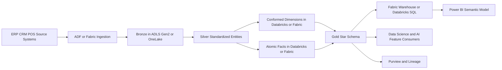
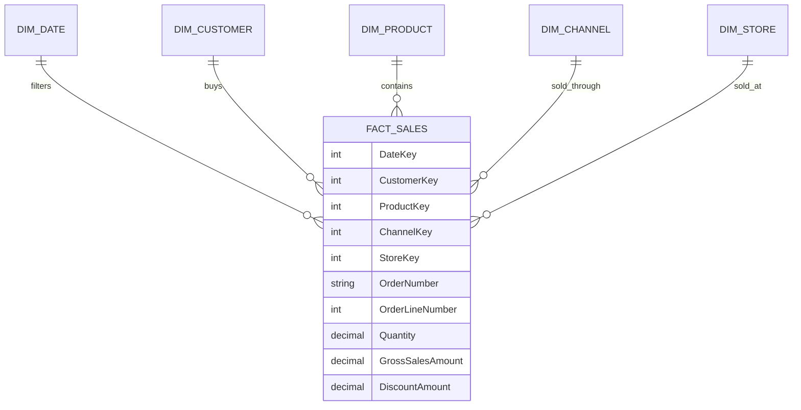
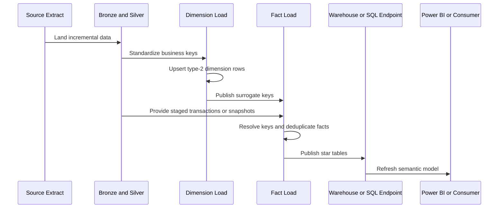

# Dimensional Modeling

> Part of the **Enterprise Data & AI Architecture Handbook** · Phase-06 - Data Modeling & Warehousing · Chapter 01.
> Estimated study time: **60 min reading + ~4h labs**.
> **Prerequisites:** read [Batch Pipeline Design](../Phase-05/09_Batch_Pipeline_Design.md), [Lakehouse Architecture](../Phase-05/02_Lakehouse_Architecture.md), [Medallion Architecture](../Phase-05/03_Medallion_Architecture.md), [Apache Spark Internals](../Phase-05/04_Apache_Spark_Internals.md), [Microsoft Fabric](../Phase-05/07_Microsoft_Fabric.md), [dbt and Analytics Engineering](../Phase-05/08_dbt_and_Analytics_Engineering.md), [Delta Lake](../Phase-04/04_Delta_Lake.md), [File Formats](../Phase-04/01_File_Formats.md), [Columnar Storage Internals](../Phase-04/02_Columnar_Storage_Internals.md), [Azure Storage Services](../Phase-03/06_Azure_Storage_Services.md), and [Well-Architected Framework](../Phase-03/07_Well_Architected_Framework.md) first.

---

## Executive Summary

Dimensional modeling is the discipline of turning operationally messy data into analytically stable business facts and dimensions. It is not only a schema style. It is a contract between the business process, the storage engine, the transformation pipeline, and the semantic layer. The central question is not whether a model looks like a star on a whiteboard. The central question is whether analysts, finance teams, operations leaders, and AI feature producers can ask repeatable questions and get numerically consistent answers at acceptable cost and latency.

The key design decision is grain. Once the grain is explicit, facts, dimensions, additive behavior, data quality rules, surrogate-key policy, and downstream performance tuning become tractable. When the grain is vague, every downstream activity degenerates into exception handling: duplicated measures, mismatched joins, unstable dashboard numbers, and endless metric disputes. Most failed dimensional programs are not caused by the absence of tooling. They are caused by teams loading data before they have decided exactly what one row means.

In Azure-first enterprises, dimensional modeling usually sits on top of [Batch Pipeline Design](../Phase-05/09_Batch_Pipeline_Design.md), [Lakehouse Architecture](../Phase-05/02_Lakehouse_Architecture.md), and [Medallion Architecture](../Phase-05/03_Medallion_Architecture.md). Raw and silver data typically live in ADLS Gen2 or OneLake, conformance logic runs in Azure Databricks or Fabric, curated fact and dimension tables are published in Delta, Fabric Warehouse, Synapse dedicated SQL pool, or Azure SQL, and consumers access them through Power BI semantic models, Databricks SQL, or governed SQL endpoints. The model is only successful if these layers agree on business definitions and replay behavior.

Dimensional modeling remains the most pragmatic default for enterprise analytics when the workload is read-heavy, measure-oriented, and business-facing. It is less suitable as the system of record for operational transactions, rapidly changing graph relationships, or raw data preservation. Teams that understand this boundary use dimensional models aggressively for reporting, planning, cost analysis, customer analytics, and governed AI features. Teams that ignore the boundary either over-normalize the analytical estate or force every question into one giant denormalized table that is impossible to govern.

## Learning Objectives

By the end of this chapter you should be able to:

1. Define grain precisely and use it to derive fact and dimension design.
2. Distinguish star schemas from snowflake schemas using performance, governance, and maintainability criteria.
3. Build and govern conformed dimensions with a practical bus matrix.
4. Classify facts as additive, semi-additive, or non-additive and model them correctly.
5. Use degenerate and junk dimensions without creating uncontrolled dimensional sprawl.
6. Choose an Azure-first implementation pattern for lakehouse, warehouse, or hybrid analytical platforms.
7. Design dimensional loads that remain idempotent under reruns, backfills, and late-arriving data.
8. Recognize when dimensional modeling is the right serving pattern and when another model is a better fit.
9. Defend dimensional design decisions in engineer, staff engineer, architect, and executive reviews.
10. Build hands-on dimensional marts using Databricks, Fabric, dbt, SQL, and governed semantic layers.

## Business Motivation

- Executives do not fund star schemas; they fund trustworthy revenue, margin, inventory, claims, customer, and risk numbers.
- Business users need stable drill paths such as date, product, customer, geography, channel, and organization without learning source-system join logic.
- Finance and operations teams need historical consistency when source systems change codes, hierarchies, or descriptive attributes.
- Data and AI teams need reusable conformed dimensions so dashboards, notebooks, and models do not each create their own interpretation of customer, product, or account.
- Azure FinOps programs need predictable scan patterns and serving costs; dimensional models reduce random exploratory full-table scans on raw data.
- Governance teams need explicit business ownership, lineage, and data contracts, all of which are easier to express in fact-and-dimension terms than in raw landing tables.
- Platform teams need a serving layer that works well with Power BI, Fabric, Databricks SQL, Synapse, and downstream operational analytics consumers.

## History and Evolution

- Early enterprise reporting often read directly from OLTP systems, creating lock contention, ambiguous metric definitions, and poor performance.
- Bill Inmon popularized enterprise data warehousing with integrated subject-oriented stores; Ralph Kimball emphasized business-process-centric dimensional marts and the bus architecture.
- OLAP cube platforms made dimensional semantics operationally valuable because hierarchies and aggregations mapped naturally onto star schemas.
- MPP databases and cloud warehouses reduced some physical tuning pain, but they did not remove the need for grain, conformed dimensions, and additive fact design.
- [File Formats](../Phase-04/01_File_Formats.md), [Columnar Storage Internals](../Phase-04/02_Columnar_Storage_Internals.md), and [Delta Lake](../Phase-04/04_Delta_Lake.md) moved dimensional models into lakehouse storage, where the same business semantics are now expressed on open table formats and distributed engines.
- [Apache Spark Internals](../Phase-05/04_Apache_Spark_Internals.md) and [Microsoft Fabric](../Phase-05/07_Microsoft_Fabric.md) made dimensional serving possible on elastic compute, but they also exposed poor dimensional design because bad joins become expensive at scale.
- Modern teams now combine dimensional marts with data vault, medallion, semantic layers, and feature stores. Mature platforms preserve raw history elsewhere and use dimensional models as the trusted business-consumption surface.

## Why This Technology Exists

Dimensional modeling exists because most analytical questions are about measurable business events viewed through stable business perspectives. A sales leader asks for net sales by week, product category, and channel. A risk officer asks for exposure by counterparty, portfolio, and month end. A plant manager asks for defects by line, shift, and supplier. These are fact-plus-dimension questions. Modeling them directly around the business question makes analytical systems faster to query and easier to explain.

It also exists because operational source systems are optimized for transaction correctness, not analytical comprehension. Third normal form schemas preserve update efficiency and referential integrity, but they rarely present business measures in a form that BI tools or executives can consume efficiently. Dimensional modeling deliberately spends design effort up front so that hundreds or thousands of downstream queries become simpler, cheaper, and more reliable.

In cloud platforms, dimensional modeling additionally exists as a cost and governance boundary. It keeps raw and silver data flexible while giving the business a curated gold layer whose numbers can be certified, secured, and monitored. In Azure, this boundary usually sits between lakehouse curation and semantic consumption, often implemented using Databricks Delta tables, Fabric Warehouse tables, or SQL-serving marts backed by governed dimensions.

## Problems It Solves

| Problem | Dimensional modeling response | Enterprise signal that it is working |
|---|---|---|
| Business metrics differ across reports | Centralize measures in fact tables and shared dimensions | Revenue in finance and sales dashboards reconciles to the same definition |
| Source schemas are too complex for self-service analytics | Replace source joins with business-oriented stars | Analysts can answer common questions without reverse engineering OLTP models |
| Historical attribute changes break trend reporting | Use surrogate keys and historical dimension rows | Reports reproduce prior-period truth even after customer or product changes |
| Query performance is poor on raw data | Use narrow joins, surrogate integer keys, and aggregated serving tables | Interactive BI remains fast under broad slice-and-dice patterns |
| Data products redefine customer, product, or date differently | Create conformed dimensions and a bus matrix | Domains reuse the same business dimensions across marts |
| Duplicated flags create wide, brittle dimensions | Use junk and degenerate dimensions appropriately | Low-cardinality indicators stay governable without polluting core dimensions |
| Snapshot and balance metrics are mis-aggregated | Separate additive, semi-additive, and non-additive facts | Inventory and balance reporting stop double counting over time |

## Problems It Cannot Solve

- It cannot make undefined business ownership disappear; if nobody owns the definition of net sales or active customer, the schema will not save the program.
- It does not replace raw history retention, CDC lineage, or the replay controls described in [Batch Pipeline Design](../Phase-05/09_Batch_Pipeline_Design.md).
- It is not a good primary structure for high-write operational systems, graph traversal workloads, or event-stream state management.
- It cannot fix poor source data quality by itself; it can only expose, quarantine, and standardize the consequences.
- It should not be the only model in the estate when regulatory traceability demands raw preservation and source-level audit replay.
- It is weak for highly sparse, rapidly mutating wide entities when the dominant questions are not measure-centric.
- It does not remove the need for a semantic layer, access controls, MDM, or catalog governance.

## Core Concepts

### 8.1 Facts, dimensions, and grain

Grain is the exact meaning of one fact row. Examples include one order line per order at time of booking, one account balance per account per day, or one machine defect event per produced unit. Facts store measures at that grain. Dimensions store the descriptive context used to filter, group, secure, and explain those measures. The design sequence is fixed: choose the business process, declare the grain, identify the dimensions, then define the facts.

The most common design error is writing facts first and discovering later that the row actually mixes multiple grains. For example, an order fact that contains both order-header discounts and line-level quantities is ambiguous unless the allocation rule is explicit. Once two incompatible grains share one table, reconciliation becomes a permanent tax.

### 8.2 Star schema versus snowflake schema

A star schema keeps facts in the center and dimensions denormalized enough for straightforward joins. A snowflake schema normalizes some dimensions into additional tables, often to reduce duplication or reflect source hierarchies. On modern analytical engines, stars are usually preferred because they reduce join depth, simplify semantic models, and make business ownership clearer. Snowflakes are justified only when hierarchy reuse, stewardship boundaries, or attribute volatility materially outweigh the extra query and semantic complexity.

Use star schemas as the default for curated business consumption. Use light snowflaking only when it solves a concrete problem such as independently governed geography hierarchies or extremely large, reusable classification trees. Do not snowflake because the source was normalized.

### 8.3 Conformed dimensions and the bus matrix

A conformed dimension is reused consistently across multiple fact tables and business processes. Customer, product, date, organization, and channel are typical examples. Conformance means more than column-name similarity; it means the business meaning, key policy, hierarchy rules, and security treatment are aligned.

The bus matrix is the enterprise planning artifact that maps business processes to conformed dimensions.

| Business process | Grain | Date | Customer | Product | Channel | Geography | Salesperson | Account | Scenario |
|---|---|---|---|---|---|---|---|---|---|
| Sales orders | one order line per booked order | X | X | X | X | X | X |  |  |
| Invoice revenue | one invoice line per posted invoice | X | X | X | X | X | X |  |  |
| Inventory snapshot | one SKU-location-day snapshot | X |  | X |  | X |  |  |  |
| Budget plan | one account-cost-center-month scenario | X |  |  |  | X |  | X | X |
| Claims incurred | one claim line per adjudication event | X | X |  | X | X |  | X |  |

The bus matrix is what prevents each delivery team from inventing a different date, customer, or product definition. In Azure estates it should be versioned like code, reviewed like an ADR, and cataloged in Purview or the enterprise metadata platform.

### 8.4 Additive, semi-additive, and non-additive facts

Additive facts can be summed across all dimensions. Sales amount and units sold are typical examples. Semi-additive facts can be summed across some dimensions but not across time; account balance and inventory on hand are common examples. Non-additive facts such as ratios, percentages, and unit prices should usually be modeled through additive components plus a calculation rule, not stored as a standalone summable number.

If a business metric is semi-additive or non-additive, the model must encode that fact in metadata, semantic logic, and review guidance. Leaving it implicit is a recurring executive-reporting failure mode.

### 8.5 Degenerate and junk dimensions

A degenerate dimension is a business identifier that lives in the fact table because it has no meaningful separate attribute table. Order number, invoice number, claim number, and ticket number are common examples. They are useful for drill-through, reconciliation, and row-level tracing.

A junk dimension groups low-cardinality flags and indicators that do not deserve separate dimensions: order source flag, rush indicator, fraud review flag, gift wrap indicator, or internal test flag. Junk dimensions reduce fact width and preserve consistency for combinations of small indicators. They become harmful only when teams dump unrelated high-cardinality attributes into them.

### 8.6 Surrogate keys, natural keys, and unknown members

Dimensions normally use surrogate keys to isolate analytical history from source-key volatility. Natural keys remain important for lineage, deduplication, and late-arriving matching, but they are not enough when one customer or product has multiple historical versions.

Every enterprise dimensional model should define standard unknown, not applicable, and error members. The unknown-member policy is operational, not academic. It prevents fact loads from failing during upstream lag while making the data-quality issue measurable.

### 8.7 Common fact patterns

The core fact patterns are transaction facts, periodic snapshots, accumulating snapshots, and factless fact tables. Transaction facts capture individual events. Periodic snapshots record state at regular intervals. Accumulating snapshots track milestone progress through a workflow. Factless facts record the occurrence of a relationship or event without numeric measures, such as student attendance or policy eligibility.

## Internal Working

### 9.1 Start from the business process, not the source schema

The correct workflow starts by selecting a business process such as orders, shipments, claims, or balances. The team then declares the grain in a sentence that can survive architecture review. Only after that should it inspect source-system tables and files. Source-driven modeling almost always leaks implementation details into the analytics surface.

### 9.2 Build dimension pipelines before fact publication

Dimensions load first because facts depend on resolved surrogate keys and historical versions. In an Azure lakehouse, raw data lands in ADLS Gen2 or OneLake, cleansing and standardization occur in silver, and dimension conformance runs in Databricks, Fabric Spark, or SQL pipelines. Natural-key deduplication, reference-data enrichment, hierarchy management, and historical row versioning all happen before facts are published.

### 9.3 Resolve surrogate keys at fact load time

Fact loads join staging business keys to current or historically effective dimension rows. For transaction facts, the join often uses the event date between dimension effective-from and effective-to bounds. For periodic snapshots, the chosen time slice must be explicit. When a dimension record is missing, the load either uses an unknown member or creates an inferred member according to platform policy.

### 9.4 Apply idempotent load rules

Dimensional loads must be replay-safe. That normally means:

- transaction facts use a deterministic business key or deduplication key,
- snapshot facts replace or merge the specific time slice they own,
- dimensions treat history rows as versioned entities rather than mutable overwrites,
- backfills rerun bounded date or partition ranges as described in [Batch Pipeline Design](../Phase-05/09_Batch_Pipeline_Design.md).

### 9.5 Publish consumption surfaces separately from conformance logic

The model should expose curated fact and dimension tables separately from staging artifacts. Databricks Unity Catalog schemas, Fabric Warehouses, or Azure SQL marts should isolate consumer-facing objects from pipeline internals. This is where metric names, row-level security, business-friendly descriptions, and semantic-model compatibility are stabilized.

## Architecture

### 10.1 Azure-first reference architecture

The most common enterprise pattern is a hybrid lakehouse-warehouse architecture. Source systems land raw extracts or CDC into ADLS Gen2 or OneLake. Silver tables standardize keys and reference data. Conformed dimensions and base facts are built in Azure Databricks or Fabric using Delta. Consumer-facing stars are served from Delta tables via Databricks SQL, Fabric Warehouse, Synapse dedicated SQL pool, or Azure SQL depending on concurrency, latency, and governance needs. Power BI or another semantic layer sits above the star schema.

### 10.2 Why this architecture works

This pattern preserves the flexibility of the lakehouse while giving the business a governed dimensional contract. It aligns naturally with [Medallion Architecture](../Phase-05/03_Medallion_Architecture.md): bronze preserves raw fidelity, silver standardizes entities, and gold publishes dimensional marts. It also limits the blast radius of change. Source-system changes are absorbed in bronze and silver, while business-facing facts and dimensions move only through governed releases.

### 10.3 ADR example: standardize dimensional marts as the gold analytical contract

**Context:** The enterprise has many raw Delta tables, dozens of Power BI datasets, inconsistent customer and product definitions, and repeated debate over whether dashboards should query silver tables directly. Finance needs historical consistency, while operations want faster delivery.

**Decision:** Standardize gold-layer consumption on dimensional marts with explicit grain statements, conformed dimensions, unknown-member policy, and published bus matrices. Allow silver-table direct consumption only for exploratory engineering workloads, not executive or regulatory reporting.

**Consequences:** Business metrics become more stable, semantic models simplify, and security and lineage are easier to audit. Delivery teams must invest more effort in dimension stewardship and fact-grain review. Some ad hoc analytical use cases may require temporary wide tables outside the certified mart path.

**Alternatives considered:**

1. Query silver tables directly from BI: rejected because business definitions remained inconsistent.
2. Keep a fully normalized enterprise warehouse only: rejected because self-service and semantic consumption stayed too complex.
3. Move all business logic into the semantic layer: rejected because row-level reuse, testing, and reconciliation became weak.

## Components

| Component | Role | Azure-first implementation choices | Common failure mode |
|---|---|---|---|
| fact table | stores measures at declared grain | Delta table, Fabric Warehouse table, Synapse or Azure SQL table | mixed grain in one table |
| dimension table | stores descriptive context and historical rows | Delta, Fabric Warehouse, Azure SQL | natural key used as history key |
| bus matrix | enterprise planning artifact | repo markdown, Purview asset, data-product contract | never updated after initial design |
| surrogate-key service or logic | stabilizes historical joins | SQL identity, sequence, ETL-generated key, governed hashing only when justified | business keys used directly in all facts |
| unknown-member policy | preserves load continuity | standard rows `-1`, `-2`, `-3` with business meaning | null foreign keys and silent load drops |
| orchestration layer | sequences dimension and fact loads | ADF, Fabric pipelines, Databricks Workflows | facts loaded before dimensions are ready |
| semantic layer | business-friendly metrics and security | Power BI semantic model, Databricks SQL, SSAS-compatible model | logic duplicated inconsistently across reports |
| catalog and governance | ownership, lineage, glossary, certifications | Purview, Unity Catalog, platform metadata store | dimensions have no steward |
| quality controls | verify grain and reconciliation | dbt tests, Great Expectations, SQL assertions | only schema-level tests exist |
| monitoring and alerting | detect load, key, and metric failures | Azure Monitor, Log Analytics, Databricks alerts | operational success mistaken for business correctness |

## Metadata

Dimensional models require richer metadata than simple table definitions.

| Metadata class | What to record | Why it matters |
|---|---|---|
| grain metadata | one-sentence row definition for each fact | prevents mixed-grain drift |
| business glossary | definition of each measure and dimension attribute | supports semantic consistency |
| conformance metadata | which dimensions are enterprise-standard and where reused | enables cross-mart comparison |
| history metadata | SCD behavior, effective dates, current-row flag | makes time travel explainable |
| additive behavior | additive, semi-additive, non-additive classification | stops incorrect aggregations |
| data quality metadata | completeness, key-match rates, duplicate counts | makes quality measurable |
| lineage metadata | source systems, transformation job, publication time | supports RCA and audit |
| security metadata | sensitivity label, RLS policy, masking rule | enforces least privilege |
| SLA metadata | refresh cadence, completion target, downstream criticality | informs operations and cost policy |

Purview, Unity Catalog, and semantic-model metadata should agree on these definitions. If the warehouse says one thing and the BI model says another, the platform is already drifting.

## Storage

Storage design affects both query performance and model maintainability.

| Storage question | Recommended posture | Notes |
|---|---|---|
| Where should raw history live? | bronze/silver in ADLS Gen2 or OneLake | dimensional marts are not the raw audit store |
| Where should curated stars live? | Delta for lakehouse-native serving, Fabric Warehouse or SQL for relational serving | choose based on consumer engine and concurrency |
| Should facts be partitioned? | yes, when aligned to load and pruning patterns such as date | over-partitioning creates small files |
| Should dimensions be partitioned? | rarely for small or medium dimensions; selectively for very large history dimensions | query engines often scan entire dimensions cheaply |
| How should files be stored? | columnar formats such as Parquet/Delta as discussed in [Columnar Storage Internals](../Phase-04/02_Columnar_Storage_Internals.md) | rowstore staging is still acceptable in source-aligned landing zones |
| Where do aggregates live? | separate gold aggregate tables or semantic aggregations | keep them derived from atomic facts |

Large fact tables should be laid out for the dominant filter path, usually date first and then one or two high-value pruning columns if the engine supports clustering or liquid clustering. Do not confuse storage partitioning with business grain. They solve different problems.

## Compute

| Workload class | Best Azure-first surface | Why it fits | Wrong default |
|---|---|---|---|
| heavy conformance and large historical joins | Azure Databricks jobs compute or Fabric Spark | handles large-scale dimension and fact builds | forcing it into low-code copy pipelines |
| high-concurrency SQL serving | Fabric Warehouse, Databricks SQL, Synapse dedicated SQL, or Azure SQL | stable SQL endpoint for BI tools | running every dashboard on exploratory notebooks |
| lightweight domain marts | Azure SQL Database or Fabric Warehouse | simpler ops and predictable serving | deploying distributed Spark for tiny marts |
| semantic-layer aggregations | Power BI semantic model or Fabric Direct Lake | user-facing performance and security | embedding all logic only in raw SQL views |
| open-format lakehouse serving | Databricks SQL on Delta | keeps storage and compute loosely coupled | materializing every derived table twice without a reason |

Compute choice follows workload shape. Dimensional modeling does not require a distributed engine for every dimension. It requires the right engine for each layer.

## Networking

Networking is usually ignored until refreshes fail.

- Use private endpoints or approved private connectivity for ADLS Gen2, Fabric endpoints where supported, Azure SQL, Key Vault, and monitoring sinks.
- Keep Databricks, storage, warehouse endpoints, and BI gateways region-aligned unless there is a deliberate disaster-recovery reason not to.
- For hybrid source ingestion, isolate self-hosted integration runtimes or VPN-connected connectors from the curated serving layer.
- Document egress paths from semantic tools to serving engines; many "slow model" incidents are actually gateway or DNS problems.
- Align network design with [Azure Storage Services](../Phase-03/06_Azure_Storage_Services.md) and [Well-Architected Framework](../Phase-03/07_Well_Architected_Framework.md) guidance, not ad hoc firewall changes.

## Security

| Concern | Recommended control |
|---|---|
| sensitive dimension attributes | classify and tag in Purview or Unity Catalog; mask where direct access is not required |
| row-level entitlements | enforce in semantic model, warehouse security, or both; keep business ownership explicit |
| secret management | Managed Identity and Key Vault instead of embedded credentials |
| privileged backfills | restrict who can rerun historical facts or rebuild dimensions |
| personally identifiable information | separate analytical keys from source identifiers and minimize raw PII exposure in gold |
| auditability | retain load lineage, steward approvals, and RLS rule history |

Security failures in dimensional platforms are often governance failures first. The dangerous moment is usually not storage compromise; it is the quiet replication of sensitive attributes into too many marts and semantic datasets.

## Performance

Dimensional modeling is performant when the physical implementation respects the logical design.

- Use integer surrogate keys or narrow stable keys for join efficiency in relational-serving layers.
- Keep dimensions wide enough for usability but not so wide that every consumer drags hundreds of cold attributes through every query.
- Materialize aggregate tables for repeated executive rollups instead of forcing every query to scan atomic facts.
- Use date-driven partitioning and engine-native clustering on large facts.
- Benchmark star schema joins on the chosen engine; some engines handle snowflakes acceptably, but the semantic and governance penalties still remain.

Practical tuning guidance for Azure:

| Pattern | Azure recommendation | Why |
|---|---|---|
| large sales transaction fact | Delta or Warehouse fact partitioned by business date | supports incremental load and pruning |
| daily balance snapshot | partition by snapshot date; expose point-in-time semantic logic | respects semi-additive behavior |
| heavily reused dimensions | cache or replicate small dimensions in serving engine | reduces repeated shuffle or remote lookups |
| Power BI Direct Lake or DirectQuery | keep stars simple and avoid unnecessary snowflaked join chains | improves interactive query plans |

## Scalability

Scalability in dimensional modeling is mostly organizational and semantic before it is technical.

- Conformed dimensions let new marts scale without redefining core entities.
- Bus matrices keep domain teams aligned as the number of business processes grows.
- Atomic facts plus derived aggregates scale better than custom summary tables built independently by each team.
- Domain-specific marts should reuse shared dimensions and standards rather than branching into isolated local definitions.
- Very large dimensions with type-2 history require careful current-row indexing, change windows, and steward ownership.

On Azure, lakehouse storage plus elastic compute scales volume well, but only if governance stops every team from cloning the same star into multiple workspaces and capacities.

## Fault Tolerance

Dimensional systems fail safely only when model design and pipeline design cooperate.

- Facts must be reloadable for a bounded time window without creating duplicates.
- Dimensions must support late-arriving changes and unknown members so operational timing issues do not become platform outages.
- Periodic snapshots should replace the targeted period atomically instead of appending blindly.
- Conformed dimensions need versioned release and rollback procedures because one broken dimension can corrupt multiple marts.
- Reconciliation queries should compare source counts or amounts to published facts on every critical load.

Late-arriving dimension records are especially dangerous. The mature response is not to fail every fact load. It is to use inferred or unknown members, surface the exception, and then repair the facts once the dimension arrives.

## Cost Optimization

The cheapest dimensional model is not the one with the fewest tables. It is the one that minimizes repeated compute, semantic rework, and executive firefighting.

- Keep atomic facts once and derive aggregates from them.
- Rebuild only affected date partitions or snapshot slices, not entire historical facts.
- Use lakehouse storage for scalable raw and silver retention, but publish relational-serving copies only where concurrency or workload isolation justifies them.
- Use semantic aggregations and import models for high-traffic dashboards rather than forcing direct remote scans of atomic facts.
- Review whether small marts actually need Spark; many fit comfortably in Azure SQL or Fabric Warehouse.

Worked FinOps example: assume a daily sales mart full refresh scans 4 TB and consumes 32 DBU-hours per run on an Azure Databricks jobs cluster. At an illustrative blended rate of $0.55 per DBU-hour, that is about $17.60 per day or roughly $528 per month before storage and SQL-serving overhead. If the same mart is redesigned to load only 5 percent changed partitions and uses 7 DBU-hours per day, compute drops to about $115.50 per month. Even if retaining extra silver history adds 2 TB of storage at an illustrative $23 per TB-month, the net monthly cost still improves materially while operational recovery becomes safer. The larger savings usually come from fewer emergency reruns and fewer duplicated semantic datasets, not from storage alone.

## Monitoring

Monitoring should track both platform health and business correctness.

| Metric | Why it matters | Typical threshold |
|---|---|---|
| fact row count by load window | detects missing or duplicated increments | alert on variance outside expected range |
| dimension key match rate | shows missing or invalid surrogate lookups | alert when unknown-member use spikes |
| duplicate business-key count | detects idempotency drift | zero tolerance on critical transaction facts |
| refresh completion time | protects SLA compliance | alert when late against business cutoff |
| query latency by dashboard and semantic model | reveals serving regressions | alert when p95 breaches user experience target |
| data-quality test pass rate | prevents silent publication of bad marts | critical marts require blocking failure policy |
| cost per successful refresh | exposes compute creep | trend by mart, domain, and environment |

In Azure, centralize these signals in Log Analytics and Azure Monitor, and route mart-specific ownership alerts to the actual domain team, not a generic platform mailbox.

## Observability

Observability answers why the metric changed, not only whether the job finished.

- Capture lineage from source extract to silver entity to conformed dimension and published fact.
- Persist load metadata such as source file manifest, run ID, watermark, merge counts, and unknown-member counts.
- Attach steward, owner, SLA tier, and downstream semantic model identifiers to each mart.
- Record query plans or execution summaries for the most expensive dashboard paths.

### Operational response playbooks

| Signal | Detection query or rule | Likely cause | First remediation |
|---|---|---|---|
| unknown-member rate jumps in `FactSales` | SQL: `select load_date, count(*) from FactSales where CustomerKey = -1 group by load_date` | late or broken customer dimension feed | hold dashboard certification, repair dimension load, rerun affected fact partitions |
| duplicate order lines appear after backfill | SQL: `select OrderNumber, OrderLineNumber, count(*) from FactSales group by OrderNumber, OrderLineNumber having count(*) > 1` | missing idempotent merge key in replay | disable downstream refresh, delete or replace affected slice, fix replay key logic |
| semantic-model latency spikes while row counts stay stable | monitor p95 query time and warehouse concurrency | warehouse sizing or join-plan regression | inspect query plans, aggregate hot paths, resize serving surface or adjust semantic design |

## Governance

Dimensional governance is the discipline of deciding who is allowed to define shared business meaning.

- Assign a business steward and a technical owner to every conformed dimension and every high-value fact.
- Require grain statements and additive classification in ADRs or data-product contracts.
- Manage bus matrix changes through review; adding a new conformed dimension is an enterprise event, not a notebook edit.
- Use Purview, Unity Catalog, or the enterprise catalog to publish certified definitions and lineage.
- Align metric definitions between the warehouse and the semantic layer; do not let Power BI measures silently redefine warehouse facts.
- Require change windows and communication for dimension hierarchy changes that affect executive reports.

The governance failure to avoid is local optimization: one team "just adding" a column to its customer dimension that changes the meaning of customer across the enterprise.

## Trade-offs

| Choice | Advantages | Disadvantages | When to prefer it |
|---|---|---|---|
| star schema | fast queries, simple semantics, strong BI fit | duplicated dimension attributes, modeling discipline required | most business reporting and governed analytics |
| snowflake schema | normalized hierarchies, reduced attribute duplication | more joins, harder self-service, weaker semantic simplicity | shared hierarchies with strong stewardship boundaries |
| wide flat table | easy first query, simple export | weak governance, repeated semantics, expensive rebuilds | short-lived exploratory or data-science staging use only |
| data vault plus dimensional marts | strong raw lineage and flexibility | more layers and delivery complexity | large enterprises with many volatile source systems |
| direct raw-lake querying | fast initial delivery | inconsistent metrics, expensive scans, weak business usability | engineering exploration, not certified reporting |

## Decision Matrix

| Requirement | Dimensional model | Normalized OLTP-style model | Data vault | Wide denormalized table |
|---|---|---|---|---|
| executive reporting | strong | weak | medium after marts | medium initially, weak over time |
| self-service BI | strong | weak | weak without marts | medium |
| raw audit fidelity | weak by itself | weak | strong | weak |
| schema agility under source churn | medium | weak | strong | medium |
| metric governance | strong | medium | medium | weak |
| query simplicity | strong | weak | weak | strong initially |
| long-term maintainability | strong with governance | medium | strong with maturity | weak |

Use dimensional modeling when the dominant requirement is governed, reusable analytics on business measures. Do not use it as the only persistence pattern for raw lineage or operational write-heavy systems.

## Design Patterns

1. **Transaction fact:** one row per atomic business event such as order line or claim adjudication line.
2. **Periodic snapshot:** one row per entity per time period, for example inventory by SKU-location-day or balance by account-day.
3. **Accumulating snapshot:** one row per workflow item with milestone dates such as order-to-cash or case handling.
4. **Factless fact:** captures the event or relationship without numeric measures, such as attendance or eligibility.
5. **Role-playing dimension:** one date dimension reused as order date, ship date, invoice date, and due date.
6. **Bridge table:** resolves many-to-many relationships such as customer-to-household or patient-to-diagnosis-group.
7. **Mini-dimension:** isolates rapidly changing low-value attributes from a large customer dimension.
8. **Junk dimension:** groups low-cardinality flags into a governed small dimension.
9. **Degenerate dimension:** keeps business document numbers in the fact table for drill-through and reconciliation.

## Anti-patterns

- One giant fact table that mixes headers, lines, balances, and forecasts at different grains.
- Snowflaking every dimension because the source was normalized.
- Storing percentages and ratios without preserving the additive numerator and denominator.
- Using source natural keys directly for all joins, then discovering historical restatements break prior reports.
- Publishing silver tables as if they were conformed dimensions.
- Treating unknown members as harmless forever instead of driving corrective action.
- Creating separate date dimensions per mart instead of reusing a conformed calendar.
- Duplicating customer logic in the semantic layer because the warehouse dimension is politically unresolved.

## Common Mistakes

- Grain is implied in meetings but never written down in the model.
- Snapshot facts are summed across time and presented as if they were additive.
- A junk dimension is allowed to accumulate high-cardinality attributes until it becomes unqueryable.
- Fact tables store text attributes that should live in dimensions, bloating storage and joins.
- Teams version dimensions informally, producing broken historical joins after hierarchy changes.
- Backfills append duplicate facts because the business key for idempotency was never formalized.
- Power BI or SQL users create local copies of conformed dimensions because the certified version lacks ownership or freshness.

## Best Practices

- Write the grain as a complete sentence and keep it in repository metadata.
- Define additive behavior for every measure and expose it in semantic documentation.
- Standardize unknown, not applicable, and error members across the enterprise.
- Keep conformed dimensions few, strong, and governed; do not declare every local lookup table enterprise-standard.
- Load dimensions before facts and track key-match rates on every run.
- Separate atomic facts from derived aggregates and semantic calculations.
- Use relational-serving surfaces only where they add value over direct lakehouse serving.
- Review star-versus-snowflake decisions with real workload evidence, not habit.
- Tie model changes to downstream semantic-model and report impact analysis.

## Enterprise Recommendations

1. Establish an enterprise bus matrix for finance, customer, product, location, employee, and calendar dimensions.
2. Require every new mart to include grain, steward, SLA, sensitivity, and additive classifications.
3. Standardize an Azure-first gold pattern: Delta or Warehouse facts and dimensions, governed by Unity Catalog or Purview, exposed through Power BI or SQL-serving endpoints.
4. Prefer star schemas for published marts; require explicit review before adopting snowflake or wide-table exceptions.
5. Keep raw history and CDC outside the dimensional mart so replay and traceability remain intact.
6. Treat dimensional conformance as a platform capability, not a one-off project deliverable.
7. Enforce test suites for uniqueness, referential integrity, late-arriving rate, and reconciliation against source totals.
8. Review cost and query-performance metrics monthly for the highest-value marts.

## Azure Implementation

### 31.1 Recommended Azure service map

| Layer | Preferred Azure service | Notes |
|---|---|---|
| ingestion | Azure Data Factory, Fabric Data Factory, or Databricks Auto Loader | choose based on connector needs and platform standard |
| raw and silver storage | ADLS Gen2 or OneLake | align with [Azure Storage Services](../Phase-03/06_Azure_Storage_Services.md) |
| conformance and dimension builds | Azure Databricks Premium or Fabric Spark | strong fit for historical joins and merge logic |
| relational serving | Fabric Warehouse, Databricks SQL, Synapse dedicated SQL pool, or Azure SQL Database | choose for concurrency, cost, and tool compatibility |
| semantic layer | Power BI semantic model, Direct Lake, or DirectQuery | map metric ownership clearly |
| governance | Microsoft Purview plus Unity Catalog where Databricks is used | preserve stewardship and lineage |
| secrets and identity | Managed Identity and Key Vault | avoid embedded passwords |
| monitoring | Azure Monitor, Log Analytics, Databricks SQL alerts | centralize mart and pipeline telemetry |

### 31.2 Example T-SQL star schema

```sql
create table dbo.DimDate (
    DateKey int not null primary key,
    FullDate date not null,
    CalendarYear smallint not null,
    CalendarMonth tinyint not null,
    MonthName varchar(20) not null,
    FiscalYear smallint not null,
    FiscalPeriod tinyint not null
);

create table dbo.DimCustomer (
    CustomerKey int identity(1,1) not null primary key,
    CustomerAltKey nvarchar(50) not null,
    CustomerName nvarchar(200) not null,
    Segment nvarchar(50) not null,
    CountryCode char(2) not null,
    EffectiveFrom datetime2 not null,
    EffectiveTo datetime2 not null,
    IsCurrent bit not null
);

set identity_insert dbo.DimCustomer on;
insert into dbo.DimCustomer
    (CustomerKey, CustomerAltKey, CustomerName, Segment, CountryCode, EffectiveFrom, EffectiveTo, IsCurrent)
values
    (-1, 'UNKNOWN', 'Unknown Customer', 'Unknown', 'ZZ', '1900-01-01', '9999-12-31', 1);
set identity_insert dbo.DimCustomer off;

create table dbo.FactSales (
    DateKey int not null,
    CustomerKey int not null,
    ProductKey int not null,
    OrderNumber nvarchar(40) not null,
    OrderLineNumber int not null,
    Quantity decimal(18, 4) not null,
    GrossSalesAmount decimal(18, 2) not null,
    DiscountAmount decimal(18, 2) not null,
    NetSalesAmount as (GrossSalesAmount - DiscountAmount),
    constraint PK_FactSales primary key (OrderNumber, OrderLineNumber)
);
```

### 31.3 Example fact load with historical dimension lookup

```sql
insert into dbo.FactSales
    (DateKey, CustomerKey, ProductKey, OrderNumber, OrderLineNumber, Quantity, GrossSalesAmount, DiscountAmount)
select
    dd.DateKey,
    coalesce(dc.CustomerKey, -1) as CustomerKey,
    coalesce(dp.ProductKey, -1) as ProductKey,
    s.OrderNumber,
    s.OrderLineNumber,
    s.Quantity,
    s.GrossSalesAmount,
    s.DiscountAmount
from stage.SalesOrderLine s
join dbo.DimDate dd
  on dd.FullDate = cast(s.OrderDate as date)
left join dbo.DimCustomer dc
  on dc.CustomerAltKey = s.CustomerId
 and s.OrderDate >= dc.EffectiveFrom
 and s.OrderDate <  dc.EffectiveTo
left join dbo.DimProduct dp
  on dp.ProductAltKey = s.ProductId
where not exists (
    select 1
    from dbo.FactSales f
    where f.OrderNumber = s.OrderNumber
      and f.OrderLineNumber = s.OrderLineNumber
);
```

This pattern makes the degenerate dimension explicit through `OrderNumber` and prevents duplicate inserts during reruns.

### 31.4 Example Databricks SQL merge for a periodic snapshot

```sql
merge into gold.fact_inventory_snapshot as target
using (
    select
        cast(snapshot_date as date) as snapshot_date,
        product_sk,
        location_sk,
        on_hand_qty,
        on_order_qty,
        inventory_value
    from silver.inventory_snapshot_ready
) as source
on  target.snapshot_date = source.snapshot_date
and target.product_sk = source.product_sk
and target.location_sk = source.location_sk
when matched then update set
    on_hand_qty = source.on_hand_qty,
    on_order_qty = source.on_order_qty,
    inventory_value = source.inventory_value
when not matched then insert *;
```

### 31.5 Example Bicep and CLI

```bicep
param location string = resourceGroup().location

resource storage 'Microsoft.Storage/storageAccounts@2023-05-01' = {
  name: 'stardim${uniqueString(resourceGroup().id)}'
  location: location
  sku: {
    name: 'Standard_ZRS'
  }
  kind: 'StorageV2'
  properties: {
    isHnsEnabled: true
    minimumTlsVersion: 'TLS1_2'
    allowBlobPublicAccess: false
  }
}
```

```bash
az group create --name rg-edai-dimmodel-prod --location westeurope
az deployment group create --resource-group rg-edai-dimmodel-prod --template-file infra/main.bicep
```

For Power BI-heavy estates, a Fabric F64 or larger capacity is commonly the threshold where curated stars plus Direct Lake become operationally attractive, but validate with actual concurrency and semantic-model size rather than generic SKU folklore.

## Open Source Implementation

An enterprise open-source stack for dimensional modeling usually combines object storage, Spark, a table format, orchestration, transformation testing, and a SQL-serving layer.

| Layer | Open-source choice | Notes |
|---|---|---|
| storage | MinIO or cloud object storage | S3-compatible layout works well for lakehouse tables |
| table format | Delta Lake, Iceberg, or Hudi | choose based on engine ecosystem and operational preference |
| transformation | Apache Spark | strong fit for large dimension history and fact builds |
| orchestration | Airflow | schedule dimension-first then fact loads |
| transformation framework | dbt | marts, tests, and documentation |
| serving | Trino, ClickHouse, DuckDB extracts, or PostgreSQL marts | choose per concurrency and workload |
| observability | Prometheus, Grafana, OpenTelemetry | capture pipeline and serving telemetry |
| governance | OpenMetadata or Apache Atlas | publish lineage and steward assignments |

Example dbt model for a transaction fact:

```sql
with sales_order_line as (
    select * from {{ ref('stg_sales_order_line') }}
),
customer_dim as (
    select * from {{ ref('dim_customer') }}
),
product_dim as (
    select * from {{ ref('dim_product') }}
),
date_dim as (
    select * from {{ ref('dim_date') }}
)
select
    dd.date_key,
    coalesce(dc.customer_key, -1) as customer_key,
    coalesce(dp.product_key, -1) as product_key,
    sol.order_number,
    sol.order_line_number,
    sol.quantity,
    sol.gross_sales_amount,
    sol.discount_amount
from sales_order_line sol
join date_dim dd
  on dd.full_date = cast(sol.order_date as date)
left join customer_dim dc
  on dc.customer_alt_key = sol.customer_id
 and sol.order_date >= dc.effective_from
 and sol.order_date <  dc.effective_to
left join product_dim dp
  on dp.product_alt_key = sol.product_id
```

Example Airflow outline:

```python
with DAG("sales_dimensional_mart", schedule="0 3 * * *", catchup=False) as dag:
    land_raw = BashOperator(task_id="land_raw", bash_command="python jobs/land_raw.py")
    build_dimensions = BashOperator(task_id="build_dimensions", bash_command="dbt run --select dim_*")
    run_tests = BashOperator(task_id="run_tests", bash_command="dbt test --select dim_* fact_sales")
    build_fact = BashOperator(task_id="build_fact", bash_command="dbt run --select fact_sales")
    publish = BashOperator(task_id="publish", bash_command="python jobs/publish_metrics.py")

    land_raw >> build_dimensions >> run_tests >> build_fact >> publish
```

## AWS Equivalent (comparison only)

| Azure pattern | AWS equivalent | Advantages | Disadvantages | Migration note |
|---|---|---|---|---|
| ADLS Gen2 or OneLake gold star tables | S3 with Glue catalog, Redshift, Athena, or Lake Formation governance | broad ecosystem, mature S3 tooling | governance and serving patterns often split across more services | keep conformed-dimension contracts portable and avoid engine-specific SQL where possible |
| Azure Databricks conformance | Databricks on AWS or EMR Spark | similar Spark-based dimensional builds | networking and IAM posture differ materially | abstract storage paths and secret-management patterns |
| Fabric Warehouse or Synapse serving | Redshift | strong SQL warehouse fit | different workload-management and semantic integration choices | reassess distribution and sort-key strategy |
| Power BI semantic model | QuickSight or third-party BI | native AWS BI option exists | semantic richness and enterprise adoption may differ | separate metric logic from tool-specific visuals |

The core migration principle is to preserve the business grain, conformed dimensions, and additive rules. Service mapping is secondary.

## GCP Equivalent (comparison only)

| Azure pattern | GCP equivalent | Advantages | Disadvantages | Migration note |
|---|---|---|---|---|
| ADLS Gen2 or OneLake plus Delta | GCS plus BigQuery or Dataproc with open table formats | strong serverless analytics and SQL simplicity | semantics may shift toward BigQuery-native patterns | isolate dimensional contracts from storage-engine assumptions |
| Azure Databricks or Fabric Spark | Dataproc or Databricks on GCP | good Spark-based transformation support | governance and cost-control patterns differ | review cluster policy and storage access design |
| Fabric Warehouse or Databricks SQL | BigQuery | low-ops SQL serving, strong scale | different cost model and denormalization incentives | benchmark star joins versus nested or wide-table alternatives |
| Purview plus Unity Catalog | Dataplex plus Data Catalog patterns | integrated Google governance tooling | conformance workflow may need redesign | move steward metadata and glossary explicitly |

GCP often encourages more serverless and nested-data thinking. That can be advantageous, but do not let it erode the discipline of declared grain and conformed dimensions when business comparability matters.

## Migration Considerations

- From normalized OLTP schemas: identify reporting business processes first, then design facts and dimensions instead of translating tables one for one.
- From legacy SSAS or SQL Server warehouse marts: preserve business semantics and conformed dimensions, but reconsider physical tuning for columnar and lakehouse engines.
- From data vault: treat hubs, links, and satellites as integration layers; publish dimensional marts as consumption contracts.
- From raw lakehouse tables: certify only those columns and joins required for business consumption; resist exposing silver as the final mart.
- From on-premises to Azure: separate semantic migration from infrastructure migration so business definitions do not get renegotiated mid-cutover.
- During cutover: run old and new marts in parallel for one or more business cycles and reconcile to agreed tolerance thresholds.

## Mermaid Architecture Diagrams







## End-to-End Data Flow

1. Source systems emit operational transactions, balances, or extracts into raw landing zones.
2. Bronze preserves raw fidelity, while silver standardizes keys, timestamps, currencies, and reference data.
3. Dimension pipelines deduplicate business entities, apply conformance rules, and generate or assign surrogate keys.
4. Historical dimension logic captures changed descriptive attributes through versioned rows when required.
5. Fact pipelines join staged measures to the correct dimension versions and enforce grain-specific deduplication.
6. Quality checks validate row counts, totals, and key-match rates before publication.
7. Gold stars or snapshots are published to the serving surface.
8. Semantic models, SQL consumers, and governed APIs read from the curated mart rather than from silver.
9. Monitoring captures refresh time, quality metrics, cost, and query latency.
10. Observability and lineage allow teams to trace anomalies back to source windows and conformance rules.

## Real-world Business Use Cases

| Use case | Fact grain | Key dimensions | Why dimensional modeling fits |
|---|---|---|---|
| retail sales analytics | one order line per booked sale | date, customer, product, store, channel, promotion | supports revenue, margin, basket, and store-performance slicing |
| inventory management | one SKU-location-day snapshot | date, product, location, supplier | semi-additive balances align naturally to snapshot facts |
| financial planning and actuals | one account-cost-center-month-scenario row | date, account, organization, scenario | planning and actual comparisons use conformed finance dimensions |
| healthcare claims | one adjudication line event | date, member, provider, plan, claim status | supports cost, denial, and utilization analysis |
| manufacturing quality | one produced unit or defect event | date, plant, line, product, supplier, shift | links operational events to stable analysis dimensions |
| subscription analytics | one invoice line or one daily subscriber snapshot | date, customer, plan, region, acquisition channel | enables churn, ARR, cohort, and retention analysis |

## Industry Examples

| Industry | Typical fact tables | Typical dimensions | Frequent modeling pitfall |
|---|---|---|---|
| banking | balances, transactions, fees, exposures | date, account, branch, product, customer, risk segment | summing balances across time |
| insurance | premium, claim, reserve, policy snapshots | date, policy, customer, broker, product, geography | mixing policy and claim grain |
| telecom | usage events, billing lines, service tickets | date, subscriber, plan, device, region, channel | overusing degenerate IDs instead of conformed subscriber dimensions |
| e-commerce | orders, returns, fulfillment, inventory snapshots | date, product, customer, channel, warehouse, campaign | late-arriving returns not reconciled to sales grain |
| energy and utilities | meter reads, outages, work orders | date, asset, customer, geography, tariff, crew | mixing event facts with monthly billing snapshots |

## Case Studies

### Case study 1: omnichannel retail sales mart on Azure

A global retailer consolidated point-of-sale, e-commerce, and returns into a common sales mart on Azure Databricks and Power BI. The initial model joined directly to silver tables and exposed raw order headers and lines to report authors. Revenue appeared correct in small tests but diverged at month end because discounts lived at header grain while units lived at line grain.

The fix was architectural, not cosmetic: declare the fact grain as one order line per booked sale, allocate header discounts explicitly, keep `OrderNumber` as a degenerate dimension, and conform customer, product, date, and channel across stores and digital sales. Query latency dropped because the semantic model stopped rebuilding business logic in DAX, and finance stopped maintaining manual reconciliation spreadsheets.

### Case study 2: daily liquidity and balance reporting

A financial-services team modeled daily balances as if they were additive facts. Quarterly management packs summed end-of-day balances across the month, materially overstating exposure. The warehouse technology worked; the model semantics failed.

The remediation introduced a periodic snapshot fact with explicit semi-additive classification, a required point-in-time semantic calculation, and review controls that blocked any measure definition attempting to aggregate balances over time. This change mattered more than the choice of Synapse versus Fabric because the business question itself was being answered incorrectly.

### Case study 3: manufacturing quality and warranty analytics

A manufacturer built a heavily snowflaked quality mart mirroring its ERP classification tables. Analysts needed defect rate by plant, line, supplier, shift, and component family, but dashboards routinely exceeded latency targets because each query traversed many small hierarchy tables and inconsistent surrogate mappings.

The redesign denormalized the high-value analytical attributes into conformed dimensions, retained the governed source hierarchies in the integration layer, and introduced a bridge table only where the many-to-many supplier-component relationship truly required it. The result was faster dashboards and much clearer steward ownership.

## Hands-on Labs

1. **Azure retail mart lab:** ingest sample order-line data into ADLS Gen2, build `DimDate`, `DimCustomer`, `DimProduct`, and `FactSales` in Databricks or Fabric, then publish a Power BI star-schema model.
2. **Snapshot semantics lab:** build an inventory daily snapshot fact and demonstrate why `on_hand_qty` is semi-additive across time.
3. **Conformed dimension lab:** create one `DimCustomer` reused by both `FactSales` and `FactSupportTicket`, then test cross-domain customer reporting.
4. **Backfill lab:** replay a five-day sales correction window using the idempotent fact-load pattern from [Batch Pipeline Design](../Phase-05/09_Batch_Pipeline_Design.md).

Acceptance criteria for the labs:

- all facts have written grain statements,
- unknown-member logic is implemented,
- duplicate business-key tests pass,
- at least one semantic model or SQL view reads from the gold mart only.

## Exercises

1. Write a one-sentence grain statement for order headers, order lines, and invoice lines. Explain why only one belongs in `FactSales` for net sales analysis.
2. Given a daily account-balance dataset, classify each measure as additive, semi-additive, or non-additive.
3. Design a junk dimension for five low-cardinality sales-order flags and explain why each does or does not belong there.
4. Build a bus matrix for a simple insurance domain with policy, premium, claim, and reserve processes.
5. Decide whether geography should be snowflaked from customer in a retail mart and defend the choice.
6. Explain how you would handle a late-arriving product dimension row without failing the sales fact load.
7. Design a factless fact for employee training attendance and identify the conformed dimensions.
8. Show how a ratio should be modeled using additive components rather than only the ratio itself.
9. Propose an Azure serving surface for a small department mart and justify why Databricks might be unnecessary.
10. Write three data-quality tests that would catch a mixed-grain fact table.

## Mini Projects

1. **Customer 360 sales mart:** combine CRM and ERP extracts into a conformed customer dimension and a sales transaction fact, then publish a customer-profitability dashboard.
2. **Supply-chain snapshot mart:** build inventory, purchase-order, and supplier dimensions with periodic snapshots and late-arriving update handling.
3. **Finance actuals versus budget mart:** design conformed account, cost-center, and scenario dimensions with one monthly fact for actuals and another for budget.

## Capstone Integration

This chapter becomes most valuable when integrated with prior handbook phases:

- Use [Batch Pipeline Design](../Phase-05/09_Batch_Pipeline_Design.md) patterns for idempotent reruns and bounded backfills.
- Use [Lakehouse Architecture](../Phase-05/02_Lakehouse_Architecture.md) and [Medallion Architecture](../Phase-05/03_Medallion_Architecture.md) to separate raw preservation from curated dimensional publication.
- Use [Delta Lake](../Phase-04/04_Delta_Lake.md) storage semantics for merge-based dimension maintenance and snapshot replacement.
- Use [dbt and Analytics Engineering](../Phase-05/08_dbt_and_Analytics_Engineering.md) for testable marts and documentation.
- Use [Microsoft Fabric](../Phase-05/07_Microsoft_Fabric.md) or Azure-first serving surfaces to operationalize the dimensional contract for business users.

## Interview Questions

1. What is grain, and why must it be defined before choosing facts and dimensions?
2. Explain the difference between a fact table and a dimension table using a concrete business example.
3. When would you use a degenerate dimension, and why is it not modeled as a separate table?
4. Give an example of a junk dimension and one example of misuse.
5. What makes a fact additive, semi-additive, or non-additive?
6. Why are surrogate keys preferred over natural keys in historical dimensions?
7. What problem do conformed dimensions solve in an enterprise warehouse?
8. Why is a star schema usually preferred over a snowflake schema for BI consumption?
9. How would you detect that a fact table is accidentally loading duplicates?
10. Why should business users avoid querying silver tables directly for certified reporting?

## Staff Engineer Questions

1. How do you decide whether a dimensional mart belongs in Delta plus Databricks SQL, Fabric Warehouse, or Azure SQL Database?
2. What governance process would you require before declaring a dimension conformed across domains?
3. How would you model a workflow that needs both transaction-level analysis and milestone-duration reporting?
4. How do you prevent a semantic layer from redefining warehouse measures inconsistently over time?
5. Describe a replay-safe design for a transaction fact with late-arriving dimension members.
6. When is snowflaking justified despite the additional query and semantic complexity?
7. How would you benchmark whether a wide denormalized table is outperforming a star schema for the right reasons rather than because the star is poorly implemented?
8. How would you structure ownership and on-call responsibilities for shared conformed dimensions?

## Architect Questions

1. Where should dimensional modeling sit relative to raw retention, MDM, data vault, semantic models, and feature stores in the enterprise architecture?
2. How do you standardize bus-matrix governance without slowing every domain delivery team to a halt?
3. What are the migration steps from a fragmented self-service BI estate to governed conformed dimensions and certified marts?
4. How do you separate logical dimensional design from physical engine choices so cloud migrations remain feasible?
5. What are the security implications of publishing customer and employee dimensions into many downstream domains?
6. How do you design for coexistence between Power BI semantic logic and warehouse-level metric logic?
7. Under what conditions would you let a domain keep a local dimension that is not enterprise-conformed?
8. How would you enforce cost controls when teams keep cloning stars into multiple workspaces and warehouses?

## CTO Review Questions

1. Which business metrics are currently at risk because the enterprise lacks conformed dimensions?
2. What is the commercial impact of inconsistent grain or duplicate fact loads on finance, sales, and compliance reporting?
3. How much platform cost is driven by repeated semantic rework rather than by the dimensional model itself?
4. Which shared dimensions deserve enterprise investment because they reduce duplication across business units?
5. What governance mechanism ensures that customer, product, and finance definitions remain stable during cloud-platform change?
6. When should the enterprise invest in dimensional marts versus relying on raw-lake exploration or tool-local datasets?

## References

- Internal prerequisite chapters:
- [Batch Pipeline Design](../Phase-05/09_Batch_Pipeline_Design.md)
- [Lakehouse Architecture](../Phase-05/02_Lakehouse_Architecture.md)
- [Medallion Architecture](../Phase-05/03_Medallion_Architecture.md)
- [Apache Spark Internals](../Phase-05/04_Apache_Spark_Internals.md)
- [Microsoft Fabric](../Phase-05/07_Microsoft_Fabric.md)
- [dbt and Analytics Engineering](../Phase-05/08_dbt_and_Analytics_Engineering.md)
- [Delta Lake](../Phase-04/04_Delta_Lake.md)
- [File Formats](../Phase-04/01_File_Formats.md)
- [Columnar Storage Internals](../Phase-04/02_Columnar_Storage_Internals.md)
- Canonical sources to study separately:
- Ralph Kimball and Margy Ross, *The Data Warehouse Toolkit*.
- Christopher Adamson, *Star Schema: The Complete Reference*.
- Microsoft documentation for Fabric Warehouse, Power BI semantic models, Azure SQL, Azure Databricks, and Microsoft Purview.
- Databricks documentation for Delta Lake, Unity Catalog, SQL warehouses, and medallion architecture.

## Further Reading

- Revisit [Batch Pipeline Design](../Phase-05/09_Batch_Pipeline_Design.md) for rerun and backfill controls that make dimensional marts reliable.
- Revisit [Delta Lake](../Phase-04/04_Delta_Lake.md) and [Columnar Storage Internals](../Phase-04/02_Columnar_Storage_Internals.md) for the storage and compute behavior underlying star-schema performance.
- Revisit [dbt and Analytics Engineering](../Phase-05/08_dbt_and_Analytics_Engineering.md) for testing, documentation, and deployment workflows around marts.
- Study data-vault-to-dimensional publication patterns for large multi-source programs.
- Study semantic-layer governance patterns for Power BI, Fabric, Looker, and metric-store tooling.
- Study slowly changing dimension strategies in depth before implementing customer, product, or organization history at scale.